# 第六章：维度降低（高级）

“生活很简单，但我们坚持把它变复杂了 - 孔子”

简单是一种美德，无论是在生活中还是在数据科学中都是如此。到目前为止，我们已经讨论了很多算法 - 其中一些足够简单，而另一些则有些复杂。在本书的第一部分，我们学习了更简单的聚类算法，在最后一章中，我们考察了高级聚类算法。同样，在第三章中，我们学习了几个维度算法，如 PCA。在同样的基础上，我们将在本章中学习两种高级降维技术。

本书本部分和下一部分涵盖的高级主题旨在为您准备复杂问题。虽然您可以应用这些高级解决方案，但始终建议从经典解决方案（如 PCA 进行维度降低）开始。如果获得的解决方案不够优秀，则可以尝试高级方案。

在我们有很多变量时，降维是最受追捧的解决方案之一。请回忆一下第三章中讨论过的“维度诅咒”。在继续之前，建议您回顾第三章。我们将在本章中涵盖 t 分布随机邻居嵌入（t-SNE）和多维缩放（MDS）。本章将涉及一些创建我们将讨论的高级技术基础的数学概念。像往常一样，我们将有概念讨论，接着是 Python 实现。本章末尾将有一个简短的案例研究。此外，在本章中，我们也将使用图像数据集开发解决方案！

您的脑海中可能会有一个困惑。需要什么水平的数学知识，深入的统计知识是先决条件吗？答案既是肯定也是否定。虽然，具备数学理解能让您更深入地理解算法并欣赏过程；同时，对于实际业务实现，有时可能想跳过数学直接转向 Python 实现。我们建议您至少具有超过基本的数学理解以充分把握概念。在本书中，我们提供这种数学支持水平而不过度深入 - 实践世界和数学概念的最佳混合。

在本书的第六章中，我们将介绍以下主题：

1.  t 分布随机邻居嵌入（t-SNE）

1.  多维缩放（MDS）

1.  算法的 Python 实现

1.  案例研究

欢迎来到第六章，并祝你好运！

## 6.1 技术工具箱

我们将继续使用与迄今为止相同版本的 Python 和 Jupyter 笔记本。本章中使用的代码和数据集已在`github.com/vverdhan/UnsupervisedLearningWithPython/tree/main/Chapter%206`位置检查过。

在本章中，您需要安装 Keras 作为额外的 Python 库。除此之外，我们还需要常规的库 - numpy、pandas、matplotlib、seaborn、sklearn。使用库，我们可以非常快速地实现算法。否则，编写这些算法是非常耗时和痛苦的任务。

让我们开始学习本书的第六章吧！

## 6.2 多维缩放（MDS）

我喜欢旅行。不幸的是，由于 COVID 大流行，旅行受到了打击。正如您所知，地图在旅行中非常方便。现在，想象一下你被分配了一个任务。你收到了世界各地一些城市之间的距离。例如，伦敦和纽约之间，伦敦和巴黎之间，巴黎和新德里之间等等。然后我们要求您重新创建生成这些距离的地图。如果我们必须重新创建那个二维地图，那将通过试错，我们将做出一些假设并继续进行该过程。这肯定是一项令人疲惫的练习，容易出错，而且确实非常耗时。MDS 可以轻松地为我们完成这项任务。

在考虑上述例子时，请忽略地球不是平的这一事实。并假设距离测量度量是恒定的。例如，英里或公里之间没有混淆。

作为例证，考虑图 6-1。

##### 图 6-1 表示城市之间的距离以及它们在地图上的表示。该图仅用于帮助理解，并不代表实际结果。

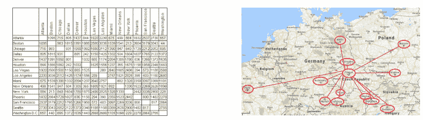

正式地说，如果我们有 x 个数据点，多维缩放（MDS）可以帮助我们将这些 x 点之间的成对距离的信息转换为笛卡尔空间中点的配置。或者简单地说，MDS 将一个大的维度数据集转换为一个较低维度的数据集，并在这个过程中保持点之间的距离或相似度不变。

为了简化，考虑下面的图片。这里有三个点 - A、B 和 C。我们将这些点表示在一个三维空间中。然后我们在二维空间中表示这三个点，最后它们在一维空间中表示。在下图 6-2 中，图中的点之间的距离不是按比例的。图 6-2 中的示例表示降低维度数量的含义。

##### 图 6-2 表示三个点 - 首先我们展示三个点在三维空间中。然后它们被表示在二维空间中，最后在一维空间中。

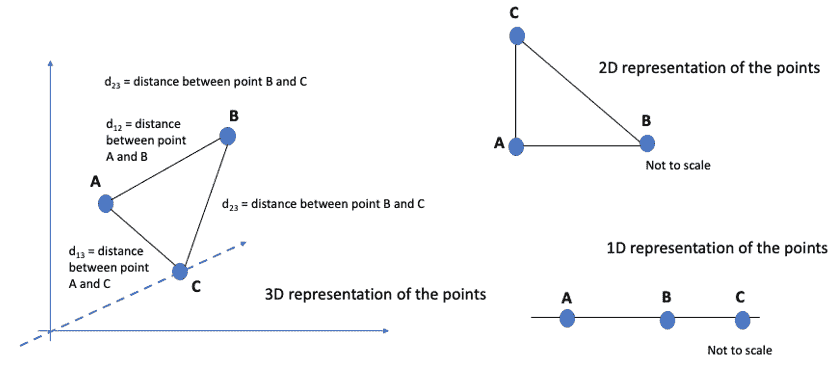

因此，在 MDS 中，多维数据被降低到较低维度。

我们可以有三种类型的 MDS 算法

1.  经典 MDS，

1.  度量多维缩放和

1.  非度量多维缩放。

我们将在书中详细讨论度量 MDS 过程，同时我们将简要介绍经典的和非度量的方法。

想象一下我们有两个点 – i 和 j。假设两点之间的原始距离是 d[ij]，而低维空间中的相应距离是 d[ij]。

在经典 MDS 中，点之间的距离被视为欧几里得距离，原始距离和拟合距离在相同的度量中表示。这意味着，如果在高维空间中使用欧几里得方法计算原始距离，那么在低维空间中计算的拟合距离也是使用欧几里得距离计算的。我们已经知道如何计算欧几里得距离了。例如，我们要找到点 i 和 j 之间的距离，假设距离为 d[ij]。距离可以用方程式 6-1 给出的欧几里得距离公式给出。

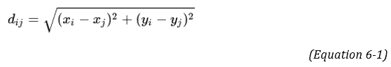

在早些章节中，我们已经讨论过其他距离函数，如曼哈顿距离、汉明距离等。建议你进行复习。

现在我们将来到非度量 MDS。刚才我们注意到欧几里得距离可以用来计算两点之间的距离。有时候无法采用距离的实际值，比如当 d[ij] 是一个实验的结果，主观评价被做出时。换句话说，各个数据参数被分配了一个排名。例如，如果点 2 和 5 之间的距离在原始数据中排名第 4，那么在这种情况下，使用 d[ij] 的绝对值就不明智了，因此必须使用相对值或*排名值*。这就是非度量 MDS 的过程。例如，想象一下我们有四个点 – A、B、C 和 D。我们希望排列这四个点之间的相应距离。点的相应组合可以是 – A 和 B、A 和 C、A 和 D、B 和 C、B 和 D，最后是 C 和 D。它们的距离可以按照表 6-1 中所示的排名进行排列。

##### 表 6-1 代表着四个点之间的相应距离以及距离的排名

| 点对 | 距离 | 相应距离的排名 |
| --- | --- | --- |
| A 和 B | 100 | 3 |
| A 和 C | 105 | 4 |
| A 和 D | 95 | 2 |
| B 和 C | 205 | 6 |
| B 和 D | 150 | 5 |
| C 和 D | 55 | 1 |

因此，在非度量 MDS 方法中，我们不是使用实际距离，而是使用距离的相应排名。现在我们将转向度量 MDS 方法。

我们知道在经典的 MDS 中，原始距离和拟合距离在相同的度量中表示。在*度量 MDS*中，假设通过在数据集上应用一些参数变换，d[ij]的值可以转换为欧几里得距离。在一些文章中，你可能会发现经典 MDS 和度量 MDS 被互换使用。

在 MDS 中，作为第一步，计算点之间的相应距离。一旦计算出相应的距离，MDS 将尝试将更高维的数据点表示为更低维的空间。为了执行此操作，必须进行优化过程，以便选择最合适的结果维数。因此，必须优化一个损失函数或成本函数。

如果你不知道什么是成本函数，请看下面这一节。

#### 成本函数

我们使用算法来预测变量的值。例如，我们可能会使用某种算法来预测下一年产品的预期需求。我们希望算法尽可能准确地预测。成本函数是检查算法性能的一种简单方法。

成本函数是衡量我们算法效果的一种简单技术。它是衡量预测模型性能的最常见方法。它比较算法预测的原始值和预测值，并计算模型在预测中的错误程度。

正如你所想象的，在理想解决方案中，我们希望预测值与实际值相同，这是非常难以实现的。如果预测值与实际值相差很大，成本函数的输出就会更高。如果预测值接近实际值，则成本函数的值较低。一个健壮的解决方案是具有较低成本函数值的解决方案。因此，优化任何算法的目标将是最小化成本函数的值。成本函数也称为*损失函数*，这两个术语可以互换使用。

在度量 MDS 中，我们也可以将成本函数称为**应力**。应力的公式由下面给出的方程式 6-2 给出：

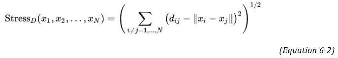

现在让我们来了解方程式：

1.  术语 Stress[D] 是 MDS 函数必须最小化的值。

1.  在较低维空间中具有新坐标集的数据点由 x[, x[2], x[3]…. x[N].] 表示。

1.  术语 ||x[i] – x[j]|| 是它们在较低维空间中的两点之间的距离。

1.  术语 d[ij] 是原始多维空间中两点之间的原始距离。

通过观察方程式，我们可以清楚地理解，如果||x[i] – x[j]||和 d[ij]的值彼此接近，结果应力的值将较小。

最小化应力值是损失函数的目标。

为了优化这个损失函数，可以使用多种方法。其中最著名的方法之一是使用梯度下降法，最初由 Kruskal 和 Wish 于 1978 年提出。梯度下降法非常简单易懂，并可以用一个简单的类比来解释。

想象一下你站在山顶上，想要下来。在这样做的同时，你想选择最快的路径，因为你想尽快下来（不，你不能跳！）。所以，为了迈出第一步，你会四处看看，无论哪条路最陡峭，你都可以朝那个方向迈出一步，然后你会到达一个新的点。然后再次，你会朝最陡峭的方向迈出一步。我们在图 6-3(i) 中展示了这个过程。

##### 图 6-3 (i) 第一幅图是一个站在山顶上并试图下来的人。梯度下降过程遵循这种方法 (ii) 梯度下降过程中成本函数的实际优化过程。注意，在收敛点，成本函数的值是最小的。

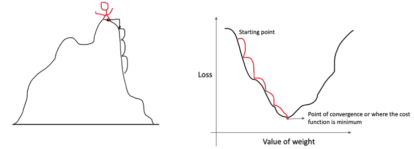

现在，如果一个算法要达到类似的效果，过程可以表示为图 6-3 (ii)，其中损失函数从一个点开始，最终到达收敛点。在这个收敛点，成本函数是最小的。

MDS 与其他降维技术不同。与诸如 PCA 等技术相比，MDS 不对数据集做任何假设，因此可以用于更大类型的数据集。此外，MDS 允许使用任何距离测量度量。与 PCA 不同，MDS 不是一种特征值-特征向量技术。回想一下，在 PCA 中，第一轴捕获最大的方差，第二轴具有下一个最佳方差，依此类推。在 MDS 中，没有这样的条件。MDS 中的轴可以根据需要翻转或旋转。接下来，在大多数其他使用的降维方法中，算法确实计算了许多轴，但无法查看。在 MDS 中，开始时明确选择较小数量的维度。因此，解决方案中的歧义较少。此外，在其他解决方案中通常只有一个唯一的解决方案，而 MDS 尝试迭代地找到可接受的解决方案。这意味着在 MDS 中，对于相同的数据集可能会有多个解决方案。

但与此同时，MDS 所需的计算时间对于更大的数据集要求更高。在用于优化的梯度下降方法中存在一个陷阱。参考图 6-4。让我们参考上一节中提到的山的例子。想象一下，当你从山顶下来时。起点是 A，山的底部在 C 点。当你下来时，你到达了 B 点。正如图 6-4(i) 中所示，B 点周围有一点高度。在 B 点，你可能会错误地得出结论，认为自己已经到达了山底。换句话说，你会认为自己完成了任务。这就是局部最小值的确切问题。

有可能损失函数会陷入局部极小值而不是全局极小值。算法可能会认为已经达到收敛点，而实际上并没有完全收敛，我们仍然处于局部极小值。

##### 图 6-4 虽然第一幅图是收敛点并且代表梯度下降法，但请注意第二幅图中全局极小值在其他地方，而算法可能会陷入局部极小值。该算法可能认为它已经优化了成本函数并达到了全局极小值，而实际上它只达到了局部极小值。

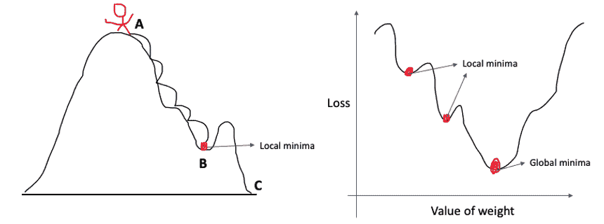

关于 MDS 解决方案的有效性仍有个问题有待解答。我们如何衡量解决方案的有效性？在原始论文中，Kruskal 推荐使用应力值来衡量解决方案的拟合度，这些值显示在表 6-1 中。这些建议大多基于 Kruskal 的经验经验。这些应力值基于 Kruskal 的经验。

| 应力值 | 拟合度 |
| --- | --- |
| 0.200 | 较差 |
| 0.100 | 中等 |
| 0.050 | 良好 |
| 0.025 | 优秀 |
| 0.000 | 完美 |

下一个逻辑问题是 - 我们应该选择多少个最终维度？Scree 图提供了答案，如第 6-5 图所示。回想一下，在第二章，我们使用了类似的肘部法选择了 kmeans 聚类中的最优聚类数。对于 MDS，我们也可以使用肘部法来确定代表数据的最优组件数。

##### 图 6-5  Scree 图来找出最优组件数。与我们在前几章讨论过的 kmeans 解决方案类似；我们需要在图表中找到肘部。


这就结束了我们对 MDS 的讨论。现在我们将转向算法的 Python 实现。

 答题 - 回答这些问题来检查你的理解。答案在书的末尾处

1.  度量和非度量 MDS 算法有什么区别？

2.  梯度下降法用于最大化成本。是 True 还是 False。

3.  使用一个简单的例子解释梯度下降法。

### 6.2.1  MDS 的 Python 实现

现在我们将采用 Python 实现 MDS 方法。我们将使用我们之前使用过的著名的鸢尾花数据集。由于 scikit learn 包中提供的库，算法的实现相当简单。

由于库提供了重要的工作，因此实现通常很简单。

步骤 1：我们首先加载库。通常会用到`sklearn`，`matplotlib`，`numpy`，并且还从`sklearn`加载`MDS`。

```py
import numpy as np
from sklearn.datasets import load_iris
import matplotlib.pyplot as plt
from sklearn.manifold import MDS
from sklearn.preprocessing import MinMaxScaler
import pandas as pd
import warnings
warnings.filterwarnings("ignore")
```

步骤 2：现在加载数据集。鸢尾花数据集在`sklearn`库中可用，因此我们无需在此处导入 excel 或.csv 文件。

```py
raw_data = load_iris()
dataset = raw_data.data
```

步骤 3：MDS 的要求是在实际可视化之前对数据集进行缩放。我们使用`MixMaxScalar（）`函数来实现相同的效果。 MinMax 缩放只是使用以下公式对数据进行缩放：

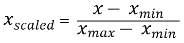

```py
d_scaler = MinMaxScaler()
dataset_scaled = d_scaler.fit_transform(dataset)
```

作为此步骤的输出，数据已经被缩放，准备进行下一步的建模。

步骤 4：我们现在从 sklearn 库中调用 MDS 方法。 random_state 值允许我们重现结果。我们已经决定示例中的组件数量为 3。

```py
mds_output = MDS(3,random_state=5)
```

步骤 5：我们现在将使用 MDS 模型拟合之前创建的缩放数据。

```py
data_3d = mds_output.fit_transform(dataset_scaled)
```

步骤 6：我们现在声明我们希望用于可视化的颜色。接下来，数据点在散点图中可视化。

```py
mds_colors = ['purple','blue', 'yellow']
for i in np.unique(raw_data.target):
  d_subset = data_3d[raw_data.target == i]

  x = [row[0] for row in d_subset]
  y = [row[1] for row in d_subset]
  plt.scatter(x,y,c=mds_colors[i],label=raw_data.target_names[i])
plt.legend()
plt.show()
```

上述代码的输出如下图 6-6 所示：

##### 图 6-6 IRIS 数据的输出

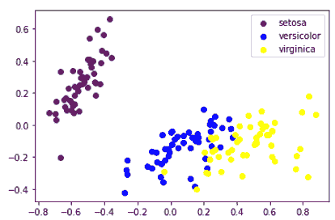

上述 Python 实现示例是 IRIS 数据的可视化。这是一个相当简单的例子，但不涉及*压力*和组件数量的优化。*我们*现在将在一个精心策划的数据集上实施 MDS。

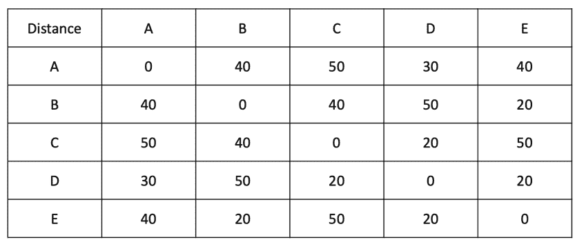

让我们假设我们有五个城市，它们之间的距离分别在表 6-2 中给出。

步骤 1：我们已经在上一个代码中导入了库。

```py
import numpy as np
from sklearn.datasets import load_iris
import matplotlib.pyplot as plt
from sklearn.manifold import MDS
from sklearn.preprocessing import MinMaxScaler
import pandas as pd
import warnings
warnings.filterwarnings("ignore")
```

步骤 2：现在让我们创建数据集。我们在这里创建数据集，但在实际业务场景中，它将仅以距离的形式存在。

```py
data_dummy_cities = {'A':[0,40,50,30,40],
          'B':[40,0,40,50,20],
          'C':[50,40,0,20,50],
          'D':[30,50,20,0,20],
          'E':[40,20,50,20,0],
          }
cities_dataframe = pd.DataFrame(data_dummy_cities, index =['A','B','C','D','E'])
cities_dataframe
```

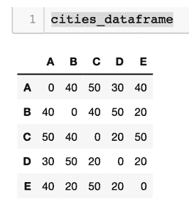

步骤 3：我们现在将使用 MinMaxScalar（）函数来缩放数据集，就像我们在上一个编码练习中所做的那样。

```py
scaler = MinMaxScaler()
df_scaled = scaler.fit_transform(cities_dataframe) 
```

步骤 4：现在，让我们朝着找到最优组件数量的方向前进。我们将迭代不同组件数量的值。对于每个组件数量的值，我们将获得压力的值。当观察到一个拐点时，那就是最优的组件数量。

作为第一步，我们将声明一个空数据框，用于存储组件数量和相应压力值的值。然后，我们在 for 循环中从 1 到 10 进行迭代。最后，对于每个组件值（1 到 10），我们获取相应的压力值。

```py
MDS_stress = []
for i in range(1, 10):
    mds = MDS(n_components=i)
    pts = mds.fit_transform(df_scaled)
    MDS_stress.append(mds.stress_)
```

步骤 5：我们已经得到了压力值。我们现在将这些值绘制在图表中。每个轴的相应标签也给出了。观察值为 2 和 3 的拐点。这可以是最优组件数量的值。

```py
plt.plot(range(1, 10), MDS_stress)
plt.xticks(range(1, 5, 2))
plt.title('Plot of stress')
plt.xlabel('Number of components')
plt.ylabel('Stress values')
plt.show()
```

##### 图 6-7 屏幕图以选择优化的组件数量

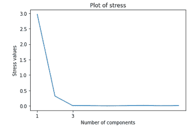

步骤 6：我们现在将运行组件数量= 3 的解决方案。如果我们查看压力值，组件数量= 3，它将生成压力值的最小值为 0.00665。

```py
mds = MDS(n_components=3)
x = mds.fit_transform(df_scaled)
cities = ['A','B','C','D','E']

plt.figure(figsize=(5,5))
plt.scatter(x[:,0],x[:,1])
plt.title('MDS with Sklearn')
for label, x, y in zip(cities, x[:, 0], x[:, 1]):
    plt.annotate(
        label,
        xy = (x, y), 
        xytext = (-10, 10),
        textcoords = 'offset points'
    )
plt.show()
print(mds.stress_)
```

##### 图 6-8 MDS 数据集的输出，在绘图中表示了 5 个城市

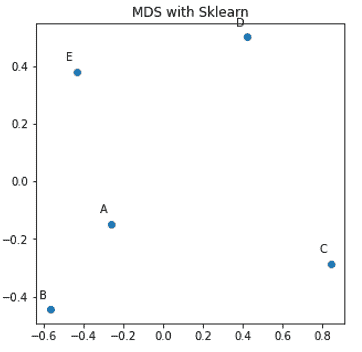

这就结束了我们关于 MDS 算法的部分。我们讨论了基础和概念，优缺点，算法评估以及 MDS 的 Python 实现。它是可视化和降维的一个很好的解决方案。它是非线性降维方法之一。

我们现在将转向 t-SNE，在本章中的第二个降维方法。

## 6.3 t-分布随机邻居嵌入（t-SNE）

如果数据集真的是高维的，分析就变得很麻烦。可视化甚至更加混乱。我们在第二章的维度诅咒部分中对此进行了详细的讨论。建议您在继续之前重新查看这个概念。

这样一个真正高维的数据集可以是图像数据。我们发现很难理解这种真正高维的数据。

您可能在智能手机上使用过人脸识别软件。对于这样的解决方案，必须分析面部图像并训练机器学习模型。看一下下面的图片，图 6-9 中我们有一个人脸，一辆自行车，一台吸尘器和一个游戏的屏幕截图。

##### 图 6-9 图像对算法来说相当复杂，很难解释。图像可以是任何形式的，可以是一个人，或者一台设备，甚至是任何游戏屏幕。


图像是一个复杂的数据点。每个图像由像素组成，每个像素可以由 RGB（红色，绿色，蓝色）值组成。而每个红色、绿色、蓝色的值都可以从 0 到 255。结果数据集将是一个非常高维的数据集。

现在，回顾一下我们在第三章学习的主成分分析（PCA）。PCA 是一种线性算法。作为一种线性算法，它的能力受到限制，无法解决非线性和复杂多项式函数。此外，当一个*高维*数据集必须表示在一个低维空间时，算法应该将类似的数据点保持在彼此附近，这对于线性算法来说可能是一个挑战。PCA 是一种线性降维技术，它试图将不同的数据点分开得尽可能远，因为 PCA 正在尝试最大化数据点之间的方差。结果分析不够稳健，可能不适合进一步使用和可视化。因此，我们有非线性算法如 t-SNE 来帮助。

形式上来说，t-SNE 是一种*非线性降维技术*，非常适用于高维数据。它基于由 Sam Roweis 和 Geoffrey Hinton 开发的随机邻居嵌入。t-分布变体是由 Lauren van der Maaten 提出的。因此，t-SNE 是对 SNE 算法的改进。

在高水平上，SNE 测量高维空间和低维空间中实例对之间的相似性。一个好的解决方案是这些相似度测量之间的差异最小，因此 SNE 通过成本函数优化这些相似度测量。

我们现在将逐步检验 t-SNE 的过程。下面描述的过程在数学上有些繁重。

1.  假设我们有一个高维空间，在这个高维空间中有一些点。

1.  现在我们将度量各个点之间的相似性。对于一个点 x[i]，我们将创建一个以该点为中心的高斯分布。我们在书的前几章已经学习了高斯或正态分布。高斯分布如图 6-10 所示。

##### 图 6-10 高斯或正态分布，我们之前已经学过。图片来源：维基百科。

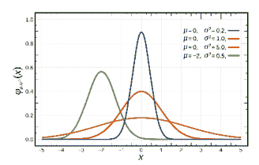

1.  现在，我们将测量在高斯分布下落在该点（比如 x[j]）的点的密度，然后重新归一化它们以获得相应的条件概率(p[j|i])。对于附近和相似的点，这个条件概率会很高，而对于远离和不相似的点，条件概率(p[j|i])的值会非常小。这些概率值是在高维空间中的。对于好奇的人，这个条件概率的数学公式是等式 6-3：

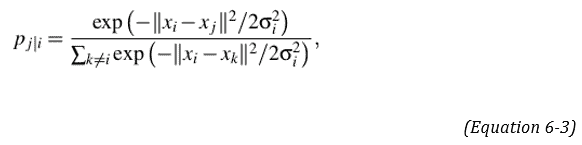

其中σ是以 x[i]为中心的高斯分布的方差。这个条件概率的数学证明超出了本书的范围。

1.  现在我们将在低维空间测量另一组概率。对于这组测量，我们使用*柯西分布*。

#### 柯西分布

1.  柯西分布，属于连续概率分布家族。虽然与正态分布有些相似，正如我们在图 6-11 中表示的，柯西分布的峰值较窄，扩散速度较慢。这意味着，与正态分布相比，远离峰值的值的概率更高。有时，柯西分布也被称为*洛伦兹分布*。有趣的是，柯西分布没有定义良好的均值，但中位数是对称中心。

##### 图 6-11 高斯分布与柯西分布的比较。（图片来源：Quora）

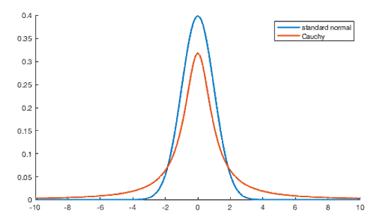

1.  假设我们得到 y[i]和 y[j]作为高维数据点 x[i]和 x[j]的低维对应物。因此，我们可以像上一步那样计算概率分数。使用柯西分布，我们也可以得到第二组概率 q[j|i]。数学公式如下所示，见等式 6-4。

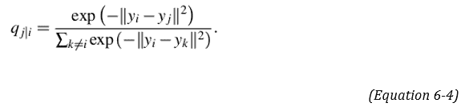

1.  到目前为止，我们已经计算了两组概率（p[j|i]）和（q[j|i]）。在这一步中，我们比较这两个分布并测量两者之间的差异。换句话说，当计算（p[j|i]）时，我们在高维空间中测量了相似性的概率，而对于（q[j|i]），我们在低维空间中进行了相同的操作。理想情况下，如果两个空间的映射相似，那么（p[j|i]）和（q[j|i]）之间就不应该有任何差异。因此，SNE 算法试图最小化条件概率（p[j|i]）和（q[j|i]）之间的差异。

1.  通过使用 Kullback-Liebler 散度或 KL 散度来衡量两个概率分布之间的差异，我们将在这里探讨。

##### KL 散度

KL 散度或相对熵用于衡量两个概率分布之间的差异 - 通常一个概率分布是数据或测量得分。第二个概率分布是原始概率分布的近似值或预测值。例如，如果原始概率分布是 X，近似概率分布是 Y。KL 散度可用于测量 X 和 Y 概率分布之间的差异。绝对来说，如果值为 0，则意味着两个分布相似。KL 散度适用于神经科学、统计学和流体力学。

1.  为了最小化 KL 成本函数，我们使用梯度下降方法。我们已经在讨论 MDS 算法的部分中讨论过梯度下降方法。

1.  在我们研究 t-SNE 时，还有一点非常重要，即一个重要的超参数称为*困惑度*。困惑度是一个超参数，允许我们控制和优化每个数据点的邻近数量。

根据官方文件，困惑度的典型值在 5 和 50 之间。

1.  还可能存在一个额外的细微差别 - t-SNE 算法的输出在连续运行中可能永远不会相同。我们必须优化超参数的值以获得最佳输出。

 流行测验 - 回答这些问题以检查您的理解.. 答案在本书的结尾

1. 解释自己的话语中的柯西分布。

2. PCA 是非线性算法。是还是不是。

3. KL 散度用于衡量两个概率分布之间的差异。是还是不是

现在我们将继续讨论算法的 Python 实现。

### 6.3.1 t-SNE 的 Python 实现

在这个例子中，我们将使用两个数据集。第一个是已知的 IRIS 数据集，在本书中我们已经多次使用过。第二个数据集非常有趣。它是 MNIST 数据集，这是一个手写数字的数据库。它是用来训练图像处理解决方案的最著名的数据集之一，通常被认为是图像检测解决方案的“Hello World”程序。下面显示了图像表示（）。

##### 图 6-12 MNIST 数据集-这是一组手写数字的图像。

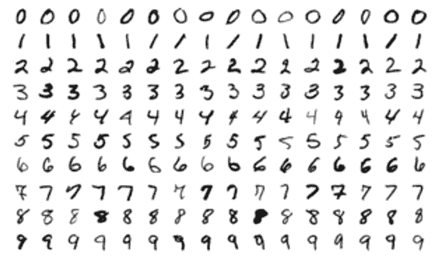

第 1 步：我们将首先导入必要的库。请注意，我们已从 keras 库导入 MNIST 数据集。

```py
from sklearn.manifold import TSNE
from keras.datasets import mnist
from sklearn.datasets import load_iris
from numpy import reshape
import seaborn as sns
import pandas as pd
```

第 2 步：首先我们将使用 IRIS 数据集。我们将加载 IRIS 数据集。数据集包括两部分 - 一部分是“数据”，另一部分是相应的标签或“目标”。这意味着“数据”是数据的描述，“目标”是 IRIS 的类型。我们使用一小段代码打印特征和标签。

```py
iris = load_iris()
iris_data = iris.data
iris_target = iris.target
iris.feature_names
iris.target_names
```

第 3 步：下一步是调用 tSNE 算法。我们使用的组件数量为 2，随机状态为 5，以重现结果。然后使用算法拟合数据。

```py
tsne = TSNE(n_components=2, verbose=1, random_state=5)
fitted_data = tsne.fit_transform(iris_data)
```

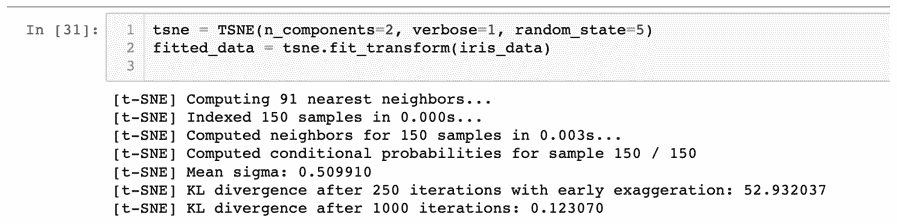

第 4 步：现在我们将绘制数据。此步骤允许我们可视化算法在上一步中拟合的数据。

首先，我们将初始化一个空的数据框架。我们将逐一添加三列。我们将从 iris_target 开始，然后是 tSNE_first_component 和 tSNE_second_component。tSNE_first_component 是 fitted_data 数据框架的第一列，因此索引为 0。tSNE_second_component 是 fitted_data 数据框架的第二列，因此索引为 1。最后，我们将数据表示为散点图。

```py
iris_df = pd.DataFrame()
iris_df["iris_target"] = iris_target
iris_df["tSNE_first_component"] = fitted_data[:,0]
iris_df["tSNE_second_component"] = fitted_data[:,1]

sns.scatterplot(x="tSNE_first_component", y="tSNE_second_component", hue=iris_df.iris_target.tolist(),
                palette=sns.color_palette("hls", 3),
                data=iris_df).set(title="Iris data tSNE projection")
```

##### 图 6-13 IRIS 数据集的 tSNE 投影。请注意，我们为数据集中的三个类别得到了三个单独的聚类

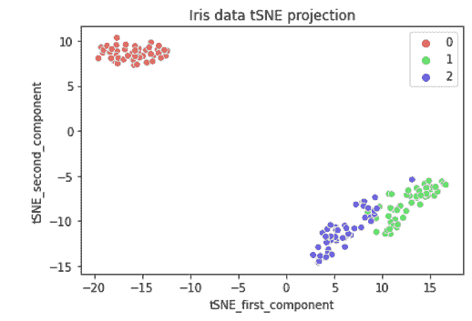

现在我们将为 MNIST 数据集实现算法。

第 1 步：库已经在上一个代码示例中加载。然后我们加载数据集。数据集需要进行 reshape，这在这里完成

```py
(digit, digit_label), (_ , _) = mnist.load_data()
digit = reshape(digit, [digit.shape[0], digit.shape[1]*digit.shape[2]])
Step 2: the subsequent steps are exactly same to the last example we used. 
tsne_MNIST = TSNE(n_components=2, verbose=1, random_state=5)
fitted_data = tsne_MNIST.fit_transform(digit)

mnist_df = pd.DataFrame()
mnist_df["digit_label"] = digit_label
mnist_df["tSNE_first_component"] = fitted_data[:,0]
mnist_df["tSNE_second_component"] = fitted_data[:,1]

sns.scatterplot(x="tSNE_first_component", y="tSNE_second_component", hue=mnist_df.digit_label.tolist(),
                palette=sns.color_palette("hls", 10),
                data=mnist_df).set(title="MNIST data T-SNE projection")
```

##### 图 6-14 tSNE 对表示为不同颜色的 10 类数字的输出。

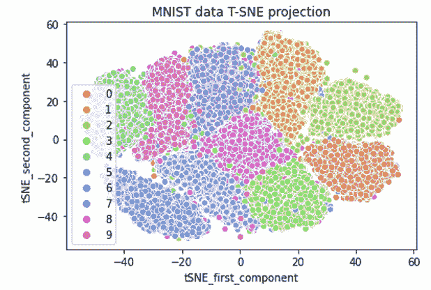

在运行 tSNE 时，请记住以下几个重要点：

1.  在最终确定解决方案之前，用不同的超参数值运行算法。

1.  理想情况下，perplexity 应该在 5 和 50 之间，对于优化的解决方案，perplexity 的值应该小于数据点的数量。

1.  tSNE 猜测每个点的近邻数。因此，密集的数据集将需要更高的 perplexity 值。

1.  特别需要注意的是 perplexity 是一个超参数，它平衡了对数据的局部和全局方面的关注。

tSNE 是广泛流行的算法之一。它用于研究区域的拓扑，但单个 tSNE 不能用于做出最终评估。相反，应创建多个 tSNE 图来做出任何最终推荐。有时会有人抱怨 tSNE 是一个黑箱算法。在某种程度上这可能是真的。使 tSNE 的采用变得更加困难的是，在连续迭代中它不会生成相同的结果。因此，你可能只会发现 tSNE 被推荐用于探索性分析。

这就结束了我们关于 tSNE 的讨论。现在我们将转向案例研究。

## 6.4 案例研究

请回忆第三章，我们探讨了运用降维技术在电信业的案例研究。在本章中，我们将研究一个小案例，应用 tSNE 或 MDS 进行降维。

你听说过高光谱图像吗？如你所知，我们人类主要看到可见光的颜色有长波长、中波长和短波长三个波段。长波长被感知为红色，中波长为绿色，短波长为蓝色。而频谱成像则将光谱分成许多更多的波段，这种技术可以扩展到可见光以外的波段，因此在生物学、物理学、地球科学、天文学、农业等许多领域都有用途。

高光谱成像收集并处理来自整个电磁波谱的信息。它获取图像中每个像素的光谱。

##### 图 6-15《糖端》土豆条的高光谱图像显示了看不见的缺陷（图片来源：维基百科）

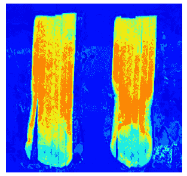

一个这样的数据集可能是 Pavia 大学数据集。这个数据集是由 ROSIS 传感器在意大利北部的 Pavia 获取的。数据集的详细信息如下，并且可以从（`www.ehu.eus/ccwintco/uploads/e/ee/PaviaU.mat www.ehu.eus/ccwintco/uploads/5/50/PaviaU_gt.mat`）下载。

在此数据集中，光谱波段为 103，HIS 尺寸为 610*340 像素，包含 9 类。这种类型的数据可以用于作物分析、矿物检查和勘探等。由于此数据包含有关地质图案的信息，因此对于科学目的非常有用。在开发任何图像识别解决方案之前，我们必须减少此数据集的维度数量。此外，如果维度数量较大，计算成本将会更高。因此，显然应该有较少的代表性维度数量。以下显示了一些示例波段。建议您下载数据集（也已在 git Hub repo 中检入）并在数据集上使用各种降维技术以减少维度数量。

##### 图 6-16 数据集中波段的例子。这只是随机的例子，建议您加载数据集并运行降维算法。

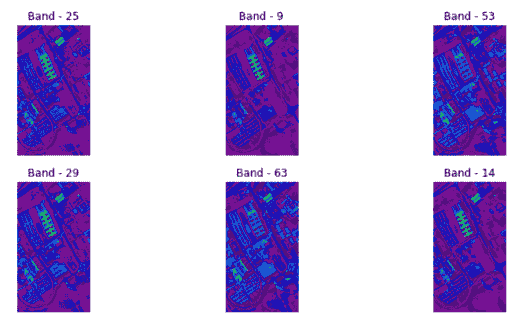

tSNE 和 MDS 可以在许多其他图像数据集和复杂的商业问题中发挥实际作用。下一步列出了一些此类数据集。

## 6.5 总结

维度缩减是一种非常有趣且有用的解决方案。它使得机器学习变得更加经济高效。想象一下，你有一个包含成千上万个属性或特征的数据集。你对数据了解不多；业务理解很少，同时你需要在数据集中找到模式。你甚至不确定这些变量是否都是相关的，还是只是随机噪声。在这样一个时刻，当我们需要快速降低数据集的维度，使其更加易于处理并减少时间时，维度缩减就是解决方案。

我们在书中较早地介绍了维度缩减技术。本章涵盖了两种高级技术——tSNE 和 MDS。这两种技术不应被视为我们讨论的其他更简单技术的替代品。相反，如果我们没有得到有意义的结果，可以尝试使用这两种技术。建议先使用 PCA，然后再尝试 tSNE 或 MDS。

我们正在增加书中的复杂性。这一章以图像开始——我们只是初探了一下。在下一章中，我们将处理文本数据，也许你会觉得非常有趣和有用。

#### 实际下一步和建议阅读

1.  使用第二章中使用的车辆数据集进行聚类，并在其上实施 MDS。比较在实施 MDS 之前和之后的聚类性能。

1.  获取第二章中用于 Python 示例的数据集，并将其用于实施 MDS。

1.  对于 MDS，您可以参考以下研究论文：

1.  Lauren van der Maaten、Eric Postma 和 H. Japp Van Den Herik 撰写的《维度缩减：一项比较性回顾》[维度缩减：一项比较性回顾](https://www.researchgate.net/publication/228657549_Dimensionality_Reduction_A_Comparative_Review)

1.  Satish V. Ukkusuri 和 Jian Lu 提出了一种基于多维缩放的数据维度缩减方法，用于城市道路网络的短期交通流预测。[多维缩放方法在城市道路网络短期交通流预测中的应用](https://www.hindawi.com/journals/jat/2018/3876841/)

1.  从下面的链接获取 tSNE 研究论文并研究它们。

1.  Laurens van der Maaten 和 Geoffrey Hinton 撰写的《使用 t-SNE 可视化数据》[使用 t-SNE 可视化数据](https://www.jmlr.org/papers/volume9/vandermaaten08a/vandermaaten08a.pdf)

1.  《单细胞转录组学中使用 t-SNE 的艺术》[单细胞转录组学中使用 t-SNE 的艺术](https://www.nature.com/articles/s41467-019-13056-x)

1.  还有一篇可能感兴趣的论文-《使用 KNN、SNN 和 SVM 分类器对 t-SNE 和 MDS 维度缩减技术的性能评估》[t-SNE 和 MDS 维度缩减技术的性能评估](https://arxiv.org/pdf/2007.13487.pdf)
