# 第七章： 无监督学习用于文本数据

“每个人用相同的语言微笑 - 乔治·卡林”

我们的世界有这么多语言。这些语言是我们表达思想和情感的最常见媒介。用文字表达我们的想法的能力是人类独有的。这些词语对我们来说是信息的来源。这些词语可以被写成文本。在本章中，我们将探讨我们可以对文本数据进行的分析。文本数据属于非结构化数据，并携带着大量有用信息，因此是业务洞察的有用来源。我们使用自然语言处理或 NLP 来分析文本数据。

与此同时，为了分析文本数据，我们必须准备好数据分析。简单来说，由于我们的算法和处理器只能理解数字，我们必须用数字或*向量*表示文本数据。我们在本章中探讨了所有这些步骤。文本数据包含了一些重要用例的关键，如情感分析、文档分类、语言翻译等等。我们将通过案例研究来涵盖这些用例，并在此基础上开发 Python 解决方案。

本章从定义文本数据、文本数据的来源和文本数据的各种用例开始。然后，我们将转向清理和处理文本数据的步骤和过程。我们将涵盖 NLP 的概念、数学基础和将文本数据表示为向量的方法。我们将为用例创建 Python 代码。最后，我们分享了关于文本数据的案例研究。在这本书中，我们提供了适当深度的数学支持，而不会深入探讨过多 - 这是实际世界和数学概念的最佳结合。

在本书的第七章中，我们将涵盖以下主题：

1.  文本数据和文本数据分析的各种用例

1.  我们在处理文本数据时面临的挑战

1.  文本数据的预处理和数据清理

1.  将文本数据表示为向量的方法

1.  使用 Python 进行情感分析 - 一个案例研究

1.  使用 Python 进行文本聚类

欢迎来到第七章，祝你一切顺利！

## 7.1 技术工具包

我们将继续使用到目前为止所用的相同版本的 Python 和 Jupyter 笔记本。本章中使用的代码和数据集已经上传到了这个位置。

在本章中，您需要安装一些 Python 库，它们是 - XXXX。除此之外，我们还需要 numpy 和 pandas。使用库，我们可以非常快速地实现算法。否则，编写这些算法是非常耗时且繁琐的任务。

在这里，我们正在处理文本数据，也许你会发现它非常有趣和有用。

让我们开始书的第七章吧！

## 7.2 文本数据无处不在

请回忆一下书的第一章，我们探讨了结构化和非结构化数据集。非结构化数据可以是文本、音频、图像或视频。下面给出了非结构化数据及其来源的示例（请参见图 7-1），我们解释了非结构化数据的主要类型：文本、图像、音频和视频以及它们的示例。本章重点是文本数据。

##### 图 7-1 非结构化数据可以是文本、图像、音频、视频。本章我们处理文本数据

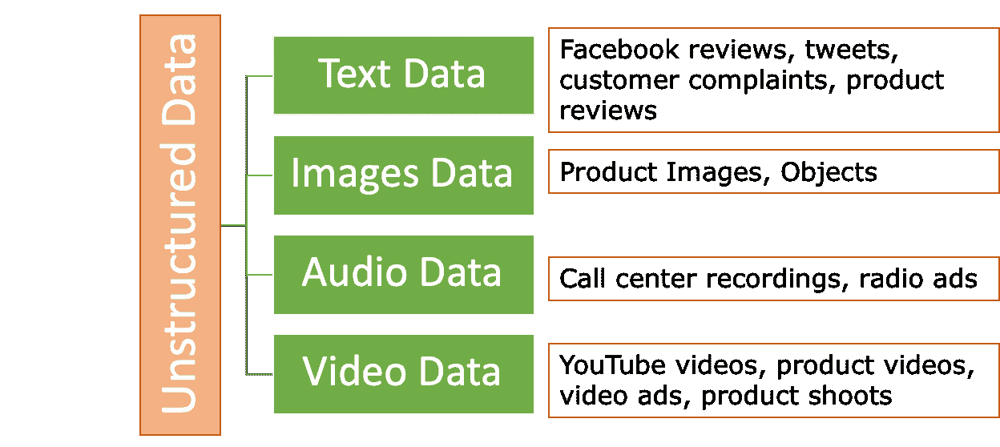

语言确实是赐予人类的礼物。我们沉迷于说话、发短信、写作、倾听来传达我们的想法。而这是通过生成的文本数据来完成的，这些数据是由博客、社交媒体帖子、推文、评论、故事、评价、对话等产生的。文本数据通常更加直接，情感更具表达力。必须解锁文本数据的潜力，并从中得出见解。我们可以更好地了解我们的客户，探索业务流程，并衡量提供的服务质量。我们生成的文本数据以新闻、Facebook 评论、推文、Instagram 帖子、客户评价、反馈、博客、文章、文学、故事等形式存在。这些数据代表了各种情绪和表达。

你是否在亚马逊上评论过产品或服务？你给产品评星级，同时也可以输入自由文本。去亚马逊看一些评论吧。你可能会发现一些评论有很多文字作为反馈。这些文本对产品/服务提供商来说是很有用的，可以帮助他们改进他们的产品/服务。此外，你可能参与了一些调查，要求你分享反馈。另外，随着 Alexa、Siri、Cortana 等技术的出现，语音指令正在充当人类和机器之间的接口 - 这又是一个丰富的数据来源。甚至我们打给客服中心的电话也可以成为文本数据的来源。这些通话可以被记录，并通过语音转文字转换，我们可以生成大量的文本数据。海量数据集，对吧！

我们将在下一节讨论一些文本数据的重要用例。

## 7.3 文本数据的用例

文本数据确实非常有用。对于业务而言，这真是一个见解丰富的来源。下面列出了一些令人感兴趣的用例。列表并不是详尽无遗的。同时，并非所有给出的用例都实施无监督学习。有些用例也需要监督学习。尽管如此，为了让你了解，我们分享了基于监督学习和无监督学习的两种用例 - 基于监督学习和无监督学习的用例。

1.  **情感分析：**你可能参与过调查或针对产品/调查提供了反馈。这些调查为我们生成了大量文本数据。可以分析这些文本数据，我们可以确定评论中的情感是积极的还是消极的。简单来说，情感分析就是评估文本数据中的积极性或消极性。因此，客户对产品或服务的情感是什么。我们可以使用监督式和非监督式学习进行情感分析。

1.  **新闻分类或文档分类：**看看 Google 新闻网页，你会发现每个新闻都被分类为体育、政治、科学、商业或任何其他类别。传入的新闻将根据实际文本的内容进行分类。同样，想象一下，我们手头有一些文档，我们可能想根据它们的类别或研究领域进行区分。例如，医学、经济学、历史、艺术、物理等。这样的用例确实会节省大量时间和人力。

1.  **语言翻译：**从一种语言到另一种语言的文本翻译是一个非常有趣的用例。使用自然语言处理可以在各种语言之间进行翻译。语言翻译非常棘手，因为不同的语言有不同的语法规则。通常，基于深度学习的解决方案最适合语言翻译。

1.  **垃圾邮件过滤：**可以使用自然语言处理和监督式机器学习来构建电子邮件垃圾邮件过滤器。监督式学习算法可以分析传入邮件的参数，并可以预测该邮件是否属于垃圾邮件文件夹。预测可以基于诸如发件人电子邮件 ID、主题行、邮件正文、附件、邮件时间等各种参数。通常，在这里使用监督式学习算法。

1.  **词性标注**或 POS 标注是其中一个受欢迎的用例。这意味着我们能够区分句子中的名词、形容词、动词、副词等。**命名实体识别**或 NER 也是自然语言处理的著名应用之一。它涉及在句子中识别人物、地点、组织、时间、数字。例如，John 住在 London 并为 Google 工作。NER 能够生成类似[John][Person]住在[London][Location]并为[Google][organization]工作的理解。

1.  生成句子，为图像加标题，语音转文本或文本转语音任务，手写识别是其他一些重要和受欢迎的用例。

上述列出的用例并不是穷尽的。还有大量其他用例可以使用自然语言处理实现。NLP 也是一个非常受欢迎的研究领域。我们在本章末尾分享了一些重要的论文供您参考。

虽然文本数据非常重要，但同时也是一种难以分析的数据集。需要注意的是，我们的计算机和处理器只能理解数字。因此，文本仍然需要表示为数字，以便我们可以对其进行数学和统计计算。但在深入研究文本数据准备之前，我们将介绍在处理文本数据集时面临的一些挑战。

## 7.4 文本数据的挑战

文本可能是最难处理的数据。有很多种方式可以表达同样的想法。例如，如果我问：“嘿，伙计，你几岁了？”和“嘿，伙计，我可以知道你多大了吗？”意思相同，对吧！对于人类来说，回答这两个问题是相同的，并且很容易解释。但对于机器来说可能是同样艰巨的任务。

我们面临的最常见的挑战有：

1.  处理文本数据可能很复杂。文本中可能有很多垃圾字符，比如$^%*&之类的。

1.  随着现代通信的发展，我们开始使用缩写词，比如“u”可以代表“you”，“brb”可以代表“be right back”等。

1.  语言在变化，解除了限制，不断发展。它每天都在变化，新词汇不断被加入到语言中。

如果你做一个简单的谷歌搜索，你会发现每年都有相当多的词汇被添加到词典中。

1.  世界上有近 6500 种语言，每一种语言都具有其独特性。每一种语言都构成了我们的世界。例如，阿拉伯语、中文、英语、法语、德语、印地语、意大利语、日语、西班牙语等。每种语言都有自己独特的用法和语法规则。甚至写作方式也可能不同 - 有些从左到右书写；有些可能从右到左书写，或者垂直书写！相同的情感，在不同语言中可能需要更少或更多的词汇来表达。

1.  一个词的意义取决于上下文。一个词在不同的上下文中可以是形容词，也可以是名词。看看下面这些例子：

1.  “这本书是必读的”和“请为我预订一个房间”。

1.  “汤米”可以是一个名字，但当用作“汤米·希尔菲格”时，它的用法完全改变了。

1.  “苹果”是一种水果，而“Apple”是一家生产 Macintosh、iPhone 等产品的公司。

1.  “四月”是一个月份，也可以是一个名字。

1.  再看一个例子 - “马克从英国去了法国，正在那里和约翰一起工作。他想念他的朋友”。人类很容易理解第二句中的“他”是指马克而不是约翰，这对于机器来说可能不那么简单。

1.  同一个词可能有很多同义词，比如“好”在不同情境中可以用“积极的”、“精彩的”、“出色的”、“异常的”来替换。或者，像“studying”、“studying”、“studies”、“studies”这样的词都与同一个词根“study”相关。

1.  文本数据的大小也可能令人生畏。管理文本数据集、存储它、清理它并更新它本身就是一项艰巨的任务。

像任何其他的机器学习项目一样，文本分析遵循机器学习的原则，尽管确切的过程略有不同。回想一下第一章，我们在图 7-2 中展示了机器学习项目的流程。建议您从第一章刷新一下流程。

##### 图 7-2 数据科学项目的整体步骤对文本数据也是一样的。文本数据的预处理与结构化数据集非常不同。

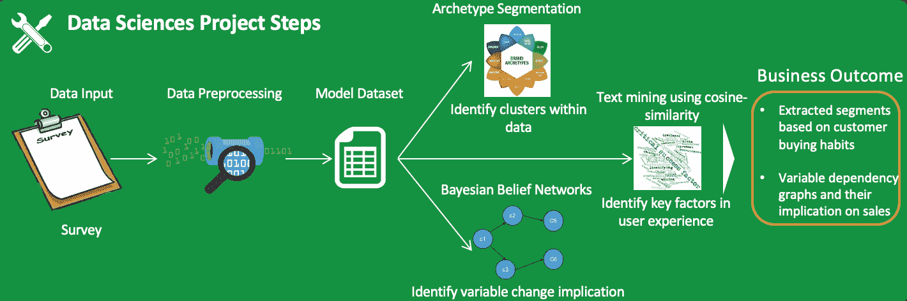

定义业务问题、数据收集和监控等工作保持不变。主要的差异在于文本的处理，包括数据清理、特征创建、文本数据的表示等。我们现在来介绍它。

##### 

弹出测验 – 回答这些问题来检查你的理解。答案在书的末尾。

(1) 文本数据的三个最有影响力的用例是什么？

(2) 为什么处理文本数据如此繁琐？

## 7.5 文本数据的预处理

文本数据，像任何其他数据源一样，可能会杂乱无章。我们在数据发现阶段清理了一部分数据，而在预处理阶段清理了大部分数据。同时，我们需要从数据集中提取特征。这个清理过程有时是相似的，并且可以应用于大多数文本数据集。一些文本数据集可能需要定制的处理方法。我们将从清理原始文本数据开始。

### 7.5.1 数据清理

数据质量的重要性不容置疑。文本数据越干净，分析结果就会越好。与此同时，预处理并不是一项简单的任务。这是一个复杂且耗时的任务。

文本数据需要进行清理，因为它包含了大量的垃圾字符、无关的词语、噪音和标点符号、URL 等。清理文本数据的主要方法有：

1.  **停用词去除：** 在任何语言中，有一些词是最常见的。停用词是词汇中最常见的单词，比关键词的重要性低。例如，“是”，“一个”，“这”，“有”，“已经”，“它”等。一旦我们从文本中去除了停用词，数据的维度就被减少了，因此解决方案的复杂性也减少了。

    与此同时，在去除停用词时，我们必须非常了解上下文。例如，如果我们问一个问题“下雨了吗？”。那么答案“下雨了”就是一个完整的答案。

    要去除停用词，可以定义一个定制的停用词列表并去除它们。否则，也可以使用标准库去除停用词。

当我们在处理需要上下文信息很重要的解决方案时，我们不会去除停用词。

1.  **基于频率的词汇移除:** 有时，您可能希望移除文本中最常见或非常独特的词。这个过程是获取文本中词语的频率，然后设置一个频率阈值。我们可以移除最常见的词。或者也许您希望移除整个数据集中只出现一次/两次的词。根据需求，您将决定。

1.  **基于库的清洗**是在我们希望使用预定义和自定义库来清理数据时进行的。我们可以创建一个词库，其中包含我们不希望在文本中出现的词，然后可以迭代地从文本数据中移除它们。这种方法允许我们以自己的选择实施清理。

1.  **垃圾或不需要的字符:** 文本数据，特别是推文、评论等，可能包含许多 URL、标签、数字、标点符号、社交媒体提及、特殊字符等。我们可能需要从文本中清除它们。与此同时，我们必须小心，因为对于一个领域不重要的一些词对于另一个领域可能是非常重要的。如果数据被从网站或 HTML/XML 来源中爬取，我们需要摆脱所有 HTML 实体、标点符号、非字母等。

清理文本数据时，始终要牢记业务背景。

我们知道很多新类型的表达进入了语言。例如，lol，hahahaha，brb，rofl 等。这些表达必须被转换为它们的原始含义。甚至像:-)，;-)等表情符号也必须被转换为它们的原始含义。

1.  **数据编码:** 有许多数据编码可用，如 ISO/IEC，UTF-8 等。通常，UTF-8 是最流行的。但不是硬性规定一定要使用 UTF-8。

1.  **词典归一化:** 根据上下文和使用情况，同一个词可能以不同的方式被表示。在词典归一化期间，我们清理这样的歧义。基本思想是将单词缩减到其根形式。因此，从彼此派生出来的词可以映射到中心词，只要它们有相同的核心含义。

    看一下图 7-2，在这里我们展示了相同的单词“eat”，已经被用在各种形式中。根词是“eat”，但这些不同的形式是 eat 的许多不同表达。

##### 图 7-3 Ate，eaten，eats，eating 都有相同的根词——eat。词干提取和词形恢复可用于获取根词。

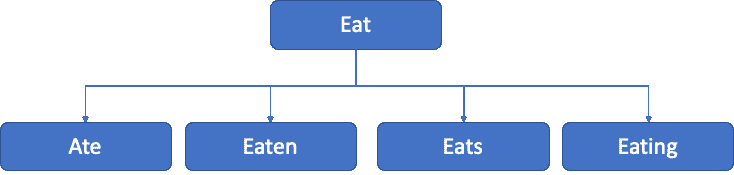

我们希望将所有这些词，如 eating，eaten 等，映射到它们的中心词“eat”，因为它们具有相同的核心含义。在这方面有两种主要方法可以处理：

1.  **词干提取**: *词干提取*是一种基本的基于规则的方法，将一个单词映射到它的核心词。它会去掉单词末尾的“es”，“ing”，“ly”，“ed”等。例如，studies 会变成 studi，studying 会变成 study。显然，作为一种基于规则的方法，输出的拼写可能并不总是准确的。

1.  **词形还原**：是一种有组织的方法，将单词缩减为它们的词典形式。单词的*Lemma*是其词典或规范形式。例如，eats, eating, eaten 等所有单词都有相同的根词 eat。词形还原提供比词干提取更好的结果，但它需要比词干提取更多的时间。

这些只是清洗文本数据的一些方法。这些技术在很大程度上会有所帮助。但是，仍然需要商业眼光来进一步理解数据集。我们将通过开发 Python 解决方案来使用这些方法清洁文本数据。

一旦数据被清洗，我们就必须开始表示数据，以便机器学习算法可以处理它 - 这是我们的下一个主题。

### 7.5.2 从文本数据集中提取特征

文本数据，就像任何其他数据源一样可能会混乱和嘈杂。我们在上一节中探讨了清理它的概念和技术。现在我们已经清理了数据，准备好使用。下一步是以算法可以理解的格式表示这些数据。我们知道我们的算法只能理解数字。文本数据在其最纯粹的形式下无法被算法理解。因此，一切都需要转换为数字。

一个非常简单的技术可以是简单地对我们的单词进行*独热编码*，并将它们表示为矩阵。

我们在书的前几章已经介绍了独热编码

如果我们描述这些步骤，那么单词可以首先转换为小写，然后按字母顺序排序。然后可以为它们分配一个数字标签。最后，单词将被转换为二进制向量。让我们通过一个例子来理解。

例如，文本是“It is raining heavily”。我们将使用以下步骤：

1.  小写单词，所以输出将会是“it is raining heavily”

1.  现在我们将它们按字母顺序排列。结果是 - heavily, is, it, raining。

1.  现在我们可以为每个单词分配位置值，如 heavily:0, is:1, it:2, raining:3。

1.  最后，我们可以将它们转换为如下所示的二进制向量

```py
[[0\. 0\. 1\. 0.] #it
[0\. 1\. 0\. 0.] #is
[0\. 0\. 0\. 1.] #raining
[1\. 0\. 0\. 0.]] #heavily
```

尽管这种方法非常直观和简单易懂，但由于语料库和词汇的庞大规模，实际上是不可能的。

语料库指的是一系列文本。它是拉丁文的意思。它可以是一组书面文字或口头文字，用于进行语言分析。

此外，处理如此多维的大数据集将在计算上非常昂贵。因此创建的矩阵也将非常稀疏。因此，我们需要寻找其他方法来表示我们的文本数据。

有更好的替代方案可用于一热编码。这些技术侧重于单词的频率或单词的使用上下文。这种科学方法的文本表示更准确、更健壮、更具解释性。它也产生更好的结果。有多种这样的技术，如 tf-idf、词袋模型等。我们将在接下来的章节中讨论其中一些技术。但我们首先会考察标记化的一个重要概念！

#### Tokenization（标记化）

Tokenization（标记化）就是简单地将文本或一组文本分解成单个标记。它是自然语言处理的基本构件。看一下图 7-3 中的示例，我们为句子中的每个单词创建了单独的标记。标记化是一个重要的步骤，因为它允许我们为每个单词分配唯一的标识符或标记。一旦我们为每个单词分配了特定的标记，分析就变得不那么复杂了。

##### 图 7-3 标记化可以将句子分解为不同的单词标记。

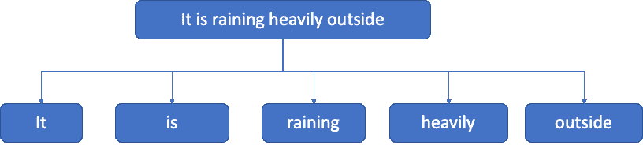

标记通常用于单个单词，但并不总是必要的。我们可以将一个单词或单词的子词或字符进行标记化。在子词的情况下，同一句子可以有子词标记，如 rain-ing。

如果我们希望在字符级别执行标记化，那么可以是 r-a-i-n-i-n-g。实际上，在上一节讨论的一热编码方法中，标记化是在单词上进行的。

标记化是自然语言处理解决方案的基石。

一旦我们获得了标记，那么这些标记就可以用来准备一个词汇表。词汇表是语料库中唯一标记的集合。

有多个用于标记化的库。*Regexp* 标记化使用给定的模式参数来匹配标记或标记之间的分隔符。*Whitespace* 标记化通过将任何空白字符序列视为分隔符来使用。然后我们有 *blankline*，它使用空白行的序列作为分隔符。*Wordpunct* 标记化通过匹配字母字符序列和非字母非空白字符序列来进行标记化。当我们为文本数据创建 Python 解决方案时，我们将执行标记化。

现在，我们将探讨更多表示文本数据的方法。第一个这样的方法是词袋模型。

#### 词袋模型方法

正如名称所示，语料库中的所有单词都会被使用。在词袋模型方法中，或者说 BOW 方法中，文本数据被标记化为语料库中的每个单词，然后计算每个标记的相应频率。在此过程中，我们忽略语法、单词的顺序或上下文。我们只专注于简单性。因此，我们将每个文本（句子或文档）表示为*它自己的单词袋*。

在整个文档的 BOW 方法中，我们将语料库的词汇表定义为语料库中存在的所有唯一单词。请注意，我们使用语料库中的所有唯一单词。如果我们愿意，我们也可以设置一个阈值，即单词被选中的频率的上限和下限。一旦我们获得了唯一的单词，那么每个句子都可以用与基础词汇向量相同维度的向量来表示。这个向量表示包含了句子中每个单词在词汇表中的频率。这听起来可能很复杂，但实际上这是一种直接的方法。

让我们通过一个例子来理解这种方法。假设我们有两个句子——It is raining heavily 和 We should eat fruits。

要表示这两个句子，我们将计算这些句子中每个单词的频率，如图 7-4 所示。

##### 图 7-4 每个单词的频率已经计算出来了。在这个例子中，我们有两个句子。

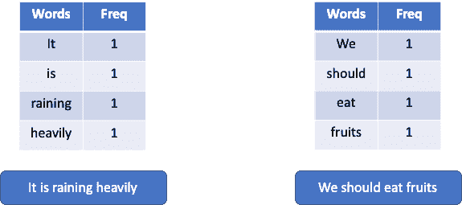

现在，如果我们假设只有这两个单词代表整个词汇表，我们可以将第一个句子表示如图 7-5 所示。请注意，该表格包含了所有单词，但是不在句子中的单词的值为 0。

##### 图 7-5 第一个句子对于词汇表中的所有单词进行了表示，我们假设词汇表中只有两个句子。

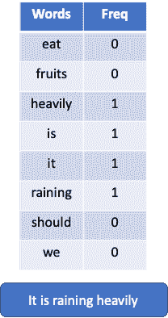

在这个例子中，我们讨论了如何使用 BOW 方法将句子表示为向量。但 BOW 方法没有考虑单词的顺序或上下文。它只关注单词的频率。因此，它是一种非常快速的方法来表示数据，并且与其同行相比计算成本较低。由于它是基于频率的，所以它通常用于文档分类。

但是，由于其纯粹基于频率的计算和表示，解决方案的准确性可能会受到影响。在语言中，单词的上下文起着重要作用。正如我们之前所看到的，苹果既是一种水果，也是一个著名的品牌和组织。这就是为什么我们有其他考虑比仅仅是频率更多参数的高级方法。下面我们将学习一种这样的方法，即 tf-idf 或词项频率-逆文档频率。

##### 

弹出测验——回答这些问题以检查你的理解。答案在本书的末尾。

(1) 用简单的语言解释标记化，就好像你在向一个不懂 NLP 的人解释一样。

(2) Bag of words 方法关注单词的上下文而不仅仅是频率。True or False.

(3) Lemmatization is less rigorous approach then stemming. True or False.

#### tf-idf（词项频率和逆文档频率）

我们在上一节学习了词袋方法。在词袋方法中，我们只重视单词的频率。这个想法是，频率较高的词可能不像频率较低但更重要的词那样提供有意义的信息。例如，如果我们有一套医学文件，我们想要比较两个词“疾病”和“糖尿病”。由于语料库包含医学文件，单词疾病必然会更频繁，而“糖尿病”这个词会更少，但更重要，以便识别处理糖尿病的文件。tf-idf 方法使我们能够解决这个问题，并提取更重要的词的信息。

在术语频率和逆文档频率（tf-idf）中，我们考虑单词的相对重要性。TF-idf 表示术语频率，idf 表示逆文档频率。我们可以定义 tf-idf 如下：

1.  **术语频率（t**是整个文档中术语的计数。例如，文档“D”中单词“a”的计数。

1.  **逆文档频率（id**是整个语料库中总文档数（N）与包含单词“a”的文档数(df)的比率的对数。

因此，tf-idf 公式将为我们提供单词在整个语料库中的相对重要性。数学公式是 tf 和 idf 的乘积，表示为

w[i,j] = tf[i,j] * log (N/df[i]) (方程式 7-1)

其中 N：语料库中的文档总数

tf[i,j]是文档中单词的频率

df[i]是包含该词的语料库中的文档数量。

这个概念听起来可能很复杂。让我们通过一个例子来理解。

假设我们有一百万本运动期刊的集合。这些运动期刊包含了许多不同长度的文章。我们还假设所有文章都只有英语。所以，假设在这些文件中，我们想要计算单词“ground”和“backhand”的 tf-idf 值。

假设有一个包含 100 个词的文档，其中“ground”出现了五次，而“backhand”只出现了两次。所以 ground 的 tf 为 5/100 = 0.05，而 backhand 的 tf 为 2/100 = 0.02。

我们了解到，“ground”这个词在体育中是相当常见的词，而“backhand”这个词的使用次数会较少。现在，我们假设“ground”出现在 100,000 个文档中，而“backhand”只出现在 10 个文档中。所以，“ground”的 idf 为 log (1,000,000/100,000) = log (10) = 1。对于“backhand”，它将是 log (1,000,000/10) = log (100,000) = 5。

要得到“ground”的最终值，我们将 tf 和 idf 相乘= 0.05 x 1 = 0.05。

要得到“backhand”的最终值，我们将 tf 和 idf 相乘= 0.02 x 5 = 0.1。

我们可以观察到，“背手”这个词的相对重要性要比单词“地面”的相对重要性更高。这就是 tf-idf 相对于基于频率的 BOW 方法的优势。但是，与 BOW 相比，tf-idf 计算时间更长，因为必须计算所有的 tf 和 idf。尽管如此，与 BOW 方法相比，tf-idf 提供了一个更好、更成熟的解决方案。

接下来我们将在下一节中介绍语言模型。

#### 语言模型

到目前为止，我们已经学习了词袋模型方法和 tf-idf。现在我们将专注于语言模型。

语言模型分配概率给词的序列。N-grams 是语言模型中最简单的模型。我们知道，为了分析文本数据，它们必须被转换为特征向量。N-gram 模型创建了特征向量，使得文本可以以进一步分析的格式来表示。

n-gram 是一个概率语言模型。在 n-gram 模型中，我们计算第 N^(th) 个词在给定(N-1)个词的序列的情况下出现的概率。更具体地说，n-gram 模型将基于词 x[i-(n-1)], x[i-(n-2)]…x[i-1] 预测下一个词 x[i]。若我们希望使用概率术语，可以表示为给定前面的词 x[i-(n-1)], x[i-(n-2)]…x[i-1] 的条件概率 P(x[i] | x[i-(n-1)], x[i-(n-2)]…x[i-1])。该概率通过文本语料库中序列的相对频率计算得出。

若条目是单词，n-grams 可能被称为*shingles*。

让我们用一个例子来学习这个。

假设我们有一个句子 It is raining heavily。我们已经使用不同的 n 值展示了相应的表示方式。您应该注意到，对于不同的 n 值，单词的序列以及它们的组合方式是如何变化的。如果我们希望使用 n=1 或单个词来进行预测，表示将如图 7-6 所示。请注意，此处每个词单独使用。称为*unigrams*。

如果我们希望使用 n=2，那么现在使用的词数量将变为两个。它们被称为*bigrams*，这个过程将继续下去。

##### 图 7-6 Unigrams, bigrams, trigrams 可以用来表示相同的句子。这个概念也可以扩展到 n-grams。

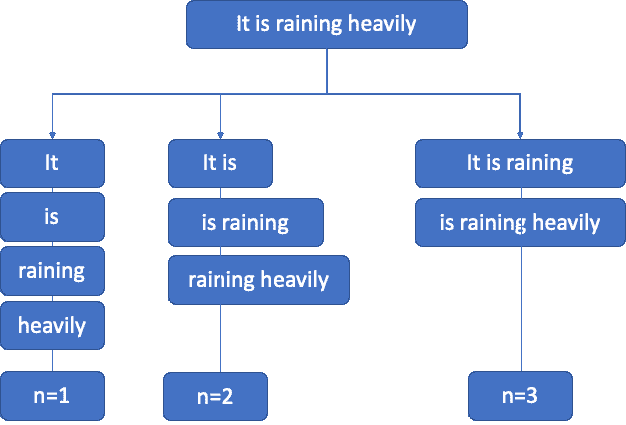

因此，如果我们有一个 unigram，那么它是一个词的序列；对于两个词的序列，称为 bigram；对于三个词的序列，称为 trigram，依此类推。因此，trigram 模型将使用仅考虑前两个词的条件概率来逼近后一个词的概率，而 bigram 则仅考虑前一个词的条件概率。这确实是一个非常强的假设，即一个词的概率只取决于之前的一个词，被称为*马尔可夫*假设。一般来说，N > 1 被认为较 unigrams 更加信息丰富。但显然计算时间也会增加。

n-gram 方法对 n 的选择非常敏感。它还在很大程度上取决于所使用的训练语料库，这使得概率非常依赖于训练语料库。因此，如果遇到一个未知单词，模型将很难处理该新单词。

我们现在将创建一个 Python 示例。我们将展示一些使用 Python 进行文本清洗的示例。

#### 使用 Python 进行文本清洗

我们现在将用 Python 清洗文本数据。有一些库可能需要安装。我们将展示一些小的代码片段。你可以根据需要使用它们。我们还附上了代码片段及其结果的相应截图。

代码 1：删除文本中的空格。我们导入库`re`，它被称为`正则表达式`。文本是 It is raining outside with a lot of blank spaces in between.

```py
import re
doc = "It is     raining       outside"
new_doc = re.sub("\s+"," ", doc)
print(new_doc)
```

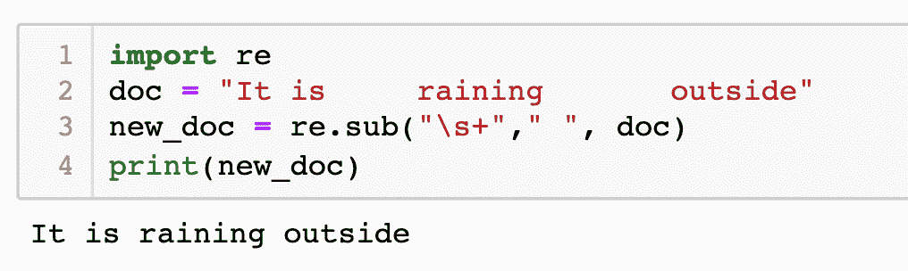

代码 2：现在我们将从文本数据中删除标点符号。

```py
text_d = "Hey!!! How are you doing? And how is your health! Bye, take care."
re.sub("[^-9A-Za-z ]", "" , text_d)
```

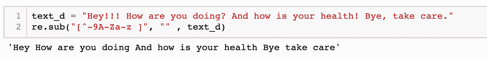

代码 3：这是另一种去除标点符号的方法。

```py
import string
text_d = "Hey!!! How are you doing? And how is your health! Bye, take care."
cleaned_text = "".join([i for i in text_d if i not in string.punctuation])
cleaned_text
```

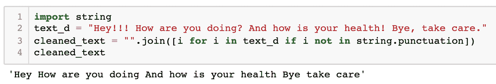

代码 4：我们现在将删除标点符号，并将文本转换为小写。

```py
text_d = "Hey!!! How are you doing? And how is your health! Bye, take care."
cleaned_text = "".join([i.lower() for i in text_d if i not in string.punctuation])
cleaned_text
```

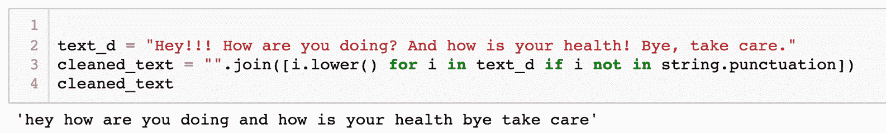

代码 5：我们现在将使用标准的`nltk`库。标记化将在这里使用 NLTK 库完成。输出也附在下面。

```py
import nltk
text_d = "Hey!!! How are you doing? And how is your health! Bye, take care."
nltk.tokenize.word_tokenize(text_d)
```

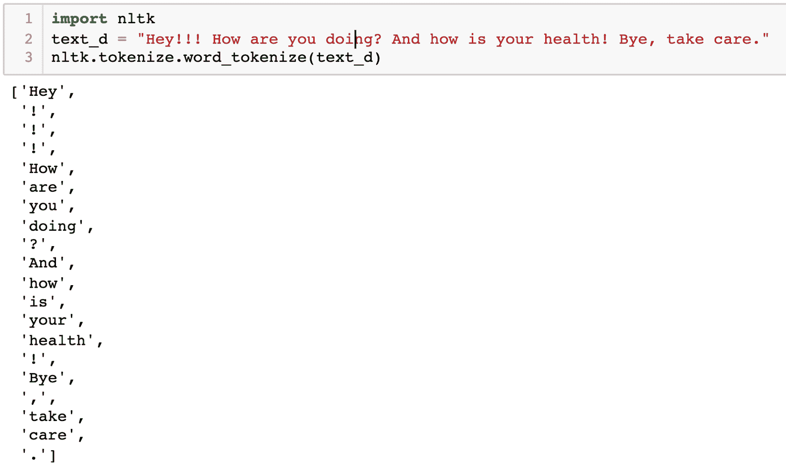

请注意，在代码的输出中，我们有包括标点符号的所有单词作为不同的标记。如果你希望排除标点符号，可以使用之前共享的代码片段来清理标点符号。

代码 6：接下来是停用词。我们将使用 nltk 库删除停用词。然后，我们将对单词进行标记。

```py
stopwords = nltk.corpus.stopwords.words('english')
text_d = "Hey!!! How are you doing? And how is your health! Bye, take care."
text_new = "".join([i for i in text_d if i not in string.punctuation])
print(text_new)
words = nltk.tokenize.word_tokenize(text_new)
print(words)
words_new = [i for i in words if i not in stopwords]
print(words_new)
```

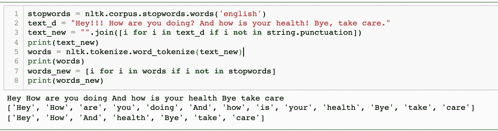

代码 7：我们现在将在文本示例上执行词干提取。我们使用 NLTK 库进行词干提取。首先对单词进行标记，然后我们对其应用词干提取。

```py
import nltk
from nltk.stem import PorterStemmer
stem = PorterStemmer()
text = "eats eating studies study"
tokenization = nltk.word_tokenize(text)
for word in tokenization:
    print("Stem for {} is {}".format(word, stem.stem(w)))
```

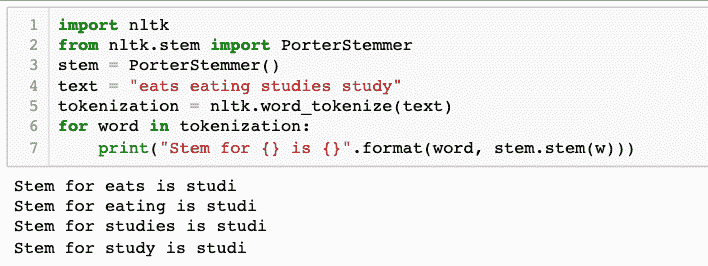

代码 8：我们现在将在文本示例上执行词形还原。我们使用 NLTK 库进行词形还原。首先对单词进行标记，然后我们对其应用词形还原。

```py
import nltk
from nltk.stem import WordNetLemmatizer
wordnet_lemmatizer = WordNetLemmatizer()
text = "eats eating studies study"
tokenization = nltk.word_tokenize(text)
for word in tokenization:
    print("Lemma for {} is {}".format(word, wordnet_lemmatizer.lemmatize(w)))
```

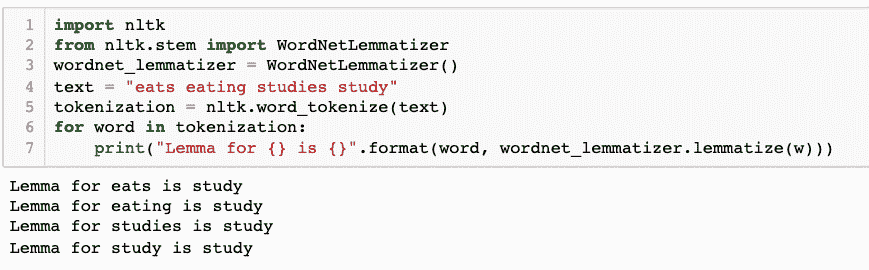

观察并比较词干提取和词形还原的两个输出之间的差异。对于 studies 和 studying，词干提取生成的输出为 studi，而词形还原生成了正确的输出 study。

到目前为止，我们已经介绍了词袋模型、tf-idf 和 N-gram 方法。但在所有这些技术中，忽略了单词之间的关系，而这些关系在*词嵌入*中被使用 - 我们的下一个主题。

#### 词嵌入

"一个单词的特点在于它周围的公司" - 约翰·鲁珀特·费斯。

到目前为止，我们研究了许多方法，但所有的技术都忽略了单词之间的上下文关系。让我们通过一个例子来学习。

假设我们的词汇表中有 100,000 个单词，从 aa 到 zoom。现在，如果我们执行上一节学习的 one-hot 编码，所有这些单词都可以以向量形式表示。每个单词将有一个唯一的向量。例如，如果单词 king 的位置在 21000，那么向量的形状将如下所示，其中在 21000 位置上有 1，其余位置为 0。

[0,0,0,0,0,0,0,0,0,0,0,0,0,0,0,0…………………1, 0,0,0,0,0,0,0,0,0,0,0,0,0,0,0,0]

这种方法存在一些明显的问题：

1.  维度的数量非常高，计算复杂。

1.  数据在本质上非常稀疏。

1.  如果要输入 n 个新单词，则词汇量增加 n，因此每个向量的维度增加 n。

1.  这种方法忽略了单词之间的关系。我们知道，ruler（统治者）、king（国王）、monarch（君主）有时可以互换使用。在 one-hot 编码方法中，任何这种关系都被忽略了。

如果我们希望进行语言翻译或生成聊天机器人，我们需要将这样的知识传递给机器学习解决方案。单词嵌入为这个问题提供了解决方案。它们将高维度的单词特征转换为较低的维度，同时保持上下文关系。单词嵌入允许我们创建更加泛化的模型。我们可以通过示例来理解含义。

如图 7-7 所示的示例中，"man" 到 "woman" 的关系类似于 "king" 到 "queen"，"eat" 到 "eating" 类似于 "study" 到 "studying" 或 "UK" 到 "London" 类似于 "Japan" 到 "Tokyo"。

##### 图 7-7 单词嵌入可以用来表示单词之间的关系。例如，从 men（男人）到 women（女人）之间存在一种关系，类似于 king（国王）到 queen（女王）之间的关系。

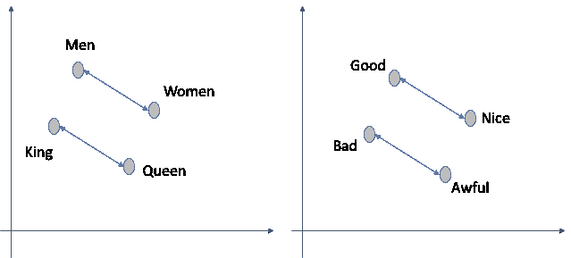

简而言之，使用单词嵌入，我们可以将具有相似含义的单词表示为类似的形式。单词嵌入可以被认为是一类技术，其中我们将每个单词在预定义的向量空间中表示出来。语料库中的每个单词都被映射到一个向量上。根据单词的使用情况来理解分布式表示。因此，可以使用类似的单词具有相似的表示。这使得解决方案能够捕捉单词及其关系的潜在含义。因此，单词的含义起着重要作用。相比于词袋方法，这种表示更加智能，词袋方法中的每个单词都是独立处理的，不考虑它们的使用情况。而且，维度的数量较少，相比于 one-hot 编码，每个单词由 10 或 100 维的向量表示，这比 one-hot 编码方法中使用的超过 1000 维的向量表示要少得多。

我们将在下一节介绍两种最流行的技术 Word2Vec 和 GloVe。这一节提供了对 Word2Vec 和 GloVe 的理解。Word2Vec 和 GloVe 的数学基础超出了本书的范围。我们将理解解决方案的工作机制，然后使用 Word2Vec 和 GloVe 开发 Python 代码。到目前为止，书中还有一些术语我们没有讨论过，所以下一节关于 Word2Vec 和 GloVe 可能会很繁琐。如果你只对解决方案的应用感兴趣，可以跳过下一节。

#### Word2Vec 和 GloVe

Word2Vec 首次发表于 2013 年。它是由 Google 的 Tomas Mikolov 等人开发的。我们会在章节结束时分享论文的链接。建议你彻底研究这篇论文。

Word2Vec 是一组用于生成词嵌入的模型。输入是一个大型文本语料库。输出是一个向量空间，具有非常多的维度。在这个输出中，语料库中的每个单词被分配了一个唯一且对应的向量。最重要的一点是，在语料库中具有相似或共同上下文的单词，在生成的向量空间中位置相似。

在 Word2Vec 中，研究人员介绍了两种不同的学习模型 - 连续词袋模型和连续跳字模型，我们简要介绍如下：

1.  连续词袋模型或 CBOW：在 CBOW 中，模型从周围上下文单词的窗口中预测当前单词。因此，CBOW 学习了在词袋方法中，单词的顺序不起作用。同样，在 CBOW 中，单词的顺序是无关紧要的。

1.  连续跳字模型：它使用当前单词来预测周围窗口的上下文单词。在这样做时，它给邻近单词分配比远离单词更多的权重。

GloVe 或全局词向量是用于生成词向量表示的无监督学习算法。它由斯坦福的 Pennington 等人于 2014 年开发，并在 2014 年推出。它是两种技术的组合 - 矩阵分解技术和 Word2Vec 中使用的基于本地上下文的学习。GloVe 可用于找到像邮政编码和城市、同义词等关系。它为具有相同形态结构的单词生成了一组单一的向量。

这两个模型（Word2Vec 和 GloVe）都从共现信息中学习和理解它们的单词的向量表示。共现意味着单词在大型语料库中一起出现的频率。主要区别在于 Word2Vec 是基于预测的模型，而 GloVe 是基于频率的模型。Word2Vec 预测给定单词的上下文，而 GloVe 通过创建一个共现矩阵来学习单词在给定上下文中出现的频率。

##### 

弹出测验 - 回答这些问题以检查您的理解。书的末尾有答案

（1）BOW 比 tf-idf 方法更严格。真或假。

（2）Word2Vec 和 GloVe 之间的区别。

我们现在将在下一节中转到案例研究和 Python 实现。

#### 用 Python 实现的情感分析案例研究

到目前为止，我们已经讨论了许多关于 NLP 和文本数据的概念。在本节中，我们首先将探讨一个业务案例，然后在同一案例上开发 Python 解决方案。我们正在进行情感分析。

产品评论是信息的丰富来源 - 对客户和组织都是如此。每当我们希望购买任何新产品或服务时，我们倾向于查看其他客户的评论。您可能自己也曾评论过产品和服务。这些评论可以在亚马逊、博客、调查等处找到。

让我们考虑一个案例。一个供水公用事业提供商收到了客户的投诉，对供水的评论以及对整体体验的评论。可能的流是 - 产品质量、定价、注册体验、注册流程的简易性、付款流程、供水评论、电力评论等等。我们想要确定评论的一般背景 - 它是积极的、消极的还是中立的。评论有分配的星级数量、实际文本评论、关于产品/服务的优点和缺点、属性等。但与此同时，也存在一些业务问题，如：

1.  许多时候，观察到产品/服务收到的星级数量非常高，而实际评论却相当负面。

1.  组织和产品所有者需要知道客户喜欢哪些功能，哪些功能不受客户喜欢。然后团队可以着手改进客户不喜欢的功能。

1.  还需要评估并密切关注竞争！组织需要知道竞争对手的热门产品的属性。

1.  产品所有者可以更好地计划他们希望在未来发布的功能。

因此，业务团队将能够回答这两个最重要的问题：

1.  我们客户对产品和服务的满意度水平是多少？

1.  客户的主要痛点和不满，驱动客户参与的因素，哪些服务是复杂且耗时的，哪些服务/产品最受欢迎？

这个商业用例将带来以下业务利益：

1.  最令人满意且最受欢迎的产品和服务应该继续。

1.  那些不受欢迎且得到负面评分的功能必须得到改进，挑战也必须得到缓解。

1.  各自的团队，如财务、运营、投诉、CRM 等，可以被通知，并且他们可以分别工作以改善客户体验。

1.  喜欢或不喜欢服务的精确原因将对相应的团队有助于朝正确的方向努力。

1.  总的来说，它将为测量客户基础的净推荐得分（NPS）提供一个基准。企业可以努力提升整体客户体验。

1.  我们可能希望通过仪表板来表示这些发现。这个仪表板将定期刷新，比如每月或每季度刷新一次。

要解决这个业务问题，团队可以从网站、调查、亚马逊、博客等收集相关数据。然后对该数据集进行分析。分析结构化数据相对容易。在这个例子中，我们将处理文本数据。

Python Jupyter 笔记本在 GitHub 地址上进行了检入。建议您使用 GitHub 地址上的 Jupyter 笔记本，因为它包含更多步骤。

第 1 步：我们在这里导入所有库。

```py
#### Loading all the required libraries here
from lxml import html  
import requests
import pandas as pd
from nltk.corpus import stopwords
from textblob import TextBlob
import matplotlib.pyplot as plt
import sys
import numpy as np
import pandas as pd
import matplotlib
import matplotlib.pyplot as plt
import sklearn
import scikitplot as skplt
import nltk
#to ignore warnings
import warnings
warnings.filterwarnings("ignore")
nltk.download('stopwords')
nltk.download('punkt')
nltk.download('wordnet')
```

第 2 步：我们在这里定义标签。这些标签用于从评论中获取产品的属性。

```py
xpath_reviews = '//div[@data-hook="review"]'
reviews = parser.xpath(xpath_reviews)
xpath_rating  = './/i[@data-hook="review-star-rating"]//text()' 
xpath_title   = './/a[@data-hook="review-title"]//text()'
xpath_author  = './/a[@data-hook="review-author"]//text()'
xpath_date    = './/span[@data-hook="review-date"]//text()'
xpath_body    = './/span[@data-hook="review-body"]//text()'
xpath_helpful = './/span[@data-hook="helpful-vote-statement"]//text()'
```

第 3 步：我们现在正在准备好提取数据。我们正在创建一个数据框来存储客户评论。然后我们迭代所有评论，然后提取信息。

```py
# Create a dataframe here. 

reviews_df = pd.DataFrame()
for review in reviews:
    rating  = review.xpath(xpath_rating)
    title   = review.xpath(xpath_title)
    author  = review.xpath(xpath_author)
    date    = review.xpath(xpath_date)
    body    = review.xpath(xpath_body)
    helpful = review.xpath(xpath_helpful)

    review_dict = {'rating': rating,
                   'title': title,
                   'author': author,             
                   'date': date,
                   'body': body,
                   'helpful': helpful}
    reviews_df = reviews_df.append(review_dict, ignore_index=True)
all_reviews = pd.DataFrame()
```

第 4 步：让我们迭代通过评论然后填写详细信息。

```py
# Fill the values of the reviews here. . 

for i in range(1,90):
    amazon_url = 'https://www.amazon.co.uk/Hive-Heating-Thermostat-Professional-Installation/product-reviews/B011B3J6KY/ref=cm_cr_othr_d_show_all?ie=UTF8&reviewerType=all_reviews&pageNumber='+str(i)
    headers = {'User-Agent': user_agent}
    page = requests.get(amazon_url, headers = headers)
    parser = html.fromstring(page.content)
    xpath_reviews = '//div[@data-hook="review"]'
    reviews = parser.xpath(xpath_reviews)
    reviews_df = pd.DataFrame()
    xpath_rating  = './/i[@data-hook="review-star-rating"]//text()' 
    xpath_title   = './/a[@data-hook="review-title"]//text()'
    xpath_author  = './/a[@data-hook="review-author"]//text()'
    xpath_date    = './/span[@data-hook="review-date"]//text()'
    xpath_body    = './/span[@data-hook="review-body"]//text()'
    xpath_helpful = './/span[@data-hook="helpful-vote-statement"]//text()'
    #print(i)
    for review in reviews:
        rating  = review.xpath(xpath_rating)
        title   = review.xpath(xpath_title)
        author  = review.xpath(xpath_author)
        date    = review.xpath(xpath_date)
        body    = review.xpath(xpath_body)
        helpful = review.xpath(xpath_helpful)

        review_dict = {'rating': rating,
                       'title': title,
                       'author': author,             
                       'date': date,
                       'body': body,
                       'helpful': helpful}
        reviews_df = reviews_df.append(review_dict, ignore_index=True)
    #print(reviews_df)
    all_reviews = all_reviews.append(reviews_df)

```

第 5 步：让我们看看我们生成的输出。

```py
all_reviews.head()
```

第 6 步：现在我们将输出保存到一个路径。您可以提供自己的路径。

```py
out_folder = '/Users/vaibhavverdhan/Book/UnsupervisedLearningBookFinal/'
all_reviews.to_csv(out_folder + 'Reviews.csv')
```

第 7 步：加载数据并分析。

```py
#Load the data now and analyse it
data_path = '/Users/vaibhavverdhan/Book/UnsupervisedLearningBookFinal/'
reviewDataCSV = 'Reviews.csv'
reviewData = (pd.read_csv(data_path+reviewDataCSV,index_col=0,))
```

第 8 步：我们现在将查看数据集的基本信息。

```py
reviewData.shape
reviewData.rating.unique()
reviewData.rating.value_counts()
```

第 9 步：我们现在将查看评论中给出的星级分布。这将帮助我们理解客户给出的评论。

```py
labels = '5 Stars', '1 Star', '4 Stars', '3 Stars', '2 Stars'
sizes = [reviewData.rating.value_counts()[0], reviewData.rating.value_counts()[1],reviewData.rating.value_counts()[2],reviewData.rating.value_counts()[3],reviewData.rating.value_counts()[4]]
colors = ['green', 'yellowgreen', 'coral', 'lightblue', 'grey']
explode = (0, 0, 0, 0, 0)  # explode 1st slice

# Plot
plt.pie(sizes, explode=explode, labels=labels, colors=colors,
        autopct='%1.1f%%', shadow=True, startangle=140)

plt.axis('equal')
plt.show()
```

第 10 步：将文本转换为小写，并删除停用词和频率最高的单词。

```py
reviewData.body = reviewData.body.str.lower()
reviewData.body = reviewData.body.str.replace('[^\w\s]','')
stop = stopwords.words('english')
reviewData.body = reviewData.body.apply(lambda x: " ".join(x for x in x.split() if x not in stop))
freq = list(freq.index)
reviewData.body = reviewData.body.apply(lambda x: " ".join(x for x in x.split() if x not in freq))
freq = pd.Series(' '.join(reviewData.body).split()).value_counts()[-10:]
freq = list(freq.index)
reviewData.body = reviewData.body.apply(lambda x: " ".join(x for x in x.split() if x not in freq))
```

第 11 步：现在对数据进行分词。

```py
from nltk.tokenize import word_tokenize
tokens = word_tokenize(reviewData.iloc[1,1])
print(tokens)
```

第 12 步：我们现在正在执行词形还原。

```py
from textblob import Word
reviewData.body = reviewData.body.apply(lambda x: " ".join([Word(word).lemmatize() for word in x.split()]))
reviewData.body.head()
```

第 13 步：现在我们正在将所有评论附加到字符串上。

```py
sentimentString = reviewData.iloc[1,1]
# append to this string 
for i in range(2,len(reviewData)):
    sentimentString = sentimentString + reviewData.iloc[i,1]
```

第 14 步：情感分析在这里完成。我们从 TextBlob 中获取情感方法。它为情感生成极性和主观性。

```py
# the functions generates polarity and subjectivity here, subsetting the polarity only here
allReviewsSentiment = reviewData.body[:900].apply(lambda x: TextBlob(x).sentiment[0])
# this contains boths subjectivity and polarity
allReviewsSentimentComplete = reviewData.body[:900].apply(lambda x: TextBlob(x).sentiment)
allReviewsSentimentComplete.head()
```

第 15 步：将情感保存到 csv 文件中。

```py
allReviewsSentiment.to_csv(out_folder + 'ReviewsSentiment.csv')
```

第 15 步：我们现在将给情感分配一个含义或标签。我们正在将每个分数分类为非常满意到非常不满意。

```py
allReviewsSentimentDF = allReviewsSentiment.to_frame()
# Create a list to store the data
grades = []

# For each row in the column,
for row in allReviewsSentimentDF['body']:
    # if more than a value,
    if row >= 0.75:
       grades.append('Extremely Satisfied')
    elif (row >= 0.5) & (row < 0.75):
        grades.append('Satisfied')
    elif (row >= 0.2) & (row < 0.5):
        grades.append('Nice')
    elif (row >= -0.2) & (row < 0.2):
        grades.append('Neutral')
    elif (row > -0.5) & (row <= -0.2):
        grades.append('Bad')
    elif (row >= -0.75) & (row < -0.5):
        grades.append('Dis-satisfied')
    elif  row < -0.75:
        grades.append('Extremely Dis-satisfied')
    else:
        # Append a failing grade
        grades.append('No Sentiment')

# Create a column from the list
allReviewsSentimentDF['SentimentScore'] = grades
allReviewsSentimentDF.head()
```

第 16 步：我们现在将查看情感得分并绘制它们。最后，我们将它们与主数据集合并。

```py
allReviewsSentimentDF.SentimentScore.value_counts()
allReviewsSentimentDF['SentimentScore'].value_counts().plot(kind='bar')
#### Merge the review data with Sentiment generated

# add column Polarity Score
reviewData['polarityScore'] = allReviewsSentimentDF['body']
```

在这个案例研究中，您不仅从网站上抓取了评论，还分析了数据集。如果我们比较情感，我们可以看到给产品的星级并不代表真实情况。

在 () 中，我们正在比较实际的星级和情感分析的输出。我们可以观察到，73% 的人给出了 5 星，7% 的人给出了 4 星，而在情感分析中，大多数评论被分类为中性。这就是情感分析的真正力量！

##### 图 7-8 比较左侧的原始星级分布，观察情感分析的实际结果

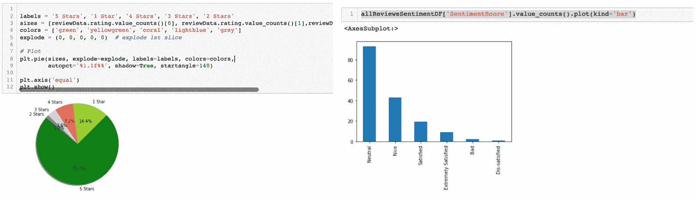

情感分析是一个非常重要的用例。它对企业和产品团队非常有用。

我们现在将转到使用 Python 进行文档分类的第二个案例研究。

#### 使用 Python 进行文本聚类

想象一下。你有一堆的文本数据集或文档。但是它们都混在一起了。我们不知道文本属于哪个类别。在这种情况下，我们假设我们手头有两类文本数据集 - 一个与足球有关的数据，第二类是旅行。我们将开发一个可以分离这两个类别的模型。

第一步：导入所有库

```py
from sklearn.feature_extraction.text import TfidfVectorizer
from sklearn.cluster import KMeans
import numpy as np
import pandas as pd
```

第二步：我们现在正在创建一个虚拟数据集。这段文本数据是我们自己写的几句话。有两个类别 -

```py
text = ["It is a good place to travel",
            "Football is a nice game", "Lets go for holidays and travel to Egypt",
            "It is a goal, a great game.", "Enjoy your journey and fortget the rest", "The teams are ready for the same" ]
```

第三步：我们将使用 tfidf 对数据进行向量化处理。

```py
tfidf_vectorizer = TfidfVectorizer(stop_words='english')
X = tfidf_vectorizer.fit_transform(text)
```

第四步：现在让我们进行聚类。

```py
k = 2
model = KMeans(n_clusters=k, init='k-means++', max_iter=10, n_init=2)
model.fit(X)
```

第五步：让我们表示质心并打印输出。

```py
centroids = model.cluster_centers_.argsort()[:, ::-1]
features = vectorizer.get_feature_names()

for i in range(k):
    print("Cluster %d:" % i),
    for ind in centroids[i, :10]:
        print("%s" % terms[ind])
```

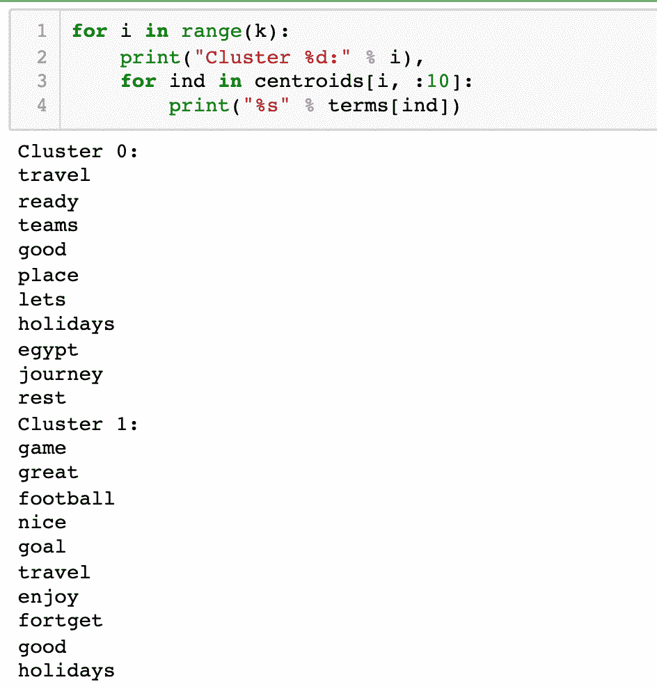

您还可以将此示例扩展到其他数据集。使用自己的数据集并复制上面示例中的代码。

不再有使用 Word2Vec 和 GloVe 的 Python Jupyter 笔记本了。我们已经将代码检入到了本书的 GitHub 位置。建议您使用它。这是一个非常重要的表示文本数据的资源。

至此，我们来到了这个令人兴奋的章节的结尾。现在让我们进入总结部分。

## 7.6 小结

文本数据是最有用的数据集之一。很多智慧隐藏在文本中。日志、博客、评论、推文、投诉、评论、文章等等 - 文本数据的来源很多。机构已经开始投资建立访问文本数据和存储文本数据的基础设施。分析文本数据需要更好的处理能力和更好的计算机。它需要特殊的技能和更深入的理解概念。NLP 是一个不断发展的领域，许多研究正在进行中。与此同时，我们不能忽视商业敏锐度和知识的重要性。

数据分析和机器学习并不容易。我们必须理解很多关于数据清洗、数据探索、数据表示和建模的概念。但是，分析非结构化数据可能比结构化数据集更加复杂。在上一章中，我们处理了图像数据集。在当前章节中，我们处理了文本数据。

文本数据是最难分析的数据之一。文本数据有很多排列组合。清洗文本数据并不容易，是一项相当复杂的任务。在本章中，我们讨论了几种清洗文本数据的重要技术。我们还介绍了几种将文本数据表示为向量形式的重要方法。建议您对这些方法进行实践，并通过应用每种技术进行比较性能。

随着这一章的结束，我们也结束了书的第二部分。在书的下一部分，复杂性会增加。我们将研究更深层次的无监督学习算法概念。

你现在可以转到练习问题。

实用的下一步和建议阅读

1.  从下面的链接获取数据集。在这里你会找到很多文本数据集。建议你实现聚类和降维解决方案。

    `blog.cambridgespark.com/50-free-machine-learning-datasets-natural-language-processing-d88fb9c5c8da`

1.  这是文本数据集的第二个来源，你会找到许多有用的数据集。

    `www.kaggle.com/datasets?search=text`

1.  你被建议阅读研究论文《在向量空间中高效估计词表示》（Efficient Estimation of Word Representations in Vector Space），作者是 Tomas Mikolov、Kai Chen、Greg Corrado、Jeffrey Dean。

    `arxiv.org/pdf/1301.3781.pdf`

1.  你被建议阅读研究论文《GloVe：用于词表示的全局向量》（GloVe: Global Vectors for Word Representation），作者是 Jeffrey Pennington、Richard Socher、Christopher D. Manning。

    `nlp.stanford.edu/pubs/glove.pdf`

1.  有几篇论文被广泛引用。

1.  Avrim Blum 和 Tom Mitchell：使用共训练结合标记和未标记数据，1998 年

1.  Kevin Knight：贝叶斯推断与眼泪，2009 年。

1.  Thomas Hofmann：概率隐语义索引，SIGIR 1999。

1.  Donald Hindle 和 Mats Rooth。结构歧义和词汇关系，计算语言学，1993 年。

1.  Collins 和 Singer：命名实体分类的无监督模型，EMNLP 1999。

1.  你被建议阅读研究论文《使用 TF-IDF 确定文档查询中单词相关性》（Using TF-IDF to Determine Word Relevance in Document Queries），作者是 Juan Ramos。

    `citeseerx.ist.psu.edu/viewdoc/download?doi=10.1.1.121.1424&rep=rep1&type=pdf`

1.  你被建议阅读研究论文《使用 TF-IDF 和下一个词否定改进的文本情感分类模型》（An Improved Text Sentiment Classification Model Using TF-IDF and Next Word Negation），作者是 Bijoyan Das 和 Sarit Chakraborty。

    `arxiv.org/pdf/1806.06407.pdf`
