# 第八章：深度学习：基本概念

### 本章介绍

+   深度学习

+   深度学习的构建模块

+   神经网络中的层

+   激活函数

+   使用深度学习的监督学习

+   无监督学习使用深度学习

+   使用 tensorflow 和 keras 的 Python 代码

+   深度学习库

“生活真的很简单，但我们一直坚持要把它弄复杂 - 孔子”

欢迎来到本书的第三部分。到目前为止，你已经学习了很多概念、案例研究和 Python 代码。从本章开始，复杂性水平将更高。

在本书的前两部分，我们涵盖了各种无监督学习算法，如聚类，降维等等。我们讨论了简单和高级算法。我们还在本书的最后一部分讨论了处理文本数据的方法。从本书的第三部分开始，我们将开始深度学习的旅程。

深度学习和神经网络改变了世界和商业领域。你一定听说过深度学习和神经网络。它们的实施和复杂性导致更好的癌症检测，自动驾驶汽车，改进的灾害管理系统，更好的污染控制系统，减少交易欺诈等等。

在本书的第三部分，我们将探讨使用深度学习的无监督学习。我们将学习什么是深度学习和神经网络的基础知识。我们将研究神经网络中的层，激活函数，深度学习的过程和各种库。然后我们将转向自动编码器、生成对抗网络和深度信念网络。这些话题确实很复杂，有时候相当数学密集。我们将使用不同类型的数据集来解决问题，但主要是非结构化的数据集。和往常一样，Python 将用于生成解决方案。我们还分享了许多外部资源来补充这些概念。请注意，这些都是非常先进的主题，对于这些主题仍在进行大量的研究。

我们将第三部分分为三章。第八章介绍了所需的深度学习和神经网络的基础概念。接下来的两章将专注于自动编码器，GAN 和深度信念网络。本书的最后一章讨论了这些模型的部署。

本章讨论了神经网络和深度学习的概念。我们将讨论什么是神经网络，什么是激活函数，什么是不同的优化函数，神经网络训练过程等。在你理解自动编码器和生成对抗网络的更深层次概念之前，了解这些深度学习概念对你来说至关重要。本章涵盖的概念是神经网络和深度学习的基础，也是下两章进一步学习的基础。因此，你清楚这些概念非常重要。在本章末尾还有更详细的外部资源可供获取这些概念。

欢迎来到第八章，祝一切顺利！

## 8.1 技术工具包

我们将继续使用迄今为止使用的相同版本的 Python 和 Jupyter 笔记本。本章中使用的代码和数据集已经保存到了此位置。

您需要在本章中安装一些 Python 库，它们是 - tensorflow 和 keras。

让我们开始学习第八章吧！

## 8.2 深度学习：是什么？它是做什么的？

近几年来，深度学习已经积累了很多动力。神经网络正在推动机器学习解决方案的边界。深度学习只是机器学习。深度学习是基于神经网络的。它利用了相似的概念，即利用历史数据，理解属性和收集的智能可以用于找到模式或预测未来，尽管深度学习比我们迄今为止涵盖的算法更复杂。

回想一下第一章，我们在那里介绍了结构化和非结构化数据集的概念。非结构化数据集包括文本、图像、音频、视频等。在图 8-1 中，我们描述了文本、图像、音频、视频数据集的主要来源。

##### 图 8-1 非结构化数据集如文本、音频、图像、视频可以使用深度学习进行分析。这样的数据集有多个来源。

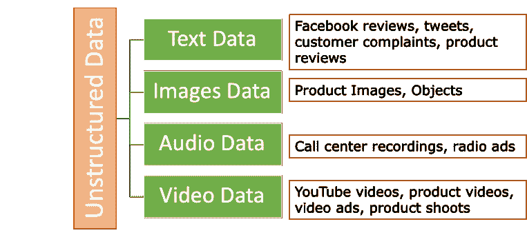

虽然深度学习也可以用于结构化数据集，但它在非结构化数据集上的表现却是非常出色的。其主要原因之一是，经典的机器学习算法在像图像、文本、音频和视频这样的非结构化数据集上有时并不那么有效。我们列举了深度学习在各个领域取得的一些突破性解决方案。

1.  **医学和制药**: 深度学习在骨骼和关节问题的识别，或者在确定动脉或静脉中是否有血栓等领域发挥作用。在制药领域，它可以加快临床试验的进程，并帮助更快地找到目标药物。

1.  **银行和金融业**: 基于深度学习的算法可用于检测交易中潜在的欺诈行为。利用基于图像识别的算法，我们还可以区分支票上的伪造签名。

1.  **汽车行业：** 你一定听说过自动驾驶，即自动驾驶汽车。使用深度学习，算法能够检测道路上的交通信号、行人、其他车辆、它们之间的距离等。

1.  使用深度学习技术可以实现**自动语音识别**。通过复杂的神经网络，人类能够创建语音识别算法。这些解决方案被应用于 Siri、Alexa、Translator、百度等产品中。

1.  **零售业：** 在零售行业中，使用基于深度学习的算法，人类能够改善客户定位，并开发先进和定制的营销策略。使用深度学习改进了提供下一优产品推荐的模型。我们能够获得更好的投资回报率（ROI），并改善交叉销售和上销售策略。

1.  **图像识别：** 神经网络正在改进我们的图像识别技术：可以使用卷积神经网络来实现，这种技术正在改进计算机视觉。使用案例有很多，比如：

1.  深度学习对于区分癌细胞和良性细胞非常有效。可以通过使用癌细胞和良性细胞的图像来实现。

1.  使用神经网络已经开发了自动车牌识别系统。

1.  使用深度学习可以开发目标检测方法。

1.  使用深度学习可以开发运动感知和跟踪系统。

1.  在灾难管理系统中，深度学习可以检测受影响区域的人员存在。想象一下，使用更好的检测技术可以拯救多么宝贵的时间，最终拯救人的生命。

所列举的使用案例并不详尽。通过深度学习，我们能够改进用于测量客户情感、语言翻译、文本分类、命名实体识别等的自然语言处理（NLP）解决方案。在生物信息学、军事、移动广告、电信、科技、供应链等领域的使用案例中，深度学习正在为未来铺平道路。

我们已经介绍了深度学习的强大之处。现在我们将开始讲述神经网络的构建模块。

## 8.3 神经网络的构建模块

人工神经网络（ANNs）据说受到了人脑工作方式的启发。人脑是我们目前能够接触到的最好的机器。当我们看到一张图片、一张脸或听到一首曲子时，我们会为其贴上一个标签或名称。这使我们能够训练我们的大脑和感官，以便在再次看到/听到时识别出一张图片、一张脸或一首曲子。

人工神经网络通过学习或接受训练来执行类似的任务。

 小测验 - 回答这些问题来检查你的理解。本书末尾附有答案。

1.  深度学习的含义是什么？

2.  神经网络不能用于无监督学习。真或假？

3.  探索深度学习在非传统业务领域的更多应用案例。

接下来，我们将在下一节中探讨神经网络如何帮助解决商业问题。

### 8.3.1 解决方案的神经网络

在深度学习中，监督和非监督学习的概念也适用。我们将介绍网络的两种训练类型：有监督和无监督。这为您提供了完整的图片。同时，为了充分欣赏无监督的深度学习，建议首先了解有监督深度学习的过程。

举个例子，让我们了解深度学习的过程。例如，我们希望创建一个可以识别人脸的解决方案，也就是说，一个可以区分面部并通过给面部分配一个名称来识别人物的解决方案。为了训练模型，我们将准备一个包含人脸图像和相应名称的数据集。在训练过程中，人工神经网络（ANN）不具有先前对图像数据集或属性的了解。在训练过程中，ANN 会从训练数据中学习属性和识别特征，并利用这些学习到的属性来区分面部。此时，我们只涵盖了高层次的过程，后续章节将更详细地介绍这个过程。

您可以在图 8-2 中看到神经网络的表示形式。

##### 图 8-2 是一个典型的神经网络，有神经元和各种层。

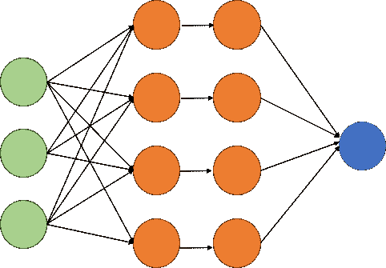

神经网络中的过程相当复杂。我们将首先介绍神经网络中所有构建块的内容，例如神经元、激活函数、权重、偏置项等，并然后讨论神经网络中的过程。我们将从主角-神经元开始。

### 8.3.2 人工神经元和感知器

人类大脑包含数十亿个神经元。神经元是我们大脑中相互连接的细胞。这些神经元接收信号，处理它们并产生结果。人工神经元基于生物神经元，并可以被认为是生物神经元的简化计算模型。

1943 年，研究人员 Warren McCullock 和 Walter Pitts 提出了一个简化的脑细胞概念，称为 McCullock-Pitts（MCP）神经元。它可以被认为是一个具有二进制输出的简单逻辑门。

人工神经元的工作方法类似于生物神经元，尽管它们比生物神经元简单得多。感知器是生物神经元的数学模型。在实际的生物神经元中，树突从其他神经元的轴突中接收电信号。在感知器中，这些电信号被表示为数字值。

人工神经元接收来自前一神经元的输入，或者可以接收输入数据。然后处理输入信息并输出结果。输入可以是原始数据或来自前一神经元的处理信息。神经元将输入与其自身的内部状态结合起来，分别加权并通过非线性函数传递接收到的输出以生成输出。这些非线性函数也被称为激活函数（我们稍后会讨论它们）。您可以将激活函数视为数学函数。可以将神经元表示如图 8-3 所示。

##### 图 8-3 神经元获得输入，使用数学函数处理输入，然后生成输出

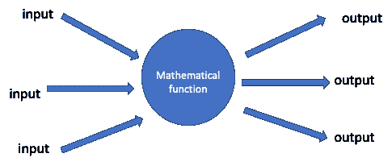

简单来说，神经元可以称为一个计算其输入数据集的加权平均值的数学函数，然后将这个总和通过激活函数进行处理。然后神经元的输出可以成为下一个神经元的输入，该神经元再次处理接收到的输入。让我们再深入一点。

在感知器中，每个输入值都乘以一个称为*权重*的因子。生物神经元在总强度的输入信号超过一定阈值时激活。在感知器中也遵循类似的格式。在感知器中，计算输入数据的加权总和，然后对每个输出应用激活函数。然后每个输出可以馈送到感知器的下一层。

让我们假设感知器 X 有两个输入值“a”和“b”，为了简单起见，它只有一个输出。让 a 和 b 分别的权重为 P 和 Q。所以，加权总和可以表示为：P*x + Q*b。只有当加权总和超过一定阈值时，感知器才会激活或产生非零输出。让我们称阈值为“C”。因此，我们可以说：

如果 P*x + Q*y <= C，则 X 的输出将为 0

如果 P*x + Q*y > C，则 X 的输出将为 1

如果我们概括这一理解，我们可以表示如下。如果我们将感知器表示为一个函数，该函数将输入"x"映射为如下函数

f(x) = 1 如果 w*x + b > 0

否则为 0

其中：

x 是输入值的向量

w 表示权重向量

b 是偏置项

我们将在此处解释偏差和权重项。

回想一下线性方程：y = mx+ c 其中 m 是直线的斜率，c 是常数项。 偏置和权重都可以使用相同的线性方程定义。

权重：权重的作用类似于线性方程中直线的斜率。它定义了 f(x)的值在 x 的值单位变化时的变化。

偏置：偏置的作用类似于线性函数中常数的作用。如果没有偏差，激活函数的输入就是 x 乘以权重。

权重和偏置项是网络中进行训练的参数。

函数的输出将取决于所使用的激活函数。在我们讨论完网络中不同层之后，我们将在下一节介绍各种类型的激活函数。

### 8.3.3 网络中的不同层

一个简单而有效的组织神经元的方式如下。与其允许任意神经元连接到任意其他神经元，不如将神经元组织成层次结构。一层中的神经元的所有输入仅来自上一层，并且所有输出仅传递到下一层。没有其他连接，例如同一层中的神经元之间的连接，或者属于远程层的神经元之间的连接（对于一个相当特殊的情况有一个小小的例外，但超出了本书的范围）。

我们知道信息通过神经网络流动。这些信息在网络中的一层又一层地被处理和传递。如图 8-4 所示，神经网络有三层。典型的神经网络如下图所示：

##### 图 8-4 一个具有神经元和输入、隐藏和输出层的典型神经网络

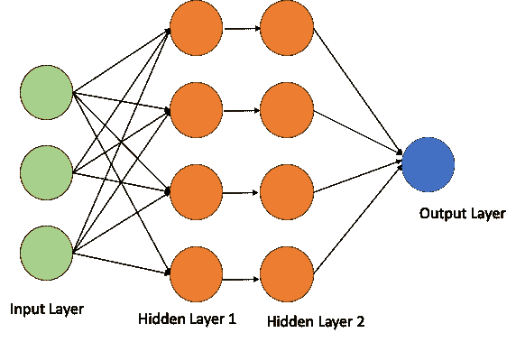

图 8-4 所示的神经网络有 3 个输入单元，2 个每个有 4 个神经元的隐藏层和一个最终的输出层。

**输入层**：顾名思义，它接收输入数据并与隐藏层共享。

**隐藏层**：它是网络的核心和灵魂。隐藏层的数量取决于手头的问题，层数可以从几层到数百层不等。在这些层中进行所有的处理、特征提取和属性学习。在隐藏层中，所有的输入原始数据都被分解成属性和特征。这种学习对以后的决策有用。

**输出层**：决策层和网络中的最后一块拼图。它接受来自前面隐藏层的输出，然后做出预测。

例如，输入的训练数据可能是原始图像或处理过的图像。这些图像将被馈送到输入层。数据现在传输到隐藏层，其中所有的计算都是由每一层的神经元完成的。输出是需要完成的任务，例如识别一个对象或者如果我们想要对图像进行分类等。

ANN 由各种连接组成。每个连接的目标是接收输入并将输出提供给下一个神经元。这个输出将作为下一个神经元的输入。另外，正如之前讨论的，每个连接都被赋予一个权重，这代表了其相应的重要性。值得注意的是，一个神经元可以有多个输入和输出连接，这意味着它可以接收多个输入并提供多个输出。

 **小测验** - 回答这些问题来检查你的理解。答案在书的末尾。

1.  输入数据被馈送到神经网络的隐藏层中。是或否？

2. 偏置项类似于线性方程的斜率。对或错。

3. 查找并探索有史以来训练最深的神经网络。

那么，一个层的作用是什么呢？ 一个层接收输入，处理它们，并将输出传递给下一个层。 从技术上讲，层实现的转换必须由它的权重参数化，这也被称为层的参数。 为了简化，为了使神经网络能够“训练”到一个特定的任务，必须更改网络中的某些内容。 结果证明，改变网络的架构（即神经元如何彼此连接）只有很小的影响。 另一方面，正如我们将在本章后面看到的，改变权重是“学习”过程的关键。

我们现在将转移到非常重要的激活函数主题。

### 8.3.4 激活函数

回想一下，在最后几节中，我们介绍了激活函数。 激活函数的主要作用是决定神经元/感知器是否应该发射。 它们在后期的网络训练中起着核心作用。 有时它们被称为*传输函数*。 还重要的是要知道为什么我们需要非线性激活函数。 如果我们仅使用线性激活函数，输出也将是线性的。 同时，线性函数的导数将是常数。 因此，学习的可能性将不大。 因此，出于这样的原因，我们更喜欢具有非线性激活函数。

我们现在将研究最常见的激活函数。

#### Sigmoid 函数

Sigmoid 是一个有界的单调数学函数。 Sigmoid 是一个数学函数，当输入值增加时，其输出值总是增加的。 其输出值始终在 -1 和 1 之间。

它是一个可微函数，具有 S 形曲线，其一阶导函数呈钟形。 它具有非负的导函数，并且对所有实数输入值定义。 如果神经元的输出值在 0 和 1 之间，则使用 Sigmoid 函数。

从数学上讲，sigmoid 函数是：

##### （方程式 8.1）

S(x) = 1 = e^x

1 + e^(-x) e^x +1

sigmoid 函数的图形可以在图 8-5 中显示。

##### 图 8-5 显示了一个 sigmoid 函数。请注意函数的形状和最小/最大值。

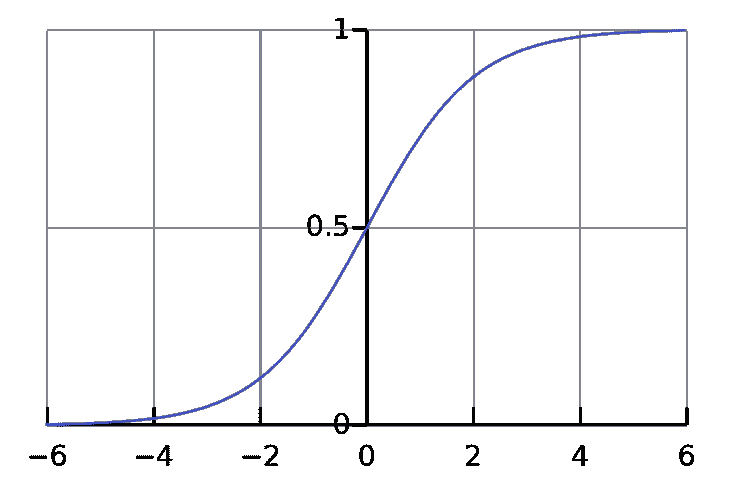

Sigmoid 函数在复杂学习系统中找到其应用。 通常用于二进制分类和网络的最终输出层。

#### Tanh 函数

在数学中，双曲正切函数或 tanh 是一个可微的双曲函数。它是一个平滑函数，其输入值在 -1 到 +1 的范围内。

Tanh 函数被写成方程式 8.2。

##### （方程式 8.2）

Tanh(x) = ex – e-x

ex + e-x

双曲线的图形表示如图 8-6 所示。它是 Sigmoid 函数的缩放版本，因此可以从 Sigmoid 函数导出 tanh 函数，反之亦然。

##### 图 8-6 这里显示了一个 tanh 函数，它是 sigmoid 函数的缩放版本

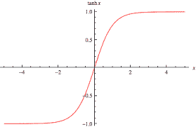

tanh 函数通常用于隐藏层。它使均值接近于零，从而使网络中的下一层训练更容易。这也被称为*数据居中*。

#### Rectified Linear Unit 或 ReLU

Rectified Linear Unit 或 ReLU 是一个定义参数的正部分的激活函数。我们在下面展示了 ReLU 函数。注意，即使对于负值，值也为 0，并且从 0 开始倾斜。

##### （方程 8.3）

F(x) = max (0, x)

即，如果是正数，则输出为 x，否则为 0

图 8-7 显示了 ReLU 函数

##### 图 8-7 这里显示了 ReLU 函数，它是神经网络隐藏层中受欢迎的激活函数之一。ReLU 易于使用且训练成本较低。

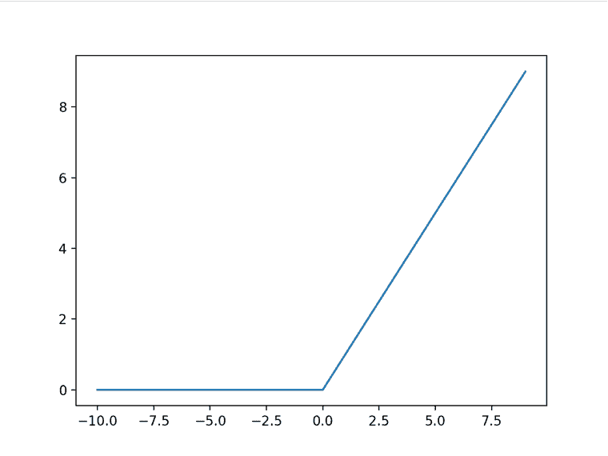

它是一个简单的函数，因此计算成本较低，速度更快。它是无界的，并且不以零为中心。除零点外，它在所有位置上都可微。由于 ReLU 函数较不复杂，计算成本较低，因此在隐藏层中被广泛用于更快地训练网络。

#### Softmax 函数

Softmax 函数用于神经网络的最后一层，以从网络中生成输出。它是激活函数，输出可以是图像的最终分类，用于不同的类别。它是一个对于多类分类问题有用的激活函数，并强制神经网络输出总和为 1。

例如，如果图像的不同类别是汽车、摩托车或卡车，则 Softmax 函数将为每个类别生成三个概率。获得最高概率的类别将是预测的类别。

还有其他激活函数，如 ELU、PeLU 等，超出了本书的范围。我们在本章末尾提供了各种激活函数的摘要。

我们将在下一节中介绍超参数。它们是我们在训练网络时拥有的控制杆。

### 8.3.5 超参数

在训练网络时，算法不断学习原始输入数据的属性。同时，网络无法自行学习所有内容，有些参数需要提供初始设置。这些变量决定了神经网络的结构以及训练网络时有用的相应变量。

我们在开始网络训练之前提供超参数。超参数的一些例子包括网络中隐藏层数的数量、每个层中神经元的数量、层中使用的激活函数、权重初始化等。我们必须选择超参数的最佳值。为此，我们选择一些合理的超参数值，训练网络，然后测量网络的性能，然后调整超参数，然后重新训练网络，重新评估和重新调整，这个过程继续进行。

超参数是由我们控制的，因为我们输入超参数来提高性能。

#### 梯度下降和随机梯度下降

在任何基于预测的解决方案中，我们希望尽可能好地预测，换句话说，我们希望尽可能减少错误。误差是实际值和预测值之间的差异。机器学习解决方案的目的是找到我们函数的最优值。我们想减少错误或最大化准确性。梯度下降可以帮助实现这一目的。

梯度下降技术是一种优化技术，用于找到函数的全局最小值。我们迭代地沿着最陡的下降方向前进，这个方向是由负梯度定义的。

但梯度下降在运行非常大的数据集或具有非常高维数的数据集时可能运行速度较慢。这是由于梯度下降算法的一次迭代会针对训练数据集中的每个实例进行预测。因此，很显然，如果我们有成千上万条记录，它将花费很长时间。对于这种情况，我们有随机梯度下降。

在随机梯度下降中，系数不是在数据批次结束时更新，而是对每个训练实例进行更新，因此需要较少的时间。

下面的图显示了梯度下降的工作方式。注意我们如何朝向全局最小值进展。

##### 图 8-8 梯度下降的概念。这是最小化损失函数的机制


#### 学习和学习率

对于网络，我们采取各种步骤来提高解决方案的性能，学习率就是其中之一。学习率将定义模型减少错误所采取的纠正步骤的大小。学习率定义了我们应该如何调整网络权重的值，以使其相对于损失梯度（这个过程的更多信息将在下一节提供）调整的数量。如果我们采用较高的学习率，准确性会降低。如果我们采用非常低的学习率，训练时间将大大增加。

 小测验-回答这些问题以检验您的理解。答案在本书结尾处。

1.  比较并对比 Sigmoid 和 tanh 函数。

2.  ReLU 通常用于网络的输出层。是或否？

3. 梯度下降是一种优化技术。真或假。

我们现在已经了解了深度学习的主要概念。现在让我们研究一下神经网络是如何工作的。我们将了解各个层是如何相互作用的，以及信息是如何从一层传递到另一层的。

## 8.4 深度学习如何在监督方式下工作？

我们现在已经介绍了神经网络的主要组成部分。现在是所有部分汇聚在一起，组织整个学习的时候了。神经网络的训练是一个非常复杂的过程。整个过程可以按照以下步骤一步步地进行检查。

也许你会想知道神经网络的学习是什么意思。学习是一个过程，为了所有网络层找到最佳和最优化的权重和偏置值，以便我们可以达到最佳准确度。由于深度神经网络在权重和偏置项方面实际上具有无限的可能性，我们必须找到所有参数的最优值。考虑到改变一个值会影响其他值，这似乎是一项艰巨的任务，而实际上它是一个各种网络参数在变化的过程。

回想一下，在第一章中我们介绍了监督学习的基础知识。我们将在这里刷新对此的理解。刷新监督学习的原因是确保您能够充分理解训练神经网络的过程。

### 8.4.1 监督学习算法

一个快速的定义是 - 监督学习算法具有“指导”或“监督”，以指导向着实现未来预测的业务目标。

正式地说，监督模型是使用输入数据和期望输出来预测未来的统计模型。输出是我们希望预测的值，被称为*目标变量*，用于进行预测的数据称为*训练数据*。目标变量有时被称为*标签*。数据中存在的各种属性或变量称为*独立变量*。每个历史数据点或*训练示例*都包含这些独立变量和相应的目标变量。监督学习算法对未来看不见的数据进行预测。解决方案的准确性取决于所进行的训练以及从标记历史数据中学到的模式。

大多数深度学习解决方案都基于监督学习。然而，无监督深度学习正在迅速获得认可，因为未标记的数据集比标记的数据集更加丰富。

例如，如果我们希望创建一个可以识别人脸的解决方案。在这种情况下，我们将有：

训练数据：来自不同角度的人脸图像。

目标变量：人的姓名。

这个训练数据集可以输入到算法中。然后算法将理解各种面部的属性，或者换句话说，*学习*各种属性。基于所进行的训练，算法可以对面部进行预测。如果概率得分表明面部属于某人 X，那么我们可以安全地说该面部属于某人 X。

监督学习问题用于需求预测、信用卡欺诈检测、客户流失预测、保费估算等。它们在零售、电信、银行和金融、航空、保险等行业被广泛应用。

我们现在为您刷新了监督学习的概念。我们将现在转移到神经网络训练的第一步，即前馈传播。

### 8.4.2 第 1 步：前馈传播

让我们开始神经网络中的过程。我们尝试在图 8-9 中创建一个说明性的图表。这是我们为了解释该过程而创建的网络的基本骨架。我们假设有一些输入数据点，我们将有输入数据层，该层将消耗输入数据。信息从输入层流向数据转换层（隐藏层）。在隐藏层中，使用激活函数处理数据，并基于权重和偏置项进行处理。然后对数据集进行预测。这称为*前馈传播*，因为在此过程中，输入变量按顺序从输入层到输出层计算。

让我们拿同样的问题来解释 8.3 节中监督算法中的过程。例如，如果我们希望创建一个能够识别人脸的解决方案。在这种情况下，我们将有

训练数据：来自各个角度的不同人脸图像。

目标变量：人的姓名。

这个训练数据集可以输入到算法中。然后网络将理解各种面孔的属性，或者换句话说，*学习*面部数据的各种属性。基于所进行的训练，算法可以对面部进行预测。如果概率得分表明面部属于某人 X，那么我们可以安全地说该面部属于某人 X。

##### 图 8-9 神经网络训练过程的基本骨架，我们有输入层和数据转换层。

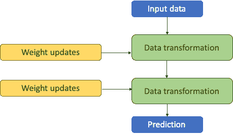

一旦在隐藏层中完成数据处理，就会生成一个预测，即面部属于某人 X 的概率。

### 8.4.3 第 2 步：添加损失函数

第 1 步生成输出。现在我们必须评估该网络的准确性。我们希望我们的网络在识别面部时具有尽可能高的准确性。并使用算法生成的预测，我们将控制并提高网络的准确性。

网络中的准确度测量可以通过损失函数来实现，也被称为*目标函数*。损失函数比较实际值和预测值。损失函数计算差异分数，因此能够测量网络的表现如何以及错误率是多少。

让我们更新我们在第 1 步创建的图表，通过添加一个损失函数和相应的损失分数，来测量网络的准确性，如图 8-10 所示。

##### 图 8-10 添加了一个损失函数来测量准确性。

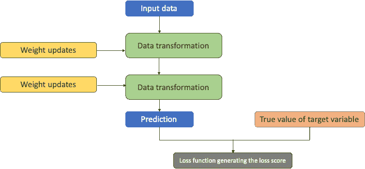

### 8.4.4 第 3 步：计算错误

我们在网络的第 1 步生成了预测。在第 2 步，我们将输出与实际值进行比较，以得到预测误差。我们解决方案的目标是最小化这个错误，即最大化准确性。

为了不断降低误差，损失分数（预测-实际）被用作反馈来调整权重的值。这个任务是由反向传播算法完成的。

## 8.5 反向传播

在上个部分的第 3 步中，我们说我们使用优化器不断更新权重以减小错误。学习速率定义了减小错误的修正步长的大小，反向传播用于调整连接权重。这些权重是根据错误向后更新的。随后，重新计算错误，计算梯度下降，并调整相应的权重。因此，反向传播有时被称为深度学习中的中心算法。

反向传播最初是在 20 世纪 70 年代提出的。然后在 1986 年，大卫·鲁梅尔哈特，杰弗里·辛顿和罗纳德·威廉斯的论文得到了很多赞赏。在现代，反向传播是深度学习解决方案的支柱。

下图显示了反向传播的过程，信息从输出层向隐藏层反向流动。注意，信息的流动是与正向传播相反的，正向传播中信息从左到右流动。反向传播的过程如图 8-11 所示。

##### 图 8-11 反向传播作为一个过程- 信息从最终层向初始层流动

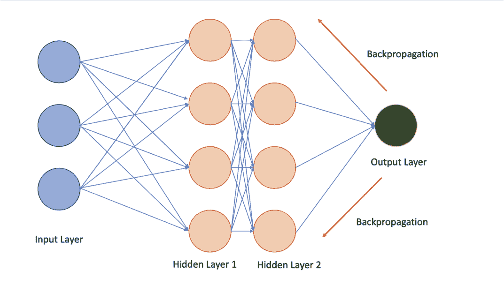

首先，我们将以非常高层次描述过程。记住，在训练过程的开始，在步骤 1 中，权重被分配了一些随机值。使用这些随机值，生成了初始输出。由于这是第一次尝试，收到的输出可能与实际值相差很大，相应的损失分数也很高。但这将要改善。在训练神经网络时，权重（和偏置）会在正确的方向上稍微调整，随后，损失分数减少。我们迭代这个训练循环很多次，最终得到最优的最小化损失函数的权重值。

反向传播允许我们在网络训练过程中迭代地减少误差。

下面的部分将涉及大量数学内容。如果你对过程背后的数学不感兴趣，可以跳过它。

### 8.5.1 反向传播背后的数学

要训练神经网络，我们计算一个损失函数。损失函数告诉我们预测值与实际值之间的差异有多大。反向传播计算损失函数相对于每个权重的梯度。有了这些信息，每个权重都可以在迭代中逐渐更新，从而逐渐减少损失。

在反向传播中，梯度是从网络的最后一层通过隐藏层到第一层计算的。所有层的梯度使用微积分链式法则组合在一起，以获得任何特定层的梯度。

现在我们将更详细地介绍这个过程。首先让我们表示一些数学符号：

1.  h^(i)) – 隐藏层 i 的输出

1.  g^(i))- 隐藏层 i 的激活函数

1.  w^(i))- 层 i 中的隐藏权重矩阵

1.  b^(i))- 层 i 中的偏置

1.  x- 输入向量

1.  N – 网络中的总层数

1.  W^(i))[jk]- 网络中从第(i-1)层节点 j 到第 i 层节点 k 的权重

1.  ∂A/∂B：它是 A 相对于 B 的偏导数

在网络训练过程中，输入 x 被馈送到网络，并通过各层生成输出ŷ。期望的输出是 y。因此，比较 y 和ŷ的成本函数或损失函数将是 C(y, ŷ)。此外，网络的任何隐藏层的输出都可以表示为：

##### （方程式 8.4）

h^((i)) = g^((i)) (W^((i)T) x + b^((i)))

这里，i（索引）可以是网络中的任意层

最终层的输出是：

##### （方程 8.5）

y(x) = W^((N)T) h^((N-1)) + b^((N))

在网络训练过程中，我们调整网络的权重以减少 C。因此，我们计算 C 相对于网络中每个权重的导数。以下是网络中每个权重的 C 导数

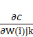

现在我们知道神经网络有很多层。反向传播算法从网络的最后一层开始计算导数，即第 N^(th)层。然后这些导数向后传播。因此，N 层的导数将被馈送到网络的(N-1)层，依此类推。

使用微积分链式法则分别计算 C 的导数的每个分量。

根据链式法则，对于一个依赖于 b 的函数 c，其中 b 依赖于 a，c 相对于 a 的导数可以写成

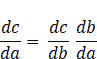

因此，在反向传播中，第 N 层的导数被用于第 (N-1) 层，以便保存它们然后在第 (N-2) 层再次使用。我们从网络的最后一层开始，遍历所有层直到第一层，并且每次，我们使用最后一次计算的导数来得到当前层的导数。因此，与普通方法相比，反向传播变得极其高效，因为我们不需要分别计算网络中的每个权重。

一旦我们计算出梯度，我们将更新网络中的所有权重。目标是最小化成本函数。我们已经在上一节中学习了类似梯度下降的方法。

我们现在将继续进行神经网络训练过程的下一步。

#### 步骤 4：优化

在上一节中我们学习了反向传播。它让我们能够优化我们的网络并实现最佳准确度。因此，我们也更新了图中的图 8-12。请注意优化器提供了定期和连续的反馈以达到最佳解决方案。

##### 图 8-12 优化是最小化损失函数的过程


一旦我们为我们的网络获得了权重和偏差的最佳值，我们称之为我们的网络已经训练完成。我们现在可以用它对未经训练的数据集进行预测。

现在你已经了解了深度学习的各个组件以及它们在监督方式下如何协同工作。我们现在将简要描述无监督深度学习。

## 8.6 无监督深度学习的工作原理

我们知道无监督学习解决方案用于未标记的数据集。对于无监督设置中的深度学习，训练数据集是未标记的。

与有标签的监督数据集相比，无监督方法必须自我组织以获取密度、概率分布、偏好和分组。我们可以使用监督和无监督方法来解决类似问题。例如，监督深度学习方法可用于识别狗和猫，而无监督深度学习方法可能用于将狗和猫的图片聚类到不同的组中。在机器学习中也观察到，许多最初构想为监督学习的解决方案，随着时间的推移采用了无监督学习方法来丰富数据，从而改进了监督学习解决方案。

在无监督深度学习的学习阶段，预期网络将模拟数据，然后根据错误进行自我改进。在监督学习算法中，还有其他方法起到与反向传播算法相同的作用。它们是：

1.  波兹曼学习规则

1.  对比散度

1.  最大似然

1.  霍普菲尔德学习规则

1.  Gibbs 采样

1.  深度信念网络等等

在本书中，我们将讨论自动编码器和深度信念网络。我们还将探索 GAN（生成对抗网络）。现在是时候让你检查所有用于深度学习的工具和库了。

 - 答题测验 - 回答这些问题以检查你的理解。答案在书的末尾。

1. 以简单形式写出反向传播技术的主要步骤。

2. 反向传播在无监督学习中更受欢迎。正确还是错误？

3. 深度学习的目标是最大化损失函数。正确还是错误？

## 8.7 流行的深度学习库

在过去的几章中，我们使用了许多库和包来实现解决方案。在行业中有很多用于深度学习的库。这些包加快了解决方案的构建，并减少了工作量，因为大部分繁重的工作都是由这些库完成的。

我们在这里讨论最流行的深度学习库：

**TensorFlow**：Google 开发的 TensorFlow（TF）可以说是最流行和广泛使用的深度学习框架之一。它于 2015 年推出，自那以后被全球许多企业和品牌使用。

Python 主要用于 TF，但也可以使用 C++、Java、C#、Javascript、Julia。你需要在系统上安装 TF 库并导入该库。

前往 www.tensorflow.org/install 并按照说明安装 TensorFlow。

TensorFlow 是最流行的库之一，也可以在 iOS 和 Android 等移动设备上运行。

**Keras**：Keras 是一个成熟的 API 驱动解决方案，非常易于使用。它是初学者的最佳选择之一，也是在易于理解和快速原型设计简单概念方面最好的选择之一。Keras 最初于 2015 年发布，是最受推荐的库之一。

前往 `keras.io` 并按照说明安装 Keras。可以使用 Tf.keras 作为 API。

使用 Python 生成器进行序列化/反序列化 API、回调和数据流传输非常成熟。在 Keras 中，庞大的模型被简化为单行函数，这使得它成为一个 less configurable 环境，因此非常方便和易于使用。

**PyTorch**：Facebook 的心头宝贝 PyTorch 于 2016 年发布，是另一个流行的框架。PyTorch 使用动态更新的图形，并允许数据并行和分布式学习模型。在 PyTorch 中有像 pdb 或 PyCharm 这样的调试器可用。对于小型项目和原型设计，PyTorch 可能是一个不错的选择。

**Sonnet**：DeepMind 的 Sonnet 是使用和基于 TF 开发的。Sonnet 专为复杂的神经网络应用和架构设计而设计。它通过创建与神经网络特定部分相对应的主要 Python 对象来工作。然后这些 Python 对象独立于计算 TF 图形地连接。由于这种分离（创建 Python 对象并将其与图形关联），设计得到了简化。

拥有高级面向对象类库非常有帮助，因为在我们开发机器学习解决方案时，它允许我们抽象化。

**MXNet**：Apache 的 MXNet 是一个高度可扩展的深度学习工具，易于使用并具有详细的文档。MXNet 支持许多语言，如 C ++、Python、R、Julia、JavaScript、Scala、Go 和 Perl。

还有其他框架，如 Swift、Gluon、Chainer、DL4J 等，但我们只讨论了流行的框架。

我们现在将检查 tensorflow 和 keras 中的一个简短的代码。这只是为了测试您是否已正确安装这些库。您可以在 https://www.tensorflow.org 和 https://keras.io 上了解更多关于 tensorflow 和 keras 的信息。

### 8.7.1 keras 和 tensorflow 的 Python 代码

我们在 tensorflow 中实现了一个非常简单的代码。我们只是导入了 tensor flow 库并打印“hello”。我们还会检查 tensorflow 的版本。

```py
import tensorflow as tf
hello = tf.constant('Hello, TensorFlow!')
sess = tf.Session()
print(sess.run(hello))
print("TensorFlow version:", tf.__version__)
```

如果此代码可以在您的计算机上运行并为您打印出 tensorflow 的版本，则意味着您已经正确安装了`tensorflow`。

```py
from tensorflow import keras
from keras import models
```

如果该代码对您运行并打印出 keras 的版本，那么这意味着您已正确安装了`keras`。

## 8.8 结束语

深度学习正在改变我们生活的世界。它使我们能够训练和创建真正复杂的解决方案，这些只是以前的想法。深度学习的影响可以在多个领域和行业中看到。也许没有一个行业不受深度学习奇迹的影响。

深度学习是研究和开发中最受追捧的领域之一。每年都有许多关于深度学习的期刊和论文发表。世界上重要机构和大学（如牛津、斯坦福等）的研究人员正全神贯注于寻找改进的神经网络架构。与此同时，世界知名机构（如谷歌、Facebook 等）的专业人员和工程师正在努力创建复杂的架构来提高我们的性能。

深度学习使得我们的系统和机器能够解决通常被认为是人类领域的问题。人们改进了药物行业的临床试验流程，改进了欺诈检测软件、自动语音检测系统、各种图像识别解决方案、更强大的自然语言处理解决方案、改进客户关系管理和推荐系统的定向营销解决方案、更好的安全流程等等。这个列表相当长，并且每天都在增长。

与此同时，仍然存在一些挑战。对深度学习的期望不断增加。深度学习不是解决所有问题的灵丹妙药或魔法棒。它确实是更为复杂的解决方案之一，但绝对不是所有业务问题的 100%解决方案。与此同时，我们需要为算法提供的数据集并不总是可用的。缺乏代表业务问题的高质量数据集。经常可以观察到，像谷歌、Meta 或亚马逊这样的大型组织可以负担得起收集如此大规模的数据集。而且很多时候，我们在数据中发现了很多质量问题。拥有处理这些复杂算法的处理能力也是一个挑战。随着云计算的出现，尽管这个问题在一定程度上已经得到了解决。

在本章中，我们探讨了神经网络和深度学习的基础知识。我们涵盖了神经元、激活函数、网络不同层次和损失函数的细节。我们还详细介绍了反向传播算法——用于训练监督深度学习解决方案的核心算法。然后，我们简要介绍了无监督深度学习算法。我们将在接下来的章节中详细介绍这些无监督深度学习解决方案。

我们还展示了主要的激活函数在图 8-13 中。

##### 图 8-13 主要激活函数一览（图片来源：towardsdatascience）

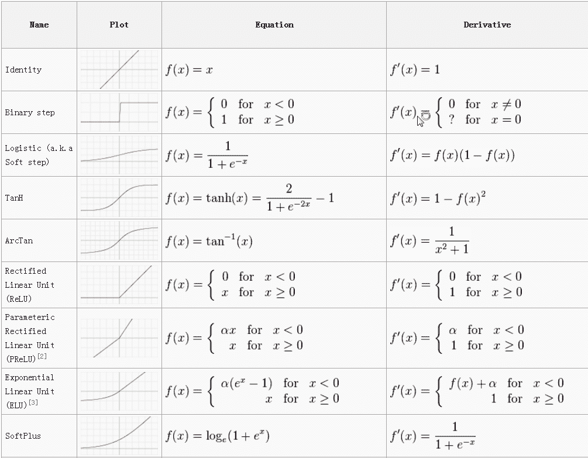

您现在可以转向练习问题。

#### 实用的下一步和建议阅读

1.  《[深度学习与 Python](https://www.amazon.cn/dp/B0785Q7GSY)》这本由 François Chollet 编写的书籍是澄清深度学习概念的最佳资源之一。它涵盖了深度学习和神经网络的所有概念，并由 Keras 的创作者编写。

1.  阅读以下研究论文：

1.  通过 G.Hinton 等人的论文《[在神经网络中提炼知识](https://arxiv.org/pdf/1503.02531.pdf)》

1.  通过 R. Srivastava 等人的论文《[训练非常深的网络](https://arxiv.org/pdf/1503.02531.pdf)》

1.  通过 Tomas Mikolov 等人的论文《[词和短语的分布式表示及其组合性（Word2Vec）](https://arxiv.org/abs/1310.4546)》

1.  通过 Ian J. Goodfellow 等人的论文《[生成对抗网络（GANs）](https://arxiv.org/abs/1406.2661)》

1.  通过 Kaining He 等人的论文《[用于图像识别的深度残差学习（ResNet）](https://arxiv.org/abs/1512.03385)》

## 8.9 总结

+   深度学习和神经网络

+   神经元的定义

+   不同类型的激活函数

+   不同类型的优化函数

+   神经网络训练过程

+   深度学习的各种库
