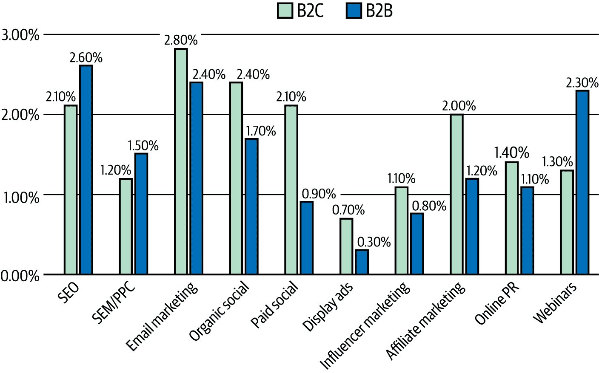
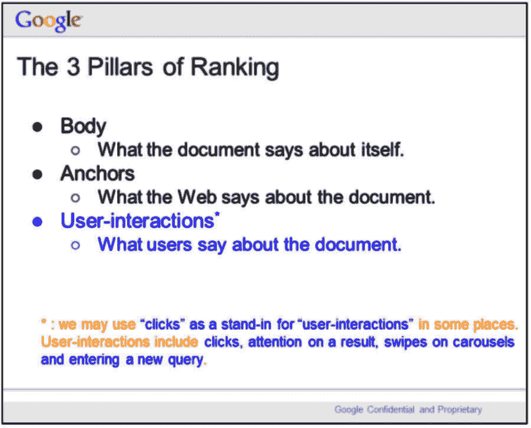
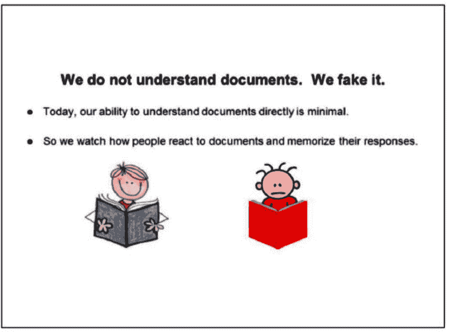
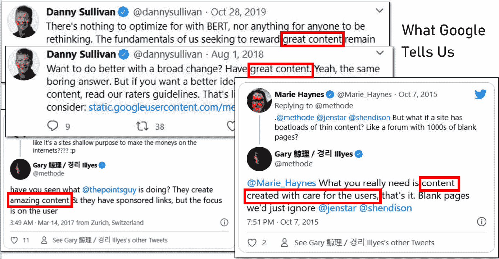
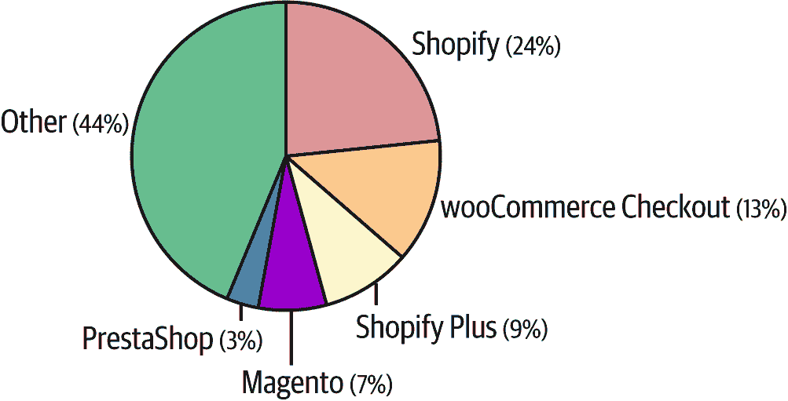
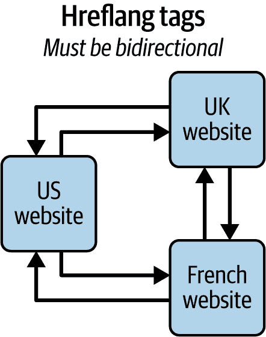
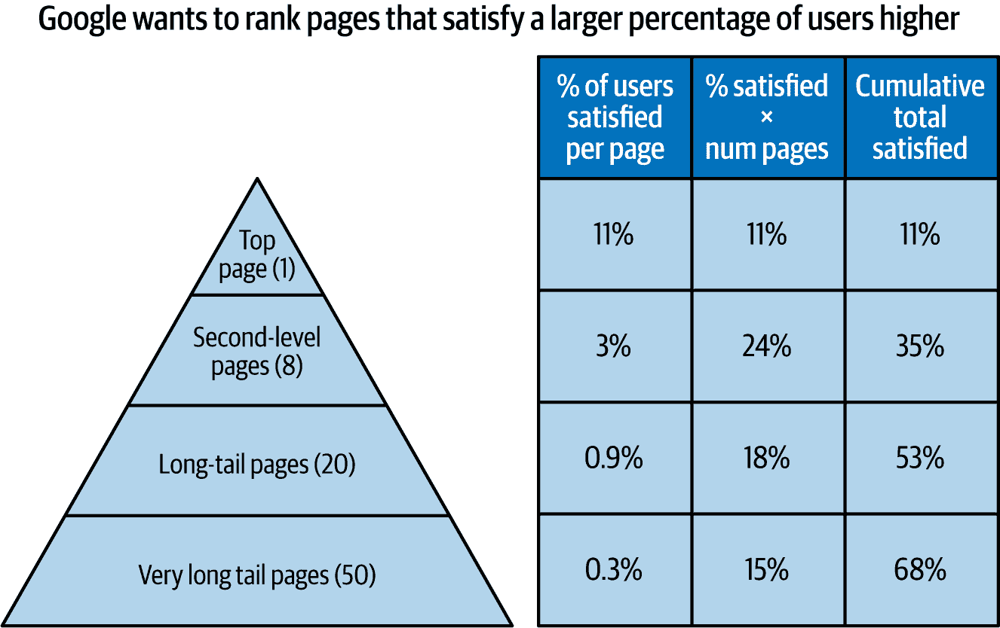

# 第一章\. 生成式 AI 时代的 SEO

人工智能的时代已经到来。AI 将产生广泛深远的影响，几乎会影响我们生活的方方面面，包括用户如何在线搜索他们所需的内容。因此，我们必须调整我们执行搜索引擎优化（SEO）的方式，以便将我们的品牌展示给用户。在本书中，我们将超越炒作和神话，而是专注于今天存在的生成式 AI 工具以及它们如何可以显著增强您的 SEO 项目。

在本章中，我们将讨论为什么有机搜索仍然是您可利用的最有价值的营销渠道之一，为什么 SEO 是优化您从该渠道获得的流量量的关键，以及为什么生成式 AI 工具不会改变这一点。您将通过深入研究[谷歌 2023 年对美国司法部（DOJ）的证词](https://oreil.ly/0zo-N)和[谷歌内容仓库 API 泄露](https://oreil.ly/oGoa8)来了解谷歌算法的实际工作方式，这两件事在 2024 年 5 月广为人知。

您会注意到，本章中我们所说的某些内容将与关于 SEO 如何工作的普遍观点有所不同。保持开放的心态。如果您负责获取资源或预算以执行 SEO 项目，这些信息将非常有用。这可能有助于您教育并赢得那些坚持过时观点的人的支持。对谷歌算法核心部分的深入了解也将使您更好地利用生成式 AI 作为增强 SEO 努力的工具。

在本章中，我们将涵盖以下内容：

+   关键术语

+   为什么 SEO 很重要

+   谷歌算法

+   您需要了解的谷歌的期望

+   您需要了解的常见技术 SEO 问题

+   您需要了解的内容 SEO

每个这些部分都将考虑生成式 AI 的影响以及我们从谷歌对美国司法部（DOJ）的证词和谷歌 API 泄露中学到的经验。

# 关键术语

在本书的整个过程中，我们将频繁使用以下关键术语：

搜索引擎优化（SEO）

通过对您的网站进行修改（例如技术更改、内容添加、内部链接等）以从搜索引擎推荐中获得更多流量，这是网站优化的实践。SEO 通常涉及构建一个为用户提供巨大价值的网站，并确保搜索引擎可以轻松读取和理解该网站（即，它对搜索引擎“友好”）。

技术 SEO

SEO 的一个子集，专注于对您网站的技术更改。这些更改可以采取多种形式，例如实施新的电子商务平台、更改 JavaScript 框架、实施 SEO 标签（例如，`rel=canonical`、`noindex`、`nofollow`和`hreflang`），并确保您的网站易于爬取。技术 SEO 的主要目的是确保搜索引擎机器人可以爬取和理解您的网页内容。

内容 SEO

SEO 的一个子集涉及创建高价值内容，这些内容搜索引擎可以考虑在搜索结果中进行排名。这包括理解哪些内容对用户最有帮助，创建它，并在您的网站上发布。

EEAT（经验、专业知识、权威性和可信度）

指的是一系列因素，谷歌认为这些因素与为用户提供价值以及您的组织和网站在市场上的接受程度有关。行业中的许多人认为这是直接排名因素，但对于大多数网站来说，除了健康和金融网站外，并不是这样。然而，谷歌确实跟踪其他因素，良好的 EEAT 应该会影响这些因素。我们将在第三章中进一步讨论这一点。

点击率 (CTR)

用户点击链接的百分比计算，例如搜索结果中的链接。例如，如果有一百人查看搜索结果，其中四个人点击了结果中的链接，我们可以说该链接的点击率是 4%。

转化率

计算访问网页的访客中转化为潜在客户、注册或销售（即“转化”）的百分比。例如，如果有一百人访问网页，其中五个人转化，转化率将是 5%。

生成式 AI

一种在大量数据上训练的人工智能，例如文本、图像和视频，然后可以以文本、图像或视频的形式对用户提示做出响应。生成式 AI 工具包括 ChatGPT、Microsoft Copilot、Gemini 和 Claude。

既然我们已经有了共同的语言，那么让我们来谈谈搜索引擎优化（SEO）及其在您组织成功中的作用。

# 为什么 SEO 很重要？

有几个关键原因说明 SEO 对您的组织非常有价值：

+   有机搜索是大多数网站流量最大的来源之一。

+   SEO 在数字营销渠道中提供了最高的转化率之一。

+   SEO 的投资回报率（ROI）潜力在数字营销渠道中是最高的。

让我们详细探讨这三个原因。

## 高流量潜力

有机搜索仍然是世界上大多数网站流量最高的来源之一。但为什么流量潜力如此之高？简单地说，因为谷歌上有如此多的搜索：[每天 85 亿个](https://oreil.ly/Z3LYm)，或者说每秒 99,000 个查询。此外，根据 BrightEdge Research 在 2020 年进行的[研究](https://oreil.ly/gWo73)，53%的所有点击都来自有机搜索。最近，[研究](https://oreil.ly/imesf)表明，AI 概述的出现降低了 SEO 流量潜力 35%，但即使有这种减少，SEO 仍然是一个非常有价值的渠道。因此，将 SEO 用于在搜索结果页面上领先于您的竞争对手对于您的组织至关重要。

###### 图 1-1\. 最高比例的点击（53%）来自有机搜索（数据来源：[Brightedge Research, “Organic Channel Share Expands to 53.3% of Traffic,” 2019](https://oreil.ly/gWo73))

您也可以在图 1-1 中看到，SEO 提供的流量比有机社交媒体多 10 倍。请注意，这个百分比是在内容的整个生命周期中计算的；对于社交媒体影响力强的组织，在内容首次发布时，社交媒体可能提供更大的流量份额。

有很多猜测认为生成式 AI 工具将大幅减少对传统搜索引擎的需求，但这极不可能。事实上，[SparkToro 的 Rand Fishkin 于 2025 年 3 月发布的数据](https://oreil.ly/GeEoZ)显示，谷歌的市场份额仍占 93.57%。生成式 AI 将有一定的影响，但它的错误倾向将阻碍它取代搜索。此外，还有一些查询不适合生成式 AI，例如当用户不太可能对大部分准确、大部分完整的文本响应感到满意时。一些例子包括：

+   用户有医疗状况，所以他们将会进行广泛的研究，并希望得到他们知道既 100%准确又完整的答案。

+   用户需要获得一个主题的全面知识，所以他们将会想要进行详细的研究。这方面的例子包括理解建造桥梁的步骤或学习 Python 以执行复杂的编程任务。

+   用户希望在准备职业认证考试（如 Praxis 教师资格考试）时获得帮助。

+   用户有即时的实时需求，例如查找附近的商家（例如，像“附近披萨”这样的本地搜索查询）。

[Gartner](https://oreil.ly/PR6xo)预测到 2026 年搜索引擎需求将减少 25%。这将是一个实质性的——但不是戏剧性的——减少。搜索引擎需求将仍然与您的组织高度相关。

## 高转化率

另一个有机搜索流量如此有价值的理由是它有很高的转化率。[Sage Consulting 的数据](https://oreil.ly/6q7Tg)，如图 1-2 所示，展示了许多不同渠道的转化率，SEO 是其中最好的之一。

###### 图 1-2\. 数字营销转化率（数据来源：[Sage Consulting, “Digital Marketing Conversion Rates: 2025 Report,” 2025](https://oreil.ly/6q7Tg))

SEO 的转化率往往很高，因为输入搜索查询的用户都有一个目的。他们想要得到某些东西，无论是获取信息、完成任务，还是研究或购买产品或服务。当他们点击搜索结果时，这表明他们认为该结果符合他们的需求。

一旦用户进入你的网站，你就拥有了一个有动机的客户，这可能会对你的组织产生预期的行动，例如购买、注册时事通讯等。即使他们只是想要信息，如果你是他们寻找信息的来源，他们仍然会与你所在的组织和网站关联一些价值。

## 高 ROI

SEO 的高转化率是 SEO 能够导致非常高的 ROI 的一个重要因素。由于从实施技术或内容 SEO 到看到收益的时间延迟，SEO 投资回报率很难衡量。这通常需要三到六个月。请注意，转化率将根据网站提供的产品或服务而有很大差异。

因此，关于 SEO 投资回报率的数据很少。尽管如此，一些机构已经发布了它们自己对 ROI 的评估。例如，[Terakeet](https://oreil.ly/q06Vg) 报告称 SEO 投资回报率在 5 倍到 12.2 倍之间，而[Profitworks](https://oreil.ly/AnWat) 报告的 SEO 投资回报率为 2.75 倍。图 1-3 显示了[*Search Engine Journal*对数字营销者的调查结果](https://oreil.ly/11aJ9)，其中 49%的人认为 SEO 是最高 ROI 渠道。

###### 图 1-3\. 最高 ROI 渠道（数据来源：[Search Engine Journal，“哪个数字营销渠道对您的网站 ROI 最高？”2018](https://oreil.ly/6q7Tg))

SEO 投资回报率高的另一个原因是，没有每次行动的成本，或者说“销售成本”。例如，在按点击付费（PPC）模型中，你为每次点击广告付费。同样，在展示广告中，你为广告投放位置付费（按展示次数、按点击次数或按行动次数）。因此，每次通过广告销售产生的直接成本都与第三方支付的广告投放位置相关。尽管如此，这些模型的优势在于它们是“直接响应”模型，这意味着对于你花费的每一美元，你都可以期待在短期内收回一些钱。这些模型的可预测性很高，并且通常可以调整以在已知的 ROI 水平上驱动收入。然而，直接响应模型的缺点是，由于响应的直接性和即时性，广告投放位置的竞争非常激烈，这推高了价格，导致 ROI 相对较低。

SEO 不是一个直接响应模型。当你投资 SEO 时，可能需要三到六个月才能看到结果，而且结果规模很难预测。此外，没有向第三方支付费用：在 SEO 中，你的内容在谷歌搜索结果中排名靠前，这是通过获得该位置实现的，你不需要为在谷歌上的存在向谷歌付费。

当然，SEO 是有成本的，这包括你投资在你代表自己工作的 SEO 团队以及与其他 SEO 团队合作的人员（如开发和写作团队）的资金。但由于 SEO 投资可能带来的排名和流量的不确定性，许多高级管理人员不愿意进行投资，或者限制投资规模。这通常导致他们无法充分利用许多增长有机搜索流量的机会。（注意：如果你使用生成式 AI 来协助你的 SEO 工作，这些工作的成本将更低，并将降低投资相关的风险。这就是这本书的原因！）这为更积极进取的组织打开了投资大门，并利用这些机会。因此，他们可以接触到更高回报率的转换。

正如你所看到的，优化你组织的网站，使其在潜在客户最有动力访问时出现，可以非常有价值。因此，了解搜索引擎算法的工作方式以优化你的 SEO 策略是值得的。

# 谷歌算法

在 2024 年 5 月，一位匿名人士让 Rand Fishkin 了解到来自谷歌的[泄露文件](https://oreil.ly/oGoa8)，这些文件提供了关于超过 2500 页 API 信息的详细信息，包括模块名称以及谷歌在其算法中使用的超过 10000 个参数。这些非凡的信息有助于阐明谷歌如何衡量网站的多方面内容，包括这些网站上的内容质量。

在 2023 年谷歌向美国司法部提交的证词中，有关谷歌算法如何工作的信息并未引起 SEO 专业人士的太多关注。特别值得注意的是谷歌向司法部提供的[内部演示](https://oreil.ly/G1E43)。这个幻灯片集具体概述了谷歌算法的工作方式。图 1-4 至 1-8 是该演示中的幻灯片，由美国司法部公开发布。你应该仔细审查这些幻灯片，因为它们展示了谷歌算法的关键概念，这些概念对你的 SEO 优化工作至关重要。

###### 图 1-4\. 谷歌内部演示：排名的三个支柱（来源：[美国司法部](https://oreil.ly/G1E43))

正如你在图 1-4 中可以看到的，谷歌指出排名被分为三个广泛的概念：

+   “文件对自己所说的内容”涉及到内容本身的性质。这正是内容中使用的单词和短语建立其相关性的地方。标题标签、标题标签、粗体、斜体和字体大小都在突出内容中最重要部分方面发挥作用。

+   “网络对文档的看法”指的是链接在排名中的作用，因此这些仍然是重要的排名因素。

+   “用户对文档的看法”是衡量用户与文档互动程度的指标，互动程度越高，意味着文档质量越高。

还要注意幻灯片底部的文本。这里演示表明跟踪的用户交互包括点击、对结果的关注、轮播图的滑动和输入新的查询。

在图 1-5 中展示的“用户交互信号”幻灯片，明确提出了这样一个概念：从谷歌搜索获得流量的页面上的用户交互数据被反馈给谷歌，这可以影响未来的搜索结果。该幻灯片上指定的交互包括阅读、点击、滚动和鼠标悬停。在图 1-4 和图 1-5 之间，你可以看到谷歌对用户交互的许多方面都感兴趣。

###### 图 1-5\. 谷歌内部演示：用户交互信号（来源：[美国司法部](https://oreil.ly/G1E43))

展示在图 1-6 中的幻灯片可以说是其中最有趣的一张，因为其标题：“我们不懂文档。我们假装懂。”然后谷歌澄清它观察人们如何对文档做出反应，并收集和存储相关数据。这让我们明白谷歌非常重视这些用户交互信号。

###### 图 1-6\. 谷歌内部演示：谷歌如何理解文档（来源：[美国司法部](https://oreil.ly/G1E43))

展示在图 1-7 中的幻灯片有助于阐明这些数据被反馈到系统中，并用于造福未来的用户。

最后，展示在图 1-8 中的幻灯片闭合了循环，并确立了用户交互数据被用于改进搜索结果，这就是它如何为未来的用户带来好处。你可以在 Danny Goodwin 在*Search Engine Land*上发表的出色文章中看到更多关于这个演示文稿的幻灯片：“在反垄断审判展品中必须看到的七个谷歌搜索排名文档”](https://oreil.ly/dqOM9)。

###### 图 1-7\. 谷歌内部演示：用户交互被谷歌存储（来源：[美国司法部](https://oreil.ly/G1E43))

###### 图 1-8\. 谷歌内部演示：用户交互改善搜索结果（来源：[美国司法部](https://oreil.ly/G1E43))

谷歌搜索副总裁 Pandurang Nayak 也[向司法部作证](https://oreil.ly/lyYES)关于谷歌算法的工作原理。在这份证词中，他提出了许多引人入胜的观察，包括以下两点：

+   谷歌自 2005 年以来一直在跟踪用户交互数据，可能甚至更早，并将这些数据作为其排名算法的关键部分。

+   谷歌在 2008 年推出 Chrome 浏览器的首要目标是收集更多的用户交互数据。

最后但同样重要的是，我们拥有包含在[谷歌 API 泄露文档](https://oreil.ly/fixv1)中的信息。解析这些文档并非易事，因为它们有超过 2,400 份。简而言之，这些文档让我们看到的是，谷歌拥有大量与用户交互相关的参数。这包括与点击相关的 30 多个变量，以及与悬停、滚动等相关的变量。

总结来说，谷歌利用其搜索结果与用户交互以及 Chrome 中的数据来帮助理解哪些网页最好地解决了哪些搜索查询，以及哪些内容质量最高。这包括研究点击模式和其他方面你在网站上的用户行为。因此，在你的网站上创造一个出色的用户体验（UX）是 SEO 的重要组成部分。

# 你需要了解的关于谷歌想要什么

在本节中，我们将讨论谷歌算法旨在寻找和排名的内容类型。我们的讨论将包括我们从谷歌 API 泄露中获得的高度有价值的信息。我们将从你需要做什么来让你的内容在谷歌搜索中排名更高的角度来讨论这一点。

在完成这三件事之后，你将获得有机搜索流量：

+   确保搜索引擎（在大多数国家主要是谷歌）可以读取和处理你的网站。这是通过在构建你的网站时采用周密考虑的技术方法来实现的。

+   发布了优秀的、能够很好地帮助网站用户的内容。谷歌衡量你的网页和网站质量的主要方式之一是通过衡量网站上的用户交互，以查看用户是否在获得良好的体验。

+   在市场上获得了一定的声誉和可见度，这表明你的内容是需求的（导致谷歌想要对其进行排名）。谷歌通过评估来自其他网站的链接来衡量这一点。此外，来自其他来源的流量，包括社交媒体网站、电子邮件、浏览器书签和直接输入流量，都是你网站声誉强大的迹象。

###### 注意

链接对包含链接的网页访问者越相关、越有价值，就越好。如果用户点击链接并来到你的网站，这些链接对你来说就具有更大的 SEO 价值。

也有一些网站可能会损害你的品牌。如果你在拥有大量低质量内容的第三方网站上发布，这不会对你的品牌产生好的影响。这是谷歌可以使用 Chrome 跟踪的数据。

几十年来，许多 SEO 专业人士专注于寻找操纵谷歌排名以谋取利益的方法。虽然大多数 SEO 专业人士试图遵守规则，但那些不遵守规则的人制造了足够的问题，迫使谷歌投入大量资源来揭露他们的策略。作为回应，谷歌创建了众多旨在打击搜索结果中垃圾邮件的算法。谷歌还维持着一支庞大的“网络垃圾邮件”专业团队，他们可以评估潜在的麻烦网站并分配手动排名惩罚。

这对谷歌来说很重要，因为其搜索引擎的成功最终取决于其向用户提供最佳可能结果的能力。用户对搜索结果的满意度推动了更高的使用率，并帮助谷歌保持其市场份额。这导致了谷歌极高的满意度。据 2024 年*搜索引擎土地*的一项调查，这一数字达到了 81%。

谷歌通过其搜索结果的质量来实现这一点。这取决于许多因素，但谷歌所有努力的目的是以下这些：

+   理解用户查询的意图

+   在整个网络中发掘与所有主题相关的高质量内容

+   将与用户查询相关的高质量内容匹配，并在搜索结果中向用户展示

这引出了谷歌从网站希望得到的核心内容：高质量的内容与优秀的用户体验相结合。我们可以在图 1-9 中看到这一点的证实，该图显示了自 2018 年以来谷歌发言人的推文。

###### 图 1-9\. 谷歌希望拥有高质量的内容

## 高质量内容对 SEO 成功至关重要

这一切意味着，你 SEO 项目的最佳策略集中在创建旨在帮助用户满足其需求和愿望的优质内容。当你深入到本书后面如何使用 AI 来扩展你的 SEO 项目时，你将了解到 AI 如何帮助创建这种优质内容。

以下是一些你可以影响你内容质量的关键方式：

+   作者的主题专业知识和审查及反馈过程中的审查程度

+   作者对内容的直接经验水平

+   内容是否为该主题带来了独特的专业知识或观点

做好这一点需要深入理解与您的业务相关的用户需求，并找到比竞争对手网站更好地满足这些需求的方法。[谷歌有一个页面](https://oreil.ly/la0Ah)专门概述了它建议内容创作者如何实现这些目标。谷歌还考虑了两个其他因素：

+   你的网站是否被认为是该主题的权威性

+   如果用户信任你在所选主题领域的组织和网站

###### 注意

生成式 AI 工具提供商使用的算法的作者进行的分析表明，他们同样对高质量内容感兴趣。因此，你对这种内容的任何投资都可能有助于你在 SEO、ChatGPT 搜索和其他基于 LLM 的搜索工具中的排名。

## 为网站访客提供卓越的用户体验

正如你在“谷歌算法”中看到的，谷歌直接测量用户在你网站页面上的互动，以了解你内容的品质。这也可能表明谷歌以汇总的形式查看这些数据，以了解你品牌的强度。仅基于这一点，已经很清楚，你需要将 UX 视为一个重要的 SEO 排名因素。

在图 1-9 中，我们看到谷歌经常告诉网站管理员他们需要发布高质量的内容。谷歌通过各种方式传达了创建高质量用户体验的需求，包括：

+   EEAT

+   核心网页关键指标

+   间歇性惩罚

+   需要安全网站（HTTPS）

+   检测和标记被黑网站

我们将在下一部分探讨这些内容。

### EEAT

我们在本章的开头介绍了经验、专业知识、权威性和信任的概念。这些是谷歌向网站发布者提供的指导方针，以帮助他们评估他们是否在创建对用户有价值的内容。谷歌不能直接衡量 EEAT，但会查看各种其他信号来衡量你内容的品质。这包括直接测量用户在你网站上的行为，以确定他们是否似乎根据他们在你网站上花费的时间、是否返回你的网站、有多少人似乎有良好的或不良的体验等因素，来找到他们所寻找的内容。

根据 API 泄露，谷歌似乎也跟踪文档的作者，因此可能存在与该作者内容典型参与度相关的信号。2025 年 3 月，谷歌的约翰·穆勒确认，谷歌确实跟踪这些类型的信号，用于谷歌所谓的“你的钱或你的生命(YMYL)”页面：与健康或财务相关的页面。然而，他也表示，他们不会跟踪专注于 YMYL 主题之外的网站的信息。此外，对 2024 年谷歌 API 泄露中包含的[文档](https://oreil.ly/fixv1)的详细审查没有提供谷歌实际上跟踪“经验”、“专业知识”、“权威性”和“可信度”除了作者之外的任何证据。基于此，似乎很可能，评估内容质量的大部分内容都是基于实际用户与内容的互动。

### 核心网页关键指标

在 2020 年，谷歌引入了*c**ore* *w**eb* *v**itals*的概念：一组与网页渲染性能相关的信号。这些最初包括：

最大内容渲染时间(LCP)

测量看到请求内容的大部分所需的时间

首次输入延迟（FID）

测量对用户输入的响应性

累积布局偏移（CLS）

测量网页在渲染过程中的稳定性

2024 年，谷歌将 FID（首次输入延迟）替换为交互到下一次绘制（INP），这也测量用户界面的响应性。谷歌转向 INP 是因为它相信 INP 能更好地衡量页面加载时间对页面用户体验质量的影响。

来自谷歌 API 泄露的数据显示，谷歌在其排名系统中积极跟踪这些信号。然而，尚不清楚这些信号被赋予多少权重。此外，如果你的网页比竞争对手慢得多，你可能会看到比竞争对手更低的用户参与度信号，这很可能是你确保页面快速加载的最重要原因。

### 交互式广告惩罚、HTTPS 和被黑网站

[谷歌](https://oreil.ly/uTgL7)已宣布三个与网站用户体验相关的其他信号：

交互式广告惩罚

如果谷歌检测到在初始页面加载时加载在用户正在寻找的内容之上的交互式广告，这可能会在该页面上提供负面的排名提升。

安全网站（HTTPS）

2014 年，谷歌大力推动网站出版商在其网站上实施 HTTPS 加密。虽然现在这是一个标准，但在当时并不是。使用 HTTPS 可以提供更大的保证，即用户将获得他们实际请求的内容，而不是在从你的 web 服务器到他们的浏览器传输过程中被篡改的内容（更多关于这一点，请搜索“中间人攻击”）。

被黑网站

谷歌还会标记被黑网站。这些网站可以在谷歌搜索和 Chrome 中被屏蔽。这样做的主要原因是为了保护用户免受不良体验。

这些用户体验信号是我们之前在“谷歌算法”中讨论的内容的补充。应该清楚的是，用户参与度是一个重要的排名因素——可能是第二大排名信号，仅次于内容与用户查询的相关性。

## 谷歌算法的局限性

谷歌处理网页的能力存在一些局限性。你需要注意的问题包括以下内容：

+   JavaScript 实现可能会影响爬取性。

+   电子商务和内容管理系统（CMS）的限制也可能阻碍有效的爬取。

+   谷歌希望我们使用 schema 标记来帮助它更好地理解网站内容。

+   谷歌希望我们使用 hreflang 标签，以便更容易清楚地了解网站的不同页面针对的语言或国家。

+   谷歌希望我们使用链接属性，如 nofollow、sponsored 和 UGC（用户生成内容），以帮助它识别那些不是真正推荐或引用的链接。

+   你需要为你的网站创建一个出色的用户体验（包括页面速度）。

+   当你移动内容时，你需要实施 301 重定向。

这些只是你可能需要解决的问题的一些例子，以便谷歌能够找到并理解你网站上所有有价值的内容。

# 你需要了解的常见技术 SEO 问题

在上一节中，我们提到了谷歌搜索的一些关键限制。这些都是需要通过修改你的网站来解决的问题的例子，而不仅仅是发布新内容。我们称之为*技术 SEO 问题*：你需要解决的问题，以帮助谷歌理解你的网站。我们将在下面讨论一些这些问题。

## JavaScript、电子商务平台和 CMS

每个开发环境都为网站开发带来了巨大的价值。它们使得网站的建设、修改和支持变得容易得多。然而，每个系统都有自己的局限性。虽然它们提供了简化开发过程的框架，但这些框架可能会引起潜在的问题。让我们更详细地看看这些问题：

JavaScript 框架和静态站点生成器（SSGs）

截至 2025 年，[98.8%的网站使用某种程度的 JavaScript](https://oreil.ly/4NDGd)，这通常以 JavaScript 框架或 SSG 的形式出现。它们可能会使网站难以爬取，导致网站非常缓慢，使得实现自定义标题标签变得更加困难，等等。正确处理这些问题需要你对所选平台进行详细的研究，然后让你的开发团队进行必要的更改以解决这些限制。

电子商务平台和 CMS

[关于 67%的所有网站都使用 CMS，超过 25%的前一百万个网站使用电子商务平台](https://oreil.ly/bnOjU)。图 1-10 显示了截至 2025 年 4 月 3 日，根据 BuiltWith 的数据，市场份额最高的电子商务平台。就像 JavaScript 一样，这些平台都有自己的局限性。即使是像 WordPress 这样的简单 CMS 也需要你使用插件来帮助设置 SEO。像 Yoast SEO 插件这样的流行插件使得编辑帖子标题标签和元描述以及添加 SEO 标签变得容易。没有这样的插件，这些事情是无法完成的。在电子商务平台上，也需要解决一些问题。例如，Shopify 需要[一个插件来优化 SEO](https://oreil.ly/QPrN9)，而 Magento 优化则需要安装 Amasty 或 Mageworx 等插件。

###### 图 1-10.按市场份额最受欢迎的电子商务平台（数据来源：[BuiltWith，“Top One Million Sites Ecommerce Usage Distribution，”2025](https://oreil.ly/fruos))

## 需要解决的其他技术 SEO 领域

除了开发环境中的问题之外，谷歌还以许多方式要求网站所有者提供更多关于他们网站的信息：

结构化数据

Google 建议网站所有者实施结构化数据，以帮助其更好地理解内容。[Schema.org](https://schema.org/)，由 Google、Bing 和 Yahoo!于 2011 年推出的一项倡议，是结构化数据的标准。在您的网站上实施此方案后，搜索引擎可以在搜索结果中以增强的格式显示您的页面。图 1-11 显示了实施结构化数据后的一种增强搜索结果的示例。

###### 图 1-11\. 示例增强搜索结果

Hreflang

如果您的网站支持多种语言，Google 希望您实施 hreflang 标签。这些标签帮助 Google（和 Bing）看到您页面的不同版本不是重复内容，因为它们针对不同的国家。图 1-12 显示了一个 hreflang 实现的简化示例。

###### 图 1-12\. Hreflang 标签实现

*.htaccess*文件

这些文件有多种不同的用途。其中与 SEO 相关的两个最流行的是重定向 URL 和阻止爬虫访问某些网页或网站的部分。例如，您可能希望阻止恶意爬虫访问您网站的任何页面，或者您可能已经将内容从一个 URL 移动到另一个 URL。

*robots.txt*

网站管理员也使用*robots.txt*来指导其网站如何被爬取。通常，您应该使用*robots.txt*来限制合法爬虫（如搜索引擎）的行为，并使用*.htaccess*来阻止恶意爬虫的爬取。

核心网页关键指标

这些与您网站的性能相关。Google 考虑了三个主要指标：LCP 衡量页面主要内容加载的速度；INP 衡量您的 Web 服务器能够多快地对用户请求做出可见响应；CLS 衡量在页面渲染过程中页面布局跳动的程度。

开发团队问题

您组织内的开发者通常在您网站上工作项目时，会尽力做正确的事情。但像其他人一样，他们也面临着满足截止日期的压力，而且他们可能对 SEO 了解得并不充分。这意味着在开发过程中，错误很可能会发生。您需要建立正确的流程，以确保在网站更新发布之前，对每个更新进行 SEO 审查。

人工智能可以在不同程度上帮助解决这些问题。随着我们进一步深入本书，我们将讨论许多这些问题以及如何解决它们。

# 您需要了解的内容 SEO

技术 SEO 在帮助谷歌发现你的内容并将其索引方面发挥着关键作用。其他一些因素，如结构化数据和页面速度，也有助于谷歌决定如何评估你发布的内容。尽管如此，技术 SEO 的大部分工作是为了让你的网站能够竞争 SEO 排名，但最终，谷歌将决定排名的是你创建的内容。

正如我们之前提到的，谷歌希望排名那些最能帮助用户的内容。内容 SEO（优化内容以帮助其排名良好的实践）有两个主要组成部分：

+   帮助谷歌理解你的内容是关于什么的

+   创建或优化内容，使其能够很好地满足用户需求。

相应地，内容 SEO 包括以下因素：

+   确保你创建的内容使用标题、标题、易于理解的页面结构和关键词来帮助搜索引擎确定页面的相关性。

+   制定所有与目标用户相关的主题和子主题的清单，并创建内容以彻底覆盖你的主题领域。

+   创建对最终用户具有高价值的内容。这需要成为你发布的每一篇内容的首要目标，并且需要主题专家（SMEs）参与内容的创建。在第四章（ch04.html#ch04_using_ai_to_scale_content_development_1748358216258351）中，我们将详细介绍生成式 AI 工具如何简化并增加这一过程的价值。

+   保持内容的新鲜度。随着内容的老化，它可能会过时或缺少关键的新角度，导致其价值对用户下降。定期更新你最重要的内容是内容 SEO 的关键方面。

如果用户在搜索与你的业务相关的话题，而你没有高质量页面直接针对该话题，你将没有机会为该查询排名。因此，内容 SEO 中最重要的一项任务就是确定你希望在网站上发布哪些内容。

这项工作的核心目标是构建一个全面的地图，涵盖所有用户可能选择输入的搜索查询，表明他们有你的组织可以解决的需求。幸运的是，你有许多方法可以获取这类信息。

关键词研究可以帮助你发现潜在客户在寻找类似你的产品或服务时在搜索引擎中输入的短语类型。图 1-13 显示了 Semrush 的一份样本关键词研究报告的一部分。这类信息可以帮助你了解你需要为网站创建哪些内容。它还显示了当这些需求与你的产品或服务能为他们做什么相关时，客户在考虑他们的需求时使用的语言。

###### 图 1-13. Semrush 样本关键词研究报告

然而，作者强烈建议您不要仅依赖关键词研究。对客户需求的研究也起着关键作用。您可以通过许多方式来做这件事：

+   与您的销售人员交谈，看看他们从潜在客户那里听到什么。

+   向您的产品管理或产品营销团队咨询。

+   查看用户在您的网站搜索工具中输入的搜索查询（如果您有的话——如果没有，您应该添加它，因为它是信息的重要来源）。

+   调查您的客户。

+   了解您的客户服务人员从客户那里听到什么。

+   提供在线聊天功能，以收集用户在您网站上提出的问题的数据。

+   在在线消息平台和像 Reddit 这样的网站上搜索相关页面，看看人们在那里提出了哪些相关问题。

所有这些都是了解客户和潜在客户认为他们的需求是什么的绝佳信息来源。然后，可以使用这些信息来制定您网站上需要的内容计划。

解决搜索的长尾问题也非常关键。**长尾**搜索查询是指每月搜索次数少于您最受欢迎的术语的查询。图 1-14 提供了不同类型搜索查询的表示，从高度流行的查询（“头部术语”）到相对不太流行的查询（“中间块状术语”），最后是很少输入的查询（“长尾术语”）。

###### 图 1-14\. 搜索的长尾（来源：[Ahrefs，“长尾关键词：它们是什么以及如何从它们中获得搜索流量”，2021](https://oreil.ly/BRWC_)）

###### 注意

图 1-14 中共享的 Ahrefs 数据是在 Google AI 概述或 AI 搜索模式出现之前创建的。这些无疑会影响这个曲线的形状。这种影响可能会增加长尾查询的百分比，因为用户会越来越习惯于输入自然语言查询。

长尾词有两个重要原因：

+   累计起来，它们大约代表了高度相关查询的三分之一。

+   这些查询通常由处于购买漏斗更深处的客户输入，因此它们往往比高流量搜索词有更多的转化。

因此，这些查询可能代表您潜在转化量的一半以上！

为您所有潜在的长尾搜索词创建内容可能很棘手。有时这些主题非常具体，不值得创建一个专门的页面来处理它们。您仍然可以通过确保相关内容在您网站上的另一个页面的上下文中得到涵盖来处理这些查询。

###### 注意

这种对深度的关注也将有助于您优化 LLM 搜索工具，如 ChatGPT Search。

涵盖的深度和广度也很重要。谷歌更喜欢将那些有很大可能满足用户所有相关需求的网页排名靠前。这意味着制定一个计划，创建与所有这些需求相关的内 容。当然，您不应该创建与您的业务无关的内容。图 1-15 说明了这一点的重要性和原因。

我们看到的是，特定主题（即针对相关头术语编写的页面）的顶级页面可能只会满足一小部分用户——大约 10%。大多数用户将需要更多信息。

了解这一点可能会让您考虑创建另一层页面——在图 1-15 中被称为“二级页面”——来处理中间的粗略术语。也许这些页面平均每页可以满足另外 3%的用户，这意味着我们现在可能为 35%的所有用户提供覆盖。

###### 图 1-15\. 为什么内容的广度和深度很重要

这可能会让您考虑更加细化，创建另外 20 页来处理一些长尾搜索词。平均而言，这些页面可能满足 0.9%的用户需求，或者在整个 20 页长尾集中达到 18%。将这 35%满意率与其他九页的满意率相加，您就满足了 53%的用户需求（终于超过一半）。

更高级的组织可能会选择用额外的 50 页来满足各种非常长的用户需求，平均每页满足另外 0.3%的用户。这样做可以使我们的满意访客增加 15%，总数达到 68%——超过三分之二。

您的组织网站可能需要的实际页数可能与本示例中使用的具体数字有很大差异，但相同的总体概念适用。您需要制定一个内容计划，以解决与您网站上涵盖的主题领域相关的用户需求的大多数问题。

###### 注意

您也可能创建过多的长尾页面。例如，如果您试图创建针对每个可能的搜索查询的页面，即使它们是其他搜索查询的微小变体，您可能会遇到问题。例如，“简历写作服务”和“写作服务简历”这样的查询不需要为每个查询创建一个页面——它们都满足相同用户的需求。

# 结论

在本章中，目标是提供一个关于技术 SEO 和内容 SEO 的概述。在考虑如何使用 AI 帮助您扩大 SEO 项目的工作时，了解这个背景很重要。在下一章中，我们将深入探讨生成式 AI 的世界，包括其优势和劣势。
