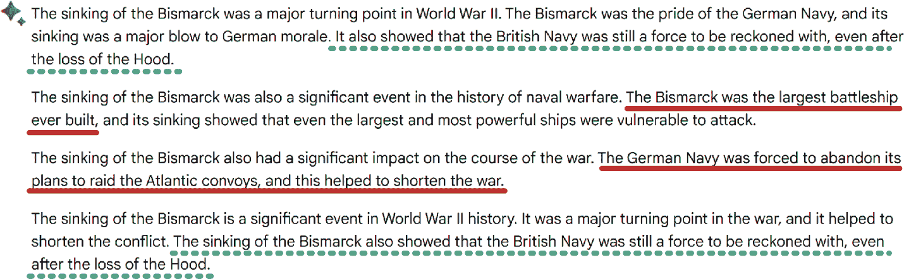
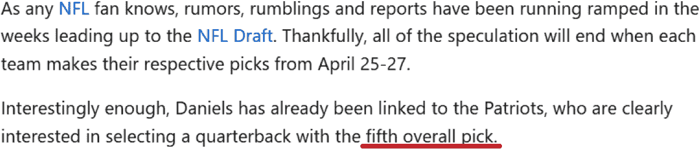
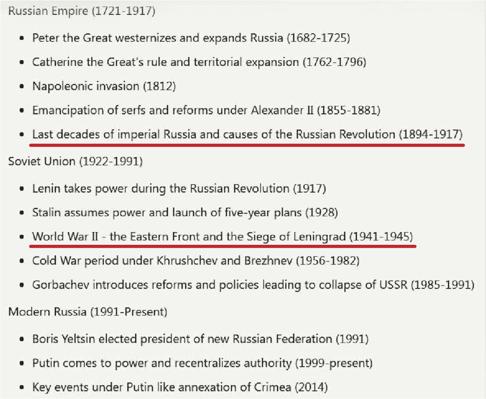
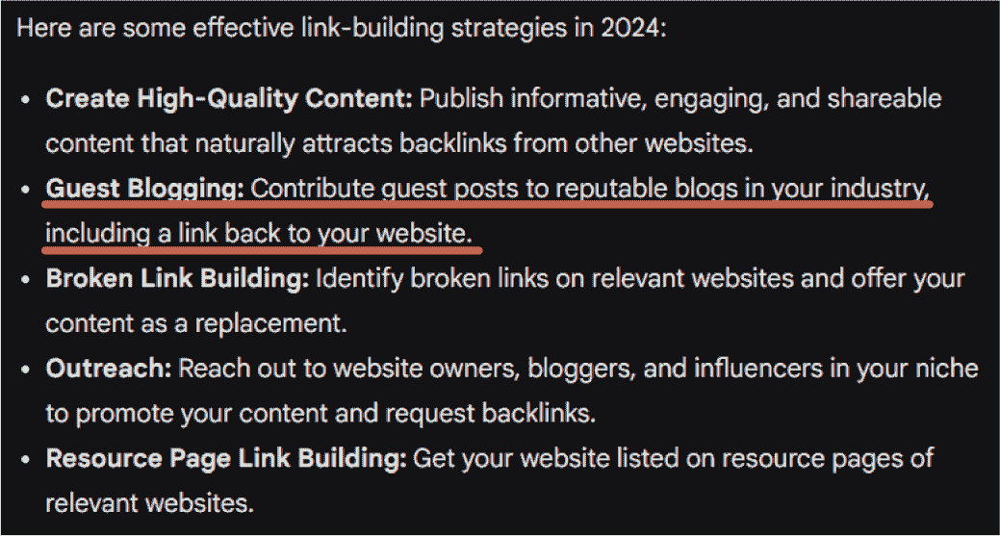
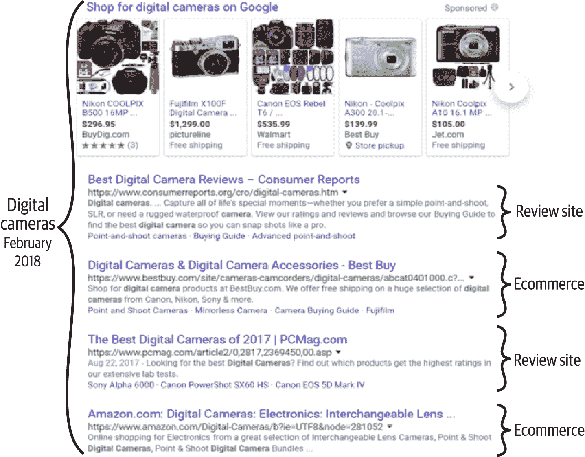
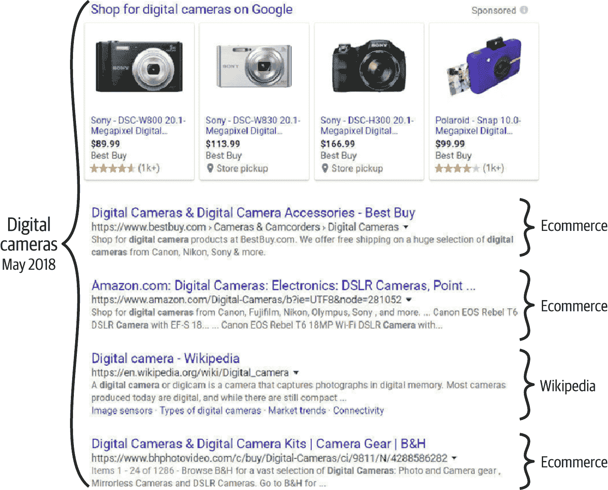
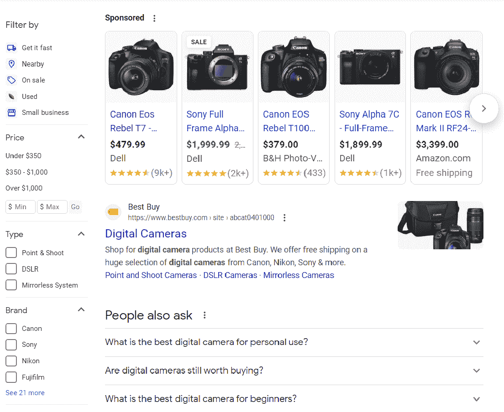
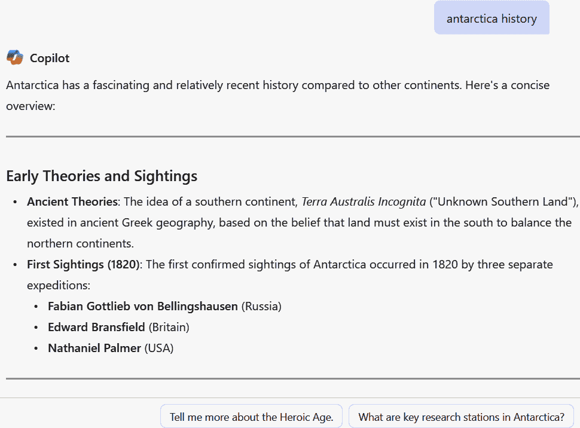
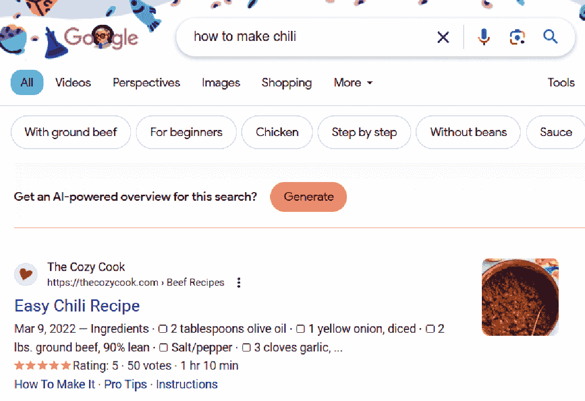

# 第二章：生成式人工智能的必要背景

第一章 为讨论人工智能时代的 SEO 奠定了基础。本章将向您提供关于生成式人工智能市场的基本知识，包括如何为您的 SEO 项目选择合适的工具。我们还将讨论生成式人工智能的局限性和它对搜索的影响。

我们将涵盖的主题包括：

+   理解生成式人工智能的关键技术术语

+   生成式人工智能市场的概述

+   生成式人工智能的当前局限性和潜在政府监管

+   生成式人工智能将如何影响 SEO 和改变搜索

# 关键术语

在我们开始之前，这里有一些关于生成式人工智能的技术术语，我们将在整本书中频繁使用：

大型语言模型（LLMs）

LLMs 是生成式人工智能工具的核心。它们是根据对开放互联网和/或其他大型数据源的爬取训练出来的理解语言的算法。这些基于神经网络，其大小是通过在算法训练期间神经网络中使用的参数数量来衡量的。增加神经网络的大小有可能增加 LLM 的功率和准确性，但如果参数数量增长过大，网络大小的增加可能会带来递减的回报或甚至引入新的错误（由于网络“过拟合”数据）。

神经网络

神经网络旨在以受人类大脑启发的模式处理数据，是训练人工智能算法中最强大的方法之一。它们使用多个层级的*节点*（也称为*参数*或*神经元*）来接收输入、处理输入，然后提供输出。从概念上讲，这个过程类似于解代数方程，但在训练 LLM 时，复杂性可能涉及数亿甚至数十亿的数据点。

节点

节点代表神经网络中的一个数据点。每个节点根据输入参数进行计算。然后节点输出一个参数，该参数输入到神经网络下一层的节点或成为输出。

参数

参数是神经网络模型中需要计算的组件。这些作为输入到节点的权重。参数数量越多，表明神经网络越复杂，可以解决更复杂的问题。

提示

提示是将用户输入发送到 LLM（大型语言模型）进行处理和输出的用户输入。在生成式人工智能中，提示的作用与搜索中的查询相同——它是用户表明他们正在寻找什么的方式。

令牌

Tokens（标记）是描述您可以提供给您的生成式 AI 工具的输入量以及它将为您提供多少输出的度量单位。输入（或输出）中的标记数量通常比单词数量大得多。每个 LLM 都有自己的单词标记化过程，但标记可以由整个单词、单词的一部分或单个字符组成。平均而言，一个标记通常由大约四个字符组成。我们谈论这个指标的原因是因为它与生成式 AI 工具如何分解输入和输出以确定其最大大小有关，因此，这些是您使用工具的约束。

既然我们已经有了生成式 AI 的通用语言，让我们来看看整体的 AI 格局。

# 生成式 AI 市场概述

虽然 AI 始于 20 世纪 50 年代，但 OpenAI 于 2022 年 11 月 30 日推出的 ChatGPT 彻底颠覆了世界。对于第一次，市场出现了一个工具，使用户能够与 AI 进行有意义的、深入的、互动的文本对话。ChatGPT、Microsoft Copilot、Gemini 和 Claude 可以通过多次提示来维持对话的上下文，并为复杂问题提供有意义的答案或生成完整的内容。虽然以前存在可以发出语音命令或与之交互的工具，但它们都没有这一代 AI 工具的深度和能力。^(1)

这些能力之所以如此广泛，是因为它们基于在开放互联网的大量部分上训练的 LLMs（大型语言模型）。这具有巨大的潜力，因为世界上大部分信息都在互联网上，但不幸的是，世界上大部分的错误信息也在互联网上。

然而，LLMs 并没有真正从它们处理的所有信息中学习。它们是高度复杂的数学模型，可以根据他们在网络上看到的内容重复回答，但它们并不理解这些答案背后的含义。它们不知道如何判断信息是对是错。像 OpenAI、Google 和 Claude 这样的公司通过其他算法进行补充训练，以帮助提高结果的质量。不幸的是，这些额外的训练过程并不能解决所有问题。我们将在“生成式 AI 的局限性”中更详细地讨论这些问题。

尽管如此，生成式 AI 工具非常强大。由于它们训练的数据范围，它们可以用多种语言生成响应，并回答几乎任何主题的查询。

有趣的是，ChatGPT 并非第一个推出的生成式 AI 工具。在 ChatGPT 之前，OpenAI 于 2021 年 1 月推出了 DALL-E。这个工具旨在根据文本输入按需生成独特的定制图像。这种能力在 2023 年 10 月为一些用户原生集成到 ChatGPT-4 Plus 中。Bing 和 ChatGPT 现在已完全集成 DALL-E。Gemini 也提供了图像创建功能。这些工具可以非常具有创造力。例如，你可以看到“超新星”提示的 图 2-1 的样本输出。

###### 注意

这些实现会严格筛选潜在输出中的令人反感的内容，以防止滥用。例如，如果你要求提供裸露女性的图片，这些工具将拒绝提供这些图片。

###### 图 2-1\. Bing 图像创建器的示例图像输出

## 人工智能发展时间线

在 2023 年和 2024 年，围绕生成式 AI 的行业活动以惊人的速度进行：

2023 年 2 月 7 日

Microsoft 宣布推出基于 ChatGPT 的生成式 AI 解决方案 Bing Chat，它能够使用 Bing 网络爬虫的最新数据。

2023 年 2 月 9 日

OpenAI 推出了一款名为 ChatGPT Plus 的版本，它为用户提供无限访问权限，但需付费。

2023 年 3 月 4 日

Anthropic 发布了 Claude 的第一个版本。

2023 年 3 月 14 日

OpenAI 发布了其 LLM 的新版本 GPT-4，并随之推出了 ChatGPT-4，这显著提高了其功能。

2023 年 3 月 21 日

Google 向公众发布了 Bard。Bard 是一个与 Google 搜索分开的工具。这是 Google 首次推出生成式 AI 工具，其功能在 ChatGPT-4 和 Bing Chat 之上存在显著差距。

2023 年 5 月 10 日

Google 宣布推出搜索生成体验 (SGE)，这是其直接集成在 Google 搜索中的生成式 AI 版本。从一开始，SGE 在功能上就与 Bard 分离（它在 2024 年 2 月更名为 Gemini）。

2023 年 7 月 11 日

Anthropic 发布了 Claude 2，它提供了改进的性能，能够给出更长的回复，并且可以通过 API 访问。此外，还启动了一个新的网站 [*https://claude.ai*](https://claude.ai)。

2023 年 8 月 9 日

Claude Instant 1.2 作为一款更快、价格更低的模型发布。

2023 年 9 月 26 日

Microsoft Copilot 在 Windows 11 中可用。它可以通过任务栏或键盘快捷键访问。

2023 年 11 月 1 日

Microsoft Copilot 被广泛推出，并集成到 Office 365 应用程序中，包括 Word、Excel、PowerPoint、Outlook 和 Teams。

2023 年 11 月 21 日

宣布了 Claude 2.1 版本。它提供了 200,000 个更大的令牌窗口以及更少的幻觉，并允许通过 API 使用第三方工具。

2023 年 12 月 6 日

谷歌宣布了其最强大的生成式 AI 模型 Gemini。Gemini 被迅速集成到 Bard 中。截至本文撰写时，它尚未集成到 SGE 中。Gemini 还自带图像创建功能。

2024 年 1 月 15 日

微软宣布推出 Copilot Pro，这是其生成式 AI 工具的付费版本。

2024 年 2 月 8 日

谷歌将 Bard 重命名为 Gemini。同时，谷歌以付费方式向用户提供了 Gemini 高级版。

2024 年 3 月 4 日

Anthropic 发布了 Claude 3。随着这一公告，Anthropic 开始提供一系列具有不同价格和性能权衡的模型。Haiku 是三种模型中成本和性能最低的，Sonnet 在更高的成本下提供更多的性能，而 Opus 在最高的成本下提供最高的性能。

2024 年 4 月 1 日

发布了用于安全的 Copilot，使安全专业人士能够更快地识别威胁并做出响应。

2024 年 5 月 13 日

介绍了比 ChatGPT-4 更快的 ChatGPT-4o。它提供了在处理文本、语音和图像方面的先进功能。

2024 年 5 月 14 日

谷歌在美国推出了 AI 概述（AIOs）。AIOs 利用 AI 根据互联网上找到的信息对搜索查询生成总结性回复。我们将在本章后面更详细地讨论 AIOs。

2024 年 6 月 3 日

微软开始向拥有 Power BI Premium 容量（P1 或更高）或 Fabric 容量（F64 或更高）的用户提供 Copilot。

2024 年 6 月 20 日

介绍了 Claude 3.5 Sonnet，并通过[*Claude.ai*](http://claude.ai)和 Claude iOS 应用程序免费提供，Claude Pro 会员仍然可以以更高的速率限制访问它。

2024 年 7 月 18 日

基于较小 LLM 模型的 ChatGPT-4o mini 发布。

2024 年 10 月 22 日

Anthropic 宣布了对 Claude 3.5 Sonnet 在编写代码和处理多步骤工作流程方面的升级。Anthropic 还宣布了 Claude 3.5 Haiku 的预定发布日期。

2024 年 10 月 28 日

苹果宣布了发布 Apple Intelligence 的计划，这是一款旨在成为个人助理的应用程序，并与 iPhone、iPad 和 Mac 平台完全集成。

2024 年 12 月 10 日

ChatGPT-4o 添加了 Canvas 界面，允许用户在并排面板视图中编辑和修改聊天机器人输出的选定部分。

2024 年 12 月 13 日

微软 365 Copilot GCC 发布。它为政府用户提供管理操作工作负载、解决问题和编写 Terraform 配置的能力。

2025 年 2 月 24 日

Anthropic 宣布了 Claude 3.7 Sonnet。改进包括 Anthropic 所称的第一个混合推理模型：向用户展示 AI 逐步思考的能力，这使得 API 用户可以控制 AI 在响应上思考的时间长度。

2025 年 2 月 27 日

OpenAI 向 ChatGPT Plus 和 Pro 计划的参与者发布了 GPT 4.5。这提供了在网络上搜索最新信息的能力，接受图像和文件作为输入的能力，减少了幻觉（错误），以及更广泛的知识库。

2025 年 4 月 8 日

微软发布了针对 Azure 的 Copilot，它帮助用户管理和操作工作负载，解决问题，以及编写 Terraform 配置。

2025 年 4 月 16 日

OpenAI o3 和 OpenAI o4-mini 发布。这些模型允许用户将其他 OpenAI 工具作为代理使用，使他们能够更全面地回答多方面的问题。

2025 年 4 月 29 日

Meta 宣布了其 Meta AI 应用，该应用旨在了解用户偏好并记住他们感兴趣的区域上下文。此应用建立在 Meta 的专有 Llama 4 平台之上。

2025 年 5 月 15 日

OpenAI 在其 API 中发布了 GPT-4.1、GPT-4.1 mini 和 GPT-4.1 nano。这些模型扩展了处理能力，并提供了 1000 万个标记的上下文窗口。

这种快速发布和变化的速度很可能会在未来十年内持续下去。为了成功，你需要继续评估出现的可用工具，并在推出新的、更强大的工具时进行适应。

## 生成式 AI 的影响已经巨大

关于 ChatGPT 发布的显著事实之一是，其用户基础在短短两个月内增长到一亿用户，打破了之前所有关于技术达到这一里程碑所需最短时间的记录。表 2-1 列出了许多其他技术达到一亿用户所需的时间。TikTok 以第二快的速度出现，但花了九个月才达到这一里程碑。

表 2-1\. 不同技术达到一亿用户所需的时间

| 产品 | 月份 |
| --- | --- |
| ChatGPT | 2 |
| TikTok | 9 |
| Instagram | 30 |
| WhatsApp | 42 |
| iTunes | 78 |
| Internet | 84 |
| 手机 | 192 (16 年) |
| 电话 | 900 (75 年) |

这些快速的采用率是破坏性技术的特征。这是因为人们感觉到正在发生大事，他们想要尽早参与其中。这也推动了大量的媒体活动，进一步加剧了市场的狂热。所有这些喧嚣导致竞争迅速出现，微软发布了 Bing Chat（现在称为 Copilot），谷歌发布了 Bard（现在称为 Gemini），Anthropic 发布了 Claude，因为其他公司也想加入这场行动。

## 最重要的 AI 模型

理解生成式 AI 模型之间的不同之处对于选择适合您 SEO 目的的正确模型至关重要。尽管本书将重点关注 ChatGPT、Gemini、Copilot 和 Claude，因为这些模型与 SEO 用例有最直接的应用性，但其他模型如 Midjourney、Dall-E 和 Perplexity AI 将会偶尔提及，但不会深入探讨。在本节中，我们将简要介绍每个主要平台，并比较它们各自的优缺点。

这里讨论的所有平台都使用自然语言处理（NLP）模型，这使得用户可以给出提示并接收以文本、图像或视频形式或其组合形式出现的响应。这项技术基于 LLM，因此继承了它们的优缺点。

### ChatGPT

由 OpenAI 创建的 ChatGPT 是 2022 年 11 月发布时市场上的第一个生成式 AI 工具。OpenAI 是第一家利用基于大量参数构建的 LLM 并将其作为工具直接向公众开放的公司。Google 的 BERT（来自 Transformer 的双向编码器表示）比 ChatGPT 早四年发布（2019 年 10 月），但仅被用作 Google 算法改进相关性匹配的一部分。

尽管 OpenAI 尚未公开确认用于训练 GPT-4 的参数数量，但我们知道 GPT-3 是在 1750 亿个参数上训练的。[一些行业估计](https://oreil.ly/FBmM7)认为 GPT-4（以及由此扩展的 ChatGPT-4o）基于 1.76 万亿个参数，实际上由八个不同的模型组成，这些模型在 2200 亿个参数上进行了训练。据推测，这些模型是在不同的主题领域上训练的。用于响应用户提示的模型是根据哪个模型具有最相关的知识，使用所谓的[专家混合（MoE）架构](https://oreil.ly/80R1X)来确定的。

Google 和 Anthropic 随后也效仿，发布了具有数百亿或更多参数的 LLM。然而，我们可能不会看到 LLM 的大小继续增长。一旦达到数百亿个参数，通过增加更多参数获得的收益会迅速下降。

尽管共识认为 GPT-4 在实质上优于 GPT-3，但它并不是 6-10 倍地更好。现实是，在这一点上，增加 LLM 中的参数数量会带来递减的回报。这由 OpenAI 首席执行官 Sam Altman 在 2023 年 4 月确认，当时他表示[“巨型 AI 模型的时代已经结束”](https://oreil.ly/xEe5Q)。

然而，建立在 GPT-4 之上的 ChatGPT-4 具有一个优势，那就是它是在有史以来最大的语言模型之一上训练的。此外，GPT-3.5 和 GPT-4 是为集成到其他应用中而构建的。例如，大多数使用 AI 生成内容的工具都是建立在 GPT 之上的。这些工具的例子包括 Jasper、Rytr、Copy.ai 和 Writesonic。

OpenAI 还于 2025 年 4 月 4 日宣布，备受期待的 GPT-5 平台将在“几个月内”发布。这个新平台将集成 OpenAI 的 GPT 平台（例如，GPT-4o 和 GPT-4.5），这些是传统的 LLM，以及它们的 o-line，这些是为推理模型设计的。

### Gemini

谷歌几十年来一直在与 LLM（大型语言模型）合作。2006 年 4 月，谷歌推出了 Google Translate，这使得它能够自动翻译文档和网站。谷歌的 BERT（于 2019 年 10 月发布）仅用于内部目的，其最大的模型使用了 3.3 亿个参数。

然而，谷歌在 OpenAI 发布 ChatGPT 之后才发布了其第一个公开发布的生成式 AI 工具。这个工具被称为 Bard，后来被 Gemini 取代。Gemini 是谷歌提供的最强大的生成式 AI 工具。实际上，它是一个模型系列，这可能会进一步发展。

Gemini 被设计成以类似于 GPT 的方式集成到其他工具中。将生成式 AI 集成到谷歌搜索中的称为 AI 概览，这些也是基于 Gemini 的。我们将在本章后面更详细地讨论 AIOs。

### Copilot

Bing Chat 最初于 2023 年 2 月推出，但微软后来将其更名为 Copilot。它是 ChatGPT 与 Bing 搜索的集成。

### 克劳德

Anthropic 是由前 OpenAI 员工创立的，他们相信 OpenAI 已经失去了最初专注于高度负责任地开发和利用 AI 的愿景。Anthropic 获得了亚马逊和谷歌的投资。它于 2023 年 3 月推出了 Claude。

## 为您的项目选择正确的平台

人工智能市场高度动态且不断变化。今天的顶级功能明年或后年可能不再是顶级功能。因此，了解如何评估哪个生成式 AI 平台最适合您的 SEO 项目非常重要。这涉及到审查每个主要平台的最新更新，以了解哪些最适合您的项目计划。请注意，您可能需要为不同的项目选择不同的工具。

在本节中，我们将讨论每个工具的功能以及哪个工具最适合您的应用，以及如何在开始新项目时如何进行研究。然后，我们将概述主要供应商的优缺点。

### 比较 SEO 用例以帮助您选择

在“比较概述”中，表 2-2 总结了 ChatGPT、Gemini、Copilot 和 Claude 的主要比较点。本节提供了一些常见的 SEO 用例，以帮助您根据目标决定使用哪个主要 AI 工具。这个列表并不全面，但它应该能指导您大致了解哪种工具最适合您的业务。

生成式 AI 的常见 SEO 用例包括：

生成网站内容

在 ChatGPT 推出后，SEO 从业者尝试了计算机生成的内容。尽管内容在语法上是正确的，但它可能显得机械和空洞——因此对目标客户缺乏吸引力。此外，它容易出错，可能会遗漏重要信息。如果你想自动生成内容，ChatGPT 是最受欢迎的选择，但你将需要一个编辑来使其听起来更像是人类所写。Claude 是另一个具有更多“人性化”内容生成的选项，但你仍然需要一个事实核查员。无论你使用哪种 AI 工具来生成内容，都应该有人来审查内容的准确性，并使其看起来更像是人类所写。我们将在第三章中更深入地探讨人工监督的重要性。

分析和研究关键词差距

假设你想对竞争对手的内容页面与你的页面进行差距分析。ChatGPT 在分析方面表现最佳，并且在内容页面的 SEO 差距分析方面表现良好。你可能认为 Gemini 在差距分析方面表现更好，因为它是谷歌的产品，但 Gemini 在研究和创意内容方面表现出色。任何需要比较内容或处理分析的场景，使用 ChatGPT 都是最佳选择。

集成电子邮件进行日常沟通

Claude 和 Copilot 都适用于电子邮件沟通，但拥有 Office 365 环境的业务可能会发现 Copilot 更容易集成。Claude 的输出更接近人类，因此它是个人化电子邮件沟通的好选择。例如，你可能想自动化处理通过电子邮件发送的客户问题的答案；Claude 或 Copilot 都是不错的选择。

识别排名页面或竞争对手页面排名的变化

监控搜索引擎中的页面虽然繁琐但必要，但生成式 AI 可以提高生产力并节省你的时间。谷歌的 Gemini 在研究和识别竞争对手搜索排名变化方面表现优秀。如果你的 SEO 项目针对 Bing，Copilot 可能是一个更好的选择。你可以将这两个 LLM 集成到你的代理和 SEO 流程中，这样你就不受限于一个。

优化现有页面内容

内容可能会过时并失去排名。你可以使用生成式 AI 进行刷新。你可能不想替换内容，但你可以用最新的事实、数据、新闻和趋势来优化它，使内容获得更新，以吸引用户。所有四个 LLM 都可以执行优化。如果你想只改进标题和突出显示，ChatGPT 可能是一个更好的选择。同样，无论你使用哪种 AI 工具来更新内容，该内容都需要由人类编辑和事实核查。我们将在第三章中更深入地探讨人工监督的重要性。

进行关键词研究

如果你进行关键词研究，第三方工具如 Semrush 或 Ahrefs 提供自己的 API，你可以从中获取关键词建议。你可能更喜欢使用第三方工具，这样你就不需要从头开始构建自己的代理。如果你仍然想使用生成式 AI，Gemini 非常适合关键词建议，尤其是因为它还可以提供类似于谷歌搜索引擎的“人们也问”问题列表。这些“人们也问”问题可以根据用户查询为你提供针对内容的额外想法。

执行反向链接分析

就像关键词研究一样，最好使用具有可用 API 的第三方工具来检索反向链接分析信息。你还可以将这些工具与生成式 AI 结合使用或构建自己的分析工具。后者需要更多的时间和技能，所以请准备好投入时间和开发成本。如果你决定使用生成式 AI，ChatGPT 非常适合分析；Gemini 和 Copilot 非常适合找到具有类似反向链接的竞争对手网站，这有助于你的网站。

生成标题图片

与订阅使用库存图片相比，企业可以使用生成式 AI 为他们的博客内容创建图片。在这四个提到的 LLM 中，Gemini 在图像生成方面是明显的赢家。与 AI 生成的文本一样，在发布之前你应该检查这些图片，以确保它们准确地展示了你想要的内容，并且看起来很自然。

品牌声誉管理

在社交媒体上确定品牌情绪对大型品牌来说是一项重大任务，但生成式 AI 可以用来更自动化的方式研究网络。需要注意的是，LLMs 通常在一年中的特定时间更新，因此它们的数据并不是与当前网络活动最相关的最新数据。你仍然可以使用 Gemini 或 Copilot 找到一般性的品牌情绪。ChatGPT 也可以用于分析。这种自动化类型在寻找社交媒体上的品牌提及时节省了大量时间。

我们将在第四章和第五章中讨论许多这些与生成式 AI 相关的 SEO 用途。

### 主要供应商的优缺点

在本节中，我们将讨论截至撰写本文时，主要生成式 AI 工具供应商（OpenAI、Google、Microsoft 和 Anthropic）的关键优势和劣势。我们将避免基于目前可用工具的详细功能比较，因为这些工具是不断变化的。这个概述将帮助你了解市场可能如何演变，并提供可能影响你为 SEO 项目选择哪个工具或工具集的见解。

我们将讨论的每个主要供应商的关键标准包括：

+   市场时间优势

+   用户基础规模

+   财务支持和盈利能力

+   访问更广泛的生态系统

+   所有权

+   信息更新

#### 市场时间优势

在上市时间优势方面，OpenAI 无疑是赢家，这使它能够获得强大的市场份额领先。正如在“生成式 AI 的影响已经巨大”一节中讨论的那样，ChatGPT 于 2022 年 11 月推出，迅速成为生成式 AI 领域的领先品牌。Copilot 在这里位居第二，因为它建立在 ChatGPT 平台之上，并集成到 Bing 和微软的应用平台中。它最初于 2023 年 2 月作为 Bing Chat 推出，并于 2023 年 11 月更名为 Copilot。

Google 在 2023 年 3 月推出了 Bard，Anthropic 推出了 Claude。尽管 Google 在 2023 年 12 月用 Gemini 取代了 Bard，但 Anthropic 在上市时间优势上胜过 Google。此外，Google 直到看到市场对 ChatGPT 的强烈反应，并通过与微软的合作以及 Bing Chat 的推出而放大这种反应之前，并没有专注于生成式 AI。

对于您的 SEO 项目来说，这种上市时间优势有两个重要的含义：

+   上市时间优势使得 OpenAI 能够建立起在生成式 AI 领域最具认知度的品牌。这种品牌优势帮助 OpenAI 创造了比其竞争对手更多的应用需求。

+   这为微软提供了在将其搜索平台集成生成式 AI 以及将其集成到微软广受欢迎的众多产品中的优势。这有可能提高 Bing 在搜索市场的市场份额。

#### 用户基数大小

ChatGPT 在发布后仅两个月就达到了一千万用户，这使它在竞争对手中获得了显著的优势。截至 2025 年 4 月，ChatGPT 在 AI 聊天机器人市场占有 59.9%的份额，如图图 2-2 所示。

###### 图 2-2. 截至 2025 年 5 月的按市场份额划分的生成式 AI 聊天机器人（数据来源：[First Page Sage，“按市场份额划分的前十大生成式 AI 聊天机器人——2025 年 5 月”，2025](https://oreil.ly/W3sXh))

Copilot 由于 2023 年 2 月紧随 ChatGPT 发布而位居第二（市场份额为 14.3%）。Gemini 由于进入市场较晚，位居第三（市场份额为 13.4%），但与 Copilot 的差距仅微乎其微。

ChatGPT 巨大的市场份额是由于它首先进入市场，并在短时间内迅速积累了上亿用户。微软在这里做得相当不错，并且很可能对 Copilot 的市场份额超过 Gemini 感到非常高兴。

市场份额之所以如此重要，一个关键因素是更多的数据能够使算法调整更快。目前，OpenAI 和 ChatGPT 在这方面具有明显的优势。

OpenAI 的大规模 ChatGPT 用户群以及其上市时间优势可能会导致用户搜索转向其平台，而不是谷歌的。截至本文写作时，[最新数据显示](https://oreil.ly/GeEoZ)谷歌尚未失去任何实质性的市场份额。然而，这种情况发生的可能性是存在的。

#### 财务支持和盈利能力

截至 2025 年 5 月，[OpenAI](https://oreil.ly/T6B-h)已从微软、软银和其他投资者那里获得了超过 570 亿美元的融资。如果需要，这些投资者可能还会提供更多的财务支持，因为他们希望保护他们已经做出的投资。作为一家公司，OpenAI 离盈利还远，其生成式 AI 工具目前仍在亏损。[报道](https://oreil.ly/zYIU3)称，它已经烧掉了 85 亿美元，并在 2024 年亏损了约 50 亿美元。与谷歌和微软不同，OpenAI 没有其他盈利业务来帮助其维持对生成式 AI 的投资。这很可能意味着需要向 OpenAI 投入更多资金，以保持其作为组织的可行性——并维持 ChatGPT 的运营。

相比之下，谷歌和微软都是高度盈利的公司。他们可以负担得起继续投资 Gemini 和 Copilot，即使他们损失了大量资金。这些损失不会影响这两家公司的可行性。对他们来说，这是一场长期的市场博弈，未来将制定出如何有利可图地部署这项技术的策略。

[Anthropic](https://oreil.ly/qCqTp)截至 2025 年 5 月已筹集 143 亿美元。其中包括亚马逊的 80 亿美元和谷歌的 15 亿美元。最新的融资轮（2025 年 3 月）融资 35 亿美元，将[公司的估值定为 615 亿美元](https://oreil.ly/H_aMl)，这表明它已经能够保留其相当一部分的股权。

作为一家公司，Anthropic 离盈利还远，其生成式 AI 工具目前仍在亏损。[一份报告](https://oreil.ly/xgQVT)估计，Anthropic 在 2024 年亏损了约 56 亿美元。虽然这比 OpenAI 的烧钱速度要低，但超过一年或两年是不可持续的。与谷歌和微软不同，Anthropic 没有其他盈利业务来帮助其维持对生成式 AI 的投资。

#### 访问更广泛的生态系统

虽然独立有其优势，但它也可能成为生成式 AI 工具的劣势。谷歌和微软可以将他们的生成式 AI 工具集整合到他们所有极其流行的应用中。例如，微软可以将 Copilot 整合到 Bing、Office 应用和 Edge 浏览器中。相应地，谷歌可以将 Gemini 整合到 Google Search、Gmail、Chrome、Google Docs 和 Android 手机中。谷歌的生态系统非常大，因此，谷歌可能能够比其竞争对手更快地获得数据来优化其工具。

更重要的是，Google 已经开始将 Gemini 集成到 Google 搜索中（在那里被称为“AI 概述”）。这提供了巨大的可见性，但也可能在验证来源、事实核查和为特定类型的查询提供结果方面提供显著优势，例如具有本地意图的查询。这应该使 Google 能够以 Google 的生成式 AI 竞争对手所不具备的方式解决准确性问题。相比之下，OpenAI 和 Anthropic 都没有访问替代生态系统。

#### 所有权

OpenAI 是一家独立的公司，不受企业基础设施和其他产品线的限制，这些可能会成为限制和干扰。报告显示，微软可能对 OpenAI 有 49%的利润分享利益。请注意，[利润分享利益](https://oreil.ly/zC8I6)使微软能够分享未来的利润，这与所有权利益不同。这种结构可能会限制微软继续投资 OpenAI 的程度。这可以从 OpenAI 在[2025 年 3 月的 40 亿美元融资轮](https://oreil.ly/6X9y2)中看出，该轮融资由软银领导，提供了 300 亿美元的投资，其他投资者（包括微软）投资了剩余的 100 亿美元。

Anthropic 是一家以公共利益为目的的公司。根据[康奈尔法律](https://oreil.ly/zbNI6)，*公共利益公司*是“为产生社会和公共福祉而成立的，并以负责任和可持续的方式运营。”Anthropic 是由离开 OpenAI 的人创立的，因为他们担心在那里部署和商业化的 AI 方法。Anthropic 的声明目标是“研究人工智能系统的安全性和可靠性。”

#### 最新信息

ChatGPT、Gemini、Google 和 Copilot 都紧跟时事，因此任何需要了解此类事件知识的查询都可以由这些工具解决。ChatGPT 的早期模型并不及时，因为它们与 GPT 平台的更新绑定，这些更新每年或每两年才进行一次。Anthropic 的 Claude 对最近的事件并不了解。其模型定期进行重新训练。

### 比较概述

选择用于 SEO 项目的 AI 工具时需要考虑很多因素。为了帮助您做出决定，表 2-2 总结了前四个 LLM 的信息。

表 2-2\. 本章涵盖的每个 LLM 的比较图表

|  | ChatGPT | Gemini | Copilot | Claude |
| --- | --- | --- | --- | --- |
| **供应商** | OpenAI | Google | Microsoft | Anthropic |
| **SEO 应用场景** | 内容想法 Meta 描述摘要图像创建 | 关键词研究和“人们也问”搜索指标功能片段语音提示图像创建 | 办公内容分析 AI 与办公的集成 | 长篇内容分析以获取内容想法 |
| **弱点** | 最好用于文本，但图像创建仍需改进 | 一些与 SEO 相关的任务不如 ChatGPT，例如转录和关键词研究 | 为 Microsoft 生态系统构建 | 没有图像生成 |
| **优点** | 更擅长分析和复杂决策 | 生成更高质量的图像 | 集成到 Office 365 | 更具对话性和人性化的内容 |
| **更新频率** | 每年更新几次小更新。每年几次重大更新。 | 来自 Google 搜索的持续训练。每年几次核心更新。 | 来自 Bing 的持续训练。Microsoft 365 Copilot 每年更新几次。 | Haiku 到 2024 年 7 月进行训练。Sonnet 于 2024 年 4 月进行训练。 |
| **内容质量** | 重复短语，需要编辑使文本输出更具对话性。 | 文本质量不如 ChatGPT 或 Claude，但更容易与 Google 搜索结果交叉引用。 | 可以从 Office 沟通中提取信息以生成定制的企业输出。 | 与竞争对手相比，更具人性化的内容。 |

请记住，这些工具将不断进化。因此，您需要详细定义您提出的生成式 AI 的用例，然后根据它们当前的功能研究哪些工具，或哪些工具适合您的 SEO 项目。

###### 小贴士

一些媒体网站会特别关注市场上最重要的生成式 AI 工具的功能。以下是一些例子：

[*ZDNet.com*](https://www.zdnet.com)

该网站专注于企业 IT，因此其文章将具有企业重点。它定期更新对重要 IT 平台，包括主要生成式 AI 工具的评论。

[*Techtarget.com*](https://www.techtarget.com)

该网站为商业提供信息，帮助他们找到最相关的 IT 产品和服务。与 ZDNet 一样，它对广泛的 IT 工具进行深入审查，包括对顶级生成式 AI 工具的报道。

## 革命性技术的影响

革命性技术通常伴随着对新技术影响的过高期望。Gartner 有一个著名的模型，称为 [Gartner 沉浸周期](https://oreil.ly/7G4Ea)，如图 图 2-3 所示。

###### 图 2-3\. Gartner 沉浸周期

Gartner 沉浸周期包括以下事件：

创新触发器

一种可能具有颠覆性的技术发布。

指望过高的顶峰

沉浸达到顶峰，但远远领先于现实。

失望的沟渠

当应用新技术的困难出现时，期望会破灭。

启蒙的斜坡

越来越多的实际应用变得清晰。

生产力的平台

技术的广泛应用开始。

我们确实在 ChatGPT 发布后不久看到了很多膨胀的期望。许多人很快相信生成式 AI 解决方案将取代内容创作和编辑人员的需求。人们花了一段时间才意识到这些工具创建的内容中存在多少问题。但即使早在 2023 年 3 月，关于问题的报道就已经开始出现.^(2)

关于生成式 AI 在 Gartner 沮丧周期中的位置有很多争议，从那些认为我们正处于启蒙的斜坡上的人到那些认为我们仍在攀登膨胀期望的顶峰的人。现实是，当 ChatGPT 在 2022 年 11 月推出时，它是第一个广泛可访问且易于使用的生成文本的生成式 AI 界面，而且学习如何最好地利用它的时间并不多。当然，有些人已经找到了如何从这项技术中获得杠杆的方法。然而，目前还没有人发现如何最大化这种杠杆作用。此外，这项技术尚未完全成熟。正在投入大量资金来解决当前技术中的许多局限性。我们将在第八章第八章中详细讨论这些问题。

## 生成式 AI 为你提供了哪种类型的杠杆？

有许多方法可以为你的组织创造巨大的杠杆作用，但你能从生成式 AI 看到哪些类型的收益？在投资任何组织活动时，你可能会寻找三种不同类型的收益：

+   降低成本

+   提高吞吐量

+   改善质量

通常，同时提高这三个方面是非常困难的。图 2-4 提供了这种限制的视觉展示。现实情况是，你通常被迫选择一个或可能两个你可以改进的领域。

###### 图 2-4\. 你可以使用现有技术追求的三种收益

当你拥有颠覆性技术时，有时有可能同时推动这三个领域的改进。生成式 AI 似乎就是这样一种技术。例如，图 2-5 展示了 Study.com 在将其整合到创建新内容大纲的过程中时获得的成果。

###### 图 2-5\. Study.com 实施生成式 AI 后的收益（经许可重印）

正如你所见，已经可以实现非常令人印象深刻的收益。Study.com 也看到了吞吐量的提升，并相信内容质量至少与之前相同，甚至更好。

# 生成式 AI 的局限性

生成式 AI 的大问题是，这些工具建立在 LLM 之上，而这些 LLM 大部分是在公开互联网上训练的。这在某种程度上是好的，因为世界上大部分信息都存在于互联网上，但不幸的是，世界上大部分的错误信息也存在于互联网上，而算法很难区分。生成式 AI 在整合到你的 SEO 工作流程时也有些商业限制和技术挑战，这些都需要考虑。在本节中，我们将讨论可能导致输出错误或法律后果的限制（例如，版权）。在第七章中，我们讨论了你在实施过程中可能面临的风险和挑战。

## 工具实际上并不“知道”任何事情

生成式 AI 系统无法提供任何真正的见解，因为它们不包含任何知识。它们所做的是重复互联网上已经存在的信息。这意味着这些信息已经在之前被发表过。

这些系统也没有现实世界的模型。它们不理解除了语言之外任何事物的上下文。除了限制 AI 工具的潜在影响外，这也是理解如何为工具设置提示的重要组成部分。

## 版权问题

关于版权的基本问题是，所有包含在生成式 AI 工具中的“知识”都是从其他来源抓取的。这导致两种类型的问题：（1）生成式 AI 工具提供商是否有权使用他们从网络上抓取的信息；（2）你是否有权使用生成式 AI 工具提供给你的信息。

到目前为止，尚不清楚版权法将如何应用于 AI 生成的内容。美国版权局提供了一些[指导](https://oreil.ly/3joC9)，即仅由 AI（无人类参与）创建的内容不能受到版权保护。同一来源还表示：

> 很明显，版权只能保护人类创造力的产物。最根本的是，宪法和版权法中使用的“作者”一词排除了非人类。

然而，当人类和 AI 都参与创建内容或图像时，情况可能有点难以把握。2023 年 2 月，美国版权局收到了一个包含由 Midjourney 创建的人类生成文本和图像的漫画申请。版权局[裁决](https://oreil.ly/oDAp0)整体作品可以受到版权保护，但个别图像不能。

[生成式 AI 工具供应商也遭到了起诉](https://oreil.ly/J21Lt)，因为他们的工具在未经事先许可的情况下使用人类生成的内容进行训练。在某些情况下，这已经导致了罚款，例如在谷歌和 Gemini 的案件中，它被法国竞争管理局（Autorité de la concurrence）起诉，谷歌为此支付了 2.71 亿美元。

这些法律行动可能会引起人们对您在自身组织中如何使用 AI 工具的担忧。例如，如果您使用生成式 AI 来帮助创建内容，这可能会导致内容看起来与其他人的作品过于相似，最终导致您也面临版权问题。

对 AI 的担忧导致美国演员工会（SAG）罢工，因为其成员担心 AI 会抢走他们的工作。2024 年 1 月，SAG 和电影电视制片人联盟就如何处理这一担忧达成了一项[协议](https://oreil.ly/N3s4y)。以下是协议的主要要点：

+   它规定了与电影和电视行业参与者相关的 AI 和生成式 AI 技术的可接受和禁止使用。

+   它定义了关于两种主要类型的“数字副本”类别： “基于雇佣的数字副本”和“独立创建的数字副本”——这两种方式都是表演者可以在他们实际未拍摄的场景中被数字化呈现。

当生成式 AI 工具 Perplexity AI 被指控[爬取那些在其*robots.txt*文件中已被阻止的网页](https://oreil.ly/pWSBE)以及[其服务条款禁止访问这些网页](https://oreil.ly/zrVXU)时，又出现了一个关于剽窃的例子。这个问题的原因在于，相关网站对其内容设置了付费墙，不希望其内容被免费分发。

对于 Gemini 或谷歌的 AIOs 用户来说，版权问题可能更为重要，因为这些工具很少对它们使用的第三方来源进行归属。如果您使用这些工具来帮助您为网站创建内容，您将利用来自第三方网站的信息，而不知道这些来源是什么。我们将在第七章中更深入地讨论这些问题。

## 易犯明显错误

由于生成式 AI 的运作方式，这些工具非常容易出错（行业上称之为*幻觉*）。考虑以下提示：“讨论二战中*俾斯麦号*沉没的重要性。”^(3) 图 2-6 显示了 Bard（现称为 Gemini）对该查询的响应。

###### 注意

本书中的截图是在撰写时使用的生成式 AI 工具版本中拍摄的。随着时间的推移，将会有新的版本不断推出。然而，截图所阐述的观点在一段时间内仍然适用。

###### 图 2-6\. Bard/Gemini 对“俾斯麦”号沉没的回应

这个回应中有重大错误，两者都用实线划线标出：

+   “俾斯麦”号并不是建造过的最大战列舰。在二战期间，日本生产了更大的战列舰。事实上，建造过的最大战列舰是“大和”号，排水量为 70,000 吨（“俾斯麦”号的排水量不到 42,000 吨）。

+   “俾斯麦”号的沉没并没有导致德国海军放弃袭击大西洋护航队。德国 U 型潜艇继续对大西洋护航队造成巨大破坏，几乎为德国赢得了战争。此外，德国从 1939 年到 1941 年底运营了多艘商船袭击舰。

你还可以在 AI 的回应中看到不同类型的问题：重复性。注意两个几乎完全相同的句子（用虚线划线）。

另一个很可能归因于 AI 内容创作的重大错误在图 2-7 中展示。在这里，我们看到的是一篇最初发表在 MSN 上的文章，提到爱国者在 2024 年 NFL 选秀中获得了第五顺位。^(4) 然而，事实是爱国者在选秀中获得了第三顺位。

###### 图 2-7\. 体育文章中的示例错误

## 重大遗漏

你还可以提出另一种类型的查询，即生成文章大纲，供作者作为起点使用。一个示例查询是：“请生成一篇关于俄罗斯历史的文章大纲。” 图 2-8 展示了 Claude 为该查询提供的成果。

总体来说，大纲相当不错，但有几件事情似乎有些不对劲：

+   图 2-8 中第一条下划线项目显示，大纲未能提及俄罗斯在第一次世界大战中的参与情况，它在这场战争中败给了德国。因此，俄罗斯向德国割让了 30 万平方英里的领土，这些领土大约占其人口的三分之一。这次失败在引发俄国革命中发挥了重要作用。

+   这里提到了二战，这是好的，但提到列宁格勒围城战（第二个划线项目）有些奇怪。毫无疑问，这是一场重要的战役，但战争中的其他两场战役（斯大林格勒和库尔斯克）普遍被认为更为重要。

注意，还有其他不足之处，但这些都是最显著的。

###### 图 2-8\. Claude 关于俄罗斯历史文章的大纲

## 对查询意图理解不当

生成式 AI 不一定擅长理解查询意图。让我们看看两种类型的查询。首先，图 2-9 显示了 Microsoft Copilot 对查询“我在哪里可以购买一个路由器？”的搜索结果。看起来相当合理，但紧接着之前的查询是“请解释如何使用路由器来切割圆形桌面。”这是一个木工问题，需要与互联网路由器不同的路由器，而互联网路由器也恰好被称为*路由器*。所以 Copilot 未能捕捉到这个上下文，并提供了关于互联网路由器的结果。

###### 图 2-9\. “我在哪里可以购买一个路由器？”的 Copilot 结果

我们将要查看的下一类查询是内容差距查询：“请提供对*https://www.britannica.com/biography/Larry-Bird*的内容差距分析。” 图 2-10 显示了 Copilot 的结果。回应直接回答了问题，在这方面是正确的。查询的可能用户意图表明，回应应该更加深入。

###### 图 2-10\. 对内容差距分析查询的 Copilot 回应

## Claude 训练在旧数据上

Claude 3 在回应依赖于更新信息的查询方面存在根本性的限制，因为它无法阅读实时网页。图 2-11 展示了当请求 Claude 3 撰写一篇关于 2024 年 3 月 26 日巴尔的摩桥梁坍塌的文章时的结果。Claude 3 在回应前加了一个注释，说明文章是从一个对未来事件进行推测的人的角度撰写的。这是因为当这个截图被拍摄时，Claude 的最新数据集是 2023 年 8 月的。在撰写本文时，Claude 4 Opus 和 Claude 4 Sonnet 正在训练 2025 年 3 月的数据。

###### 图 2-11\. Claude 3 对关于时事查询的响应截图

## 不自然的语言结构

生成式 AI 模型有时会使用不寻常的词汇选择，因为它们是在大量文本数据集上训练的，这些数据集中可能包含导致意外词汇组合的模式和偏见。由于训练这些模型所使用的方法，它们的回应也内置了随机性，这可能导致不可预测的结果。这些因素可能导致语言结构不自然。您可以在图 2-12 中看到一个例子。

在孤立的情况下，这个内容中的绝对词可能看起来还可以，但集体来看，它看起来并不像是人类撰写的。图 2-13 展示了另一个例子，其中的措辞选择有些不妥。

###### 图 2-12\. 包含过多绝对词的文章

###### 图 2-13\. 内容中糟糕的英语示例

如您所见，这个句子没有意义。很可能是意图是玩家擅长做出有争议的接球，但这读起来并不好。最后一个例子在 图 2-14 中展示。

###### 图 2-14\. 内容中句子片段的示例

这也是一种非常奇怪的措辞，没有意义。生成式 AI 使用不恰当的措辞的问题已经足够严重，以至于人们开始建立列表，列出生成式 AI 工具过度使用的词汇。Andrew Grey 的 [一项研究](https://oreil.ly/IRJ9s) 指出，在学术文献中，AI 往往比人类作者更多地使用形容词和副词。该研究展示了如何识别这些词汇。例如，*值得称赞的*、*细致的*和*错综复杂的*是三个在 2023 年学术文献中使用量急剧增加的形容词。同样，*细致地*是一个在学术文献中使用量增加的副词。

有时，当你审查一块内容时，问题很明显，就像图 2-12、2-13 和 2-14 中的示例一样。在撰写本章之前，作者们采访了某人帮助他们完成书的部分内容。采访后，我们收到了采访者的一条便条，使用了 *哀伤地* 这个词，我们俩不得不查找这个词的意思。这对我们来说是一个明确的标志，表明这个回答是由 AI 生成的，因为这个词通常不是普通讲英语的人会用的！随着越来越多的 AI 发布的内容出现，对这种行为的担忧只会增长，因为 AI 将会重新训练在 AI 生成的内容上，并开始以与人类不同的方式使用语言。

## 处理争议和偏见

有许多类型的问题可以解释。以下是一些例子：

+   电动汽车值得投资吗？

+   学校学生应该被要求穿校服吗？

+   你家的正确温度是多少？

+   唐纳德·特朗普是一个伟大的人吗？

+   应该用替代能源取代化石燃料吗？

+   最低投票年龄应该是多少？

+   应该合法化堕胎吗？

+   美国最高法院是否公正？

+   你应该在什么时候让孩子开始参与社交媒体？

+   安乐死应该合法化吗？

+   拥有自动武器是好事吗？

+   美国总统选举中应该使用选举人团吗？

这些都是许多人意见不一的问题。如果你稍加努力，无疑可以使这个列表变得更长。生成式 AI 工具的挑战在于，它们可能会被问到这些问题，然后需要理解回答这些问题的正确方法。一种方法就是呈现所有可能的答案，这确实是一个不错的想法。

然而，生成式 AI 工具可能不会将一个问题视为有争议的，并可能给出不受欢迎的答案。图 2-15 展示了 Gemini 对“链接建设是否有助于 SEO？”这一问题的这样一个回答示例。回答中被下划线的部分与[谷歌对这一问题的立场](https://oreil.ly/IJCQt)明显相悖。

###### 图 2-15\. Gemini 对查询“链接建设是否有助于 SEO？”的回答，展示了与谷歌官方立场相矛盾的回答

对于这些问题，最佳答案往往是可争议的，以至于无法全部捕捉到，当你捕捉到它们时，需要决定如何引导回答。展示双方是否是正确的做法？可能存在这种做法不是最佳情况的情况。所有这些都引导我们面临这些类型问题的下一个重大挑战：当需要做出关于如何引导生成式 AI 工具的判断时，谁来做这个决定？对这些问题的答案并不简单。

此外，生成式 AI 工具可能会提供具有种族主义、性别歧视或其他形式的偏见（如关于美丽、性别、宗教、体重、智力等）的回答。OpenAI、谷歌、微软和 Anthropic 已经投入了大量努力来识别可能导致回答中存在偏见的提示，并确保回答不会冒犯。有时这些努力会失败或提供奇怪的回答，就像我们在图 2-16 中看到的 Copilot 那样。

###### 图 2-16\. Copilot 对显示偏见的提示的回答

自 ChatGPT 发布以来，每个工具在处理这些类型的偏见方面都得到了很大改善，但你仍然可以找到问题。

## 更受欢迎的语言提供更好的结果

生成式 AI 模型的性能受到可用训练数据量的严重影响。尽管全球有超过七千种语言被使用，但大部分在线信息是用英语、西班牙语和普通话等通用语言编写的。因此，生成式 AI 在这些语言上拥有最多的训练，并且与这些语言配合得最好。这意味着在发布较少使用的语言时，你获得良好结果的机会较低。

## 生成式 AI 局限性的影响

总体而言，生成式 AI 的局限性将阻碍该技术在更大规模上的采用。正如我们在前面的章节中所阐述的，这些工具可能犯的错误可能导致对输出质量的极大不满。我们看到了许多公司深入使用 AI 于其组织，但最终因为出现的问题深度而撤回。高盛在 2024 年 6 月发布了一份报告[“Gen AI: Too Much Spend, Too Little Benefit?”](https://oreil.ly/u3INl)，指出正在进行的对 AI 的巨大投资，并指出“到目前为止，这笔投资几乎没有显示出任何成果。”

如果我们检查 Bing 自其 Bing Chat（现称为 Copilot）推出以来的市场份额增长，我们可以找到进一步的证据。我们可以在图 2-17 中看到这一点。

###### 图 2-17\. 自 Bing Chat（现称为 Copilot）于 2023 年 2 月推出以来 Bing 市场份额的增长（来源：[statcounter，“全球搜索引擎市场份额”](https://oreil.ly/qW98m))

这份数据并不表明，由于必应聊天/Copilot 在谷歌生成式人工智能服务在微软和 ChatGPT 明显落后的时候可用，我们已经看到了市场份额的实质性增长。

当然，许多公司正在研究新的方法来接近人工智能并帮助解决这些问题。这最初可能以针对特定市场的利基解决方案的形式出现。

# 你需要了解关于谷歌和生成式人工智能的要点

如果你打算使用人工智能来生成内容，你需要组织你的努力以获得最大的收益。这包括了解作为领先的搜索引擎和你的 SEO 努力焦点的谷歌是如何处理人工智能生成内容崛起的。在本节中，我们将探讨两个主题：

+   谷歌关于人工智能生成内容的政策

+   谷歌为准备人工智能生成内容所做的努力

我们将在第四章中讨论使用生成式人工智能来创建内容，但这一背景知识是制定正确方法的重要部分。

## 谷歌关于人工智能生成内容的政策

从历史上看，谷歌的观点是所有人工智能生成的内容都是不好的。然而，[谷歌在 2023 年 2 月 8 日更新了这一指导](https://oreil.ly/F1VP0)。现在，其政策是奖励高质量的内容，无论其创作方式如何。然而，正如我们在本章前面讨论的那样，由生成式人工智能编写的内容容易受到许多不同类型的问题的影响，从写得不自然的句子到信息完全错误。

谷歌还列举了一些人工智能生成内容可以接受的案例，包括体育比分和天气预报。这些案例很有趣，因为它们都是人们希望实时更新的领域。例如，在体育比分方面，用户可能每隔 10-15 分钟就要检查一次比赛的状态。要有人类快速编写新鲜的内容是不可能的。在这些情况下使用人工智能来创建内容是有意义的，因为它允许用户实时获取他们所需的信息。由于内容简短，几乎完全由关于比赛状态的特定事实组成，因此出错的可能性相当低。同样的推理也适用于天气预报。

在同一篇文章中，谷歌为考虑使用 AI 生成内容的创作者提供了一些指导：“……无论内容如何生成，希望在谷歌搜索中取得成功的人应该致力于生产原创的、高质量的、以人为本的内容，展现出 E-E-A-T 的特点。”从这句话中，我们可以看出谷歌重视以下内容特点，您在使用 AI 生成内容时应牢记：

原创

请记住，如果您使用 AI 生成内容而没有任何人类参与，您所拥有的只是网络上已有的内容的重复。这可能导致对内容原创性的担忧。

以人为本

目标必须是创建对访问您网站的用户有帮助的内容。

EEAT 的特点

您的内容需要由具有真实专业知识和经验的人生成，您需要在网络上拥有强大的声誉，并且作为组织需要值得信赖。

最终，我们可以总结出您应该如何考虑使用 AI 生成内容如下：

+   如果您有高度专业化的场景（例如实时体育比分和天气）并让 AI 为您生成内容，这是可以的。请注意，在这两种情况下，AI 被提供了用于内容中的所有材料信息。AI 在内容摘要方面也做得很好，尽管在我们承诺之前，我们会彻底测试您提出的用途。

+   在任何其他情况下，如果 AI 不是高度受限于最初提供的信息，您将需要显著的人类参与。

+   请注意，谷歌正在寻找能够为市场带来新信息或独特视角的内容进行排名。由于 AI 生成的内容仅仅是重复它在互联网上已经找到的信息，因此它无法提供这些内容。

## 谷歌为 AI 生成内容所做的准备

谷歌对使用生成式 AI 帮助创建内容的回应是您计划这样做时需要考虑的重要因素之一。谷歌回应的部分原因是它担心网络将被大量低质量内容淹没。

谷歌早已知道这一变化即将到来。例如，谷歌首次在 2014 年 3 月引入了 EAT（这是 EEAT 的前身，但不包括“经验”部分），然后在 2022 年 12 月将其扩展到 EEAT。在 ChatGPT 发布后不到 30 天就将*经验*添加到缩写中并非巧合。实际的产品或服务体验或作为知识来源的人类经验是谷歌将继续偏好的。

原因很简单：生成式 AI 所能做的就是重复互联网上已经存在的信息。AI 生成的内容没有任何新或独特之处。

谷歌已经将点击量作为其算法的一个重要部分。这使得它可以看到用户如何响应内容：低质量内容通常比高质量内容的人机交互水平低得多。谷歌可能会找到方法来调整它如何利用用户交互数据来识别 AI 经常产生的低质量内容类型。

另一个谷歌可能更重视的排名因素是链接。虽然谷歌没有提供这方面的确认（也没有理由预期它会这样做），但为特定主题领域的可信、权威来源的链接赋予更多权重，可以说为谷歌提供了一个更专注于那些生产最佳内容的网站的方式。

谷歌投入大量精力关注的另一个领域是提高其对用户意图的理解。这在搜索中实际上是非常具有挑战性的，因为搜索查询通常从一到两个词到六到七个词不等。这并不是很多信息来确定用户到底想要什么。

通过查询“数码相机”的例子，我们可以看到谷歌对用户意图理解的变化。2018 年 2 月的样子如图图 2-18 所示。

###### 图 2-18。2018 年 2 月搜索“数码相机”的前四名谷歌结果

这个查询结果的演变非常迅速。即使到了 2018 年 5 月，也已经发生了显著的变化。审查网站不再出现在顶部结果中，取而代之的是维基百科，正如您可以在图 2-19 中看到的那样。

###### 图 2-19。2018 年 5 月搜索“数码相机”的前四名谷歌结果

看起来谷歌已经确定用户对审查数码相机网站的兴趣较低，并尝试显示维基百科。然而，自那时以来，变化一直在继续。快进五年，我们可以看到这些结果在 2023 年的样子。由于变化非常广泛，我们在图图 2-20 和图 2-21 中提供了它们的两个截图。

###### 图 2-20。2023 年 2 月搜索“数码相机”的第一屏

###### 图 2-21。2023 年 2 月搜索“数码相机”的第二屏

以购物为导向的结果比 2018 年 2 月时的结果要深入得多。实际上，有更多此类内容的屏幕，显示了更多的电子商务网站和购物栏。

截至 2025 年 6 月，自 2018 年 3 月以来，谷歌已经发布了 15 次核心更新。每一次更新都是为了提高其搜索结果的质量。还应注意的是，[谷歌在大多数市场的市场份额是其最大竞争对手的 25 倍](https://oreil.ly/DOSnp)，这意味着它能够持续测试算法改进的能力，包括更好地理解用户意图的过程，远远超过其最接近的竞争对手。

这些努力之所以如此重要，是因为这种知识不是生成式 AI 工具的固有知识。然而，谷歌在搜索领域的悠久历史和主导地位使其比搜索领域（或任何其他领域）的任何其他实体都拥有更多关于这方面的信息。

# 政府对 AI 的监管将如何影响你

各国政府将开始在监管 AI 用于创建内容方面发挥更大的作用。这可能会影响你组织中使用 AI 的能力。例如，欧盟在 2024 年 3 月迈出了第一步，通过了[欧盟人工智能法案](https://oreil.ly/0aEZC)（AI 法案）。该法案包括以下定义，按风险水平对不同的 AI 使用进行分类：

不可接受的风险

威胁人们安全、生计和权利的 AI 使用通常被禁止，但执法使用除外有限。

高风险

在潜在危害显著但许多有益应用也可能出现的情况下使用。

有限风险

与个人互动但被认为不可接受或高风险的应用程序。

极小风险或无风险

不属于其他三个类别中的任何一种的 AI 系统。

AI 法案关注的是潜在的直接危害。然而，我们还将看到其他类型的法规出台，例如旨在防止剽窃和保护内容（文本、图像、音频和视频）版权的法规。在一份[报告](https://oreil.ly/PR6xo)中，高德纳表示：

> 还将更加重视水印和其他手段来验证高价值内容。全球各国政府已经开始要求公司识别 AI 创建的营销内容资产，这可能会在搜索引擎如何显示此类数字内容方面发挥作用。

这将进一步帮助谷歌确定最值得信赖的内容，并保持整体搜索质量。

# 生成式 AI 将如何影响 SEO

谷歌和必应都在积极利用生成式 AI 的答案来优化其搜索结果。你需要了解这将对 SEO 产生的影响，因为它有可能负面地影响谷歌发送给第三方网站（如你的网站）的点击量。此外，一些用户可能会停止使用搜索引擎，并开始依赖生成式 AI 工具直接回答他们的问题。

市场营销人员中存在一种担忧，即搜索引擎的使用量将会下降。[Gartner](https://oreil.ly/PR6xo)已经发布预测，称到 2026 年搜索引擎的使用量将下降 25%。鉴于生成式 AI 响应的质量问题，将很有趣地看到这个预测是否成真。此外，将 AI 响应整合到传统搜索结果中也将降低送达网站的点击量。如前所述，Ahrefs 最近的一项研究表明，显示 AI 概述的 Google 结果中的点击量下降了 34.5%。

为了使生成式 AI 得到广泛采用，用户要么会容忍这些问题，要么技术必须显著改进。技术上的挑战在于，弄清楚如何解决其限制比看起来要难。实际上，在 2023 年 4 月发表在[*Wired*](https://oreil.ly/xEe5Q)杂志上的一篇文章中，OpenAI 首席执行官山姆·奥特曼（Sam Altman）表示，巨型 AI 模型的时代已经结束。奥特曼认为，现有技术的逻辑限制已经达到，仅仅继续扩大规模并不能使结果实质性地变得更好。*Wired*文章还引用了 Cohere（Cohere 也是谷歌 AI 项目的一个共同创始人）的联合创始人尼克·弗罗斯特（Nick Frosst）关于如何使这些解决方案更有用的观点：

> “有很多方法可以使变压器变得非常好、非常有用，而且其中很多方法并不涉及向模型添加参数，”他说。弗罗斯特表示，新的 AI 模型设计或架构以及基于人类反馈的进一步调整是许多研究人员已经探索的具有希望的方向。

这些改进将何时可用很难说，但正在进行的投资规模非常高。目前，尽管存在所有现有限制，当前技术正被用来将生成式 AI 的响应输入到搜索引擎中。

# 生成式 AI 将如何改变搜索

将生成式 AI 的响应整合到搜索引擎结果页面（SERPs）中也可能影响搜索引擎优化（SEO）。您需要考虑这种影响，因为它可能会导致搜索引擎向第三方网站发送的点击量减少。

## 微软 Copilot

2023 年 2 月，Bing 成为第一个将生成式 AI 解决方案（ChatGPT）整合到搜索中的搜索引擎。最初这被称为 Bing Chat，但后来更名为 Copilot。您可以从搜索结果屏幕中访问 Copilot，如图图 2-22 所示。

###### 图 2-22\. 搜索中的 Copilot 实施

当您点击 Copilot 链接时，它会渲染出如图图 2-23 所示的类似结果。

###### 图 2-23\. 样本 Copilot 结果（显示部分结果）

###### 注意

Bing 总是引用其生成式 AI 结果中使用的来源。

有三个重要的 Copilot 实施特点需要注意：

+   Copilot 的结果不会显示在传统搜索结果的同一页上。您必须点击链接来在搜索模式和聊天模式之间切换。

+   Copilot 的结果对每个查询都可用。

+   Copilot 总是为其结果中使用的来源提供引用。

## 谷歌的 AI 概述

谷歌在其搜索结果中以 AIOs（以前称为*搜索生成体验*或 SGE）的形式实施生成式 AI，相当不同。图 2-24 显示了一个带有 AIO 的示例搜索查询。

###### 图 2-24。在谷歌搜索结果中完全集成的 AI 概述

然而，AIOs 并不总是集成到结果中。例如，如图图 2-25 所示，有时它被设置为可选。

对于许多结果，AIOs 甚至没有作为选项提供。您可以在图 2-26 中看到这看起来是什么样子。

###### 图 2-25。谷歌搜索结果中将 AI 概述作为选项展示

###### 图 2-26。没有 AI 概述的谷歌搜索结果

2025 年 5 月，Ahrefs 发布了一项关于 5580 万次查询的研究（https://oreil.ly/xjnpK），显示 AIOs 出现在谷歌搜索结果的 12.8%。另一项 Ahrefs 研究显示，AIOs 对 CTR 搜索查询有显著影响——将排名一位的点击率降低了 34.5%。此外，将 AI 响应集成到传统搜索结果中还将降低网站收到的点击量。如前所述，Ahrefs 最近的一项研究显示，显示 AI 概述的谷歌结果点击量下降了 34.5%。

值得注意的是，谷歌在 2025 年 3 月推出了 AI 模式，并在 2025 年 6 月将其提供给所有美国用户。AI 模式为谷歌搜索引入了对话式聊天风格的搜索选项。这是一个重要的发展，我们将在第八章中更详细地讨论其影响。

# 结论

在本章中，我们回顾了生成式 AI 技术是什么，它对市场的影响，以及最重要的生成式 AI 工具的关键信息。我们还概述了生成式 AI 技术的当前状态。这包括展示它具有显著影响我们能力的大潜力，但也存在许多问题，这有助于我们理解参与生成式 AI 的强大和危险。最后，我们讨论了谷歌如何看待搜索中的 AI 内容，以提供关于如何在我们自己的努力中使用 AI 的进一步背景信息。

在下一章中，我们将为使用生成式 AI 打下更多基础，包括理解关键的商业考量、设定正确的目标、培养提示技巧，以及学习如何检测 AI 生成的内容。在随后的章节中，我们将探讨你现在可以利用这项技术做很多事情，包括通过众多详细示例进行操作。

^(1) 更多关于早期 AI 工具的信息，请参阅[“From Eliza to ChatGPT: Why People Spent 60 Years Building Chatbots”](https://oreil.ly/Vjf2v)。

^(2) 例如，请参阅[“Bing’s AI chatbot came to work for me. I had to fire it”](https://oreil.ly/kkYJM)。

^(3) 对于深入分析顶级生成式 AI 平台之间相互表现的研究，请参阅埃里克的论文，“[ChatGPT vs. Google Bard vs. Bing Chat vs. Claude: Which Generative AI Solution Is Best?](https://oreil.ly/Hny3p)” 发表在 *Search Engine Land* 上。以下章节中的几个例子均来自该研究。

^(4) 本文已不再在线上提供。
