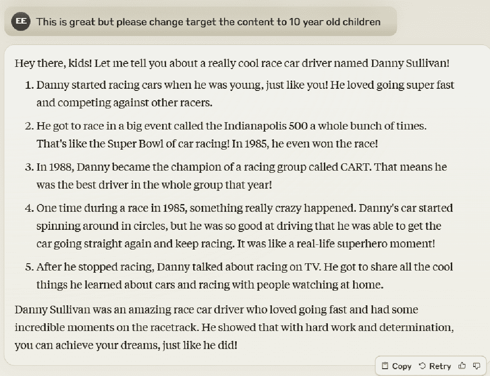

# 第三章\. 生成式 AI 入门

您已经看到了生成式 AI 为您的组织推动 SEO 增长的可能性。您也看到了过度使用它可能引发的大量问题。那么，您需要从哪里开始？这就是本章我们将要解决的问题。

除非您想构建自己的生成式 AI 系统（我们将在第六章中介绍这个主题 Chapter 6），否则您可能会使用各种工具来创建内容。本章重点介绍优化内容创建所需和可选的工具。每个工具都有其优点和缺点，因此本章解释了可以使用这些工具做什么以及要避免的陷阱。

对于有内容创作策略的组织，将生成式 AI 工具纳入这些策略需要改变公司程序。您的作家、编辑以及内容生成流程中的任何其他人必须学会调整。我们将讨论当生成式 AI 集成到您的内容创作过程中时，您和您的组织可能有的担忧。

如果您与外部承包商合作以帮助写作，您应该查明他们提供的内容是否由 AI 生成。您支付他们的是他们的专业知识，您想确保您得到了它。如果 AI 检测工具知道您的内容是机器生成的，那么谷歌也可以检测到。我们将介绍这些工具，向您展示如何使用它们，并讨论使用 AI 检测的优缺点。

如您将在本章中看到的那样，生成式 AI 工具的功能是有限的。在最终确定工作之前，需要人类来审查 AI 生成的内容并修复任何错误。本章的最后部分将提供如何做到这一点的示例。

# 学习如何使用生成式 AI

有许多方法可以使用生成式 AI 来帮助推动您的 SEO 计划。无论您的具体实施方式如何，您都需要完成几个高级步骤，以确保您有效地应用生成式 AI：

+   确定适合您应用的工具

+   理解关键业务因素

+   为您的组织做好准备

+   设定影响预期

+   学习如何编写优秀的提示

我们将在接下来的章节中讨论这些内容。

## 确定最适合您应用的工具

正如您在第二章中看到的，您可以考虑使用许多生成式 AI 工具，并且每个工具都有其优势和劣势。一旦您决定使用生成式 AI 做什么，您就会想选择最适合该应用的工具。这是一个重要的决定，因为它可以显著影响您收到的输出质量。

在第二章中，我们探讨了市场上主要工具的优缺点，但你必须考虑这些如何影响你心中的应用。一些例子可能包括：

+   研究主题想法

+   生成大纲

+   编写 JSON 代码

+   做数学

+   总结内容

+   拟定文章主题

+   提出关键数据点和来源

+   分析内容差距

+   编写模式代码

+   验证网页

+   总结趋势

+   更新*robots.txt*或*.htaccess*代码

这些只是生成式 AI 可能应用的其中一些。我们将在第四章和第五章中涵盖这些内容以及更多。

## 理解关键商业因素

与你的业务和市场相关的其他许多考虑因素。请注意，这些因素适用于你可能使用的任何生成式 AI，而不仅仅是用于 SEO。其中一些包括：

公司文化

是否有理由预期组织领导层或更广泛的团队对与 AI 合作存在抵触？

隐私担忧

你正在处理的信息有多敏感？你是否更喜欢避免与任何第三方分享，例如生成式 AI 工具的提供商？这类担忧可能会影响你使用生成式 AI 的方式。

组织准备情况

你的团队能够多快适应新的业务流程，他们能够多快学会与新技术合作？

风险承受能力

你是否准备好承担与如何做事的重大改变相关的风险？事情可能不会像你希望的那样顺利，你必须准备好应对出现的任何挑战。

竞争压力

你的竞争对手对 AI 的接受程度有多高？他们中的一些人是否已经通过它获得了竞争优势？这种压力可能会迫使你比原本可能愿意做的更加激进。

主题的粒度

如果你的组织在高度技术领域的研究处于前沿，那么关于该领域的网络上的书面材料可能不多。这可能会限制你期望生成式 AI 工具能帮助你多少。

国际关注

一些国家有关于生成式 AI 的立法。例如，[欧盟 AI 法案](https://oreil.ly/q_wlk)规范了 AI 在社会评分和政府使用技术方面的应用。

## 为你的组织做好准备

变化在许多方面都是具有挑战性的。在 AI 的情况下，一些员工可能会担心他们的工作安全性的变化或对未来就业的影响。对于组织来说，重要的是首先教育员工关于生成式 AI 如何加快他们的工作职能并提高他们生产力的方式。员工还可能担心学习一种新且不熟悉的技术。教育是关键，而且有许多提供教育的方式：

宣布公司在 AI 方面的倡议

对你正在做的事情以及为什么这样做保持开放。用你对它能帮助公司增长和创造机会的兴奋之情来传达这一点。

在公司会议上推广 AI

举行一个或多个特别会议来讨论使用 AI 的计划，或者将其添加到更广泛的公司会议中（如季度或年度更新）。

举行 AI 特定培训课程

宣布并举行会议，培训员工如何使用 AI。这些可以是公司范围内的，或者一次一个部门。培训可以帮助人们熟悉 AI 的优势和劣势，以及帮助他们了解如何在工作中应用 AI。

使用“午餐学习”来推广 AI

这些与 AI 特定培训课程具有类似的目的，但旨在作为补充。你可以使它们成为可选的，并使用它们来了解哪些员工对这一主题最感兴趣。

提供访问工具

当你的员工越来越熟悉使用生成式 AI 工具时，情况会更好。通过适当的培训授予他们访问权限，以便他们有机会这样做。要求他们注册，这样你可以进一步了解谁对成为 AI 素养者最感兴趣。

解决担忧

为团队成员提供提问和表达担忧的方式。积极回应这些问题，以帮助最大化你的团队与生成式 AI 的互动。

就像上一节中的关键业务因素一样，这个列表适用于你可能使用的任何生成式 AI，而不仅仅是 SEO。

## 设定影响预期

在“生成式 AI 的局限性”中，我们讨论了生成式 AI 工具的许多不足之处。这些问题意味着我们无法在不包括专家人类审查的情况下使用工具的输出。如果你不包含这种人类审查，你将在业务中应用工具的每个输出时承担高风险。

因此，你不能把生成式 AI 的钥匙交给公交车，并期望一切都会顺利。你需要让专家人类参与审查所有输出。关键是确保人类拥有工作结果，无论你如何使用这些工具。

这限制了影响范围。例如，如果你正在使用生成式 AI 来帮助你创建内容，以下是一些你可能期望的示例：

+   降低内容创作成本 30%

+   提高吞吐量 30%

+   提高质量 20%

事实是，这些结果相当惊人。如果你的组织内容创作是一个重要部分，这将对你来说是一个变革。请注意，你的结果可能与这些不同，但它们确实代表了合理的目标。

为了进一步说明，以下是一些你可以使用生成式 AI 帮助你的一些很好的活动：

检查网页的 SEO 问题代码

如果你理解其局限性，这将是很有价值的。它可能不会捕捉到所有错误（“遗漏的问题”），并且它可能将一些事情报告为错误，但实际上并不是问题（“假阳性”）。*假阳性*是对实际上不是错误的错误的警报。你想要真正的阳性，这意味着你的生成式 AI 提示能够正确地识别页面上的错误。如果你编写了一个好的提示，遗漏的问题和假阳性仍然会偶尔发生，但实际找到的错误（“真正的阳性”）对你来说将是非常宝贵的，而遗漏的问题和假阳性可以通过人工审查轻松识别。我们还在第五章中更详细地讨论了这个用例。

编写模式代码

这为开发者提供了一个代码草案以供审查和最终确定。这比从一张白纸开始要好！我们还在第五章中更详细地讨论了这个用例。

编写内容

你还可以使用生成式 AI 来辅助写作内容，因为它可以为作者提供除了空白纸张之外的东西来开始。这可能包括起草大纲、段落和文章。这是一个复杂的话题，有很多层次，我们在第四章中详细介绍了它。

## 学习如何编写出色的提示

与生成式 AI 合作的成功取决于你编写的提示的质量，因此你必须学习如何编写出色的提示以最大化你的结果。我们将在本节中讨论提示写作的基础。这不是一本全面的指南，但应该提供一个强有力的起点。

### 必须做的

这里是有效提示的关键要素：

确定你的目标受众

你的提示应该提供这些信息，以便生成式 AI 工具可以根据这些信息调整他们的响应。以下是一些目标受众的例子：二年级学生、工业厨房设备买家、寻找示例源代码的开发者、新生儿父母和核物理学家。你可以非常具体，也可以更一般化，具体取决于你试图做的事情的性质。

建立你的角色

这与您的品牌声音相似。您希望听起来权威、学术、轻松愉快、友好吗？工具通常擅长适应这类指示。一个例子可能是：“您是一家工业用草坪拖拉机制造商，您撰写的内文应该语气权威但易于阅读。”

提供上下文

向您的生成式 AI 工具提供有关目标受众的额外信息。例如，如果您针对的是新生儿的父母，他们是在寻找建议吗？或者需要购买的东西来满足需求？让 AI 知道您的目标受众想看到什么。

做与不做

在您的提示中清楚地说明您希望生成式 AI 做什么以及您不希望它做什么。例如：“给我提供温斯顿·丘吉尔的传记，但不要提供关于他童年的信息。” 图 3-1 显示了此提示和从 Gemini 收到的部分回应。

###### 图 3-1. Gemini 对提示的回应

逐步迭代您的提示

尽可能使您的初始提示尽可能高质量，但要知道生成式 AI 工具将您与它们的对话视为聊天会话。这意味着一旦您对初始提示得到回应，您就可以提供反馈，说明您希望如何调整它。例如，也许您要求提供丹尼·沙利文的传记，但得到了关于丹尼·沙利文这位搜索专家的传记，这不是您想要的。如果是这样，您可以尝试像“请更新您的回复，以关注丹尼·沙利文这位赛车手。”这样的内容。您可以在下一节中的图中看到这一点，“迭代提示示例”。然后，工具将提供更新后的回应。您也可以进行更简单的迭代，例如“请勿在您的回复中使用过多的最高级。”

描述您首选的输出格式

您希望以文章的形式撰写内容吗？一个项目符号列表？一个电子表格？源代码？一首俳句？请具体说明，以便获得您想要的格式。

使用工具的特殊功能

每个主要的生成式 AI 工具都有其特殊功能。这些功能可能满足您项目中的特定需求。例如，截至本文写作时，ChatGPT 正在测试自动化功能，这些功能允许您按照特定的时间表执行任务。例如，您可以使用此功能每天为您总结最新的 AI 新闻。每个工具拥有的功能将会变化，因此定期检查每个工具的功能更新，以找到最适合您特定项目需求的工具。

### 注意事项

上述有效的提示元素将为您提供一个良好的起点，但您还应避免常见的错误。其中一些包括：

含糊不清

如果你的提示词模糊不清，那么得到的回答很可能不是你想要的。这里的一个例子可能是“告诉我关于地球上的生活。”相反，尝试更具体的内容，比如“请告诉我关于早期智人的进化”或“地球上的第一批单细胞生物是如何出现的？”

过度指定

如果你过于具体，工具可能也难以理解如何满足你的需求。

提供过多信息

如果你提示词中提供了大量详细的信息，那么工具可能难以理解什么是最重要的，或者应该包含和省略什么。

缺乏上下文

向工具提供清晰的上下文很重要。如果你不清楚，你可能会遇到问题。例如，你问，“去新加坡的最佳飞行时间是什么？”这让我们有很多问题，比如：

+   从哪里来？

+   为了什么目的？商务？度假？

+   这个问题是在白天、星期几，还是一年中的什么时候？

+   提问的一个更好的方式可能是“在纽约冬季度假期间，从纽约飞往新加坡的最佳时间是什么？”

比喻语言

比喻语言可以包括隐喻、夸张、典故、明喻等等。一个例子是“她聪明得像条蛇。”你的生成式 AI 工具可能会难以跟上！

学习如何创建优秀的提示词需要练习，所以请给你的团队一些时间来练习并掌握这项技能，然后再将他们分配到关键项目中。可能性很大，到 2026 年底，这方面的知识将变得普遍，但到目前为止，计划在发展这项专业知识时有一个学习曲线。如果有人在这上面努力工作并大量实验，他们可能在两到三个月内变得相当出色，并在一年内达到高水平的专业知识。

### 迭代提示词的例子

正如我们之前讨论的，你第一次尝试使用提示词可能不会得到你想要的结果。不过没关系，因为大多数生成式 AI 工具都是设计成交互式的。这意味着你可以审查你收到的输出，然后要求工具进行修改。让我们从一个例子开始，如图 3-2 所示，我们询问克劳德 3 Opus，“谁是丹尼·沙利文？”

###### 图 3-2\. 克劳德 3 Opus 对“谁是丹尼·沙利文？”这一问题的初始回答

这个回答看起来相当稳固，但不幸的是，我们想要的信息是关于那位著名的赛车手，所以让我们告诉克劳德这一点，并要求他再次尝试，如图 3-3 所示。

###### 图 3-3\. 克劳德 3 Opus 对“谁是丹尼·沙利文这位赛车手？”这一问题的回答

这很好，但我们的目标受众是十岁的孩子，所以我们需要对此进行调整。让我们尝试用另一个请求让克劳德 3 Opus 调整输出，如图 3-4 所示。

###### 图 3-4. 对“谁是丹尼·沙利文？”的回应修改为适合 10 岁儿童

这看起来相当不错，但有点长，所以让我们让 Claude 缩短回应。你可以在图 3-5 中看到结果。

###### 图 3-5. 对“谁是丹尼·沙利文？”的回应缩短为三个段落

正如你所见，Claude 3 Opus 遵守了我们的要求，但第三段相当长，所以回应并不完全符合我们的预期。它做了我们要求的事情，但没有达到我们的意图，所以让我们再尝试一次调整，如图图 3-6 所示。

###### 图 3-6. 对“谁是丹尼·沙利文？”的回应进一步缩短

你可以不断调整输出，直到接近你想要的结果。这个过程对于刚开始学习如何提示的人来说很有帮助，因为它可以展示如何编写更好的初始提示。随着你的提示技巧的提高，注意输出会更准确地传达你的信息，包括适合你品牌的正确语气和风格。比较生成式 AI 在前后之间的回应，以识别改进并制定生成你想要输出的策略。

在我们的例子中，我们本可以一开始就指定我们想要的是赛车手，并针对 10 岁的儿童受众。然而，即使是提示技巧的专家也应该预期需要进行一些迭代提示。

# 检测 AI 生成的内客

你需要培养团队技能的另一个领域是检测 AI 生成的内客。这有两个原因：

因为谷歌将会

如第二章所述，谷歌非常担心由 AI 编写的低质量内容会充斥网络。你可以使用生成式 AI 来辅助创建内容，但[内容必须展现出专业知识、经验、权威性和可信度](https://oreil.ly/F1VP0)。谷歌正在积极努力检测 AI 生成的内容，以防止其排名并污染其搜索结果的质量。这意味着你用 AI 生成的内客可能会严重损害你网站的排名潜力。

你的作者可能正在误用它

如果你正在支付外部作者创建原创内容，你需要确保他们没有提供给你编辑不佳——甚至未编辑的 AI 生成的内客。如果是这样，这也可能损害你网站的 SEO 潜力。如前所述，发布低质量的 AI 生成内容可能导致向谷歌算法发送的权威信号丢失。滥用 AI 也是不道德的，因为不诚实的作者将 AI 生成的作品冒充为自己的作品，意图为此获得全额报酬。

因此，在发布之前，将你为网站创建的所有内容通过 AI 检测流程是非常重要的。

建立你团队在 AI 检测方面的技能需要你在一定程度上进行投资。没有简单、保证的方法可以做到这一点。你需要利用第三方工具来帮助你识别可能由 AI 编写的内 容，然后你的编辑需要审查这些内容以检查其质量。

## AI-Detection Tools

有许多工具可以检测 AI 编写的内 容。截至本文写作时，一些更知名的工具包括：

+   [AI Text Classifier](https://oreil.ly/9I3uv)

+   [BrandWell (formerly Conten⁠t­AtScale)](https://oreil.ly/upyvv)

+   [Copyleaks](https://oreil.ly/6DoPK)

+   [Crossplag](https://crossplag.com)

+   [GLTR](http://gltr.io)

+   [GPTZero](https://gptzero.me)

+   [Originality.AI](https://oreil.ly/xaiv8)

+   [Sapling](https://oreil.ly/fuRoT)

+   [Undetectable](https://undetectable.ai)

+   [Winston AI](https://gowinston.ai)

+   [Writer](https://oreil.ly/uz_l7)

+   [ZeroGPT](https://oreil.ly/wJqDk)

这些工具不断进化。在你选择一个或多个工具用于你的组织之前，请阅读最新的第三方评论，以了解哪一个可能最适合你。你还可以看看你尊重的网红在推荐什么。

## AI 检测工作原理

在第二章中，我们讨论了生成式 AI 工具的限制。基于这些限制，AI 检测工具会寻找许多主要标准。其中一些包括：

内容中的明显错误

你可以在图 2-11 和图 2-12 中看到例子。图 2-11 中的错误可能对 AI 检测工具来说更难捕捉，因为这在许多人类编写的网络文章中也是不正确的。然而，图 2-12 显示了一个更明显的错误，你无法在网上找到任何有相同错误的人类编写的内 容。

奇怪的词语选择

生成式 AI 工具在创建内容时以选择不寻常的词语而闻名。有时文本中会包含不寻常数量的形容词和/或副词，或者在一个文本块中多次重复使用不同的词语。快速的人类审查会让审查者感觉写作风格有点奇怪。

句子长度缺乏变化

AI 编写的内 容通常比人类编写的内 容具有更一致的句子长度。这被称为“爆发性”。

内容的不必要重复

AI 编写的内 容往往会以不需要的方式重复关键点。你可以在图 2-6 中看到这个例子。

这些工具在检测问题时并不完美，但它们会捕捉到相当一部分由 AI 编写的内 容。然而，请注意，谷歌在检测 AI 方面可能比商业工具提供的流程要复杂得多。

# 内容价值所在

重要的是要花一点时间考虑什么内容对用户有用，因为这是谷歌的算法旨在检测和排名的内容。理解这一点可以帮助您决定如何最好地使用生成式 AI 来协助创建这种类型的内容。

###### 注意

谷歌的算法远非完美，因此有时它们无法将最佳内容排名，甚至可能将低质量内容排名。尽管如此，谷歌仍在不断努力改进这些算法，因此最好是将目标定位在制作您的内容成为最佳内容。

考虑图 3-7 中显示的搜索示例。查询是“如何制作法式吐司”，包括围绕文本的引号。文本周围的引号迫使谷歌只返回包含该确切字符串的页面。

###### 图 3-7。强制谷歌返回包含确切字符串的页面

注意，在图片的右侧，谷歌表示它对这个查询有“大约 85,000 个结果”。这有很多页面在讨论如何制作法式吐司！考虑到这一点，如果您选择在这个主题上创建另一个页面，您认为您会给网络带来一些关于它的新价值的可能性有多大？可能性很小。

分享这个例子的原因在于它与您从 AI 生成内容中获得的内容相关。由于这种内容是 AI 工具在互联网上看到的事物的再生，它无法为任何人带来任何新东西。这些都是旧信息。在这种背景下，谷歌几乎没有动力将其排名在其搜索结果中。

那么，谷歌认为哪种内容是有价值的呢？谷歌通过发布他们的[搜索质量评估员指南（SQRGs）](https://oreil.ly/XVt1T)提供了一些见解。这些是谷歌提供给手动评估谷歌搜索结果质量的人的指南（“质量评估员”）。这些质量评估员审查谷歌的搜索结果，检查获得高排名位置的页面，然后对这些页面进行评分。基于这些评分，谷歌可以了解其算法在提供高质量内容方面的表现如何。

我们可以使用这些指南来帮助我们理解哪些内容是高质量的。在这些指南中，谷歌向我们介绍了与内容质量相关的其他概念。其中之一是 EEAT。这些是评估发布网站和作者是否是提供的信息的良好资源的指标。根据谷歌的指南，以下是 EEAT 中每个字母的含义：

经验

作者是否有关于该主题的第一手或生活经验？当然，生成式 AI 工具没有第一手经验；它们所做的只是根据它们已经在互联网上发布的内容生成文本。

专业知识

作者是否有在主题上创建高质量内容的知识或技能？

权威性

市场上的其他人是否将作者视为该主题的权威？

信任

SQRGs 指出，这是 EEAT 信号中最重要的，因为即使在不信任的页面上经验、专业技能和权威性得分很高，这些页面也不应该排名。

现在让我们讨论 EEAT 对于 AI 生成内容会被如何看待：

经验

该 AI 没有实际经验，所以这个评分为零。

专业技能

该 AI 也没有专业技能。你在生成式 AI 响应中看到的“知识”只是从网络上抓取并以改写的方式重新呈现。这个指标的评分也将为零。

权威性

当今许多人对于这些工具的“智能”感到兴奋，但随着人们对所有错误、遗漏和其他问题感到厌倦，这种兴奋可能会消退。除了某些特定情况外，谷歌也会给这个评分非常低。此外，如果你正在使用 AI 作为你在某个领域的“权威”，你在这个市场的实际权威性可能会减弱。

信任

除非有具体原因，否则很难评估谷歌会对一个 AI 算法投入多少“信任”。

###### 注意

作为提醒，在第一章中我们提到，EEAT 不是一个直接的排名因素，除了专注于健康或金融主题的网站，但质量评估员的作用是表明他们认为内容应该如何排名，并且他们预计会考虑所有网站的 EEAT 以及与内容质量相关的许多其他因素。谷歌算法随后使用其他排名信号来尝试将最佳内容排在首位。

并非所有 AI 生成的内容都被认为是坏的。有一些领域，谷歌已经相当长时间信任 AI 创建的内容。几个例子是天气相关和收益报告查询。图 3-8 显示了“富国银行收益报告”的一个查询示例。

###### 图 3-8\. 富国银行收益报告查询结果在谷歌上

高亮显示的结果中的信息是由 AI 生成的。然而，谷歌信任这些信息，因为这是一个简单的数据展示，而 Investing.com 在权威性方面得分非常高。

另一个例子是体育比赛的实时报道。如果你在吃饭时有一支你喜欢的球队在比赛，你可能会拿起手机输入一个快速查询，比如“49ers 比赛实时报道”。你会得到一个也是由 AI 生成的响应。

从谷歌的角度来看，这类情况是可以接受的，因为：

+   创建的内容高度受算法中输入的数据限制。

+   谷歌选择在搜索结果中排名的内容的出版商有证明其权威性和信任度的历史。

最终，让 AI 创建内容的概念对谷歌来说并不是一个根本问题。低质量的内容是谷歌的问题，无论 AI 是否参与了内容的创建，这都是如此。然而，正如我们在第二章和本章中讨论的那样，当 AI 用于创建内容时，它容易出错，并且因为它只是重复互联网上已有的内容，所以它不提供新的见解。这些都是谷歌需要关注的问题。

考虑到这些因素，现在让我们总结一下谷歌在内容中寻找的关键要素：

+   独特的内容，回答了网络上其他内容没有回答的问题

+   专注于为用户增加价值的内容

###### 备注

“增加价值”的含义很大程度上取决于用户的查询。有些用户可能现在想购买某物；在其他情况下，用户只想获取信息。

EEAT 中的 E、E 和 A 部分与这两个概念相关。至于信任，你可以将其视为与品牌高度相关。强大的品牌是许多大型公司拥有的东西，但在其领域内是专家的个人也可以拥有强大的品牌。用户往往将强大的品牌与可信度和可靠性联系起来。因此，在市场上建立强大的品牌对于你的公司、你的关键专家或两者都很重要。

总结来说，谷歌希望你的内容为用户增加价值。重新创建网络上已经存在的内容，包含错误或省略，或者不专注于为用户提供价值的内容，并不是谷歌希望在搜索引擎上排名的内容。如果你选择使用生成式 AI 来帮助你创建内容，确保你解决了这些问题。我们将在下一节讨论实现这一目标最重要的组成部分之一。

# 需要人为参与

在第二章和本章中，我们强调了在每次使用 AI 工具时都需要人为的参与。尽管生成式 AI 工具非常强大，但它们仍然容易犯只有人类才能发现的错误。你需要计划让团队中的专家对任何 AI 生成的作品进行审查和最终确定。作为提醒，需要关注的一些问题包括：

错误

这些是生成式 AI 提供错误信息的情况。

省略

这些是忘记包含重要信息的回应。

上下文不匹配

即使你仔细地编写了提示并包含了你正在寻找的上下文，生成式 AI 工具仍然可能出错。

不符合品牌声音

即使你在提示中提供了品牌声音的指示，生成式 AI 工具仍然可能犯错误。

最终，你的工作流程应该需要人类参与来审查和最终确定工作。以下是一些示例，说明这应该如何运作：

+   如果你使用 AI 来审核网页的 SEO，请让经验丰富的技术 SEO 专业人士对结果进行准确性审查。同时，让他们检查 AI 可能遗漏的网页问题。这些错误可能从未能理解代码的上下文到无法正确解析代码，导致误报或完全遗漏问题。

+   如果你使用 AI 来编写支持网页 schema 的 JSON 代码，在发布之前，请让一位理解 schema 编码的资深 JSON 程序员检查代码的准确性。

+   如果你使用 AI 为你计划撰写的文章生成大纲，在开始写作之前，请让一位 SME（行业专家）审查和更新大纲。更好的做法是，让生成式 AI 工具创建三个大纲，然后让 SME 进行事实核查并将它们合并成一个更深入的大纲，然后再开始撰写文章。

这些例子仅用于说明更广泛的概念：你需要在内容审查中包含人类，理想情况下是以 SME 的形式，他们将负责发布内容的品质。这将要求他们对输出进行事实核查，纠正错误，识别重大遗漏，并移除不属于内容的部分。

# 结论

在本章中，我们试图涵盖你在开始在你组织内部应用生成式 AI 之前需要考虑的所有高级内容。在下一章中，我们将讨论如何使用生成式 AI 帮助你创建内容，并在第五章中，我们将讨论如何使用生成式 AI 帮助你处理 SEO 任务。
