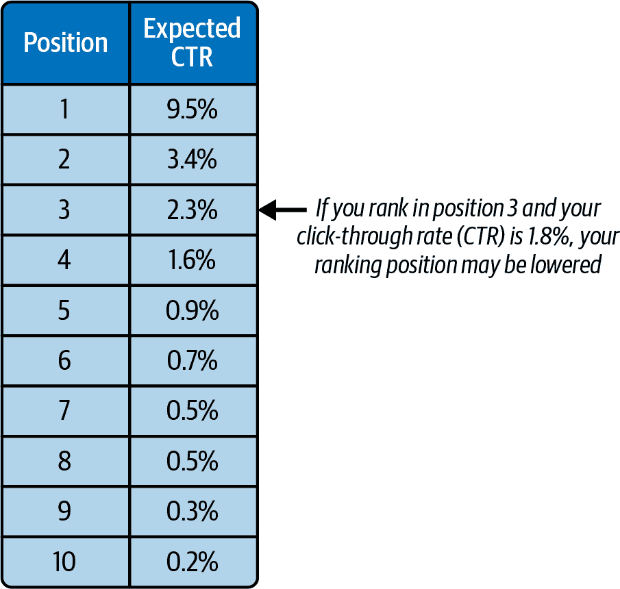
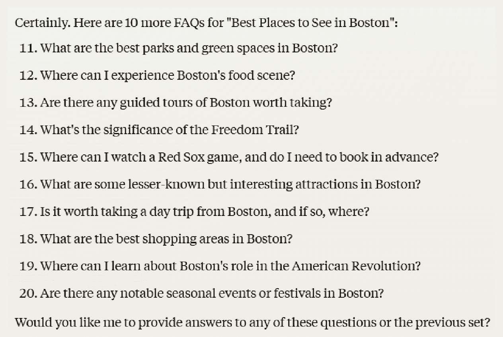
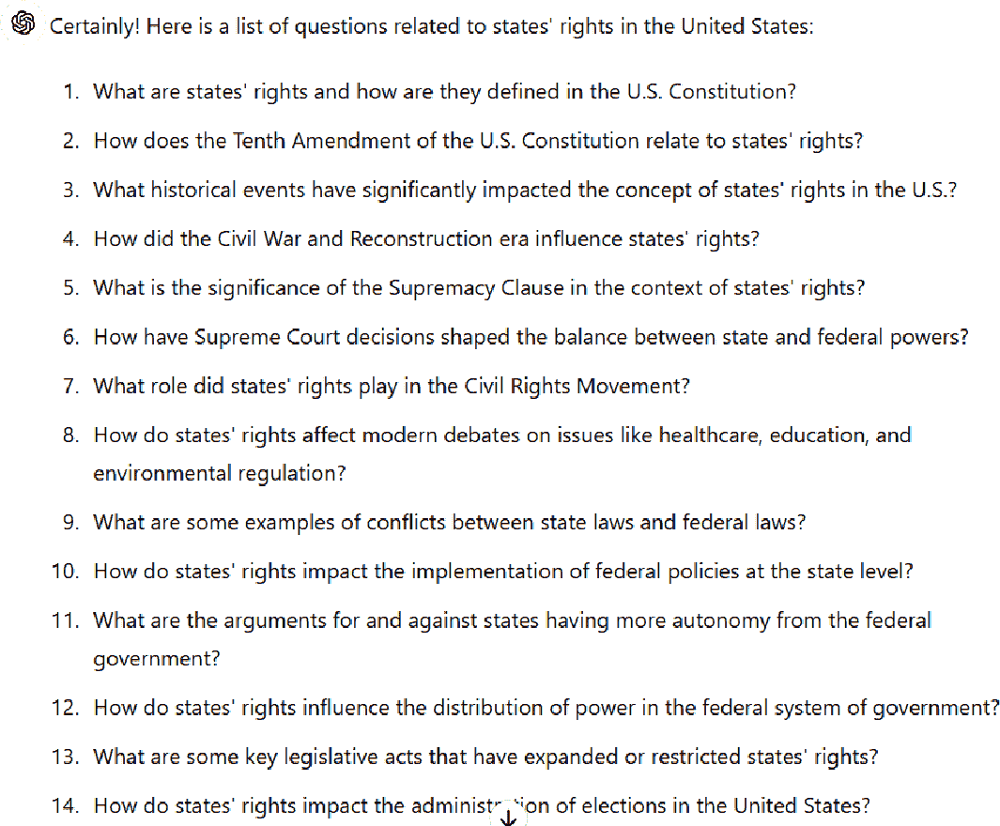
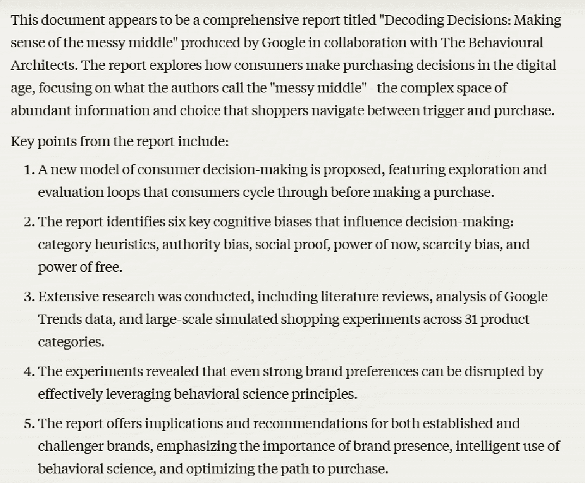

# 第四章\. 使用 AI 扩展内容开发

如果你能克服这些限制，生成式 AI 可以给你的内容开发工作带来巨大的杠杆作用。关键是要学会如何在内容创作过程中关键点包括主题专家的审查。

###### 注意

这种理念也将在你为 ChatGPT、Copilot、Gemini 和 Claude 等 LLM 工具排名的内容创作中大有裨益。

以一个简单的例子来说明，考虑为新内容起草大纲的过程。没有 AI，从头开始写内容是困难的。作者从一个空白页开始，需要自己决定这篇文章应该写什么，应该涵盖哪些主题，以及顺序如何。即使有经验丰富的主题专家参与以帮助验证准确性和相关性，作者也可能遗漏了在新内容中应该涉及的所有主题。

使用 AI，情况就不同了。将生成式 AI 视为非主题专家作者的头脑风暴伙伴，帮助他们想出广泛的主题想法。它可以提出新内容的相关想法，这些想法作者甚至主题专家可能都没有想到。即使生成式 AI 工具的建议并不合适或完全错误，主题专家也应该能够轻松识别哪些是相关的或可以纠正的。这将给作者提供一个很好的起点，以完成他们面前的任务，这将对内容创作的吞吐量产生重大影响，同时也能提高内容质量。

在本章中，我们将讨论在整个内容开发过程中涉及主题专家的重要性。我们将向您展示多种使用 AI 来改进内容创作的方法，包括使用它来：

+   研究主题

+   生成大纲

+   起草标题

+   起草元描述

+   识别内容差距

+   生成数据库驱动的内容

+   生成常见问题解答

+   源数据和统计数据

+   创建相关问题的列表

+   概括内容

+   创建趋势列表

这绝不是你可以使用 AI 改进内容开发过程的完整列表。在本章结束时，我们将讨论如何将所有这些整合起来，以最大限度地发挥 AI 在帮助你的写作团队创作内容中的作用。

# 主题专家的作用

在“你需要了解的关于谷歌想要的内容”中，我们讨论了谷歌想要包含在其搜索结果中的内容类型。这次讨论包括了以下关键点：

+   作者的主题专业知识

+   作者对内容的直接经验水平

+   你的网站是否被认为是该主题的权威

+   如果用户信任你的组织和你选择的领域中的网站

+   你的内容是否为该主题带来了独特的新专业知识或观点

虽然 Google 在检测您内容这些方面并不完美，但这正是它努力追求的目标，而且它在不断改进。如果您未能解决这些因素，您的内容可能无法获得良好的排名，从而浪费了您所做的投资。

我们之前也讨论过，生成式人工智能无法很好地解决这些因素。非小企业主的作家也无法做到。如果您负责组建或管理内容开发团队，这一点非常重要。小企业主必须对所有您创建的内容拥有最终所有权，以确保他们参与的内容质量非常高。小企业主可能是您产品的强大用户，或者能够从权威的角度撰写关于您行业的文章——而不是无法验证材料准确性或相关性或提出有洞察力的内容的作家。

###### 小贴士

帮助激励小企业主（SMEs）的一种方法是在文章上标注他们的名字（作为作者或编辑）。小企业主的署名也提供了一个权威元素，并可能激发读者更多的信任。

如果您未能让小企业主在您的 AI 辅助内容开发过程中发挥关键作用，您可能会重发许多人在之前已经分享过的思想和观点。这不会脱颖而出。更糟糕的是，内容中的一些信息可能离题或错误，或者您可能未能包括一些应该强调的关键点。

因此，小企业主对您的内容开发过程至关重要，您将在本章和本书的其余部分看到许多关于他们的引用，作为您整体 AI 辅助 SEO 策略的一部分。非小企业主作家（或简单地，作家）的角色是起草内容。生成式人工智能工具也支持小企业主创作内容，尽管方式不同。小企业主在内容生成中的作用是确保内容具有权威性且没有错误，特别是遗漏的错误。

# 使用生成式人工智能帮助内容创作和编辑

在这些适度目标的基础上，让我们回顾一下您如何在内容开发过程中利用生成式人工智能的具体方法。

## 研究主题

想出文章想法可能具有挑战性，但这是生成式人工智能可以提供帮助的许多方式之一。许多组织通过进行关键词研究开始这个过程，这对于构思您网站上文章的主题非常有用。希望您已经通过作者和小企业主的创意来补充您的研究。

主题生成是生成式 AI 工具可以做得非常好的事情之一。它们可以提出既不是你的关键词研究也不是你的行业专家会提出的新想法。这对你的 SEO 计划可能具有巨大的价值。关键洞察是，关键词研究工具不会显示用户在搜索某物时可能使用的所有搜索词。它们不这样做的原因很简单：它们只采样了网络上的一小部分流量，并错过了与你的种子词相关的绝大多数长尾搜索词。然而，生成式 AI 工具使用不同的数据集，可能提出与传统关键词研究工具中看到的不同建议。这很好地符合了谷歌算法的工作方式，因为谷歌希望将流量发送到为用户提供最多价值的网站，覆盖长尾主题是满足大量访客需求的一部分。

许多人认为解决长尾问题是一种时间和预算的浪费。他们可能认为搜索量太低，或者创建此类内容的费用太高。但考虑一下[Ahrefs 的数据](https://oreil.ly/BRWC_)，它显示 95%的所有关键词都是长尾关键词，代表了 35%的所有搜索量。这留下了很多机会，尤其是长尾关键词通常更具体，因此与其他搜索查询相比可能有更高的转化率。

另一个需要考虑的因素是，[2024 年 5 月 27 日谷歌泄露的数据](https://oreil.ly/oGoa8)显示，谷歌详细监控了用户在网站上的行为。我们可以推断出，谷歌认为你在网站上的整体用户体验很重要，并且 SEO 不是基于简单的页面到页面的评估。换句话说，你网站上其他页面关于长尾主题的广泛覆盖可以帮助你的主要页面针对它们的目标关键词进行排名。

因此，采用多种方法研究主题领域对你的整体策略非常重要。

图 4-1 展示了 ChatGPT-4o 对提示“建议一些与考虑个人贷款的人相关的文章主题”的部分响应。请注意，你如何编写提示对于从你选择的生成式 AI 工具获得的质量输出至关重要。我们在本章（以及第五章）中分享了简单的提示示例，但投入时间精心制作优秀的提示是非常值得的。

###### 图 4-1. ChatGPT-4o 主题建议示例

在回复中提出了十五个主题。你可以进一步请求针对每个子主题的更多具体想法。例如，你可以尝试一个后续查询，比如“你能提供更多与申请个人贷款时避免的前五项错误相关的详细想法吗？”图 4-2 显示了 ChatGPT-4o 对此查询的回复开始部分。

你可以继续以这种方式迭代，直到你有了起始列表中主题想法中确定的子类别的详细大纲。有几种方法可以对提供的第一个文章列表进行迭代（如图 4-2 所示）：

+   引入新的子主题

+   扩展初始回复中提供的子主题

+   继续请求更多详细描述

###### 图 4-2. ChatGPT-4o 提供的更详细的主题建议

提高这一过程的另一种方法是，在你的选择的人工智能生成工具的问题中包含你关于该主题的现有内容列表。记住，你使用生成人工智能工具作为头脑风暴伙伴来生成你的作者和 SME 可以进一步发展的想法。使用生成人工智能的核心价值是使你的作者和 SME 能够更快地产生内容，并更深入地覆盖你的主题。

## 生成大纲

人工智能工具可以为作者创建供考虑使用的草稿文章大纲。这些可以给作者提供一个起点，并减少他们忘记重要子主题的机会。

当然，生成人工智能容易出错。解决这一问题的方法之一是要求 AI 为每篇文章创建三个不同的大纲。SME 可以将这些合并成一个大纲。或者，你可以使用像 ChatGPT-4 这样的推理模型来审查这三个大纲，并将它们合并成一个草案供你使用。你还可以要求它解释为什么它选择了以这种方式合并大纲。（为什么它选择了这些条目？为什么它省略了一些方面？）

每个大纲都可能揭示主题的不同方面，合并这些大纲可以帮助最大限度地减少最终大纲中存在差距的机会。此外，你的 SME 可以确保 AI 工具不会在大纲中引入明显的错误。

图 4-3 显示了 Gemini 对提示“生成一篇关于如何制作法式吐司的文章大纲”的部分回复。

###### 图 4-3. 来自 Gemini 的样本文章大纲

正如你所见，回复相当长，这里分享的截图只显示了所需的设备、基本成分和部分可选成分。也许总回复比我们想要的要长，所以让我们让 Gemini 给我们一个更简短的版本。在同一个会话中，我们将尝试一个修改后的提示：“请将大纲缩短为 10 个简单步骤。”你可以在图 4-4 中看到回复。

###### 图 4-4\. Gemini 的简单文章大纲

我们可能对这个大纲感到满意，但想添加一个针对新烹饪学生的介绍。图 4-5 展示了当我们要求 Gemini 这样做时会发生什么。

你可以继续进行这类迭代，直到你得到你想要的文章大纲类型。在这个过程中，你会学到你想要在未来的大纲初始提示中包含的内容，这可能会减少你需要采取的步骤数量。

###### 图 4-5\. Gemini 的简单文章大纲

## 撰写标题

你可能有一个已经发布的网页，但想考虑一个不同的标题标签。也许当前的标题并不完全符合目标或者没有提供良好的自然搜索流量，所以你想尝试其他选项。生成式 AI 工具在为页面建议多个不同的标题标签方面非常出色。请记住，生成式 AI 工具不提供任何关于关键词搜索量的洞察，但缺乏关键词搜索量可能是一个好事。

获取包括搜索量在内的数据是很好的，你应该使用它。然而，仅考虑一个信息源来决定标题标签并不是理想的做法，一个不包含搜索量的视角可能会为你开启新的思考途径。你可以从你选择的 LLM（大型语言模型）中获取建议，但你也应该考虑你自己的专业知识和主题内容。一些 SEO 专业人士在创建标题时也会考虑他们的竞争对手分析和差距分析。生成式 AI 工具的建议可以帮助你探索你可能想要在标题标签中采取的其他方向。

图 4-6 展示了当请求 Microsoft Copilot 建议现有页面的替代标题标签时的结果。

###### 图 4-6\. Copilot 的标题标签建议

该响应提供了五个可供考虑的选项。虽然这些标题标签没有考虑搜索量，但 Copilot 显示了它认为页面是关于什么的。

## 撰写元描述

SEO 社区长期以来一直认为*元描述*——位于你的网站头部部分的简短段落，描述页面内容，Google 有时将其用作你的页面在搜索结果中的列表描述——不是搜索排名算法的直接输入（这意味着元描述中的关键词使用不会影响排名）。尽管如此，我们一直怀疑点击率（CTR）是一个因素，而 Google 的泄露证实了 Google 确实密切跟踪用户在搜索结果中的点击行为。

我们还应该将元描述视为一个排名因素，因为它们经常被 Google 用作搜索结果中你的列表的描述。如果你写出一个引人注目的元描述，使其与其他搜索列表的描述脱颖而出，你可以提高你的点击率（CTR）。

###### 注意

谷歌有时会选择显示你的元描述，有时则会根据谷歌认为的能够更好地匹配用户查询和文档内容的情况，从文档中提取描述性文本。

在图 4-7 中，你可以看到从搜索结果中吸引更多点击如何潜在地影响排名。例如，如果你的页面在搜索结果中排名第三，预期位置三的 CTR 是 4.5%。如果你的页面只有 3.6%的时间被点击，那么其排名很可能被降低。同样，如果同一页面有 6.1%的时间被点击，你的页面可能在搜索结果中上升。

###### 图 4-7\. 搜索位置与 CTR

注意，图 4-7 中显示的预期点击率（CTR）只是样本数据，预期 CTR 性能可能因用户查询的不同而有很大差异。由于生成式 AI 工具如 ChatGPT、Gemini、Copilot、Claude 以及谷歌将 AIO 整合到搜索结果中，市场发生了变化，你的 CTR 可能会显著降低。一旦谷歌在其搜索结果中整合了 AI 模式，这些点击率可能会进一步下降。

生成吸引用户点击的标题是生成式 AI 帮助 SEO 从业者的一种更有趣的方式。关键是让工具写出一个用户会觉得有吸引力的元描述。如果你能做得很好，这可能会导致更高的 CTR 甚至更高的排名。

正如本章所有练习一样，如何构建你的提示是一个关键的成功因素。以下是一个如何最初构建提示以请求元描述的建议：

> 为 https://www.meetbos⁠ton.com/​events/festivals-and-annual-events/boston-marathon/history/编写五个新的元描述。元描述应提供用户点击谷歌搜索结果中“波士顿马拉松历史”查询的搜索列表的有力理由。目标受众是可能对作为游客前往波士顿感兴趣的人。

图 4-8 显示了当你将查询输入到 Gemini 时会发生什么。

###### 图 4-8\. Gemini 的示例元描述

这些建议提供了一系列在优化元描述时需要考虑的事项。当更新你网站的元描述时，你可能希望一次只更新一个关键页面，使用独特的描述。然后对于更大规模的项目（例如，如果你有一千个页面需要更新），你可能希望每个页面只生成一个元描述。然后在发布之前，对它们进行批量的人类审查。

## 识别内容差距

使用生成式 AI 帮助识别现有页面中的内容差距可能是一项非常有高回报率的活动。ChatGPT-4o、双子座和 Copilot 都是此应用的优秀工具。它们可以快速识别缺失或需要比目前更深入覆盖的区域。

一个可能的提示可能是：

> 对以下内容进行内容差距分析：https://www.britannica.com/topic/European-Union。重点关注的关键领域应包括：(1) 法律体系和其重要性；(2) 欧洲经济共同体。建议如何在这些领域改进内容，并提供相关资源的链接。

图 4-10 显示了 Gemini 对此提示的响应的一部分。

###### 图 4-10\. 双子座输出内容差距分析提示

你可以看到对当前文档及其内容的引用，以及建议添加的内容。你还可以看到可用于进一步研究的引用链接。你可能想要调整样本提示的一种方式是要求每个主题区域有多个引用。这将帮助你深化知识，在填写建议的差距之前写下任何内容。

## 生成数据库驱动的内容

使用从数据库中提取的事实和数字，你可以减少 AI 生成错误的机会。如果你为生成式 AI 提供你已编辑和核实的信息，这会特别有效。如第三章中所述，让生成式 AI 在没有人工审查的情况下为你创建内容是不明智的。专家人工审查始终应包括在内。然而，生成式 AI 工具的限制越多，出错的可能性就越小。

一个例子是，如果你有一个拥有 100 个地点的零售连锁店，并想在每个地点页面的顶部添加一些简单的文本。让我们一次处理三个地点以保持简单。请注意，你的生成式 AI 工具无法直接访问数据库，因此你需要以编程方式完成。在我们的虚构示例中，我们将提取三个地点的数据并将其纳入此处显示的示例提示中：

> 将以下段落重写为三个不同地点的强力比萨，同时避免重复并保持其含义。使用以下信息为每个地点提供信息：
> 
> 地点 1：
> 
> 地址：德克萨斯州奥斯汀 21 比萨广场。
> 
> 营业时间：周一至周五 上午 11:00 至晚上 10:00。周六/周日 上午 11:00 至晚上 9:00。
> 
> 负责人：丽莎·詹姆斯
> 
> 特色：意大利辣肠，肉食爱好者
> 
> 地点 2：
> 
> 地址：加利福尼亚州圣何塞 2134 圆环道。
> 
> 营业时间：周一至周六 上午 10:00 至晚上 11:00，周日 上午 10:00 至晚上 10:00
> 
> 负责人：唐纳德·汤普森
> 
> 特色：双层芝士，加州风格比萨
> 
> 地点 3：
> 
> 地址：明尼苏达州明尼阿波利斯 21 普罗米修斯大道。
> 
> 营业时间：周一至周五 上午 11:00 至晚上 10:00，周日 上午 11:30 至晚上 10:00
> 
> 负责人：苏珊·贝林斯基
> 
> 特色：蘑菇和洋葱，菠萝
> 
> 还可以将以下模板作为我们寻找内容的示例。根据位置变化文本，但使用模板作为所需长度和语调的示例：
> 
> 强力披萨（Powerful Pizza）提供美国任何地方都难以匹敌的最优质披萨。我们在所有披萨中只使用来自当地农场的天然原料。我们店铺中受欢迎的披萨包括芝士、意大利辣肠、菠萝和肉食爱好者。
> 
> 我们始终努力保持价格竞争力，但我们的披萨和服务质量对客户来说最为重要。当您来访问我们时，我们将像对待久违的朋友一样对待您。我们期待着不久的将来见到您！

图 4-11 展示了使用此提示为前两个位置创建的内容。

###### 图 4-11\. 使用此提示创建的前两个位置的初始数据库驱动内容示例

如您所见，样本响应相当不错，但仍有改进的空间。您还可以做许多其他事情来增强这个过程，例如：

+   提供多个示例描述模板，以拓宽生成式 AI 工具的适用方法范围。

+   在数据库和模板（s）中包含与商店相关的其他信息，例如停车。

+   提供后续提示以调整输出的语调和结构，使其更好地符合您的需求。

由于我们对生成式 AI 工具使用的信 息进行了限制，它犯错误或使用不寻常词汇选择的机会要小得多。这为良好的开端奠定了基础。尽管如此，我们仍然建议在发布之前，对您使用生成式 AI 创建的任何数据库驱动内容进行审查。

## 生成 FAQ

您可以使用生成式 AI 为您网站创建常见问题解答（FAQs）列表。您可以使用这些 FAQ 列表的多种方式，包括：

+   将它们作为网页上的常见问题解答（FAQs）发布

+   将它们视为在现有文章中添加额外内容的建议

+   将它们用作潜在的新文章主题

一个可能的开头提示可能是“请提供波士顿最佳观赏地点的 FAQ。” 图 4-12 展示了 Claude 如何响应这个提示。

###### 图 4-12\. Claude 提供的波士顿最佳观赏地点的初始 FAQ

这些内容相当不错，但也许您决定想要 20 个 FAQ。请要求您的生成式 AI 工具“再提供 10 个 FAQ。” 图 4-13 展示了 Claude 如何响应这个查询。

###### 图 4-13\. Claude 提供的波士顿最佳观赏地点的附加 FAQ

这是对生成式 AI 简单但极好的应用。您可以使用这些 FAQ 为现有页面提供补充内容，为每个 FAQ 创建新页面，或者两者兼而有之。

###### 小贴士

我们将在第五章中讨论如何使用生成式 AI 为现有的 FAQ 集合创建 FAQ 架构代码。第五章。

## 获取数据和统计数据

生成式 AI 在获取数据和统计数据方面也有很强的能力。这是一种可以用来提高你网站上内容质量的方法，无论是将其集成到你从头开始编写的内容中，还是用来加强你已发布的内容。

这里是一个示例样本提示：

> 为关于斯提克勒斯塔德战役的文章提供数据和统计数据。为每个统计数据提供来源的 URL。

图 4-14 展示了 Copilot 对这一查询的响应。

###### 图 4-14\. 关于斯提克勒斯塔德战役的统计数据 Copilot 响应

这些结果已经提供了一些很好的信息，但你可以通过提出额外的提示来请求更多的统计数据来进一步增强它们。

###### 警告

在最终发布之前，始终要检查数据来源，并确保数字和统计数据确实是正确的。有时，生成式 AI 会编造内容（包括统计数据）来填补其训练数据中的空白。检查 AI 生成内容的一个方法是指示 AI 在其输出中包含参考文献。然后，人类审稿人可以检查来源以验证信息。

## 创建相关问题的列表

有许多方法可以使用 AI 来帮助你创建新内容或增强现有内容。其中一种方法就是使用 AI 为你所选的主题列出相关的问题。例如，你可以尝试一个提示，如“创建一个与美国州权相关的问题列表。” 图 4-15 展示了 ChatGPT-4o 针对此提示提供的 20 个问题中的 14 个。

###### 图 4-15\. ChatGPT-4o 生成的相关问题

这种类型的列表可以用几种不同的方式使用：

+   作为创建新页面的潜在主题想法列表

+   作为一篇内容中应涵盖的主题输入

+   作为添加到一页或多页的常见问题解答（FAQ）的想法

## 概括内容

创建或更新内容通常需要阅读许多关于该主题的其他信息来源。这可能是一项繁琐的任务，也是生成式 AI 可以提供帮助的另一个领域。例如，你不需要阅读一份一百页的白皮书来查找是否包含你需要的信息，你可以让 AI 为你总结，甚至告诉你如何找到具体信息。为了演示这一点，我们将使用 Claude 来总结一份白皮书。Claude 不能阅读实时网页，但它可以接受如 PDF 这样的附件。

图 4-16 展示了一个 Claude 屏幕，其中包含添加内容的选项。点击该链接，然后附加你想要 Claude 阅读的内容。然后输入以下提示：“总结所附加文档的内容。”在这个练习中，我们附加了一份谷歌的[“解码决策：理解混乱的中层”白皮书](https://oreil.ly/BTW3L)的 PDF。

###### 图 4-16\. 向 Claude 添加附件

完成此操作后，Claude 将提供内容摘要。您可以在图 4-17 中看到白皮书摘要的示例输出。

###### 图 4-17\. Claude 对内容总结的输出

如您所见，使用生成式 AI 来总结内容可以帮助简化您的内容研究和生成过程。

## 创建趋势列表

另一个生成式 AI 可以帮助内容开发的有趣领域是识别市场的当前趋势。这对您的作者在构思新文章或如何改进您网站上现有文章的想法非常有价值。在生成趋势列表时，提示不同的工具以获得更全面的视角是个好主意。每个工具可能会引用不同的趋势，因此结合多个工具的输出将为您提供更全面的列表。

图 4-18 展示了 Gemini 对提示“生成一个简单的区块链技术趋势列表”的响应示例。

###### 图 4-18\. Gemini 对请求列出区块链趋势的响应

您会看到，响应中包含相当多的细节。Gemini 总共提供了七个趋势，所有这些趋势都包括图片和描述。相比之下，ChatGPT-4o 的响应在图 4-19 中展示。

###### 图 4-19\. ChatGPT 对区块链技术趋势的输出

您会发现，对提示的响应比 Gemini 的响应简单得多。您可以尝试使用 ChatGPT-4o 通过修改提示来产生与 Gemini 相似详细程度的响应，例如：

> 提供一个区块链技术的简单趋势列表。包括每个趋势的简短描述和图片。

这为每个趋势产生了简短的描述，但只提供了一个整体响应的总结图片。如果您希望每个趋势都有一个图片，您应该进一步修改您的提示以要求 ChatGPT-4o。

与往常一样，提高您获得期望结果的机会需要调整您的提示并尝试不同的平台。如果某个平台没有提供您期望的响应，您可以尝试其他平台以查看它们是否提供更好的结果。在创建趋势列表时，请确保您使用的是具有网络浏览能力的生成式 AI 工具，以确保您捕捉到最新的趋势。我们将在第六章中讨论高级用例，包括使用 AI 代理进行趋势分析。

# 在内容开发中全程使用 AI

到目前为止，在本章中，我们讨论了许多生成式 AI 在创建高质量内容过程中的辅助方法。现在是时候将它们全部整合在一起了。

让我们考虑一下，如果当前任务是创建新的内容，一个 AI 支持的流程可能是什么样子。我们将从你可能会采取的步骤开始，决定文章的主题，然后进行研究，以确定文章的内容：

生成主题想法和推荐标题

这为你的领域专家在开发新内容的过程中提供了一个很好的起点。如果你已经在一个主题上发表了多篇相关文章，请在提示中包括现有文章标题的列表，并明确你正在寻找新的主题。这可以帮助你的生成式 AI 工具避免提出你已经覆盖的主题。假设在这个步骤之后，你决定要覆盖一个新文章主题。

列出你选定主题的相关问题

这是另一个帮助你了解用户提出的问题的提示。它可以告知你想要在文章中涵盖的关键子主题。

为你选定主题草拟大纲

当你创建新内容时，你的第一步可能是草拟你想要在页面上包含的内容大纲。更好的是，使用生成式 AI 创建三个大纲，然后你的领域专家可以从每个大纲中取其精华，合并成一个。

概括你选定主题的竞争内容

让生成式 AI 总结你选定主题的竞争文章的内容。这是一种收集更多信息以创建高质量内容大纲的绝佳方式。

概括你选定主题的时事内容

这与竞争内容总结的概念相同，但针对的是在搜索引擎结果页面（SERPs）中竞争但不是直接竞争对手的页面。

识别关键趋势

构建与你的领域相关的关键趋势列表，可以为新的内容或现有内容的改进提供更有价值的思想。

找到与你选定主题相关的数据和统计信息

这是一种非常有效的方法，可以向你的内容中添加有价值的数据。选择你网站上一些最重要的内容，然后提取相关的数据和统计信息，使其更加完善。

为你选定主题生成常见问题解答（FAQ）

在你的关键页面上列出常见问题和它们的答案是一种很好的方式，可以增加你内容的价值。这是解决人们提出的许多长尾问题的一种方法。

完成所有这些步骤后，你的作者将有一系列丰富的信息可供考虑和利用，以创建内容。你可能只想为最重要的页面执行这些步骤，但对于这些页面，你将：

+   加快创建内容的过程

+   通过完全启用你的作者来降低创建内容的整体成本

+   提高最终内容的品质

对于不太重要的内容，您可以选择实施步骤的一部分。例如，也许您可以让生成式 AI 帮助提供主题想法、相关用户问题、草稿大纲和常见问题解答。这已经为您的作者提供了大量信息，以便为创建新的内容提供输入。

在文章撰写完成后，您可以使用生成式 AI 执行进一步的任务，例如撰写草稿元描述和标题标签。

对于您想要更新的现有内容，您还可以采取许多步骤。这些包括前面列表中的一些步骤：生成相关问题的列表、识别趋势以及研究有趣的事实和统计数据。您还可以添加以下两个步骤：

竞争差距分析

对于现有内容，请让生成式 AI 总结竞争页面涵盖但您页面未涵盖的主题。这应该会提供许多改进现有内容的想法。

主题差距分析

这与竞争差距分析的概念相同，但针对的是在搜索引擎结果页面（SERPs）中竞争但不是直接竞争对手的页面。

对于许多这些用例，考虑让您使用的模型提供其工作的多个版本，对其进行审查，并给出最终建议。您还可能想要尝试混合搭配不同的模型；例如，让 ChatGPT-4o 生成两个版本，优化其输出，并给出建议，然后让 Claude 或 Gemini 将其作为输入进一步优化。除了捕捉更多错误外，这种高级技术对于模型处理方式不同的内容特别有帮助。例如，ChatGPT 以其冗长和缺乏语气而闻名，而 Claude 则可以更加简洁，听起来更像人类。

您不一定需要追求本章中讨论的所有想法，但将其中许多想法付诸实践将有助于提高内容质量、降低成本和增加吞吐量。您的作者和行业专家可能需要一些时间来适应修改后的流程，并最大化将一些步骤融入流程中的好处。如果人们抵制改变既定流程，请告知他们这些修改将如何使他们的生活变得更轻松。

# 结论

在本章中，我们提供了许多使用生成式 AI 改进内容开发流程的示例。这些方法在节省成本、提高吞吐量和提升质量方面具有巨大潜力。本章中提出的方案也旨在利用生成式 AI 工具的优势，同时最大限度地减少要求它们做超出其能力范围的风险。这就是为什么我们一直强调在部署这些输出之前对 AI 输出进行人工审查的重要性。

在第五章，我们将讨论您可以使用生成式 AI 帮助完成各种 SEO 任务的方法。就像我们在本章所做的那样，我们将提供最小化风险和最大化收益的方法。
