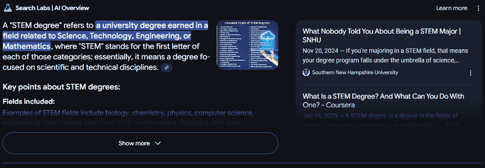

# 第八章。生成式 AI 和 SEO 的未来

生成式 AI 仍在不断发展，因此我们使用它与搜索引擎和 SEO 的方法也必须随之改变。通过识别新兴趋势和潜在改进，您可以更好地为未来做好准备，并保持领先于竞争对手。

在本章中，我们将探讨生成式 AI 的新趋势及其对 SEO 未来的影响。我们将探讨这些趋势将如何重塑我们的日常 SEO 实践。我们的主要目标是装备 SEO 专业人士以预见和适应这些变化。

SEO 专业人士中常见的疑问是“生成式 AI 搜索是否会从谷歌那里窃取大量市场份额？”本章将解决这些疑问，并提供专家对生成式 AI 和搜索引擎未来的观点。

# 预测生成式 AI 和 SEO 的演变趋势

迄今为止，我们讨论了 AI 当前功能的优势和局限性。LLMs 和生成式 AI 将继续发展，您必须在未来的 SEO 策略中考虑到这些变化。在本节中，我们将讨论您对未来生成式 AI 的期望以及它将如何影响 SEO 从业者和企业主。

我们预见到变化的第一领域是 AI 生成内容的整体质量。文本内容将听起来更像是人类。因此，营销内容——包括广告文案——将更能吸引客户。图像和视频将看起来更真实、更自然。SEO 从业者将发现开发内容更容易。但这并不改变 AI 生成内容仍然需要人类监督的事实。正如我们在整本书中强调的那样，如果您没有人类审稿人，您通过发布充满错误信息和失实内容或听起来过于机械以至于无法引起用户共鸣的内容，可能会损害您的品牌声誉。此外，您也失去了提出您组织观点和见解的机会。

第二，我们将看到有关生成式 AI 使用的新法规和法律。目前的法律尚未建立起来以保护非人类生成的艺术和文本。未来，我们将看到更多法规来控制可以拥有什么以及艺术家作品被用于训练 AI 模型时构成版权侵权的内容。更多法律将监督和限制其他艺术形式的用途以生成图像。然而，SEO 从业者将继续使用生成式 AI 来创建基本标志以及进行图像搜索和编辑。更多详情，请参阅“版权问题”。

第三，谷歌将继续作为搜索引擎和生成式 AI 的领导者，原因我们将在本章后续部分讨论。用户将看到更多 AI 生成的内容与传统搜索结果并排出现，这可能会影响信任和搜索引擎排名。提供信息性内容的公司需要关注让他们的内容成为 AI 生成响应的来源之一，而不仅仅是排名在传统搜索结果中。公司将为他们的页面被用作 AI 搜索概述的一部分而竞争。

第四，SEO 从业者和开发者应更好地利用生成式 AI 来加快网站和桌面及移动应用的编码速度。从为优化和互动而设计的用户界面设计到后端代码片段，生成式 AI 可以帮助您的网站和应用更快地呈现在客户面前。

最后，生成式 AI 将简化 SEO 从业者和视频制作者的工作。AI 模型将更好地处理视频并生成准确的字幕、替代文本和转录。预计视频翻译成其他语言的质量也将提高。

虽然转向关注生成式 AI 的结果可能听起来令人望而却步，但请记住，您的主要关注点应继续是质量和为用户提供价值。拥有权威内容将比以往年份更重要，因为生成式 AI 工具供应商将努力使用可信内容。SEO 专业人士将需要行业专家和仔细的监督，以确保生成式 AI 内容符合谷歌对权威内容的期望。

# 生成式 AI 搜索是否会超越或取代搜索引擎？

SEO 的基本目标——为了获取相关流量到网站，提高网站在搜索引擎中的可见性和排名——随着生成式 AI 的兴起而面临重大转变。然而，生成式 AI 不太可能完全取代搜索引擎。

谷歌可能会失去一些市场份额给 ChatGPT 和其他 LLM，但不会是大量的。生成式 AI 需要大量的数据，而谷歌拥有世界上最多的数据，这些数据来自其多年的网络编目、理解用户意图和相关性以及确定广泛主题的权威人士。此外，谷歌建立了一个名为[知识图谱](https://oreil.ly/IwSxk)的庞大事实库，这为它提供了一种验证内容准确性的方法。

许多用户将转向使用生成式 AI 而不是搜索引擎来查找信息。例如，当用户使用搜索引擎查找披萨店时，他们的查询可能会要求谷歌找到他们位置附近的披萨餐厅。这个查询并不总是返回完全匹配的结果。排名前三的餐厅可能有很长的等待时间，或者没有用户偏好的菜单项。这些具体信息很可能在客户反馈中找到，而生成式 AI 会摄取和处理反馈。然后，用户会去他们最喜欢的 AI 工具（例如，ChatGPT 或 Copilot）提问，而不是依赖搜索引擎的结果。

相比之下，用户可以要求生成式 AI 返回三家披萨餐厅。假设 LLM 返回了与谷歌相同的三个结果。然后，用户可以要求 LLM 根据其他摄取的信息（如等待时间、菜单项和客户反馈）给出结果，这些信息可能不会是现场内容的一部分。这为 SEO 专业人士提供了另一种类型的信息，可以在他们的网站上针对：解决后续问题的信息。专注于这些类型后续问题的权威内容可以帮助网站成为 LLM 输出的参考。

当涉及到智能手机上的搜索时，谷歌已经将 AI（Gemini）集成到 Android 中。大多数 Android 智能手机在用户启动搜索辅助时与谷歌 AI 协同工作。SEO 从业者将需要专注于将他们的品牌注入智能手机 AI 助手提供的推荐中。这些助手可能在未来变得更聪明，甚至会在用户提问之前开始给出建议。例如，假设智能手机用户在特定的一天为配偶的生日定期购买鲜花。助手可以在用户进行搜索之前推荐花店。SEO 从业者需要制定策略，成为顶级推荐之一——或者*成为*顶级推荐。

在本节中，我们将探讨 AI 将继续如何影响 SEO。我们将研究 AI 概述将如何影响搜索流量，优化生成式引擎的需求，查询意图对结果的影响，以及 AI 将如何影响某些商业模式。

## 人工智能概述对搜索流量的影响

在 AI 集成之前，位于前三名搜索结果并不提供与之前相同的点击流量，但作为生成式 AI 答案的来源可以增加搜索流量。对于您输入谷歌的大多数信息查询，您会注意到 AI 生成的答案占据了结果页面顶部的大部分空间。

图 8-1 显示了桌面用户在 Google 搜索中输入查询后看到的内容。正如你所看到的，AI 生成的答案占据了大部分屏幕，只显示了一个链接。结果二和三——以前被认为是良好的排名——没有在折叠之上。AI 生成的答案可能足以满足许多用户，因此信息查询通过传统网页结果发送流量到网站的可能性大大降低。

###### 注意

“折叠之上”指的是无需用户滚动即可显示在屏幕上的搜索链接。折叠之下的链接点击率会大幅下降。SEO 专业人士的目标是保持他们的网页链接在折叠之上，以获得更好的有机流量。

###### 图 8-1\. 当前 Windows 和 Chrome 中 Google 搜索结果的布局

[Search Engine Land](https://oreil.ly/xYa4S)上的一篇文章指出，来自搜索查询的 AI 生成答案降低了有机流量 18%–64%，并减少了 60%的点击率。预测算法并不新鲜，但用于生成式 AI 的预测算法可能是 Google 搜索策略的下一步。例如，根据同一篇[Search Engine Land](https://oreil.ly/xYa4S)文章，一些排名第一的结果被向下推了 640 像素，但这个范围在 200 到 2,000 像素之间，具体取决于 Google 的实验。当你的网站受到影响时，你可能看到你的关键词和展示位置相同，但点击率会大大降低，因此你的网站流量会受到显著影响。

由于这些布局变化，仅仅位于前三名搜索结果——甚至第一页——已经不再足够。你需要成为 AIOs 的一部分：Google 搜索结果页面顶部针对信息查询的 AI 生成答案。（我们在第二章中更详细地讨论了 AIOs。）正如你在图 8-1 中可以看到的，AIO 部分右侧包含参考链接。SEO 的未来将包括你的品牌在这些参考链接中。这种策略被称为*生成式* *搜索引擎* *优化* *(GEO)*，我们将在稍后详细讨论。

SEO 从业者将争夺在用户搜索结果顶部 Google AIOs 中的位置。Google 于 2024 年 11 月-12 月大规模推出了 AIOs，搜索巨头正在测试实验的结果。由于发布规模很大，Google 应该能够系统地提高 AIOs 的质量。

然而，如果谷歌不将其内容来源网站的材料流量发送给这些网站，出版商将失去提供他们人类生成、专家内容访问的激励。如果他们停止提供这种访问，训练未来的 AI 模型——尤其是在新兴领域或主题中——将变得困难，并可能导致更多错误和遗漏。因此，在谷歌的最佳利益中，应该突出其 AI 生成内容来源。

而不是在谷歌的知识图谱中，SEO 应该旨在成为 AI 生成内容中使用的品牌。拥有专业知识将比以往更重要，以确保你的内容被视为有价值的。由于 AI 生成答案只有一个参考位置，品牌将需要竞争这个备受瞩目的位置，随着谷歌的 AI 答案不断演变。

## 谷歌的新 AI 模式

AI 模式是谷歌引入的一项新功能，它为谷歌搜索提供了对话式的聊天功能。AI 模式的引入是谷歌应对 OpenAI 和 ChatGPT 带来的威胁的重大一步。

截至 2025 年 6 月 1 日，[AI 模式在美国对所有用户开放](https://oreil.ly/PARME)。你可以期待在 2025 年这一功能将扩展到世界其他地区。

图 8-2 展示了谷歌如何将其整合到搜索用户界面中。正如你所见，当前的 UI 将此作为菜单栏中的第一个选项，这为我们提供了谷歌对这一功能的优先级指示。

###### 图 8-2\. AI 模式在谷歌搜索用户界面中的显示

什么是 AI 模式？简单来说，它是设计用来用对话式响应来回应用户提示的。像 Gemini 和 ChatGPT 一样，用户提示可以是复杂的，包括多个部分，并且它可以记住先前用户提示的上下文，以及关于用户的其他信息。它可以接受文本、语音和图像作为输入。

作者们预期谷歌可能会将 AI 模式作为某些查询类别的标准模式。例如，如果用户查询是信息性的并且使用自然语言提问，那么它可能成为谷歌默认 AI 模式响应的候选者。

AI 模式的影响可能会非常显著。某些类别的查询将不再获得传统的谷歌搜索体验。这将进一步降低对网站的点击量，尤其是对于信息性查询。

然而，这并不意味着你的收入机会会消失。随着 AI 在搜索中继续演变，请记住，你的产品或服务的潜在客户数量不会因此改变。

为了应对这些变化带来的挑战，你需要投入时间、金钱和努力，以保持领先并击败竞争对手，找出如何适应的方法。虽然这可能会感觉像是一种负担，但请记住，这也是一个机会。

## 理解生成式引擎优化

谷歌的 AI 生成答案变得越来越普遍，尤其是在包含至少八个单词的搜索查询中。据[估计](https://oreil.ly/BTyn7)，至少包含八个单词的 25%的查询都有 AI 生成的答案。SEO 的格局已经改变，一个显著的不同之处在于，在谷歌上排名前三的结果不再像以前那样意义重大。现在，你应该开始针对 GEO，目标是让您的组织网页成为谷歌 AI 生成结果中的一个参考。

图 8-3 显示了查询“什么是 STEM 学位？”的结果。请注意，左侧是谷歌的 AI 答案，右侧的链接是参考链接。GEO 针对查询的 AI 生成答案右侧的参考链接。同时请注意，“显示更多”按钮可以展开更多信息，滚动条上方不显示其他链接。这意味着在传统搜索结果中成为第一个结果（在 AI 生成答案之后）的效果不如以前。

###### 图 8-3\. 查询“什么是 STEM 学位？”的 AI 生成结果

GEO 定位使组织更具可见性。随着谷歌增加包含 AIO 的搜索结果百分比，您需要更多地关注成为 AIO 中的参考链接之一。您可以在图 8-3 中看到，只有两个参考链接显示在 AIO 中。GEO 将比传统的 SEO 更具竞争力，在第一页上就能带来良好的点击率，尤其是对于折叠之上的前三个结果。

SEO 从业者应该知道 GEO 结果可能会改变他们的指标。在 AIO 出现之前，位于前三名搜索结果所带来的流量与位于第八、第九或第十名一样多。即使您成功成为谷歌生成 AI 答案中的一个参考，也要记住，用户在无需点击第三方网站的情况下就能得到问题的答案。当这个答案完全解决了用户的问题时，他们就不需要点击到任何源网站获取更多信息。然而，即使用户点击的次数不如传统搜索结果那么多，出现在 AIO 中仍然具有品牌价值。

在图 8-3 中，我们得到了对搜索问题的答案，但一些用户可能会提出关于获得 STEM 学位的后续问题，因此成为 AIO 中的参考后续链接可能会为您的网站带来一些流量。例如，用户可能会问“在哪里”或“如何”获得 STEM 学位。作为一名 SEO 从业者，您可能可以从这些查询中带来流量。理想情况下，您的组织应该出现在潜在学生可以了解更多关于 STEM 学位信息的参考链接中。

要在 GEO 中更具竞争力，你需要采取与 SEO 略有不同的内容优化方法，包括：

权威引用

使用权威资源的链接是一种常见的 SEO 策略，但与学术期刊、政府资源或大型、受信任的新闻出版物合作将提高你的可信度和潜在 GEO 可见度。

统计数据和有用信息

许多查询会向搜索用户返回数值数据。以统计数据、你的研究和研究中的数据或回答查询的数值信息的形式添加你自己的权威信息可以增加你的权威信号。

直接回答查询

AIOs 依赖于从回答问题的页面或可以形成问题答案的页面中获取的信息。确保你的内容直接回答用户向搜索引擎提出的问题。你可以从第三方工具如 Semrush 或 Ahrefs 中获取问题。

权威内容

除了直接回答问题外，你的内容还必须涉及与用户可能感兴趣的相关背景和问题。

GEO 策略的成功与传统 SEO 指标也有所不同。GEO 不是关注点击和访客，而是关注基于你的组织被包含在 SGE 结果中的印象。通常，SEO 内容侧重于权威性和易于被广泛受众理解，但 GEO 内容必须更具体地针对搜索查询。关键词仍然可以整合到 GEO 定位内容中，但它们必须嵌入到包含统计信息和权威引用的搜索查询的上下文答案中，以支持你的研究。

###### 注意

在 GEO 中，我们不仅仅考虑关键词的排名，而是思考如何全面地覆盖与用户需求相关的主题和子主题。尽管如此，关键词研究仍然可以为我们提供用户感兴趣领域的洞察。

SEO 的一些元素可以转移到 GEO。例如，媒体元素仍然相关，但它们应该是高度权威的。AI 爬虫可以摄取和解释的信息图表可以方便用户快速阅读并更好地理解主题，但它们也可以用于 AIO 内容。设计你的内容以解决用户意图仍然很重要。如果你的内容在解决这个意图方面较弱，这将降低用户对你网站的满意度，并损害你的 SEO 和 GEO 努力。GEO 将搜索回答用户查询的相关内容，并过滤掉无关、垃圾或低质量的内容。

保护您的组织免受内容盗窃是一个需要考虑的问题。最重要的是确定您是否希望所有内容都被爬取。通常，搜索引擎优化从业者会与域的 *robots.txt* 文件合作，以阻止某些机器人爬取和索引网站内容的一部分。例如，您可能有一个低质量的页面，您希望出于质量信号的目的阻止其被索引。对于地理爬虫也是如此。您可能需要阻止一些人工智能机器人，但您应该启用本书中涵盖的主要生成式人工智能工具，因为您确实希望在这些平台上保持可见性。

###### 注意

并非每个机器人都会遵守 *robots.txt*，因此搜索引擎优化从业者除了监控恶意机器人外，还应监控恶意人工智能爬虫的访问统计。

## 查询意图的影响

谷歌和其他任何企业一样，可以根据其用户的期望和愿望改变其方法。如果用户对人工智能生成的结果感到满意，那么搜索引擎优化从业者应该期待谷歌与人工智能合作，在顶部创建回答客户查询的片段。

使用人工智能生成的答案并不总是有益的。同样，这取决于查询的性质。例如，假设用户要求谷歌显示“最好的吸尘器”。 “最好”的吸尘器是主观的，人工智能对于意见（人们通常希望看到专家或其他使用过该产品的人的意见）没有价值。在这种情况下，在搜索结果顶部放置简短摘要对用户也没有好处，因为他们可能想看到真实的用户评论，并决定购买最好的家电。购物和电子商务的搜索引擎优化专业人士仍然需要努力在这些类型的传统搜索结果中排名他们的网站，因为人工智能将在这类结果中占据较少的份额。话虽如此，谷歌可能仍然会重视这些类型查询的人类生成内容，例如 Reddit、评论网站 ([*Trustpilot.com*](https://www.trustpilot.com), [*ConsumerAffairs.com*](https://www.consumeraffairs.com)，以及其他论坛），搜索引擎优化从业者将不得不解决这些类型网站排名更高的问题——以及未来可能由人工智能总结这些结果。

谷歌处理搜索体验的方式将取决于搜索者的意图，无论是购买还是寻找信息。常青内容可能会发现自己位于人工智能生成的 AIO 或其他在谷歌结果顶部生成的搜索片段之下。搜索引擎优化从业者仍然可以尝试在自己的网站中链接这些片段，但这将更加具有竞争力，其中可能只列出一到三个来源。此外，传统搜索结果将被推到页面下方，其价值将低于今天。

而不是手动执行搜索查询，AI 可以用来预测搜索者在智能手机上想要什么。例如，假设您总是在智能手机上寻找孩子的礼物。生成式 AI 可以吸收您常用的常见搜索查询，并预测您需要每年购买礼物。它甚至可以在您执行查询之前提供建议。谷歌需要适应这种情况，将其服务纳入其中，其搜索显示您可以购买供孩子生日用的物品列表。在这种情况下，SEO 从业者会希望确保他们的商店在用户查看和购买的可能选项列表中。

## 生成式 AI 对商业模式的影响

SEO 行业还将有其他变化。其中一些变化可能会严重影响商业模式。对于受到生成式 AI 结果负面影响的业务，其所有者和 SEO 团队必须找到新的方法来吸引用户到他们的产品和服务。

一些变化已经影响了网络上的知名品牌。一个例子是 Chegg，这是最知名的教育内容提供商之一。Chegg 为学生提供测验和测试问题的答案。到 2021 年，[它拥有 4600 万个学生问题的数据库和 120 亿美元的市值](https://oreil.ly/QVp5l)。学生可以提交问题，并希望 Chegg 的数据库中有这些问题的答案。自从 ChatGPT 推出以来，学生转而使用 ChatGPT 来获取问题的答案。ChatGPT 基于世界上大量信息提供答案，而 Chegg 只有 4600 万个问题的答案，这仅占世界信息的一小部分。[Semrush 数据](https://oreil.ly/_hOdA)显示，Chegg 的有机搜索流量损失超过三分之一，该公司在 2024 年 2 月至 2025 年 2 月之间市值损失超过 80%。

生成式 AI 对网站业务的影响的另一个例子是任何词典网站。正如您可能知道的，用户会访问词典网站来寻找单词的定义、同义词和反义词。有一段时间，谷歌已经在搜索结果页面上直接显示单词的定义。用户不再需要访问任何词典网站来寻找答案，但生成式 AI 显示的定义来自这些词典网站。将您组织的页面纳入谷歌的生成式 AI 答案对于 SEO 专业人士来说至关重要，但极具挑战性，因为许多竞争对手都在争夺相同的位置。如果您能让您的品牌进入生成式 AI 的结果，您的页面将被引用。然后用户可以点击引用链接，直接在您的网站上查看更多信息。

虽然生成式 AI 搜索无疑将改变我们引导流量到网站的方式，但它不太可能完全取代搜索引擎或我们当前的 SEO 策略。话虽如此，我们必须采用一种混合方法，结合传统的排名和优化技术与 AI 驱动的技术。

# ChatGPT 搜索的介绍

2024 年 10 月，OpenAI 发布了自己的搜索引擎，名为 ChatGPT Search。该搜索引擎仍处于起步阶段，但它可能成为当前搜索引擎（主要是拥有主导市场份额的谷歌）的良好竞争对手。看起来 OpenAI 正在尝试通过 Chrome 扩展程序进入搜索引擎市场，ChatGPT Search 也可以集成到 Microsoft Teams 中。

目前，如果用户想要找到一款产品，他们首先需要了解该产品或产品的属性。用户可以向谷歌提问，但他们需要接近理解他们正在寻找的内容。SEO 的一个难点是覆盖任何可能的搜索查询的内容和销售，以在搜索中为潜在客户创造可见性。OpenAI 的搜索消除了覆盖搜索查询的需求。相反，SEO 专业人士需要找到方法让他们的产品在 ChatGPT 搜索中显示出来。

假设你的客户销售汽车。SEO 实践者必须制定一个内容策略，尽可能覆盖用户在搜索产品或服务（如你的组织提供的产品或服务）时可能使用的所有搜索查询。例如，一些潜在客户可能正在寻找环保汽车，另一组人可能正在寻找适合长途通勤的汽车，还有其他人可能正在寻找跑车。当前 SEO 的目标是出现在谷歌搜索结果中的各种搜索查询中。理想情况下，SEO 实践者力争出现在前三项结果中，或者至少在第一页上。并非每个搜索查询都有相同的搜索量和意图，但 SEO 的目标是引导流量到雇主的网站，然后销售其产品。

通过 OpenAI 的搜索，人们现在可以就他们感兴趣的车型提出问题，LLM 会提供一个建议列表。谷歌的搜索结果则大相径庭。目前，谷歌不会给你一个汽车链接列表。相反，它提供的是人们讨论汽车的讨论链接。让我们看看谷歌和 OpenAI 对“我正在寻找一款适合加利福尼亚驾驶和越野道路的汽车”这一查询的初始链接，如图 8-4 所示。

在 图 8-4 中，你可以看到一些结果是基于第三方网站提供的讨论或评论。这些结果没有为汽车制造商或型号提供直接的建议，因此用户必须点击链接并阅读更多内容，才能找出最适合他们需求的汽车。

###### 图 8-4. Google 搜索结果：“我在寻找一辆适合加利福尼亚驾驶和越野道路的汽车”

相比之下，OpenAI 的搜索为汽车制造商和车型提供直接建议，如图图 8-5 所示。

###### 图 8-5. ChatGPT 搜索结果：“我在寻找一辆适合加利福尼亚驾驶和越野道路的汽车”

正如您在图 8-5 中可以看到的，OpenAI 提供了三个直接建议。对于一个 SEO 从业者来说，你的新目标将是让你的组织进入这些搜索结果。你可能甚至需要创建可以用于生成式 AI 搜索结果的内容，以便在用户访问你的页面后获得更好的转化率。你可能希望转向专注于在生成式 AI 搜索结果中获得位置。

# 生成式 AI 技术进展

2023 年 12 月，DeepSeek 向公众发布。新的中文模型是开源的——这意味着模型的参数被公开提供（也称为*开放**权重*）——DeepSeek 被视为 OpenAI 的重要竞争对手。DeepSeek 吸引用户的一个主要特性是其[用户价格](https://oreil.ly/pGggM)。用户支付大约 3 美元就能获得一百万个 token，这相当于大约 80,000 个单词。将这个成本与 OpenAI 相同数量的 token 的 15 美元进行比较。这种比 OpenAI 更便宜的替代方案可能意味着更多用户涌向 DeepSeek 而不是使用 OpenAI。更低的成本可以吸引更多用户进行内容创作和其他 SEO 效益，以更低的成本实现更大规模的扩展。更低的成本也给小型企业利用生成式 AI 的机会。

DeepSeek 是一个成本更低的 LLM 选项，因此其他人可能会找到降低这些模型训练成本的方法。更低的成本有利于那些可能不在拥有高端营销预算的组织工作的 SEO 从业者，这将为行业带来更多竞争。你应该期待在未来看到许多其他新的 LLM 出现。这些将为 SEO 从业者提供更多选择，并为市场增加竞争。即使市场上存在其他 LLM，SEO 也不会被消除。现在的一些工作将集中在 GEO 上，并成为品牌更具竞争力的领域。

# 结论：为生成式 AI 和 SEO 的未来做准备

尽管生成式 AI 正在快速发展，但它无法持续产生完整和准确的人造输出。图像、视频和文本往往包含使其看起来是由机器人创建的元素。尽管有时这些迹象很微妙，但随着人们对 AI 生成内容越来越熟悉，他们识别它的能力也会增强。

尽管如此，生成式人工智能将继续发展，我们可以期待它在创造更类似人类输出的能力上取得显著进步。这可能需要许多年才能实现，但生成式人工智能仍然处于其演化的初期阶段。虽然现在可能看起来生成式人工智能无法取代人工艺术或写作，但它将会改进。在未来几年里，它与人工内容的区别将越来越小。使用生成式人工智能的自动化将使 SEO 任务更加高效，一些传统上由人类完成的工作可能会消失。SEO 从业者需要“提升技能”并找到与新搜索引擎策略合作的方法：这些策略包括更多地关注顶部的人工智能片段，而较少显示给用户的链接。

DeepSeek 和其他创新的生成式人工智能技术已经减少了模型没有正确答案时的“幻觉”数量。生成式人工智能可以与数千种学术期刊和来源合作，以产生更准确的答案，而不是依赖人类研究人员。这些好处将继续增长，生成式人工智能将成为医疗保健等关键行业的重要资产。例如，医生可以根据症状获取关于治疗的信息，以帮助他们更好地治疗患者。很可能会出现许多其他行业利用生成式人工智能来加速生产力和提供更好的生活质量。

生成式人工智能的改进工作已经在进行中，但提高人工智能输出质量需要时间。这可能在明年或后年不会发生，但会在接下来的几年内，并在接下来的十年内实现。今天你所知道的生成式人工智能将在十年后变得大不相同，并且更加准确。为了使搜索引擎优化从业者能够跟上生成式人工智能的步伐，他们需要不断尝试新的变化，调整他们的策略，并与为他们的品牌生成输出的 AI 模型合作。如果你没有使用或计划使用第六章中讨论的[高级技术](https://example.org/ch06.html#ch06_advanced_use_cases_for_generative_ai_in_seo_1748359259642070)，那么你可能会落后。

在人工智能时代保持 SEO 的前沿需要实验。当你找到一个有效的 SEO 策略时，继续对其进行优化。随着人工智能技术的进步，你的 SEO 策略必须跟上，以确保你的组织持续保持相关性和成功。
