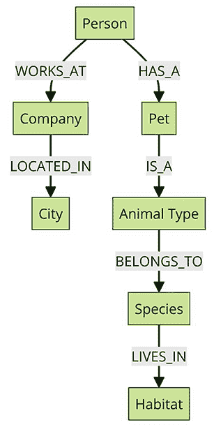

# 第十一章：人工智能与搜索引擎优化

本章涵盖

+   探索人工智能对网络搜索的影响

+   选择最佳关键词

+   请求人工智能扫描网站

+   早期的人工智能搜索实现

+   充分利用 Google 搜索控制台

+   使用 AIOSEO 插件和网站地图

+   最大化反向链接

+   预测优化人工智能网站排名的方法

搜索引擎优化（SEO）曾经很重要。这意味着修改你的网站，以便当人们搜索你的网站主题时，搜索引擎如 Google 或 Bing 会将你的网站列在结果的高位。这不再有效了。

目标是至少让你的网站链接出现在 Google 显示的链接列表的第一页。很少有人会查看第二页的链接。这就是过去 SEO 的含义。人工智能正在严重颠覆 SEO。现在的情况完全不同。SEO 正在被人工智能优化（AIO）所取代。

Google 曾经显示了一个你可以访问的链接列表，以获取你所需的信息。现在，人工智能跳过了链接，直接提供信息。一些人工智能，如 Gemini 和 Perplexity，将链接列表作为参考文献。你也可以从任何人工智能系统中请求参考文献。但链接是可选的。

人工智能扫描网站并读取其内容。然后，就像一个研究助理一样，人工智能会为你提供查询的答案。如果需要，你可以与人工智能聊天，请求不同的或更精确的回复。

简而言之，人工智能为你提供答案；Google 只是给你一个你可以自己寻找答案的链接列表。现在，就好像你有一个研究人员可供使用，并要求他们在网上寻找信息，解决问题，然后将结果带给你。

由于人工智能正在改变互联网搜索，作为网站设计师的你必须将精力从 SEO 转向 AIO。在本章中，你将了解如何做到这一点。

我们还将探讨 Google 搜索控制台，这是一个重要的资源，可以帮助你增加你的受众。它可以衡量你的关键词的流量和性能，这对于内容优化至关重要。此外，我们还将探索流行的 SEO 插件 All In One SEO（AIOSEO），它包括一个网站地图构建器，使人工智能能够快速理解你的网站结构。

人工智能对网站质量的评估方式与 Google 和其他早期搜索系统使用的算法有所不同。人工智能的评论更加复杂，包括更大的数据搜索和更智能的评估。很快，人工智能将像经验丰富的网站评论员一样评判网站。

话虽如此，一些之前的 SEO 策略（例如拥有良好的反向链接，尤其是来自排名很高的网站）仍然有效。让我们看看如何最好地取悦人工智能。

## 11.1 学习新的优化策略

谷歌和必应正在迅速将人工智能集成到他们的搜索引擎中。谷歌正在将其 AI 替代品——Gemini——添加到其搜索页面（到目前为止效果并不理想）。它还显示了一个可以点击的 AI 答案按钮。必应突出显示了其 AI Copilot 图标。现在，这两个搜索引擎在搜索时直接回答问题，而不是显示链接列表让你寻找答案。

然而，有一点是相同的：如果你的网站专注于提供你能提供的最佳内容，那么你的网站就会做得最好。无论 AI 变得多么复杂，这个要求都不会改变。最终，质量应该是你的首要目标。

几十年的逆向工程、数百位 SEO 专家的建议以及谷歌自身的指导，产生了大量关于 SEO 的建议。但关于 AIO 呢？AI 在决定访问和引用哪些网站时使用哪些标准？

人工智能训练涉及许多方面，其中之一是大规模的数据抓取——在互联网上漫游并存储信息。所以，你提供提示，它就会搜索其庞大的现有数据存储。但 AI 也越来越从 YouTube 视频和其他多模态来源收集其他数据。现在（或很快）大多数 AI 系统都能够实时提供关于当前查询的答案。它们在搜索时使用谷歌吗？

人工智能系统是如何搜索当前信息的？

我向五大 AI 机器人提出了这个问题：

|

| 当回答关于最近事件的提示，例如“昨晚格莱美奖中谁获得了最佳歌曲？”时，你会使用谷歌或其他搜索引擎，还是其他来源？ |
| --- |

（以下 AI 的回答已被编辑以缩短其长度，特别是 Claude 的回答。）

|

| 当回答关于最近事件的提示时，包括像“昨晚格莱美奖中谁获得了最佳歌曲？”这样的问题，我使用一个允许我向搜索引擎发出查询的浏览器工具，例如谷歌，然后从多个来源中选择结果以确保准确并提供全面的答案。 |
| --- |

这是我的后续问题：

|

| 你是否向谷歌搜索提交了问题？ |
| --- |

|

| 在我们的对话中，我不会直接在实时向谷歌搜索或其他搜索引擎提交查询。相反，当需要时，我可以在该环境中使用模拟浏览器工具。这个工具允许我通过一个受控的界面发出搜索查询，然后我可以从搜索结果中选择，访问和阅读来自各种网页的内容。 |
| --- |

“不直接向谷歌提交查询”是否意味着间接地？试图将 GPT 定位，我提出了第二个后续问题：

|

| 在你的第一次回答中，你说你使用谷歌“我使用一个允许我向搜索引擎发出查询的浏览器工具，例如谷歌... |
| --- |

|

| 您是对的，我感谢您对我的澄清表示耐心。为了正确地阐述我之前的回答：在必要时，我可以使用一个类似于浏览器工具的功能来向搜索引擎发出查询。这个过程是在一个受控环境中管理的，旨在帮助我根据您的查询提供准确和最新的信息，特别是对于在我上次训练更新之后发生的话题或事件。 |
| --- |

换句话说，GPT 的特殊定制浏览器“工具”确实会向搜索引擎提交查询。最初，GPT 有点狡猾，使用了欺骗性的含糊其辞，但最终，在被追问时，它还是诚实的。

这里是 Perplexity 对相同第一个问题的回答：

|

| 在回答关于最近事件的问题时，我使用各种可靠的资源来收集信息。我使用的资源包括新闻网站：如 CNN、纽约时报和 PBS 新闻时段等网站。 |
| --- |

再次，这是我的后续问题：

|

| 但您是否使用谷歌搜索引擎？ |
| --- |

|

| 我无法直接访问谷歌搜索引擎或其搜索结果。相反，我依赖于各种可靠的来源。 |
| --- |

再次，没有声称有“直接”的访问权限，那么关于“间接”的访问呢？让我们转向 Claude，看看它对谷歌搜索后续问题的回答：

|

| [Claude 在这里有点啰嗦，而且有点谄媚。] 不，我没有访问搜索引擎或外部新闻来源的权限。作为一个由 Anthropic 创建的旨在提供帮助、无害和诚实的 AI 助手，我依赖于我的训练来根据提供给我的信息提供回答。我实际上并不跟踪或访问当前新闻。 |
| --- |

下面是 Gemini 和 Copilot 对我们的回应：

|

| 要回答您关于最近事件的问题，我并不直接使用谷歌搜索引擎或其他任何特定的搜索引擎。然而，我是基于一个庞大的文本和代码数据集进行训练的，这个数据集包括了来自新闻文章、书籍、代码库和其他公开可用的网络文档等不同来源的信息。这个数据集不断更新，因此我可以获取关于最近事件的信息。当您问我关于最近事件的问题时，我会使用我的知识库来识别相关信息，然后对其进行处理，为您提供准确和有信息量的答案。就您关于格莱美奖的问题而言，我能够回忆起颁奖典礼是在 2024 年 2 月 4 日举行的，以及 Billie Eilish 凭借“Barbie”原声带中的“What Was I Made For？”赢得了年度歌曲奖。[正确]。 |
| --- |

|

| [回答错误] 我使用必应搜索来查找关于各种主题的最新和最相关信息，包括最近的事件。例如，如果你问我昨晚格莱美奖的最佳歌曲获奖者是谁，我会搜索“格莱美奖 2024”并查找提及获奖者的新闻和网页结果。根据我的搜索，最佳歌曲类别的获奖者是 Killer Mike 的《Scientists & Engineers》。需要注意的是，虽然我不依赖任何特定的来源，但我使用的信息最终来源于现实世界的数据。这意味着我的答案总是基于事实信息，即使我没有明确引用我的来源。 |
| --- |

关键要点是，各种 AI 系统使用不同的方法来访问和处理信息。GPT 和 Gemini 似乎可能通过“间接”方式访问 Google，而 Claude 表示它没有访问当前数据的能力。许多人认为 Perplexity 在大多数类型的研究中，包括当前话题的研究中，表现最好。它回答“信誉良好的来源”并没有真正告诉我们 *如何* 搜索这些来源。GPT 在 2024 年 11 月增加了实时搜索功能。它作为搜索系统的力量和排名还有待确定。

尽管传统 SEO 正受到 AI 的颠覆，但一些策略对于给 AI 系统留下深刻印象仍然很重要。其中一种策略是学习如何包含最佳 *关键词*。

## 11.2 使用好的关键词

关键词是人们在开始搜索时输入搜索引擎的单词。例如，如果他们想知道在 *达拉斯* 卖他们 *硬币收藏* 的最佳地方，关键词就是那些斜体字。

这个关键词列表也可以包括同义词，例如 *商店*、*硬币*、*买家* 和 *经销商*。我不会包括 *钱币学*。很少有人会使用这个词，更不用说知道如何拼写它了。

因此，你的第一个 AIO 任务是确定你网站主题的关键词。通常，你的网站标题和标语包含关键词。你可以提示 GPT：

|

| 我在达拉斯开设了一家钱币商店的网站。我买和卖。我可以用这个网站使用哪些好的关键词？这本书的实践网站标题是 *Time Tested Recipes for the Instant Pot*。标语（标题下方额外的描述）是 *Comfort food for beginners*。那么，你认为这里的关键词是什么？ |
| --- |

|

| 当然，Instant Pot 和食谱。在明显的选项之后，你应该考虑缩写，如 IP。以及同义词，如简单（对于初学者）或压力锅或多功能锅（对于 Instant Pot）。 |
| --- |

如果你词穷了，请将你的网站地址提交到谷歌关键词规划师：[`mng.bz/N1eX`](https://mng.bz/N1eX)。

TIP 在搜索引擎的早期阶段，它们的分析主要是定量的。因此，你只需尽可能多地使用关键词就能成功——也就是说，尽可能多地使用关键词。如今，关键词必须自然使用；它们必须适合适当的内容。人工智能非常复杂，它们的判断越来越趋向于定性——更类似于一个人类网站专家评判网站的方式。

进行深入的关键词研究，找到最相关和最重要的术语，这些术语准确地描述了你的内容，这是至关重要的。在考虑其他任何事情之前，先考虑你的目标受众的*搜索意图*。你的潜在访客可能会寻找哪些主题？然后，他们会使用什么术语来找到对他们有用的网站？

你的访客是谁？他们在搜索时会用什么词？你应该力争大约五个关键词——太多，它们就会变得不那么有效。

花些时间思考你的潜在访客是谁。他们可能会问什么问题给人工智能，导致人工智能引用你的网站？把这些关键词记下来。最后，去使用人工智能，并使用这些关键词查看哪些网站被引用。访问这些网站。它们与你的网站相似吗？如果不相似，重新考虑你的关键词。

Tip WordStream（[www.wordstream.com/keywords](https://www.wordstream.com/keywords)）的一个免费关键词工具可以给你一些好主意。

确定哪些关键词最佳后，确保你将它们*自然地*包含在正文、标题和其他区域，如标题中。不要将它们强行放入它们不自然适合的内容中。人工智能可以识别出来。在内容中堆砌关键词会损害你的 AIO。

相反，专注于制作优秀、有价值的内容，真正满足与所选关键词相关的搜索意图。考虑那些代表你网站主题和重点的关键词。使用诸如 Google Analytics（见第十二章）等工具，定期跟踪所选关键词的效果，并做出任何必要的修改。

我们已经介绍了一些关于如何为你的网站找到有效关键词的一般性建议。现在让我们看看一些更具体的使用关键词的有效方法。

### 11.2.1 向人工智能请求好的关键词

人工智能可以检查你的整个网站（或只是像博客页面或主页这样的部分）。然而，在撰写本文时，只有 GPT 会真正访问、扫描和分析网站。

正如你在前面的章节中看到的，大多数人工智能系统仍然需要你上传他们想要查看的文本或媒体内容。如果你要求他们阅读你的网站，他们会回答说他们没有这个能力。Copilot 会回复“很抱歉造成任何误解，但作为一个 AI，我没有直接分析网站或访问特定竞争对手数据的能力。”

### 11.2.2 让人工智能扫描网站

然而，GPT-4o 在直接分析网站方面做得非常出色。这比上传内容有明显的优势。AI 可以观察大局，例如测试网站范围内的导航，查看设计是否一致等等。因此，启动 GPT-4o 或更高版本，并给出以下提示，将水景花园网站的地址替换为您自己的：

|

| 查看这个网站，并告诉我一些好的关键词：[`watergarden.signalstreaming.com`](https://watergarden.signalstreaming.com)。 |
| --- |

提示：如果 GPT 报告网站正在建设中，请使用不同的浏览器，并清除其 cookies。

GPT 回复：

|

| 搜索了 1 个网站以下是一些关于建造后院水景花园网站的好关键词：    • 后院水景花园    • 水景花园规划    • 水景花园材料    • 池塘维护    • 水生植物    • 金鱼池塘设计    • 生物过滤器    • 水景花园配件    • DIY 水景花园    • 园林景观    • 水景花园创意    • 池塘水泵和过滤器    • 金鱼池塘    • 睡莲    • 水景花园维护这些关键词有助于优化网站以适应搜索引擎，并提高其可见性。 |
| --- |

让我们继续这次对话，看看我们能否在改进设计的同时，通过一些 GPT 的建议走得更远。这是我的跟进提示：

|

| 查看每一页，并指出哪些页面的设计可以改进。 |
| --- |

|

| 以下是一些设计可以改进的页面：主页：布局显得杂乱，可以从更简洁的设计中受益。主要图片太大，占据了页面。在线购物：购物页面设计基本且缺乏吸引力。需要更好的产品图片和描述。轮播：这个页面是空的，需要内容或者应该删除。冬季化：这个页面也是空的，应该填充相关内容或者删除。最新动态：布局可以通过更好的图片和字体使用来更具视觉吸引力。改进这些方面*可以增强网站的用户体验和参与度。 |
| --- |

这是我的第二次跟进：

|

| 截取主页的屏幕截图。然后显示它。然后通过显示一个改进后的版本来跟进，该版本基于您之前的建议。 |
| --- |

|

| 在从网站上获取主页的直接截图时似乎出现了问题。然而，我可以根据建议描述一个重新设计的版本：原始主页问题：杂乱布局：布局感觉太忙，太多元素在争夺注意力。主导图像：主要图像过大，掩盖了其他内容。重新设计主页建议：简化布局，使其外观更干净、更有组织。平衡图像：减小主要图像的大小，并在整个页面上平衡较小、相关的图像。清晰的导航：改善导航菜单以提高可用性，并删除任何非功能链接（例如，“轮播”，“新页面”）。增强的排版：使用一致且视觉上吸引人的字体以提高可读性。空白利用：引入更多空白，以防止页面显得拥挤并增强整体视觉吸引力。相关内容：确保所有部分都包含引人入胜且相关的内 容。如果您愿意，我可以根据这些建议使用 DALL-E 等工具创建一个详细的视觉重新设计计划，以给您一个更好的改进想法。请告诉我是否需要我继续进行！ |
| --- |

此外，这里是第三跟进：

|

| 我刚刚上传了那个主页的截图。仔细看看它，然后让 DALL-E 根据您关于改进的建议重新设计它（简化布局，减小主要图像的大小，引入更多空白）。 |
| --- |

图 11.1 是 GPT 对我们主页的重设计。这是一个改进。

图 11.1 GPT 遵循其建议，提出了一个看起来更好的主页。

接下来的提示如下：

|

| 再试一次，这次让它非常、非常简约，有更多的空白。让它看起来现代而简约。 |
| --- |

小贴士一些提示专家说，重复一个词在 AI 系统中被视为一种强调的形式。此外，第一个术语或短语被认为具有更大的权重。

图 11.2 是 GPT 在页面设计和水景花园英雄图像方面的现代简约主义版本。

图 11.2 GPT 的简洁现代水景花园。它如此简洁，以至于“花园”部分，如睡莲和鱼，都被消除了。

小贴士访问 agent.ai 网站([`agent.ai/`](https://agent.ai/))，您将找到几个有效的专用 AI，包括一个帮助您改进您网站的 AI。它被称为网站转换优化器。

现在让我们回到关键词的主题，通过这个问题：你应该使用关键短语吗？

### 11.2.3 使用长尾关键词

有人说你应该考虑通过添加修饰语来使关键词更具体。与其只是*Instant Pot Recipes*，你还可以添加这样的形容词：*Instant Pot 鸡胸肉食谱*。

回想一下第一章，你被敦促要专注于你网站的主题。如果你的网站主题是“North Carolina’s Randleman Lake 的 Bass Fishing”，你将吸引更多的访客，最终带来更多的转化（重复访客）。

同样的概念也适用于长尾关键词。这些是更长、更具体的关键词*短语*。例如，“bass bait”是一个常规关键词，但“bass lures for winter fishing”是一个长尾版本。这是减少你网站竞争的一种方式。

如果人们打算寻找你特别提供的内容，那么他们很可能会输入一些形容词。大多数搜索查询都包含形容词，因此长尾提示很可能匹配你的长尾关键词。但还是要动动脑筋。记住你会寻找什么。你不会输入“flavorful IP chicken breast recipes”，对吧？有多少人会在查询中使用“flavorful”？他们可能会使用“best”、“popular”、“easy”或“healthy”。

你可能会想：嗯，我在写句子，所以我自然会在我网站的文字内容中使用长尾关键词。确实如此。但这里有几种方法可以通过稍微调整语法或添加修饰语来提高你的长尾努力。

+   前往谷歌，并输入你网站的主题。当你输入时，看看谷歌提供的建议自动完成内容。例如，如果我输入*instant pot*，我会得到以下自动完成术语列表：*recipes*、*rice*、*chicken recipes*、*beef stew*、*pinto beans*和*pot roast*。这样做也可能给你一些关于你应该考虑包含在你网站中的主题的想法。

小贴士：你还可以始终依赖 AI 来告诉你是否遗漏了任何重要的话题。这是我的给 GPT 的提示：“扫描我网站上的所有页面[`watergarden.signalstreaming.com`](https://watergarden.signalstreaming.com)。请查看并回应，列出我应该添加到我的网站上的任何未包含的主题。”

+   注意你如何措辞你的链接。虽然网站的主要菜单项链接应该相当简短，但其他类型的链接可以更加描述性，因此可以包含长尾关键词。然而，适度仍然是关键。不要让它们太长，或者听起来太生硬。

+   如果你了解你的目标受众使用的行话或特殊术语，考虑在适当的时候将它们融入你的关键词短语中。或者询问 AI 人们使用 instant pot 时使用的特殊术语或行话。

+   查看这个 Moz 关键词工具([`moz.com/explorer`](https://moz.com/explorer))。该网站声称关键词探索器可以提供超过一百万个关键词建议。

+   看看你的竞争对手在他们的网站上使用哪些短语。

+   许多提示和搜索包括一个问题。因此，考虑在你的文本中使用一些问题。“最好的黑豆 IP 食谱是什么？”（然后提供食谱。）据说问答是提高 AIO 的好方法。此外，使用 AnswerThePublic 工具([`answerthepublic.com/`](https://answerthepublic.com/))来查看与你的关键词相关的典型问题。

+   确保你对你提出的问题提供详尽的答案。深度和全面的内容受到人工智能、搜索引擎和你的观众的欢迎。但也要注意简洁。多样性——一些长答案，一些短答案——是最好的。你的答案长度应刚好足够满意地回答问题。*全面*和*详尽*并不一定意味着冗长。简短也可以：盐是否总是用于咸味菜肴中？是的。

### 11.2.4 排名改进

多年来，谷歌一直在不断修改和改进其网站评估算法。事实上，据估计，谷歌每年进行数百次小的调整，大约每月一次大的修改。这里的*大*意味着对排名有显著的影响。

谷歌也在使用人工智能工具。在人工智能到来之前，谷歌就已经使用了一些这些方法：深度数据挖掘、*语境化*（对上下文的敏感性）和*潜在语义索引*（LSI）。

理解谷歌不断发展的算法和人工智能技术对于提高网站可见性和许多网站的最终流行度至关重要。如果他们不访问你，你的网站就不会增长。网站所有者应该尽可能了解人工智能系统中算法的变化。以下小节描述了谷歌在通往全面人工智能的道路上开发的主要人工智能程序。

深度数据挖掘

人工智能系统擅长研究大量数据集——这些数据集太大，以至于人类无法分析并找到隐藏的模式。人工智能可以同时在其脑海中持有庞大的数据集。它可以看到隐藏的模式、关系、过程和趋势。它们对我们人类来说是隐藏的。例如，通过查看*所有*社交媒体信息，人工智能可以在这些趋势被广泛知晓之前就识别出食物偏好的趋势。更重要的是，人工智能随着时间的推移学习和改进自己。

语境化

在探索塑造搜索引擎如何运作的具体术语之前，理解推动它们理解和提供相关信息的根本概念非常重要。通过理解这些基础理念，我们可以更好地欣赏搜索技术如何解释用户查询并优先考虑有意义的搜索结果：

+   *意义的研究*——与搜索引擎相关的语义学是研究计算机如何解释单词及其语义联系。当用户输入查询时，搜索引擎试图确定他们实际上在寻找什么。每个输入的字母都会使搜索在数据中沿着更具体的路径前进。

+   *相关性*—有价值的搜索结果应在与用户搜索关键词相关的情况下有意义。提供精确、深入响应或详细说明搜索短语实际主题的内容将出现在结果中。

+   *专有术语*—AI 现在在解读查询目的和思想之间关系方面相当出色。如今，AI 在寻找有意义信息方面，与人类搜索大型数据库一样有效，如果人类实际上能在一生中做到这一点的话。

隐含语义索引

隐含语义索引（LSI）是 AI 用来理解单词和概念之间关系的技术，有助于提供超出关键词的上下文，并提高搜索结果的相关性和质量：

+   *内容深度分析*—AI 使用 LSI 数学技术来识别网站中单词和概念之间的联系。AI 提供上下文，而不仅仅是与关键词打交道。

+   *相关词汇*—LSI 确定单词、短语及其关系，即哪些术语通常一起使用。例如，当用户搜索“right”时，LSI 可以帮助 AI 确定用户是指左边的对立面还是正确。

+   *主题深度*—AI 倾向于选择通过提及一系列相关术语来全面掌握主题的网站。如果您使用同义词和语义相关术语，AI 会提高您的得分，因为它假设您已经完全涵盖了该主题。反之亦然：如果您的网站没有涵盖与网站主题重要相关的元素，您将会被降级。

+   *检测关键词堆砌*—语义和 LSI 相关策略也有助于 AI 判断您是否只是为了无目的性地重复关键词。

提示：始终努力以您能提供的最佳、最有帮助的内容来满足访客的需求和期望。现在 AI 完全能够察觉到您是否试图使用任何欺诈手段。所以，不要被诱惑去尝试任何 LSI 填充。提供清晰、简洁、有用的信息。

+   *高级技术*—复杂的神经网络、大型语言模型（LLMs）和庞大的数据集现在使 AI 系统能够理解提示的意图以及网站内容在满足该意图方面的实际质量、适宜性和深度。因此，如果您想获得批准，您必须向您的受众提供有价值的内容。

### 11.2.5 理解意图

专家们描述了在想象潜在受众的思维过程时，您应该考虑的几种不同意图。*用户意图*指的是用户查询的基本动机或目标。如果您希望找到正确的关键词，了解您网站主题特定的用户意图非常重要。满足用户意图也有助于 AIO。用户意图通常有四种类型：

+   *导航意图*—用户知道他们需要什么。他们想去一个特定的、定义明确的页面或网站。例如，查找“IP 食谱”或“Randleman 湖钓鱼”表明用户知道他们的目的地。或者他们想购买某种特定的钓鱼诱饵或查看特定的食谱。

+   *信息意图*—用户想要信息。例如，搜索“如何系钓鱼结”表明用户正在寻找指导或知识。

+   *调查*—在决定购买或采取行动之前，用户正在权衡他们的选择并寻求更多信息。例如，搜索“最好的淡水鱼诱饵”意味着他们在购买前想要权衡他们的选择。

+   *交易意图*—用户计划进行交易，例如购买。例如，他们准备好购买一个产品或服务。

当您的内容与用户意图相匹配时，您会增加您的网站满足受众、AI 和搜索引擎的可能性。例如，一篇详尽、准确、具有教育意义的文章，能够很好地解决大多数搜索特定术语的用户的问题，可能比产品页面排名更高。

您的内容应该经过精心打磨，满足您受众的信息需求。例如，如果他们主要寻找有关钓鱼方法、设备或附近钓鱼地点的信息，这种策略可以提高用户体验并提升 AIO，从而带来更多的回头客。接下来，让我们看看您应该使用的重要工具集，以增加您网站的流量。

## 11.3 使用 Google 搜索控制台

Google 提供了搜索控制台，这是一套非常有用的方法——如果不是为了操纵其和 AI 的不断发展中的排名系统——至少可以跟上您的竞争对手。Google 这样描述这套工具：“搜索控制台工具和报告帮助您衡量您网站的搜索流量和性能，解决问题，并使您的网站在 Google 搜索结果中更加突出。”请务必访问 Google 搜索控制台网站（[`search.google.com/search-console/about`](https://search.google.com/search-console/about)）以获取更多信息。

网站总是在某种程度上与其他网站竞争，您的搜索引擎排名是衡量您竞争表现的一个指标。您可以确信其他网站设计者正在利用 Google 专门提供的 SEO 和 AIO 工具。

使用搜索控制台，您可以改善和解决您网站在搜索结果中的可见性问题。控制台提供工具和数据来评估网站的搜索引擎流量性能和数量，解决问题，并最大化您的可见性。您会发现许多实用工具和报告，包括爬行错误通知、搜索查询分析和索引状态检查：

+   *爬虫错误通知*—当谷歌发现你网站的问题时，这些通知将通过电子邮件发送给你。你将被告知哪些 URL（主页和内部页面，你的每个页面都有自己的唯一 URL）受到这些问题的困扰，然后在你解决这些问题后，你可以通知谷歌。这类错误包括服务器错误、重定向错误和页面未找到（404 错误）。更简单地说，谷歌的爬虫机器人无法读取这些页面中的内容，因为它找不到它们。

+   *搜索查询分析*—找出哪些查询（因此是哪些关键词或短语）实际上将访客发送到你的网站。你将能够看到你的网站在谷歌搜索结果中的位置。

+   *索引状态检查*—这些与爬虫错误类似，但这些错误大多发生在页面被爬虫机器人成功读取之后。谷歌爬取了页面，但由于各种原因没有对其进行索引（排名）。未索引页面的内容没有被谷歌分析，也没有存储在其数据库中，因此无法在搜索结果中显示。

显然，你需要定期检查以确保你的网站已发布的页面被成功索引。你的网站可能根本不会出现在搜索结果中，或者至少该页面的内容不会。诚然，单个 404（缺失页面）错误并不一定会排除你的整个网站被考虑列入结果，但它肯定不会有助于你的排名。尽快修复指向不存在页面的断链。你想要确保所有内容都被索引。

频繁更新也被认为可以提高 AIO。如果你确实添加或润色了内容，你可以通过提交单个页面 URL 或网站地图到控制台来让谷歌知道。

定义 A *网站地图*使 AI 或谷歌机器人更容易理解内容的类型、它们之间的关系以及它们相对的重要性。这对于大型网站或内容种类繁多的网站尤其有用。但每个网站都应该提供一张地图。下一节描述了一个 SEO 插件，它不仅能为你生成网站地图，还允许你编辑它，然后帮助你将其提交给谷歌和 AI。

获取快速 SEO 报告

尝试使用一个名为 Lighthouse 的谷歌工具来获取关于你网站在以下图中所示五个类别的报告。

当你使用 Lighthouse 工具时，你将快速了解你网站各个要素的质量。

当你运行 Lighthouse 审计时，你将获得一份叙述报告和 0 到 100 之间的分数。以下这些类别意味着什么：

+   *性能*—这测试了网站的效率，并告诉你如何加快页面加载速度。它包括加载时间、交互性和其他因素等指标。

+   *无障碍性*——这关乎导航性，尤其是当人们在使用电脑时面临各种挑战时。这包括屏幕阅读器的兼容性、图像描述的 Alt 文本，以及你的页面是否包含可用的语义结构（换句话说，你是否包括 `<nav>`、`<article>` 和 `<section>` 等 HTML 元素，以提供各种类型内容的清晰大纲）。这对人工智能和搜索引擎爬虫很有用，同时也允许使用屏幕阅读器的人决定跳过页面的哪些部分，并确定下一部分的位置。

+   *最佳实践*——这份报告检查了安全资源加载、HTML 标签的正确使用以及其他最佳实践。如果你违反了这些实践，这部分的结果将告诉你在哪里。

+   *SEO*——SEO 类别确保页面针对搜索引擎排名进行了优化。它检查数据结构是否正确、响应性以及影响搜索引擎和人工智能排名的其他技术元素。

+   *PWA (渐进式网络应用)*——这个类别衡量网站是否快速且可靠。它检查离线功能、移动网络上的响应性以及遵循 PWA 最佳实践的程度。这个类别不像其他类别那样提供一个从 0 到 100 的分数。

你的报告将对每个类别进行评分，除了 PWA，并且基于审计结果提供具体的改进建议。

这就是如何使用 Lighthouse：

1.  访问你网站的首页并按 Ctrl-Shift-I。

1.  然后，在 Chrome 中，点击 Lighthouse 选项卡。

1.  点击分析页面加载按钮。

1.  在 Edge 的主工具栏中，点击 Lighthouse 选项卡。如果该选项卡不可见，点击工具栏上的更多工具（+）图标，直到找到并可以点击 Lighthouse。

我们已经探讨了你可以做的一些事情来帮助你的网站，现在让我们探索一个最好的插件，它可以为你提供进一步的帮助，在计算机化网络评论家面前留下好印象。

## 11.4 使用 AIOSEO 插件

在众多用于提升 WordPress 网站的插件中，只有两个是主导的：Yoast SEO 和 All in One SEO (AIOSEO)。两者都很稳固，但在这里我们将关注 AIOSEO，因为它设置起来稍微容易一些，而且不那么具有侵略性。

AIOSEO 是一个良好且受欢迎的选择。它是一个免费增值插件，你可能会发现免费版本足以满足你的需求。要了解更多关于他们无限期免费试用信息，请访问此处：[`mng.bz/lYoz`](https://mng.bz/lYoz)。

插件相对容易设置，因为它的默认设置适合许多类型的网站。然而，你仍然想要审查它们，看看是否需要微调设置。

安装并激活它之后，转到 All In One SEO > 仪表板屏幕，然后点击启动设置向导。或者，如果你更喜欢，阅读他们的设置指南或观看 YouTube 上的视频，该视频描述了设置过程。

向导会询问您的网站属于哪个类别——公司、商店、作品集等等。然后，您将提供其他细节，向导会引导您完成设置过程。在某些向导页面中，如果您拥有 AIOSEO 的付费级别之一，您将只能选择某些选项。

插件会通过电子邮件向您提供有关如何提高您特定网站搜索引擎排名的建议。如果您被要求提供许可证密钥，除非您使用的是付费计划，否则您可以跳过该步骤。

现在，转到主 WordPress 仪表板，导航到 All In One SEO > 网站地图屏幕。对于这些地图有很多配置选项，所以您可能想查看 AIOSEO 博客上的这篇文档([`AIOSEO.com/docs/how-to-create-an-xml-sitemap/`](https://AIOSEO.com/docs/how-to-create-an-xml-sitemap/))。如果您需要 AIOSEO 中其他元素的文档，您可以点击右上角的问号图标。

### 11.4.1 管理网站地图

您可以使用 WordPress 修改 All in One SEO 网站地图。除了自动为您创建网站地图外，AIOSEO 还让您能够编辑网站地图中的特定项目。要了解如何管理您的网站地图，文档可在[`AIOSEO.com/features/smart-xml-sitemaps/`](https://AIOSEO.com/features/smart-xml-sitemaps/)上找到。

提示：如果您想深入使用 AIOSEO 进行网站地图管理，请查看这里：[`AIOSEO.com/doc-categories/xml-sitemap/`](https://AIOSEO.com/doc-categories/xml-sitemap/)。

AIOSEO 的提示包括辅助您进行*结构化数据标记*的工具。这意味着为您的网站内容中的各种元素进行标记（例如，这里是一个视频，它的描述，它的时长，或者这是一个食谱，它的营养成分，它的烹饪时间，它的成分和说明）。使用这些标签标记的网站更容易让机器人理解您的网站。而且，人们认为，随着 AI 机器人取代传统的搜索引擎方法，结构化数据标记可能变得更加重要。AIOSEO 包括自动和手动编辑的标记工具。更多详情可以在 WordStream 博客([`mng.bz/8Ozg`](https://mng.bz/8Ozg))和 AIOSEO([`mng.bz/Ea1r`](https://mng.bz/Ea1r))上找到。

## 11.5 使用反向链接

早期的搜索引擎对网站质量做出了简单、原始的判断。例如，它们会计算单词*食谱*在网站中出现的次数。出现次数最多的网站排名最高。

自那时以来，我们已经走了很长的路。在评估网站质量时，现在正使用各种深度数据搜索、AI 判断和细微分析。反向链接——即从其他网站链接到你的网站的链接——仍然被认为是一个重要因素。如果链接到你的网站的另一个网站本身排名很高，反向链接就特别有价值。实际上，这意味着你的网站内容得到了值得信赖的网站管理员的尊重。他们链接到了你的网站。因此，你很可能做得很好，并提供了易于访问的真正有价值的内容。

当然，一旦谷歌引入了反向链接排名，各种不诚实的骗子就出现了，他们提供出售大量虚假反向链接——你付钱给他们，他们就会从他们自动化链接生成器在僵尸网站中多次反向链接到你的网站。谷歌很快就发现了这一切，并对涉及的各方进行了惩罚。

你如何获得更多的真实反向链接？联系与你主题相关的优质网站是合法的（好吧，可能是半合法的）。然后，提出交换链接的建议。你还可以提出在信誉良好的博客上提供客座文章，并在你的文章中包含“更多信息”反向链接。最后，使用*链接差距分析*来查看与你竞争的网站的反向链接。这给你一个你可能想要邀请链接到你的网站的网站列表。

这里有一个来自 Semrush 的教程，它将帮助你进行差距分析和关于如何获得高质量反向链接的额外想法：[www.semrush.com/blog/how-to-get-backlinks/](https://www.semrush.com/blog/how-to-get-backlinks/)。还有来自 Backlinko 的更多关于这个主题的帮助：[`backlinko.com/google-ranking-factors`](https://backlinko.com/google-ranking-factors)。

这是一个生成反向链接的有效方法的简要清单：

+   总的来说，确保你有有价值的内容，如果可能的话，最好是独特的。这样，你的网站自然会吸引反向链接。

+   参加会议并建立人脉。

+   加入并参与论坛和其他网站。

+   使用社交媒体来传播信息。

## 11.6 错误清单

正如你所看到的，搜索引擎现在相当复杂——AI 正在将网站价值分析推向（并最终超越）人类水平的批判性判断。到目前为止，可能已经不可能操纵 AI 网站判断。甚至不要尝试。

话虽如此，让我们看看一个清单，其中包含了一些明显的错误，如果你想让 AI 印象深刻，你最好避免这些错误。其中一些建议出现在不同的章节中，但将它们汇集在这个单独的清单中可能会有所帮助：

+   *冗余、冒犯性或不准确的内容*。

+   *丑陋或仅仅装饰性的图片*。

+   *指向不存在网页的断链，无论是在你的网站内还是网站外*。

+   *不做关键词研究*。

+   *在平板电脑或手机屏幕上的网站功能不正常或不吸引人*—确实，所有好的当前主题都会尽最大努力使每个网站都*响应式*（在小空间中看起来很好）。但每个网站都代表着它自己的独特挑战，所以在公开之前，总是要在小屏幕上查看和导航你的网站。并且做出任何必要的调整，以确保它缩小后仍然有效且可用。

+   *可疑的策略，如重复、强制或过度使用的关键词*。

+   *阻碍搜索引擎*—WordPress.org（WordPress 的托管版本，不是你在 WordPress.com 注册时使用的版本）有一个设置，你需要查看。转到你的设置 > 阅读屏幕，并确保搜索引擎可见性选项已关闭。你不想在网站打磨完毕并准备好展示之前，让 AI 或搜索引擎对你的网站做出评判。

+   *内容写作不佳*。

+   *过于正式的写作风格*。

+   *过多的事物*—恼人的弹出广告、过多的广告、过多的动画、自动播放的音乐或视频。练习适度。

+   *文字很少的页面*—被称为*薄内容*，除非有很好的理由，否则可能会降低你的得分。一个很好的理由可能是艺术家的绘画作品集或包含大量图片的目录，例如。

+   *复杂的导航*。

+   *无感设计*—这可以包括颜色选择不当、每页上的设计元素彼此之间没有视觉上的关联、设计元素过多或过少、杂乱无章、过时的材料等等。

+   *难以阅读的文本*。

+   *页面加载速度慢*。

+   *不清晰、不准确或冗长的标题*。

+   *没有有效的行动号召*。

+   *忽视可访问性*。

+   *不提供 XML 站点地图*。

+   *不使用分析工具*（下一章讨论）。

+   *安全性差*—如果他们检测到恶意软件或其他黑客攻击，他们甚至不会费心爬取你的网站。

+   *不在关键词中包含位置*—如果你的网站有本地成分，例如商店，确保你在关键词中包含位置。在你的侧边栏中添加一个指向你位置的地图。

+   *仅推广你的按点击付费产品或其他广告的内容*—搜索引擎会将其视为操纵性的，而不是直接有价值的。不要愚弄“母亲谷歌”是不好的。

+   *忽视社交媒体*—人们认为如果你的网站很受欢迎，这可以间接影响 AIO。

+   *内容陈旧*—你应该经常更新你的内容，尤其是博客文章。同时，回顾你较旧的博客文章，看看是否需要修订它们以保持其准确性、时效性，并使用一些你最好的长尾关键词。

+   *不针对语音搜索进行优化*—优化你的内容以适应这种类型的搜索以及键入查询。这也是使用对话语气和长尾关键词的另一个原因。此外，考虑人们在向 AI 说话时如何构建提示。

+   *不利用 Google 搜索控制台*。

+   *不选择可靠、高质量的主机服务*——推荐使用 SiteGround、Bluehost 或 DreamHost。你不想让你的网站遭受停机、安全漏洞、不必要的复杂性、糟糕的技术支持或缓慢的响应时间，如果你使用一个可疑的主机，你可以在其中找到大量这样的问题。据估计，现在有 340,000 个主机，其中许多都是可疑的。

+   *不包含作者简介*——简介有助于人们与你建立联系（并建立忠诚度）。而且，如果你做得对，你还会传达出可信度和你的专业知识。

+   *不使用 SSL*——你不想当有人访问你的网站时，浏览器在地址栏显示“不安全”。

## 11.7 人工智能对 SEO 的影响

人工智能对优化网站会有什么影响？网站开发者应该使用哪些新策略来让你的网站对 GPT 和其他人工智能印象深刻？让我们暂停一下，考虑一下人工智能将对许多创造性活动，包括优化网站，产生的影响。这本书不是人工智能写的，而是我写的。但我相信这将是我写的最后一本书。艺术家、摄影师和插图画家面临着来自 Midjourney 和其他文本到图像生成器的强大、实际上不可战胜的竞争。同样，我们这些作家也面临着人工智能能够在几秒钟内生成出色的文章，甚至在几分钟内生成整本书的威胁，我们现在也面临着被淘汰的风险。

有些人会说：“哦，人工智能会犯错误。”我总是觉得这个评论很令人困惑。我想：“人类不会吗？”

但在查看更多让您的网站受到人工智能喜爱的方式之前，请允许我再次展示人工智能的创造性作品在大多数人类努力之上的明显优势。接下来的“照片”可能会帮助说服怀疑者，实际上人工智能正在来抢我们的饭碗——而且来势汹汹。

批评家们常说，完美无瑕的美并不那么美。弗朗西斯·培根曾说：“没有任何卓越的美是没有一些比例上的奇特之处的。”我向 Midjourney——可以说是今天最令人印象深刻的文本到艺术生成器——提出了这个原则。它成功地完成了这项工作，正如你可以在图 11.3 中看到的那样。

图 11.3 如果我是一个艺术家、摄影师或插图画家，我会寻找第二份、备份的工作。我们真的无法与人工智能竞争。

有些人会说：“所以这只是人工智能在其庞大的图像库中找到的，假装它发明了。这只是衍生图像。”不。对这个令人惊叹的照片进行谷歌反向图片搜索。你不会在任何历史记录中找到它。这是一张完全原创且精美的照片……一张没有涉及摄影师或相机的照片。

“这张照片”未经修改就可以直接进入《Vogue》。理查德·阿维顿会自豪地称它为自己的作品。然而，这张图片是由一个基于以下我给 Midjourney 的请求的人工智能系统创造的：

|

| 展示一张说明完美无瑕的美不如有瑕疵的美更美的概念的照片。这就是为什么一些绝世美女有时会在脸上贴上假黑痣。或者点状面纱。 |
| --- |

AI 理解了我的请求，并产生了这个独特的新概念演示，这是世界上的新事物。Midjourney 产生了一个非常美丽的成果，您必须同意。

为了完成这一章，我想探讨在我们从 SEO 过渡到 AIO 的过程中可能会发生哪些变化。AI 系统将取代传统的搜索引擎网站排名。将采用哪些新的算法？什么样的结构、格式、设计、文本内容和展示方式会吸引 AI？

谁比 AI 本身更了解呢？所以我把这个话题交给了强大的 AI——名为 Claude（由 Anthropic 公司开发）。

|

| 人工智能（AI）技术的兴起正在颠覆传统的搜索引擎优化（SEO）策略。请具体描述一些能够使 AI 系统推荐我的网站的策略。让我们称这为 AIO（AI 优化）。我当然希望使用道德的策略，而不是试图“操纵”AI。我只想知道我网站上哪些品质能够真正打动 AI。请不要提供与 SEO 建议相似的推荐。您能提供一些独特的 AIO 建议吗？ |
| --- |

|

| 这里有一些针对优化 AI 系统而非传统 SEO 的具体技巧。更侧重于 AI 的焦点领域包括优化知识结构和利用新兴标准在内容中提供描述性、机器可读的信号：    • 使用描述性的标题和副标题。AI 系统扫描内容以理解结构，清晰的标题有助于告知这一过程。    • 在文章的开始和结尾总结关键点。聊天机器人经常向用户提供摘要，因此确保关键信息在引言和结论中很重要。    • 在适用的情况下使用知识图谱。以结构化的方式标记实体、主题、事件等之间的关系，有助于 AI 分析。    • 在各个平台上启用丰富结果。优化内容，以便聊天平台可以显示带有图像、描述等扩展预览，而不仅仅是通用链接。    • 精心挑选权威的外部链接。链接到可信的外部来源表明您对主题领域有深入了解，并整合了更广泛的知识。    • 发布常见问题解答和问答。训练 AI 系统可能会利用基于问题的数据集，因此提供大量真实示例有助于教授相关性。    • 充分使用替代文本和字幕。图像、图形、视频和音频的描述使 AI 能够更好地索引和推荐多媒体。    • 强调资历和资格。关于作者、创始人、团队、认证、研究等的详细信息可以向挑剔的 AI 传达复杂主题的权威性。    • 包含公平和平衡的观点范围。讨论多个可信的观点表明对问题的深思熟虑，有助于 AI 进行高级评估。    • 集成高质量图像、图形和视频。视觉内容使 AI 能够提取更深层次的意义，建立联系，并更好地批判多模态论点。    • 使逻辑推理易于理解。使用清晰的数值推理、数据可视化、结构化论证和高质量的修辞，以使 AI 能够批判推理过程。    • 引用最新的同行评审研究。前沿的、学术出版的科学和数据有助于 AI 确定分析是否反映了该领域的最新水平。    • 仔细校对。语法、拼写和格式错误可能会削弱 AI 对整体质量和专业知识的信心。    • 使用清晰易读的字体，并确保文本和背景颜色之间有足够的对比度。避免过度使用文本样式。无衬线字体如 Arial、Helvetica 或 Verdana 往往得分较高。    • 谨慎使用颜色、大小和样式变化来突出标题、标题和行动号召。但保持正文文本无过多装饰。    • 与增强人类阅读理解和用户体验的清晰和一致性同样有益于 AI 内容分析系统。    • 确保图像清晰、相关，并丰富内容。图像应增强用户和 AI 的理解。    • 选择具有足够对比度的可访问色彩调色板，避免可能触发视觉条件的组合。中性色调搭配明亮的强调色通常是安全且吸引人的选择。    • 使用空白、大小/样式变化和定位来创建视觉层次结构，并引导用户关注关键内容和行动号召。这有助于人类和 AI 的可扫描性。针对 AI 的高级推理能力进行优化意味着展示深入的主题专业知识、批判性思维和综合复杂想法的技能。 |
| --- |

克劳德提到了使用*知识图谱*，所以我让 GPT 提供该概念的插图和解释。它提供了图 11.4 中所示的内容。

图 11.4 知识图谱是关系的视觉表示。

GPT 是这样说的：

|

| 知识图谱是一种存储相互关联信息或数据的方式，它能够表示实体（如对象、事件、情况或概念）之间的关系和连接。它本质上是一个知识库的图形表示，其中节点代表实体，边代表它们之间的关系。这种结构允许灵活且直观地组织和查询数据，这使得它在语义搜索、数据集成和高级分析中特别有用。知识图谱在各种应用中得到了广泛使用，包括搜索引擎（如谷歌的知识图谱）、推荐系统、社交网络和人工智能系统。它们帮助这些系统理解不同信息片段之间的上下文和关系，从而使用户查询得到更准确和相关的响应。知识图谱的关键组件包括：    • 实体：图中描述的主要对象、概念或实例，如人、地点、物品或想法。    • 关系：实体之间的连接或关联，可以标记以描述连接的性质，例如“是……的一部分”、“由……创建”或“位于……”。    • 属性：描述或表征实体的信息，提供了更多关于它们的信息。示例图像显示了人与宠物之间存在 HAS_A 关系。人与公司之间存在 WORKS_AT 关系。公司位于某个城市。宠物是动物类型，属于某个物种。物种生活在某个栖息地。此图展示了实体（如人、宠物、公司等）如何通过各种关系相互连接，形成一个知识网络。 |
| --- |

显然，如果你包含有助于它更好地理解关系的图表，AI 会更尊重你的网站。克劳德还提到了*数据可视化*。我询问 GPT 这是否与知识图谱相同。如果不是，它们之间有何区别？以下是 GPT 的回答：

|

| 数据可视化和知识图谱是人工智能和数据分析领域中的相关概念，但它们服务于不同的目的，并不相同。想象一下你有一堆乐高积木。每一块代表一条信息。数据可视化：数据可视化就像是从这些乐高积木中创建一幅图画或地图。你以某种方式排列这些积木，当你退后一步时，你可以轻松地看到一种模式或形状。这可能是从简单的条形图（如堆叠积木以查看哪个堆最高）到显示不同数据点的复杂地图。主要思想是帮助你快速看到整体情况，比如通过查看积木的排列，就能知道有多少学生更喜欢披萨而不是汉堡。知识图谱：现在，想象一下，除了堆叠这些积木之外，你开始根据它们之间的关系用线将它们连接起来。例如，你可以用标有“拥有”的线将代表“你”的积木连接到另一个代表“你的宠物狗”的积木上。你也可能用标有“参加”的线将你的积木连接到一个“学校”积木上。这个由积木和线组成的网络就像一个知识图谱。它不仅显示了积木（或信息片段），还显示了每个积木如何通过线（关系）与其他积木相关联。区别：数据可视化主要是关于使复杂数据一目了然。这就像看一个由乐高积木制成的图画，以快速了解发生了什么。知识图谱是关于展示不同信息片段之间的关系。这就像看到所有你的乐高积木是如何通过线连接起来的，讲述一个关于所有事物之间关系的故事。所以，虽然两者都帮助我们理解信息，但数据可视化是关于快速看到整体情况，而知识图谱是关于理解不同信息片段之间的关系和连接。 |
| --- |

## 摘要

+   除了 AI 正在颠覆的所有其他事物之外，它还在影响着人们在网上搜索信息的方式。因此，它将要求我们网站设计师从 SEO 转向 AIO。

+   关键词是人们在提交查询或提示给搜索引擎或 AI 系统时可能会使用的单词或短语。在网站内容中正确地使用关键词非常重要。

+   GPT 能够实际访问一个网站，并告诉你它认为的好关键词。它还可以扫描内容和建议的设计。

+   Google Search Console 可以帮助你在几个重要方面提升你的网站。

+   在众多 SEO 插件中，All In One SEO 是一款受欢迎且出色的选择。它相对容易设置，并包括诸如网站地图生成器等强大功能。这款免费增值插件的免费版本对于某些网站来说可能已经足够。

+   早期的搜索引擎使用简单的定量方法来评估网站质量，例如计数关键词。如今，算法包括深度数据搜索、人工智能判断以及微妙、达到人类水平的分析。反向链接（指向您网站的链接），尤其是来自高排名网站的链接，仍然很重要。它们表明了对您网站内容和可用性的尊重。

+   需要避免的一些主要错误包括重复、冒犯或不准确的内容；丑陋或无意义的图片；写作不佳的内容等等。

+   人工智能在判断网站质量方面比之前的搜索引擎系统要敏感得多、高效、准确和有效。
