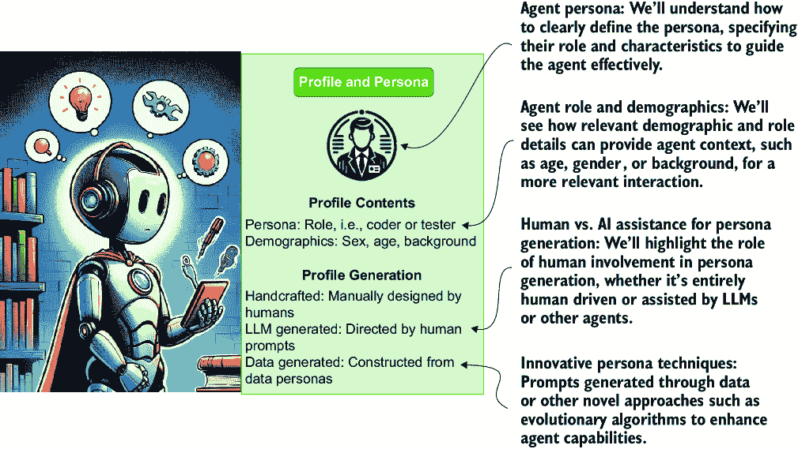
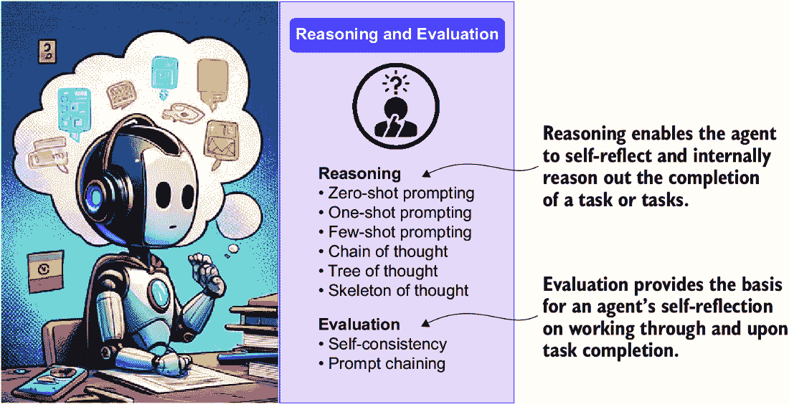
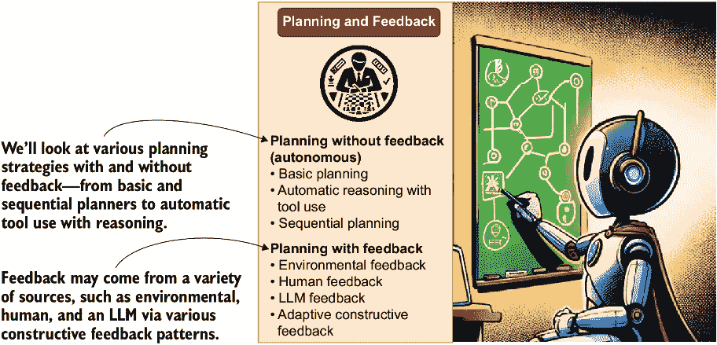
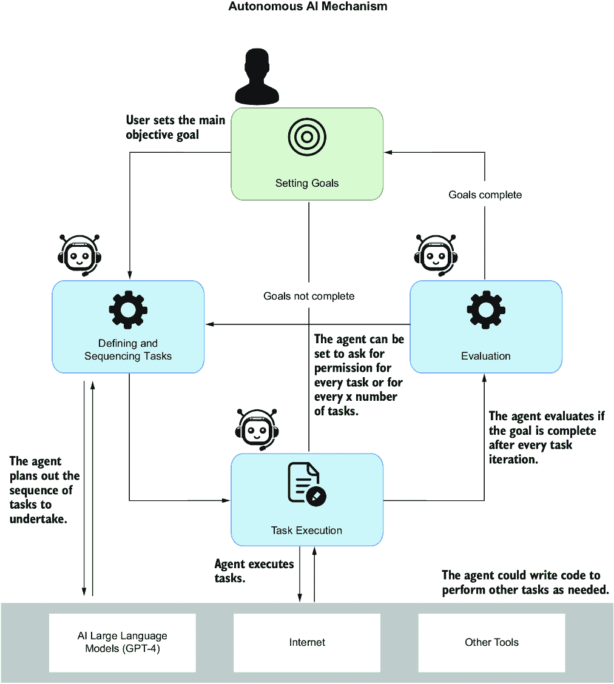

# 第一章：代理及其世界的简介

### 本章涵盖

+   定义代理的概念

+   区分代理的组成部分

+   分析代理时代的兴起：为什么是代理？

+   揭示 AI 界面

+   探索代理领域

代理在机器学习和人工智能（AI）中不是一个新概念。例如，在强化学习中，"代理"一词表示一个主动决策和学习的智能。在其他领域，"代理"一词更符合代表你做某事的自动化应用程序或软件。

## 1.1 定义代理

你可以查阅任何在线词典来查找代理的定义。*Merriam-Webster 词典*这样定义它（[www.merriam-webster.com/dictionary/agent](http://www.merriam-webster.com/dictionary/agent)）：

+   行动或施加力量的人或事物

+   产生或可能产生效果的事物

+   指导智能实现结果的一种手段或工具

在本书构建强大代理的旅程中，我们使用的"代理"一词采用这个词典定义。这也意味着术语"助手"将与"代理"同义。像 OpenAI 的 GPT 助手这样的工具也将属于 AI 代理范畴。OpenAI 避免使用"代理"一词，因为机器学习的历史中，代理是自我决定和自主的。

图 1.1 显示了四种用户可能直接或通过代理/助手代理、代理/助手或自主代理与大型语言模型（LLM）交互的情况。这四个用例在本列表中更详细地进行了突出显示：

+   *直接用户交互* — 如果你之前使用过 ChatGPT 的早期版本，你体验过与 LLM 的直接交互。没有代理或其他助手代表你介入。

+   *代理/助手代理* — 如果你通过 ChatGPT 使用过 Dall-E 3，那么你已经体验过代理代理交互。在这种情况下，LLM 介入你的请求，并以更适合任务的形式重新表述它们。例如，对于图像生成，ChatGPT 更好地制定提示。代理代理是日常用例，用于帮助用户处理不熟悉的任务或模型。

+   *代理/助手* — 如果你曾经使用过 ChatGPT 插件或 GPT 助手，那么你已经体验过这种用例。在这种情况下，LLM 了解插件或助手功能，并准备调用此插件/功能。然而，在调用之前，LLM 需要用户批准。如果批准，插件或功能将被执行，并将结果返回给 LLM。然后 LLM 用自然语言包装此响应，并将其返回给用户。

+   *自主智能体* — 在这个用例中，智能体解释用户的请求，构建计划，并识别决策点。据此，它独立执行计划中的步骤并做出必要的决策。智能体可能在某些里程碑任务后请求用户反馈，但如果可能的话，它通常被赋予自由探索和学习的空间。这种智能体提出了最多的伦理和安全问题，我们将在后面探讨。

##### 图 1.1 直接动作与使用代理智能体、智能体和自主智能体进行 LLM 交互之间的差异

图 1.1 展示了在 LLM 上使用单个智能体执行单个动作流的使用案例。对于更复杂的问题，我们通常将智能体分解为配置文件或角色。每个智能体配置文件都被分配了一个特定的任务，并使用专业工具和知识执行该任务。

*多智能体系统* 是协同工作以解决问题的智能体配置文件。图 1.2 展示了使用三个智能体的多智能体系统的一个例子：一个控制器或代理和两个由代理控制的配置文件智能体作为工人。左侧的编码者配置文件编写用户请求的代码；右侧是一个测试者配置文件，旨在编写单元测试。这些智能体一起工作和通信，直到他们对代码满意，然后将其传递给用户。

图 1.2 显示了可能无限多的智能体配置之一。（在第四章中，我们将探讨微软的开源平台 AutoGen，它支持多种配置以使用多智能体系统。）

##### 图 1.2 在这个多智能体系统的例子中，控制器或代理直接与用户通信。两个智能体——一个编码者和一个测试者——在后台工作，编写代码并编写单元测试以测试代码。

多智能体系统可以自主工作，但也可能完全由人类反馈引导。使用多个智能体的好处类似于单个智能体，但通常更为显著。单个智能体通常专注于单一任务，而多智能体系统可以并行处理多个任务。多个智能体还可以提供反馈和评估，减少完成任务时的错误。

如我们所见，AI 智能体或智能体系统可以以多种方式组装。然而，智能体本身也可以由多个组件组装。在下一节中，我们将涵盖从智能体配置文件到它可能执行的操作，以及记忆和计划等主题。

## 1.2 理解智能体的组件系统

智能体可以是复杂单元，由多个组件系统组成。这些组件是智能体使用的工具，以帮助它完成其目标或分配的任务，甚至创造新的任务。组件可能是简单或复杂的系统，通常分为五个类别。

图 1.3 描述了一个单代理系统可能包含的主要组件类别。每个元素都将有子类型，可以定义组件的类型、结构和用途。所有代理的核心是档案和角色；从那里扩展出增强代理的系统和服务。

##### 图 1.3 单代理系统的五个主要组件（通过 DALL-E 3 生成的图像）

图 1.4 中所示的代理档案和角色代表了代理的基本描述。角色——通常被称为*系统提示*——指导代理完成任务、学习如何响应以及其他细微之处。它包括背景（例如，程序员、作家）和人口统计信息，可以通过手工制作、LLM 辅助或数据驱动技术（包括进化算法）等方法生成。

##### 图 1.4 深入探讨我们如何探索创建代理档案的方法

我们将探讨如何通过评分标准和扎根技术等方法创建有效且具体的代理档案/角色。此外，我们还将解释人类制定的与 AI 制定的（LLM）档案的方面，包括使用数据和进化算法构建档案的创新技术。

注意：代理或助手档案由元素组成，包括角色。将档案视为描述代理/助手将执行的工作及其所需工具可能有所帮助。

图 1.5 展示了在涉及指向任务完成或获取信息活动的代理上下文中的组件动作和工具使用。这些动作可以分为任务完成、探索和沟通，对代理的环境和内部状态有不同程度的影响。动作可以通过手动生成、通过记忆回忆或遵循预定义的计划来生成，影响代理的行为并增强学习。

##### 图 1.5 本书将探讨的代理动作方面

理解动作目标有助于我们为任务完成、探索或沟通定义明确的目标。识别动作影响揭示了动作如何影响任务结果、代理的环境及其内部状态，有助于高效决策。最后，掌握动作生成方法使我们能够手动创建动作、从记忆中回忆它们或遵循预定义的计划，增强我们有效塑造代理行为和学习过程的能力。

图 1.6 更详细地展示了组件知识和记忆。代理使用知识和记忆来标注与最相关信息的上下文，同时限制使用的标记数量。知识和记忆结构可以统一，其中两个子集遵循单一结构或混合结构，涉及不同检索形式的组合。知识和记忆格式可以从语言（例如，PDF 文档）到数据库（关系型、对象型或文档型）和嵌入，通过向量表示或简单的列表作为代理记忆，广泛变化，简化语义相似性搜索。

##### 图 1.6 探索代理记忆和知识的作用与使用

图 1.7 展示了代理系统中的推理和评估组件。研究和实际应用已经表明，LLMs/代理可以有效地进行推理。推理和评估系统通过提供解决问题的能力来注释代理的工作流程，并评估解决方案。

##### 图 1.7 推理和评估组件及其细节

图 1.8 展示了组件代理计划/反馈及其在组织任务以实现更高层次目标中的作用。它可以分为以下两种方法：

+   **无反馈的计划**—自主代理独立做出决策。

+   **带有反馈的计划**—监控和修改计划基于各种输入来源，包括环境变化和直接的人类反馈。

##### 图 1.8 探索代理计划和推理的作用

在计划过程中，代理可能会采用**单路径**推理、通过任务每一步的**顺序推理**或**多路径**推理来探索多种策略，并将有效的策略保存供将来使用。外部计划者，可以是代码或其他代理系统，也可能在协调计划中发挥作用。

我们之前任何类型的代理——代理/助手、代理/助手或自主代理——都可能使用这些组件中的某些或全部。甚至计划组件在自主代理之外也有作用，可以有效地赋能常规代理。

## 1.3 检视代理时代的崛起：为何是代理？

人工智能代理和助手已经迅速从人工智能研究中的主要商品转变为主流软件开发。一个不断增长的工具和平台列表协助构建和赋能代理。对于局外人来说，这一切可能都像是炒作，旨在夸大一些酷炫但过度评价的技术价值。

在 ChatGPT 最初发布后的前几个月，一个新的学科叫做**提示工程**形成了：用户发现，在他们的提示中使用各种技术和模式可以使他们生成更好、更一致的输出。然而，用户也意识到提示工程只能走这么远。

提示工程仍然是与 ChatGPT 等 LLM 直接交互的绝佳方式。随着时间的推移，许多用户发现，有效的提示需要迭代、反思和更多的迭代。AutoGPT 等第一代代理系统正是从这些发现中产生的，吸引了社区的注意。

图 1.9 展示了 AutoGPT 的原始设计，这是最早的自主代理系统之一。该代理通过查看用户的目标来迭代一系列它定义的任务。通过每个步骤的任务迭代，代理评估目标并确定任务是否完成。如果任务未完成，代理可能会重新规划步骤并根据新的知识或人类反馈更新计划。

##### 图 1.9 AutoGPT 代理系统的原始设计

AutoGPT 成为了第一个展示使用任务规划和迭代与 LLM 模型结合使用力量的例子。从此，其他代理系统和框架也利用类似的规划和任务迭代系统在社区中爆炸式增长。普遍认为，规划、迭代和重复是解决 LLM 的复杂和多元目标最佳的过程。

然而，自主代理系统需要信任代理决策过程、护栏/评估系统以及目标定义。信任也是随着时间的推移而获得的。我们缺乏信任源于我们对自主代理能力的理解不足。

备注：人工通用智能（AGI）是一种可以学习完成人类能完成的任何任务的智能形式。在这个新的 AI 世界中，许多从业者相信，使用自主代理系统的 AGI 是一个可达到的目标。

因此，许多主流和现成的代理工具并不是自主的。然而，它们仍然在利用 GPTs（大型语言模型）管理和自动化任务方面提供了显著的好处。因此，本书的目标是理解所有代理形式，许多更多实际应用将由非自主代理驱动。

代理和代理工具只是新软件应用开发范式的最顶层。我们将在下一节中探讨这个新范式。

## 1.4 撕开 AI 接口

人工智能代理范式不仅是我们与 LLM 互动方式的转变，也被视为我们开发软件和处理数据方式的转变。软件和数据将不再通过用户界面（UI）、应用程序编程接口（API）和专门的查询语言（如 SQL）进行接口。相反，它们将被设计成使用自然语言进行接口。

图 1.10 展示了这种新架构可能的高层次快照以及人工智能代理扮演的角色。数据、软件和应用适应支持语义、自然语言界面。这些人工智能界面允许代理收集数据并与软件应用程序、其他代理或代理应用程序进行交互。这代表了我们与软件和应用程序交互方式的重大转变。

##### 图 1.10 代理与软件系统交互的愿景

*人工智能界面*是一组功能、工具和数据层，通过自然语言暴露数据和应用程序。在过去，*语义*这个词被大量用来描述这些界面，甚至一些工具也使用了这个名称；然而，“语义”也可以有多种含义和用途。因此，在这本书中，我们将使用*人工智能界面*这个术语。

人工智能界面的构建将赋予需要消费服务、工具和数据的代理能力。随着这种赋权，完成任务将更加准确，应用将更加可靠和自主。虽然人工智能界面可能不适合所有软件和数据，但它将在许多用例中占据主导地位。

## 1.5 探索代理领域

GPT 代理代表了消费者和开发者从寻找信息到构建软件和访问数据的整个转变。几乎每天都有新的代理框架、组件或界面出现在 GitHub 或研究论文中。这对于试图掌握代理系统是什么以及如何使用它们的新用户来说可能是压倒性和令人生畏的。

## 摘要

+   代理是一个实体，它采取行动或施加力量，产生效果或作为实现结果的手段。代理在人工智能中自动与大型语言模型（LLM）进行交互。

+   助手与代理同义。这两个术语都包括像 OpenAI 的 GPT 助手这样的工具。

+   自主代理可以做出独立决策，并且它们与非自主代理的区别至关重要。

+   LLM 交互的四种主要类型包括直接用户交互、代理/助手代理、代理/助手和自主代理。

+   多代理系统涉及代理配置文件协同工作，通常由代理控制，以完成复杂任务。

+   代理的主要组件包括配置文件/角色、动作、知识/记忆、推理/评估和计划/反馈。

+   代理配置文件和角色指导代理的任务、响应和其他细微差别，通常包括背景和人口统计信息。

+   代理的动作和工具可以手动生成，从记忆中召回，或遵循预定义的计划。

+   代理使用知识和记忆结构通过各种格式优化上下文并最小化标记使用，从文档到嵌入。

+   推理和评估系统使代理能够通过零样本、单样本和少样本等提示模式来思考问题并评估解决方案。

+   计划/反馈组件通过单路径或多路径推理以及整合环境和人类反馈来组织任务以实现目标。

+   人工智能代理的兴起引入了一种新的软件开发范式，从传统的转向基于自然语言的 AI 界面。

+   理解这些工具的进展和交互有助于开发代理系统，无论是单个、多个还是自主的。
