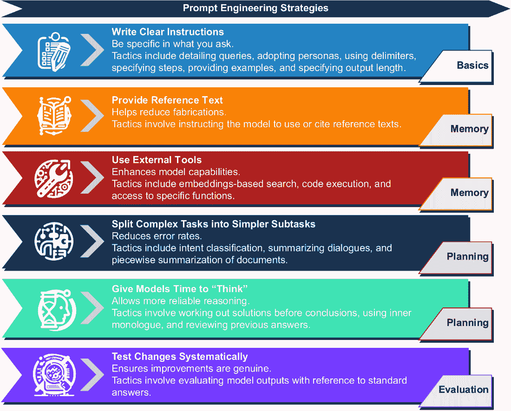
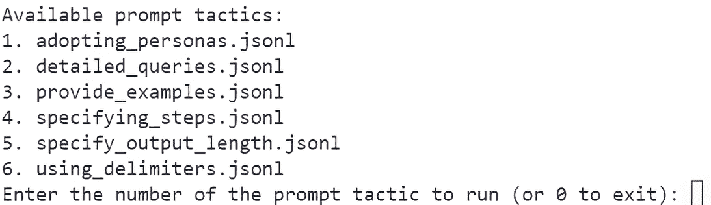

# 2 利用大型语言模型的力量

### 本章涵盖

+   理解 LLMs 的基本知识

+   连接到并使用 OpenAI API

+   使用 LM Studio 探索和使用开源 LLMs

+   使用提示工程提示 LLMs

+   选择适合您特定需求的最佳 LLM

“大型语言模型”（LLMs）这一术语现在已成为一种 AI 形式的普遍描述。这些 LLMs 是使用生成预训练的 transformers（GPTs）开发的。虽然其他架构也能驱动 LLMs，但 GPT 形式目前是最成功的。

LLMs 和 GPTs 是**生成**模型，这意味着它们被训练来**生成**内容，而不是预测或分类。为了进一步说明这一点，请考虑图 2.1，它展示了生成模型与预测/分类模型之间的区别。生成模型从输入中创建内容，而预测和分类模型则对其进行分类。


##### 图 2.1 生成模型与预测模型的区别

我们可以通过其组成部分进一步定义 LLM，如图 2.2 所示。在这个图中，“数据”代表用于训练模型的内容，“架构”是模型本身的属性，例如参数数量或模型大小。模型进一步被特定地训练以适应期望的应用场景，包括聊天、完成或指令。最后，“微调”是添加到模型中的功能，它通过优化输入数据和模型训练以更好地匹配特定用例或领域。


##### 图 2.2 描述 LLM 的主要元素

GPTs 的 transformer 架构，作为 LLMs 的一种特定架构，使得模型可以扩展到数十亿个参数的大小。这要求这些大型模型在数 TB 的文档上进行训练以建立基础。从那里，这些模型将依次使用各种方法进行训练，以适应模型期望的应用场景。

以 ChatGPT 为例，它在公共互联网上进行了有效的训练，然后使用几种训练策略进行微调。最终的微调训练使用一种高级形式完成，称为**强化学习与人类反馈**（RLHF）。这产生了一个名为聊天完成的模型用例。

**聊天完成**型 LLMs 旨在通过迭代和改进来提高性能——换句话说，就是聊天。这些模型也已被基准测试为在任务完成、推理和规划方面表现最佳，这使得它们非常适合构建代理人和助手。完成模型仅被训练/设计来在输入文本上提供生成内容，因此它们不受益于迭代。

在本书中，我们专注于构建强大代理人的旅程，我们关注的是被称为聊天完成模型的 LLMs 类别。当然，这并不妨碍你尝试为你的代理人使用其他模型形式。然而，你可能需要显著修改提供的代码示例以支持其他模型形式。

在本章后面，当我们查看在本地运行开源 LLM 时，我们将揭示更多关于 LLM 和 GPT 的细节。在下一节中，我们将探讨如何使用 OpenAI 的一个日益增长的标准连接到 LLM。

## 2.1 掌握 OpenAI API

许多 AI 代理和助手项目使用 OpenAI API SDK 连接到 LLM。虽然不是标准，但现在描述连接的基本概念遵循 OpenAI 模式。因此，我们必须了解使用 OpenAI SDK 进行 LLM 连接的核心概念。

本章将探讨使用 OpenAI Python SDK/包连接到 LLM 模型。我们将讨论连接到 GPT-4 模型、模型响应、计数字符数以及如何定义一致的消息。从以下子节开始，我们将检查如何使用 OpenAI。

### 2.1.1 连接到聊天完成模型

要完成本节及后续章节的练习，你必须设置一个 Python 开发环境并获取访问 LLM 的权限。附录 A 会指导你如何设置 OpenAI 账户并访问 GPT-4 或其他模型。附录 B 展示了如何使用 Visual Studio Code (VS Code) 设置 Python 开发环境，包括安装所需的扩展。如果你想跟随场景进行，请回顾这些部分。

首先在 VS Code 中打开源代码 `chapter_2` 文件夹，并创建一个新的 Python 虚拟环境。再次，如果需要帮助，请参考附录 B。

然后，使用以下列表中的命令安装 OpenAI 和 Python dot 环境包。这将把所需的包安装到虚拟环境中。

##### 列表 2.1 `pip` 安装

```py
pip install openai python-dotenv
```

接下来，在 VS Code 中打开 `connecting.py` 文件，检查列表 2.2 中显示的代码。确保将模型的名称设置为合适的名称——例如，gpt-4。在撰写本文时，使用 `gpt-4-1106-preview` 来表示 GPT-4 Turbo。

##### 列表 2.2 `connecting.py`

```py
import os
from openai import OpenAI
from dotenv import load_dotenv

load_dotenv()                           #1
api_key = os.getenv('OPENAI_API_KEY')
if not api_key:                             #2
    raise ValueError("No API key found. Please check your .env file.")
client = OpenAI(api_key=api_key)                        #3

def ask_chatgpt(user_message):
    response = client.chat.completions.create(      #4
        model="gpt-4-1106-preview",
        messages=[{"role": "system",
 "content": "You are a helpful assistant."},
        {"role": "user", "content": user_message}],
        temperature=0.7,
        )
    return response.choices[0].message.content     #5

user = "What is the capital of France?"
response = ask_chatgpt(user)                #6
print(response)
```

#1 加载 .env 文件中存储的秘密

#2 检查是否设置了密钥

#3 使用密钥创建客户端

#4 使用 create 函数生成响应

#5 仅返回响应的内容

#6 执行请求并返回响应

这里发生了很多事情，所以让我们按部分分解，从开始加载环境变量开始。在 `chapter_2` 文件夹中还有一个名为 `.env` 的文件，它包含环境变量。这些变量通过调用 `load_dotenv` 函数自动设置。

你必须在 `.env` 文件中设置你的 OpenAI API 密钥，如下一个列表所示。再次，请参考附录 A 了解如何获取密钥和找到模型名称。

##### 列表 2.3 `.env`

```py
OPENAI_API_KEY='your-openai-api-key'
```

设置密钥后，你可以通过按 F5 键或从 VS Code 菜单中选择“运行”>“开始调试”来调试文件。这将运行代码，你应该会看到类似“法国的首都是巴黎”的内容。

记住，生成模型的响应取决于概率。在这种情况下，模型很可能会给出正确且一致的答案。

您可以通过调整请求的温度来玩这些概率。如果您想让模型更一致，请将温度降低到 0，但如果您想让模型产生更多变化，请提高温度。我们将在下一节进一步探讨设置温度。

### 2.1.2 理解请求和响应

深入研究聊天完成请求和响应功能可能会有所帮助。我们将首先关注请求，如下所示。请求封装了预期的模型、消息和温度。

##### 列表 2.4 聊天完成请求

```py
response = client.chat.completions.create(
    model="gpt-4-1106-preview",                 #1
    messages=[{"role": "system", 
"content": "You are a helpful assistant."},                     #2
              {"role": "user", "content": user_message}],      #3
    temperature=0.7,     #4
    )
```

#1 用于响应请求的模型或部署

#2 系统角色消息

#3 用户角色消息

#4 请求的温度或变异性

在请求中，`messages` 块描述了一组用于请求的消息和角色。聊天完成模型的消息可以定义在三个角色中：

+   *系统角色* — 描述请求的规则和指南的消息。它通常用于描述 LLM 在请求中的角色。

+   *用户角色* — 代表并包含用户的消息。

+   *助手角色* — 可以用来捕获 LLM 之前响应的消息历史。它还可以在可能没有消息历史的情况下注入消息历史。

单个请求中发送的消息可以封装整个对话，如下一个列表中的 JSON 所示。

##### 列表 2.5 带有历史记录的消息

```py
[
    {
        "role": "system",
        "content": "You are a helpful assistant."
    },
    {
        "role": "user",
        "content": "What is the capital of France?"
    },
    {
        "role": "assistant",
        "content": "The capital of France is Paris."
    },
    {
        "role": "user",
        "content": "What is an interesting fact of Paris."
    }
],
```

您可以通过在 VS Code 中打开 `message_history.py` 并按 F5 调试来查看如何应用此功能。文件运行后，请务必检查输出。然后，尝试再次运行示例，以查看结果如何变化。

由于 `.7` 的高温度，结果会从每次运行到下一次运行而变化。请继续将温度降低到 `.0`，并多次运行 `message_history.py` 示例。将温度保持在 `0` 将每次都显示相同或类似的结果。

设置请求的温度通常会取决于您的特定用例。有时，您可能想限制响应的随机性（随机性）。将温度降低到 `0` 将给出一致的结果。同样，`1.0` 的值将给出响应中最多的变异性。

接下来，我们还想了解每次请求返回的信息。下一个列表显示了响应的输出格式。您可以通过在 VS Code 中运行 `message_history.py` 文件来查看此输出。

##### 列表 2.6 聊天完成响应

```py
{
    "id": "chatcmpl-8WWL23up3IRfK1nrDFQ3EHQfhx0U6",
    "choices": [                                      #1
        {
            "finish_reason": "stop",
            "index": 0,
            "message": {
                "content": "… omitted",
                "role": "assistant",       #2
                "function_call": null,
                "tool_calls": null
            },
            "logprobs": null
        }
    ],
    "created": 1702761496,
    "model": "gpt-4-1106-preview",     #3
    "object": "chat.completion",
    "system_fingerprint": "fp_3905aa4f79",
    "usage": {
        "completion_tokens": 78,     #4
        "prompt_tokens": 48,         #4
        "total_tokens": 126          #4
    }
}
```

#1 模型可能返回多个响应。

#2 在助手角色中返回的响应

#3 指示使用的模型

#4 计算输入（提示）和输出（完成）标记的数量

跟踪输入标记（用于提示中的标记）和输出标记（通过完成返回的标记数量）的数量可能会有所帮助。有时，最小化和减少标记数量可能是至关重要的。通常，标记数量较少意味着 LLM 交互将更便宜，响应更快，并产生更好、更一致的结果。

这涵盖了连接到 LLM 并返回响应的基本知识。在整个书中，我们将回顾和扩展如何与 LLM 交互。在此之前，我们将在下一节中探讨如何加载和使用开源 LLM。

## 2.2 使用 LM Studio 探索开源 LLM

商业 LLM，如 OpenAI 的 GPT-4，是学习如何使用现代 AI 和构建代理的绝佳起点。然而，商业代理是一个外部资源，需要付费，会降低数据隐私和安全，并引入依赖。其他外部影响将进一步复杂化这些因素。

建立与开源大型语言模型（LLM）相媲美的竞争日益激烈，这并不令人惊讶。因此，现在已经有了一些开源 LLM，它们可能足够用于众多任务和代理系统。仅在一年内，工具的发展就取得了许多进步，以至于现在在本地托管 LLM 变得非常容易，正如我们将在下一节中看到的。

### 2.2.1 安装和运行 LM Studio

LM Studio 是一个免费下载的软件，支持在 Windows、Mac 和 Linux 上本地下载和托管 LLM 和其他模型。该软件易于使用，并提供了一些有助于快速入门的有用功能。以下是下载和设置 LM Studio 的步骤快速总结：

1.  从[`lmstudio.ai/`](https://lmstudio.ai/)下载 LM Studio。

1.  下载后，根据您的操作系统安装软件。请注意，LM Studio 的一些版本可能处于测试版，需要安装额外的工具或库。

1.  启动软件。

图 2.3 显示了正在运行的 LM Studio 窗口。从那里，您可以查看当前的热门模型列表，搜索其他模型，甚至下载。主页内容对于了解顶级模型的详细信息和规格非常有用。


##### 图 2.3 LM Studio 软件显示主主页

LM Studio 的一个吸引人的特点是它能够分析您的硬件，并将其与给定模型的 requirements 对齐。软件将告诉您您能多好地运行给定模型。这可以在指导您尝试哪些模型时节省大量时间。

输入一些文本以搜索模型，然后点击“Go”。您将被带到如图 2.4 所示的搜索页面界面。从该页面，您可以查看所有模型变体和其他规格，例如上下文标记大小。在您点击兼容性猜测按钮后，软件甚至会告诉您该模型是否能在您的系统上运行。


##### 图 2.4 LM Studio 搜索页面

点击下载将在你的系统上运行的任何模型。你可能想坚持使用为聊天完成设计的模型，但如果你的系统有限，就使用你拥有的。此外，如果你不确定使用哪个模型，可以下载来尝试。LM Studio 是探索和实验许多模型的好方法。

模型下载后，你可以在聊天页面或服务器页面作为服务器加载和运行模型。图 2.5 显示了在聊天页面加载和运行模型。它还显示了如果你有 GPU，启用和使用 GPU 的选项。


##### 图 2.5 加载并运行在本地运行的 LLM 的 LM Studio 聊天页面

要加载和运行一个模型，请打开页面顶部中间的下拉菜单，并选择一个已下载的模型。会出现一个进度条显示模型加载状态，当它准备好后，你可以在 UI 中开始输入。

如果检测到 GPU，该软件甚至允许你使用部分或全部 GPU 进行模型推理。GPU 通常可以在某些方面加快模型响应时间。你可以通过查看页面底部的性能状态来了解添加 GPU 如何影响模型性能，如图 2.5 所示。

与模型聊天以及使用或玩转各种提示可以帮助你确定模型在你特定用例中的适用性。更系统的方法是使用提示流工具来评估提示和 LLM。我们将在第九章中描述如何使用提示流。

LM Studio 还允许在服务器上运行模型，并使用 OpenAI 包使其可访问。我们将在下一节中看到如何使用服务器功能并提供模型。

### 2.2.2 使用 LM Studio 在本地提供 LLM 服务

使用 LM Studio 在本地作为服务器运行 LLM 非常简单。只需打开服务器页面，加载一个模型，然后点击“启动服务器”按钮，如图 2.6 所示。从那里，你可以复制并粘贴任何示例来连接到你的模型。


##### 图 2.6 LM Studio 服务器页面和运行 LLM 的服务器

你可以通过在 VS Code 中打开`chapter_2/lmstudio_server.py`来查看 Python 代码的示例。代码也在这里列出为列表 2.7。然后，在 VS Code 调试器中运行代码（按 F5）。

##### 列表 2.7 `lmstudio_server.py`

```py
from openai import OpenAI

client = OpenAI(base_url="http://localhost:1234/v1", api_key="not-needed")

completion = client.chat.completions.create(
  model="local-model",                           #1
  messages=[
    {"role": "system", "content": "Always answer in rhymes."},
    {"role": "user", "content": "Introduce yourself."}       #2
  ],
  temperature=0.7,
)

print(completion.choices[0].message)      #3
```

#1 目前未使用；可以是任何内容

#2 随意更改消息。

#3 默认代码输出整个消息。

如果你遇到连接到服务器的问题或遇到其他任何问题，请确保你的服务器模型设置配置与模型类型匹配。例如，在前面显示的图 2.6 中，加载的模型与服务器设置不同。修正后的设置如图 2.7 所示。


##### 图 2.7 选择加载模型的正确服务器模型设置

现在，你可以使用本地托管的 LLM 或商业模型来构建、测试，甚至可能运行你的代理。下一节将探讨如何更有效地使用提示工程构建提示。

## 2.3 使用提示工程提示语言模型

为 LLM 定义的提示是用于请求以获得更好的响应输出的消息内容。“提示工程”是一个新兴的领域，试图为构建提示构建一种方法论。不幸的是，提示构建不是一个成熟的科学，而且定义了越来越多的方法，这些方法被称为提示工程。

幸运的是，像 OpenAI 这样的组织已经开始记录一套通用的策略，如图 2.8 所示。这些策略涵盖了各种战术，其中一些需要额外的基础设施和考虑。因此，与更高级概念相关的提示工程策略将在指定的章节中介绍。



##### 图 2.8 本书中按章节位置审查的 OpenAI 提示工程策略

图 2.8 中的每个策略都展开为可以进一步细化特定提示工程方法的战术。本章将检查基本的写清晰指令策略。图 2.9 更详细地展示了该策略的战术，以及每个战术的示例。我们将在下一节中查看如何使用代码演示运行这些示例。


##### 图 2.9 写清晰指令策略的战术

写清晰指令策略是关于在要求时保持谨慎和具体。要求一个语言模型（LLM）执行一项任务与要求一个人完成同样的任务并无不同。一般来说，你能在请求中指定与任务相关的更多信息和上下文，那么响应就会越好。

这种策略已经被分解为可以应用于提示的具体战术。为了理解如何使用这些战术，一个包含各种提示示例的代码演示（`prompt_engineering.py`）位于“第二章”源代码文件夹中。

在 VS Code 中打开`prompt_engineering.py`文件，如图 2.8 所示。此代码首先加载`prompts`文件夹中的所有 JSON Lines 文件。然后，它显示文件列表作为选择，并允许用户选择提示选项。选择选项后，提示被提交给 LLM，并打印出响应。

##### 列表 2.8 `prompt_engineering.py` `(main())`

```py
def main():
    directory = "prompts"
    text_files = list_text_files_in_directory(directory)    #1

    if not text_files:
        print("No text files found in the directory.")
        return

    def print_available():                                     #2
        print("Available prompt tactics:")
        for i, filename in enumerate(text_files, start=1):
            print(f"{i}. {filename}")

    while True:
        try:
            print_available()                   #2              
            choice = int(input("Enter … 0 to exit): "))           #3
            if choice == 0:
                break
            elif 1 <= choice <= len(text_files):
                selected_file = text_files[choice - 1]
                file_path = os.path.join(directory,
      selected_file)
                prompts = 
↪ load_and_parse_json_file(file_path)                          #4
                print(f"Running prompts for {selected_file}")
                for i, prompt in enumerate(prompts):
                    print(f"PROMPT {i+1} --------------------")
                    print(prompt)
                    print(f"REPLY ---------------------------")
                    print(prompt_llm(prompt))                       #5
            else:
                print("Invalid choice. Please enter a valid number.")
        except ValueError:
            print("Invalid input. Please enter a number.")
```

#1 收集给定文件夹中的所有文件

#2 打印文件列表作为选择

#3 输入用户的选择

#4 加载提示并将其解析为消息

#5 将提示提交给 OpenAI 语言模型

列表中的注释部分演示了如何连接到本地 LLM。这将允许你探索应用于本地运行的开源 LLM 的相同提示工程策略。默认情况下，此示例使用我们在 2.1.1 节中配置的 OpenAI 模型。如果你没有完成之前的操作，请返回并完成它，然后再运行此示例。

图 2.10 显示了运行提示工程策略测试器的输出，即 VS Code 中的 `prompt_engineering.py` 文件。当你运行测试器时，你可以为要测试的策略输入一个值，并观察其运行。



##### 图 2.10 提示工程策略测试器的输出

在以下章节中，我们将更详细地探讨每个提示策略。我们还将检查各种示例。

### 2.3.1 创建详细查询

此策略的基本前提是尽可能提供详细的信息，但也要小心不要提供无关紧要的细节。以下列表显示了用于探索此策略的 JSON Lines 文件示例。

##### 列表 2.9 `detailed_queries.jsonl`

```py
[                        #1
    {
        "role": "system",
        "content": "You are a helpful assistant."
    },
    {
        "role": "user",
        "content": "What is an agent?"      #2
    }
]
[
    {
        "role": "system",
        "content": "You are a helpful assistant."
    },
    {
        "role": "user",
        "content": """
What is a GPT Agent? 
Please give me 3 examples of a GPT agent
"""                                        #3
    }
]
```

#1 第一个示例没有使用详细的查询。

#2 首先向 LLM 提出一个非常一般的问题。

#3 提出一个更具体的问题，并请求示例。

此示例演示了使用详细查询和不使用查询之间的差异。它还进一步通过请求示例。记住，你能在提示中提供越多相关性和上下文，整体响应就越好。请求示例是加强问题与预期输出之间关系的一种方式。

### 2.3.2 采用角色

采用角色赋予 LLM 定义一个总体上下文或一组规则的能力。LLM 可以然后使用该上下文和/或规则来构建所有后续的输出响应。这是一个有吸引力的策略，我们将在整本书中大量使用它。

列表 2.10 显示了使用两个角色回答相同问题的示例。这可以是一种探索广泛新颖应用的愉快技术，从获取人口统计反馈到专门从事特定任务，甚至橡皮鸭技术。

##### GPT 橡皮鸭

*橡皮鸭* 是一种问题解决技术，其中一个人向一个无生命物体（如橡皮鸭）解释一个问题，以理解或找到解决方案。这种方法在编程和调试中很常见，因为大声阐述问题往往有助于澄清问题，并可能导致新的见解或解决方案。

GPT 橡皮鸭技术使用相同的技巧，但使用的是 LLM 而不是无生命物体。通过给 LLM 赋予特定于所需解决方案领域的角色，这种策略可以进一步扩展。

##### 列表 2.10 `adopting_personas.jsonl`

```py
[
    {
        "role": "system",
        "content": """
You are a 20 year old female who attends college 
in computer science. Answer all your replies as 
a junior programmer.
"""                         #1
    },
    {
        "role": "user",
        "content": "What is the best subject to study."
    }
]
[
    {
        "role": "system",
        "content": """
You are a 38 year old male registered nurse. 
Answer all replies as a medical professional.
"""                                             #2
    },
    {
        "role": "user",
        "content": "What is the best subject to study."
    }
]
```

#1 第一个角色

#2 第二个角色

代理配置文件的核心元素是角色。我们将使用各种角色来帮助代理完成他们的任务。当你运行此策略时，请特别注意 LLM 输出响应的方式。

### 2.3.3 使用分隔符

分隔符是一种有用的方法，可以隔离并使 LLM 专注于消息的某些部分。这个策略通常与其他策略结合使用，但也可以独立工作。以下列表展示了两个示例，但还有其他几种描述分隔符的方法，从 XML 标签到使用 Markdown。

##### 列表 2.11 `using_delimiters.jsonl`

```py
[
    {
        "role": "system",
        "content": """
Summarize the text delimited by triple quotes 
with a haiku.
"""               #1
    },
    {
        "role": "user",
        "content": "A gold chain is cool '''but a silver chain is better'''"
    }
]
[
    {
        "role": "system",
        "content": """
You will be provided with a pair of statements 
(delimited with XML tags) about the same topic. 
First summarize the arguments of each statement. 
Then indicate which of them makes a better statement
 and explain why.
"""                        #2
    },
    {
        "role": "user",
        "content": """
<statement>gold chains are cool</statement>
<statement>silver chains are better</statement>
"""
    }
]
```

#1 分隔符由字符类型和重复定义。

#2 分隔符由 XML 标准定义。

当你运行这个策略时，请注意 LLM 在输出响应时关注的文本部分。这个策略对于描述层次结构或其他关系模式的信息非常有用。

### 2.3.4 指定步骤

指定步骤是另一种强大的策略，可以有很多用途，包括在代理中，如列表 2.12 所示。在开发复杂多步骤任务的提示或代理配置文件时，它尤其强大。你可以指定步骤将复杂的提示分解为 LLM 可以遵循的逐步过程。反过来，这些步骤可以引导 LLM 在更长时间的对话和多次迭代中进行多次交互。

##### 列表 2.12 `specifying_steps.jsonl`

```py
[
    {
        "role": "system",
        "content": """
Use the following step-by-step instructions to respond to user inputs.
Step 1 - The user will provide you with text in triple single quotes. 
Summarize this text in one sentence with a prefix that says 'Summary: '.
Step 2 - Translate the summary from Step 1 into Spanish, 
with a prefix that says 'Translation: '.
"""                                          #1
    },
    {
        "role": "user",
        "content": "'''I am hungry and would like to order an appetizer.'''"
    }
]
[
    {
        "role": "system",
        "content": """
Use the following step-by-step instructions to respond to user inputs.
Step 1 - The user will provide you with text. Answer any questions in 
the text in one sentence with a prefix that says 'Answer: '.

Step 2 - Translate the Answer from Step 1 into a dad joke,
 with a prefix that says 'Dad Joke: '."""                      #2
    },
    {
        "role": "user",
        "content": "What is the tallest structure in Paris?"
    }
]
```

#1 注意使用分隔符的策略。

#2 步骤可以是完全不同的操作。

### 2.3.5 提供示例

提供示例是引导 LLM 期望输出的绝佳方式。有无数种方法可以向 LLM 展示示例。系统消息/提示可以是一种强调一般输出的有用方式。在下面的列表中，示例被添加为最后一个 LLM 助手回复，提示为“教我关于 Python。”

##### 列表 2.13 `providing_examples.jsonl`

```py
[
    {
        "role": "system",
        "content": """
Answer all replies in a consistent style that follows the format, 
length and style of your previous responses.
Example:
  user:
       Teach me about Python.
  assistant:                                                #1
       Python is a programming language developed in 1989
 by Guido van Rossum.

  Future replies:
       The response was only a sentence so limit
 all future replies to a single sentence.
"""                                           #2
    },
    {
        "role": "user",
        "content": "Teach me about Java."
    }
]
```

#1 将样本输出作为“之前的”助手回复注入

#2 添加限制输出策略以限制输出大小并匹配示例

提供示例也可以用来从一系列复杂的任务中请求特定的输出格式。例如，要求一个 LLM 生成与样本输出匹配的代码是一个很好的示例使用。我们将在整本书中采用这种策略，但还有其他方法可以用来指导输出。

### 2.3.6 指定输出长度

指定输出长度的策略不仅可以帮助限制标记数，还可以指导输出到期望的格式。列表 2.14 展示了使用两种不同技术实现此策略的示例。第一个示例将输出限制在 10 个单词以下。这可以带来额外的优势，使响应更加简洁和有针对性，这在某些用例中可能是所希望的。第二个示例演示了将输出限制为简短的要点集合。这种方法可以帮助缩小输出并保持答案简短。更简洁的答案通常意味着输出更加聚焦，包含的填充内容更少。

##### 列表 2.14 `specifying_output_length.jsonl`

```py
[
    {
        "role": "system",
        "content": """
Summarize all replies into 10 or fewer words.
"""                                               #1
    },
    {
        "role": "user",
        "content": "Please tell me an exciting fact about Paris?"
    }
]
[
    {
        "role": "system",
        "content": """
Summarize all replies into 3 bullet points.
"""                                           #2
    },
    {
        "role": "user",
        "content": "Please tell me an exciting fact about Paris?"
    }
]
```

#1 限制输出使答案更加简洁。

#2 限制答案为简短的要点集合

保持答案简短，在开发多智能体系统时可以带来额外的益处。任何与其他智能体进行对话的智能体系统都可以从更加简洁和专注的回复中受益。这有助于使大型语言模型（LLM）更加专注，并减少噪声通信。

一定要运行这个策略的所有提示技巧示例。正如之前提到的，我们将在未来的章节中介绍其他提示工程策略和技巧。我们将通过探讨如何为你的用例选择最佳的 LLM 来结束这一章。

## 2.4 为你的特定需求选择最佳 LLM

虽然成为一名成功的 AI 智能体制作者不需要深入了解 LLM，但能够评估规格是有帮助的。就像计算机用户一样，你不需要知道如何构建处理器就能理解处理器型号之间的差异。这个类比对 LLM 同样适用，尽管标准可能不同，但仍然依赖于一些基本考虑因素。

从我们之前的讨论和对 LM Studio 的观察中，我们可以提取出一些基本标准，这些标准在我们考虑 LLM 时将非常重要。图 2.11 解释了定义 LLM 为何值得考虑创建 GPT 智能体或任何 LLM 任务的基本标准。


##### 图 2.11 消费 LLM 时需要考虑的重要标准

对于我们构建 AI 智能体的目的，我们需要从与任务相关的角度审视这些标准。模型上下文大小和速度可以被认为是第六和第七个标准，但它们通常被视为模型部署架构和基础设施的变体。对于 LLM 来说，第八个需要考虑的标准是成本，但这取决于许多其他因素。以下是这些标准与构建 AI 智能体相关性的总结：

+   *模型性能* — 你通常会想了解 LLM 在特定任务上的性能。例如，如果你正在构建一个针对编码的特定智能体，那么在代码上表现良好的 LLM 将是必不可少的。

+   *模型参数（大小）* — 模型的大小通常是推理性能和模型响应能力的良好指标。然而，模型的大小也会决定你的硬件需求。如果你计划使用自己的本地托管模型，模型的大小也将主要决定你需要的计算机和 GPU。幸运的是，我们经常看到小型、非常强大的开源模型被定期发布。

+   *用例（模型类型）* — 模型的类型有多种变体。像 ChatGPT 这样的聊天完成模型适用于迭代和推理问题，而像完成、问答和指令这样的模型则更多与特定任务相关。聊天完成模型对于智能体应用至关重要，尤其是那些需要迭代的智能体。

+   *训练输入* — 了解用于训练模型的内容通常会决定模型的应用领域。虽然通用模型可以在多个任务中有效，但更具体或微调的模型可能对特定领域更相关。这可能是一个考虑特定领域代理的因素，其中较小、更微调的模型可能表现得与 GPT-4 等大型模型一样好，甚至更好。

+   *训练方法* — 这可能不是一个大问题，但了解用于训练模型的方法可能会有所帮助。模型是如何训练的会影响其泛化、推理和规划的能力。这对于规划代理可能是至关重要的，但对于比特定任务助手更通用的代理可能不那么重要。

+   *上下文标记大小* — 模型的上下文大小更具体地与模型架构和类型相关。它决定了模型可能持有的上下文或内存的大小。通常，小于 4,000 个标记的较小上下文窗口对于简单任务已经足够。然而，当使用多个代理（所有代理都在处理同一任务）时，较大的上下文窗口可能是必不可少的。模型通常将以上下文窗口大小的变体进行部署。

+   *模型速度（模型部署）* — 模型的速度由其*推理速度*（或模型响应请求的速度）决定，这反过来又由其运行的基础设施决定。如果你的代理没有直接与用户互动，原始的实时速度可能不是必需的。另一方面，实时交互的 LLM 代理需要尽可能快。对于商业模型，速度将由提供商确定并支持。你的基础设施将决定那些想要运行他们的 LLM 的人的速度。

+   *模型成本（项目预算）* — 成本通常由项目决定。无论是学习构建代理还是实施企业软件，成本总是需要考虑的因素。在运行你的 LLM 与使用商业 API 之间存在着重大的权衡。

在选择要在其上构建生产代理系统的模型时，有很多因素需要考虑。然而，出于研究和学习目的，通常最好选择单个模型。如果你是 LLM 和代理的新手，你可能会想选择一个商业选项，例如 GPT-4 Turbo。除非另有说明，本书中的工作将依赖于 GPT-4 Turbo。

随着时间的推移，模型无疑将被更好的模型所取代。因此，你可能需要升级或更换模型。但是，为了做到这一点，你必须了解你的 LLM 和代理的性能指标。幸运的是，在第九章中，我们将探讨使用提示流评估 LLM、提示和代理配置文件。

## 2.5 练习

使用以下练习来帮助你参与本章的内容：

+   *练习 1* — 消费不同的 LLM

*目标* — 使用`connecting.py`代码示例从 OpenAI 或其他提供商消费不同的 LLM。

*任务*：

+   +   修改`connecting.py`以连接到不同的 LLM。

    +   从 OpenAI 或其他提供商选择一个 LLM。

    +   更新代码中的 API 密钥和端点。

    +   执行修改后的代码并验证响应。

+   *练习 2*—探索提示工程策略

*目标*—探索各种提示工程策略，并为每个策略创建变体。

*任务：*

+   +   回顾章节中涵盖的提示工程策略。

    +   为每个策略编写变体，尝试不同的措辞和结构。

    +   使用 LLM 测试变体以观察不同的结果。

    +   记录结果，并分析每个变体的有效性。

+   *练习 3*—使用 LM Studio 下载和运行 LLM

*目标*—使用 LM Studio 下载一个 LLM，并将其连接到提示工程策略。

*任务：*

+   +   在您的机器上安装 LM Studio。

    +   使用 LM Studio 下载一个 LLM。

    +   使用 LM Studio 提供模型。

    +   编写 Python 代码以连接到已提供模型。

    +   将提示工程策略示例与已提供模型集成。

+   *练习 4*—比较商业和开源 LLM

*目标*—通过提示工程示例比较商业 LLM（如 GPT-4 Turbo）与开源模型的性能。

*任务：*

+   +   使用 GPT-4 Turbo 实现提示工程示例。

    +   使用开源 LLM 重复实现。

    +   根据响应准确性、连贯性和速度等标准评估模型。

    +   记录评估过程，并总结发现。

+   *练习 5*—LLM 的托管替代方案

*目标*—对比和比较托管 LLM 与使用商业模型的替代方案。

*任务：*

+   +   研究 LLM 的不同托管选项（例如，本地服务器、云服务）。

    +   评估每种托管选项的优缺点。

    +   在成本、性能和易用性方面将这些选项与使用商业模型进行比较。

    +   编写一份报告，总结比较并基于特定用例推荐最佳方法。

## 摘要

+   LLM 使用一种称为生成预训练转换器（GPTs）的架构。

+   生成模型（例如，LLM 和 GPTs）与预测/分类模型的不同之处在于学习如何表示数据，而不仅仅是进行分类。

+   LLM 是一组针对特定用例的数据、架构和训练，称为*微调*。

+   OpenAI API SDK 可用于从模型（如 GPT-4）连接到 LLM，并用于消费开源 LLM。

+   您可以快速设置 Python 环境并安装 LLM 集成所需的必要包。

+   LLM 可以处理各种请求并生成独特响应，可用于增强与 LLM 集成相关的编程技能。

+   开源 LLM 是商业模型的替代品，可以使用 LM Studio 等工具在本地托管。

+   提示工程是一系列技术，有助于制作更有效的提示，以改善 LLM 的响应。

+   LLM 可用于驱动代理和助手，从简单的聊天机器人到完全能够自主工作的工人。

+   选择最适合特定需求的 LLM（大型语言模型）取决于性能、参数、用例、训练输入和其他标准。

+   在本地运行 LLM 需要各种技能，从设置 GPU 到理解各种配置选项。
