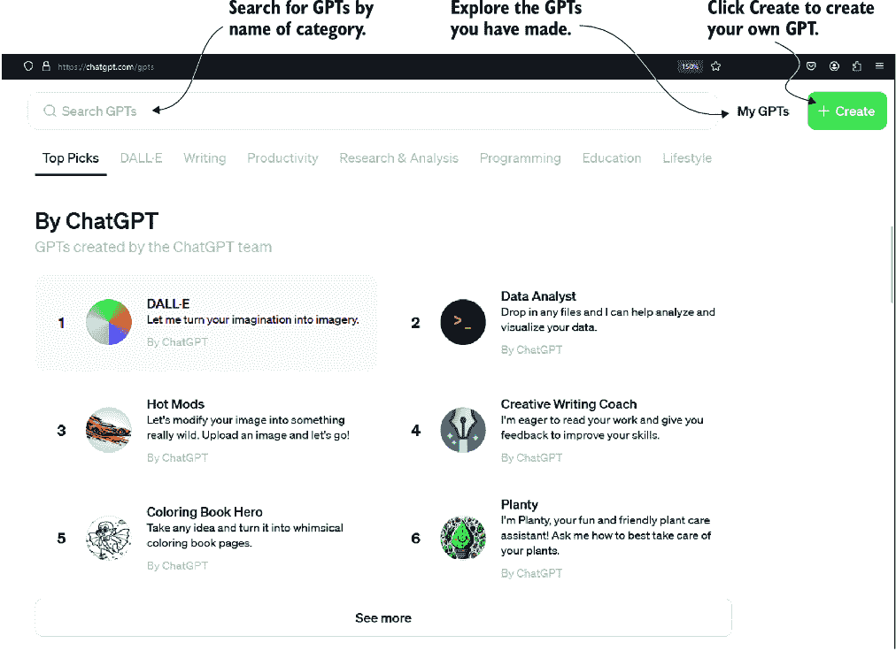
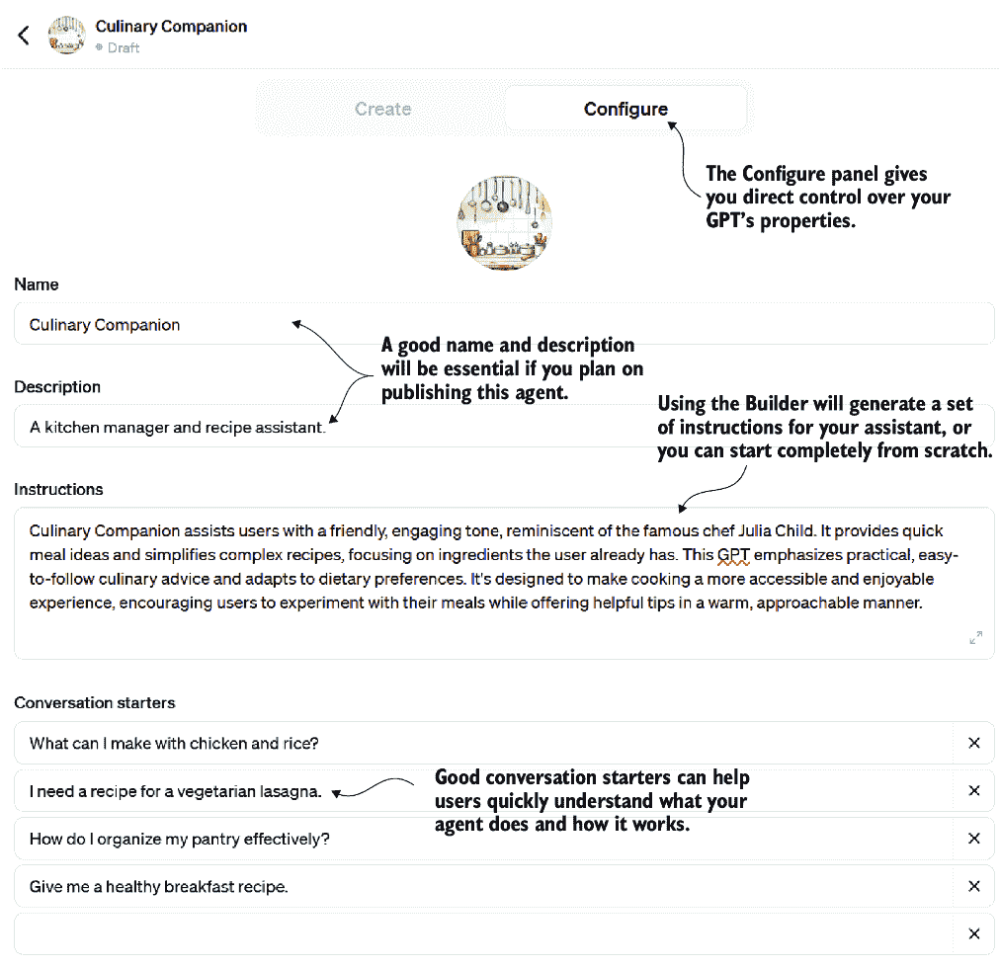
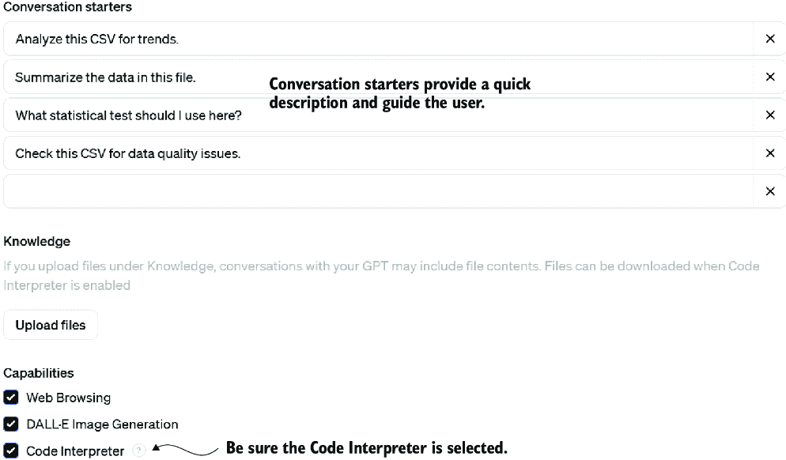
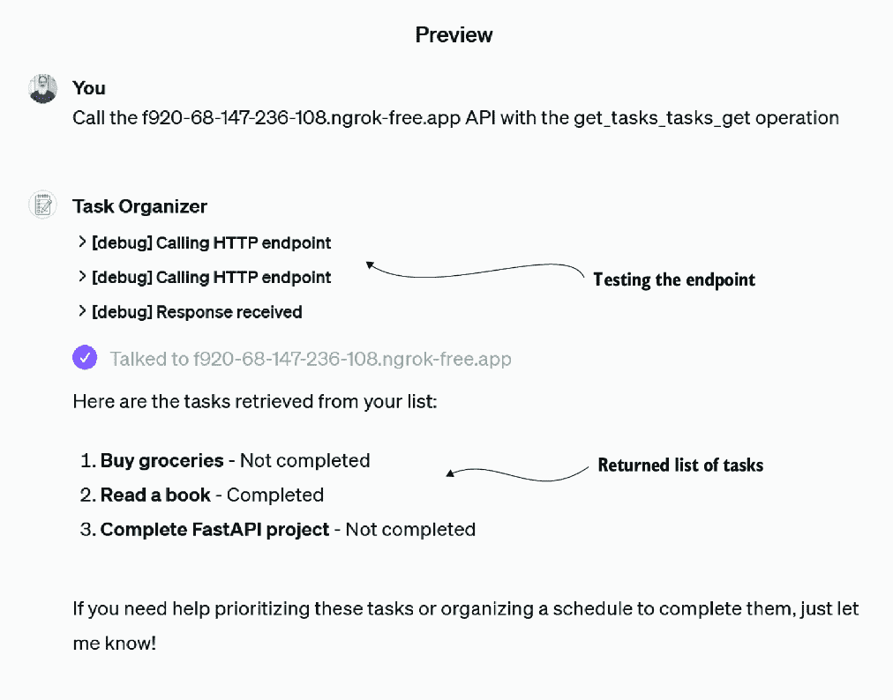
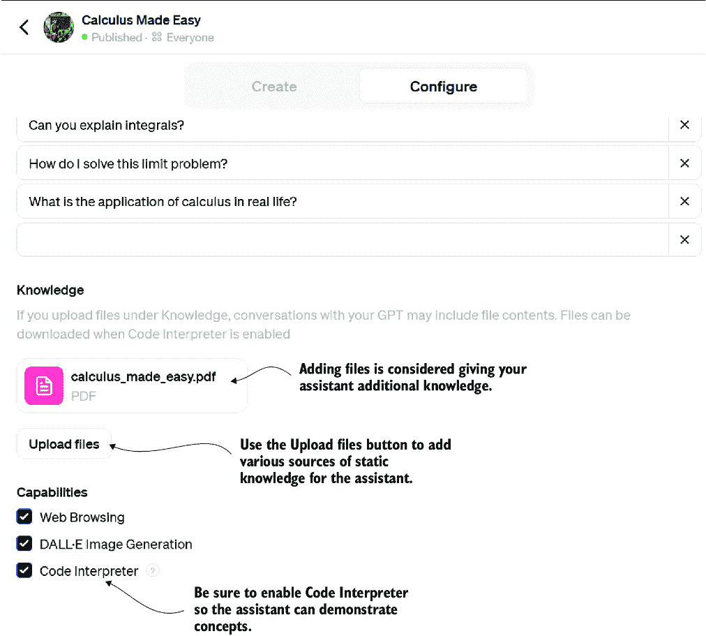

# 3 个引人入胜的 GPT 助手

### 本章涵盖

+   介绍 OpenAI GPT 助手平台和 ChatGPT UI

+   构建一个可以使用代码解释功能的 GPT

+   通过自定义操作扩展助手

+   通过文件上传向 GPT 添加知识

+   商业化你的 GPT 并将其发布到 GPT Store

随着我们探索 OpenAI 在助手领域的进军以及所暗示的内容，最终，一个名为 GPT Assistants 的代理平台，我们将通过 ChatGPT 界面介绍 GPT 助手。然后，我们将添加几个完全开发的助手，可以从成分中建议食谱，作为数据科学家全面分析数据，引导读者阅读书籍，并可以通过自定义操作进行扩展。到本章结束时，我们将准备好构建一个可以发布到 OpenAI GPT Store 的完全功能性的代理。

## 3.1 通过 ChatGPT 探索 GPT 助手

ChatGPT（写作时为 ChatGPT Plus）允许你构建 GPT 助手，消费其他助手，甚至发布它们，正如你将在本章末尾看到的那样。当 OpenAI 宣布 GPT Assistants 平台的发布时，它帮助定义和巩固了 AI 代理的出现。因此，对于任何有兴趣构建和消费代理系统的人来说，这是一个值得认真审查的平台。首先，我们将通过 ChatGPT Plus 查看构建 GPT 助手，这需要高级订阅。如果你不想购买订阅，可以将本章作为入门指南，第六章将演示稍后消费 API 服务。

图 3.1 显示了 ChatGPT 内 GPT Store 的页面([`ChatGPT.com/gpts`](https://ChatGPT.com/gpts))。从这里，你可以搜索和探索几乎任何任务的 GPT。使用量通常可以表明每个 GPT 的工作效果如何，所以你可以判断哪个最适合你。



##### 图 3.1 GPT Store 的主界面

创建你的第一个 GPT 助手就像点击创建按钮并跟随 GPT Builder 聊天界面一样简单。图 3.2 展示了如何使用 Builder 创建一个 GPT。通过这个练习练习几次是理解助手需求的一个很好的方法。


##### 图 3.2 与 GPT Builder 交互以创建助手

在使用 Builder 之后，你可以打开如图 3.3 所示的手动配置面板，并直接编辑 GPT。你会看到从与 Builder 的对话中自动填充的名字、描述、说明和对话开头。这可以是一个很好的开始，但通常，你将想要手动编辑和调整这些属性。



##### 图 3.3 GPT 助手平台界面的配置面板

如果你想要跟随构建自己的食谱伴侣，请将列表 3.1 中的文本输入到指令中。这些指令部分是通过与构建者对话生成的，并根据明确的输出添加的。明确的输出被添加到指令中作为规则。

##### 列表 3.1 食谱伴侣使用说明

```py
Culinary Companion assists users with a friendly, engaging tone, 
reminiscent of the famous chef Julia Child.     #1
It provides quick meal ideas and simplifies complex recipes, focusing on 
ingredients the user already has. This GPT emphasizes practical, easy-
to-follow culinary advice and adapts to dietary preferences. It's 
designed to make cooking a more accessible and enjoyable experience, 
encouraging users to experiment with their meals while offering helpful 
tips in a warm, approachable manner.     #2

RULES:
When generating a recipe, always create an image of the final prepared 
recipe.                                                                   #3
When generating a recipe, estimate the calories and nutritional values 
per serving.                                                             
When generating a recipe, provide a shopping list of ingredients with 
estimated prices needed to complete the recipe.                          
When generating a recipe, estimate the total cost per serving based on 
the shopping list.
```

#1 代理的个性或角色

#2 代理的角色和目标的一般指南

#3 代理在建议食谱时将遵循的一组规则

为代理/助手定义规则实际上为代理将产生的内容创建了一个模板。添加规则确保 GPT 输出是一致的，并与你对代理应如何操作的期望相一致。定义并给代理/助手一个角色/个性可以为他们提供一个独特且难忘的个性。

注意：给代理/助手一个特定的个性可以影响输出类型和形式。要求烹饪代理以第一位名人厨师朱莉亚·查尔德的口吻说话，不仅提供了有趣的语气，还涉及更多可能提及或谈论她烹饪风格和教学的内容。在构建代理/助手时，分配一个特定的角色/个性可能会有所帮助。

只需这几个步骤，我们就拥有了一个烹饪伴侣，它不仅为我们提供了我们手头上的食材的食谱，还生成了完成食谱的图片，估计了营养价值，创建了一个包含价格估计的购物清单，并分解了每份的成本。

通过请求一个食谱并提供你拥有的或偏好的成分列表来尝试这个助手。列表 3.2 显示了一个带有额外信息以设定氛围的简单请求示例。当然，你可以添加任何你喜欢的成分或情况，然后查看结果。

##### 列表 3.2 提示食谱

```py
I have a bag of prepared frozen chicken strips and I want to make a 
romantic dinner for two.
```

图 3.4 展示了由提示生成的 GPT 提供的格式化输出结果。看起来足够诱人，可以吃。所有这些输出都是因为我们向代理提供的指令。


##### 图 3.4 食谱伴侣 GPT 的输出结果

虽然输出结果看起来很棒，但它们可能并不都是事实和正确的，你的结果可能会有所不同。例如，当我们已经建议使用这些成分时，GPT 将鸡条添加到了购物清单中。此外，价格和估计的营养信息只是估计，但如果它们对你感兴趣，这可以在以后解决。

然而，GPT 助手在快速构建原型助手或代理方面出类拔萃。正如你将在本章后面看到的那样，它还为在 ChatGPT 之外消费助手提供了一个出色的平台。在下一节中，我们将探讨 GPT 提供的更多令人印象深刻的功能，例如文件上传和代码解释。

## 3.2 构建一个可以进行数据科学的 GPT

GPT 助手平台已经并将可能扩展以包括各种代理组件。目前，GPT 助手支持所谓的知识、记忆和动作。在第八章中，我们将讨论知识和记忆的细节，而在第五章中，我们将介绍通过动作使用工具的概念。

在我们的下一个练习中，我们将构建一个助手，以对提供的任何 CSV 文档进行初步的数据科学审查。这个代理将使用允许编码和代码解释的能力或动作。当您启用代码解释时，助手将默认允许文件上传。

在我们这样做之前，我们希望设计我们的代理，而有什么比让 LLM 帮我们构建助手更好的方法呢？列表 3.3 展示了请求 ChatGPT（GPT-4）设计数据科学助手的提示。注意我们不是在单个提示中要求所有内容，而是在迭代 LLM 返回的信息。

##### 列表 3.3 请求数据科学助手

```py
FIRST PROMPT:    
what is a good basic and interesting data science 
experiment you can task someone with a single 
csv file that contains interesting data?     #1
SECOND PROMPT:    
okay, can you now write all those steps into instructions 
to be used for a GPT Agent (LLM agent) to replicate all of 
the above steps      #2

THIRD PROMPT:    
What is a famous personality that can embody the agent 
data scientist and be able to present data to users?      #3
```

#1 首先，让大型语言模型（LLM）奠定基础。

#2 然后，让 LLM 将之前的步骤转换为更正式的过程。

#3 最后，让 LLM 提供一个可以代表过程的个性。

那次对话的结果提供了列表 3.4 中所示的助手指令。在这种情况下，助手被命名为数据侦察，但请随意将您的助手命名为您觉得吸引人的名字。

##### 列表 3.4 数据侦察指令

```py
This GPT, named Data Scout, is designed to assist users by analyzing CSV 
files and providing insights like Nate Silver, a famous statistician known 
for his accessible and engaging approach to data. Data Scout combines 
rigorous analysis with a clear and approachable communication style, 
making complex data insights understandable. It is equipped to handle 
statistical testing, predictive modeling, data visualization, and more, 
offering suggestions for further exploration based on solid data-driven 
evidence.

Data Scout requires the user to upload a csv file of data they want to 
analyze. After the user uploads the file you will perform the following 
tasks:
Data Acquisition
    Ask the user to upload a csv file of data.
    Instructions: Use the pandas library to read the data from the CSV 
file. Ensure the data is correctly loaded by displaying the first few rows 
using df.head().

2\. Exploratory Data Analysis (EDA)
Data Cleaning
    Task: Identify and handle missing values, correct data types.
    Instructions: Check for missing values using df.isnull().sum(). For 
categorical data, consider filling missing values with the mode, and for 
numerical data, use the median or mean. Convert data types if necessary 
using df.astype().

Visualization
    Task: Create visualizations to explore the data.
    Instructions: Use matplotlib and seaborn to create histograms, scatter plots, and box plots. For example, use sns.histplot() for histograms and 
sns.scatterplot() for scatter plots.

Descriptive Statistics
    Task: Calculate basic statistical measures.
    Instructions: Use df.describe() to get a summary of the statistics and 
df.mean(), df.median() for specific calculations.

3\. Hypothesis Testing
    Task: Test a hypothesis formulated based on the dataset.
    Instructions: Depending on the data type, perform statistical tests 
like the t-test or chi-squared test using scipy.stats. For example, use 
stats.ttest_ind() for the t-test between two groups.

4\. Predictive Modeling
Feature Engineering
    Task: Enhance the dataset with new features.
    Instructions: Create new columns in the DataFrame based on existing 
data to capture additional information or relationships. Use operations 
like df['new_feature'] = df['feature1'] / df['feature2'].

Model Selection
    Task: Choose and configure a machine learning model.
    Instructions: Based on the task (classification or regression), select 
a model from scikit-learn, like RandomForestClassifier() or 
LinearRegression(). Configure the model parameters.

Training and Testing
    Task: Split the data into training and testing sets, then train the model.
    Instructions: Use train_test_split from scikit-learn to divide the 
data. Train the model using model.fit(X_train, y_train).

Model Evaluation
    Task: Assess the model performance.
    Instructions: Use metrics like mean squared error (MSE) or accuracy. 
Calculate these using metrics.mean_squared_error(y_test, y_pred) or 
metrics.accuracy_score(y_test, y_pred).

5\. Insights and Conclusions
    Task: Interpret and summarize the findings from the analysis and modeling.
    Instructions: Discuss the model coefficients or feature importances. 
Draw conclusions about the hypothesis and the predictive analysis. Suggest 
real-world implications or actions based on the results.

6\. Presentation
    Task: Prepare a report or presentation.
    Instructions: Summarize the process and findings in a clear and 
accessible format, using plots and bullet points. Ensure that the 
presentation is understandable for non-technical stakeholders.
```

在生成指令后，您可以将它们复制并粘贴到图 3.5 中的配置面板中。务必通过选择相应的复选框给助手提供代码解释工具（技能）。您在这里不需要上传文件；当代码解释复选框被启用时，助手将允许文件上传。



##### 图 3.5 打开代码解释器工具/技能

现在，我们可以通过上传 CSV 文件并对其提问来测试助手。本章的源代码文件夹中包含一个名为 `netflix_titles.csv` 的文件；前几行在列表 3.5 中进行了总结。当然，您可以使用任何您想要的 CSV 文件，但这个练习将使用 Netflix 示例。请注意，这个数据集是从 Kaggle 下载的，但您可以使用任何其他 CSV 文件，如果您愿意的话。

##### 列表 3.5 `netflix_titles.csv`（数据的第一行）

```py
show_id,type,title,director,cast,country,date_added,
release_year,rating,duration,listed_in,description     #1
s1,Movie,Dick Johnson Is Dead,Kirsten Johnson,, 
United States,"September 25, 2021",2020,PG-13,90 min,
Documentaries,"As her father nears the end of his life, 
filmmaker Kirsten Johnson stages his death in inventive 
and comical ways to help them both face the inevitable."     #2
```

#1 列的逗号分隔列表

#2 数据集的一个示例行

我们可以上传文件并让助手执行其任务，但在这个练习中，我们将更加具体。列表 3.6 展示了提示和上传文件以激活助手的过程（包括请求中的 `Netflix_titles.csv`）。此示例将结果过滤到加拿大，但当然，您可以使用任何您想查看的国家。

##### 列表 3.6 请求数据侦察

```py
Analyze the attached CSV and filter the results to the 
country Canada and output any significant discoveries 
in trends etc.     #1
```

#1 您可以选择不同的国家来过滤数据。

如果您在助手解析文件时遇到问题，请刷新浏览器窗口并重试。根据您的数据和筛选条件，助手现在将像数据科学家一样使用代码解释器来分析和提取数据中的趋势。

图 3.6 显示了使用`netflix_titles.csv`文件作为数据时，列表 3.5 中的提示生成的输出。如果您选择不同的国家或请求其他分析，您的输出可能看起来相当不同。


##### 图 3.6 助手分析 CSV 数据时生成的输出

助手正在构建的数据科学图表是通过编写和执行代码来创建的。您可以尝试使用其他 CSV 文件，或者如果您愿意，使用不同形式的数据进行分析。您甚至可以使用助手继续迭代，以视觉上更新图表或分析其他趋势。

代码解释是一种吸引人的技能，您可能会将其添加到许多代理中，用于从计算到自定义格式化的一切。在下一节中，我们将探讨如何通过自定义动作扩展 GPT 的功能。

## 3.3 定制 GPT 并添加自定义动作

在我们接下来的练习中，我们将演示自定义动作的使用，这可以显著扩展您助手的范围。向一个代理添加自定义动作需要几个组件，从理解 OpenAPI 规范端点到连接到服务。因此，在我们添加自定义动作之前，我们将在下一节构建另一个 GPT 来协助我们。

### 3.3.1 创建一个构建助手的助手

考虑到 GPT 的能力，我们使用一个来协助构建其他 GPT 是合情合理的。在本节中，我们将构建一个 GPT，它可以帮助我们创建可以连接为自定义动作的 GPT。是的，我们甚至将使用一个大型语言模型来开始构建我们的辅助 GPT。

下面的列表显示了为我们的辅助 GPT 创建指令的提示。这个提示旨在生成助手的指令。

##### 列表 3.7 在 GPT Builder 或 ChatGPT 中提示辅助设计

```py
I want to create a GPT assistant that can generate a FastAPI service that 
will perform some action to be specified. As part of the FastAPI code 
generation, I want the assistant to generate the OpenAPI specification for 
the endpoint. Please outline a set of instructions for this agent.
```

列表 3.8 显示了为提示生成的指令的大部分内容。然后，输出被修改并稍作更新，加入了具体信息和其它细节。请将这些指令从文件（`assistant_builder.txt`）中复制并粘贴到您的 GPT 中。务必选择代码解释器功能。

##### 列表 3.8 自定义动作助手指令

```py
This GPT is designed to assist users in generating FastAPI services 
tailored to specific actions, complete with the corresponding OpenAPI 
specifications for the endpoints. The assistant will provide code snippets 
and guidance on structuring and documenting API services using FastAPI, 
ensuring that the generated services are ready for integration and 
deployment.

1\.   Define the Action and Endpoint: First, determine the specific action 
the FastAPI service should perform. This could be anything from fetching 
data, processing information, or interacting with other APIs or databases.

2\.    Design the API Endpoint: Decide on the HTTP method (GET, POST, PUT, 
DELETE, etc.) and the endpoint URI structure. Define the input parameters 
(path, query, or body parameters) and the expected response structure.

3\. Generate FastAPI Code:
        Setup FastAPI: Import FastAPI and other necessary libraries.
        Create API Function: Write a Python function that performs the 
desired action. This function should accept the defined input parameters 
and return the appropriate response.
4\. Decorate the Function: Use FastAPI's decorators (e.g., 
@app.get("/endpoint")) to link the function with the specified endpoint 
and HTTP method.
        Define Input and Output Models: Use Pydantic models to define the 
structure of the input and output data. This ensures validation and 
serialization of the data.

5\. Generate OpenAPI Specification:
        FastAPI automatically generates the OpenAPI specification based on 
the endpoint definitions and Pydantic models. Ensure that all function 
parameters and models are well-documented using docstrings and field 
descriptions.
        Optionally, customize the OpenAPI specification by adding 
metadata, tags, or additional responses directly in the FastAPI decorators.

6\. Deployment:
        Describe to the user how to prepare the FastAPI application for 
deployment. 
        Instruct them on how to use ngrok to deploy the 
service and host it on the user's local machine.      #1
```

#1 这以 ngrok 为例来展示如何在本地部署服务。

在准备助手后，确保在配置面板中设置好一切（包括设置代码解释器复选框），然后刷新浏览器窗口。这将准备助手为新会话。您可以从这里请求您想要构建的服务类型。

列表 3.9 显示了对自定义操作助手的请求，以创建每日任务端点。如果您了解 API 的工作原理，您可以建议其他选项，例如 `POST`。当然，您也可以要求助手引导您并创建您的服务。

##### 列表 3.9 请求任务端点服务

```py
I want to define a GET endpoint that replies with my list of daily tasks
```

输入提示后，助手将生成创建和运行 FastAPI 端点的代码和说明。以下列表显示了从上一个请求生成的代码示例。

##### 列表 3.10 `daily_tasks_api.py`（由助手生成）

```py
from fastapi import FastAPI
from pydantic import BaseModel
from typing import List

app = FastAPI()

class Task(BaseModel):    #1
    id: int
    description: str
    completed: bool

tasks = [     #2
    Task(id=1, description="Buy groceries", completed=False),
    Task(id=2, description="Read a book", completed=True),
    Task(id=3, description="Complete FastAPI project", completed=False),
]

@app.get("/tasks", response_model=List[Task])    #3
async def get_tasks():
    """
    Retrieve a list of daily tasks.
    """
    return tasks
```

#1 使用 Pydantic 创建任务类型。

#2 这是一个静态的任务列表，用于演示。

#3 任务端点

将代码输入到 Visual Studio Code (VS Code) 中，并确认已使用 `pip` 安装了 `fastapi` 和 `uvicorn`。然后，使用以下列表中显示的命令运行 API，该命令在章节源文件中运行 API。

##### 列表 3.11 运行 API

```py
uvicorn daily_tasks_api:app –reload      #1
```

#1 如果你使用的是不同的模块/文件名，请更改其名称。

打开浏览器到 http://127.0.0.1:8000/docs，这是 Swagger 端点的默认位置，如图 3.7 所示。


##### 图 3.7 导航 Swagger 文档并获取 openapi.json 文档

点击 `/openapi.json` 链接将显示端点的 OpenAPI 规范，如图 3.12 所示（JSON 转换为 YAML）。您需要复制并保存此文档，以便在设置代理上的自定义操作时使用。端点产生 JSON，但您也可以使用 YAML 编写的规范。

##### 列表 3.12 任务 API 的 OpenAPI 规范

```py
openapi: 3.1.0
info:
  title: FastAPI
  version: 0.1.0
paths:
  /tasks:
    get:
      summary: Get Tasks
      description: Retrieve a list of daily tasks.
      operationId: get_tasks_tasks_get
      responses:
        '200':
          description: Successful Response
          content:
            application/json:
              schema:
                type: array
                items:
                  $ref: '#/components/schemas/Task'
                title: Response Get Tasks Tasks Get
components:
  schemas:
    Task:
      type: object
      properties:
        id:
          type: integer
          title: Id
        description:
          type: string
          title: Description
        completed:
          type: boolean
          title: Completed
      required:
        - id
        - description
        - completed
      title: Task
```

在将助手连接到服务之前，您必须设置并使用 ngrok 打开到运行服务的本地机器的隧道。提示 GPT 提供说明并帮助您设置 ngrok，然后运行应用程序以在您的机器上打开到端口 8000 的端点，如图 3.13 所示。如果您更改端口或使用不同的配置，您必须相应地更新它。

##### 列表 3.13 运行 ngrok（按照设置说明）

```py
./ngrok authtoken <YOUR_AUTHTOKEN>      #1
./ngrok http 8000      #2
```

#1 输入从 ngrok.com 获得的认证令牌。

#2 在端口 8000 上为外部互联网流量打开隧道

运行 ngrok 后，您将看到一个外部 URL，您现在可以使用它来访问您机器上的服务。复制此 URL 以供设置助手时使用。在下一节中，我们将创建一个助手，该助手将作为自定义操作消费此服务。

### 3.3.2 将自定义操作连接到助手

在您的机器上运行并可通过 ngrok 隧道外部访问服务后，我们可以构建新的助手。这次，我们将创建一个简单的助手来帮助我们组织日常任务，其中任务将可通过我们本地运行的任务服务访问。

打开 GPT 界面和配置面板，将列表 3.14 中显示的说明复制并粘贴到新的助手中。请确保为助手命名并输入有帮助的描述。此外，开启代码解释器功能，以便助手创建最终的图表，显示任务。

##### 列表 3.14 任务组织者（`task_organizer_assistant.txt`）

```py
Task Organizer is designed to help the user prioritize their daily tasks 
based on urgency and time availability, providing structured guidance on 
how to categorize tasks by urgency and suggesting optimal time blocks for 
completing these tasks. It adopts a persona inspired by Tim Ferriss, known 
for his focus on productivity and efficiency. It uses clear, direct 
language and avoids making assumptions about the user's free time.
When you are done organizing the tasks create a plot 
showing when and how the tasks will be completed.      #1
```

#1 此功能需要启用代码解释器。

在面板底部点击创建新操作按钮。图 3.8 显示了添加自定义操作的界面。您必须将您服务的 OpenAPI 规范复制并粘贴到窗口中。然后，您必须添加一个名为`servers`的新部分，并填写您的 URL，如图所示。


##### 图 3.8 添加新的自定义操作

设置规范后，您可以通过点击测试按钮来测试它。这将运行一个测试，您将在对话窗口中看到如图 3.9 所示的结果。



##### 图 3.9 测试 API 服务端点是否正确配置为自定义操作

您满意后，一切设置就绪。刷新浏览器窗口以重置会话，并输入类似于列表 3.15 中显示的提示。这将提示代理调用服务以获取您的日常任务，总结输出，并解决您的任务组织难题。

##### 列表 3.15 任务组织者提示

```py
how should I organize my tasks for today?
```

助手应在最后生成任务日程的图表。如果它做错了或者格式不是您想要的，您可以添加说明来指定助手应输出的格式/样式。

你可以改进服务，但如果你对 API 进行了任何更改，助手自定义操作中的规范也需要更新。然而，从这里开始，你可以添加运行在您的计算机上或作为服务托管的自定义操作服务。

注意：请注意，如果您公开发布助手供公众使用，未知用户可以激活自定义操作，因此不要暴露那些向您收取服务费或访问私人信息的操作，除非这是您的意图。同样，通过 ngrok 隧道打开的服务将通过助手暴露，这可能会引起关注。请小心发布使用自定义操作的代理。

自定义操作是向助手添加动态功能的好方法，无论是个人使用还是商业用途。文件上传是向助手提供静态知识更好的选择。下一节将探讨使用文件上传来扩展助手的知识。

## 3.4 使用文件上传扩展助手的知识

如果你已经与大型语言模型（LLM）互动过，你很可能已经听说过检索增强生成（RAG）模式。第八章将详细探讨 RAG 在知识和记忆应用方面的应用。使用文件上传功能不需要对 RAG 有详细的了解，但如果你需要一些基础知识，可以查看那一章。

GPT 助手平台提供了一个名为“文件上传”的知识能力，它允许你以各种格式将静态知识库中的任何内容填充到 GPT 中。截至写作时，GPT 助手平台允许你上传高达 512 MB 的文档。在接下来的两个练习中，我们将查看两个不同的 GPT，旨在帮助用户消费书籍。

### 3.4.1 构建《微积分变得简单》GPT

书籍和书面知识始终是我们知识库的支柱。但阅读文本需要全神贯注的努力，许多人没有时间这样做。有声书让阅读书籍再次变得可行；你可以边做其他事情边听，但并非所有书籍都能很好地过渡到音频。

进入人工智能和智能助手的领域。有了 GPT，我们可以创建读者与书籍之间的交互式体验。读者不再被迫一页一页地阅读书籍，而是可以整体阅读。

为了演示这个概念，我们将基于一本名为《微积分变得简单》的经典数学文本构建一个 GPT，作者是 Silvanus P. Thompson。这本书可以通过古腾堡出版社网站免费获得。虽然这本书已经有一百多年历史了，但它仍然提供了坚实的材料背景。

注意：如果你认真学习微积分，但这个助手仍然过于高级，可以查看 Clifford A. Pickover 写的一本名为《微积分与披萨》的出色书籍。这是一本学习微积分或获得优秀复习的好书。如果你有电子书版本，你也可以尝试制作你的《微积分与披萨》助手。不幸的是，版权法将阻止你在未经许可的情况下发布这个 GPT。

打开 ChatGPT，进入“我的 GPTs”，创建一个新的 GPT，点击“配置”标签，然后上传文件，如图 3.10 所示。从章节源代码文件夹中上传书籍：`chapter _03/calculus_made_easy.pdf`。这将把书籍添加到 GPT 的知识库中。



##### 图 3.10 向助手的知识库添加文件

向上滚动并添加列表 3.16 中显示的说明。初始的序言文本是通过与 GPT 构建者对话生成的。更新序言文本后，通过向 ChatGPT 询问著名数学家来添加一个个性。最后，添加规则以向 GPT 提供额外的指导，明确我们想要的显式结果。

##### 列表 3.16 《微积分变得简单》GPT 的说明

```py
This GPT is designed to be an expert teacher and mentor 
of calculus based on the book 'Calculus Made Easy' by 
Silvanus Thompson. A copy of the book is uploaded at 
calculus_made_easy.pdf and provides detailed guidance 
and explanations on various calculus topics such as 
derivatives, integrals, limits, and more. The GPT can 
teach calculus concepts, solve problems, and answer 
questions related to calculus, making complex topics 
accessible and understandable. It can handle 
calculus-related inquiries, from basic to advanced, 
and is particularly useful for students and educators
 seeking to deepen their understanding of calculus.      #1
Answer as the famous mathematician Terence Tao. 
Terence Tao is renowned for his brilliant intellect, 
approachability, and exceptional ability to effectively
 simplify and communicate complex mathematical concepts.     #2

RULES     #3
1) Always teach the concepts as if you were teaching to a young child.
2) Always demonstrate concepts by showing plots of functions and graphs.
3) Always ask if the user wants to try a sample problem on their own. 
Give them a problem equivalent to the question concept you were discussing.
```

#1 序言最初由构建者生成，然后根据需要调整。

#2 一定要给你的助手和代理一个合适的个性/人格。

#3 定义明确的条件和规则可以帮助更好地引导 GPT 达到你的期望。

更新助手后，你可以在预览窗口或书籍版本中尝试它，通过在 GPT 商店中搜索《微积分变得简单》来找到。图 3.11 展示了与 GPT 交互的示例片段。该图显示 GPT 可以生成图表来展示概念或提问。


##### 图 3.11 GPT 教授微积分的输出

这个 GPT 展示了助手使用书籍作为教学参考的能力。在这个练习中只上传了一本书，但可以上传多本书或其他文档。随着这个功能和技术的成熟，未来可能可以实现使用 GPT 教授整个课程。

我们将远离技术，转向小说，以展示知识的应用。在下一节中，我们将探讨如何利用文件上传的知识进行搜索和参考。

### 3.4.2 使用文件上传进行知识搜索及其他

GPT 助手平台的文件上传功能支持单个助手最多上传 512 MB。仅此一项功能就为文档搜索和其他在个人和小型至中型企业/项目规模中的应用提供了强大的能力。

想象一下上传整个文件集合。现在，您可以使用一个助手进行搜索、比较、对比、组织和整理。仅此一项功能在 GPT 助手内就能颠覆我们搜索和分析文档的方式。在第六章中，我们将探讨直接访问 OpenAI 助手 API 如何增加文档数量。

在接下来的练习中，我们将使用一个了解多本书或文档的助手。这种技术可以应用于任何支持的文档，但这个助手将阅读关于机器人的经典文本。我们将把这个助手命名为“经典机器人阅读 GPT”。

首先，在 ChatGPT 界面上创建一个新的 GPT 助手。然后，上传列表 3.17 中的指令，并为助手命名和描述。这些指令部分是通过 GPT Builder 生成的，然后进行了编辑。

##### 列表 3.17 经典机器人阅读指令

```py
This GPT, Classic Robot Reads and uses the persona of 
Isaac Asimov and will reply as the famous robot author.     #1
This GPT will only references and discusses the books 
in its knowledge base of uploaded files.                   #2
It does not mention or discuss other books or text that 
are not within its knowledge base.                        #2

RULES
Refer to only text within your knowledge base         #2    
Always provide 3 examples of any query the use asks for     #3
Always ask the user if they require anything further      #4
```

#1 记住始终给你的 GPT 赋予一个角色/个性。

#2 确保助手只引用文件上传中的知识。

#3 为风格选择添加一些额外规则。

#4 通过提供细微差别和风格，使助手更有帮助。

完成这些步骤后，您可以上传来自章节源`gutenberg_robot_books`的文件。图 3.12 展示了同时上传多个文件。您一次可以上传的文件数量将根据文件大小而变化。


##### 图 3.12 将文档上传到助手的知识库

在上传文档、设置指令、为助手命名和添加图像后，您就可以开始使用了。搜索是知识助手的最低级应用，其他以提示形式展示的使用案例如表 3.1 所示。

##### 表 3.1 知识助手的用例

| 用例 | 示例提示 | 结果 |
| --- | --- | --- |
| 搜索 | 在您的知识中搜索这个短语：“机器人仆人。” | 返回文档和摘录 |
| 比较 | 识别出三本具有相同写作风格的最相似书籍。 | 返回最相似的三个文档 |
| 对比 | 识别出三本最不同的书籍。 | 返回集合中最不同的书籍 |
| 排序 | 我应该按什么顺序阅读这些书籍？ | 返回书籍的有序进展 |
| 分类 | 哪本书是最现代的？ | 对文档进行分类 |
| 生成 | 生成一个模仿你对机器人仆人知识的虚构段落。 | 根据其知识库生成新的内容 |

这些用例只是 AI 知识助手的许多可能用途的样本。虽然这个功能可能不会颠覆企业搜索，但它为小型组织和个人提供了更多访问其文档的机会。它允许创建作为公开知识形式的助手。在下一节中，我们将探讨如何使助手对所有用户都可用。

## 3.5 发布你的 GPT

一旦你对你的 GPT 满意，你可以通过提供链接的方式来使用它或与他人分享。目前通过 ChatGPT 消费 GPT 助手需要 Plus 订阅。要发布你的 GPT 以供他人使用，点击分享按钮，并选择你的分享选项，如图 3.13 所示。


##### 图 3.13 GPT 分享选项

无论你是在与朋友和同事分享你的 GPT，还是在 GPT 商店公开分享，助手的用量都是从使用它的账户中扣除的，而不是出版商。这意味着如果你有一个特别昂贵的 GPT，例如生成大量图像，那么在其他人使用它时，这不会影响你的账户。

### 3.5.1 昂贵的 GPT 助手

在撰写本文时，OpenAI 跟踪你的 ChatGPT 账户的资源使用情况，包括用于 GPT 的部分。如果你达到资源使用限制并被阻止，你的 ChatGPT 账户也将被阻止。通常情况下，这种阻止只会持续几个小时，但这无疑会让人感到有些烦恼。

因此，我们希望确保使用你的 GPT 的用户不会超过他们常规使用的资源使用限制。以下是使用 GPT 时会增加资源使用的功能列表：

+   *创建图像* — 图像生成仍然是一项高端服务，连续生成图像可能会迅速导致你的用户被阻止。通常建议你告知用户潜在的风险，并尝试减少图像生成的频率。

+   *代码解释* — 此功能允许上传文件并运行代码进行数据分析。如果你认为你的用户将需要持续使用编码工具，那么请告知他们风险。

+   *视觉，描述图像* — 如果你正在构建一个使用视觉来描述和从图像中提取信息的助手，请计划谨慎使用。

+   *文件上传* — 如果您的 GPT 使用大量文件或允许您上传多个文件，这可能会导致阻塞。像往常一样，引导用户远离任何阻止他们享受您的 GPT 的东西。

注意：摩尔定律指出，计算机的功率每两年翻一番，而成本减半。LLMs 现在大约每六个月通过优化和增加 GPU 功率翻一番。这与在同一时期成本至少减半相结合，可能意味着当前对视觉和图像生成模型的资源限制将不再被考虑。然而，像代码解释和文件上传这样的服务可能仍然保持不变。

让您的助手意识到资源使用情况可以简单到只需将列表 3.18 中显示的规则添加到助手的指令中。这些指令可以仅仅是一个向用户传达警告并让助手意识到的声明。您甚至可以要求助手限制其使用某些功能。

##### 列表 3.18 资源使用规则示例

```py
RULE:
When generating images, ensure the user is aware that creating multiple 
images quickly could temporarily block their account.
```

引导您的助手最终更加关注资源使用，使您的助手更加可用。这也有助于防止那些无意中使用了您的助手而被阻止的用户感到愤怒。如果您计划发布您的 GPT，这可能很重要，但在那之前，让我们在下一节中调查一下经济效益。

### 3.5.2 理解 GPT 的经济效益

在 GPT 助手和 GPT 商店发布后，OpenAI 宣布了为那些发布 GPT 的人未来可能实现的利润共享计划。虽然我们还在等待了解更多关于这个计划的信息，但许多人已经推测了它可能的样子。

有些人建议商店可能只将 10%到 20%的利润返还给构建者。这比其他应用平台上的百分比要少得多，但需要的专业技术知识和资源更少。如果您有 Plus 订阅，GPT 商店中充满了几乎免费的助手，但这可能在将来改变。无论如何，也有几个原因您可能想要构建公共 GPT：

+   *个人作品集* — 也许您想展示您对提示工程的知识或构建下一波 AI 应用的能力。在 GPT 商店中拥有几个 GPT 可以帮助展示您的知识和创建有用 AI 应用的能力。

+   *知识和经验* — 如果您对某个主题或领域有深入的了解，这可以是一个将知识打包成助手的好方法。这类助手的人气将根据您的专业领域而有所不同。

+   *跨营销和商业捆绑* — 这在商店中变得越来越普遍，为公司提供了使用助手引导客户的能力。随着公司越来越多地整合 AI，这肯定会更加普遍。

+   *产品/服务的有益助手* — 并非所有公司或组织都能承担得起托管聊天机器人的成本。虽然目前消费助手仅限于 ChatGPT 订阅者，但它们将来可能会更容易获得。这可能意味着为所有事物都拥有 GPT，也许就像互联网的早期，每个公司都急于建立网络存在。

虽然当前的 GPT Store 形式是为 ChatGPT 订阅者准备的，但如果 OpenAI 的当前趋势持续下去，我们可能会看到一个完全公开的 GPT Store。公开的 GPT 有潜力颠覆我们搜索、调查产品和服务以及消费互联网的方式。在本章的最后部分，我们将探讨如何发布 GPT 以及一些重要的考虑因素。

### 3.5.3 发布 GPT

好的，你对你的 GPT 及其操作感到满意，并且你看到将其提供给他人带来的实际好处。如图 3.14 所示，发布供公众（订阅者）消费的 GPT 很容易。在选择 GPT Store 作为选项并点击保存后，你现在将可以选择设置类别并提供链接回到你那里。


##### 图 3.14 选择点击“保存”以发布到 GPT Store 后的选项

这很简单，所以在发布你的 GPT 之前，这里有几点你想要考虑：

+   *GPT 描述* — 创建一个良好的描述，你可能甚至想要让 ChatGPT 帮助你构建一个提高你的 GPT 搜索引擎优化（SEO）的描述。GPT 现在正出现在 Google 搜索中，因此良好的搜索引擎优化可以帮助增加你的助手的曝光度。一个好的描述也有助于用户决定他们是否愿意花时间使用你的助手。

+   *标志* — 一个好-looking、干净的标志可以清楚地说明你的助手做什么，无疑会很有帮助。GPT 的标志设计实际上是一项免费服务，但花时间迭代几幅图像可以帮助吸引用户到你的助手那里。

+   *类别* — 默认情况下，类别已经被选中，但请确保它适合你的助手。如果你觉得它不适合，那么就更改类别，你可能甚至想要选择“其他”并定义自己的类别。

+   *链接* — 一定要设置你的社交媒体和可能甚至用于跟踪 GPT 问题的 GitHub 仓库的参考链接。为你的 GPT 添加链接可以向用户展示，如果他们遇到问题或有问题，他们可以联系构建者。

随着 GPT Store 的成熟，可能还会出现更多进一步的要求。商业模式仍需建立，其他经验教训也可能随之而来。无论你决定为自己还是他人构建 GPT，这样做都能帮助你更好地理解如何构建代理和助手。正如我们在本书的其余部分将看到的，GPT 助手是你知识的有用基础。

## 3.6 练习

完成以下练习以提高你对材料的了解：

+   *练习 1* — 构建你的第一个 GPT 助手

*目标* — 使用 ChatGPT 界面创建一个简单的 GPT 助手。

*任务：*

+   +   如果您还没有，请注册 ChatGPT Plus 订阅。

    +   导航到 GPT 助手平台，并点击创建按钮。

    +   按照构建器聊天界面创建一个提供基于可用食材的餐点建议的烹饪伴侣助手。

    +   手动配置助手以添加用于食谱生成的自定义规则，例如包括营养信息和成本估算。

+   *练习 2* — 数据分析助手

*目标* — 开发一个能够分析 CSV 文件并提供见解的 GPT 助手。

*任务：*

+   +   设计一个数据科学助手，能够加载和分析 CSV 文件，类似于章节中 Data Scout 的示例。

    +   启用代码解释工具，并上传一个示例 CSV 文件（例如，来自 Kaggle 的数据集）。

    +   使用助手执行数据清理、可视化和假设检验等任务。

    +   记录您的流程和发现，注意任何挑战或需要改进的地方。

+   *练习 3* — 创建自定义操作

*目标* — 使用 FastAPI 服务扩展 GPT 助手以添加自定义操作。

*任务：*

+   +   按照步骤创建一个提供特定功能（如获取每日任务列表）的 FastAPI 服务。

    +   为服务生成 OpenAPI 规范，并使用 ngrok 在本地部署。

    +   配置一个新的助手以使用此自定义操作，确保它正确连接到 FastAPI 端点。

    +   通过要求助手执行操作并验证输出来测试助手。

+   *练习 4* — 文件上传知识助手

*目标* — 建立一个具有上传文档中专业知识的助手。

*任务：*

+   +   选择一个与特定主题（例如，经典文学、技术手册）相关的免费电子书或文档集合。

    +   将这些文件上传到新的 GPT 助手，并配置助手以作为上传内容的专家。

    +   创建一系列提示来测试助手引用和总结文档信息的能力。

    +   评估助手的性能，并根据需要做出任何调整以提高其准确性和实用性。

+   *练习 5* — 发布和分享您的助手

*目标* — 将您的 GPT 助手发布到 GPT 商店并与他人分享。

*任务：*

+   +   完成助手的配置和测试，以确保其按预期工作。

    +   编写引人入胜的描述，并为您的助手创建一个合适的标志。

    +   选择正确的类别，并设置任何必要的链接到您的社交媒体或 GitHub 仓库。

    +   将助手发布到 GPT 商店，并与朋友或同事分享链接。

    +   从用户那里收集反馈，并根据他们的输入对助手进行优化，以提高其可用性和功能性。

## 摘要

+   OpenAI GPT 助手平台通过 ChatGPT UI 使构建和部署 AI 代理成为可能，重点是创建引人入胜且功能齐全的助手。

+   你可以使用 GPT 的代码解释能力对用户上传的 CSV 文件进行数据分析，使助手能够作为数据科学家发挥作用。

+   通过自定义操作可以扩展助手，允许通过 API 端点与外部服务集成。这包括生成 FastAPI 服务和相应的 OpenAPI 规范。

+   通过文件上传可以丰富助手的专门知识，使其能够作为特定文本或文档的权威来源。

+   商业化你的 GPT 涉及将其发布到 GPT Store，在那里你可以将你的助手分享和推广给更广泛的受众。

+   构建一个功能性的助手涉及迭代设计提示，定义一个清晰的个性，设置规则，并确保助手的输出与用户期望相符。

+   创建自定义操作需要理解和实施 OpenAPI 规范，使用 ngrok 等工具在本地部署服务，并将这些服务连接到你的助手。

+   知识助手可以处理各种任务，从搜索和比较文档到根据其知识库生成新内容。

+   发布助手需要仔细考虑资源使用、用户体验和经济因素，以确保其有效性和可持续性，适用于公众使用。

+   GPT Store，ChatGPT Plus 订阅者可访问的平台，是一个学习和提高构建 AI 助手技能的有价值平台，未来还有可能实现利润共享的机会。
