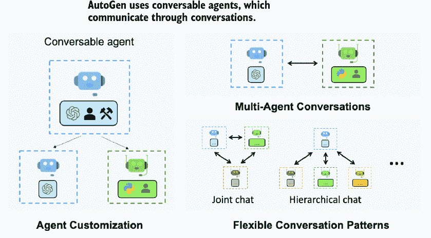
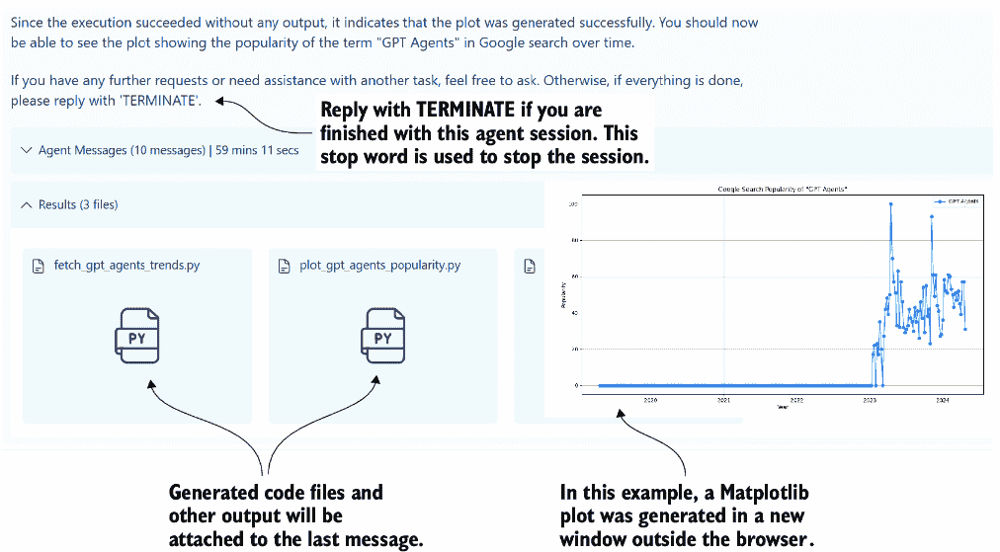
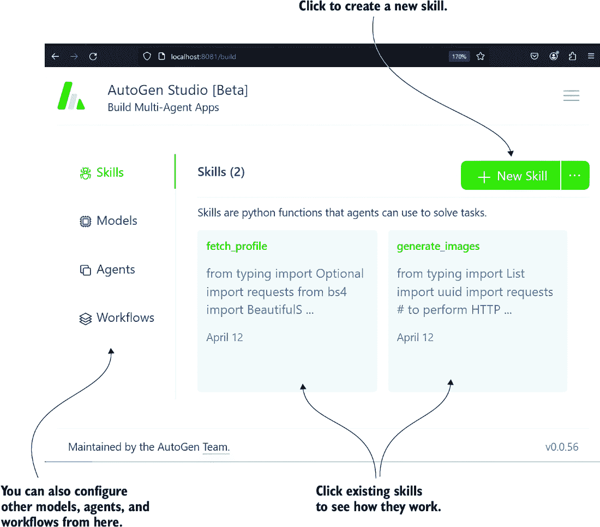
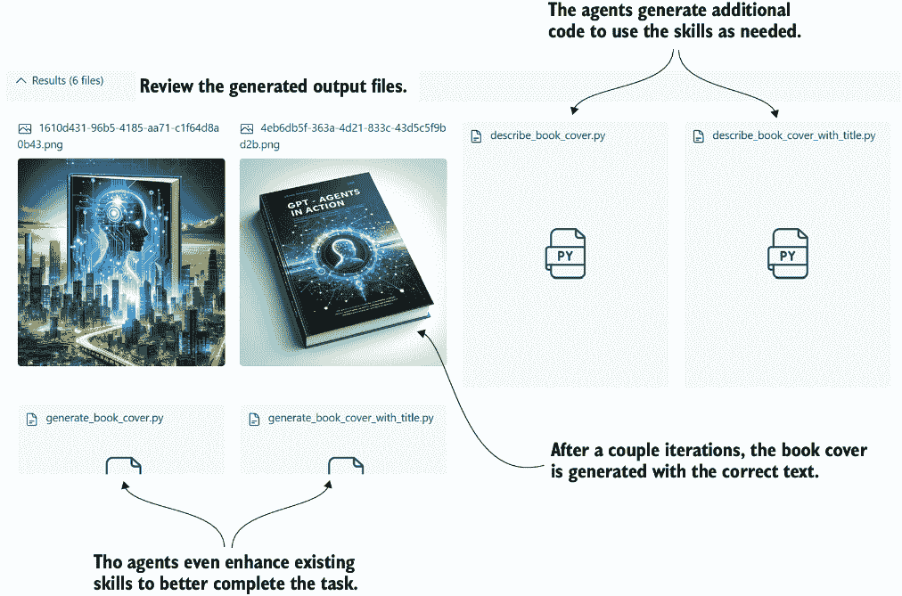
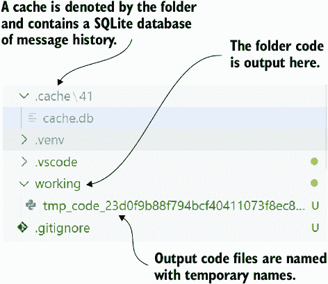
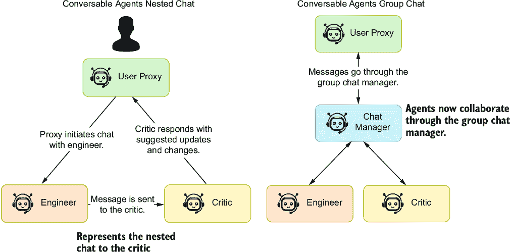
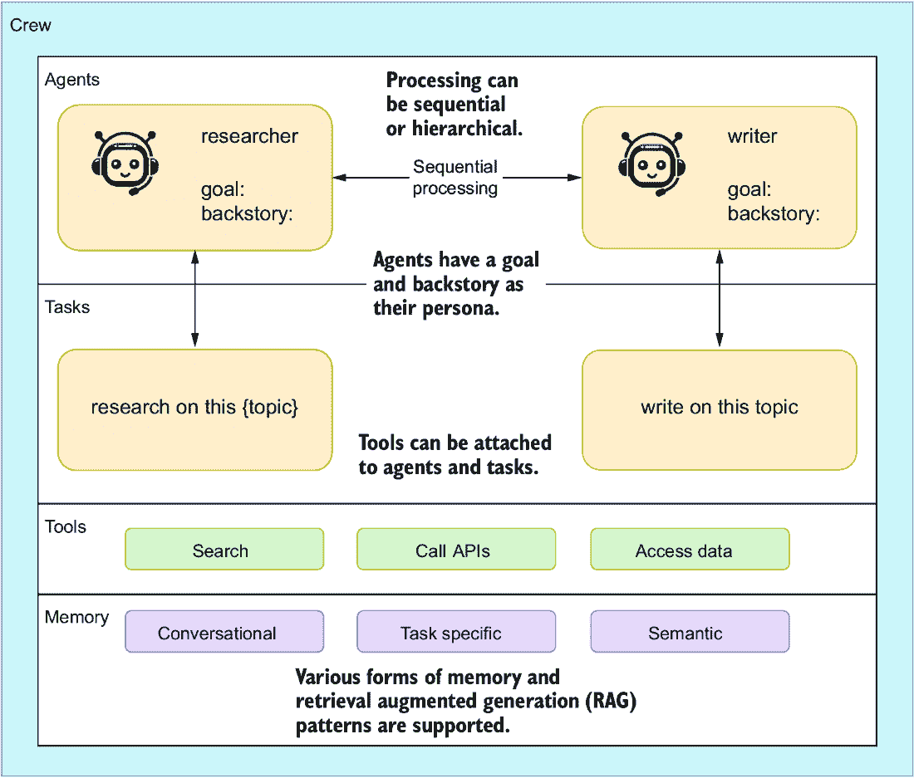
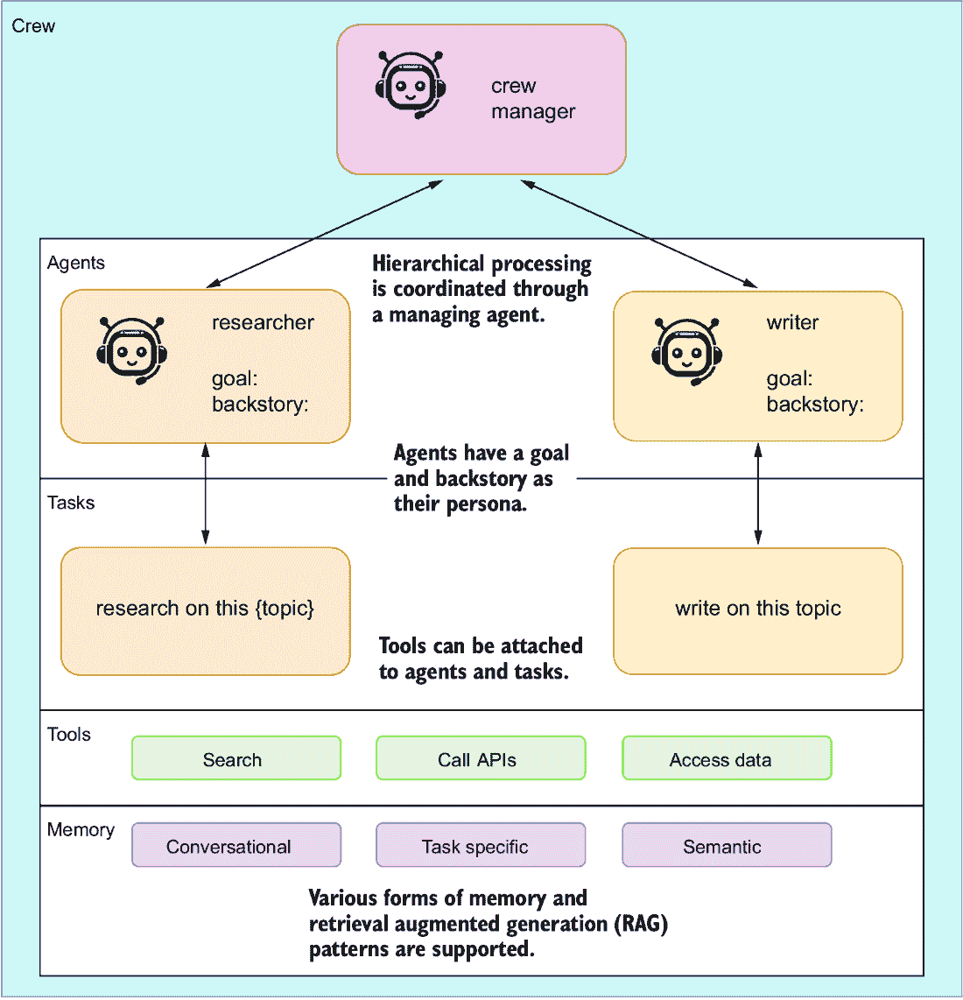
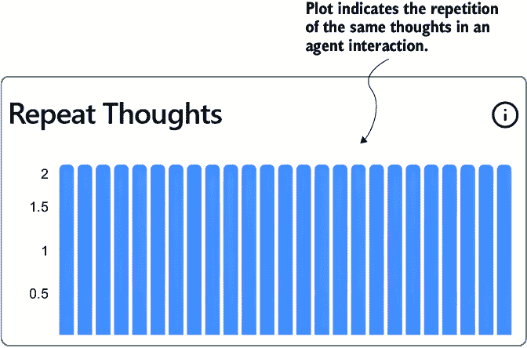

# 4 探索多智能体系统

### 本章涵盖

+   使用 AutoGen Studio 构建多智能体系统

+   构建一个简单的多智能体系统

+   创建能够在群聊中协同工作的智能代理

+   使用 CrewAI 构建智能代理团队和多智能体系统

+   使用 CrewAI 扩展智能代理数量并探索处理模式

现在，让我们从 AutoGen 到 CrewAI 进行一次旅行，这两个都是成熟的智能代理平台。我们将从 AutoGen 开始，这是一个支持多个智能代理并为他们提供工作室的微软项目。我们将探索一个名为 AutoGen 的微软项目，它支持多个智能代理，同时也提供了一个工作室来简化与智能代理一起工作的过程。从那里，我们将进行更多关于 AutoGen 智能代理的编码实践，以使用对话和群聊协作来解决任务。

然后，我们将过渡到 CrewAI，这是一个自提出的企业级智能代理系统，它采用了一种不同的方法。CrewAI 平衡了基于角色的和自主的智能代理，这些代理可以具有顺序或分层灵活的任务管理系统。我们将探讨 CrewAI 如何解决多样化和复杂的问题。

多智能体系统结合了许多单智能体系统使用的工具，但得益于能够向其他智能代理提供外部反馈和评估的能力。这种内部支持并批评智能代理解决方案的能力赋予了多智能体系统更多的力量。我们将探讨多智能体系统的介绍，下一节将从 AutoGen Studio 开始。

## 4.1 使用 AutoGen Studio 介绍多智能体系统

AutoGen Studio 是一个强大的工具，它背后使用多个智能代理来解决用户指定的任务和问题。这个工具已被用于开发本书中的一些更复杂的代码。因此，它是一个实践多智能体系统的优秀入门。

图 4.1 展示了 AutoGen 使用的智能体连接/通信模式的示意图。AutoGen 是一个对话式多智能体平台，因为通信是通过自然语言进行的。自然语言对话似乎是智能体通信的最自然模式，但并非唯一方法，正如你稍后将会看到的。



##### 图 4.1 AutoGen 智能体如何通过对话进行通信（来源：AutoGen）

AutoGen 支持各种对话模式，从群组和分层到更常见和简单的代理通信。在代理通信中，一个智能代理充当代理，并将通信引导到相关的智能代理以完成任务。代理类似于接受订单并将其传递给厨房的侍者，厨房负责烹饪食物。然后，侍者将烹饪好的食物上桌。

AutoGen 的基本模式使用一个`UserProxy`和一个或多个助手代理。图 4.2 显示了用户代理从人类那里获得指示，然后指导一个被授权编写代码以执行任务的助手代理。每次助手完成一个任务时，代理代理都会进行审查、评估并提供反馈给助手。这个迭代循环会一直持续到代理对结果满意为止。


##### 图 4.2 用户代理代理和助手代理的通信（来源：AutoGen）

代理的好处是它旨在替代所需的人类反馈和评估，并且在大多数情况下，它做得很好。虽然它不能消除对人类反馈和评估的需求，但它总体上产生了更完整的结果。而且，虽然迭代循环耗时，但这是您可以用来喝咖啡或处理其他任务的时间。

AutoGen Studio 是由 AutoGen 团队开发的一个工具，它为可对话代理提供了一个有用的介绍。在下一个练习中，我们将安装 Studio 并运行一些实验，以查看该平台的表现如何。这些工具仍在快速开发周期中，所以如果您遇到任何问题，请查阅 AutoGen GitHub 仓库上的文档。

### 4.1.1 安装和使用 AutoGen Studio

在 Visual Studio Code（VS Code）中打开`chapter_04`文件夹，创建一个本地 Python 虚拟环境，并安装`requirements.txt`文件。如果您需要帮助，请参阅附录 B 以安装本章的所有练习要求。

在 VS Code 中打开终端（Ctrl-`, Cmd-`），指向您的虚拟环境，并使用列表 4.1 中显示的命令运行 AutoGen Studio。您首先需要为您的 OpenAI 密钥定义一个环境变量。因为 8080 和 8081 端口很受欢迎，如果您有其他服务正在运行，请将端口更改为 8082 或您选择的任何端口。

##### 列表 4.1 启动 AutoGen Studio

```py
# set environment variable on Bash (Git Bash)
export OPENAI_API_KEY=”<your API key>”          #1

# sent environment variable with PowerShell
$env:VAR_NAME =”<your API key>"                #1

autogenstudio ui --port 8081     #2
```

#1 使用适合您终端类型的适当命令。

#2 如果您预计或遇到机器上的冲突，请更改端口。

将您的浏览器导航到图 4.3 中显示的 AutoGen Studio 界面（截至本文撰写时）。虽然可能会有所不同，但有一点可以肯定：主界面仍然将是聊天界面。输入一个需要编码的复杂任务。这里使用的示例是`创建`一个`显示`“GPT 代理”在`谷歌搜索`中`流行度`的`图表`。


##### 图 4.3 在 AutoGen 界面中为代理输入要执行的任务

代理助手在代理通过示例中的任务协同工作时生成代码片段以执行或完成各种子任务。然后，用户代理尝试执行这些代码片段并评估输出。在许多情况下，证明代码运行并产生所需输出就足以让用户代理批准任务的完成。

如果您在助手代理请求中遇到任何问题，请要求代理尝试不同的方法或另一个问题。这突显了使用已过期且不再工作的包或库的代理系统的一个更大的问题。因此，通常更好的做法是让代理执行行动，而不是构建代码作为工具来执行行动。

提示：建议使用 Docker 执行 AutoGen 和 AutoGen Studio，尤其是在处理可能影响操作系统的代码时。Docker 可以隔离和虚拟化代理的环境，从而隔离可能有害的代码。使用 Docker 可以帮助缓解可能阻止代理进程运行的任何次要窗口或网站。

图 4.4 显示了代理完成任务的输出。代理将收集任何生成的代码片段、图像或其他文档，并将它们附加到消息中。您还可以通过打开“代理消息”展开器来回顾代理对话。在许多情况下，如果您要求代理生成图表或应用程序，将打开次要窗口以显示这些结果。



##### 图 4.4 代理完成任务后的输出

令人惊讶的是，代理将很好地执行大多数任务并完成它们。根据任务的复杂程度，您可能需要与代理进一步迭代。有时，代理可能只能完成一项任务，因为它缺乏所需的技能。在下一节中，我们将探讨如何向代理添加技能。

### 4.1.2 在 AutoGen Studio 中添加技能

技能和工具，或我们在这本书中称之为“行动”，是代理扩展自己的主要手段。行动赋予代理执行代码、调用 API 或进一步评估和检查生成输出的能力。AutoGen Studio 目前仅开始于一组基本的工具，用于获取网页内容或生成图像。

注意：许多代理系统采用允许代理编码以解决问题目标的做法。然而，我们发现代码容易被破解，需要维护，并且可能快速变化。因此，正如我们将在后续章节中讨论的，为代理提供技能/行动/工具以解决问题会更好。

在以下练习场景中，我们将使用 OpenAI 视觉模型添加一个检查图像的技能/行动。这将允许代理在请求助手生成具有特定内容的图像时提供反馈。

当 AutoGen Studio 运行时，转到“构建”选项卡，点击“技能”，如图 4.5 所示。然后，点击“新建技能”按钮打开一个代码面板，您可以将代码复制粘贴到其中。从该选项卡，您还可以配置模型、代理和代理工作流程。



##### 图 4.5 在“构建”选项卡上创建新技能的步骤

输入列表 4.2 中所示的代码，并在本书的源代码中作为`describe_image.py`提供。将此代码复制粘贴到编辑器窗口中，然后点击底部的“保存”按钮。

##### 列表 4.2 `describe_image.py`

```py
import base64
import requests
import os

def describe_image(image_path='animals.png') -> str:
    """
    Uses GPT-4 Vision to inspect and describe the contents of the image.

    :param input_path: str, the name of the PNG file to describe.
    """
    api_key = os.environ['OPEN_API_KEY']

    # Function to encode the image
    def encode_image(image_path):      #1
        with open(image_path, "rb") as image_file:
            return base64.b64encode(image_file.read()).decode('utf-8')
    # Getting the base64 string
    base64_image = encode_image(image_path)

    headers = {
    "Content-Type": "application/json",
    "Authorization": f"Bearer {api_key}"
    }

    payload = {
    "model": "gpt-4-turbo",
    "messages": [
        {
        "role": "user",
        "content": [
            {
            "type": "text",
            "text": "What’s in this image?"
            },
            {
            "type": "image_url",
            "image_url": {
         "url": f"data:image/jpeg;base64,{base64_image}"      #2
            }
            }
        ]
        }
    ],
    "max_tokens": 300
    }

    response = requests.post(
        "https://api.openai.com/v1/chat/completions",
        headers=headers,
        json=payload)

    return response.json()["choices"][0]["message"]  #3
["content"]                                          #3
```

#1 函数：加载和编码图像为 Base64 字符串

#2 在 JSON 有效负载中包括图像字符串

#3 解包响应并返回回复的内容

`describe_image` 函数使用 OpenAI GPT-4 视觉模型来描述图像中的内容。这项技能可以作为质量评估与现有的 `generate_image` 技能配对。代理可以确认生成的图像符合用户的要求。

技能添加后，必须将其添加到特定的代理工作流程和代理中以便使用。图 4.6 展示了在通用或默认代理工作流程中将新技能添加到主要助手代理的过程。


##### 图 4.6 配置主要助手代理的新技能

现在技能已经添加到主要助手，我们可以要求代理创建一个特定的图像，并使用新的 `describe_image` 技能进行验证。由于图像生成器在处理正确文本方面众所周知地存在困难，我们将创建一个练习任务来完成这项工作。

输入列表 4.3 中显示的文本，以提示代理为这本书创建一个书封面图像。我们将明确指出文本需要正确无误，并坚持要求代理使用新的 `describe_image` 函数来验证图像。

##### 列表 4.3 提示创建书封面

```py
Please create a cover for the book GPT Agents In Action, use the 
describe_image skill to make sure the title of the book is spelled 
correctly on the cover
```

输入提示后，等待一段时间，你可能会看到一些关于图像生成和验证过程的对话。然而，如果一切正常，代理最终将返回图 4.7 中显示的结果。



##### 图 4.7 代理在图像生成任务上的生成文件输出

值得注意的是，代理协调在仅几次迭代中就完成了任务。除了图像外，你还可以看到为辅助任务完成而生成的一些各种辅助代码片段。AutoGen Studio 在其能够集成代理可以进一步适应以完成某些目标的能力方面给人留下深刻印象。下一节将展示如何用代码实现这些强大的代理。

## 4.2 探索 AutoGen

虽然 AutoGen Studio 是理解多人代理系统的一个出色工具，但我们必须查看代码。幸运的是，使用 AutoGen 编写多个代理示例既简单又容易运行。我们将在下一节中介绍基本的 AutoGen 设置。

### 4.2.1 安装和消费 AutoGen

下一个练习将探讨编写一个基本的多人代理系统，该系统使用用户代理和可对话的代理。在我们这样做之前，我们想要确保 AutoGen 已经正确安装和配置。

在 VS Code 中打开一个终端，按照附录 B 中的说明运行整个第四章安装指令，或者运行列表 4.4 中的 `pip` 命令。如果你已经安装了 `requirements.txt` 文件，你也将准备好运行 AutoGen。

##### 列表 4.4 安装 AutoGen

```py
pip install pyautogen
```

接下来，将`chapter_04/OAI_CONFIG_LIST.example`复制到`OAI_CONFIG_LIST`，从文件名中删除`.example`。然后，在 VS Code 中打开新文件，并在列表 4.5 中的`OAI_CONFIG_LIST`文件中输入您的 OpenAI 或 Azure 配置。根据您的 API 服务要求填写 API 密钥、模型和其他详细信息。AutoGen 将与遵循 OpenAI 客户端的任何模型一起工作。这意味着您可以通过 LM Studio 或其他服务（如 Groq、Hugging Face 等）使用本地 LLM。

##### 列表 4.5 `OAI_CONFIG_LIST`

```py
[
    {
        "model": "gpt-4",                     #1
        "api_key": "<your OpenAI API key here>",            #2
        "tags": ["gpt-4", "tool"]
    },
    {
        "model": "<your Azure OpenAI deployment name>",      #3
        "api_key": "<your Azure OpenAI API key here>",      #4
        "base_url": "<your Azure OpenAI API base here>",     #5
        "api_type": "azure",
        "api_version": "2024-02-15-preview"
    }    
]
```

#1 选择模型；推荐使用 GPT-4。

#2 使用您通常使用的服务密钥。

#3 选择模型；推荐使用 GPT-4。

#4 使用您通常使用的服务密钥。

#5 更改基本 URL 允许您指向其他服务，而不仅仅是 Azure OpenAI。

现在，我们可以查看使用现成的`UserProxy`和`ConversableAgent`代理进行基本多代理聊天的代码。在 VS Code 中打开`autogen_start.py`，如下所示列表，并在运行文件之前查看相关部分。

##### 列表 4.6 `autogen_start.py`

```py
from autogen import ConversableAgent, UserProxyAgent, config_list_from_json

   config_list = config_list_from_json(
        env_or_file="OAI_CONFIG_LIST")      #1

   assistant = ConversableAgent(
        "agent", 
        llm_config={"config_list": config_list})      #2

   user_proxy = UserProxyAgent(      #3
        "user",
        code_execution_config={
            "work_dir": "working",
            "use_docker": False,
        },
        human_input_mode="ALWAYS",
        is_termination_msg=lambda x: x.get("content", "")
        .rstrip()
        .endswith("TERMINATE"),      #4
    )    
    user_proxy.initiate_chat(assistant, message="write a solution 
↪ for fizz buzz in one line?")     #5
```

#1 从 JSON 文件 OAI_CONFIG_LIST 加载您的 LLM 配置。

#2 此代理直接与 LLM（大型语言模型）进行交流。

#3 此代理代理用户与助手之间的对话。

#4 设置终止消息允许代理迭代。

#5 通过 user_proxy 与助手发起聊天以完成任务。

通过在 VS Code 的调试器中运行文件（F5）来运行代码。列表 4.6 中的代码使用一个简单的任务来演示代码编写。列表 4.7 展示了几个可供选择示例。这些编码任务也是作者评估 LLM 在编码能力上的常规基准之一。

##### 列表 4.7 简单编码任务示例

```py
write a Python function to check if a number is prime
code a classic sname game using Pygame                   #1
code a classic asteroids game in Python using Pygame  #1
```

#1 要享受对这些任务进行迭代的乐趣，请在 Windows 上使用 Windows Subsystem for Linux (WSL)，或使用 Docker。

几秒钟后代码开始运行，助手将向代理提供一个解决方案。此时，代理将提示您提供反馈。按 Enter 键，实际上是没有提供反馈，这将提示代理运行代码以验证其是否按预期运行。

令人印象深刻的是，代理甚至可以获取提示来安装所需的包，例如 Pygame。然后它会运行代码，您将在终端或新窗口或浏览器中看到输出。如果代码在新的窗口/浏览器中打开，您可以玩游戏或使用界面。

注意，在 Windows 上，生成的窗口/浏览器不会关闭，并且需要退出整个程序。为了避免这个问题，请通过 Windows Subsystem for Linux (WSL)或 Docker 运行代码。AutoGen 明确建议使用 Docker 作为代码执行代理，如果您熟悉容器，这是一个不错的选择。

无论哪种方式，在代理生成和运行代码后，列表 4.6 中之前设置的 `working_dir` 文件夹现在应该有一个包含代码的 Python 文件。这将允许你随意运行代码，进行更改，甚至要求改进，正如我们将看到的。在下节中，我们将探讨如何提高编码代理的能力。

### 4.2.2 使用代理评论家增强代码输出

多代理系统的一个强大优势是，在完成任务时可以自动分配多个角色/角色。生成或帮助编写代码可以是任何开发者的一个极好的优势，但如果该代码也被审查和测试呢？在下一个练习中，我们将向我们的代理系统添加另一个代理评论家来帮助编码任务。打开 `autogen_coding_critic.py`，如下列所示。

##### 列表 4.8 `autogen_coding_critic.py`

```py
from autogen import AssistantAgent, UserProxyAgent, config_list_from_json

config_list = config_list_from_json(env_or_file="OAI_CONFIG_LIST")

user_proxy = UserProxyAgent(
    "user",
    code_execution_config={
        "work_dir": "working",
        "use_docker": False,
        "last_n_messages": 1,
    },
    human_input_mode="ALWAYS",
    is_termination_msg=lambda x: 
x.get("content", "").rstrip().endswith("TERMINATE"),
)

engineer = AssistantAgent(
    name="Engineer",
    llm_config={"config_list": config_list},
    system_message="""
    You are a profession Python engineer, known for your expertise in 
software development.
    You use your skills to create software applications, tools, and 
games that are both functional and efficient.
    Your preference is to write clean, well-structured code that is easy 
to read and maintain.    
    """,      #1
)

critic = AssistantAgent(
    name="Reviewer",
    llm_config={"config_list": config_list},
    system_message="""
    You are a code reviewer, known for your thoroughness and commitment 
to standards.
    Your task is to scrutinize code content for any harmful or 
substandard elements.
    You ensure that the code is secure, efficient, and adheres to best 
practices.
    You will identify any issues or areas for improvement in the code 
and output them as a list.
    """,      #2
)

def review_code(recipient, messages, sender, config):      #3
    return f"""
            Review and critque the following code.

            {recipient.chat_messages_for_summary(sender)[-1]['content']}
            """                       #3                    

user_proxy.register_nested_chats(      #4
    [
        {
            "recipient": critic,
            "message": review_code,
            "summary_method": "last_msg",
            "max_turns": 1,
        }
    ],
    trigger=engineer,                 #4
)
task = """Write a snake game using Pygame."""

res = user_proxy.initiate_chat(
    recipient=engineer, 
    message=task, 
    max_turns=2, 
    summary_method="last_msg"      #5
)
```

#1 这次，助手被给予一个系统/角色消息。

#2 创建了一个具有背景的第二个助手评论家代理。

#3 一个自定义函数帮助提取评论家审查的代码。

#4 评论家和工程师之间创建了一个嵌套聊天。

#5 代理代理以最大延迟和明确的摘要方法启动聊天。

在 VS Code 中以调试模式运行 `autogen_coding_critic.py` 文件，并观察代理之间的对话。这次，在代码返回后，评论家也会被触发进行响应。然后，评论家会添加注释和建议来改进代码。

嵌套聊天对于支持和控制代理交互效果很好，但我们在下节中会看到一个更好的方法。在此之前，我们将在下一节中回顾 AutoGen 缓存的重要性。

### 4.2.3 理解 AutoGen 缓存

作为可对话的多代理平台，AutoGen 在聊天迭代中可能会消耗许多令牌。如果你要求 AutoGen 通过复杂或新颖的问题，你甚至可能会在 LLM 上遇到令牌限制；因此，AutoGen 支持几种减少令牌使用的方法。

AutoGen 使用缓存来存储进度并减少令牌使用。缓存默认启用，你可能已经遇到过。如果你检查当前工作文件夹，你会注意到一个 `.cache` 文件夹，如图 4.8 所示。缓存允许代理在被打断后继续对话。



##### 图 4.8 AutoGen 缓存和工作文件夹

在代码中，你可以控制代理运行的缓存文件夹，如图 4.9 所示。通过将 `initiate_chat` 调用用 `with` 语句包装，你可以控制缓存的位置和种子。这将允许你通过仅设置前一个缓存的 `cache_seed` 来保存并返回未来的长时间运行的 AutoGen 任务。

##### 列表 4.9 设置缓存文件夹

```py
with Cache.disk(cache_seed=42) as cache:     #1
    res = user_proxy.initiate_chat(
        recipient=engineer,
        message=task,
        max_turns=2,
        summary_method="last_msg",
        cache=cache,      #2
    )
```

#1 设置 seed_cache 表示单个位置。

#2 将缓存作为参数设置

这种缓存能力允许你从之前的缓存位置继续操作并捕获之前的运行。这也可以是一种展示和检查代理对话如何生成结果的好方法。在下一节中，我们将探讨另一种 AutoGen 支持的群聊对话模式。

## 4.3 与代理和 AutoGen 的群聊

聊天委托和嵌套聊天或对话的一个问题是信息的传达。如果你曾经玩过电话游戏，你亲自见证了这一点，并体验到了信息在迭代中如何迅速变化。对于代理来说，这当然也不例外，通过嵌套或顺序对话聊天可以改变任务甚至期望的结果。

##### 电话游戏

电话游戏是一种既有趣又有教育意义的游戏，它展示了信息和连贯性的丧失。孩子们排成一排，第一个孩子只能听到一个信息。然后，孩子们轮流将信息口头传递给下一个孩子，以此类推。最后，最后一个孩子将信息宣布给整个小组，通常这个信息与最初的信息相差甚远。

为了应对这一点，AutoGen 提供了一个群聊机制，通过这个机制代理可以参与共享对话。这允许代理回顾所有过去的对话，并在长期和复杂任务上更好地协作。

图 4.9 显示了嵌套群聊和协作群聊之间的差异。我们在上一节中使用了嵌套聊天功能来构建嵌套代理聊天。在本节中，我们使用群聊来提供更协作的体验。



##### 图 4.9 可对话代理的嵌套群聊与群聊之间的差异

打开`autogen_coding_group.py`，查看列表 4.10 中的相关部分。代码与之前的练习类似，但现在引入了`GroupChat`和`GroupChatManager`。代理和消息都存储在群聊中，类似于 Slack 或 Discord 等应用中的消息频道。聊天管理器协调消息响应以减少对话重叠。

##### 列表 4.10 `autoget_coding_group.py`（相关部分）

```py
user_proxy = UserProxyAgent(
    "user",
    code_execution_config={
        "work_dir": "working",
        "use_docker": False,
        "last_n_messages": 3,
    },
    human_input_mode="NEVER",     #1
)

llm_config = {"config_list": config_list}

engineer = AssistantAgent(…      #2

critic = AssistantAgent(…       #2

groupchat = GroupChat(agents=[user_proxy, 
                              engineer, 
                              critic], 
                              messages=[], 
                              max_round=20)      #3
manager = GroupChatManager(groupchat=groupchat, 
                           llm_config=llm_config)     #4

task = """Write a snake game using Pygame."""

with Cache.disk(cache_seed=43) as cache:
    res = user_proxy.initiate_chat(
        recipient=manager,
        message=task,
        cache=cache,
    )
```

#1 人类输入现在设置为永不，因此没有人类反馈。

#2 代码省略，但请参考文件中角色的更改

#3 此对象持有所有代理的连接并存储消息。

#4 管理员作为调解者一样协调对话。

运行这个练习，你会看到代理是如何协作的。工程师现在将从评论者那里获取反馈并执行操作以解决评论者的建议。这也允许代理参与所有对话。

群组对话是加强代理协作能力的好方法，因为它们在完成任务时进行协作。然而，它们也更为冗长且代价高昂。当然，随着大型语言模型（LLMs）的成熟，它们的上下文标记窗口的大小和标记处理的价格也在增加。随着标记窗口的增加，对标记消耗的担忧可能会最终消失。

AutoGen 是一个强大的多代理平台，可以通过网页界面或代码体验。无论你的偏好如何，这个代理协作工具是构建代码或其他复杂任务的优秀平台。当然，它并不是唯一的平台，正如你将在下一节中看到的，我们将探索一个新来者，即 CrewAI。

## 4.4 使用 CrewAI 构建代理团队

CrewAI 在多代理系统领域相对较新。AutoGen 最初是从研究中发展起来的，然后进行了扩展，而 CrewAI 是以企业系统为前提构建的。因此，该平台在某种程度上更健壮，但在某些方面不太容易扩展。

使用 CrewAI，你可以构建一个专注于特定任务目标的代理团队。与 AutoGen 不同，CrewAI 不需要使用用户代理代理，而是假设代理只在自己之间工作。

图 4.10 展示了 CrewAI 平台的主要元素，它们如何连接在一起以及它们的主要功能。它展示了一个具有通用研究人员和作家代理的顺序处理代理系统。代理被分配的任务可能包括工具或记忆来协助它们。



##### 图 4.10 CrewAI 系统的组成

CrewAI 支持两种主要的处理形式：顺序和分层。图 4.10 通过迭代给定的代理及其相关任务来展示顺序处理过程。在下一节中，我们将深入研究一些代码来设置团队并使用它来完成目标并创造一个有趣的笑话。

### 4.4.1 创建一个由 CrewAI 代理组成的玩笑者团队

与 AutoGen 相比，CrewAI 需要更多的设置，但这也允许更多的控制和额外的指南，这些指南提供了更具体的上下文来指导代理完成给定的任务。这并非没有问题，但它确实提供了比 AutoGen 更多的控制。

在 VS Code 中打开 `crewai_introduction.py` 并查看列表 4.11 所示的顶部部分。配置代理需要许多设置，包括角色、目标、冗长性、记忆、前传、委派，甚至工具（未显示）。在这个例子中，我们使用了两个代理：一个高级玩笑研究人员和一个玩笑作家。

##### 列表 4.11 `crewai_introduction.py`（代理部分）

```py
from crewai import Agent, Crew, Process, Task
from dotenv import load_dotenv

load_dotenv()

joke_researcher = Agent(      #1
    role="Senior Joke Researcher",
    goal="Research what makes things funny about the following {topic}",
    verbose=True,      #2
    memory=True,      #3
    backstory=(      #4
        "Driven by slapstick humor, you are a seasoned joke researcher"
        "who knows what makes people laugh. You have a knack for finding"
        "the funny in everyday situations and can turn a dull moment into"
        "a laugh riot."
    ),
    allow_delegation=True,     #5
)

joke_writer = Agent(     #6
    role="Joke Writer",
    goal="Write a humourous and funny joke on the following {topic}",
    verbose=True,     #7
    memory=True,      #8
    backstory=(     #9
        "You are a joke writer with a flair for humor. You can turn a"
        "simple idea into a laugh riot. You have a way with words and"
        "can make people laugh with just a few lines."
    ),
    allow_delegation=False,    #5
)
```

#1 创建代理并为他们提供一个目标

#2 verbose 允许代理向终端输出输出。

#3 支持代理使用内存

#4 前传是代理的背景——其角色。

#5 代理可以被委派或允许委派；True 表示它们可以委派。

#6 创建代理并为他们提供一个目标

#7 verbose 允许代理向终端输出。

#8 支持代理使用内存

#9 前传故事是代理的背景——其角色。

在代码中向下移动，我们接下来看到的是任务，如列表 4.12 所示。任务表示代理完成主要系统目标的过程。它们还链接代理以执行特定任务，定义该任务的输出，并可能包括其执行方式。

##### 列表 4.12 `crewai_introduction.py`（任务部分）

```py
research_task = Task(         #1
    description=(
        "Identify what makes the following topic:{topic} so funny."
        "Be sure to include the key elements that make it humourous."
        "Also, provide an analysis of the current social trends,"
        "and how it impacts the perception of humor."
    ),
    expected_output="A comprehensive 3 paragraphs long report 
↪     on the latest jokes.",               #2
    agent=joke_researcher,      #3
)

write_task = Task(   #4
    description=(
        "Compose an insightful, humourous and socially aware joke on {topic}."
        "Be sure to include the key elements that make it funny and"
        "relevant to the current social trends."
    ),
    expected_output="A joke on {topic}.",   #5
    agent=joke_writer,        #3
    async_execution=False,          #6
    output_file="the_best_joke.md",      #7
)
```

#1 任务描述定义了代理如何完成任务。

#2 明确定义执行任务时的预期输出

#3 被分配执行任务的代理

#4 任务描述定义了代理如何完成任务。

#5 明确定义执行任务时的预期输出

#6 如果代理应该异步执行

#7 代理将生成的任何输出

现在，我们可以看到所有内容是如何在文件底部的 `Crew` 中汇集起来的，如列表 4.13 所示。同样，在构建 `Crew` 时可以设置许多选项，包括代理、任务、进程类型、内存、缓存、每分钟最大请求数（`max_rpm`）以及机组人员是否共享。

##### 列表 4.13 `crewai_introduction.py`（机组部分）

```py
crew = Crew(
    agents=[joke_researcher, joke_writer],    #1
    tasks=[research_task, write_task],     #2
    process=Process.sequential,      #3
    memory=True,      #4
    cache=True,     #5
    max_rpm=100,     #6
    share_crew=True,     #7
)

result = crew.kickoff(inputs={"topic": "AI engineer jokes"})
print(result)
```

#1 组装进机组的人员

#2 代理可以执行的任务

#3 定义代理如何交互

#4 是否应该使用内存；如果代理/任务有，则需要设置

#5 系统是否应该使用缓存，类似于 AutoGen

#6 每分钟系统应限制的最大请求数

#7 是否应该让机组人员共享信息，类似于群聊

当你完成审查后，在 VS Code 中运行文件（F5），并观察终端中的机组人员对话和消息。正如你现在可能已经察觉到的，这个代理系统的目标是制作与人工智能工程相关的笑话。以下是几次运行代理系统生成的几个有趣的笑话：

+   为什么电脑会冷？因为它留下了 Windows。

+   为什么人工智能工程师不和他们自己的算法玩捉迷藏？因为无论他们藏在哪里，算法总是在“过拟合”房间里找到他们！

+   人工智能工程师最喜欢的歌曲是什么？“我刚刚打电话来说我爱你……并且为了收集更多数据用于我的语音识别软件。”

+   为什么人工智能工程师会破产？因为他把所有的钱都花在了饼干上，但他的浏览器一直在吃它们。

在运行更多笑话机组迭代之前，你应该阅读下一节。本节展示了如何向多代理系统添加可观察性。

### 4.4.2 通过 AgentOps 观察代理的工作

观察一个复杂集合，如多代理系统，对于理解可能发生的各种问题至关重要。通过应用程序跟踪进行可观察性是任何复杂系统的关键元素，尤其是那些在企业中使用的系统。

CrewAI 支持连接到一个专门称为 AgentOps 的操作平台。这个可观察性平台是通用的，旨在支持任何特定于 LLM 使用的代理平台的可观察性。目前，没有提供定价或商业化细节。

连接到 AgentOps 就像安装包、获取 API 密钥以及在团队设置中添加一行代码一样简单。接下来的练习将介绍连接和运行 AgentOps 的步骤。

列表 4.14 展示了使用`pip`安装`agentops`包的过程。你可以单独安装该包，或者将其作为`crewai`包的附加组件安装。记住，AgentOps 也可以连接到其他代理平台以实现可观察性。

##### 列表 4.14 安装 AgentOps

```py
pip install agentops

or as an option with CrewAI

pip install crewai[agentops]
```

在使用 AgentOps 之前，你需要注册一个 API 密钥。以下是在撰写本文时注册密钥的一般步骤：

1.  在你的浏览器中访问[`app.agentops.ai`](https://app.agentops.ai)。

1.  注册一个账户。

1.  创建一个项目，或使用默认设置。

1.  前往设置 > 项目和 API 密钥。

1.  复制或生成一个新的 API 密钥；这将把密钥复制到你的浏览器中。

1.  将密钥粘贴到你的项目中的`.env`文件。

在复制 API 密钥后，它应该类似于以下列表中所示示例。

##### 列表 4.15 `env.`：添加 AgentOps 密钥

```py
AGENTOPS_API_KEY="your API key"
```

现在，我们需要在 CrewAI 脚本中添加几行代码。列表 4.16 展示了添加到`crewai_agentops.py`文件中的内容。当你创建自己的脚本时，你所需要做的就是添加`agentops`包，并在使用 CrewAI 时初始化它。

##### 列表 4.16 `crewai_agentops.py`（AgentOps 添加）

```py
import agentops      #1
from crewai import Agent, Crew, Process, Task
from dotenv import load_dotenv

load_dotenv()
agentops.init()     #2
```

#1 添加所需的包

#2 确保在加载环境变量后初始化包。

在 VS Code 中运行`crewai_agentops.py`文件（按 F5），并观察代理像以前一样工作。然而，你现在可以进入 AgentOps 仪表板并查看不同级别的代理交互。

图 4.11 展示了运行玩笑团队以创建最佳玩笑的仪表板。包括总时长、运行环境、提示和完成令牌、LLM 调用时间以及预估成本等统计数据。看到成本既可能让人清醒，也可能表明代理对话可能多么冗长。


##### 图 4.11 运行玩笑团队的 AgentOps 仪表板

AgentOps 平台是任何代理平台的绝佳补充。虽然它内置在 CrewAI 中，但将可观察性添加到 AutoGen 或其他框架中也很有帮助。AgentOps 的另一个吸引人的特点是它专注于观察代理交互，而不是从机器学习操作平台转换而来。未来，我们可能会看到更多代理可观察性模式的诞生。

一个不容忽视的益处是，可观察性平台可以提供的成本观察。你注意到图 4.11 中创建一个笑话的成本略超过 50 美分吗？代理可以非常强大，但它们也可能变得非常昂贵，因此观察这些成本在实用性和商业化方面至关重要。

在本章的最后部分，我们将回到 CrewAI，重新探讨构建能够编写游戏的代理。这将提供 AutoGen 和 CrewAI 功能之间的一次优秀比较。

## 4.5 使用 CrewAI 重新探讨编码代理

比较多代理平台功能的一种好方法是在机器人中实现类似任务。在接下来的练习中，我们将使用 CrewAI 作为游戏编程团队。当然，这也可以适应其他编码任务。

在 VS Code 中打开 `crewai_coding_crew.py`，我们首先将回顾列表 4.17 中的代理部分。在这里，我们创建了一个高级工程师、一个 QA 工程师和一位首席 QA 工程师，并为他们分配了角色、目标和背景故事。

##### 列表 4.17 `crewai_coding_crew.py` (代理部分)

```py
print("## Welcome to the Game Crew")      #1
print("-------------------------------")
game = input("What is the game you would like to build?
↪ What will be the mechanics?\n")

senior_engineer_agent = Agent(
    role="Senior Software Engineer",
    goal="Create software as needed",
    backstory=dedent(
        """
        You are a Senior Software Engineer at a leading tech think tank.
        Your expertise in programming in python. and do your best to
        produce perfect code
        """
    ),
    allow_delegation=False,
    verbose=True,
)

qa_engineer_agent = Agent(
    role="Software Quality Control Engineer",
    goal="create prefect code, by analizing the code 
↪ that is given for errors",
    backstory=dedent(
        """
        You are a software engineer that specializes in checking code
        for errors. You have an eye for detail and a knack for finding
        hidden bugs.
        You check for missing imports, variable declarations, mismatched
        brackets and syntax errors.
        You also check for security vulnerabilities, and logic errors
        """
    ),
    allow_delegation=False,
    verbose=True,
)

chief_qa_engineer_agent = Agent(
    role="Chief Software Quality Control Engineer",
    goal="Ensure that the code does the job that it is supposed to do",
    backstory=dedent(
        """
        You are a Chief Software Quality Control Engineer at a leading
        tech think tank. You are responsible for ensuring that the code
        that is written does the job that it is supposed to do.
        You are responsible for checking the code for errors and ensuring
        that it is of the highest quality.
        """
    ),
    allow_delegation=True,     #2
    verbose=True,
)
```

#1 允许用户输入他们游戏的指令

#2 只有首席 QA 工程师可以委派任务。

在文件中向下滚动将显示代理任务，如图 4.18 列表所示。任务描述和预期输出应该很容易理解。同样，每个代理都有一个特定的任务，以便在工作时提供更好的上下文。

##### 列表 4.18 `crewai_coding_crew.py` (任务部分)

```py
code_task = Task(
    description=f"""
You will create a game using python, these are the instructions:
        Instructions
        ------------
        {game}             #1
        You will write the code for the game using python.""",
    expected_output="Your Final answer must be the 
↪ full python code, only the python code and nothing else.",
    agent=senior_engineer_agent,
)

qa_task = Task(
    description=f"""You are helping create a game 
↪ using python, these are the instructions:
        Instructions
        ------------
        {game}            #1
        Using the code you got, check for errors. Check for logic errors,
        syntax errors, missing imports, variable declarations, 
mismatched brackets,
        and security vulnerabilities.""",
    expected_output="Output a list of issues you found in the code.",
    agent=qa_engineer_agent,
)

evaluate_task = Task(
    description=f"""You are helping create a game 
↪ using python, these are the instructions:
        Instructions
        ------------
        {game}            #1
        You will look over the code to insure that it is complete and
        does the job that it is supposed to do. """,
    expected_output="Your Final answer must be the 
↪ corrected a full python code, only the python code and nothing else.",
    agent=chief_qa_engineer_agent,
)
```

#1 使用 Python 格式化将游戏指令替换到提示中。

最后，我们可以通过查看文件底部，如图 4.19 列表所示，来了解这一切是如何结合在一起的。这个队伍配置与我们之前看到的大致相同。每个代理和任务都被添加，以及详尽和过程属性。对于这个例子，我们将继续使用顺序方法。

##### 列表 4.19 `crewai_coding_crew.py` (队伍部分)

```py
crew = Crew(
    agents=[senior_engineer_agent, 
            qa_engineer_agent, 
            chief_qa_engineer_agent],
    tasks=[code_task, qa_task, evaluate_task],
    verbose=2,  
    process=Process.sequential,      #1
)

# Get your crew to work!
result = crew.kickoff()    #2

print("######################")
print(result)
```

#1 处理过程是顺序的。

#2 启动阶段没有提供额外的上下文。

当你运行 VS Code (F5) 文件时，系统会提示你输入编写游戏的指令。输入一些指令，比如蛇形游戏或你选择的另一个游戏。然后，让代理工作，并观察它们产生的结果。

随着首席 QA 工程师的加入，结果通常会优于使用 AutoGen 产生的结果，至少在初始阶段是这样。如果你审查代码，你会发现它通常遵循良好的模式，在某些情况下，甚至可能包括测试和单元测试。

在我们完成本章之前，我们将对队伍的处理模式进行最后一次修改。之前，我们采用了顺序处理，如图 4.10 所示。图 4.12 展示了在 CrewAI 中层级处理的样子。



##### 图 4.12 通过队伍管理器协调的代理的层级处理

添加这个经理是一个相对简单的过程。列表 4.20 显示了将编码船员以分层方法使用的新文件中的附加代码更改。除了从 LangChain 导入连接到 OpenAI 的类之外，另一个添加是将其作为船员经理`manager_llm`。

##### 列表 4.20 `crewai_hierarchy.py`（船员经理部分）

```py
from langchain_openai import ChatOpenAI      #1

crew = Crew(
    agents=[senior_engineer_agent, 
            qa_engineer_agent, 
            chief_qa_engineer_agent],
    tasks=[code_task, qa_task, evaluate_task],
    verbose=2,  
    process=Process.hierarchical,     #2
    manager_llm=ChatOpenAI(               #3
        temperature=0, model="gpt-4"      #3
    ),    #4
)         #4
```

#1 从 LangChain 导入 LLM 连接器

#2 在选择分层处理时，您必须设置一个船员经理。

#3 将船员经理设置为 LLM 连接器

#4 在选择分层处理时，您必须设置一个船员经理。

在 VS Code 中运行此文件（按 F5）。当提示时，输入您想要创建的游戏。尝试使用与 AutoGen 相同的游戏；蛇游戏也是一个很好的基线示例。观察代理如何通过代码并反复检查问题。

运行文件后，您还可以在 AgentOps 中查看此次运行的成本。很可能会超过没有代理管理器时的两倍。输出效果也可能不会显著提高。这就是在不了解事情如何迅速失控的情况下构建代理系统所陷入的陷阱。

当代理不断重复相同的动作时，经常发生的这种螺旋效应的一个例子是频繁重复的任务。您可以通过查看重复思考图来查看这个问题，如图 4.13 所示。



##### 图 4.13 代理运行中发生的思维重复

AgentOps 中的重复思考图是衡量您的代理系统遇到重复情况的一个绝佳方式。过于重复的思维模式通常意味着代理不够果断，而是在不断尝试生成不同的答案。如果您遇到这个问题，您可能需要改变代理的处理模式、任务和目标。您甚至可能想要改变系统的类型和代理的数量。

多代理系统是按工作模式和任务分配工作的一种极好方式。通常，工作角色分配给代理角色/人物，它需要完成的任务可能是隐性的，如 AutoGen 中所示，或者更明确，如 CrewAI 中所示。

在本章中，我们介绍了许多您可以直接使用的有用工具和平台，以改善您的工作、生活等。这完成了我们对多代理平台的探索之旅，但我们的探索和使用多代理的工作并未结束，正如我们将在后面的章节中发现的。

## 4.6 练习

使用以下练习来提高您对材料的了解：

+   *练习 1* — 使用 AutoGen 进行基本代理通信

*目标* — 在 AutoGen 中熟悉基本的代理通信和设置。

*任务*：

+   +   按照本章提供的说明，在您的本地机器上设置 AutoGen Studio。

    +   创建一个简单的多代理系统，包含一个用户代理和两个助手代理。

    +   实现一个基本任务，其中用户代理在助手代理之间协调以生成简单的文本输出，例如总结一段简短的段落。

+   *练习 2* — 在 AutoGen Studio 中实现高级代理技能

*目标* — 通过添加高级技能增强代理能力。

*任务*:

+   +   开发并集成一项新技能到 AutoGen 代理中，使其能够从公共 API（例如，天气信息或股票价格）获取并显示实时数据。

    +   确保代理可以询问用户偏好（例如，天气的城市，股票类型）并相应地显示获取的数据。

+   *练习 3* — 使用 CrewAI 进行基于角色的任务管理

*目标* — 探索 CrewAI 中的基于角色的任务管理。

*任务*:

+   +   设计一个 CrewAI 设置，其中多个代理被分配特定的角色（例如，数据收集器、分析器、报告生成器）。

    +   配置一个任务序列，其中数据收集器收集数据，分析器处理数据，报告生成器生成报告。

    +   执行序列并观察代理之间信息流和任务委派的流程。

+   *练习 4* — 使用 AutoGen 在群聊中进行多代理协作

*目标* — 理解和实现 AutoGen 中的群聊系统以促进代理协作。

*任务*:

+   +   设置一个场景，其中多个代理需要协作解决一个复杂问题（例如，为商务旅行规划行程）。

    +   使用群聊功能允许代理之间共享信息、提问和提供更新。

    +   监控代理在协作问题解决中的交互和有效性。

+   *练习 5* — 在 CrewAI 中使用 AgentOps 添加和测试可观察性

*目标* — 在 CrewAI 环境中使用 AgentOps 实现和评估代理的可观察性。

*任务*:

+   +   将 AgentOps 集成到 CrewAI 多代理系统中。

    +   设计一个涉及大量计算或数据处理（例如，分析客户评论以确定情感趋势）的任务。

    +   使用 AgentOps 监控代理的性能、成本和输出准确性。识别任何潜在的交互不效率或错误。

## 摘要

+   由微软开发的 AutoGen 是一个对话式多代理平台，它采用多种代理类型，如用户代理和助手代理，通过自然语言交互促进任务执行。

+   AutoGen Studio 作为一个开发环境，允许用户创建、测试和管理多代理系统，提高了 AutoGen 的可用性。

+   AutoGen 支持多种通信模式，包括群聊、层次化和代理通信。代理通信涉及一个主要代理（代理），它在用户和其他代理之间进行接口以简化任务完成。

+   CrewAI 提供了一种构建多代理系统的结构化方法，重点在于企业应用。它强调基于角色和自主代理的功能，允许灵活的、顺序的或层次化的任务管理。

+   本章中的实际练习说明了如何设置和使用 AutoGen Studio，包括安装必要的组件和运行基本的多人智能体系统。

+   AutoGen 中的智能体可以配备特定的技能来执行代码生成、图像分析和数据检索等任务，从而扩大其应用范围。

+   CrewAI 凭借其能够比 AutoGen 更严格地结构化智能体交互的能力而脱颖而出，这在需要精确和可控智能体行为的场景中可能具有优势。

+   CrewAI 支持将记忆和工具集成到智能体中，以便通过任务完成来消费。

+   CrewAI 支持与可观察性工具（如 AgentOps）集成，这些工具可以提供关于智能体性能、交互效率和成本管理的见解。

+   AgentOps 是一个智能体可观察性平台，可以帮助您轻松监控广泛的智能体交互。
