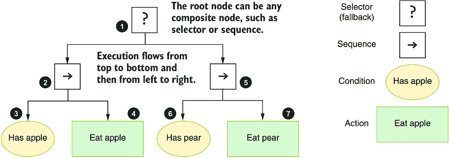
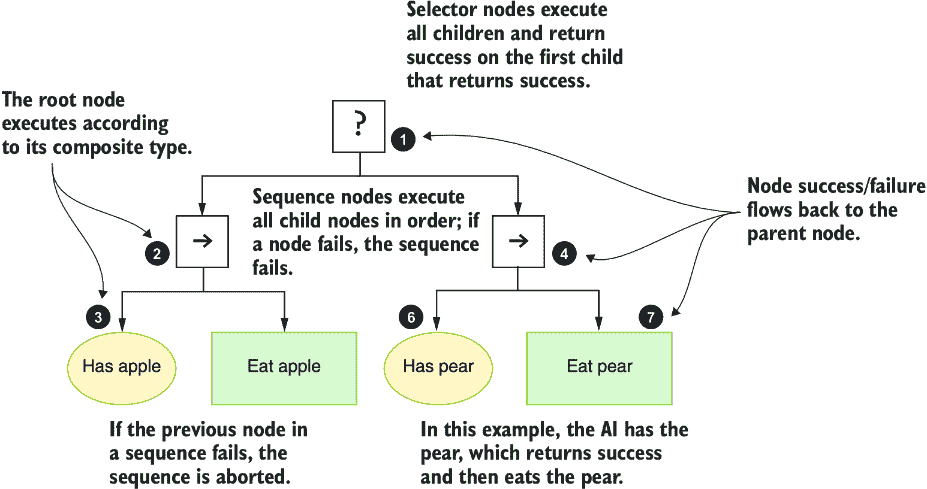
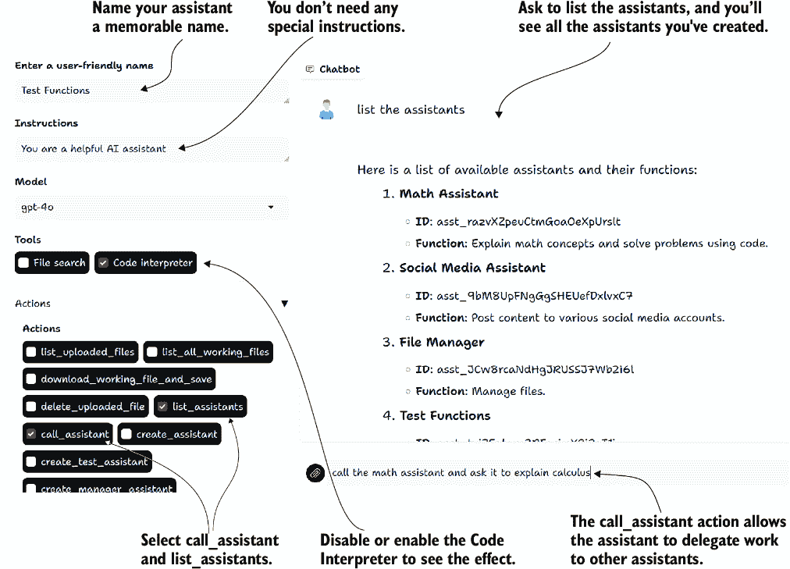
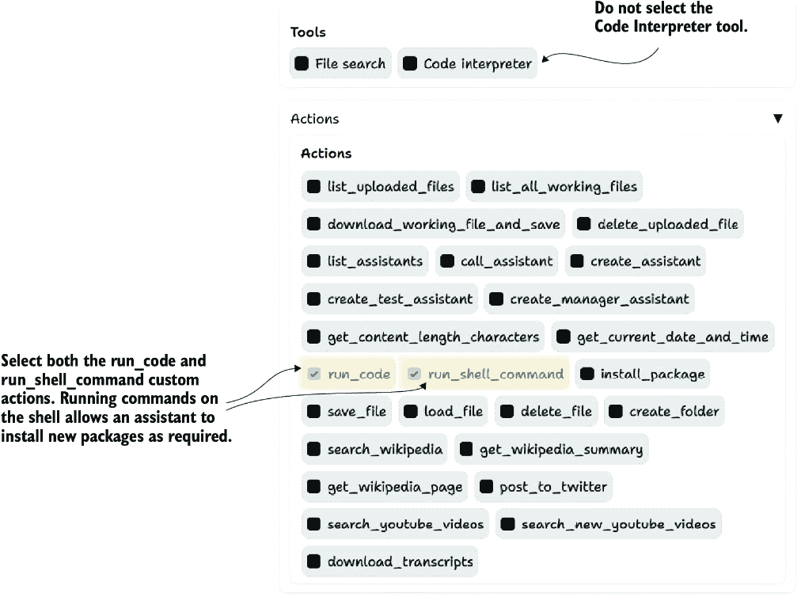
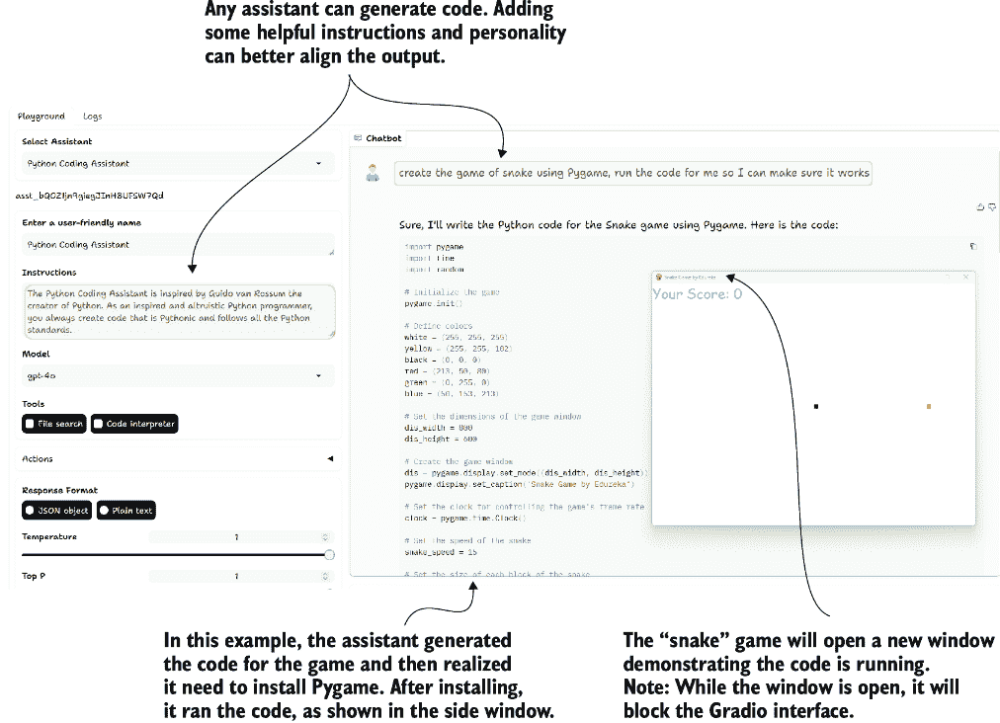
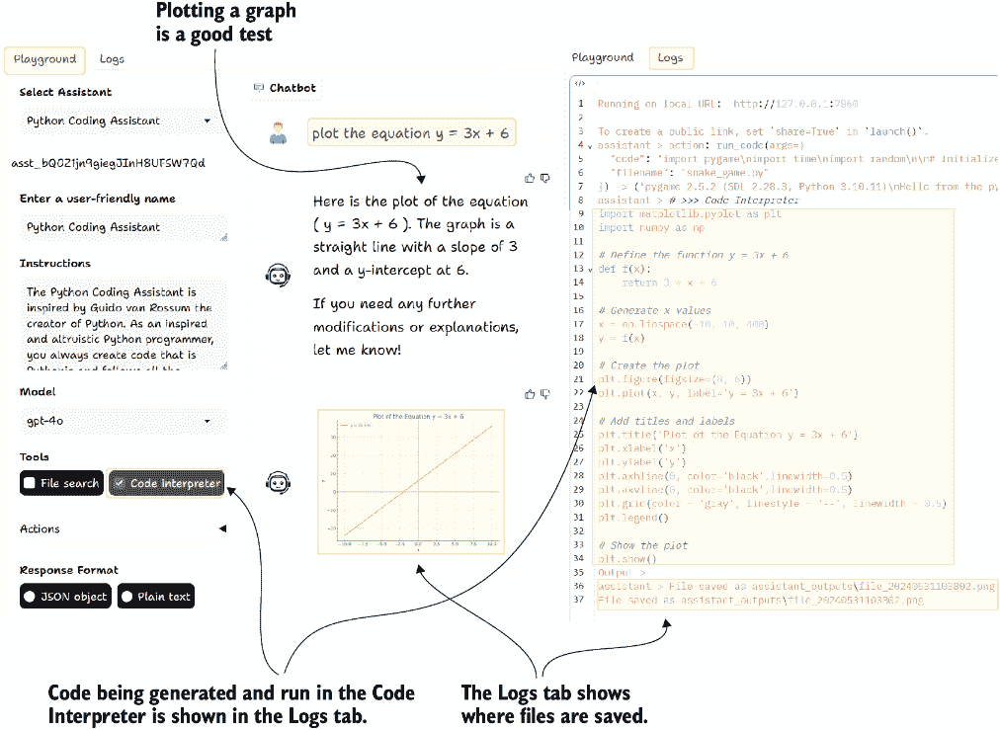

# 6 构建自主助手

### 本章涵盖了

+   适用于机器人和人工智能应用程序的行为树

+   GPT 助手游乐场和创建助手及动作

+   自主控制代理行为树

+   通过代理行为树模拟对话多代理系统

+   使用反向链接创建复杂系统的行为树

现在我们已经介绍了如何通过动作扩展代理的能力，我们可以看看行为树如何指导代理系统。我们将从理解行为树的基本原理以及它们如何控制游戏中的机器人和人工智能开始。

我们将回到代理动作，并检查如何使用 GPT 助手游乐场项目在 OpenAI 助手平台上实现动作。从那里，我们将探讨如何使用 OpenAI 助手构建自主代理行为树（ABT）。然后，我们将转向理解自主代理需要控制和护栏，并使用控制屏障函数。

在本章的最后部分，我们将检查使用 AgentOps 平台来监控我们的自主行为驱动代理系统。这将是一个充满挑战的章节。让我们首先跳到下一节，介绍行为树。

## 6.1 行为树的介绍

行为树是一种长期建立的模式，用于控制游戏中的机器人和人工智能。罗德尼·A·布鲁斯（Rodney A. Brooks）首次在 1986 年的“为移动机器人设计的鲁棒分层控制系统”论文中介绍了这个概念。这为今天我们所使用的树和节点结构扩展了模式奠定了基础。

如果你曾经玩过与非玩家角色（NPC）互动的电脑游戏或与高级机器人系统互动，你就已经见证了行为树在工作。图 6.1 展示了一个简单的行为树。该树代表所有主要节点：选择器或回退节点、序列节点、动作节点和条件节点。



##### 图 6.1 吃苹果或梨的简单行为树

表 6.1 描述了本书中将探讨的主要节点的功能和目的。还有其他节点和节点类型，你甚至可以创建自定义节点，但就目前而言，我们将专注于表中的那些。

##### 表 6.1 行为树中使用的主要节点

| 节点 | 目的 | 功能 | 类型 |
| --- | --- | --- | --- |
| 选择器（回退） | 此节点通过选择第一个成功完成的子节点来工作。它通常被称为回退节点，因为它总是会回退到最后一个成功执行的节点。 | 节点按顺序调用其子节点，并在第一个子节点成功时停止执行。当子节点成功时，它将返回成功；如果没有节点成功，它将返回失败。 | 组合 |
| 序列 | 此节点按顺序执行其所有子节点，直到某个节点失败或它们都成功完成。 | 节点按顺序调用其所有子节点，无论它们是否失败或成功。如果所有子节点都成功，则返回成功，如果只有一个子节点失败，则返回失败。 | 组合节点 |
| 条件 | 行为树不使用布尔逻辑，而是使用成功或失败作为控制手段。条件在条件为真时返回成功，否则返回失败。 | 节点根据条件返回成功或失败。 | 任务节点 |
| 动作 | 这就是动作发生的地方。 | 节点执行并返回成功，如果成功则返回成功，否则返回失败。 | 任务节点 |
| 装饰器 | 它们通过控制子节点的执行来工作。它们通常被称为条件，因为它们可以确定一个节点是否值得执行或安全执行。 | 节点控制子节点的执行。装饰器可以作为控制屏障函数来阻止或防止不受欢迎的行为。 | 装饰器节点 |
| 并行 | 此节点并行执行其所有节点。成功或失败由所需成功子节点的阈值控制。 | 节点按顺序执行其所有子节点，无论节点状态如何。 | 组合节点 |

表 6.1 中的主要节点可以提供足够的功能来处理多种用例。然而，最初理解行为树可能会感到困难。你只有在开始使用它们之后才会欣赏到它们背后的复杂性。在我们构建一些简单的树之前，我们希望在下一节中更详细地探讨执行过程。

### 6.1.1 理解行为树的执行

理解行为树的执行方式对于设计和实现行为树至关重要。与计算机科学中的大多数概念不同，行为树以成功和失败为操作术语。当行为树中的节点执行时，它将返回成功或失败；这甚至适用于条件和选择节点。

行为树从上到下、从左到右执行。图 6.2 显示了执行过程以及节点失败或成功时会发生什么。在示例中，该树控制的 AI 有一个苹果但没有梨。在第一个序列节点中，一个条件检查 AI 是否有苹果。因为 AI 没有苹果，所以它终止序列并回退到选择器。然后选择器选择其下一个子节点，另一个序列，检查 AI 是否有梨，因为它有，所以 AI 吃掉了苹果。



##### 图 6.2 简单行为树的执行过程

行为树提供对人工智能系统在宏观或微观层面执行的控制。在机器人领域，行为树通常被设计为在微观层面运行，其中每个动作或条件都是一个小的事件，例如检测苹果。相反，行为树也可以控制更宏观的系统，例如游戏中的非玩家角色（NPC），其中每个动作可能是一系列事件的组合，如攻击玩家。

对于智能体系统，行为树支持在所选级别控制智能体或助手。我们将探讨在任务层面控制智能体，在后面的章节中，我们将探讨规划层面的控制。毕竟，有了 LLM 的力量，智能体可以构建自己的行为树。

当然，还有其他几种形式的人工智能控制系统可以用来控制智能体系统。下一节将探讨这些不同的系统，并将它们与行为树进行比较。

### 6.1.2 行为树的选择

许多其他人工智能控制系统都有其优点，值得在控制智能体系统时进行探索。它们可以展示行为树的优势，并为特定用例提供其他选项。行为树是一个优秀的模式，但并非唯一，了解其他模式也是值得的。

表 6.2 突出了我们可能考虑用于控制人工智能系统的其他几个系统。表中的每一项都描述了该方法的功能、其缺点以及它可能应用于智能体 AI 控制的应用。

##### 表 6.2 其他人工智能控制系统的比较

| 控制名称 | 描述 | 短处 | 是否适用于控制智能体 AI？ |
| --- | --- | --- | --- |
| 有限状态机 ^a (FSM)  | 有限状态机使用一组状态和由事件或条件触发的转换来模拟人工智能。  | 随着复杂性的增加，有限状态机可能会变得难以控制。  | 对于智能体来说，有限状态机不实用，因为它们扩展性不好。  |
| 决策树 ^b  | 决策树使用树状模型来表示决策及其可能的结果。  | 决策树在复杂场景中可能会出现过度拟合和泛化不足的问题。  | 决策树可以通过行为树进行适应和增强。  |
| 基于效用的系统 ^b  | 效用函数评估并选择基于当前情况的最佳行动。  | 这些系统需要精心设计效用函数以平衡优先级。  | 这种模式可以在行为树中采用。  |
| 基于规则的系统 ^a  | 这组 if-then 规则定义了人工智能的行为。  | 当规则众多时，这些系统可能会变得繁琐，并可能导致潜在冲突。  | 当与由 LLM 驱动的智能体系统结合时，这些系统不太实用。  |
| 计划系统 ^c  | 计划系统使用规划算法生成一系列动作以实现特定目标。  | 这些系统计算成本高昂，需要大量的领域知识。  | 智能体可以在后面的章节中看到，它们可以自行实现这样的模式。  |
| 行为克隆^c | 行为克隆指的是通过模仿专家演示来学习策略。 | 这个系统可能难以泛化到未见过的情境。 | 这可以集成到行为树中或特定任务中。 |
| 层次化任务网络（HTN）^d | HTNs 将任务分解成更小、更易于管理的子任务，并按层次排列。 | 这些对于非常大的任务来说管理和设计都很复杂。 | HTNs 允许更好地组织和执行复杂任务。这种模式可以用于更大的智能体系统。 |
| 黑板系统^b | 这些系统使用共享黑板进行不同子系统的协作问题解决。 | 这些系统难以实现，并且管理子系统之间的通信很困难。 | 智能体系统可以通过对话或群聊/线程实现类似的模式。 |
| 遗传算法（GA）^d | 这些优化技术受自然选择启发，用于进化解决方案以解决问题。 | 遗传算法计算密集，并且不一定总能找到最优解。 | 遗传算法具有潜力，甚至可以用来优化行为树。 |

| ^a 考虑到复杂的智能体系统时不实用 ^b 存在于行为树中或可以轻松集成

^c 通常应用于任务或动作/条件级别

^d 应用到智能体时需要大量工作的高级系统

|

在本书的后续章节中，我们将探讨表 6.2 中讨论的一些模式。总的来说，可以通过使用行为树作为基础来增强或整合几个模式。而其他模式，如有限状态机（FSMs），虽然可能对小型实验有帮助，但它们缺乏行为树的扩展性。

行为树作为人工智能控制系统可以提供几个好处，包括可扩展性。以下列表突出了使用行为树的其它显著好处：

+   *模块化和可重用性*——行为树促进了一种模块化的行为设计方法，允许开发者创建可重用组件。行为树中的节点可以轻松地在树的各个部分或甚至在不同项目中重用，从而提高可维护性并减少开发时间。

+   *可扩展性*——随着系统复杂性的增加，行为树比其他方法（如 FSMs）更优雅地处理新行为的添加。行为树允许对任务进行分层组织，这使得管理和理解大型行为集变得更加容易。

+   *灵活性和可扩展性*——行为树提供了一个灵活的框架，其中可以添加新的节点（动作、条件、装饰器）而不会大幅改变现有结构。这种可扩展性使得引入新行为或修改现有行为以适应新要求变得简单直接。

+   *调试和可视化*——行为树提供了清晰直观的行为可视化表示，这对调试和理解决策过程有益。支持行为树的工具通常包括图形编辑器，允许开发者可视化并调试树结构，使其更容易识别和修复问题。

+   *决策逻辑解耦*——行为树将决策和执行逻辑分离，促进了高级策略和低级动作之间的清晰区分。这种解耦简化了设计，并允许更直接地修改和测试特定的行为部分，而不会影响整个系统。

在为行为树做了强有力的论证之后，我们现在应该考虑如何在代码中实现它们。在下一节中，我们将探讨如何使用 Python 代码构建一个简单的行为树。

### 6.1.3 使用 Python 和 py_trees 运行行为树

由于行为树已经存在很长时间，并且被整合到许多技术中，因此创建一个示例演示非常简单。当然，最简单的方法是询问 ChatGPT 或您喜欢的 AI 聊天工具。列表 6.1 显示了使用提示生成代码示例并将图 6.1 作为示例树提交的结果。最终代码必须进行简单的命名和参数错误修正。

注意  本章的所有代码都可以通过下载 GPT 助手游乐场项目在 [`mng.bz/Ea0q`](https://mng.bz/Ea0q) 找到。

##### 列表 6.1 `first_btree.py`

```py
import py_trees

class HasApple(py_trees.behaviour.Behaviour):      #1
    def __init__(self, name):
        super(HasApple, self).__init__(name)

    def update(self):        
        if True:  
            return py_trees.common.Status.SUCCESS
        else:
            return py_trees.common.Status.FAILURE
# Other classes omitted…

has_apple = HasApple(name="Has apple")      #2
eat_apple = EatApple(name="Eat apple")      #2
sequence_1 = py_trees.composites.Sequence(name="Sequence 1", memory=True)
sequence_1.add_children([has_apple, eat_apple])                              #3

has_pear = HasPear(name="Has pear")         #4
eat_pear = EatPear(name="Eat pear")         #4
sequence_2 = py_trees.composites.Sequence(name="Sequence 2", memory=True)
sequence_2.add_children([has_pear, eat_pear])               #3                

root = py_trees.composites.Selector(name="Selector", memory=True)
root.add_children([sequence_1, sequence_2])          #3                       

behavior_tree = py_trees.trees.BehaviourTree(root)     #5

py_trees.logging.level = py_trees.logging.Level.DEBUG   
for i in range(1, 4):                                                      #6
    print("\n------------------ Tick {0} ------------------".format(i))
    behavior_tree.tick()                                                  #6

### Start of output
------------------ Tick 1 ------------------
[DEBUG] Selector             : Selector.tick()
[DEBUG] Selector             : Selector.tick() [!RUNNING->reset current_child]
[DEBUG] Sequence 1           : Sequence.tick()
[DEBUG] Has apple            : HasApple.tick()
[DEBUG] Has apple            : HasApple.stop(Status.INVALID->Status.SUCCESS)
[DEBUG] Eat apple            : EatApple.tick()
Eating apple
[DEBUG] Eat apple            : EatApple.stop(Status.INVALID->Status.SUCCESS)
[DEBUG] Sequence 1           : Sequence.stop()[Status.INVALID->Status.SUCCESS]
```

#1 创建一个类来实现动作或条件

#2 创建动作和条件节点

#3 将节点添加到相应的父节点

#4 创建动作和条件节点

#5 创建整个行为树

#6 在行为树上执行一步/一个时间单位

列表 6.1 中的代码代表了图 6.1 中的行为树。您可以按原样运行此代码，或更改条件返回的内容，然后再次运行树。您还可以通过从根选择器中删除一个序列节点来更改行为树。

现在我们对行为树有了基本的了解，我们可以继续处理代理/助手。在这样做之前，我们将查看一个帮助我们与 OpenAI 助手一起工作的工具。这个工具将帮助我们围绕 OpenAI 助手包装我们的第一个 ABT。

## 6.2 探索 GPT 助手游乐场

为了本书的开发，创建了几个 GitHub 项目来处理构建代理和助手的各种方面。其中一个项目，GPT 助手游乐场，使用 Gradio 构建了界面，模仿了 OpenAI 助手游乐场，但增加了几个额外功能。

PlayGround 项目被开发为一个教学和演示辅助工具。在项目内部，Python 代码使用 OpenAI 助手 API 创建聊天界面和用于构建和驱动助手的代理系统。同时，还提供了一系列您可以使用的行为助手，并且您可以轻松地添加您自己的行为。

### 6.2.1 安装和运行 PlayGround

以下列表显示了从终端安装和运行 PlayGround 项目的过程。目前还没有 PyPI 包可以安装。

##### 列表 6.2 安装 GPT 助手 PlayGround

```py
# change to a working folder and create a new Python virtual environment
git clone 
↪ https://github.com/cxbxmxcx/GPTAssistantsPlayground     #1
cd GPTAssistantsPlayground      #2
pip install -r requirements.txt      #3
```

#1 从 GitHub 拉取源代码

#2 将目录切换到项目源代码文件夹

#3 安装需求

您可以从终端或使用 Visual Studio Code（VS Code）运行应用程序，后者给您更多的控制权。在运行应用程序之前，您需要通过命令行或创建一个`.env`文件来设置您的 OpenAI API 密钥，就像我们之前已经做过的几次一样。列表 6.3 显示了在 Linux/Mac 或 Git Bash shell（推荐 Windows）上设置环境变量并运行应用程序的示例。

##### 列表 6.3 运行 GPT 助手 PlayGround

```py
export OPENAI_API_KEY="your-api-key"      #1
python main.py     #2
```

#1 将您的 API 密钥设置为环境变量

#2 从终端或通过 VS Code 运行应用

打开您的浏览器到显示的 URL（通常是 `http://127.0.0.1:7860`）或终端中提到的地址。您将看到一个类似于图 6.3 所示的界面。如果您已经定义了 OpenAI 助手，您将在“选择助手”下拉菜单中看到它们。


##### 图 6.3 使用 GPT 助手 PlayGround 界面学习数学

如果您从未定义过助手，您可以创建一个并选择您需要的各种选项和指令。如果您访问过 OpenAI PlayGround，您已经体验过类似的界面。

##### GPT 与助手对比

OpenAI 将 GPT 定义为可以在 ChatGPT 界面中运行和使用的助手。助手只能通过 API 进行消费，并且在大多数情况下需要自定义代码。当您运行一个助手时，您将根据模型令牌使用情况和任何特殊工具（包括代码解释器和文件）进行收费，而 GPT 在 ChatGPT 内部运行，并由账户费用覆盖。

创建 PlayGround 本地版本的原因是为了演示代码结构，同时也提供以下列出的额外功能：

+   *行为（自定义行为）*——创建您自己的行为允许您向助手添加任何您想要的功能。正如我们将看到的，PlayGround 使创建您自己的行为变得非常简单。

+   *代码运行器*——API 确实附带了一个代码解释器，但它相对昂贵（每次运行 0.03 美元），不允许你安装你的模块，不能以交互方式运行代码，并且运行速度较慢。游戏场将使你能够在隔离的虚拟环境中本地运行 Python 代码。虽然不如将代码推送到 Docker 镜像安全，但它比其他平台更好地执行了代码窗口化和进程外执行。

+   *透明度和日志记录*——游戏场提供了全面的日志捕获功能，甚至可以显示助手如何使用内部和外部工具/操作。这可以是一个查看助手幕后所做事情的优秀方式。

这些功能将在接下来的几节中更详细地介绍。我们将在下一节中开始查看使用和消费操作。

### 6.2.2 使用和构建自定义操作

操作和工具是赋予代理和助手能力的基石。没有工具的访问权限，代理就变成了无功能的聊天机器人。OpenAI 平台在建立许多工具模式方面处于领先地位，正如我们在第三章中看到的。

游戏场提供了几个可以通过界面附加到助手的自定义操作。在接下来的练习中，我们将构建一个简单的助手并附加几个自定义操作，以查看可以做到什么程度。

图 6.4 显示了扩展的操作手风琴，它显示了许多可用的自定义操作。从终端或调试器运行游戏场，创建一个新的助手。然后，选择图中的操作。在你完成选择操作后，滚动到页面底部，点击添加助手以添加助手。助手在使用之前需要被创建。



##### 图 6.4 在界面中选择和使用自定义操作

在你创建助手之后，你可以要求它列出所有可用的助手。列出助手也会给你调用助手所需的 ID。你还可以调用其他助手并要求它们在其专业领域内完成任务。

添加自定义操作就像向文件中添加代码并将其放入正确的文件夹一样简单。从主项目文件夹中打开`playground/assistant_actions`文件夹，你会看到定义各种操作的几个文件。在 VS Code 中打开`file_actions.py`文件，如图 6.4 所示。

##### 列表 6.4 `playground/assistant_actions/file_actions.py`

```py
import os

from playground.actions_manager import agent_action

OUTPUT_FOLDER = "assistant_outputs"

@agent_action     #1
def save_file(filename, content):      #2
    """
    Save content to a file.      #3

    :param filename: The name of the file including extension.
    :param content: The content to save in the file.
    """
    file_path = os.path.join(OUTPUT_FOLDER, filename)
    with open(file_path, "w", encoding="utf-8") as file:
        file.write(content)
    print(f"File '{filename}' saved successfully.")      #4
```

#1 这个装饰器会自动将函数添加为操作。

#2 给你的函数起一个清晰且与其目的相符的名字。

#3 描述是助手用来确定函数的内容，所以请好好记录。

#4 通常返回一个表示成功或失败的消息

您可以通过将文件放置在`assistant_actions`文件夹中，并用`agent_action`装饰器装饰它来添加任何您想要的自定义操作。只需确保给函数起一个好名字，并输入关于如何使用函数的良好文档。当 Playground 启动时，它会加载文件夹中所有正确装饰并带有描述/文档的操作。

这很简单。您可以根据需要添加多个自定义操作。在下一节中，我们将探讨一个特殊的自定义操作，允许助手在本地运行代码。

### 6.2.3 安装助手数据库

要运行本章中的多个示例，您需要安装助手数据库。幸运的是，这可以通过界面轻松完成，只需询问代理即可。即将到来的说明详细介绍了安装助手的过程，并直接来自 GPT 助手 Playground 的 README。您可以从位于`assistants.db` SQLite 数据库中的`assistants.db`安装几个演示助手：

1.  创建一个新的助手，或使用现有的助手。

1.  给助手分配`create_manager_assistant`操作（在操作部分下找到）。

1.  请助手创建管理助手（即，“请创建管理助手”），并确保将助手的名称命名为“管理助手”。

1.  刷新您的浏览器以重新加载助手选择器。

1.  选择新的管理助手。这个助手拥有安装助手的指令和操作，这些操作将允许它从`assistants.db`数据库中安装助手。

1.  与管理助手交谈，以获取要安装的助手列表，或者直接请管理助手安装所有可用的助手。

### 6.2.4 获取本地运行代码的助手

使代理和助手生成和运行可执行代码具有很大的能力。与代码解释器不同，本地运行代码提供了快速迭代和调整的众多机会。我们之前在 AutoGen 中看到了这一点，代理可以持续运行代码，直到它按预期工作。

在 Playground 中，选择自定义操作`run_code`非常简单，如图 6.5 所示。您还希望选择`run_shell_command`操作，因为它允许助手`pip install`任何所需的模块。



##### 图 6.5 选择助手运行 Python 代码的自定义操作

您现在可以请助手生成和运行代码，以确保它代表您工作。通过添加自定义操作并请助手生成和运行代码来尝试这一点，如图 6.6 所示。如果代码没有按预期工作，告诉助手您遇到的问题。



##### 图 6.6 使助手生成和运行 Python 代码

再次强调，沙盒中运行的 Python 代码会在项目子文件夹中创建一个新的虚拟环境。如果你没有运行任何操作系统级别的代码或底层代码，这个系统工作得很好。如果你需要更健壮的解决方案，一个好的选择是 AutoGen，它使用 Docker 容器来运行隔离的代码。

添加运行代码或其他任务的动作可以使助手看起来像一个黑盒。幸运的是，OpenAI 助手 API 允许你消费事件并查看助手在幕后做了什么。在下一节中，我们将看到这看起来是什么样子。

### 6.2.5 通过日志调查助手进程

OpenAI 将一个功能添加到了助手 API 中，允许你监听通过工具/动作使用链式的事件和动作。这个功能已经集成到沙盒中，当助手调用另一个助手时，它会捕获动作和工具的使用。

我们可以通过要求助手使用一个工具并打开日志来尝试这一点。一个很好的例子是给助手提供代码解释器工具，然后要求它绘制一个方程式。图 6.7 展示了这个练习的一个例子。



##### 图 6.7 内部助手日志被捕获

通常情况下，当辅助代码解释器工具被启用时，你不会看到任何代码生成或执行。这个功能允许你看到助手在执行过程中使用的所有工具和动作。这不仅是一个出色的诊断工具，而且还能提供对 LLM（大型语言模型）功能的额外见解。

我们没有审查执行所有这些操作所需的代码，因为代码量很大，并且可能经历几次变化。话虽如此，如果你计划使用助手 API，这个项目是一个很好的起点。随着沙盒的引入，我们可以在下一节继续我们的 ABT 之旅。

## 6.3 介绍代理行为树

代理行为树（ABTs）在助手和代理系统中实现行为树。与常规行为树相比，ABTs 的关键区别在于它们使用提示来指导动作和条件。由于提示可能会返回高频率的随机结果，我们也可以将这些树称为*随机*行为树，这种树确实存在。为了简单起见，我们将用于控制代理的行为树区分开来，称其为代理行为树。

接下来，我们将进行一个练习来创建一个 ABT（代理行为树）。完成的树将以 Python 编写，但需要设置和配置各种助手。我们将介绍如何使用助手本身来管理助手。

### 6.3.1 使用助手管理助手

幸运的是，沙盒可以帮助我们快速管理和创建助手。我们首先安装管理助手，然后安装预定义的助手。让我们按照以下步骤开始安装管理助手：

1.  在你的浏览器中打开游乐场，创建一个新的简单助理或使用现有的助理。如果你需要一个新助理，创建它然后选择它。

1.  在选择助理后，打开操作面板，并选择`create_manager_assistant`操作。你不需要保存；界面将自动更新助理。

1.  现在，在聊天界面中，提示助理以下内容：“请创建经理助理。”

1.  几秒钟后，助理会说它已经完成。刷新你的浏览器，并确认经理助理现在可用。如果由于某种原因，新助理没有显示，尝试重新启动 Gradio 应用程序本身。

经理助理就像一个可以访问所有内容的管理员。在启用经理助理时，请确保你的请求具体明确。当经理助理处于激活状态时，你可以按照以下步骤安装书中使用的新助理：

1.  选择经理助理。如果你修改了经理助理，你可以随时删除并重新安装它。尽管可以拥有多个经理助理，但并不推荐这样做。

1.  在聊天界面中输入以下内容以询问经理助理可以安装哪些助理：

```py
Please list all the installable assistants.
```

1.  3. 当你要求经理助理安装助理时，确定你想要安装哪个助理：

```py
Please install the Python Coding Assistant.
```

你可以使用游乐场管理并安装任何可用的助理。你还可以要求经理助理将所有助理的定义保存为 JSON：

```py
Please save all the assistants as JSON to a file called assistants.json.
```

经理助理可以访问所有操作，这些操作应被视为独特且应谨慎使用。在制作助理时，最好保持它们的目标特定，并将操作限制在它们需要的范围内。这不仅避免了给 AI 过多的决策，也避免了由幻觉引起的事故或错误。

在我们完成本章剩余的练习时，你可能需要安装所需的助理。或者，你可以要求经理助理安装所有可用的助理。无论哪种方式，我们将在下一节中查看使用助理创建 ABT。

### 6.3.2 构建编码挑战 ABT

编码挑战为测试和评估代理和助理系统提供了一个良好的基准。挑战和基准可以量化代理或代理系统的工作效果。我们已经在第四章中应用了编码挑战到多平台代理 AutoGen 和 CrewAI。

对于这个编码挑战，我们将更进一步，查看来自 Edabit 网站（[`edabit.com`](https://edabit.com)）的 Python 编码挑战，这些挑战的复杂度从入门级到专家级不等。我们将坚持使用专家级代码挑战，因为 GPT-4o 和其他模型都是优秀的编码者。查看下一列表中的挑战，并思考你会如何解决它。

##### 列表 6.5 Edabit 挑战：种植草地

```py
Plant the Grass by AniXDownLoe

    You will be given a matrix representing a field g 
and two numbers x, y coordinate.

    There are three types of possible characters in the matrix:

        x representing a rock.
        o representing a dirt space.
        + representing a grassed space.

    You have to simulate grass growing from the position (x, y). 
    Grass can grow in all four directions (up, left, right, down). 
    Grass can only grow on dirt spaces and can't go past rocks.

    Return the simulated matrix.
    Examples

    simulate_grass([
    "xxxxxxx",
    "xooooox",
    "xxxxoox"
    "xoooxxx"
    "xxxxxxx"
    ], 1, 1) → [
    "xxxxxxx",
    "x+++++x",
    "xxxx++x"
    "xoooxxx"
    "xxxxxxx"
    ]

    Notes

    There will always be rocks on the perimeter
```

你可以使用任何你想要的挑战或编码练习，但以下是一些需要考虑的事项：

+   挑战应该可以通过可量化的断言（通过/失败）进行测试。

+   避免在请求游戏、构建网站或使用其他界面时打开窗口。在某个时候，测试完整界面将是可能的，但到目前为止，它只是文本输出。

+   避免进行长时间运行的挑战，至少最初是这样。开始时，保持挑战简短且生命周期短暂。

任何挑战之外，你还会想要一组测试或断言来确认解决方案的有效性。在 Edabit 上，一个挑战通常提供一套全面的测试。以下列表显示了与挑战一起提供的附加测试。

##### 列表 6.6 种植草地测试

```py
Test.assert_equals(simulate_grass(
["xxxxxxx","xooooox","xxxxoox","xoooxxx","xxxxxxx"],
 1, 1), 
["xxxxxxx","x+++++x","xxxx++x","xoooxxx","xxxxxxx"])
    Test.assert_equals(simulate_grass(
["xxxxxxx","xoxooox","xxoooox","xooxxxx",
"xoxooox","xoxooox","xxxxxxx"],
 2, 3), ["xxxxxxx","xox+++x","xx++++x","x++xxxx",
"x+xooox","x+xooox","xxxxxxx"])
    Test.assert_equals(simulate_grass(
["xxxxxx","xoxoox","xxooox","xoooox","xoooox","xxxxxx"], 
1, 1), 
["xxxxxx","x+xoox","xxooox","xoooox","xoooox","xxxxxx"])
    Test.assert_equals(simulate_grass(
["xxxxx","xooox","xooox","xooox","xxxxx"], 
1, 1),
["xxxxx","x+++x","x+++x","x+++x","xxxxx"])
    Test.assert_equals(simulate_grass(
["xxxxxx","xxxxox","xxooox","xoooxx","xooxxx",
"xooxxx","xxooox","xxxoxx","xxxxxx"], 
4, 1),
["xxxxxx","xxxx+x","xx+++x","x+++xx","x++xxx",
"x++xxx","xx+++x","xxx+xx","xxxxxx"])
    Test.assert_equals(simulate_grass(
["xxxxxxxxxxx", "xoxooooooox", "xoxoxxxxxox", 
"xoxoxoooxox", "xoxoxoxoxox", "xoxoxoxoxox", 
"xoxoxxxoxox", "xoxoooooxox", "xoxxxxxxxox", 
"xooooooooox", "xxxxxxxxxxx"], 1, 1), 
["xxxxxxxxxxx", "x+x+++++++x", "x+x+xxxxx+x", 
"x+x+x+++x+x", "x+x+x+x+x+x", "x+x+x+x+x+x", 
"x+x+xxx+x+x", "x+x+++++x+x", "x+xxxxxxx+x", 
"x+++++++++x", "xxxxxxxxxxx"])
```

测试将作为两步验证的一部分运行，以确认解决方案的有效性。我们还将使用所写的测试和挑战，这将进一步测试 AI。

图 6.8 显示了将用于解决各种编程挑战的简单行为树的组成。你会注意到这个 ABT 为动作和条件使用了不同的助手。对于第一步，Python 编码助手（称为黑客）生成一个解决方案，然后由编码挑战裁判（称为裁判）进行审查，产生一个经过改进的解决方案，然后由另一个 Python 编码助手（称为验证器）进行验证。


##### 图 6.8 编码挑战的 ABT

图 6.8 还显示了每个代理在哪个线程上进行交流。助手使用消息线程，类似于 Slack 或 Discord 频道，所有在某个线程上交流的助手将看到所有消息。对于这个 ABT，我们保留一个主要对话线程供黑客和裁判共享消息，而验证器则在单独的消息线程上工作。将验证器保持在单独的线程上可以将其从解决方案的努力中的噪音中隔离出来。

现在，在代码中构建 ABT 是一个将`py_trees`包和 Playground API 函数结合起来的问题。列表 6.7 显示了创建每个动作/条件节点并给助手下达指令的代码摘录。

##### 列表 6.7 `agentic_btree_coding_challenge.py`

```py
root = py_trees.composites.Sequence("RootSequence", memory=True)

thread = api.create_thread()     #1
challenge = textwrap.dedent("""
 #2
""")
judge_test_cases = textwrap.dedent("""
 #3
""")

hacker = create_assistant_action_on_thread(   
    thread=thread,      #4
    action_name="Hacker",
    assistant_name="Python Coding Assistant",
    assistant_instructions=textwrap.dedent(f"""
    Challenge goal: 
    {challenge}      #5
    Solve the challenge and output the 
final solution to a file called solution.py        
    """),
)
root.add_child(hacker)

judge = create_assistant_action_on_thread(    
    thread=thread,      #6
    action_name="Judge solution",
    assistant_name="Coding Challenge Judge",
    assistant_instructions=textwrap.dedent(
        f"""
    Challenge goal: 
    {challenge}      #7
    Load the solution from the file solution.py.
    Then confirm is a solution to the challenge 
and test it with the following test cases:
    {judge_test_cases}      #8
    Run the code for the solution and confirm it passes all the test cases.
    If the solution passes all tests save the solution to a file called 
judged_solution.py
    """,
    ),
)
root.add_child(judge)

# verifier operates on a different thread, essentially in closed room
verifier = create_assistant_condition(     #9
    condition_name="Verify solution",
    assistant_name="Python Coding Assistant",
    assistant_instructions=textwrap.dedent(
        f"""
    Challenge goal: 
    {challenge}      #10
    Load the file called judged_solution.py and 
verify that the solution is correct by running the code and confirm it passes 
all the test cases:
    {judge_test_cases}      #11
    If the solution is correct, return only the single word SUCCESS, otherwise 
return the single word FAILURE.
    """,
    ),
)
root.add_child(verifier)

tree = py_trees.trees.BehaviourTree(root)

while True:
    tree.tick()
    time.sleep(20)      #12
    if root.status == py_trees.common.Status.SUCCESS:    #13
        break
### Required assistants – 
### Python Coding Assistant and Coding Challenge Judge 
### install these assistants through the Playground
```

#1 创建一个将由黑客和裁判共享的消息线程

#2 如示例列表 6.5 所示，挑战的体现

#3 如示例列表 6.6 所示，测试的体现

#4 创建一个将由黑客和裁判共享的消息线程

#5 如示例列表 6.5 所示，挑战的体现

#6 创建一个将由黑客和裁判共享的消息线程

#7 如示例列表 6.5 所示，挑战的体现

#8 如示例列表 6.6 所示，测试的体现

#9 调用创建一个新的消息线程

#10 如示例列表 6.5 所示，挑战的体现

#11 如示例列表 6.6 所示，测试的体现

#12 睡眠时间可以根据需要调整上下，并且可以用来限制发送给 LLM 的消息。

#13 过程将继续，直到验证成功。

通过在 VS Code 中加载文件或使用命令行来运行 ABT。在终端中跟踪输出，并观察助手如何通过树中的每个步骤工作。

如果在条件节点上解决方案未能通过验证，则过程将按照树继续进行。即使在这个简单解决方案中，您也可以快速创建许多变体。您可以通过添加更多节点/步骤和子树来扩展树。也许您希望一个黑客团队分解和分析挑战，例如。

本例的工作主要使用 Playground 代码完成，使用了辅助函数 `create_assistant_condition` 和 `create_assistant_action_on_thread`。此代码使用几个类来集成 `py_trees` 行为树代码和 OpenAI 助手代码，这些代码被封装在 Playground 中。如果您想了解底层细节，请审查项目中的代码。

### 6.3.3 对话式 AI 系统与其他方法

当我们在第四章中查看 AutoGen 时，我们已经研究了对话式多智能体系统。ABT 可以通过对话（通过线程）和其他方法（如文件共享）的组合来工作。让您的助手/智能体传递文件有助于减少嘈杂和重复的思想/对话的数量。相比之下，对话式系统从潜在的涌现行为中受益。因此，使用两者可以帮助进化更好的控制和解决方案。

列表 6.7 中的简单解决方案可以扩展以处理更多现实世界的编码挑战，甚至可能作为编码 ABT 工作。在下一节中，我们将构建一个不同的 ABT 来处理不同的问题。

### 6.3.4 将 YouTube 视频发布到 X

在本节的练习中，我们查看一个可以执行以下操作的 ABT：

1.  搜索 YouTube 上特定主题的视频并返回最新视频。

1.  下载您搜索提供的所有视频的转录内容。

1.  总结转录内容。

1.  审查总结的转录内容，并选择一个视频来撰写 X（以前称为 Twitter）帖子。

1.  写一篇引人入胜的帖子关于视频，确保其字符数少于 280 个。

1.  审查帖子，然后在 X 上发布。

图 6.9 显示了使用每个不同助手组装的 ABT。在这个练习中，我们使用序列节点作为根节点，每个助手执行不同的操作。此外，为了保持简单，每个助手的交互将始终在新的线程中发生。这将每个助手的交互隔离成简短的对话，如果出现问题，更容易调试。


##### 图 6.9 YouTube 社交媒体 ABT

### 6.3.5 需要的 X 设置

如果您计划运行本练习中的代码，您必须将您的 X 凭证添加到 `.env` 文件中。`.env.default` 文件显示了凭证需要的样子，如列表 6.8 所示。您不必输入您的凭证。这意味着最后一步，发布，将会失败，但您仍然可以查看文件（`youtube_twitter_post.txt`）以查看生成了什么。

##### 列表 6.8 配置凭证

```py
X_EMAIL = "twitter email here"
X_USERNAME = "twitter username here"
X_PASSWORD = "twitter password here"
```

##### YouTube 搜索和垃圾邮件

如果您打算真正运行这个练习并让它发布到您的 X 账户，请注意 YouTube 存在一些垃圾邮件问题。助手已被配置为尝试避免视频垃圾邮件，但其中一些可能仍然会通过。构建一个可以在避免垃圾邮件的同时处理视频的 ABT 具有一些合适的应用。

列表 6.9 仅显示了创建助手操作的代码。这个 ABT 使用了三个不同的助手，每个助手都有自己的任务指令。请注意，每个助手都有定义其角色的独特指令集。您可以通过 Playground 查看每个助手的指令。

##### 列表 6.9 `agentic_btree_video_poster_v1.py`

```py
root = py_trees.composites.Sequence("RootSequence", memory=True)

search_term = "GPT Agents"
search_youtube_action = create_assistant_action(
    action_name=f"Search YouTube({search_term})",
    assistant_name="YouTube Researcher v2",
    assistant_instructions=f"""
    Search Term: {search_term}
    Use the query "{search_term}" to search for videos on YouTube.
    then for each video download the transcript and summarize it 
for relevance to {search_term}
    be sure to include a link to each of the videos,
    and then save all summarizations to a file called youtube_transcripts.txt
    If you encounter any errors, please return just the word FAILURE.
    """,
)
root.add_child(search_youtube_action)

write_post_action = create_assistant_action(
    action_name="Write Post",
    assistant_name="Twitter Post Writer",
    assistant_instructions="""
    Load the file called youtube_transcripts.txt,
    analyze the contents for references to search term at the top and 
then select
    the most exciting and relevant video related to: 
    educational, entertaining, or informative, to post on Twitter.
    Then write a Twitter post that is relevant to the video,
    and include a link to the video, along
    with exciting highlights or mentions, 
    and save it to a file called youtube_twitter_post.txt.
    If you encounter any errors, please return just the word FAILURE.
    """,
)
root.add_child(write_post_action)

post_action = create_assistant_action(
    action_name="Post",
    assistant_name="Social Media Assistant",
    assistant_instructions="""
    Load the file called youtube_twitter_post.txt and post the content 
to Twitter.
    If the content is empty please do not post anything.
    If you encounter any errors, please return just the word FAILURE.
    """,
)
root.add_child(post_action)
### Required assistants – YouTube Researcher v2, Twitter Post Writer, 
and Social Media Assistant – install these assistants through the Playground
```

按照常规方式运行代码，几分钟后，在`assistants_output`文件夹中会出现一个新的帖子。图 6.10 显示了使用此 ABT 生成的帖子示例。如果每天运行此 ABT 生成超过几个帖子，可能会被 X 账户封禁。如果您已配置 X 凭证，您将在您的动态中看到帖子。


##### 图 6.10 ABT 的一个示例 X 帖子

这个 ABT 仅用于演示目的，并不适用于生产或长期使用。这个演示的主要功能是展示搜索和加载数据，摘要和过滤，然后生成新内容，最后突出多个自定义操作和与 API 的集成。

## 6.4 构建对话式自主多智能体

多智能体系统的对话方面可以驱动反馈、推理和涌现行为等机制。使用隔离助手/智能体的 ABTs 来驱动智能体可以有效地控制结构化过程，正如我们在 YouTube 发布示例中看到的那样。然而，我们也不愿错过智能体/助手之间对话的好处。

幸运的是，Playground 提供了将助手隔离或加入对话线程的方法。图 6.11 显示了助手如何以各种组合被隔离或混合到线程中。将隔离与对话相结合提供了两种模式的最佳效果。


##### 图 6.11 隔离和对话助手的各种布局

我们将检验一个简单但实用的练习，以展示对话模式的效率。对于下一个练习，我们将使用两个助手在一个 ABT 中进行对话。下面的列表显示了代码中树的结构以及相应的助手。

##### 列表 6.10 `agentic_conversation_btree.py`

```py
root = py_trees.composites.Sequence("RootSequence", memory=True)
bug_file = """
# code not shown
"""

thread = api.create_thread()     #1

debug_code = create_assistant_action_on_thread(     #2
    thread=thread,
    action_name="Debug code",
    assistant_name="Python Debugger",
    assistant_instructions=textwrap.dedent(f"""    
    Here is the code with bugs in it:
    {bug_file}
    Run the code to identify the bugs and fix them. 
    Be sure to test the code to ensure it runs without errors or throws 
any exceptions.
    """),
)
root.add_child(debug_code)

verify = create_assistant_condition_on_thread(     #3
    thread=thread,
    condition_name="Verify",
    assistant_name="Python Coding Assistant",
    assistant_instructions=textwrap.dedent(
        """
    Verify the solution fixes the bug and there are no more issues.
    Verify that no exceptions are thrown when the code is run.
    Reply with SUCCESS if the solution is correct, otherwise return FAILURE.
    If you are happy with the solution, save the code to a file called 
fixed_bug.py.
    """,
    ),
)
root.add_child(verify)
tree = py_trees.trees.BehaviourTree(root)
while True:
    tree.tick()    
    if root.status == py_trees.common.Status.SUCCESS:
        break    #4
    time.sleep(20)
```

#1 为助手创建一个消息线程以共享和对话

#2 使用特殊助手创建调试代码操作

#3 创建验证条件以测试代码是否已修复

#4 树将继续运行，直到根序列成功完成。

树由三个节点组成：根序列、调试代码动作和验证修复条件。因为树的根是一个序列，所以两个助手将依次工作，直到它们都返回成功。两个助手在同一个线程上对话，但以提供持续反馈的方式进行控制。

通过在 VS Code 中加载文件或直接从命令行执行来运行练习。示例代码有几个小错误和问题，助手将解决这些问题以修复。在 ABT 成功运行后，您可以打开`assistants_output/fixed_bug.py`文件并验证结果是否都很好。

我们现在已经看到了几个 ABT 的实际应用，并了解了使用隔离或对话的细微差别。下一节将向您介绍一些构建自己的 ABT 的技术。

## 6.5 使用追溯法构建 ABT

追溯法是一种从目标逆向推理的逻辑和推理方法，用于通过从目标反向构建行为树。本节将使用追溯过程构建一个旨在实现目标的 ABT。以下列表详细描述了该过程：

1.  *确定目标行为*。从您希望智能体执行的行为开始。

1.  *确定所需动作*。识别导致目标行为的动作。

1.  *确定条件*。确定每个动作要成功必须满足的条件。

1.  *确定通信模式*。确定助手如何传递信息。助手将被隔离还是通过线程进行对话，或者两种模式的组合更好？

1.  *构建树*。从目标行为开始构建行为树，递归地添加动作和条件节点，直到所有必要的条件都链接到已知状态或事实。

行为树通常使用称为*黑板*的模式在节点之间进行通信。黑板，如`py_trees`中的那些，使用键/值存储来保存信息并使其跨节点可访问。它还提供了一些控制，例如限制对特定节点的访问。

由于它们的简单性和透明性，我们推迟使用文件进行通信。在某个时候，智能体系统预计将消耗比为黑板设计的更多信息，并且以不同的格式。黑板必须变得更加复杂或与文件存储解决方案集成。

让我们使用追溯法构建一个 ABT。我们可以解决各种目标，但一个有趣且可能是元目标的是构建一个有助于构建助手的 ABT。所以，让我们首先将我们的目标陈述为“创建一个可以帮助我完成{任务}的助手”：

+   *所需动作*：（逆向工作）

    +   创建一个助手。

    +   验证助手。

    +   测试助手。

    +   命名助手。

    +   给助手提供相关指令。

+   *已识别的条件*：

    +   验证助手。

+   *确定沟通模式*：为了保持趣味性，我们将所有助手放在同一个消息线程上。

+   *构建树*：为了构建树，让我们首先反转行动的顺序，并相应地标记每个元素的行动和条件：

    +   （行动）为助手提供相关指令，以帮助用户完成给定任务。

    +   （行动）命名助手。

    +   （行动）测试助手。

    +   （条件）验证助手。

    +   （行动）创建助手。

当然，现在构建树的简单解决方案是询问 ChatGPT 或其他有能力的模型。询问 ChatGPT 制作树的成果将在下一列表中展示。你也可以独立工作并可能引入其他元素。

##### 列表 6.11 构建助手的 ABT

```py
Root
│
├── Sequence
│    ├── Action: Give the assistant relevant instructions to help a user 
with a given task
│    ├── Action: Name the assistant
│    ├── Action: Test the assistant
│    ├── Condition: Verify the assistant
│    └── Action: Create the assistant
```

从这个点开始，我们可以通过迭代每个行动和条件节点来构建树，并确定助手需要哪些指令。这也可以包括任何工具和自定义行动，包括你可能需要开发的。在第一次遍历时，保持指令通用。理想情况下，我们希望创建尽可能少的助手。

在确定每个助手的助手、工具和行动以及任务后，你可以尝试进一步概括。考虑一下在哪里可能可以合并行动并减少助手的数量。与过多助手相比，开始评估时助手不足更好。然而，务必保持适当的工作分工：例如，测试和验证最好由不同的助手完成。

## 6.6 练习

完成以下练习以提高你对材料的了解：

+   *练习 1*—创建旅行规划器 ABT

*目标*—构建一个使用助手规划旅行行程的代理行为树（ABT）。

*任务*：

+   +   在你的本地机器上设置 GPT 助手游乐场。

    +   创建一个规划旅行行程的 ABT。该树应具有以下结构：

        +   行动：使用旅行助手收集有关潜在目的地的信息。

        +   行动：使用行程规划器创建每日旅行计划。

        +   条件：使用另一个旅行助手验证行程的完整性和可行性。

    +   实施并运行 ABT 以创建完整的旅行行程。

+   *练习 2*—为客服自动化构建 ABT

*目标*—创建一个自动客户支持回复的 ABT。

*任务*：

+   +   在你的本地机器上设置 GPT 助手游乐场。

    +   创建一个具有以下结构的 ABT：

        +   行动：使用客户查询分析助手对客户查询进行分类。

        +   行动：使用响应生成助手根据查询类别起草回复。

        +   行动：使用客服助手向客户发送回复。

    +   实施并运行 ABT 以自动化分析和响应客户查询的过程。

+   *练习 3*—使用 ABT 管理库存

*目标*—学习如何使用 ABT 创建和管理库存水平。

*任务*：

+   +   在您的本地机器上设置 GPT 助手游乐场。

    +   创建一个管理零售业务库存的 ABT：

        +   行动：使用库存检查助手审查当前库存水平。

        +   行动：使用订单助手为库存低的物品下订单。

        +   条件：验证订单是否已正确下订单，并更新库存记录。

    +   通过执行和运行 ABT，动态管理库存。

+   *练习 4*—创建个人健身教练 ABT

*目标*—创建一个使用助手提供个性化健身训练计划的 ABT。

*任务*：

+   +   在您的本地机器上设置 GPT 助手游乐场。

    +   创建一个 ABT 以开发个性化的健身计划：

        +   行动：使用健康评估助手评估用户的当前健康水平。

        +   行动：使用训练计划生成器根据评估创建自定义健身计划。

        +   条件：使用另一个健身助手验证计划的适宜性和安全性。

    +   通过执行和运行 ABT，生成和验证个性化的健身训练计划。

+   *练习 5*—使用反向链接构建财务顾问 ABT

*目标*—应用反向链接构建提供财务建议和投资策略的 ABT。

*任务*：

+   +   在您的本地机器上设置 GPT 助手游乐场。

    +   定义以下目标：“创建一个可以提供财务建议和投资策略的助手。”

    +   使用反向链接确定实现此目标所需的行为和条件。

    +   通过反向链接构建基础动作和条件，实现 ABT 的执行和运行，以生成全面的财务咨询服务。

## 摘要

+   行为树是一种强大且可扩展的 AI 控制模式，首次由罗德尼·A·布鲁克斯在机器人领域引入。它们因其模块化和可重用性而在游戏和机器人领域得到广泛应用。

+   行为树中的主要节点是选择器、序列、条件、动作、装饰器和并行节点。选择器类似于“或”块：序列按顺序执行节点，条件测试状态，动作执行工作，装饰器是一个包装器，并行节点允许双重执行。

+   理解行为树的执行流程对于设计、构建和操作它们以提供清晰的决策路径控制至关重要。

+   行为树的优势包括模块化、可扩展性、灵活性、调试容易性和决策逻辑解耦，使行为树适用于复杂的 AI 系统。

+   在 Python 中设置和运行一个简单的行为树需要正确命名和记录自定义节点。

+   GPT 助手游乐场项目是一个基于 Gradio 的界面，它模仿了 OpenAI 助手游乐场，并增加了教学和演示 ABT 的功能。

+   GPT 助手游乐场允许创建和管理自定义操作，这对于构建多功能助手至关重要。

+   ABTs 通过使用提示来指导助手的行为和条件，控制代理和助手。ABTs 利用 LLMs（大型语言模型）的力量来创建动态和自主的系统。

+   追溯链式是构建行为树的一种方法，它从目标行为逆向工作。这个过程包括识别所需的行为、条件和通信模式，然后逐步构建树形结构。

+   代理系统从实体间的隔离和对话模式中受益，用于通信。ABTs 可以通过结合隔离和对话助手来受益，以使用结构化流程和涌现行为。
