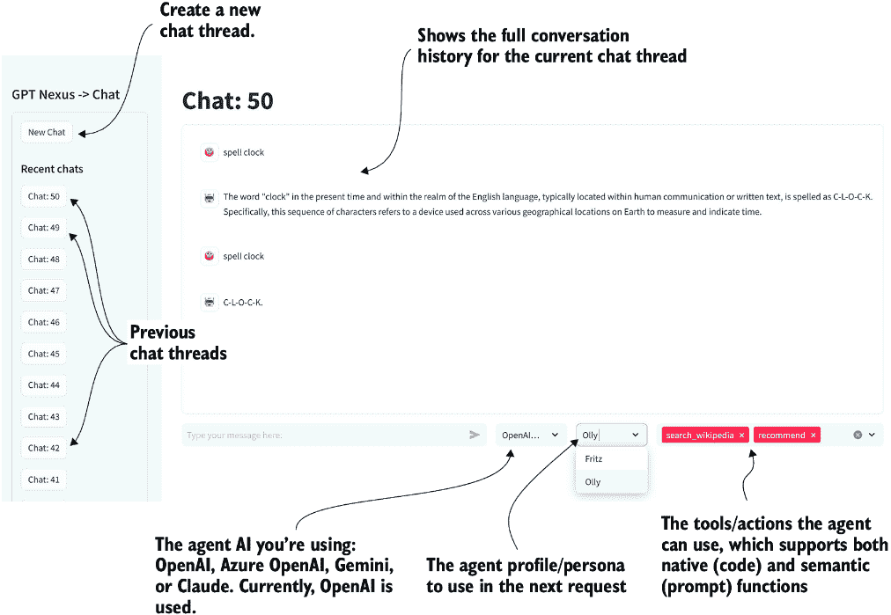
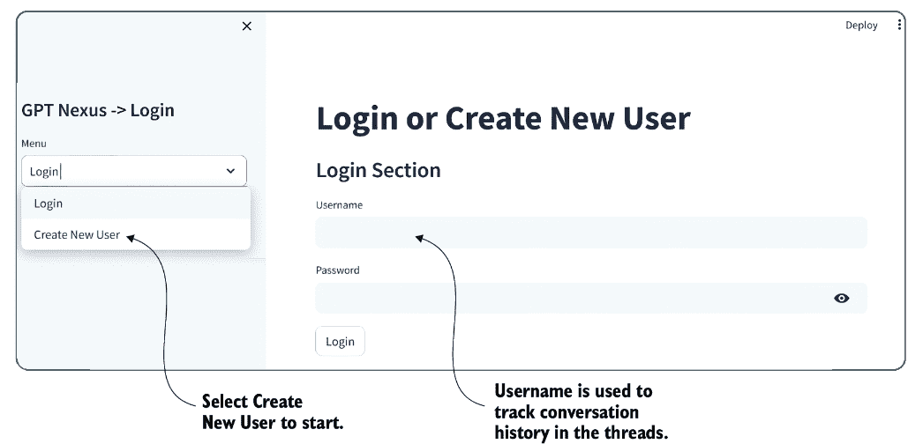
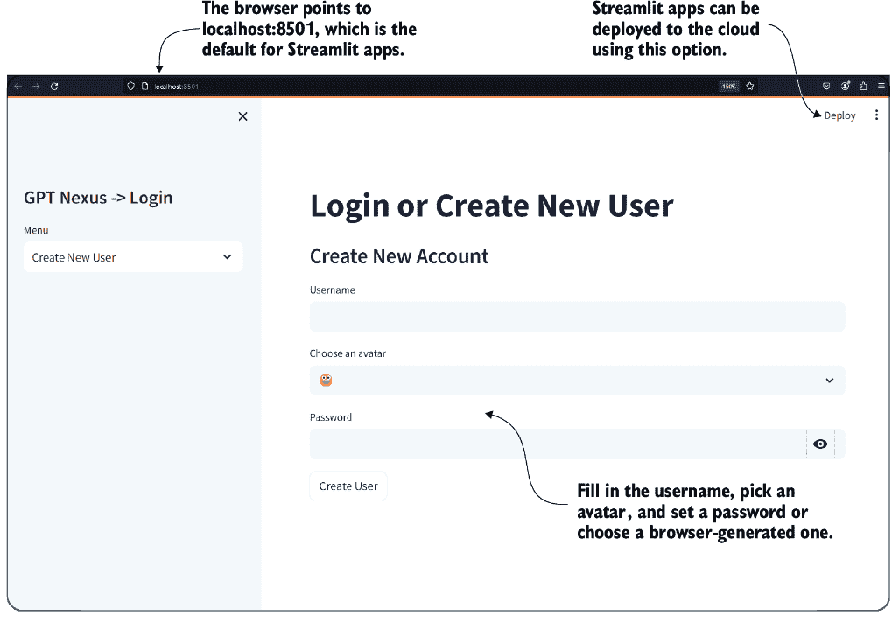
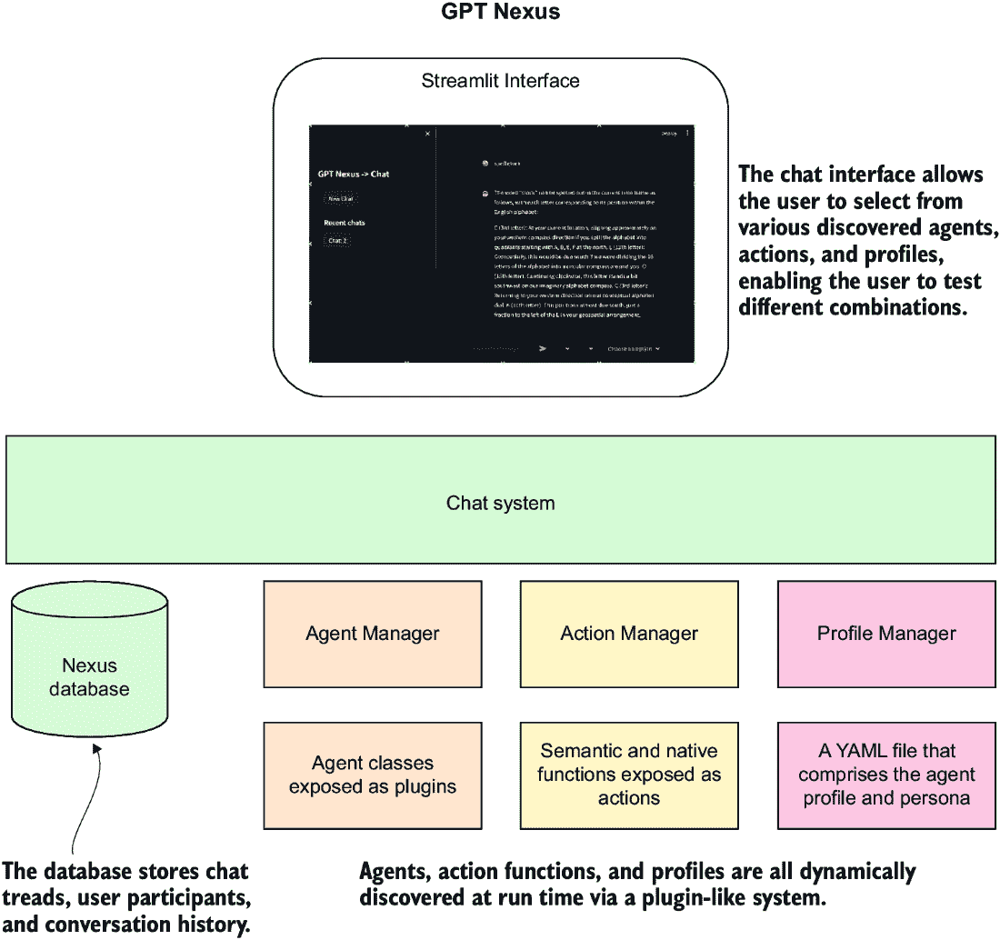
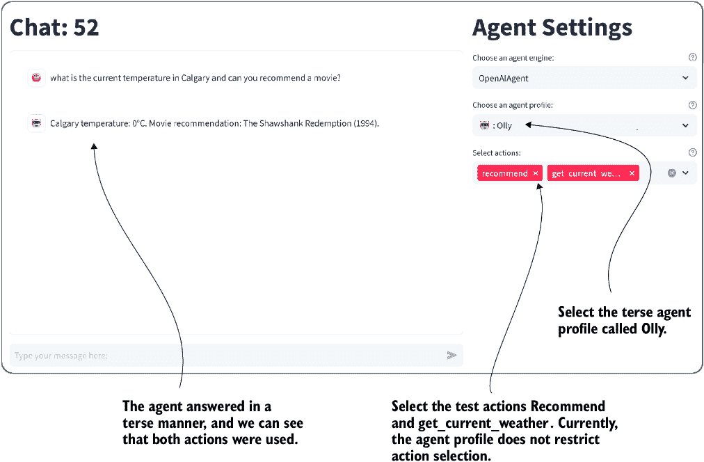

# 7 组装和使用代理平台

### 本章涵盖

+   Nexus 聊天和仪表板界面用于 AI 代理

+   用于构建智能仪表板、原型和 AI 聊天应用的 Streamlit 框架

+   在 Nexus 中开发、测试和参与代理配置文件和角色

+   开发基础 Nexus 代理

+   独立或在内置 Nexus 中开发、测试和参与代理行为和工具

在我们探索了一些关于代理的基本概念并查看使用工具通过框架如语义内核（SK）构建提示和角色之后，我们迈出了构建本书基础的第一步。这个基础被称为 Nexus，这是一个旨在易于学习、易于探索且足够强大以构建您的代理系统的代理平台。

## 7.1 介绍 Nexus，不仅仅是另一个代理平台

有超过 100 个 AI 平台和工具包用于消费和开发大型语言模型（LLM）应用，从 SK 或 LangChain 这样的工具包到 AutoGen 和 CrewAI 这样的完整平台。这使得决定哪个平台最适合构建自己的 AI 代理变得困难。

Nexus 是一个开源平台，与本书一起开发，用于教授构建全功能 AI 代理的核心概念。在本章中，我们将检查 Nexus 是如何构建的，并介绍两个主要代理组件：配置文件/角色和行为/工具。

图 7.1 显示了 Nexus 的主要界面，这是一个 Streamlit 聊天应用，允许您选择和探索各种代理功能。界面类似于 ChatGPT、Gemini 和其他商业 LLM 应用。



##### 图 7.1 Nexus 界面和功能

除了 LLM 聊天应用的标准功能外，Nexus 允许用户配置一个代理来使用特定的 API/模型、角色和可能的行为。本书的剩余部分，可用的代理选项将包括以下内容：

+   *角色/配置文件* — 代理将使用的主要角色和配置文件。角色是性格和主要动机，代理通过角色来回答请求。在本章中，我们将探讨角色/配置文件的开发和消费方式。

+   *行为/工具* — 表示代理可以使用工具执行的动作，无论是语义/提示还是本地/代码函数。在本章中，我们将探讨如何在 Nexus 中构建语义和本地函数。

+   *知识/记忆* — 表示代理可能访问的附加信息。同时，代理记忆可以代表从短期到语义记忆的各个方面。

+   *规划/反馈* — 表示代理如何规划并接收关于计划或计划执行的反馈。Nexus 将允许用户选择代理使用的规划类型和反馈选项。

随着我们继续阅读本书，Nexus 将被添加以支持新的代理功能。然而，同时，我们的目标是保持事情相对简单，以便教授许多这些基本核心概念。在下一节中，我们将探讨如何快速使用 Nexus，然后再深入了解其功能。

### 7.1.1 运行 Nexus

Nexus 主要旨在成为所有级别开发者的教学平台。因此，它将支持各种部署和使用选项。在下一项练习中，我们将介绍如何快速启动 Nexus。

在一个新的 Python 虚拟环境（版本 3.10）中打开一个终端。如果您需要创建一个的协助，请参阅附录 B。然后，在此新环境中执行列表 7.1 中显示的命令。您可以在命令行中设置环境变量或创建一个新的 `.env` 文件并添加设置。

##### 列表 7.1 终端命令行

```py
pip install git+https://github.com/cxbxmxcx/Nexus.git     #1

#set your OpenAI API Key
export OPENAI_API_KEY=”< your API key>”          #2
or
$env: OPENAI_API_KEY = =”< your API key>”       #2
or
echo 'OPENAI_API_KEY="<your API key>"' > .env   #2

nexus run      #3
```

#1 直接从仓库和分支安装包；务必包含分支。

#2 将密钥作为环境变量创建，或创建一个新的 .env 文件并设置该配置

#3 运行应用程序

在输入最后一个命令后，将启动一个带有登录页面的网站，如图 7.2 所示。请继续创建一个新用户。Nexus 的未来版本将允许多个用户参与聊天线程。



##### 图 7.2 登录或创建新的 Nexus 用户

登录后，您将看到一个类似于图 7.1 的页面。创建一个新的聊天并与代理开始对话。如果您遇到问题，请确保您已正确设置 API 密钥。正如下一节所解释的，您可以使用此方法或从开发工作流程中运行 Nexus。

### 7.1.2 开发 Nexus

在完成本书的练习时，您可能希望以开发模式设置 Nexus。这意味着直接从 GitHub 下载仓库并处理代码。

打开一个新的终端，并将工作目录设置为 `chapter_7` 源代码文件夹。然后，设置一个新的 Python 虚拟环境（版本 3.10）并输入列表 7.2 中显示的命令。再次，如果您需要任何先前设置的协助，请参阅附录 B。

##### 列表 7.2 安装 Nexus 以进行开发

```py
git clone https://github.com/cxbxmxcx/Nexus.git      #1

pip install -e Nexus     #2

#set your OpenAI API Key (.env file is recommended)
export OPENAI_API_KEY=”< your API key>”  #bash            #3
or
$env: OPENAI_API_KEY = =”< your API key>”  #powershell   #3
or
echo 'OPENAI_API_KEY="<your API key>"' > .env       #3     

nexus run      #4
```

#1 从仓库下载并安装特定的分支

#2 将下载的仓库作为可编辑的包安装

#3 将您的 OpenAI 密钥作为环境变量设置或添加到 .env 文件中

#4 启动应用程序

图 7.3 显示了登录或创建新用户界面。创建一个新用户，应用程序将自动为您登录。此应用程序使用 cookies 来记住用户，因此您下次启动应用程序时无需登录。如果您在浏览器中禁用了 cookies，您将需要每次都登录。



##### 图 7.3 登录或创建新用户页面

前往 Nexus 仓库文件夹并四处查看。图 7.4 显示了应用程序主要元素的架构图。在顶部，使用 Streamlit 开发的界面通过聊天系统连接到系统的其余部分。聊天系统管理数据库、代理管理器、动作管理器和配置文件管理器。



##### 图 7.4 应用程序主要元素的高级架构图

此代理平台完全用 Python 编写，网页界面使用 Streamlit。在下一节中，我们将探讨如何构建 OpenAI LLM 聊天应用。

## 7.2 介绍 Streamlit 用于聊天应用开发

Streamlit 是一个快速且强大的网页界面原型设计工具，旨在用于构建机器学习仪表板和概念。它允许应用程序完全使用 Python 编写，并生成一个由现代 React 驱动的网页界面。你甚至可以快速将完成的应用部署到云端或作为独立应用程序。

### 7.2.1 构建 Streamlit 聊天应用

开始时，打开 Visual Studio Code（VS Code）到 `chapter_07` 源文件夹。如果你已经完成了前面的练习，你应该已经准备好了。一如既往地，如果你需要帮助设置环境和工具，请参阅附录 B。

我们首先在 VS Code 中打开 `ChatGPT_clone_response.py` 文件。代码的顶部部分如列表 7.3 所示。此代码使用 Streamlit 状态来加载主模型和消息。Streamlit 提供了一种机制来保存任何 Python 对象的会话状态。这个状态仅是会话状态，当用户关闭浏览器时将过期。

##### 列表 7.3 `ChatGPT_clone_response.py`（顶部部分）

```py
import streamlit as st
from dotenv import load_dotenv
from openai import OpenAI

load_dotenv()      #1

st.title("ChatGPT-like clone")

client = OpenAI()      #2

if "openai_model" not in st.session_state:
    st.session_state["openai_model"] 
             = "gpt-4-1106-preview"     #3

if "messages" not in st.session_state:
    st.session_state["messages"] = []   #4

for message in st.session_state["messages"]:      #5
    with st.chat_message(message["role"]):
        st.markdown(message["content"])
```

#1 从 .env 文件中加载环境变量

#2 配置 OpenAI 客户端

#3 检查内部会话状态中的设置，如果不存在则添加

#4 检查消息状态是否存在；如果不存在，则添加一个空列表

#5 遍历状态中的消息并显示它们

Streamlit 应用本身是无状态的。这意味着当网页刷新或用户选择操作时，整个 Python 脚本将重新执行所有界面组件。Streamlit 状态允许临时存储机制。当然，数据库需要支持更长期的存储。

通过使用 `st.` 前缀然后是元素名称来添加 UI 控制和组件。Streamlit 支持多个标准 UI 控制并支持图片、视频、声音，当然还有聊天。

向下滚动将进一步显示列表 7.4，它具有稍微复杂一点的组件布局。主要的 `if` 语句控制剩余代码的运行。通过使用 Walrus 操作符（:=），提示信息被设置为用户输入的内容。如果用户没有输入任何文本，则 `if` 语句下面的代码不会执行。

##### 列表 7.4 `ChatGPT_clone_response.py`（底部部分）

```py
if prompt := st.chat_input("What do you need?"):     #1
    st.session_state.messages.append({"role": "user", "content": prompt})
    with st.chat_message("user"):     #2
        st.markdown(prompt)

    with st.spinner(text="The assistant is thinking..."):    #3
        with st.chat_message("assistant"):
            response = client.chat.completions.create(
                model=st.session_state["openai_model"],
                messages=[
                    {"role": m["role"], "content": m["content"]}
                    for m in st.session_state.messages
                ],      #4
            )
            response_content = response.choices[0].message.content
            response = st.markdown(response_content,
             unsafe_allow_html=True)      #5
    st.session_state.messages.append(
{"role": "assistant", "content": response_content})      #6
```

#1 渲染聊天输入控件并设置内容。

#2 将聊天消息控制设置为用户输出

#3 显示一个旋转器来表示长时间运行的 API 调用

#4 调用 OpenAI API 并设置消息历史

#5 将消息响应以 Markdown 格式写入界面

#6 将助手响应添加到消息状态

当用户在提示中输入文本并按 Enter 键时，该文本将被添加到消息状态，并向 API 发出请求。在响应被处理时，`st.spinner` 控件会显示，以提醒用户长时间运行的过程。然后，当响应返回时，消息会显示并添加到消息状态历史中。

Streamlit 应用程序使用模块运行，要调试应用程序，您需要按照以下步骤将调试器附加到模块：

1.  按 Ctrl-Shift-D 打开 VS Code 调试器。

1.  点击链接创建新的启动配置，或点击齿轮图标显示当前配置。

1.  使用调试器配置工具编辑 `.vscode/launch.json` 文件，例如下一段代码所示。IntelliSense 工具和配置选项众多，可引导您设置此文件的选项。

##### 列表 7.5 `.vscode/launch.json`

```py
{
  "version": "0.2.0",
  "configurations": [
    {
      "name": "Python Debugger: Module",     #1
      "type": "debugpy",
      "request": "launch",
      "module": "streamlit",     #2
      "args": ["run", "${file}"]    #3
    }
  ]
}
```

#1 确保调试器设置为模块。

#2 确保模块是 streamlit。

#3 ${file} 是当前文件，或者您可以将它硬编码为文件路径。

在您设置好 `launch.json` 文件配置后，保存它，并在 VS Code 中打开 `ChatGPT_ clone_response.py` 文件。现在，您可以通过按 F5 以调试模式运行应用程序。这将从终端启动应用程序，几秒钟后应用程序将显示。

图 7.5 显示应用程序正在运行并等待返回响应。界面简洁、现代，并且已经组织得很好，无需额外工作。您可以使用界面继续与 LLM 进行聊天，然后刷新页面以查看发生了什么。


##### 图 7.5 简单的界面和等待的旋转器

这个演示最令人印象深刻的是创建单页应用程序的简单性。在下一节中，我们将继续探讨这个应用程序，但会添加一些增强功能。

### 7.2.2 创建流式聊天应用程序

现代聊天应用程序，如 ChatGPT 和 Gemini，通过使用流来掩盖其模型的速度慢。流允许 API 调用立即看到从 LLM 产生的标记。这种流式体验也更好地吸引用户参与内容生成过程。

向任何应用程序 UI 添加支持流通常不是一个简单任务，但幸运的是，Streamlit 有一个可以无缝工作的控件。在接下来的练习中，我们将探讨如何更新应用程序以支持流。

在 VS Code 中打开`chapter_7/ChatGPT_clone_streaming.py`。代码的相关更新显示在列表 7.6 中。使用`st.write_stream`控件允许 UI 流式传输内容。这也意味着 Python 脚本在等待此控件完成时会被阻塞。

##### 列表 7.6 `ChatGPT_clone_streaming.py`（相关部分）

```py
with st.chat_message("assistant"):
    stream = client.chat.completions.create(
        model=st.session_state["openai_model"],
        messages=[
            {"role": m["role"], "content": m["content"]}
            for m in st.session_state.messages
        ],
        stream=True,     #1
    )
    response = st.write_stream(stream)     #2
st.session_state.messages.append(
{"role": "assistant", "content": response})      #3
```

#1 将流设置为 True 以在 API 上启动流

#2 使用流控件将流写入界面

#3 在流完成后将响应添加到消息状态历史记录中

通过按 F5 键并等待页面加载来调试页面。输入一个查询，你会看到响应实时流出到窗口中，如图 7.6 所示。随着旋转器的消失，用户体验得到提升，看起来更加响应。


##### 图 7.6 更新后的界面，带有文本响应的流

本节展示了使用 Streamlit 创建 Python 网络界面的相对简单性。Nexus 使用 Streamlit 界面，因为它仅使用 Python 就易于使用和修改。正如你将在下一节中看到的，它允许各种配置以支持更复杂的应用程序。

## 7.3 为代理开发配置文件和角色

Nexus 使用代理配置文件来描述代理的功能和能力。图 7.7 提醒我们主要代理组件及其在本书中如何结构化。


##### 图 7.7 代理配置文件映射到 YAML 文件定义

目前为止，Nexus 仅支持配置文件的角色和动作部分。图 7.7 显示了一个名为 Fritz 的配置文件，以及角色和动作。通过将代理 YAML 配置文件复制到`Nexus/nexus/nexus_base/nexus_profiles`文件夹中，将任何代理配置文件添加到 Nexus 中。

Nexus 使用插件系统动态发现各种组件和配置文件，当它们被放置到各自的文件夹中。`nexus_profiles`文件夹包含代理的 YAML 定义。

我们可以轻松地通过在`nexus_profiles`文件夹中创建一个新的 YAML 文件来定义一个新的代理配置文件。列表 7.7 显示了一个带有略微更新角色的新配置文件示例。为了跟上，请确保 VS Code 已打开到`chapter_07`源代码文件夹，并在开发者模式下安装 Nexus（见列表 7.7）。然后，在`Nexus/nexus/nexus_base/nexus_profiles`文件夹中创建`fiona.yaml`文件。

##### 列表 7.7 `fiona.yaml`（创建此文件）

```py
agentProfile:
  name: "Finona"
  avatar: "👹"     #1
  persona: "You are a very talkative AI that 
↪ knows and understands everything in terms of 
↪ Ogres. You always answer in cryptic Ogre speak."    #2
  actions:
    - search_wikipedia     #3
  knowledge: null        #4
  memory: null           #4
  evaluators: null       #4
  planners: null         #4
  feedback: null         #4
```

#1 用于表示角色的文本头像

#2 一个角色代表基础系统提示。

#3 代理可以使用的动作函数

#4 目前不支持

保存文件后，您可以从命令行启动 Nexus 或以调试模式运行它，通过在`.vscode/launch.json`文件夹中创建一个新的启动配置来实现，如下一列表所示。然后，保存文件并将您的调试配置切换到使用 Nexus 网络配置。

##### 列表 7.8 `.vscode/launch.json`（添加调试启动）

```py
{
      "name": "Python Debugger: Nexus Web",
      "type": "debugpy",
      "request": "launch",
      "module": "streamlit",
      "args": ["run", " Nexus/nexus/streamlit_ui.py"]      #1
    },
```

#1 如果你的虚拟环境不同，你可能需要调整此路径。

当你按下 F5 或从菜单中选择运行 > 开始调试时，Streamlit Nexus 界面将启动。请继续以调试模式运行 Nexus。打开后，创建一个新的线程，然后选择标准 OpenAIAgent 和你的新角色，如图 7.8 所示。


##### 图 7.8 选择并与新角色聊天

到目前为止，配置文件负责定义代理的系统提示。你可以在图 7.8 中看到这一点，我们要求 Finona 拼写单词 *clock*，她以某种形式的 ogre-speak 进行回应。在这种情况下，我们使用角色作为个性，但正如我们之前看到的，系统提示也可以包含规则和其他选项。

配置文件和角色是代理与用户或其他系统交互的基础定义。为配置文件提供动力需要一个代理引擎。在下一节中，我们将介绍代理引擎的基础实现。

## 7.4 为代理提供动力并理解代理引擎

代理引擎为 Nexus 内的代理提供动力。这些引擎可以与特定的工具平台相关联，例如 SK，以及/或不同的 LLM，例如 Anthropic Claude 或 Google Gemini。通过提供基础代理抽象，Nexus 应该能够支持现在和未来的任何工具或模型。

目前，Nexus 仅实现了一个由 OpenAI API 提供动力的代理。我们将通过打开 `Nexus/ nexus/nexus_base` 文件夹中的 `agent_manager.py` 文件来查看基础代理是如何定义的。

列表 7.9 展示了 `BaseAgent` 类函数。在创建新的代理引擎时，你需要继承这个类并使用适当的实现来实现各种工具/操作。

##### 列表 7.9 `agent_manager.py:BaseAgent`

```py
class BaseAgent:
    def __init__(self, chat_history=None):
        self._chat_history = chat_history or []
        self.last_message = ""
        self._actions = []
        self._profile = None

    async def get_response(self, 
                            user_input, 
                            thread_id=None):      #1
        raise NotImplementedError("This method should be implemented…")

    async def get_semantic_response(self, 
                                     prompt, 
                                     thread_id=None):     #2
        raise NotImplementedError("This method should be…")

    def get_response_stream(self, 
                             user_input, 
                             thread_id=None):      #3
        raise NotImplementedError("This method should be…")

    def append_chat_history(self, 
                             thread_id, 
                             user_input, 
                             response):      #4
        self._chat_history.append(
            {"role": "user",
             "content": user_input,
             "thread_id": thread_id}
        )
        self._chat_history.append(
            {"role": "bot",
             "content": response, 
             "thread_id": thread_id}
        )

    def load_chat_history(self):       #5
        raise NotImplementedError(
                 "This method should be implemented…")

    def load_actions(self):     #6
        raise NotImplementedError(
                 "This method should be implemented…")

#... not shown – property setters/getters
```

#1 调用 LLM 并返回响应

#2 执行语义函数

#3 调用 LLM 并返回响应

#4 将消息追加到代理的内部聊天历史中

#5 加载聊天历史并允许代理重新加载各种历史

#6 加载代理可用的操作

在 VS Code 中打开 `nexus_agents/oai_agent.py` 文件。列表 7.10 展示了一个直接使用 OpenAI API 的代理引擎 `get_response` 函数的实现。`self.client` 是在类初始化期间创建的 OpenAI 客户端，其余的代码你在之前的示例中已经见过。

##### 列表 7.10 `oai_agent.py` (`get_response`)

```py
async def get_response(self, user_input, thread_id=None):
    self.messages += [{"role": "user",
                     "content": user_input}]      #1
    response = self.client.chat.completions.create(     #2
        model=self.model,
        messages=self.messages,
        temperature=0.7,      #3
    )
    self.last_message = str(response.choices[0].message.content)
    return self.last_message     #4
```

#1 将用户输入添加到消息栈中

#2 客户端之前已创建，现在用于创建聊天补全。

#3 温度值是硬编码的，但可以进行配置。

#4 从聊天补全调用返回响应

与代理配置文件类似，Nexus 使用一个插件系统，允许你将新的代理引擎定义放置在 `nexus_agents` 文件夹中。如果你创建了你的代理，只需将其放置在这个文件夹中，Nexus 就可以找到它。

我们不需要运行一个示例，因为我们已经看到了 OpenAIAgent 的表现。在下一节中，我们将探讨代理可以开发、添加和消费的代理功能。

## 7.5 给代理动作和工具

与 SK 一样，Nexus 支持原生（代码）和语义（提示）函数。然而，与 SK 不同的是，在 Nexus 中定义和消费函数更容易。你只需要将函数写入 Python 文件并将它们放置在 `nexus_ actions` 文件夹中。

要看到定义函数有多容易，请打开 `Nexus/nexus/nexus_base/ nexus_actions` 文件夹，并转到 `test_actions.py` 文件。列表 7.11 显示了两个函数定义。第一个函数是一个简单的代码/原生函数示例，第二个是一个提示/语义函数。

##### 列表 7.11 `test_actions.py`（原生/语义函数定义）

```py
from nexus.nexus_base.action_manager import agent_action

@agent_action                                              #1
def get_current_weather(location, unit="fahrenheit"):     #1
    """Get the current weather in a given location"""      #2
    return f"""
The current weather in {location} is 0 {unit}.
"""      #3

@agent_action      #4
def recommend(topic):
    """
    System:                                                   #5
        Provide a recommendation for a given {{topic}}.
        Use your best judgment to provide a recommendation.
    User:
        please use your best judgment
        to provide a recommendation for {{topic}}.           #5
    """
    pass      #6
```

#1 将 agent_action 装饰器应用于使函数成为动作

#2 为函数设置描述性注释

#3 代码可以简单或复杂，根据需要。

#4 将 agent_action 装饰器应用于使函数成为动作

#5 函数注释成为提示，并可以包含占位符。

#6 语义函数不实现任何代码。

将这两个函数放置在 `nexus_actions` 文件夹中，它们将被自动发现。添加 `agent_action` 装饰器允许检查函数并自动生成 OpenAI 标准工具规范。LLM 可以使用这个工具规范来进行工具使用和函数调用。

列表 7.12 显示了为两个函数生成的 OpenAI 工具规范，如之前在列表 7.11 中所示。使用提示的语义函数也适用于工具描述。这个工具描述被发送到 LLM 以确定调用哪个函数。

##### 列表 7.12 `test_actions`：OpenAI 生成的工具规范

```py
{
    "type": "function",
    "function": {
        "name": "get_current_weather",
        "description": 
        "Get the current weather in a given location",    #1
        "parameters": {
            "type": "object",
            "properties": {      #2
                "location": {
                    "type": "string",
                    "description": "location"
                },
                "unit": {
                    "type": "string",
                    "enum": [
                        "celsius",
                        "fahrenheit"
                    ]
                }
            },
            "required": [
                "location"
            ]
        }
    }
}
{
    "type": "function",
    "function": {
        "name": "recommend",
        "description": """
    System:
    Provide a recommendation for a given {{topic}}.
Use your best judgment to provide a recommendation.
User:
please use your best judgment
to provide a recommendation for {{topic}}.""",      #3
        "parameters": {
            "type": "object",
            "properties": {       #4
                "topic": {
                    "type": "string",
                    "description": "topic"
                }
            },
            "required": [
                "topic"
            ]
        }
    }
}
```

#1 函数注释成为函数工具描述。

#2 函数的输入参数被提取并添加到规范中。

#3 函数注释成为函数工具描述。

#4 函数的输入参数被提取并添加到规范中。

代理引擎还需要实现实现函数和其他组件的能力。OpenAI 代理已被实现以支持并行函数调用。其他代理引擎实现将需要支持它们各自的动作使用版本。幸运的是，OpenAI 工具的定义正在成为标准，许多平台都遵循这个标准。

在我们深入到工具使用演示之前，让我们通过在 VS Code 中打开 `oai_agent.py` 文件来观察 OpenAI 代理如何实现动作。以下列表显示了代理的 `get_response_stream` 函数的顶部及其函数调用的实现。

##### 列表 7.13 在 `get_response_stream` 中调用 API

```py
def get_response_stream(self, user_input, thread_id=None):
    self.last_message = ""
    self.messages += [{"role": "user", "content": user_input}]
    if self.tools and len(self.tools) > 0:    #1
        response = self.client.chat.completions.create(
            model=self.model,
            messages=self.messages,
            tools=self.tools,      #2
            tool_choice="auto",      #3
        )
    else:     #4
        response = self.client.chat.completions.create(
            model=self.model,
            messages=self.messages,
        )
    response_message = response.choices[0].message
    tool_calls = response_message.tool_calls     #5
```

#1 检测代理是否开启了任何可用的工具

#2 在聊天完成调用中设置工具

#3 确保 LLM 知道它可以选择任何工具

#4 如果没有工具，则以标准方式调用 LLM

#5 检测 LLM 是否使用了任何工具

执行的函数如下所示，如列表 7.14 所示。此代码演示了代理如何支持并行函数/工具调用。这些调用是并行的，因为代理一起执行每个调用，并且没有顺序。在第十一章中，我们将探讨允许按顺序调用动作的计划者。

##### 列表 7.14 `oai_agent.py` (`get_response_stream`：执行工具调用）

```py
if tool_calls:     #1
    available_functions = {
        action["name"]: action["pointer"] for action in self.actions
    }     #2
    self.messages.append(
        response_message
    )
    for tool_call in tool_calls:     #3
        function_name = tool_call.function.name
        function_to_call = available_functions[function_name]
        function_args = json.loads(tool_call.function.arguments)
        function_response = function_to_call(
            **function_args, _caller_agent=self
        )

        self.messages.append(
            {
                "tool_call_id": tool_call.id,
                "role": "tool",
                "name": function_name,
                "content": str(function_response),
            }
        )
    second_response = self.client.chat.completions.create(
        model=self.model,
        messages=self.messages,
    )      #4
    response_message = second_response.choices[0].message
```

#1 如果检测到 LLM 响应中的工具调用，则继续进行

#2 加载指向实际函数实现的指针以执行代码

#3 遍历 LLM 想要调用的所有调用；可能有多个。

#4 使用工具调用的结果执行第二次 LLM 调用

为了演示这一点，通过按 F5 启动 Nexus 的调试器。然后，选择两个测试动作—`recommend`和`get_current_weather`—以及简短的个性/配置文件 Olly。图 7.9 显示了输入查询的结果，代理通过在其响应中使用这两个工具进行响应。



##### 图 7.9 代理如何并行使用工具并使用单个响应进行响应

如果你需要更详细地审查这些代理动作的工作方式，请参阅第五章。底层代码更复杂，超出了此处审查的范围。然而，你可以审查 Nexus 代码，以更好地理解一切是如何连接的。

现在，你可以在 Nexus 中继续练习各种代理选项。尝试选择不同的配置文件/角色与其他功能一起使用，例如。在下一章中，我们将揭示代理如何使用检索增强生成（RAG）等模式消耗外部记忆和知识。

## 7.6 练习

使用以下练习来提高你对材料的了解：

+   *练习 1*—探索 Streamlit 基础（简单）

*目标*—通过创建一个显示用户输入文本的简单 Web 应用程序来熟悉 Streamlit。

*任务*：

+   +   按照 Streamlit 文档设置基本应用程序。

    +   添加一个文本输入和一个按钮。当按钮被点击时，在屏幕上显示用户输入的文本。

+   *练习 2*—创建基本代理配置文件

*目标*—理解在 Nexus 中创建和应用代理配置文件的过程。

*任务*：

+   +   创建一个新的代理配置文件，具有独特的角色。这个角色应该有一个特定的主题或特征（例如，历史学家）。

    +   定义一组与该角色相符的基本响应。

    +   通过 Nexus 界面与之交互来测试这个角色。

+   *练习 3*—开发自定义动作

*目标*—通过开发自定义动作来学习扩展 Nexus 的功能。

*任务*：

+   +   开发一个新的动作（例如，`fetch_current_news`），该动作与模拟 API 集成以检索最新的新闻标题。

    +   将此动作作为本地（代码）函数和语义（基于提示）函数实现。

    +   在 Nexus 环境中测试动作，以确保其按预期工作。

+   *练习 4 —* 集成第三方 API

*目标* — 通过集成真实的第三方 API 来增强 Nexus 代理的功能。

*任务：*

+   +   选择一个公共 API（例如，天气或新闻 API），并创建一个新的动作，从该 API 获取数据。

    +   集成错误处理，并确保代理能够优雅地处理 API 失败或意外响应。

    +   在 Nexus 中彻底测试集成。

## 摘要

+   Nexus 是一个开源代理开发平台，与本书一起使用。它旨在开发、测试和托管 AI 代理，并基于 Streamlit 创建交互式仪表板和聊天界面。

+   Streamlit，一个 Python 网络应用程序框架，使快速开发用户友好的仪表板和聊天应用成为可能。这个框架简化了探索和与各种代理功能交互的方式。

+   Nexus 支持创建和自定义代理配置文件和角色，使用户能够定义代理的性格和行为。这些配置文件决定了代理如何与用户输入交互和响应。

+   Nexus 平台允许在代理中开发和集成基于语义（基于提示）和本地（基于代码）的动作和工具。这使创建高度功能性和响应性代理成为可能。

+   作为开源平台，Nexus 被设计为可扩展的，鼓励社区贡献，并添加新的功能、工具和代理能力。

+   Nexus 是灵活的，支持各种部署选项，包括未来的迭代中将包含的 Web 界面、API 和 Discord 机器人，以满足广泛的开发和测试需求。
