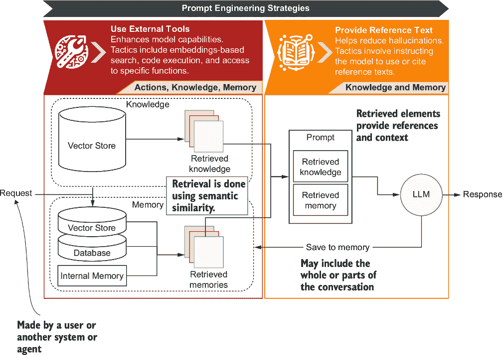
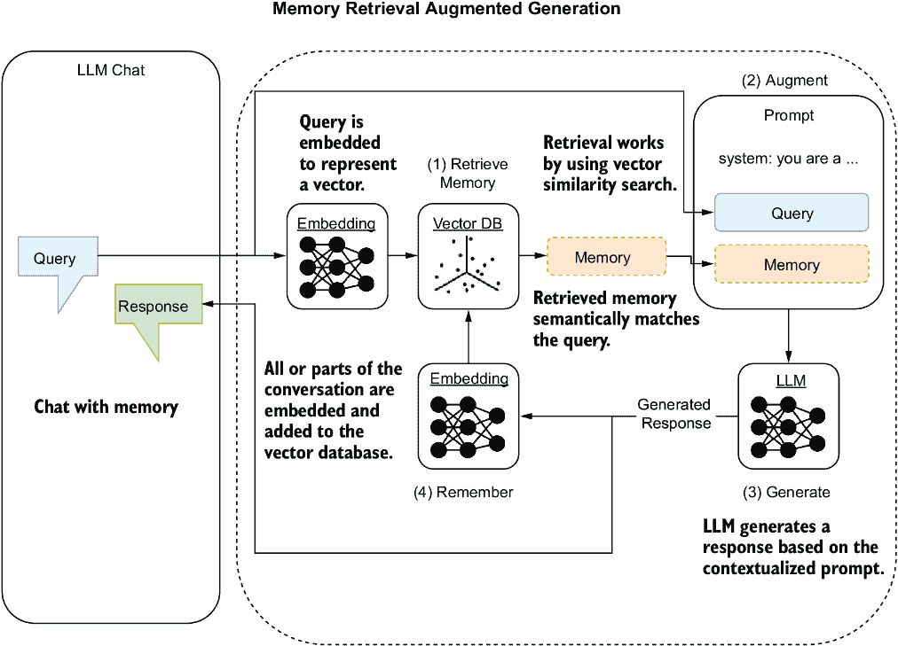
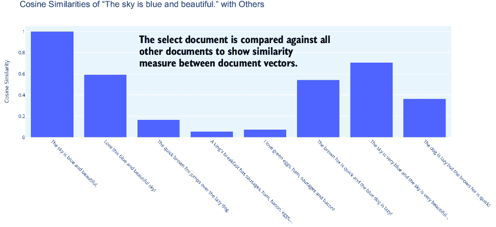
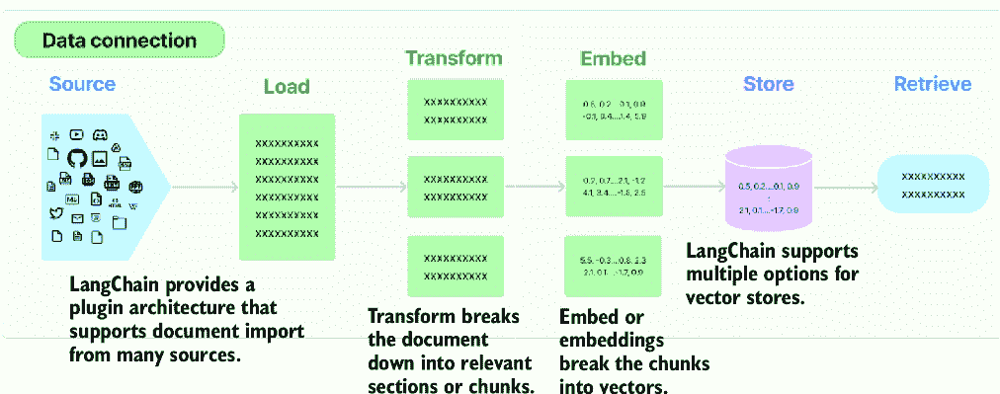
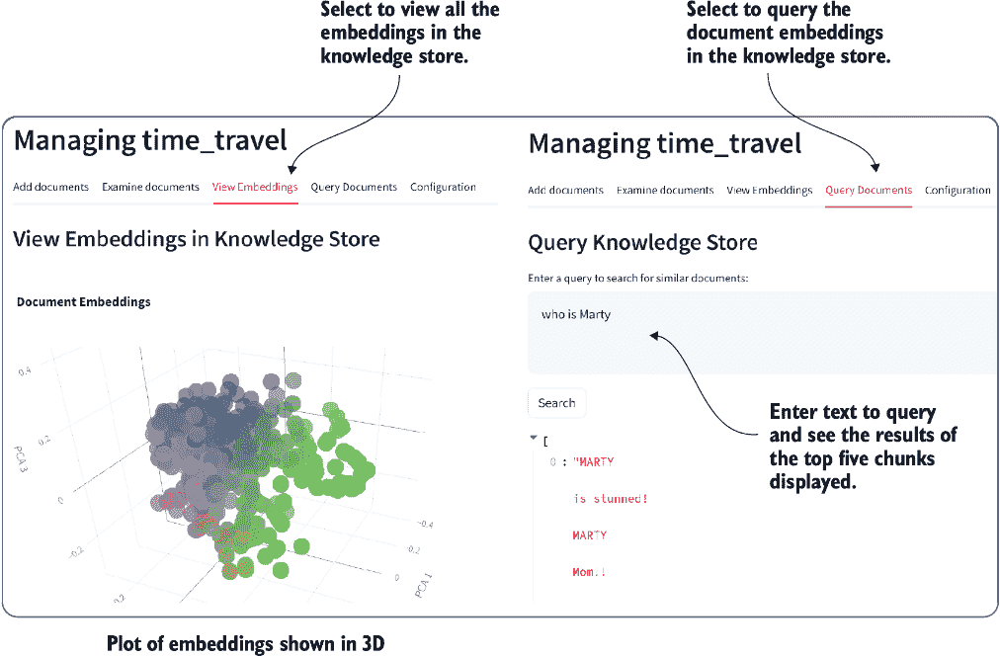
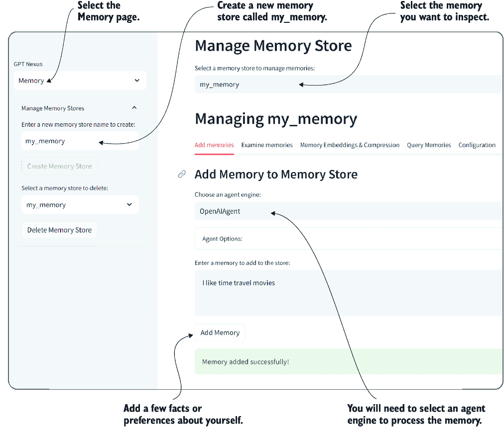
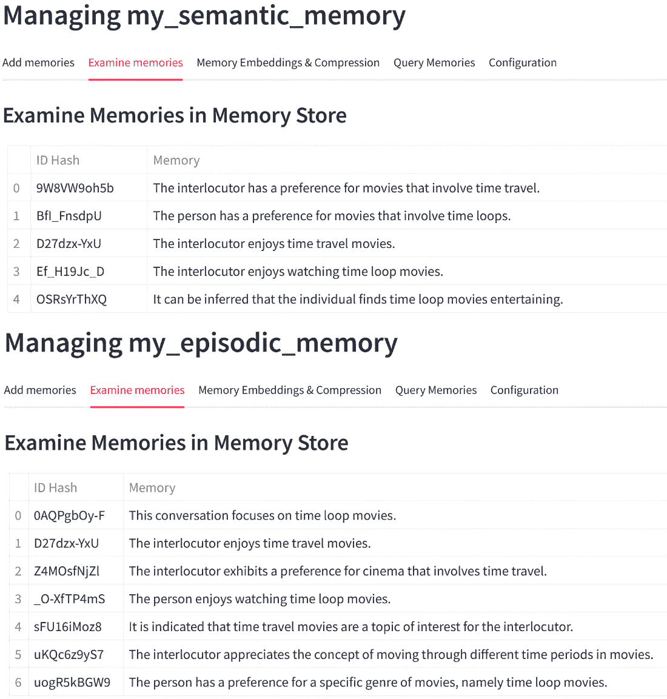

# 8 理解代理记忆和知识

### 本章涵盖

+   人工智能功能中的知识/记忆检索

+   使用 LangChain 构建检索增强生成工作流程

+   Nexus 中用于代理知识系统的检索增强生成

+   代理中记忆的检索模式

+   使用记忆和知识压缩改进增强检索系统

现在我们已经探讨了使用外部工具（如原生或语义函数形式的插件）进行代理动作，我们可以看看在代理和聊天界面中使用检索来处理记忆和知识的作用。我们将描述记忆和知识以及它们与提示工程策略的关系，然后，为了理解记忆知识，我们将研究文档索引，使用 LangChain 构建检索系统，利用 LangChain 使用记忆，并使用 Nexus 构建语义记忆。

## 8.1 理解人工智能应用中的检索

代理和聊天应用中的检索是一种获取知识并将其存储在通常外部且长期存在的存储中的机制。非结构化知识包括对话或任务历史、事实、偏好或其他用于上下文化的提示所需的项目。结构化知识通常存储在数据库或文件中，通过原生函数或插件访问。

如图 8.1 所示，记忆和知识是用于向提示添加更多上下文和相关信息的基本元素。提示可以通过从文档信息到先前任务或对话以及其他参考信息的一切进行增强。



##### 图 8.1 展示了使用以下提示工程策略（使用外部工具和提供参考文本）对提示进行记忆、检索和增强。

图 8.1 中展示的提示工程策略可以应用于记忆和知识。知识并不被视为记忆，而是对现有文档提示的增强。知识和记忆都使用检索作为查询非结构化信息的基础。

检索机制，称为检索增强生成（RAG），已成为提供相关上下文的标准。驱动 RAG 的确切机制也驱动着记忆/知识，理解其工作原理至关重要。在下一节中，我们将检查 RAG 是什么。

## 8.2 检索增强生成（RAG）的基本原理

RAG 已成为支持文档聊天或问答聊天的流行机制。系统通常通过用户提供相关文档（如 PDF 文件），然后使用 RAG 和大型语言模型（LLM）查询该文档来实现。

图 8.2 展示了如何使用 LLM（大型语言模型）查询文档。在查询任何文档之前，它必须首先被加载，转换为上下文块，嵌入到向量中，并存储在向量数据库中。


##### 图 8.2 RAG 的两个阶段：首先，文档必须被加载、转换、嵌入和存储，其次，可以使用增强生成进行查询。

用户可以通过提交查询来查询先前索引的文档。然后，该查询被嵌入到向量表示中，以在向量数据库中搜索相似的片段。与查询内容相似的内容随后用作上下文，并填充到提示中以进行增强。提示被推送到一个大型语言模型 (LLM)，该模型可以使用上下文信息来帮助回答查询。

**非结构化**的记忆/知识概念依赖于图 8.2 所示的检索模式的一种文本相似度搜索格式。图 8.3 展示了记忆如何使用相同的嵌入和向量数据库组件。而不是预加载文档，对话或对话的一部分被嵌入并保存到向量数据库中。



##### 图 8.3 增强生成中的记忆检索使用相同的嵌入模式将项目索引到向量数据库中。

检索模式和文档索引复杂且需要仔细考虑才能成功应用。这需要理解数据是如何存储和检索的，我们将在下一节开始展开讨论。

## 8.3 深入探讨语义搜索和文档索引

文档索引将文档信息转换为更易于恢复的形式。索引的查询或搜索方式也会起到作用，无论是搜索特定的单词集还是想要逐词匹配。

**语义**搜索是通过词语和意义匹配搜索短语的内容。通过语义进行搜索的能力强大且值得深入探讨。在下一节中，我们将探讨向量相似性搜索如何为语义搜索奠定框架。

### 8.3.1 应用向量相似性搜索

现在让我们看看如何将文档转换为**语义向量**，或者说是可以用于执行距离或相似度匹配的文本表示。将文本转换为语义向量的方法有很多，所以我们将探讨一个简单的方法。

在一个新的 Visual Studio Code (VS Code) 工作区中打开 `chapter_08` 文件夹。创建一个新的环境，并使用 `pip` `install` 命令安装 `requirements.txt` 文件以解决所有章节的依赖项。如果您需要帮助设置新的 Python 环境，请参阅附录 B。

现在打开 VS Code 中的 `document_vector_similarity.py` 文件，并查看列表 8.1 的顶部部分。此示例使用词频-逆文档频率 (TF-IDF)。这个数值统计量反映了单词在文档集合或文档集中的重要性，其比例与单词在文档中出现的次数成正比，并受到文档集中单词频率的影响。TF-IDF 是理解文档集合中单个文档重要性的经典度量。

##### 列表 8.1 `document_vector_similarity`（转换为向量）

```py
import plotly.graph_objects as go
from sklearn.feature_extraction.text import TfidfVectorizer
from sklearn.metrics.pairwise import cosine_similarity

documents = [      #1
    "The sky is blue and beautiful.",
    "Love this blue and beautiful sky!",
    "The quick brown fox jumps over the lazy dog.",
    "A king's breakfast has sausages, ham, bacon, eggs, toast, and beans",
    "I love green eggs, ham, sausages and bacon!",
    "The brown fox is quick and the blue dog is lazy!",
    "The sky is very blue and the sky is very beautiful today",
    "The dog is lazy but the brown fox is quick!"
]

vectorizer = TfidfVectorizer()     #2
X = vectorizer.fit_transform(documents)      #3
```

#1 文档样本

#2 使用 TF–IDF 进行向量化

#3 向量化文档。

让我们使用样本句子，“The sky is blue and beautiful”，将 TF–IDF 分解为其两个组成部分，并专注于单词 *blue*。

#### 术语频率（TF）

*术语频率* 衡量一个术语在文档中出现的频率。因为我们只考虑一个文档（我们的样本句子），*blue* 的 TF 的最简单形式可以通过将 *blue* 在文档中出现的次数除以文档中的总单词数来计算。让我们来计算它：

*blue* 在文档中出现的次数：1

文档中的总单词数：6

TF = 1 ÷ 6TF = .16

#### 逆文档频率（IDF）

*逆文档频率* 衡量一个术语在整个语料库中的重要性。它是通过将文档总数除以包含该术语的文档数，然后取该商的对数来计算的：

IDF = log(文档总数 ÷ 包含该词的文档数)

在这个例子中，语料库是包含八个文档的小集合，其中 *blue* 出现在其中的四个文档中。

IDF = log(8 ÷ 4)

#### TF–IDF 计算

最后，我们通过将 TF 和 IDF 分数相乘来计算样本句子中 *blue* 的 TF–IDF 分数：

TF–IDF = TF × IDF

让我们使用提供的示例来计算单词 *blue* 的实际 TF–IDF 值；首先，计算词频（单词在文档中出现的频率）如下：

TF = 1 ÷ 6

假设对数的底数为 10（常用），则逆文档频率的计算如下：

IDF = log10 (8 ÷ 4)

现在，让我们计算句子“ The sky is blue and beautiful”中单词 *blue* 的确切 TF–IDF 值：

术语频率（TF）大约为 0.1670。

逆文档频率（IDF）大约为 0.301。

因此，*blue* 的 TF–IDF（TF × IDF）分数大约为 0.050。

这个 TF–IDF 分数表示在给定的文档（样本句子）中，在指定的语料库（八个文档，其中四个包含 *blue*）的上下文中，单词 *blue* 的相对重要性。更高的 TF–IDF 分数意味着更大的重要性。

我们在这里使用 TF–IDF，因为它简单易用。现在，我们已经将元素表示为向量，我们可以使用余弦相似度来衡量文档相似度。余弦相似度是一种用于计算多维空间中两个非零向量之间角度余弦的度量，它表示它们在不考虑它们大小的情况下有多相似。

图 8.4 展示了余弦距离如何比较两段文本或文档的向量表示。余弦相似度返回一个从 –1（不相似）到 1（相同）的值。*余弦距离* 是一个介于 0 到 2 之间的归一化值，通过从余弦相似度中减去 1 得到。余弦距离为 0 表示相同的项目，而 2 表示完全相反。


##### 图 8.4 如何测量余弦相似度

列表 8.2 展示了如何使用 scikit-learn 的 `cosine_similarity` 函数计算余弦相似度。对集合中的每个文档与其他所有文档之间的相似度进行计算。文档的相似度矩阵存储在 `cosine_similarities` 变量中。然后，在输入循环中，用户可以选择文档以查看其与其他文档的相似度。

##### 列表 8.2 `document_vector_similarity`（余弦相似度）

```py
cosine_similarities = cosine_similarity(X)      #1

while True:      #2
    selected_document_index = input(f"Enter a document number
↪ (0-{len(documents)-1}) or 'exit' to quit: ").strip()

    if selected_document_index.lower() == 'exit':
        break

    if not selected_document_index.isdigit() or 
↪ not 0 <= int(selected_document_index) < len(documents):
        print("Invalid input. Please enter a valid document number.")
        continue

    selected_document_index = int(selected_document_index)    #3

    selected_document_similarities = cosine_similarities[selected_document_index]     #4

# code to plot document similarities omitted
```

#1 计算所有向量对的文档相似度

#2 主要输入循环

#3 获取要比较的选定文档索引

#4 从所有文档中提取计算出的相似度

图 8.5 展示了在 VS Code 中运行示例的输出（按 F5 进入调试模式）。选择文档后，您将看到集合中各种文档之间的相似度。一个文档与其自身之间的余弦相似度为 1。请注意，由于 TF-IDF 向量化，您不会看到负相似度。我们将在稍后探讨其他更复杂的测量语义相似度的方法。



##### 图 8.5 选定文档与文档集之间的余弦相似度

向量化方法将决定文档之间的语义相似度度量。在我们继续探讨更好的文档向量化方法之前，我们将检查存储向量以执行向量相似度搜索。

### 8.3.2 向量数据库和相似度搜索

向量化文档后，它们可以存储在向量数据库中以供后续的相似度搜索。为了演示其工作原理，我们可以使用 Python 代码高效地复制一个简单的向量数据库。

在 VS Code 中打开 `document_vector_database.py`，如列表 8.3 所示。此代码演示了在内存中创建向量数据库，然后允许用户输入文本以搜索数据库并返回结果。返回的结果显示了文档文本和相似度分数。

##### 列表 8.3 `document_vector_database.py`

```py
# code above omitted
vectorizer = TfidfVectorizer()
X = vectorizer.fit_transform(documents)
vector_database = X.toarray()     #1

def cosine_similarity_search(query,
                             database, 
                             vectorizer, 
                             top_n=5):     #2
    query_vec = vectorizer.transform([query]).toarray()
    similarities = cosine_similarity(query_vec, database)[0]
    top_indices = np.argsort(-similarities)[:top_n]  # Top n indices
    return [(idx, similarities[idx]) for idx in top_indices]

while True:      #3
    query = input("Enter a search query (or 'exit' to stop): ")
    if query.lower() == 'exit':
        break
    top_n = int(input("How many top matches do you want to see? "))
    search_results = cosine_similarity_search(query,
                                              vector_database, 
                                              vectorizer, 
                                              top_n)

    print("Top Matched Documents:")
    for idx, score in search_results:
        print(f"- {documents[idx]} (Score: {score:.4f})")   #4

    print("\n")
###Output
Enter a search query (or 'exit' to stop): blue
How many top matches do you want to see? 3
Top Matched Documents:
- The sky is blue and beautiful. (Score: 0.4080)
- Love this blue and beautiful sky! (Score: 0.3439)
- The brown fox is quick and the blue dog is lazy! (Score: 0.2560)
```

#1 将文档向量存储到数组中

#2 执行查询返回、匹配和相似度分数的相似度匹配函数

#3 主要输入循环

#4 遍历结果并输出文本和相似度分数

运行这个练习以查看输出（在 VS Code 中按 F5）。输入任何你喜欢的文本，并查看返回的文档结果。这种搜索表单对于匹配相似单词和短语非常有效。这种搜索方式会错过文档中的单词上下文和意义。在下一节中，我们将探讨一种将文档转换为向量以更好地保留其语义意义的方法。

### 8.3.3 解密文档嵌入

TF–IDF 是一种试图在文档中捕获语义意义的简单形式。然而，它不可靠，因为它只计算单词频率，而不理解单词之间的关系。一种更好且更现代的方法是使用文档嵌入，这是一种文档向量化形式，能更好地保留文档的语义意义。

嵌入网络是通过在大数据集上训练神经网络来构建的，将单词、句子或文档映射到高维向量，基于数据和上下文中的关系捕获语义和句法关系。你通常使用在大量数据集上预训练的模型来嵌入文档并执行嵌入。模型可以从许多来源获得，包括 Hugging Face 和当然还有 OpenAI。

在我们的下一个场景中，我们将使用 OpenAI 嵌入模型。这些模型通常非常适合捕捉嵌入文档的语义上下文。列表 8.4 显示了使用 OpenAI 将文档嵌入到向量中的相关代码，然后这些向量被减少到三维并渲染成图表。

##### 列表 8.4 `document_visualizing_embeddings.py`（相关部分）

```py
load_dotenv()      #1
api_key = os.getenv('OPENAI_API_KEY')
if not api_key:
    raise ValueError("No API key found. Please check your .env file.")
client = OpenAI(api_key=api_key)     #1            

def get_embedding(text, model="text-embedding-ada-002"):     #2
    text = text.replace("\n", " ")
    return client.embeddings.create(input=[text],
              model=model).data[0].embedding                #2

# Sample documents (omitted)

embeddings = [get_embedding(doc) for doc in documents]    #3
print(embeddings_array.shape)

embeddings_array = np.array(embeddings)    #4

pca = PCA(n_components=3)   #5
reduced_embeddings = pca.fit_transform(embeddings_array)
```

#1 将所有项目用逗号和空格连接起来。

#2 使用 OpenAI 客户端创建嵌入

#3 为每个 1536 维度的文档生成嵌入

#4 将嵌入转换为 NumPy 数组以进行 PCA

#5 将维度减少到 3 以进行绘图

当使用 OpenAI 模型对文档进行嵌入时，它将文本转换为一个 1536 维度的向量。我们无法可视化这么多维度，因此我们使用主成分分析（PCA）这种降维技术，将 1536 维度的向量转换为 3 维。

图 8.6 显示了在 VS Code 中运行文件生成的输出。通过将嵌入减少到 3D，我们可以绘制输出以显示语义相似的文档是如何分组的。


##### 图 8.6 3D 嵌入，显示相似语义文档是如何分组的

你可以选择使用哪种嵌入模型或服务。OpenAI 的嵌入模型被认为是通用语义相似度方面最好的。这使得这些模型成为大多数记忆和检索应用的标准。通过我们对于如何使用嵌入将文本向量化并存储在向量数据库中的理解，我们可以在下一节中继续一个更实际的例子。

### 8.3.4 从 Chroma 查询文档嵌入

我们可以将所有部分结合起来，通过使用一个名为 Chroma DB 的本地向量数据库来查看一个完整的示例。存在许多向量数据库选项，但 Chroma DB 是一个优秀的本地向量存储，适用于开发或小规模项目。还有许多更健壮的选项，你可以在以后考虑。

列表 8.5 展示了`document_query_chromadb.py`文件中的新和相关的代码部分。注意，结果是根据距离评分，而不是根据相似度评分。余弦距离由以下公式确定：

余弦距离(A,B) = 1 – 余弦相似度(A,B)

这意味着余弦距离的范围从 0（最相似）到 2（语义上相反）。

##### 列表 8.5 `document_query_chromadb.py`（相关代码部分）

```py
embeddings = [get_embedding(doc) for doc in documents]     #1
ids = [f"id{i}" for i in range(len(documents))]           #1

chroma_client = chromadb.Client()               #2
collection = chroma_client.create_collection(
                       name="documents")       #2
collection.add(     #3
    embeddings=embeddings,
    documents=documents,
    ids=ids
)

def query_chromadb(query, top_n=2):      #4
    query_embedding = get_embedding(query)
    results = collection.query(
        query_embeddings=[query_embedding],
        n_results=top_n
    )
    return [(id, score, text) for id, score, text in
            zip(results['ids'][0],
                results['distances'][0], 
                results['documents'][0])]

while True:     #5
    query = input("Enter a search query (or 'exit' to stop): ")
    if query.lower() == 'exit':
        break
    top_n = int(input("How many top matches do you want to see? "))
    search_results = query_chromadb(query, top_n)

    print("Top Matched Documents:")
    for id, score, text in search_results:
        print(f"""
ID:{id} TEXT: {text} SCORE: {round(score, 2)}
""")    #5

    print("\n")
###Output
Enter a search query (or 'exit' to stop): dogs are lazy
How many top matches do you want to see? 3
Top Matched Documents:
ID:id7 TEXT: The dog is lazy but the brown fox is quick! SCORE: 0.24
ID:id5 TEXT: The brown fox is quick and the blue dog is lazy! SCORE: 0.28
ID:id2 TEXT: The quick brown fox jumps over the lazy dog. SCORE: 0.29
```

#1 为每个文档生成嵌入并分配一个 ID

#2 创建 Chroma DB 客户端和集合

#3 将文档嵌入添加到集合中

#4 查询数据存储并返回最相关的 n 个文档

#5 用户输入循环和输出相关文档/分数的输入循环

如前文场景所示，你现在可以使用语义意义而不是仅仅关键词或短语来查询文档。这些场景现在应该为理解检索模式在底层是如何工作的提供背景。在下一节中，我们将看到如何使用 LangChain 来应用检索模式。

## 8.4 使用 LangChain 构建 RAG

LangChain 最初是一个专注于抽象多个数据源和向量存储检索模式的开源项目。它已经演变得更多，但基础层面上，它仍然为检索实现提供了优秀的选项。

图 8.7 展示了 LangChain 中的一个流程图，该图标识了存储文档以供检索的过程。这些相同的步骤可以全部或部分复制以实现记忆检索。文档检索和记忆检索之间的关键区别在于来源以及内容是如何被转换的。



##### 图 8.7 显示了存储文档以供后续检索的加载、转换、嵌入和存储步骤

我们将探讨如何使用 LangChain 实现这些步骤，并理解伴随此实现的细微差别和细节。在下一节中，我们将首先使用 LangChain 分割和加载文档。

### 8.4.1 使用 LangChain 分割和加载文档

检索机制通过添加与请求相关的特定信息来增强给定提示的上下文。例如，你可能需要关于本地文档的详细信息。在早期的语言模型中，由于标记限制，将整个文档作为提示的一部分提交不是一个选项。

今天，我们可以将整个文档提交给许多商业 LLM，如 GPT-4 Turbo，作为提示请求的一部分。然而，结果可能不会更好，并且可能会因为标记数量的增加而成本更高。因此，更好的选择是将文档分割，并使用相关部分请求上下文——这正是 RAG 和记忆所做的事情。

分割文档对于将内容分解成语义上和具体相关的部分至关重要。图 8.8 显示了如何分解包含老母鸡童谣的 HTML 文档。通常，将文档分割成上下文语义块需要仔细考虑。


##### 图 8.8 理想情况下文档如何分割成块以获得更好的语义和上下文意义

理想情况下，当我们将文档分割成块时，它们应按相关性和语义意义分解。虽然 LLM 或代理可以帮助我们做这件事，但我们将查看 LangChain 中当前的工具包选项，用于分割文档。在本章的后面部分，我们将查看一个可以帮助我们在嵌入内容时进行语义划分的语义函数。

对于下一个练习，在 VS Code 中打开`langchain_load_splitting.py`，如列表 8.6 所示。此代码显示了我们在上一节列表 8.5 中留下的地方。这次我们不是使用样本文档，而是加载这次的老母鸡童谣。

##### 列表 8.6 `langchain_load_splitting.py`（部分和输出）

```py
From langchain_community.document_loaders 
                     ↪ import UnstructuredHTMLLoader    #1
from langchain.text_splitter import RecursiveCharacterTextSplitter
#previous code

loader = UnstructuredHTMLLoader(
                   "sample_documents/mother_goose.html")   #2
data = loader.load    #3

text_splitter = RecursiveCharacterTextSplitter(
    chunk_size=100,
    chunk_overlap=25,     #4
    length_function=len,
    add_start_index=True,
)
documents = text_splitter.split_documents(data)

documents = [doc.page_content 
                ↪ for doc in documents] [100:350]   #5

embeddings = [get_embedding(doc) for doc in documents]     #6
ids = [f"id{i}" for i in range(len(documents))]
###Output
Enter a search query (or 'exit' to stop): **who kissed the girls and made** 
**them cry?**
How many top matches do you want to see? 3
Top Matched Documents:
ID:id233 TEXT: And chid her daughter,
        And kissed my sister instead of me. SCORE: 0.4…
```

#1 新的 LangChain 导入

#2 将文档作为 HTML 加载

#3 加载文档

#4 将文档分割成 100 个字符长、25 个字符重叠的文本块

#5 仅嵌入 250 个块，这更便宜且更快

#6 返回每个文档的嵌入

注意在列表 8.6 中，HTML 文档被分割成 100 个字符的块，并且有 25 个字符的重叠。这种重叠允许文档的部分不会切断特定的想法。我们选择这个分割器进行这个练习，因为它易于使用、设置和理解。

好吧，在 VS Code 中运行`langchain_load_splitting.py`文件（F5）。输入一个查询，看看你得到什么结果。列表 8.6 中的输出显示了给定特定示例的良好结果。请记住，我们只嵌入 250 个文档块以降低成本并使练习简短。当然，你总是可以尝试嵌入整个文档或使用较小的输入文档示例。

构建适当的检索最关键的因素可能是文档分割的过程。你可以使用多种方法来分割文档，包括多种并发方法。超过一种方法会通过分割文档为同一文档的多个嵌入视图。在下一节中，我们将检查一种更通用的文档分割技术，使用标记和标记化。

### 8.4.2 使用 LangChain 按标记分割文档

*分词* 是将文本分割成单词标记的过程。一个单词标记代表文本中的一个简洁元素，一个标记可以是一个像 *hold* 这样的单词，甚至是一个像左花括号 ({) 这样的符号，具体取决于什么是有意义的。

使用分词技术分割文档为语言模型如何解释文本提供了一个更好的基础，以及语义相似性。分词技术还允许移除无关字符，如空白字符，使文档的相似性匹配更加相关，并通常提供更好的结果。

对于下一个代码练习，请在 VS Code 中打开 `langchain_token_splitting.py` 文件，如图 8.7 所示。现在我们使用分词技术将文档分割成大小不等的部分。这种不均匀的大小是由于原始文档中大量空白区域造成的。

##### 列表 8.7 `langchain_token_splitting.py`（相关新代码）

```py
loader = UnstructuredHTMLLoader("sample_documents/mother_goose.html")
data = loader.load()
text_splitter = CharacterTextSplitter.from_tiktoken_encoder(
    chunk_size=50, chunk_overlap=10      #1
)

documents = text_splitter.split_documents(data)
documents = [doc for doc in documents][8:94]      #2

db = Chroma.from_documents(documents, OpenAIEmbeddings())

def query_documents(query, top_n=2):
    docs = db.similarity_search(query, top_n)      #3
    return docs
###Output
Created a chunk of size 68, 
which is longer than the specified 50
Created a chunk of size 67, 
which is longer than the specified 50     #4
Enter a search query (or 'exit' to stop): 
                     who kissed the girls and made them cry?
How many top matches do you want to see? 3
Top Matched Documents:
Document 1: GEORGY PORGY

        Georgy Porgy, pudding and pie,
        Kissed the girls and made them cry.
```

#1 更新为 50 个标记和 10 个标记的重叠

#2 仅选择包含押韵的文档

#3 使用数据库的相似性搜索

#4 由于空白字符而分割成不规则大小的块

在 VS Code 中运行 `langchain_token_splitting.py` 代码（按 F5）。您可以使用上次使用的查询或您自己的查询。注意，结果比上一个练习明显更好。然而，结果仍然可疑，因为查询使用了几个相同顺序的相似词。

一个更好的测试是尝试一个语义上相似的短语，但使用不同的词，并检查结果。代码仍在运行时，输入一个新的查询短语：`为什么` `女孩们` `在哭泣？` 列表 8.8 显示了执行该查询的结果。如果您自己运行此示例并向下滚动输出，您将看到乔治·波吉出现在返回的第二或第三份文档中。

##### 列表 8.8 查询：谁让女孩们哭泣？

```py
Enter a search query (or 'exit' to stop): Who made the girls cry?
How many top matches do you want to see? 3
Top Matched Documents:
Document 1: WILLY, WILLY

        Willy, Willy Wilkin…
```

这个练习展示了如何使用各种检索方法来返回语义上的文档。在这个基础上，我们可以看到 RAG 如何应用于知识和记忆系统。下一节将讨论 RAG 在应用于代理和代理系统知识时的应用。

## 8.5 将 RAG 应用于构建代理知识

代理中的知识包括使用 RAG 在非结构化文档中进行语义搜索。这些文档可以是 PDF 文件、Microsoft Word 文档以及所有文本，包括代码。代理知识还包括使用非结构化文档进行问答、参考查找、信息增强和其他未来模式。

Nexus，是与本书一起开发并在上一章中介绍的代理平台，为代理提供了完整的知识和记忆系统。在本节中，我们将揭示知识系统是如何工作的。

要仅为此章节安装 Nexus，请参阅列表 8.9。在 `chapter_08` 文件夹内打开一个终端，并执行列表中的命令以下载、安装和以正常或开发模式运行 Nexus。如果您想参考代码，应将项目安装在开发模式下，并配置调试器从 VS Code 运行 Streamlit 应用。如果您需要回顾这些步骤中的任何一项，请参阅第七章。

##### 列表 8.9 安装 Nexus

```py
# to install and run
pip install git+https://github.com/cxbxmxcx/Nexus.git

nexus run
# install in development mode
git clone https://github.com/cxbxmxcx/Nexus.git

# Install the cloned repository in editable mode
pip install -e Nexus
```

无论您登录后决定使用哪种方法运行应用程序，请导航到如图 8.9 所示的知识库管理器页面。创建一个新的知识库，然后上传 `sample_documents/back_to_the_future.txt` 电影剧本。


##### 图 8.9 添加新的知识库并填充文档

该脚本是一个大型文档，加载、分块和将部分嵌入到 Chroma DB 向量数据库中可能需要一些时间。等待索引完成，然后您可以检查嵌入并运行查询，如图 8.10 所示。



##### 图 8.10 嵌入和文档查询视图

现在，我们可以将知识库连接到支持的代理并提问。使用左上角的选择器在 Nexus 界面中选择聊天页面。然后，选择一个代理和 `time_travel` 知识库，如图 8.11 所示。您还需要选择一个支持知识的代理引擎。每个代理引擎都需要适当的配置才能访问。


##### 图 8.11 启用知识库以供代理使用

目前，截至本章，Nexus 仅支持一次访问单个知识库。在未来版本中，代理可能能够一次选择多个知识库。这可能包括从语义知识到使用其他形式的 RAG 的更高级选项。

您也可以在知识库管理器页面中的配置选项卡内配置 RAG 设置，如图 8.12 所示。到目前为止，您可以从拆分文档的类型（拆分选项字段）中选择，以及选择分块大小字段和重叠字段。


##### 图 8.12 管理知识库拆分和分块选项

LangChain 目前提供的加载、拆分、分块和嵌入选项是唯一支持的基本选项。在 Nexus 的未来版本中，将提供更多选项和模式。支持其他选项的代码可以直接添加到 Nexus 中。

我们不会介绍执行 RAG 的代码，因为它与我们之前介绍的内容非常相似。您可以自由地回顾 Nexus 代码，特别是 `knowledge_manager.py` 文件中的 `KnowledgeManager` 类。

对于增强知识库和记忆库的检索模式相当相似，但在填充存储时，这两种模式有所不同。在下一节中，我们将探讨使代理中的记忆独特的原因。

## 8.6 在代理系统中实现记忆

在代理和人工智能应用中，记忆通常用与认知记忆功能相同的术语描述。*认知*记忆描述了我们用来记住 30 秒前我们做了什么或 30 年前我们有多高的记忆类型。计算机记忆也是代理记忆的一个基本要素，但本节不会考虑这一点。

图 8.13 展示了记忆是如何分解成感觉、短期和长期记忆的。这种记忆可以应用于人工智能代理，以下列表描述了每种记忆形式如何映射到代理功能：

+   *人工智能中的感觉记忆* — 函数类似于 RAG，但使用图像/音频/触觉数据形式。短暂地保存输入数据（例如，文本和图像）以供即时处理，但不进行长期存储。

+   *人工智能中的短期/工作记忆* — 作为对话历史的活跃记忆缓冲区。我们正在保存有限数量的最近输入和上下文以供即时分析和响应生成。在 Nexus 中，短期和长期对话记忆也保存在线程的上下文中。

+   *人工智能中的长期记忆* — 与代理或用户生活相关的长期记忆存储。语义记忆提供了强大的存储和检索相关全局或局部事实和概念的能力。


##### 图 8.13 如何将记忆分解成各种形式

虽然记忆使用与知识完全相同的检索和增强机制，但在更新或追加记忆时通常会有显著差异。图 8.14 突出了捕获和使用记忆来增强提示的过程。因为记忆通常与完整文档的大小不同，我们可以避免使用任何分割或分块机制。


##### 图 8.14 基本记忆检索和增强工作流程

Nexus 提供了一个类似于知识库的机制，允许用户创建可以配置用于各种用途和应用的记忆存储。它还支持图 8.13 中突出显示的一些更高级的记忆形式。下一节将探讨 Nexus 中基本记忆存储的工作方式。

### 8.6.1 在 Nexus 中消费记忆存储

在 Nexus 中，记忆存储的操作和构建方式类似于知识存储。它们都高度依赖于检索模式。不同的是，记忆系统在构建新记忆时采取的额外步骤。

开始运行 Nexus，如果需要安装，请参考列表 8.9。登录后，选择记忆页面，并创建一个新的记忆存储，如图 8.15 所示。选择一个代理引擎，然后添加一些关于你自己的个人事实和偏好。



##### 图 8.15 向新创建的记忆存储添加记忆

我们需要代理（LLM）的原因在之前的图 8.14 中已经展示。当信息被输入到记忆存储中时，它通常通过使用记忆函数的 LLM 进行处理，该函数的目的是将陈述/对话处理成与记忆类型相关的语义相关信息。

列表 8.10 展示了用于从对话中提取信息到记忆中的对话记忆函数。是的，这只是发送给 LLM 的提示的标题部分，指示它如何从对话中提取信息。

##### 列表 8.10 对话记忆函数

```py
Summarize the conversation and create a set of statements that summarize 
the conversation. Return a JSON object with the following keys: 'summary'. 
Each key should have a list of statements that are relevant to that 
category. Return only the JSON object and nothing else.
```

在生成一些关于自己的相关记忆后，返回 Nexus 的聊天区域，启用`my_memory`记忆存储，看看代理对你了解得有多好。图 8.16 展示了使用不同代理引擎的示例对话。


##### 图 8.16 在同一记忆存储上与不同的代理进行对话

这是一个从对话中提取事实/偏好并将其作为记忆存储在向量数据库中的基本记忆模式示例。许多其他记忆的实现方式遵循之前图 8.13 中展示的。我们将在下一节中实现这些。

### 8.6.2 语义记忆及其在语义、情景和程序性记忆中的应用

心理学家根据记忆中记住的信息将记忆分为多种形式。语义、情景和程序性记忆都代表不同类型的信息。*情景*记忆关于事件，*程序性*记忆关于过程或步骤，而*语义*代表意义，可能包括感觉或情感。其他形式的记忆（如地理空间记忆），这里没有描述，但可能存在。

由于这些记忆依赖于额外的分类级别，它们也依赖于另一个级别的语义分类。一些平台，如语义内核（SK），将这称为*语义记忆*。这可能令人困惑，因为语义分类也应用于提取情景和程序性记忆。

图 8.17 展示了语义记忆分类过程，有时也称为语义记忆。语义记忆与常规记忆的区别在于多了一个处理输入语义并提取可用于查询记忆相关向量数据库的相关问题的步骤。


##### 图 8.17 语义记忆增强的工作原理

使用语义增强的好处是能够提取更多相关记忆的能力增强。我们可以通过回到 Nexus 并创建一个新的语义记忆存储来在操作中看到这一点。

图 8.18 展示了如何使用语义记忆配置新的记忆存储。到目前为止，您还不能配置记忆、增强和总结的具体功能提示。然而，阅读每个功能提示以了解它们的工作方式可能是有用的。


##### 图 8.18 将记忆存储类型更改为语义的配置

现在，如果你回顾并添加事实和偏好，它们将转换为相关记忆类型的语义。图 8.19 显示了将同一组陈述填充到两种不同形式的记忆中的示例。一般来说，输入到记忆中的陈述会更具体地对应记忆的形式。



##### 图 8.19 比较两种不同记忆类型给出的相同信息的记忆

记忆和知识可以显著帮助各种类型的代理。确实，单个记忆/知识存储可以喂养一个或多个代理，允许对这两种存储类型进行进一步的专业解释。我们将通过讨论记忆/知识压缩来结束本章。

## 8.7 理解记忆和知识压缩

就像我们自己的记忆一样，记忆存储可能会随着时间的推移变得杂乱，充满冗余信息和众多无关的细节。在内部，我们的心智通过压缩或总结记忆来处理记忆杂乱。我们的心智记住更重要的细节，而不是不那么重要的细节，以及更频繁访问的记忆。

我们可以将记忆压缩的类似原则应用于代理记忆和其他检索系统，以提取重要细节。压缩的原则与语义增强类似，但为相关记忆的预聚类组添加了另一层，这些组可以共同总结。

图 8.20 展示了记忆/知识压缩的过程。记忆或知识首先使用如 k-means 之类的算法进行聚类。然后，将记忆组通过压缩函数传递，该函数总结并收集项目以形成更简洁的表示。


##### 图 8.20 记忆和知识压缩的过程

Nexus 通过使用 k-means 最优聚类为知识和记忆存储提供压缩。图 8.21 显示了记忆的压缩界面。在压缩界面中，您将看到以 3D 形式显示并聚类的项目。簇的大小（项目数量）显示在左侧的表中。


##### 图 8.21 压缩记忆的界面

如果聚类中的项目数量很大或不平衡，通常建议压缩记忆和知识。每个压缩用例可能根据记忆的使用和应用而有所不同。不过，一般来说，如果对存储中的项目进行检查发现存在重复或重复信息，那么进行压缩就是时候了。以下是对从压缩中受益的应用程序的用例总结。

#### 知识压缩的案例

知识检索和增强也已被证明可以从压缩中受益显著。结果将因用例而异，但通常，知识来源越冗长，它从压缩中受益就越多。具有文学散文的文档，如故事和小说，将比代码库等受益更多。然而，如果代码同样非常重复，压缩也可能显示出其益处。

#### 压缩应用频率的案例

定期应用压缩通常会从内存中受益，而知识库通常只在第一次加载时提供帮助。你应用压缩的频率将很大程度上取决于内存使用、频率和数量。

#### 多次应用压缩的案例

同时进行多次压缩已被证明可以提高检索性能。其他模式也建议在压缩的不同级别使用记忆或知识。例如，知识库被压缩两次，从而产生三个不同的知识级别。

#### 知识和记忆压缩融合的案例

如果一个系统专门针对特定的知识来源，并且该系统还使用记忆，那么可能还有进一步的优化来整合存储。另一种方法是直接用文档的起始知识填充记忆。

#### 多个记忆或知识存储的案例

在更高级的系统里，我们将探讨使用与其工作流程相关的多个记忆和知识库的代理。例如，一个代理可以作为其与单个用户的对话的一部分使用单独的记忆库，也许包括能够与不同群体分享不同组记忆的能力。记忆和知识检索是代理系统的基石，我们现在可以总结我们所学的内容，并在下一节回顾一些学习练习。

## 8.8 练习

使用以下练习来提高你对材料的了解：

+   *练习 1* — 加载并拆分不同的文档（中级）

*目标* — 使用 LangChain 了解文档拆分对检索效率的影响。

*任务*:

+   +   选择不同的文档（例如，新闻文章、科学论文或短篇小说）。

    +   使用 LangChain 加载并将文档拆分成块。

    +   分析文档如何拆分成块以及这对检索过程的影响。

+   *练习 2* — 尝试语义搜索（中级）

*目标* — 通过执行语义搜索比较各种向量化技术的有效性。

*任务*:

+   +   选择一组文档进行语义搜索。

    +   使用 Word2Vec 或 BERT 嵌入等向量化方法而不是 TF–IDF。

    +   执行语义搜索，并将结果与使用 TF–IDF 获得的结果进行比较，以了解差异和有效性。

+   *练习 3* — 实现自定义 RAG 工作流程（高级）

*目标* — 在实际环境中使用 LangChain 应用 RAG 的理论知识。

*任务*：

+   +   选择一个特定的应用（例如，客户服务查询或学术研究查询）。

    +   使用 LangChain 设计和实现一个定制的 RAG 工作流程。

    +   调整工作流程以适应所选应用，并测试其有效性。

+   *练习 4* — 构建知识库并实验分割模式（中级）

*目标* — 理解不同的分割模式和压缩如何影响知识检索。

*任务*：

+   +   构建一个知识库，并用几份文档填充它。

    +   尝试不同的分割/分块模式，并分析它们对检索的影响。

    +   压缩知识库，并观察对查询性能的影响。

+   *练习 5* — 构建和测试各种记忆存储（高级）

*目标* — 理解不同记忆存储类型的独特性和用例。

*任务*：

+   +   构建各种形式的记忆存储（对话式、语义、情景和程序性）。

    +   使用每种类型的记忆存储与代理进行交互，并观察差异。

    +   压缩记忆存储，并分析对记忆检索的影响。

## 摘要

+   在 AI 应用中，记忆区分了非结构化和结构化记忆，突出了它们在为更相关的交互情境化提示中的应用。

+   检索增强生成（RAG）是一种通过使用向量嵌入和相似度搜索从外部文档中检索相关内容来增强提示的上下文机制。

+   使用文档索引进行语义搜索，通过 TF-IDF 和余弦相似度将文档转换为语义向量，增强在索引文档中执行语义搜索的能力。

+   向量数据库和相似度搜索存储将文档向量存储在向量数据库中，便于高效的相似度搜索并提高检索准确性。

+   文档嵌入通过使用如 OpenAI 的模型等模型捕获语义含义，生成嵌入以保留文档的上下文并促进语义相似度搜索。

+   LangChain 提供了执行 RAG 的几个工具，并抽象了检索过程，使得在各个数据源和向量存储中轻松实现 RAG 和记忆系统成为可能。

+   LangChain 中的短期和长期记忆实现了 LangChain 内的对话式记忆，区分了短期缓冲模式和长期存储解决方案。

+   在数据库中存储文档向量对于在 AI 应用中实现可扩展的检索系统至关重要。

+   代理知识直接关联到在文档或其他文本信息上执行问答的通用 RAG 模式。

+   代理记忆是与 RAG 相关的模式，它捕捉了代理与用户、自身和其他系统之间的交互。

+   Nexus 是一个实现代理知识记忆系统的平台，包括为文档检索设置知识库和为各种形式的记忆设置记忆库。

+   语义记忆增强（语义记忆）区分不同类型的记忆（语义记忆、情景记忆、程序性记忆）。它通过语义增强实现这些记忆类型，增强代理者回忆和使用与记忆性质相关的特定信息的能力。

+   记忆与知识压缩是用于压缩存储在记忆和知识系统中的信息的技术，通过聚类和总结来提高检索效率和相关性。
