# 9 使用提示流掌握代理提示

### 本章涵盖了

+   理解系统化的提示工程并设置你的第一个提示流

+   构建有效的配置文件/角色提示

+   评估配置文件：评分标准和扎根

+   对大型语言模型配置文件进行扎根评估

+   比较提示：获得完美的配置文件

在本章中，我们深入探讨了系统性地测试变化的提示工程策略。如果你还记得，我们在第二章中介绍了 OpenAI 提示工程框架的大策略。这些策略在帮助我们构建更好的提示、进而构建更好的代理配置文件和角色方面至关重要。理解这一角色对于我们提示工程的旅程至关重要。

系统性地测试变化是提示工程的核心要素之一，因此微软开发了一个围绕这一策略的工具，称为*提示流*，将在本章后面进行描述。在了解提示流之前，我们需要理解为什么我们需要系统性的提示工程。

## 9.1 为什么我们需要系统化的提示工程

提示工程本质上是一个迭代过程。在构建提示时，你通常会进行迭代和评估。为了看到这一概念的实际应用，可以考虑将提示工程简单应用于 ChatGPT 的问题。

你可以通过打开浏览器到 ChatGPT ([`chat.openai.com/`](https://chat.openai.com/))，将以下（文本）提示输入到 ChatGPT 中，然后点击发送消息按钮（如图 9.1 左侧所示的一个对话示例）：

你能推荐一些东西吗


##### 图 9.1 应用提示工程和迭代的不同

我们可以看到，ChatGPT 的回应是要求更多信息。请继续与 ChatGPT 开启一个新的对话，并输入以下提示，如图 9.1 右侧所示：

你能推荐一部设定在中世纪时期的时空旅行电影吗？

图 9.1 的结果显示了在请求中省略细节和更加具体之间的明显差异。我们刚刚应用了礼貌地撰写清晰指令的策略，ChatGPT 为我们提供了一个好的推荐。但也要注意 ChatGPT 本身如何引导用户进行更好的提示。如图 9.2 所示的刷新屏幕显示了 OpenAI 的提示工程策略。

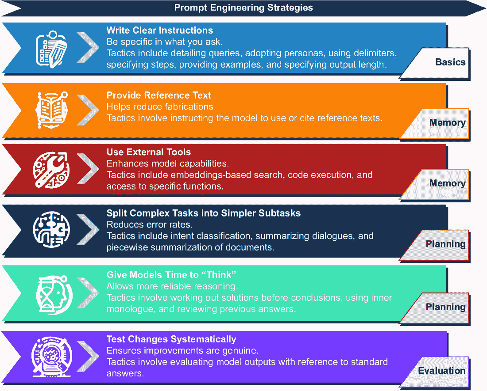

##### 图 9.2 OpenAI 提示工程策略，按代理组件分解

我们刚刚应用了简单的迭代来改进我们的提示。我们可以通过使用系统提示/消息来扩展这个例子。图 9.3 展示了系统提示在迭代通信中的应用和作用。在第二章中，我们在各种示例中使用了系统消息/提示。


##### 图 9.3 LLM 对话中的消息以及消息的迭代

你也可以在 ChatGPT 中尝试这个方法。这次，输入以下提示，并在单词*system*后面加上小写字母，然后换行（在消息窗口中按 Shift-Enter 键换行，但不发送消息）：

system

你是时间旅行电影的专家。

ChatGPT 将回应一些愉快的评论，如图 9.4 所示。因此，它很高兴接受其新角色，并询问任何后续问题。现在输入以下通用的提示，就像我们之前做的那样：

你能推荐一些东西吗


##### 图 9.4 向我们之前的对话添加系统提示的效果

我们刚刚看到了提示的迭代优化，即提示工程，以提取更好的响应。这是通过使用 ChatGPT UI 进行的三次不同对话来实现的。虽然这不是最有效的方法，但它有效。

然而，我们还没有定义评估提示和确定何时提示有效的迭代流程。图 9.5 展示了使用迭代和评估的系统方法进行提示工程。


##### 图 9.5 提示工程的系统方法

迭代和评估提示的系统涵盖了广泛的系统化测试策略。评估提示的性能和有效性仍然是新的，但我们将使用教育技术，如评分标准和扎根，这些将在本章后面的部分进行探讨。然而，正如下一节所阐述的，在我们这样做之前，我们需要了解角色和代理配置文件之间的区别。

## 9.2 理解代理配置文件和角色

一个*代理配置文件*是对描述代理的组件提示或消息的封装。它包括代理的角色、特殊指令和其他可以指导用户或其他代理消费者的策略。

图 9.6 展示了代理配置文件的主要元素。这些元素映射到本书中描述的提示工程策略。并非所有代理都会使用完整代理配置文件的所有元素。


##### 图 9.6 代理配置文件的部分组件

在基本层面上，一个*代理配置文件*是一组描述代理的提示。它可能包括与动作/工具、知识、记忆、推理、评估、计划和反馈相关的其他外部元素。这些元素的组合构成了一个完整的代理提示配置文件。

提示是代理功能的核心。一个提示或一组提示驱动着配置文件中每个代理组件。对于动作/工具，这些提示定义得很好，但正如我们所看到的，记忆和知识的提示可以根据用例显著变化。

人工智能代理配置文件的定义不仅仅是系统提示。提示流程可以让我们构建构成代理配置文件的提示和代码，同时还包括评估其有效性的能力。在下一节中，我们将打开提示流程并开始使用它。

## 9.3 设置您的第一个提示流

提示流是由微软在其 Azure 机器学习工作室平台内开发的工具。该工具后来作为开源项目发布在 GitHub 上，在那里它吸引了更多的关注和使用。虽然最初旨在作为应用平台，但它后来在开发和评估提示/配置文件方面显示出其优势。

由于提示流最初是为了在 Azure 上作为服务运行而开发的，它具有强大的核心架构。该工具支持多线程批量处理，这使得它在评估大量提示时非常理想。下一节将探讨使用提示流的入门基础知识。

### 9.3.1 入门

在尝试本书中的练习之前，有一些先决条件需要完成。本节和章节的相关先决条件如下所示；确保在尝试练习之前完成它们：

+   *Visual Studio Code (VS Code)* — 请参考附录 A 中的安装说明，包括额外的扩展。

+   *提示流，VS Code 扩展* — 详细安装扩展的步骤请参考附录 A。

+   *Python 虚拟环境* — 详细设置虚拟环境的步骤请参考附录 A。

+   *安装提示流包* — 在您的虚拟环境中，执行快速`pip install`，如图所示：

```py
pip install promptflow promptflow-tools
```

+   *LLM（GPT-4 或更高版本）* — 您需要通过 OpenAI 或 Azure OpenAI Studio 访问 GPT-4 或更高版本。如需帮助访问这些资源，请参考附录 B。

+   *书籍的源代码* — 将书籍的源代码克隆到本地文件夹；如需帮助克隆存储库，请参考附录 A。

打开 VS Code 到书籍的源代码文件夹，`第三章`。确保您已连接虚拟环境并安装了提示流包和扩展。

首先，您需要在提示流扩展内创建与您的 LLM 资源的连接。在 VS Code 中打开提示流扩展，然后点击打开连接。然后，点击 LLM 资源旁边的加号创建一个新的连接，如图 9.7 所示。

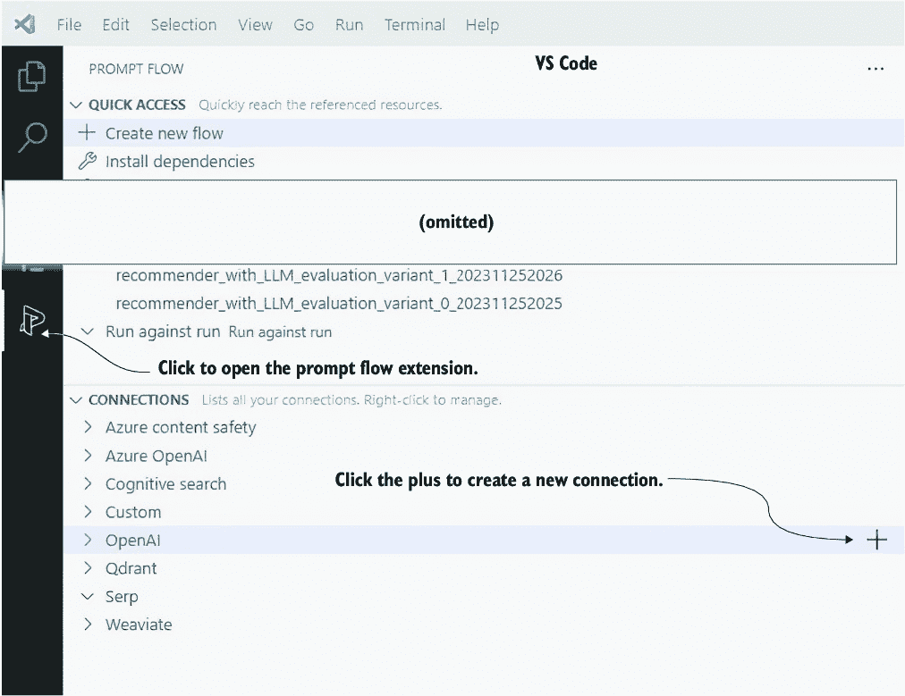

##### 图 9.7 创建新的提示流 LLM 连接

这将打开一个 YAML 文件，您需要填写连接名称和其他与您的连接相关的信息。按照指示操作，不要在文档中输入 API 密钥，如图 9.8 所示。

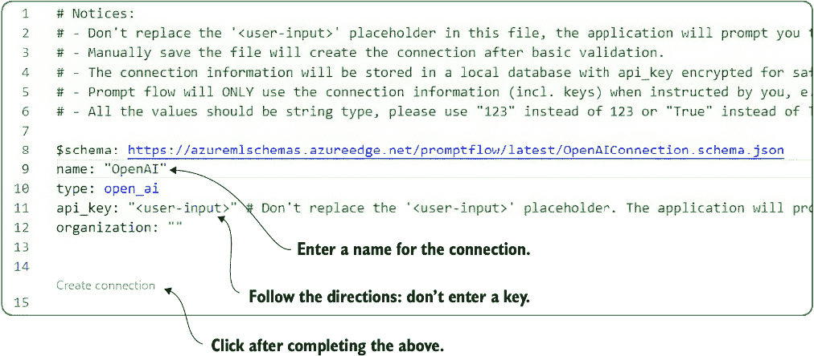

##### 图 9.8 设置 LLM 资源连接信息

当输入连接信息后，点击文档底部的创建连接链接。这将打开文档下方的终端提示，要求您输入密钥。根据您的终端配置，您可能无法粘贴（Ctrl-V，Cmd-V）。或者，您可以通过将鼠标光标悬停在终端上并右键单击 Windows 来粘贴密钥。

我们现在将通过首先打开`chapter_09/promptflow/simpleflow`文件夹中的简单流程来测试连接。然后，在 VS Code 中打开`flow.dag.yaml`文件。这是一个 YAML 文件，但提示流程扩展提供了一个可以通过点击文件顶部的“可视化编辑器”链接访问的可视化编辑器，如图 9.9 所示。


##### 图 9.9 打开提示流程可视化编辑器

打开可视化编辑器窗口后，您将看到一个表示流程和流程块的图形。双击推荐器块，并设置连接名称、API 类型以及模型或部署名称，如图 9.10 所示。

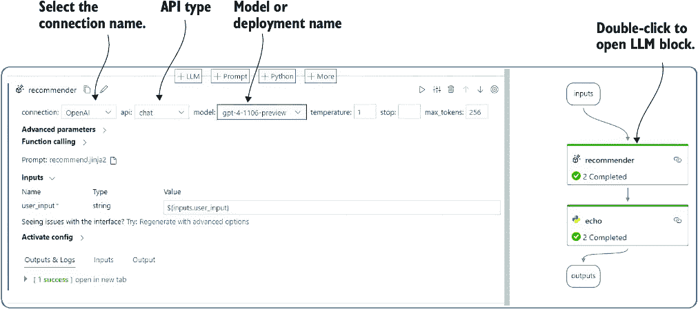

##### 图 9.10 设置 LLM 连接详细信息

提示流程由一组块组成，从 `Inputs` 块开始，以 `Outputs` 块结束。在这个简单流程中，`recommender` 块代表 LLM 连接和与模型对话所使用的提示。对于这个简单示例，`echo` 块会回显输入。

当在提示流程或通过 API 创建与 LLM 的连接时，以下是我们始终需要考虑的关键参数（提示流程文档：[`microsoft.github.io/promptflow`](https://microsoft.github.io/promptflow)）：

+   *连接* — 这是连接名称，但也代表了您所连接的服务。提示流程支持多个服务，包括本地部署的 LLM。

+   *API* — 这是 API 类型。选项包括用于聊天完成 API 的 `chat`，例如 GPT-4，或用于较老完成模型的 `completion`，例如 OpenAI Davinci。

+   *模型* — 这可能是模型或部署名称，具体取决于您的服务连接。对于 OpenAI，这将是指模型的名称，而对于 Azure OpenAI，它将代表部署名称。

+   *温度* — 这代表了模型响应的随机性或可变性。`1` 的值表示响应的高度可变性，而 `0` 表示不希望有任何可变性。这是一个关键参数，我们将看到，它将根据用例而变化。

+   *停止* — 这个可选设置告诉 LLM 调用停止创建标记。它更适合较老和开源模型。

+   *最大标记数* — 这限制了对话中使用的标记数量。了解您使用了多少标记对于评估您的 LLM 交互在扩展时的表现至关重要。如果您正在探索和进行研究，标记计数可能不是问题。然而，在生产系统中，标记代表了 LLM 的负载，使用大量标记的连接可能无法很好地扩展。

+   *高级参数* — 您可以设置一些更多选项来调整您与 LLM 的交互，但我们将在此书后面的章节中介绍这个主题。

在配置了 LLM 块之后，向上滚动到输入块部分，并查看用户输入字段中显示的主要输入，如图 9.11 所示。保持默认设置，然后点击窗口顶部的播放按钮。

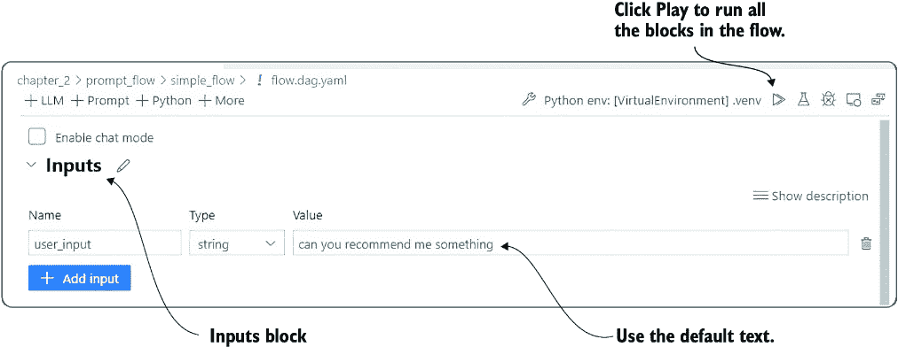

##### 图 9.11 设置输入并启动流

流中的所有块都将运行，结果将在终端窗口中显示。您可能会发现有趣的是，输出显示了时间旅行电影的推荐。这是因为推荐块已经设置了一个简单的配置文件，我们将在下一节中看到它是如何工作的。

### 9.3.2 使用 Jinja2 模板创建配置文件

流的响应是基于它使用的提示或配置文件的时间旅行电影推荐。默认情况下，提示流使用 Jinja2 模板来定义提示的内容或我们称之为 *配置文件* 的内容。为了本书和我们对 AI 代理的探索，我们将把这些模板称为流的配置文件或代理的配置文件。

虽然提示流没有明确将自己称为助手或代理引擎，但它确实符合产生代理和通用类型代理的标准。正如您将看到的，提示流甚至支持将流部署到容器中作为服务。

打开 VS Code 到 `chapter_09/promptflow/simpleflow/flow.dag.yaml`，并在可视化编辑器中打开该文件。然后，定位到提示字段，并点击如图 9.12 所示的 `recommended` `.jinja2` 链接。


##### 图 9.12 打开提示 Jinja2 模板并检查配置文件/提示的部分

Jinja 是一个模板引擎，Jinja2 是该引擎的一个特定版本。模板是定义任何形式文本文档布局和部分的一种极好方式。它们已被广泛用于生成 HTML、JSON、CSS 和其他文档形式。此外，它们支持将代码直接应用到模板中。虽然没有标准的方式来构建提示或代理配置文件，但本书中我们更倾向于使用模板引擎，如 Jinja。

在这一点上，更改系统提示中 `recommended.jinja2` 模板的角色。然后，通过在可视化编辑器中打开流并点击播放按钮来运行流的所有块。下一节将探讨其他运行提示流的方法，用于测试或实际部署。

### 9.3.3 部署提示流 API

由于提示流也被设计为可以部署为服务，它支持几种快速部署为应用程序或 API 的方法。提示流可以作为本地 Web 应用程序和 API 部署，从终端运行或作为 Docker 容器。

返回 VS Code 中的视觉编辑器中的`flow.dag.yaml`文件。在窗口顶部的播放按钮旁边有几个我们想要进一步调查的选项。如图 9.13 所示，点击构建按钮，然后选择部署为本地应用程序。将创建一个新的 YAML 文件来配置应用程序。保留默认设置，并点击启动本地应用程序链接。

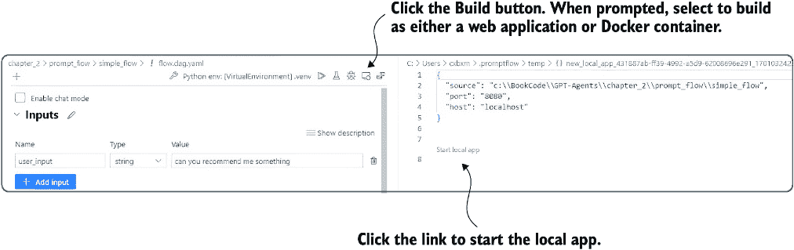

##### 图 9.13 构建并启动流程作为本地应用程序

这将启动流程作为本地 Web 应用程序，你将看到一个浏览器标签页打开，如图 9.14 所示。在用户输入字段中输入一些文本，该字段用红色星号标记为必填项。点击 Enter 并等待几秒钟以获取回复。


##### 图 9.14 将流程作为本地 Web 应用程序运行

你应该会看到一个像图 9.12 中早些时候显示的回复，其中流程或代理回复了一个时间旅行电影的列表。这太棒了——我们刚刚开发出了我们的第一个代理配置文件和代理代理的等效物。然而，我们需要确定这些推荐的成功率或价值。在下一节中，我们将探讨如何评估提示和配置文件。

## 9.4 评估配置文件：评分标准和扎根

任何提示或代理配置文件的关键要素是其执行给定任务的表现。正如我们在我们的推荐示例中所看到的，提示代理配置文件给出一个推荐列表相对容易，但要知道这些推荐是否有帮助，我们需要评估响应。

幸运的是，提示流已经被设计成可以大规模评估提示/配置文件。强大的基础设施允许将 LLM 交互的评估并行化并作为工作者进行管理，这使得数百个配置文件评估和变体可以快速发生。

在下一节中，我们将探讨如何配置提示流以运行提示/配置文件之间的变体。在评估配置文件性能之前，我们需要理解这一点。

提示流提供了一个机制，允许在 LLM 提示/配置文件内进行多种变体。这个工具在比较配置文件变体之间的细微或显著差异时非常出色。当用于执行批量评估时，它可以快速评估配置文件性能，非常有价值。

在 VS Code 和流程视觉编辑器中打开`recommender_with_variations/flow.dag.yaml`文件，如图 9.15 所示。这次，我们使配置文件更加通用，并允许在输入级别进行定制。这使我们能够将我们的推荐扩展到任何事物，而不仅仅是时间旅行电影。

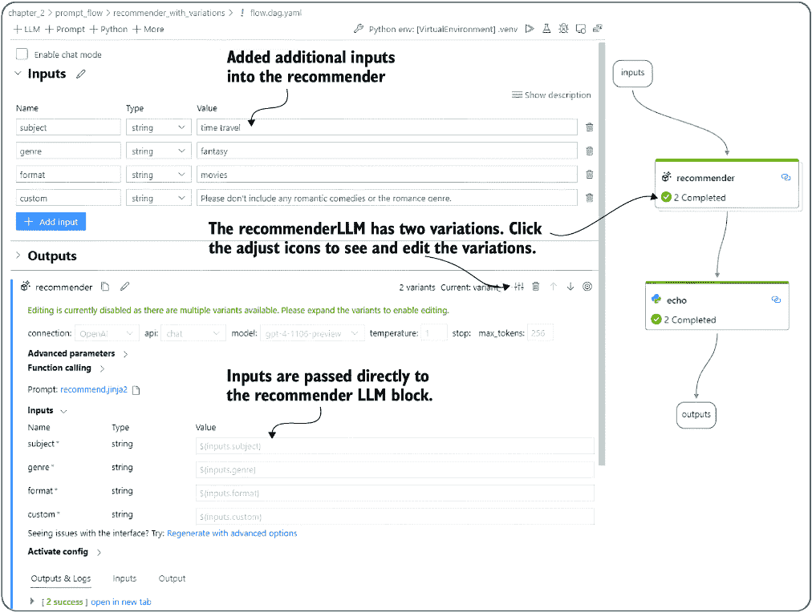

##### 图 9.15 推荐系统，具有不同的流程和扩展的输入

新的输入主题、流派、格式和自定义使我们能够定义一个可以轻松调整到任何推荐的配置文件。这也意味着我们必须根据推荐用例来初始化输入。有几种初始化这些输入的方法；图 9.16 中展示了两种初始化输入的示例。该图显示了两种初始化输入的选项，选项 A 和 B。选项 A 代表经典的用户界面；例如，可能有供用户选择主题或流派的物体。选项 B 放置一个代理/聊天代理以更好地与用户互动，以了解所需的主题、流派等。

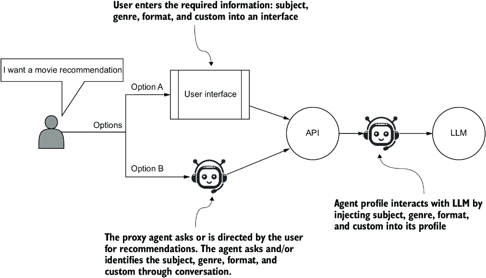

##### **图 9.16 与代理配置文件交互的用户交互选项，以向代理配置文件提供初始输入**

即使考虑到 LLM 的力量，您可能仍然希望或需要使用选项 A。选项 A 的好处是您可以像使用任何现代用户界面一样约束和验证输入。另一方面，选项 A 的缺点是受限的行为可能会限制和限制未来的用例。

选项 B 代表一种没有传统用户界面的更流畅和自然的方式。它比选项 A 更强大、更可扩展，但也为评估引入了更多未知因素。然而，如果选项 B 使用的代理代理编写得很好，它可以在收集更好的用户信息方面提供很大帮助。

您选择的选项将决定您如何评估您的配置文件。如果您对受限的用户界面没有异议，那么输入可能也会被限制为一系列离散值。目前，我们将假设选项 B 用于输入初始化，这意味着输入值将由其名称定义。

要回到 VS Code 和具有变体流的推荐器的可视化视图，请点击图 9.15 中显示的图标以打开变体并允许编辑。然后，点击`recommend.jinja2`和`recommender_variant_1.jinja2`链接以并排打开文件，如图 9.17 所示。


##### 图 9.17 推荐器变体配置文件模板的并排比较

图 9.17 展示了不同配置文件之间的差异。一个配置文件将输入注入到用户提示中，而另一个则注入到系统提示中。然而，重要的是要理解，变化可以涵盖不仅仅是配置文件设计，正如表 9.1 中指出的那样。

##### 表 9.1 提示流中 LLM 变化选项

| 选项 | 评估选项示例 | 备注 |
| --- | --- | --- |
| Jinja2 提示模板 | 比较系统提示变化、用户提示变化或混合提示变化。 | 这里可以应用一些无穷无尽的组合和技术。提示工程一直在不断发展。 |

| LLM | 将 GPT-9.5 与 GPT-4 进行比较。将 GPT-4 与 GPT-4 Turbo 进行比较。

比较开源模型和商业模型。

| 这是一种评估和定位模型性能与提示相对的有效方式。它还可以帮助您调整配置文件以与开源和/或更便宜的模式一起工作。 |
| --- |
| 温度 | 将 0 温度（无随机性）与 1 温度（最大随机性）进行比较。 | 温度的变化可以显著改变某些提示的响应，这可能会改善或降低性能。 |
| 最大令牌数 | 将有限令牌与较大令牌大小进行比较。 | 这可以允许您减少和最大化令牌的使用。 |
| 高级参数 | 将差异与`top_p`、`presence_penalty`、`frequency_penalty`和`logit_bias`等选项进行比较。 | 我们将在后面的章节中介绍这些高级参数的使用。 |
| 函数调用 | 比较不同的函数调用。 | 函数调用将在本章后面讨论。 |

在这个简单的例子中，我们将通过改变输入来使用提示变体，以反映系统或用户提示。参考图 9.17 了解其外观。然后，我们可以通过点击顶部的播放（运行全部）按钮并选择两者来快速运行这两种变体，如图 9.18 所示。


##### 图 9.18 同时运行两个提示变体

在终端窗口中，您将看到两次运行的结果。结果可能看起来很相似，因此现在我们必须继续到下一节，了解如何评估变体之间的差异。

## 9.5 理解评分标准和定位

提示/配置文件性能的评估通常不能通过准确度或正确百分比来衡量。衡量配置文件性能取决于用例和期望的结果。如果这仅仅是确定响应是否正确或错误，那就更好了。然而，在大多数情况下，评估不会那么简单。

在教育中，*评分标准*概念定义了学生必须建立的一套结构化标准，以获得特定的成绩。评分标准也可以用来定义配置文件或提示的性能指南。我们可以遵循以下步骤来定义我们可以用来评估配置文件或提示性能的评分标准：

1.  *确定目的和目标。* 确定您希望配置文件或代理完成的任务。例如，您是想评估特定受众的推荐质量，还是评估特定主题、格式或其他输入的整体质量？

1.  *定义标准。* 制定一套您将用来评估配置文件的准则或维度。这些标准应与您的目标一致，并为评估提供明确的指导。每个标准都应该是具体和可衡量的。例如，您可能希望根据推荐与体裁的契合度来衡量推荐，然后根据主题和格式来衡量。

1.  *创建量表。* 建立一个描述每个标准表现水平的评级量表。标准量表包括数值量表（例如，1-5）或描述性量表（例如，优秀、良好、一般、差）。

1.  *提供描述。* 在量表上的每个级别，提供清晰简洁的描述，说明每个标准中良好表现和较差表现的定义。

1.  *应用评分标准。* 在评估提示或个人资料时，使用评分标准根据既定的标准评估提示的表现。为每个标准分配分数或评级，考虑每个级别的描述。

1.  *计算总分。* 根据你的评分标准，你可能需要通过将每个标准的分数相加来计算总分，或者如果某些标准比其他标准更重要，可以使用加权平均。

1.  *确保评估一致性。* 如果多个评估者正在评估个人资料，确保评分的一致性至关重要。

1.  *审查、修改和迭代。* 定期审查和修改评分标准，以确保其与评估目标和目标一致。根据需要调整以提高其有效性。

*依据* 是一个可以应用于个人资料和提示评估的概念——它定义了回答与给定评分标准的具体标准和准则的契合程度。你也可以将依据视为提示或个人资料输出的基本期望。

此列表总结了使用依据进行个人资料评估时的一些其他重要考虑因素：

+   依据指的是将回答与评分标准、目标和情境对齐。

+   依据涉及评估回答是否直接针对评分标准，是否保持主题一致，以及是否遵守任何提供的指示。

+   评估者和评估在评估依据时衡量准确性、相关性和对标准的遵守程度。

+   依据确保输出回答牢固地根植于指定的情境，使评估过程更加客观和有意义。

一个有充分依据的回答与给定情境和目标下的所有评分标准相符。依据不足的回答可能会失败或完全不符合标准、情境和目标。

由于评分标准和依据的概念可能仍然比较抽象，让我们看看如何将它们应用于我们当前的推荐示例。以下是一个列表，列出了应用于我们的推荐示例的评分标准定义过程：

1.  *确定目的和目标。* 我们的个人资料/提示的目的是在给定主题、格式、体裁和自定义输入的情况下推荐三个顶级项目。

1.  *定义标准。* 为了简单起见，我们将评估特定推荐与给定输入标准、主题、格式和体裁的一致性。例如，如果个人资料在要求电影格式时推荐一本书，我们预计在格式标准上得分较低。

1.  *创建一个量表。* 再次，保持简单，我们将使用 1-5 的量表（1 是差的，5 是优秀的）。

1.  *提供描述。* 请参阅表 9.2 中所示评分尺度的通用描述。

1.  *应用评分标准。* 在这个阶段分配评分标准后，手动评估评分标准与建议是一个很好的练习。

1.  *计算总分。* 对于我们的评分标准，我们将对所有标准的评分进行平均，以提供总分。

1.  *确保评估一致性。* 我们将使用的评估技术将提供非常一致的结果。

1.  *审查、修改和迭代。* 我们将审查、比较和迭代我们的个人资料、评分标准和评估本身。

##### 表 9.2 评分标准

| 评分 | 描述 |
| --- | --- |
| 1  | 对齐差：这与标准预期的相反。  |
| 2  | 对齐不良：这与给定的标准不匹配。  |
| 3  | 一般性对齐：可能与给定的标准相匹配，也可能不匹配。  |
| 4  | 良好对齐：可能不完全符合标准，但在其他方面是合适的。  |
| 5  | 优秀对齐：这是符合给定标准的良好建议。  |

现在可以将这个基本的评分标准应用于评估个人资料的回答。你可以手动进行，或者如你将在下一节中看到的，使用第二个 LLM 个人资料。

## 9.6 使用 LLM 个人资料进行定位评估

本节将使用另一个 LLM 提示/个人资料进行评估和定位。在生成建议之后，这个第二个 LLM 提示将添加另一个块。它将处理生成的建议，并根据之前的评分标准评估每个建议。

在 GPT-4 和其他复杂的 LLM 出现之前，我们从未考虑过使用另一个 LLM 提示来评估或定位个人资料。当使用 LLM 定位个人资料时，你通常希望使用不同的模型。然而，如果你正在比较个人资料，使用相同的 LLM 进行评估和定位是合适的。

在提示流程可视化编辑器中打开`recommender_with_LLM_evaluation/flow.dag.yaml`文件，向下滚动到`evaluate_recommendation`块，并点击`evaluate_recommendation.jinja2`链接以打开文件，如图 9.19 所示。图中的每个评分标准部分都已标识。


##### 图 9.19 评估提示，其中评分标准的各个部分都已概述

我们有一个评分标准，不仅定义良好，而且以提示的形式存在，可以用来评估建议。这使我们能够自动评估给定个人资料的推荐效果。当然，你也可以使用评分标准手动评分和评估建议，以获得更好的基线。

注意：使用 LLM 评估提示和配置文件为比较配置文件的性能提供了一个强大的基线。它还可以以受控和可重复的方式做到这一点，而不带有人为偏见。这为任何配置文件或提示的基线定位提供了一个极好的机制。

返回到 `recommender_with_LLM_evaluation` 流程可视化编辑器，我们可以通过点击播放按钮来运行流程并观察输出。您可以选择运行单个推荐或当被提示时运行两种变体。以下列表显示了使用默认输入的单次评估输出。

##### 列表 9.1 LLM 评分评估输出

```py
{
    "recommendations": "Title: The Butterfly Effect
Subject: 5
Format: 5
Genre: 4

Title: Primer
Subject: 5
Format: 5
Genre: 4

Title: Time Bandits
Subject: 5
Format: 5
Genre: 5"
}
```

我们现在有一个评分标准来定位我们的推荐器，并且使用第二个 LLM 提示自动运行评估。在下一节中，我们将探讨如何同时执行多个评估，然后对全部内容进行总评分。

## 9.7 比较配置文件：获取完美的配置文件

通过我们对评分标准和定位的理解，我们现在可以继续评估和迭代完美的配置文件。不过，在我们这样做之前，我们需要清理 LLM 评估块的输出。这需要我们将推荐解析成更符合 Python 的形式，我们将在下一节中解决这个问题。

### 9.7.1 解析 LLM 评估输出

由于评估块的原始输出是文本，我们现在希望将其解析成更易用的形式。当然，编写解析函数很简单，但还有更好的方法可以自动转换响应。我们在第五章中介绍了关于代理动作的返回响应的更好方法。

在 VS Code 中打开 `chapter_09\prompt_flow\recommender_with_parsing\flow.dag.yaml`，并在可视化编辑器中查看流程。定位到 `parsing_results` 块，并点击链接在编辑器中打开 Python 文件，如图 9.20 所示。


##### 图 9.20 在 VS Code 中打开 `parsing_results.py` 文件

`parsing_results.py` 文件的代码在列表 9.2 中显示。

##### 列表 9.2 `parsing_results.py`

```py
from promptflow import tool

@tool      #1
def parse(input: str) -> str:
    # Splitting the recommendations into individual movie blocks
    rblocks = input.strip().split("\n\n")      #2

    # Function to parse individual recommendation block into dictionary
    def parse_block(block):
        lines = block.split('\n')
        rdict = {}
        for line in lines:
            kvs = line.split(': ')
            key, value = kvs[0], kvs[1]
            rdict[key.lower()] = value     #3
        return rdict

    parsed = [parse_block(block) for block in rblocks]    #4

    return parsed
```

#1 特殊装饰器用于表示工具块

#2 分割输入和双换行符

#3 创建字典条目并设置值

#4 遍历每个块并将其解析为键/值字典

我们正在将列表 9.1 中的推荐输出（仅是一个字符串）转换为字典。因此，此代码将此字符串转换为以下显示的 JSON 块：

*解析前：*

```py
"Title: The Butterfly Effect
Subject: 5
Format: 5
Genre: 4

Title: Primer
Subject: 5
Format: 5
Genre: 4

Title: Time Bandits
Subject: 5
Format: 5
Genre: 5"
```

*解析后：*

```py
       {
            "title": " The Butterfly Effect
            "subject": "5",
            "format": "5",
            "genre": "4"
        },
        {
            "title": " Primer",
            "subject": "5",
            "format": "5",
            "genre": "4"
        },
        {
            "title": " Time Bandits",
            "subject": "5",
            "format": "5",
            "genre": "5"
        }
```

这个 `parsing_results` 块的输出现在被传递到输出，并封装在一个推荐列表中。我们可以通过运行流程来查看所有这些内容的样子。

在可视化编辑器中打开 `flow.dag.yaml` 文件以查看流程，并点击播放（运行全部）按钮。请确保选择使用两种推荐变体。您将看到两种变体都在运行并将输出到终端。

在这一点上，我们已经有一个完整的、可工作的推荐和 LLM 评估流程，该流程为每个输出标准输出一个分数。然而，为了对特定配置文件进行全面评估，我们希望使用各种标准生成多个推荐。我们将在下一节中看到如何批量处理流程。

### 9.7.2 在提示流程中运行批量处理

在我们的通用推荐配置文件中，我们希望评估各种输入标准如何影响生成的推荐。幸运的是，提示流程可以批量处理我们想要测试的任何变化。限制仅限于我们愿意花费的时间和金钱。

为了执行批量处理，我们首先需要创建一个包含我们输入标准的 JSON Lines (JSONL) 或 JSON 列表文档。如果您还记得，我们的输入标准在 JSON 格式下看起来如下：

```py
{
    "subject": "time travel",
    "format": "books",
    "genre": "fantasy",
    "custom": "don't include any R rated content"
}
```

我们希望创建一个类似于刚才展示的 JSON 对象列表，最好是随机生成的。当然，简单地通过提示 ChatGPT 使用以下提示创建 JSONL 文档是做这件事的简单方法：

我正在开发一个推荐代理。该代理将根据以下标准推荐任何内容：

1. 主题 - 示例：时间旅行、烹饪、度假

2. 格式 - 示例：书籍、电影、游戏

3. 类型：纪录片、动作、浪漫

4. 自定义：不包含任何 R 级内容

请您生成一个包含这些标准的随机列表，并以 JSON Lines 文件格式输出。请列出 10 项。

您可以通过访问 ChatGPT 并输入前面的提示来尝试一下。之前生成的文件可以在流程文件夹中找到，文件名为 `\bulk_recommend.jsonl`。此文件的内容在此处展示以供参考：

```py
{
  "subject": "time travel",
  "format": "books",
  "genre": "fantasy",
  "custom": "don't include any R rated content"
}
{
  "subject": "space exploration",
  "format": "podcasts",
  "genre": "sci-fi",
  "custom": "include family-friendly content only"
}
{
  "subject": "mystery",
  "format": "podcasts",
  "genre": "fantasy",
  "custom": "don't include any R rated content"
}
{
  "subject": "space exploration",
  "format": "podcasts",
  "genre": "action",
  "custom": "include family-friendly content only"
}
{
  "subject": "vacation",
  "format": "books",
  "genre": "thriller",
  "custom": "don't include any R rated content"
}
{
  "subject": "mystery",
  "format": "books",
  "genre": "sci-fi",
  "custom": "don't include any R rated content"
}
{
  "subject": "mystery",
  "format": "books",
  "genre": "romance",
  "custom": "don't include any R rated content"
}
{
  "subject": "vacation",
  "format": "movies",
  "genre": "fantasy",
  "custom": "don't include any R rated content"
}
{
  "subject": "cooking",
  "format": "TV shows",
  "genre": "thriller",
  "custom": "include family-friendly content only"
}
{
  "subject": "mystery",
  "format": "movies",
  "genre": "romance",
  "custom": "include family-friendly content only"
}
```

使用这个批量文件，我们可以使用批量 JSONL 文件中的各种输入标准运行两个变体。在可视化编辑器中打开 `flow.dag.yaml` 文件，点击批量（试管图标）以启动批量数据加载过程，并选择如图 9.21 所示的文件。对于某些操作系统，这可能显示为 `本地` `数据` `文件`。

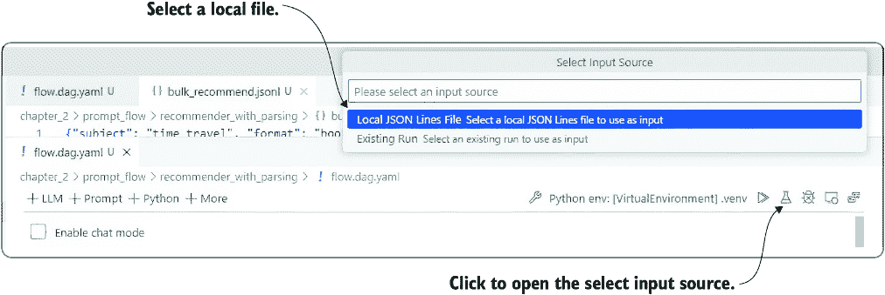

##### 图 9.21 将批量 JSONL 文件加载到运行多个输入变体的流程中

在选择批量文件后，将打开一个新的 YAML 文档，文件底部添加了一个运行链接，如图 9.22 所示。点击链接以执行输入的批量运行。


##### 图 9.22 运行输入的批量运行

在这一点上，将发生几件事情。将出现流程可视化编辑器，旁边将打开一个日志文件，显示运行进度。在终端窗口中，您将看到各种工作进程的生成和运行。

请耐心等待。即使是 10 项，批量运行也可能需要几分钟或几秒钟，这取决于各种因素，如硬件、之前的调用等。等待运行完成，您将在终端中看到结果摘要。

您还可以通过打开提示流扩展并选择最后一个运行来查看运行结果，如图 9.23 所示。然后，通过单击表格单元格深入了解每个运行。在此对话框中公开了大量信息，可以帮助您调试流程和配置文件。

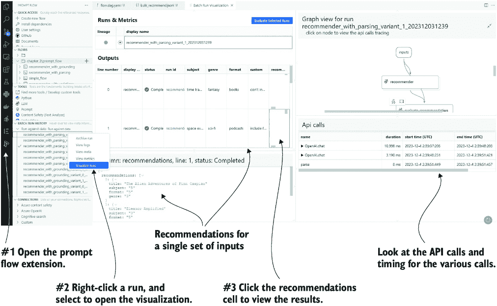

##### 图 9.23 开启运行可视化以及检查批量运行

批量运行期间捕获了大量信息，您可以通过可视化器探索其中大部分。更多信息可以通过从终端窗口单击输出文件夹链接来找到。这将打开另一个 VS Code 会话，输出文件夹允许您查看运行日志和其他细节。

现在我们已经完成了每个变体的批量运行，我们可以应用地面并评估两个提示的结果。下一节将使用一个新的流程来执行配置文件/提示评估。

### 9.7.3 为地面创建评估流程

在可视化编辑器中打开`chapter_3\prompt_flow\evaluate_groundings\flow.dag.yaml`，如图 9.24 所示。评估流程中没有 LLM 块——只有将运行评分然后汇总评分的 Python 代码块。


##### 图 9.24 查看用于地面推荐运行的`evaluate_groundings`流程

现在我们可以查看`scoring`和`aggregate`块的代码，从列表 9.3 中的评分代码开始。此评分代码将每个标准的得分平均到一个平均得分。函数的输出是处理过的推荐列表。

##### 列表 9.3 `line_process.py`

```py
@tool
def line_process(recommendations: str):     #1
    inputs = recommendations
    output = []
    for data_dict in inputs:                      #2
        total_score = 0
        score_count = 0

        for key, value in data_dict.items():     #2
                if key != "title":     #3
                    try:
                        total_score += float(value)
                        score_count += 1
                        data_dict[key] = float(value)     #4
                    except:
                        pass

        avg_score = total_score / score_count if score_count > 0 else 0

        data_dict["avg_score"] = round(avg_score, 2)    #5
        output.append(data_dict)

    return output
```

#1 将一组三个推荐输入到函数中。

#2 遍历每个推荐和标准

#3 标题不是标准，所以忽略它。

#4 对所有标准的得分进行总计，并将浮点值设置为键

#5 将平均得分作为推荐的地面得分

从地面推荐中，我们可以继续使用`aggregate`块来汇总得分——`aggregate`块的代码如下所示。

##### 列表 9.4 `aggregate.py`

```py
@tool
def aggregate(processed_results: List[str]):
    items = [item for sublist in processed_results 
              ↪ for item in sublist]     #1

    aggregated = {}

    for item in items:
        for key, value in item.items():
            if key == 'title':
                continue

            if isinstance(value, (float, int)):      #2
                if key in aggregated:
                    aggregated[key] += value
                else:
                    aggregated[key] = value

    for key, value in aggregated.items():      #3
        value = value / len(items)
        log_metric(key=key, value=value)     #4
        aggregated[key] = value

    return aggregated
```

#1 输入是一个列表的列表；将其展平为项目列表。

#2 检查值是否为数值，并为每个标准键累积得分

#3 遍历汇总的标准得分

#4 将标准作为度量记录

汇总的结果将是每个标准的汇总得分和平均得分。由于评估/地面流程是分开的，它可以在我们进行的任何推荐运行上运行。这将允许我们使用任何变化的批量运行结果来比较结果。

我们可以通过在可视化编辑器中打开`flow.dag.yaml`并单击批量（水壶图标）来运行地面流。然后，当提示时，我们选择一个现有运行，然后选择我们想要评估的运行，如图 9.25 所示。这将打开一个包含底部运行链接的 YAML 文件，就像我们之前看到的那样。单击运行链接以运行评估。


##### 图 9.25 加载先前的运行以进行归一化和评估

运行完成后，你将在终端窗口中看到结果摘要。你可以点击输出链接在 VS Code 中打开文件夹并分析结果，但有一个更好的方法来比较它们。

打开提示流扩展，关注批量运行历史记录窗口，并向下滚动到如图 9.26 所示的运行对比部分。选择你想要比较的运行——可能是靠近顶部的那些——以便出现勾选标记。然后，右键单击运行，并选择可视化运行选项。批量运行可视化窗口打开，你将在顶部看到每个运行的指标。

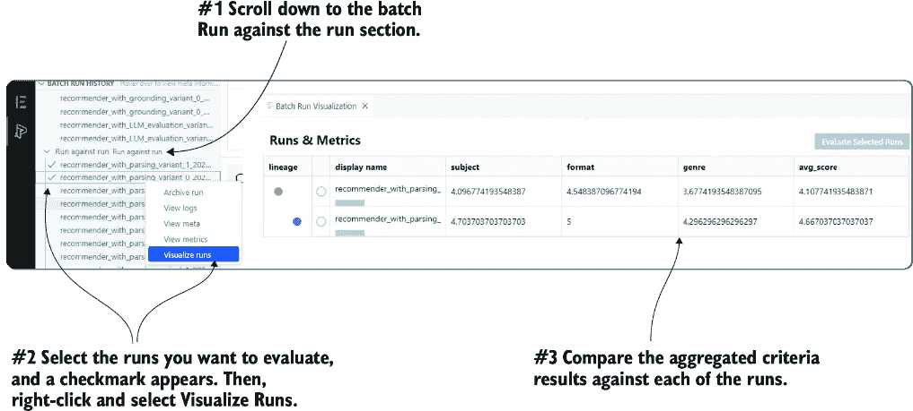

##### 图 9.26 可视化多个运行的指标并进行比较

我们现在可以清楚地看到配置文件/提示变体 0、用户提示和变体 1、系统提示之间的显著差异。如果你需要刷新提示/配置文件的外观，请参考图 9.15。此时，应该很明显，将输入参数注入系统提示可以提供更好的推荐。

你现在可以回去尝试其他配置文件或其他变体选项，看看这对你推荐的影响。可能性几乎是无限的，但希望你能看到提示流将是一个多么出色的工具，用于构建代理配置文件和提示。

### 9.7.4 练习

使用以下练习来提高你对材料的了解：

+   *练习 1* — 为推荐流程创建新的提示变体（中级）

*目标* — 通过在提示流中创建和测试新的提示变体来改进推荐结果。

*任务：*

+   +   在提示流中为推荐流程创建一个新的提示变体。

    +   以批量模式运行流程。

    +   评估结果，以确定它们与原始提示相比是更好还是更差。

+   *练习 2* — 将自定义字段添加到评分标准并进行评估（中级）

*目标* — 通过将自定义字段纳入评分标准和更新评估流程来增强评估标准。

*任务：*

+   +   将自定义字段作为新的标准添加到评分标准中。

    +   更新评估流程以评分新标准。

    +   评估结果，并分析新标准对评估的影响。

+   *练习 3* — 开发新的用例和评估评分标准（高级）

*目标* — 通过开发新的用例和创建评估评分标准来扩展提示工程的应用。

*任务：*

+   +   除了推荐之外，开发一个新的用例。

    +   构建新用例的提示。

    +   为新的提示创建评分标准。

    +   更新或修改评估流程以汇总和比较新用例与现有用例的结果。

+   *练习 4* — 使用 LM Studio 评估其他 LLM（中级）

*目标* — 通过使用 LM Studio 托管本地服务器来评估不同开源 LLM 的性能。

*任务：*

+   +   使用 LM Studio 来托管本地服务器以评估 LLM。

    +   评估其他开源 LLM。

    +   如果需要设置服务器和执行评估的帮助，请参考第二章。

+   *练习 5* — 使用提示流程构建和评估提示（中级）

*目标* — 使用提示流程应用提示工程策略来构建和评估新的提示或配置文件。

*任务：*

+   +   使用提示流程构建新的提示或配置文件以进行评估。

    +   应用第二章中的“编写清晰指令”提示工程策略。

    +   使用提示流程评估提示和配置文件。

    +   如果需要复习策略和实施细节，请参考第二章。

## 摘要

+   代理配置文件由几个其他组件提示组成，可以驱动诸如动作/工具、知识、记忆、评估、推理、反馈和计划等功能。

+   提示流程可用于评估代理的组件提示。

+   系统性提示工程是一个评估提示和代理配置文件的迭代过程。

+   系统性测试更改策略描述了迭代和评估提示，系统提示工程实现了这一策略。

+   代理配置文件和提示工程有许多相似之处。我们定义代理配置文件为引导和帮助代理完成任务的提示工程元素的组合。

+   提示流程是来自微软的开源工具，它为开发和评估配置文件和提示提供了几个功能。

+   提示流程中的 LLM 连接支持额外的参数，包括温度、停止令牌、最大令牌和其他高级参数。

+   LLM 块支持提示和配置文件变体，这允许评估提示/配置文件或其他连接参数的变化。

+   应用到 LLM 提示上的评分标准是提示/配置文件必须满足的准则和标准，以实现扎根。扎根是对评分标准的评分和评估。

+   提示流程支持以单次运行或批量运行的方式运行多个变体。

+   在提示流程中，在生成流程之后运行评估流程以评分和汇总结果。可视化运行选项可以比较跨多个运行评分标准汇总的聚合标准。
