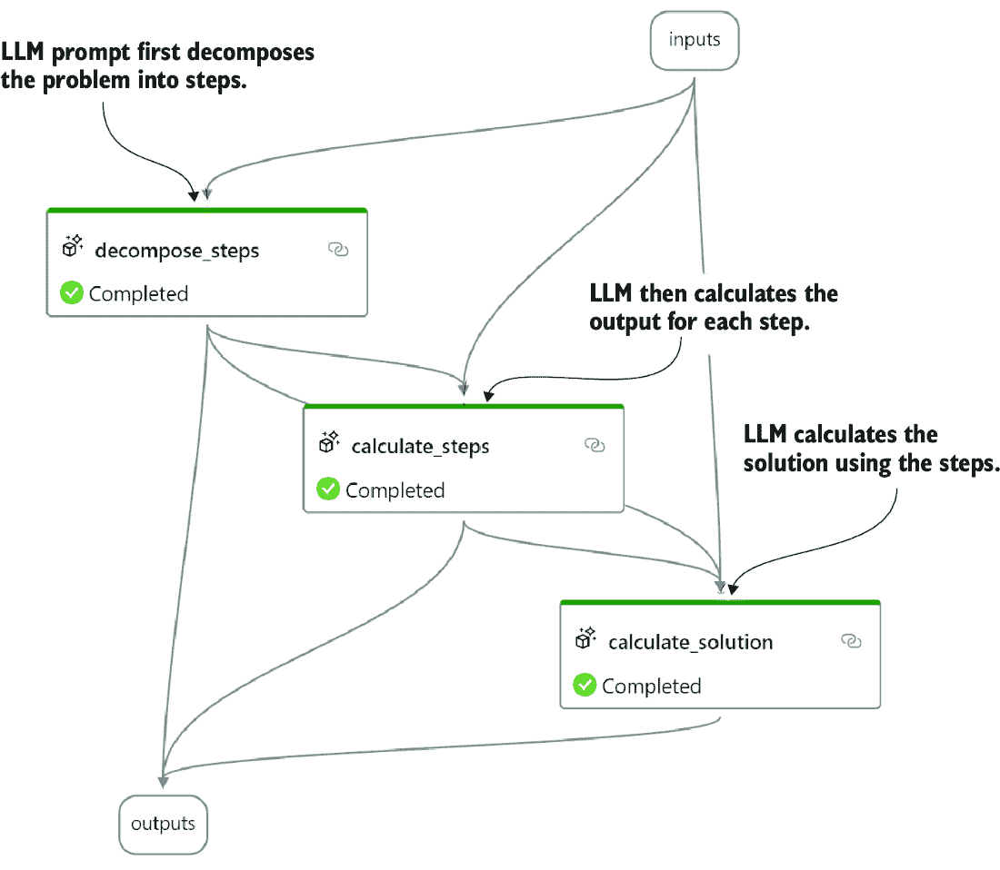
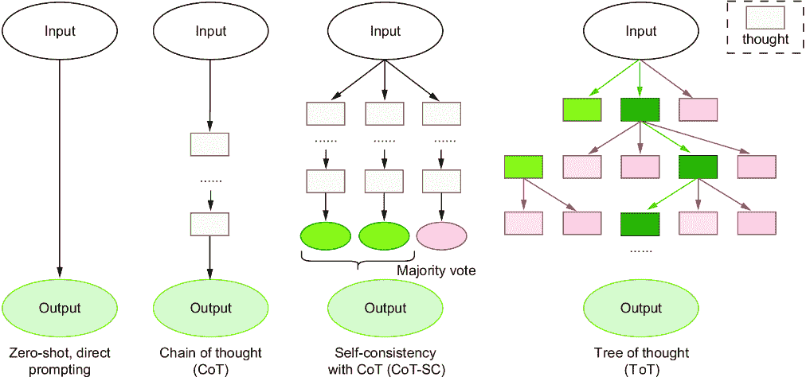
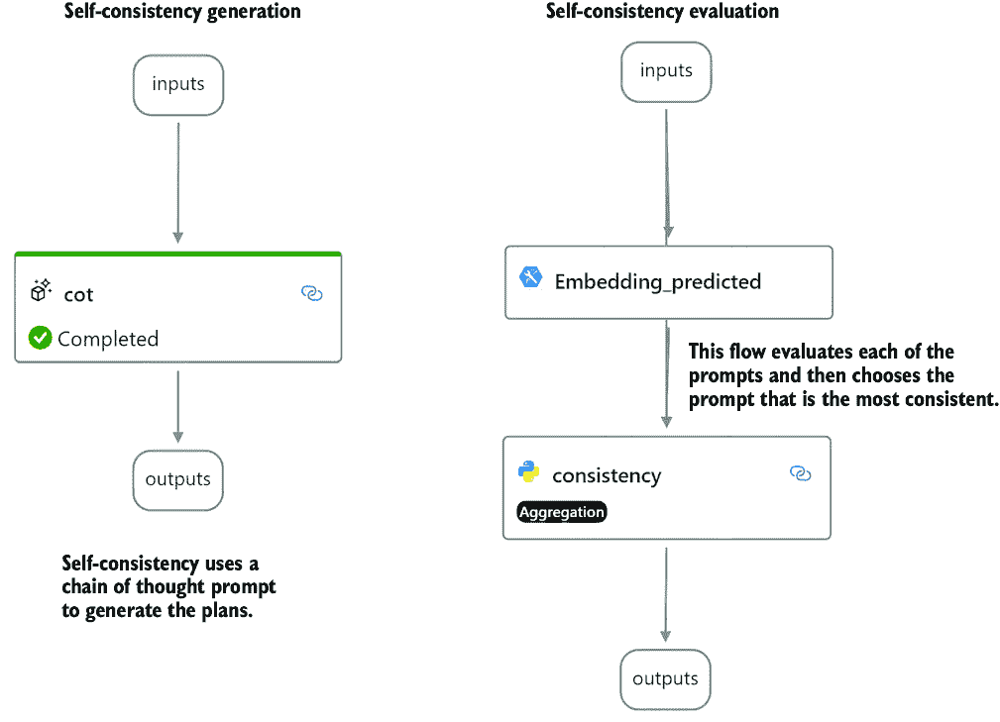
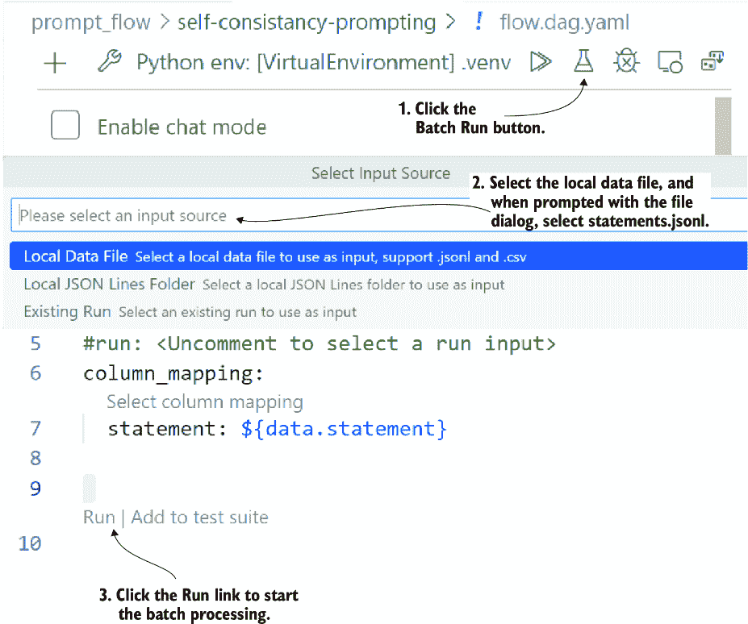
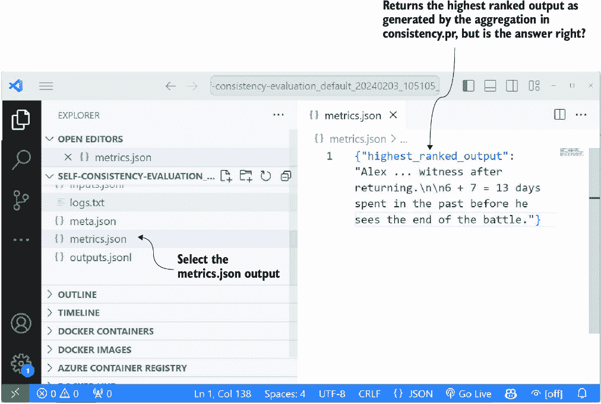
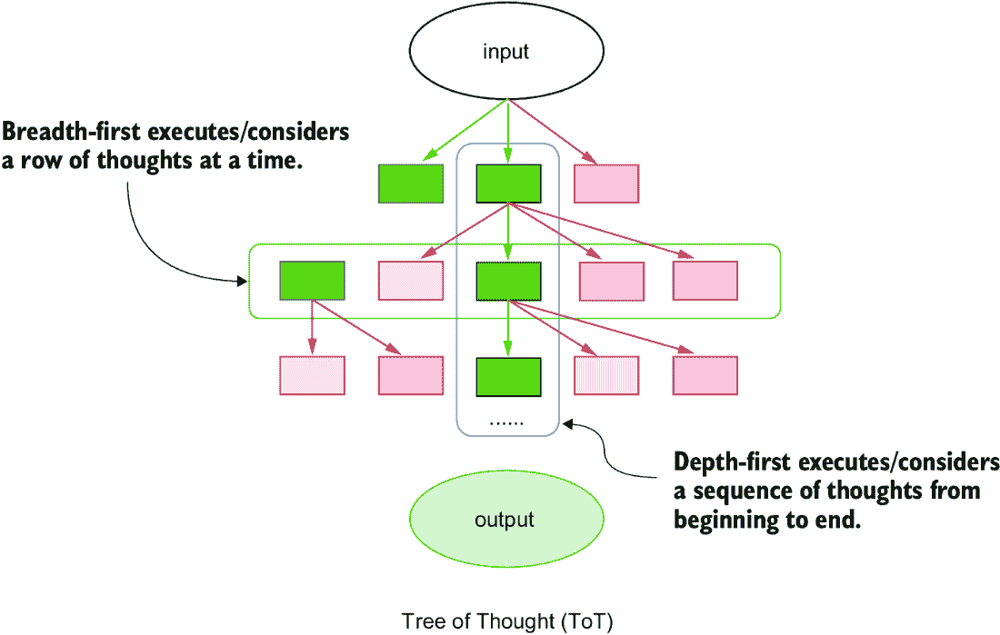

# 10 代理推理和评估

### 本章涵盖

+   使用各种提示工程技术来扩展大型语言模型功能

+   使用涉及推理的提示工程技术来参与大型语言模型

+   使用评估提示来缩小和识别未知问题的解决方案

现在我们已经检查了定义代理中语义记忆组件的记忆和检索模式，我们可以看看代理中最后一个也是最关键的组件：规划。规划包括许多方面，从推理、理解、评估到反馈。

为了探索如何通过提示工程来引导 LLMs 进行推理、理解和规划，我们将演示如何通过提示工程来参与推理，然后扩展到规划。语义内核（SK）提供的规划解决方案包含多种规划形式。我们将通过将自适应反馈纳入一个新的规划器来结束本章。

图 10.1 展示了本章将涵盖的高级提示工程策略以及它们与我们将要介绍的各种技术之间的关系。图中的每种方法都将在本章中探讨，从左上角显示的解决方案/直接提示的基础，到右下角的自我一致性和思维树（ToT）提示。


##### 图 10.1 两种规划提示工程策略如何与各种技术相匹配

## 10.1 理解直接解决方案提示

*直接解决方案提示*通常是用户在向 LLMs 提问或解决特定问题时采用的第一种提示工程形式。对于任何 LLM 的使用，这些技术可能看起来很明显，但它们值得回顾，以建立思考和规划的基础。在下一节中，我们将从提问和期待答案开始。

### 10.1.1 问答提示

对于本章的练习，我们将使用提示流来构建和评估各种技术。（我们已经在第九章中广泛介绍了这个工具，所以如果需要复习，请参考该章节。）提示流是一个理解这些技术如何工作以及探索规划和推理过程流程的绝佳工具。

打开 Visual Studio Code (VS Code)到`chapter` `10`源文件夹。为文件夹创建一个新的虚拟环境，并安装`requirements.txt`文件。如果您需要帮助设置章节的 Python 环境，请参阅附录 B。

我们将查看`prompt_flow/question-answering-prompting`文件夹中的第一个流程。在可视化编辑器中打开`flow.dag.yaml`文件，如图 10.2 所示。在右侧，您将看到组件的流程。顶部是`question_answer` LLM 提示，后面跟着两个`Embedding`组件，最后是一个用于评估的最终 LLM 提示，称为`evaluate`。


##### 图 10.2 `flow.dag.yaml`文件，在可视化编辑器中打开，突出显示流程的各个组件

列表 10.1 中的分解详细展示了流程的结构和组件，使用了一种类似 YAML 简化的伪代码。您还可以看到各个组件的输入和输出，以及运行流程的示例输出。

##### 列表 10.1 `question-answer-prompting`流程

```py
   Inputs:
        context  : the content to ask the question about
        question : question asked specific to the content
        expected : the expected answer

LLM: Question-Answer (the prompt used to ask the question)
        inputs:
               context and question
        outputs: 
               the prediction/answer to the question

   Embeddings: uses an LLM embedding model to create the embedding 
representation of the text

     Embedding_predicted: embeds the output of the Question-Answer LLM
     Embedding_expected: embeds the output of the expected answer

Python: Evaluation (Python code to measure embedding similarity)
     Inputs:
            Embedding_predicted output
            Embedding_expected output
     Outputs: 
            the similarity score between predicted and expected

   Outputs:
        context: -> input.context
        question: -> input.question
     expected: -> input.expected
     predicted: -> output.question_answer
     evaluation_score: output.evaluation

### Example Output
{
    "context": "Back to the Future (1985)…",
    "evaluation_score": 0.9567478002354606,
    "expected": "Marty traveled back in time 30 years.",
    "predicted": "Marty traveled back in time 30 years from 1985 to 1955 
in the movie \"Back to the Future.\"",
    "question": "How far did Marty travel back in time in the movie 
Back to the Future (1985)"
}
```

在运行此流程之前，请确保您的 LLM 块配置正确。这可能需要您设置与所选 LLM 的连接。如果您需要复习如何完成此操作，请再次参考第九章。如果您不使用 OpenAI，您需要配置 LLM 和`Embedding`块与您的连接。

在配置您的 LLM 连接后，通过从可视化编辑器中点击播放按钮或在 YAML 编辑器窗口中使用测试（Shift-F5）链接来运行流程。如果一切连接和配置正确，您应该会看到列表 10.1 中的输出。

在 VS Code 中打开`question_answer.jinja2`文件，如图 10.2 所示。这个列表显示了基本的问答式提示。在这种提示风格中，系统消息描述了基本规则，并提供了解答问题的上下文。在第四章中，我们探讨了检索增强生成（RAG）模式，而这个提示遵循了类似的模式。

##### 列表 10.2 `question_answer.jinja2`

```py
system:
Answer the users question based on the context below. Keep the answer 
short and concise. Respond "Unsure about answer" if not sure about the 
answer.

Context: {{context}}     #1

user:
Question: {{question}}     #2
```

#1 用 LLM 应该回答问题的内容替换。

#2 用问题替换。

这个练习展示了使用大型语言模型（LLM）对某段内容提问的简单方法。然后，使用相似度匹配分数来评估问题回答。我们可以从列表 10.1 的输出中看到，LLM 在回答关于上下文的问题方面做得很好。在下一节中，我们将探讨一种类似的直接提示技术。

### 10.1.2 实现少样本提示

*少样本提示*类似于问答提示，但提示的构成更多地是提供几个示例，而不是事实或上下文。这允许 LLM 适应之前未见过的模式或内容。虽然这种方法听起来像是问答，但实现方式相当不同，结果可能非常强大。

##### 零样本、单样本和少样本学习

机器学习和人工智能的一个圣杯是能够在尽可能少的样本上训练模型。例如，在传统的视觉模型中，数百万张图片被输入到模型中，以帮助识别猫和狗之间的差异。

一个*单样本*模型是一个只需要单个图像来训练的模型。例如，可以展示一张猫的图片，然后模型可以识别任何猫的图片。一个*少样本*模型只需要少量东西来训练模型。当然，*零样本*表示在没有先前示例的情况下识别某物的能力。LLM 是高效的学习者，可以完成这三种类型的学习。

在 VS Code 和可视化编辑器中打开 `prompt_flow/few-shot-prompting/flow.dag.yaml`。大部分流程看起来像图 10.2 中早些时候展示的那样，差异在列表 10.3 中突出显示，它展示了 YAML 伪代码表示。这个流程与之前的流程之间的主要区别是输入和 LLM 提示。

##### 列表 10.3 `few-shot-prompting` 流程

```py
Inputs:
       statement  : introduces the context and then asks for output
       expected : the expected answer to the statement
 LLM: few_shot (the prompt used to ask the question)
       inputs:statement
       outputs: the prediction/answer to the statement

Embeddings: uses an LLM embedding model to create the embedding 
representation of the text

        Embedding_predicted: embeds the output of the few_shot LLM
        Embedding_expected: embeds the output of the expected answer

   Python: Evaluation (Python code to measure embedding similarity)
        Inputs:
               Embedding_predicted output
               Embedding_expected output
        Outputs: the similarity score between predicted and expected

Outputs:
        statement: -> input.statement
        expected: -> input.expected
        predicted: -> output.few_shot
        evaluation_score: output.evaluation

### Example Output
{
    "evaluation_score": 0.906647282920417,     #1
    "expected": "We ate sunner and watched the setting sun.",
    "predicted": "After a long hike, we sat by the lake 
and enjoyed a peaceful sunner as the sky turned 
brilliant shades of orange and pink.",     #2
    "statement": "A sunner is a meal we eat in Cananda 
at sunset, please use the word in a sentence"     #3
}
```

#1 评估分数表示预期和预测之间的相似度。

#2 在句子中使用 sunner

#3 这是一个错误的陈述，但目的是让 LLM 使用这个单词，就像它是真实的一样。

通过按 Shift-F5 或从可视化编辑器中点击播放/测试按钮来运行流程。你应该会看到类似于列表 10.3 的输出，其中 LLM 正确地在一个句子中使用了单词 *sunner*（一个虚构的术语），这是基于初始语句的。

这个练习展示了使用提示来改变 LLM 行为的能力，使其与它所学习的内容相反。我们正在改变 LLM 理解为准确的内容。此外，我们随后使用这种修改后的观点来引发对虚构词汇的使用。

在 VS Code 中打开 `few_shot.jinja2` 提示，如列表 10.4 所示。这个列表展示了设置一个简单的角色，即古怪的词典编纂者，然后提供它之前定义和使用的词汇的例子。提示的基础允许 LLM 扩展例子并使用其他词汇产生类似的结果。

##### 列表 10.4 `few_shot.jinja2`

```py
system:
You are an eccentric word dictionary maker. You will be asked to 

construct a sentence using the word.
The following are examples that demonstrate how to craft a sentence using 
the word.
A "whatpu" is a small, furry animal native to Tanzania. 
An example of a sentence that uses the word whatpu is:     #1
We were traveling in Africa and we saw these very cute whatpus.
To do a "farduddle" means to jump up and down really fast. An example of a 
sentence that uses the word farduddle is:
I was so excited that I started to farduddle.     #2

Please only return the sentence requested by the user.   #3

user:
{{statement}}    #4
```

#1 展示了一个定义虚构词汇并在句子中使用它的例子

#2 展示了另一个例子

#3 一条规则，用于防止 LLM 输出额外信息

#4 输入语句定义了一个新词并要求使用。

你可能会说我们在这里迫使 LLM 幻觉，但这项技术是修改行为的基础。它允许构建提示来引导 LLM 做出与它所学习的一切相反的事情。提示的基础还确立了其他形式改变行为的技术。从改变 LLM 的感知和背景的能力，我们将继续在下一节展示一个直接解决方案的最终例子。

### 10.1.3 使用零样本提示提取概括

*零样本提示或学习* 是以这种方式生成提示的能力，允许 LLM 进行泛化。这种泛化嵌入在 LLM 中，并通过零样本提示来展示，其中不提供示例，而是给出一系列指南或规则来引导 LLM。

使用这种技术很简单，并且很好地引导 LLM 根据其内部知识和没有其他上下文来生成回复。这是一种微妙而强大的技术，它将 LLM 的知识应用于其他应用。这种技术与其他提示策略相结合，正在证明在替代其他语言分类模型——例如识别文本中的情感或情绪的模型——方面是有效的。

在 VS Code 提示流程可视化编辑器中打开 `prompt_flow/zero-shot-prompting/flow.dag.yaml`。这个流程与之前图 10.1 中显示的几乎相同，但在实现上略有不同，如列表 10.5 所示。

##### 列表 10.5 `zero-shot-prompting` 流程

```py
Inputs:
        statement  : the statement to be classified
        expected : the expected classification of the statement

    LLM: zero_shot (the prompt used to classify)
        inputs: statement
        outputs: the predicted class given the statement

    Embeddings: uses an LLM embedding model to create the embedding 
representation of the text

    Embedding_predicted: embeds the output of the zero_shot LLM
    Embedding_expected: embeds the output of the expected answer

    Python: Evaluation (Python code to measure embedding similarity)
        Inputs:
               Embedding_predicted output
             Embedding_expected output
          Outputs: the similarity score between predicted and expected

   Outputs:
        statement: -> input.statement
        expected: -> input.expected
        predicted: -> output.few_shot
        evaluation_score: output.evaluation

   ### Example Output
{
       "evaluation_score": 1,     #1
       "expected": "neutral",
       "predicted": "neutral",
       "statement": "I think the vacation is okay. "     #2
   }
```

#1 显示了完美的评估分数 1.0

#2 我们要求 LLM 进行分类的声明

在 VS Code 提示流程可视化编辑器中按 Shift-F5 运行流程。你应该会看到类似于列表 10.5 所示的输出。

现在打开如列表 10.6 所示的 `zero_shot.jinja2` 提示。该提示简单，不使用示例来从文本中提取情感。特别值得注意的是，提示中甚至没有提到“情感”这个词，而 LLM 似乎理解了意图。

##### 列表 10.6 `zero_shot.jinja2`

```py
system:
Classify the text into neutral, negative or positive. 
Return on the result and nothing else.     #1

user:
{{statement}}     #2
```

#1 提供了执行分类的基本指导

#2 文本分类的声明

零样本提示工程是关于利用 LLM 基于其训练材料广泛概括的能力。这个练习展示了 LLM 中的知识如何用于其他任务。LLM 自我情境化和应用知识的能力可以超越其训练范围。在下一节中，我们将进一步探讨 LLM 如何进行推理。

## 10.2 提示工程中的推理

类似于 ChatGPT 这样的 LLM 被开发成作为聊天完成模型，其中文本内容被输入到模型中，其响应与完成该请求相一致。LLM 从未被训练过推理、规划、思考或拥有思想。

然而，就像我们在上一节中的示例所展示的那样，LLM 可以被提示提取其概括性，并扩展到其初始设计之外。虽然 LLM 不是为推理而设计的，但输入到模型中的训练材料提供了对推理、规划和思维的理解。因此，通过扩展，LLM 理解推理是什么，并且可以运用推理的概念。

##### 理解和规划

*推理* 是智力（无论是人工的还是非人工的）理解通过问题进行思考或思维过程的能力。智力可以理解行动有结果，并且可以利用这种能力通过从一系列行动中选择哪个行动可以应用于解决给定的任务来进行推理。

*规划* 是智力推理出行动或任务的顺序并应用正确的参数以实现目标或结果的能力——智力计划依赖于问题范围的程度。智力可以结合多个层次的规划，从战略和战术到操作和应急。

我们将探讨另一组提示工程技术，这些技术允许或模拟推理行为，以展示这种推理能力。通常，在评估推理的应用时，我们会寻找 LLM 解决它未设计去解决的问题。这类问题的一个很好的来源是逻辑、数学和文字问题。

使用时间旅行主题，理解时间旅行比解决哪一类独特问题更好？图 10.3 展示了一个独特且具有挑战性的时间旅行问题的例子。我们的目标是获得一种能力，能够以正确解决问题的方法提示 LLM。


##### 图 10.3 我们打算使用具有推理和计划的 LLM 解决的时间旅行问题的复杂性

时间旅行问题是一些看似难以解决的思维练习。图 10.3 中的例子对 LLM 来说很复杂，但它出错的部分可能会让你感到惊讶。下一节将使用提示中的推理来解决这些独特的问题。

### 10.2.1 思维链提示

*思维链*（CoT）提示是一种提示工程技术，它使用一次或几次示例来描述推理和实现预期目标的步骤。通过推理的展示，LLM 可以推广这个原则，并通过类似的问题和目标进行推理。虽然 LLM 没有以推理为目标进行训练，但我们可以通过提示工程技术来激发模型进行推理。

在 VS Code 提示流程可视化编辑器中打开 `prompt_flow/chain-of-thought-prompting/flow.dag.yaml`。如图 10.4 所示，这个流程的元素很简单，只有两个 LLM 块。流程首先使用 CoT 提示来解决一个复杂问题；然后，第二个 LLM 提示评估答案。


##### 图 10.4 CoT 流程

列表 10.7 展示了描述流程中的块及其输入/输出的 YAML 伪代码。在这个例子中，默认的问题陈述与图 10.3 中的不同。

##### 列表 10.7 `chain-of-thought-prompting` 流程

```py
   Inputs:
        statement  : the statement problem to be solved
        expected : the expected solution to the problem

 LLM: cot (the prompt used to solve the problem)
        inputs: statement
        outputs: the predicted answer given the problem statement

LLM: evaluate_answer (the prompt used to evaluate the solution)
        inputs:
               statement: -> input.statement
               expected: -> input.expected
               predicted: -> output.cot

        outputs: a score of how well the problem was answered

   Outputs:
        statement: -> input.statement
        expected: -> input.expected
        predicted: -> output.cot
        evaluation_score: output.evaluate_answer

   ### Example Output
{
    "evaluation_score": "0.5",     #1
    "expected": "After the final jump, Max finds himself 
in the year 1980 and he is 75 years old.",     #2
    "predicted": " Max starts in the year 2300 and 
travels backward in 40-year increments, spending 5 years 
in each period. The journeys will be as follows:
\n\n- From 2300 to 2260: Max is 25 + 5 = 30 years old.
\n- From 2260 to 2220: Max is 30 + 5 = 35 years old.
\n- From 2220 to 2180: Max is 35 + 5 = 40 years old.
\n- From 2180 to 2140: Max is 40 + 5 = 45 years old.
\n- From 2140 to 2100: Max is 45 + 5 = 50 years old.
\n- From 2100 to 2060: Max is 50 + 5 = 55 years old.
\n- From 2060 to 2020: Max is 55 + 5 = 60 years old.
\n- From 2020 to 1980: Max is 60 + 5 = 65 years old.
\n- From 1980 to 1940: Max is 65 + 5 = 70 years old.
\n- From 1940 to 1900: Max is 70 + 5"     #3
}
```

#1 给定解决方案的评估分数

#2 问题的预期答案

#3 预测答案显示了推理步骤和输出。

深入研究输入并检查问题陈述；尝试自己评估这个问题。然后，通过按 Shift-F5 运行流程。你应该会看到类似于列表 10.7 中所示的结果。

按照列表 10.8 中的说明打开 `cot.jinja2` 提示文件。这个提示给出了一些时间旅行问题的例子，然后是经过思考和推理的解决方案。向 LLM 展示完成问题的步骤提供了推理机制。

##### 列表 10.8 `cot.jinja2`

```py
system:
"In a time travel movie, Sarah travels back in time to 
prevent a historic event from happening. She arrives 
2 days before the event. After spending a day preparing, 
she attempts to change the event but realizes she has 
actually arrived 2 years early, not 2 days. She then 
decides to wait and live in the past until the event's 
original date. How many days does Sarah spend in the past 
before the day of the event?"     #1

Chain of Thought:     #2

    Initial Assumption: Sarah thinks she has arrived 2 days before the event.
    Time Spent on Preparation: 1 day spent preparing.
    Realization of Error: Sarah realizes she's actually 2 years early.
    Conversion of Years to Days: 
2 years = 2 × 365 = 730 days (assuming non-leap years).
    Adjust for the Day Spent Preparing: 730 - 1 = 729 days.
    Conclusion: Sarah spends 729 days in the past before the day of the event.

"In a sci-fi film, Alex is a time traveler who decides 
to go back in time to witness a famous historical battle 
that took place 100 years ago, which lasted for 10 days. 
He arrives three days before the battle starts. However, 
after spending six days in the past, he jumps forward in 
time by 50 years and stays there for 20 days. Then, he 
travels back to witness the end of the battle. How many 
days does Alex spend in the past before he sees the end of
 the battle?"     #3

Chain of Thought:     #4

    Initial Travel: Alex arrives three days before the battle starts.
    Time Spent Before Time Jump: Alex spends six days in the past. 
The battle has started and has been going on for 3 days (since he 
arrived 3 days early and has now spent 6 days, 3 + 3 = 6).
    First Time Jump: Alex jumps 50 years forward and stays for 20 days.
 This adds 20 days to the 6 days he's already spent in the past 
(6 + 20 = 26).
    Return to the Battle: When Alex returns, he arrives back on the same 
day he left (as per time travel logic). The battle has been going on for 
3 days now.
    Waiting for the Battle to End: The battle lasts 10 days. Since he's 
already witnessed 3 days of it, he needs to wait for 7 more days.
    Conclusion: Alex spends a total of 3 (initial wait) + 3 (before the 
first jump) + 20 (50 years ago) + 7 (after returning) = 33 days in the 
past before he sees the end of the battle.
Think step by step but only show the final answer to the statement.

user:
{{statement}}     #5
```

#1 几个示例问题陈述

#2 将问题陈述的解决方案输出为一系列推理步骤

#3 几个示例问题陈述

#4 将问题陈述的解决方案输出为一系列推理步骤

#5 LLM 被指示解决的问题陈述

你可能会注意到图 10.3 的解决方案也作为例子在列表 10.8 中提供。回顾列表 10.7 中 LLM 对问题的回复也是很有帮助的。从这一点，你可以看到 LLM 应用了哪些推理步骤来得到其最终答案。

现在，我们可以查看评估解决方案如何解决问题的提示。打开列表 10.9 中所示的`evaluate_answer.jinja2`以回顾所使用的提示。这个提示很简单，使用了零样本提示，并允许 LLM 泛化它应该如何评分预期和预测。我们可以提供示例和分数，从而将此转变为一个几样本分类的例子。

##### 列表 10.9 `evaluate_answer.jinja2`

```py
system:

Please confirm that expected and predicted results are 
the same for the given problem.     #1
Return a score from 0 to 1 where 1 is a perfect match and 0 is no match.
Please just return the score and not the explanation.     #2

user:
Problem: {{problem}}     #3

Expected result: {{expected}}     #4

Predicted result: {{predicted}}     #5
```

#1 评估解决方案的规则

#2 指示只返回分数，不返回其他内容

#3 初始问题陈述

#4 预期或基于事实的答案

#5 之前 CoT 提示的输出

观察到在列表 10.7 中之前展示的 LLM 输出，你可以理解为什么评估步骤可能会变得令人困惑。或许解决这个问题的一个方法就是建议 LLM 以单个陈述的形式提供最终答案。在下一节中，我们将继续探讨另一个提示推理的例子。

### 10.2.2 零样本 CoT 提示

正如我们的时间旅行所展示的，CoT 提示在特定类问题上的提示生成可能很昂贵。虽然效果不如前者，但有一些类似于 CoT 的技术不使用示例，并且可以更加通用。本节将检查用于在 LLM 中引发推理的简单短语。

在 VS Code 的提示流程视觉编辑器中打开`prompt_flow/zero-shot-cot-prompting/flow.dag.yaml`。这个流程与之前的 CoT 非常相似，如图 10.4 所示。下一个列表显示了描述该流程的 YAML 伪代码。

##### 列表 10.10 `zero-shot-CoT-prompting`流程

```py
   Inputs:
        statement  : the statement problem to be solved
        expected : the expected solution to the problem

LLM: cot (the prompt used to solve the problem)
        inputs: statement
        outputs: the predicted answer given the problem statement

LLM: evaluate_answer (the prompt used to evaluate the solution)
        inputs:
               statement: -> input.statement
               expected: -> input.expected
               predicted: -> output.cot

         outputs: a score of how well the problem was answered

    Outputs:
        statement: -> input.statement
        expected: -> input.expected
        predicted: -> output.cot
        evaluation_score: output.evaluate_answer

    ### Example Output
   {
       "evaluation_score": "1",     #1
       "expected": "After the final jump, ↪
          ↪ Max finds himself in the year 1980 and 
   he is 75 years old.",     #2
       "predicted": "Max starts in… ↪
          ↪ Therefore, after the final jump, ↪
          ↪ Max is 75 years old and in the year 1980.",     #3
       "statement": "In a complex time travel …"     #4
   }
```

#1 最终评估分数

#2 预期答案

#3 预测答案（已省略步骤以显示最终答案）

#4 初始问题陈述

在 VS Code 的视觉编辑器中按 Shift-F5 运行/测试流程。流程将运行，你应该会看到类似于列表 10.10 所示的输出。这个练习示例在相同问题上比之前的例子表现更好。

在 VS Code 中打开`cot.jinja2`提示，如列表 10.11 所示。这个提示比之前的例子简单得多，因为它只使用了零样本。然而，一个关键短语将这个简单的提示转换成了一个强大的推理引擎。提示中的这一行`让我们` `一步一步` `来思考`触发了 LLM 考虑内部上下文以展示推理。这反过来又指导 LLM 分步骤推理出问题。

##### 列表 10.11 `cot.jinja2`

```py
system:
You are an expert in solving time travel problems.
You are given a time travel problem and you have to solve it.
Let's think step by step.     #1
Please finalize your answer in a single statement.     #2

user:
{{statement}}     #3
```

#1 一行魔法代码，用于从 LLM 中构建推理

#2 要求 LLM 提供一个答案的最终陈述

#3 LLM 被要求解决的问题陈述

类似的短语要求 LLM 思考步骤或要求它以步骤的形式回答，也会提取推理。我们将在下一节中演示一个类似但更复杂的技术。

### 10.2.3 使用提示链分步骤

我们可以将向一个 LLM 逐步提问的行为扩展成一个链式提示，迫使 LLM 分步骤解决问题。在本节中，我们将探讨一种称为*提示链*的技术，该技术迫使 LLM 分步骤处理问题。

打开可视化编辑器中的`prompt_flow/prompt-chaining/flow.dag.yaml`文件，如图 10.5 所示。提示链将解决问题的推理方法分解成一系列提示。这项技术迫使 LLM 以步骤的形式回答问题。



##### 图 10.5 提示链流程

列表 10.12 展示了描述该流程的 YAML 伪代码，它提供了更多细节。这个流程将第一个 LLM 块的输出链式连接到第二个，然后从第二个连接到第三个。迫使 LLM 以这种方式处理问题揭示了推理模式，但它也可能过于冗长。

##### 列表 10.12 `prompt-chaining`流程

```py
   Inputs:
        statement  : the statement problem to be solved

   LLM: decompose_steps (the prompt used to decompose the problem)
        inputs: 
               statement: -> input.statement     #1

        outputs: the breakdown of steps to solve the problem

   LLM: calculate_steps (the prompt used to calculate the steps)
        inputs:
               statement: -> input.statement
               decompose_steps: -> output.decompose_steps     #2

               outputs: the calculation for each step
   LLM: calculate_solution (attempts to solve the problem)
        inputs:
               statement: -> input.statement
               decompose_steps: -> output.decompose_steps
               calculate_steps: -> output.calculate_steps     #3

         outputs: the final solution statement

   Outputs:
        statement: -> input.statement
        decompose_steps: -> output.decompose_steps
        calculate_steps: -> output.calculate_steps
        calculate_solution: -> output.calculate_solution

   ### Example Output
{
    "calculate_steps": "1\. The days spent by Alex",
    "decompose_steps": "To figure out the …",
    "solution": "Alex spends 13 days in the ↪
           ↪ past before the end of the battle.",     #4
    "statement": "In a sci-fi film, Alex …"    
}
```

#1 提示链的开始

#2 将前一步的输出注入到这一步

#3 将前两个步骤的输出注入到这一步

#4 最终的解决方案陈述，尽管是错误的，但更接近了。

通过从可视化编辑器按 Shift-F5 运行流程，你会看到如列表 10.12 所示的输出。对于 Alex 问题，答案仍然不正确，但我们可以看到 LLM 为了推理出问题所做的工作。

打开所有三个提示：`decompose_steps.jinja2`、`calculate_steps.jinja2`和`calculate_solution.jinja2`（分别见列表 10.13、10.14 和 10.15）。列表中展示的所有三个提示可以进行比较，以展示输出是如何链式连接的。

##### 列表 10.13 `decompose_steps.jinja2`

```py
system:
You are a problem solving AI assistant.
Your job is to break the users problem down into smaller steps and list 
the steps in the order you would solve them.
Think step by step, not in generalities.
Do not attempt to solve the problem, just list the steps. #1

user:
{{statement}}     #2
```

#1 迫使 LLM 只列出步骤，不列出其他任何内容

#2 初始问题陈述

##### 列表 10.14 `calculate_steps.jinja2`

```py
system:
You are a problem solving AI assistant.
You will be given a list of steps that solve a problem.
Your job is to calculate the output for each of the steps in order.
Do not attempt to solve the whole problem,
just list output for each of the steps.     #1
Think step by step.     #2

user:
{{statement}}

{{steps}}     #3
```

#1 要求 LLM 只解决步骤，而不是整个问题

#2 使用魔法语句提取推理

#3 将分解步骤步骤产生的步骤注入其中

##### 列表 10.15 `calculate_solution.jinja2`

```py
system:
You are a problem solving AI assistant.
You will be given a list of steps and the calculated output for each step.
Use the calculated output from each step to determine the final 
solution to the problem.
Provide only the final solution to the problem in a 
single concise sentence. Do not include any steps 
in your answer.     #1

user:
{{statement}}

{{steps}}     #2

{{calculated}}     #3
```

#1 要求 LLM 输出最终答案，而不输出任何步骤

#2 分解的步骤

#3 计算出的步骤

在这个练习示例中，我们并没有进行任何评估和评分。没有评估，我们可以看到这个提示序列仍然存在一些问题，无法解决之前在图 10.3 中展示的更具挑战性的时间旅行问题。然而，这并不意味着这项技术没有价值，这种提示格式在解决一些复杂问题方面表现良好。

然而，我们想要找到的是一种推理和规划方法，可以一致地解决如此复杂的问题。接下来的部分将从推理转向评估最佳解决方案。

## 10.3 使用评估来实现一致性的解决方案

在上一节中，我们了解到即使是经过最佳推理的计划也可能不会总是得出正确的解决方案。此外，我们可能并不总是有答案来确认该解决方案是否正确。现实情况是，我们经常想要使用某种形式的评估来确定解决方案的有效性。

图 10.6 显示了作为使 LLMs 进行推理和规划手段而设计的提示工程策略的比较。我们已经涵盖了左侧的两个：零样本直接提示和 CoT 提示。本节下面的示例练习将探讨与 CoT 和 ToT 技术结合的自洽性。



##### 图 10.6 比较各种提示工程策略以实现从 LLMs 中进行推理和规划

我们将继续关注复杂的时间旅行问题，以比较这些更高级的方法，这些方法通过评估扩展了推理和规划。在下一节中，我们将评估自洽性。

### 10.3.1 评估自洽提示

提示的一致性不仅仅是降低我们发送给 LLM 的温度参数。通常，我们希望生成一个一致的计划或解决方案，同时使用较高的温度来更好地评估计划的全部变体。通过评估多个不同的计划，我们可以更好地了解解决方案的整体价值。

*自洽提示*是针对给定问题生成多个计划/解决方案的技术。然后，评估这些计划，并接受出现频率更高或更一致的计划。想象一下生成了三个计划，其中两个相似，但第三个不同。使用自洽性，我们将前两个计划评估为更一致的答案。

在 VS Code 提示流可视化编辑器中打开`prompt_flow/self-consistency-prompting/flow.dag.yaml`。流程图显示了图 10.7 中提示生成流程的简单性。在图旁边的是自洽评估流程。



##### 图 10.7 自洽提示生成与评估流程并置

提示流使用直接无环图（DAG）格式来执行流程逻辑。DAGs 是展示和执行流程逻辑的绝佳方式，但由于它们是无环的，意味着它们不能重复，因此不能执行循环。然而，由于提示流提供了一个批量处理机制，我们可以使用它来模拟流程中的循环或重复。

参考图 10.6，我们可以看到自洽过程在收集结果并确定最佳计划/回复之前对输入进行了三次处理。我们可以应用相同的模式，但使用批量处理来生成输出。然后，评估流程将汇总结果并确定最佳答案。

在 VS Code 中打开`self-consistency-prompting/cot.jinja2`提示模板（参见列表 10.16）。列表已被缩短，因为我们之前已经看到了部分内容。此提示使用两个（少样本提示）CoT 示例来向 LLM 展示推理过程。

##### 列表 10.16 `self-consistency-prompting/cot.jinja2`

```py
system:

"In a time travel movie, Sarah travels back… "     #1

Chain of Thought:

    Initial Assumption: …     #2
    Conclusion: Sarah spends 729 days in the past before the day of the event.

"In a complex time travel movie plot, Max, a 25 year old…"     #3

Chain of Thought:
    Starting Point: Max starts …     #4
    Conclusion: After the final jump, 
Max finds himself in the year 1980 and he is 75 years old.
Think step by step,
 but only show the final answer to the statement.     #5

user:
{{statement}}
```

#1 Sarah 时间旅行问题

#2 样本 CoT，为了简洁已截断

#3 最大时间旅行问题

#4 样本 CoT，为了简洁已截断

#5 最终指南和声明以约束输出

在 VS Code 中打开`self-consistency-prompting/flow.dag.yaml`文件。通过从可视化编辑器中点击批量运行（水壶图标）来以批量模式运行示例。图 10.8 展示了逐步过程：

1.  点击批量运行。

1.  选择 JSON Lines (JSONL)输入。

1.  选择`statements.jsonl`。

1.  点击运行链接。



##### 图 10.8 启动批量过程的逐步过程

提示：如果您需要回顾过程，请参阅第九章，其中更详细地介绍了此过程。

列表 10.17 显示了批量模式下执行流程的 JSON 输出。`statements.jsonl`文件有五个相同的 Alex 时间旅行问题条目。使用相同的条目允许我们模拟在重复条目上执行提示五次。

##### 列表 10.17 `self-consistency-prompting` 批量执行输出

```py
{
    "name": "self-consistency-prompting_default_20240203_100322_912000",
    "created_on": "2024-02-03T10:22:30.028558",
    "status": "Completed",
    "display_name": "self-consistency-prompting_variant_0_202402031022",
    "description": null,
    "tags": null,
    "properties": {
        "flow_path": "…prompt_flow/self-consistency-prompting",     #1
        **"output_path"**: "…/.promptflow/.runs/self-
↪ consistency-prompting_default_20240203_100322_912000",     #2
        "system_metrics": {
            "total_tokens": 4649,
            "prompt_tokens": 3635,
            "completion_tokens": 1014,
            "duration": 30.033773
        }
    },
    "flow_name": "self-consistency-prompting",
    "data": "…/prompt_flow/self-consistency-prompting/
↪ statements.jsonl",     #3
    "output": "…/.promptflow/.runs/self-consistency-↪
↪ prompting_default_20240203_100322_912000/flow_outputs"
}
```

#1 流程执行的路径

#2 包含流程输出的文件夹（注意此路径）

#3 批量运行流程使用的数据

您可以通过按 Ctrl 键并点击列表 10.17 中突出显示的输出链接来查看生成的流程。这将打开 VS Code 的另一个实例，显示包含运行所有输出的文件夹。我们现在想检查最一致的答案。幸运的是，提示流程中的评估功能可以帮助我们使用相似度匹配来识别一致的答案。

在 VS Code 中打开`self-consistency-evaluation/flow.dag.yaml`（参见图 10.7）。此流程将预测答案嵌入，然后使用聚合来确定最一致的答案。

从流程中，在 VS Code 中打开`consistency.py`（如列表 10.18 所示）。此工具函数的代码计算所有答案对之间的余弦相似度。然后，它找到最相似的答案，记录它，并将其作为答案输出。

##### 列表 10.18 `consistency.py`

```py
from promptflow import tool
from typing import List
import numpy as np
from scipy.spatial.distance import cosine
@tool
def consistency(texts: List[str],
                embeddings: List[List[float]]) -> str:
    if len(embeddings) != len(texts):
        raise ValueError("The number of embeddings ↪
       ↪ must match the number of texts.")

    mean_embedding = np.mean(embeddings, axis=0)     #1
    similarities = [1 - cosine(embedding, mean_embedding) ↪
                ↪ for embedding in embeddings]     #2
    most_similar_index = np.argmax(similarities)     #3

    from promptflow import log_metric
    log_metric(key="highest_ranked_output", value=texts[most_similar_index])     #4

    return texts[most_similar_index]     #5
```

#1 计算所有嵌入的平均值

#2 计算每对嵌入的余弦相似度

#3 找到最相似答案的索引

#4 将输出记录为指标

#5 返回最相似答案的文本

我们还需要以批量模式运行评估流程。在 VS Code 中打开`self-consistency-evaluation/flow.dag.yaml`，以批量模式（水壶图标）运行流程。然后，选择现有运行作为流程输入，当提示时，选择你刚刚执行的顶部或最后一个运行作为输入。

再次，在流程完成处理之后，你会看到类似于列表 10.17 中所示的结果。在输出文件夹链接上 Ctrl 点击以打开一个新的 VS Code 实例，显示结果。在 VS Code 中定位并打开如图 10.9 所示的`metric.json`文件。



##### 图 10.9 VS Code 打开到批量运行输出文件夹。突出显示的是`metrics.json`文件和显示最相似答案的输出。

图 10.9 中显示的答案对于这次运行仍然是不正确的。你可以继续进行几个更多的提示批量运行，或者增加批量中的运行次数，然后评估流程以查看你是否能得到更好的答案。这种技术通常对更直接的问题更有帮助，但仍然展示了无法推理出复杂问题的能力。

自洽性使用反思方法来评估最可能的思想。然而，最可能的事情并不总是最好的。因此，在下一节中，我们必须考虑一个更全面的方法。

### 10.3.2 评估思维树提示

如前所述，ToT 提示，如图 10.6 所示，结合了自我评估和提示链技术。因此，它将规划序列分解为一系列提示，但在链的每个步骤中，它都提供了多次评估。这创建了一个可以在每个级别执行和评估的树，可以是广度优先，也可以是自顶向下的深度优先。

图 10.10 显示了使用广度优先或深度优先执行树之间的差异。遗憾的是，由于提示流的 DAG 执行模式，我们无法快速实现深度优先方法，但广度优先工作得很好。



##### 图 10.10 ToT 模式中的广度优先与深度优先执行

在 VS Code 中打开`tree-of-thought-evaluation/flow.dag.yaml`。流程的可视化如图 10.11 所示。这个流程像一个广度优先的 ToT 模式——流程将一系列提示链在一起，要求 LLM 在每一步返回多个计划。


##### 图 10.11 表达的 ToT 模式和提示流程

由于流程以广度优先的方式执行，每个节点的每个级别输出也会被评估。流程中的每个节点都使用一对语义函数——一个用于生成答案，另一个用于评估答案。语义函数是一个自定义的 Python 流程块，它处理多个输入并生成多个输出。

列表 10.19 展示了`semantic_function.py`工具。这个通用工具在本流程的多个块中被重复使用。它还展示了从 SK 直接用于提示流程的嵌入功能。

##### 列表 10.19 `semantic_function.py`

```py
@tool
def my_python_tool(
    input: str,
    input_node: int,
    history: str,
    semantic_function: str,
    evaluation_function: str,
    function_name: str,
    skill_name: str,
    max_tokens: int,
    temperature: float,
    deployment_name: str,
    connection: Union[OpenAIConnection, 
                      AzureOpenAIConnection],     #1
) -> str:
    if input is None or input == "":     #2
        return ""

    kernel = sk.Kernel(log=sk.NullLogger())
    # code for setting up the kernel and LLM connection omitted

    function = kernel.create_semantic_function(
                             semantic_function,                                               
                             function_name=function_name,
                             skill_name=skill_name,
                             max_tokens=max_tokens,
                             temperature=temperature,
                             top_p=0.5)     #3
    evaluation = kernel.create_semantic_function(
                             evaluation_function,        
                             function_name="Evaluation",
                             skill_name=skill_name,
                             max_tokens=max_tokens,
                             temperature=temperature,
                             top_p=0.5)     #4

    async def main():
        query = f"{history}\n{input}"
        try:
            eval = int((await evaluation.invoke_async(query)).result)
            if eval > 25:     #5
                return await function.invoke_async(query)    #6
        except Exception as e:
            raise Exception("Evaluation failed", e)

       try:
        result = asyncio.run(main()).result
        return result
    except Exception as e:
        print(e)
        return ""
```

#1 使用并集允许不同类型的 LLM 连接

#2 检查输入是否为空或 None；如果是，则不应执行该函数。

#3 设置生成函数，创建计划

#4 设置评估函数

#5 运行评估函数并确定输入是否足够好以继续

#6 如果评估分数足够高，则生成下一步

语义函数工具用于树中的专家、节点和答案块。在每一步，该函数确定是否有文本输入。如果没有文本，则块返回而不执行。向块传递无文本意味着上一个块评估失败。通过在每一步之前评估，ToT 会短路其认为无效的计划执行。

这可能是一个一开始难以掌握的复杂模式，所以请继续在 VS Code 中运行该流程。列表 10.20 仅显示了运行中的答案节点输出；这些结果可能与您看到的不同，但应该是相似的。没有返回文本的节点要么评估失败，要么其父节点无效。

##### 列表 10.20 `tree-of-thought-evaluation` 流程的输出

```py
{
    "answer_1_1": "",     #1
    "answer_1_2": "",
    "answer_1_3": "",
    "answer_2_1": "Alex spends a total of 29 days in the past before he 
sees the end of the battle.",
    "answer_2_2": "",     #2
    "answer_2_3": "Alex spends a total of 29 days in the past before he 
sees the end of the battle.",
    "answer_3_1": "",     #3
    "answer_3_2": "Alex spends a total of 29 days in the past before he 
sees the end of the battle.",
    "answer_3_3": "Alex spends a total of 9 days in the past before he 
sees the end of the battle.",
```

#1 表示第一个节点的计划无效且未执行

#2 节点 2 的计划和答案 2 评估失败，未运行。

#3 此节点的计划评估失败，未运行。

列表 10.20 中的输出显示了仅评估了一组选定的节点。在大多数情况下，评估的节点返回了一个可能有效的答案。没有输出产生，意味着该节点本身或其父节点无效。当所有兄弟节点都返回空值时，父节点评估失败。

如我们所见，ToT 对复杂问题有效，但可能不太实用。此流程的执行可能需要多达 27 次调用 LLM 生成输出。在实践中，可能只需调用一半那么多，但那仍然是回答一个问题的十几次调用。

## 10.4 练习

使用以下练习来提高您对材料的了解：

+   *练习 1*—创建直接提示、少量样本提示和零样本提示

*目标*—为 LLM 创建三个不同的提示，以总结最近的一篇科学文章：一个使用直接提示，一个使用少量样本提示，最后一个使用零样本提示。

*任务：*

+   +   比较每种方法生成的摘要的有效性。

    +   比较每种方法生成的摘要的准确性。

+   *练习 2*—制作推理提示

*目标*—设计一组提示，要求 LLM 解决逻辑谜题或谜语。

*任务：*

+   +   关注您的提示结构如何影响 LLM 的推理过程。

    +   关注相同的方法如何影响其答案的正确性。

+   *练习 3*—评估提示技术

*目标*—开发一个评估提示，要求 LLM 预测一个假设实验的结果。

*任务：*

+   +   创建一个后续提示，以评估 LLM 的预测准确性，并提供对其推理过程的反馈。

## 摘要

+   直接解决方案提示是使用提示引导 LLM 解决特定问题或任务的基础方法，强调清晰的问题和答案结构的重要性。

+   少样本提示为 LLM 提供少量示例，以指导他们处理新或未见过的内容，突出了其使模型能够适应未知模式的能力。

+   零样本学习和提示展示了 LLM 如何从其训练中泛化以解决问题，而无需显式示例，展示了它们在理解并应用新情境中的知识的能力。

+   思维链提示引导 LLM 逐步通过推理过程解决复杂问题，说明了如何从模型中提取详细推理。

+   提示链将问题分解为一系列相互构建的提示，展示了如何将复杂的问题解决过程结构化为 LLM 可管理的步骤。

+   自洽性是一种提示技术，它为问题生成多个解决方案，并通过评估选择最一致的答案，强调了在实现可靠结果中一致性的重要性。

+   思维树提示结合自我评估和提示链，为解决复杂问题创建了一种全面的策略，允许系统地探索多个解决方案路径。

+   高级提示工程策略提供了对诸如与 CoT 和 ToT 的自洽性等复杂技术的见解，提供了提高 LLM 生成解决方案的准确性和可靠性的方法。
