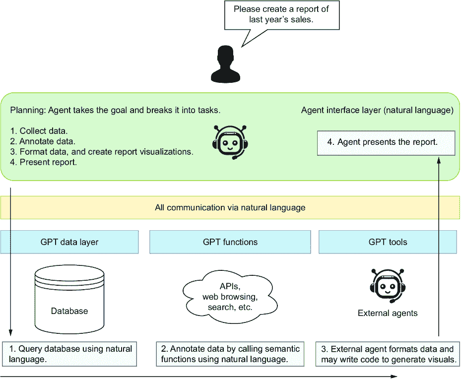
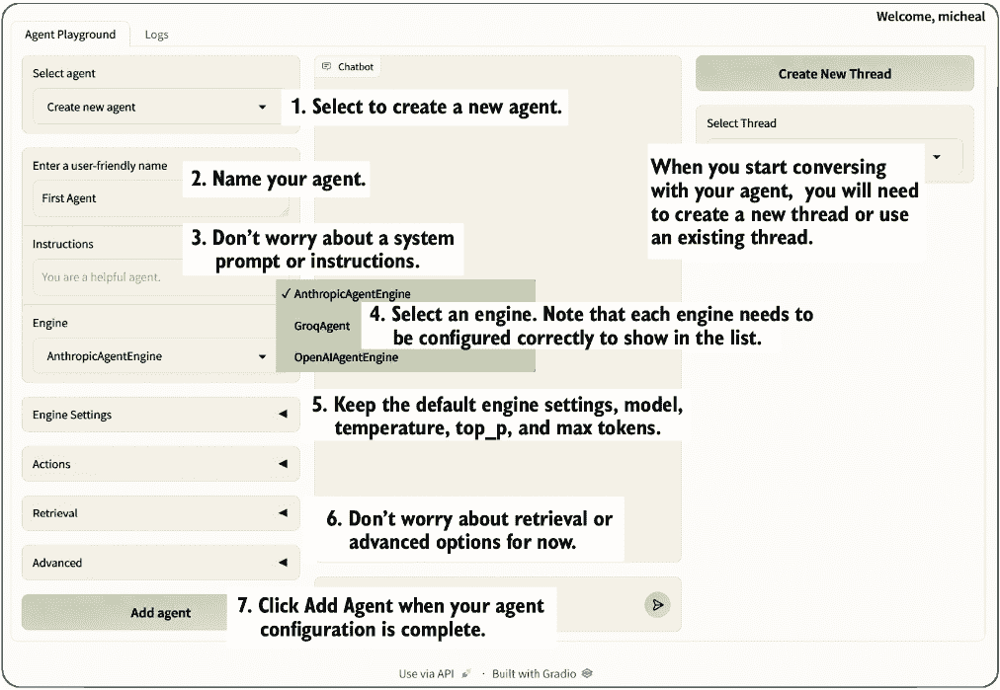
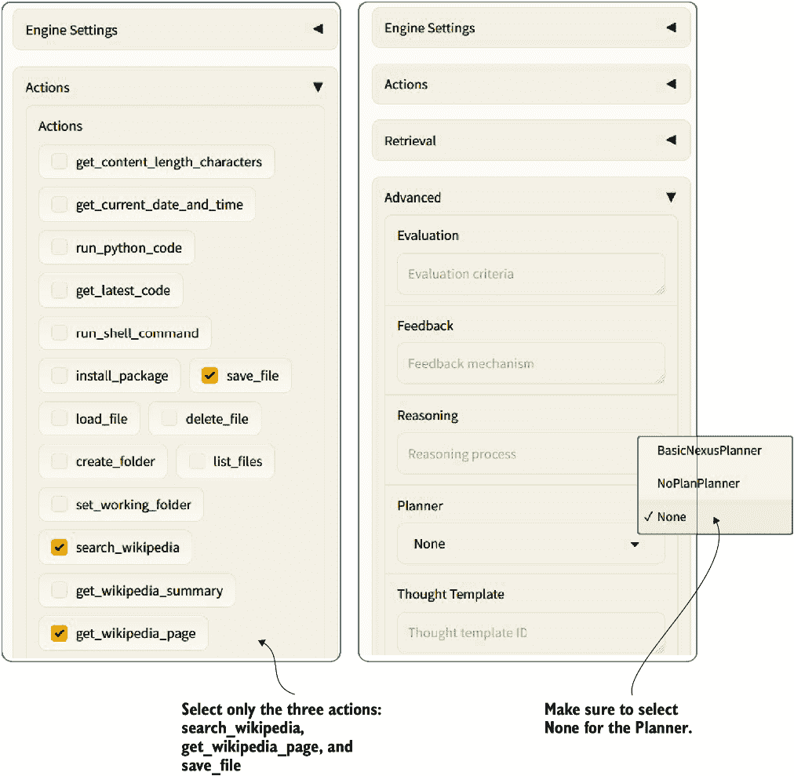
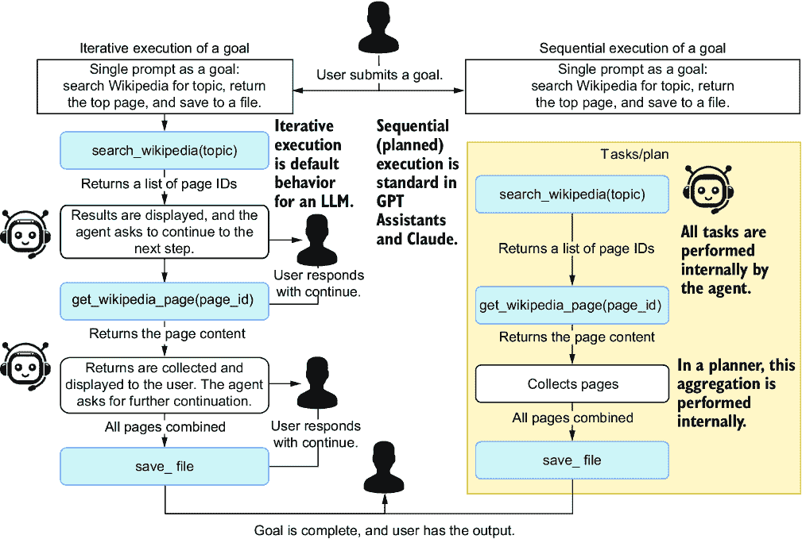
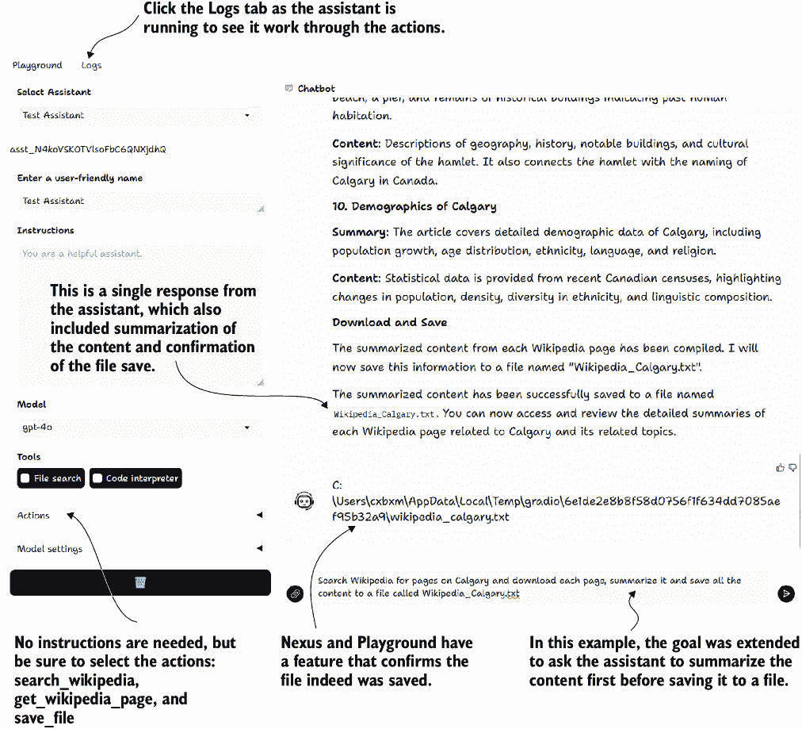
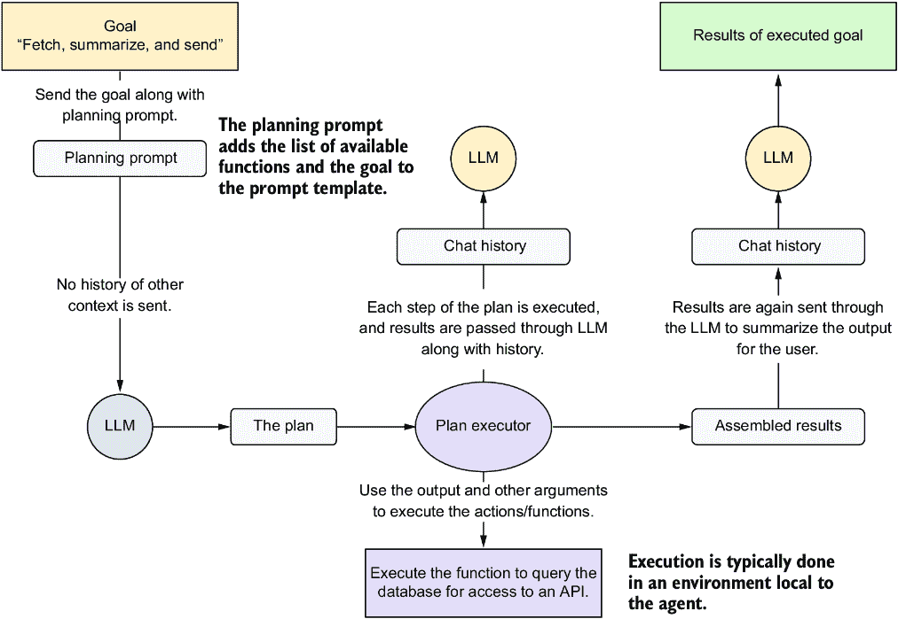
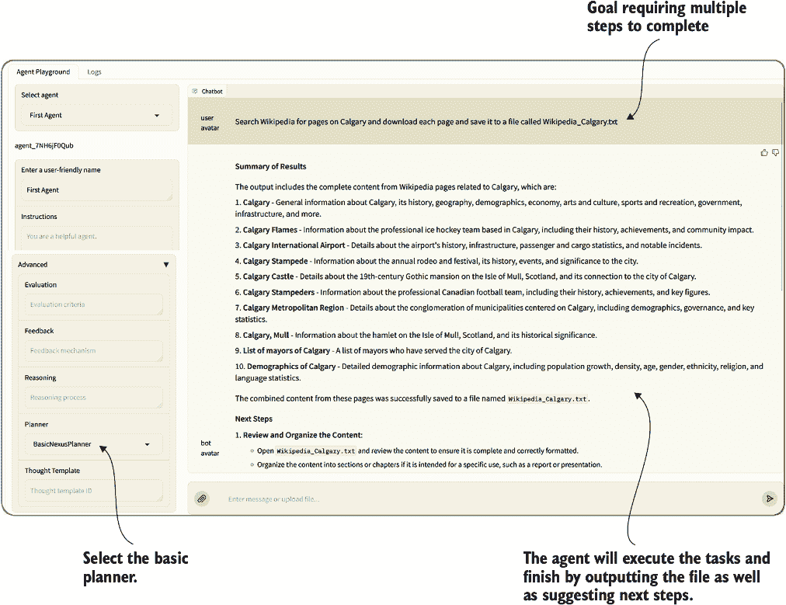
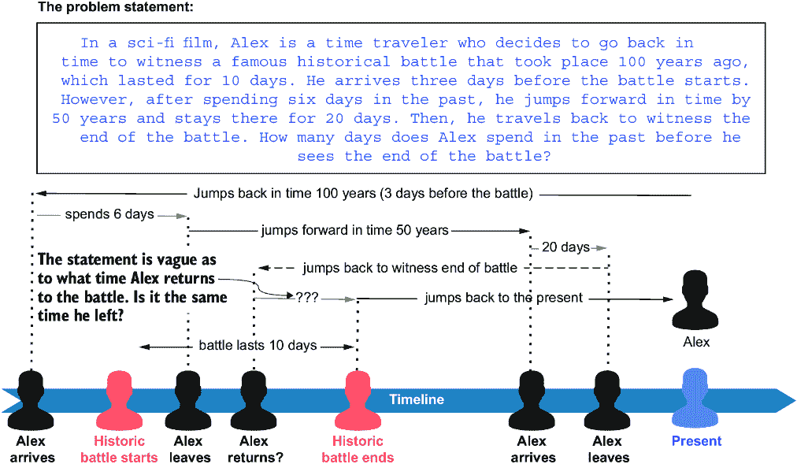

# 11 代理规划和反馈

### 本章涵盖

+   在 LLMs 上规划并在代理和助手中实现它

+   通过自定义操作使用 OpenAI 助手平台

+   在 LLMs 上实现/测试通用规划器

+   在高级模型中使用反馈机制

+   在构建代理系统中的规划、推理、评估和反馈

现在我们已经探讨了大型语言模型（LLMs）如何进行推理和规划，本章通过在代理框架内应用规划来将这一概念进一步深化。规划应该是任何代理/助手平台或工具包的核心。我们将从查看规划的基本知识和如何通过提示实现规划器开始。然后，我们将看到如何使用 OpenAI 助手平台进行规划，该平台自动整合了规划。从那里，我们将为 LLMs 构建和实现一个通用规划器。

规划只能走这么远，一个经常未被认识到的元素是反馈。因此，在本章的最后几节中，我们探讨了反馈并在规划器中实现了它。您必须熟悉第十章的内容，所以如果您需要，请查阅它，准备好后，让我们开始规划。

## 11.1 规划：所有代理/助手的必备工具

不能规划而只能进行简单交互的代理和助手不过是聊天机器人。正如我们在整本书中看到的那样，我们的目标不是构建机器人，而是构建自主思考的代理——能够接受目标，找出解决问题的方法，然后返回结果的代理。

图 11.1 解释了代理/助手将执行的整体规划过程。这个图也在第一章中展示过，但现在让我们更详细地回顾一下。在图的顶部，用户提交一个目标。在一个代理系统中，代理接受目标，构建计划，执行它，然后返回结果。



##### 图 11.1 代理规划过程

根据您与 ChatGPT、GPTs、Claude 等平台互动的方式，您可能已经遇到了规划助手，甚至没有注意到。规划正在变得无处不在，并且现在已集成到大多数商业平台中，以使模型看起来更智能和强大。因此，在下一个练习中，我们将查看一个示例来设定基线，并区分不能规划的 LLM 和能规划的代理。

在下一个练习中，我们将使用 Nexus 来演示原始 LLMs 无法独立规划。如果您需要安装、设置和运行 Nexus 的帮助，请参阅第七章。在您安装并准备好 Nexus 后，我们可以开始使用 Gradio 界面运行它，使用下面显示的命令。

##### 列表 11.1 使用 Gradio 界面运行 Nexus

```py
nexus run gradio
```

Gradio 是一个优秀的网络界面工具，旨在展示 Python 机器学习项目。图 11.2 展示了 Gradio Nexus 界面以及创建代理和使用所选代理引擎（OpenAI、Azure 和 Groq）的过程。除非模型/服务器支持工具/动作的使用，否则您不能使用 LM Studio。Anthropic 的 Claude 支持内部规划，因此为了本练习的目的，请避免使用此模型。



##### 图 11.2 在 Nexus 中创建新代理

在创建代理后，我们希望给它提供特定的动作（工具）以执行或完成目标。通常，只提供代理完成其目标所需的动作是最佳做法，原因有几个：

+   更多动作可能会让代理困惑，不知道该使用哪个，甚至不知道如何解决问题。

+   API 对可提交的工具数量有限制；在撰写本文时，达到这个限制相对容易。

+   除非这是您的目标，否则代理可能会以您未预料到的方式使用您的动作。但是，请警告，动作可能会有后果。

+   安全性和安全性需要考虑。LLMs 不会接管世界，但它们会犯错误并迅速偏离正轨。记住，这些代理将独立运行并可能执行任何动作。

警告：在撰写本书并花费数小时与构建代理进行工作期间，我遇到了几个代理采取越界行为的实例，从下载文件到在不打算的情况下编写和执行代码，不断从工具到工具迭代，甚至删除它们不应该删除的文件。观察代理通过行为出现新行为可能会很有趣，但事情可能会迅速偏离正轨。

对于这个练习，我们将定义以下列表中描述的目标。

##### 列表 11.2 展示规划：目标

```py
Search Wikipedia for pages on {topic} and download each page and save it 
to a file called Wikipedia_{topic}.txt
```

此目标将演示以下动作：

+   `search_wikipedia(topic)`—搜索维基百科并返回给定搜索词的页面 ID。

+   `get_wikipedia_page(page_id)`—根据页面 ID 下载页面内容。

+   `save_file`—将内容保存到文件中。

设置代理上的动作，如图 11.3 所示。您还想要确保规划器设置为 None。我们很快将探讨设置和使用规划器。您不必点击保存；界面会自动保存代理的更改。



##### 图 11.3 选择代理的动作并禁用规划器

在您选择动作和规划器后，在列表 11.2 中输入目标。然后点击创建新线程以实例化一个新的对话。在聊天输入中替换您想要搜索的主题，并等待代理响应。以下是一个填充了主题的目标示例，但再次提醒，您可以使用任何您喜欢的主题：

```py
Search Wikipedia for pages on Calgary and download each page and save it to 
a file called Wikipedia_Calgary.txt.
```

图 11.4 展示了将目标提交给普通代理的结果。我们看到代理执行了工具/动作以搜索主题，但无法执行该步骤之后的任何步骤。如果你还记得我们在第五章中关于动作的讨论和代码示例，OpenAI、Groq 和 Azure OpenAI 都支持并行动作，但不支持顺序或计划动作。


##### 图 11.4 尝试让代理/LLM 完成目标的结果

如果你提交一个包含多个并行任务/动作的目标，LLM 可以合理地回答。然而，如果动作是顺序的，需要一步依赖于另一步，它将失败。记住，并行动作是可以与其他动作并行运行的独立动作。

Anthropic 的 Claude 和 OpenAI 助手支持顺序动作规划。这意味着这两个模型都可以使用顺序计划进行调用，模型将执行它们并返回结果。在下一节中，我们将探讨顺序规划并在实际操作中演示。

## 11.2 理解顺序规划过程

在下一个练习中，我们将要求一个 OpenAI 助手解决相同的目标。如果你有 Anthropic/Claude 凭证并且已经配置了引擎，你也可以尝试使用该模型进行这个练习。

图 11.5 展示了顺序执行任务（规划）和使用迭代之间的区别。如果你使用过 GPTs、助手或 Claude Sonnet 3.5，你可能已经体验过这种区别。这些高级工具已经通过提示注释、高级训练或两者结合的方式实现了规划。



##### 图 11.5 迭代执行和计划执行之间的区别

随着大型语言模型和聊天服务的演变，大多数模型可能会原生支持某种形式的规划和使用工具。然而，包括 GPT-4o 在内的大多数模型今天只支持动作/工具的使用。

让我们打开 GPT 助手 Playground 来演示顺序规划的实际操作。如果你需要帮助，请参考第六章中的设置指南。我们将使用相同的目标，但这次，我们将运行它针对一个助手（该助手内置了规划）。

在你启动 Playground 后，创建一个新的助手，并分配给它 `search_wikipedia`、`get_wikipedia_page` 和 `save_file` 动作。图 11.6 展示了将目标输入助手的成果。正如你所见，助手在幕后完成了所有任务，并以用户最终请求的输出响应，实现了目标。



##### 图 11.6 助手处理目标和输出结果

为了展示 OpenAI 助手规划器的有效性，我们将另一个任务，即总结每一页，添加到目标中。插入的任务没有函数/工具，但助手足够聪明，能够利用其总结内容的能力。您可以通过打开`[root]assistants_working_folder/Wikipedia_{topic}.txt`文件并查看内容来查看助手产生的输出。现在我们了解了 LLM 在没有规划器和规划的情况下如何工作，我们可以继续在下一节创建我们的规划器。

## 11.3 构建顺序规划器

LLM 工具如 LangChain 和 Semantic Kernel (SK)拥有许多使用各种策略的规划器。然而，编写我们的规划器相对容易，Nexus 还支持插件式接口，允许您添加来自 LangChain 和 SK 等工具或其他派生工具的其他规划器。

规划师可能听起来很复杂，但通过结合规划和推理的提示工程策略，它们很容易实现。在第十章中，我们介绍了推理和制定计划的基础，现在我们可以将这些技能用于实际应用。

列表 11.3 展示了从 SK 派生出的顺序规划器，它扩展了迭代。如列表中所示，提示注释规划器可以适应特定需求或更通用，如所示。此规划器使用 JSON，但规划器可以使用 LLM 理解的任何格式，包括代码。

##### 列表 11.3 `basic_nexus_planner.py`

```py
You are a planner for Nexus.     #1
Your job is to create a properly formatted JSON plan step by step, to 
satisfy the goal given.
Create a list of subtasks based off the [GOAL] provided.
Each subtask must be from within the [AVAILABLE FUNCTIONS] list. Do not 
use any functions that are not in the list.
Base your decisions on which functions to use from the description and the 
name of the function.
Sometimes, a function may take arguments. Provide them if necessary.
The plan should be as short as possible.
You will also be given a list of corrective, suggestive and epistemic 
feedback from previous plans to help you make your decision.
For example:

[SPECIAL FUNCTIONS]     #2
for-each- prefix
description: execute a function for each item in a list
args: 
- function: the function to execute
- list: the list of items to iterate over
- index: the arg name for the current item in the list

[AVAILABLE FUNCTIONS]
GetJokeTopics
description: Get a list ([str]) of joke topics

EmailTo
description: email the input text to a recipient
args:
- text: the text to email
- recipient: the recipient's email address. Multiple addresses may be 
included if separated by ';'.

Summarize
description: summarize input text
args:
- text: the text to summarize

Joke
description: Generate a funny joke
args:
- topic: the topic to generate a joke about

[GOAL]
"Get a list of joke topics and generate a different joke for each topic. 
Email the jokes to a friend."

[OUTPUT]
    {        
        "subtasks": [
            {"function": "GetJokeTopics"},
            {"function": "for-each",
             "args": {
                       "list": "output_GetJokeTopics",
                       "index": "topic", 
                       "function": 
                                  {
                                   "function": "Joke",
                                   "args": {"topic": "topic"}}}},
            {
             "function": "EmailTo",
              "args": {
                        "text": "for-each_output_GetJokeTopics"
                       ecipient": "friend"}}
        ]
    }
# 2 more examples are given but omitted from this listing

[SPECIAL FUNCTIONS]     #3
for-each
description: execute a function for each item in a list
args: 
- function: the function to execute
- iterator: the list of items to iterate over
- index: the arg name for the current item in the list  

[AVAILABLE FUNCTIONS]     #4
{{$available_functions}}

[GOAL]
{{$goal}}     #5

Be sure to only use functions from the list of available functions. 
The plan should be as short as possible. 
And only return the plan in JSON format.
[OUTPUT]     #6
```

#1 告诉代理如何处理示例的序言指令

#2 三个（少样本）示例的开始

#3 添加了 for-each 特殊迭代函数

#4 可用函数从代理的可用函数列表自动填充。

#5 目标在这里插入。

#6 代理预期放置输出的位置

图 11.7 展示了构建和运行规划提示的过程，从构建到执行，最后将结果返回给用户。规划师通过构建规划提示，提交给 LLM 构建计划，本地解析和执行计划，将结果返回给 LLM 进行评估和总结，并最终将最终输出返回给用户。



##### 图 11.7 创建和执行计划的规划过程

注意规划过程中的几个细微细节至关重要。通常，计划是在孤立状态下构建的，没有添加上下文历史。这样做是为了专注于目标，因为大多数规划提示消耗许多标记。在执行器内部执行功能通常是在本地环境中进行的，可能包括调用 API、执行代码，甚至运行机器学习模型。

列表 11.4 展示了 `BasicNexusPlanner` 类中 `create_plan` 函数的代码；LangChain 和 SK 等工具使用类似的模式。该过程将代理的动作作为字符串加载。然后使用 `PromptTemplateManager` 将目标和可用函数列表插入到规划器提示模板中，`PromptTemplateManager` 只是对模板处理代码的包装。模板处理使用简单的正则表达式完成，但也可以使用 Jinja2、Handlebars 或 Mustache 等工具进行更复杂的处理。

##### 列表 11.4 `basic_nexus_planner.py` (`create_plan`)

```py
def create_plan(self, nexus, agent, goal: str, prompt: str = PROMPT) -> Plan:
        selected_actions = nexus.get_actions(agent.actions)
        available_functions_string = "\n\n".join(
            format_action(action) for action in selected_actions
        )     #1

        context = {}     #2
        context["goal"] = goal
        context["available_functions"] = available_functions_string

        ptm = PromptTemplateManager()     #3
        prompt = ptm.render_prompt(prompt, context)

        plan_text = nexus.execute_prompt(agent, prompt)     #4
        return Plan(prompt=prompt, 
                    goal=goal, 
                    plan_text=plan_text)     #5
```

#1 加载代理可用的动作，并将结果字符串格式化为规划器

#2 将上下文注入到规划器提示模板中。

#3 一个简单的模板管理器，在概念上类似于 Jinja2、Handlebars 或 Mustache

#4 将填充后的规划器提示发送到 LLM

#5 将结果（计划）封装在 Plan 类中并返回以执行。

执行计划的代码（如列表 11.5 所示）解析 JSON 字符串并执行函数。在执行计划时，代码会检测特定的 `for-each` 函数，该函数遍历列表并执行函数中的每个元素。每个函数执行的结果都添加到上下文中。这个上下文传递给每个函数调用，并作为最终输出返回。

##### 列表 11.5 `basic_nexus_planner.py` (`execute_plan`)

```py
def execute_plan(self, nexus, agent, plan: Plan) -> str:
        context = {}
        plan = plan.generated_plan
        for task in plan["subtasks"]:     #1
            if task["function"] == "for-each":     #2
                list_name = task["args"]["list"]
                index_name = task["args"]["index"]
                inner_task = task["args"]["function"]

                list_value = context.get(list_name, [])
                for item in list_value:
                    context[index_name] = item
                    result = nexus.execute_task(agent, inner_task, context)
                    context[f"for-each_{list_name}_{item}"] = result

                for_each_output = [     #2
                    context[f"for-each_{list_name}_{item}"] ↪
                      for item in list_value
                ]
                context[f"for-each_{list_name}"] = for_each_output

                for item in list_value:     #3
                    del context[f"for-each_{list_name}_{item}"]

            else:
                result = nexus.execute_task(agent,
                                            task,
                                            context)     #4
                context[f"output_{task['function']}"] = result

        return context     #5
```

#1 遍历计划中的每个子任务

#2 处理应该迭代的函数，并将完整的结果列表添加到上下文中

#3 移除单独的 for-each 上下文条目

#4 通用任务执行

#5 返回完整上下文，包括每个函数调用的结果

整个执行返回的上下文在最终调用 LLM 时发送，LLM 总结结果并返回响应。如果一切按计划进行，LLM 将以结果总结的形式响应。如果出现错误或缺少某些信息，LLM 可能会尝试解决问题或通知用户错误。

现在让我们再次打开 Nexus 并测试一个正在运行的规划器。加载上次使用的相同代理，但这次在高级选项下选择规划器，如图 11.8 所示。然后，像之前一样输入目标提示，让代理去处理。



##### 图 11.8 使用基本规划器在 Nexus 中请求完成目标的结果

几分钟后，代理返回保存的文件，在某些情况下，它可能还会提供额外信息，例如下一步操作和如何处理输出。这是因为代理被赋予了对其所完成工作的概述。但请记住，计划执行是在本地级别完成的，并且只向 LLM 发送了上下文、计划和目标。

这意味着计划执行可以由任何进程完成，而不仅仅是代理。在 LLM 外部执行计划可以减少代理执行所需令牌和工具的使用。这也意味着 LLM 不需要支持工具使用就可以使用规划器。

在 Nexus 内部，当启用规划器时，代理引擎工具被绕过。相反，规划器完成动作执行，代理只通过输出上下文的传递来了解动作。这对支持工具使用但不能规划的模式来说可能是个好主意。然而，规划器可能会限制支持工具使用和规划的双重支持模式，如 Claude。

通常，你想要了解你所使用的 LLM 的能力。如果你不确定这些细节，那么一点点的尝试和错误也可以工作。要求代理在有和无计划启用的情况下完成多步骤目标，然后查看结果。

规划允许代理完成多个顺序任务以实现更复杂的目标。外部或提示规划的问题在于它绕过了反馈迭代循环，这有助于快速纠正问题。正因为如此，OpenAI 和其他人现在正在直接在 LLM 层面集成推理和规划，正如我们将在下一节中看到的。

## 11.4 检查步骤式规划器：OpenAI Strawberry

o1-preview 模型的发布，代号草莓，为可用于代理系统的 LLM 类型带来了巨大的转变。草莓不仅被宣称为在数学、科学和一般计算任务上更有效率，而且还能在 LLM 中直接进行推理、规划、评估和反馈。

考虑第十章中的时间旅行问题，如图 11.9 所示。如果你还记得，这个问题使用 GPT-4 和其他类似的 LLM 难以解决。然而，通过应用推理和反馈，我们能够偶尔产生正确的输出。



##### 图 11.9 重新审视时间旅行问题

作为实验，将此问题输入到 ChatGPT 中，使用 o1-preview 模型，如列表 11.6 所示。坐下来等待几秒钟，等待答案。是的，模型仍然答错了。

##### 列表 11.6 时间旅行推理/规划问题

```py
In a sci-fi film, Alex is a time traveler who decides to go back in time 
to witness a famous historical battle that took place 100 years ago, 
which lasted for 10 days. He arrives three days before the battle starts. 
However, after spending six days in the past, he jumps forward in time 
by 50 years and stays there for 20 days. Then, he travels back to 
witness the end of the battle. How many days does Alex spend in the past 
before he sees the end of the battle?
```

虽然看到模型给出错误答案可能有些令人失望，但它确实在分解问题和展示其答案方面做得更好。列表 11.7 显示了将列表 11.6 中的问题提出给草莓模型的样本输出。请注意，由于 LLM 的随机性，你可能会得到不同的答案。

##### 列表 11.7 o1-preview 对时间旅行问题的响应

```py
To determine how many days Alex spends in the past before witnessing the 
end of the battle, let's reconstruct the timeline step by step:
Arrival in the Past:
Alex arrives 3 days before the battle begins.
He spends these 3 days waiting for the battle to start.
During the Battle:
The battle starts, and Alex experiences the first 3 days of it.
At this point, he has spent a total of 6 days in the past (3 days before 
the battle and 3 days during the battle).
Time Jump Forward:     #1
After these 6 days, Alex jumps 50 years forward in time.
He spends 20 days in this future time.
Return to the Past:
Alex then returns to the past to witness the end of the battle.
Since the battle lasts 10 days and he left after day 3 of the battle, 
there are 7 days remaining in the battle.
However, because he was away for 20 days, which is longer than the 
remaining 7 days of the battle, he must return to a point in time before 
the battle ends to witness its conclusion.
To see the end of the battle, he returns to the past on the last day of 
the battle.
Final Days Spent Before the Battle Ends:
Upon returning, he spends 1 more day in the past to witness the battle's 
end.
Total Days Spent in the Past Before Seeing the End:
6 days before jumping forward in time.
1 day after returning to the past.
Total: 6 + 1 = 7 days.
Answer: 7
```

#1 模型出错的地方变得明显。

因为我们知道正确答案是 27，所以我们知道 LLM 是错误的，但如果我们不知道，我们同样可以假设工作和推理都是正确的。当我们从 LLM 交互和代理系统中移除反馈时，可能会发生类似的问题。反馈可以引导模型自我纠正。

然而，如果我们不知道正确答案是 27（如果你假设他没有花一天时间来见证战斗，那么是 26），并且假设 LLM 或代理是正确的呢？嗯，这是一个我们可以通过几个简单的提示来纠正的问题，这些提示可以激发 LLM 进行推理和规划反馈。然而，这些技术对 LLM 或像 OpenAI 助手这样的包装器更有效，它们在模型内部提供推理和规划。

我们想要做的是向 LLM 提供反馈，但理解这个反馈可能对我们来说会很困难。幸运的是，只要我们给出正确的答案，我们就可以直接从 LLM 中获取反馈。列表 11.8 展示了如何从 LLM 中生成有关我们时间旅行问题的建设性反馈。

##### 列表 11.8 生成反馈

```py
the correct answer is 27, please review what you did wrong and suggest 
feedback you could give yourself when trying to solve similar future problems
```

在模型回答问题错误之后输入此内容将生成你可以用来通过提示或作为系统指令的一部分来引导模型的反馈。列表 11.9 展示了 o1-preview 提供的反馈示例。然后你可以提取这个反馈，并在下一次想要解决复杂的时间旅行问题时增强指令。

##### 列表 11.9 生成反馈

```py
Feedback for Future Problems
Understanding Time Frames in Time Travel:
Relative Time Frames: Always consider the time periods relative to the 
original point of reference. In this problem, even though Alex jumps 
forward 50 years, he is still in the past relative to his original 
present time.
Including All Relevant Periods: 
Ensure that all time periods spent in the past (or future) are included 
in the total calculation, even if they involve moving to different 
points in time.
Time Continuity: 
Remember that while the traveler moves through time, events in other 
time periods continue to progress unless specified otherwise.
Application:
Careful Reading: 
Pay close attention to the details provided, such as the durations and 
the sequences of time jumps.
Visualization: 
It may help to draw a timeline to visualize the sequence of events and 
time periods involved.
Double-Checking Calculations: 
After solving, revisit each step to ensure all time periods are 
accounted for correctly.
```

这种反馈技术将始终适用于 o1-preview 等模型，但其他模型即使在给出这种反馈的情况下，可能仍然难以正确回答。随着时间的推移，随着模型变得越来越智能，这种技术可能普遍适用于大多数模型。然而，即使模型变得越来越聪明，这种反馈机制可能仍然是必不可少的，因为语言是微妙的，并不是我们向 LLM 提出的每个问题都有一个明显的绝对答案。以我们的例子问题为例。这个问题是要求问题解决者从问题中做出假设并建立关联的一个很好的例子。在从地质学到行为科学等众多科学领域，回答同一个问题可能会得到一系列答案。接下来，让我们看看如何将推理、规划、评估和反馈的应用应用于代理系统的一些技术。

## 11.5 将规划、推理、评估和反馈应用于辅助和代理系统

在最近几章中，我们探讨了如何实现规划、推理、反馈和评估的代理组件。现在我们来看看这些组件何时、何地可以集成到辅助和代理系统中，以实现实时生产、研究或开发。

虽然并非所有这些组件都适合每个应用，但了解何时以及如何应用哪个组件是有用的。在下一节中，我们将探讨如何将规划集成到辅助/代理系统中。

### 11.5.1 辅助/代理规划的运用

规划是辅助工具或代理可以规划执行一系列任务的组件，无论是串联、并行还是其他组合。我们通常将规划与工具使用联系起来，并且，合理地，任何使用工具的系统都可能希望有一个能够胜任的规划器。然而，并非所有系统都是同等创建的，所以在第 11.1 表中，我们将回顾在哪里、何时以及如何实现规划器。

##### 表 11.1 规划在各种应用中的运用和实施时间

| 应用 | 实现 | 环境 | 目的 | 时间 | 配置 |
| --- | --- | --- | --- | --- | --- |
| 个人助理 | 在或 LLM 内部 | 个人设备 | 促进工具使用 | 在响应期间 | 作为提示或 LLM 的一部分 |
| 客户服务机器人 | 不典型；受限环境 | 受限环境，无工具使用 |  |  |  |
| 自主代理 | 作为代理提示和 LLM 的一部分 | 服务器或服务 | 促进复杂工具使用和任务规划 | 在构建代理和/或响应期间 | 在代理或 LLM 内部 |
| 协作工作流程 | 作为 LLM 的一部分 | 共享画布或编码 | 促进复杂工具使用 | 在响应期间 | 在 LLM 内部 |
| 游戏人工智能 | 作为 LLM 的一部分 | 服务器或应用 | 复杂工具使用和规划 | 在响应之前或期间 | 在 LLM 内部 |
| 研究 | 任何地方 | 服务器 | 促进工具使用并参与复杂任务工作流程 | 在响应生成之前、期间和之后 | 任何地方 |

表 11.1 展示了我们可能发现辅助工具或代理被部署以协助各种应用场景的几个不同应用场景。为了提供更多信息和建议，此列表提供了关于如何在每个应用中运用规划更详细的说明：

+   *个人助理*—虽然这项应用推出较慢，但 LLM 个人助理有望在未来超越 Alexa 和 Siri。规划对于这些新助理/代理来说将至关重要，以协调众多复杂任务并在串联或并行中执行工具（动作）。

+   *客户服务机器人*—由于这个环境的可控性，直接与客户互动的助手不太可能使用受控且非常具体的工具。这意味着这类助手可能不需要广泛的规划。

+   *自主代理*—正如我们在前面的章节中看到的，具有规划能力的代理可以完成一系列复杂任务以实现各种目标。规划将是任何自主代理系统的基本要素。

+   *协作工作流程*——将这些视为与编码者或作家并肩而坐的代理或助手。虽然这些工作流程仍处于早期开发阶段，但想象一下代理自动被分配与开发者一起编写和执行测试代码的工作流程。规划将是执行这些复杂未来工作流程的一个关键部分。

+   *游戏人工智能*——虽然将 LLM 应用于游戏仍处于早期阶段，但想象游戏中能够协助或挑战玩家的代理或助手并不困难。赋予这些代理规划执行复杂工作流程的能力可能会改变我们玩游戏的方式和对象。

+   *研究*——与协作工作流程类似，这些代理将负责从现有信息来源中推导出新想法。找到这些信息可能将通过广泛使用工具来促进，这将受益于规划的协调。

如您所见，规划是许多 LLM 应用的一个关键部分，无论是通过工具使用的协调还是其他方式。在下一节中，我们将探讨推理的下一个组成部分以及它如何应用于相同的应用堆栈。

### 11.5.2 助手/代理推理的应用

推理，虽然通常与规划和任务完成紧密相关，但也是一个可以独立存在的组成部分。随着大型语言模型（LLM）的成熟和智能化，推理通常被包含在 LLM 本身中。然而，并非所有应用都能从广泛的推理中受益，因为它往往在 LLM 响应中引入一个思考周期。表 11.2 从高层次描述了推理组件如何与各种 LLM 应用类型集成。

##### 表 11.2 在各种应用中推理何时何地被使用

| 应用 | 实现 | 环境 | 目的 | 时间 | 配置 |
| --- | --- | --- | --- | --- | --- |
| 个人助理 | 在 LLM 内部 | 个人设备 | 将工作分解成步骤 | 在响应期间 | 作为提示或 LLM 的一部分 |
| 客户服务机器人 | 不典型；通常只是信息性 | 有限工具使用和复合工具使用需求 |  |  |  |
| 自主代理 | 作为代理提示和 LLM 的一部分 | 服务器或服务 | 促进复杂工具使用和任务规划 | 作为 LLM 的一部分，外部推理不适合 | 在代理或 LLM 内部 |
| 协作工作流程 | 作为 LLM 的一部分 | 共享画布或编码 | 协助将工作分解 | 在响应期间 | 在 LLM 内部 |
| 游戏人工智能 | 作为 LLM 的一部分 | 服务器或应用 | 承担复杂行动的必要条件 | 在响应之前或期间 | 在 LLM 内部 |
| 研究 | 任何地方 | 服务器 | 理解如何解决复杂问题并参与复杂任务工作流程 | 在响应之前、期间和之后 | 任何地方 |

表 11.2 显示了我们在其中可能找到部署以协助某些工作的助手或代理的几个不同应用场景。为了提供更多信息和建议，此列表提供了有关如何在每个应用中应用推理的更多详细信息：

+   *个人助理*——根据应用的不同，代理使用的推理量可能有限。推理是一个需要 LLM 思考问题的过程，这通常需要根据问题的复杂性和提示的范围来调整更长的响应时间。在许多情况下，旨在接近实时推理的响应可能被禁用或降低。虽然这可能限制代理可以交互的复杂性，但有限的或没有推理可以提高响应时间并增加用户满意度。

+   *客户服务机器人*——同样，由于这个环境的可控性，直接与客户互动的助手不太可能需要执行复杂或任何形式的推理。

+   *自主代理*——虽然推理是自主代理的一个强大组成部分，但我们仍然不知道推理过多是多少。随着草莓等模型在代理工作流程中变得可用，我们可以判断在什么情况下广泛的推理可能不是必需的。这肯定适用于定义明确的自主代理工作流程。

+   *协作工作流程*——同样，应用推理会在 LLM 交互中产生开销。广泛的推理可能对某些工作流程有益，而其他定义明确的工作流程可能会受到影响。这可能意味着这些类型的工作流程将从多个代理中受益——那些具有推理能力和那些没有推理能力的代理。

+   *游戏人工智能*——与其他应用类似，重推理应用可能不适合大多数游戏人工智能。游戏特别需要 LLM 响应时间快，这肯定将是推理在通用战术代理中的应用。当然，这并不排除使用其他推理代理，这些代理可能提供更多战略控制。

+   *研究*——推理可能对任何复杂的研究任务都至关重要，原因有几个。一个很好的例子是草莓模型的应用，我们已经在数学和科学研究中看到过。

虽然我们经常将推理与规划一起考虑，但可能存在每种实施水平都不同的条件。在下一节中，我们将考虑各种应用的代理评估支柱。

### 11.5.3 评估在代理系统中的应用

评估是代理/助手系统中可以指导系统表现好坏的组件。虽然我们在一些代理工作流程中展示了如何整合评估，但在代理系统中评估通常是一个外部组件。然而，它也是大多数 LLM 应用的核心组件，并且在大多数开发中不应被忽视。表 11.3 从高层次描述了评估组件如何与各种 LLM 应用类型集成。

##### 表 11.3 在各种应用中何时何地使用评估

| 应用 | 实现 | 环境 | 目的 | 时间 | 配置 |
| --- | --- | --- | --- | --- | --- |
| 个人助手 | 外部 | 服务器 | 确定系统的工作效果 | 交互后 | 通常外部开发 |
| 客户服务机器人 | 外部监控 | 服务器 | 评估每次交互的成功率 | 交互后 | 外部于代理系统 |
| 自主代理 | 外部或内部 | 服务器或服务 | 确定任务完成后的系统成功率 | 交互后 | 外部或内部 |
| 协作工作流程 | 外部 | 共享画布或编码 | 评估协作的成功率 | 交互后 | 外部服务 |
| 游戏人工智能 | 外部或内部 | 服务器或应用 | 评估代理或评估策略或行动的成功率 | 交互后 | 外部或作为代理或另一个代理的一部分 |
| 研究 | 结合人工和 LLM | 服务器和人 | 评估研究输出的效果 | 生成输出后 | 取决于问题的复杂性和进行的研究 |

表 11.3 展示了我们在各种应用场景中可能找到的助手或代理被部署以协助某些功能的几个不同场景。为了提供更多信息和建议，此列表提供了关于如何在每个应用中使用评估的更多详细信息：

+   *个人助手*—在大多数情况下，评估组件将被用来处理和指导代理响应的性能。在主要使用检索增强生成（RAG）进行文档探索的系统中，评估表明助手如何响应信息请求。

+   *客户服务机器人*—评估服务机器人对于理解机器人如何响应客户请求至关重要。在许多情况下，强大的 RAG 知识元素可能是系统的一个需要广泛和持续评估的元素。同样，在大多数评估组件中，这个元素是主要工作系统之外的，并且通常作为监控多个指标的一般性能的一部分运行。

+   *自主代理*——在大多数情况下，对代理输出的手动审查将是自主代理成功的主要指导。然而，在某些情况下，内部评估可以帮助指导代理在执行复杂任务时，或作为改进最终输出的手段。CrewAI 和 AutoGen 等多个代理系统是使用内部反馈来改进生成输出的自主代理的例子。

+   *协作工作流程*——在大多数直接情况下，这些类型的工作流程中会持续进行手动评估。用户通常会立即并在近乎实时的情况下通过评估输出纠正助手/代理。可以添加额外的代理，类似于自主代理，以实现更广泛的协作工作流程。

+   *游戏人工智能*——评估通常会被分解为开发评估——评估代理与游戏交互的方式——和在游戏中的评估，评估代理在任务中成功与否。实施后一种评估形式类似于自主代理，但旨在改进某些策略或执行。这种在游戏中的评估也可能从记忆和反馈手段中受益。

+   *研究*——在这个层面上，评估通常是在完成研究任务后作为手动工作进行的。代理可以采用类似于自主代理的某种形式的评估来改进生成的输出，甚至可能在内部思考如何扩展或进一步研究输出的评估。由于这目前是代理发展的一个新领域，其执行效果如何还有待观察。

评估是任何代理或助手系统的基本要素，尤其是当该系统向用户提供真实和基本信息时。为代理和助手开发评估系统可能是可以或应该有自己一本书的内容。在本章的最后部分，我们将探讨各种 LLM 应用的反馈实现。

### 11.5.4 将反馈应用于代理/助手应用

作为代理系统组成部分的反馈通常如果不是总是，被实现为一个外部组件——至少目前是这样。也许对评估系统的信心可能会提高，以至于反馈定期被纳入这些系统。表 11.4 展示了反馈如何被整合到各种 LLM 应用中。

##### 表 11.4 在各种应用中何时何地使用反馈

| 应用 | 实现 | 环境 | 目的 | 时间 | 配置 |
| --- | --- | --- | --- | --- | --- |
| 个人助手 | 外部或由用户 | 聚合到服务器或作为系统的一部分 | 提供系统改进的手段 | 在交互后或交互期间 | 内部和外部 |
| 客户服务机器人 | 外部监控 | 聚合到服务器 | 确认并提供系统改进的手段 | 交互后 | 代理系统外部 |
| 自主代理 | 外部 | 在服务器端汇总 | 提供系统改进的手段 | 在交互之后 | 外部 |
| 协作工作流程 | 在交互过程中 | 共享画布或编码 | 提供即时反馈的机制 | 在交互过程中 | 外部服务 |
| 游戏人工智能 | 外部或内部 | 服务器或应用 | 作为内部评估反馈的一部分，以提供动态改进 | 在交互之后或交互过程中 | 外部或作为代理或另一个代理的一部分 |
| 研究 | 结合人工和 LLM | 服务器和人类 | 评估开发的研究输出 | 在生成输出之后 | 依赖于问题的复杂性和进行的研究 |

表 11.4 显示了我们在其中可能找到部署以协助某些功能的助理或代理的几个应用场景。为了提供更多信息和建议，此列表提供了关于如何在每个应用中采用反馈的更多详细信息：

+   *个人助理*—如果助理或代理通过聊天式界面与用户互动，用户可以提供直接和即时的反馈。这种反馈是否在未来的对话或互动中持续，通常是在代理记忆中发展的。例如 ChatGPT 这样的助理现在已经集成了记忆功能，并能从明确用户反馈中受益。

+   *客户服务机器人*—用户或系统反馈通常在交互完成后通过调查提供。这通常意味着反馈被调节到一个外部系统中，该系统汇总反馈以供后续改进。

+   *自主代理*—与机器人类似，自主代理中的反馈通常是在代理完成用户随后审查的任务之后进行的。由于许多事情可能是主观的，因此反馈机制可能更难以捕捉。本章探索的用于生成反馈的方法可以用于提示工程改进。

+   *协作工作流程*—与个人助理类似，这些类型的应用可以从用户的即时和直接反馈中受益。同样，如何将此类信息持久化到会话中通常是代理记忆的实现。

+   *游戏人工智能*—反馈可以在通过额外和多个代理进行评估的同时实施。这种反馈形式可能是单次使用的，存在于当前交互中，或者可能作为记忆持久存在。想象一下，一个能够评估其行为、根据反馈改进这些行为并记住这些改进的游戏人工智能。虽然这种模式对于游戏来说并不理想，但它肯定会改善游戏体验。

+   *研究*—与研究背景下的评估类似，反馈通常在输出评估后离线进行。虽然已经进行了一些使用多个代理系统的研究，这些系统结合了用于评估和反馈的代理，但这些系统并不总是表现良好，至少不是使用当前最先进的模型。相反，通常最好在最后将反馈和评估隔离，以避免常见的反馈循环问题。

反馈是代理和助手系统的一个强大组件，但并不总是需要在首次发布时包含。然而，纳入严格的反馈和评估机制可以极大地从长远角度有利于代理系统，包括持续监控和提供改进系统各个方面的信心。

你如何在你的代理系统中实现这些组件，部分可能由你选择的代理平台架构指导。现在你了解了每个组件的细微差别，你也拥有了指导你选择适合你的应用程序和业务用例的正确代理系统的知识。无论你的应用程序如何，你几乎在所有情况下都希望使用几个代理组件。

随着代理系统成熟以及 LLM 本身变得更智能，我们今天认为的一些外部组件可能会紧密集成。我们已经看到推理和规划被整合到一个如 Strawberry 这样的模型中。当然，随着我们接近理论上的通用人工智能里程碑，我们可能会看到能够进行长期自我评估和反馈的模型。

在任何情况下，我希望你喜欢与我一起探索这个令人难以置信的新兴技术前沿的旅程，这个技术将无疑改变我们对工作和通过代理进行工作的看法。

## 11.6 练习

使用以下练习来提高你对材料的了解：

+   *练习 1*—实现一个简单的规划代理（入门级）

*目标*—学习如何使用提示生成一系列动作来实现基本规划代理。

*任务：*

+   +   创建一个代理，它接收一个目标，将其分解成步骤，并按顺序执行这些步骤。

    +   定义一个简单的目标，例如从维基百科检索信息并将其保存到文件中。

    +   使用基本的规划器提示（参考第 11.3 节中的规划器示例）实现代理。

    +   运行代理，并评估它在规划和执行每一步时的表现。

+   *练习 2*—在规划代理中测试反馈集成（中级）

*目标*—理解反馈机制如何提高代理系统的性能。

*任务：*

+   +   修改练习 1 中的代理，在每个任务后包含一个反馈循环。

    +   使用反馈来调整或纠正序列中的下一个任务。

    +   通过给它一个更复杂的任务，如从多个来源收集数据，来测试代理，并观察反馈如何提高其性能。

    +   记录并比较添加反馈前后代理的行为。

+   *练习 3*—实验并行和顺序规划（中级）

*目标*—学习并行和顺序动作之间的区别以及它们如何影响代理行为。

*任务：*

+   +   使用 Nexus 设置两个代理：一个并行执行任务，另一个顺序执行任务。

    +   定义一个多步骤目标，其中一些动作依赖于先前动作的结果（顺序），而另一些可以同时进行（并行）。

    +   比较两个代理的性能和输出，注意在需要顺序步骤时并行执行中的任何错误或不效率。

+   *练习 4*—在 Nexus 中构建和集成自定义规划器（高级）

*目标*—学习如何构建自定义规划器并将其集成到代理平台中。

*任务：*

+   +   使用第 11.3 节中的提示工程策略编写自定义规划器，确保它支持顺序任务执行。

    +   将此规划器集成到 Nexus 中，并创建一个使用它的代理。

    +   使用涉及多个步骤和工具（例如，数据检索、处理和保存）的复杂目标测试规划器。

    +   评估自定义规划器与 Nexus 内置规划器或其他平台相比的性能。

+   *练习 5*—在顺序规划中实现错误处理和反馈（高级）

*目标*—学习如何在代理系统中实现错误处理和反馈以完善顺序规划。

*任务：*

+   +   使用顺序规划器，设置一个代理执行可能遇到常见错误的目标（例如，失败的 API 调用、缺失数据或无效输入）。

    +   在规划器中实现错误处理机制以识别和响应这些错误。

    +   添加反馈循环以根据遇到的错误调整计划或重试动作。

    +   通过在执行过程中故意造成错误来测试系统，并观察代理如何恢复或调整其计划。

## 概述

+   规划对于代理和助手至关重要，它允许他们接受一个目标，将其分解为步骤，并执行它们。没有规划，代理将简化为类似聊天机器人的交互。

+   代理必须区分并行和顺序动作。许多大型语言模型可以处理并行动作，但只有高级模型支持顺序规划，这对于复杂任务完成至关重要。

+   反馈对于指导代理纠正方向并在一段时间内提高性能至关重要。本章展示了如何将反馈机制与代理集成以完善其决策过程。

+   如 OpenAI 助手和 Anthropic 的 Claude 这样的平台支持内部规划并能执行复杂的多步骤任务。使用这些平台的代理可以使用顺序动作规划进行复杂的流程。

+   正确选择和限制代理动作对于避免混淆和意外行为至关重要。过多的动作可能会压倒代理，而不必要的工具可能会被误用。

+   Nexus 允许通过灵活的界面创建和管理代理，用户可以实施自定义规划器、设定目标和分配工具。本章包括使用 Nexus 的实际示例，以突出原始 LLM 和规划器增强代理之间的差异。

+   编写自定义规划器很简单，可以使用提示工程策略。LangChain 和 Semantic Kernel 等工具提供各种规划器，可以根据特定的代理需求进行适配或扩展。

+   例如，OpenAI Strawberry 这样的模型将推理、规划、评估和反馈直接集成到 LLM 中，提供了更精确的问题解决能力。

+   评估有助于确定代理系统表现的好坏，可以根据用例在内部或外部实施。

+   随着 LLM 的发展，推理、规划和反馈机制可能将深度集成到模型中，为更自主和智能的代理系统铺平道路。
