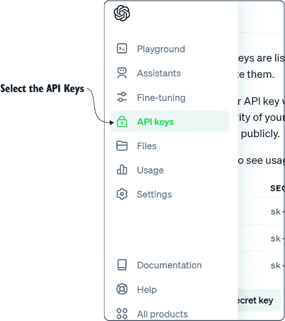
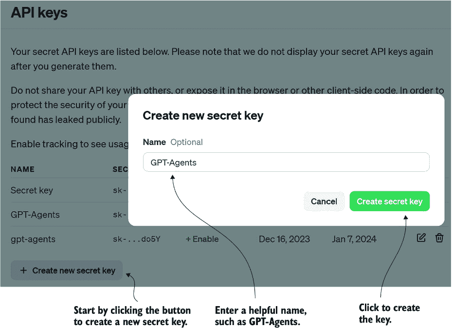
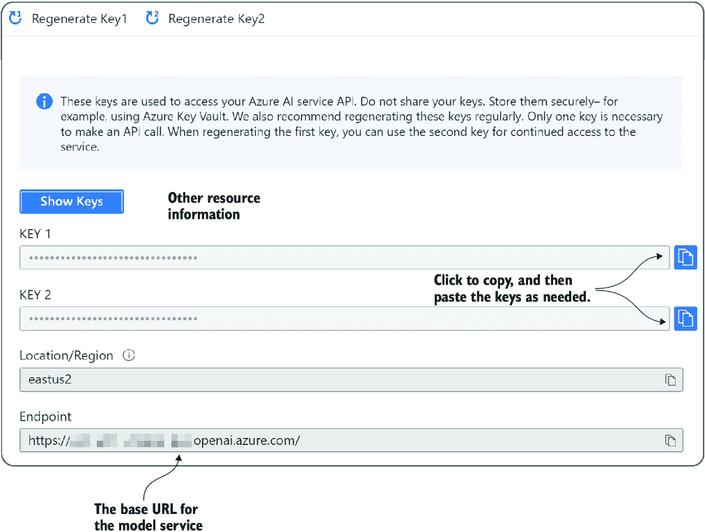

# 附录 A 访问 OpenAI 大型语言模型

尽管有多个商业大型语言模型（LLM）服务可用，但本书建议直接使用 OpenAI 服务或通过 Azure OpenAI Studio。要访问任一服务，您必须创建一个账户并注册一种本附录未涵盖的支付方式。GPT-4 系列 LLM 被认为是业界最佳，更适合代理开发。使用开源和替代服务始终是一个选择，但通常在您使用 GPT-4 一段时间后再考虑。

## A.1 访问 OpenAI 账户和密钥

以下一般步骤可以帮助您快速设置使用 OpenAI LLMs 进行代理开发。尽管使用 OpenAI 和其他商业 LLM 需要付费，但您预计只需支付不到 100 美元即可完成本书中的所有练习：

1.  前往[`openai.com`](https://openai.com)登录，或注册账户并登录。如果您是第一次创建账户，您可能会获得一定数量的免费信用。如果您已有账户，您必须注册支付方式和类型。通常一次性购买一定数量的信用会更好。这将使您更好地管理成本并避免超支。

1.  登录到平台后，选择 ChatGPT 或 API，如图 A.1 所示。选择 API。

##### 图 A.1 选择 OpenAI 平台的 API 部分

1.  3. 打开左侧菜单，选择 API 密钥选项，如图 A.2 所示。

##### 图 A.2 选择 API 密钥选项

1.  4. 点击创建按钮创建一个新的密钥，为密钥输入一个名称，然后点击创建秘密密钥按钮，如图 A.3 所示。

##### 图 A.3 创建秘密 API 密钥

1.  5. 使用复制按钮，将密钥复制并粘贴到记事本或其他安全区域以保存，如图 A.4 所示。请保密此密钥，并确保它仅存在于您的开发机器上。

##### 图 A.4 将密钥复制并粘贴到知名的安全位置

生成密钥后，您可以在`.env`配置文件或其他注册 OpenAI 密钥的方式中使用它。对于本书中使用的大多数包，配置 OpenAI 通常只需要密钥。其他服务，如 Azure OpenAI，将需要配置模型部署和基础 URL，如下一节所述。

## A.2 Azure OpenAI Studio、密钥和部署

通过与 OpenAI 的持续关系，Microsoft 在 Azure OpenAI Studio 中以相同的价格托管相同的模型。偶尔，Azure 可能落后于模型版本，但 Microsoft 通常与最新的 OpenAI 模型保持同步。

这些指南将更加通用，因为访问 Azure 和创建账户以及访问工作室的方法有几种（具体说明请参阅 Microsoft 文档）：

1.  登录到您的 Azure 门户账户订阅。

1.  在对您有意义的区域创建一个新的 Azure OpenAI Studio 资源。在撰写本文时，并非所有区域都提供了对所有模型的访问。您可能需要首先检查您所在区域可用的模型。这也会根据您的账户和用途而具体化。

在 Azure OpenAI 中，模型通过称为*部署*的资源分配公开。部署封装了一个模型，例如 GPT-4，并提供对资源的访问。图 A.5 显示了通过部署公开的各种模型示例。

##### 图 A.5 通过 Azure OpenAI Studio 部署部署模型

1.  3. 点击创建新部署按钮以创建新的部署，然后选择您想要部署的模型。

1.  4. 在模型被封装在部署中之后，您必须访问父 Azure OpenAI 资源。从那里，您可以访问配置连接所需的密钥、端点或基础 URL，如图 A.6 所示。

##### 图 A.6 获取用于访问服务的密钥和基础 URL

再次提醒，如果您遇到困难，Microsoft 文档可以引导您走向正确的方向。在连接到 Azure OpenAI Studio 或另一个 LLM 等资源时，使用 OpenAI 工具时应记住的三个关键差异如下：

+   访问模型的`API 密钥`

+   模型所在的基础`URL`或`端点`

+   `模型`或`部署`的名称

如果由于任何原因无法访问模型，一个很好的替代方案是开源模型。设置和消费开源 LLMs 的内容在第二章中介绍。
