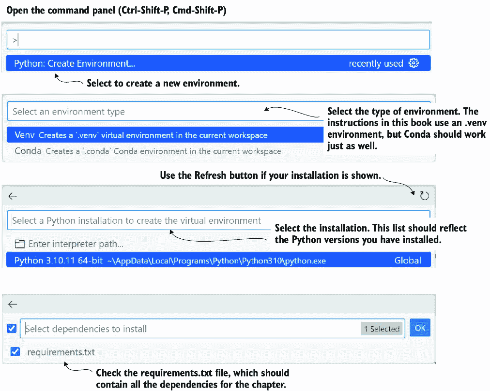
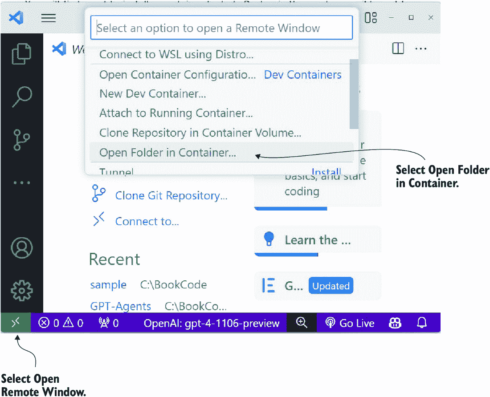

# 附录 B Python 开发环境

虽然本书假设读者是经验丰富的 Python 开发者，但这可能意味着很多不同的事情。在本附录中，我们查看配置一个将与此书中的代码示例一起工作的 Python 开发环境。您可以使用其他集成开发环境（IDE），但并非所有工具，特别是扩展，都能在所有 IDE 中工作。

## B.1 下载源代码

要下载和运行源代码，请安装 Git，然后在本地上拉仓库。以下是从本书 GitHub 仓库拉取代码的高级步骤：

1.  如果需要，请安装 Git。Git 可以从多个来源安装，但一个好的选择是主发布版，可在以下位置找到：[`git-scm.com/downloads`](https://git-scm.com/downloads)。按照说明下载并安装适用于您操作系统的工具。

1.  在您想要下载源代码的文件夹中打开终端，然后输入以下命令：

```py
git clone https://github.com/cxbxmxcx/GPT-Agents.git
```

1.  3. 代码下载完成后，您可以从打开您正在处理的章节文件夹在 Visual Studio Code (VS Code) 中开始。如果您需要安装 VS Code 或了解如何将章节文件夹作为工作区加载，请参阅本附录中的 B.5 节。

## B.2 安装 Python

Python 提供了不同的版本和部署方式。本书依赖于标准的 Python 安装，版本为 3.10。Anaconda 是另一种流行的 Python 部署方式，也可以使用。然而，本书中的所有材料都已使用 Python 3.10 虚拟环境运行和测试过：

1.  访问 [www.python.org/downloads/](http://www.python.org/downloads/)。

1.  定位并下载适用于您操作系统的 Python 3.10 最新版本。

1.  使用您操作系统的说明在您的机器上安装发布版本。

1.  要确认您的安装，打开终端，并执行以下命令：

```py
python –-version
```

版本应该是 3.10，但如果不是，请不要担心。您可能已安装多个 Python 版本。我们将在设置 VS Code 时也确认安装。

## B.3 安装 VS Code

安装 VS Code 相对简单，只需几个步骤即可完成：

1.  访问 [`code.visualstudio.com`](https://code.visualstudio.com)。

1.  为您的操作系统下载 VS Code 的稳定版本。

1.  下载完发布版本后，按照您操作系统的安装说明进行操作。

1.  启动适用于您操作系统的 VS Code，并确保没有警告或错误出现。如果您遇到问题，请尝试重新启动计算机和/或重新安装。

在 VS Code 运行时，我们可以安装必要的扩展。我们将在下一节中介绍这些扩展。

## B.4 安装 VS Code Python 扩展

VS Code 有数千个扩展可以提供优秀的 Python 编程环境。这里推荐的只是你可以独立探索的开始。但是，请注意，并非所有扩展都是同等创建的。在安装新扩展时，查看安装次数和评分。通常，少于四星级的扩展应避免使用。要安装扩展，请按照以下步骤操作：

1.  启动 VS Code，并打开扩展面板，如图 B.1 所示。


##### 图 B.1 安装 VS Code 扩展

1.  2. 安装以下列表中的扩展：

    +   Python，用于环境和语言支持

    +   Python 扩展包，用于涵盖其他扩展

    +   Python 环境管理器，用于管理环境

    +   Python 缩进，用于代码格式化

    +   Flake8，用于代码格式化/代码检查

    +   提示流，用于测试 LLM 提示

    +   语义内核工具，用于与语义内核框架一起工作

    +   Docker，用于管理 Docker 容器

    +   Dev Containers，用于使用容器运行开发环境

你只需要为你在运行的每个 VS Code 环境安装扩展。通常，这意味着只为你的操作系统安装的 VS Code 安装扩展。然而，如果你在容器中运行 VS Code，你必须为每个运行的容器安装扩展。在 Dev Containers 扩展中与 Python 一起工作将在本附录的后面介绍。

## B.5 使用 VS Code 创建新的 Python 环境

在开发 Python 项目时，你通常希望创建隔离的虚拟环境。这有助于管理跨各种任务和工具的多个包依赖关系。在本书中，建议为每个新章节创建一个新的虚拟环境。VS Code 可以通过以下步骤快速有效地帮助你创建和管理多个 Python 环境：

1.  按 Ctrl-Shift-P（Cmd-Shift-P）打开命令面板，并选择 Python：创建环境，如图 B.2 所示。



##### 图 B.2 设置章节虚拟环境的步骤

1.  2. 选择环境类型，可以是 Venv 或 Conda。本书演示了 Venv，但 Conda 也应该可以工作。

1.  3. 选择 Python 安装。本书中的代码至少使用了 Python 3.10。本书中介绍的工具和框架都是前沿的，因此它们应该支持 Python 的后续版本。

1.  4. 确认章节文件夹中的 `requirements.txt` 文件已被选中。这将安装当前章节的所有需求。

你应该为本书的每个新章节完成这些步骤。另一种选择是使用 VS Code 开发容器，这将在下一节介绍。

## B.6 使用 VS Code Dev Containers（Docker）

当与能够生成和执行代码的高级代理和代理一起工作时，通常建议在隔离的容器中运行它们。容器隔离可以防止操作系统中断或损坏，并为部署代理提供一个基础。

熟悉容器和 Docker 等平台可能是一项庞大的任务，以掌握所有内容。幸运的是，开始使用容器只需要很少的知识，而 VS Code 扩展使得这一过程更加容易。

你首先需要安装一个容器工具集。Docker 是免费的（只要你将工具用作爱好或你是学生），并且是最容易获得的。按照以下说明安装 Docker 并开始使用容器：

1.  访问 Docker 桌面下载页面 [www.docker.com/products/docker-desktop](http://www.docker.com/products/docker-desktop)。

1.  下载并安装适用于你的操作系统的 Docker。按照要求遵循任何其他说明。

1.  启动 Docker 桌面应用程序。完成此步骤将确认你已经安装并按预期工作。

1.  打开 VS Code，并确认 1.4 节中列出的 Docker 扩展已安装。

配置好 Docker 和 VS Code 后，你可以按照以下步骤继续使用 Dev Containers：

1.  打开一个新的 VS Code 实例。

1.  选择打开远程窗口，如图 B.3 所示。



##### 图 B.3 在 VS Code 中打开容器的远程窗口

1.  3. 选择“在容器中打开文件夹”以从文件夹启动容器，或选择“新建 Dev 容器”以无文件夹启动。

容器启动后，你的 VS Code 环境将会连接。这允许你在容器中开发代码，无需担心依赖项无法正常工作。
