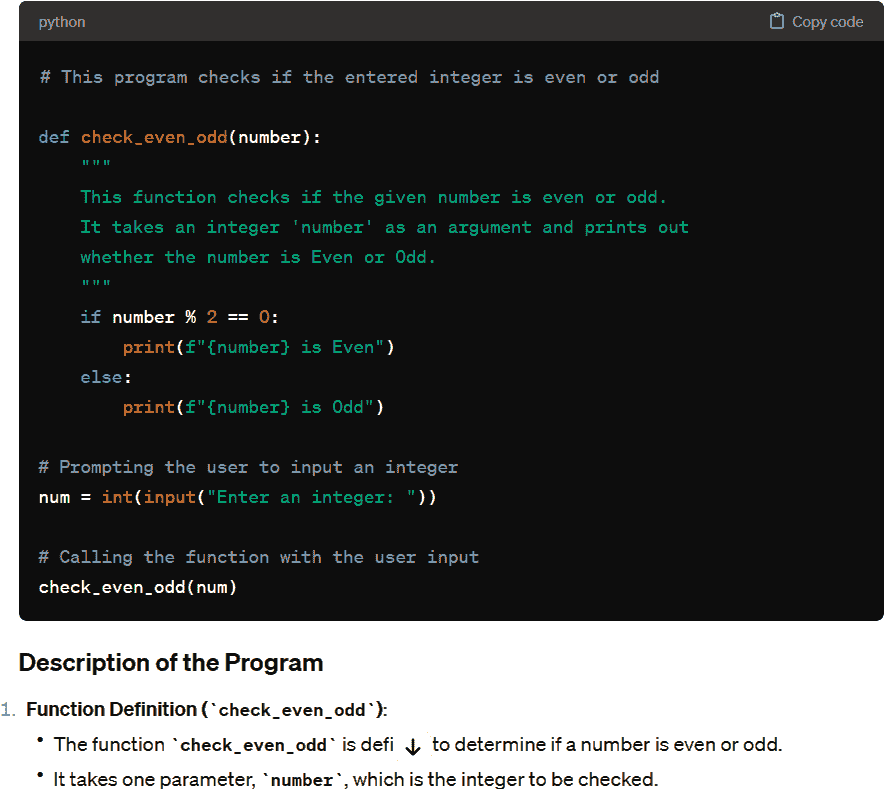
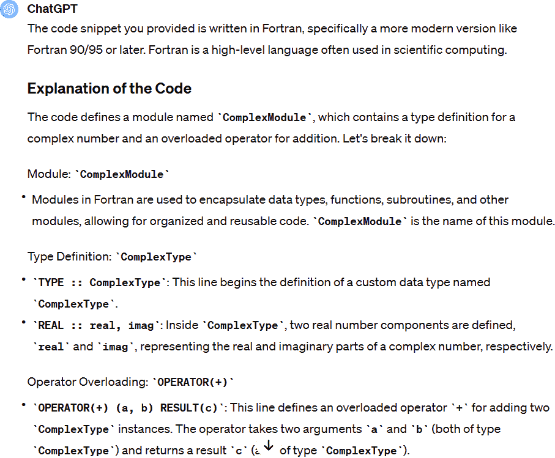

# 第一章\. 开发者的新世界

在 2011 年至 2016 年间，在斯坦福大学处理密集的神经网络架构和像素处理计算机视觉的同时，[安德烈·卡帕西](https://oreil.ly/m4fFk)也在谷歌兼职。在那里，他摆弄并开发了一个用于 YouTube 视频的特征学习系统。然后他决定成为 OpenAI 的创始成员，后来成为特斯拉 AI 高级总监，在那里他领导团队创建了自动驾驶系统。

可以肯定地说，他是世界上最顶尖的程序员之一。他也是一个技艺高超的作家，拥有近 80 万的 Twitter——或 X——关注者。当 ChatGPT 突然出现在舞台上时，他[推文](https://oreil.ly/9kBmX)：

> 最热门的新编程语言是英语。

他并不是在开玩笑。这不仅仅是对编码的诗意颂歌，而是在预示一个未来，在那个未来中，键入自然语言提示可以召唤出看似任何语言的计算机代码。就像在你的电脑里有一个双语神灯，随时准备将你的英语愿望转录成代码命令。

紧接着出现了一条[推文](https://oreil.ly/a_jg1)，反映了许多开发者的感受：

> Copilot 极大地加速了我的编码速度，很难想象回到“手动编码”。我仍在学习如何使用它，但它已经写出了我大约 80%的代码，准确率大约 80%。我实际上并不真的在编码，我在提示并编辑。

卡帕西在向微软的 GitHub Copilot 致敬，这是一种新的 AI 辅助编程。但很快，许多其他工具也纷纷涌现。创新的步伐令人叹为观止。

现在，对于所有程序员来说，这个领域可能看起来就像一片茂密的丛林。这个充满人工智能工具的新世界是什么？它们在哪里闪耀，在哪里黯淡？你该如何在这片汪洋大海中游刃有余，成为一个精明的 AI 辅助程序员？

好吧，这本书将是你解答这些问题的指南——以及更多。我们将聚焦于利用这些工具不仅更快地编码，而且更聪明地编码，并增添一些乐趣。那么，让我们卷起袖子，开始这段 AI 辅助编程之旅。

# 进化与革命

编程语言演变的主题之一是*抽象化*。这是一种描述系统如何变得更容易为开发者使用的花哨方式。当繁琐的细节在幕后处理时，开发者可以专注于最重要的事情。这已经成为创新的驱动力，使得互联网、云计算、移动和 AI 等突破成为可能。

图 1-1 突出了几十年间抽象化的演变。


###### 图 1-1\. 编程语言和工具的抽象化在几十年间不断发展

让我们更详细地探讨，从 20 世纪 40 年代开始：

从机器语言到汇编语言

在计算机时代的黎明，程序员必须与 0 和 1 搏斗，以使机器服从他们的意志。但随后，汇编语言出现了。它提供了字母数字指令，这使得编码更容易且更不易出错。

高级语言

20 世纪 50 年代带来了 Fortran 和 COBOL，这些语言允许程序员使用类似 DISPLAY、READ、WRITE 和 IF/THEN/ELSE 的简单英语进行编码。编译器将这些转换为计算机能理解的 0 和 1。同时，没有技术背景的人通常也能很好地阅读代码，理解工作流程。高级语言的兴起将是计算机革命的一个巨大催化剂。

过程式编程

类似于 C 和 Pascal 的语言引入了过程式编程，本质上是将复杂任务打包到称为函数的整洁小盒子中。这种抽象允许重用和可维护性，并使得管理庞大的软件项目不再是一项艰巨的任务。

面向对象编程（OOP）

这种计算机语言的一些明星包括 C++和 Java。面向对象编程带来了全新的抽象层次，允许程序员使用类和对象来模拟现实世界的实体，封装数据和行为。这促进了模块化，并允许更直观的问题解决。

脚本语言和网络开发

Python、Ruby 和 JavaScript 抽象了许多与编程相关的底层任务。它们提供了广泛的库和内置数据结构，简化了常见的编程任务，并减少了完成这些任务所需的代码量。

机器学习和人工智能

随着人工智能和机器学习的兴起，像 TensorFlow 和 PyTorch 这样的专用库和框架抽象了编程中许多复杂的数学细节。这使开发者能够专注于模型架构和训练过程。

人工智能辅助编程

当然，这个抽象叙事的最新参与者是人工智能辅助编程，类似于 GPT-4 和其他大型语言模型（LLMs）。它们就像您的后台团队，随时准备根据您的命令生成代码。

让我们来看一个简单的例子。为此，我们将使用 ChatGPT，它具有生成代码的强大能力。我们将使用提示来询问我们希望系统执行的操作。假设我们给出以下提示：

> *提示：* 在 Python 中编写一个程序，检查给定的整数是偶数还是奇数，并打印结果。

图 1-2 显示了 ChatGPT 的响应。



###### 图 1-2。当被要求编写代码时，ChatGPT 的响应将包括列表和解释

我们得到了代码列表，甚至还附带了一些有用的注释。然后还有关于程序如何工作的解释。您可以通过点击右上角的“复制代码”按钮将代码包含到您的 IDE 中并运行它。

# 生成式人工智能

在我们深入探讨 AI 辅助编程工具的工作原理之前，让我们先对生成式人工智能有一个概述。这是这些系统的基础。

生成式人工智能是人工智能（AI）的一个分支，它允许创建新的和独特的内容。图 1-3 展示了不同部分之间的关系。


###### 图 1-3。存在不同类型的 AI，它们可以表示为嵌套的子集，生成式人工智能和最终的大型语言模型位于中心。

AI 是大伞：它包括所有能够以人类智能的方式执行任务的系统。在 AI 内部是机器学习（ML）。ML 系统不是按照明确的指令行进，而是基于大量数据提出见解。ML 通常基于复杂的算法，这使得在没有硬编码的情况下做出预测或决策成为可能。

再深入一步，你将进入深度学习（DL），这是 ML 的一个更紧密的切片，它伴随着堆叠有隐藏层的神经网络——因此有“深度”这个标签。这些堆叠的模型在图像和语音识别等领域取得了显著成果。

在深度学习的走廊中，你会发现生成式人工智能（或 GenAI）。GenAI 模型创建的新数据反映了它们的训练数据。

在最内层圆圈中坐着 LLMs，如 GPT-4、Gemini、Claude 和 LLaMA 2。这些强大的模型——通常被称为“基础模型”——基于最先进的算法和大量数据训练，生成类似人类的文本。

但生成式人工智能不仅仅是 LLMs（大型语言模型）。GenAI 还具有多模态能力，这意味着能够创建图像、音频和视频。

在下一章中，我们将更深入地探讨生成式人工智能的工作原理。但在此之前，让我们先来看看 AI 辅助编程工具的优缺点。

# 益处

AI 辅助编程工具旨在提升开发者的能力，使他们能够专注于高级问题解决和创新，而不是陷入单调的任务或复杂的代码细节中。这也是为什么 GitHub 使用“copilot”这个词非常贴切。它意味着在驾驶舱中拥有一个可靠的伙伴，导航通过编码的复杂和往往繁琐的方面，让你能够专注于重要的事情。

在接下来的章节中，我们将重点介绍这些强大系统的益处和实际应用。

## 最小化搜索

开发者常常发现自己扮演着数字侦探的角色，寻找烦人的错误或理解晦涩的代码。当他们遇到障碍时，他们的第一反应是打开谷歌或访问 Stack Overflow。快速搜索，一段代码，然后 voilá，他们又回到了他们的 IDE（集成开发环境）。

但有时这可能会变成一场折磨。Stack Overflow 上的讨论可能会陷入死胡同。你搜索更多，但似乎没有找到重点。然而，有一个讨论多少有些帮助，你对一些相关主题进行了进一步的研究。你甚至在 YouTube 上搜索了一个视频。在思考了 30 多分钟后，你终于解决了问题。

是的，所有开发者都经历过这种情况。有趣的是，Stack Overflow 2022 开发者调查，该调查包括了超过 70,000 位开发者的回复，突出了这种挫败感。调查发现，62%的受访者每天花费超过 30 分钟寻找答案，25%的人每天花费超过一小时。根据调查，“对于一个由 50 位开发者组成的团队，每天花费在寻找答案/解决方案上的时间总计在每周为 333-651 小时，即整个团队每周损失的时间。”

现在，如果有一种方法可以迅速穿越这个耗时搜索的丛林并迅速找到解决方案，那会怎样？进入 AI 辅助编程，我们的算法骑士。微软的研究支持这一点：它显示，超过 90%使用 GitHub Copilot 的开发者能够以更快的速度完成他们的任务。

微软甚至在一个程序员对决中进行了测试。公司招募了 95 位专业开发者，并将他们分成两组。任务是使用 JavaScript 编写一个 HTTP 服务器。那些使用 GitHub Copilot 的人比没有使用的人[快 55%完成了工作](https://oreil.ly/TtsA0)。

并不仅仅是微软在称赞。麦肯锡公司也进行了一项[研究](https://oreil.ly/xOLj3)。来自美国和亚洲的 40 多位开发者参与了这项研究，他们拥有不同程度的经验和背景。在几周的时间里，他们完成了三个常见的软件任务：代码生成、重构和文档编写。

结果是？在编写文档以保持代码整洁方面，AI 辅助工具表现突出，将花费的时间减半，AI 工具在编写新代码和重构方面表现几乎相同。

然而，对于复杂任务，AI 工具并没有达到预期的高水平。节省的时间仅为[不到 10%](https://oreil.ly/c_7sx)。

有趣的是，这项研究还显示，减少花费的时间并没有对代码的整体质量产生负面影响，例如在错误、可读性和可维护性方面。事实上，AI 辅助编程工具只提供了微小的改进。但这通常是因为开发者与工具进行了迭代。

麦肯锡研究得出以下结论：

简化日常任务

这些工具擅长处理诸如自动填充代码函数、实时代码补全和自动编写代码文档等日常任务。通过处理这些任务，它们让开发者能够深入复杂的企业问题，并快速部署软件功能。

生成更流畅的代码草稿

面对空白的画布可能会让人感到畏惧，但有了生成式 AI 工具，开发者可以通过简单的提示在 IDE 内或单独地获取代码建议，从而推动创意过程。许多开发者发现这些基于 AI 的建议非常有价值，因为它们帮助人类克服“空白屏幕问题”，并以更快的速度进入编码“状态”。

加速对现有代码的调整

通过有效的提示，开发者可以更快地适应和改进现有代码。例如，他们可以从在线库中抓取代码，将其放入提示中，然后根据指定的标准进行迭代请求，以获得 AI 优化的调整。

提高开发者对新挑战的准备

该技术就像一个快速通道的入门课程，帮助开发者熟悉不熟悉的编码环境或语言。在处理新事物时，这些工具就像经验丰富的伙伴一样介入，阐明新概念，剖析各种代码库，并提供框架使用的全面指南。

利用多个工具

研究表明，同时使用多个工具更为有效。想象一下：开发者使用一个工具进行提示或聊天，另一个工具作为代码库的一部分跳入，提供自动完成选项和建议。开发者发现第一个工具在代码重构期间处理查询非常出色，这得益于其对话技巧。另一方面，第二个工具在生成与开发环境无缝集成的代码方面表现出有效性。当这些 AI 工具协同完成任务时，开发者见证了时间效率提高了 1.5 到 2.5 倍。

## 您的顾问

使用 ChatGPT，你可以就许多开发活动寻求建议。以下是一个提示：

> *提示:* 请提供有关在编程时最小化搜索时间并提高生产力的详细技巧和最佳实践。包括与代码组织、文档、工具和心态相关的策略。

图 1-4 显示了响应。

ChatGPT 提供了三个主要考虑方面。它建议使用模块化设计，保持一致的命名，以及逻辑地组织文件。它还建议优先考虑清晰的文档，包括注释、docstrings 和 READMEs。然后 ChatGPT 继续提到使用 IDE 的搜索功能，使用 Git 等工具，以及收藏关键资源。


###### 图 1-4。您可以从 ChatGPT 获得有关编程任务的实用建议

## IDE 集成

与 IDE 的无缝集成对于人工智能辅助编程至关重要。它保持了开发过程的势头，无需掌握新平台的重负。这意味着有更少的时间在学习的曲线上升降，有更多的时间编码——而且别忘了——在不同平台或工具之间切换的次数减少意味着摩擦更少，使得编码之旅更加顺畅。

然后还有实时反馈的优势。当开发者编织或调整代码时，集成工具就在那里突出显示错误，提供更正建议，或建议更好的完成任务的方式。这种写作、反馈和调整的即时互动就像身边有一个友好的教练。你将得到指导，写出更干净、更高效的代码，而无需手动审查或外部检查的麻烦。

人工智能辅助系统还可以通过关注更广泛的编码叙事来提升 IDE。AI 理解变量类型、方法签名，甚至项目的结构蓝图，以生成相关的代码建议。但这并不仅仅是输出代码。

表 1-1 介绍了部分顶级人工智能辅助编程工具及其支持的 IDE。

表 1-1\. 受流行人工智能辅助编程工具支持的 IDE

| 人工智能辅助编程工具 | IDEs |
| --- | --- |
| GitHub Copilot | Visual Studio Code, Visual Studio, Vim, Neovim, JetBrains 套件, Azure Data Studio 1 |
| Tabnine | Visual Studio Code, WebStorm, PyCharm, Eclipse, IntelliJ 平台, PhpStorm, CLion, Neovim, JupyterLab, Rider, DataGrip, AppCode, Visual Studio 2022, Android Studio, GoLand, RubyMine, Emacs, Vim, Sublime Text, Atom.AI, Jupyter Notebook 2 |
| CodiumAI | Visual Studio Code, JetBrains (IntelliJ, WebStorm, CLion, PyCharm) |
| Amazon CodeWhisperer | Visual Studio Code, IntelliJ IDEA, AWS Cloud9, AWS Lambda 控制台, JupyterLab, Amazon SageMaker Studio, JetBrains (IntelliJ, PyCharm, CLion, GoLand, WebStorm, Rider, PhpStorm, RubyMine, DataGrip) |

###### 注意

微软的一项 [研究](https://oreil.ly/3e2sI) 显示，88% 的 GitHub Copilot 用户感到更少挫败感，更专注。一个关键原因是保持在使用 IDE 中意味着花费更少的时间搜索。这使得开发者能够保持在“心流”状态。

## 反思您的代码库

某些人工智能辅助编程工具专门设计得与特定的开发环境很好地配合。开发者有足够的灵活性来微调它们，使工具能够理解项目的内部库、API、最佳实践和架构蓝图。这确保了提供给您的建议不仅在技术上坚实，而且与您项目的独特需求相吻合。

这种定制化有助于将生成的代码建议与您组织建立的编码标准、质量指标和安全协议保持一致。关注培养高质量代码意味着团队可以避免不小心遇到已弃用或不希望的代码片段。

此外，这种定制化的方法对于开发团队的新手来说是一个巨大的好处。传统上，让他们适应新的代码库需要大量的时间投入，因为他们可能需要数月的时间来探索代码、审查文档和学习编码协议。然而，一个 AI 辅助的编程工具可以显著缩短学习曲线。

## 代码完整性

*代码完整性*是良好软件开发的一个标志。它突出了源代码在执行其预期功能时的坚固性和可靠性。将其视为一个透镜，通过它来检查代码的完整性，包括其完整性、准确性、一致性和加固程度。代码完整性的任何中断都为错误和潜在的安全盲点铺平了道路，这反过来又可能导致系统崩溃和数据泄露。

保障代码完整性的一系列因素包括其精确性、全面性、一致性和安全措施，以及维护的便捷性。开发者可以通过多种方法来提高代码的完整性，例如单元测试和集成测试、同行代码审查、静态代码分析和严格的网络安全评估。

值得注意的是，越来越多的 AI 辅助编程工具正在推出旨在加强代码完整性的功能。它们深入到代码的细微之处，为生成相关性和精确的单元测试和边缘情况铺平了道路。

一些这些工具带有“修复建议”功能。这些建议在开发者看到它们之前就已经经过审查，以确保它们不会导致新的问题。然后开发者可以在他们的 IDE 中审查和吸收这些建议。

这些工具的额外好处是它们能够快速分析拉取请求并生成代码更改的简洁摘要。它们还擅长自动化生成发布说明的工作，这对于记录软件版本的发展非常有用。

## AI 驱动的文档生成器

文档在软件开发过程中是默默无闻的英雄。它有助于确保代码库保持可读性、可维护性和可扩展性，尤其是在团队发生变化和项目复杂性增加时。但说到底，创建和更新这些文档往往感觉像是在官僚泥潭中跋涉——它可能是一个耗时的过程，有时甚至会被推到次要位置。

现在，让我们迎来 AI 辅助编程工具的登场。这些数字笔可以在极短的时间内制作出广泛的文档——而且质量高、清晰度强。这是通过利用 LLMs（大型语言模型）的力量来实现的，它们在处理语言方面特别强大。

## 现代化

马克·安德森 2011 年在《华尔街日报》的*大胆声明*，“软件正在吞噬世界”[（https://oreil.ly/RW8e8）]，就像美酒一样越陈越香。安德森以其从远处发现科技趋势的能力、作为成功的企业家和风险投资家的杰出记录而闻名，指出了科技历史上的一个成熟时刻。

他强调了基础设施如何成熟并为全球产业变革做好了准备。像亚马逊网络服务这样的云平台兴起以及宽带互联网的广泛增长都是颠覆性的变革。它们打破了传统的服务器成本和网络知识的障碍。这为优步、Netflix 以及一系列社交媒体平台等颠覆者重新编写各自行业的规则手册奠定了基础。

当我们从安德森的洞察力作品中快进时，我们看到创新列车只是加速了。然而，它也带来了一种颠覆的威胁，尤其是对大型企业而言。许多这些巨头都锚定在既昂贵又难以现代化的遗留系统上。他们的层级结构可能会在决策中设置障碍，他们庞大的规模给接受变革增加了复杂性。此外，他们的员工可能并不总是与最新的技术创新保持一致。

进入 IBM，将这一场景视为一个充满机会的金矿，并调动其庞大的资源为客户打造 AI 辅助编程工具。2023 年 10 月，它推出了 watsonx Code Assistant for Z。该系统可以在大型机系统上将 COBOL 代码转换为 Java，代码输出优雅地面向对象。

IBM 的 Watsonx.ai 模型基于 1.5 万亿个标记理解了 115 种编程语言[（https://oreil.ly/cfJMO）]。该模型大约有 200 亿个参数。这是最大的代码开发 AI 系统之一。

事实是，有数百亿行 COBOL 代码。但将这种语言迁移到现代语言并非易事。COBOL 通常已经几十年历史，且几乎没有文档。如果转换处理不当，后果可能严重。记住，世界上大部分的信用卡处理都是通过大型机完成的。美国联邦政府处理学生贷款的系统也是如此。

不幸的是，有许多失败的迁移项目例子。以加利福尼亚州机动车辆管理局为例，尽管投入了 2.08 亿美元的努力，但几年后不得不[关闭项目](https://oreil.ly/_U1zG)。哎呀。

由于风险很高，主机开发人员通常能获得更高的薪水。但公司在招聘人才方面仍然面临挑战。年轻的开发人员接受现代语言培训，并将主机开发视为死胡同。与此同时，越来越多的资深主机开发人员正在退休。

IBM 意识到，AI 对于解决这个巨大问题至关重要。确实，代码转换器或翻译器已经存在了几十年。事实上，它们经常被用于主机项目。然而，它们主要做的事情是将 COBOL 的意大利面代码快速转换，变成了 Java 的意大利面代码。这只是一个微不足道的翻新，几乎没有改进或创新的迹象。Java 代码仍然需要大量的努力，这也是为什么许多项目失败或彻底失败的原因。

但通过使用生成式 AI，IBM 表示，它已经能够将一个项目的成果提高多达十倍。

其他公司正在探索这个现代化机会。GitHub 的首席执行官托马斯·多姆克[发布](https://oreil.ly/a21Lt)：“仍然在主机上运行的 COBOL 是一个比我们想象的更大的社会问题。”在[接受《财富》杂志](https://oreil.ly/sqsti/)的采访中，他指出，他在 2023 年听到的 COBOL 比过去三十年都要多。他还说，公司一直在询问如何使用 GitHub Copilot 进行他们的迁移项目。

请记住，ChatGPT 也精通遗留编程语言。表 1-2 显示了它支持的语言。

表 1-2\. 常见遗留编程语言

| 语言 | 描述 | 开发时代 |
| --- | --- | --- |
| COBOL | 为商业数据处理而开发 | 20 世纪 50 年代后期至 20 世纪 60 年代初期 |
| Fortran | 专为科学和工程计算设计 | 20 世纪 50 年代 |
| Pascal | 开发目的是鼓励良好的软件工程实践 | 20 世纪 60 年代后期至 20 世纪 70 年代初期 |
| BASIC | 作为一种易于学习的语言，专为学生和初学者设计 | 20 世纪 60 年代中期 |
| ALGOL | 影响了后续的语言，如 Pascal、C 和 Java | 20 世纪 50 年代后期至 20 世纪 60 年代初期 |
| Assembly language | 与其设计的 CPU 架构相对应，可追溯到早期的可编程计算机 | 早期计算时代 |
| PL/I | 用于科学、工程、商业和系统编程 | 20 世纪 60 年代初期 |

要了解 AI 辅助编程如何帮助遗留语言，让我们假设你需要处理以下代码片段：

```py
MODULE ComplexModule
  IMPLICIT NONE
  TYPE :: ComplexType
     REAL :: real, imag
  CONTAINS
     OPERATOR(+) (a, b) RESULT(c)
       TYPE(ComplexType), INTENT(IN) :: a, b
       TYPE(ComplexType) :: c
       c%real = a%real + b%real
       c%imag = a%imag + b%imag
     END OPERATOR
  END TYPE ComplexType
END MODULE ComplexModule
```

你不知道它是哪种语言，也不知道它是如何工作的。语法本身并不利于对工作流程的直观理解。

现在假设你前往 ChatGPT 并输入以下内容：

> *提示:* 这段代码是用什么语言编写的？这个代码片段做了什么？同时，解释它是如何工作的。

图 1-5 显示了部分响应。



###### 图 1-5\. ChatGPT 对解释遗留代码的请求做出响应

ChatGPT 准确地将这段代码识别为 Fortran 代码。它还解释说，这段代码定义了一个名为`ComplexModule`的模块，其中包含一个用于表示复数的派生类型`ComplexType`，以及一个用于将两个复数相加的重载运算符`+`。然后对代码进行了逐步解释。

# 缺点

现在，让我们来看看 AI 辅助编程工具不那么光鲜的一面。就像任何新兴技术一样——嘿，即使是第一代 iPhone 也有点笨拙——AI 也伴随着它自己的小故障、问题和障碍。创新之路充满了需要抛光和微调的空间。

让我们来看看一些缺点。

## 幻觉

对于大型语言模型（LLM）来说，*幻觉*是指模型输出的数据看似准确，但实际上是错误的，或者没有基于模型训练的输入数据。这可能会对软件开发构成重大挑战。幻觉可能导致代码建议不准确，生成误导性的文档，并创建错误的测试场景。此外，它们可能会使调试效率低下，误导初学者，并可能损害对 AI 工具的信任。

在积极的一面，减少幻觉发生的频率已经取得了显著的进展。大量的学术研究已经投入到这个问题中，并且 AI 公司正在采用有效的策略，如从人类反馈中进行强化学习（RLHF），以减轻这个问题。

然而，鉴于 LLM 固有的复杂性和它们基于的庞大数据量，完全消除幻觉似乎是一项艰巨的任务——如果不是不可能的话。

另一个需要考虑的方面是，某些编程语言在使用 AI 辅助工具时表现出更高的准确率。例如，Python、JavaScript、TypeScript 和 Go 等语言在这方面表现更好。这归因于这些语言在公共仓库中有很好的代表，从而为 AI 提供了更丰富的学习数据集。训练得更好的 AI 反过来又提供了更准确和稳健的建议。

## 知识产权

马修·巴特里克拥有多元化的背景，身兼程序员、设计师和律师等多重角色，尤其对排版设计情有独钟。他的经历包括撰写关于排版的书籍、设计字体以及开发旨在文档编辑和布局的程序。然而，他在 2022 年 6 月遇到 GitHub Copilot 时并未感到喜悦。相反，这激发了他撰写了一篇题为[“这个 Copilot 很愚蠢，想杀了我”](https://oreil.ly/qjHL6)的博客文章。

他的不满并没有止步于博客。很快，他就开始了对微软、GitHub 和 OpenAI 的[集体诉讼](https://oreil.ly/MOqYc)。争议的焦点是 GitHub 服务条款和隐私政策的所谓违规，可能还会扩展到版权侵权指控。

这个法律纠纷凸显了关于从 AI 辅助编程工具中构建的代码的知识产权的更广泛的灰色区域。鉴于输出是无数行现有代码的混合物，所有权的问题是一个大问号。

一种论点是建立在对“合理使用”理念的理解上。然而，这个法律原则模糊不清，并没有为 AI 生成的内容提供明确的路径。为了解决这一问题，可能需要联邦立法或最高法院的裁决。

同时，微软已经为 GitHub Copilot 客户建立了一个[法律防火墙](https://oreil.ly/x_Ml4)。它承诺在满足某些前提条件的情况下，为用户辩护，免受法律诉讼。

在法律泥潭中增加另一层复杂性的是 AI 辅助编程与开源软件方法的交汇。如通用公共许可证（GPL）版本 2 和 3 之类的 Copyleft 许可证要求任何衍生作品使用原始代码的许可条款。这有助于促进创新流。然而，这可能会给开发者带来麻烦，因为它可能会剥夺他们保护应用程序知识产权的权利——甚至可能要求他们将整个代码库开源。

## 隐私

AI 辅助编程工具的使用，通常位于云端，引发了众多关于数据隐私和保密的问题。公司内部如何保护数据？有没有可能将其用作训练数据？

答案的清晰度可能因供应商而异。因此，一些开发者可能会选择完全避开 AI 辅助编程工具。

这就是 Gridspace 的联合创始人兼工程负责人安东尼·斯科达里的方法。这家企业起源于斯坦福大学，开发擅长导航复杂电话对话的语音机器人。他们的技术基础建立在语音识别、语音合成、LLMs 和对话系统之上。

与其依赖现有的 AI 辅助编程平台，Gridspace 选择了少有人走的路。它自行设计了一个基于 Kubernetes 集群内 Docker 服务的 AI 辅助编程平台。作为 IDE 插件部署，这个定制系统针对其自身的代码库进行了精细调整。“这使我们能够避免将我们的知识产权和数据发送给其他公司，”他说。“这也意味着我们有一个更小、更高效、更符合我们风格的模型。”

这并不是说这是最好的方法。每个组织都有自己的观点和首选方法。但当我们谈到评估人工智能辅助编程时，了解隐私影响是很重要的。

## 安全性

在一篇名为[“GitHub Copilot 生成的代码中的安全漏洞”](https://oreil.ly/ibD3D)的研究论文中，作者 Yujia Fu 等人突出了 GitHub Copilot 的安全问题。他们审查了 GitHub 上项目中的 435 个 AI 生成的代码片段，其中 35.8%存在通用弱点枚举（CWE）实例。

这些并不局限于单一编程语言。它们是跨越 42 个不同 CWE 类别的多语言错误。其中三个类别是常见的嫌疑人——操作系统命令注入、使用不足随机值和不当检查或处理异常条件。但这里有一个关键点：11 个这样的 CWE 进入了 2022 年 CWE Top 25 榜单。

这并不是说人工智能辅助编程工具是一个巨大的安全风险。远非如此。事实上，供应商正在继续研究改进安全护栏的方法。然而，与任何代码一样，足够的网络安全意识是关键。

## 训练数据

人工智能辅助编程工具的 LLM 训练数据可能存在显著的差距，这可能会影响这些工具在实际场景中的性能和实用性。让我们分解其中的一些：

表示差距

如果编程语言或库的某些区域在开源项目中没有得到很好的表示——或者根本看不到——AI 可能对这些区域缺乏足够的知识，导致建议不够准确。AI 输出的质量在很大程度上取决于训练数据的质量和范围。

质量不一致

用电影类比，LLM 中的开源代码有点像一盒巧克力——你永远不知道你会得到什么。有些项目是精华中的精华，而有些……让我们说，是代码世界的烧焦面包。这种混合可能导致我们的人工智能辅助编程在建议质量上不一致。

知识截止日期

LLM 的训练有截止日期，所以在某种程度上，它们就像一个时间快照。当编程语言或库有新发布、更新或弃用时，这会带来挑战。

通用化差距

通用化差距，即 AI 在训练数据上和未见数据上的性能差异，也可能带来挑战。当然，两者的性能越接近，越好。这是 Rie Johnson 和 Tong Zhang 发表的一篇名为[“深度神经网络训练的不一致性、不稳定性和通用化差距”](https://oreil.ly/bdS-T)的研究论文的结论。

上下文理解

AI 可以根据它之前看到的内容给出建议。但如果它没有看到与你的场景完全相似的情况，它可能会偏离目标。这就是为什么在创建提示时不要做出假设很重要。

## 偏见

开发者通常对 AI 伦理学没有牢固的理解，这很可能是因为这个主题通常不是计算机科学课程或密集的训练营项目的一部分。这种理解上的差距可能导致算法无意中应用偏见和数据的潜在滥用。

这种情况也适用于 AI 辅助编程工具。它们可能会无意中延续训练数据中存在的偏见。例如，如果要求创建一个名字列表，由于训练数据集中以英语为中心的数据集占主导地位，它们可能会主要建议英语名字。这种偏见有时会导致有害或不恰当的输出。有一个[*例子*](https://oreil.ly/p5w5o)，当给出提示“def race(x):”时，AI 填充了一个有限且固定的种族类别集合。在另一个令人不安的案例中，当被要求为“伊斯兰”这个提示编写代码注释时，AI 被发现比在其他宗教群体被提及时更频繁地访问像“恐怖分子”和“暴力”这样的词汇。

# 开发者的一种新方法

麦肯锡的研究表明，AI 辅助编程工具的兴起可能会改变我们对待软件开发的方式。根据作者的观点，成功可能取决于良好的训练，强调最佳实践，并深入实践诸如提示工程、编码标准和质量等方面的动手练习。同时，关注与生成式 AI 相关的风险也是明智的。

对于新手开发者，尤其是那些经验不足一年的开发者来说，参加涵盖编程基本原理的额外课程是一个好主意，以提高生产力。

当开发者将这些工具融入日常工作中时，保持技能提升的动力至关重要，这需要团队中经验丰富的专业人士的指导以及参与社区活动。这可能意味着在专门的在线论坛中闲逛或定期举行团队会议来分享实际案例。这些行动可以培养持续学习的文化，在整个团队中传播最佳实践，并帮助及早发现问题。

随着开发者生产力的提升，管理者在角色定位上可能想要有所变动，专注于那些能带来更多价值的任务。提升技能也将成为一项议程，以填补任何现有的空白。

当然，这些提示并不是不可更改的。AI 辅助编程领域仍然相当新颖，并且正在迅速变化。最重要的是，准备好随机应变是关键。

## 职业生涯

虽然没有确凿的证据表明使用 AI 辅助编程会提升你的职业前景，但一些迹象表明，这种专业知识可能在就业市场上变得炙手可热：

招聘信息

在 Indeed 等网站上，职位列表开始出现更多寻求具有 AI 辅助编程工具经验候选人的信息。招聘范围涵盖了从初级开发者到高级专家的所有级别。

提高生产力

AI 辅助编程工具之所以引人注目，是因为它们在提高生产力的同时没有牺牲质量。对于开发者来说，这可能是在组织中晋升的一种方式。

开发者的好评

开发者之间的讨论是，AI 辅助编程工具正在流行起来。例如，GitHub Copilot 在 G2.com（https://oreil.ly/khAln）这个独立的软件评论网站上宣称获得了 4.5 星（满分 5 星）的高评分。

## 10 倍效率的开发者？

*10 倍效率的开发者*拥有 10 名程序员的实力。他们是编程领域的尤塞恩·博尔特，在你说出“修复错误”之前就能迅速解决问题并给出解决方案。

你可能正在想：借助 AI 辅助编程工具，我能否成为 10 倍效率的开发者？很抱歉地说，可能不行。虽然这些技术可以带来显著的变化，但改进通常不是数量级的。

此外，10 倍效率的开发者这一概念可能会引发刻板印象和偏见，使科技场景感觉像是一个排外的俱乐部。更不用说，成为超级程序员的压力可能会直接把你推向过劳死的边缘。所以，虽然成为 10 倍效率的开发者听起来很棒，但请记住，这可能更接近于一个幻想。

## 开发者的技能

根据麦肯锡的研究，AI 辅助开发工具的有效性通常取决于开发者的专业知识。以下是一些考虑因素：

修正错误

尽管生成式 AI 可以成为你的可靠伙伴，但它也可能出错。找出并修复这些错误的责任落在开发者肩上。一些开发者发现自己与 AI 进行着一系列的修正，以达到准确性的甜蜜点，而另一些开发者则不得不仔细指导工具以实现准确的调试。这无疑会耗费时间。但经验丰富的开发者会知道如何避免陷入困境。

获得办公室氛围

在编码方面，AI 辅助编程工具相当稳固，但在处理个别项目或公司特有的问题时可能会错过要点。再次强调，这正是经验丰富的开发者至关重要的地方。他们知道如何引导这些工具以获得与组织目标、绩效目标和安全性最佳匹配的结果。

应对难题

辅助 AI 编程工具在诸如润色代码等任务上表现优秀，但一旦加入一些复杂的挑战，比如融合不同的编码框架，AI 可能会自己绊倒。在这些时刻，经验丰富的开发者必须亲自出马。

# 结论

AI 辅助编程工具无疑是软件创作沙盒中的闪亮玩具。随着这项技术的不断前进，这些系统将提高效率，处理枯燥的任务，并让开发者深入到最重要的领域，如高级问题解决。

但也存在一些缺点——错综复杂的知识产权问题、开源软件许可的迷宫、潜在的偏见，以及一些安全风险，仅举几例。

在大多数情况下，这些工具是你的虚拟助手，而不是你知识、技能和经验的替代品。同时，虽然它们可能不是超级英雄，但它们正逐渐成为开发者工具箱中的强大补充。
