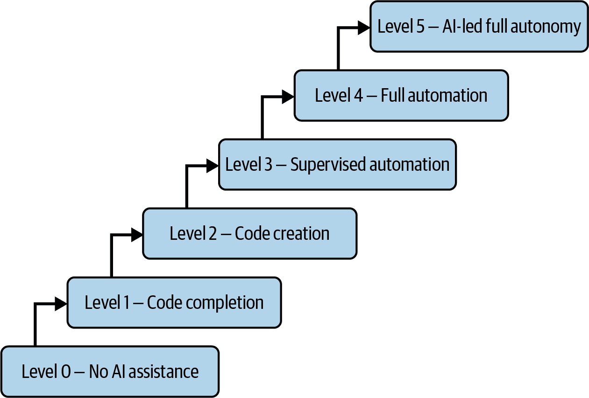
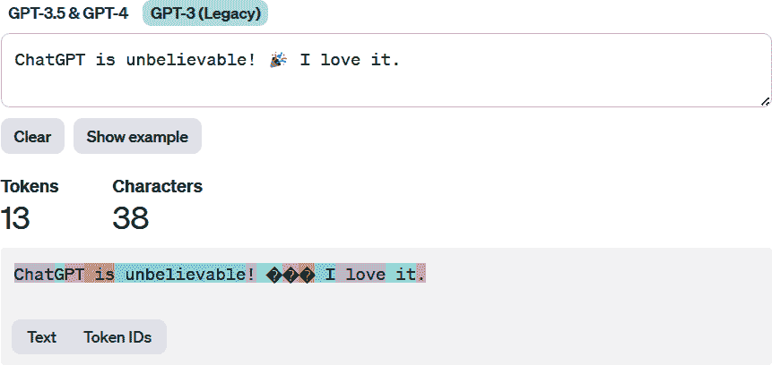

# 第二章\. AI 编码技术是如何工作的

在本章中，我们将揭开 AI 辅助编程工具的面纱，看看是什么让它们运转。我们将简要回顾历史，体验 transformer 模型和 LLMs，并演示 OpenAI 游乐场。然后，我们将提供有关如何评估 LLMs 的建议。

理解这项强大技术能做什么和不能做什么将为在现实世界的软件项目中更智能地使用 AI 辅助编程工具铺平道路。

# 关键特性

市场上关于 GitHub Copilot、Tabnine、CodiumAI 和 Amazon CodeWhisperer 等 AI 辅助编程工具的讨论不绝于耳。每个产品的制作者都试图展示他们自己的一套特色功能。但这些工具共享了许多功能。表格 2-1 总结了其中的一些主要功能。

表格 2-1\. AI 辅助编程工具的常见功能

| 功能 | 描述 |
| --- | --- |
| 代码建议 | 根据注释和文件上下文提供代码建议；推荐单个行或整个函数。 |
| 上下文感知补全 | 基于整个或部分代码库提供上下文感知的代码补全，以及辅助编码的建议。 |
| 测试生成 | 分析代码以生成有意义的测试，映射代码行为，并在发货前暴露边缘情况，以确保软件可靠性。 |
| 用户-IDE 交互 | 当用户在 IDE 中输入代码时自动激活并提供指导；用户可以通过聊天与代码交互。 |
| 代码分析 | 分析代码片段、文档字符串和注释，以提供可靠的代码预测并标记可疑代码。 |
| 错误检测和修复 | 识别代码中的潜在错误并建议修复方法。 |
| 代码自动文档化 | 自动添加文档字符串并增强代码文档。 |
| 常规任务自动化 | 帮助创建常规或耗时任务、不熟悉的 API 或 SDK 以及其他常见编码场景（如文件操作和图像处理）的代码。 |
| API 和 SDK 使用优化 | 帮助正确有效地使用 API 和 SDK。 |
| 开源代码发现和归属 | 促进开源代码和库的发现和归属。 |

表格 2-1 中的列表并非尽善尽美；创新正在以快速的速度发展。显然，这些系统可以为开发者提供很大的帮助，在很大程度上是通过提供代码建议和上下文感知的补全。我们将在下一节中更详细地探讨这些内容。

# 代码建议和上下文感知补全与智能代码补全

*智能代码补全*的魔力，也称为自动补全或微软的术语 IntelliSense，是许多 IDE 提供的一项功能。它们通过建议、填充和突出显示代码片段来帮助开发者，当人类在键盘上敲击时。这项技术实际上自 1950 年代末拼写检查器的出现以来就已经存在。

突破发生在 1990 年代中期。微软的 Microsoft Visual Basic 5.0 提供了实时建议和补全功能，重点在于基本语法和函数签名。这大大提高了生产率并减少了错误。

因此，你可能想知道：像 IntelliSense 这样的东西与 AI 辅助编程工具相比如何？毕竟，IntelliSense 在其背后包含了一些 AI 和机器学习的元素。

然而，这里有一个重要的区别。AI 辅助工具由生成式 AI 驱动。它们不仅提供代码，还提供文档、规划文档和有用的指南等多种内容。多亏了生成式 AI，这些工具掌握了根据给定上下文生成、调整和理解类似人类文本的技巧，使它们在翻译、摘要、文本分析、主题建模和回答查询方面成为佼佼者。与这些工具互动有时就像与你的代码进行闲聊一样。由于它们的核心是 LLM，它们可以捕捉到你的输入中的上下文和意图。

# 编译器与 AI 辅助编程工具的比较

为了更好地理解 AI 辅助编程工具，了解编译器的作用很有帮助。以下是编译器执行的主要步骤：

词法分析（标记化）

编译器的作用就像是一位语言老师，将你的代码分解成标记。

语法分析

在这里，编译器检查你的标记是如何分组的。它确保你的编码结构正确，而不仅仅是命令正确。

语义分析（错误检查）

编译器确保你的代码在编程语言的上下文中是有意义的。这不仅仅是关于正确的语法。还关于正确的意义。

中间代码生成

这是你代码开始其转换之旅的地方。编译器将你的高级代码转换为中间形式。这还不是机器语言，但正在朝这个方向发展。

代码优化

在这个步骤中，编译器就像是你代码的个人教练，使其更加精简和高效。它调整中间代码以使其运行更快并占用更少的空间。

代码生成

这是最终的转换。编译器将优化的中间代码转换为 CPU 可以理解的机器代码或汇编语言。

链接和加载：

有时被认为是编译过程的一部分，*链接*涉及将各种代码和库组合成一个单一的可执行程序。*加载*是将程序放入内存以执行的过程。

至于像 Copilot 这样的 AI 辅助编程工具，它们是另一种生物。它们并不真正“理解”编程语言，就像编译器那样。这没关系。编译器会这样做。相反，它们使用 AI 来猜测并基于大量已有的代码建议代码片段。由于这些工具是在玩概率，因此建议可能会有很大差异。然后编译器将这段代码转换成机器可以运行的程序。

有时，AI 工具可能会错过一些简单的东西，比如括号，而人类程序员或编译器会立刻发现。这是因为 LLMs 基于预测模式，而不是编译器引擎。如果训练中不常见，它们可能不会捕捉到。此外，这些工具可能会变得复杂，并根据情况建议复杂的代码。是的，AI 辅助编程工具可能会走火入魔。

当谈到发现错误时，AI 辅助编程工具通常很有效，但仍然无法与编译器的忍者般的错误检查技能相媲美。然而，这些工具仍然很强大。例如，它们可以帮助捕捉讨厌的语法错误——缺少分号、函数名中的拼写错误、不匹配的括号——并迅速提出正确的修复建议。它们在引导你避开常见的编码陷阱方面也表现出色。无论是提醒你在打开文件后正确关闭文件，还是建议更高效地遍历数组的方法，这个工具都会为你提供支持。至于逻辑错误，AI 辅助编程工具可能会出人意料地有洞察力。它们可能无法解决每个复杂问题，但它们经常可以提出你未曾考虑过的替代方法或解决方案，引导你的问题解决之旅走向正确的方向。

这一切意味着，尽管人工智能工具有助于使编码更加流畅，但它们并不能取代编译器所做的彻底检查或人类程序员敏锐的视角。

这些缺点实际上突显了将人工智能辅助工具的智慧与编译器检查的彻底性和人文关怀相结合是多么关键。毕竟，你希望确保你的代码不仅质量好，而且精确无误。

# 能力层级

2023 年 10 月，Sourcegraph 的首席执行官和联合创始人 Quinn Slack 分享了一篇有见地的[博客文章](https://oreil.ly/SoDqc)。他深入探讨了像 Copilot 这样的 AI 辅助编程工具的世界，并提出了一种有趣的方式来思考它们，他称之为“代码 AI 的层级”。他的逐步框架使每个人都能更容易地了解这些 AI 工具能做什么，并检查销售这些工具的公司所宣称的夸大其词是否站得住脚。图 2-1 展示了代码的层级。

前三个级别侧重于以人为中心的编码，其中开发者是主要角色。一开始，第 0 级是没有 AI 辅助的阶段，这是传统的编码方式。开发者手动完成所有工作，没有 AI 的参与。这是为 AI 后来介入设定的基础。

然后是第 1 级，代码补全。在这个阶段，AI 开始发挥作用，根据周围环境帮助生成单行代码或代码块。在这个阶段，开发者仍然是主导者，指导整体程序，并将 AI 作为典型编码任务的捷径。

###### 图 2-1\. 编程系统具有不同级别的 AI 能力

第 2 级，代码创建，增加了 AI 的参与。在这里，它更加亲自动手，编写更长的代码段。例如，AI 可以设计 API 甚至修复现有代码。当然，这一切都是在人类的监督下进行的。这个级别需要 AI 了解代码库及其上下文，以便提出不仅正确而且与现有代码很好地融合的代码。

从第 3 级开始，监督自动化，我们看到 AI 在编码中开始占据主导地位。在这个阶段，AI 完成多项任务以满足人类设定的更广泛目标，并且不需要在每个转折点进行检查。在这个级别工作就像委托给初级开发者一样。这个级别的 AI 足够聪明，可以解决错误、添加新功能，并将系统结合起来，在过程中向人类同事寻求任何澄清。

到了第 4 级，实现全面自动化，AI 真正提升了它的表现。在这里，它能够独立处理复杂任务，无需人类对代码进行最终确认。想象一下，如果你是首席执行官或产品经理，你会对顶级工程师有多少信任。这个级别正是追求这种关系的。AI 不仅仅是反应，它主动关注代码，及时发现并解决问题。

最后是第 5 级，AI 主导的完全自主。这个级别完全不同，AI 不仅仅是遵循人类指令，而是设定自己的目标。这是关于 AI 基于核心奖励函数工作的。想象一下，在一个它与其他代理对抗的世界里，AI 在玩自己的游戏。当然，这个级别听起来有点像科幻，但鉴于发展速度如此之快，我们在这个时代看到这一级别成为现实并不太离谱。

目前，像 Copilot 这样的工具大致处于第 3 级，上下浮动。精确确定级别可能有些棘手，但 Quinn Slack 的框架在理解这项技术和其关键交互方面做得相当不错。有一点是肯定的：这项技术并没有放缓脚步——它正在快速发展。

# 生成式 AI 和大型语言模型（LLMs）

使用人工智能辅助编程工具不需要你对生成式人工智能技术的细节了如指掌。然而，对这项技术的全局了解可以非常有帮助。你将能够更敏锐地评估这些工具的响应、功能和局限性。

*透明度*不仅仅是一个流行词。对于一项新技术要真正流行起来，了解其内部运作至关重要。采用率关乎信任。在编码世界中，可靠性和问责制不仅仅是花哨的额外功能——它们是基础。

随着我们进入接下来的部分，我们将简要介绍生成式人工智能和大型语言模型，以便给你一个更清晰的画面。

## 进化

生成式人工智能的故事可以追溯到几十年前，其中一个最早的例子是 20 世纪 60 年代中期由麻省理工学院教授约瑟夫·魏岑鲍姆（Joseph Weizenbaum）带来的先驱聊天机器人 ELIZA。ELIZA 被设计成模仿与心理治疗师聊天（[你仍然可以在网上找到它](https://oreil.ly/MbLP8)）。当然，它很简单，基于规则算法运行，主要只是重复用户输入。

然而，许多人发现与 ELIZA 聊天比与真正的治疗师聊天更愉快，有些人甚至被骗以为他们正在与人类交流。这种奇特的现象被称为“ELIZA 效应”，展示了人们如何轻易地想象计算机程序具有类似人类的理解能力。

然而，生成式人工智能的旅程并不完全是短跑。其核心的技术齿轮相当基础，进步更多的是一种缓慢的爬行。但到了 2010 年代，情况发生了转折点。技术世界现在拥有强大的计算能力，像 GPU（图形处理单元）这样的闪亮硬件系统，大量数据，以及深度学习等复杂模型的微调。就这样，生成式人工智能回到了快车道。随着其发展，出现了不同的方法：

变分自编码器（VAEs）

这项技术首次亮相于 2013 年，归功于 Diederik P. Kingma 和 Max Welling 以及他们发表的论文[“Auto-Encoding Variational Bayes”](https://arxiv.org/abs/1312.6114)。他们的 VAE 模型由从更复杂、更高维度的数据中提取的低维潜在空间组成，这一切都无需监督。它还包括一个编码器-解码器结构。当我们说*高维数据*时，我们指的是具有许多特征的数据，每个特征都是一个维度——想象一下在 784 维空间中的一个 28 × 28 像素的图像。低维潜在空间就像这种数据的紧凑版本，保留着关键信息，同时摒弃了额外的维度。这一点很重要，因为它减轻了计算负担，抵抗了维度灾难，并使得数据更容易可视化和解释。从高维到低维空间的这种飞跃被称为*降维*，它将数据简化到其基本要素。与它们的表亲，传统的自动编码器不同，后者为每个潜在属性输出一个单一值，VAE 中的编码器则提供了一个概率分布。解码器随后从这个分布中选取样本来重建数据。这种在潜在空间中提供一系列数据而不是单一值的小技巧，为创建新数据或图像打开了大门。

生成对抗网络（GANs）

由 Ian Goodfellow 及其同事于 2014 年[提出](https://arxiv.org/abs/1406.2661)，生成对抗网络是一类用于无监督机器学习的 AI 算法。GANs 的核心是两个神经网络，被称为*生成器*和*判别器*，它们在一场类似游戏的对抗中一决高下。生成器不断产出新的数据片段，而判别器扮演着裁判的角色，区分真实数据和伪造数据。每一轮，生成器都会提升其技能，制作出与真实实例惊人相似的数据。这种巧妙的设置打开了通往新可能性的大门，引领了能够创建逼真图像、声音录音以及更多 AI 的诞生。

这类生成式 AI 将是 Transformer 模型的重要构建块，这是一个真正的突破，使得 LLMs 的力量成为现实。

## Transformer 模型

在变换器模型引起轰动之前，自然语言处理（NLP）的常用方法是循环神经网络（RNN）。RNNs 被设计来处理序列或时间序列数据。它们会跟踪一个隐藏状态来记住序列中之前步骤的片段——这对于语言建模、语音识别和情感分析等任务来说是一个实用的功能。RNNs 按步骤进行，一次处理序列中的一段，根据当前输入和之前处理过的内容更新它们的隐藏状态——这就是“循环”一词的由来。但当面对长序列时，它们会遇到梯度消失或爆炸的问题，这使得它们难以追踪数据中的长期关系。

出现了变换器，完全改变了游戏规则。变换器不是像 RNNs 那样按步骤处理数据，而是并行地快速处理数据，并利用注意力机制来跟踪输入序列中不同部分之间的关系，无论它们的位置如何。这种架构蓝图上的转变使得变换器能够轻松处理短序列和长序列。它还避免了梯度问题。此外，它们的并行处理能力与图形处理单元（GPUs）或张量处理单元（TPUs）等复杂的芯片架构很好地结合在一起。

Ashish Vaswani 和他在谷歌的研究团队创造了变换器，并在 2017 年发表了开创性的论文[“Attention Is All You Need”](https://arxiv.org/abs/1706.03762)。图 2-2 展示了模型的主要部分。

变换器模型就像一位杰出的语言学家，擅长解开语言的复杂性。它的魔力在两个主要阶段展开：编码和解码。每个阶段都由其自身的层级组成。在*编码*阶段，模型读取并理解输入文本，就像语言学家理解外语中的句子一样。然后在*解码*阶段，模型根据编码阶段获得的理解生成新的文本或翻译，就像语言学家将那个句子翻译成你的母语一样。

变换器的核心是一个称为*注意力*的机制，它允许模型评估句子中每个词与其它词的相关性。它为每个词分配一个注意力分数。例如，以句子“The cat sat on the mat.”为例，当模型关注到单词*sat*时，与坐的动作有直接关系的单词*cat*和*mat*可能会获得更高的注意力分数。

该模型的一个显著特点是**自注意力机制**。这允许它审视整个句子，理解词语之间的关系，并在长段文本中保持这些关系。这使得变换器通过能够关注到目前为止出现的所有词语或**标记**（整个词语或词语的一部分）来获得一种长期记忆，从而理解更广泛的上下文。

然而，尽管具有这些能力，变换器最初缺乏识别句子中词语顺序的能力，这对于理解意义至关重要。在这里，**位置编码**步骤介入。它就像一个 GPS，为模型提供关于句子中每个词语位置的信息，并有助于理解“猫追逐老鼠”与“老鼠追逐猫”这样的从句。

###### 图 2-2. 变换器模型的架构是 LLM 的核心

在复杂性上更进一步，变换器采用了**多头注意力机制**。想象一下模型拥有多对眼睛，每一对眼睛从独特的角度审视句子，关注不同的词语方面或关系。例如，一对眼睛可能专注于理解动作，另一对专注于识别人物，还有一对专注于识别地点。这种多视角方法使变换器能够更深入地理解文本。

此外，变换器（Transformer）的每个阶段都包含**前馈神经网络**的层，这是一个简单的网络，有助于处理词语之间的关系。这进一步增强了文本理解和生成的能力。

变换器是以预训练模型的形式存在的。它已经在大量数据上进行了训练，并准备好使用或进一步微调。一旦预训练完成，该模型可以通过 API 访问，允许其在各种语言处理任务中立即使用。公司或个人可以快速将此模型集成到他们的系统中，例如 AI 辅助编程应用。此外，通过在特定领域的数据上进行微调，预训练的大型语言模型（LLM）可以进一步优化，以在医疗或法律文本分析等特定领域表现出色。这消除了从头开始开发复杂语言模型的需求，节省了大量时间、精力和资源。具有基础语言理解的预训练模型，为生成式 AI 应用的发展提供了一个跳板。

###### 注意

构建和运营一个 LLM 成本高昂。根据《华尔街日报》的报道，截至 2023 年初，GitHub Copilot 每月每个用户平均亏损超过 20 美元（[链接](https://oreil.ly/D2NiB)）。在某些情况下，一些用户每月使公司亏损 80 美元。然而，随着未来几年生成式 AI 基础设施的扩展，每个用户的成本应该会降低。

两种主要的 transformer 系统是*生成预训练 transformer*（GPT）和*双向 encoder 表示的 transformer*（BERT）。GPT 是 OpenAI 的一个工具，非常适合创建文本、总结信息和翻译语言。它基于自回归 LLM 架构。这意味着它通过仔细考虑每个单词（基于它已经输出的内容）来构建文本，就像讲故事的人逐字构建叙事一样。它的技能来自于在大量文本数据上的训练。GPT 使用解码器来生成内容。

另一方面，BERT 使用自动编码方法。这种设计使它能够深入理解句子中单词的上下文，使其擅长解读语言的细微差别和含义。Google 于 2018 年开发了 BERT 作为一个开源项目。从那时起，许多基于核心模型的变体和改进已经出现。

对于 AI 辅助编程应用，主要的 transformer 模型类型是 GPT。它已被证明能够根据程序员提供的上下文高效地预测和自动补全代码。

## OpenAI 游乐场

[OpenAI 游乐场](https://platform.openai.com)是一个生成式 AI 沙盒，提供了访问 OpenAI 开发的多种模型。它允许通过直观的图形界面进行模型定制。

OpenAI 的游乐场使得理解各种大型语言模型（LLM）的优缺点变得更加容易。此外，它还允许根据不同的输入，如温度，对模型进行实时测试和调整。

然而，OpenAI 对平台的使用收费。费用基于使用的 token 数量，如表 2-2 所示。请注意，价格会定期变动。好消息是，截至本文撰写时，所有变动都是价格下降。

表 2-2\. OpenAI LLM 的成本

| 模型 | 输入 | 输出 |
| --- | --- | --- |
| GPT-4/8K 上下文 | $0.03/1K 个 token | $0.06/1K 个 token |
| GPT-4/32K 上下文 | $0.06/1K 个 token | $0.12/1K 个 token |
| GPT-3.5-Turbo/4K 上下文 | $0.0015/1K 个 token | $0.002/1K 个 token |
| GPT-3.5-Turbo/16K 上下文 | $0.003/1K 个 token | $0.004/1K 个 token |

例如，假设你使用的是 GPT-4/8K 上下文 LLM。你的提示包含 1,000 个 token，模型对此的响应是 2,000 个 token。那么成本将是输入 3 美分，输出 12 美分。

当你首次注册 OpenAI 账户时，你将获得 5 美元的信用额度，可用于 OpenAI 游乐场。这可以用于 API 调用。

### Token

让我们更详细地看看 token。OpenAI 有一个名为[Tokenizer](https://platform.openai.com/tokenizer)的工具，如图 2-3 所示，我在其中输入以下内容进行分析：

> *输入:* ChatGPT 太不可思议了！🎉我喜欢它。

###### 图 2-3\. OpenAI Tokenizer 显示文本摘录的 token

在分词中——用颜色突出显示——单词*ChatGPT*由三个标记组成。分解为 Chat、G 和 PT。单词*unbelievable*及其随后的感叹号有两个标记，一个用于单词，一个用于标点符号。至于表情符号，它由三个标记组成。每个标点符号都是一个标记。空格包括与相邻单词一起。

分词器适用于 GPT-3、GPT-3.5 和 GPT-4。请注意，LLM 之间的分词通常不同。

###### 注意

作为经验法则，1,000 个标记大约相当于 750 个单词。

### 使用平台

当您访问 OpenAI 游乐场时，您将获得访问仪表板的权限，如图图 2-4 所示。

###### 图 2-4. OpenAI 游乐场有一个包含提示、资源和交互区域的仪表板

屏幕中间是用于与 LLM 交互的主要工作流程：

系统

这是您为 LLM 提供一些背景信息的地方，例如，“您是 Python 编程的专家。”系统提示是会话中的第一条消息，为交互设定了基调。定制系统提示可以更好地控制模型在对话中的行为，这特别有用，可以确保它保持在期望的参数或上下文中。

用户

这是提示的主要指令。例如，这是您要求 LLM 执行编码任务的地方。

添加消息

这允许您与 LLM 进行持续的聊天。

让我们尝试一个例子。假设您正在处理一个 Python 项目，并且您在理解如何实现 Tkinter 库以获取用户输入方面遇到困难。您可以输入以下内容：

> *系统消息*：您是一位专注于 Tkinter 的 Python 专家。
> 
> *用户消息*：我想使用 Tkinter 创建一个简单的 GUI 来获取用户的姓名和年龄。我该如何操作？

LLM 将生成代码列表。但假设您想添加对输入的验证。您可以点击添加按钮并输入“我该如何确保输入的年龄是一个数字而不是文本？”

LLM 将使用`try-except`块将年龄输入转换为整数来对此做出响应。

当然，这就像使用 ChatGPT 一样——但结构更严谨。真正的力量在于定制的功能。您将在屏幕右侧找到这些功能：

模型

您可以从各种模型中进行选择，甚至可以使用您自己的微调 LLM 来确保模型专注于您编码的独特需求。您可以在[OpenAI API 文档](https://oreil.ly/L3y09)中找到有关微调模型的更多信息。

温度

这调整了生成内容的随机性或创造性。值的范围是从 0 到 2。值越低，响应越确定性和专注。表 2-3 显示了不同类型开发任务的建议温度级别。

表 2-3。建议的某些类型编程任务的温度级别

| 任务类别 | 温度值 | 描述 |
| --- | --- | --- |
| 代码生成 | 0.2–0.3 | 确保更确定性的、准确的代码，遵循常见的约定，以实现可靠和可理解的结果。 |
| 代码审查 | 0.2 或以下 | 专注于已建立的最佳实践和标准，以提供精确的反馈。 |
| 错误修复 | 0.2 或以下 | 产生更准确和直接的解决方案，以解决识别出的问题。 |
| 创造性问题解决 | 0.7–1.0 | 探索更广泛的可能解决方案，在头脑风暴或创新问题解决中很有用。 |
| 学习和实验 | 0.7–1.0 | 提供更多样化的示例和解决方案，以理解解决问题的不同方法。 |
| 数据分析和可视化 | 0.2 或以下 | 生成准确且具有意义的可视化或分析。 |
| 优化任务 | 多样化 | 允许在探索（较高温度）和利用（较低温度）之间取得平衡，以实现高效解决方案。 |

然而，如果您为温度设置一个相当高的值，结果可能会变得毫无意义。这里是一个使用值为 2 时的示例提示：

> *提示:* 在 Python 中，将数据从 CSV 文件迁移到 MySQL 数据库的步骤是什么？

图 2-5 显示了输出。正如您所看到的，这几乎没有任何意义！

###### 图 2-5。当使用温度为 2 时，LLM 的结果大多是毫无意义的

现在，让我们看看您可以调整的其他功能：

最大长度

这是用于生成内容的最大标记数。该数字包括提示和响应的使用。标记与内容的比例取决于您使用的模型。

停止序列

这表示 LLM 应该停止创建更多文本的点。您可以指定一个特定的字符串或字符序列，当检测到生成的文本中时，将信号模型停止该过程。

Top p

也称为核采样，该技术根据累积概率阈值选择单词，该阈值用*p*表示，其范围可以从 0 到 1。简单来说，模型不会总是从最有可能的几个下一个单词中选择，而是根据指定的*p*值考虑更广泛或更窄的下一个可能单词的范围。较低的*p*值会导致选择范围更小、更集中的单词集，从而产生更可预测和连贯的文本。另一方面，较高的*p*值允许选择更广泛的下一个可能单词，从而产生更多样化和富有创造性的文本生成。

频率惩罚

这有助于解决 LLM 中常见的重复短语或句子的问题。值范围从 0 到 2。值越高，重复越少。然而，在值大于 1 时，文本生成可能会变得不可预测，甚至毫无意义。

存在惩罚

这也有一个 0 到 2 的值。更高的值将允许 LLM 包含更广泛的标记，这意味着使用更丰富的词汇或更广泛的概念宇宙。

在频率惩罚、存在惩罚和 top *p*的情况下，OpenAI 建议选择一种方法来调整您的任务。但不要害怕实验。由于涉及到的复杂性的复杂舞蹈，优化 LLM 的道路并非由严格的规则铺就。

# 评估 LLM

评估 LLM 是一项艰巨的任务。这些巨兽通常如此不透明，以至于它们似乎难以理解。AI 公司之间的竞争使这个问题更加严重。对于这些模型所训练的数据集、用于微调其行为的参数数量以及驱动它们的硬件的细节，我们通常只能看到很少的信息。

但也有一些好消息，多亏了斯坦福的一些研究人员。他们创建了一个[评分系统](https://oreil.ly/FoVAr)，称为基础模型透明度指数，用于评估 LLM 的开放性。这个由一百个标准构成的指标，旨在为 LLM 透明度的模糊水域带来一些清晰。

排名基于百分比尺度。表 2-4 展示了排名。遗憾的是，结果远非鼓舞人心。研究人员表示，没有主要的大型语言模型接近实现“足够的透明度”，平均得分仅为 37%。

表 2-4\. 按模型透明度排名的顶级 LLM^(a)

| 公司 | 模型 | 排名 |
| --- | --- | --- |
| Meta | LLaMA 2 | 54% |
| BigScience | BLOOMZ | 53% |
| OpenAI | GPT-4 | 48% |
| Stability.ai | Stable Diffusion 2 | 47% |
| Google | PaLM 2 | 40% |
| Anthropic | Claude 2 | 36% |
| Cohere | Command | 34% |
| AI21Labs | Jurassic-2 | 25% |
| Inflection | Inflection-1 | 21% |
| Amazon | Titan Text | 12% |
| ^(a) 基础模型研究中心，基础模型透明度指数总得分 2023，[*https://crfm.stanford.edu/fmti*](https://crfm.stanford.edu/fmti) |

LLM 处理各种领域和任务（如软件开发）的灵活性是一个显著的优势。然而，这也使得评估过程变得复杂，因为它需要特定领域的评估指标和基准，以确保模型在每个特定应用中的有效性和安全性。

尽管如此，在评估 LLM 时，还有一些指标需要考虑：

BERTScore

该指标旨在通过比较生成的文本与参考文本（使用 BERT 嵌入）来评估文本生成模型。尽管主要用于自然语言文本，但它可以扩展或适应代码生成任务，尤其是在代码用自然语言注释或注释时。

复杂度

这是一种评估概率模型（如 LLMs）的常用度量标准。它量化模型预测的概率分布与实际数据分布之间的匹配程度。在代码生成的背景下，较低的困惑度值表示模型在预测代码序列中的下一个标记方面表现得更好。

BLEU（双语评估辅助研究）

虽然最初是为机器翻译开发的，但 BLEU 也用于代码生成，以比较生成代码与参考代码。它计算 *n*-gram 精确度分数来量化生成文本和参考文本之间的相似度，这有助于评估生成代码的语法正确性。更高的 *n*-gram 精确度分数表示在特定的 *n* 词序列中，生成文本与参考文本之间的协议更好。

ROUGE（面向摘要评估的召回率辅助研究）

这是从自然语言处理（NLP）中借用的一种度量标准，可用于评估代码生成模型。它计算生成文本和参考文本之间 *n*-gram 的重叠，从而提供有关生成代码与预期输出对齐程度的见解。

MBXP（最基础的 X 编程问题）

该基准专门设计用于评估跨多种编程语言的代码生成模型。它使用可扩展的转换框架将提示和测试用例从原始数据集转换为目标语言，从而促进对代码生成模型进行全面的跨语言评估。

HumanEval

这是一个基准，通过测量 LLMs 从文档字符串中合成程序的功能正确性来评估它们的代码生成能力。这个基准对于代码生成中 AI 模型的持续发展和改进至关重要。虽然不同的模型在 HumanEval 上的熟练程度不同，但一个被称为 HUMANEVAL+ 的扩展版本在识别由流行的 LLMs 生成的先前未检测到的错误代码方面发挥了关键作用。

多语言 HumanEval（HumanEval-X）

这是原始 HumanEval 基准的扩展。多语言 HumanEval 评估 LLMs 在超过 10 种编程语言中的代码生成和翻译能力。它采用转换框架将提示和测试用例从 Python 转换为目标语言中的相应数据，为多语言代码生成和翻译创建了一个更全面的基准。

评估一个大型语言模型（LLM）的另一种方法是查看其参数数量——这可能是数百亿个。所以参数越多越好，对吧？不一定。评估应该采取更细致的方法。首先，扩展参数的成本可能非常巨大，从计算能力和能源消耗的角度来看。这可能会使 LLM 在货币化应用上变得不经济。接下来，随着参数数量的激增，模型的复杂性也随之增加，这可能导致过度拟合。*过度拟合*发生在模型在训练数据上表现出色，但在面对未见过的数据时却表现不佳。这削弱了其泛化能力。

另一个问题是需要大量且多样化的训练数据集来满足这些模型对数据的无尽渴望。然而，获取和整理如此庞大的数据集不仅资源密集，而且也提出了与数据隐私和偏差相关的问题。更重要的是，随着参数数量的激增，这些巨头的评估变得越来越复杂。评估指标需要更加全面和多样化，才能准确衡量模型在众多任务上的性能。

最后，微调可能是在不增加底层 LLM 参数规模的情况下，从模型中获得更多的一种更好的方法。

# LLM 的类型

有各种类型的 LLM，其中一种突出的类别是开源 LLM。任何人都可以使用、调整或分享它们。它们的透明度意味着你可以看到这些模型是如何运作的。此外，开源 LLM 允许开发者合作创新，以及开发附加组件，当然，修复烦人的错误。

而最好的部分？它们没有价格标签。

但开源 LLM 并非全是彩虹和独角兽。通常没有专门的团队来迅速解决问题或推出常规更新。所以，如果你遇到问题，你可能不得不卷起袖子，深入论坛寻求帮助。

开源模型的质量和性能有时感觉像过山车。然后还有那些烦人的安全问题。由于一切都可以访问，黑客更有可能找到方法插入恶意代码。建议谨慎行事。

最后，当涉及到用户指南和文档时，开源 LLM 可能会让你希望有更多。有时，这些指南感觉像是用象形文字写的。

表 2-5 展示了一些最受欢迎的开源 LLM。

表 2-5\. 最受欢迎的开源 LLM

| 模型 | 开发者 | 参数（B = 十亿） | 值得注意的功能 |
| --- | --- | --- | --- |
| GPT-NeoX-20B | EleutherAI | 20B | 在“The Pile”数据集上训练；能够执行各种 NLP 任务，如故事生成、聊天机器人和摘要 |
| LLaMA 2 | Meta | 7B 到 70B | 在 2000 亿个标记上训练；LLaMA 1 的上下文长度翻倍 |
| OPT-175B | Meta | 175B | 作为一系列模型的一部分；训练时比 GPT-3 的碳足迹低 |
| BLOOM | BigScience | 176B | 在 ROOTS^(a) 语料库上训练；设计时考虑透明度，公开了训练数据细节和评估方法 |
| Falcon-40B | 技术创新研究所 (TII) | 40B | 在 1,000B 个标记上训练 |
| Dolly 2.0 | Databricks | 12B | 基于 EleutherAI 的 Pythia 模型系列；提供类似 ChatGPT 的指令跟随交互性 |
| Mistral 7B | Mistral AI | 7.3B | 使用分组查询和滑动窗口注意力；在庞大的数据集上训练，擅长处理长序列 |
| Mixtral 8X7B | Mistral AI | 46.7B | 稀疏专家混合模型；性能如同 12.9B 模型，支持多种语言，在代码生成和推理等各项任务中表现出色 |
| ^(a) 负责的开放科学 开放协作 文本来源 |

相反，闭源或专有 LLM 要保密得多。它们通常将代码、训练数据和模型结构严格保密。然而，开发这些复杂系统的公司通常拥有巨额资金。表 2-6 显示了这些公司在 2023 年筹集的资金。

表 2-6\. 顶级 LLM 开发者筹集的风险资本

| 公司 | 资金 |
| --- | --- |
| Anthropic | 1.25 亿美元 |
| OpenAI | 10 亿美元 |
| Cohere | 2.7 亿美元 |
| Inflection AI | 1.3 亿美元 |

拥有如此资源，这些公司可以聘请世界上最优秀的数据科学家并建立复杂的基础设施。结果是，LLM 在性能方面通常是尖端技术。它们也针对规模和企业的严格需求而构建，例如安全性、隐私性。

至于缺点，存在信任问题。这些模型是如何得出它们的回答的？关于幻觉和偏见呢？对这些问题的答案可能缺乏详细性。

然后，这些大型 AI 运营商可能成为垄断者的风险。这可能意味着客户会被锁定在一个生态系统中。最后，闭源 LLM 可能比开源项目更容易停滞不前，因为它们可能无法从开源项目通常享有的多样化和审查中受益。

# AI 辅助编程工具评估

确定选择哪种 AI 辅助编程工具可能是一个令人头疼的问题。您必须权衡许多因素，如其精确度、聊天功能、安全性、速度和用户友好性。有时，这归结为感觉适合工作的事情。但另一方面，如果您的雇主坚持使用特定的系统，您的选择可能受到限制。

要了解当前的热门趋势，[Stack Overflow 2023 开发者调查](https://oreil.ly/nvqKY) 是一个实用的资源。Stack Overflow 从近 90,000 名程序员那里收集了关于最受欢迎的工具的见解，您可以在表 2-7 中看到。

表 2-7\. 流行 AI 辅助编程工具排名^(a)

| AI 辅助开发者工具 | 百分比 |
| --- | --- |
| GitHub Copilot | 54.77% |
| Tabnine | 12.88% |
| Amazon CodeWhisperer | 5.14% |
| Snyk Code | 1.33% |
| Codeium | 1.25% |
| Wispr AI | 1.13% |
| Replit Ghostwriter | 0.83% |
| Mintlify | 0.52% |
| Adrenaline | 0.43% |
| Rubberduck AI | 0.37% |
| ^(a) [Stack Overflow, 2023 开发者调查](https://oreil.ly/0u7WZ) |

此图表向您展示了众多可用的工具。当您在寻找合适的工具时，从其他开发者那里获取推荐是一个明智的选择。此外，亲自试用几个工具也是一个好主意。幸运的是，大多数这些工具都提供免费试用，这样您可以在不立即做出承诺的情况下尝试它们。

另一个需要考虑的关键方面是公司的财务支持。它是否有风险投资？如果没有，公司可能不仅难以增长，还可能难以保持其平台创新。已经，几家 AI 辅助编程公司不得不关闭他们的服务，这对开发者来说可能真的会打乱工作。以 Kite 为例。它是这个领域的早期参与者之一，于 2014 年成立。然而，到 2022 年，公司决定[停止该项目](https://oreil.ly/Bnz9U)。一线希望？它开源了工具的大部分代码库。

# 结论

在本章中，我们揭开了生成式 AI 和 LLM 的神秘面纱。我们瞥见了其中一些迷人的历史，例如 ELIZA，然后聚焦于 AI 领域的一项重大突破：Transformer 模型。我们还尝试了 OpenAI 游乐场，并展示了如何定制 LLM。

本章的一些关键要点包括标记、利用预训练模型的优点、评估 LLM 的注意事项、如困惑度和 BLEU 分数等指标，以及开源模型与专有模型之间的比较。
