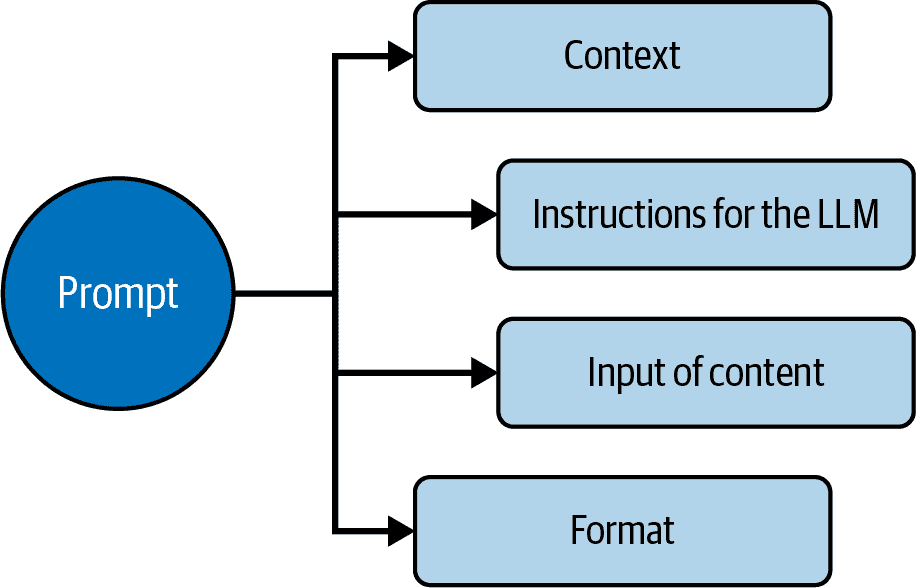

# 第三章. 提示工程

*提示工程*是机器学习和*自然语言处理*的一个子领域，这是研究使计算机能够理解和解释人类语言的技术。主要目标是找出如何与*大型语言模型*进行交流，这些是设计用来处理和生成类似人类语言响应的复杂 AI 系统，以正确的方式交流，以便它们生成我们想要的答案。

想象一下：当你向某人寻求建议时，你必须提供一些背景信息，并清楚地说明你需要什么？与 LLM 交流也是如此。你必须精心构思你的问题或提示。有时，你甚至可以在你的问题中放入一些提示或额外信息，以确保 LLM 明白你的要求。

这不仅仅关乎提出一次性的问题。有时，它就像与 LLM 进行一场完整的对话，来回交流，调整你的问题，直到你得到所需的那颗黄金信息珍珠。

例如，假设你正在使用一个 AI 辅助编程工具来开发一个网络应用程序。你首先询问如何用 JavaScript 创建一个简单的用户登录系统。最初的回应可能只涉及基础知识，但随后你意识到你需要更高级的功能。因此，你继续提出更具体的提示，询问如何集成密码加密和如何安全地连接到数据库。每次与 AI 的互动都会使其回应更加精确，逐渐适应你项目的特定需求。

请记住，提示工程已经成为一个热门的职业类别。根据[Willis Towers Watson](https://oreil.ly/Qy9Zi)的数据，提示工程师的平均年收入约为 130,000 美元，尽管这个数字可能有些保守。为了吸引顶尖人才，公司通常会提供有吸引力的股权包和奖金。

在本章中，我们将深入探讨提示工程的世界，并揭示一些实用的策略和技巧。

# 艺术与科学

提示工程是艺术与科学的结合。一方面，你必须选择合适的词语和语气，让 AI 以你想要的方式回应。这是关于引导对话走向特定方向。需要一点直觉和创造力来引导对话走向特定方向，并精炼你的语言，挖掘详细和细微的回复。

是的，这可能会有些棘手，尤其是对于软件开发者来说。通常，你遵循一系列规则来编写你的代码，要么它就会工作，要么编译器会告诉你哪里出了错。它是逻辑和可预测的。

但提示工程？并不那么简单。它更加自由和不可预测。

然而，提示工程也有相当多的科学原理。你需要理解人工智能模型的工作原理的细节，正如我们在第二章中讨论的那样。除了创造力，你还需要精确性、可预测性和复制结果的能力。通常这意味着你必须进行实验，尝试不同的提示，分析结果，并调整直到得到正确的响应。

在提示工程中，不要期望找到任何每次都有效的神奇解决方案。当然，有很多课程、视频和书籍声称拥有提示工程的“所有秘密”。但请带着怀疑的态度看待它们，否则你可能会感到失望。

此外，人工智能和机器学习的世界总是在不断变化，新的模型和技术层出不穷。因此，有一个明确的提示工程技术？这是一个不断变化的目标。

# 挑战

提示工程可能会让人感到沮丧。即使你如何措辞的微小变化也可能在 LLM 输出的内容上产生巨大的差异。这是因为底层的高级技术是基于概率框架的。

下面是提示工程中的一些挑战：

词汇冗长

LLM 可能会成为话唠。给他们一个提示，他们可能会就此展开，给出冗长的响应，而你只想得到一个简短的答案。他们有在响应中加入大量相关想法或事实的倾向，使得响应比必要的更长。如果你想让 LLM 直接切入要点，只需要求它“简洁”即可。

不可迁移性

这意味着一个与某个 LLM 配合得很好的提示可能对另一个 LLM 的效果不佳。换句话说，如果你从 ChatGPT 切换到 Gemini 或 GitHub Copilot，你可能需要根据每个 LLM 独特的训练、设计和专业调整你的提示。不同的模型在不同的数据集和算法上训练，导致对提示的理解和解释存在差异。

长度敏感性

长提示可能会让大型语言模型（LLM）感到不知所措，开始忽略或误解你的输入的一部分。这就像 LLM 的注意力范围减弱，其响应变得有些分心。这就是为什么你应该避免在提示中提供详细要求；将提示保持在一页以内。

模糊性

如果你的提示不清晰，LLM 可能会感到困惑，并给出离题甚远或纯粹是虚构的响应。清晰是关键。

尽管如此，还是有方法可以提高结果。我们将在本章的剩余部分介绍这些方法。

# 提示

你可以将提示视为包含四个主要组成部分，你可以在图 3-1 中看到。



###### 图 3-1\. 提示包含四个主要组成部分

首先，*上下文*指定了 LLM 在提供回答时应扮演的角色或角色。接下来是*指令*，例如摘要、翻译或分类。然后是*内容输入*，如果你想让 LLM 处理信息以创建更好的回答。最后，你可以展示你希望输出的*格式*。

请记住，你不需要所有这些组件。事实上，你可能只需要一个就能得到一个好的回答。但作为一般规则，向 LLM 提供更多具体细节会更好。

让我们现在来看看每个组成部分。

# 上下文

你通常会以一句或两句提供上下文的句子开始你的提示。通常，你会指定 AI 在提供回答时想要扮演的角色或人格。这会导致不仅更准确，而且与上下文相关的回答，从而确保结果更有意义。

例如，如果你想调试一段代码，你可能使用以下作为上下文：

> *提示:* 你是一位经验丰富的软件工程师，专长于调试 Java 应用程序。

或者假设你想了解特定算法的优化技术。你可以通过以下方式设定场景：

> *提示:* 你是一位在算法优化方面有专长的资深软件开发者。

添加上下文有助于 LLM 以正确的思维方式来处理你的提示。

# 指令

你的提示应该至少包含一个明确的指令。没有阻止你添加更多指令，但你需要小心。如果你的提示中包含大量查询，可能会让 LLM 感到困惑，并使你更难得到你想要的答案。

让我们分析一下为什么会这样。首先，当你有多个指令时，事情可能会变得有些模糊。如果它们不清楚或似乎相互冲突，LLM 可能会对应该关注哪个指令或如何平衡它们感到困惑。

接下来，更多的指令意味着 LLM 需要处理的内容更多。它必须处理并理解你的提示的每一部分，然后找出如何将这些部分编织成一个连贯的回答。这是一项大量的心智体操，有时可能会导致错误或偏离正确答案的回答。

不要忘记，LLMs 是按顺序逐条处理指令的。因此，你排列查询的方式可能会影响它们的解释以及你得到的答案类型。

考虑到所有这些，一个专业的小贴士是保持简单。不要一次性向 LLM 抛出一大堆问题，试着将它们分解成一系列较小的提示。这就像进行一场对话而不是发表独白。

对于提示，也有许多种类的指令。在接下来的几节中，我们将讨论软件开发中使用的某些主要指令。

## 摘要

总结可以将较长的文本压缩成更短的形式，同时保持主要思想和观点不变。这对于快速了解冗长的文档非常有用。对于软件开发者来说，总结可以在表 3-1 中列出的场景中特别有用。

表 3-1\. 编码任务的总结提示

| 用例 | 描述 | 示例提示 |
| --- | --- | --- |
| 代码文档 | 提供对大量文档的简洁概述，突出关键功能、依赖和结构。 | “总结以下文档的主要观点，以快速了解代码库。” |
| 缺陷报告 | 快速识别用户在大量或冗长的缺陷报告中报告的主要问题。 | “总结以下缺陷报告中报告的常见问题，以确定要解决的主要问题。” |
| 研究论文 | 从冗长的研究论文或技术文章中提取简洁的见解，以更新用户对最新研究或技术的了解。 | “提供以下研究论文中讨论的关键发现和技术的总结。” |
| 变更日志 | 通过变更日志理解软件库或工具新版本中的关键变更。 | “总结以下 1.1.2 版本变更日志中的关键变更。” |
| 邮件线程 | 从长篇邮件线程中提取讨论或决策的关键点。 | “总结以下邮件线程中的主要讨论要点。” |

另一种类型的总结是 *主题建模*，其中统计模型发现文档集合中出现的抽象“主题”。以下是一些为开发者提供的主题建模提示：

> *提示:* 识别以下文本中讨论的主要主题：{文本}
> 
> *提示:* 从以下文本中提取关键词，以推断主要主题：{文本}
> 
> *提示:* 根据以下文本的内容建议标签：{文本}

## 文本分类

*文本分类* 涉及向计算机提供大量文本，使其学会用标签进行标记。其中一种类型是 *情感分析*，例如当你有一系列社交媒体帖子，LLM 确定哪些具有正面或负面含义时。对于开发者来说，情感分析可以是一个有用的工具，以衡量用户对应用程序的反馈。

一些示例提示包括：

> *提示:* 你能分析这些客户评论并告诉我整体情绪是正面、负面还是中性吗？{文本}
> 
> *提示:* 这里是我们用户论坛上关于最新更新的一个讨论线程。你能为我总结一下整体情绪吗？{文本}
> 
> *提示:* 我已经整理了我们应用商店页面上的反馈列表。你能根据情感对评论进行分类吗？{文本}
> 
> *提示:* 评估这些关于我们产品发布的博客评论的情感，共识是什么？{文本}

## 推荐

你可以指示大型语言模型提供建议。开发者可以使用这样的反馈来提高诸如修复错误、改进代码或更有效地使用 API 等活动的响应质量。

查看以下你可能使用的示例提示：

> *提示:* 当我尝试调用 <*Method()*> 时，以下代码片段抛出 NullPointerException。你能帮助识别潜在的原因并提出修复建议吗？
> 
> *提示:* 这里有一个我编写的用于排序整数列表的函数。你能推荐任何优化使其运行更快或更易读的建议吗？

大型语言模型（LLM）的建议可以成为你工作的强大加速器，大大节省时间并提供你可能没有考虑过的想法。这种技术在处理复杂或微妙任务时尤其有益。

但也存在一些缺点。一个潜在的问题是大型语言模型可能会过度简化响应并错过细微差别。此外，请记住，该模型的知识在某个时间点被冻结，因此可能无法跟上最新的信息或趋势。

如果有什么的话，建议是一种开始的方式。但你会想深入挖掘并自己做一些更多的工作，以获得完整的画面。

## 翻译

*本地化* 实质上是指调整软件以适应特定地区的语言和文化规范。它使你的软件能够说当地的语言并理解地区的特殊之处，这种能力对于扩大市场和与受众建立更紧密的联系至关重要。这可以带来一系列的连锁反应：用户因为软件感觉是为他们量身定做的而感到高兴，而快乐的用户可能意味着你的业务有更健康的财务状况。

在竞争激烈的市场中，当替代品不足或根本不存在时，本地化可以为你提供优势。此外，通过使你的软件与当地方式一致，包括遵守地区法规，你不仅是在提供一个软件选项，而且往往是市场唯一的选择。

相反，本地化并非没有挑战。它可能既昂贵又耗时。它需要细致的质量保证，以保持软件在不同语言中的完整性。此外，软件开发不会停滞不前。它是一个不断更新和新功能出现的循环，每个新功能可能都需要自己的本地化工作。这个持续的过程增加了项目的复杂性和额外的成本。

这正是大型语言模型可以大显身手的地方。高级系统能够翻译多种语言之间的内容。它们可以作为开发者工具箱中的强大工具。表 3-2 展示了一些你可能用于本地化的提示。

表 3-2\. 语言翻译的提示示例

| 任务类型 | 描述 | 样本提示 |
| --- | --- | --- |
| UI 文本翻译 | 翻译按钮、菜单项、错误消息、对话框等 | “将以下 UI 文本翻译成法语：保存、退出、文件、编辑、帮助。” |
| 文档翻译 | 翻译用户指南、帮助文件和其他文档。 | “将以下用户手册段落翻译成西班牙语。” |
| 错误消息翻译 | 翻译软件可能生成的错误消息。 | “将以下错误消息翻译成德语：文件未找到、访问被拒绝、网络连接丢失。” |
| 工具提示翻译 | 翻译当用户将鼠标悬停在项目上时提供额外信息的工具提示。 | “将以下工具提示翻译成日语：点击保存、点击打开新文件、点击打印。” |

即使如此，以一定程度的谨慎来处理 LLM 的多语言能力是至关重要的。它们并非万无一失。这些模型有时可能会错过语言特有的细微差别、惯用语和文化背景。语言的细微差别很复杂，正确传达不仅仅是直接翻译——它还关乎以正确的方式传达正确的意义。

处理特定的术语或名称可能很棘手，尤其是在另一种语言中没有合适的对应词时。然后还有正确把握语气和风格挑战。这不仅仅是关于单词，还关乎你如何表达，这可能会因语言或文化而大相径庭。

让语言专家检查输出可能会在将来节省你一些麻烦。

# 内容输入

当构建提示时，使用特殊符号如`###`或`"""`来清楚地分隔你的指令和 LLM 需要处理的内容或信息是有帮助的。这些符号就像边界或标记，清楚地表明指令在哪里结束，内容在哪里开始。

考虑一个场景，其中软件开发者需要帮助总结关于他们正在集成的新的 API 的详细文档中的关键点。以下是如何构建提示的示例：

> *提示:* 从以下文本中提取 API 的关键实现步骤：
> 
> 文档：`""`
> 
> {API 文档文本在这里}
> 
> `""`

使用`"""`分隔符是一种巧妙的方式来将指令与 API 文档文本分开。这给 LLM 一个更清晰的了解需要做什么，并增加了获得清晰总结主要步骤的机会。此外，这些分隔符使提示更加整洁，便于阅读，这对于较长的或更复杂的文本输入来说真是一个救星。

# 格式

在你的提示中，你可以告诉 LLM 如何格式化输出。以下是一个示例：

> *提示:* 编写一个 Python 函数，该函数接受一个用户对象列表（每个对象包含一个用户的 ID 和姓名）并返回一个将用户 ID 映射到姓名的 JSON 对象。以 JSON 格式输出。
> 
> *ChatGPT:*
> 
> ```py
> {
>     "code": "def map_user_ids_to_names(users):\n    
>       user_map = {user['id']: user['name'] for user in users}\n
>       return user_map",
>     "example_usage": {
>         "input": [
>             {"id": 1, "name": "Alice"},
>             {"id": 2, "name": "Bob"},
>             {"id": 3, "name": "Charlie"}
>         ],
>         "output": {
>             "1": "Alice",
>             "2": "Bob",
>             "3": "Charlie"
>         }
>     }
> }
> ```

你还可以用其他方式格式化输出。表 3-3 显示了某些选项。

表 3-3\. 格式化输出的提示

| 格式类型 | 样本提示 |
| --- | --- |
| 表格 | “创建一个比较 Python、Java 和 C++ 语法、性能和用例的表格。” |
| 列表 | “列出解决加载缓慢的网页的步骤。” |
| Markdown/HTML | “用 Markdown 解释 GET 和 POST HTTP 方法之间的区别。” |
| 文本层次结构 | “提供一个软件开发生命周期（SDLC）的结构化大纲，包括其各个阶段和每个阶段的关键活动。” |
| LaTeX 格式化 | “用 LaTeX 符号表示二分搜索算法的时间复杂度。” |

使用提示，你还可以指定响应的长度。你可以用指令如“提供一个简短的摘要”或“写一个详细的解释”来引导 LLM。或者你可以更加具体，比如说响应不应超过 300 个单词。LLM 可能会超过你提供的字数限制，但至少会在大致范围内。

# 最佳实践

我们接下来将探讨一些制作提示的最佳实践，这些提示将有助于获得你想要的答案。但不要把这些当作圣旨。这些建议更像是普遍的建议——可能有些主观——而不是铁的规则。随着你与大型语言模型（LLM）聊天时间的增加，你可能会偶然发现对你自己有帮助的提问方式。这都是提示工程旅程的一部分。

## 具体化

构建正确的提示就像在良好对话中找到甜点，这可能是与这些文本生成系统建立联系的最关键步骤。细节越多越好。你还需要清晰。否则，LLM 可能会做出假设，甚至产生幻觉。

首先，让我们看看一些过于模糊的提示。

> *提示:* 开发一个增强数据安全性的功能。
> 
> *提示:* 你能构建一个自动化此过程的工具吗？
> 
> *提示:* 优化代码。
> 
> *提示:* 我们需要一个处理交易的功能。

以下内容更为详细，应该能获得更好的结果：

> *提示:* 开发一个 Python 函数，从字符串中解析日期。该函数应能够处理 YYYY-MM-DD、MM/DD/YYYY 和 月 DD, YYYY 的格式。它应返回一个 datetime 对象。提供一个脚本，演示该函数正确处理至少三种格式的三个示例，以及一个文档，解释任何依赖项、函数中使用的逻辑以及如何运行脚本的说明。
> 
> *提示:* 编写一个 SQL 查询，从我们的数据库中检索出在 2023 年最后一个季度购买金额超过 500 美元的客户列表。查询应返回客户的完整姓名、他们的电子邮件地址、总消费金额以及他们最后一次购买日期。结果应按总消费金额降序排序。请确保查询已针对性能进行优化。

## 缩写和技术术语

在撰写提示时，对技术术语和缩写词要清晰明确。这些术语在不同的上下文中可能有不同的含义，可能导致不恰当的回应。因此，最好将缩写词拼写出来，并对任何使用的术语给出清晰的定义或解释。

例如，假设你正在使用 ChatGPT 帮助解决数据库连接问题。一个制作不佳的提示可能是：

> *提示:* 存在数据库连接问题。如何修复它？

在这个提示中，“DB”是模糊的，因为它可能指代不同的数据库系统，如 MySQL、PostgreSQL 或其他，并且连接问题的性质没有明确说明。

一个更有效的提示会是：

> *提示:* 我在尝试使用 JDBC 连接到我的 PostgreSQL 数据库时遇到了连接超时问题。我该如何解决这个问题？

这个提示清楚地说明了正在使用的数据库系统、连接方法以及遇到的具体问题。

###### 注意

马克·吐温曾经 [写道](https://oreil.ly/ZL9d6)，“几乎正确的词和正确的词之间的区别真的是一个很大的问题。那就是萤火虫和闪电之间的区别。”在某种程度上，同样的话也可以用来描述编写提示。

## 零样本和少样本学习

在 *零样本学习* 中，你提供一个提示并得到你想要的答案。通常这很有效。但考虑到编程语言和框架的复杂性，有时你需要稍微推动一下 LLM。

你可以用 *少样本学习* 来做到这一点。这指的是 LLM 在非常少的示例或训练数据的情况下理解和执行任务的能力。这比传统机器学习模型在执行任务时需要大量训练数据具有显著优势。LLM 的这种能力主要归因于在特定任务微调之前，LLM 在广泛多样的互联网文本上的大量预训练。

让我们看看少样本学习的一个例子。考虑一个场景，我们想要生成一个函数，该函数将给定的数字列表归一化。它将列表中的值缩放到[0, 1]的范围。在说明中，我们包括了一些输入和归一化输出的示例列表。

> *提示:* 基于以下将数字列表归一化到[0, 1]范围的示例：
> 
> 1. 输入：[2, 4, 6, 8] 输出：[0, 0.3333, 0.6667, 1]
> 
> 2. 输入：[5, 10, 15] 输出：[0, 0.5, 1]
> 
> 3. 输入：[1, 3, 2] 输出：[0, 1, 0.5]
> 
> 在 Python 中生成一个函数，该函数接受一个数字列表作为输入，并返回一个归一化数字列表。

ChatGPT 将“学习”数据并生成一些代码：

> *ChatGPT:*
> 
> ```py
> def normalize(numbers):
>     min_value = min(numbers)
>     max_value = max(numbers)
>     if min_value == max_value:
>         return [0] * len(numbers)  # Handle the case where 
>                                    # all numbers are the same
>     else:
>         return [(x - min_value) / (max_value - min_value) for x in numbers]
> # Test the function with one of the examples
> print(normalize([2, 4, 6, 8]))  # Output: [0.0, 0.3333333333333333, 
>                                 # 0.6666666666666666, 1.0]
> ```

## 引导词

*引导词*的概念指的是可以引导一个 LLM 生成特定类型输出的特定关键词或短语。有时只需一个代码词就能达到预期的结果。以下是一个例子：

> *提示:*
> 
> # 创建一个简单的 Python 函数，
> # 
> # 1\. 询问华氏温度
> # 
> # 2\. 将华氏温度转换为摄氏度
> # 
> def

使用单词*def*作为领先词通知模型它应该开始编写 Python 函数。表 3-4 提供了更多领先词的例子。

表 3-4\. 领先词提示示例

| 上下文 | 领先词 |
| --- | --- |
| JavaScript 函数 | 函数 |
| HTML 元素 | <button |
| CSS 样式 | P { |
| SQL 插入查询 | INSERT INTO |
| Java 方法创建 | public |

## 思维链（CoT）提示

在 2022 年，一些谷歌研究人员在他们的论文[“Chain-of-Thought Prompting Elicits Reasoning in Large Language Models”](https://arxiv.org/abs/2201.11903)中介绍了*思维链（CoT）提示*。这种方法通过将复杂问题分解为不同的步骤来增强 LLM 的推理能力。实际上，这与少样本学习类似，它允许引导模型。

CoT 提示在软件代码生成任务中非常有用。让我们看看一个例子。假设你想使用 Flask，一个 Python 网络框架，创建一个具有用户注册和登录功能的网络应用程序。表 3-5 显示了 CoT 提示步骤。

表 3-5\. 思维链提示示例

| 动作描述 | 提示 |
| --- | --- |
| 理解需求 | “我需要使用 Flask 创建一个网络应用程序。该应用程序应具有用户注册和登录功能。我应该从哪里开始？” |
| 设置 Flask 应用程序 | “让我们从设置一个基本的 Flask 应用程序开始。我该如何做？” |
| 创建用户模型 | “现在 Flask 应用程序已经设置好了，我需要创建一个用户模型来处理注册和登录。这个模型应该如何构建？” |
| 实现注册 | “用户模型已经就位，我如何实现一个包含必要字段的注册页面？” |
| 实现登录 | “现在让我们继续创建登录页面。我如何确保登录的安全性？” |
| 会话管理 | “用户登录后，我应该如何管理用户会话，以保持用户在浏览应用时的登录状态？” |
| 注销实现 | “最后，我如何实现一个安全注销功能，让用户能够安全地从应用程序中注销？” |

## 领先问题

提示中的领先问题往往会从 LLM 那里获取古怪的回答。保持中立和无偏见更好。此外，避免做出假设也是良好的实践；把事情说清楚。

这个提示是一个领先问题：

> *提示:* 迁移到微服务架构是否会始终提高系统可扩展性？

一个更平衡的提示可能是：

> *提示:* 迁移到微服务架构在系统可扩展性方面有哪些优势和潜在挑战？

## 请求示例和类比

假设你不知道面向对象编程中继承的概念。你前往 ChatGPT 并输入这个提示：

> *Prompt:* Explain inheritance that is used in object-oriented programming.

You will get a detailed response. But you may want to get something that’s easier to understand. A good way to do this is by asking the LLM for an analogy:

> *Prompt:* Explain inheritance that is used in object-oriented programming by using an analogy.
> 
> *ChatGPT:* Think of inheritance like a family tree, where children inherit certain traits and properties from their parents and, potentially, grandparents.

From there, ChatGPT provides more detail, which proceeds from the analogy, to explain the key elements of inheritance.

# Reducing Hallucinations

In Chapter 2, we learned that prompting an LLM can lead to a response that is a *hallucination*, such that the content generated is false or misleading but the LLM expresses the response as if it were true. Hallucinations can be particularly challenging for software development, which requires accuracy.

No doubt, applying the lessons in this chapter can mitigate this issue, but even a well-crafted prompt can spin up hallucinations. There are numerous reasons for this:

Lack of ground truth verification

LLMs generate responses based on patterns learned from training data without the ability to verify the accuracy or reality of the information.

Overfitting and memorization

LLMs might memorize incorrect or misleading information in their training datasets, especially if such data is repetitive or common.

Bias in training data

If the training data contains biases, inaccuracies, or falsehoods, the model will likely replicate these in its outputs.

Extrapolation and speculation

Sometimes, LLMs might extrapolate from the patterns they’ve seen in the data to generate information about topics or questions that were not adequately covered in the training data.

Lack of context or misinterpretation

LLMs may misinterpret or lack the necessary context to accurately respond to certain prompts. They may not fully understand the nuances or implications of certain queries.

Slang and idioms

Such language can create ambiguity that may lead the model to misinterpret the intended meaning, especially if it hasn’t seen enough examples of the slang or idiom in context during training.

Then how to reduce hallucinations? For one thing, it’s important to avoid asking open-ended questions like this:

> *Prompt:* What are the different ways to optimize a database?

This type of prompt encourages the LLM to resort to speculation or overgeneralization. The model may also misinterpret the intent of the question or the desired format of the answer, leading to responses that veer off-topic or contain fabricated information. There may actually be a cascade of hallucinations.

One effective technique is to provide a set of predefined options and ask the AI to choose from them. For example, the preceding prompt could be rephrased as follows:

> *提示：* 以下哪项是优化数据库的方法：索引、碎片整理或压缩？

作为另一个例子，考虑要求 LLM 提供某种类型的结论。以下是一个有效的提示：

> *提示：* 以下语法是否正确用于在 Java 中初始化数组？请提供“是”或“否”的回复。

或者你可以在提示中包含多个步骤，以更好地引导模型通过结构化流程，并缩小偏离轨道的可能性：

> *提示：*
> 
> 第 1 步：创建一个斐波那契数列生成器。
> 
> 第 2 步：使用迭代方法。
> 
> 第 3 步：编写一个名为 generate_fibonacci 的 Python 函数，该函数接受一个整数 n 作为参数。
> 
> 第 4 步：该函数返回斐波那契数列中的前 n 个数字列表。

# 安全和隐私

在制作提示时关注安全和隐私是关键。事实上，采取适当预防措施的职责应该在公司的规则手册中。避免在提示中包含任何敏感或个人信息，如个人身份信息（PII）是至关重要的。以下是一个包含识别信息的提示示例：

> *提示：* 你会如何修复 John Doe 在 john.doe@example.com 报告的登录问题？

更明智的做法是选择如下：

> *提示：* 你会如何处理用户报告的登录问题？

这样可以保护私人信息不被泄露。

也要注意不要在提示中泄露任何敏感的系统细节。避免这样做：

> *提示：* 如何修复我们生产服务器上 IP 192.168.1.1 上的数据库连接错误？

而使用一个更通用的提问会更安全：

> *提示：* 如何修复通用的数据库连接错误？

此外，确保你的提示不会无意中引导人们走向可疑的做法。从安全角度来看，这样的提示是可行的：

> *提示：* 如何检测和预防 SQL 注入？

但这个可能激起一些不良意图：

> *提示：* 如何利用网站中的 SQL 漏洞？

除了遵守安全和隐私规则外，在制作提示时拥抱多样性和包容性也很重要。掌握偏见，这通常反映了训练数据，是关键。使用中性和包容性的语言来避免在提示中出现任何歧视性或排他性短语是个明智的选择。此外，从多样化的群体中获得关于你的提示制作的反馈可以帮助。这不仅有助于在交互 LLM 时提高公平性和包容性，还有助于获得更准确和全面的关于手头主题的理解。

# 自主 AI 代理

我们已经看到了如何引导 LLM 规划一个过程的步骤。这是代码生成的核心。

但 AI 代理可以更进一步。它们不仅仅遵循提示。它们利用大型语言模型（LLM）的创造力，为你抛出的任何目标制定一个游戏计划，并且它们可以访问像 Pinecone 和 Chroma DB 这样的专业数据库。它们处理复杂的词嵌入，这些模型能够理解。

自主人工智能代理基于学术研究，通常是开源项目的一部分。它们的真正力量在于自动化。为了了解这是如何工作的，让我们举一个例子。假设你设定的目标如下：

> *提示:* 创建一个基本的天气应用程序，具有用户登录系统。

表 3-6 显示了自主代理可能经历的过程。

表 3-6\. 自主代理的过程

| 阶段 | 任务 |
| --- | --- |

| 创建任务 | 设计用户界面（UI）。绘制仪表板的基本布局。 |

选择配色方案和字体。

设计图标和其他图形元素。 |

| 天气数据 API 集成 | 在互联网上搜索可靠的天气数据 API。确定要显示的数据点。 |

编写代码以获取和更新天气数据。 |

| 位置选择功能 | 创建一个搜索栏或下拉菜单，让用户选择他们的位置。将其连接到 API 代码。 |
| --- | --- |
| 错误处理 | 处理如失败的 API 调用或无效的位置输入等错误。 |

| 优先级排序任务 | 优先设置 API 集成。专注于 UI。

专注于位置选择功能性和错误处理。 |

| 迭代 | 审查生成的代码和天气仪表板的当前状态。确定在执行过程中剩余的任务或新出现的任务。

重复创建和优先级排序步骤。 |

这项技术处于前沿，并拥有巨大的潜力。然而，它并非没有其固有的挑战：

资源消耗量大

代理可以消耗大量的计算能力。这可能会对你的处理器和数据库造成压力，导致等待时间更长、可靠性降低，随着时间的推移，运行效率下降。

卡在无限循环中

有时，由于缺乏进展或重复的奖励系统，代理只是原地打转。

具有实验性

代理可能边缘粗糙。它们可能带有一些错误或意外的行为，并且可能并不完全准备好进入主流市场，这取决于你需要它们做什么。

出现健忘症

代理可能简单地忘记某些步骤或指令。

在处理大量任务时遇到困难

有一个长长的任务清单？这可能会让这些代理陷入困境。

被无关紧要的细节分散注意力

代理可能会被一些不重要的小事情分心，这可能会在挑选使用工具时将它们引向错误的方向。

另一项加强 LLMs 的创新是检索增强生成（RAG）。使用 RAG，一个生成式 AI 应用——比如用 LangChain 这样的框架编写——访问外部数据源，通常是向量数据库。它们为模型在特定知识上提供了更多的基础，这应该会增强 LLM 的响应。

RAG 在处理复杂的软件开发任务时特别有用，例如在这些场景中：

解决错误和故障

当开发者遇到错误或问题时，RAG 会从网络上的各个角落挖掘出修复方案和解决方案，比如在论坛或错误数据库中查找。它能够迅速提供一些量身定制的解决方案或代码补丁，以解决你的问题。

丰富代码审查

RAG 可以从公司的内部资源中提取所有编码最佳实践、标准和必须遵守的规则。这意味着它可以帮助简化你的代码审查，提供技巧和窍门让你的代码更加出色。

加速测试

当你需要对你的代码进行测试时，RAG 可以成为你的维修团队。它会找到各种测试场景和模式，调整它们以适应你的项目需求，并帮助你更快地推出测试案例或脚本。

###### 注意

在某些情况下，LLM 会指出你的提示存在问题。例如，假设你写下这样：

> *提示:* 使用汇编语言编写 REST API。

这是 ChatGPT 的回应：

> *ChatGPT:* 使用汇编语言创建 REST API 非常不寻常且复杂，因为汇编语言的低级特性。这些语言通常用于需要精细控制硬件的任务，或者在性能是关键关注点的场景中。

# 结论

再次强调，制作完美的提示需要将科学和一点创意相结合。这完全关乎找到正确的配料——一些创意，一点直觉，以及一种结构化的方法——来制作出能够引导 LLM 提供你所需要内容的提示。没有魔法配方，但如果你表达清晰，加入一些例子，并且很好地布局你的提示，你就能获得更好的答案。

这实际上是一个过程。你尝试一些东西，看看效果如何，然后调整它，再试一次。并且与任何技能一样，你通过在不同主题和任务上不断练习，会变得越来越熟练。
