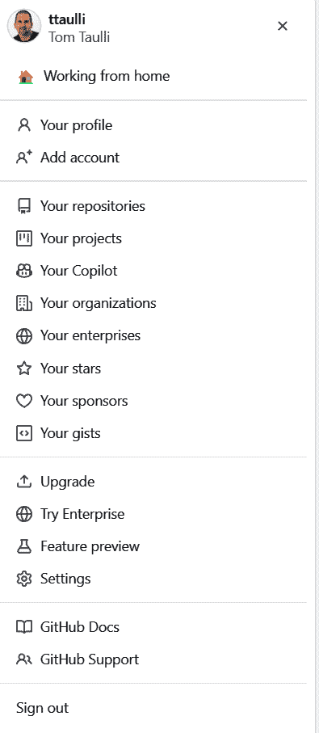
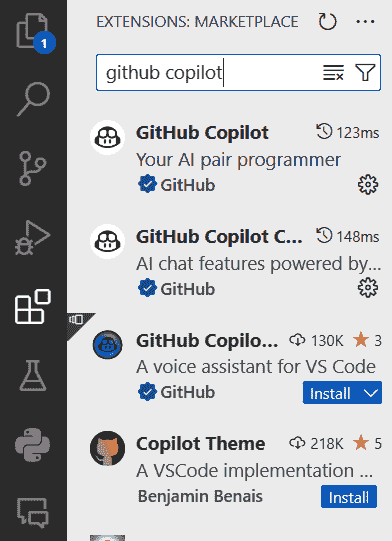
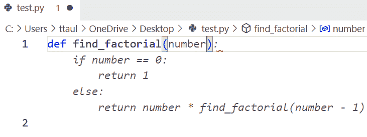
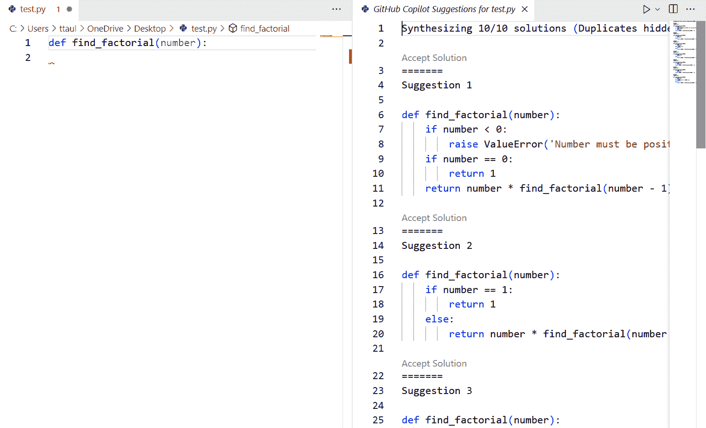
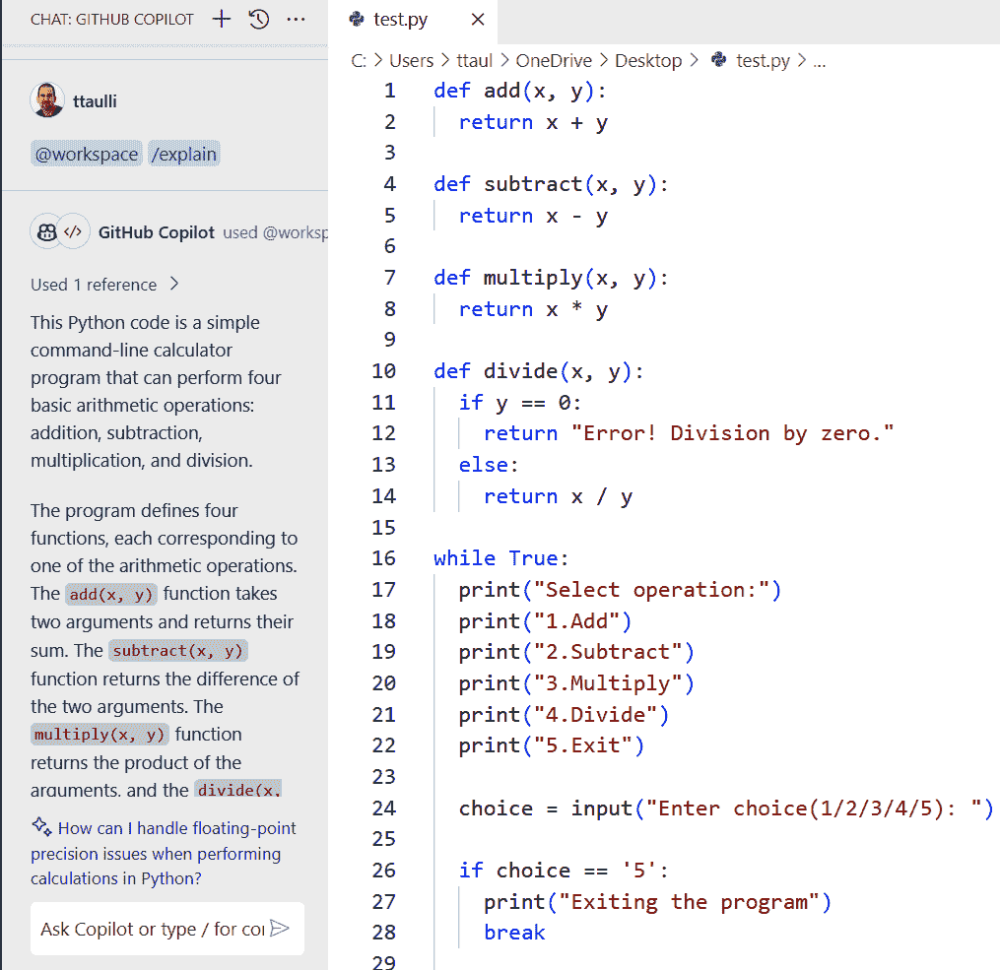
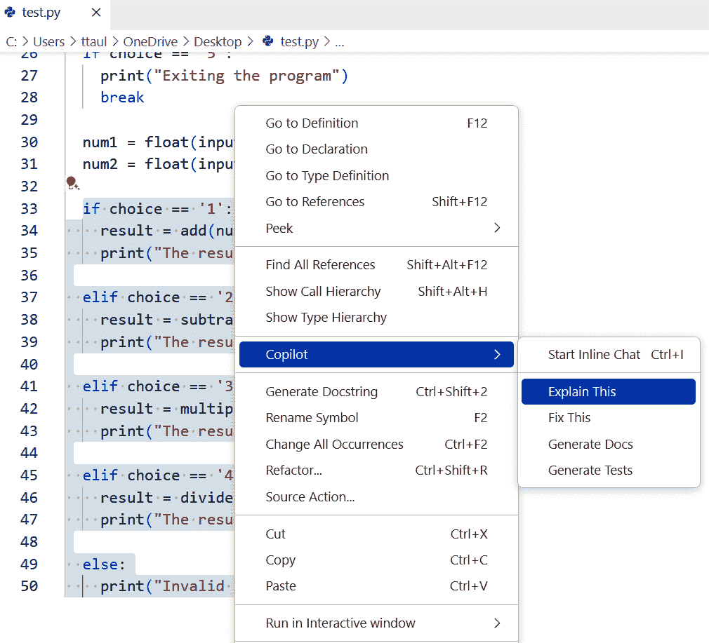
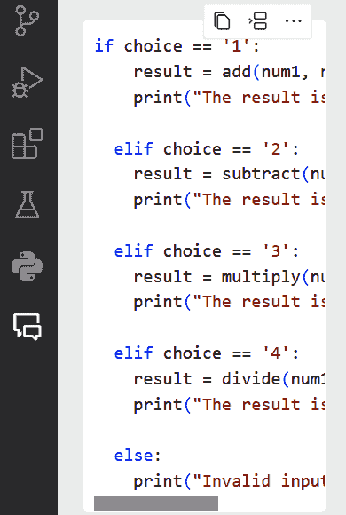
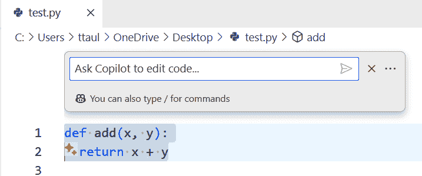

# 第四章：GitHub Copilot

在本章中，我们将检查 GitHub Copilot，我将简称为 Copilot。它是 AI 编码助手领域的领头羊。人们甚至称其为生成 AI 的“杀手级应用”。这主要归功于其先进的代码建议、创建和解释能力，这些能力显著提高了开发者的生产力。通过根据上下文理解和预测编码模式，它不仅节省了时间，还帮助编写更高效、更无错误的代码。

在本章中，我们将深入探讨 Copilot 的细节：它的价格是多少，如何设置它，以及它提供的所有酷炫功能。我们也会诚实地讨论它的缺点。此外，我还会提供一些实用的技巧，帮助您充分利用它。我们不会就此止步：我们还将看到 Copilot 如何通过 Copilot 合作伙伴计划与其他公司合作。本章将全面展示 Copilot 的功能范围。

# GitHub Copilot

回到 2021 年 6 月，微软推出了 GitHub Copilot。GitHub 的首席执行官 Nat Friedman 在[博客文章](https://oreil.ly/L4JcE)中将其描述为“AI 编程伙伴”，旨在通过协助开发者更高效地完成任务来加速他们的工作。

Copilot 是微软和 OpenAI 合作的成果。最初，它利用了一个名为 Codex 的大型语言模型，这是针对编码的 GPT-3 变体。微软通过整合一种称为“填充中间”的新方法（FIM）来增强这个 LLM 的能力，这更好地理解了代码上下文。这提高了代码建议的质量并缩短了响应时间。借助更先进的 GPT-3.5 Turbo，这一改进导致代码建议的接受率显著提高。为了提高安全性，该工具集成了 AI 系统，可以即时阻止风险编码模式，重点关注硬编码凭证和 SQL 注入等漏洞。

## 定价和版本

Copilot 提供 30 天的免费试用。一旦试用结束，您有三个选择。

Copilot 个人版

此计划每月收费 10 美元，或年费 100 美元。它提供多行函数建议等特性，可以使您的编码工作流程更加顺畅。一个突出的特性是它能够加速测试生成，这是确保代码可靠和稳固的关键因素。此外，它还具有筛选出易受攻击的编码模式的功能。它还能防止任何可能反映公共代码的建议，确保您创建的内容独特且原创。

Copilot 商业版

此套餐更全面，每位用户每月收费 19 美元。它包括个人 Copilot 计划的所有内容以及为商业用户设计的额外福利。它简化了许可证管理，这对于公司处理其订阅和访问来说是一个很大的优势。还有一个功能可以跨组织管理策略，有助于确保治理的一致性和所有项目的连贯性。一个关键亮点是其顶级的隐私保护措施，这对于保护敏感的商业数据至关重要。此外，它支持企业代理，确保在整个公司网络中提供安全和顺畅的连接。

GitHub Copilot Enterprise

这需要每月每位用户支付 39 美元的费用。企业版的关键特性是允许在内部代码库上训练系统。企业版提高了开发者的效率，因为工具开始提供更准确的代码建议。它有助于推动采用更好的实践并遵守安全规则。它专为适应开发者内部编码方式以及他们喜欢的 API、框架和包而定制。

企业版另一个优点是，您可以在像 COBOL 和 Fortran 这样的经典语言上对其进行训练。通用型 LLM 可能不会那么有效，因为这些语言在公共存储库中缺乏训练数据。当然，它们对您公司特有的专有语言也不会有任何了解。

GitHub 系统通过持续扫描公司的存储库来加强企业版的模型。例如，它专注于最近的拉取请求和合并，以及点赞和踩下反馈。所有这些都有助于突出公司正在使用的最新方法和策略。

拥有定制模型有助于在组织内传播专业知识。AI 能够拾取并分享代码中隐藏的微妙知识。随着持续的训练，AI 能够跟上代码库的变化，随着时间的推移，其帮助变得更加精确。然而，对于组织来说，处理将这些 AI 工具融入其开发过程中带来的隐私和知识产权风险至关重要。

###### 注意

2023 年，[Gartner 的研究](https://oreil.ly/zXAQ-)显示，不到 10%的大型企业已经开始使用 AI 辅助编程工具。这种犹豫部分是由于对安全和精确性的担忧。然而，随着技术的快速发展，预计越来越多的企业将在不久的将来开始采用这些工具。简而言之，它们提供的益处非常显著，不容忽视。

## 用例：编程硬件

一个关于定制模型的有趣案例研究涉及先进微设备公司（AMD）。成立于 1969 年，该公司是 CPU（中央处理单元）的先驱。如今，该公司在数据中心、嵌入式系统、游戏平台和 PC 的半导体领域处于领先地位。[链接](https://oreil.ly/pOoMj)

在深入探讨之前，让我们通过回顾一些关于为硬件系统开发的基本知识来设定场景。与为类似网络应用等软件构建相比，这是一场完全不同的比赛。关键挑战是开发者需要彻底了解硬件系统。与适用于通用计算机的常规软件不同，固件直接与硬件对话。这要求一种精确性和兼容性，这种精确性和兼容性要高得多。

这种精确性至关重要，因为固件开发中的错误可能导致一些严重的经济损失。仅仅一个错误可能意味着数百万的财务损失。而且，这不仅仅是金钱的问题——时间也是一个巨大的因素。修复固件问题通常需要重新审视制造过程，这可能会给时间表增加几个月。这种延误不仅会影响发布计划，还会影响产品在市场上的竞争力。

显然，“快速行动，打破事物”的心态，这在敏捷软件开发中很常见，在这个环境中是不适用的。这种方法的危险太大。这就是为什么固件开发者必须投入相当的时间和精力来制定详细的计划并进行广泛的测试。这种谨慎的方法确保固件在与其硬件配对之前尽可能稳固且无错误。

当 AMD 在 2023 年审视 Copilot 时，设定了非常高的标准，并且存在相当数量的可以理解的怀疑。在一个试点项目中，AMD 为各种*硬件描述语言*（HDLs）如 Verilog 和 SystemVerilog 创建了一个 Copilot 的定制版本。HDLs 是针对概述电子电路（尤其是数字逻辑电路）的架构、设计和功能的特定类型的编程语言。它们在模拟不同抽象级别的电子系统方面至关重要。

[试点项目的结果](https://oreil.ly/TXMvQ)出乎意料地好。令人惊讶的是，Copilot 生成的代码风格实际上比 AMD 自己的程序员生产的代码更符合 AMD 的标准。改进如此显著，以至于一些程序员甚至从使用高度可定制的文本编辑器 Vim 切换到采用 Visual Studio Code 作为他们的 IDE。

## 用例：Shopify

另一个有趣的案例研究是 Shopify。这家公司运营一个平台，允许客户建立电子商务网站。Shopify 在美国的市场份额约为 10%，在欧洲为 6%。

毫无疑问，这创造了对大规模基础设施的需求。考虑到大约有 300 个公共仓库和大约 5,000 个私有仓库。此外，Shopify 每天大约对其代码进行 1,500 次部署。

Shopify 是第一批加入 Copilot 行列的公司之一，这对提高开发者的生产力来说是一个变革。目前，接近[2,000 名 Shopify 开发者使用这个工具](https://oreil.ly/ZI_9K)。而且这里有一个有趣的部分：70%的开发者表示它很有帮助，75%的开发者经常使用它。大约 26%的 Copilot 代码建议被接受。

当然，有一些功能还没有流行起来，比如与命令行界面（CLI）的集成。但尽管如此，许多开发者每天都在使用代码补全和聊天功能。

这里有一些有趣的发现：

代码建议的价值

即使开发者没有使用某个特定的建议，这也不是完全的损失。任何建议都可以激发编写更好代码的灵感。

采用率

使用率通常会随着时间的推移而增加，这并不令人惊讶。调整日常工作流程和适应新功能需要时间。Copilot 也有一个学习曲线。

高级开发者的采用

在 Copilot 早期采用阶段，经验丰富的开发者并不太愿意使用它。他们倾向于将其视为一个玩具，而不是一个严肃的工具。但随着时间的推移，当他们注意到其他开发者取得了实际成果时，他们开始对 Copilot 持开放态度。

学习提升

Shopify 注意到 Copilot 擅长鼓励人们尝试新的语言或框架。例如，Rust 的采用率有所上升。

使用这个工具编写的 Shopify 代码库大约有 100 万行，这表明 Copilot 对这个业务来说意义重大。

## 用例：埃森哲

埃森哲是一家庞大的专业服务机构，通过创新技术和系统帮助客户改善运营和增长。该公司在 120 多个国家拥有超过[733,000 名员工](https://investor.accenture.com)。

在 2023 年，埃森哲对其内部 450 名开发者进行了 Copilot 的测试。[450 名内部开发者](https://oreil.ly/ku8Nd)参与了这次测试。公司并没有设定任何特定的任务或目标。相反，管理者只是要求大家像平时一样继续工作。

埃森哲对 Copilot 的试用持续了六个月。那么，结果如何呢？在编码方面，Copilot 的建议得到了 35%的接受率，其中 88%的更改在代码审查后仍然有效。生产力也得到了显著的提升。拉取请求增加了 50%，合并率上升了 15%。效率也实现了大幅提升，构建次数增加了 50%，成功率提高了 45%。至于开发者们？他们对 Copilot 非常满意：高达 96%的开发者认为他们从第一天起就取得了成功。

在看到这些结果后，埃森哲决定将其 Copilot 在全球范围内推广到其[50,000 名开发者](https://oreil.ly/UgdoL)。

## 安全性

Gartner [调查](https://oreil.ly/k1oVc)了超过 2,000 名首席信息官（CIO），发现其中 66% 计划在 2023 年将最多的资源投资于网络安全和信息安全。这一趋势已经持续了多年。

在网络威胁变得越来越复杂和普遍的时候，安全漏洞可能意味着巨大的经济损失、声誉损害、法律问题和运营中断。此外，随着数据隐私法规的日益严格，CIO 必须保持警惕，以避免罚款并保持客户信任。

这也是为什么对于 GitHub 来说，安全是其 Copilot 计划的一个主要关注点。GitHub 开发了一个基于 LLM 的系统，可以实时发现和修复不安全的编码模式。

此外，还有 GitHub 的由 Copilot 协助的 [高级安全功能](https://oreil.ly/fZamu)。以下是主要功能：

代码扫描

在实时中，高级安全将搜索安全漏洞和编码错误。

秘密扫描

该产品可以根除已检查到私有存储库中的密钥和令牌等秘密。

依赖项审查

这显示了依赖项更改的影响。它还提供了当你合并拉取请求时的漏洞详情。

###### 注意

对于学生、教师和流行开源项目的维护者，Copilot 是免费的，但有一个验证过程。

# 入门

要开始使用 Copilot，你首先需要创建一个 GitHub 账户。GitHub 是一个支持版本控制和协作软件开发的在线服务。它是基于 Git 的工具，提供代码审查和项目管理功能。

设置好账户后，点击屏幕右上角的个人照片。你会看到一个下拉菜单，如图 图 4-1 所示。

选择 Copilot，然后点击启用 GitHub Copilot。你可以选择计划类型，然后点击继续。如果你不符合免费账户资格，你需要提供付款详情。



###### 图 4-1\. 从个人照片下拉菜单开始启用 Copilot

## Codespaces 和 Visual Studio Code

使用 Copilot 有两种方式。一种是通过 Codespaces 访问它，这是一个基于云的开发环境，在 Visual Studio Code (VS Code) 上运行，并且可以直接在 [*https://github.com*](https://github.com) 上使用。

或者，如果你使用的是 Visual Studio Code 的桌面版本，可以选择 Copilot 扩展。在这本书中，我们将专注于使用 VS Code 扩展。

本身 IDE 是免费的。图 4-2 展示了 VS Code 的主屏幕。你可以在包括 Windows（版本 7、8、10 和 11）；macOS；以及 Ubuntu、Debian、Fedora 等各种 Linux 发行版上运行此系统。


###### 图 4-2\. Visual Studio Code 的主屏幕包括活动栏和生成和显示代码的区域

在左侧是活动栏，它是一堆图标。您可以使用这些图标来加载文件和文件夹。您还可以选择第五个图标，即一组方块，以进入安装扩展的区域（图 4-3）。

如果您在搜索框中输入“GitHub Copilot”，您将看到一系列扩展。选择最上面的一个并点击安装。

然后看看屏幕的右下角。如果您看到 Copilot 图标，那么您就有这项服务可用。



###### 图 4-3\. 您可以在 VS Code 中安装扩展，例如 Copilot

在屏幕中间，您将看到打印“Hello, Copilot!”的代码。这是通过以下提示创建的，Copilot 将其转换为代码：

> *提示:* # 编写一个“Hello, Copilot!”程序

# 字符指定注释。这是指导 Copilot 生成代码的一种方式。

注意，代码是用 Python 编写的。为什么是这样？文件的扩展名是 *py*。Copilot 使用文件扩展名来确定使用哪种语言。

在屏幕右上角，有一个运行程序的图标。点击它，VS Code 将启动终端。然后您将看到打印出的消息。

## 建议

在 VS Code 中开始使用 Copilot 很简单。当您开始编写代码时，该工具就会启动，为您提供代码建议并根据您的输入生成代码片段。

假设您在 Python 中输入一个函数的标题：

```py
def find_factorial(number):
```

Copilot 将立即建议一个完整的函数体，如图 4-4 所示。这种生成的代码称为 *幽灵文本*，并以灰色突出显示。



###### 图 4-4\. 当用户编写函数头时，Copilot 提出代码

请记住，代码在您的机器上可能看起来略有不同，这是正常的，因为底层 LLM 的工作是根据一组复杂的概率进行的。

但这里有个问题：GitHub 知道您正在尝试编写一个基于参数计算阶乘的函数。因此，它建议您需要得到正确结果的 If-Then 结构。

您可以按 Tab 键接受代码建议。但如果它不是您想要的，只需按下 Escape 键跳过即可。

如果您将鼠标悬停在生成的代码上，您将看到更多选项，如图 4-5 所示。


###### 图 4-5\. 将鼠标悬停在生成的代码上会唤起更多选项，可见于屏幕右上角

您可以点击“接受”来接受代码建议，就像按 Tab 键一样，或者您可以选择“接受单词”一次选择代码中的一个单词。如果您点击三个点，您将获得一个菜单，用于接受一行或始终显示工具栏。

点击左侧的 1/2 可以让你看到生成的代码的替代方案；在图 4-5 中，有两个替代方案，第一个正在显示。点击“>”会跳转到版本 2。然后点击“<”会回到版本 1。

你还可以使用表 4-1 中列出的快捷键来导航选项。

表 4-1\. 滚动代码建议的快捷键

| OS | 下一个建议 | 上一个建议 |
| --- | --- | --- |
| macOS | Option (⌥) 或 Alt+] | Option (⌥) 或 Alt+[ |
| Windows | Alt+] | Alt+[ |
| Linux | Alt+] | Alt+ |

如果你按下 Ctrl+Enter，VS Code 将创建一个新标签来显示 10 种不同的解决方案（[图 4-6）。



###### 图 4-6\. 按下 Ctrl+Enter 会弹出一个单独的标签，显示 10 种不同的代码版本

要选择其中一个替代方案，请点击该代码上方的“接受解决方案”。否则，关闭标签以拒绝所有替代方案。

## 注释

之前，在“Codespaces 和 Visual Studio Code”中，我们探讨了如何通过一个或多个注释来提示 Copilot 生成代码。为此，你需要在所使用的编程语言的语法中指明注释。

但你还能做更多。你可以使用注释与系统交互，就像它是 ChatGPT 一样。让我们看看一个例子：

> *提示:* # q: 面向对象编程中的类是什么？
> 
> *Copilot:* # a: 类是创建对象的蓝图。对象具有与之关联的属性和方法（函数）。在 Python 中，几乎所有东西都是一个对象。

你可以看到答案也是在你的编码语言上下文中。现在假设你向 Copilot 询问系统是如何工作的：

> *提示:* # q: 接受内联建议的快捷键是什么？
> 
> *Copilot:* # a: tab

你可以向 Copilot 询问 VS Code 的功能：

> *提示:* # q: VS Code 中用户设置的快捷键是什么？
> 
> *Copilot:* # a: Ctrl + ,

你还可以询问它关于其他 IDE 的快捷键：

> *提示:* # q: Atom 编辑器中新建文件的快捷键是什么？
> 
> *Copilot:* # a: ctrl + n

注意，Copilot 知道我正在使用 Windows 系统，并据此提供代码。

## Chat

Copilot Chat 就像 ChatGPT，但它是为你的编码环境设计的。它非常适合讨论代码，比如当你需要弄清楚语法、修复 bug、整理测试用例，或者只是理解不同的编程思想时。它由 OpenAI 的 GPT-4 和 GPT-3.5 Turbo 以及一些微软自己的 LLMs 提供支持。

你可以直接从[`github.com`](https://github.com)进入 Chat。它非常适合分析代码、处理 pull 请求、查看文档，或者只是提出你所有的编码问题。此外，Chat 在 iOS 和 Android 的 GitHub 应用中都可用，所以你可以随身携带。

但现在，让我们专注于它是如何与 VS Code 一起工作的。这意味着添加一个新的扩展。只需查找“GitHub Copilot Chat”。安装后，你会在屏幕左侧看到一个新图标出现。它有两个小聊天气泡，正如你在图 4-7 中看到的那样。


###### 图 4-7\. 聊天图标出现在屏幕左侧

在聊天面板的顶部，你可以看到一个菜单中的图标组。第一个图标由水平线和一个小 x 组成，可以清除所有聊天线程。这很重要，因为上下文的工作方式。当你输入一个提示时，LLM 会检查对话历史。如果你的聊天在主题上杂乱无章，你可能会得到一些不太有帮助的回答。这就是为什么保持每次聊天都专注于特定主题，并为新主题开始新的聊天是个好主意。

下一个图标，由一个人物和一个聊天气泡组成，允许你发送关于系统的反馈。然后是历史按钮，一个时钟，显示之前的线程。

如果你点击三个点，你可以在编辑器内部使用聊天，那里有更多空间进行聊天。

在聊天框的底部，有一个输入区域，可以用来向系统提问。

聊天系统有许多快捷方式。其中一个是@workspace，它指的是你工作区中打开的文件。例如，如果你有一个 Python 计算器程序，你可以输入：

> *提示:* @workspace /explain

图 4-8 显示了聊天已分析程序文件并提供了深入的解释。



###### 图 4-8\. 可以使用聊天解释代码，例如，一个计算器程序

你可以要求聊天解释代码的一部分。突出显示你感兴趣的章节，然后按下鼠标右键。这将弹出一个菜单(图 4-9)。



###### 图 4-9\. 通过突出显示并按下鼠标右键将聊天聚焦于代码的一部分

当你告诉聊天只关注代码的一部分时，你不仅可以解释代码，还可以修复它、生成文档或创建测试。

另一个有用的快捷方式是/new 命令。它将为新项目或功能创建一个脚手架。以下是一些示例：

> *提示:* /new 创建一个从网站抓取数据的 Python 脚本
> 
> *提示:* /new 生成一个包含姓名、年龄和成绩字段的 Java 学生类
> 
> *提示:* /new 使用 Flask 构建一个简单的 REST API
> 
> *提示:* /new 创建一个用于按升序排序数字数组的 JavaScript 函数
> 
> *提示:* /new 设计一个包含用户、文章和评论表的博客 SQL 数据库模式

对于这些提示，Chat 系统将显示主要步骤，然后提供代码列表。你还有几个选项来处理它。正如你在图 4-10 中看到的，顶部有一个菜单栏。



###### 图 4-10。在 Chat 代码列表的顶部，有关于如何处理代码的选项

第一个图标将复制代码，下一个图标将把它插入到文件中的光标位置（你也可以使用 Ctrl+Enter）。如果你选择三个点，你可以将代码插入到新文件或终端中。

此外，还有一个创建新 Jupyter 笔记本的快捷键：/newNotebook。你应该指定笔记本要做什么。以下是一些示例提示：

> *提示:* /newNotebook 创建一个笔记本，使用 matplotlib 可视化 csv 文件中的数据
> 
> *提示:* /newNotebook 创建一个笔记本，用于预处理和清理机器学习数据集
> 
> *提示:* /newNotebook 创建一个笔记本，使用 scikit-learn 实现一个简单的线性回归模型
> 
> *提示:* /newNotebook 创建一个笔记本，用于分析时间序列数据
> 
> *提示:* /newNotebook 创建一个笔记本，从网站抓取数据并进行分析

Chat 还提供了一个/terminal 快捷键。你可以就终端或命令行操作提出问题或获取帮助，例如导航目录、运行脚本或安装包。以下是一些提示：

> *提示:* /terminal 列出所有环境变量的命令是什么？
> 
> *提示:* /terminal 我该如何使用 grep 在多个文件中查找特定文本？
> 
> *提示:* /terminal 我该如何使用 find 命令通过文件权限搜索文件？
> 
> *提示:* /terminal 我该如何将命令的输出重定向到文件？
> 
> *提示:* /terminal 我该如何使用 awk 处理文本文件？

然后是@vscode，它被称为*代理*。使用它，你可以就 VS Code 的一些方面提出问题或获取帮助，例如功能、导航、配置或扩展。

这里有一些示例提示：

> *提示:* @vscode 我该如何将编辑器拆分为多个窗口？
> 
> *提示:* @vscode 我该如何自定义我的键盘快捷键？
> 
> *提示:* @vscode 我该如何设置多根工作区？
> 
> *提示:* @vscode 我该如何配置 VS Code 中的任务自动化？
> 
> *提示:* @vscode 我该如何设置和使用 VS Code 中的 Docker？

最后，是/api 命令。你可以就 API 开发或使用的各个方面提出问题或获取帮助，包括创建、测试或集成。以下是一些示例：

> *提示:* /api 我如何在 Node.js 中使用 JSON 数据发送 POST 请求？
> 
> *提示:* /api 我如何在 Express.js API 中处理 CORS 问题？
> 
> *提示:* /api 我如何在 Django REST API 中验证用户？
> 
> *提示:* /api 我如何在 Rails API 中分页结果？
> 
> *提示:* /api 我如何在 ASP.NET Core 中版本化 API？

你也可以在 VS Code 的上下文中使用/api：

> *提示:* @vscode /api 我如何在 VS Code 扩展中创建新命令？
> 
> *提示:* @vscode /api 如何在 VS Code 扩展中读取和写入设置？
> 
> *提示:* @vscode /api 我如何在 VS Code 扩展中创建新的 webview 面板？
> 
> *提示:* @vscode /api 如何在 VS Code 扩展中与文件系统交互？
> 
> *提示:* @vscode /api 我如何在 VS Code 扩展中向活动栏添加新项目？

注意，如果你想清除聊天，可以使用 /clear。

## 内联聊天

你可以在你的代码列表中使用聊天功能。你将突出显示代码，然后按 Windows 的 Ctrl+I 或 macOS 的 Cmd+I。然后你会看到一个弹出窗口，例如在图 4-11 中所示。



###### 图 4-11\. 内联聊天功能允许你在代码中进行聊天

根据 GitHub，内联聊天已成为一个流行的功能。毕竟，它允许开发者保持在他们的“流程”中。

你可以使用我们之前描述的快捷键来询问有关代码的问题。解释将显示在聊天面板上。

注意，代码旁边还有一个橙色闪亮图标。如果你点击它，你会得到几个选项——修复代码、解释代码或重写代码，这些选项可以在图 4-12 中看到。


###### 图 4-12\. 点击橙色闪亮图标允许你直接与代码交互

让我们尝试使用内联聊天的一个例子。我们将使用这个提示：

> *提示:* 创建一个冒泡排序的函数

Chat 为此创建了代码。但假设我们想看看是否有比冒泡排序更快的排序类型。突出显示函数并执行内联聊天。图 4-13 显示了响应。


###### 图 4-13\. 内联聊天响应了创建比顶部冒泡排序更快的排序请求

Chat 建议使用快速排序，并在“差异模式”中显示。这允许比较和对比两种方法。你可以接受新代码的全部内容，也可以只接受其中的一部分。

## 打开标签页

当你在一个标准的软件开发项目中工作时，你的 IDE 通常会包含许多文件，每个文件都在应用程序的框架中扮演着自己的角色。以使用 React 的 Web 项目为例。你会看到组件的 *.jsx* 和 *.js* 文件，以及 HTML 和 CSS 文件，更不用说 *.json* 和 *.env* 文件了。

这对 Copilot 意味着什么？这是一个很大的帮助。Copilot 理解你工作的上下文越多，它就越好。这意味着它会考虑你当前正在工作的当前文件中的所有内容。至于其他打开的文件，LLM 不会扫描它们全部。它专注于与你所做相关的部分。此外，Copilot 不会查看你项目中其余的文件，这可能是为了尊重你的隐私。

## 命令行界面

你可以在你的 CLI 中使用 Copilot。Copilot 在那里的两个主要功能是解释命令和提出建议。

要这样做，您需要安装 [GitHub CLI](https://cli.github.com) 并然后登录您的 GitHub 账户：

```py
gh auth login
```

接下来，您将安装 Copilot：

```py
gh extension install github/gh-copilot
```

您可以升级扩展：

```py
gh extension upgrade gh-copilot
```

这里是一个请求 Copilot 解释 CLI 命令的例子：

> *提示:* gh copilot explain xcopy

图 4-14 显示了输出。


###### 图 4-14\. Copilot 在 CLI 中解释 `xcopy` 命令

这里是如何让 Copilot 提供建议命令的方法：

> *提示:* gh copilot suggest

接下来，Copilot 将询问您想要帮助哪种类型的命令——一个通用的 shell 命令、一个 gh 命令或一个 git 命令——因此请指定这一点。然后它将询问您希望该命令执行什么操作。以下是一个例子：

> *提示:* 系统中查看和设置环境变量的命令是什么？

图 4-15 显示了 Copilot 的响应，其中包含使用建议的命令。您可以复制此内容或请求 Copilot 提供更多帮助，例如解释命令或修改它。


###### 图 4-15\. 在 CLI 中，Copilot 根据您提供的参数提供命令

# Copilot 合作伙伴计划

开发者经常通过使用第三方工具来丰富他们的应用程序并从他们的数据中获得更多收益。以 Splunk 为例。它是深入挖掘日志和数据分析的宠儿。开发者依赖 Splunk 来监视他们的应用程序并快速修复问题，这得益于其强大的搜索和报告功能。然后是 New Relic，它专注于确保您的应用程序运行顺畅。它提供实时洞察和诊断，帮助您发现并修复性能问题，使您的应用程序为用户提供更好的体验。当然，还有 Datadog。它是监控您的基础设施和应用程序的关键玩家。凭借其广泛的集成，Datadog 允许开发者从各种地方收集、混合并展示数据，帮助他们做出明智的选择，以提升性能和管理资源。

考虑到这些系统的的重要性，GitHub 引入了 Copilot 合作伙伴计划。该计划包括一系列不断扩大的流行集成平台，所有这些平台都可以通过插件访问。

该计划的早期合作伙伴之一是 DataStax，它是 Astra DB 的幕后公司，Astra DB 是一种为构建高级 AI 应用程序而设计的向量数据库。得益于一个插件，开发者可以使用 Chat 加速数据库的创建。例如，Chat 为数据库的结构和元数据提供代码建议，所有这些都与编码标准一致。这导致代码更加整洁且易于维护。

要提问，请使用 @datastax 标签。一些 [示例提示](https://oreil.ly/4QQrB) 包括：

> *提示:* 告诉我关于我的 chat_prod 数据库
> 
> *提示:* 告诉我关于表的模式
> 
> *提示:* 编写一个从聊天表读取的 SQL 查询
> 
> ###### 注意
> ###### 
> Mary-Brenda Akoda 是一位在眼科 AI 领域拥有专利的 AI 研究员，她是 Copilot 的忠实用户。她说：“有一次，我使用 Copilot 在不到一个小时的时间内编写了一个整个模型开发过程的代码。这通常需要我花费更多的时间和精力。有趣的是，实际上当我不得不使用不支持 Copilot 的在线 IDE 时，我才意识到开发过程是多么的繁琐和缓慢。”

# 结论

Copilot 已迅速成为编程中不可或缺的 AI 工具，极大地提升了开发者的生产力和代码质量。本章为您概述了其关键特性，包括其建议复杂代码块的能力、坚实的安全措施、令人印象深刻的性能以及在 VS Code 中的易用性。Copilot 中的聊天和内联聊天功能使得在编码过程中与 AI 互动成为可能。尽管它仍然是一个需要人工指导的工具，但 Copilot 无疑是对 AI 驱动编程未来的一个窥视。
