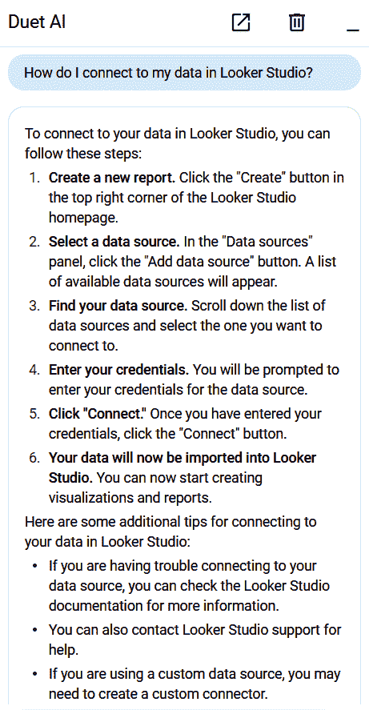
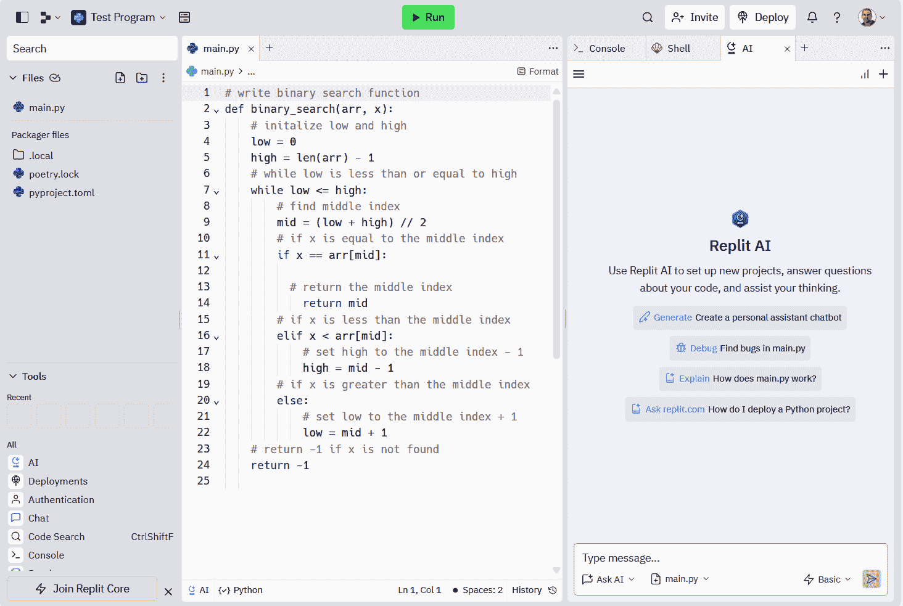

# 第五章：其他 AI 辅助编程工具

当谈到 AI 辅助编程时，GitHub Copilot 是当之无愧的大热门，但还有很多其他优秀的工具可供选择。开发者们在日常编码中混合使用这些工具是很常见的。令人高兴的是，大多数这些工具都效仿 GitHub Copilot 的做法，因此掌握它们并不太难。你可以通过注释来启动命令，并使用便捷的快捷键来获取快速建议，它们还提供了一个方便的聊天功能。

在本章中，我们将深入了解不同的 AI 编程工具。我们将检查来自亚马逊等大公司以及一些初创企业的优秀发现。此外，我们也不会忽略开源选项——如 Meta 的 Code Llama——因为它们绝对值得一看。

# 亚马逊的 CodeWhisperer

Amazon CodeWhisperer 是 VS Code、PyCharm 和 AWS Lambda 等集成开发环境（IDE）的瑞士军刀式扩展。它由在大量代码上训练的 LLM 驱动，理解 15 种编程语言。亚马逊在添加新语言时非常谨慎，注重准确性和安全性，而不是上市速度。CodeWhisperer 有两个版本：

+   个人版是免费的——只需使用你的 AWS Builder ID 或 Amazon 登录即可注册。它提供代码建议，跟踪开源代码的来源，并进行安全检查。

+   CodeWhisperer 专业版每月每位用户收费 19 美元。它拥有 Individual 版本的所有功能，还增加了对大型公司有用的额外功能。有一个管理系统来管理谁可以访问什么，你甚至可以控制使用的开源数据类型。

    专业版的酷炫之处在于定制功能。公司可以根据自己的库、API 和框架调整 CodeWhisperer，以提供更相关的代码建议。这意味着更好的质量和更少的浪费在过时代码上的时间。你可以设置多达八个不同的定制选项。

让我们深入了解 CodeWhisperer 的两个功能：

+   *引用跟踪器* 会关注你的代码与开源列表的对比情况，显示开源代码在分发时使用的许可证类型。这对于遵守法律和知识产权（IP）权利非常有用。引用跟踪会显示项目仓库、文件引用和许可证信息。这有助于根据你组织的合规要求，决定是否使用建议。

+   *安全扫描* 在你的 IDE 中运行，检查漏洞，包括前 10 个 Open Web Application Security Project (OWASP) 威胁和 Common Weakness Enumeration (CWE) 列表。它甚至遵循加密库的最佳实践。如果安全扫描发现漏洞，它将提供一些修复方案。这可以加快速度并降低开发成本。考虑到 AI 生成代码可能出现的怪癖，拥有这个内置的安全功能是一个巨大的优势。

CodeWhisperer 的一个优点是它与 AWS 服务的融合。这意味着开发者不需要成为 AWS 大师或翻阅大量文档来使用 AWS。以下是一些你可以提示它执行的操作示例：

> *提示:* # 编写一个用于将文件上传到 S3 桶的 Python 函数。
> 
> *提示:* # 构建一个用于处理 Kinesis 流记录的 Python Lambda 处理器。
> 
> *提示:* # 使用 Java 方法通过排序键从 DynamoDB 表中查询项目。
> 
> *提示:* # 使用 AWS CLI 通过实例 ID 停止 EC2 实例。
> 
> *提示:* # 使用 TypeScript 在 AWS CDK 中创建具有 PostgreSQL 引擎的 RDS 实例。

亚马逊对使用 CodeWhisperer 的客户进行了[研究](https://aws.amazon.com/codewhisperer)，发现平均而言，使用该工具的开发者成功完成任务的几率比未使用该工具的开发者高出 27%，并且完成速度比未使用该工具的开发者快 58%。

以 Accenture 的经验为例。使用 CodeWhisperer 进行 AI 项目管理成功[将开发时间缩短了高达 30%](https://oreil.ly/SFmVt)。像数据预处理这样的任务，通常耗时且繁琐，变得更快、更高效。通过简单地使用以下提示，开发者可以显著提高他们的生产力：

> *提示:* # 创建用于 ML 数据的预处理数据类脚本。

以全球数字工程公司 Persistent Systems 为例。通常，新开发者需要至少四个月的培训才能准备好项目。然而，使用 CodeWhisperer，他们[将时间缩短到一个月](https://oreil.ly/K4ovC)。

# Google 的开发者 Duet AI

Google 是开发者 Duet AI 的幕后大脑。这个巧妙的 AI 驱动的编程工具支持 VS Code、IntelliJ、PyCharm、GoLand、WebStorm、云工作站和云 Shell 编辑器等 IDE。此外，它还支持超过 20 种编程语言。它还建立在 Gemini 之上，这是 Google 最先进的 LLM。

Duet AI 具有与 AI 辅助编程系统通常看到的特性，例如聊天。还有快捷方式，称为智能操作，它们是一键魔法技巧，用于代码解释和单元测试等。

Duet AI 也非常重视安全。它拥有所有你需要的高级保护和安全措施，例如私有端点（私有 Google 访问）、VPC 服务控制和企业级访问控制。

我们不要忘记治理规则。当你将代码投入 Duet AI 时，你可以放心，知道它不会被用来训练任何共享模型或构建产品。在数据和知识产权方面，你拥有完全的控制权。它还会标记出 Duet AI 认为某些代码可能被从仓库中复制——长时间——的实例。

Google 与 Duet 的策略中很大一部分是建立一个广泛的合作伙伴生态系统。例如，一些合作伙伴为 Google Cloud 上的特定环境提供开发者的支持。这允许提供更好的代码建议，以及文档和知识来源。以下是一些例子：

Elastic

这是在搜索分析领域的大人物。它的 Duet AI 集成允许开发者无需离开开发环境，就能了解如何查询、测试和操作 Elastic 数据。

HashiCorp

这是一家领先的云基础设施自动化软件提供商。它建立了一个系统，使得使用 Terraform 编写基于 HashiCorp 配置语言（HCL）的配置和自动化变得容易。

MongoDB

这是 NoSQL 数据库的领导者。使用 Duet AI，你可以获取最佳实践和构建应用程序的帮助。

Neo4j

这是一家图数据库的皇室成员。你可以使用 Duet AI 获取有关 Cypher 查询语言等事物的建议。这可以使挖掘复杂数据集中的隐藏关系和模式成为可能。

Duet AI 有一个巧妙的技巧。它已经将 Duet AI 集成到 Google Cloud 控制台中。要使用它，请点击控制台主屏幕右上角的激活按钮。然后会出现一个聊天面板，如图图 5-1 所示。然后你可以输入创建脚本、理解日志或深入研究 JSON 等任务的提示。

###### 图 5-1. 点击激活后，Google Cloud 中的 AI Duet 聊天面板出现在右侧

聊天功能甚至可在 Google Log Explorer 中使用。如果你发现某个日志让你头疼，将其突出显示并点击“解释此日志”按钮。日志将直接弹出聊天面板，然后你可以请求解释，甚至获得一些解决问题的建议。

Duet AI 的费用是每月每位用户 19 美元。还有一项 upfront 的年度承诺。如果你是新的 Google Cloud 客户，将获得 300 美元的免费信用额度。

###### 注意

Turing AI，一家 AI 技术服务公司，一直在使用 Duet AI。它已经能够实现开发团队生产力的显著提升[33%](https://oreil.ly/76D75)。

# Tabnine

Tabnine 是 AI 辅助编程工具的先驱。这一切始于 2013 年，当时 Dror Weiss 和 Eran Yahav 成立了这家公司。他们自 1990 年代以来一直在软件行业，专注于代码分析和模拟。但正是他们对开发复杂性的实际操作经验，让他们灵光一闪：如果 AI 能成为解决方案怎么办？

的确，它确实有帮助。然而，这还是在 transformer 模型时代之前。面对没有其他选择的情况，创始人卷起袖子，建立了自己的模型。这段旅程帮助他们深刻理解 AI 在软件开发中的作用。快进到最后几年，Tabnine 已经拥抱了 transformer 模型。

公司在安全系统上投入了大量资金。以下是工作原理：当你正在编写代码时，每个字符都会在发送到 Tabnine 的推理服务器（可能是基于云或本地）之前被标记化和加密。Tabnine 强调不存储您的数据，并且没有员工可以阅读它。此外，Tabnine 提供 SOC-2 合规性。

为了训练其模型，公司使用具有许可许可的开放源代码，如 MIT、Apache 和 BSD。这对那些热衷于保护其知识产权的组织来说很重要。Tabnine 还重视其用于训练的代码的透明度。它甚至为开发者提供了退出可能用于 Tabnine 训练数据集的存储库的方法。这显示了公司在训练生成模型时的谨慎态度。

Tabnine 的价格结构包括三个级别：

+   入门版免费，面向个人用户，提供基本功能，如简短代码补全和社区支持。

+   专业版每月每用户收费 12 美元。它专为专业开发人员和小型团队设计，包括高级功能，如整行和全功能代码补全，以及自然语言到代码补全，并提供标准支持。

+   企业版旨在满足寻求全面安全、控制和定制的较大组织。它提供无限用户、私有和定制 AI 模型、私有部署选项和高级支持。价格可按需提供。

Tabnine 拥有庞大的用户群，每月有超过一百万用户，每天有数十万人与之互动。值得注意的是，其知名客户包括像 Google、Amazon、Netflix 和 Atlassian 这样的科技巨头。

# Replit

Replit 是一个多功能的基于 Web 的 IDE，支持多种编程语言，并允许托管称为 repl 的应用程序。其丰富的协作功能类似于 Google Docs 中的功能。扩展其范围，Replit 还开发了桌面版本，适用于 macOS、Windows、Linux、Android 和 iOS。该平台拥有约 2300 万开发者的庞大社区。

[Replit](https://blog.replit.com/ai4all)由 Amjad Masad、Faris Masad 和 Haya Odeh 于 2016 年创立。Replit 的概念在成立前十年由 Amjad 构思。在此期间，Amjad 在 Yahoo!和 Facebook 的工程角色中磨练了他的技能，专注于构建开发工具。他还参与了 Codecademy 的创立，进一步展示了他在创新技术和编码教育方面的承诺。

Replit 提供三个订阅级别：

+   免费层提供无限公共 repl 和 10GB 的存储空间。

+   黑客版每月每用户收费 7 美元，提供无限私有重置功能。它提供不同级别的内存和存储，以满足不同的需求。

+   专业版每月每位用户 20 美元，包括 Hacker 计划中所有内容。此外，虽然基本代码开发系统在较低级别中可用，但专业用户可以独家访问最强大的 AI 模型以及高级功能，提供更强大的代码开发体验。

“Replit 是一个一站式软件创建平台，”Replit 市场营销和设计副总裁 David Hoang 说。“产品体验旨在减少软件开发过程中的摩擦：开发环境、代码编写和部署到生产。正因为如此，Replit 能够将 AI 集成到代码生成之外。我们的代码补全模型也由我们自己的语言模型提供支持。”

Replit 的 LLM 在 1000 亿个标记上进行了训练，能够理解 30 种编程语言。当你在 Replit 上工作时，你公开 repl 中编写的代码，包括按键，可能会被用来进一步训练 Replit AI。如果你希望保持你的工作私密，不在训练池中，你可以选择使你的 repl 为私有。重要的是要注意，使用 Replit AI 时，你对代码的权利不会改变。公开 repl 中的代码自动根据 Replit 的许可信息在 MIT 许可下授权。

图 5-2 展示了 IDE。在左上角是一个文件树和搜索框。在中间，你会找到编辑器，输出（例如，控制台）显示在屏幕的右侧。在左下角，你可以看到可用的工具。如果你选择 AI，聊天功能会在右侧面板中弹出。

###### 图 5-2\. Replit 的 UI 包括文件树和搜索框、选择工具的图标、编辑器框和输出面板

如果你突出显示代码并按下鼠标右键，你会得到这些选项：

解释

Replit 提供了一种为你的代码提供有用解释的功能。如果解释并不完全准确，你可以简单地点击重试，让 Replit 再试一次。此外，如果你有具体问题，可以在解释框顶部的下拉菜单中选择“询问聊天”选项。Replit 还提供其他有用的功能，如“询问 Replit 文档”、“编辑代码”和“生成代码”，以帮助你编码。

修改（Ctrl+I）

在 Replit 中，你可以通过提示来修改代码。例如，如果你已经突出显示了一段用于二分查找的代码，你可以编写一个提示，要求将这段 Python 代码转换为 JavaScript 函数。或者，你可以要求修改代码以使用递归方法。修改功能提供了一种灵活且交互式的方式来实验和改进你的代码。

为了展示这个工具如何既用户友好又强大，让我们看看一些有趣的故事：

糖尿病应用

当伦敦的 iOS 开发者 Marwan Elwaraki 得知他弟弟被诊断出糖尿病时，他决心创建一个监测血糖水平的应用。他和他的妻子 Salwa Al Alami 希望合作开发一些有用且独特的东西。“当我在飞机上时，通过将小部件应用与血糖追踪器的 API 连接，我能够看到我弟弟的血糖值，”Marwan 说。“这比打开应用查看最新读数要好得多。”

他们添加了发送消息的按钮并提升了短信功能。然后他们将其作为一款公共应用发布到 iOS 应用商店。

虽然 Marwan 是一位经验丰富的移动前端开发者，但他对 Python 或后端开发经验不多，而 Salwa 是一位没有编码经验的产品经理。起初，他们使用了 ChatGPT，但 Replit AI 带来了巨大的变化。“AI 工具帮助生成或至少双重检查了我为应用编写的几乎所有后端代码，”Marwan 说。“我听说过开发者生产力大幅提高的故事，而且我可以诚实地为我的案例作证。”

从黑客马拉松到创业

Priyaa Kalyanaraman，凭借她在微软、Snapchat 和 Waymo 担任产品经理的出色经历，虽然缺乏技术背景，但并没有因此止步。她参加了 Craft Ventures AI 黑客马拉松，利用 Replit AI 快速开发了一款旨在简化并增加内容创作乐趣的应用。她的努力得到了丰厚的回报，因为她赢得了 10,000 美元的冠军奖金。凭借她的产品管理专业知识，她精心准备了详细的规格，并合理地构建了该应用。这个获奖应用后来成为她创业公司 Lica 的基础，该公司成功完成了种子轮融资。

# CodeGPT

[CodeGPT](https://www.codegpt.co)，一款为 VS Code 设计的扩展，提供了多种定价选项。这些选项从免费计划到每月 49.99 美元的付费高级版不等，每个用户的价格。还有 10 天的免费试用期，供那些在订阅前想测试服务的人使用。

要设置 CodeGPT 扩展，首先点击文件。然后导航到首选项并选择设置。这将打开设置窗口。从那里，在左侧点击扩展，然后选择 CodeGPT。

CodeGPT 有趣之处在于其能够与多种 LLM 集成。这包括来自 OpenAI、Cohere、AI21 和 Anthropic 等公司的模型。通过 Hugging Face 设置 API 账户，可以获得广泛的开源平台访问权限，进一步扩展了工具的通用性。

一旦你选择了一个模型，你可以根据以下因素进行配置：

+   提示和响应的最大令牌数

+   温度

+   窗口内存（聊天中过去线程的数量）

CodeGPT 的另一个有趣特性是其 API，这对于聊天机器人、虚拟助手或任何需要理解和生成类似人类文本的系统的应用来说非常方便。其 RESTful API 设计确保了与各种平台的广泛兼容性和简单集成。此外，CodeGPT 还提供了 Python 和 JavaScript 的 SDK，增加了其实施的灵活性。这个 API 是一个更广泛计划的组成部分，旨在改变编码过程，目标是使复杂的 AI 工具能够应用于广泛的开发项目。

# Cody

2013 年，Quinn Slack 和 Beyang Liu 一起创立了 Sourcegraph，旨在开发代码搜索工具。Beyang 受益于他在 Google 的经验，在那里他亲眼看到了公司内部代码智能和洞察平台的优势，这对于处理大型代码库特别有益。

Sourcegraph 的主要目标变成了创建高级工具来应对“大代码”。在这个领域，复杂度是一个重大的挑战。Sourcegraph 进行的一项[调查](https://oreil.ly/Pu6Gp)突出了这个问题：大约 77% 的开发者报告称，他们的代码库在三年内增加了五倍。更重要的是，72% 的开发者表示，大代码不断增长的规模可能会对其公司创新能力和竞争力的提升构成真正的威胁。

AI 在 Sourcegraph 的战略中扮演着关键角色，公司开发了一个名为 Cody 的 AI 驱动的代码生成系统。Cody 依赖于 Anthropic 和 OpenAI 的 LLM。同时，也使用了 Starcoder。

“我们利用了我们的搜索能力来开发这个工具，”Liu 说。“记住，80% 的开发者时间是用在阅读和理解代码上，而不是创建代码。所以，Cody 会扫描整个代码库。但我们还让它容易引入其他库和框架。我们所看到的是，结果更好。”

这里有一些您可以在这个平台上使用的提示：

> *提示:* 这个存储库是如何组织的？
> 
> *提示:* 这个文件是做什么的？
> 
> *提示:* X 组件在哪里定义？

在定价方面，Sourcegraph 提供免费产品以及两个付费等级：

+   免费等级包括代码自动完成、聊天和上下文感知等多种功能。

+   专业版每月每用户收费 9 美元。使用专业版，您将获得：

    +   无限制的自动完成、消息和命令

    +   支持个性化，适用于更大的代码库

    +   多种 LLM 选项用于聊天

    +   更高的支持水平

+   企业版针对大型组织的需求定制。每月每用户收费 19 美元，并提供以下服务：

    +   用户管理

    +   单租户部署

    +   审计日志

    +   池化组织使用

    +   测试版期间的每日速率限制

    +   网络和 API 访问

    +   可配置的 LLM

为了了解 Cody 的潜力，让我们听听 Cody 的全栈开发者和开源贡献者 Deepak Kumar 的看法：“对我来说，最突出的功能是聊天和命令。我使用聊天来回答任何与编码相关的问题、项目的起始想法或修复错误。命令是预定义的自定义提示，它们很有帮助，因为它们帮助我完成诸如编写文档和添加测试等临时任务。”

2021 年 7 月，Sourcegraph [宣布完成 1.25 亿美元的 D 轮融资](https://oreil.ly/bSI3N)，估值 26.25 亿美元。投资者包括安德森·霍洛维茨、Insight Partners 和 Geodesic Capital。

# CodeWP

WordPress 是一个高度流行的开源内容管理系统（CMS），以其简洁性和多功能性以及广泛的主题和插件选择而闻名。最初作为博客平台推出，它已扩展以适应各种类型的网站，包括针对电子商务、作品集展示和一般商业优化的网站。它的吸引力在于其用户友好的界面和可定制选项。大量网站依赖于 WordPress；W3Techs 报告称，大约[45.8%的互联网网站都由这个平台提供支持](https://oreil.ly/NiXTW)。

AI 辅助编程为 WordPress 开发提供了重大机遇，CodeWP 正是利用了这一潜力。该公司由 James LePage 创立，他在高中时期就创建了一家 WordPress 代理机构。尽管业务经历了快速增长，但它是劳动密集型的。AI 辅助编程技术的引入使生产力大幅提高。一个关键的好处是 James 对 WordPress 开发中常见用例的深入了解，这进一步增强了 AI 的有效性。

CodeWP 提供基于网络的平台，有免费版本和两个高级选项。两个高级计划都提供年度订阅高达 33%的折扣：

+   专业版计划，每月每位用户收费 18 美元，提供额外的 AI 交易、项目和支持。

+   对于更大规模的需求，还有每月每位用户 48 美元的机构版计划。该计划面向专业网站开发和营销公司，提供无限的项目和协作功能。

前往[CodeWP 网站](https://codewp.ai)创建账户。点击创建新账户，然后选择新建代码片段以创建代码或新建聊天，如果您只是有疑问。

屏幕左侧有存储代码片段以及跟踪对话和列出项目的选项。中间是编辑器，显示您正在工作的文件内容。如果您想创建新文件，可以点击新建文件。右侧是聊天功能。

这里有一些示例提示：

> *提示:* 注册一个名为“书籍”的定制文章类型，标签为“书籍”。
> 
> *提示:* 使用 WP_Widget 类创建一个名为“我的小工具”的 WordPress 小工具。
> 
> *提示:* 为 register_activation_hook 函数创建一个自定义插件激活钩子。

CodeWP 将其支持扩展到 WordPress 生态系统中的各种关键组件。这包括与 WooCommerce、WPSimplePay、Gravity Forms、SearchWP 和 Contact Form 7 等主要工具的兼容性。

CodeWP 具有实时预览选项，可以立即查看你的代码将执行什么操作，这使得测试和调试变得轻而易举。此外，在处理 WordPress 项目时，CodeWP 简化了部署过程。其集成工具允许你轻松地将代码传输到 WordPress 站点，使在实际环境中应用和测试代码的任务变得更加高效。

# Warp

命令行界面始于 20 世纪 60 年代，与 Multics 和 Unix 等操作系统的早期发展同步。尽管多年来出现了闪亮的图形界面，但命令行界面在很大程度上仍然忠于其根源。它的一切都是为了保持简单：你以纯文本形式输入命令，并得到你需要的，没有任何花哨的附加功能。

尽管命令行界面很简单，但它们却极其普遍。它们对于管理云系统、处理计算机上的文件和程序以及设置流畅的工作流程至关重要。它们擅长自动化任务、处理数据、管理网络和开发软件。

熟练掌握命令行界面可以大大加快速度并提高精确度。一个突出的好处是，你可以混合和匹配不同的命令来处理复杂任务。此外，由于你可以编程这些命令行，你就有更多空间根据个人喜好调整并自动化任务。这意味着开发者可以按照自己的需求设置一切，使整个工作流程更加流畅和高效。

尽管命令行界面功能强大，但它们并不完美。一个主要问题是它们不适合协作，因此可能会影响生产力和团队合作。当你关闭终端会话时，你会失去一切。命令行通常也只固定在一台机器上，这使得在设备之间切换变得痛苦。此外，终端对于复杂任务可能会让人感到害怕。而且别忘了：对于很多人来说，熟练掌握命令行命令及其语法并不是一件轻松的事情。

因此，在这个类别中确实有创新的空间。而帮助引领这一潮流的初创公司是[Warp](https://www.warp.dev)。

Zach Lloyd，作为创始人兼首席执行官，于 2020 年创立了这家公司。在此之前，他曾在谷歌担任 Google Sheets 的首席工程师。[在此工作](https://oreil.ly/_Zhk7)。Lloyd 说：“我做了超过 20 年的开发者。”。“虽然命令行界面功能强大且非常有用，但仍有很大的改进空间。”

Warp 是用 Rust 语言开发的，这种语言以其快速和高效而闻名。Warp 没有坚持使用常规的 JavaScript，而是利用 Rust 的优势，几乎可以像在电脑上安装的应用程序一样运行，但它直接在你的浏览器中。这种巧妙的 Rust 应用意味着使用 Warp 的用户将获得更流畅和更敏捷的体验，使整个与应用程序的交互变得更好。

将 Warp 想象成一个增强版的终端。它拥有先进的文本输入功能，如选择、光标定位和完成菜单，使用户能够无缝地导航其命令历史。这消除了滚动浏览长文本的麻烦。此外，Warp 通过简单的点击使复制输出变得轻而易举。

在 Warp 中，每个命令及其输出都形成一个独立的块。你可以轻松地悬停在这些块上以回顾过去的命令。选择一个块可以启用 Warp AI，通过右键菜单访问，它提供错误解释和解决方案。这与传统的 CLIs 形成鲜明对比，后者提供的指导有限，并且严重依赖用户的专长来解析错误消息和解决问题。

Warp AI 还带有聊天功能。你可以通过在提示符前加上#来使用它。例如，假设你想知道以下内容：

> *提示:* # 如何使用 grep 在递归搜索中排除目录？

Warp 将提供对这个问题的答案，然后你可以将其复制到终端中。

现在请注意，Lloyd 是 Copilot 的狂热用户，用于自己的开发。他说：“我使用这个工具与 Warp 一起工作。它们配合得非常好。”

Warp 的大粉丝是 Instagram 的联合创始人迈克·克里格，他说：“我每天都在工作中使用 Warp。我最喜欢的是速度：无论是工作速度还是使用时的感觉，尤其是出色的自动完成和搜索功能。Warp 将终端带入现代，我迫不及待地想看看它们会将 Warp 带到哪里。”

Warp 可在 Mac、Linux 和 Windows 上使用。还有一个网络版本。Warp 的定价分为三个等级：

+   免费版每天提供多达 20 次 AI 请求。

+   对于更广泛的使用，有团队版，每月每个用户价格为 12 美元，并提供每天最多 100 次 AI 请求。

+   对于有特定要求的较大组织，他们可能需要考虑企业版，该版本的价格根据客户需求定制。

# Bito AI

2006 年，Amar Goel 和 Anand Das 创立了在线广告公司 PubMatic，并在 2020 年将其上市。他们在 PubMatic 的旅程中认识到 AI 增强编码生产力的潜力，从而激发了 Bito AI 的想法。Mukesh Agarwal 凭借其在微软和安永的产品负责人经验，作为创始团队的一员加入了他们。

Bito 具有多语言能力，支持包括 Hinglish（印地语和英语的结合）在内的 20 种语言。

此工具配备了几个显著的功能。一个功能允许您为常用编码结构创建自定义提示模板，从而简化开发过程。此外，该平台包括安全性和性能检查，提供优化建议，以增强代码的安全性和效率。

Bito 拥有一个大约 240,000 个标记的实质性上下文窗口，增强了其理解和分析能力。此外，它使用一个位于用户机器本地的向量数据库。这使得系统能够有效地处理大型代码库，确保生成更相关和准确的结果。这种能力显著提高了工具在管理大型编码项目中的效率和有效性。

它也擅长处理内存泄漏。当程序抓取您计算机的一些 RAM 并忘记归还时，就会发生这种情况。如果这种情况持续发生，可能会引起真正的麻烦。随着程序的运行，它会不断泄漏内存，这会消耗您可用的总内存。这可能会减慢速度，因为您的系统开始使用交换空间，因为剩余的物理内存不足。如果泄漏变得非常严重，内存泄漏甚至可能导致程序或整个计算机崩溃，因为它耗尽了内存。

内存泄漏可能难以发现和修复。它们通常不会立即引起问题，可能只有在程序运行了一段时间后才会开始显示。这种延迟使得找出和解决它们变得更加困难。但 Bito 可以嗅出潜在的内存泄漏。您只需使用 IDE 中的“插入选中代码”选项，并输入如下提示：

> *提示：* 识别代码中的任何问题。

猜猜看？它不仅标记出问题，还提供了一些建议的修复方案。

当涉及到隐私时，Bito 确保不会存储任何您的实际代码。然而，它确实会保留在过程中生成的元数据。

有两个版本可供选择：

+   有一个针对个人用户的免费版本。

+   提供了一个每月每用户 15 美元的付费选项。它包括无限 AI 代码补全和访问 240,000 个标记的广泛上下文窗口等功能，从而增强整体编码体验。

###### 备注

根据 Bito 的[内部分析](https://oreil.ly/xKYaw)，工具的用户报告生产力提高了 31%。他们几乎每个月都会使用这个工具 200 次。目前，该平台拥有大约 100,000 名用户。

# Cursor

Anysphere 是 [Cursor](https://cursor.sh) 的开发者。该公司对它确实有一个[大胆的愿景](https://oreil.ly/E2IrW)：

> 在接下来的几年里，我们希望打造一个比世界上任何所见都更有帮助、更令人愉悦、更有趣的代码编辑器。光标应该是一个你不可能写出 bug 的地方。一个你可以轻松编写包含 50 行伪代码的 2,000 行 PR 的编辑器。一个可以立即回答任何代码库问题的工具。也许甚至是一个源代码本身开始消融的界面...

同时，Cursor 仍然非常强大。它也吸引了像 OpenAI 这样的投资者的兴趣。2023 年 10 月，该公司成功筹集了 800 万美元的资金，使其总筹集资金达到 1100 万美元。

Cursor 提供了 GPT-4 和 GPT-3.5 之间的选择，但它还通过专有模型增强了其功能。这些模型包括 14 亿个向量，并可以访问 15 万个代码库。此外，该平台还集成了如 Merkle 树等先进的 AI 技术，进一步提升了其有效性。

Cursor 是 VS Code 的一个分支，与 Windows、Mac 和 Linux 兼容。这是一个巨大的优势，因为它可以让你免受学习新 IDE 的麻烦。当你下载 Cursor 时，它方便地让你导入现有的 VS Code 扩展。你可以在 CLI 中利用其 AI 功能，无缝地将高级功能集成到熟悉的编码环境中。

例如，在聊天区域，你可以轻松导入文档并向其提问。以下是一个示例提示：

> *提示:* @python 文档

或者，你可以使用@来处理特定的文件。你可以输入类似以下的内容：

> *提示:* @the_app.ts 做什么？

Cursor 提供了在终端中直接调试的能力。它的 AI 会筛选你的文件，并参与逻辑过程以定位并尝试解决问题，从而简化了故障排除体验。

Jeffrey Biles 是一位全栈 Web 开发者，也是 Cursor 的早期采用者。他说：

> 我真的很喜欢能够通过按键快速将应用程序上下文加载到 AI 中。这对于回答问题、记住语法、重构代码的小部分以及编写样板代码非常有用。然而，当被要求理解分布在多个文件中的大型数据模型时，它就达到了极限。然而，随着模型的改进，如更大的上下文窗口，这只会变得更好。

Tosh Velaga 是 Cursor 的另一位用户。他是一位软件工程师，也是几家 AI 公司的创始人，如[Typeblock](https://typeblock.co)和 STBL，该公司开发了[Stable Diffusion](https://www.stablediffusionai.dev)。据他所说：

> 我非常喜欢的一个功能是 Command+L 快捷键来询问代码的问题。这在我在一个新代码库中，且对后端语言没有经验时非常有用。这个功能帮助我更快地熟悉环境。我认为另一个好处是，你可以携带自己的 API 密钥，这样你可以节省成本，并在 GPT-3.5 和 GPT-4 之间切换。

# 代码羊驼

越来越多的开源项目专注于人工智能辅助开发，这在学术界也是一个热门话题。这个领域的知名企业之一是 Meta。其 [Code Llama 系统](https://ai.meta.com/llama) 自 2023 年 8 月推出以来一直备受关注。

Code Llama 建立在 LLaMA 2 LLM 之上，该模型在令人震惊的 2000 亿个标记和 4096 个标记的上下文长度上进行了训练。它包括经过在超过一百万个人类标注上进行训练的微调模型，这使得它们更加有效和可靠。

LLaMA 2 有特殊版本，如 LLaMA 2-Chat，专为聊天应用定制，在关键基准测试中优于其他开源聊天模型，特别是在有用性和安全性方面。此外，它还与 Hugging Face 等平台集成，并与微软、亚马逊等公司建立了主要合作伙伴关系，以部署云服务。 

Code Llama 通用性强，支持大多数主流语言，如 Python、C++、Java、PHP、JavaScript、C# 和 Bash。它提供三种模型大小，分别有 70 亿、130 亿和 340 亿个参数。它们都使用 5000 亿个代码标记进行了训练。7B 和 13B 模型有趣的地方在于它们配备了中间填充能力，因此可以将代码插入到现有脚本中。这使得它们在代码补全等任务中非常有用。7B 模型可以在单个 GPU 上运行，通常运行速度更快。但是，正如你所预期的，34B 模型在性能方面具有更大的优势。

Code Llama 超越了 LLaMA 2 基础模型所能提供的。所有模型都能处理高达 10 万个标记的上下文。这对于编写较长的程序代码非常有用。更大的上下文窗口也使它在调试方面变得非常出色。

Code Llama 有几个专门的版本。首先是 Python 版本，它通过使用大量的 1000 亿个代码标记进行了优化。然后是指令版本。这个版本在自然语言方面进行了额外的训练，以提高自然语言应用的结果。

Code Llama 34B 展示了令人印象深刻的结果。它在 HumanEval 上获得了 53.7% 的分数，在 MBPP 上获得了 56.2% 的分数（主要是基本的 Python 编程）。这些分数优于其他开源项目，Code Llama 的性能与 ChatGPT 相当。此外，Code Llama 还经过了严格的网络安全测试。Meta 指出，其响应的安全性甚至高于 ChatGPT。

# 其他开源模型

在开源代码生成领域发生了一些令人兴奋的创新。让我们来看看一些突出的平台。

## StableCode

Stability AI，它是流行的文本到图像系统 Stable Diffusion 背后的公司，推出了 StableCode。StableCode 在开源项目 BigCode 上进行训练，BigCode 是 Hugging Face 和 ServiceNow Research 的合资企业。BigCode 组合了一个名为 The Stack 的数据集，这是一个庞大的 6.4TB 的独特、可自由使用的 GitHub 代码集合——非常适合训练 AI 模型。

StableCode 拥有自己独特的技术，使用旋转位置嵌入（RoPE）而不是 ALiBi（具有线性偏差的注意力）方法。StableCode 已经进行了显著微调，包括清理数据。它非常灵活，支持 Python、Go、Java、JavaScript、C、Markdown 和 C++ 等语言。

有三个版本的 StableCode 值得一看：

StableCode-Completion-Alpha-3B-4k

这是一个仅包含解码器的模型，拥有 30 亿个参数，非常适合处理多种语言和 4,000 个标记的上下文长度。

StableCode-Instruct-Alpha-3B

同样是一个 30 亿参数的模型，这个版本针对指令进行了调整。

StableCode-Completion-Alpha-3B

此外，这个版本拥有 30 亿个参数，擅长进行广泛的代码补全，可以处理高达 16,000 个标记。

## AlphaCode

DeepMind，作为谷歌的一部分，推出了 AlphaCode AI 系统。它在代码竞赛中表现出色，在 Codeforces 竞赛网站上得分位居前 54%，Codeforces 是一个举办竞技编程竞赛的网站。AlphaCode 能够处理需要结合批判性思维、逻辑、算法、编码技能和自然语言理解的多种困难任务。该系统甚至在 [*《科学》杂志*](https://oreil.ly/6E7cK) 中获得了赞誉。

代码竞赛通常涉及棘手的算法和令人头疼的理论问题，这与日常编程任务略有不同。以 AlphaCode 必须解决的这个测试为例，一个名为 Backspace 的难题。参赛者必须围绕两个字符串 *s* 和 *t* 进行操作，并使用 Backspace 将 *s* 转换为 *t*。成功不仅仅是正确解决复杂问题。它还涉及到提出聪明的算法。这展示了在竞技编程中所需的先进问题解决技能。

DeepMind 致力于使用 AlphaCode 实现代码生成的完全自动化，这标志着 AI 驱动编程的重大进步。

## PolyCoder

PolyCoder 特别擅长加速 C 编程，因此该系统吸引了游戏开发者。PolyCoder 还擅长总结多种语言的代码。由于在多样化的数据集上进行训练，它在 C、C++、Java、Python 和 JavaScript 等多种编程语言中擅长识别常见的模式和结构。

PolyCoder 在一个包含 249 GB 数据集的 12 种不同编程语言上进行训练。此外，它还包含了 27 亿个参数。

## CodeT5

CodeT5 使用一个集成的预训练编码器-解码器模型。这使得它在各种编码任务上表现出色，例如在代码中查找错误或找到代码克隆，以及在新结构上，无论是将编程语言转换为普通英语还是相反，甚至在不同编程语言之间切换。

其设计包括一些特殊技巧，通过充分利用编程语言中内置的深层结构，提高了正确获取代码的能力，无论是在理解它还是在生成它时。

CodeT5 在 CodeXGLUE（CODE 通用语言理解评估基准）的 14 个不同 [挑战](https://oreil.ly/frVS6) 中真正展示了其实力。它在所有生成任务中，如代码总结、将文本转换为代码、代码之间翻译和润色代码等方面，都超越了像 PLBART 这样的旧模型。在理解任务方面，CodeT5 在查找错误方面非常有效，在识别抄袭代码方面也做得同样出色。

## 企业软件公司

像 SAP、ServiceNow 和 Salesforce 这样的巨型软件公司一直在开发自己的代码生成系统。他们拥有重大优势：庞大的客户群、巨大的资源、广泛的分销网络和受信任的品牌。他们庞大的人才库也大有裨益。此外，他们在市场上的规模足以设定趋势和标准。

将新技术与现有产品集成意味着他们可以提供完整的解决方案，让客户不断回头。因为他们已经拥有了基础设施和全球影响力，所以他们可以快速扩展这些新技术，满足现在和未来市场的需求。

下面是一些这些公司提供的代码生成系统的示例：

Salesforce Code Builder

这使得开发者可以轻松地 [调整他们的 CRM](https://oreil.ly/qpHLM) 和 Salesforce 中的其他部分。它有助于使用最新的 Salesforce 语言和框架来确保一切恰到好处。此外，您还可以从 Open VSX 市场获取第三方插件，这是一个为 VS Code 扩展的大型开放游乐场。最好的部分是？您无需费心安装或设置这些功能。它们直接可用。

SAP Build Code

这款产品是为 [Java 和 JavaScript 用户](https://oreil.ly/u8cKy) 定制的。此外，它还与 SAP Joule 集成，这是 SAP 自己的 AI 助手。您还可以访问一些强大的数据库系统，例如 SAP 的 HANA（高性能分析设备）。

StarCoder LLM

ServiceNow 和 Hugging Face 联合创建了这个开源项目。它功能强大，拥有 150 亿个参数，在超过 [80 种编程语言](https://oreil.ly/kBEdY) 的万亿个标记上进行训练。他们通过治理、安全性和遵守规则来确保一切透明，只训练那些获得许可协议批准的代码。

# 结论

人工智能辅助编程工具正在为开发者带来变革，提供了一些真正酷炫的新功能。像亚马逊、谷歌、Meta 和 Salesforce 这样的巨头都在这个领域大显身手。当然，我们也不能忘记那些凭借其精巧的功能和亲民的价格吸引眼球的创新型初创公司。开源项目也通过提供高质量的 AI 编码工具而掀起了一股热潮。

随着这些 AI 模型变得更大、更智能，它们在编写、解释和调整代码方面的能力也在不断提升。展望未来，成功的企业将使这些工具能够无缝地融入开发者们已经进行的工作中。
