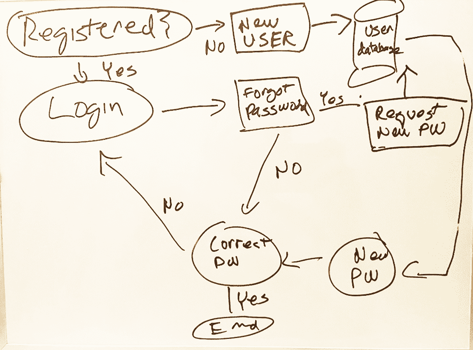
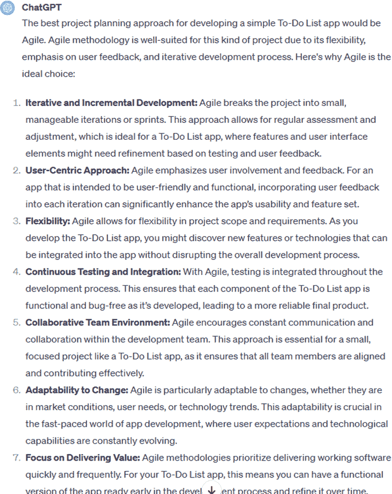
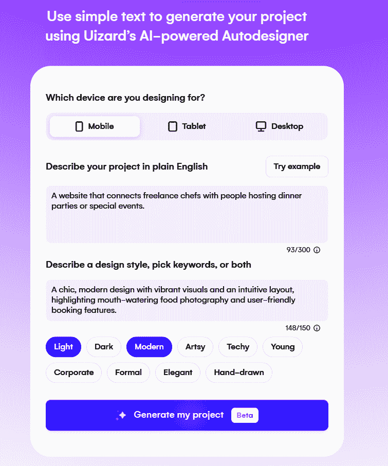

# 第七章：想法、规划和需求

在本章中，我们将深入研究制作软件的重要早期阶段。这是所有酷炫想法变得生动的地方，也是我们规划它们以便它们可以实施的地方。我们将使用 ChatGPT 进行有效的头脑风暴，并将计划细化到最后一丝细节。我们将研究市场调研，关注趋势，并检查竞争情况。我们还将讨论白板，这是一种有趣且直观的方式来抛出想法并使它们变得更好。此外，我们将深入了解如何规划你的项目，探讨像敏捷和 Scrum 这样的方法，以及如何调整它们以适应你的软件项目。

# 头脑风暴

每天都有成千上万的软件产品出现，因此要想出真正闪亮且能脱颖而出的事物并非易事。但有了像 ChatGPT 这样的 LLM，你可以进行一些头脑风暴。

首先，你可以让它提供不同的方法。以下是一个提示：

> *提示:* 如何为新产品的想法进行头脑风暴？使用互联网来研究这个问题。

ChatGPT 提供了 10 种有用的方法——以下是一些其中的示例：

> *ChatGPT:*
> 
> +   5 个为什么：从一个问题开始，不断询问“为什么”它发生了。这对于回顾和找出哪里出错非常有用。
> +   
> +   坏主意：故意想出一堆糟糕的想法。讨论为什么它们如此糟糕实际上可以激发巧妙的解决方案。
> +   
> +   星爆：这关乎问题，而非答案。你使用星形图，并用问题如：谁、什么、何时、何地、为什么和如何来击打它。

假设你想使用星爆方法。你可以通过以下提示了解更多信息：

> *提示:* 你会如何使用星爆作为一种提出软件产品新想法的方法？

ChatGPT 对应用于这个主题的星爆练习进行了直接的分解：

> *ChatGPT:*
> 
> +   谁：思考谁将使用你的软件。
> +   
> +   什么：深入了解你的软件解决的是什么问题。它与现有的有什么不同？
> +   
> +   何时：确定使用你软件的最佳时间，发布它，以及进行更新或修复。
> +   
> +   何处：人们可以在哪些平台或设备上使用该软件？
> +   
> +   为什么：深入研究为什么你的软件是必需品。为什么人们应该选择它而不是其他产品？
> +   
> +   如何：思考你的软件将如何工作，你将如何构建和销售它，以及当用户需要帮助时你将如何照顾他们。

通过这个过程，你可以更清晰地了解你的新软件产品想法。

现在，假设你想列出一些想法。最好专注于一个特定的类别，了解你的目标受众，并理解你想解决的问题。以下是一些帮助你开始的提示：

> *提示*：我想开发一个针对老年人的健康追踪应用。问题是他们在监测慢性疾病和药物安排方面遇到的困难。可以包括哪些功能，使应用适合老年人，并帮助他们更有效地管理健康？
> 
> *提示*：目标受众是那些在管理财务方面有困难的大学学生。预算应用应该包括哪些功能，以帮助他们跟踪开支、节省金钱，并轻松理解财务规划？
> 
> *提示*：我想为那些难以找到时间参加常规课程的忙碌专业人士创建一个语言学习应用。你能建议哪些功能，以适应他们的紧凑日程，并提供快速有效的语言学习课程？

ChatGPT 创造的点子有多好？嗯，一些沃顿商学院的教授在他们的[MBA 创新课程](https://oreil.ly/V7N31)中进行了测试。他们让学生们提出了十几个产品或服务点子。然后，他们用 ChatGPT 做了同样的事情，利用了 GPT-4 模型。其中提出的点子包括像宿舍友好的厨师套件和舒适垫子，用于那些硬邦邦的教室座位。

为了测试这些点子，教授们使用了一项在线购买意愿调查。问题是：“如果这个概念对你来说可用，你购买的可能性有多大？”

平均来说，大约 40%的学生点子相当扎实，而 ChatGPT 的得分略高，为 49%。但教授们并没有就此止步。他们专注于前 10%的点子。这些点子有真正的潜力成为变革者。而且你知道吗？在 40 个顶级点子中，只有 5 个来自学生。

# 市场调研

在投入软件项目之前，提出几个关键问题是明智的：这个工具实际上有需求吗？顾客愿意为此支付现金吗？以及这个市场的规模有多大？

这一切都是关于进行市场调研。当然，它不是水晶球，但它确实有助于降低将时间和精力投入到可能不会起飞的事情上的风险。

事实上，很多新产品都没有成功。哈佛大学教授、畅销书作家克莱顿·克里斯坦森对此进行了大量研究，发现大约[80%的新产品失败](https://oreil.ly/6BJ2H)。

当谈到软件项目时，这个数字可能甚至更高。表 7-1 显示了其中一些最显著的例子。

表 7-1\. 失败的软件应用

| 产品/服务 | 发布年份 | 失败原因 |
| --- | --- | --- |
| Friendster | 2002 | 技术问题，可扩展性问题，被 Facebook 超越 |
| Microsoft Zune | 2006 | 无法与 iPod 竞争，音乐市场动态变化 |
| Windows Vista | 2007 | 高系统要求，兼容性问题，安全提示 |
| Google Wave | 2009 | 复杂界面，目的不明确，缺乏用户采用 |
| Google+ | 2011 | 存在众多错误，数据不准确，导航能力差 |
| Vine | 2013 | 被 Instagram 和 Snapchat 等竞争对手所掩盖 |
| 亚马逊 Fire 手机 | 2014 | 价格高昂，应用选择有限，功能缺乏吸引力 |
| Quibi | 2020 | 未被接受短片内容格式，竞争激烈，COVID-19 影响 |

史蒂文·斯皮尔伯格 1982 年的电影《E.T. 外星人》的视频游戏是史上最史诗般的失败之一。雅达利公司为从环球影业获得版权支付了高达[2100 万美元](https://oreil.ly/pu8Gu)，并额外投入了 500 万美元用于推广。

游戏真的失败了。它非常令人困惑，也不怎么有趣。那么，发生了什么？雅达利公司仅售出了大约 150 万部。剩余的 250 万部最终被丢弃在新墨西哥州的垃圾填埋场。

让我们深入了解如何使用 ChatGPT 进行市场研究。首先，我们需要确定目标受众。想想谁会从这款软件中获得最大收益。让我们开始头脑风暴，思考这些用户可能是什么样的。考虑以下提示：

> *提示:* 项目管理软件程序潜在的目标受众群体有哪些？

你可以让 ChatGPT 承担一个对了解你的营销很重要任务：创建详细的用户画像。将这些画像视为提供不同类型可能使用你产品的个人快照的角色。细节通常包括他们的年龄、兴趣、工作和生活方式。通过绘制这些画像，你开始了解你的客户是谁以及他们在寻找什么。

我向 ChatGPT 请求了一些管理软件的用户画像，你可以在图 7-1 中看到其中的一些响应。

ChatGPT 还可以在起草调查问卷以收集特定数据方面发挥重要作用。

> *提示:* 你能创建一个专注于了解买家在项目管理软件中寻找什么的调查问卷吗？调查问卷应包括有助于识别关键功能、可用性偏好、特定行业需求以及买家希望用此类软件解决的任何特定挑战的问题。此外，请包括评估成本、支持、可扩展性和集成能力等因素重要性的问题。

让我们看看在评估软件市场时需要考虑的其他一些因素。

###### 图 7-1\. ChatGPT 为管理软件创建的用户画像

## 市场趋势

当你推出新软件时，深入研究市场研究可以带来很大的不同。这就像获得了用户真正追求的内部信息，同时也让你了解到竞争对手的动向。把它看作是你的秘密行动计划。你可以在趋势爆发之前发现它们，并抓住其他人可能错过的机会。此外，它还是一个很好的安全网。它减少了猜测，帮助你做出更明智的选择，这些选择更有可能击中目标。而且，我们不要忘记营销。深入了解你的受众意味着你可以创建与他们产生共鸣的广告和促销活动，而不是只是随意投放东西，希望它能粘住。

ChatGPT 可以是你市场研究的一个好帮手。当然，该模型只训练到某个日期，但有一个解决方案：你可以在提示中让它“搜索互联网”。

这里有一些例子：

> *提示:* 在<*特定软件类别，例如，移动游戏，教育技术*>中，搜索互联网以找到截至<*年份*>的当前趋势。
> 
> *提示:* 在<*年份*>中，搜索互联网以提供软件行业中新兴技术概述，这些技术正在获得人气。
> 
> *提示:* 搜索互联网，找到目前正在影响软件市场的消费者行为趋势，特别是在<*目标受众或应用类型*>中。
> 
> *提示:* 搜索互联网，找到<*年份*>软件应用的用户界面和用户体验（UI/UX）设计的最新趋势。
> 
> *提示:* 搜索互联网，列出<*特定领域或类别*>中排名前位的软件应用，并解释它们在当前市场中的成功之处。

## 总体可寻址市场

总体可寻址市场（TAM），或简称 TAM，是对如果所有可能使用你的产品的人实际上都使用了你的产品，你可以赚取的最大金额的估计。这有助于你确定在哪里集中精力，如何定位你的产品在市场中的位置，以及你的增长计划应该是什么。这是一个现实检查，帮助你设定可实现的目标，即你可以占据多少市场份额，以及你可以带来多少现金。

风险投资家（VCs）在决定将资金投向何处时，会高度重视 TAM，因为它显示了增长潜力有多大。他们总是在寻找他们的投资可能起飞的地方，一个庞大的 TAM 意味着有一个巨大的市场正等待被开发。

通常，风险投资家（VCs）寻找的总体可寻址市场（TAM）超过十亿美元——理想情况下还要多。毕竟，即使一家公司只从这样一个巨大的市场中夺取一小部分，利润也可能非常可观。

对于像“如何估算 TAM 的不同方法？”这样的提示，ChatGPT 将类似地回答：

> *ChatGPT:*
> 
> +   自上而下的方法：你收集行业数据和市场需求研究，以了解整个市场规模。然后，你可以稍微聚焦一些，比如专注于你想要进入的市场部分。
> +   
> +   自下而上的方法：你确定可能购买你产品的人数或企业，猜测其中多少人会真正完成购买（你的转化率），然后考虑每个客户会带来多少收益。这种方法需要更多的工作，但可以给你一个更清晰、更定制的画面。

让我们举一个例子。假设你有一个医疗技术类别的初创公司：

> *提示:* SilverConnect Health 是一家专注于远程医疗服务的健康科技初创公司。目标市场在美国，重点关注城市地区的老年人口。SilverConnect Health 的远程医疗服务市场规模目前是多少？未来 5-10 年该市场细分领域的预期增长率是多少？

ChatGPT 在互联网上搜索并得出一些有用的信息：

> *ChatGPT:*
> 
> +   2022 年市场规模：2022 年，美国远程医疗市场规模超过 350 亿美元。另一项估计将远程医疗市场规模定为同年 912 亿美元。
> +   
> +   预期增长率：一项估计表明，从 2023 年到 2032 年，复合年增长率（CAGR）为 12.5%。另一个来源预测，从 2023 年到 2030 年，CAGR 为 22.9%。

# 竞争

竞争分析有几个关键好处。首先，它让你提前了解市场。你看到已经存在什么，什么有效，什么无效。这有助于你发现任何你的软件可以填补的空白，确保你带来一些新鲜事物。

然后，从你的竞争对手那里学习——无论是他们的胜利还是失误。这真的可以提升你的游戏水平。

此外，当你知道你的软件有什么不同之处时，你可以更具体地进行市场营销，更有效地击中目标人群。

对于 ChatGPT 来说，它在竞争分析方面可以提供帮助。以下是一些提示：

> *提示:* 列出在 <*特定行业或市场*> 中 <*你的软件类型*> 的主要竞争对手。
> 
> *提示:* 比较一下你的软件与其前三大竞争对手的功能。
> 
> *提示:* 市场上你的软件竞争对手使用的定价模式有哪些？
> 
> *提示:* 领先的竞争对手在 <*软件类型*> 市场中是如何定位自己的？
> 
> *提示:* 识别 <*竞争对手名称*> 软件的优缺点。
> 
> *提示:* 总结一下关于 <*竞争对手软件名称*> 的客户评价，重点关注用户满意度和痛点。

你也可以让 ChatGPT 将分析放入表格中，这可以使它更清晰：

> *提示:* 你能提供一份截至 2023 年客户关系管理（CRM）软件市场主要玩家的要点总结吗？将结果放入表格中。

图 7-2 展示了响应。

###### 图 7-2\. ChatGPT 为 CRM 市场提供竞争分析，并以表格形式呈现

ChatGPT 甚至可以进行 SWOT（优势、劣势、机会和威胁）分析。这有助于您发挥优势，修复或绕过弱点，抓住机会，并避开任何曲线球。各种类型的商业都使用它，甚至对个人职业发展也很有用。

# 需求

需求文档对于软件开发至关重要。以下只是它们的一些好处：

为您提供方向

这些文档详细说明了软件应该做什么。从开发者到客户，每个人都能了解计划，这有助于保持项目按计划进行。

让每个人都保持一致

它确保所有相关人员，如您的团队和客户，都了解期望。这样，混淆或错误的方向的可能性就会减少。

帮助规划

需要弄清楚事情需要多长时间或会花费多少钱？这些文档是您规划工作、时间和金钱的必备工具。

提高沟通

它们非常适合清晰的沟通，尤其是在大型团队或人们地理位置分散的情况下。

降低风险

早期发现潜在问题？这正是这些文档能帮助您做到的，以便您避免延误并控制成本。

当然，提出软件需求并不容易，其中一个重要原因是软件开发可能会变得复杂。然后还有协调工作和考虑许多团队成员的挑战，他们可能在其他国家或时区。每个团队都有自己的想法和需求，有时这些想法并不完全一致或不够清晰。

另一个头疼的问题是，人们对软件的需求可能会不断变化。这在您在快节奏的行业工作时尤其如此。因此，您经常试图用不断变化的需求击中移动的目标，这使得确定稳固的东西变得困难。同时，您必须确保需求是可行的，并且您可以验证它们是否得到满足。

当需求偏离轨道时，结果可能是灾难性的。以下是一些例子：

丹佛国际机场的自动行李系统（1995）

需求复杂得令人难以置信，目标过于雄心勃勃。这导致了 16 个月的延误和成本激增。最终，机场决定放弃整个系统。

FBI 的虚拟案件文件系统（2000–2005）

FBI 对它想要的东西只有一个模糊的概念。所以，是的，这个系统最终并没有多少用处。最终，该机构在项目上投入了 1.7 亿美元，最终放弃了。下一个项目，名为 Sentinel，有更具体的需求，当然，也更为成功。

HealthCare.gov 启动（2013）

联邦政府没有明确其需求，也没有进行足够的测试，所以在它推出时，根本无法处理流量，也没有正常工作。这次发布是一个失败，很多人不得不投入更多的工作和资金来修复它并使其顺利运行。

在软件开发的世界里，存在各种各样的需求，每个都服务于独特的目的。你有功能需求，它规定了软件应该做什么，比如它应该执行的任务或它需要的功能。然后还有非功能需求，它关于软件应该如何运行，例如性能速度、安全性和可用性。

为了探索生成式 AI 如何帮助，我们将关注两种重要的文档：*产品需求文档*（PRD）和*软件需求规范*（SRS）。

## 产品需求文档

PRD 阐述了你的软件将是什么以及它将做什么。把它想象成一个故事，概述了应用程序应该是什么样子，应该如何表现，谁将使用它，以及它将解决什么问题。它通常是详细的，涵盖了从必备功能到用户体验的各个方面。

PRD（产品需求文档）的受众是多元化的。它面向开发者、设计师、项目经理和质量保证团队。对于需要理解产品愿景和目标的高管或其他利益相关者来说，它也非常关键。此外，它对市场营销团队了解如何定位产品也很有帮助。本质上，它是为任何参与将产品推向市场并确保其满足目标用户需求的人准备的。

如果你还没有见过 PRD，ChatGPT 可以提供帮助：

> *提示*：PRD 的主要部分是什么？创建一个 Word 文档作为模板。

图 7-3 展示了 ChatGPT 生成的文档。

###### 图 7-3\. ChatGPT 创建了一个 PRD 的样本大纲

## 软件需求规范

SRS 与 PRD 有何不同？SRS 就像是软件项目的详细技术手册。与从最终用户或客户的视角出发，关注他们需要什么和为什么的 PRD 不同，SRS 深入到软件需要做什么以及如何做的具体细节，关注技术方面。

如果你有一个简单的应用程序，SRS 可能只有几页。但对于更复杂的项目——比如企业软件的实施——它可能轻松地达到数百页。

让我们看看一些提示：

> *提示*：在起草有效的 SRS 时，需要考虑哪些基本要素和最佳实践？
> 
> *提示*：概述开发 SRS 的过程，强调在收集和分析需求、利益相关者协作和文档方法方面的步骤。
> 
> *提示:* 为软件项目创建详细的 SRS，包括项目概述、利益相关者分析、功能和非功能需求、假设和约束。<*添加你想要的每个部分的详细信息.*>

## 面试

语音识别软件已经存在了几十年，但大部分时间它更像是一个新奇的事物而不是一个实用的工具。通常，它不适用于日常使用或专业环境，因为它无法可靠地理解自然、对话式的语言。

然而，在过去的几年里，语音识别取得了飞跃，这得益于 AI 的进步。现代系统由复杂的 AI 算法驱动，这些算法不仅能够更好地理解各种口音和方言，而且能够理解口语语言的内容和细微差别。这些系统随着时间的推移学习和适应，不断改进其准确性。

这一点在通常进行的需求文档整理的面试中可能会有所帮助。

例如，使用语音识别软件，你可以改进以下方面：

准确性和回放

虽然转录的准确性通常相当不错，但你可以使用回放进行校正。

说话人识别

语音识别可以在会议中区分说话人。这有助于澄清需求。

关键主题识别

语音识别软件可以在转录中突出显示频繁的关键词，使识别和关注主要主题或需求变得更加容易。

关键点摘要

语音识别软件可以生成关键点的摘要并建议行动项，帮助开发者定位关键需求并将它们转化为具体的项目任务。

一些顶级的语音识别软件系统包括：

+   Otter AI

+   Fathom

+   Rev

+   Sonix

+   Notta

## 白板

白板是整理软件项目需求时的常见做法。它有助于头脑风暴过程，并允许每个人参与其中。它允许收集大量的不同想法和观点，这对于确定软件应该做什么至关重要。它也是动手的——你可以在讨论过程中绘制流程图或图表，使复杂的事情更容易理解。

嗯，ChatGPT 可以帮助处理这个问题。怎么帮？它可以解析你上传到系统的图片。

例如，假设你绘制了一个登录系统，如图图 7-4 所示。

###### 图 7-4\. 可以输入到 ChatGPT 的登录系统草图

正如你所见，我的手写相当潦草。我还使用缩写，例如“pw”代表“password”。

让我们看看 ChatGPT 能否解决这个问题。我使用了以下提示：

> *提示:* 分析图表。
> 
> *ChatGPT:* 你上传的图表看起来是关于用户账户管理的流程图，特别是针对网站或应用程序的登录过程。

然后它概述了整个过程(图 7-5)。

###### 图 7-5。ChatGPT 分析了一个登录系统图表的图像，将其翻译成易于阅读的工作流程分解

## 语气

写有效的 PRD 和 SRS 是一门艺术。重要的是要找到正确的语气。这些文档应该是清晰、简洁和专业的。

让我们分析一下为什么写作风格很重要：

使其清晰易懂

这些文档对你的项目来说就像是圣杯。你希望一切都很准确，这样每个人都能理解正在发生的事情。这样，你就可以避免那些讨厌的误解和开发错误。

坚持事实

PRD（产品需求文档）和 SRS（软件需求规格说明书）不是展现个人风格的地方。在这里，你需要像一个新闻记者一样——只提供事实，请。保持直接和客观，确保你专注于产品真正需要的内容。

一致性是关键

你希望从头到尾保持一致的语气。把它想象成遵循食谱。如果你中途改变，你最终会一团糟。一致性使得这些通常很重的文档更容易消化。

专注于产品

记住，这里的明星是产品及其预期功能。保持直接语气确保你不偏离主线——即功能性和需求。

对于像 ChatGPT 这样的 LLM（大型语言模型），写作是其优势之一。它真的能提升你的水平。是的，你可以指导 LLM 达到正确的语气，就像这个提示一样：

> *提示*：请起草一份关于移动银行应用的技术需求全面清单，确保写作清晰、结构良好、专业。

市面上有大量的 AI 写作工具，每个都有其独特的功能，以满足你喜欢的任何类型的写作。以 Jasper 和 Writer 为例。它们非常适合生成内容并保持品牌语气的连贯性。然后是 Grammarly，它是掌握语法和改善写作风格的必备工具。AI21 和 Copy.ai 也加入了其中，使内容创作变得轻而易举。

以 Jigyasa Grover 为例，她为她的项目使用 Grammarly。作为机器学习专家，她撰写了一本关于该主题的书，《为机器学习塑造数据》（2021 年）。根据她的说法：

> Grammarly 是另一个帮助我起草技术设计文档的工具。我利用它进行校对、语法、标点符号和风格建议。它与许多网络浏览器和文字处理软件无缝集成。语言构建清晰简洁，甚至可以根据目标受众和文档目的定制建议。

# 项目规划方法

在你整理好需求之后，下一步是规划如何处理项目。这涉及到制定团队如何应对软件创作旅程的游戏计划。它包括设定明确的目标，弄清楚你需要做什么，谁做什么，何时发生，以及如何进行。主要目标是确保事情顺利进行，确保每个人都高效工作，最终，让产品做到它应该做的事情，让每个人，尤其是客户，都感到满意。

现在，软件开发的世界无疑是复杂的，因此团队可以以多种不同的方式规划他们的项目。他们各自有不同的策略，每个都有自己的规则和步骤，以帮助人们处理任务，应对任何变化，保持质量，并向客户交付令人惊叹的产品。所以，无论你的团队是否需要详细说明，还是更喜欢一种可以随时改变的流动计划，都有适合你的方法。

一些常见的项目规划方法包括瀑布、敏捷、Scrum、看板和极限编程（XP）。选择正确的方法很重要，因为它可能成就或破坏你的项目。你的选择取决于许多因素，如你的项目有多大、有多复杂，客户需要什么，你的团队如何协作，以及你的项目世界中某些事情是确定还是不确定。有些团队可能坚持一种方法，但其他团队可能混合搭配以找到适合他们项目的最佳方案。

关于提示，让我们举一个例子。假设你正在开发一个“待办事项”应用程序。你已经为它创建了一份一页的需求文档，现在你向 ChatGPT 提问：

> *提示:* 对于这个应用程序，最佳的项目规划方法是什么？

ChatGPT 建议敏捷方法作为最佳选择，并提供了原因(图 7-6)。

这里有一些你可能使用的其他提示：

> *提示:* 团队如何有效地选择和调整项目规划方法以适应他们特定的软件项目？
> 
> *提示:* 讨论将项目规划方法与软件项目的目标和复杂性相一致的重要性。
> 
> *提示:* 解释软件项目管理中瀑布模型的连续阶段。
> 
> *提示:* 描述软件开发中敏捷方法的核心原则。
> 
> *提示:* 敏捷方法如何促进项目的灵活性和客户参与？
> 
> *提示:* 概述 Scrum 框架中涉及的角色和仪式。
> 
> *提示:* 比较和对比 Scrum 和传统的项目管理方法。
> 
> *提示:* 列出极限编程的关键实践以及它们如何提高客户满意度。
> 
> *提示:* 讨论在 XP 中实施测试驱动开发的好处和挑战。

###### 图 7-6\. ChatGPT 解释为什么敏捷是开发特定应用程序的最佳方法

## 测试驱动开发（TDD）

在开始编码之前，你可以做的最聪明的事情之一就是规划你的测试用例。记住那句老话“量两次，切一次”？这是很好的建议。你希望在深入之前做好准备。常见的方法是*测试驱动开发*（TDD）。

事情是这样的：当你坐下来思考你的代码需要通过的所有测试时，你会对需要构建的内容有更深入的了解。你在开始构建之前，正在仔细查看蓝图。这样，你就能确切知道你的代码应该做什么，这可以让你在以后避免很多头痛的问题。

更重要的是，首先规划你的测试意味着你从一开始就在考虑将使用你的软件的人。你不会迷失在代码中。你专注于制作对用户有用的东西。及早发现潜在的问题比后来修复错误要好得多。

在 TDD 中，这种方法是整个事物的核心和灵魂。你在编码之前编写测试，这意味着你始终专注于代码需要实现的目标。这种方法导致代码更干净、更直接，因为你始终带着目的进行编码。

在 TDD 中，有一个工具包用于编写测试的不同方式：

给定-当-然后（GWT）

给定是设定场景，比如在行动开始之前一切都在哪里。然后你进入当阶段，这是主要事件，它使一切开始运转。最后，你用然后结束，在那里你说明尘埃落定后你期望发生的事情。这就像讲述一个关于你的代码将要执行的故事。

安排-行动-断言（AAA）

这与 GWT 类似。但 GWT 更倾向于叙事和以用户为中心，这使得它非常适合开发人员、测试人员和非技术利益相关者之间的协作。另一方面，AAA 更多地关注测试本身的技术执行。

设置-练习-验证-拆解（SEVT）

当你处于集成和系统测试的困境中时，这是你的首选。你从设置开始，准备你的测试环境。然后，你跳入练习，运行你的系统。之后，你进入验证，这是你扮演侦探以确认一切是否顺利的地方。别忘了拆解。这是清理步骤，对于保持下一次整洁至关重要。

这是一个 TDD 的提示示例，使用 GWT：

> *提示:* 使用“给定-当-然后”方法制定关键功能的测试方法。具体要求包括：
> 
> +   为连锁精品酒店开发一个在线预订系统。
> +   
> +   系统必须从每家酒店的内部管理软件中提取房间可用性数据。
> +   
> +   应该允许用户通过日期、价格和设施过滤房间。
> +   
> +   界面需要直观，并且与桌面和移动浏览器兼容。
> +   
> +   系统应使用基于云的解决方案构建，以确保可靠性和可扩展性。

TDD 也经常关注需要测试的特定场景或用例。以下是一些有用的提示类型：

> *提示:* 编写测试用例，以允许用户通过电子邮件验证重置他们的密码。
> 
> *提示:* 创建测试用例以验证数据库连接失败时系统的响应。
> 
> *提示:* 开发测试用例以确保在正常负载条件下搜索功能在 2 秒内返回结果。
> 
> *提示:* 编写测试用例以检查所有用户数据在存储时是否被加密。
> 
> *提示:* 设计测试用例以验证支付网关和订单处理系统之间的集成。

## 规划网页设计

规划网站或网络应用可能很复杂，涉及众多步骤。首先，您需要了解网站的目标和目标用户。然后，您将绘制网站的蓝图并规划用户如何移动。这通常被称为*原型*或*线框*。

在此之后，就是通过选择颜色、字体和展示品牌特色的精美图形来使其看起来更好。当然，你需要一些吸引人的文字和酷炫的图片或视频来讲述你的故事。然后是技术部分，你将使用 HTML、CSS 和 JavaScript 等语言将这些想法转化为一个真实、可工作的网站。

当然，像 ChatGPT 这样的工具在规划阶段可能会有所帮助。以下是一些提示：

> *提示:* 我正在为<*某个类别*>开发一个网站。建议一些目标或目标。目标受众是谁？
> 
> *提示:* 对于在线商店的基本布局，我需要哪些页面？
> 
> *提示:* 我正在为博客的主页制作线框。你能建议一些重要的元素要包含吗？
> 
> *提示:* 我正在为移动应用的着陆页草拟线框。我应该确保包含哪些基本部分？
> 
> *提示:* 对于一个关于<*某个类别*>的网站，内容的好主意有哪些，比如博客文章、视频和信息图表？
> 
> *提示:* 你将如何构建你网站的导航结构，使其对受众来说直观且用户友好？
> 
> *提示:* 列出你将实施的以提高网站在搜索引擎中可见性的关键 SEO 策略。
> 
> *提示:* 你认为我的关于<*特定类别*>的网站应该使用什么颜色调色板？
> 
> *提示:* 为关于<*特定类别*>的网站选择字体样式。考虑可读性、品牌一致性以及字体如何有助于网站的总体美学。

此外，还有各种使用 AI 帮助创建线框的工具。其中一个是 Uizard。类似于 Figma 这样的系统，它具有设计功能，例如拖放按钮和表单等元素的能力。它也可以被团队用于协作。

AI 功能位于仪表板左侧的工具栏上。按钮被称为魔法。点击它，您将看到一个 AI 功能的列表。

要创建一个线框图，选择 Autodesigner，这将弹出一个向导，您可以在图 7-7 中看到。

首先，您将选择要设计的设备：手机、平板电脑或网页。然后，您将描述项目。您可以只提供一句话或两句话。以下是一个示例：

> *提示:* 一个连接自由职业厨师与举办晚宴或特殊活动的人的网站。

接下来，您将构思设计风格，例如：

> *提示:* 一个时尚、现代的设计，具有生动的视觉元素和直观的布局，突出令人垂涎的美食摄影和用户友好的预订功能。

图 7-8 显示了线框图。

###### 图 7-7\. Uizard 拥有一个 AI 向导，可帮助创建移动应用或网站的线框图

###### 图 7-8\. 根据给定的提示，Uizard 生成了这个网站的线框图

# 结论

在本章中，我们探讨了如何使用 ChatGPT 开始一个软件开发项目。我们从头脑风暴开始，接着进行市场研究。然后，我们深入探讨了起草需求的具体细节，重点介绍了 PRD 和 SRS 如何帮助确保项目目标和技术细节准确无误。我们检查了不同的规划风格，从随遇而安的敏捷到结构化的瀑布。我们还研究了白板和 TDD 技术。通过将强大的工具 ChatGPT 与经过验证的方法相结合，您可以为一个项目打下坚实的基础。
