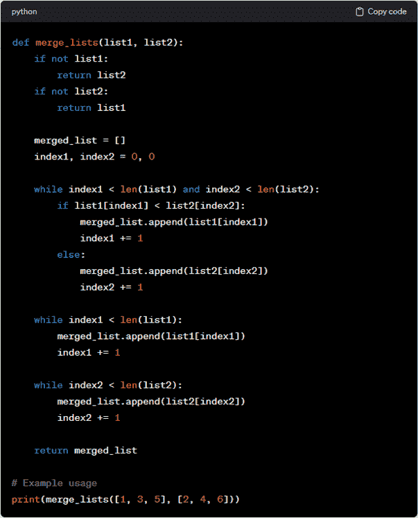
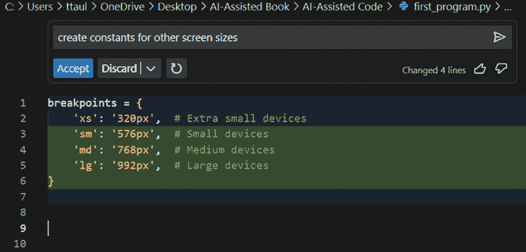
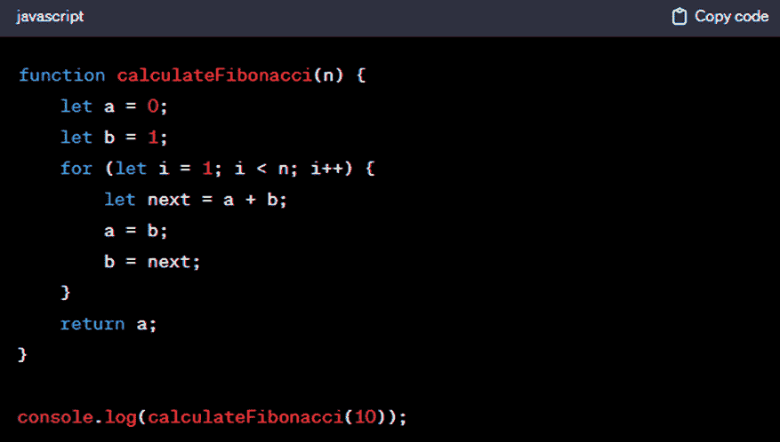

# 第八章. 编程

在本章中，我们将深入了解一些实用的编程技巧。我们将从编程的基础——函数和类的操作开始。然后，我们将进行一些重构，整理混乱的代码，使其运行更加流畅。我们还将展示如何处理和创建数据。然后，我们将检查一些可以帮助创建精美前端而无需费力的 AI 工具。

# 现实检查

AI 辅助编程工具非常酷，对吧？但让我们不要自欺欺人。它们不是能解决我们所有编程问题的魔法棒。为什么？因为这些工具就像课堂上那些只从公开笔记中学习的学生。它们被训练从互联网上的各种代码混合体中学习，坦白说，其中并非全部都是一流的。这对你意味着什么？有时，你可能会得到比感恩节火鸡还要臃肿的代码，或者像纸牌屋一样难以维护。有时代码就是完全错误的，不能完成你需要的功能，或者更糟糕的是，让你的前门对黑客或网络资源占用者敞开。

让我们看看一个 ChatGPT 生成混乱代码的例子。图 8-1 展示了合并两个排序后的列表到一个单一排序列表的代码。



###### 图 8-1\. 当被要求合并两个排序后的列表时，ChatGPT 编写了一些混乱的代码

这段由 AI 生成的代码确实正确地合并了两个列表，但它采用了冗长的方法。它分别处理了空列表的情况，并使用两个额外的`while`循环来追加每个列表中剩余的元素。

这正是你的编程智慧真正发挥作用的地方。你必须了解基础知识。你需要知道在某个地方不太对劲时应该提出什么问题以及在哪里进行探索。

图 8-2 展示了一个更好的方法。


###### 图 8-2\. 在一些人类的帮助下，我们实现了对排序后列表合并的更好方法

所以，不要担心你可能会听到的关于机器人接管开发者工作的所有悲观言论。诚然，这些 AI 模型一直在变得越来越好。它们在学习并成长。然而，它们离成为编程的终极解决方案还远着呢。程序员仍然非常活跃。AI 辅助编程工具非常有帮助，但它们不会取代真正、活生生的工程师的智慧和技能。

当你与这些系统一起工作时，请记住：这是一个合作，而不是移交。保持敏锐，保持好奇，不要忘记检查这些 AI 工具提供的一切。它们是助手，而不是英雄。

# 判断性决策

有时候，自己编写代码比使用 AI 辅助编程工具更简单。毕竟，可能需要多次尝试才能让 AI 理解你的需求。但随着你继续使用这些 AI 工具，你会习惯于判断何时它们有用，何时你最好独自完成。

以 Dmitrii Ivashchenko 为例，他是位于阿姆斯特丹的 MY.GAMES 游戏公司的首席软件工程师，该公司在全球拥有超过 10 亿注册用户。据他所说：

> 例如，提示“编写一个 Python 方法，为 datetime 对象添加默认时区。”然而，你应该准备好，许多方面将被省略，你可能必须自己最终确定处理边缘情况，或者你可能需要与 ChatGPT 进行长时间的通信，指出其错误。这里的主要事情是，最初评估解释一个任务所需的时间与你自己实现它所需的时间之间的差异。

# 学习

使用像 ChatGPT 这样的工具来学习新语言、框架或库可以大有帮助。它可能比传统的学习方法，如上课、无限期地使用 Google 搜索或观看大量的 YouTube 视频要快。

你可以使用 ChatGPT 来了解所有基础知识以及代码的语法。此外，如果你更倾向于通过实践学习，你可以要求代码示例，看看一切是如何结合在一起的。如果你已经熟悉一种编程语言，ChatGPT 可以通过比较两种语言来使学习新语言变得更容易。假设你擅长 Python，但刚刚开始学习 JavaScript；它可以用 Python 术语解释它们之间的主要差异。如果你需要更多资源，ChatGPT 可以在互联网上搜索，并为你推荐一些优秀的学习材料。

这里有一些可以考虑的提示：

> *提示*：对于不熟悉 Python 的人来说，我应该先学习什么？
> 
> *提示*：有哪些适合初学者的项目我可以尝试，以提高我在 React 中的技能？
> 
> *提示*：你能推荐一些学习高级 SQL 查询的资源吗？
> 
> *提示*：你将如何实现一个基本的“待办事项”应用程序，分别使用 Python 和 JavaScript，以突出它们之间的差异？
> 
> *提示*：我知道如何在 C++中使用循环。你能展示 Python 中循环的工作方式，以便进行比较吗？
> 
> *提示*：找到 5 个有用的 YouTube 视频，展示如何学习 Rust。

现在我们来看看 Ivashchenko 是如何处理这个问题的：

> 如果你想要快速掌握一门新的语言或框架，你可以在该技术上立即开始创建一个新项目。比如说你想学习 Django。让我们选择一个我们将要在这个技术上实现的项目——就让我们选择一个在线商店。首先，只需询问 ChatGPT 如何开始开发 Django 上的新项目。它会告诉你需要安装哪些依赖项，如何设置项目的初始配置，以及你需要处理的相关技术。然后我们继续更具体的需求，比如“Django 中模型是如何组织的？”“如何在管理面板中添加新部分？”“如何迁移数据库？”通过逐渐获取新的知识和提出越来越详细的问题，你几乎可以在任何之前不熟悉的技术上实现任何项目。这就是我通过周末的辛勤工作真正掌握 Django 的方式。

你可以让 ChatGPT 创建有用的学习指南。以下是一个示例提示：

> *提示*：为 JavaScript 创建一个学习指南。重点关注初学者水平。

你可以继续这样做：

> *提示*：请为我创建一个学习计划。我应该学习哪些主题？关于练习题或测验呢？编码问题？资源链接？

ChatGPT 甚至可以帮助你记住新的概念。一种方法就是使用记忆法，比如首字母缩略词。例如，假设你想记住 DevOps 的关键要素，包括持续集成、持续交付、微服务以及基础设施即代码。这是 ChatGPT 的建议：

> *ChatGPT:* CI-CD-MI（发音为“Ci-Ci-D-Mi”）

最后，你可以使用 ChatGPT 来获取 LeetCode 的帮助。想象一下：你坐在面试室里，可能面前有一块白板或一台笔记本电脑，然后他们给你出一个令人头疼的算法或数据结构问题。这不仅仅是编码。他们正在评估你的思考速度、解释思路的能力以及你的问题解决风格。

如果你想要领先一步，考虑注册 LeetCode。每月 35 美元。但当然，ChatGPT 在你需要时随时可以提供帮助。以下是一个简单的提示：

> *提示*：建议 3 个常见的 LeetCode 面试题。

ChatGPT 随后提出了像两数之和、最长不含重复字符的子串和有效括号这样的挑战。然后你可以进一步深入，比如通过获取更长的解释或示例。

# 评论

当你面临截止日期的压力时，很容易省略代码注释或者完全放弃它们。但 AI 辅助工具可以为你提供支持。你经常会发现带有注释的代码建议。

趣味十足的是，由于 AI 技术的存在，添加注释可能感觉有些过时。如果代码让你感到困惑，你只需让工具为你分解它，对吧？这确实是正确的。

另一件事：编写提示正在成为新的注释方式。毕竟，大多数工具都将提示包含在注释行中。

当然，如果你想对某些代码添加注释，可以使用以下简单的提示：

> *提示：* 添加清晰且符合最佳编码实践的注释。

是否添加注释由你决定。这里没有一刀切的规定。这完全取决于你和你团队的需求。但有一点可以肯定——使用 AI 辅助工具添加注释变得轻而易举。

# 模块化编程

模块化编程是高效和有效软件开发的基础。通过模块化编程，编码更加有序，更容易理解，也更容易跟上。它还使得与其他编码者合作变得不那么头疼，因为大家不会互相干扰。此外，模块是可重用的；可重用性可以节省大量时间，保持事物的一致性，并降低你出错的可能性。

模块化编程的价值当然适用于你如何使用 AI 辅助工具。它们不会从简单的提示中迅速构建出高级应用。它们不是巫师。但如果你将任务分解成清晰、具体的部分，这些工具就会大放异彩。否则，你可能会得到一个偏离轨道的代码混乱。

根据 Private Market Labs 的联合创始人兼首席产品官 Titus Capilnean 的说法：

> 在我开始使用 AI 工具后，我可以专注于问题和我的解决方案方法，而不是实际需要编写的代码的细节。当我遇到技术问题时，我会首先将其分解成更小的部分，其中输入和输出是清晰的。这样做的原因是，我使用的 AI 工具的上下文窗口可能不足以一次性提出一个好的解决方案。我发现，如果要求模型提供使用简单输入、执行单一任务并提供我可以验证的输出的代码，那么调试和构建会更容易。如果我对中间输出不满意，我会向 ChatGPT 描述我的问题，并尝试运行它提供的更新后的代码。一旦我对解决方案满意，我就可以添加额外的处理步骤，要么在现有函数内部进行，要么接受前一步的输出并进一步优化，使其更接近我期望的解决方案。
> 
> AI 工具通过允许我在将代码片段发送到编译器或部署云函数并消耗资源之前检查其是否正确，从而提高了我的生产力。我只需将代码的一部分粘贴到 ChatGPT 窗口中，并询问它是否正确，前提是我已经为该片段初始化/提供了正确的上下文，以便其运行（例如，导入、变量、常量、被调用的自定义函数等）。这使我能够产生运行良好且速度更快的解决方案。

# 开始一个项目

在编码项目的开始阶段，你可能会遇到“冷启动问题”或“空白页问题”。

这里有一个场景：你面对着一个空白的屏幕，没有代码，没有数据，甚至没有明确的前进路径。毫无疑问，这就像听起来那么令人不知所措。第一个大问题是选择你的项目架构、设计模式和要使用的技术。这些决定非常重要，因为你将长期与之共存，所以你希望尽可能从一开始就将其确定下来。

我们别忘了人的因素。让你的团队达成共识，找出如何有效沟通，并从头开始建立工作流程——这些可能和技术的挑战一样大。这不仅仅是写下那些第一行代码。这是为接下来的一切打下坚实的基础。处理这个阶段需要明智的计划、技术知识和坚实的团队合作。

人工智能辅助编程工具可以提供很大帮助。你可以使用它们来设置应用程序的基本框架。你将找到一个与你的愿景相一致的自定义起点。这些工具让你免于处理初始设置的繁琐细节，并让你直接进入项目更有趣的部分。

你可以提出一个特定的任务，然后提示 LLM 生成样板或起始代码。

这是一个示例提示：

> *提示:* 为一个将用户来自多个平台的社会媒体动态聚合到单个仪表板界面的网络应用程序生成起始代码。对于语言和框架，你建议我使用什么？关于一般的文件结构呢？

有了这个，ChatGPT 首先建议使用 React 来创建一个平滑的单页应用程序（SPA）。它还建议使用 Redux 来维护样式丰富且可重用的组件。然后建议使用 Node.js 运行应用程序，并使用 Express.js 作为 API 端点。接着推荐使用 Passport.js 进行登录，以及 MongoDB 和 Mongoose 进行数据库和模型构建。至于文件结构，图 8-3 展示了布局。


###### 图 8-3。ChatGPT 为新网络应用程序建议文件结构。

# 自动填充

当你沉浸在编码区域，设置时间单位的常量，并且只是重复一行又一行的代码时，你知道你在做什么。这就是 GitHub Copilot 跳进来的时候。你可以让它提供自动填充。

让我们举一个例子。假设你正在创建一个你希望使其响应式的应用程序。这意味着你需要为 CSS-in-JS 样式组件库的断点设置常量。

你可以先写这个：

```py
breakpoints = {
    'xs': '320px',  # Extra small devices
```

然后在行内聊天中，你可以使用这个提示：

> *提示:* 为其他屏幕尺寸创建常量。

图 8-4 展示了结果。它提供了其他具有相似风格的屏幕尺寸和变量。



###### 图 8-4。这是 Copilot 提供的针对不同屏幕尺寸的不同常量的输出。

你可以更进一步。Copilot 可以通过查看你的项目中的打开文件来帮助你自动填充。

根据 Capilnean 的说法：

> 我发现，如果你有部分代码在数据结构方面相似，Copilot 特别有用。如果你在另一个文件中定义了一个对象，而这个对象是你在工作的代码库的一部分，那么当你尝试定义一个类似的对象时，它可以在你输入时可靠地预先填充代码。例如，一个用于常见 API 调用（如 Sendgrid 电子邮件）的对象在这里效果很好。
> 
> 然而，如果你不小心，这种自动完成可能会出错。例如，在导入时，它不一定总是正确地获取文件夹结构，特别是如果你设计了自定义的代码形状，或者你使用的框架相当新且尚未得到很好的文档记录。在这种情况下，我必须手动检查组件来自哪里，以及 Copilot 建议的目录是否正确。

# 重构

重构就像是给你的代码进行大扫除。它关乎整理、重组，有时甚至是对事物进行美化。它不是关于添加新功能或修复错误。

重构使代码库保持健康，减少杂乱，更加直观。这意味着当你或其他人稍后再次回来时，更容易理解正在发生的事情，这减少了头痛和，嗯，对着屏幕咒骂。此外，更干净的代码通常更高效，错误更少，所以对所有人来说都是双赢。

重构是那些 AI 辅助工具大放异彩的领域之一。只需一个或两个提示，你就可以穿透你代码的复杂性，剔除冗余，并将你的代码重新组织成既实用又优雅的东西。有了 AI 的支持，重构不再是苦差事，而成为领先潮流的秘密武器。

在本章接下来的几节中，我们将探讨一些重构的例子。

## 忍者代码

把忍者代码想象成那些夸张的动作电影特技之一。它很耀眼，很复杂，会让你想，“哇，他们是怎么做到的？”但这里有个问题：一旦这种敬畏感消失，它就很难理解。想象一下，代码如此隐蔽和错综复杂，即使是编写它的人在其“忍者”阶段过去后也无法理出头绪。当然，在那一刻完成忍者动作感觉非常壮观，但当你或其他人需要回来进行更改时，它就不再是“嗨呀！”而是“哎呀。”事实是，虽然忍者代码可能展示了严肃的编程技巧，但它往往与良好的编程实践背道而驰，而这些实践都是关于保持事物干净、简单和可理解的。

不论如何，忍者代码很常见。但使用 AI 辅助工具进行重构可以帮助理清头绪。以下是一个例子：

```py
console.log((function(n, a = 0, b = 1) { while (--n) [a, b] = [b, a + b]; 
return a; })(10));
```

有没有道理？嗯，你可能需要花相当多的时间去弄清楚这一点。相反，让 ChatGPT 来做这项工作：

> *提示:* 你能逐步解释这段代码吗？还能否用更简单的方式重写，使其更易于维护？

ChatGPT 确定这是一个计算第*n*个斐波那契数的函数。它继续用六个步骤描述它，然后提供了一个简化版本，如图 8-5 所示。

> *ChatGPT:* 在这个版本中，calculateFibonacci 函数清楚地展示了遍历斐波那契数列的过程。它更冗长，但更容易理解和维护，尤其是对于可能在未来阅读此代码的其他开发者来说。



###### 图 8-5\. ChatGPT 提供了一个更简单的版本，这是忍者代码

## 提取方法

当你有一个长方法或函数时，你会应用提取方法。你会挑选出专注于特定任务的一段代码——比如数据检查或特定的计算——并将其转换成一个新的方法。

这种方法不仅是为了使事物看起来整洁有序，而且也是实用的。它帮助你保持代码易于阅读和理解。当你需要再次执行相同任务时，你可以调用你的新方法而不是重写代码。如果代码中出现问题，当你的代码被分成这些专注的、小块的片段时，更容易解决。这是为了让你的生活更轻松，并保持你的代码干净、有序。

这里是一些提取方法的提示：

> *提示:* 在函数式编程语言中提取方法时，有哪些常见的陷阱需要避免？
> 
> *提示:* 我附上了一段我的 C#代码。你能建议哪些部分是提取方法重构的好候选吗？
> 
> *提示:* 你能比较我的原始函数和提取方法重构后的版本吗？哪个更高效？

## 分解条件

分解条件是将大的、复杂的 if-then-else 语句分解成更容易消化的东西。你知道那种类型——那些冗长、曲折的条件，让你眯着眼睛盯着屏幕试图弄清楚发生了什么。

假设你有一个包含复杂条件的`if`语句，该条件检查多个变量，可能还会调用其他函数。而不是每次都试图解析它，你可以将这个条件提取到一个具有清晰描述所检查条件名称的方法中。例如，一个像`if (user.isActive() && user.hasSubscription() && !user.isBlocked())`的条件可以被重构为名为`canUserAccessContent()`的方法。这不仅使你的主方法更简洁，而且立即使代码变得自解释。

类似地，`then` 和 `else` 块内的代码可以被提取到独立的方法中。这使得你的程序的主要流程更加易于阅读。读者现在可以高屋建瓴地理解流程：如果这个条件为真，就做这件事；否则，就做那件事。逻辑的每一部分都生活在其自己整洁命名的独立方法中，这使得它更容易单独测试和修改。

这里有一些提示：

> *提示:* 你能解释如何将 Java 代码中的条件分解以获得更好的可读性吗？
> 
> *提示:* 我该如何使用分解条件技术将复杂的 if-then-else 语句分解？

## 重命名

重命名函数、变量和类可能看起来是一个小的改变，但它可以对代码的可读性和可维护性产生重大影响。这在代码随着时间的推移而演变，原始名称不再准确描述代码所做的事情的情况下尤其有用。例如，最初命名为 `processData` 的方法可能变得更加专业化。将其重命名为更具描述性的名称，如 `filterInvalidEntries`，可以立即阐明其功能。

编写重命名的提示相当简单：

> *提示:* 在我的 SQL 脚本中，为包含数据库中用户总数的变量起一个好名字会是什么？
> 
> *提示:* 这是我 JavaScript 代码的一个片段。你能审查变量和方法名称并提出改进建议吗？
> 
> *提示:* 我不确定我的 Java 类中的名称是否足够清晰。你能提出更清晰的名称建议吗？

但你需要谨慎，比如当你使用像 Copilot 这样的工具时。如果你更改了名称，这可能会破坏仍在使用旧名称的部分代码。

## 死代码

正如名称所暗示的，死代码没有用于任何事情。这些是从被废弃的功能或使某些部分变得冗余的更新中遗留下来的被遗忘的代码行。

清理这些死代码可以使你的项目更加整洁和易于管理。它也使得对于新加入项目的人来说更加清晰易懂。如果某部分看起来没有做任何事情，他们不需要挠头思考为什么它还在那里。

这里有一些有用的提示：

> *提示:* 你能帮我识别这个 JavaScript 片段中的潜在死代码吗？
> 
> *提示:* 这是我 Python 项目的片段。你能指出任何看起来未使用或冗余的代码吗？
> 
> *提示:* 你能看看这些 SQL 存储过程并确认是否有任何一个是安全的可以删除的吗？

注意，使用大型语言模型（LLM）来做这件事可能会有风险。有时看起来像是一个古老、尘封的代码角落实际上可能对那些罕见的情况很重要。然后是多米诺效应：移除一个部分可能会破坏依赖于它的其他部分，特别是如果它是复杂逻辑或设置的一部分。所以，请谨慎行事。

另一个问题在于，生成式 AI 可能并不真正理解这些关系。因此，在 AI 系统变得更加复杂之前，最好避免使用它们来查找死代码。

当涉及到处理死代码时，其他工具可能是一个更好的选择。一个例子是代码检查器。把它想象成你的代码的整理团队。如果你在使用 JavaScript，那么有 ESLint。对于 Python 爱好者来说，有 Pylint，而 Ruby 用户可以转向 RuboCop。这些工具就像代码的语法检查器。它们擅长捕捉那些讨厌的语法错误、潜在的 bug，当然，还包括那些不起眼但什么也不做的代码片段。

你还有重型检查员：静态代码分析工具。顶级提供商包括 SonarQube、Code Climate 和 Coverity。这些工具就像侦探。它们在代码运行之前就深入挖掘，嗅出可能成为麻烦制造者的复杂模式，包括死代码。

# 函数

函数是编码的精髓，在所有类型的软件程序中都扮演着巨大的角色，无论使用什么编程语言。它们是代码块，对保持程序整洁和易于阅读大有裨益，因为它们允许你轻松重用代码——对任何开发者来说都是救命稻草。它们还可以将大任务分解成更小、更易于管理的部分。这使得处理复杂软件变得容易得多，尤其是在你需要修复 bug、进行更新或只是试图理解代码在做什么时。

从一开始就要确保函数做得正确。让它们工作是一回事，但你还需要确保它们与其他代码相处融洽。你希望你的函数清晰、易于跟踪且高效。你需要考虑每个函数的命名，使其有意义，考虑如何设置它，如何处理输入和输出的数据，以及如何处理任何意外情况。

为了帮助大家，这里有一些需要记住的指南：

考虑单一责任原则

你的函数需要成为一项工作的专家——仅此而已。这使得确定它在做什么、检查它是否工作正常以及如果它不工作如何修复它变得容易得多。

明确命名

给你的函数起一个能确切告诉你它做什么的名字。如果它计算总价，就称它为`calculateTotalPrice`。这使得你的代码更容易阅读。

简洁明了

一个好的经验法则是你应该能够在不滚动屏幕的情况下看到整个函数。短函数更容易处理，且出现 bug 的可能性更小。

参数至关重要

使用参数作为输入，返回值作为输出。这使得你的函数可预测且自包含。

保持一致性

遵循你语言或项目的编码约定和风格指南。这有助于保持代码的一致性，并使其他人更容易阅读。

当你记住这些提示时，你可以快速编写一些非常有效的函数提示，ChatGPT 可以帮助你。查看这些示例提示：

> *提示:* 编写一个名为 calculate_area 的 Python 函数，该函数接受两个整数参数，长度和宽度，并返回矩形的面积。包含一个文档字符串来解释函数的目的，并确保函数通过引发 TypeError 来处理非整数输入。
> 
> *提示:* 我需要一个名为 filterAndTransform 的 JavaScript 函数。它应该接受一个对象数组作为输入。每个对象都有 name（字符串）和 age（数字）属性。该函数应返回一个新数组，包含 18 岁或以上的人的名字，并转换为大写。请包含解释逻辑的注释。
> 
> *提示:* 创建一个名为 efficientSort 的 C++ 函数，该函数按升序排序整数数组。该函数应针对时间复杂度进行优化。在函数内提供注释，解释排序算法的选择及其时间复杂度。
> 
> *提示:* 你能生成一个名为 safeDivide 的 Java 函数，该函数接受两个 double 类型的参数，分子和分母，并返回它们的除法结果？该函数应处理除以零的情况，通过返回自定义错误信息。请包含 Javadoc 注释来解释该函数及其错误处理。

# 面向对象编程

面向对象编程，简称 OOP，是一种使用“对象”的概念来表示数据和方法的编写计算机程序的方式。想象一下，就像创建了一堆小型的、自包含的盒子，每个盒子都有自己的工具和信息集。这些盒子，称为 *类*，是创建不同对象的蓝图。一个类定义了对象的结构和行为——类似于模板。然后从这个类中，你可以创建单个 *对象*，每个对象都有其特定的细节，但遵循相同的基本结构。

深入面向对象编程的世界可能会感觉就像你走进了一个由抽象、继承、封装和多态等复杂概念组成的迷宫。它们可能感觉像是用外星语写的。

这就是 ChatGPT 可以成为你的翻译器的地方。它将这些复杂的概念分解成小块，易于消化的解释。对于 *封装* 的真正含义感到困惑？只需提问，你将得到一个真正有意义的答案，没有技术术语。

这里有一些提示：

> *提示:* 你能创建一个简单的类，用 <*你喜欢的编程语言*> 来演示封装吗？
> 
> *提示:* 编程中封装的一些真实世界例子是什么？
> 
> *提示:* 请用日常生活中的类比来解释面向对象编程中的抽象。
> 
> *提示:* 你能给我一个编程场景中继承的例子吗？
> 
> *提示:* 继承在面向对象编程中如何促进代码重用？
> 
> *提示:* 多态如何增强程序的可灵活性？
> 
> *提示:* 在哪些场景下多态特别有用，你能提供例子吗？

AI 辅助编程工具在为类生成初始结构时也可以很有帮助。以下是一些示例提示：

> *提示:* 设计一个具有 employeeName、employeeID 和 department 等属性的 Employee 类。实现一个显示员工详细信息的方法。还包括一个构造函数来设置这些属性。
> 
> *提示:* 我需要一个 Java 中的 BankAccount 类。它应该有 balance 和 accountNumber 这样的私有属性。你能添加 deposit()、withdraw() 和 checkBalance() 方法来安全地修改或访问这些属性吗？
> 
> *提示:* 你能展示如何在 C# 中创建一个 Vehicle 类，然后创建一个继承自它的 Truck 类吗？确保包括像 wheels 和 fuelType 这样的属性，并演示不同访问修饰符的使用。
> 
> *提示:* 在 C++ 中，我如何在构造函数中打开文件并在析构函数中关闭它？还要包括 writeToFile() 和 readFromFile() 方法。

# 框架和库

在没有框架和库的情况下进行软件开发就像尝试在没有食谱或预混合成分的情况下从头开始制作一个复杂的蛋糕。这是可能的，但会难得多，花费的时间也更多。框架和库是让开发者的生活变得更轻松的秘密调料。你不需要每次需要发送网络请求或操作 DOM 元素时都重新发明轮子，你只需利用已有的资源。

AI 辅助编程工具当然很有帮助。首先，它们对于学习基本功能和工作流程很有用。它们还可以告诉你何时最好使用框架或库。

但要带着怀疑的态度接受他们的帮助。以下是 Capilnean 的看法：

> 由于 React 以及其他框架和库的大量更新，以及我们使用特定版本的框架，我不得不将这些作为系统提示提供给我的 ChatGPT 实例以优化我的结果。有时，GPT 提供的解决方案比生产级解决方案更学术化，所以我倾向于依赖与我们的高级开发者合作来解决更复杂的问题。对于 React，我发现我更倾向于让 GPT 检查我的语法和特定数据类型的处理方法，而不是为我构建完整的功能。
> 
> 对于 NodeJS 也是如此。在我向 ChatGPT 请求一个功能代码片段之前，我必须考虑我们内部的 API 和数据处理方法。一旦我能描述我们函数的输出作为我正在构建的功能的输入，它通常能够提供稳定的代码。如果输出不好或者出错，我会提供问题并请求正确的代码更新。

# 数据

数据确实是每个应用程序的生命线，这是真的。它是让应用程序保持活力和动力的东西。就像血液携带氧气和营养素以保持我们身体的功能一样，数据在应用程序中流动，为它提供工作所需的必要信息和洞察力。

但创建示例数据可能是一项艰巨的任务。想象一下：你兴奋地想测试你那闪亮的新应用，但首先你需要一大堆数据来看到它在现实世界中的实际工作情况。你开始输入一行又一行的数据——名字、日期、数字，无论是什么。但然后，它只是继续下去。并且继续。

此外，你还得确保它足够现实，以便你的测试是有效的，但又不至于过于详细，以免你为每个条目都写一部小说。而且如果你需要一个大型数据集？别想了：你基本上是在报名参加一场马拉松，进行复制粘贴、调整和双重检查。

一个辅助人工智能的编程工具对此很有帮助。但首先，你需要选择一个数据库并启动模式和表。工具还需要提供表之间的关系，比如表之间的关系。然后你需要进行配置和设置。然后人工智能就可以开始帮助了。

这里有一些提示，可以帮助你获取评估数据库的帮助：

> *提示:* 哪种数据库最适合处理<*特定数据类型或功能，例如，用户交互，产品库存等*>？
> 
> *提示:* 对于预期有<*高/低*>流量且包含<*类型的数据，例如，图像，文本，实时数据*>的应用，我应该考虑哪种数据库？
> 
> *提示:* 我的预算很紧张。你能为我推荐一个适合小型<*类型的应用，例如，本地配送服务应用*>的经济实惠的数据库解决方案吗？
> 
> *提示:* 我相对较新手于数据库管理。哪些数据库对初学者来说用户友好且易于维护？

这里有一些提示，可以帮助你请求数据库模式的帮助：

> *提示:* 你能帮我设计一个基本数据库模式吗，用于<*类型的应用，例如，在线商店，博客*>？我需要知道我应该创建哪些表以及它们之间的主要关系。
> 
> *提示:* 在关系型数据库中，管理<*特定类型的数据，例如，客户订单，库存*>的效率高的表结构应该是什么？我应该包含哪些字段和数据类型？
> 
> *提示:* 对于处理<*描述应用程序的功能，例如，活动管理，课程注册*>的应用，我应该如何在关系型数据库中定义表之间的关系？特别是，我需要帮助理解外键和连接表。
> 
> *提示:* 我正在为一个<*描述项目*>的关系型数据库模式工作。你能指导我如何有效地设置主键和外键以确保数据完整性吗？
> 
> *提示:* 对于处理<*类型的数据或应用功能*>的数据库，你会推荐哪种归一化策略？我如何避免数据冗余并确保数据完整性？
> 
> *提示:* 我正在使用 NoSQL 数据库进行一个项目，例如社交媒体应用。我应该如何设计文档结构来存储特定数据类型，例如用户资料、帖子、评论？
> 
> *提示:* 在设计我的数据库模式时，我应该考虑哪些索引策略来优化查询性能，特别是对于全文搜索、频繁更新等类型的查询或操作？
> 
> *提示:* 我需要将现有数据库迁移到新架构。在重新设计数据库结构而不丢失数据完整性的关键考虑因素和步骤是什么？

下面是一些设置初始数据库环境的提示：

> *提示:* 能否提供在特定操作系统（例如 Windows、Linux）上安装特定数据库服务器（例如 MySQL、PostgreSQL）的逐步说明？
> 
> *提示:* 安装特定数据库（例如数据库名称）后，我应该首先设置哪些基本配置设置以实现最佳性能？
> 
> *提示:* 保护特定数据库服务器的最佳实践是什么？我特别关注用户身份验证和保护敏感数据。
> 
> *提示:* 如何优化特定数据库的性能，以适应将要处理的应用程序，例如处理大量数据集或高交易量？

现在，让我们看看如何使用 AI 创建样本数据。以下是一些示例提示：

> *提示:* 为 100 个 ID 和电子邮件数据创建演示数据，并将其保存到 CSV 文件中。
> 
> *提示:* 为 50 个产品创建演示数据，包括产品 ID、名称、价格和类别。
> 
> *提示:* 创建一个包含订单 ID、客户 ID、订单日期和总金额的 150 条订单记录的演示数据集。
> 
> *提示:* 为 100 名员工生成样本数据，包括员工 ID、全名、部门和电子邮件地址。
> 
> *提示:* 创建 80 条客户反馈样本数据，包括反馈 ID、客户 ID 和评论。

使用这些数据，然后你可以为它们创建 SQL 语句。你可以使用以下内容为客户反馈条目：

> *提示:* 生成一个 SQL 插入语句，用于将数据填充到 Feedback 表中。

ChatGPT 在处理数据转换这类繁琐任务时可以成为救命稻草。如果你是开发者，你知道在 XML、SQL、JSON、CSV 和 TOML 等不同格式之间转换数据是常见的。但说真的，这可能会很繁琐，有时还可能出错。这就是 ChatGPT 发挥作用的地方。

下面是一些示例提示：

> *提示:* 这里有一行 CSV 数据：‘John Doe, 35, New York’。你能帮我将其转换为 XML 格式吗？
> 
> *提示:* 我有一个这样的 JSON 数组：[{‘name’: ‘Alice’, ‘job’: ‘Engineer’}, {‘name’: ‘Bob’, ‘job’: ‘Designer’}]。我该如何将其表示为 SQL 表格式？
> 
> *提示:* 我需要将这个 TOML 配置转换为等效的 YAML 格式：‘title = “My Project” owner = “Sara”’。你将如何转换？

# 前端开发

前端开发包括使网站看起来很棒并且导航顺畅。其核心是使用 HTML 设置网页的基本结构，CSS 使事物看起来很棒并布局一切，以及 JavaScript 使其具有交互性。如今，前端开发者经常使用像 React 和 Vue 这样的框架。这些框架提供了诸如可重用组件和实时更新数据的方法等特性，这使得构建动态和引人入胜的网站和应用程序成为可能。

前端开发可能具有挑战性，即使是经验丰富的开发者也是如此。首先，有浏览器和用户交互的不可预测性。你需要处理不同的浏览器、设备、屏幕尺寸和用户偏好。这就像尝试制作一件适合所有人的 T 恤，让每个人都看起来很好。接下来，前端世界变化很快。框架更新频繁出现。

前端开发还有一点就是它不仅仅是关于编码。它还涉及到很多关于良好的用户体验（UX）和用户界面（UI）设计。这是一个许多程序员不具备的独特技能集。UX 和 UI 设计包括理解人们如何与技术互动，什么使设计在视觉上吸引人，以及如何在应用程序或网站上创建流畅、逻辑的流程。这就像既是艺术家又是心理学家。对于许多传统程序员来说，他们可能在算法和数据结构方面是高手，但颜色、布局和用户旅程的世界可能是不熟悉的领域。

不论如何，AI 辅助编程工具都有一些方法可以帮助我们。我们将在接下来的几节中探讨一些这些方法。

## CSS

为网站编写 CSS 可能很棘手，尤其是在你正在处理大型、复杂的网站时。确保在不同浏览器和设备上一切看起来都很好是一项挑战。你必须了解所有奇怪的浏览器特定怪癖。也很容易不小心搞砸事情，以至于你的样式的一部分会踩到另一部分的脚趾，使事物看起来很奇怪。此外，传统的 CSS 不允许你使用变量或函数，这意味着你会在代码中重复很多（尽管像 SASS 和 LESS 这样的工具有助于解决这个问题）。即使是像居中一个`<div>`这样简单的事情也可能是一项艰巨的任务。

这里有一些常见 CSS 任务的提示：

> *提示:* 你能给我提供一个 CSS 代码片段，用于创建一个在移动设备上折叠成汉堡菜单的响应式导航栏吗？
> 
> *提示:* 我在 CSS 中的 flexbox 布局遇到了问题，项目没有正确对齐。你能建议可能出什么问题吗？
> 
> *提示:* 我需要给我的网站上的按钮添加一个悬停效果。你能给我一个 CSS 示例，让按钮在悬停时改变颜色吗？
> 
> *提示:* 我想给我的网站首页添加一个淡入动画。你能提供一个 CSS 代码片段吗？

## 创建图形

为网站或应用程序创建专业图形需要广泛的设计背景，以及对 Photoshop 等复杂工具的理解。但有许多强大的文本到图像生成 AI 系统可以帮助您创建引人注目的图像。这些系统包括：

+   Canva

+   Stable Diffusion

+   DALL·E 3（内置在 ChatGPT 中）

+   Adobe 的 FireFly

+   Midjourney

使用这些系统，您可以创建多种类型的资产，包括英雄图片、按钮和标志。

让我们看看一个例子。我们将让 ChatGPT 创建一个标志：

> *提示:* 我正在为我的家庭烘焙业务“Sweet Whisk”创建一个网站。我想要一个温暖而吸引人的标志。主要产品是蛋糕和饼干，也许可以将它们融入设计中。我喜欢柔和的颜色，尤其是浅粉色和薄荷绿。风格应该是简单现代的，带有一点俏皮。

图 8-6 显示了 ChatGPT 创建的内容。


###### 图 8-6\. 当给出一些指导时，ChatGPT 创建了一个标志

如果您想对输出进行修改，您可以继续提示 ChatGPT。其他 AI 图像工具，如 Firefly，在图像设计方面比 ChatGPT 拥有更多功能，但 ChatGPT 仍然可以创建引人注目的图像——而且无需太多工作。

## AI 工具

有些优秀的 AI 工具可以从提示或您想要的网站前端外观的图片中快速生成网站。它们会为您处理所有编码工作。这甚至包括将代码转换为 React、Angular 和 Vue 等框架。更重要的是，AI 工具通常还能导入来自 Figma 的线框图。

代码创建完成后，您可以跳进去调整细节，使其恰到好处。使用 AI 是加快整个网站建设过程的有效捷径。

这里有一些可用的 AI 工具：

+   TeleportHQ

+   Anima

+   Locofy

+   v0 by Vercel

让我们更仔细地看看 Vercel 的 v0 版本，它易于使用。事实上，界面与 ChatGPT 的界面相似，如图 8-7 所示。


###### 图 8-7\. 这是 Vercel 的 v0 版本的用户界面

您可以输入提示以指定系统要创建的界面类型，或者上传一张图片。在这个例子中，我将使用一个提示：

> *提示:* 一个带有侧边导航和最近订单表的电子商务仪表板。

这将带您进入一个设计工作室，其外观类似于图 8-8。


###### 图 8-8\. 当您输入提示时，v0 by Vercel 提出的设计工作室

人工智能将创建三个版本的仪表板。您也可以创建更多。然后，通过提示，您可以进行更改，例如文本大小、颜色等。

完成后，您可以在右上角点击“代码”。您将看到基于 shadcn/ui 和 Tailwind CSS 的干净 React 代码列表。

还有几个开源系统使用 AI 生成前端。考虑 [Screenshot to Code](https://oreil.ly/31Rjd)。这个项目的创建者是 Abi Raja，他是 Pico 的首席执行官和创始人。他的前一家初创公司于 2013 年被雅虎收购。

Raja 花了六个月时间创建了 Screenshot to Code 的初始代码库。“前端开发者经常将设计和原型转换为代码，”Raja 说。“这项工作的大部分都是重复性的。但我的软件可以帮助自动化这个过程，完成大约 90% 的工作。”

目前，Screenshot to Code 支持导出为 React、Bootstrap 和 HTML/Tailwind CSS。该项目在 GitHub 上有超过 31,000 个星标。

使用 ChatGPT，你还可以将图像转换为代码。假设你想创建一个计算器应用程序，并且希望它看起来像 iPhone 上的版本。图 8-9 展示了这张图像。


###### 图 8-9\. 你可以将 iPhone 计算器应用程序的图像输入到 ChatGPT 中以生成代码

首先，我们将要求 ChatGPT 识别图像，它会正确地做到这一点。然后我们可以使用这个提示：

> *提示:* 为此图像建议代码

图 8-10 展示了计算器。

ChatGPT 为 Python 创建了代码。诚然，样式可能不太对，但这仍然相当不错。当然，如果你想让它看起来更像 iPhone 版本，你可以更具体地提出提示，比如告诉 ChatGPT 使用 React 这样的技术。


###### 图 8-10\. ChatGPT 基于苹果 iPhone 应用程序的图像创建了计算器的代码

# API

熟悉一个新的 API 可能是一个挑战。首先，你必须浏览文档，这些文档可能很密集且技术性强。这些文档的效果好坏参半——有些清晰易懂，而有些则不然。然后是登录和获取访问权限的问题，比如使用 API 密钥或 OAuth 令牌。此外，试图弄清楚 API 返回的数据结构和响应格式可能会让人感到不知所措。然后还有错误处理，以及必须跟上 API 的任何更新或更改。

幸运的是，使用 ChatGPT 可以使应对这些挑战变得容易一些。

为了了解如何做到这一点，让我们用一个简单的例子。假设你想使用 API 获取有关天气的信息。你可以向 ChatGPT 提出关于 API 的建议：

> *提示:* 哪些天气 API 是好的？

ChatGPT 推荐的一个是 OpenWeather API。接下来，请提出以下问题：

> *提示:* 我如何开始使用 OpenWeather API？

ChatGPT 描述了主要步骤。

然后，你可以要求它展示如何进行请求：

> *提示:* 我如何使用 OpenWeather API 创建请求？我如何使用 Python 来做这件事？

ChatGPT 将会通过这个过程，提供这些步骤的详细信息：

+   导入 requests 库。

+   定义 API 密钥。

+   创建 API 请求 URL 并使用当前天气数据端点。

+   执行请求并处理响应。

+   检查请求是否成功。

# 结论

在本章中，我们深入探讨了模块化编程、函数和面向对象编程。我们还探讨了如何使用 AI 即时学习新的语言和框架，以及如何使用它更有效地处理数据。然后我们看到了如何创建引人入胜的前端。

但重要的是要重复一遍：AI 辅助编程工具远非完美。这就是为什么保持警惕并双重检查一切很重要的原因。
