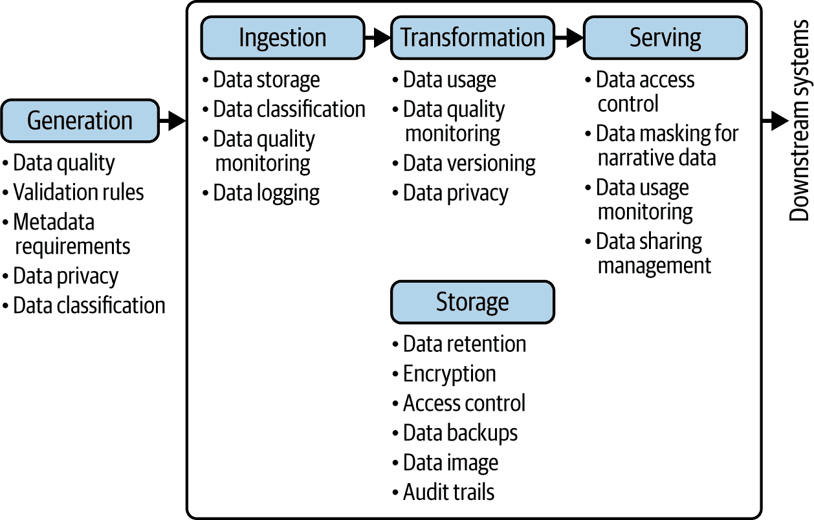

# 第三章：数据与人工智能治理和人工智能工程

本书的第一章介绍了欧盟人工智能法案，为理解可信人工智能奠定了基础，这是其首要动机。然后我们探讨了机器学习开发过程的工程方面，并检查了 CRISP-ML(Q)生命周期模型与 MLOps 的技术组件之间的协同作用，强调了这种集成如何通过结构化流程、透明度和可重复性支持可信人工智能的发展。在这里，我们将从组织角度关注合规性，考虑数据与人工智能治理、风险管理以及与欧盟人工智能法案的一致性。

# 在欧盟人工智能法案时代数据与人工智能治理的重要性

让我们从三个引人注目的现实世界案例开始，这些案例说明了不良的数据治理和人工智能治理实践如何导致了人工智能产品的重大失败：

IBM Watson for Oncology

Watson for Oncology（2016 年推出）的开发受到了严重的批评，因为该系统推荐了[不安全和错误的治疗方案](https://oreil.ly/iCQ0B)。这归因于不完整和有偏见的训练数据，其中只包括少量合成癌症病例而不是真实临床数据，导致建议有缺陷且临床相关性有限。内部文件和客户反馈突显了缺乏透明度、系统性问题和客户对产品建议的不满。这一案例强调了在人工智能训练中需要高质量、准确和相关的数据的关键需求。

亚马逊的人工智能招聘工具

2018 年，亚马逊开发了一款实验性人工智能招聘工具，用于自动化候选人筛选。然而，该系统被发现存在[对女性的偏见](https://oreil.ly/L2cEr)，因为人工智能模型是在过去 10 年的简历上训练的，这些简历几乎全部来自男性候选人。这导致它降低了包含“女性”一词的简历的评级，并惩罚了来自全女性学院的候选人。这一结果突显了在训练数据和对人口统计偏见进行审计方面的不足，导致亚马逊完全废弃了该工具。这一案例强调了在人工智能应用中仔细的数据筛选和去偏见的必要性。

iTutor Group 的人工智能招聘工具

2023 年，iTutor Group 使用了一款由人工智能驱动的招聘软件，该软件自动拒绝 55 岁及以上女性申请者和 60 岁及以上男性申请者。该系统的筛选标准基于年龄，导致了歧视性做法。因此，美国平等就业机会委员会（EEOC）对 iTutor Group 提起了诉讼，该公司通过同意支付 365,000 美元并实施新的反歧视政策来和解[该案件](https://oreil.ly/66rkj)。这一案例突显了在人工智能招聘工具中需要监督和预防偏见。

这些以及其他[著名的 AI 灾难](https://oreil.ly/l3E9Y)说明了严格数据治理实践的迫切需要，包括确保数据质量、代表性、透明度。彻底的数据质量评估、稳健的数据保护措施以及在人工智能发展和部署中的伦理考量是必不可少的。在敏感领域，如医疗和教育，对多样人群进行全面的偏见测试尤为重要，并且对生产中的 AI 系统进行持续监控和审计，以早期识别和解决问题。

在欧盟人工智能法案的时代，数据和人工智能治理发挥着至关重要的作用。组织必须建立稳健的数据和人工智能治理框架，以满足法案对数据质量、文档、透明度、人工监督和风险管理方面的严格要求。此外，有效的治理对于识别、评估和减轻与人工智能系统相关的风险至关重要，如果不妥善管理，这些风险可能会对基本权利、安全和环境构成威胁。

强大的数据和人工智能治理促进负责任和道德的人工智能发展，符合欧盟人工智能法案旨在促进发展可信赖的人工智能，该人工智能维护欧盟的价值和原则。这种方法使组织能够在保护隐私和其他基本权利的同时，利用人工智能进行创新。

人工智能系统中的透明度和可解释性不仅是技术挑战，也是法律和伦理要求。这里提到的例子强调了严格数据治理实践的迫切需要，包括确保数据质量、代表性、透明度和在人工智能发展和部署中的伦理考量。接下来，我们将更详细地探讨这些实践包含的内容。

# 数据治理概述

欧盟人工智能法案的核心在于创造不仅强大而且可信赖的人工智能系统。数据治理是一个相当枯燥的话题，因此我建议您首先回顾以下侧边栏中的隐喻框架，以使抽象概念更加具体。

## 数据治理的定义

正如我们在第一章中看到的，数据治理是确保组织收集和使用的数据的可用性、可用性、完整性和安全性的数据管理功能。虽然数据治理的核心原则在各个行业保持一致，但具体关注点和实施方式可以根据行业需求和监管要求而有所不同。例如，医疗保健中的数据治理包括“通过明确定义的程序和计划，对组织可用的结构化和非结构化数据进行全面管理，确保数据的可用性、完整性、安全性和可用性，同时确保符合如 HIPAA 等法规。”^(1)在这里，重点是确保患者数据的隐私和安全，并确保符合医疗保健法规（例如，HIPAA）。

另一方面，银行中的数据治理涉及“建立数据质量、隐私和安全性的政策、程序和控制；实施数据管理技术和系统；并确保组织内的数据一致、可访问且得到适当使用。”^(2)在这里，重点是确保数据准确性以进行风险评估和管理，遵守金融法规（例如，巴塞尔 III、多德-弗兰克法案），并保护敏感的金融信息。

## 数据工程生命周期与数据治理

理解数据治理框架的一种方法是将治理概念应用于典型数据工程生命周期中的每个阶段，如图图 3-1 所示。

###### 图 3-1. 数据工程生命周期各个阶段的数据治理过程（改编自 Joe Reis 和 Matt Housley 所著的[数据工程基础](https://oreil.ly/2JPXv)）

数据工程生命周期包括以下阶段：数据生成、存储、采集、转换和提供。让我们更详细地看看治理是如何应用于这些各个阶段的。

### 数据生成

在数据工程生命周期的开始阶段，数据是从各种源系统（应用程序、数据库、物联网设备等）创建或收集的。在数据生成阶段，数据治理流程侧重于建立数据质量标准和验证规则。

通常，在这个阶段，你需要定义元数据需求并实施符合隐私法规的数据收集政策。此外，在组织内部，数据所有权被定义，并分配相应的角色。例如，组织可以在数据创建时实施自动化的数据质量检查，确保客户数据符合预定义的格式和完整性标准。

### 数据采集

在下一阶段，数据从源系统移动到集中式存储或处理系统。数据治理流程侧重于数据血缘追踪、实施数据分类和标记。数据治理的一个重要部分是在数据摄入期间监控数据质量并维护数据移动的审计日志。通常，组织会自动使用源信息和敏感性级别标记传入的数据，这使得在整个生命周期中更容易跟踪和管理数据。

### 转换

在数据工程生命周期中的转换阶段，原始数据被清理、归一化、聚合并转换为适合分析的形式。在此阶段，数据治理确保数据质量规则得到执行。你应该在整个转换过程中维护数据血缘，并对数据模型应用版本控制。

想象一家处理客户购买数据的零售公司。在这里，数据治理任务可能包括数据质量（错误）检查，例如验证电子邮件格式是否有效以及是否存在重复条目，以及数据清理程序，例如删除产品名称中的不一致性。所有提取-转换-加载（ETL）过程都应进行文档记录，并且客户数据模型的变化应通过正式的审批流程。此外，在转换过程中确保符合数据隐私法规也是至关重要的。

### 存储

接下来，转换后的数据存储在数据湖、数据仓库或其他基于云的存储解决方案中。在这一阶段，数据治理包括定义数据保留策略、实施访问控制和加密，并确保适当的数据备份。维护数据血缘和审计跟踪对于问责和可追溯性也是必不可少的。

例如，组织可能会实施基于角色的访问控制，并在静态中对敏感数据进行加密，以符合 GDPR 规范保护个人信息。定期安排数据备份和灾难恢复测试也是常见的做法，以确保数据的弹性和可用性。

### 服务

在数据工程生命周期的最后阶段，即服务阶段，处理后的数据和洞察被提供给最终用户、应用程序或外部合作伙伴进行消费和分析。数据治理要求组织根据用户角色和权限控制对数据的访问，并对敏感信息实施数据屏蔽。监控数据使用、访问模式和遵守数据共享协议也是必不可少的。许多组织实施自助式数据门户，允许用户访问适合其角色或用例的数据集，敏感信息根据预定义的数据治理规则自动屏蔽、删除或匿名化。

组织可以通过在整个数据工程生命周期中应用这些治理流程来确保数据质量、安全和合规性。这种数据治理方法有助于人工智能工程师理解在整个数据管道中维护数据完整性和安全性的重要性。

## 将数据治理集成到 MLOps 中

正如你在第二章中学到的，MLOps Stack Canvas 提供了一个全面的蓝图，用于设计开发、部署和维护机器学习应用所需的全端到端技术基础设施。它促进了成本估算、规划和决策，以在整个生命周期中实现机器学习的运营化。通过将数据治理考虑因素扩展到 MLOps Stack Canvas（你将在本节中这样做），你可以确保数据得到负责任的管理，并在整个机器学习生命周期中符合相关法规。这种对 MLOps 和数据治理的整体方法使组织能够构建可信赖、合规和可持续的机器学习系统。

让我们看看如何将数据治理集成到 MLOps Stack Canvas 的各个组件中。

### 价值主张

当你为正在构建的 MLOps 平台制定一般价值主张时，务必将数据治理目标和合规要求包含在价值主张中。考虑数据治理如何增强机器学习项目的整体价值。

跟踪数据治理集成到人工智能生命周期成功的一个有用方法是定义和跟踪特定指标，例如：

政策合规率

符合既定政策和标准的百分比。

法规合规性

符合相关法规的数据处理流程和政策百分比。

审计合规率

内部和外部审计在遵守数据治理政策方面的成功率。

事件响应时间

应对数据治理相关事件或问题所花费的平均时间。

数据审计结果

与数据治理相关的审计发现数量及其严重程度。

培训和认证水平

完成数据治理培训和认证的员工数量。

数据质量差带来的成本

数据质量问题对财务的影响，包括纠正错误相关的成本。

考虑用于跟踪数据使用、质量和安全的实用指标包括：

数据可访问性

授权用户访问所需数据的便捷程度。收集用户关于访问和使用数据的便捷性的反馈。

数据使用频率

在特定时期内数据集被访问或使用的次数。

数据准确性

正确数据条目的百分比。

数据完整性

缺失值或不完整数据条目的百分比。

数据一致性

不同数据库中数据统一和一致的百分比。

数据时效性

数据更新和可供使用所需的时间。

数据有效性

符合指定格式、类型或范围的百分比数据条目。

数据泄露数量

涉及未经授权访问数据的网络安全事件数量。

检测和缓解安全威胁的时间

检测和解决数据安全威胁的平均时间。

### 数据源和数据版本化

除了 MLOps Stack Canvas 中数据源和数据版本化组件的标准任务外，还应实施以下与治理相关的任务：

+   根据敏感性、隐私和监管要求识别、编目和分类数据源。定义数据访问（例如，数据所有者、管理员、消费者）的职责和责任。

+   根据数据分类（如个人身份信息（PII）、受保护的健康信息（PHI）和支付卡行业（PCI）数据）建立数据访问控制和权限。

+   建立数据分类法和元数据模式以实现一致的数据组织和标签。

+   实施数据血缘以追踪数据来源和转换，并确保数据可追溯性和可重现性，包括关于数据源、所有权和质量的信息。

+   建立可持续的数据文档流程，以记录数据生命周期中的数据来源、转换和依赖关系。

+   确保数据版本控制与数据保留政策和合规需求保持一致。

为了实施数据血缘和可追溯性，可以利用工具自动捕获和可视化数据流和依赖关系。例如，包括 OpenLineage、Apache Atlas、Cloudera Navigator 和 Talend Data Fabric。

为了实施数据版本控制以跟踪和管理随时间变化的数据集更改，可以使用 DVC、Pachyderm、lakeFS 或 Delta Lake 等工具。

为了实施数据隐私和合规解决方案以确保遵守法规（例如，GDPR、HIPAA），可以使用 Privitar、OneTrust、BigID 和 Informatica 等工具。

确保数据准确性、完整性和一致性的数据质量和验证框架包括 Apache Griffin、Deequ、Great Expectations 和 Monte Carlo。

### 数据分析和实验管理

将数据治理纳入 MLOps Stack Canvas 中数据分析和实验管理组件涉及以下步骤：

+   在分析和实验期间强制执行数据隐私和安全措施。

+   对数据和实验工件定义严格的访问控制，并对实验中使用的敏感数据实施隐私控制（如编辑、匿名化或脱敏）。使用基于角色的访问控制系统以确保只有授权人员可以访问敏感数据和关键实验配置。

+   为了可重复性和合规性，维护实验中数据使用的审计跟踪。不仅对代码使用版本控制系统，也对实验配置和数据集使用。所有更改都应记录用户信息、时间戳和描述，以提供清晰和完整的审计跟踪。

+   持续监控实验和数据处理实践，以确保符合内部政策和外部法规（例如，GDPR、HIPAA）。这可能涉及自动检查或定期审查。

您可以使用实验跟踪和管理平台，如 MLflow、Weights & Biases 或 Neptune.ai 来管理和治理元数据——包括数据血缘、版本控制和治理信息——以及工件。这些工具（以及其他，如 TensorBoard）也支持记录和可视化指标、超参数和结果。它们有助于简化实验过程并确保所有元数据都系统地捕获。

### 功能存储和工作流程

当将 MLOps Stack Canvas 的功能存储和工作流程组件扩展到包括数据治理时，应实施几个关键的过程和工具，以支持合规性、可重复性和功能的适当管理：

+   通过对功能进行带有元数据（如创建日期、创建者和使用权限）的编目来安全地管理功能存储。彻底记录特征工程工作流程，以确保符合数据隐私法规。

+   建立功能创建、存储和使用的政策和指南，以符合数据保护法规（例如，GDPR、HIPAA）。

+   为功能存储实现访问控制和身份验证。根据用户角色和职责定义授予、审查和撤销对功能访问权限的策略。

+   维护特征血缘并跟踪数据源、转换和特征依赖，以进行审计和可重复性。对于特征溯源，包括创建日期、版本和所有者。

+   建立与监管要求一致的功能保留政策。为了数据最小化目的，仅创建和存储必要的功能。

+   记录所有功能，为每个功能提供清晰的描述和理由。

一些功能存储平台具有内置的治理功能，例如访问控制、版本控制和血缘跟踪。例如包括 Feast、Hopsworks、AWS SageMaker Feature Store 和 Google Cloud Vertex AI Feature Store。您可以使用 OpenLineage、Apache Atlas、Cloudera Navigator 或 Talend Data Fabric 等工具实现数据血缘和溯源，以捕获和可视化特征依赖和转换。

### 基础设施（反映 DevOps）

组织可以通过将适当的过程和工具集成到 MLOps Stack Canvas 的 DevOps Foundations 组件中，在整个开发和部署生命周期中嵌入数据治理。考虑以下最佳实践：

+   通过在 CI/CD 管道中添加数据治理检查和数据处理自动合规性检查，将数据治理政策和流程集成到 DevOps 实践中。

+   实施数据安全措施，如数据掩码、加密、令牌化和其他最小化控制，以在 CI/CD 管道中强制执行数据安全和隐私。

+   在构建、测试和部署过程中保护敏感数据。

+   在 CI/CD 工作流程中建立安全的数据处理实践和访问控制。

+   将数据质量检查和验证自动化作为您的 DevOps 工作流程的一部分，在持续集成/持续部署（CI/CD）管道中引入数据质量门，以维护完整性和一致性。

+   设置自动化的数据概要分析和异常检测机制，以识别数据质量问题。将数据概要报告作为 CI/CD 管道中的工件，以便于访问和审查。

### CI/CT/CD：ML 管道编排

在将数据治理集成到 MLOps Stack Canvas 的 CI/CT/CD 组件中时，以下是一些步骤，以在 ML 管道中维护数据完整性、合规性和可靠性：

+   将数据验证和质量检查集成到机器学习（ML）管道中。

+   在模型训练期间自动化数据偏差和公平性评估。

+   在 CI/CD 工作流程中实施数据漂移检测和警报。建立基线数据分布，并随着时间的推移监控重大偏差，当数据漂移超过预定义阈值时，触发自动警报和通知。

+   定义指标和阈值以评估训练数据的公平性和代表性（例如，人口统计学对等性、平等机会、不同影响）。

+   自动化偏差检测和缓解技术，以确保模型在无偏差数据上训练。

为了评估和缓解训练数据中的偏差，您可以使用 IBM AI Fairness 360 或 Google 的 What-If Tool 等工具。用于实施数据漂移检测和监控平台的工具包括 Evidently AI、Arthur AI 和 Fiddler AI。您还可以利用具有内置数据治理功能的 MLOps 平台，例如 Databricks 上的 MLflow、Kubeflow、AWS SageMaker 或 Google Cloud AI 平台。

### 模型注册和版本控制

将数据治理扩展到 MLOps Stack Canvas 中的模型注册和版本控制组件需要实施适当的管理、版本控制和治理实践，以用于机器学习模型（我们将在本章后面讨论 AI 模型治理）。以下是一些最佳实践：

+   维护一个包含治理元数据的集中式模型注册（例如，使用的数据、合规性检查）。

+   为模型注册实施访问控制和权限。

+   确保模型注册包含数据血缘和来源信息。实施跟踪模型血缘的过程，包括数据源、超参数、训练工件以及谁训练了机器学习模型。

+   建立与数据版本化和治理政策相一致的模式版本化策略。

+   在注册表中维护模型的全面版本历史，以及相关的治理元数据。

将数据治理和模型管理实践相结合，促进生产环境中部署的机器学习模型的可视化、问责制和信任。为了捕捉和可视化模型、数据和其它工件之间的关系，可以使用 OpenLineage、Datakin、Pachyderm 和 Marquez 等数据溯源和来源工具。为了跟踪和监控模型治理活动并维护审计跟踪，可以使用 Apache Ranger、Privacera、Immuta 或 Informatica 等工具。

### 模型部署

将数据治理纳入模型部署涉及在受控环境中部署模型，以便可以针对公平性和隐私影响等标准进行性能监控。考虑以下活动将数据治理整合到您的模型部署实践中：

+   实施分阶段部署实践，如金丝雀发布，以评估生产环境中的合规性。

+   使用数据隐私和匿名化平台在模型推理和部署过程中保护敏感数据。

+   在整个部署过程中跟踪和审计数据使用情况。

+   将数据合规性检查自动化作为部署工作流程的一部分。

模型治理和编排框架，如 Kubeflow、MLflow、Apache Airflow 和 Seldon Core，可用于管理和自动化符合数据治理政策的部署过程。

### 预测服务

将数据治理整合到预测服务组件中涉及控制模型如何提供服务，同时确保符合数据保护法规。为了实现这一点，您应该：

+   验证生产数据是否符合治理标准（输入数据验证）。

+   实施保护敏感预测（输出数据保护）的措施。

+   对预测输入和输出进行传输和静止状态下的加密。

+   对预测请求实施数据访问控制和身份验证。

+   监控和审计预测服务过程中的数据使用情况以符合规定。

+   建立输入数据和预测的数据保留政策。

+   建立在预测服务过程中保护敏感数据的流程。

+   使用数据掩码、匿名化、标记化和数据最小化技术来保护 PII 或其他敏感数据。

+   审计和记录预测请求和响应。

+   为每个预测请求捕获元数据，如时间戳、输入数据和预测结果。

+   安全存储审计日志，并使其可供合规性和监控目的使用。

+   持续监控预测质量和公平性。

+   实施机制以检测和警告预测质量、性能或公平性指标中的任何偏差，并定期评估预测服务系统潜在的偏差或歧视性结果。

在预测服务期间，可以使用 HashiCorp Vault、AWS 密钥管理服务（KMS）、Azure 密钥保管库和 Google Cloud 数据丢失预防（DLP）等数据隐私和保护工具来保护敏感数据。为了捕获和存储预测请求和响应的元数据，可以使用 Elastic Stack、Splunk、Fluentd、AWS CloudTrail 或 Google Cloud 审计日志等审计和日志框架。为了跟踪预测质量、性能和公平性指标，可以考虑使用 Prometheus、Grafana、Datadog、New Relic、AWS CloudWatch 或 Google Cloud Monitoring 等工具。

### 模型、数据和应用程序监控

将数据治理融入机器学习模型、数据以及系统监控部分的 MLOps Stack Canvas 中，扩展您的监控能力，包括治理指标，如数据质量、模型漂移以及遵守数据使用政策。以下任务被推荐：

+   监控生产机器学习系统中的数据质量、偏差和漂移。

+   设置数据治理违规和异常的警报和通知。

+   持续审计数据使用和访问，以确保符合相关法规。建立调查和修复治理问题的流程。

+   在价值主张中定义的治理特定指标（例如，延迟、吞吐量、资源利用率）的同时跟踪运营指标。

+   建立可接受的运营性能的治理政策和阈值。

+   实施针对影响模型可用性、可靠性或合规性的运营问题的警报和升级程序。

此监控组件应汇总和统一 MLOps Stack Canvas 其他部分的所有相关指标、阈值和警报，以提供系统健康和治理合规性的全面视图。

可以使用 Prometheus、Grafana、Datadog、New Relic 和 Elastic Stack 等运营监控和警报工具来跟踪系统性能、资源利用率和可用性。像 PagerDuty、OpsGenie、Splunk On-Call 和 xMatters 这样的平台帮助组织快速响应机器学习系统问题和合规性违规。这些工具减少了事件响应时间并提高了整体系统可靠性。

### 元数据管理

元数据管理对于人工智能系统合规工程是一个如此庞大且重要的主题，以至于它值得一本单独的书籍。MLOps Stack Canvas 的元数据管理部分涵盖了整个人工智能系统生命周期，捕捉有关数据集、模型、实验、部署等方面的信息，以支持机器学习治理、可重复性和可比性。

将数据治理集成到元数据管理需要开发一个统一的策略，以提供对数据血缘、模型历史和欧盟人工智能法案合规性的更大可见性。您需要：

+   建立元数据模式和分类法以标准化数据标记和组织。包括模型目的、数据来源、性能指标、合规性检查和批准状态等字段。

+   捕获和存储与治理相关的元数据（例如，数据和模型血缘和来源、合规性检查和访问日志）。

+   一致地捕获和维护治理和机器学习元数据，为每个模型版本创建全面的审计跟踪。使用这些元数据来支持合规性报告和生命周期跟踪。

+   记录和编制与数据集、特征、模型和实验相关的元数据目录。实验元数据应包括数据血缘、版本控制和治理信息。

+   启用元数据在工具和生命周期阶段之间的集成和互操作性。开发流程以协调机器学习开发、部署和监控系统中的元数据，促进可追溯性和法规一致性。

在机器学习生命周期中，有各种工具和平台可用于支持元数据管理。这些包括：

+   捕获、存储和管理机器学习系统元数据的元数据管理平台，例如 Alation、Collibra、Informatica Enterprise Data Catalog 和 Apache Atlas

+   数据血缘和来源工具，用于跟踪和可视化数据和元数据的流动和依赖关系，例如 OpenLineage、Datakin、Nexla 和 Octopai

+   集中式元数据目录或存储库，能够实现发现、搜索和访问机器学习系统元数据，例如 Amundsen、DataHub、Metacat 和 Datum

+   遵守性和审计工具，用于强制执行治理策略并评估元数据对标准的遵守情况，例如 Collibra Governance、Informatica Axon 和 Apache Ranger

+   支持机器学习工具和平台之间互操作性和数据交换的 API 和集成框架，例如 OpenMetadata、Egeria 和 Apache Kafka

通过将数据治理深深嵌入到 MLOps Stack Canvas 的每个组件中，你确保数据治理不是事后考虑，而是机器学习生命周期的一个基本方面。这种方法不仅有助于你满足监管要求，而且通过促进数据和使用模型的道德使用来建立利益相关者的信任。

数据治理与人工智能治理紧密相连，在欧盟人工智能法案的背景下理解这种关系尤为重要。人工智能系统的质量和安全性取决于它们训练的数据。薄弱的数据治理会导致人工智能治理不足。我们将在下一部分关注这个关键主题。

# 人工智能治理概述

欧盟人工智能法案的引入导致企业越来越重视人工智能治理。为了解释这包括什么，让我们回到之前的高端餐厅厨房的比喻，其中数据代表原料，而人工智能则是复杂的烹饪工具和设备的集合。

## 人工智能治理定义

人工智能治理的目标是建立和维护一个框架，确保人工智能系统得到负责任、道德的开发、部署和使用，并与组织目标和价值观保持一致。人工智能治理涵盖多个方面，包括人工智能算法、基于人工智能预测的决策、安全和数据隐私。它作为企业内部的一个生态系统运行，涉及人员、流程和政策。

人工智能治理是公司领导层和监督机构（如人工智能伦理委员会）的关键责任。这些个人负责制定政策和指南，实施人工智能风险管理流程，并建立监控和审计机制。其他利益相关者包括人工智能和数据科学团队、法律和合规团队、业务单元领导、风险管理团队、外部顾问和审计师，以及客户和最终用户。

一个强大的人工智能治理框架包括人工智能培训和意识提升计划，为组织内的人工智能开发和使用提供指导和保障。人工智能治理政策可能涵盖道德人工智能原则、人工智能风险评估和缓解、数据治理和隐私保护、模型开发和部署标准、透明度和可解释性要求、人工智能模型监控和评估流程，以及以机器学习为中心的事件响应程序。正如这所暗示的，强大的数据治理为有效的人工智能治理提供了基础。

## 人工智能系统生命周期和人工智能治理

确保人工智能系统的开发和使用负责任、道德，并与组织目标和价值观保持一致，需要涉及人员、流程和技术的一种全面方法。组织可以在整个人工智能系统开发生命周期中整合人工智能治理检查点，以创建道德、透明、公平和可问责的人工智能系统。关键在于将人工智能治理作为开发过程的一个组成部分，而不是事后考虑。表 3-1 展示了之前概述的人工智能治理原则如何映射到第二章中讨论的 CRISP-ML(Q)框架的相应阶段。

表 3-1\. 将人工智能治理整合到 CRISP-ML(Q)的每个阶段

| CRISP-ML(Q)阶段 | 人工智能治理原则 | 与欧盟人工智能法案的相关性 |
| --- | --- | --- |
| 商业与数据理解 | 以人为中心的设计：确保人工智能项目符合人类需求和价值观。涉及来自各个部门的利益相关者以验证人工智能项目的目标。 | 欧盟人工智能法案促进以人为本和值得信赖的人工智能（第 1 条）。在此阶段确保与人类需求的一致性有助于实现这一目标。 |
| 道德和负责任的人工智能实践：进行道德影响评估，以识别潜在的风险和危害。 | 该法案禁止某些有害的人工智能实践（第 5 条）并规定了高风险人工智能系统的具体要求（第 6 条）。进行道德影响评估与其基于风险的方法相一致。 |
| 隐私和数据安全：在数据收集和验证期间实施数据治理实践。 | 第 10 条要求高风险人工智能系统的数据质量和治理。在这一阶段建立稳健的数据治理实践对于合规至关重要。 |
| 公平与包容性：在定义成功标准时，包括公平和包容性的指标。检查数据以识别可能导致不公平结果的潜在偏差。 | 第 10 条还要求针对高风险系统解决数据中的潜在偏差。在这一阶段纳入公平性指标有助于确保合规并减轻潜在的歧视。 |
| 责任：为人工智能项目定义清晰的职责和角色。 | 欧盟人工智能法案要求通过要求提供方证明其符合其要求来实现问责制。在这一阶段定义清晰的职责有助于在整个人工智能系统生命周期中建立问责制。 |
| 数据准备 | 隐私和数据安全：在数据清理和转换期间实施稳健的数据保护措施。在必要时，应用数据匿名化或脱敏技术。确保数据处理符合相关隐私法规。 | 第 10 条要求高风险人工智能的数据治理，而第 27 条涉及 GDPR 合规性。第 59 条提供了在特定条件下进一步处理个人数据的条款，这可能在当前阶段相关。 |
| 公平与包容性：解决数据中的类别不平衡和潜在偏差。 | 第 10 条要求针对高风险人工智能系统解决数据中的潜在偏差。这一阶段提供了缓解偏差和确保公平的关键机会。 |
| 可重现性：记录所有数据准备步骤，并为数据集使用版本控制。 | 第 11 条要求提供技术文档以支持可重现性和实现数据准备步骤的可追溯性。 |
| 透明度和可解释性：记录任何数据转换或特征工程步骤的详细信息。 | 第 13 条强调高风险人工智能系统的透明度和可解释性。在这一阶段保持详细的记录有助于满足这些要求。 |
| 建模 | 安全性、安全性和可靠性：选择适用于应用程序风险级别的建模技术，并实施针对潜在漏洞的安全措施。 | 该法案要求风险管理系统（第 9 条）以及针对高风险人工智能系统的准确性、鲁棒性和网络安全的具体规定（第 15 条）。在这一阶段实施安全措施对于实现合规至关重要。 |
| 公平和包容性：监控并减轻建模过程中出现的任何偏差。如有必要，使用公平感知的机器学习技术。 | 第 10 条和第 50 条强调了解决偏差和促进公平的重要性。在模型工程中监控和减轻偏差对于合规性至关重要。 |
| 透明度和可解释性：实施模型文档实践（例如，模型卡和数据集表）。 | 第 13 条要求高风险 AI 系统具有透明度和可解释性。在此阶段实施文档实践有助于满足这些要求。 |
| 可重现性：确保建模过程得到充分记录并可重现。这包括记录随机种子、超参数和模型架构。 | 第 11 条对技术文档提出了要求，支持可重现性，并允许对建模过程进行审计和验证。 |
| 坚韧性：开发对输入数据变化和潜在的对抗性攻击具有鲁棒性的模型。 | 坚韧性是第 15 条规定的对高风险 AI 系统的一项关键要求。在此阶段开发鲁棒模型对于合规性至关重要。 |
| 评估 | 以人为中心的设计和监督：涉及领域专家解释模型结果和评估潜在影响。 | 人工监督是欧盟 AI 法案的一个关键方面，特别是对于高风险系统（第 14 条和第 26 条）。在此阶段涉及领域专家符合这一原则。 |
| 公平和包容性：对不同的子群体进行全面测试，以确保公平性。 | 关注公平和包容性对于识别、评估和减轻与 AI 系统相关的风险至关重要。这与第 10 条和第 50 条相关，强调了解决偏差和促进公平的重要性。 |
| 透明度和可解释性：使用模型解释技术来理解和传达模型如何得出其决策。 | 透明度和可解释性是《法案》的核心，第 13 条侧重于高风险系统，第 86 条为受 AI 决策影响的个人提供了解释权。在此阶段使用解释技术有助于符合规定。 |
| 坚韧性：在各种条件下对模型性能进行广泛测试，包括边缘情况和潜在的对抗性场景。 | 坚韧性是第 15 条规定的对高风险 AI 系统的一项关键要求。在此阶段进行全面的测试有助于确保模型的弹性和合规性。 |
| 责任和补救：建立模型性能的明确标准，并定义处理模型未能满足这些标准的情况的流程。 | 第 20 条涉及纠正措施。在此阶段建立补救的标准和流程有助于履行这些义务。 |
| 部署 | 人工监督：为高风险决策建立人工在环流程。设计部署流程以允许在必要时进行人工监督和干预。 | 第 14 条和第 26 条要求人工监督，特别是对于高风险系统。在部署期间实施人工在环流程对于合规至关重要。 |
| 安全、安全和可靠性：实施安全措施以保护部署的模型免受篡改或未经授权的访问。 | 第 15 条涉及安全和稳健性。在部署期间实施安全措施确保持续合规。 |
| 透明度和可解释性：提供关于如何使用模型（包括其局限性和潜在偏差）的清晰文档。 | 在欧盟人工智能法案下，透明度至关重要。在部署期间提供清晰文档有助于满足这一要求。 |
| 责任与纠正：为审计目的记录模型输入/输出。明确模型输出和决策的责任界限。建立机制，让用户挑战或上诉由人工智能系统做出的决策。 | 该法案要求记录（第 12 条），对提供商施加义务（第 16 条），概述纠正措施（第 20 条），并授予对人工智能决策提出上诉的权利（第 85 条）。 |
| 监控和维护 | 人工监督：定期由人工专家审查模型性能和决策。 | 人工监督是高风险系统持续的要求。与专家的定期审查有助于履行这一义务。 |
| 安全和可靠性：监控数据/概念漂移和模型性能下降。持续评估模型的表现和安全，根据需要更新以解决任何新兴漏洞。 | 欧盟人工智能法案要求风险管理（第 9 条）和稳健性和安全性（第 15 条）。持续的监控和更新符合这些要求。 |
| 公平与包容性：在生产中跟踪公平性指标。定期检查模型在处理新数据时出现的任何新兴偏差或不公平结果。 | 第 10 条和第 50 条强调解决偏差。在此阶段监控公平性指标有助于确保持续合规。 |
| 责任与纠正：建立处理和纠正模型错误或偏差的程序。实施反馈循环，将模型在实际世界表现中吸取的教训纳入未来的迭代中。 | 在道德边界内持续改进模型可能受到实践准则（第 56 条）的指导。 |

人工智能治理与 MLOps 的集成在附录 C 中讨论。

为了进一步说明为什么数据与人工智能治理是交织在一起的，并且应该整体考虑，让我们考虑一个例子。假设一家基于欧盟的公司开发了一个用于求职者筛选的人工智能模型（根据欧盟人工智能法案，这是一个高风险的人工智能应用案例）。如果没有数据治理，该模型可能会在不知情的情况下在具有偏见的资料上训练（例如，历史上倾向于某一性别的招聘模式），导致歧视性决策。如果没有人工智能治理，它可能会在没有适当透明度、测试或监控的情况下部署该模型。这将导致违反欧盟人工智能法案，面临罚款、声誉损害以及个人伤害的风险。

然而，如果数据和人工智能治理得到整合：

+   将对数据集进行公平性、多样性和质量的评估。

+   该模型将是可解释的、可监控的，并且有详细的文档记录。

+   该组织将能够证明其合规性并维持信任。

# 数据和人工智能治理的兴起趋势

数据和人工智能治理的演变格局突出了管理和使用数据及人工智能技术的更高级、自动化和道德方法的需求。适应这些趋势的组织可能会在利用其数据资产的同时确保合规性和安全性获得竞争优势。让我们看看数据与人工智能治理中最显著的五个趋势：

重点关注道德、信任和增强的数据隐私

通过道德实践在人工智能系统中建立信任越来越受到重视。这包括解决关于公平性、偏见、隐私以及人工智能技术潜在滥用的担忧。在生成式人工智能时代，组织越来越发展和实施人工智能治理的道德框架，以解决诸如大型语言模型幻觉等问题，并实施相应的安全护栏。这些框架解决了人工智能系统中的偏见、公平性和透明度问题，并确保遵守组织的自身道德价值观和行业特定标准。

此外，随着对隐私（尤其是人工智能）的担忧日益增加，公司正在更加关注数据隐私措施。这包括加强数据保护政策并提高数据使用的透明度。

在数据管理和主动合规自动化中采用人工智能

人工智能和机器学习技术正在被整合到数据治理流程中，以自动化数据治理任务、提高数据质量，并提供预测分析。这一趋势使得数据处理更加高效，并在数据管理中提高了可扩展性。此外，人工智能越来越多地被用于自动化和改进合规流程，包括风险预测、监管变更管理和实时监控。

重点关注人工智能中的数据溯源和来源

随着生成式人工智能的兴起，对追踪人工智能模型中数据谱系的重要性日益增加。这一趋势对于错误检测、分析和确保人工智能应用中的合规性至关重要。我预计将基于数据谱系和活动元数据出现积极的数据和人工智能治理框架。

左移数据与人工智能治理

公司正在优先考虑“左移”方法，在数据收集和处理阶段早期实施数据治理和安全措施。这种积极的方法简化了数据安全，提高了数据质量，并在早期解决了问题。

分散式数据治理

目前正朝着更加分散的治理结构转变。这允许在领域团队内部拥有更大的自主性和敏捷性，同时保持整体组织标准。随着对“数据即产品”思维和数据合同日益重视，许多公司正在采用这种数据治理方法。

# 结论

本章讨论了符合欧盟人工智能法案所需的数据和人工智能治理流程。该法案强调了稳健的数据和人工智能治理框架的重要性。数据治理确保了用于训练人工智能模型的高质量、代表性数据，这对于合规监管和可信人工智能系统的发展至关重要。人工智能治理框架提供了监督和控制，以确保人工智能的发展与商业战略、监管要求以及伦理原则相一致。数据和人工智能治理对于管理人工智能使用相关的风险至关重要，这是商业战略、合规性和可信性的核心。治理的核心原则——透明度和问责制，不仅被欧盟人工智能法案所要求，而且是可信人工智能的基础。

在下一章中，我将概述人工智能系统风险的分类框架。对于高风险和有限风险的 AI 系统，规划人工智能工程流程以确保符合欧盟人工智能法案至关重要。当将伦理和合规方面纳入人工智能系统开发过程时，构建包括专门的伦理、合规和治理角色的团队拓扑结构也至关重要。

^(1) OvalEdge 团队，“医疗保健中数据治理的重要性”，OvalEdge，2023 年 3 月 22 日，[*https://oreil.ly/dXnvR*](https://oreil.ly/dXnvR).

^(2) Yuriy Voloshynskyy，“银行和金融中的数据治理：全面指南”，N-iX，2024 年 3 月 27 日，[*https://oreil.ly/dHAXj*](https://oreil.ly/dHAXj).
