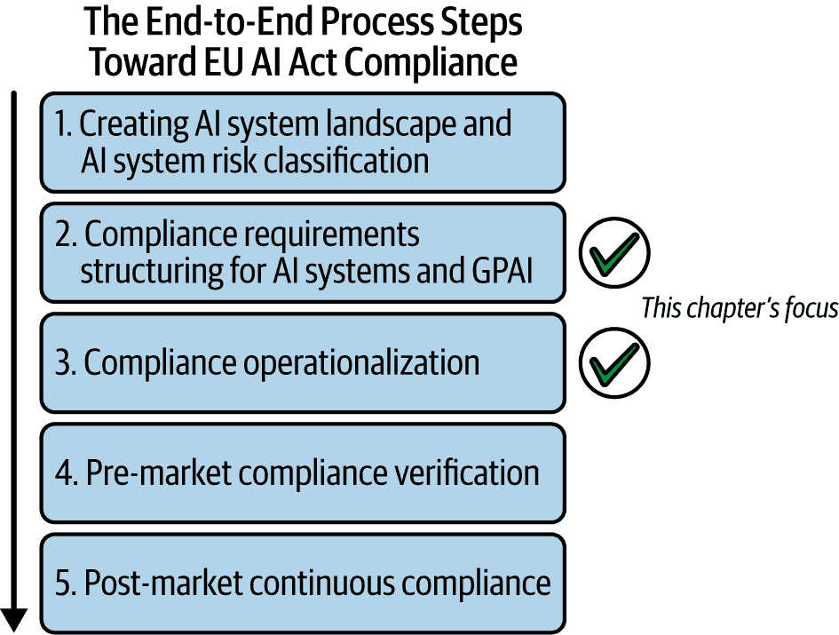
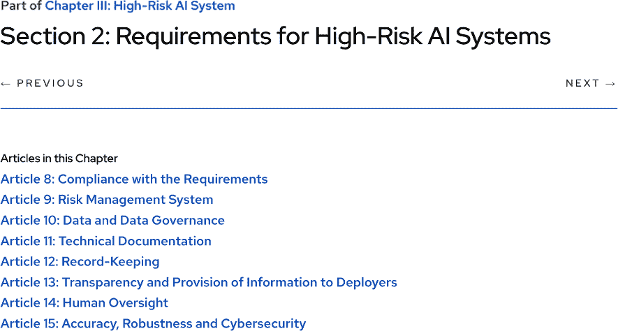

# 第五章\. 高风险 AI 系统的 AI 工程

本章探讨了高风险 AI 系统的全面要求，以及如何通过实施 AI 工程实践来积极满足这些要求，以确保符合欧盟 AI 法案（参见图 5-1 以了解迈向合规性的步骤）。在前一章中，我介绍了合规性的基础步骤：创建当前和计划中的 AI 系统清单，确定每个系统的风险类别，并确定您的组织是否作为这些系统的提供者或部署者。这些步骤对于理解哪些系统属于高风险类别以及需要解决哪些合规性义务至关重要。

###### 图 5-1\. 本章重点讨论高风险 AI 系统的要求和此类系统的合规性实施。参见第一章以了解迈向欧盟 AI 法案合规性的端到端流程步骤。

本章需要考虑的两个指导问题是：

+   为了遵守欧盟 AI 法案，高风险 AI 系统必须满足哪些要求？

+   为了遵守欧盟 AI 法案，需要建立哪些流程、结构和 AI 工程实践？

让我们从探讨高风险 AI 系统的要求开始，将它们转化为 AI 工程实践，并以此定义欧盟 AI 法案的 AI 工程概念。

###### 警告

如前所述，作者并非律师，本书不提供法律建议。法律与人工智能的交叉是一个复杂主题，需要超越人工智能、数据科学和机器学习范畴的专业知识。围绕 AI 系统的法律考量可能复杂且影响深远。如果您对正在工作的 AI 系统有任何法律疑问，请寻求该领域合格专家的专业法律建议。

# 欧盟 AI 法案的 AI 工程

欧盟 AI 法案规范了在欧洲联盟内部 AI 系统的开发、部署和使用。它旨在通过降低风险和保护基本权利来促进可信赖的 AI。如图 5-2 所示，第 9 至 15 条为高风险 AI 系统的提供者提供了要求。然而，这些条款并未提供实施合规性的技术指导。

本章提出了一种通过将法案条款与论文“Navigating the EU AI Act: A Methodological Approach to Compliance for Safety-Critical Products”中概述的安全关键人工智能系统质量模型对齐，以符合欧盟人工智能法案的技术实施方法。该论文由 Jessica Kelly 等人于 2024 年 IEEE 人工智能会议（CAI）上提出。作者提出了一种扩展的产品质量模型，借鉴了如 ISO/IEC 25059 等既定标准。这个增强模型包括与欧盟人工智能法案相关的额外属性，例如道德完整性、人类监督和公平性。

###### 图 5-2\. 高风险人工智能系统的欧盟人工智能法案要求（来源：[*https://oreil.ly/7h6xE*](https://oreil.ly/7h6xE))

将欧盟人工智能法案的要求映射到人工智能系统的质量属性是一种有益的方法，原因包括：

监管要求的操作化

欧盟人工智能法案提供了高级别的监管指南，这些指南可能比较抽象，直接实施起来具有挑战性。通过将这些要求映射到特定的质量属性，我们创建了一个更具体、可操作的实施框架。这有助于将法律语言转化为工程师和数据科学家可以工作的技术规范。

与现有实践的整合

质量属性是软件和系统工程中确立的概念。将欧盟人工智能法案的要求映射到这些属性有助于将监管合规整合到现有的开发过程和质量保证实践中。这使得组织可以利用熟悉的工具、方法和指标。

与标准的对齐

许多质量属性由国际标准定义（例如，ISO/IEC 25010）。将欧盟人工智能法案的要求映射到这些属性有助于将监管合规与既定标准对齐，可能简化整体合规努力。

简而言之，将欧盟人工智能法案条款映射到质量属性提供了实现合规的技术指导。图 5-3 提供了这种映射的高级概述。

###### 图 5-3\. 欧盟人工智能法案要求映射到人工智能系统质量属性

## 目标

在我们讨论方法之前，让我们探讨一下欧盟人工智能法案所涉及的 AI 工程。这个多学科领域专注于设计、开发、部署和维护完全符合法案要求的人工智能系统。它结合了 AI 技术、软件工程、数据科学、法律和伦理方面的专业知识，以实现以下目标：

+   实施技术措施以确保符合法案的要求，包括风险评估、透明度、人类监督和稳健性。

+   开发在 AI 系统生命周期内进行持续监控和审计的方法。

+   创建文档和可追溯性机制，以证明合规并便于监管检查。

+   集成符合欧盟数据保护法律的隐私增强技术和数据治理实践。

+   设计用户界面和操作协议，以实现有效的人类监督和干预。

+   与法律和政策专家合作，解释和应用于不同应用领域的不断发展的 AI 规范。

## 与 CRISP-ML(Q) 阶段的一致性

为了建立有效的工程流程，我们将安全关键型（即高风险）人工智能系统的质量属性与第二章中介绍的 CRISP-ML(Q) 开发过程模型的阶段相一致。第二章。

CRISP-ML(Q) 的一个核心原则是将质量保证实践整合到机器学习生命周期的每个阶段。这包括定义系统需求、识别潜在风险，并根据既定的最佳实践应用风险缓解策略。因此，该模型为整合对安全关键型人工智能系统至关重要的质量属性提供了一个合适的框架。如前所述，这些属性可以直接映射到监管要求，例如欧盟人工智能法案中定义的要求。在整个开发生命周期中解决这些问题支持了 *持续合规*，而不是将合规视为一次性任务。

如您所知，CRISP-ML(Q) 定义了 ML 开发过程中的六个关键阶段：业务和数据理解、数据准备、建模、评估、部署以及监控和维护。它是一个迭代框架，其中每个阶段都包含特定的任务（如数据集清理或模型训练）和输出（如数据集或模型工件）。许多质量属性直接与潜在风险相关。通过在每个开发阶段考虑这些属性，您可以在变更成本较低且更容易实施时早期识别和解决风险。在本章中，我将 CRISP-ML(Q) 阶段与与欧盟人工智能法案要求相关的质量属性相一致，以建立支持稳健实施和持续合规的 AI 工程最佳实践。

# 实现合规的 AI 工程实践

欧盟人工智能法案中对高风险 AI 系统提供者的要求分散在几个条文中。为了您的方便，我已将它们在此作为浓缩的行动要点列出：

+   建立覆盖整个 AI 系统生命周期的风险管理系统。

+   通过验证和测试数据集，确保其与系统预期目的的相关性、代表性和准确性，以实现强大的数据治理。

+   创建全面的技术文档以证明合规性，并为评估机构提供必要的评估信息。

+   在人工智能系统中启用自动日志记录功能，以跟踪其整个生命周期中的严重事件和重大修改。

+   为下游部署者提供详细的说明以支持合规性。

+   将人类监督机制纳入系统设计，以支持下游部署者。

+   确保系统符合准确性、鲁棒性和网络安全的标准。

+   建立质量管理系统以支持和维护合规性。该系统的要求在[第 17 条](https://oreil.ly/zAKkT)中列出。

在本章的剩余部分，我们将探讨欧盟人工智能法案的第 9 至 15 条，这些条款规定了高风险人工智能系统提供商的要求，并了解这些法律要求如何转化为可操作的 AI 工程实践。

## 第 9 条：风险管理系统

为了满足第 9 条的要求并确保高风险人工智能系统负责任地开发，组织需要实施在整个人工智能系统生命周期中解决三个质量属性的 AI 工程流程。正如我之前引用的论文中指出的，[“Navigating the EU AI Act: A Methodological Approach to Compliance for Safety-Critical Products”](https://oreil.ly/2J89P)由 Jessica Kelly 等人撰写，这些是：

风险识别

这涉及到主动识别可能从人工智能系统的开发、部署和运营中出现的潜在问题。实施稳健的风险识别流程确保在风险成为关键问题之前得到管理。

可测试性

这确保了在部署之前，人工智能系统可以彻底评估其性能、可靠性和安全性。

价值一致性

这确保了人工智能系统的目标和行为与人类价值观、伦理原则和社会规范一致。

让我们看看如何将这些质量属性转化为 AI 工程实践。我将使用 CRISP-ML(Q)阶段作为框架来处理端到端过程的复杂性，并单独考虑每个阶段。

### 1. 业务和数据理解

人工智能项目的初始阶段侧重于建立明确的企业目标，并定义成功标准，以确保应用程序提供业务价值。这包括确定人工智能解决方案的具体目标，识别相关数据源，并组装初始数据集。实际上，在这一阶段进行人工智能系统风险评估涉及三个步骤：识别潜在风险，评估这些风险的影响和可能性，并将适当的缓解策略分配给责任方。

考虑与利益相关者进行研讨会，以识别可能的风险。您还可能希望使用已建立的 AI 风险框架，例如 IEEE 人工智能伦理指南。需要提出的问题包括：

+   数据可能出什么问题（例如，偏差、隐私泄露）？

+   可能发生哪些运营风险（例如，概念漂移、服务中断、模型性能不佳）？

+   哪些监管风险是相关的（例如，GDPR 或欧盟 AI 法案不合规）？

#### 故障模式和影响分析

作为主动风险管理策略的一部分，你应该进行针对 AI 系统的定制化*故障模式和影响分析*（FMEA）。这个用于识别、评估和减轻系统潜在故障点相关风险的系统性过程在关键安全环境中特别有价值。它使团队能够在影响用户或系统性能之前预测和优先考虑风险。在 CRISP-ML(Q)的后期阶段将 FMEA 纳入你的持续交付管道和模型监控工作流程，支持持续合规并最小化运营风险。

对 AI 系统进行 FMEA 涉及以下步骤：

1. 识别潜在故障模式。

考虑 AI 特定的故障，例如数据质量问题（例如，缺失值、异常值）、模型欠拟合或过拟合、概念漂移或数据漂移、对抗攻击、预测偏见、可解释性失败、性能随时间下降、资源限制（例如，内存、计算时间）以及与其他系统的集成失败。

2. 确定潜在影响。

对于每个故障模式，确定潜在后果，例如预测错误导致决策不佳、影响特定群体的偏见结果、隐私泄露、财务损失、声誉损害以及监管不合规。

3. 识别潜在原因。

对于每个故障模式，确定可能的根本原因，例如训练数据不足或存在偏见、特征选择不当、超参数调整不佳、模型架构不足、数据预处理错误、未经适当同意使用个人数据以及部署环境的变化。

4. 评估当前控制措施。

评估现有措施以防止或检测每个故障模式。这可能包括数据验证检查、模型性能监控、自动化测试程序、人工监督和可解释性技术。

创建一个用于 FMEA 的模板。表 5-1 展示了这可能是什么样子以及它可能包含的信息。

表 5-1. 遵循欧盟 AI 法案第 9 条进行主动风险管理的特定于 AI 系统的 FMEA 示例

| 故障模式 | 故障原因 | 故障影响 | S | O | D | RPN | 缓解计划 | 负责人 |
| --- | --- | --- | --- | --- | --- | --- | --- | --- |
| 数据偏差 | 数据采样不良 | 偏见预测 | 9 | 8 | 5 | 360 | 使用公平审计 | 数据团队 |
| 模型过拟合 | 模型复杂性 | 生产中泛化不良 | 7 | 6 | 7 | 294 | 定期重新训练 | 机器学习团队 |
| 模型漂移 | 用户行为演变 | 预测质量下降 | 8 | 7 | 6 | 336 | 监控指标 | MLOps 团队 |

让我们逐一分析每一列：

+   *故障模式*是 AI 系统中的机器学习模型可能失败的方式。

+   *故障原因*是可能导致故障的根本原因。

+   *故障影响*是故障的后果。

+   *严重性*（S）可以在 1 到 10 的范围内分配，其中 1 表示最小影响，10 表示灾难性故障。

+   *发生频率*（O）可以在 1 到 10 的范围内分配，其中 1 表示不太可能，10 表示非常频繁。

+   *检测率*（D）可以在 1 到 10 的范围内分配，其中 1 表示容易检测，10 表示难以检测。

+   *风险优先级数*（RPN）等于 S * O * D；RPN 越高，缓解的优先级越高。

+   *缓解计划*是减轻已识别风险的策略和具体步骤。

+   *负责人*是负责减轻已识别风险的团队。

你可以使用 Jira、Confluence、Google Sheets 或 Excel 等工具来跟踪 FMEA。

#### 测试性和价值一致性

除了风险识别和缓解之外，建立清晰、可衡量的目标和关键绩效指标（KPIs）对于 AI 系统来说至关重要。这包括制定一个全面的计划，概述每个组件以及整个系统将如何进行测试。

明确概述 AI 系统必须遵守的伦理准则和原则也很重要，例如公平性和透明度。你可以使用[价值观画布](https://oreil.ly/c79Xu)这一实用工具，它是一个用于开发伦理 AI 策略和记录现有伦理努力的模板。

确保让内部和外部利益相关者参与这些过程，了解他们的价值观、期望和需求。内部利益相关者可能包括数据科学家、MLOps 工程师、法律团队、产品经理和高级管理人员，而外部利益相关者可能包括监管机构、客户、合作伙伴和审计师。为了根据他们对 AI 系统的影响力和兴趣水平对利益相关者进行分类和优先排序，请使用[权力-利益网格](https://oreil.ly/CGtNw)。

### 2. 数据准备

在进行风险识别时，评估所使用数据的品质至关重要。这包括识别与数据质量相关的风险，如缺失值、不一致性和潜在的偏差。典型的 MLOps 实践涉及使用 Great Expectations 或 Deequ 等框架自动化数据验证和配置文件，这些框架可以自动检测这些类型的问题。

数据质量管道还应纳入单元测试以实时监控漂移和数据完整性。确保为数据管道中的数据提取、转换和加载（ETL）过程编写单元测试，以确保任何数据处理的错误都能及早被发现。为了确保有效的可测试性，实施脚本来自动验证数据的完整性和质量。

关于价值一致性，在整理数据时，确保数据集代表必要的多样性以防止产生偏差结果非常重要。MLOps 实践应整合伦理检查，例如确保在特征工程中不使用具有歧视性的代理。为了实施伦理检查，将 SHAP、Fairlearn、Great Expectations 和 EvidentlyAI 等工具集成到你的 MLOps 管道中。

例如，数据管道可能看起来像这样：

1.  数据摄取

1.  质量检查（Great Expectations）

1.  代理检测的相关性分析

此外，还应应用数据最小化或通过差分隐私等高级技术匿名化等隐私保护技术，以符合伦理标准。

### 3. 建模

建模阶段的风险识别涉及评估不同建模方法的风险，例如过拟合和欠拟合。

要将可测试性纳入你的模型代码，考虑使用如 pytest 的自动化测试框架进行单元测试。实施交叉验证技术可以帮助确保你的模型在不同数据集和场景中具有良好的泛化能力。

关于价值一致性，选择与伦理考量相符合的算法非常重要——例如，对于高风险决策，你应该使用可解释的模型。此外，应将指标纳入模型中，以评估和解决模型预测中的偏差。与利益相关者合作，确定你想要维护的价值观（例如，公平性、健壮性、可解释性），并定义具体的指标，例如：

公平性

人口统计学上的平等，机会均等

健壮性

对噪声输入的容忍度，对对抗性样本的鲁棒性

将相关工具集成到管道中可以帮助确保在整个产品生命周期内持续与伦理价值观保持一致，并符合欧盟 AI 法案的要求。以下是一些建议：

+   MLOps 工具：MLflow、Airflow、DVC、Kubeflow、TensorFlow Extended (TFX)

+   公平性工具：Fairlearn、AI Fairness 360

+   监控工具：EvidentlyAI 用于漂移检测

### 4. 评估

接下来，让我们考虑如何将第 9 条所映射的质量属性在 CRISP-ML(Q)模型的评估阶段实现。

#### 风险识别

在评估阶段进行模型可解释性分析有助于识别意外的或不受欢迎的模型行为。你可以使用 SHAP（SHapley Additive exPlanations）、LIME（Local Interpretable Model-agnostic Explanations）或 InterpretML 等工具生成解释。

在分析结果时，寻找意外重要性高和反直觉的特征交互。检查可能无意中引入偏差的代理变量。在结构化报告中记录您的发现，详细说明意外行为及其潜在影响，这些行为的可能原因的假设以及提出的缓解措施。此外，还包括影响模型的关键特征。

为了进一步揭示风险并确保可测试性，使用如 Adversarial Robustness Toolbox (ART)、PyRIT 或 CleverHans 等库进行对抗性测试。根据模型类型、部署模式和模型暴露策略调整您的策略。

可能的相关对抗性攻击类型可能包括：

+   避免攻击（例如，快速梯度符号法、Carlini & Wagner）

+   毒素攻击（例如，标签翻转、后门插入）

+   模型提取攻击

记录关于模型对不同类型攻击的脆弱性的发现，并根据严重性和可能性进行分类。这不仅可用于记录，还可以作为“思考工具”来制定缓解策略，如对抗性训练或输入预处理。

#### 可测试性

AI 系统总是嵌入到更大的软件系统中，这些系统通常是具有复杂依赖关系的遗留系统。因此，需要全面的测试套件来确保 AI 组件可靠集成并按预期运行。这些应包括：

+   *单元测试*以验证机器学习管道的各个组件（例如，数据预处理、特征工程）。

+   *集成测试*以确保 AI 系统组件能够正确与其他系统部分交互。

+   *系统测试*以评估 AI 系统在类似生产环境中的表现（包括性能测试、负载测试和错误处理）。

+   在受控环境中进行*A/B 测试*以验证性能，展示模型变更对业务的影响，实现逐步推出，并及早发现问题。

从合规性的角度来看，A/B 测试可以帮助验证新模型在现实世界场景中是否保持了或提高了不同用户群体的公平性指标。它有助于证明在模型部署中的尽职调查，这对于符合欧盟 AI 法案下的监管合规至关重要。

#### 价值一致性

一定要使用像 Fairlearn 或 AI Fairness 360 这样的库来评估模型性能是否符合之前定义的道德准则，例如公平性、透明度、隐私和问责制。

这种全面的评估有助于确保符合第 9 条，并促进负责任和值得信赖的 AI 系统的发展。

### 5. 部署

下一个阶段是将您的 AI 系统部署到生产环境中。让我们从与第 9 条相关的三个质量属性的角度来审视部署。

#### 风险识别

您首先想要实施漏洞扫描以识别安全风险。[OWASP 机器学习安全 Top 10](https://oreil.ly/Ks7Jt) 是了解与机器学习系统相关的常见安全问题、漏洞和风险的好参考。您也可能使用 OWASP ZAP 或 Nessus 等工具扫描常见漏洞，例如：

+   输入操纵攻击（ML01:2023）

+   数据中毒攻击（ML02:2023）

+   模型反演攻击（ML03:2023）

+   会员推理攻击（ML04:2023）

+   模型盗窃（ML05:2023）

+   人工智能供应链攻击（ML06:2023）

+   迁移学习攻击（ML07:2023）

+   模型偏差（ML08:2023）

+   输出完整性攻击（ML09:2023）

+   模型中毒（ML10:2023）

此外，以下人工智能事件和风险跟踪器可以帮助您了解当前的发展动态，并保持您的人工智能安全策略更新：

+   [AI 风险库](https://oreil.ly/4vrn_)

+   [AI 事件数据库](https://oreil.ly/8dyrm)

+   [OECD 人工智能事件和危害监控器](https://oreil.ly/tVVZ1)

另一个重要的预部署活动是手动或自动渗透测试。渗透测试有助于在恶意行为者可以利用之前识别机器学习的漏洞。对于处理敏感数据或知识产权的 AI 系统，这是至关重要的。可以使用 Metasploit 和 Burp Suite 等工具测试各种攻击向量。遵守欧盟 AI 法案需要可证明的安全措施，并且定期的渗透测试、持续监控和事件响应计划应成为人工智能系统全面安全策略的一部分。

对部署脚本和基础设施即代码进行以安全为重点的代码审查，并评估生产环境中的运营风险。您可以使用 AWS Trusted Advisor 或 Azure Advisor 等工具评估云或本地基础设施的可靠性和可伸缩性。为了减轻供应链风险，分析所有依赖项在[国家漏洞数据库](https://oreil.ly/euMDH)中已知漏洞。OWASP Dependency-Check 和 GitHub Dependabot 等工具是良好的起点。

在部署期间，您还应计划灾难恢复。开发和测试数据、模型和管道工件的数据备份和恢复程序，并实施和验证 ML 系统中关键组件的故障转移机制。

#### 可测试性

在部署阶段的可测试性取决于人工智能系统的可观察性，包括实施持续监控和警报系统。第一步是建立关键指标，以提供对人工智能系统的整体视图。您的指标类别应包括：

+   模型性能指标（例如，准确性、延迟）

+   系统健康指标（例如，CPU 使用率、内存使用率）

+   商业指标（例如，预测数量、错误率）

一旦定义了指标，通过定义适当的阈值来设置警报。您可以使用 Prometheus 与 Alertmanager 或 CloudWatch Alarms 等工具根据预定义的条件实现警报。

您还可能想要实施 API 测试、自动化回归测试以及数据和模型验证测试以检测漂移。您可以使用 Deepchecks 等工具，这是一个针对 AI 和 ML 验证的整体开源解决方案。

#### 价值一致性

要实施持续的价值一致性检查，定期评估模型输出与定义的伦理指南的一致性（伦理指标的示例包括人口统计学平等、平等机会和代表性平衡）。识别这些伦理价值的一个有用方法是应用 Olivia Gambelin 在其书籍[*负责任的人工智能*](https://oreil.ly/hmXoe)中概述的基础价值观发现框架。它联合了政府、行业和组织伦理价值观。

### 6. 监控和维护

在监控和维护阶段实施与第 9 条相关的质量属性，需要解决几个关键任务。

风险识别涉及使用自动化工具持续监控数据漂移和模型性能下降。定期更新人工智能系统的风险登记册，以反映从运营使用中获得的新见解。风险应按技术、运营、伦理和监管领域进行分类。

为了确保可测试性，定期审计模型性能、系统行为和公平性指标非常重要。引入混沌工程技术，例如模拟数据损坏、资源耗尽或网络故障，以识别系统漏洞。

维护价值一致性需要定期审查和更新伦理指南，以及定期进行利益相关者审查，以评估利益相关者期望与系统行为之间的一致性。

### 摘要

表 5-2 总结了您应在 CRISP-ML(Q)阶段实施的人工智能工程实践，以支持与第 9 条相关的质量属性。遵循此处概述的步骤将有助于确保持续遵守欧盟人工智能法案，同时保持系统可靠性和道德一致性。

表 5-2\. 与第 9 条相关的质量属性以及相应的人工智能工程实践和工具

| CRISP-ML(Q)阶段 | 质量属性 | 人工智能工程实践和工具 |
| --- | --- | --- |
| 业务和数据理解 | 风险识别 | 利益相关者访谈、初步风险评估、创建风险登记册、FMEA |
| 价值一致性 | 与项目目标一致的伦理影响评估 |
| 数据准备 | 风险识别 | 数据质量评估、数据隐私/安全风险 |
| 可测试性 | 数据验证测试、版本/血缘 |
| 价值一致性 | 伦理检查、公平性审计 |
| 模型 | 风险识别 | 模型脆弱性评估、故障模式 |
| 测试性 | 单元测试、集成测试 |
| 价值一致性 | 定义指标、伦理指南 |
| 评估 | 风险识别 | 模型可解释性分析、对抗性测试 |
| 测试性 | 全面测试套件、A/B 测试 |
| 价值一致性 | 与伦理指南进行评估 |
| 部署 | 风险识别 | 部署前的安全审计、运营风险 |
| 测试性 | 持续监控/警报、回归测试 |
| 价值一致性 | 反馈机制 |
| 监控和维护 | 风险识别 | 持续监控、风险登记册更新 |
| 测试性 | 模型/系统审计、混沌工程 |
| 价值一致性 | 定期审查和更新伦理指南、利益相关者审查 |

### 合规清单

以下是将人工智能工程实践与欧盟人工智能法案第 9 条相一致的实际清单，适用于 CRISP-ML(Q)生命周期。本框架通过在整个开发过程的每个阶段整合风险管理、测试性和价值一致性来支持合规性：

预开发（不属于 CRISP-ML(Q)的一部分）

+   定义风险评估方法和工具，基于潜在危害（例如，安全性、隐私、偏差）来识别关键风险。

+   制定符合欧盟人工智能法案要求的风险管理计划。

+   建立集中式风险登记册和文档策略。

业务和数据理解

+   与关键利益相关者共同举办初步风险评估研讨会。

+   在风险登记册中记录潜在的 AI 风险。

+   进行伦理影响评估。

+   将项目目标与组织价值观和欧盟人工智能法案合规要求保持一致。

数据准备

+   评估数据质量、完整性和代表性。

+   确保数据集无歧视性偏差。

+   识别和记录数据相关风险（例如，偏差、隐私、漂移）。

+   实施数据版本化和血缘追踪。

+   设计和实施数据验证测试，包括完整性和正确性的质量检查。

建模

+   进行模型漏洞评估。

+   验证模型架构的可解释性和鲁棒性。

+   对模型代码和工件实施版本控制。

+   设计和实施模型组件的单元测试。

+   记录模型架构和设计决策。

+   实施完整的机器学习管道的集成测试。

+   模拟边缘情况并压力测试模型行为。

评估

+   执行全面的测试套件（单元测试、集成测试、系统测试）。

+   进行对抗性测试并记录结果（漏洞、缓解策略）。

+   评估性能，考虑业务和伦理目标以及系统的预期用途；包括价值一致性指标，如公平性、可解释性、鲁棒性、安全性和问责制。

+   根据评估结果更新风险登记册。

+   在受控环境中进行 A/B 测试。

+   吸纳领域专家验证评估指标。

部署

+   进行部署前的安全审计。

+   实施持续监控和警报系统。

+   设置自动回归测试。

+   为最终用户和利益相关者建立反馈机制。

+   确保风险缓解措施（例如，回滚机制）是可操作的。

+   将质量门检查集成到部署管道中。

监控和维护

+   实施对数据漂移、概念漂移和模型退化的自动监控。

+   定义阈值并设置关键指标的警报。

+   定期进行模型和系统性能的内部审计。

+   定期进行混沌工程测试。

+   根据运营洞察和监管指南定期更新风险登记册。

+   定期审查伦理准则和价值一致性。

### 进一步阅读

作为进一步阅读，我推荐[NIST 人工智能风险管理框架](https://oreil.ly/ht2NM)（AI RMF）。在文章第 9 条的背景下，它提供了一个基于生命周期的识别、评估和缓解人工智能风险的方法，符合欧盟人工智能法案对高风险人工智能系统持续风险管理的需求。

## 第 10 条：数据和数据治理

如您从第三章中回忆的那样，数据治理的核心是确保机器学习生命周期中的数据质量始终很高，支持业务目标，并通过关注可用性、可用性、一致性、完整性、安全性和合规性，实现组织范围内的数据使用。该章节还概述了 CRISP-ML(Q)框架每个阶段的数据治理流程，提供了一种在开发生命周期中负责任地管理数据、支持创建可信、合规和可持续的人工智能系统的实用方法。

由于欧盟人工智能法案的第 10 条仅提供了关于数据和数据治理要求的高级解释，让我们分析支持通过 MLOps 实践实施可信人工智能的全面框架的质量属性。在“导航欧盟人工智能法案”中，凯利等人将第 10 条映射到 13 个针对高风险人工智能系统的质量属性。这些是：

独立性

训练、验证和测试所使用的数据集相互隔离且不受彼此影响，防止数据泄露。

数据完整性

数据集中包含所有必要的数值点和变量以支持准确预测的程度，涵盖与人工智能系统目的相关的所有用例和功能。

时效性

数据对于其预期用例的时效性和相关性程度。

数据公平性

数据中不存在对个人或群体的偏见、歧视或偏袒，尤其是在与受保护特征相关的情况下。

精确度

数据测量和表示的精确度或粒度水平。

代表性

数据及其分布反映其旨在建模的真实世界人口或场景特征的程度。

一致性

数据在整个数据集和整个时间跨度的统一性（即它保持其格式、结构和值的程度）。

准确性

数据值与其真实或接受的现实世界值之间的接近程度。

可信度

数据来源和收集方法的可靠性。

时态性

数据的时间特征（包括及时性、老化、版本控制和生命周期管理）确保其持续的相关性和适宜性的程度。这对于理解数据随时间的变化以及基于当前信息做出决策非常重要。

机密性

根据隐私要求和数据保护法规保护敏感信息。

合规性

数据实践符合适用的法律、伦理和组织标准和法规的程度。

数据可追溯性

跟踪数据从其起源到其整个生命周期（包括所有转换、访问点和用途）的能力，支持透明度、问责制和可审计性。

与第 10 条相关的质量属性分布在 CRISP-ML(Q)生命周期的各个阶段。表 5-3 将这些属性映射到每个开发阶段，并突出了实施这些属性的实际人工智能工程实践。

表 5-3\. 与第 10 条相关的质量属性及其相应的 AI 工程实践和工具

| CRISP-ML(Q)阶段 | 质量属性 | 人工智能工程实践和工具 |
| --- | --- | --- |
| 业务和数据理解 | 独立性 | 建立明确的数据治理政策，概述数据获取程序和标准，以确保数据独立性。 |
| 数据完整性 | 进行彻底的数据探索和配置文件分析，以识别缺失的数据点、异常值或不足的代表性，并定义解决这些问题的策略。 |
| 当前性 | 记录数据更新频率并建立刷新程序，以保持数据的时效性。 |
| 数据公平性 | 使用公平性指标和可视化工具分析数据以识别潜在的偏差；记录并减轻已识别的偏差。 |
| 数据可追溯性 | 从一开始实施数据版本控制和日志记录实践，以实现数据来源、转换和在整个生命周期中的访问的可追溯性。 |
| 数据准备 | 精确度 | 定义并执行输入数据的数据质量规则，包括数据类型、范围和格式，并使用数据验证工具确保数据精确度。 |
| 一致性 | 应用数据清理技术来解决不一致性，例如重复条目和冲突的数据格式。 |
| 准确性 | 实施数据验证检查，以识别和纠正数据中的不准确性和错误。 |
| 数据可追溯性 | 继续记录数据操作步骤，包括转换、特征工程和数据清洗程序，以在整个管道中保持可追溯性。 |
| 模型 | 代表性 | 确保训练数据准确代表目标人口或场景，使用抽样技术解决不平衡并提高代表性。 |
| 数据可追溯性 | 记录和版本化模型训练参数、超参数、数据集和代码，以支持开发过程的全过程可追溯性。 |
| 评估 | 准确率 | 使用与领域相关的指标在严格独立的保留测试数据集上评估模型性能。 |
| 健壮性 | 通过引入输入数据的变体并评估在不同条件下的模型性能来执行健壮性测试。 |
| 部署 | 机密性 | 在模型部署和预测服务期间，实施数据加密、身份验证和访问控制等安全措施，以保护敏感数据。 |
| 监控和维护 | 当前性 | 监控传入数据在分布或特征上的变化，这些变化可能表明数据过时或概念漂移，并定义自动模型重新训练的阈值和触发器。 |
| 合规性 | 定期审计模型性能和数据使用情况，以验证是否符合相关法规和伦理指南。 |

### 关键工具

当谈到确保数据质量时，一些关键工具和技术脱颖而出。其中包括 Great Expectations、Apache Griffin、Deequ 和 TensorFlow Data Validation (TFDV)，它们在维护数据完整性和可靠性方面发挥着至关重要的作用。

在监控数据和机器学习流程方面，Prometheus、Grafana、MLflow 和 Weights & Biases 等工具非常有价值。它们有助于跟踪性能并有效地可视化趋势。

为了合规目的，OpenLineage、Atlas、Collibra 和 DataHub 是组织管理并保护其数据资产的首选工具，确保它们遵守行业法规和标准。

### 合规性清单

以下清单可用于确保在整个 CRISP-ML(Q) 生命周期中遵守第 10 条。关键是系统地实施这些实践，在所有阶段保持详尽的文档，并将合规工程视为一个持续的过程：

业务和数据理解

+   建立与欧盟人工智能法案要求相一致的数据治理框架。

+   （组织）定义数据管理的角色和责任。

+   定义并记录数据质量指标和标准。

+   维护所有数据源及其可信度评估的文档。

+   核实并记录所有数据集的数据许可条款和使用权。

+   评估数据保护要求。

+   验证数据源可靠性。

+   分析现有数据集。

+   记录已知的数据质量问题。

+   评估数据完整性要求。

+   评估数据代表性。

+   检查数据中的潜在偏差。

数据准备

+   指定数据验证要求（例如，模式验证、数据类型检查、范围检查、功能依赖验证、一致性检查）。

+   实施数据质量检查（例如，完整性、准确性、一致性）。

+   设置数据验证管道。

+   实施数据清洗程序。

+   实施数据血缘跟踪。

+   验证处理数据质量。

+   记录转换规则。

+   验证转换数据。

+   在需要的地方实施数据匿名化。

+   设置数据版本控制。

+   实施隐私保护措施。

+   设置安全数据存储。

+   实施访问控制。

+   记录安全措施。

+   设置审计日志。

建模

+   验证训练数据质量。

+   记录数据拆分方法。

+   实施交叉验证策略。

+   跟踪用于训练的数据版本。

+   跟踪模型版本。

+   跟踪模型血缘。

+   监控数据漂移。

+   实施可重复性控制。

+   跟踪实验结果。

+   实施模型验证程序。

+   测试模型鲁棒性。

+   验证模型公平性。

评估

+   评估模型性能。

+   评估模型公平性并检查偏差。

+   验证模型鲁棒性。

+   进行风险评估。

+   验证安全措施。

部署

+   为数据质量属性（如完整性、准确性、及时性和一致性）建立服务水平协议。

+   将质量门集成到部署管道中。

+   配置自动警报机制。

+   制定结构化事件响应计划。

+   启用对模型性能的持续监控。

+   设计和测试回滚程序。

监控和维护

+   持续监控数据质量指标。

+   跟踪模型性能指标，如处理或推理时间和错误率。

+   定期评估用户组的公平性指标。

+   监控系统健康状态（例如，正常运行时间、资源利用率）。

+   跟踪与收入、客户体验和合规性相关的业务关键指标。

+   实施结构化更新程序。

+   系统性地记录所有更改和更新。

+   维护内部审计跟踪。

接下来，我们将进一步探讨技术文档的要求以及记录系统性能日志和记录的重要性。

## 第 11 条：技术文档和第 12 条：记录保存

根据凯利等人所述，第 11 条对应一个关键质量属性：可追溯性。记录人工智能模型是欧盟人工智能法案的核心要求，尤其是作为评估法律合规性的手段。技术和质量管理体系的文档是合格评定过程中的关键组成部分。

对于将现有人工智能模型纳入人工智能系统的下游提供商，对模型及其功能有全面的理解是必要的，这不仅有助于将其集成到其产品中，而且确保他们履行欧盟人工智能法案和其他适用法规下的责任([序言 101](https://oreil.ly/kB5Pj))。因此，人工智能模型的创建者需要向下游提供商提供全面的技术文档([第 53(1b)条](https://oreil.ly/Xn8iw))。

MLOps 和文档密切相关，因为文档在机器学习（ML）项目的生命周期中起着关键作用，对于有效实施模型至关重要。例如，文档记录了数据预处理、特征工程、模型配置、超参数和环境设置等详细信息，使其他人（或同一团队在以后的时间）能够可靠地重现实验和结果。

此外，MLOps 涉及跟踪机器学习（ML）工作流程的所有阶段——数据准备、模型训练、测试、部署和监控。记录每个阶段，包括数据来源、代码版本和模型变更，支持可追溯性和问责制，这对于可审计性至关重要，尤其是在受监管的行业中。更重要的是，稳健的文档对于满足监管标准至关重要，包括欧盟人工智能法案中概述的数据保护和透明度要求。

此外，根据 DORA 的[2023 年 DevOps 加速报告](https://oreil.ly/sjTX3)，高质量的文档与团队绩效提高了 25%有关。

### 技术文档要求

第 11 条概述了高风险人工智能系统技术文档的要求，尽管相关义务散见于第 8 条至第 15 条中.^(1) 这些要求适用于数据集和人工智能系统。

技术文档有两个主要目的：为系统用户提供指导，并向当局证明合规性。因此，目标受众包括技术团队、合规团队（人工智能审计员和一致性评估机构）、以及最终用户。表 5-4 概述了欧盟人工智能法案下的相关技术信息元素。它提供了关键文档类型、其目标受众以及每个文档应包含的基本细节的概述。

表 5-4\. 数据集和人工智能系统技术文档要求概述

| 文档类型 | 目标受众 | 描述 | 关键信息元素 |
| --- | --- | --- | --- |
| 数据源文档 | 合规团队 | 数据来源和收集方法的文档 | 来源、收集方法和聚合方法 |
| 数据集特征 | 所有利益相关者 | 数据集内容、覆盖范围和已知限制的文档 | 数据类型、范围和限制 |
| 数据处理文档 | 技术团队 | 数据处理程序文档 | 处理步骤、质量控制和方法 |
| 数据质量指标 | 合规团队 | 质量评估程序文档 | 质量指标、验证结果和完整性检查 |
| 人口覆盖率分析 | 所有利益相关者 | 数据集代表性文档 | 覆盖率指标、人口分析和使用上下文 |
| 隐私保护文档 | 合规团队 | 隐私保护措施文档 | 隐私措施、数据保护控制 |
| 系统目的和范围 | 所有利益相关者 | 预期用途和限制文档 | 用例、约束和误用预防措施 |
| 风险评估文档 | 所有利益相关者 | 风险分析和控制文档 | 风险评估、缓解措施 |
| 系统操作文档 | 所有利益相关者 | 系统行为和监督文档 | 操作流程、人工监督措施 |
| 技术架构文档 | 技术团队 | 系统设计和实施文档 | 架构、组件、开发过程 |
| 性能文档 | 所有利益相关者 | 系统能力和限制文档 | 准确性指标、鲁棒性措施、测试结果 |
| 安全文档 | 所有利益相关者 | 安全措施文档 | 安全控制、漏洞管理 |
| 维护文档 | 技术团队 | 系统生命周期管理文档 | 变更流程、版本控制、更新 |

高风险人工智能系统的技术文档是法律要求，必须在将系统投放市场或投入使用之前创建。保持此文档更新至关重要，因为它有助于向监管机构证明合规性。此外，它在符合性评估程序中发挥着关键作用，确保所有要求都得到满足。文档必须足够详细，以展示符合所有适用法规。最终，它满足了用户和监管机构的需求，在使用高风险人工智能系统时提供了透明度和保障。

### 管理文档债务

*文档债务*指的是与数据集、数据处理和人工智能系统生命周期中不完整、过时、不一致或缺失的文档相关的累积成本和风险。组织可以通过将文档生成自动化作为机器学习管道执行的一部分，并注意捕获以下要素来最小化这种债务：

+   数据质量指标和验证结果

+   数据血缘和转换步骤

+   功能定义和特性

+   管道元数据，包括执行参数、数据统计和概要、验证结果、转换后的数据集、评估指标和训练日志

+   模型版本、超参数和训练结果

操作化文档的另一个重要方面是将版本控制应用于关键文档资产，如功能定义和模式、模型文档（如模型卡片）、机器学习管道配置和参数、训练数据集、特征存储、数据转换和预处理步骤。应使用基于 Git 的版本控制系统、工件存储库、模型注册表和具有版本控制功能的特征存储跟踪文档版本。

通过自动化这些流程并利用适当的工具和平台，组织可以建立一个与他们的 MLOps 实践集成的强大文档系统。这减少了人工工作量，提高了一致性，并有助于确保人工智能系统持续符合欧盟 AI 法案。

### 现有的数据与人工智能系统文档框架

文档在软件工程中一直是一个挑战，已经出现了几种成熟的解决方案来应对它。表 5-5 概述了数据与人工智能系统的最先进文档工具和方法，突出了广泛采用的实践。

表 5-5. 数据和人工智能系统的流行文档方法

| 方法 | 来源 | 格式 | 目的 | 覆盖范围 |
| --- | --- | --- | --- | --- |
| 数据集数据表 | 黑色在 AI、微软和学术界（2018 年） | 基于问卷的文档 | 记录数据集，包括收集程序、预期用途、内容、分发和维护 | 强调数据来源、范围、表示和隐私考虑。 |
| 数据集营养标签 | 哈佛和麻省理工学院（2018 年，更新于 2022 年） | 标准化字段的可视模板 | 提供标准化的数据集信息，以推动更高的数据质量 | 适用于数据质量、公平性和完整性检查。 |
| 人工智能事实表 | IBM（2019 年） | 为不同利益相关者定制的问卷模板 | 通过其生命周期全面记录人工智能系统 | 对人工智能系统文档需求的整体覆盖最全面。涵盖技术、性能、风险和运营方面。 |
| 模型卡片 | 谷歌（2019 年） | 标准化信息表 | 记录模型规范和预期用途 | 适用于模型性能、局限性和用例。重点：模型特定的文档和透明度。 |
| OECD 人工智能分类框架 | OECD（2022 年） | 结构化问卷 | 标准化人工智能系统的分类和文档 | 完备的人工智能系统分类框架。机构支持：国际标准制定组织。 |
| 用例卡片 | 欧洲委员会，联合研究中心（2024 年） | 信息表 | 记录人工智能系统的预期用例 | 提供用例的高级概述，不包含技术细节。重点：欧盟 AI 法案下的风险评估。 |
| AI 卡片框架 | 欧洲委员会，联合研究中心（2024） | 双重表示：视觉可读和机器可读规范 | 提供人工智能系统和其风险的全面文档 | 涵盖技术规范、使用上下文、风险管理以及合规性。针对欧盟人工智能法案的合规性进行了最新开发。 |

在选择文档框架时，选择一个与您组织的具体需求和监管义务相一致的是至关重要的。在实践中，最有效的方法通常涉及结合多种互补的文档方法，以确保全面覆盖同时保持可用性。AI 事实表和 AI 卡片目前提供了最全面的支持，但组织可能从补充更多专业工具中受益，例如数据集的数据表和模型卡片。采用“分层文档”方法是一种有用的策略，其中 AI 卡片框架用于高级系统文档，通过数据表和模型卡片捕获特定组件的详细信息，并通过使用 AI 事实表提供更深入的技术细节。

实施与现有元数据管理系统集成的机器可读规范至关重要。这使自动文档生成成为可能，简化了流程并提高了一致性和效率。最后，根据不同的受众（技术团队、合规团队和最终用户）调整文档的详细程度也很重要。

现在让我们转向第 12 条中概述的记录保存要求，这些要求与第 11 条中的技术文档义务密切相关。

### 第 12 条：高风险人工智能系统的记录保存要求

在“导航欧盟人工智能法案”中，凯利等人将第 12 条映射到高风险人工智能系统的八个质量属性：

可操作性

人工智能系统操作的便捷性、管理的有效性和维护能力，包括可用性、可靠性和在特定条件下执行功能的能力。

不可否认

确保人工智能系统内部发生的行为或事件在发生后不能被否认的能力，防止任何一方错误地否认责任。

可追溯性

跟踪和记录人工智能系统数据及其决策过程的各个方面，包括数据来源、转换、模型训练和预测的能力。

自描述性

人工智能系统以可理解的方式解释其结构、功能和行为的容量，包括全面的文档和可解释人工智能技术的使用。

责任

个人或组织对人工智能系统行为和结果承担责任的要求，包括明确的角色分配并确保对错误或负面影响负责。

自监控

AI 系统自主观察和评估其性能和行为的能力，检测异常、错误或偏离预期操作的行为，无需外部提示。

用户参与

用户与 AI 系统的积极参与，涉及设计鼓励用户交互、反馈和协作的系统。

监控性

AI 系统操作和性能在实时或回顾性观察和测量的程度，涉及跟踪系统行为、性能指标和合规性的工具和流程。

表 5-6 将这些质量属性映射到 CRISP-ML(Q)阶段，并具有特定的 AI 工程流程和工具。

表 5-6。与第 12 条相关联的质量属性以及相应的 AI 工程实践和工具

| CRISP-ML(Q)阶段 | 质量属性 | AI 工程实践和工具 |
| --- | --- | --- |
| 业务和数据理解 | 责任归属 |

+   定义角色和责任

+   建立治理框架

|

| 用户参与 |
| --- |

+   利益相关者参与

+   反馈机制（调查、焦点小组）

|

| 自描述性 |
| --- |

+   综合文档（数据目录）

|

| 可追溯性 |
| --- |

+   元数据记录（数据源、收集方法）

+   文档版本控制

|

| 数据准备 | 可追溯性 |
| --- | --- |

+   数据版本控制（DVC、LakeFS）

+   数据血缘跟踪（Apache Atlas、OpenLineage）

|

| 责任归属 |
| --- |

+   分配数据治理（升级路径）

+   审计跟踪（Apache Ranger）

|

| 可操作性 |
| --- |

+   自动化数据管道（Airflow、Luigi、Prefect）

+   数据验证（Great Expectations、TensorFlow Data Validation）

|

| 自描述性 |
| --- |

+   数据文档（字典、模式）

+   描述性元数据

|

| 建模 | 可追溯性 |
| --- | --- |

+   模型版本控制（MLflow、DVC、Git LFS）

+   实验跟踪（Weights & Biases、Neptune.ai、Comet.ml）

+   模型文档（图表、解释）

|

| 自描述性 |
| --- |

+   可解释 AI 技术（SHAP、LIME、集成梯度）

|

| 责任归属 |
| --- |

+   分配建模责任（同行评审）

+   治理政策（性能、伦理）

|

| 可操作性 |
| --- |

+   自动化训练管道（Kubeflow 管道、TFX）

|

| 不可否认性 |
| --- |

+   不可变日志（只追加数据库）

+   安全模型工件（数字签名、校验和）

|

| 评估 | 可追溯性 |
| --- | --- |

+   评估日志（指标、数据集、条件）

+   版本控制（评估代码、文档）

|

| 责任归属 |
| --- |

+   分配评估角色（签核程序）

+   审批流程（性能、伦理）

|

| 不可否认性 |
| --- |

+   不可变评估记录（带时间戳）

+   数字签名（评估报告）

|

| 自描述性 |
| --- |

+   评估文件（指标、可视化、可解释 AI）

|

| 可操作性 |
| --- |

+   自动化评估管道（CI/CD 工具）

|

| 部署 | 可操作性 |
| --- | --- |

+   持续部署（Jenkins、GitLab CI/CD、CircleCI）

+   容器化和编排（Docker、Kubernetes）

|

| 不可否认性 |
| --- |

+   部署日志（不可变、受控访问）

+   文件签名（加密方法）

|

| 可追溯性 |
| --- |

+   部署文档（架构图、文件存储库）

|

| 责任 |
| --- |

+   部署审批（变更管理系统）

|

| 可监控性 |
| --- |

+   监控设置（Prometheus、Grafana、Datadog）

+   日志实践（结构化日志）

|

| 监控和维护 | 自我监控 |
| --- | --- |

+   自动警报（Alertmanager、PagerDuty）

+   健康检查（API、脚本、Kubernetes 活跃/就绪探测）

|

| 可监控性 |
| --- |

+   集中监控系统（可观察性实践）

|

| 可操作性 |
| --- |

+   日志聚合（Elastic Stack、Splunk）

+   可扩展的基础设施（云自动扩展）

|

| 责任 |
| --- |

+   分配的维护角色（票务系统）

+   事件响应计划

|

| 可追溯性 |
| --- |

+   维护日志（变更管理日志）

+   性能跟踪

|

| 用户参与 |
| --- |

+   反馈收集（支持门户、应用内表单）

+   用户支持（文档、常见问题解答、帮助中心）

|

### 第 11 条和第 12 条的相互依存性

欧盟人工智能法案的第 11 条和第 12 条紧密相连且相互依存。正如你所看到的，第 11 条概述了全面的文档要求，涵盖整体系统设计、技术规范、开发流程以及风险和质量管理的措施。第 12 条专门关注事件的自动记录和活动的记录，包括操作日志、行为数据和运行时信息。在合规性的背景下，技术文档为需要记录的内容提供了框架，而记录保存则提供了人工智能系统按照该文档执行的操作证据。表 5-7 展示了技术文档与运行时记录保存元素之间的对应关系。

表 5-7\. 技术文档与记录保存义务之间的对应关系

| 第 11 条：技术文档 | 第 12 条：记录保存 |
| --- | --- |
| 系统规范 | 运行行为日志 |
| 预期行为 | 实际行为 |
| 风险评估 | 事件日志 |
| 设计决策 | 运营指标 |

考虑到第 11 条和第 12 条的技术要求，一个明显的事实是它们共享一个共同的技术组件：元数据存储库。

### 数据和人工智能系统元数据

捕获和管理元数据是满足欧盟人工智能法案第 11 条和第 12 条下的文档和记录保存义务的基本要求。元数据通过实现可追溯性、证明合规性、支持协作以及确保文档质量随时间而保持，为系统化、可审计和可维护的文档提供了基础。

一个健壮的元数据管理系统对于维护合规性所需的监督、质量和治理水平至关重要，尤其是在人工智能系统随时间演变和扩展的情况下。表 5-8 概述了为表 5-4 中列出的每种文档类型所需的数据和人工智能系统元数据类型。

表 5-8. 满足欧盟人工智能法案第 9-15 条合规性要求的基本元数据

| 文档类型 | 数据和人工智能系统元数据 |
| --- | --- |

| 数据源文档 | 源识别：

+   源名称/标识符

+   源类型（数据库、API、传感器数据等）

+   源所有者/维护者

+   源访问方法

+   源版本/时间戳

+   数据许可信息

+   使用条款

| 数据收集方法：

+   收集协议标识符

+   收集时间范围（开始/结束日期）

+   收集频率

+   使用的收集工具/软件

+   收集验证程序

+   抽样方法

+   样本量计算

| 聚合方法：

+   聚合规则

+   合并程序

+   去重方法

+   数据协调步骤

+   源对齐程序

+   数据血缘跟踪

|

| 数据集特征 | 内容描述：

+   数据类型（数值、分类、文本等）

+   特征描述

+   特征关系

+   数据字典

+   架构定义

+   数据格式

+   编码标准

| 覆盖信息：

+   时间覆盖

+   地理覆盖范围

+   人口覆盖范围

+   领域覆盖

+   缺失数据模式

+   已知偏差

+   边缘情况

| 已知限制：

+   缺陷

+   质量问题

+   覆盖范围限制

+   使用限制

+   技术约束

+   统计限制

|

| 数据处理文档 | 预处理步骤：

+   清洁程序

+   标准化方法

+   特征工程步骤

+   数据转换规则

+   异常处理

+   缺失值处理

| 质量控制：

+   验证规则

+   数据一致性检查

+   完整性约束

+   质量指标

+   错误处理程序

+   异常管理

|  |
| --- |

| 数据质量指标 | 统计指标：

+   描述性统计

+   分布分析

+   相关系数指标

+   数据完整性率

+   错误率

+   置信区间

| 验证结果：

+   交叉验证指标

+   测试结果

+   质量评分

+   性能指标

+   基准比较

|  |
| --- |

| 人口覆盖范围分析 | 人口统计指标：

+   总体分布

+   表示比率

+   覆盖范围差距

+   偏差指标

+   公平性指标

| 使用上下文：

+   目标人群描述

+   应用领域

+   用例场景

+   环境条件

+   操作约束

|  |
| --- |

| 隐私保护文档 | 隐私措施：

+   匿名化方法

+   伪匿名化技术

+   数据屏蔽规则

+   访问控制

+   同意管理

+   删除请求

+   数据保留政策

| 数据保护控制：

+   安全协议

+   加密方法

+   数据隔离规则

+   隐私影响评估

+   合规性检查

|  |
| --- |

| 系统目的和范围 | 定义：

+   主要目标

+   目标用户

+   用例描述

+   成功标准

+   性能目标

+   商业环境

| 约束条件：

+   运营限制

+   技术约束

+   资源需求

+   环境要求

+   法规限制

| 滥用预防：

+   使用限制

+   警报系统

+   预防机制

+   检测方法

|

| 风险评估文档 | 风险分析：

+   风险类别

+   影响评估

+   概率指标

+   严重程度评级

+   风险矩阵

+   风险演变跟踪

| 控制措施：

+   缓解策略

+   控制机制

+   监控程序

+   响应计划

+   恢复流程

+   审查周期

|  |
| --- |

| 系统操作文档 | 操作程序：

+   启动程序

+   关闭程序

+   维护流程

+   错误处理

+   恢复流程

+   备份协议

| 人工监督：

+   监督角色

+   决策权限

+   介入协议

+   覆盖机制

+   审计程序

+   培训要求

|  |
| --- |

| 技术架构文档 | 架构规范：

+   组件图

+   接口定义

+   数据流

+   处理管道

+   基础设施要求

| 依赖关系：

+   技术栈

+   库和框架

+   API 规范

+   配置设置

+   部署要求

+   资源规范

|  |
| --- |

| 性能文档 | 准确性指标：

+   性能指标

+   错误率

+   置信度评分

| 健壮性度量指标：

+   稳定性指标

+   可靠性评分

+   弹性测试

+   边界情况处理

+   故障模式

+   恢复能力

|  |
| --- |

| 安全文档 | 安全控制：

+   访问控制

+   认证方法

+   授权规则

+   数据保护

+   网络安全

+   监控系统

| 漏洞管理：

+   安全评估

+   威胁模型

+   补丁管理

+   事件响应

+   恢复流程

+   审计日志

|  |
| --- |

| 维护文档 | 变更管理：

+   版本控制

+   发布程序

+   更新协议

+   测试要求

+   回滚流程

+   文档更新

| 生命周期管理：

+   维护计划

+   支持程序

+   废弃计划

+   升级路径

+   生命周期结束程序

+   存档要求

|  |
| --- |

元数据系统通常被忽视或优先级较低，但它们是任何数据与机器学习平台实现文档要求并遵守欧盟人工智能法案的关键组成部分。一个设计良好的元数据系统为系统化文档管理提供基础，支持自动化和质量控制，并使组织能够向监管机构证明其合规性。为确保有效性，组织应将元数据系统视为其数据与人工智能治理基础设施的组成部分，并定期进行内部测试审计，以验证关键信息在需要时易于访问。

### 合规性清单

以下清单定义了一个结构化流程，您可以遵循该流程来实施欧盟 AI 法案第 11 条和第 12 条的技术文档和记录保存要求。它使用 CRISP-ML(Q)生命周期的压缩版本来简化业务和数据处理、模型开发和运营阶段的实施：

商业和数据理解

+   文档预期用途和用例（商业目标和约束、预期性能指标）。

+   建立记录保存基础设施（数据收集范围和方法、元数据跟踪系统、日志要求）。

+   文档数据源和规范（数据来源、质量标准、隐私和安全控制、治理流程）。

模型训练和部署

+   文档模型开发环境（硬件规格、软件依赖、工具和版本控制）。

+   文档培训方法（模型架构、超参数、算法、特征工程步骤）。

+   实施管道日志（基础设施使用、执行记录、资源利用）。

+   实施训练日志（训练运行元数据、性能指标、数据版本控制、特征提取）。

模型部署和服务

+   文档部署程序（测试协议、验证方法、发布标准）。

+   文档部署架构（基础设施设计、扩展、安全措施）。

+   实施部署日志（事件日志、配置更改、版本控制、访问控制）。

+   文档操作程序（维护协议、更新常规、应急响应计划）。

+   文档服务基础设施（API 规范、性能基准、资源分配、扩展策略）。

+   实施预测日志（推理日志、延迟、错误、用户反馈）。

+   文档监控策略（跟踪的指标、警报阈值、响应程序、维护计划）。

+   文档监控系统（使用工具、自动警报、性能指标、健康检查）。

团队应根据其特定高风险 AI 系统和组织环境调整此清单，同时确保所有监管要求得到解决。

### 进一步阅读

关于元数据和文档在软件开发中重要性的更多信息，请参阅：

+   [《打造成功文档：开发者文档的端到端方法》](https://oreil.ly/8IY2w) 作者：Diana Lakatos（Apress）

+   [《元数据管理基础》](https://oreil.ly/W5xiK) 作者：Ole Olesen-Bagneux（O’Reilly）

+   [“ML Lineage for Trustworthy Machine Learning Systems”](https://oreil.ly/nlNfU) 作者：Mikko Raatikainen 等。

## 第 13 条：透明度和向部署者提供信息，第 14 条：人工监督

欧盟 AI 法案的第 13 条和第 14 条紧密相连，因为它们都涉及高风险 AI 系统的透明度和人类监督要求。然而，它们关注不同的方面，如表 5-9 所示。

表 5-9\. 第 13 条和第 14 条之间的相似性和差异

| 特征 | 第 13 条 | 第 14 条 |
| --- | --- | --- |
| 主要关注点 | 透明度和用户信息 | 人类监督和控制 |
| 范围 | 系统能力和局限性 | 监督的技术设计 |
| 实施 | 文档和沟通 | 技术措施和程序 |
| 关键要求 | 关于 AI 系统输出和解释的透明度信息关于准确性和性能限制的文档记录 AI 系统能力的文档记录 | 监控和控制 AI 系统的人类监督措施设计人类可解释性和理解性监督程序和评估的文档记录 |
| 与风险管理的关系 | 侧重于潜在风险的透明度 | 侧重于人类监督作为风险缓解措施 |
| 总体目标 | 确保用户了解系统的能力和局限性 | 使有效的人类监控和控制高风险 AI 系统成为可能 |

### 第 13 条质量属性

凯利等人将第 13 条与以下质量属性以及自我描述性相关联：

用户参与

用户积极参与并了解 AI 系统的程度，例如能够选择加入/退出、挑战输出或提供反馈。

用户透明度

AI 系统功能、能力和局限性的理解程度传达给用户。

可解释性

AI 系统的推理和决策过程的可理解性和可解释性。一个可解释的系统使用户和利益相关者能够理解输入如何转化为输出，支持信任和问责制。

文档化

描述 AI 系统设计、开发和操作的文档的质量、完整性和可访问性。这包括数据来源、模型架构、训练过程、评估指标和系统更新的信息，支持透明度和可重复性。

适当识别

用户能够辨别他们是在与 AI 系统而不是与人类互动，并评估它是否适合特定的情境或任务。这确保用户能够识别系统的局限性和预期用例，防止误用或过度依赖。

表 5-10 将这些属性映射到 CRISP-ML(Q)阶段，并概述了与每个阶段相关的核心 AI 工程实践。这种结构有助于确保在整个 AI 系统生命周期中系统地实施第 13 条的要求。

表 5-10。与第 13 条相关的质量属性以及相应的人工智能工程实践和工具

| CRISP-ML(Q)阶段 | 质量属性 | 人工智能工程实践和工具 |
| --- | --- | --- |
| 业务和数据理解 | 用户参与 |

+   通过访谈、研讨会或共创练习尽早让用户参与。

|

| 适当性和可识别性 |
| --- |

+   进行可行性研究和风险评估。

+   设计模拟界面以收集用户反馈。

|

| 数据准备 | 可文档化 |
| --- | --- |

+   使用 DataHub 或 Great Expectations 等工具维护数据血缘。

|

| 用户透明度 |
| --- |

+   明确标注数据集并提供元数据描述。

|

| 建模 | 可解释性 |
| --- | --- |

+   使用可解释的模型（如决策树）。

|

| 可文档化 |
| --- |

+   使用 Git 和 DVC 为模型和脚本实施版本控制。

+   使用特征归因（SHAP、LIME）等技术。

+   使用用户测试解释。

+   使用管道自动化文档更新。

+   为项目文档创建集中式存储库。

|

| 评估 | 适当性和可识别性 |
| --- | --- |

+   确保评估指标适用于特定领域。

|

| 用户参与 |
| --- |

+   使用代表性用户群体测试模型。

|

| 部署 | 用户透明度 |
| --- | --- |

+   将面向用户的文档与 API 或系统一起部署。

+   在面向用户的文档中使用平实语言。

|

| 可文档化 |
| --- |

+   利用 CI/CD 管道（例如，GitHub Actions、MLflow）。

+   发布道德准则和免责声明。

|

| 监控和维护 | 用户透明度 |
| --- | --- |

+   提供用户访问监控仪表板。

|

| 可解释性 |
| --- |

+   监控可解释性指标。

|

### 第 14 条质量属性

除了可文档化、价值一致性、责任和可解释性之外，第 14 条还与以下针对关键安全人工智能系统的质量属性相关联：

可学习性

人类操作员理解和学习人工智能系统行为、输出和决策过程的能力程度。可学习性取决于系统文档、界面和培训材料的清晰度和可理解性；它反映了人类操作员在监督系统方面达到熟练程度所需的时间。

公平性

系统能够产生无偏见的结果，不会对任何个人或群体造成不合理的歧视的程度。公平性确保了不同人口群体之间的公平待遇和决策。

可解释性

系统的内部逻辑和行为在多大程度上可以被人类理解和解释。可解释性使利益相关者能够理解输入如何转化为输出。

可干预性

人类操作员能够影响或覆盖系统行为和决策，或在必要时停止系统的能力。

可监控性

系统操作和性能可以持续观察、测量和分析的程度。可监控性有助于早期发现漂移、异常和系统故障等问题。

用户错误保护

包含有助于防止或减轻用户交互引起的错误的设计特性。这包括对错误输入、误解和系统意外使用的防护措施。

表 5-11 将这些质量属性映射到相关的 AI 工程实践，以满足第 14 条的技术要求。

表 5-11\. 与第 14 条相关的质量属性以及相应的 AI 工程实践和工具

| CRISP-ML(Q) 阶段 | 质量属性 | AI 工程实践和工具 |
| --- | --- | --- |
| 业务和数据理解 | 公平性 |

+   使用 Aequitas 等公平性审计工具评估数据集中的潜在偏差。

+   将公平性指标（例如，人口统计学平衡）定义为项目需求。

|

| 学习性 |
| --- |

+   进行用户研究，了解用户的学习能力和需求。

+   定义系统可用性量表（SUS）等指标以评估可用性和学习性。

|

| 数据准备 | 公平性 |
| --- | --- |

+   通过应用过采样或欠采样等技术确保数据集具有代表性且平衡。使用 Fairlearn 或 IBM 的 AI 公平性 360 等偏差缓解工具来评估和减少偏差。

+   创建数据字典以促进对特征定义的透明度。

|

| 可监控性 |
| --- |

+   使用 DVC 等元数据跟踪工具记录数据转换，确保可追溯性。

|

| 模型化 | 可解释性 |
| --- | --- |

+   选择在准确性和可解释性之间取得平衡的模型，例如决策树或线性模型。

|

| 可干预性 |
| --- |

+   在训练过程中引入模型检查点以进行人工干预。

+   集成 MLflow 等工具以实现轻松回滚。

|

| 评估 | 可解释性 |
| --- | --- |

+   利用 SHAP 或 LIME 等工具评估模型预测，使其对非技术利益相关者可理解。

|

| 公平性 |
| --- |

+   根据之前定义的公平性指标评估模型。

+   实施子组性能测试。

|

| 用户错误保护 |
| --- |

+   模拟潜在的用户交互场景并评估如何减轻错误。

+   创建回退策略。

|

| 部署 | 可监控性 |
| --- | --- |

+   模拟数据漂移或模型退化等监控场景。

+   集成 Prometheus、Grafana 或 AWS SageMaker Model Monitor 等模型监控工具以跟踪模型漂移、偏差漂移和其他性能指标。

|

| 可干预性 |
| --- |

+   在检测到异常情况时，如警报系统和覆盖机制，设置人工干预机制。

|

| 监控和维护 | 学习性 |
| --- | --- |

+   为用户提供定期的培训和清晰的文档。

+   建立反馈循环以持续收集用户反馈。

|

| 可监控性 |
| --- |

+   定期进行审计以验证模型行为。

+   实施自动化重新训练管道以解决性能漂移并确保合规性。

|

### 合规性检查清单

由于欧盟人工智能法案的第 13 条和第 14 条密切相关，如表 5-9 所示，我已创建了一个全面的联合检查清单，用于整合与两者相关的质量属性相一致的人工智能工程最佳实践。它定义了一个结构化流程，您可以根据此流程在开发生命周期的所有阶段实施第 13 条和第 14 条的要求：

业务和数据理解

+   用户需求收集：通过访谈、调查或研讨会等方式，让最终用户参与定义人工智能系统需求。

+   预期一致性：确保用户期望得到记录和理解，以及所有利益相关者的公平期望。

+   透明度要求：定义特定于用户的需求透明度。

+   用户画像和目标：创建代表性的用户画像，以指导设计面向用户的面板透明度和监督功能。

+   可解释性目标：建立与用户需求相一致的可解释性目标。

+   文档标准：设定组织范围内的标准，以记录系统需求、数据源、设计决策和理由。

+   需求文档：使用结构化模板记录与系统需求相关的所有信息。

+   范围定义：明确定义人工智能系统的预期用例和限制。

+   用例文档：开发详细描述适当和不适当用例的描述，以防止误用。

数据准备

+   数据相关性验证：让用户或领域专家参与验证数据集的相关性和质量。分析数据集分布，完成数据偏差评估，并记录结果。

+   公平性感知预处理：在必要时应用预处理技术来解决偏差或不平衡，并记录决策和理由。

+   数据目录可访问性：向用户提供访问数据目录的权限，包括元数据、模式描述和数据质量指标。

+   特征可解释性：验证数据特征是否对用户可理解且有意义。

+   特征选择文档：记录特征选择的理由。

+   数据源文档：维护关于数据源、收集方法和预处理步骤的详细记录。

+   数据版本控制：实施版本控制系统以跟踪数据随时间的变化。

+   上下文数据标注：对数据进行标注和标记，以表明其适用的上下文。

建模

+   模型选择输入：让用户或领域专家参与模型选择决策，以确保其满足用户的需求和期望。

+   模型架构披露：向用户提供关于模型架构及其组件的可理解信息。

+   可解释模型的使用：尽可能优先选择固有可解释的模型类型。

+   解释性技术：实施解释复杂或不透明模型的技巧，如果使用这些技巧，则使用 SHAP、LIME 或类似工具验证解释性输出。

+   模型文档：维护模型架构、超参数和训练过程的完整文档。

+   模型卡片：创建总结每个模型关键信息的模型卡片（预期用途、伦理考量、限制、评估结果）。

+   人类干预机制：实施允许人类操作员在必要时覆盖或干预模型决策的机制，并记录何时以及如何使用。

评估

+   用户测试会话：让用户参与测试和评估模型输出。

+   评估结果共享：向利益相关者提供可访问的评估结果报告。

+   解释评估指标：使用可理解的指标并解释其对用户的意义。

+   评估程序文档：详细记录评估方法和理由，以及使用的数据集和结果。

+   实验跟踪：使用 MLflow 或 Weights & Biases 等工具系统地跟踪实验和结果。

+   上下文性能分析：评估模型在不同上下文（用户群体、使用场景）中的性能，并记录发现。

+   模型适用性测试：验证所使用的模型是否适用于预期的部署环境和用例，并记录限制。

+   压力测试：执行压力测试以评估模型在各种场景下的性能。

部署

+   用户控制选项：实施允许用户控制人工智能交互的机制（例如，选择加入/退出功能，可调整的系统行为设置）。

+   人工智能交互披露：当用户与人工智能系统交互时，明确告知用户。

+   信息可访问性：提供关于人工智能系统工作原理的信息的便捷访问。

+   决策解释：提供对人工智能决策的可理解解释。

+   部署文档：记录部署配置、环境和版本的相关细节。

+   人工智能系统指标：使用视觉提示或标签来指示人工智能生成的内容或决策。

+   使用限制显示：明确传达人工智能系统的预期用例和已知限制。

+   警报系统：配置数据漂移、模型性能下降和其他问题的警报机制。

监控和维护

+   反馈机制：提供用户提交反馈和报告问题的渠道。

+   更新通知：向利益相关者通报系统更新、重大变更和出现的问题。

+   持续可解释性：确保解释随着时间的推移保持准确和相关性，并在必要时实施实时可解释性管道。

+   维护日志：详细记录维护活动、更新和系统变更。

+   文档更新：定期修订技术和面向用户的文档，以反映系统的当前状态。

+   环境漂移监控：监控可能影响系统适当性或有效性的操作环境的变化。定期进行公平性和性能审计。

+   滥用警报：为潜在的滥用或超出预期上下文的使用设置警报机制。

+   反馈循环：实施机制以将用户反馈集成到未来的系统改进、再训练或治理决策中。

此清单提供了一种结构化的方式，以确保符合第 13 条和第 14 条的联合要求。同样，团队应根据其特定的高风险 AI 系统和组织环境修订此清单，同时确保符合所有监管要求。

## 第 15 条：准确性、鲁棒性和网络安全

根据凯利等人所述，为确保实现准确、可靠和安全的 AI 系统，第 15 条中规定的需求可以映射到以下质量属性，以及适当性识别和自我描述性：

功能正确性

系统能够产生准确反映其预期功能和对给定输入指定行为的输出的程度。

完美无缺

系统在其整个生命周期中无缺陷、故障或意外行为地运行的程度，确保可靠性和一致性。

鲁棒性

系统在包括对抗性输入、边缘情况或意外环境变化在内的广泛条件下保持稳定性能和功能的能力。

功能适应性

系统适应不断变化的需求、环境条件或使用上下文的能力，而不会出现显著的性能下降。

容错性

系统即使在出现故障或故障的情况下也能继续正确（或降级模式）运行的能力。

完整性

系统的数据和操作受到未经授权的访问或更改的保护程度，确保对其行为和输出的信任。

阻抗性

系统能够防御攻击、篡改或未经授权的操纵，保持安全和可靠的运行。

表 5-12 总结了在整个开发生命周期中应实施的 AI 工程实践，以支持这些属性。

表 5-12。与第 15 条相关的质量属性以及相应的 AI 工程实践和工具

| CRISP-ML(Q)阶段 | 质量属性 | AI 工程实践和工具 |
| --- | --- | --- |
| 业务和数据理解 | 功能正确性 | 使用 JIRA 定义可衡量的目标。 |
| 自描述性 | 使用 Confluence 或 GitHub 维基来记录假设。 |
| 数据准备 | 完美无缺 | 使用 Great Expectations 实现数据验证管道。 |
| 完整性 | 使用加密（AWS KMS、GCP KMS）和访问控制来保护数据。 |
| 坚韧性 | 包含数据增强技术以处理边缘情况。 |
| 模型构建 | 坚韧性 | 使用 CleverHans 或 IBM ART 等对抗性训练框架。 |
| 功能适应性 | 利用 AutoML 工具（H2O.ai、DataRobot）以实现适应性。 |
| 容错性 | 设计具有冗余（集成方法）的模型以实现容错性。 |
| 评估 | 功能正确性 | 使用精确度、召回率、F1 分数和混淆矩阵等指标。 |
| 坚韧性 | 使用压力测试和对抗性场景评估模型。 |
| 适当性可识别性 | 使用可解释性工具（SHAP、LIME）评估模型透明度。 |
| 部署 | 无故障 | 使用 CI/CD 管道（Jenkins、GitHub Actions、ArgoCD）进行无故障部署。 |
| 完整性 | 使用安全的哈希算法（SHA-256）对模型工件进行签名。 |
| 阻抗性 | 应用 NIST 网络安全框架原则：识别漏洞、保护环境、检测威胁。 |
| 监控和维护 | 功能正确性 | 使用 Grafana 仪表板实现实时性能监控。 |
| 自描述性 | 使用 Elastic Stack 记录决策和异常。 |
| 容错性 | 使用 Kubernetes 健康检查设计故障转移机制。 |
| 阻抗性 | 使用 AWS GuardDuty 或 Azure Security Center 进行主动威胁检测。 |

### 合规性检查清单

构建符合欧盟 AI 法第 15 条的 AI 系统需要一个全面的方法，该方法解决与准确性、坚韧性、网络安全相关的维度。以下清单（可根据具体情况调整）概述了可以在系统生命周期内采取的实用步骤，以支持合规性。它将上一节中描述的质量属性与 AI 工程最佳实践相结合，纳入每个开发阶段：

商业和数据理解

+   通过概要分析和探索性分析来识别潜在的数据质量问题。

+   记录已知的数据限制和风险，这些限制和风险可能影响系统的可靠性和正确性。

+   确保训练数据代表多样化的运营场景，包括潜在的边缘情况。

+   根据系统目标和识别的风险定义坚韧性要求（例如，对常见攻击（如特征扰动或对抗性示例注入）的抵抗力，以及在压力条件下的性能退化阈值）。

数据准备

+   使用 Great Expectations 等工具验证数据集的准确性、重复项、异常值和完整性。

+   维护端到端数据血缘关系，并记录所有预处理步骤以支持可追溯性。

+   应用数据增强技术来模拟边缘情况并测试模型泛化能力。

+   使用对抗性测试来确保坚韧性。

+   在传输和静止状态下加密数据。

+   强制实施严格的访问控制，以确保敏感数据的妥善处理。

模型构建

+   定义和跟踪性能指标，以全面评估功能正确性、鲁棒性和安全性（例如，精确度、召回率、F1 分数、平均绝对误差、对抗鲁棒性分数、攻击成功率、系统正常运行时间和吞吐量）。

+   为模型组件实现单元和集成测试。

+   在代码中使用异常处理机制来管理意外的输入或处理错误。

+   进行代码审查并应用静态代码分析工具（例如，SonarQube）以早期检测缺陷。

+   使用对抗训练技术来提高鲁棒性。

+   使用可解释模型或应用可解释性工具（例如，SHAP、LIME）来阐明模型行为。

+   使用元数据管理工具（例如，MLflow、Neptune.ai）跟踪模型血缘。

+   使用安全的哈希算法（例如，SHA-256）对模型工件进行签名，以确保其完整性和真实性。

+   保护模型训练环境免受未授权访问。

+   在开发期间进行安全评估和渗透测试，以识别和解决潜在漏洞。

+   在对抗攻击场景下评估系统行为并减轻高级威胁（例如，梯度掩码）。

评估

+   将模型输出与真实数据验证。

+   使用保留数据集和交叉验证技术评估模型的准确性。

+   进行回归测试以确保更新不会引入新的错误。

+   评估模型在对抗输入和分布外数据上的性能。

+   进行压力测试以确定性能限制并评估系统在极端或意外条件下的行为。

部署

+   实施 CI/CD 管道以在部署前自动化测试和验证。

+   监控实时性能以确保稳定性和一致性。

+   应用冗余机制以减轻生产中的故障。

+   部署冗余模型或集成模型以提高容错能力。

+   使用基于角色的访问控制和加密通信来保护部署管道。

+   使用 AWS GuardDuty 等工具监控网络安全威胁。

+   制定并定期测试针对安全漏洞和故障的应急响应计划。

监控和维护

+   监控边缘情况的行为，并在新数据可用时重新训练模型。

+   定期重新评估系统的鲁棒性，以确保其能够处理不断变化的操作或环境条件。

+   定期进行安全审计以验证已部署系统的完整性。

+   加密备份并确保对敏感数据和服务器的访问安全。

+   持续监控新兴威胁并实施缓解措施以保持系统安全。

+   使用入侵检测系统检测未授权访问或异常活动。

通过将这些实践整合到 AI 生命周期中，详细记录它们，并持续评估性能是否符合准确性、鲁棒性和安全性要求，AI 工程团队能够支持第 15 条的合规性。AI 工程师、信息安全团队和风险与合规利益相关者之间的密切合作将是关键。

### 更多信息

以下框架和资源为实施第 15 条的技术要求以及构建可信赖、可靠和安全的 AI 系统提供了实用指导：

+   [NIST 网络安全框架](https://oreil.ly/2mQel)

+   [NIST 隐私框架](https://oreil.ly/kTfwZ)

+   [《高风险应用中的机器学习》](https://oreil.ly/dRyWk) by Patrick Hall, James Curtis, and Parul Pandey (O’Reilly)

# 结论

本章探讨了欧盟 AI 法案与 AI 工程学的交汇点，提出了一套通过稳健的工程实践实现和展示合规性的框架。正如您所看到的，数据与 AI 治理、监控、警报和文档不仅是最优实践，而且是遵守欧盟 AI 法案的基础性要素。

我们在本章中考察了法案的第 9 条至第 15 条，将它们对高风险 AI 系统的高层次要求转化为与 CRISP-ML(Q)生命周期相一致的可操作技术规范。通过将这些要求映射到安全关键 AI 系统的相关质量属性，本章为组织提供了实际路线图，以负责任和透明地开发、部署和管理高风险 AI 系统。（参见表 5-13 以获取完整的映射。）一个关键要点是文档在评估和展示合规性中的核心作用。一个稳健的元数据管理系统也是必不可少的，这不仅是为了满足第 11 条的文档要求，也是为了确保符合第 12 条规定的可追溯性。

AI 治理是一个新兴学科，其实施在各个行业之间有所不同。因此，遵守欧盟 AI 法案面临着真正的挑战，需要一种工程级的方法来满足法案的要求。本章以及前几章代表了通过全面的 AI 工程实践建立主动合规原则的初步努力——这些实践作为可信赖 AI 的促进因素，这是欧盟 AI 法案背后的核心动机。

本节介绍的针对欧盟 AI 法案的 AI 工程概念融合了法律、伦理和 MLOps，强调通过监控和文档实现持续的合规性。在下一章中，我们将探讨有限风险 AI 系统的要求，并探讨在该背景下通过 AI 工程实现主动合规的策略。

表 5-13\. 将欧盟 AI 法案要求映射到高风险 AI 系统的质量属性

| 质量属性 | 第 9 条 | 第 10 条 | 第 11 条 | 第 12 条 | 第 13 条 | 第 14 条 | 第 15 条 |
| --- | --- | --- | --- | --- | --- | --- | --- |
| 风险识别 | ✓ |   |   |   |   |   |   |
| 可测试性 | ✓ |   |   |   |   |   |   |
| 价值一致性 | ✓ |   |   |   |   | ✓ |   |
| 独立性 |   | ✓ |   |   |   |   |   |
| 数据完整性 |   | ✓ |   |   |   |   |   |
| 当前性 |   | ✓ |   |   |   |   |   |
| 数据公平性 |   | ✓ |   |   |   |   |   |
| 精确度 |   | ✓ |   |   |   |   |   |
| 代表性 |   | ✓ |   |   |   |   |   |
| 一致性 |   | ✓ |   |   |   |   |   |
| 准确性 |   | ✓ |   |   |   |   |   |
| 信誉度 |   | ✓ |   |   |   |   |   |
| 时态性 |   | ✓ |   |   |   |   |   |
| 机密性 |   | ✓ |   |   |   |   |   |
| 合规性 |   | ✓ |   |   |   |   |   |
| 数据可追溯性 |   | ✓ |   | ✓ |   |   |   |
| 可追溯性 |   |   | ✓ | ✓ |   |   |   |
| 可操作性 |   |   |   | ✓ |   |   |   |
| 不可否认性 |   |   |   | ✓ |   |   |   |
| 自描述性 |   |   |   | ✓ | ✓ |   | ✓ |
| 责任性 |   |   |   | ✓ |   | ✓ |   |
| 自监控 |   |   |   | ✓ |   |   |   |
| 可监控性 |   |   |   | ✓ |   | ✓ |   |
| 用户错误保护 |   |   |   | ✓ |   | ✓ |   |
| 用户参与度 |   |   |   |   | ✓ |   |   |
| 用户透明度 |   |   |   |   | ✓ |   |   |
| 可解释性 |   |   |   |   | ✓ | ✓ |   |
| 文档性 |   |   |   |   | ✓ | ✓ |   |
| 适当性可识别性 |   |   |   |   | ✓ |   | ✓ |
| 易学性 |   |   |   |   |   | ✓ |   |
| 公平性 |   |   |   |   |   | ✓ |   |
| 可解释性 |   |   |   |   |   | ✓ |   |
| 可干预性 |   |   |   |   |   | ✓ |   |
| 功能正确性 |   |   |   |   |   |   | ✓ |
| 无缺陷性 |   |   |   |   |   |   | ✓ |
| 坚固性 |   |   |   |   |   |   | ✓ |
| 功能适应性 |   |   |   |   |   |   | ✓ |
| 容错性 |   |   |   |   |   |   | ✓ |
| 完整性 |   |   |   |   |   |   | ✓ |
| 抗性 |   |   |   |   |   |   | ✓ |

^(1) 了解更多关于技术文档的信息，请参阅 Isabelle Hupont 等人撰写的论文《“记录高风险 AI：欧洲监管视角”》（[“Documenting High-Risk AI: A European Regulatory Perspective”](https://oreil.ly/AoUII)）。
