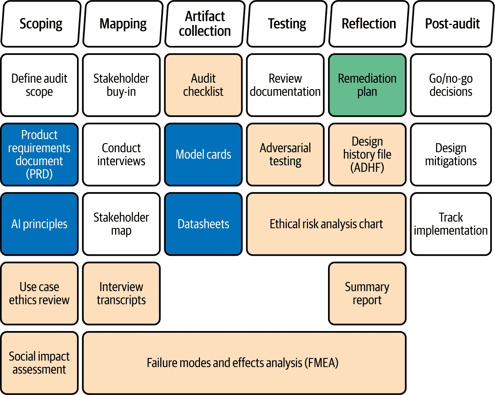

# 第六章。有限风险人工智能系统的人工智能工程

上一章将欧盟人工智能法案的第 9 条至第 15 条翻译成了 CRISP-ML(Q)生命周期内高风险人工智能系统的可操作规范，提供了支持负责任开发和管理的实际清单。它还介绍了在欧盟人工智能法案合规性背景下的人工智能工程概念。

本章将重点转向法案对有限风险人工智能系统的要求，特别关注透明度义务。它探讨了组织如何通过 MLOps 积极应对这些要求。参见图 6-1 了解迈向欧盟人工智能法案合规性的步骤。

###### 图 6-1。本章重点讨论有限风险人工智能系统的要求和此类系统的合规性实施。参见第一章了解实现欧盟人工智能法案合规性的端到端流程步骤。

本章的两个指导问题是：

+   为了符合欧盟人工智能法案，有限风险人工智能系统必须满足哪些要求？

+   为了符合法案中的透明度义务，需要建立哪些流程、结构和人工智能工程实践？

如您所注意到的，我在这里提到了合规性和透明度义务。让我们来探讨这两个概念之间的区别。

# 合规性评估与透明度义务

合规性或一致性评估是高风险人工智能系统必须遵守的强制性流程，以确保它们符合欧盟人工智能法案的要求，通常涉及第三方评估。透明度义务较为宽松，是对所有直接与人类互动的人工智能系统的更广泛要求。在深入探讨法案中规定的透明度义务之前，让我们快速地逐一审视这些内容。

一致性评估是一种正式流程，通过该流程，供应商证明人工智能系统符合欧盟人工智能法案第三章第二节中概述的要求。此流程确保遵守法律义务，可能涉及由通知机构（由成员国指定的独立组织，用于评估高风险人工智能系统）进行的第三方评估。主要目标是验证系统在上市前是否符合欧盟监管标准。

[欧盟人工智能法案第 50 条](https://oreil.ly/cc73j)引入了适用于所有旨在直接与人类互动的人工智能系统的透明度义务，无论其风险分类如何。这些义务不需要正式评估，而是通过向供应商和部署者施加特定义务来防止欺诈或伤害，告知个人他们正在与人工智能系统互动。

表 6-1 比较了欧盟人工智能法案下的合规性评估和透明度义务。

表 6-1\. 合规性评估与透明度义务之间的关键差异

| 特征 | 合规性评估 | 透明度义务 |
| --- | --- | --- |
| 适用范围 | 仅限高风险人工智能系统 | 与人类交互的人工智能系统，适用范围广泛 |
| 主要目标 | 确保符合技术和法律要求 | 提高用户意识并防止欺诈 |
| 性质 | 需要第三方评估的正式流程 | 旨在提供信息和清晰度 |
| 流程 | 技术评估和合规性检查 | 标签、信息披露 |
| 责任 | 提供者 | 提供者和部署者 |
| 结果 | 证书和欧盟合格声明 | 用户意识和理解 |
| 与其他法律的关系 | 欧盟协调法律的一部分，在适用时 | 除了其他国家和欧盟的透明度法律 |

总的来说，合规性评估是一个旨在确保高风险人工智能系统安全且完全符合欧盟人工智能法案的严格、技术性流程，而透明度义务旨在确保用户意识到他们正在与人工智能系统交互，无论其风险分类如何。在本章中，我们将探讨这些义务的内容以及如何在实践中解决这些问题。

# 理解透明度义务

如我在第四章中解释的那样，欧盟人工智能法案中并未明确定义“有限风险”这一术语。相反，法案概述了三个主要类别：不可接受风险类别下的禁止人工智能实践（第 5 条）、高风险人工智能系统（第 6 条）以及具有特定透明度义务的人工智能系统（第 50 条）。

“有限风险”的人工智能系统通常被认为是不被明确禁止或高风险，但在直接与人类交互时仍需遵守透明度要求。第 50 条规定了人工智能系统提供者和部署者的透明度义务。这些义务适用于所有旨在直接与自然人交互的人工智能系统，无论其风险水平如何。表 6-2 总结了关键条款。

表 6-2\. 根据欧盟人工智能法案第 50 条概述的人工智能系统提供者和部署者的透明度义务概览

| 透明度义务 | 描述 |
| --- | --- |
| 通知用户与人工智能交互 | 当提供者与人工智能系统交互时，必须通知用户，除非这是明显合理的或系统用于执法目的（例如，检测、预防、调查或起诉犯罪）。这适用于聊天机器人和内容生成工具。 |
| 标记合成内容 | 生成合成内容（音频、图像、视频、文本）的 AI 系统的提供者必须明确标注这些输出为人工生成或操纵。标签应该是机器可读的，并且易于检测，表明内容的非真实性。此要求不适用于辅助编辑工具或未显著改变原始输入的系统。 |
| 披露深度伪造 | 生成深度伪造（根据第 3(60)条定义为“类似于现有个人、物体、地点、实体或事件的人工生成或操纵的图像、音频或视频内容，会让人误以为它是真实或真实的”）的 AI 系统的提供者必须明确标注这些输出为人工。标签应该是机器可读的，并且易于检测。这项义务不适用于提供标准编辑功能、未显著改变原始数据或用于执法目的的系统。 |
| 情绪识别和生物识别分类的额外透明度措施 | 情绪识别和生物识别系统的部署者必须明确告知用户这些技术的工作原理以及如何使用他们的数据，特别关注残疾人士的易用性。请注意，满足该法案的透明度要求并不保证符合其他法律标准，如 GDPR。 |

第 50 条要求旨在直接与自然人互动的 AI 系统必须适当设计以支持这种互动，并规定个人必须明确被告知他们正在与 AI 系统互动。这些信息应在互动开始时提供。例如，具有聊天界面的 AI 系统触发此透明度义务，用户应在第一次与其互动时被告知其人工性质。

这里有一些需要披露的系统示例：

+   创建或修改内容（音频、图像、视频或文本）的 AI 系统，如 Jasper AI 或 Voice.ai，必须明确标注其输出为人工创建或修改。

+   生成深度伪造的 AI 系统必须明确声明内容是人工创建或操纵的。这补充了标记所有合成内容的一般要求。

+   分析面部表情或生物识别数据以推断情绪或对个人进行分类的情绪识别和生物识别分类系统（如 Smart Eye 的 Affectiva），要求部署者告知用户系统的操作。

+   生成或操纵文本的 AI 系统，例如社交媒体内容机器人、AI 驱动的新闻写作系统（如 Narrative Science），以及生成新闻文章、财经更新、天气预报和其他公共利益内容的的大型语言模型（例如 OpenAI 的 GPT 模型），必须披露内容是人工生成或操纵的。

根据 50 条，所有此类披露必须清晰、易于察觉，并且对所有用户可访问。一般性的网站免责声明是不够的。披露必须在实际接触相关内容之前进行。

既然你已经了解了关键透明度义务的样子，让我们转向如何人工智能工程实践可以支持有效实施。

# 将人工智能工程与 SMACTR 和 CRISP-ML(Q)对透明度进行对齐

如前所述，一致性评估是一个需要第三方审计的正式程序。然而，这种审计通常在部署之后进行，此时系统可能已经对用户产生了负面影响。Inioluwa Deborah Raji 等人在其广受引用的论文[“缩小人工智能问责差距：定义内部算法审计端到端框架”](https://oreil.ly/9RVsg)中解决了这个问题，在该论文中，他们提出了一种旨在指导道德人工智能开发的实际实施的内部审计框架：SMACTR（范围、绘图、工件收集、测试和反思）。SMACTR 为组织提供了一种结构化的方法，以确保其人工智能系统与其声明的道德原则和价值观保持一致。该框架旨在在整个人工智能系统开发生命周期中使用，而不仅仅是在某个时间点，并帮助组织为第三方一致性审计做好准备。

## SMACTR 框架的五个阶段

让我们从检查 SMACTR 框架的五个阶段开始：

范围

通过审查系统的动机和预期影响以及确认旨在指导系统发展的原则，明确了审计的目标。此阶段还涉及绘制用例和识别类似部署以预测潜在危害。

绘图

将范围阶段产生的文档与将参与测试和审查的利益相关者联系起来。FMEA 应在此阶段开始（有关 FMEA 的更多信息，请参阅“失效模式和影响分析”)。

工件收集

收集支持道德和技术评估的关键文档和证据，包括对系统用例的道德审查和社会影响评估。来自系统和工程团队的前置文档通常包括道德目标声明和产品需求文档（PRD）。

测试

涉及对模型性能的彻底审计，考虑技术和伦理方面。

反思

专注于审查整个开发过程，并确定未来改进的机会。

如图 6-2 所示，每个阶段都有其自己的文档要求，这有助于确保框架支持问责制和透明度。

###### 图 6-2\. SMACTR 框架概述（来源：[*https://oreil.ly/9RVsg*](https://oreil.ly/9RVsg))

表 6-3 总结了框架介绍论文中概述的每个阶段的目的、关键活动和预期结果。

表 6-3\. SMACTR 框架的阶段

| SMACTR 阶段 | 目的 | 活动 | 结果 |
| --- | --- | --- | --- |
| 范围 | 通过审查 AI 系统的动机和预期影响来明确审计的目标。定义项目的范围和应指导其发展的伦理原则。 |

+   审查指定 AI 系统需求和预期的产品或请求文档。

+   确定预期用例和潜在的有害或社会影响领域。

+   在组织内部或从竞争对手那里规划类似的部署，以预测潜在问题。

+   确认旨在指导产品开发的伦理原则和价值观。

+   定义一个以未能实现伦理原则为中心的风险分析。

| 对审计目标、AI 系统的预期影响以及应遵循的伦理指南有清晰的理解。需要创建的关键文档包括 AI 系统（项目）范围文档、初始风险评估报告和伦理审查报告。 |
| --- |
| 绘制地图 | 确定所有相关利益相关者，以确保审计考虑所有相关方的观点和利益，包括用户、开发者和其他受影响的群体。 |

+   确定可能受 AI 系统影响的全部相关利益相关者。

+   确定系统对每个利益相关者群体可能产生的影响。

| 一个全面的利益相关者地图和对 AI 系统对不同群体潜在影响的清晰理解。 |
| --- |
| 艺术品收集 | 收集与 AI 系统开发和部署相关的所有相关文档和数据。这些信息对于审计员全面评估系统并识别潜在风险和伦理问题至关重要。 |

+   收集与项目相关的文档、技术规范和相关信息。

+   收集有关数据来源、数据准备步骤、模型训练细节和评估结果的信息。

+   收集与系统开发相关的文档。

| 一套完整的与 AI 系统相关的文档、数据和其它艺术品，便于分析。这些文档可能包括数据质量评估、模型卡片、训练日志和性能报告。 |
| --- |
| 测试 | 评估 AI 系统的性能，并识别在运行过程中可能出现的任何潜在问题或风险。这超出了标准技术测试，还包括伦理影响和偏见。 |

+   进行技术测试以评估模型的准确性、鲁棒性和可靠性。

+   评估模型的公平性，并识别可能导致歧视性结果的任何潜在偏见。

+   评估模型在各种条件下的性能，包括边缘情况和潜在的对抗性场景。

+   使用技术指标和道德考量进行评估。

| 对系统的性能、局限性和潜在风险有深入的理解，关注技术和道德两个方面。这包括性能报告和偏差检测分析。 |
| --- |
| 反思 | 分析前一阶段的结果，并根据原始范围目标进行评估。这一步骤侧重于总结发现，评估道德风险得到解决的程度，并为未来提出改进建议。 |

+   根据项目的原始范围目标，评估测试阶段的成果。

+   确定在部署人工智能系统时可能受到威胁的任何伦理原则。

+   根据测试结果，制定进一步缓解已识别风险和确保系统负责任使用的建议。

+   与工程团队合作制定风险缓解计划。

| 算法使用相关风险分析，包括一个针对已识别失败和潜在风险的缓解计划。这包括对部署人工智能系统道德影响的反思。 |
| --- |

## SMACTR 框架如何与欧盟人工智能法案保持一致

SMACTR 框架旨在进行部署前审计，并可用于支持符合欧盟人工智能法案。它对在整个人工智能开发生命周期中嵌入道德考量的强调，与法案的目标和要求直接一致。让我们看看一些关键的一致领域：

积极预防和审计

SMACTR 框架通过在设计和发展阶段整合审计流程，促进对道德人工智能开发的积极方法。这与传统的外部审计形成对比，后者通常在部署后进行，此时风险可能已经造成损害。这种预防性导向与欧盟人工智能法案对风险评估和缓解的要求相吻合：通过使用 SMACTR，人工智能工程师可以在风险成为问题之前预测和解决潜在风险。虽然该框架并非专门为欧盟人工智能法案开发，但其对“紧急治理”的关注，强调审计不仅是为了系统可靠性，也是为了社会损害，使其与法案保护基本权利的目标相契合。

重视透明度和文档化

SMACTR 在每个阶段都产生结构化的文档，形成一个全面的审计轨迹。这与欧盟人工智能法案对全面技术文档和可追溯性的要求相一致，特别是对于高风险人工智能系统。生成的文档，包括模型卡片和数据表等工件，支持人工智能价值链上的信息共享，并可作为解决道德问题和满足监管要求尽职调查的证据。

与道德原则和价值观的一致性

欧盟人工智能法案建立在可信赖人工智能的概念之上，并基于人工智能高级专家小组开发的道德指南。SMACTR 框架旨在帮助组织使其人工智能系统与其声明的道德原则和价值观保持一致，并使他们能够评估系统在实践中的原则保持情况。

风险评估集成

框架的界定阶段涉及一种结构化的风险评估，它超越了技术可靠性，映射用例并确定潜在的伤害和社会影响来源。FMEA 和前瞻性的“如果……怎么办？”问题等工具支持这一过程。这种更广泛的风险基础方法，结合了道德和社会考量，与欧盟人工智能法案强调的综合风险管理重点相一致。

问责制和责任

SMACTR 通过在整个人工智能开发生命周期中定义角色和责任，明确促进问责制。这与欧盟人工智能法案强调的可追溯性、透明度和可解释性以及为提供商、部署者和其他利益相关者定义的义务相一致。特别是框架的映射阶段可以帮助建立个人问责制的内部记录。

如您所见，SMACTR 框架不仅是一个用于道德人工智能开发的工具，而且是一个支持遵守欧盟人工智能法案的实用机制。它对主动审计、详细文档、与道德原则的一致性、综合风险评估和问责制的关注使其特别适合指导人工智能工程团队满足法案的监管要求。该框架可以根据所需的严谨程度以完整或精简的形式实施。它还可以根据不同的风险水平和具体系统要求进行调整，使其适用于广泛的用例。

关键的是，SMACTR 可以与人工智能工程实践相结合，以确保在整个人工智能系统生命周期中解决道德和透明度考虑因素。通过将 SMACTR 与 CRISP-ML(Q) 方法结合，人工智能工程师可以在开发的各个阶段嵌入透明度和合规性措施。

以下部分概述了如何将 SMACTR 集成到 CRISP-ML(Q) 生命周期中，并提供了一步一步的工程指南，以帮助组织满足欧盟人工智能法案下的透明度义务。对于生命周期的每个阶段，我将首先检查相关的透明度要求，然后描述相应的 CRISP-ML(Q) 活动，展示如何应用 SMACTR，并确定支持合规性和可追溯性的关键工件。

## 商业和数据理解阶段

在业务和数据理解阶段，需要解决几个透明度要求，以确保用户在互动时意识到他们正在与 AI 系统互动，并且合成内容被清楚地识别。这一阶段的关键要求包括：

记录 AI 系统的预期用途

明确记录 AI 系统的预期用途，指定其设计要做什么以及要解决的问题。

定义与人类的交互点

确定 AI 系统将直接与人类互动的所有点。这包括用户界面、聊天机器人或任何其他自然人与系统互动的机制。

识别合成内容生成能力

确定 AI 系统是否可以生成或操纵音频、图像、视频或文本内容。如果是，记录这一能力，因为任何合成输出都必须明确标记。

规划通知机制

制定通知用户他们正在与 AI 系统互动的计划。这可能涉及实施可见通知、清晰标签和其他可访问的方法。

### CRISP-ML(Q)活动

在业务和数据理解阶段，以下 CRISP-ML(Q)活动至关重要：

定义范围和成功标准

明确定义项目的目标和成功标准。这包括确定可衡量的成果并为 AI 系统建立 KPI。

评估数据可用性和质量

评估用于训练和验证的数据，考虑其数量、相关性、准确性和完整性。

评估可行性

评估项目的技术和运营可行性，以确定其目标是否可用现有资源和技术实现。

设计数据收集策略

如果现有数据不足，设计收集额外数据的策略。指定新数据将如何获取、存储和管理。

### SMACTR 集成

SMACTR 框架通过从一开始就整合道德考虑和可审计性来增强 CRISP-ML(Q)过程。范围界定、绘制和工件收集阶段与业务和数据理解阶段相关。以下是关键任务：

范围界定（系统用例的道德审查）

对 AI 系统的预期用途进行道德审查。这包括考虑谁可能受到影响以及可能的社会影响。

绘制（利益相关者识别）

确定所有将参与或受 AI 系统影响的内部和外部利益相关者。这可能包括开发者、产品经理、最终用户以及其权利可能受到影响的人。

工件收集（初始文档收集）

开始收集 AI 系统的初始文档。这包括项目提案、需求文档和道德目标声明。

### 关键工件

在业务和数据理解阶段结束时，应产生以下关键工件以满足欧盟 AI 法案的要求：

项目范围文档

一份明确界定项目目标、范围和成功标准的文件。这应包括关于 AI 系统旨在实现什么以及项目边界详情。

伦理审查报告

一份概述 AI 系统伦理影响的报告，包括潜在风险和危害，并记录系统是否与一套伦理价值观或原则相符。

利益相关者映射图

所有利益相关者的视觉表示，显示他们的角色以及与 AI 系统的关系。此图应阐明参与者动态并为解释最终审计报告提供背景。

数据质量评估

一份评估数据可用性、质量和适合性以供项目使用的报告。此文件应确定任何数据缺口或需要在下一阶段解决的可能偏见。

初始透明度要求文件

一份基于第 50 条概述初步透明度要求的文件。这包括与人类的交互点、任何合成内容生成以及计划的通知机制。

表 6-4 总结了这些工件的内容。

表 6-4\. 业务和数据理解阶段产生的关键工件总结

| 工件 | 内容 |
| --- | --- |
| 项目范围文档 |

+   项目目标

+   成功标准

+   资源需求

+   时间表

+   约束条件

+   依赖关系

|

| 伦理审查报告 |
| --- |

+   影响评估

+   风险分析

+   缓解策略

+   合规性评估

+   伦理委员会建议

|

| 利益相关者映射图 |
| --- |

+   涉及方

+   角色和责任

+   沟通路径

+   决策权限级别

|

| 数据质量评估（评估标准） |
| --- |

+   完整性

+   准确性

+   一致性

+   及时性

+   隐私合规性

|

| 初始透明度要求文件 |
| --- |

+   系统目的声明

+   人类交互点

+   合成内容能力

+   通知机制

+   文档要求

+   合规性检查清单

|

## 数据准备阶段

在数据准备阶段，重点是确保用于训练 AI 系统的数据得到良好记录和可审计。这对于透明度、问责制以及使部署者和用户了解 AI 系统如何做出决策至关重要。以下是第 50 条透明度要求在此阶段转化为实际步骤的方式：

实施数据血缘跟踪

建立一个跟踪数据来源和数据流量的系统。这包括记录数据的来源、它所经历的任何转换以及它的用途。这对于确保系统使用的数据可以追溯到其原始来源至关重要，这有助于识别和纠正潜在问题。技术上，这需要源系统跟踪、转换历史和版本控制集成的组件。

记录数据转换

应用到数据上的所有转换，如清理、归一化或聚合，必须明确记录。文档应描述应用了哪些转换、为什么应用这些转换以及它们对数据的影响。

建立审计跟踪

通过记录所有数据准备活动（包括谁进行了更改、何时进行更改以及实施了哪些具体更改）创建一个健壮的审计跟踪。审计跟踪确保记录了所有数据准备步骤，这对于保持问责制和证明符合透明度要求至关重要。

创建元数据管理系统

开发一个管理系统来管理有关数据的元数据，例如其格式、类型、来源以及任何相关的质量指标。一个结构良好的元数据管理系统对于理解数据及其特征至关重要，并有助于更好的数据治理。它还支持 ML 资产（如数据、特征和模型）的可追溯性和可重用性。

### CRISP-ML(Q)活动

在这个阶段，对机器学习项目中的数据准备采取结构化方法的关键活动包括：

数据清理和验证

识别和纠正数据中的任何错误或不一致。这包括处理缺失值、纠正错误和确保数据符合定义的标准。

特征工程

从现有数据中创建与建模任务相关的新的特征。这可能涉及转换现有变量、创建交互项或提取其他有意义的信息以增强模型性能。

数据转换

将数据从原始格式转换为机器学习算法适用的格式。这可能涉及对数值数据进行归一化或对分类数据进行编码，例如。

数据文档

记录数据的特征，包括其来源、数据类型和限制，并记录数据中存在的任何问题或偏差。

### SMACTR 集成

SMACTR 框架的艺术品收集、测试和反思阶段可以整合到所有剩余的 CRISP-ML(Q)阶段。以下是数据准备阶段的关键活动：

艺术品收集（数据文档）

创建关于数据和所有处理步骤的详细文档。这应该超越基本的记录。

测试（初始数据质量验证）

对数据质量和转换有效性进行严格的验证，以确保数据准备过程既满足技术要求，又符合合规标准，并与透明度和道德目标保持一致。

反思（数据准备影响分析）

考虑数据准备过程的更广泛影响。分析每个转换可能如何影响不同的群体或社区，并反思潜在的道德问题，如偏见或不公平的结果。

### 关键工件

数据准备阶段结束时，应生成几个关键工件以满足欧盟人工智能法案的要求。这些包括：

数据质量报告

详细的数据质量报告，突出显示任何问题或限制。这些报告应具体说明使用了哪些指标，发现了什么问题，以及如何解决这些问题。

特征文档

对模型中使用的所有特征进行清晰的描述，包括它们是如何构建的以及它们代表什么。此文档还应解释特征工程选择背后的理由。

数据血缘文档

跟踪数据来源和任何应用的转换的记录。此文档应显示数据从其来源到在系统中最终使用的整个路径。

转换日志

所有数据转换的详细日志，包括日期、时间、用户和每次更改的详细信息。这些日志作为数据转换过程的可验证记录。

元数据模式

元数据的定义结构和格式，确保数据文档的一致性。元数据模式提供了一个清晰的框架，用于分类和跟踪数据。

表 6-5 概述了这些工件的内容概览。

表 6-5。数据准备阶段生成的关键工件摘要

| 工件 | 内容 |
| --- | --- |
| --- | --- |

| 数据质量报告 | 验证检查：

+   模式验证

+   业务规则合规性

+   约束验证

+   格式一致性

数据质量评估，例如：

+   完整性：（指标：空值百分比；阈值：<0.05；验证结果：通过/失败）

+   准确性：（指标：错误率；阈值：<0.01；验证结果：通过/失败）

|

| 特征文档 |
| --- |

+   特征名称

+   描述（业务含义）

+   源（原始数据源）

+   转换（应用转换的列表）

+   依赖关系（父特征）

+   验证规则（业务约束）

|

| 数据血缘文档 |
| --- |

+   操作 ID

+   时间戳

+   数据转换类型

+   输入数据：源（输入位置），版本

+   输出数据：目的地（输出位置），版本

|

| 转换日志 |
| --- |

+   转换 ID

+   方法：转换函数，输入参数，验证结果

+   元数据：时间戳，责任用户，代码版本

|

| 元数据模式 |
| --- |

+   技术元数据：数据类型，模式版本，存储格式

+   业务元数据：所有者，更新频率，敏感级别

+   运营元数据：处理历史记录、质量指标、依赖关系图

|

## 模型阶段

CRISP-ML(Q)模型阶段的核心重点是选择和训练模型，优化超参数，并评估模型性能。以下行动支持本阶段符合第 50 条透明度要求，确保人工智能系统的决策过程是可解释的、可追溯的和可重复的：

实施模型版本控制

使用版本控制系统（如 Git）跟踪对模型代码、参数和配置所做的所有更改。这不仅使可重复性成为可能，而且在必要时还可以回滚到先前版本。

记录模型行为和意图

开发全面的文档，清楚地解释模型的工作原理、预期应用和局限性。这应包括有关模型架构、训练过程、使用的数据集和评估方法的详细信息。在前一章中，我详细概述了可以为人工智能系统创建的文档类型。例如，模型卡片可以用来提供模型关键特征的简洁总结（预期用途、性能指标、局限性、伦理考虑以及评估数据、范围和相关风险的概述）。

建立可解释性机制

结合可解释性工具或技术，以增强对模型决策过程的理解。例如，您可能使用特征重要性分析或代理模型来提供模型如何得出预测的见解。

### CRISP-ML(Q)活动

模型阶段的关键活动包括：

模型选择

根据问题定义和需求选择最合适的模型架构。

训练和验证

使用准备好的数据训练选定的模型，并使用保留的验证集来微调超参数并评估其性能。记录整个训练过程。

性能评估

使用适当的指标评估模型性能，关注不同子组的技术准确性和公平性。

模型优化

微调模型以改进性能，考虑因素如准确性、公平性和鲁棒性。

确保详细记录所有这些过程，以及您所有决策背后的理由。

### SMACTR 集成

以下活动展示了如何将艺术品收集、测试和反思的 SMACTR 阶段整合到模型阶段：

艺术品收集

记录有关模型的所有相关信息，包括其架构、训练细节和性能指标。

测试

全面评估模型性能，考虑技术和伦理方面。包括针对不同子组的公平性、准确性和鲁棒性的测试。

反思

持续评估模型的更广泛伦理影响，包括对基本权利和社会结果的可能影响。记录模型选择理由和建模选择背后的伦理考量。

### 关键工件

表 6-6 列出了在模型阶段应生成和维护的工件。

表 6-6\. 模型阶段产生的关键工件总结

| 工件 | 内容 |
| --- | --- |
| 模型卡 | 简要文档，总结了模型的使用意图、性能指标、局限性和伦理考量。（参见[模型卡工具包](https://oreil.ly/5fcMl)。） |
| 训练日志 | 训练过程的全面记录，包括超参数、使用的数据以及每个阶段的性能指标。 |
| 性能报告 | 模型性能的详细分析，包括准确率、精确率、召回率和其他相关指标。还包括公平性测试和偏差检测及缓解策略的结果。 |
| 可解释性文档 | 对模型解释所使用的方法和从中获得的见解的结构化摘要。 |
| 版本控制记录 | 版本控制系统中的日志，显示对模型代码和配置所做的所有更改。这确保了完全可追溯性并使可重复性成为可能。 |

### 技术实施指南

以下基础设施组件使团队能够实施上一节中概述的实践并支持第 50 条的透明度要求：

版本控制

使用版本控制系统（如 Git）跟踪数据、模型和代码的更改，以确保透明度并便于回滚。您可能希望采用双重跟踪方法，使用 DVC 进行数据版本控制和 MLflow 进行模型版本控制。

元数据跟踪系统

实施一个健壮的元数据跟踪系统以记录模型版本、训练数据、评估结果和可解释性信息。该系统的组成部分包括：

+   一个可扩展的数据库（例如，PostgreSQL）用于结构化元数据

+   用于非结构化数据和日志的文档存储（例如，MongoDB）

+   一个可搜索的索引（例如，Elasticsearch）用于快速检索

MLOps 平台

使用支持版本控制、实验跟踪和管道自动化的 MLOps 平台。选项包括托管 MLflow 和 Unity Catalog（Databricks）、Weights & Biases 以及 Metaflow 等等。

## 评估阶段

CRISP-ML(Q) 评估阶段侧重于验证 AI 模型在未见数据上的性能，并在部署前根据需要改进模型。为了满足欧盟 AI 法第 50 条规定的透明度义务，应实施以下实际步骤：

记录和跟踪模型预测和置信水平

建立一个系统，记录所有模型预测及其相关的置信度分数。该系统应支持轻松检索和分析，以帮助用户理解人工智能系统如何生成其输出。除了预测本身外，还应记录任何有助于这些结果的中间步骤或特征。

验证通知机制

评估系统是否明确告知用户他们正在与人工智能交互。通知应描述系统的目的、数据来源和已知限制。测试用户界面中披露的有效性和可见性，并确保对所有用户都是可访问的。

测试内容标记流程

如果人工智能系统生成合成内容（音频、图像、视频或文本），它必须具有以机器可读格式标记内容为人工的能力。如果适用，验证这些标记是否可检测且符合 deepfake 披露要求，以增强透明度和促进问责制。

验证文档的完整性

确保所有文档都是完整且最新的，包括有关人工智能系统预期用途、数据来源、模型卡片、训练日志和性能报告的信息。文档应采用易于部署者和最终用户理解的方式编写，以促进顺畅的沟通和理解系统的功能及目的。

### CRISP-ML(Q)活动

评估阶段的主要活动包括：

模型验证

通过在未见过的数据上使用特定用例的指标来评估模型的准确性和泛化能力。采用交叉验证等技术可以提高模型的鲁棒性，从而更可靠地评估其能力。

性能评估

当评估模型性能时，不仅要考虑准确性，还要考虑公平性、鲁棒性和可解释性。同时，跟踪以下内容也很重要：

+   不同连续训练执行中的预测性能

+   在整个管道中生成的元数据和工件，以支持调试、可重复性和谱系分析（追踪训练模型回其训练数据集的能力，包括所有中间工件和元数据）

+   训练过程中使用的超参数

+   管道中执行的所有评估

+   如果可行，转换步骤后的处理数据快照

+   数据摘要，如描述性统计、模式以及特征分布

在评估报告和模型卡片中记录这些指标可以增强透明度。将它们与模型预期用途对齐对于产生相关且有意义的评估至关重要。

业务目标对齐

确认模型性能与原始业务目标和成功标准一致。确认模型的输出对于预期用例来说是相关且有价值的。

合规性验证

核实系统的功能和文档是否符合欧盟 AI 法案和任何其他适用的法律或行业标准。

### SMACTR 集成

这里是评估阶段的主要 SMACTR 集成活动：

艺术品收集（测试结果）

+   收集所有测试结果和性能数据，用于影响评估。

+   确保所有 AI 系统艺术品都得到良好记录和清晰展示。

+   收集关于模型在各种条件下行为和性能的全面数据。

测试（全面系统测试）

+   对整个 AI 系统进行彻底测试，包括模型、数据管道和用户界面。测试应涵盖各种场景，包括边缘情况和潜在的对抗性输入。

+   确保所有测试都有记录，结果得到妥善记录。

反思（系统影响分析）

+   记录潜在的风险和限制，包括偏见来源和公平性关注。

+   评估 AI 系统是否与组织定义的伦理原则一致。

### 关键艺术品

表 6-7 提供了本阶段应产生的艺术品的总结。

表 6-7。评估阶段产生的关键艺术品的总结

| 艺术品 | 内容 |
| --- | --- |
| 评估报告 | 记录所有评估活动，包括模型验证、性能指标和业务目标对齐。包括模型的优势、劣势和局限性的总结。 |
| 合规性验证文件 | 提供符合第 50 条透明度要求和其他相关法规的证据。明确展示系统如何满足法律和伦理义务。 |
| 测试结果 | 编译模型和系统测试的结果，包括输入、输出和发现的任何错误。包括性能数据和错误分析。 |
| 影响评估 | 分析系统对利益相关者的影响，考虑潜在的伦理和社会影响。记录任何识别出的偏见和风险。 |
| 审计报告 | 总结评估阶段的结果，包括合规性检查和伦理评估。提供改进建议，并包括社会影响分析。 |

### 可用工具和技术

将透明度集成到 MLOps 工作流程中需要用于可解释性、监控和验证的强大工具。以下工具和技术可用于实施最佳实践并支持符合欧盟 AI 法案：

可解释性工具

这些有助于使模型的决策过程更具可解释性和可理解性。例如包括：

+   SHAP，用于理解特征重要性

+   LIME，用于解释单个预测

+   可解释性提升机（EBMs），用于创建本质上可解释的模型

监控和日志工具

这些对于实时跟踪系统性能和监控公平性和潜在的偏见至关重要。例如包括：

+   Prometheus，用于时间序列数据和警报

+   Grafana，用于数据可视化和仪表板

+   Elastic Stack，用于日志管理和分析

+   模型卡工具包，用于通过结构化模型卡标准化和记录关于人工智能模型的关键信息

测试框架

这些有助于彻底测试整个人工智能系统。例如包括：

+   PyTest，用于编写和运行基于 Python 的人工智能应用程序的测试

+   TensorFlow 测试，用于测试 TensorFlow 模型和管道

## 部署阶段

部署阶段标志着人工智能系统进入实时生产环境。在此生命周期阶段，为了满足第 50 条下的透明度要求，以下行动是必不可少的：

部署通知系统

用户在开始与系统互动之前必须被告知他们正在与人工智能系统互动（除非这是显而易见的）。这些披露必须在系统界面中清晰可见，并包括对系统目的、数据来源和任何已知限制的解释。用户披露必须清晰、简洁，并且对所有人可访问。彻底测试通知系统，以确保其在生产环境中正常工作。

实施内容标记

使用内容标记机制明确标识合成内容（音频、图像、视频或文本）为人工生成或操纵的。对于生成深度伪造的系统，需要明确披露以告知用户内容是合成的。

启用监控

激活监控工具以观察系统的实时性能。监控数据漂移、模型性能下降和偏见的出现。监控系统还应跟踪用户交互、内容生成事件和模型部署。

建立审计日志

实施一个全面的审计日志框架来记录所有相关的系统活动（用户交互、内容生成或操纵事件、错误等）。日志应包括模型版本详细信息、透明度通知和合规性验证结果。审计日志系统应稳健、安全，并遵守数据保护法规。

### CRISP-ML(Q) 活动

此阶段通常涉及以下关键活动：

系统集成

将人工智能模型与生产环境的其他部分集成。这需要端到端测试以确保所有组件都正确连接并按预期工作。

生产部署

使用已建立的 CI/CD 管道将人工智能模型部署到生产环境中。通过在实时环境中运行测试来验证已部署的系统是否按预期运行。

监控设置

配置监控工具以跟踪关键指标和性能指标（在早期的 CRISP-ML(Q) 阶段定义），例如准确性、公平性、鲁棒性和可解释性。设置警报机制以通知利益相关者出现的任何问题或异常。

文档最终确定

确保所有相关文档，包括用户手册、系统架构图、数据集文档和模型卡片，都是完整且准确反映已部署系统当前状态的。完成文档是一个经常被忽视的步骤，对于透明度和向最终用户和利益相关者提供对已部署系统的清晰理解至关重要。

### SMACTR 集成

部署阶段通过以下活动整合了 SMACTR 的工件收集、测试和反思阶段：

工件收集（最终文档）

+   收集所有文档的最终版本，包括系统架构图、数据流图、数据集和模型卡片以及合规记录。

+   确认文档反映了从开发到部署的完整过程。

测试（生产验证）

+   在实际环境中对系统的性能进行最终验证。

+   确保系统继续按预期运行，并且所有透明度机制都正常工作。

+   持续监控模型以检测性能下降、公平性问题以及潜在的偏差漂移。

反思（部署准备评估）

+   确保所有必要的保护措施都已到位，以保护用户并支持负责任的 AI 部署。

+   对整个系统进行最终审查，以确认其符合所有技术、伦理和法律要求。

### 关键工件

到部署阶段结束时，应提供几个关键工件以满足欧盟 AI 法案的透明度义务。像往常一样，我在表 6-8 中总结了它们。

表 6-8\. 部署阶段产生的关键工件摘要

| 工件 | 内容 |
| --- | --- |
| 部署配置 | 记录用于将 AI 系统部署到生产环境的配置和设置。包括基础设施设置、软件版本和任何依赖项。 |
| 监控仪表板 | 设置监控仪表板，以提供对系统性能的实时可见性。仪表板应显示关键指标，并包括潜在问题和异常的警报机制。 |
| 系统文档 | 编译与已部署系统相关的所有文档，包括架构图、部署细节、API 规范和用户指南。确保所有利益相关者都能访问这些文档。 |
| 合规记录 | 维护记录，证明符合第 50 条透明度义务和任何其他适用法规。确保这些记录可供审计目的使用。 |
| 事件响应计划 | 建立明确的程序，用于在生产环境中识别、控制和解决事件。包括通知相关利益相关者的沟通协议。 |

### 可用工具和技术

以下是一些可以在部署阶段支持透明度实施的工具和技术：

元数据跟踪系统

这些通过跟踪用户交互、内容生成事件、模型部署和合规性验证结果来实现可追溯性。例如：

+   数据库：PostgreSQL（用于结构化元数据），MongoDB（用于非结构化数据）

+   可搜索索引：Elasticsearch（用于快速检索）

MLOps 平台

这些支持模型部署、版本管理和生命周期管理。流行的例子包括：

+   Kubeflow，一个开源平台，用于在 Kubernetes 上部署和管理机器学习工作流程

+   MLflow，用于管理完整的机器学习生命周期

+   Vertex AI，谷歌云提供的托管机器学习平台，用于构建、部署和扩展机器学习模型

CI/CD 工具

这些自动化了部署管道，确保一致性和可追溯性。它们包括：

+   GitLab CI/CD，一个用于版本控制和自动化部署的集成解决方案

+   GitHub Actions，用于在 GitHub 生态系统中自动化机器学习工作流程

监控和日志记录工具

这些提供了对系统行为的实时可观察性，支持透明度和偏见检测。例如：

+   Prometheus，用于时间序列数据和警报

+   Grafana，用于数据可视化和仪表板

+   Elastic Stack，用于日志管理和分析

可解释性工具

这些有助于使 AI 系统在实时环境中的决策可解释。它们包括：

+   SHAP，用于理解特征重要性

+   LIME，用于解释单个预测

## 监控和维护阶段

监控和维护阶段对于确保持续遵守欧盟 AI 法案以及长期内 AI 系统的可靠性和道德表现至关重要。相关的透明度要求包括：

监控通知交付

定期验证面向用户的透明度通知是否清晰、易于访问，并在适当的时间交付。跟踪交付频率和成功率，以识别差距和改进领域，并利用这些见解来改善用户体验并建立对 AI 系统的信任。

跟踪内容标记的有效性

持续验证合成内容是否以机器可读、可检测的格式一致且准确地标记，并且即使在内容任何修改后，这种标记仍然持续存在。监控内容未正确标记的实例，并采取纠正措施解决这些问题。

记录合规性日志

记录任何可能影响合规性的系统配置更改或行为。确保合规性日志安全存储，并便于审计。

维护审计跟踪

记录所有系统活动，包括用户操作、内容创建事件、模型更新和配置更改的详细记录。审计日志应包括时间戳、用户 ID 以及关于所采取行动的清晰描述。定期审查这些日志，以检测任何异常活动或潜在问题，以维护系统的可靠性和性能，并指导必要的改进。

### CRISP-ML(Q)活动

生命周期此阶段的核心活动包括：

数据漂移和模型退化检测

+   实施检测数据漂移的机制，即输入数据的特征随时间变化。

+   监控输入特征分布的变化，并标记任何可能影响模型性能的显著变化。

性能监控

+   持续跟踪关键性能指标，如准确率、精确度、召回率和 F1 分数、公平性指标、特征归因和错误率。还包括服务效率指标，如延迟（模型服务的响应性和健康状态）、吞吐量（在给定时间内处理的预测量）和资源利用率（CPU、GPU 和内存使用，以实现成本和性能优化）。

+   监控这些指标随时间的变化，以识别性能下降或漂移。

+   建立可接受性能的阈值，并设置警报以通知利益相关者任何重大偏差。

模型更新

+   建立一个结构化的流程，以应对性能下降、数据漂移或业务需求的变化来更新模型。

+   使用版本控制来跟踪模型更新，并在必要时回滚到先前版本。

+   确保所有模型更新在部署到生产环境之前都经过彻底测试和验证。

系统维护

+   定期进行维护以解决错误、安全漏洞和性能问题。

+   根据需要安排停机时间，并提前通知用户维护活动。

记录所有监控和维护活动的详细记录，并确保系统文档保持最新。

### SMACTR 集成

这里是监控和维护阶段的主要 SMACTR 集成活动：

艺术品收集（持续文档记录）

+   持续收集和更新所有相关文档，包括监控报告、维护日志和更新记录。

测试（持续监控）

+   实施对 AI 系统的持续监控，重点关注包括公平性、偏见和问责制在内的伦理考量。

+   定期评估系统对不同用户群体的影响，以确保它不会持续或放大现有偏见。

+   建立报告和解决任何出现的伦理问题的机制。

反思（定期评估）

+   定期评估系统的性能和符合透明度义务的情况。

+   在系统运行时审查系统的伦理和社会影响。

+   利用这些评估的见解来识别改进领域，并指导设计、部署或治理策略的更新。

### 关键艺术品

表 6-9 总结了在此阶段应产生和维护的艺术品。

表 6-9。监控和维护阶段产生的关键艺术品摘要

| 艺术品 | 内容 |
| --- | --- |
| 监控报告 |

+   定期生成总结系统性能并提供任何识别出的问题或异常（如数据漂移）详细信息的报告。

+   包含可视化指标来展示系统的整体健康和性能。

|

| 维护日志 |
| --- |

+   详细记录所有维护活动，包括系统配置、数据或代码的更改。

+   记录每个活动的目的、采取的步骤和结果。

+   确保日志安全存储并可供审计。

|

| 更新记录 |
| --- |

+   维护所有模型和系统更新的版本控制。

+   确保在需要时可以回滚到之前的 AI 模型版本，或者有基于规则的回退机制。

|

| 合规性报告 |
| --- |

+   定期生成报告，记录第 50 条和其他适用法规的遵守情况。

+   包括与通知交付、内容标记有效性和审计跟踪维护相关的指标。

+   突出显示任何不合规的领域以及采取的行动来解决这些问题。

|

| 审计跟踪 |
| --- |

+   维护所有系统活动的完整审计跟踪，包括用户交互、内容生成事件、模型部署和系统配置的更改。

+   确保审计日志安全存储并可供相关利益相关者进行审计和合规性验证。

|

### 可用的工具和技术

除了前几节中提到的工具外，在监控和维护阶段支持 SMACTR 集成还需要以下工具：

数据漂移检测工具

这些工具会随着时间的推移监控输入数据和模型预测，以检测可能影响性能或公平性的变化。例如：

+   TensorFlow 数据验证，用于自动检测 TensorFlow 管道中的数据异常和漂移

+   Evidently AI，一个用于监控数据质量和模型性能的开源工具

+   NannyML，一个用于检测数据漂移和模型退化的库

合规性和审计工具

这些工具帮助组织定义、执行和监控合规性政策，同时保持安全的审计跟踪。例如：

+   Open Policy Agent (OPA)，用于定义和执行治理和合规性控制

+   云安全命令中心，用于监控和检查基于云的环境（如谷歌云）的合规性和安全检查。

恭喜！你已经走过了将 SMACTR 框架集成到 CRISP-ML(Q) AI 系统开发生命周期的完整过程。这次集成通过内部算法审计流程扩展了技术工作流程，使团队能够在部署前主动识别和减轻潜在的危害。它确保了每个阶段的透明度，并支持合规性，从业务和数据理解到持续监控和维护。

仅供参考，表 6-10 将 SMACTR 阶段映射到 CRISP-ML(Q)阶段。

表 6-10\. SMACTR 和 CRISP-ML(Q)集成

| CRISP-ML(Q)阶段 | SMACTR 阶段 |
| --- | --- |
|   | 范围界定 | 地图绘制 | 艺术品收集 | 测试 | 反思 |
| 业务和数据理解 | ✓ | ✓ | ✓ |   |   |
| 数据准备 |   |   | ✓ | ✓ | ✓ |
| 模型 |   |   | ✓ | ✓ | ✓ |
| 评估 |   |   | ✓ | ✓ | ✓ |
| 部署 |   |   | ✓ | ✓ | ✓ |
| 监控和维护 |   |   | ✓ | ✓ | ✓ |

# 技术趋势：AI 治理平台

AI 治理平台是一个综合的、分布式系统，旨在管理复杂的流程，处理大量数据，并与各种 AI 系统集成。它包括一套规则、流程、框架和工具，组织可以使用它们来支持 AI 系统的道德和负责任的开发和部署。

AI 治理平台的主要功能是将 AI 倡议与组织原则、法律要求（如欧盟 AI 法案）和道德标准对齐。你可以将其视为一个中央控制系统，它帮助组织跟踪和管理所有 AI 相关活动——就像财务管理系统跟踪货币交易并确保合规性一样。

这些平台通常提供组织内所有使用的 AI 系统的集中库存，并协助根据欧盟 AI 法案的风险级别对它们进行分类。这一点至关重要，因为不同的风险分类需要不同的合规措施。

治理平台提供内置的风险评估工具，帮助识别潜在的合规差距并建议补救措施。例如，如果一个 AI 系统用于招聘并被归类为高风险，平台可以帮助跟踪它是否按照法规要求定期进行偏见和公平性测试。

AI 治理平台还提供了在整个生命周期中记录和监控 AI 系统的工具。这包括跟踪 AI 模型是如何开发、训练和部署的，它们使用的数据以及它们在生产中的表现。它们通常包括自动生成技术文档和维护审计跟踪的功能，这在欧盟 AI 法案要求广泛记录的情况下非常有帮助，尤其是对于高风险 AI 系统。

治理工作流程是另一个关键特性。这些特性有助于管理在部署 AI 系统之前所需的批准，确保定期进行审查，并维护关键决策和变更的记录。以一个实际例子来说明，想象一家大型银行使用 AI 进行信用评分。它的 AI 治理平台可能支持以下功能：

+   记录信用评分模型是如何开发的。

+   跟踪训练过程中使用的数据。

+   监控性能的准确性和公平性。

+   生成所需的合规报告。

+   如果系统开始显示出偏见迹象，则向相关利益相关者发出警报。

+   记录所有模型更新和审批流程。

在欧盟 AI 法案的背景下，这些平台变得越来越有价值。该法案引入了对文档、风险管理、人工监督和问责制的严格要求。虽然该法案没有明确要求组织使用 AI 治理平台，但拥有一个平台可以显著减轻合规负担，尤其是对于管理多个 AI 系统的组织。

## 领先的平台

在撰写本文时，有几个值得注意的 AI 治理平台，包括以下：

Credo AI

专注于模型风险管理和合规评估，重点在于生成式人工智能

Monitaur

提供一个 ML 保证平台，用于构建可扩展的 AI 治理计划

公平 AI

提供实时监控、审计和自动合规管理的工具

Modulos

拥有一个代理式 AI 治理平台，该平台自动符合可信赖的 AI 标准

全面的 AI

提供对 AI 项目和库存管理的企业级监督

## 进一步阅读

要了解更多关于 AI 治理平台的信息，请查看以下资源：

+   Domo 的[2025 年顶级 8 大 AI 治理平台](https://oreil.ly/tuYhZ)

+   [“什么是人工智能对齐平台？”](https://oreil.ly/FtsGt) 由安德鲁·伯特、迈克·席勒和本·洛里卡所著

+   艾德温·温宁克的[道德工具景观](https://oreil.ly/rn8_p)

# 结论

根据欧盟 AI 法案，透明度义务侧重于用户意识和防止欺诈。与对高风险 AI 系统进行的一致性评估不同，后者是验证法律合规性的正式程序，透明度义务适用于所有直接与人类互动的 AI 系统，无论其风险分类如何。它们的主要目标是确保个人在与 AI 系统互动时得到明确告知，并了解其目的和限制。

本章为寻求主动遵守《法案》第 50 条规定的透明度要求的 AI 工程师提供了一份实用、详细的指南。正如你所看到的，将 SMACTR 框架与 CRISP-ML(Q)方法相结合，为负责任地开发和部署 AI 系统提供了一个稳健且可审计的过程，并支持 AI 生命周期的透明度。

下一章将讨论欧盟 AI 法案对开发和部署通用 AI 模型和系统的影响。我们将审查 GPAI 的具体规则和义务，并探讨这些系统可能被归类为高风险的条件，以及相应的严格要求。
