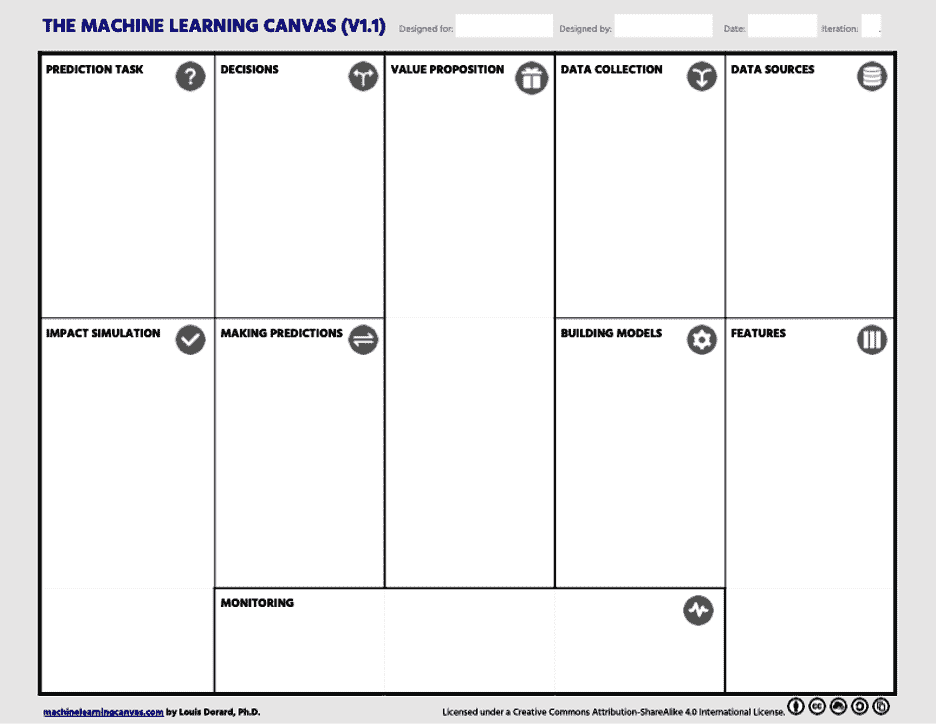

# 附录 A. 设计 AI 赋能应用

本附录探讨了设计**AI 赋能应用**的一般方法——这些软件应用通过集成机器学习模型来驱动其一个或多个核心功能。

近年来，对“AI 产品”的概念及其在 ML 和 AI 赋能系统中的应用越来越感兴趣。这种方法不仅关注 AI 作为技术组件的能力，还关注作为解决真实用户问题的核心功能的特性。图 A-1 展示了 AI 产品的一个示例：O'Reilly 学习平台的生成式 AI 助手*Answers*。这个助手旨在帮助用户与书籍内容互动，并使用自然语言查询在出版商的书籍语料库中进行研究。

我将 AI 产品定义为一种软件解决方案，它：

提供价值

AI 产品为用户、利益相关者或系统提供有意义的价值，无论是通过自动化任务、启用新功能、提高效率、降低成本、增强用户体验和互动性、提高生产力，还是生成新内容。

集成 AI 技术

AI 产品利用机器学习、深度学习、自然语言处理（NLP）和计算机视觉等技术来启用或增强功能。

交互和适应

AI 系统可以以被视为智能的方式解释和响应输入（如数据、用户交互或其他系统），并且它们通常可以从这些交互中学习并随着时间的推移进行适应和改进。

集成操作

AI 系统可以集成到更广泛的系统或流程中，无论是软件系统（如移动或 Web 应用）还是现实世界的流程（例如，在制造或客户服务中）。

###### 图 A-1\. AI 产品的示例

通常，AI 增强了软件产品，但它很少是产品本身。接下来，我们将关注 AI 产品的设计过程。请注意，在这个上下文中，我使用术语*AI 产品*和*AI 系统*互换。

# 设计 AI 系统的逆向思维

重要的是要以业务目标开始 AI 项目，因为只有大约[10%的 AI PoC](https://oreil.ly/Ha6oK)在生产中取得成功。通常，与业务问题的对齐——[解决真实用户的痛点](https://oreil.ly/MRKCZ)——是这种成功的原因。

**逆向思维**为范围界定、规划和执行 ML 项目提供了一个战略框架。[从结果出发](https://oreil.ly/Si4EX)有助于最大化提供有用解决方案的机会，同时避免常见的陷阱，如目标定义不明确、无关的功能和不匹配的架构。

然而，它确实需要清晰和准确的目标愿景，这使得它对于目标不确定或问题分解特别复杂的情况下的探索性研究不太适用。

逆向思考方法的关键益处包括：

明确的初始范围

从期望的结果开始，逆向工作有助于定义项目需求、可行性和成功指标。这防止了范围蔓延并使开发保持专注。

与业务对齐的 AI 产品

通过将 AI 开发与具体目标联系起来，逆向思考确保最终产品能够提供真实价值并解决原始业务问题。

最小可行数据

从期望的输出逆向工作有助于明确需要哪些输入特征和数据集。

缩小解决方案空间

在一个明确定义的最终目标下，开发者可以研究和选择在过去已被证明对类似问题有效的工作模型架构。

迭代增量开发

逆向思考鼓励从简单的原型开始，快速测试想法，并逐步增加复杂性。这种敏捷方法可以早期发现问题，并允许更快地进行迭代。

# 机器学习画布

要在实际中应用逆向思考方法，团队可以使用如[机器学习画布](https://oreil.ly/32fj3)（见图 A-2）这样的战略规划工具（见图 A-2）。这个框架有助于预测隐藏成本、识别瓶颈、明确需求，并为机器学习项目制定清晰的路线图。

通过从一开始就使利益相关者对最终目标和价值主张达成一致，机器学习画布有助于确保机器学习解决方案的设计是为了满足用户需求，而不是仅仅由技术驱动。

在整个规划过程中，画布始终关注最终用户价值，将用户及其需求以及整体软件架构需求置于所有决策和技术选择的核心。其关键益处之一是其对定义机器学习任务和预测需求的系统化方法。此外，画布还促使早期识别数据需求和限制，帮助团队评估可行性并开始规划数据收集和标注。关键的是，填写画布有助于团队考虑模型将如何被使用、监控和更新。这种整体视角鼓励对机器学习项目规划和执行的更全面、前瞻性的方法。

###### 图 A-2. 由 Louis Dorard 开发的机器学习画布（来源：[*https://oreil.ly/32fj3*](https://oreil.ly/32fj3)）

画布还作为不同角色之间协作的工具，如数据科学家、软件工程师和 AI 产品经理。其视觉格式使得对项目和其需求有一个共同的理解，从而促进团队合作和沟通。

重要的是，画布支持快速迭代，使团队能够随着对问题空间或新约束的更好理解而轻松更新它。最后，它作为有用的文档工件，提供了一个高级概述，为当前和未来的团队成员保存了机构知识。

让我们通过机器学习画布的 10 个构建块来逐一介绍，从价值主张部分开始。

## 价值主张

根据逆向思维，我们从业务问题开始。在以商业和人为中心的方法创建人工智能产品时，最重要的考虑因素是：我们的用户是谁？他们持有哪些价值观？我们为他们解决什么问题？

机器学习画布的价值主张部分是解决这些问题的地方。它应该强调理解和解决关键用户需求或业务目标的重要性，确定目标受众，并阐述系统将提供的具体价值。一个明确的价值主张应该定义目标受众，解决他们的重大需求或挑战，阐述提供的价值，并突出该产品与竞争对手的区别。以下是一个有效的价值主张声明的建议模板：

+   **For** [目标客户]

+   **w****ho** [需求或机会的陈述]。

+   **The** [产品名称]是一个[产品类别]

+   **t****hat** [关键利益的陈述——购买或使用产品的有力理由]。

+   **与**[主要竞争替代品]不同

+   **o****ur AI product** [主要差异的陈述]。

使用这个模板有助于清晰地概述目标受众、产品解决的主要问题、其竞争优势以及它提供的独特利益。这种结构化的方法使向潜在用户有效传达价值主张成为可能。

这里有一个示例来说明如何将模板应用于一个假设的人工智能驱动的个人财务应用程序 SmartFinance，指出目标受众是谁，如何满足这些用户的需求，以及其独特的优势/如何与传统解决方案区分开来：

+   **For** 寻求优化其财务的个人

+   **w****ho** 需要一种简单、有效的方式来跟踪支出、预算和储蓄。

+   **The** SmartFinance 应用程序是一个由人工智能驱动的个人财务应用程序

+   **t****hat** 提供基于您的消费习惯和财务目标的个性化预算和储蓄建议。

+   **与**传统的银行应用程序或手动预算方法不同

+   **o****ur AI product** 使用先进的 AI 算法分析您的财务数据，并提供可操作的见解来改善您的财务状况，针对您独特的个人情况。

值得花时间去深入理解用户或业务问题——否则，你可能会在没有充分掌握挑战的情况下就跳到解决方案。为了制定有说服力的价值主张声明，花些时间与价值主张画布（如图 A-3 所示）一起工作。

###### 图 A-3. 价值主张画布（来源：[*https://oreil.ly/4pA9C*](https://oreil.ly/4pA9C))

价值主张画布旨在帮助组织创建与客户需求一致的产品和服务。它使团队能够更好地理解用户痛点，并通过比较已识别的需求和挑战与所提供价值，有效地解决它们，确保客户想要的东西和交付的东西之间有很强的匹配度。由亚历山大·奥斯特瓦尔德开发，作为其[商业模型画布](https://oreil.ly/bhN5J)的扩展，它特别关注理解客户和制定有说服力的价值主张。价值主张画布有两个方面：右侧的客户档案概述了客户的工作、挑战（痛点）和好处（收益），而左侧的价值图说明了所提议的产品或服务如何通过产生好处和减少挑战来创造价值。目标是使客户档案与价值图保持一致，确保价值主张有针对性地解决关键客户需求。

在明确目标受众、他们的问题以及 AI 是最合适的解决方案之后，下一步是确定成功标准。让我们过渡到机器学习画布的下一个构建块：监控。

## 监控

画布的监控部分应概述评估价值创造和确定 ML 系统在生产中的影响的重要指标。由于模型将作为一个更广泛软件系统中的组件运行，对 AI 产品成功进行整体视角的考虑是必要的。这需要一套多样化的指标，可以按以下类别进行分类：

商业指标

评估由机器学习模型预测影响的决策产生的商业价值。最终，价值是通过决策创造的，预测作为输入来改善这些决策。商业指标示例包括转化率、收入增长和成本降低。例如，在涉及广泛云使用的金融操作中，基础设施成本是技术团队的关键效率指标。

AI 产品健康指标

对于管理人工智能产品的有效性和长期可行性至关重要。一个关键的关注领域是衡量用户参与度——例如，与人工智能功能的交互频率和深度，以及每日和每月活跃用户（DAU 和 MAU）。留存率指标，如流失率和群体分析，对于衡量用户承诺和产品粘性随时间的变化至关重要。另一个重要指标是净推荐者得分（NPS），它通过询问用户在 0-10 分的范围内有多可能向他人推荐该人工智能产品来衡量客户忠诚度和满意度。

人工智能技术指标

评估人工智能模型的有效性。重要的指标包括模型退化、数据漂移、概念漂移、准确度以及标准性能指标，如 F1 分数、精确度和召回率。

系统技术指标

提供对系统整体行为的洞察。如鲁棒性、可扩展性和吞吐量等指标对于理解系统的技术健康状况至关重要。

在画布的监控部分包含所有这些类别的指标，能够全面分析人工智能产品的成功，捕捉业务影响、用户参与度和技术性能。

机器学习画布的其余部分反映了每个机器学习项目的两个主要阶段：训练和预测阶段。让我们从后者开始。

## 预测阶段

按照逆向思维策略，首先规划机器学习模型如何集成到更大的软件系统中。机器学习画布的预测部分应反映模型的使用方式，即使它尚未经过训练。目标是原型设计和评估人工智能系统如何解决之前定义的业务问题。

### 预测任务

在处理机器学习任务时，你需要定义输入、输出和问题类型。输入代表现实世界中的对象或特征，输出是模型旨在预测的特定问题的答案。在监督学习中，系统从与已知输出配对的示例输入中学习。输出通常在一段时间延迟后提供，并且预测模型被训练来提前预测它。

在定义预测任务时，考虑现有的基线人类方法和替代预测方法。这些可以为数据准备和模型构建提供宝贵的见解。在创建没有现有生产方法的新模型时，首先建立一个基本的基准——某种直观且易于计算的基准。这个“启发式”基准可能基于常数、经验法则或汇总统计数据。

避免使用简单的机器学习模型，如线性回归，作为你的基准；相反，选择一个更可解释且易于解释的方法。例如，对于异常检测，你可能会决定使用从训练数据集中计算出的第 99 百分位数作为启发式基准。在推荐系统中，你可以建议客户上次购买类别中最受欢迎的商品。

### 决策

在任何基于预测的系统中，价值最终是通过它所告知的决策来实现的。人工智能与商业目标的成功对齐取决于机器学习模型如何融入完整的流程——模型提供预测或概率，但真正的影响来自于这些预测的使用方式。

要将画布上预测任务部分的工作与可执行的结果相连接，你需要考虑预测如何影响决策。这些预测将如何产生预期的商业价值？问自己“如果我有了完美的预测会怎样？”可以在投资大量时间在模型构建之前更容易地反思这一点。

表 A-1 提供了说明预测与决策之间区别的示例。预测通常涉及根据数据估计或预测未知值，而决策制定则涉及根据这些预测采取行动。

表 A-1\. 机器学习环境中预测与决策的区别

| 用例 | 预测 | 说明性决策 |
| --- | --- | --- |
| 信用评分 | 客户违约贷款的概率 | 如果违约概率超过 20%，则拒绝贷款申请。 |
| 医疗保健 | 根据症状和检测结果，患者患有特定疾病的风险 | 如果概率超过定义的阈值，建议特定的治疗方案或进一步的诊断测试。 |
| 零售库存管理 | 下个月产品的预测需求 | 如果预测需求超过当前库存水平 10%，则订购额外库存。 |
| 自动交易 | 基于市场数据预测的股票未来 10 分钟的价格变动 | 如果预测股票将上涨超过 2%，则购买指定数量的股票。 |

决策总是跟随预测。通过这种方式，预测结果和后续行动被整合到更广泛的工作流程中。简单来说，你可以通过定义上游任务、识别 ML 驱动的解决方案和指定下游任务来描述 ML 模型如何嵌入到业务流程中。参见图 A-4 以查看工作流程集成的可视化。

###### 图 A-4\. 工作流程集成画布，用于指定上游和下游任务或流程以及机器学习模型输出的使用（来源：idalab.de）

### 制作预测

填写画布上的“决策”部分有助于你确定预测和决策应该如何进行。本节指定了预测服务的需求。“服务”指的是将训练好的机器学习模型部署到生产环境中的过程，在那里它可以接收输入数据并生成预测或输出。任何服务架构的目标都是满足对一致和高效输出的要求（考虑性能、可用性和操作 SLA，以及预测量），同时最大限度地减少不必要的特征、复杂性和成本。

你在这部分画布中提供的信息是设计服务架构的基础，这始终是特定于用例的。预期的预测频率和量是多少？是否有与数据新鲜度或计算特征所需时间相关的约束？

回答如何计算预测的问题将阐明首选的预测消费范式，例如批量或实时。批量模型服务定期以批量处理数据，而实时服务在数据点到达时生成预测。例如，批量服务可能用于需求预测，其中模型定期分析历史销售数据以预测未来产品的库存需求。实时模型服务可能用于异常检测，其中物联网传感器数据流持续监控以识别出现的问题。当需要低延迟响应以触发操作或立即增强用户体验时，实时服务是必要的。

适当的服务架构——无论是批量、实时还是混合——取决于延迟、吞吐量和可扩展性需求。可能还需要通过量化、剪枝或蒸馏等技术优化模型以实现高效的推理。必须提供计算资源（例如，CPU/GPU），并且可能需要实施扩展策略以满足性能需求。服务机制可能包括通过 REST API、Kubernetes 部署或无服务器函数公开模型，具体取决于基础设施。

理解这些技术方面对于确保在生产环境中稳健可靠地部署和提供机器学习模型至关重要。为此，你应该回答如下问题：

1.  我们何时需要生成预测？

1.  我们有什么延迟和频率约束？

1.  预测将在哪里生成？

1.  预测生成（服务）管道是什么样的？

通过完成这一部分画布，你将确定是否需要实时或批量预测，并确定在生产中要监控的服务指标。接下来，你将概述将模型部署到生产中的策略。

### 影响模拟

此部分画布的重点是建立评估系统部署前的方法和指标。目标是回答问题：“系统在这些测试用例上的表现如何？”模拟的可靠性很重要，这意味着它应该在代表现实世界用例的场景上进行测试。

类似地，在训练过程中，数据应准确反映系统在生产中将要面对的条件。然而，你不应该给系统太多关于它将要测试的内容的先验信息。在选择测试集时，确保它在 AI 系统的领域内产生有意义的、可解释的结果至关重要。一种常见的方法是使用最近的数据作为测试集，以评估如果系统提前几天、几周或几个月部署，其表现会如何。

在机器学习画布的“影响模拟”部分，你应该回答以下问题：

1.  我们将如何评估系统在部署前的性能？

1.  哪些指标最能反映价值生成？

1.  模型审计管道应是什么样的？

1.  需要哪些模型治理步骤？

1.  需要实施哪些模型保护措施？

在将系统部署到生产之前评估系统的性能至关重要。你应该使用离线指标（准确率、精确率、召回率、F1 分数等）和在线指标（转化率、延迟、可用性等）来进行评估。这些指标将帮助你确定模型在现实世界场景中的表现以及它是否满足预期的商业目标。

## 训练阶段

如前所述，每个机器学习项目都包含两个主要阶段：训练和预测。我们在上一节中介绍了预测阶段；现在，我们需要考虑训练阶段。这一阶段包括构建机器学习模型所需的所有任务：数据准备、新数据收集、特征工程以及模型本身的训练（和再训练）。遵循逆向思维过程，你最终到达了任何机器学习系统的真正起源——数据。

### 数据源

人工智能系统从根本上依赖于数据。创建所有可能数据源的清单是机器学习项目中最重要的步骤之一，因为数据可用性通常决定了项目的可行性和成功。

关于数据源需要解决的关键问题包括：

1.  我们可以利用哪些内部和外部数据源？

1.  我们如何访问和收集这些数据？

1.  数据摄取管道将是什么样的？

此步骤的输出应为一个潜在数据源列表、相关 API 和访问方法。如果所需数据目前无法访问，这可能表明需要单独的数据工程项目来启用模型开发。这一阶段通常会揭示隐藏的成本，这些成本可能会使机器学习项目不可行。

Datentreiber 的[数据景观画布](https://oreil.ly/hsXsZ)是一个在您的组织中进行数据清单的有用工具。它也可以作为 AI 产品设计工作坊的一部分。

### 数据收集

数据通常反映了世界。随着世界的变化，机器学习模型需要更新以反映这些变化。这是通过收集和整合新数据来完成的。重新训练模型涉及收集和标记这些新数据。在本节机器学习画布中，您应该阐明数据将如何持续收集和标记。

以下问题对于确保可靠的重新训练过程至关重要：

1.  如何收集用于模型重建的新数据？

1.  标记过程是什么？

1.  数据收集管道看起来是什么样子？

1.  数据预处理管道看起来是什么样子？

完成这一部分可以提高项目的可行性，并帮助您预测构建必要数据基础设施的成本。

### 构建模型

在本节机器学习画布中，您反思模型训练子系统（除模型服务子系统外）的架构决策。在这里，您应该回答以下问题：

1.  我们需要多久更新一次模型？

1.  我们在生产中需要多少个模型？

1.  我们在模型训练方面有什么时间和计算约束？

1.  机器学习模型重新训练管道看起来是什么样子？

输出应该是模型构建过程的明确需求集。重要的是要认识到，模型训练的频率和方法取决于几个因素。根据用例、数据速度和业务需求，可以采用不同的策略：

+   *临时模型构建*涉及根据需求训练模型以回答特定的业务问题或解决意外问题。例如，零售商可能会使用聚类分析最近的销售数据，以识别针对目标营销活动的潜在客户细分市场。临时分析使组织能够快速从数据中获得见解，以适应不断变化的情况。这些模型通常是单次使用且不会投入常规生产。

+   *计划性模型构建*涉及在定期间隔更新机器学习模型，以确保随着新数据的可用性而保持持续的准确性，无需人工干预。更新频率取决于数据变化的速度和业务需求。例如，对于电子商务需求预测模型，每周更新可能足以满足业务需求。

+   在*事件驱动模型构建*中，模型会自动根据触发器（如数据量阈值或准确率下降）进行训练。例如，当标记交易的百分比超过指定阈值时，可能会重新训练欺诈检测模型，这表明模型漂移。基于事件的方法需要强大的 MLOps 基础设施来监控性能和编排重新训练工作流程。

概述模型训练的复杂性和频率有助于指导训练子系统的设计和实施，并确保与机器学习系统的操作要求保持一致。

### 特征

机器学习项目的最终构建块是特征工程。这部分专注于从原始数据源创建预测时将可用的输入表示。需要考虑的关键问题包括：

1.  输入数据中哪些属性对机器学习任务有用？

1.  我们是否需要额外的特征，而这些特征在原始数据源中不存在？

1.  我们如何将原始数据表示为特征？

1.  我们可以实施哪些策略来处理敏感数据，如 PII（个人身份信息）？

1.  如何保护敏感属性（种族、肤色、性别、宗教、起源、年龄、怀孕、家庭状况）？

1.  在 AI 产品中，特征可能到何种程度会变得具有歧视性？

1.  特征工程管道看起来是什么样子？

输出应该是一个潜在特征的列表，这些特征可以从原始数据中提取或从其他地方获得。你还应考虑数据预处理、特征创建复杂性、特征选择和降维以及评估程序等方面，因为这些都会影响特征工程子系统的架构。

领域知识在机器学习项目的特征工程中起着至关重要的作用，因为它指导了有意义特征的选取和转换。在特征设计过程中涉及领域专家可以增加构建可靠和有效的 AI 产品的可能性。
