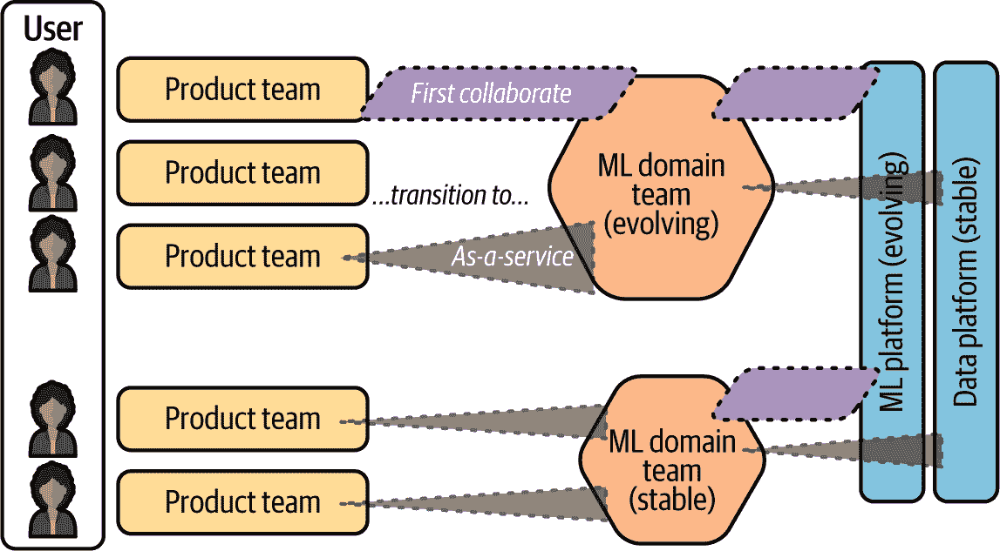

# 附录 D. 欧盟人工智能法案合规的组织中新兴角色

欧盟人工智能法案的合规在两个层面上得到实施：组织层面和个体人工智能系统层面。随着组织越来越多地采用人工智能技术，新的角色正在出现以支持合规努力和管理相关风险。本附录探讨了这些角色和常见的团队拓扑结构。

# 新兴角色

*人工智能伦理专家* 在确保人工智能系统设计与实施符合伦理原则方面发挥着关键作用。他们的职责包括制定人工智能伦理价值观、指南和框架（见[价值观画布](https://oreil.ly/c79Xu)），以及进行人工智能项目的伦理影响评估。他们解决与人工智能系统中的偏见、公平性和透明度相关的问题，并与法律、合规和人工智能开发团队紧密合作。保持对人工智能伦理研究和最佳实践的最新了解也是他们角色的重要组成部分。

*人工智能内部审计师* 负责独立评估人工智能系统以确保其符合伦理和监管标准。这包括进行审计以评估人工智能系统的公平性、透明度和问责制，并将它们与组织政策和外部法规进行比较。审计师提供改进人工智能系统合规性的建议，并开发特定于人工智能的审计框架和方法。与人工智能伦理专家和合规官员的合作是这个角色的关键方面。

*法律人工智能合规官员* 或 *人工智能监管事务专家* 的角色是确保人工智能系统符合适用的法律和法规。这需要了解不断发展的人工智能立法，制定人工智能项目的合规策略，进行法律风险评估，并提供关于数据隐私和人工智能透明度的指导。他们与法律团队、人工智能开发团队和人工智能伦理专家紧密合作。

*数据和人工智能治理专家* 制定并实施确保数据和管理人工智能资产负责任管理的政策。这包括创建数据和人工智能治理框架，执行符合数据保护法规（如 GDPR 和 CCPA）的合规性，建立数据质量和元数据管理实践，以及制定人工智能模型版本和生命周期管理的政策。他们与数据工程师、人工智能团队和合规官员紧密合作，以确保这些政策的有效实施。

*AI 风险管理人员*负责识别、评估和减轻与 AI 系统相关的风险。这包括对 AI 项目和部署进行风险评估，制定风险缓解策略，并持续监控 AI 系统以识别潜在风险和漏洞。他们与 AI 安全专家和合规官员合作，并向领导层提供与风险相关的见解，以供决策参考。

*AI 安全专家*确保 AI 系统免受威胁和漏洞的侵害。他们在 AI 开发和部署中实施安全最佳实践，对 AI 模型和系统进行安全评估，并开发针对 AI 特定威胁（如模型中毒和对抗性攻击）的防御措施。他们还监控 AI 系统以识别安全异常，并与网络安全团队和 MLOps 工程师紧密合作，以维护 AI 系统的安全性。

这些角色嵌入到更广泛的组织结构中，如跨职能团队或治理委员会。

在下一节中，我们将探讨[团队拓扑学](https://oreil.ly/ZW6OJ)，这是一个组织和管理软件开发团队以优化工作流程和交付的框架。我们将扩展这一概念到机器学习团队，并探讨与欧盟 AI 法案合规相关的新兴角色如何有效整合。

# 欧盟 AI 法案合规对机器学习团队

马修·斯凯尔顿和曼努埃尔·帕伊斯开发了团队拓扑学的核心概念，并在他们 2019 年同名书籍中介绍了这一概念。该框架定义了四种基本团队类型（见图 D-1 和 D-2）：

+   *流对齐团队*是主要的团队类型，专注于直接向客户或用户提供价值。他们在一个特定的产品、服务或功能集上工作，这些产品、服务或功能集与业务领域对齐。

+   *平台团队*提供内部服务和工具，以支持并加速与流对齐的团队。通过提供自助服务能力，他们旨在减轻其他团队的认知负荷。

+   *复杂子系统团队*处理复杂组件或需要专业知识的领域，这些领域与流对齐的团队可能不具备。

+   *赋能团队*协助其他团队采用新技术或克服障碍。他们提供专业知识和指导。

团队拓扑学还定义了团队之间的三种核心交互模式（见图 D-1）：

+   *协作*，即团队在定义的期间内紧密合作

+   *X-as-a-service*，即一个团队提供另一个团队消费的服务

+   *促进*，即一个团队帮助另一个团队学习或开发新的能力

###### 图 D-1。四种团队类型和三种交互模式。图片来自马修·斯凯尔顿和曼努埃尔·帕伊斯的书籍《团队拓扑学》（IT 革命）。经许可使用。

###### 图 D-2\. 四种基本团队拓扑的主要交互模式。图片来自 Matthew Skelton 和 Manuel Pais 所著的《团队拓扑》（IT Revolution）。经许可使用。

团队拓扑的核心原则指导有效的团队组织和动态。一个关键原则是康威定律，它指出“组织设计系统，这些系统反映了它们的沟通结构”——换句话说，这些系统的结构往往反映了团队的组织和互动方式。这突出了有意设计团队结构以支持所需系统架构的重要性。

团队拓扑框架也强调了团队只处理他们能够有效管理的复杂性的需求，以避免过度的认知负荷。优先考虑集体智慧而非个人能力，鼓励团队优先的思维方式。团队拓扑还促进为团队责任定义自然边界，并确保团队封装，具有清晰、明确定义的接口。最后，随着技术和组织需求的变化，演变团队结构是必不可少的。

## 机器学习团队的团队拓扑

随着机器学习/人工智能技术的快速采用，很明显，数据科学和机器学习团队并不都整齐地适合复杂的子系统团队类别。在实践中，它们经常跨越多个团队类型。David Tan、Ada Leung 和 David Colls 在他们所著的[*有效的机器学习团队*](https://oreil.ly/zK4s0)（O'Reilly）一书中探讨了这一想法，其中他们区分了机器学习空间中的四种团队类型：

+   *机器学习产品团队*（流对齐）提供面向用户的机器学习功能，对其他团队的依赖性最小。

+   *机器学习领域团队*（复杂子系统）专注于针对特定领域定制的复杂机器学习应用。

+   *机器学习和数据平台团队*提供基础机器学习和数据能力，以支持其他团队并减少工作重复。

+   *使机器学习团队*专注于机器学习产品开发的特定方面，并为其他团队提供帮助。

如图 D-3 所示，机器学习领域团队之间的交互模式从协作到作为服务提供机器学习解决方案。凭借其在高级机器学习模型和特定领域任务（例如，零售预测、内容推荐、流失预测）方面的专业知识，它作为组织内部的协作单元运作。它还向多个与流对齐的团队提供机器学习模型和能力作为服务，确保组织内的各个团队可以利用机器学习专业知识而无需重复工作。

###### 图 D-3\. 机器学习领域团队的典型拓扑结构的可视化。图片来自 David Tan、Ada Leung 和 David Colls 所著的《有效的机器学习团队》（O'Reilly）。经许可使用。

## 将团队拓扑与道德、合规和治理角色对齐

现在你已经对核心团队拓扑结构及其与 AI 团队的关系有了了解，让我们看看这些如何与欧盟 AI 法案相结合。AI 团队的结构并非静态；它们根据组织的需要、规模和成熟度而演变。正如之前所讨论的，确保遵守 AI 法规和支持可信 AI 系统的开发需要引入新的、专业化的角色。以下小节给出了一些如何将这些新兴的伦理、合规和治理角色整合到团队拓扑框架中作为赋能团队或复杂子系统团队的例子。

### 赋能团队：AI 伦理和治理

在团队拓扑模型中，该团队作为一个赋能团队，专注于 AI 伦理、合规和治理。它可能包括以下角色：

+   AI 伦理专家

+   法律 AI 合规官员或 AI 监管事务专家

+   数据和 AI 治理专家

+   AI 风险管理专家

AI 伦理和治理团队将通过促进和协作支持其他团队（如 ML 产品或领域团队）。其目标是帮助这些团队应对伦理考量，确保遵守欧盟 AI 法案和其他数据与 AI 法规，并实施有效的治理实践。

组织的数据和 ML 平台团队可以将一些治理和合规能力纳入其产品中，例如通过将伦理 AI 指南和清单嵌入到 ML 开发工作流程中，在 ML 管道中实施自动合规检查，或提供预先批准的、符合规定的数据源和模型架构。

### 复杂子系统团队：数据和 AI 安全和审计

该团队处理 AI 安全和审计的复杂和专业方面。它将包括以下角色：

+   数据和 AI 安全专家

+   AI 内部审计师

该团队主要在 X-as-a-service 交互模式下运行，为组织内的 ML 团队提供安全和审计能力。

通过将这里描述的新兴伦理、合规和治理角色整合到 ML 团队团队拓扑框架中，组织可以将适当的数据和 AI 治理直接嵌入到其开发工作流程中。这种方法支持遵守欧盟 AI 法案和相关法规，同时保留团队拓扑设计旨在实现的快速流动、清晰的拥有权和降低认知负荷的益处。
