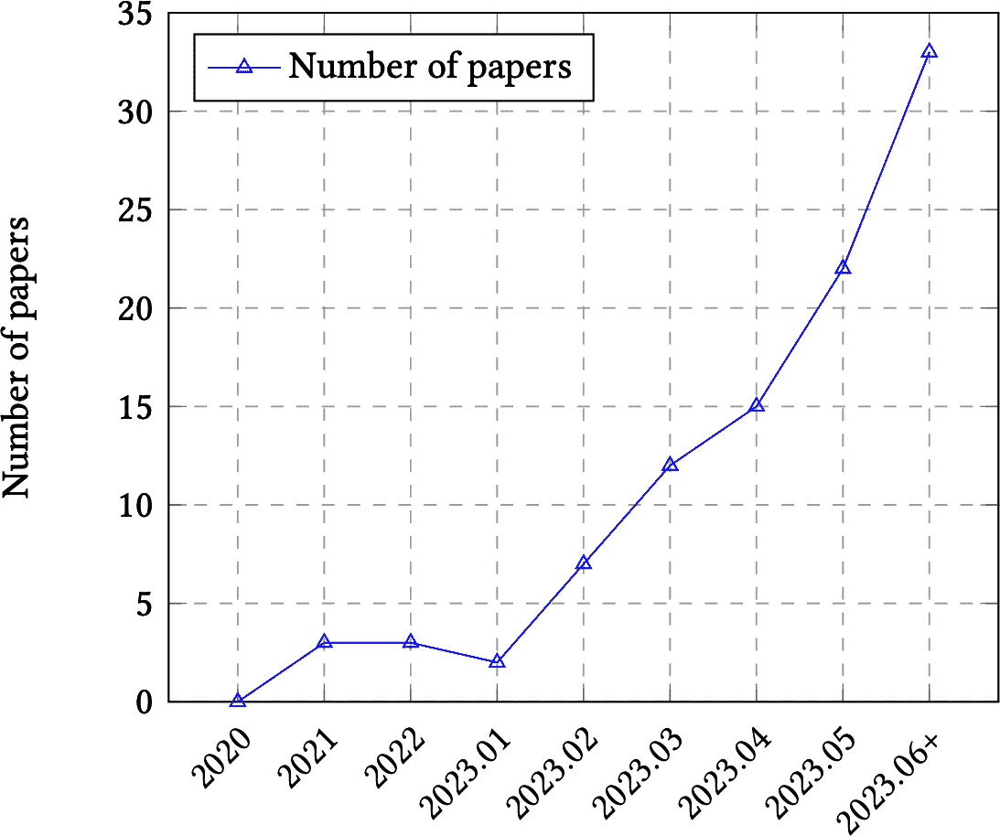
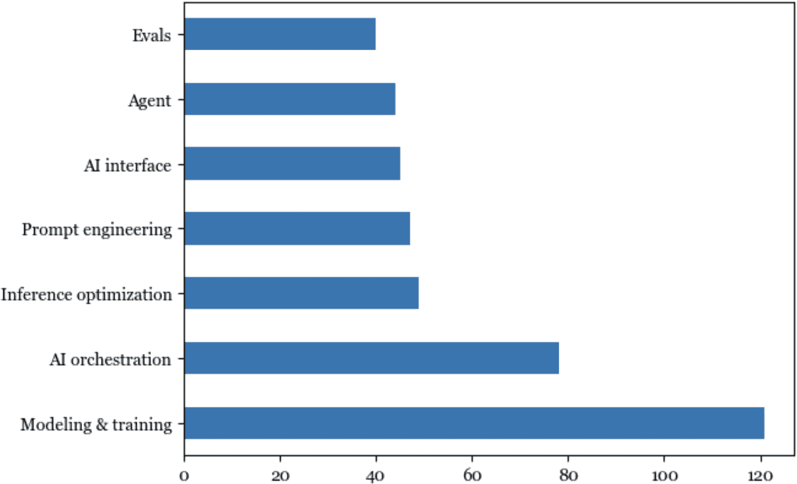
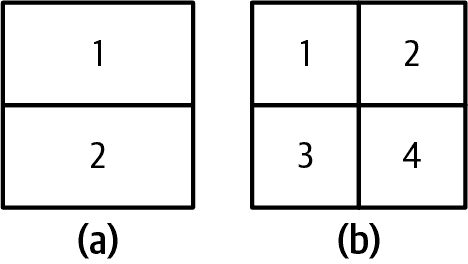
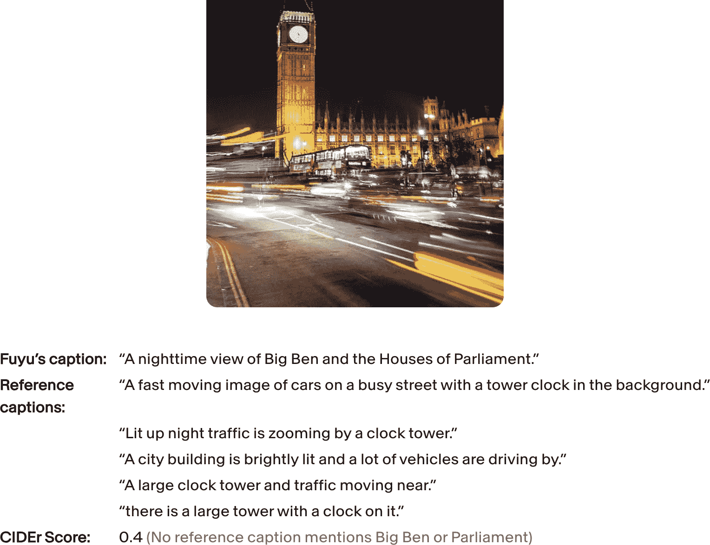
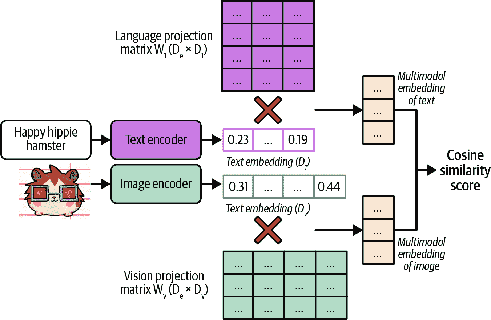
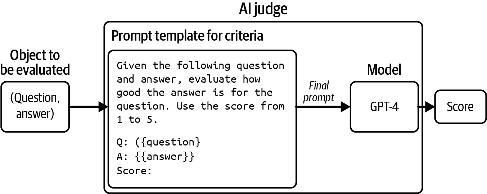
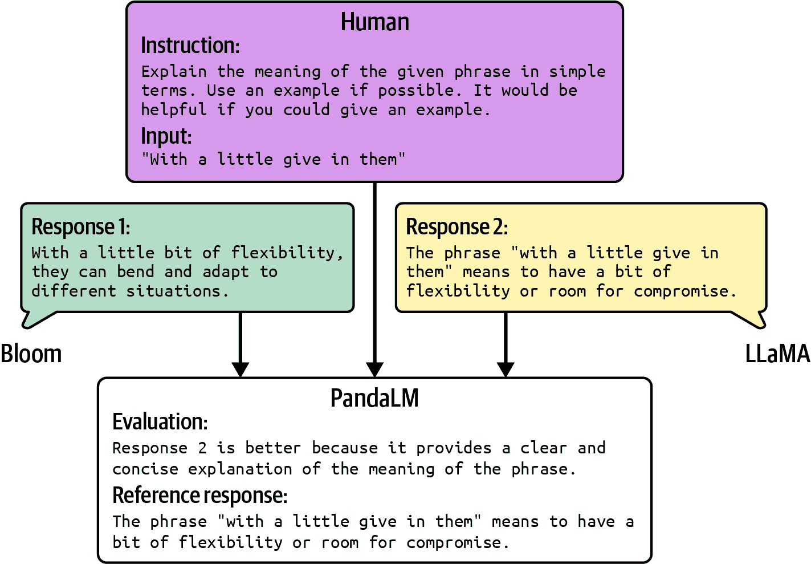
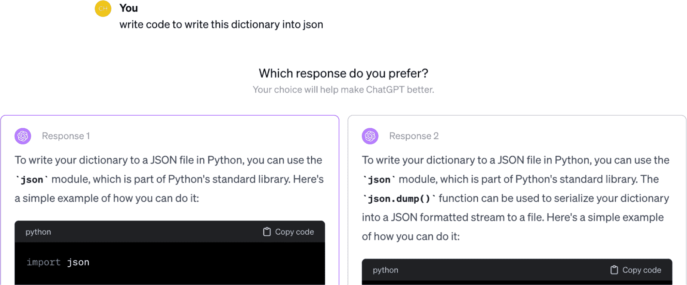

# 第三章\. 评估方法学

人工智能的使用越多，发生灾难性失败的机会就越大。我们已经看到，在基础模型存在的不长的时间里，已经出现了许多失败。一个人在聊天机器人的[鼓励](https://oreil.ly/tMH21)下自杀。律师提交了由人工智能[生成的虚假证据](https://oreil.ly/-0Iq1)。加拿大航空被命令支付赔偿，因为其人工智能聊天机器人[向乘客提供了错误信息](https://oreil.ly/kKWnZ)。如果没有一种方法来质量控制人工智能输出，人工智能的风险可能超过其在许多应用中的益处。

随着团队纷纷采纳人工智能，许多人很快意识到将人工智能应用变为现实的最大障碍是评估。对于某些应用，确定评估方法可能需要占据大部分开发工作。1

由于评估的重要性与复杂性，本书对此进行了两章的讨论。本章涵盖了用于评估开放性模型的多种评估方法，这些方法是如何工作的，以及它们的局限性。下一章将重点介绍如何使用这些方法为您的应用选择模型，并构建评估管道以评估您的应用。

虽然我在单独的章节中讨论了评估，但评估必须在整个系统的背景下考虑，而不是孤立地考虑。评估的目的是减轻风险并揭示机会。为了减轻风险，您首先需要确定系统可能失败的地方，并围绕这些地方设计评估。通常，这可能需要重新设计系统以增强对其失败的可见性。如果没有对系统失败地点的明确理解，那么无论多少评估指标或工具都无法使系统变得稳健。

在深入研究评估方法之前，重要的是要承认评估基础模型的挑战。由于评估困难，许多人满足于“口碑”^(^(2))（例如，有人说模型 X 很好）或仅凭肉眼查看结果.^(3) 这会带来更多的风险并减缓应用迭代。相反，我们需要投资于系统性的评估，以使结果更加可靠。

由于许多基础模型具有语言模型组件，本章将简要概述用于评估语言模型的指标，包括交叉熵和困惑度。这些指标对于指导语言模型的训练和微调至关重要，并且在许多评估方法中经常被使用。

评估基础模型尤其具有挑战性，因为它们是开放性的，我将介绍如何应对这些挑战的最佳实践。对于许多应用来说，使用人工评估员仍然是一个必要的选项。然而，鉴于人工标注既缓慢又昂贵，目标是自动化这一过程。本书专注于自动评估，这包括精确评估和主观评估。

主观评估领域的新星是作为裁判的 AI——即使用 AI 来评估 AI 响应的方法。这是主观的，因为评分取决于 AI 裁判使用的模型和提示。虽然这种方法在业界迅速获得认可，但也引起了那些认为 AI 不足以胜任这项重要任务的人的强烈反对。我特别期待深入探讨这个话题，也希望你们会一样。

# 基础模型评估的挑战

评估机器学习模型一直都很困难。随着基础模型的引入，评估变得更加困难。评估基础模型比评估传统机器学习模型更具挑战性的原因有很多。

首先，随着 AI 模型变得越来越智能，评估它们变得越来越困难。大多数人可以判断一年级学生的数学解答是否正确。很少有人能对博士水平的数学解答做出同样的判断。4 如果一本书的摘要满是胡言乱语，那么判断其摘要是否糟糕很容易，但如果摘要条理清晰，那就困难得多。为了验证摘要的质量，你可能需要先阅读这本书。这引出一个推论：对于复杂任务，评估可能需要更多的时间。你不能再仅仅根据响应听起来如何来评估它。你还需要进行事实核查、推理，甚至结合领域专业知识。

第二，基础模型的开放性本质削弱了传统的方法，即通过对比真实情况来评估模型。在传统的机器学习中，大多数任务都是封闭的。例如，一个分类模型只能输出预期的类别之一。要评估一个分类模型，你可以将其输出与预期的输出进行比较。如果预期的输出是类别 X，但模型的输出是类别 Y，那么模型就是错误的。然而，对于开放性任务，对于给定的输入，有如此多的可能正确响应。不可能编制一个全面的正确输出列表来与之比较。

第三，大多数基础模型被视为黑盒，要么是因为模型提供者选择不公开模型细节，要么是因为应用开发者缺乏理解它们的专长。模型架构、训练数据和训练过程等细节可以揭示模型的优势和劣势。没有这些细节，你只能通过观察其输出来评估模型。

同时，公开可用的评估基准已被证明不足以评估基础模型。理想情况下，评估基准应捕捉到模型能力的全部范围。随着 AI 的发展，基准需要进化以跟上。一旦模型达到完美分数，基准就会对模型饱和。对于基础模型，基准正迅速饱和。基准[GLUE](https://arxiv.org/abs/1804.07461)（通用语言理解评估）于 2018 年发布，并在一年内饱和，这促使 2019 年引入了[SuperGLUE](https://arxiv.org/abs/1905.00537)。同样，[NaturalInstructions](https://arxiv.org/abs/2104.08773)（2021）被[Super-NaturalInstructions](https://arxiv.org/abs/2204.07705)（2022）所取代。[MMLU](https://arxiv.org/abs/2009.03300)（2020），一个许多早期基础模型依赖的强大基准，在很大程度上被[MMLU-Pro](https://arxiv.org/abs/2406.01574)（2024）所取代。

最后但同样重要的是，评估的范围已经扩展到了通用模型。对于特定任务的模型，评估涉及测量模型在其训练任务上的性能。然而，对于通用模型，评估不仅关于评估模型在已知任务上的性能，还关于发现模型可以执行的新任务，这些任务可能包括超出人类能力范围的任务。评估承担了探索 AI 潜力和局限性的额外责任。

好消息是，评估的新挑战促使许多新的方法和基准出现。图 3-1 显示，2023 年上半年，关于 LLM 评估的已发表论文数量每月呈指数增长，从每月 2 篇增加到几乎每月 35 篇。



###### 图 3-1\. 随时间推移的 LLM 评估论文趋势。图片来自[Chang 等人（2023）](https://arxiv.org/abs/2307.03109)。

在我对 GitHub 上按星级排名的[前 1000 个 AI 相关仓库](https://huyenchip.com/llama-police)的分析中，我发现超过 50 个仓库专注于评估（截至 2024 年 5 月）。当按创建日期绘制评估仓库数量时，增长曲线看起来是指数级的，如图图 3-2 所示.^(5)

坏消息是，尽管对评估的兴趣增加，但在整个人工智能工程流程中，对评估的兴趣仍然落后。[DeepMind 的 Balduzzi 等人](https://arxiv.org/abs/1806.02643)在他们的论文中指出，“与开发算法相比，开发评估得到的系统关注很少。”根据论文，实验结果几乎完全用于改进算法，而很少用于改进评估。认识到对评估的投资不足，[Anthropic](https://oreil.ly/gPbjS)呼吁政策制定者增加政府资金和拨款，用于开发新的评估方法和分析现有评估的鲁棒性。



描述自动生成，置信度中等](assets/aien_0302.png)

###### 图 3-2\. 在 GitHub 上 1,000 个最受欢迎的 AI 代码库中开源评估代码库的数量。

为了进一步说明在人工智能领域，对评估的投资落后于其他领域，评估工具的数量与建模、训练和人工智能编排工具的数量相比很少，如图 3-3 所示。

投资不足导致基础设施不足，使得人们难以进行系统性的评估。当被问及他们如何评估他们的 AI 应用时，许多人告诉我他们只是凭直觉看了结果。许多人有一小套固定的提示词，他们用这些提示词来评估模型。这些提示词的编纂过程是临时的，通常基于编纂者的个人经验，而不是基于应用的需求。在启动项目时，你可能可以通过这种临时方法侥幸成功，但这种方法不足以支持应用的迭代。本书侧重于评估的系统方法。


描述自动生成](assets/aien_0303.png)

###### 图 3-3\. 根据来源于我列出的 GitHub 上 1,000 个最受欢迎的 AI 代码库的数据，在开源工具方面，评估在人工智能工程的其他方面落后。

# 理解语言建模指标

基础模型是从语言模型演变而来的。许多基础模型仍然将语言模型作为其主要组成部分。对于这些模型，语言模型组件的性能往往与基础模型在下游应用中的性能高度相关([Liu 等人，2023](https://oreil.ly/vX-My))。因此，对语言建模指标的大致了解对于理解下游性能非常有帮助.^(6)

如第一章所述，语言模型已经存在了几十年，由克劳德·香农在 1951 年的论文“预测和印刷英语的熵”中普及。自那时起，用于指导语言模型发展的指标并没有太大变化。大多数自回归语言模型都是使用交叉熵或其相关指标困惑度进行训练的。当阅读论文和模型报告时，你也可能会遇到每字符比特数（BPC）和每字节比特数（BPB）；两者都是交叉熵的变体。

所有四个指标——交叉熵、困惑度、BPC 和 BPB——都密切相关。如果你知道其中一个的值，在提供必要信息的情况下，你可以计算出其他三个。虽然我将它们称为语言模型指标，但它们可以用于任何生成标记序列的模型，包括非文本标记。

记住，语言模型编码了关于语言统计信息（一个标记在给定上下文中出现的可能性）。从统计上讲，给定上下文“我喜欢喝 __”，下一个词更有可能是“茶”而不是“木炭”。一个模型能够捕捉到的统计信息越多，它在预测下一个标记方面的能力就越强。

在机器学习术语中，语言模型学习其训练数据的分布。这个模型学得越好，它在预测训练数据中的下一个内容方面的能力就越强，其训练交叉熵就越低。与任何机器学习模型一样，你不仅关心它在训练数据上的表现，还关心它在生产数据上的表现。一般来说，你的数据越接近模型的训练数据，模型在你的数据上的表现就越好。

与本书的其余部分相比，本节数学内容较多。如果你觉得这部分内容难以理解，可以自由地跳过数学部分，专注于对这些指标的解释讨论。即使你不在训练或微调语言模型，理解这些指标也有助于评估适用于你应用的最佳模型。这些指标有时可用于某些评估和数据去重技术，如本书中所述。

## 熵

*熵*衡量一个标记平均携带多少信息。熵越高，每个标记携带的信息越多，表示一个标记所需的位数也越多。7)

让我们用一个简单的例子来说明这一点。想象一下，你想要创建一种语言来描述正方形内的位置，如图图 3-4 所示。如果你的语言只有两个标记，如图图 3-4 中的(a)所示，每个标记都可以告诉你位置是上方还是下方。由于只有两个标记，一个比特就足以表示它们。因此，这种语言的熵为 1。



###### 图 3-4\. 两种语言描述方形内的位置。与左边的语言（a）相比，右边的标记（b）携带更多信息，但需要更多的比特来表示它们。

如果你的语言有四个标记，如图 3-4 中的(b)所示，每个标记可以给你一个更具体的位置：左上角、右上角、左下角或右下角。然而，由于现在有四个标记，你需要两个比特来表示它们。这种语言的熵是 2。这种语言的熵更高，因为每个标记携带更多信息，但每个标记需要更多的比特来表示。

直观地说，熵衡量的是在一种语言中预测接下来会发生什么有多困难。一种语言的熵越低（一个语言标记携带的信息越少），这种语言的可预测性就越高。在我们的上一个例子中，只有两个标记的语言比有四个标记的语言更容易预测（你只需要在两个可能的标记中进行预测，而四个标记则需要更多）。这类似于如果你可以完美地预测我接下来会说什么，我说的话就不再包含任何新信息。

## 交叉熵

当你在数据集上训练语言模型时，你的目标是让模型学习训练数据的分布。换句话说，你的目标是让模型预测训练数据中的下一个内容。语言模型在数据集上的交叉熵衡量语言模型预测数据集中下一个内容有多困难。

模型在训练数据上的交叉熵取决于两个品质：

1.  训练数据的可预测性，通过训练数据的熵来衡量

1.  语言模型捕捉到的分布与训练数据的真实分布之间的差异

熵和交叉熵具有相同的数学符号，*H*。设 *P* 为训练数据的真实分布，*Q* 为语言模型学习的分布。因此，以下成立：

+   因此，训练数据的熵是 *H*(*P*)。

+   *Q* 相对于 *P* 的差异可以使用 Kullback–Leibler（KL）散度来衡量，它在数学上表示为 $upper D Subscript upper K upper L Baseline left-parenthesis upper P StartAbsoluteValue EndAbsoluteValue upper Q right-parenthesis$ .

+   模型相对于训练数据的交叉熵是：$upper H left-parenthesis upper P comma upper Q right-parenthesis equals upper H left-parenthesis upper P right-parenthesis plus upper D Subscript upper K upper L Baseline left-parenthesis upper P StartAbsoluteValue EndAbsoluteValue upper Q right-parenthesis$ .

交叉熵不是对称的。*Q* 相对于 *P* 的交叉熵—*H*(*P*, *Q*)—与 *P* 相对于 *Q* 的交叉熵—*H*(*Q*, *P*)—是不同的。

语言模型被训练以最小化其与训练数据的交叉熵。如果语言模型能够完美地从其训练数据中学习，那么模型的交叉熵将正好等于训练数据的熵。因此，Q 相对于 P 的 KL 散度将为 0。你可以将模型的交叉熵视为其对训练数据熵的近似。

## 每字符比特数和每字节比特数

信息熵和交叉熵的单位是比特。如果一个语言模型的交叉熵是 6 比特，那么这个语言模型需要 6 比特来表示每个标记。

由于不同的模型有不同的分词方法——例如，一个模型使用单词作为标记，而另一个模型使用字符作为标记——因此不同模型之间的每标记比特数是不可比较的。有些人使用每字符比特数（BPC）来代替。如果每标记的比特数是 6，并且平均每个标记由 2 个字符组成，那么 BPC 是 6/2 = 3。

每字符比特数（BPC）的一个复杂之处在于不同的字符编码方案。例如，在 ASCII 中，每个字符使用 7 比特进行编码，但在 UTF-8 中，一个字符可以使用 8 到 32 比特之间的任意比特数进行编码。一个更标准化的指标是每字节比特数（BPB），即语言模型需要表示原始训练数据中的一个字节的比特数。如果 BPC 是 3，每个字符是 7 比特，或者说是字节的 7/8，那么 BPB 是 3 / (7/8) = 3.43。

交叉熵告诉我们语言模型在压缩文本方面的效率。如果一个语言模型的 BPB 是 3.43，这意味着它可以使用 3.43 比特来表示每个原始字节（8 比特），那么这个语言模型可以将原始训练文本压缩到原始文本大小的一半以下。

## 困惑度

*困惑度*是熵和交叉熵的指数。困惑度通常简称为 PPL。给定一个具有真实分布*P*的数据集，其困惑度定义为：

$PPL(P) = 2^{H(P)}$

在这个数据集上，语言模型（具有学习到的分布*Q*）的困惑度定义为：

$PPL(P, Q) = 2^{H(P, Q)}$

如果交叉熵衡量模型预测下一个标记的难度，那么困惑度衡量的是模型在预测下一个标记时的不确定性。更高的不确定性意味着下一个标记有更多的可能选项。

考虑一个训练有素的语言模型，它可以完美地编码 4 位置标记，如图 3-4（b）所示。这个语言模型的交叉熵是 2 比特。如果这个语言模型试图预测方格中的位置，它必须在 4 个可能选项中选择。因此，这个语言模型的困惑度是 4。

到目前为止，我一直使用*bit*作为熵和交叉熵的单位。每个比特可以表示 2 个独特的值，因此前一个困惑度方程中的基数是 2。

流行的机器学习框架，包括 TensorFlow 和 PyTorch，使用*nat*（自然对数）作为熵和交叉熵的单位。Nat 使用自然对数的底数[*e*](https://en.wikipedia.org/wiki/E_(mathematical_constant))。如果你使用*nat*作为单位，困惑度是*e*的指数：

$upper P upper P upper L left-parenthesis upper P comma upper Q right-parenthesis equals e Superscript upper H left-parenthesis upper P comma upper Q right-parenthesis$

由于对*bit*和*nat*的混淆，许多人报告的是困惑度，而不是交叉熵，当报告他们的语言模型性能时。

## 困惑度的解释和应用场景

如前所述，交叉熵、困惑度、BPC 和 BPB 是语言模型预测准确度测量的变体。模型能够更准确地预测文本，这些指标就越低。在这本书中，我将使用困惑度作为默认的语言模型度量。记住，模型在预测给定数据集中接下来发生的事情的不确定性越大，困惑度就越高。

被认为好的困惑度值取决于数据本身以及困惑度是如何计算的，例如模型可以访问多少个之前的标记。以下是一些一般规则：

更结构化的数据给出更低的预期困惑度

更结构化的数据更具可预测性。例如，HTML 代码比日常文本更具可预测性。如果你看到一个开头的 HTML 标签如`<head>`，你可以预测附近应该有一个闭合标签`</head>`。因此，模型在 HTML 代码上的预期困惑度应该低于在日常文本上的预期困惑度。

词汇表越大，困惑度越高

直观来说，可能的标记越多，模型预测下一个标记就越困难。例如，一个模型在儿童读物上的困惑度可能低于在《战争与和平》上的困惑度。对于相同的数据集，比如英语，基于字符的困惑度（预测下一个字符）将低于基于单词的困惑度（预测下一个单词），因为可能的字符数量少于可能的单词数量。

上下文长度越长，困惑度越低

模型拥有的上下文越多，它在预测下一个标记时的不确定性就越小。在 1951 年，克劳德·香农通过使用它来预测最多 10 个之前的标记来评估他的模型的交叉熵。截至本文写作时，一个模型的困惑度通常可以在 500 到 10,000 个之前的标记之间计算和条件化，可能更多，上限是模型的最大上下文长度。

为了参考，看到困惑度值低至 3 甚至更低并不罕见。如果假设中的语言中所有标记发生的概率相等，那么困惑度为 3 意味着该模型有 1/3 的机会正确预测下一个标记。考虑到一个模型的词汇量在数千到数万之间，这些概率是惊人的。

除了指导语言模型的训练外，困惑度在人工智能工程工作流程的许多部分都很有用。首先，困惑度是衡量模型能力的一个很好的代理指标。如果一个模型在预测下一个标记方面表现不佳，那么它在下游任务上的表现也可能不佳。OpenAI 的 GPT-2 报告显示，更大的模型，也就是更强大的模型，在一系列数据集上始终给出较低的困惑度，如表 3-1 所示。遗憾的是，随着公司越来越不愿意透露他们的模型信息，许多公司已经停止报告他们模型的困惑度。

表 3-1\. 较大的 GPT-2 模型在不同数据集上始终给出较低的困惑度。来源：[OpenAI, 2018](https://oreil.ly/Loidb)。

|  | LAMBADA (PPL) | LAMBADA (ACC) | CBT-CN (ACC) | CBT-NE (ACC) | WikiText2 (PPL) | PTB (PPL) | enwiki8 (BPB) | text8 (BPC) | WikiText103 (PBL) | IBW (PPL) |
| --- | --- | --- | --- | --- | --- | --- | --- | --- | --- | --- |
| SOTA | 99.8 | 59.23 | 85.7 | 82.3 | 39.14 | 46.54 | 0.99 | 1.08 | 18.3 | 21.8 |
| 117M | 35.13 | 45.99 | 87.65 | 83.4 | 29.41 | 65.85 | 1.16 | 1.17 | 37.50 | 75.20 |
| 345M | 15.60 | 55.48 | 92.35 | 87.1 | 22.76 | 47.33 | 1.01 | 1.06 | 26.37 | 55.72 |
| 762M | 10.87 | 60.12 | 93.45 | 88.0 | 19.93 | 40.31 | 0.97 | 1.02 | 22.05 | 44.575 |
| 1542M | 8.63 | 63.24 | 93.30 | 89.05 | 18.34 | 35.76 | 0.93 | 0.98 | 17.48 | 42.16 |

###### 警告

困惑度可能不是评估使用 SFT 和 RLHF 等技术进行后训练的模型的一个很好的代理指标。后训练是关于教会模型如何完成任务。随着模型在完成任务方面变得更好，它可能在预测下一个标记方面变得更差。语言模型的困惑度通常在训练后会增加。有些人说后训练*崩溃*了熵。同样，量化——一种降低模型数值精度及其内存占用的一种技术——也可能以意想不到的方式改变模型的困惑度。9

记住，一个模型相对于文本的困惑度衡量了该模型预测该文本的难度。对于给定的模型，困惑度在模型在训练期间看到并记忆的文本中最低。因此，困惑度可以用来检测文本是否在模型的训练数据中。这对于检测数据污染很有用——如果模型在基准数据上的困惑度低，那么这个基准很可能包含在模型的训练数据中，使得模型在这个基准上的表现不太可信。这也可以用于训练数据的去重：例如，只有当新数据的困惑度高时，才将新数据添加到现有的训练数据集中。

对于不可预测的文本，如表达不寻常想法的文本（例如，“我的狗在空闲时间教授量子物理学”）或胡言乱语（例如，“家猫去眼睛”），困惑度是最高的。因此，困惑度可以用来检测异常文本。

困惑度及其相关指标帮助我们了解底层语言模型的表现，这可以作为理解模型在下游任务上表现的一个代理。本章的其余部分将讨论如何直接测量模型在下游任务上的表现。

# 精确评估

在评估模型的表现时，区分精确评估和主观评估非常重要。精确评估产生的是没有歧义的判断。例如，如果多项选择题的答案是 A，而你选择了 B，你的答案就是错误的。在这方面没有歧义。另一方面，论文评分是主观的。论文的分数取决于评分者。同一个人，如果隔了一段时间再次评分，可能会给出不同的分数。有了明确的评分指南，论文评分可以变得更加精确。正如你将在下一节中看到的，作为评判者的 AI 是主观的。评估结果可能会根据评判模型和提示而改变。

我将介绍两种产生精确分数的评估方法：功能正确性和与参考数据的相似度测量。请注意，本节重点在于评估开放式回答（任意文本生成），而不是封闭式回答（如分类）。这并不是因为基础模型没有用于封闭式任务。事实上，许多基础模型系统至少包含一个分类组件，通常用于意图分类或评分。本节重点在于开放式评估，因为封闭式评估已经得到了很好的理解。

## 功能正确性

功能正确性评估意味着根据系统是否执行了预期的功能来评估系统。例如，如果你要求一个模型创建一个网站，生成的网站是否符合你的要求？如果你要求一个模型在某家餐厅预订，模型是否成功？

功能正确性是评估任何应用程序性能的终极指标，因为它衡量了你的应用程序是否做了它打算做的事情。然而，功能正确性并不总是容易衡量，其测量也不能轻易自动化。

代码生成是功能正确性测量可以自动化的任务示例。在编码中，功能正确性有时被称为*执行精度*。比如说，你要求模型编写一个 Python 函数`gcd(num1, num2)`，以找到两个数 num1 和 num2 的最大公约数（gcd）。然后可以将生成的代码输入到 Python 解释器中，以检查代码是否有效，如果是的话，是否输出给定一对`(num1, num2)`的正确结果。例如，给定一对`(num1=15, num2=20)`，如果函数`gcd(15, 20)`没有返回正确答案 5，你知道该函数是错误的。

在人工智能被用于编写代码之前，自动验证代码的功能正确性是软件工程中的标准做法。代码通常通过[单元测试](https://en.wikipedia.org/wiki/Unit_testing)进行验证，其中代码在不同的场景下执行，以确保它生成预期的输出。功能正确性评估是 LeetCode 和 HackerRank 等编码平台验证提交的解决方案的方式。

评估人工智能代码生成能力的流行基准，例如[OpenAI 的 HumanEval](https://oreil.ly/CjYs9)和[Google 的 MBPP](https://github.com/google-research/google-research/tree/master/mbpp)（主要是基本 Python 问题数据集），将功能正确性作为其指标。像 Spider ([Yu et al., 2018](https://oreil.ly/ijU20))、BIRD-SQL（大规模数据库基于文本的 SQL 基准）([Li et al., 2023](https://oreil.ly/rrSS9))和 WikiSQL ([Zhong, et al., 2017](https://arxiv.org/abs/1709.00103))这样的文本到 SQL（从自然语言生成 SQL 查询）基准也依赖于功能正确性。

基准问题附带一组测试用例。每个测试用例包括代码应运行的场景和该场景的预期输出。以下是在 HumanEval 中一个问题和其测试用例的示例：

```py
Problem

from typing import List

def has_close_elements(numbers: List[float], threshold: float) -> bool:
      """ Check if in given list of numbers, are any two numbers closer to each 
      other than given threshold.
      >>> has_close_elements([1.0, 2.0, 3.0], 0.5) False
      >>> has_close_elements([1.0, 2.8, 3.0, 4.0, 5.0, 2.0], 0.3) True 
      """

Test cases (each assert statement represents a test case)

def check(candidate):
      assert candidate([1.0, 2.0, 3.9, 4.0, 5.0, 2.2], 0.3) == True
      assert candidate([1.0, 2.0, 3.9, 4.0, 5.0, 2.2], 0.05) == False
      assert candidate([1.0, 2.0, 5.9, 4.0, 5.0], 0.95) == True
      assert candidate([1.0, 2.0, 5.9, 4.0, 5.0], 0.8) == False
      assert candidate([1.0, 2.0, 3.0, 4.0, 5.0, 2.0], 0.1) == True
      assert candidate([1.1, 2.2, 3.1, 4.1, 5.1], 1.0) == True
      assert candidate([1.1, 2.2, 3.1, 4.1, 5.1], 0.5) == False

```

当评估一个模型时，对于每个问题，会生成一定数量的代码样本，记为*k*。如果一个模型生成的*k*个代码样本中任何一个都能通过该问题的所有测试用例，则该模型解决了该问题。最终得分，称为*pass@k*，是解决的所有问题中解决问题的比例。如果有 10 个问题，并且一个模型用*k* = 3 解决了 5 个，那么该模型的 pass@3 得分是 50%。一个模型生成的代码样本越多，该模型解决每个问题的机会就越大，因此最终得分就越高。这意味着在期望中，pass@1 得分应该低于 pass@3，而 pass@3 得分应该低于 pass@10。

另一类可以自动评估其功能正确性的任务是游戏机器人。如果你创建一个玩*俄罗斯方块*的机器人，你可以通过机器人获得的分数来判断它的好坏。具有可衡量目标的任务通常可以使用功能正确性来评估。例如，如果你要求 AI 安排你的工作负载以优化能耗，AI 的性能可以通过它节省的能源量来衡量.^(11)

## 与参考数据进行的相似度测量

如果你关心的任务不能使用功能正确性自动评估，一种常见的方法是将 AI 的输出与参考数据进行比较。例如，如果你要求一个模型将句子从法语翻译成英语，你可以将生成的英语翻译与正确的英语翻译进行比较。

参考数据中的每个示例都遵循格式（输入，参考响应）。一个输入可以有多个参考响应，例如一个法语句子的多个可能的英语翻译。参考响应也被称为*基准真实值*或*规范响应*。需要参考的指标是*基于参考的*，而不需要参考的指标是*无参考的*。

由于这种评估方法需要参考数据，因此它受到参考数据生成多少和速度的限制。参考数据通常由人类生成，越来越多地由 AI 生成。使用人类生成数据作为参考意味着我们将人类性能视为黄金标准，AI 的性能与人类性能相比较。人类生成数据可能很昂贵且耗时，导致许多人使用 AI 生成参考数据。AI 生成的数据可能仍然需要人类审查，但审查所需的劳动量远小于从头开始生成参考数据的劳动量。

与参考响应更相似的生成响应被认为是更好的。有两种方式来衡量两个开放式文本之间的相似度：

1.  要求评估员判断两个文本是否相同

1.  精确匹配：生成的响应是否与参考响应之一完全匹配

1.  词汇相似度：生成的响应在视觉上与参考响应的相似程度

1.  语义相似度：生成的响应在意义上与参考响应的接近程度（语义）

可以通过人工评估员或 AI 评估员来比较两种响应。AI 评估员越来越普遍，并将是下一节的重点。

本节重点介绍手工设计的指标：精确匹配、词汇相似度和语义相似度。精确匹配的分数是二进制的（匹配或不匹配），而其他两个分数是滑动尺度（例如在 0 到 1 或-1 到 1 之间）。尽管 AI 作为评委的方法易于使用且灵活，但手工设计的相似度测量在工业界仍然被广泛使用，因为它们的精确性。

###### 注意

本节讨论了如何使用相似度测量来评估生成输出的质量。然而，你也可以使用相似度测量来处理许多其他用例，包括但不限于以下内容：

检索和搜索

查找与查询相似的项

排序

根据与查询的相似度对项进行排序

聚类

根据彼此的相似度对项进行聚类

异常检测

检测与其它项最不相似的项

数据去重

移除与其他项过于相似的项

本节讨论的技术将在整本书中再次出现。

### 完全匹配

如果生成的响应与参考响应之一完全匹配，则被认为是完全匹配。完全匹配适用于期望简短、精确响应的任务，例如简单的数学问题、常识查询和 Trivia 风格的提问。以下是一些具有简短、精确响应的输入示例：

+   “2 + 3 等于多少？”

+   “谁是第一个获得诺贝尔奖的女性？”

+   “我的当前账户余额是多少？”

+   “填空题：巴黎到法国就像 ___ 到英国。”

有一些匹配的变体会考虑格式问题。一种变体是接受任何包含参考响应的输出作为匹配。考虑一下这个问题：“2 + 3 等于多少？”参考响应是“5”。这种变体接受所有包含“5”的输出，包括“答案是 5”和“2 + 3 等于 5”。

然而，这种变体有时可能导致接受错误的解决方案。考虑一下这个问题：“安妮·弗兰克出生在哪一年？”安妮·弗兰克出生于 1929 年 6 月 12 日，所以正确的响应是 1929 年。如果模型输出“1929 年 9 月 12 日”，则正确的年份包含在输出中，但输出在事实上是错误的。

在简单任务之外，完全匹配很少有效。给定原始法语句子“Comment ça va?”，有多个可能的英语翻译，例如“你好吗？”，“一切都好吗？”，以及“你怎么样？”。如果参考数据只包含这三种翻译，并且模型生成“How is it going?”，则模型的响应将被标记为错误。原始文本越长、越复杂，可能的翻译就越多。为输入创建一个可能的响应的详尽集合是不可能的。对于复杂任务，词汇相似度和语义相似度效果更好。

### 词汇相似度

词汇相似度衡量两个文本重叠的程度。你可以通过首先将每个文本分解成更小的标记来实现这一点。

在其最简单形式中，词汇相似度可以通过计算两个文本有多少共同标记来衡量。例如，考虑参考响应*“我的猫吓跑了老鼠”*和两个生成的响应：

+   “我的猫吃老鼠”

+   “猫和老鼠总是打架”

假设每个标记是一个单词。如果你只计算单个单词的重叠，响应 A 包含参考响应中的 5 个单词中的 4 个（相似度分数为 80%），而响应 B 只包含 5 个中的 3 个（相似度分数为 60%）。因此，响应 A 被认为与参考响应更相似。

测量词汇相似度的一种方法是*近似字符串匹配*，俗称*模糊匹配*。它通过计算将一个文本转换为另一个文本所需的编辑次数来衡量两个文本之间的相似度，这个数字被称为*编辑距离*。通常的三个编辑操作是：

1.  删除：“b*r*ad”删除为“bad”

1.  插入：将“bad”替换为“ba*r*d”

1.  替换：“b*a*d”替换为“b*e*d”

一些模糊匹配器也将置换（交换两个字母，例如，“ma*ts*” -> “ma*st*”）视为一个编辑。然而，一些模糊匹配器将每个置换视为两个编辑操作：一个删除和一个插入。

例如，“bad”只需一次编辑即可变为“bard”，而需要三次编辑才能变为“cash”，因此“bad”被认为比“cash”更接近“bard”。

测量词汇相似度的另一种方法是*n-gram 相似度*，它基于标记序列（*n-grams*）的重叠来衡量，而不是单个标记。1-gram（单语）是一个标记。2-gram（双语）是一组两个标记。“My cats scare the mice”包含四个双语：“my cats”、“cats scare”、“scare the”和“the mice”。你测量参考响应中 n-grams 的百分比，这些 n-grams 也出现在生成的响应中.^(12)

常用的词汇相似度度量标准有 BLEU、ROUGE、METEOR++、TER 和 CIDEr。它们在计算重叠部分的方式上有所不同。在基础模型出现之前，BLEU、ROUGE 及其相关度量标准很常见，尤其是在翻译任务中。随着基础模型的出现，使用词汇相似度的基准测试越来越少。使用这些度量标准的基准测试示例包括[WMT](https://oreil.ly/92yRh)、[COCO Captions](https://oreil.ly/BO3-0)和[GEMv2](https://arxiv.org/abs/2206.11249)。

这种方法的缺点是它需要整理一套全面的参考响应。如果参考集中不包含任何看起来类似的响应，一个好的响应可能会得到一个低的相似度分数。在某些基准测试示例中，[Adept](https://oreil.ly/OWD2v)发现其模型 Fuyu 表现不佳，并不是因为模型的输出是错误的，而是因为参考数据中缺少一些正确的答案。图 3-5 展示了 Fuyu 生成正确标题但得分较低的一个图像标题任务的示例。

不仅如此，参考文献也可能错误。例如，专注于检查机器翻译评估指标的 WMT 2023 Metrics 共享任务的组织者报告说，他们在数据中发现了许多质量低下的参考翻译。低质量的参考数据是参考无关指标在相关性方面成为基于参考指标强劲竞争者之一的原因（[Freitag 等人，2023](https://oreil.ly/tmWqk)）。

这种测量的另一个缺点是，更高的词汇相似度分数并不总是意味着更好的响应。例如，在 HumanEval 这个代码生成基准测试中，OpenAI 发现错误和正确解决方案的 BLEU 分数相似。这表明优化 BLEU 分数并不等同于优化功能性正确性（[Chen 等人，2021](https://arxiv.org/abs/2107.03374)）。



###### 图 3-5. Fuyu 生成正确选项但因其参考标题的限制而得到低分的例子。

### 语义相似度

词汇相似度衡量两个文本看起来是否相似，而不是它们是否有相同的意义。考虑以下两个句子：“What’s up?” 和 “How are you?” 从词汇上看，它们是不同的——它们使用的单词和字母重叠很少。然而，从语义上看，它们是接近的。相反，看起来相似的文字可能意味着非常不同的东西。“Let’s eat, grandma” 和 “Let’s eat grandma” 意味着完全不同的事情。

*语义相似度*旨在计算语义上的相似度。这首先需要将文本转换为一个数值表示，这被称为*嵌入*。例如，句子“the cat sits on a mat”可能使用如下嵌入来表示：`[0.11, 0.02, 0.54]`。因此，语义相似度也被称为*嵌入相似度*。

“嵌入介绍” 讨论了嵌入是如何工作的。目前，让我们假设你有一种将文本转换为嵌入的方法。两个嵌入之间的相似度可以使用诸如余弦相似度等指标来计算。两个完全相同的嵌入具有相似度分数 1。两个相反的嵌入具有相似度分数-1。

*我在使用文本示例，但语义相似度可以计算任何数据模态的嵌入，包括图像和音频。* 文本的语义相似度有时被称为语义文本相似度。

###### 警告

虽然我将语义相似度放在了精确评估类别中，但它可以被认为是主观的，因为不同的嵌入算法可以产生不同的嵌入。然而，给定两个嵌入，它们之间的相似度分数是精确计算的。

从数学上讲，设 A 为生成响应的嵌入，B 为参考响应的嵌入。A 和 B 之间的余弦相似度计算为 $f r a c upper A dot upper B StartAbsoluteValue EndAbsoluteValue upper A StartAbsoluteValue EndAbsoluteValue StartAbsoluteValue EndAbsoluteValue upper B StartAbsoluteValue EndAbsoluteValue$ ，其中：

+   $upper A dot upper B$ 是 A 和 B 的点积

+   $StartAbsoluteValue EndAbsoluteValue upper A StartAbsoluteValue EndAbsoluteValue$ 是 A 的欧几里得范数（也称为 $upper L squared$ 范数）。如果 A 是 [0.11, 0.02, 0.54]，则 $StartAbsoluteValue EndAbsoluteValue upper A StartAbsoluteValue EndAbsoluteValue$ 等于 $StartRoot 0.11 squared plus 0.02 squared plus 0.54 squared EndRoot$

语义文本相似度的度量包括由 BERT 生成的 [BERTScore](https://arxiv.org/abs/1904.09675) 和由多种算法混合生成的 [MoverScore](https://oreil.ly/v2ENK)。

语义文本相似度不需要像词汇相似度那样全面的一组参考响应。然而，语义相似度的可靠性取决于底层嵌入算法的质量。即使两个文本具有相同的意义，如果它们的嵌入质量差，它们的语义相似度得分仍然可能很低。这种测量的另一个缺点是，底层嵌入算法可能需要非平凡的计算和时间来运行。

在我们继续讨论 AI 作为法官之前，让我们快速了解一下嵌入的简介。嵌入的概念位于语义相似性的核心，也是本书中探讨的许多主题的骨干，包括第六章（ch06.html#ch06_rag_and_agents_1730157386571386）中的向量搜索和第八章（ch08.html#ch08_dataset_engineering_1730130932019888）中的数据去重。

## 嵌入简介

由于计算机使用数字进行工作，因此模型需要将其输入转换为计算机可以处理的数值表示。*嵌入是一种数值表示，旨在捕捉原始数据的含义。*

嵌入是一个向量。例如，句子 *“the cat sits on a mat”* 可以使用如下嵌入向量表示：`[0.11, 0.02, 0.54]`。在这里，我使用一个小向量作为例子。实际上，嵌入向量的大小（嵌入向量中的元素数量）通常在 100 到 10,000 之间。13

专门用于生成嵌入的模型包括开源模型 BERT、CLIP（对比语言-图像预训练）和 [Sentence Transformers](https://github.com/UKPLab/sentence-transformers)。还有一些作为 API 提供的专有嵌入模型。14 表 3-2 展示了一些流行模型的嵌入大小。

表 3-2\. 常见模型使用的嵌入大小。

| 模型 | 嵌入大小 |
| --- | --- |
| [Google 的 BERT](https://arxiv.org/abs/1810.04805) | BERT base: 768 BERT large: 1024 |
| [OpenAI 的 CLIP](https://oreil.ly/0Cfcw) | Image: 512 Text: 512 |
| [OpenAI Embeddings API](https://oreil.ly/SBUiU) | text-embedding-3-small: 1536 text-embedding-3-large: 3072 |
| [Cohere 的 Embed v3](https://oreil.ly/BNNNm) | embed-english-v3.0: 1024 embed-english-light-3.0: 384 |

由于模型通常需要将输入首先转换为向量表示，许多机器学习模型，包括 GPT 和 Llamas，也涉及一个生成嵌入的步骤。“Transformer 架构” 在 Transformer 模型中可视化嵌入层。如果你可以访问这些模型的中间层，你可以使用它们来提取嵌入。然而，这些嵌入的质量可能不如专门嵌入模型生成的嵌入质量好。

嵌入算法的目标是生成能够捕捉原始数据本质的嵌入。我们如何验证这一点？嵌入向量 `[0.11, 0.02, 0.54]` 与原始文本“the cat sits on a mat”看起来毫无相似之处。

在高层次上，一个嵌入算法被认为是好的，如果更相似的文字有更接近的嵌入，通过余弦相似度或相关指标来衡量。句子“the cat sits on a mat”的嵌入应该比“AI research is super fun”的嵌入更接近句子“the dog plays on the grass”的嵌入。

你也可以根据嵌入在任务中的实用性来评估嵌入的质量。嵌入被用于许多任务中，包括分类、主题建模、推荐系统和 RAG。一个衡量多个任务嵌入质量的基准是 MTEB，大规模文本嵌入基准 ([Muennighoff et al., 2023](https://arxiv.org/abs/2210.07316))。

我使用文本作为例子，但任何数据都可以有嵌入表示。例如，像 [Criteo](https://arxiv.org/abs/1607.07326) 和 [Coveo](https://oreil.ly/a6jbV) 这样的电子商务解决方案为产品提供嵌入。[Pinterest](https://oreil.ly/uJNFH) 为图像、图形、查询甚至用户提供嵌入。

一个新的前沿是为不同模态的数据创建联合嵌入。CLIP ([Radford et al., 2021](https://arxiv.org/abs/2103.00020)) 是第一个能够将不同模态的数据，如文本和图像，映射到联合嵌入空间的主要模型之一。ULIP (统一的语言、图像和点云表示)，([Xue et al., 2022](https://arxiv.org/abs/2212.05171)) 旨在创建文本、图像和 3D 点云的统一表示。ImageBind ([Girdhar et al., 2023](https://arxiv.org/abs/2305.05665)) 在包括文本、图像和音频在内的六个不同模态之间学习联合嵌入。

图 3-6 展示了 CLIP 的架构。CLIP 使用 (图像，文本) 对进行训练。与图像对应的文本可以是图像的标题或与该图像相关的评论。对于每个 (图像，文本) 对，CLIP 使用文本编码器将文本转换为文本嵌入，并使用图像编码器将图像转换为图像嵌入。然后，它将这两个嵌入投影到联合嵌入空间中。训练目标是获得图像嵌入，使其接近该联合空间中相应文本的嵌入。



###### 图 3-6\. CLIP 的架构（Radford 等人，2021 年）。

能够表示不同模态数据的联合嵌入空间被称为 *多模态嵌入空间*。在文本-图像联合嵌入空间中，钓鱼图像的嵌入应比“时装秀”文本的嵌入更接近“渔夫”文本的嵌入。这个联合嵌入空间允许不同模态的嵌入进行比较和组合。例如，这可以实现基于文本的图像搜索。给定一个文本，它可以帮助你找到与该文本最接近的图像。

# AI 作为裁判

评估开放式响应的挑战导致许多团队回归到人工评估。随着 AI 成功地被用于自动化许多具有挑战性的任务，AI 是否也能自动化评估？使用 AI 评估 AI 的方法被称为 AI 作为裁判或 LLM 作为裁判。用于评估其他 AI 模型的 AI 模型被称为 *AI 裁判*。15)

虽然使用 AI 自动化评估的想法已经存在很长时间了，16]，但直到 AI 模型能够做到这一点才变得可行，这大约是在 2020 年 GPT-3 发布时。截至本文写作时，AI 作为裁判已成为评估生产中 AI 模型最常见的方法之一，如果不是最常见的方法。我在 2023 年和 2024 年看到的许多 AI 评估初创公司的演示都以某种方式利用了 AI 作为裁判。2023 年 LangChain 的 *AI 状态* 报告指出，他们平台上 58% 的评估是由 AI 裁判完成的。AI 作为裁判也是一个活跃的研究领域。

## 为什么是 AI 作为裁判？

与人工评估员相比，AI 评估员速度快、易于使用，且相对便宜。它们还可以在没有参考数据的情况下工作，这意味着它们可以在没有参考数据的生产环境中使用。

你可以要求 AI 模型根据任何标准来判断输出：正确性、重复性、毒性、完整性、幻觉等。这类似于你可以要求一个人对任何事情发表意见。你可能认为，“但你不能总是相信人们的意见。”这是真的，你也不能总是相信 AI 的判断。然而，由于每个 AI 模型都是大众的集合，AI 模型可能做出代表大众的判断。通过为正确的模型提供正确的提示，你可以在广泛的主题上获得相当好的判断。

研究表明，某些 AI 评委与人类评估者有很强的相关性。2023 年，[郑等](https://arxiv.org/abs/2306.05685)在他们评估基准 MT-Bench 上发现，GPT-4 与人类之间的协议达到了 85%，甚至高于人类之间的协议（81%）。AlpacaEval 作者([Dubois 等，2023](https://arxiv.org/abs/2404.04475))也发现，他们的 AI 评委与 LMSYS 的 Chat Arena 排行榜（由人类评估）有近完美的（0.98）相关性。

不仅 AI 可以评估一个回答，它还可以解释其决定，这在你想审计你的评估结果时特别有用。图 3-7 展示了 GPT-4 解释其判断的示例。

它的灵活性使得 AI 作为评委在广泛的领域中非常有用，对于某些应用来说，它是唯一的自动评估选项。即使 AI 的判断不如人类判断好，它们可能仍然足够好，以指导应用的发展，并足以使项目得以启动。


###### 图 3-7\. 不仅 AI 评委可以评分，他们还可以解释他们的决定。

## 如何使用 AI 作为评委

你可以使用许多方法来使用 AI 进行判断。例如，你可以使用 AI 来评估回答的质量，将该回答与参考数据进行比较，或将该回答与另一个回答进行比较。以下是这三个方法的简单示例提示：

1.  根据原始问题本身评估回答的质量：

    ```py
    “Given the following question and answer, evaluate how good the answer is
    for the question. Use the score from 1 to 5.
    - 1 means very bad.
    - 5 means very good.
    Question: [QUESTION]
    Answer: [ANSWER]
    Score:”
    ```

1.  将生成的回答与参考回答进行比较，以评估生成的回答是否与参考回答相同。这可以是一种替代人工设计相似度测量的方法：

    ```py
    “Given the following question, reference answer, and generated answer,
    evaluate whether this generated answer is the same as the reference answer. 
    Output True or False.
    Question: [QUESTION]
    Reference answer: [REFERENCE ANSWER]
    Generated answer: [GENERATED ANSWER]”
    ```

1.  比较两个生成的回答，并确定哪一个更好，或者预测用户可能会更喜欢哪一个。这对于生成训练后对齐（在第二章中讨论）的数据、测试时计算（在第二章中讨论）以及使用比较评估对排名模型进行排序（在下一节中讨论）很有帮助：

    ```py
    “Given the following question and two answers, evaluate which answer is
    better. Output A or B.
    Question: [QUESTION]
    A: [FIRST ANSWER]
    B: [SECOND ANSWER]
    The better answer is:”
    ```

通用人工智能评判者可以根据任何标准来评估一个回应。如果你正在构建一个角色扮演聊天机器人，你可能想要评估聊天机器人的回应是否与用户期望的角色一致，例如“这个回应听起来像甘道夫会说的话吗？”如果你正在构建一个生成促销产品图片的应用程序，你可能想问“从 1 到 5，你会如何评价这张图片中产品的可信度？”表 3-3 展示了某些 AI 工具提供的常见内置 AI 评判标准。

表 3-3\. 截至 2024 年 9 月，某些 AI 工具提供的内置 AI 评判标准示例。请注意，随着这些工具的发展，这些内置标准将会变化。

| AI 工具 | 内置标准 |
| --- | --- |
| [Azure AI Studio](https://oreil.ly/57jOL) | 基础性，相关性，连贯性，流畅性，相似性 |
| [MLflow.metrics](https://oreil.ly/2oEO1) | 忠实度，相关性 |
| [LangChain Criteria Evaluation](https://oreil.ly/R1sCz) | 简洁性，相关性，正确性，连贯性，有害性，恶意性，帮助性，争议性，性别歧视，不敏感，犯罪性 |
| [Ragas](https://oreil.ly/5T3ey) | 忠实度，答案相关性 |

必须记住，作为评判标准的 AI 并没有标准化。Azure AI Studio 的相关性评分可能与 MLflow 的相关性评分大相径庭。这些评分取决于评判者底层的模型和提示。

如何提示 AI 评判者与如何提示任何 AI 应用类似。一般来说，评判者的提示应该清楚地解释以下内容：

1.  模型需要执行的任务，例如评估生成的答案与问题之间的相关性。

1.  模型在评估时应遵循的标准，例如“你的主要关注点应该是确定生成的答案是否包含足够的信息，根据真实答案来回答给定的问题”。指令越详细，越好。

1.  评分系统可以是以下之一：

    +   分类，例如好/坏或相关/不相关/中性。

    +   离散数值，例如 1 到 5。离散数值可以被视为分类的特殊情况，其中每个类别都有一个数值解释而不是语义解释。

    +   连续数值，例如介于 0 到 1 之间，例如当你想评估相似度程度时。

###### 小贴士

语言模型在处理文本方面通常比处理数字更好。据报道，AI 评判者在分类任务上比在数值评分系统上表现更好。

对于数值评分系统，离散评分似乎比连续评分更有效。经验上，离散评分的范围越广，模型似乎表现得越差。典型的离散评分系统是在 1 到 5 之间。

包含示例的提示已被证明表现更好。如果你使用 1 到 5 的评分系统，包括 1、2、3、4 或 5 分的响应示例，如果可能的话，解释为什么一个响应会得到某个分数。关于提示的最佳实践在第五章第五章中讨论。

这里是 Azure AI Studio 用于标准[*相关性*](https://oreil.ly/Hlkax)的部分提示。它解释了任务、标准、评分系统、一个得分低的输入示例以及为什么这个输入得分低的原因。为了简洁，部分提示已被删除。

```py
Your task is to score the relevance between a generated answer and the question
based on the ground truth answer in the range between 1 and 5, and please also 
provide the scoring reason.

Your primary focus should be on determining whether the generated answer
contains sufficient information to address the given question according to the 
ground truth answer. …

If the generated answer contradicts the ground truth answer, it will receive a 
low score of 1-2.

For example, for the question "Is the sky blue?" the ground truth answer is "Yes, 
the sky is blue." and the generated answer is "No, the sky is not blue."

In this example, the generated answer contradicts the ground truth answer by 
stating that the sky is not blue, when in fact it is blue.

This inconsistency would result in a low score of 1–2, and the reason for the 
low score would reflect the contradiction between the generated answer and the 
ground truth answer.

```

图 3-8 展示了一个示例，展示了当给出问题时，一个 AI 评委如何评估答案的质量。



###### 图 3-8\. 给定问题时评估答案质量的 AI 评委示例。

AI 评委不仅是一个模型——它是一个包括模型和提示的系统。改变模型、提示或模型的采样参数会导致不同的评委。

## AI 作为评委的局限性

尽管 AI 作为评委有许多优点，但许多团队都犹豫不决地采用这种方法。使用 AI 来评估 AI 似乎是一种同义反复。AI 的概率性质使其看起来作为评估者过于不可靠。AI 评委可能会给应用程序带来非平凡的代价和延迟。鉴于这些局限性，一些团队将 AI 作为评委视为当没有其他评估系统的方法时的备选方案，尤其是在生产环境中。

### 不一致性

要使评估方法值得信赖，其结果应该是一致的。然而，AI 评委，就像所有 AI 应用一样，是概率性的。同一个评委，在相同的输入下，如果被不同地提示，可能会输出不同的分数。即使是同一个评委，如果被相同的指令提示，如果运行两次，也可能输出不同的分数。这种不一致性使得重现或信任评估结果变得困难。

有可能使 AI 评委更加一致。第二章讨论了如何通过采样变量来实现这一点。[Zheng 等人（2023）](https://arxiv.org/abs/2306.05685)表明，在提示中包含评估示例可以将 GPT-4 的一致性从 65%提高到 77.5%。然而，他们承认，高一致性并不一定意味着高精度——评委可能会持续犯同样的错误。此外，包含更多示例会使提示更长，而更长的提示意味着更高的推理成本。在 Zheng 等人的实验中，在他们的提示中包含更多示例导致他们的 GPT-4 花费翻了两番。

### 标准模糊性

与许多人为设计的指标不同，作为评判指标的 AI 并没有标准化，这使得它们容易被误解和误用。截至本文写作时，开源工具 MLflow、Ragas 和 LlamaIndex 都内置了用于衡量生成的输出与给定上下文一致性的标准*忠诚度*，但它们的说明和评分系统各不相同。如表 3-4 所示，MLflow 使用 1 到 5 的评分系统，Ragas 使用 0 和 1，而 LlamaIndex 的提示要求评判者输出 YES 和 NO。

表 3-4。不同的工具对于同一标准可能有非常困难的默认提示。

| 工具 | 提示[部分省略以节省篇幅] | 评分系统 |
| --- | --- | --- |

| [MLflow](https://github.com/mlflow/mlflow/blob/5cdae7c4321015620032d02a3b84fb6127247392/mlflow/metrics/genai/prompts/v1.py) | `忠诚度仅通过提供的输出和提供的上下文进行评估，请在评分忠诚度时完全忽略提供的输入。` `忠诚度` `评估提供的输出中有多少与提供的上下文在事实上是一致的。……`

`忠诚度：以下为不同分数的详细信息：``- 分数 1：输出中的所有主张都无法从提供的` `上下文中推断出来。``- 分数 2：……` | 1–5 |

| [Ragas](https://github.com/explodinggradients/ragas/blob/b276f59c0d4eb4795dc28966bfbce14d5aacd140/src/ragas/metrics/_faithfulness.py#L93C1-L94C1) | `你的任务是判断一系列陈述的忠诚度，基于给定的上下文。对于每个陈述，你必须返回 1，如果陈述可以根据上下文验证，或者返回 0，如果陈述不能根据上下文验证。` | 0 和 1 |
| --- | --- | --- |
| [LlamaIndex](https://github.com/run-llama/llama_index/blob/main/llama-index-core/llama_index/core/evaluation/faithfulness.py) | `请告知给定信息是否由上下文支持。你需要回答 YES 或 NO。如果上下文中的任何部分支持信息，即使大部分上下文与信息无关，也要回答 YES。以下提供了一些示例。信息：苹果派通常是双层皮的。上下文：苹果派是一种水果派……它通常是双层皮的，面皮在填充物上方和下方。答案：YES` | YES 和 NO |

这三个工具输出的忠诚度分数不可比较。如果给定一个（上下文，答案）对，MLflow 给出忠诚度分数为 3，Ragas 输出 1，LlamaIndex 输出 NO，你会使用哪个分数？

一个应用程序会随着时间的推移而发展，但理想的评估方式应该是固定的。这样，评估指标就可以用来监控应用程序的变化。然而，AI 评判者也是 AI 应用程序，这意味着它们也可能随着时间的推移而变化。

想象一下，上个月你的应用程序的连贯性得分为 90%，而这个月这个得分是 92%。这难道意味着你的应用程序的连贯性有所提高吗？除非你确定在这两种情况下使用的 AI 评委完全相同，否则很难回答这个问题。如果这个月的评委提示与上个月的不同怎么办？也许你切换到了一个表现略好的提示，或者同事在上个月的提示中纠正了一个错误，而这个月的评委更加宽容。

如果应用程序和 AI 评委由不同的团队管理，这可能会变得特别令人困惑。AI 评委团队可能会在不通知应用程序团队的情况下更改评委。结果，应用程序团队可能会错误地将评估结果的变化归因于应用程序的变化，而不是评委的变化。

###### 小贴士

如果你看不到用于评委的模型和提示，不要信任任何 AI 评委。

评估方法需要时间标准化。随着该领域的演变和更多安全措施的实施，我希望未来的 AI 评委将变得更加标准化和可靠。

### 成本和延迟增加

你可以在实验和生产过程中使用 AI 评委来评估应用程序。许多团队在生产中使用 AI 评委作为安全措施来降低风险，只向用户展示 AI 评委认为好的生成响应。

使用强大的模型来评估响应可能会很昂贵。如果你使用 GPT-4 来生成和评估响应，你将进行两倍的 GPT-4 调用，大约加倍你的 API 成本。如果你有三个评估提示，因为你想要评估三个标准——比如，整体响应质量、事实一致性和毒性——你的 API 调用次数将增加四倍。17

你可以通过使用作为评委的较弱模型来降低成本（参见“哪些模型可以作为评委？”）。你也可以通过*抽查*来降低成本：仅评估响应的一个子集。18 抽查意味着你可能无法捕捉到一些失败。你评估的样本百分比越大，你对评估结果就越有信心，但成本也越高。在成本和信心之间找到正确的平衡可能需要尝试和错误。这个过程在第四章中进一步讨论。综合考虑，AI 评委比人工评估员便宜得多。

在生产流程中实施 AI 评委可能会增加延迟。如果你在将响应返回给用户之前评估它们，你会面临一个权衡：降低风险但增加延迟。增加的延迟可能会使这个选项对于对延迟要求严格的应用程序来说不可行。

### AI 评委的偏见

人工评估者有偏见，AI 裁判也是如此。不同的 AI 裁判有不同的偏见。本节将讨论一些常见的偏见。了解你的 AI 裁判的偏见有助于你正确解读其评分，甚至可以减轻这些偏见。

AI 裁判倾向于存在*自我偏见*，即模型更偏好自己的回答而不是其他模型生成的回答。帮助模型计算最可能生成回答的相同机制也会给这个回答一个高分。在[Zheng 等人 2023 年的实验](https://arxiv.org/abs/2306.05685)中，GPT-4 以 10%更高的胜率偏向自己，而 Claude-v1 以 25%更高的胜率偏向自己。

许多 AI 模型存在首位置偏见。AI 裁判可能更偏好成对比较中的第一个答案或列表中的第一个选项。这可以通过多次重复相同的测试并使用不同的顺序或精心设计的提示来减轻。AI 的位置偏见与人类相反。人类倾向于偏好[他们最后看到的答案](https://oreil.ly/2XDI0)*,* 这被称为*近期偏见*。

一些 AI 裁判存在*冗长偏见*，倾向于偏好较长的答案，而不论其质量如何。[吴和 Aji (2023)](https://arxiv.org/abs/2307.03025)发现，GPT-4 和 Claude-1 都更偏好较长的回答（约 100 个单词）并包含事实错误，而不是较短的、正确的回答（约 50 个单词）。[Saito 等人 (2023)](https://oreil.ly/IOp9H)研究了这种偏见在创造性任务中的应用，并发现当长度差异足够大时（例如，一个回答是另一个的两倍长），裁判几乎总是偏好较长的那个.^(19)然而，Zheng 等人（2023）和 Saito 等人（2023）都发现，GPT-4 比 GPT-3.5 更不容易出现这种偏见，这表明随着模型的增强，这种偏见可能会消失。

在所有这些偏见之上，AI 裁判与所有 AI 应用一样，存在相同的局限性，包括隐私和知识产权。如果你使用专有模型作为你的裁判，你需要将你的数据发送到这个模型。如果模型提供者不公开其训练数据，你将无法确定裁判是否商业上安全使用。

尽管作为裁判的 AI 方法存在局限性，但其众多优势使我相信其应用将继续增长。然而，AI 裁判应辅以精确的评价方法以及/或人工评价。

## 哪些模型可以作为裁判？

裁判可以比被评估的模型更强、更弱或相同。每种情况都有其利弊。

初看之下，一个更强的裁判似乎是合理的。难道考试评分者不应该比考试者更有知识吗？更强的模型不仅可以做出更好的判断，还可以通过指导它们生成更好的回答来帮助改进较弱的模型。

你可能会想：如果你已经可以访问更强的模型，为什么还要费心使用较弱的模型来生成响应呢？答案是成本和延迟。你可能没有足够的预算使用更强的模型来生成所有响应，所以你用它来评估响应的一个子集。例如，你可能使用一个廉价的内部模型来生成响应，并用 GPT-4 来评估 1%的响应。

更强的模型也可能对你的应用来说太慢了。你可以在更强的、但较慢的模型在后台进行评估的同时，使用快速模型生成响应。如果强模型认为弱模型的响应不好，可能会采取补救措施，例如用强模型的响应更新响应。请注意，相反的模式也很常见。你使用强模型生成响应，而弱模型在后台进行评估。

使用更强的模型作为评委给我们留下了两个挑战。首先，最强的模型将没有合格的评委。其次，我们需要一个替代的评估方法来确定哪个模型是最强的。

使用模型对自己进行评判，*自我评估*或*自我批评*，听起来像是作弊，尤其是由于自我偏差。然而，自我评估对于理智检查非常有用。如果一个模型认为自己的响应是错误的，那么这个模型可能并不那么可靠。除了理智检查之外，要求模型进行自我评估可以促使模型修改和改进其响应（[Press 等，2022](https://arxiv.org/abs/2210.03350)；[Gou 等，2023](https://arxiv.org/abs/2305.11738)；[Valmeekamet 等，2023](https://arxiv.org/abs/2310.08118)）。^(20) 这个例子展示了自我评估可能的样子：

```py
Prompt [from user]: What’s 10+3?
First response [from AI]: 30
Self-critique [from AI]: Is this answer correct?
Final response [from AI]: No it’s not. The correct answer is 13.

```

一个开放的问题是评委是否可以比被评判的模型弱。有些人认为评判是一个比生成更容易的任务。任何人都可以对一首歌是否好发表意见，但并不是每个人都能写歌。较弱的模型应该能够评判较强模型的输出。

[郑等（2023）](https://arxiv.org/abs/2306.05685)发现更强的模型与人类偏好相关性更好，这使得人们选择他们负担得起的最强模型。然而，这个实验仅限于通用评委。我非常感兴趣的一个研究方向是小型、专业的评委。专业的评委被训练来做出特定的判断，使用特定的标准和遵循特定的评分系统。对于特定的判断，小型、专业的评委可能比大型、通用的评委更可靠。

由于使用 AI 评委有众多可能的方式，因此存在许多可能的专用 AI 评委。在这里，我将介绍三种专用评委的例子：奖励模型、基于参考的评委和偏好模型：

奖励模型

奖励模型接收一个（提示，响应）对，并评分响应根据提示有多好。奖励模型在 RLHF 中已经成功使用了多年。[Cappy](https://arxiv.org/abs/2311.06720) 是 Google 开发的一个奖励模型的例子（2023）。给定一对（提示，响应），Cappy 生成一个介于 0 到 1 之间的分数，表示响应有多正确。Cappy 是一个轻量级的评分器，有 3600 万个参数，比通用基础模型小得多。

基于参考的评判

基于参考的评判者根据一个或多个参考响应来评估生成的响应。这个评判者可以输出相似度分数或质量分数（与参考响应相比生成的响应有多好）。例如，BLEURT ([Sellam et al., 2020](https://arxiv.org/abs/2004.04696)) 接收一个（候选响应，参考响应）对，并输出候选响应与参考响应之间的相似度分数。21 Prometheus ([Kim et al., 2023](https://arxiv.org/abs/2310.08491)) 接收（提示，生成响应，参考响应，评分标准）并输出一个介于 1 到 5 之间的质量分数，假设参考响应得到 5 分。

偏好模型

一个偏好模型接收（提示，响应 1，响应 2）作为输入，并输出对于给定的提示，两个响应中哪一个更好（用户更偏好）。这可能是专门评判中更令人兴奋的方向之一。能够预测人类偏好开辟了许多可能性。如第二章中所述，偏好数据对于将 AI 模型与人类偏好对齐至关重要，获取这些数据具有挑战性且成本高昂。拥有一个好的偏好预测器通常可以使评估更容易，并且模型更安全使用。已经有许多建立偏好模型的倡议，包括 PandaLM ([Wang et al., 2023](https://arxiv.org/abs/2306.05087)) 和 JudgeLM ([Zhu et al., 2023](https://arxiv.org/abs/2310.17631))。图 3-9 展示了 PandaLM 的工作示例。它不仅输出哪个响应更好，还解释了其推理依据。



###### 图 3-9\. 给定人类提示和两个生成响应的 PandaLM 的一个示例输出。图片来自 Wang et al. (2023)，略有修改以增强可读性。原始图像可在 Apache License 2.0 许可下获得。

尽管有其局限性，但作为评判者的 AI 方法具有多样性和强大的功能。使用更便宜的模型作为评判者使其更加有用。许多最初持怀疑态度的同事已经开始在生产中更多地依赖它。

作为评判者的 AI 非常吸引人，我们将讨论的下一种方法同样引人入胜。它受到游戏设计的启发，这是一个迷人的领域。

# 基于比较评估的排名模型

通常，您评估模型并不是因为您关心它们的分数，而是因为您想知道哪个模型最适合您。您想要的是这些模型的排名。您可以使用点评分评估或比较评估来对模型进行排名。

在点评分评估中，您独立评估每个模型，^(22)然后根据它们的分数进行排名。例如，如果您想找出哪个舞者是最佳的，您可以单独评估每个舞者，给他们打分，然后选择得分最高的舞者。

通过比较评估，您可以将模型相互比较，并从比较结果中计算出一个排名。对于同一个舞蹈比赛，您可以要求所有候选人并肩跳舞，并询问评委他们最喜欢哪个候选人的舞蹈，然后选择大多数评委偏好的舞者。

对于主观质量的主观回应，比较评估通常比点评分评估更容易进行。例如，判断哪首歌比另一首歌更好，比给每首歌一个具体的分数要容易。

在 AI 中，比较评估首次于 2021 年由[Anthropic](https://arxiv.org/abs/2112.00861)用于对不同模型进行排名。它还支持流行的 LMSYS 的[聊天机器人竞技场](https://oreil.ly/MHt5H)排行榜，该排行榜使用从社区中计算出的成对模型比较的分数来对模型进行排名。

许多模型提供商在生产中使用比较评估来评估他们的模型。图 3-10 展示了 ChatGPT 要求用户对比两个输出并排的例子。这些输出可能由不同的模型生成，或者由同一个模型使用不同的采样变量生成。



###### 图 3-10。ChatGPT 偶尔会要求用户对比两个输出并排。

对于每个请求，选择两个或更多模型进行回应。评估者，可以是人类或 AI，选择获胜者。许多开发者允许平局，以避免在草稿同样好或坏时随机选择获胜者。

一个非常重要的事情是要记住，*并非所有问题都应该通过偏好来回答*。许多问题应该通过正确性来回答。想象一下，你问模型“手机辐射和脑瘤之间有联系吗？”而模型为你提供了两个选项，“是”和“否”，让你选择。基于偏好的投票可能会产生错误的信号，如果用于训练你的模型，可能会导致行为错位。

要求用户进行选择也可能导致用户感到沮丧。想象一下，因为你不知道答案，所以向模型提出一个数学问题，而模型给出了两个不同的答案，并要求你选择你更喜欢的一个。如果你知道正确答案，你最初就不会向模型提问。

在收集用户比较反馈时，一个挑战是确定哪些问题可以通过偏好投票来确定，哪些不应该。基于偏好的投票只有在投票者对主题有知识时才有效。这种方法通常适用于 AI 作为实习生或助手的应用，帮助用户加快他们知道如何完成的任务——而不是用户要求 AI 执行他们自己不知道如何完成的任务。

比较评估不应与 A/B 测试混淆。在 A/B 测试中，用户一次只能看到候选模型的一个输出。在比较评估中，用户同时看到多个模型的输出。

每次比较称为**匹配**。这个过程产生了一系列比较，如表 3-5 所示。

表 3-5\. 双边模型比较历史的示例。

| 匹配编号 | 模型 A | 模型 B | 胜者 |
| --- | --- | --- | --- |
| 1 | 模型 1 | 模型 2 | 模型 1 |
| 2 | 模型 3 | 模型 10 | 模型 10 |
| 3 | 模型 7 | 模型 4 | 模型 4 |
| … |  |  |  |

模型 A 相对于模型 B 被优先选择的概率是 A 相对于 B 的**胜率**。我们可以通过查看 A 和 B 之间的所有比赛，并计算 A 获胜的百分比来计算这个胜率。

如果只有两个模型，排名它们是直接的。获胜次数更多的模型排名更高。模型越多，排名就越具挑战性。假设我们有五个模型，它们之间的经验胜率如表 3-6 所示。从数据中看，这些五个模型应该如何排名并不明显。

表 3-6\. 五个模型的示例胜率。A >> B 列表示 A 相对于 B 被优先选择的事件。

| 模型对编号 | 模型 A | 模型 B | 匹配次数 | A >> B |
| --- | --- | --- | --- | --- |
| 1 | 模型 1 | 模型 2 | 1000 | 90% |
| 2 | 模型 1 | 模型 3 | 1000 | 40% |
| 3 | 模型 1 | 模型 4 | 1000 | 15% |
| 4 | 模型 1 | 模型 5 | 1000 | 10% |
| 5 | 模型 2 | 模型 3 | 1000 | 60% |
| 6 | 模型 2 | 模型 4 | 1000 | 80% |
| 7 | 模型 2 | 模型 5 | 1000 | 80% |
| 8 | 模型 3 | 模型 4 | 1000 | 70% |
| 9 | 模型 3 | 模型 5 | 1000 | 10% |
| 10 | 模型 4 | 模型 5 | 1000 | 20% |

给定比较信号后，随后使用**评分算法**来计算模型的排名。通常，该算法首先从比较信号中为每个模型计算一个分数，然后根据分数对模型进行排名。

比较评估在人工智能领域是新的，但在其他行业中已经存在了近一个世纪。它在体育和电子游戏中尤其受欢迎。为这些其他领域开发的许多评分算法可以适应评估人工智能模型，例如 Elo、Bradley–Terry 和 TrueSkill。LMSYS 的聊天机器人竞技场最初使用 Elo 来计算模型的排名，但后来切换到 Bradley–Terry 算法，因为他们发现 Elo 对评估者和提示的顺序敏感.^(23)

**如果一个排名是正确的，那么对于任何模型对，排名更高的模型在比赛中赢得排名较低的模型的可能性更大**。如果模型 A 的排名高于模型 B，那么用户应该有超过一半的时间更喜欢模型 A 而不是模型 B。

通过这个视角，模型排名是一个预测问题。我们通过计算历史比赛结果来得出排名，并使用它来预测未来的比赛结果。不同的排名算法可以产生不同的排名，而且没有关于正确排名的绝对真理。排名的质量取决于它在预测未来比赛结果方面的好坏。我对聊天机器人竞技场的排名分析表明，产生的排名是好的，至少对于有足够匹配的模型对来说是这样。请参阅本书的[GitHub 仓库](https://github.com/chiphuyen/aie-book)以获取分析。

## 比较评估的挑战

在点值评估中，过程中的繁重工作在于设计基准和指标以收集正确的信号。计算分数以排名模型是容易的。在比较评估中，信号收集和模型排名都具有挑战性。本节将介绍比较评估的三个常见挑战。

### 可扩展性瓶颈

比较评估数据密集。要比较的模型对数量与模型数量的平方成正比。2024 年 1 月，LMSYS 使用 244,000 次比较评估了 57 个模型。尽管这听起来像很多比较，但这平均每个模型对只有 153 次比较（57 个模型对应 1,596 个模型对）。考虑到我们希望基础模型完成的广泛任务，这仍然是一个小数字。

幸运的是，我们并不总是需要直接比较两个模型来确定哪个更好。排名算法通常假设**传递性**。如果模型 A 的排名高于 B，而 B 的排名高于 C，那么根据传递性，你可以推断出 A 的排名高于 C。这意味着如果算法确定 A 比 B 好，而 B 比 C 好，那么它不需要比较 A 和 C 就能知道 A 更好。

然而，尚不清楚这个传递性假设是否适用于 AI 模型。许多分析 Elo 用于 AI 评估的论文将传递性假设作为局限性引用([Boubdir 等人](https://arxiv.org/abs/2311.17295); [Balduzzi 等人](https://arxiv.org/abs/1806.02643); 以及 [Munos 等人](https://arxiv.org/abs/2312.00886))。他们认为人类偏好不一定具有传递性。此外，由于不同的模型对由不同的评估者在不同的提示下进行评估，非传递性也可能发生。

评估新模型也存在挑战。在独立评估中，只需要评估新模型。在对比评估中，新模型必须与现有模型进行比较，这可能会改变现有模型的排名。

这也使得评估私有模型变得困难。想象一下，你为你的公司构建了一个模型，使用了内部数据。你想要将这个模型与公开模型进行比较，以决定是否使用公开模型更有利。如果你想对你的模型进行对比评估，你很可能会不得不收集自己的对比信号并创建自己的排行榜，或者支付给那些公开排行榜之一以为你进行私有评估。

通过更好的匹配算法可以缓解扩展瓶颈。到目前为止，我们假设每个匹配中模型都是随机选择的，因此所有模型对在匹配中出现的大致数量相同。然而，并非所有模型对都需要进行同等比较。一旦我们对模型对的结果有信心，我们就可以停止将它们相互匹配。一个高效的匹配算法应该采样那些能最大程度减少整体排名不确定性的匹配。

### 缺乏标准化和质量控制

收集对比信号的一种方式是通过像 LMSYS Chatbot Arena 那样从社区中众包比较。任何人都可以访问[网站](https://oreil.ly/td_MY)，输入一个提示，从两个匿名模型那里获得两个回应，并为更好的一个投票。只有在投票完成后，才会揭示模型名称。

这种方法的优点是它捕捉了广泛范围的信号，并且相对难以操纵。24 然而，缺点是难以强制执行标准化和质量控制。

首先，任何有互联网接入的人都可以使用任何提示来评估这些模型，并且没有标准来规定什么应该构成更好的回应。可能期望志愿者进行事实核查回应是相当多的，因此他们可能无意中更喜欢听起来更好但实际上是错误的回应。

有些人可能更喜欢礼貌和适度的回应，而有些人可能更喜欢未经过滤的回应。这既是好事也是坏事。好事在于它有助于捕捉现实世界中的人类偏好。坏事在于现实世界中的人类偏好可能不适合所有用例。例如，如果用户要求模型讲一个不恰当的笑话而模型拒绝，用户可能会给它差评。然而，作为一个应用程序开发者，你可能会更喜欢模型拒绝。一些用户甚至可能恶意选择有毒的回应作为首选，从而污染排名。

其次，众包比较需要用户在他们的工作环境之外评估模型。如果没有现实世界的依据，测试提示可能无法反映这些模型在现实世界中的使用情况。人们可能会只使用首先想到的提示，而不太可能使用复杂的提示技术。

在 2023 年 LMSYS Chatbot Arena 发布的[33,000 个提示](https://oreil.ly/eI9Vq)中，其中 180 个是“hello”和“hi”，占数据的 0.55%，而且这还不包括“hello!”、“hello.”、“hola”、“hey”等变体。有很多脑筋急转弯。问句“X 有 3 个姐妹，每个姐妹都有一个兄弟。X 有多少个兄弟？”被问过 44 次。

简单的提示很容易回应，这使得很难区分模型的性能。使用过多的简单提示来评估模型可能会污染排名。

如果公共排行榜不支持复杂的上下文构建，例如使用从您内部数据库检索的相关文档来增强上下文，那么其排名将无法反映模型对您的 RAG 系统可能的工作效果。生成良好回应的能力与检索最相关文档的能力不同。

一种强制标准化的潜在方法是限制用户只能使用一组预定的提示。然而，这可能会影响排行榜捕捉多样化用例的能力。LMSYS 相反，允许用户使用任何提示，但随后使用他们的内部模型过滤掉[困难提示](https://x.com/lmarena_ai/status/1792625968865026427)，并仅使用这些困难提示对模型进行排名。

另一种方法是只使用我们可以信任的评估者。我们可以训练评估者比较两个回应的标准，或者训练他们使用实用的提示和复杂的提示技术。这是 Scale 使用[他们的私人比较排行榜](https://oreil.ly/kIJ9F)的方法。这种方法的不利之处在于它成本高昂，并且可能会严重减少我们可以获得的比较数量。

另一个选择是将比较评估纳入您的产品中，并让用户在他们的工作流程中评估模型。例如，对于代码生成任务，您可以在用户的代码编辑器中建议两个代码片段，并让他们选择更好的一个。许多聊天应用已经这样做了。然而，如前所述，用户可能不知道哪个代码片段更好，因为他们不是专家。

此外，用户可能不会阅读两个选项，而是随机点击一个。这可能会给结果引入很多噪音。然而，正确投票的小部分用户的信号有时足以帮助确定哪个模型更好。

*一些团队更倾向于使用人工智能评估者而不是人类评估者。人工智能可能不如训练有素的专家，但它可能比随机互联网用户更可靠*。

### 从比较性能到绝对性能

对于许多应用来说，我们并不一定需要最好的模型。我们需要的是一个足够好的模型。比较评估告诉我们哪个模型更好。它并没有告诉我们模型有多好，或者这个模型是否足够适合我们的用例。假设我们得到了模型 B 比模型 A 更好的排名。以下任何一种情况都可能有效：

1.  模型 B 很好，但模型 A 不好。

1.  模型 A 和模型 B 都不好。

1.  模型 A 和模型 B 都很好。

您需要其他形式的评估来确定哪种情况是真实的。

假设我们正在使用模型 A 进行客户支持，模型 A 可以解决 70%的所有工单。考虑模型 B，它在 51%的时间里战胜了 A。不清楚这个 51%的胜率将如何转化为模型 B 可以解决的请求数量。有几个人告诉我，根据他们的经验，胜率 1%的变化在某些应用中可以引起巨大的性能提升，而在其他应用中只是微小的提升。

当决定用 B 替换 A 时，人的偏好并不是一切。我们还关心其他因素，如成本。不知道可以期待的性能提升使得进行成本效益分析变得困难。如果模型 B 的成本是 A 的两倍，比较评估不足以帮助我们确定 B 的性能提升是否值得额外的成本。

## 比较评估的未来

考虑到比较评估存在许多局限性，你可能会想知道它是否有未来。比较评估有许多好处。首先，如“训练后”章节（ch02.html#ch02_post_training_1730147895572108）中讨论的那样，人们发现比较两个输出比给每个输出一个具体的分数要容易。随着模型变得越来越强大，超越人类性能，人类评估者可能无法给模型响应给出具体的分数。然而，人类评估者仍然能够检测到差异，比较评估可能仍然是唯一的选择。例如，Llama 2 论文分享说，当模型进入最佳人类标注者能力之外的写作领域时，人类仍然可以在比较两个答案时提供有价值的反馈（[Touvron et al., 2023](https://arxiv.org/abs/2307.09288))。

其次，比较评估旨在捕捉我们关心的质量：人类偏好。它减轻了必须不断创建更多基准以跟上人工智能不断扩展的能力的压力。与模型性能达到完美分数时变得无用的基准不同，只要引入了更新、更强大的模型，比较评估就不会饱和。

比较评估相对难以操纵，因为没有简单的方法来作弊，比如在参考数据上训练你的模型。因此，许多人比其他任何公开排行榜更信任公共比较排行榜的结果。

比较评估可以给我们提供其他方式无法获得的关于模型的区分性信号。对于离线评估，它可以成为评估基准的绝佳补充。对于在线评估，它可以与 A/B 测试相辅相成。

# 摘要

随着人工智能模型变得越来越强大，灾难性故障的潜在风险也越高，这使得评估变得更加重要。同时，评估开放性、强大的模型具有挑战性。这些挑战使得许多团队转向人工评估。在评估过程中引入人类进行合理性检查总是有帮助的，而且在许多情况下，人工评估是必不可少的。然而，本章重点介绍了自动评估的不同方法。

本章从讨论为什么基础模型比传统机器学习模型更难评估开始。虽然许多新的评估技术正在被开发，但评估的投资仍然落后于模型和应用开发的投资。

由于许多基础模型包含语言模型组件，我们聚焦于语言建模指标，包括困惑度和交叉熵。我交谈过的许多人发现这些指标令人困惑，因此我包括了一个关于如何解释这些指标以及在评估和数据处理中利用它们的章节。

本章随后将重点转向评估开放式回答的不同方法，包括功能正确性、相似度评分以及将 AI 作为评判者。前两种评估方法是精确的，而将 AI 作为评判者的评估则是主观的。

与精确评估不同，主观指标高度依赖于评判者。他们的评分需要在所使用的评判者背景下进行解读。旨在通过不同的 AI 评判者测量相同质量的评分可能不可比较。AI 评判者，如同所有 AI 应用一样，应该进行迭代，这意味着他们的判断会改变。这使得它们作为跟踪应用随时间变化的基准不可靠。虽然前景看好，但 AI 评判者应该辅以精确评估、人工评估或两者兼具。

在评估模型时，你可以独立评估每个模型，然后根据它们的分数进行排名。或者，你可以使用比较信号进行排名：两个模型中哪一个更好？比较评估在体育中很常见，尤其是在国际象棋中，并且在 AI 评估中越来越受欢迎。比较评估和训练后对齐过程都需要偏好信号，这些信号收集起来很昂贵。这促使了偏好模型的发展：专门预测用户偏好的 AI 评判者。

尽管语言模型指标和手工设计的相似度测量已经存在了一段时间，但 AI 作为评判者和比较评估只有在基础模型出现后才开始被采用。许多团队正在研究如何将它们纳入他们的评估流程中。下一章的主题是如何构建一个可靠的评估流程来评估开放式应用。

^(1) 2023 年 12 月，OpenAI 的联合创始人格雷格·布鲁克曼 [推文](https://x.com/gdb/status/1733553161884127435) 表示，“评估往往就是你所需要的全部。”

^(2) 2023 年，由 [a16z](https://oreil.ly/fti6d) 进行的一项研究表明，70 位决策者中有 6 位通过口碑评估模型。

^(3) 也称为“感觉检查”。

^(4) 当 OpenAI 的 GPT-o1 在 2024 年 9 月发布时，[菲尔兹奖获得者特伦斯·陶](https://oreil.ly/4KJQM) 将与该模型合作的经验与与“一个平庸但并非完全无能的研究生”合作的经验进行了比较。他推测，可能只需再经过一到两次迭代，AI 就能达到“合格研究生”的水平。对他的评估做出回应时，许多人开玩笑说，如果我们已经到了需要最聪明的人类头脑来评估 AI 模型的地步，那么我们将没有人有资格评估未来的模型。

^(5) 我使用关键词“LLM”、“GPT”、“生成”和“transformer”搜索了至少有 500 个星标的所有仓库。我还通过我的网站[*https://huyenchip.com*](https://huyenchip.com/llama-police)收集了缺失的仓库。

^(6) 虽然存在强烈的关联，但语言模型的表现并不能完全解释下游的表现。这是一个活跃的研究领域。

^(7) 如同在第一章中讨论的，一个标记可以是一个字符、一个单词，或者单词的一部分。当克劳德·香农在 1951 年引入熵的概念时，他所处理的标记是字符。以下是他的原话[原文](https://oreil.ly/HjUlH)：*“熵是一个统计参数，它在某种意义上衡量了在语言中，平均每个文本字符产生多少信息。如果语言以最有效的方式翻译成二进制数字（0 或 1），那么熵就是每个原始语言字符所需的平均二进制数字数量。”*

^(8) 许多人可能更喜欢自然对数而不是以 2 为底的对数的一个原因是，自然对数具有某些性质，使得数学计算更简单。例如，自然对数 ln(*x*)的导数是 1/*x*。

^(9) 如果你不确定 SFT（监督微调）和 RLHF（基于人类反馈的强化学习）的含义，请回顾第二章。

^(10) 量化在第七章中有讨论。

^(11) 挑战在于，尽管许多复杂任务都有可衡量的目标，但人工智能在端到端执行复杂任务方面还不够完善，因此人工智能可能被用来完成解决方案的一部分。有时，评估解决方案的一部分比评估最终结果更难。想象一下，你想评估某人下棋的能力。评估最终游戏结果（赢/输/平局）比评估单一步骤更容易。

^(12) 你可能还想要根据是否需要将“cats”和“cat”或“will not”和“won’t”视为两个不同的标记来进行一些处理。

^(13) 虽然一个包含 10,000 个元素的向量空间看起来是高维的，但它远低于原始数据的维度。因此，嵌入被认为是在低维空间中复杂数据的表示。

^(14) 也有一些模型生成词嵌入，而不是文档嵌入，例如 word2vec（Mikolov 等人，[“Efficient Estimation of Word Representations in Vector Space”](https://arxiv.org/abs/1301.3781)，*arXiv*，v3，2013 年 9 月 7 日）和 GloVe（Pennington 等人，[“GloVe: Global Vectors for Word Representation”](https://oreil.ly/O5QTX)，斯坦福大学自然语言处理组（博客），2014 年）。

^(15) “AI 裁判”这个术语不要与 AI 在法庭上作为裁判的使用场景混淆。

^(16) 2017 年，我在 NeurIPS 研讨会[MEWR](https://x.com/chipro/status/937384141791698944)（无参考文本的机器翻译评估指标）上发表了演讲，这是一种利用更强的语言模型来自动评估机器翻译的方法。遗憾的是，我从未继续这条研究路线，因为生活让我分心。

^(17) 在某些情况下，评估可能占据预算的大部分，甚至超过响应生成。

^(18) 检查点与抽样相同。

^(19) Saito 等人（2023）发现，人类也倾向于更喜欢较长的响应，但程度要小得多。

^(20) 这种技术有时被称为*自我批评*或*自我提问*。

^(21) BLEURT 分数的范围令人困惑。它大约在[-2.5 和 1.0](https://github.com/google-research/bleurt/issues/1)之间。这突显了 AI 裁判中标准模糊性的挑战：分数范围可以是任意的。

^(22) 例如使用[李克特量表](https://en.wikipedia.org/wiki/Likert_scale)。

^(23) 即使 Chatbot Arena 停止使用 Elo 评级算法，其开发者在一段时间内仍然继续将他们的模型评级称为“Elo 分数”。他们通过缩放得到的 Bradley-Terry 分数，使其看起来像 Elo 分数。这种缩放相当复杂。每个分数乘以 400（Elo 使用的比例）并加到 1000（初始 Elo 分数）。然后对这个分数进行重新缩放，使得 Llama-13b 模型的分数为 800。

^(24) 随着 Chatbot Arena 越来越受欢迎，试图操纵它的情况也变得越来越常见。虽然没有人向我承认他们试图操纵排名，但几位模型开发者告诉我，他们相信他们的竞争对手试图操纵它。
