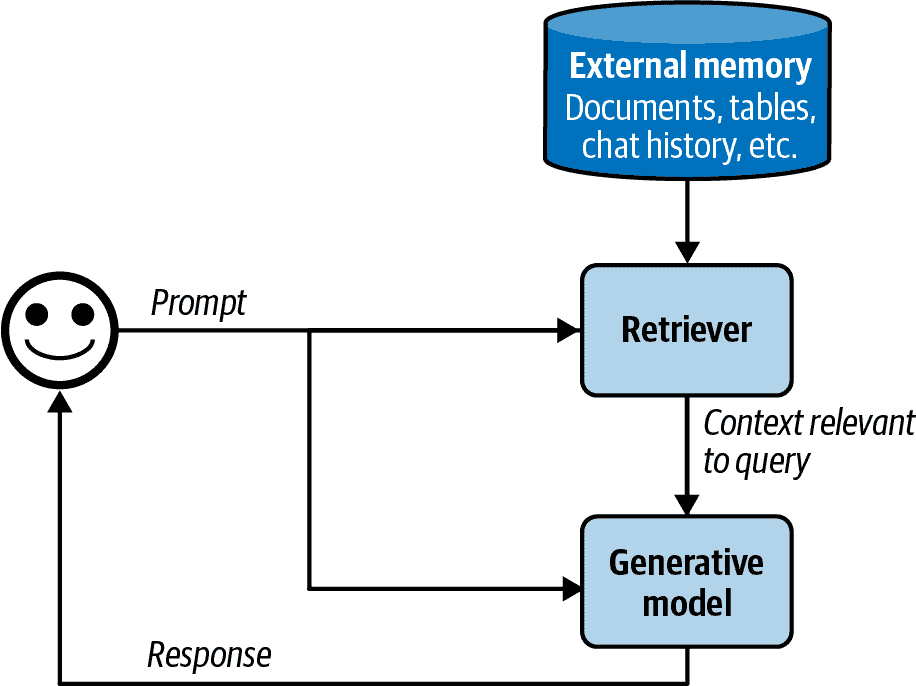
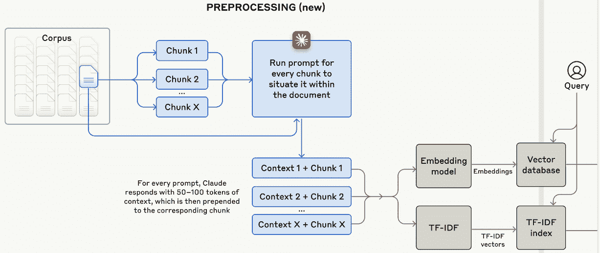
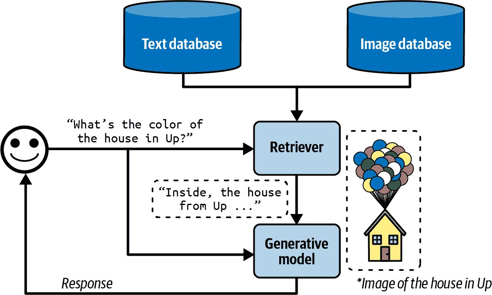
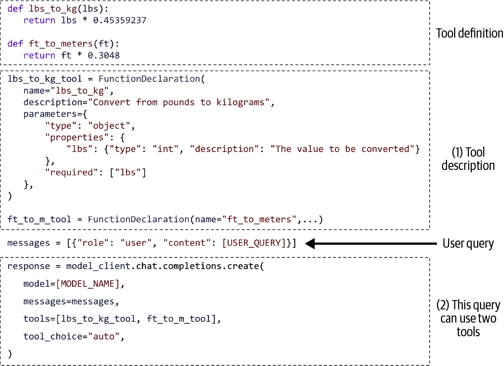
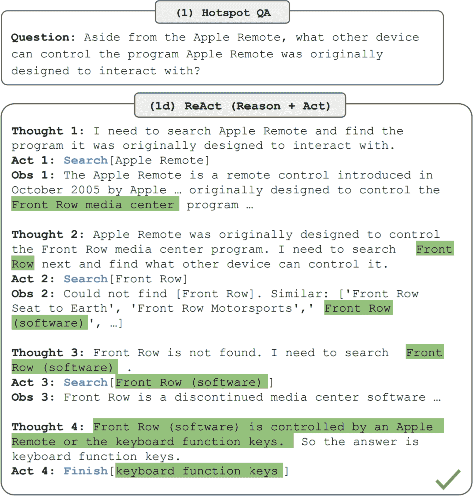
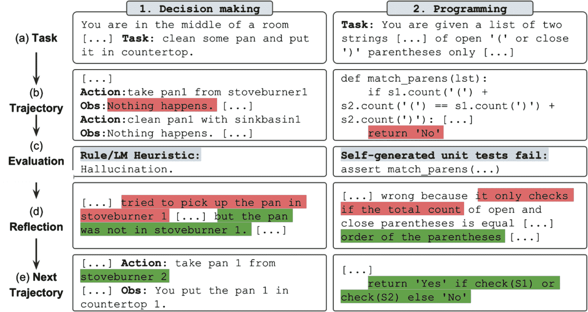

# 第六章\. RAG 和代理

为了解决一个任务，模型需要完成它的指令以及完成它所需的信息。就像人类在没有信息的情况下更有可能给出错误答案一样，当 AI 模型缺少上下文时，它们更有可能犯错和产生幻觉。对于特定的应用，模型的指令对所有查询都是通用的，而上下文对每个查询都是特定的。上一章讨论了如何为模型编写好的指令。本章重点介绍如何为每个查询构建相关的上下文。

两种主导的上下文构建模式是 RAG，即检索增强生成，和代理。RAG 模式允许模型从外部数据源检索相关信息。代理模式允许模型使用诸如网络搜索和新闻 API 等工具来收集信息。

虽然 RAG 模式主要用于构建上下文，但代理模式可以做得更多。外部工具可以帮助模型克服其不足并扩展其能力。最重要的是，它们赋予模型直接与世界互动的能力，使它们能够自动化我们生活中的许多方面。

RAG 和代理模式之所以令人兴奋，是因为它们为已经强大的模型带来了新的能力。在很短的时间内，它们成功地吸引了公众的集体想象力，产生了令人难以置信的演示和产品，让许多人相信它们是未来。本章将详细介绍这些模式，它们是如何工作的，以及为什么它们如此有前景。

# RAG

RAG 是一种通过从外部记忆源检索相关信息来增强模型生成能力的技巧。外部记忆源可以是内部数据库、用户的先前聊天会话或互联网。

*检索后生成*模式首次在“通过阅读维基百科来回答开放域问题”中提出（[Chen 等人，2017](https://arxiv.org/abs/1704.00051)）。在这项工作中，系统首先检索与问题最相关的五个维基百科页面，然后模型^(1)使用或读取这些页面上的信息来生成答案，如图图 6-1 所示。

）。该论文提出 RAG 作为解决知识密集型任务的解决方案，在这些任务中，所有可用的知识都无法直接输入到模型中。通过 RAG，只有由检索器确定的与查询最相关的信息被检索并输入到模型中。Lewis 等人发现，能够访问相关信息可以帮助模型生成更详细的回应，同时减少幻觉。（^(2))

例如，给定查询“Acme 的 fancy-printer-A300 打印机能否以 100pps 的速度打印？”，如果模型能够获得 fancy-printer-A300 打印机的规格，它将能够给出更好的回应。（^(3))

你可以将 RAG 视为一种构建针对每个查询特定上下文的技巧，而不是为所有查询使用相同的上下文。这有助于管理用户数据，因为它允许你只将特定于用户的仅在涉及该用户的查询中包含数据。

基础模型的上下文构建相当于经典机器学习模型的特征工程。它们服务于相同的目的：为模型提供处理输入所需的信息。

在基础模型发展的早期阶段，RAG（Retrieval-Augmented Generation，检索增强生成）成为最常见模式之一。其主要目的是克服模型在上下文上的限制。许多人认为，足够长的上下文将是 RAG 的终结。我不这么认为。首先，无论模型上下文的长度有多长，总会有需要比这更长上下文的应用。毕竟，可用的数据量只会随着时间的推移而增长。人们生成并添加新的数据，但很少删除数据。上下文长度正在迅速扩展，但不足以满足任意应用的数据需求。（^(4))

其次，正如在“上下文长度与上下文效率”（“Context Length and Context Efficiency”）中讨论的那样，一个能够处理长上下文的模型并不一定能够很好地使用该上下文。上下文越长，模型越有可能关注上下文的错误部分。每个额外的上下文标记都会产生额外的成本，并有可能增加额外的延迟。RAG 允许模型只为每个查询使用最相关的信息，从而在减少输入标记数量的同时，可能提高模型的表现。

在努力扩展上下文长度的同时，也在努力使模型更有效地使用上下文。如果模型提供商整合了类似检索或注意力的机制来帮助模型挑选出上下文中最显著的部分进行使用，我并不会感到惊讶。

###### 注意

Anthropic 建议，对于 Claude 模型，如果“你的知识库小于 200,000 个标记（约 500 页材料），你只需将整个知识库包含在你提供给模型的提示中，无需 RAG 或类似方法” ([Anthropic, 2024](https://oreil.ly/v-T_4))。如果其他模型开发者能为他们的模型提供类似的关于 RAG 与长上下文之间的指导，那就太棒了。

## RAG 架构

RAG 系统有两个组件：一个检索器，用于从外部内存源检索信息，和一个生成器，根据检索到的信息生成响应。图 6-2 展示了 RAG 系统的高级架构。



###### 图 6-2\. 基本的 RAG 架构。

在原始 RAG 论文中，[Lewis 等人](https://arxiv.org/abs/2005.11401) 一起训练了检索器和生成模型。在今天的 RAG 系统中，这两个组件通常分别训练，许多团队使用现成的检索器和模型构建他们的 RAG 系统。然而，端到端微调整个 RAG 系统可以显著提高其性能。

RAG 系统的成功取决于其检索器的质量。检索器有两个主要功能：索引和查询。索引涉及处理数据，以便可以快速检索。向检索器发送查询以检索与其相关的数据称为查询。如何索引数据取决于你希望如何稍后检索它。

现在我们已经涵盖了主要组件，让我们考虑一个 RAG 系统如何工作的例子。为了简单起见，让我们假设外部内存是一个文档数据库，例如公司的备忘录、合同和会议记录。一个文档可以是 10 个标记或 1,000,000 个标记。天真地检索整个文档可能导致你的上下文任意长。为了避免这种情况，你可以将每个文档分成更易于管理的块。本章后面将讨论块化策略。现在，让我们假设所有文档都已分成可操作的块。对于每个查询，我们的目标是检索与该查询最相关的数据块。通常需要一些轻微的后处理来将检索到的数据块与用户提示连接起来，以生成最终的提示。然后，将这个最终的提示输入到生成模型中。

###### 注意

在本章中，我使用“文档”一词来指代“文档”和“块”，因为从技术上讲，文档的块也是一个文档。我这样做是为了使本书的术语与经典自然语言处理（NLP）和信息检索（IR）术语保持一致。

## 检索算法

检索并不特指 RAG。信息检索是一个有着一个世纪历史的理念.^(5) 它是搜索引擎、推荐系统、日志分析等系统的骨架。许多为传统检索系统开发的检索算法也可以用于 RAG。例如，信息检索是一个充满活力、拥有庞大支持产业的领域，其内容很难在几页纸内充分涵盖。因此，本节将仅概述主要观点。有关信息检索的更深入资源，请参阅本书的[GitHub 仓库](https://oreil.ly/aie-book)。

###### 注意

检索通常限于一个数据库或系统，而搜索则涉及跨多个系统的检索。本章将检索和搜索互换使用。

在本质上，检索是通过根据文档与给定查询的相关性对文档进行排序来工作的。检索算法的不同之处在于如何计算相关性分数。我将从两种常见的检索机制开始：基于术语的检索和基于嵌入的检索。

### 基于术语的检索

给定一个查询，找到相关文档的最直接方法是使用关键词。有些人称这种方法为*词汇检索*。例如，给定查询“AI engineering”，模型将检索包含“AI engineering”的所有文档。然而，这种方法有两个问题：

+   许多文档可能包含给定的术语，而你的模型可能没有足够的空间来包含所有这些文档作为上下文。一个启发式方法是包括包含该术语次数最多的文档。假设是，一个术语在文档中出现的次数越多，这个文档对这个术语就越相关。一个术语在文档中出现的次数称为*词频*（TF）。

+   一个提示可能很长，包含许多术语。其中一些比其他更重要。例如，提示“Easy-to-follow recipes for Vietnamese food to cook at home”包含九个术语：*easy-to-follow, recipes, for, vietnamese, food, to, cook, at, home*。你想要关注像*vietnamese*和*recipes*这样的更具信息量的术语，而不是*for*和*at*。你需要一种方法来识别重要术语。

    一个直观的想法是，包含一个术语的文档越多，这个术语就越不具信息量。“对于”和“在”可能出现在大多数文档中，因此它们的信息量较小。所以一个术语的重要性与它在文档中出现的次数成反比。这个度量称为*逆文档频率*（IDF）。要计算一个术语的 IDF，首先计算包含该术语的所有文档的数量，然后将总文档数除以这个数量。如果有 10 个文档，其中 5 个包含一个特定的术语，那么这个术语的 IDF 是 10 / 5 = 2。一个术语的 IDF 越高，它就越重要。

TF-IDF 是一种结合这两个度量标准的算法：词频（TF）和逆文档频率（IDF）。从数学上讲，对于查询 *Q* 的文档 *D* 的 TF-IDF 得分计算如下：

+   设 $t 1 comma t 2 comma period period period comma t Subscript q Baseline$ 为查询 *Q* 中的词。

+   给定一个词 *t*，该词在文档 *D* 中的词频是 *f(t, D)*。

+   设 *N* 为文档的总数，*C(t)* 为包含 *t* 的文档数量。词 *t* 的 IDF 值可以表示为 $IDF left-parenthesis t right-parenthesis equals log StartFraction upper N Over upper C left-parenthesis t right-parenthesis EndFraction$ .

+   对于文档 *D* 相对于查询 *Q* 的 TF-IDF 得分，直观地定义为 $Score left-parenthesis upper D comma upper Q right-parenthesis equals sigma-summation Underscript i equals 1 Overscript q Endscripts IDF left-parenthesis t Subscript i Baseline right-parenthesis times f left-parenthesis t Subscript i Baseline comma upper D right-parenthesis$ .

两种常见的基于词的检索解决方案是 Elasticsearch 和 BM25。 [Elasticsearch](https://github.com/elastic/elasticsearch)（Shay Banon，2010），建立在 [Lucene](https://github.com/apache/lucene) 之上，使用一种称为倒排索引的数据结构。这是一个将词映射到包含它们的文档的字典。这个字典允许根据词快速检索文档。索引还可能存储其他信息，如词频和文档计数（包含此词的文档数量），这些信息对于计算 TF-IDF 得分很有帮助。表 6-1 说明了倒排索引。

表 6-1\. 一个简化的倒排索引示例。

| 词 | 文档计数 | 包含该词的所有文档的（文档索引，词频） |
| --- | --- | --- |
| 香蕉 | 2 | (10, 3), (5, 2) |
| 机器 | 4 | (1, 5), (10, 1), (38, 9), (42, 5) |
| 学习 | 3 | (1, 5), (38, 7), (42, 5) |
| … | … | … |

[Okapi BM25](https://en.wikipedia.org/wiki/Okapi_BM25)，最佳匹配算法的第 25 代，由 Robertson 等人于 20 世纪 80 年代开发。其评分器是 TF-IDF 的一种改进。与原始的 TF-IDF 相比，BM25 通过文档长度对词频得分进行归一化。较长的文档更有可能包含某个特定词，并且具有更高的词频值.^(6)

BM25 及其变体（BM25+，BM25F）在业界仍被广泛使用，并作为强大的基线，用于比较现代、更复杂的检索算法，如接下来讨论的基于嵌入的检索.^(7)

我略过的一个过程是分词，即将查询分解成单个术语的过程。最简单的方法是将查询分解成单词，将每个单词视为一个单独的术语。然而，这可能导致多词术语被分解成单个单词，失去其原始含义。例如，“hot dog”会被分解成“hot”和“dog”。当这种情况发生时，它们都不保留原始术语的含义。缓解这一问题的方法之一是将最常见的 n-gram 视为术语。如果二元组“hot dog”很常见，它将被视为一个术语。

此外，你可能还想将所有字符转换为小写，删除标点符号，并消除停用词（如“the”，“and”，“is”等）。基于术语的检索解决方案通常可以自动处理这些问题。经典的自然语言处理包，如[NLTK](https://www.nltk.org)（自然语言工具包）、[spaCy](https://github.com/explosion/spaCy)和[斯坦福的 CoreNLP](https://github.com/stanfordnlp/CoreNLP)，也提供标记化功能。

第四章讨论了基于两个文本的 n-gram 重叠来衡量它们之间的词汇相似度。我们能否根据文档与查询的 n-gram 重叠程度来检索文档？是的，我们可以。当查询和文档的长度相似时，这种方法效果最好。如果文档比查询长得多，它们包含查询 n-gram 的可能性会增加，导致许多文档具有相似的高重叠分数。这使得很难区分真正相关的文档和不太相关的文档。

### 基于嵌入的检索

基于术语的检索在词汇层面上而不是语义层面上计算相关性。如第三章中所述，文本的出现并不一定能够捕捉其含义。这可能导致返回与你的意图无关的文档。例如，查询“transformer 架构”可能会返回关于电器设备或电影*变形金刚*的文档。另一方面，*基于嵌入的检索器*旨在根据文档的含义与查询的接近程度对文档进行排序。这种方法也被称为*语义检索*。

基于嵌入的检索，索引具有额外功能：将原始数据块转换为嵌入。存储生成的嵌入的数据库称为*向量数据库*。查询包括两个步骤，如图图 6-3 所示：

1.  嵌入模型：使用与索引期间相同的嵌入模型将查询转换为嵌入。

1.  检索器：检索与查询嵌入最接近的*k*个数据块，由检索器确定。要检索的数据块数量*k*取决于用例、生成模型和查询。


自动生成的描述](assets/aien_0603.png)

###### 图 6-3\. 基于嵌入或语义的检索器的高级视图。

这里所示基于嵌入的检索工作流程是简化的。现实世界的语义检索系统可能包含其他组件，例如重新排序器以重新排序所有检索到的候选者，以及缓存以减少延迟。8

在基于嵌入的检索中，我们再次遇到了嵌入，这在第三章中已有讨论。作为提醒，嵌入通常是一个旨在保留原始数据重要属性的向量。如果嵌入模型不好，基于嵌入的检索器将无法工作。

基于嵌入的检索还引入了一个新的组件：向量数据库。向量数据库存储向量。然而，存储只是向量数据库的简单部分。困难的部分是向量搜索。给定一个查询嵌入，向量数据库负责在数据库中找到接近查询的向量并将它们返回。向量必须以使向量搜索快速高效的方式索引和存储。

与许多其他生成式人工智能应用所依赖的机制一样，向量搜索并非仅限于生成式人工智能。向量搜索在所有使用嵌入的应用中都很常见：搜索、推荐、数据组织、信息检索、聚类、欺诈检测等等。

向量搜索通常被框架化为最近邻搜索问题。例如，给定一个查询，找到 *k* 个最近的向量。直观的解决方案是 k-最近邻（k-NN），其工作原理如下：

1.  使用诸如余弦相似度等度量标准，计算查询嵌入与数据库中所有向量的相似度得分。

1.  按相似度得分对所有向量进行排序。

1.  返回相似度得分最高的 *k* 个向量。

这种直观的解决方案确保了结果的准确性，但计算量大且速度慢。它仅适用于小型数据集。

对于大型数据集，通常使用近似最近邻（ANN）算法进行向量搜索。由于向量搜索的重要性，已经为它开发了众多算法和库。一些流行的向量搜索库包括 *FAISS*（Facebook AI Similarity Search）([Johnson 等人，2017](https://arxiv.org/abs/1702.08734))，谷歌的 *ScaNN*（Scalable Nearest Neighbors）([Sun 等人，2020](https://oreil.ly/faJqj))，[Spotify 的 *Annoy*](https://github.com/spotify/annoy)（Bernhardsson，2013），以及 [*Hnswlib*](https://oreil.ly/4ATBC)（层次可导航小世界，[Hierarchical Navigable Small World](https://github.com/nmslib/hnswlib)）(Malkov 和 Yashunin，2016)。

大多数应用程序开发者不会自己实现向量搜索，因此我将只简要概述不同的方法。在评估解决方案时，这个概述可能很有帮助。

通常，向量数据库将向量组织成桶、树或图。向量搜索算法根据它们使用的启发式方法来增加相似向量彼此靠近的可能性而有所不同。向量也可以进行量化（降低精度）或稀疏化。其想法是，量化和稀疏向量处理起来计算量更小。对于那些想要了解更多关于向量搜索的人来说，Zilliz 有一个关于它的优秀[系列](https://oreil.ly/MVsgB)。以下是一些重要的向量搜索算法：

LSH（局部敏感哈希）([Indyk and Motwani, 1999](https://oreil.ly/slO9x))

这是一个功能强大且多用途的算法，它不仅与向量一起工作。这涉及到将相似向量散列到相同的桶中以提高相似性搜索的速度，以牺牲一些精度来换取效率。它在 FAISS 和 Annoy 中实现。

HNSW（Hierarchical Navigable Small World）([Malkov and Yashunin, 2016](https://github.com/nmslib/hnswlib))

HNSW（Hierarchical Navigable Small World）构建了一个多层图，其中节点代表向量，边连接相似向量，通过遍历图边进行最近邻搜索。作者们的实现是开源的，它也被 FAISS 和 Milvus 实现。

产品量化([Jégou et al., 2011](https://oreil.ly/VaLf4))

这通过将每个向量分解成多个子向量，将其简化为更简单、更低维度的表示来实现。然后使用这些低维表示来计算距离，这些表示处理起来要快得多。产品量化是 FAISS 的关键组件，并且几乎所有的流行向量搜索库都支持它。

IVF（倒排文件索引）([Sivic and Zisserman, 2003](https://oreil.ly/9BcYN))

IVF 使用 K-means 聚类将相似向量组织到同一个簇中。根据数据库中向量的数量，通常将簇的数量设置为平均每个簇有 100 到 10,000 个向量。在查询过程中，IVF 找到最接近查询嵌入的簇中心，这些簇中的向量成为候选邻居。与产品量化一起，IVF 构成了 FAISS 的骨干。

Annoy（近似最近邻哦耶）([Bernhardsson, 2013](https://github.com/spotify/annoy))

Annoy 是一种基于树的算法。它构建多个二叉树，其中每个树使用随机标准（如随机画一条线，并使用这条线将向量分成两个分支）将向量分成簇。在搜索过程中，它遍历这些树以收集候选邻居。Spotify 已经开源了其实现。

还有其他算法，例如[微软的 SPTAG](https://github.com/microsoft/SPTAG)（空间划分树和图）和[FLANN](https://github.com/flann-lib/flann)（快速近似最近邻库）。

尽管随着 RAG 的兴起，向量数据库作为一个独立的类别出现，但任何可以存储向量的数据库都可以被称为向量数据库。许多传统数据库已经扩展或将要扩展以支持向量存储和向量搜索。

### 比较检索算法

由于检索有着悠久的历史，其众多成熟的解决方案使得基于词项和基于嵌入的检索相对容易开始。每种方法都有其优缺点。

在索引和查询过程中，基于词项的检索通常比基于嵌入的检索要快得多。词项提取比嵌入生成更快，并且从词项到包含该词项的文档的映射可能比最近邻搜索的计算成本更低。

基于词项的检索也能直接使用就表现出良好的效果。像 Elasticsearch 和 BM25 这样的解决方案已经成功地为许多搜索和检索应用提供了动力。然而，它的简单性也意味着它有更少的组件可以调整以提升其性能。

基于嵌入的检索，另一方面，随着时间的推移可以显著提升，从而超越基于词项的检索。你可以分别、一起或与生成模型结合，微调嵌入模型和检索器。然而，将数据转换为嵌入可能会模糊关键词，例如特定的错误代码，例如 EADDRNOTAVAIL (99)，或产品名称，使得后续搜索更加困难。这一限制可以通过将基于嵌入的检索与基于词项的检索相结合来解决，正如本章后面所讨论的。

检索器的质量可以根据其检索数据的质量来评估。RAG 评估框架中经常使用的两个指标是上下文精确度和上下文召回率，或简称精确率和召回率（上下文精确度也称为上下文相关性）： 

上下文精确度

在所有检索到的文档中，有多少百分比与查询相关？

上下文召回率

在所有与查询相关的文档中，有多少百分比被检索到了？

为了计算这些指标，你需要创建一个评估集，其中包含一系列测试查询和一组文档。对于每个测试查询，你需要标注每个测试文档是否相关。标注可以由人类或人工智能裁判完成。然后，你计算检索器在这个评估集上的精确率和召回率得分。

在生产环境中，一些 RAG 框架只支持上下文精确度，而不支持上下文召回率。为了计算给定查询的上下文召回率，你需要标注数据库中所有文档与该查询的相关性。上下文精确度计算起来更简单。你只需要比较检索到的文档与查询，这可以通过人工智能裁判来完成。

如果你关心检索到的文档的排名，例如，更相关的文档应该排在前面，你可以使用诸如[NDCG](https://en.wikipedia.org/wiki/Discounted_cumulative_gain)（归一化累积增益）、[MAP](https://en.wikipedia.org/wiki/Evaluation_measures_(information_retrieval)#Mean_average_precision)（平均平均精度）和[MRR](https://en.wikipedia.org/wiki/Mean_reciprocal_rank)（平均倒数排名）等指标。

对于语义检索，你还需要评估你的嵌入质量。如第三章中所述，嵌入可以独立评估——如果更相似的文档有更接近的嵌入，则被认为是好的。嵌入也可以通过它们在特定任务中的表现来评估。[MTEB](https://arxiv.org/abs/2210.07316)基准（Muennighoff 等人，2023）评估了包括检索、分类和聚类在内的广泛任务的嵌入。

在整个 RAG 系统的背景下，也应该评估检索器的质量。最终，如果检索器有助于系统生成高质量的答案，则检索器是好的。生成模型输出的评估在第三章和 4 章中讨论。

语义检索系统的性能承诺是否值得追求取决于你多么重视成本和延迟，尤其是在查询阶段。由于 RAG 的延迟很大程度上来自输出生成，尤其是对于长输出，*查询嵌入生成和向量搜索带来的额外延迟可能相对于总 RAG 延迟来说微不足道。* 即使如此，额外的延迟仍然可能影响用户体验。

另一个担忧是成本。生成嵌入需要花钱。如果你的数据频繁变化并需要频繁地重新生成嵌入，这尤其是一个问题。想象一下每天需要为 1 亿份文档生成嵌入！根据你使用的向量数据库，向量存储和向量搜索查询也可能很昂贵。看到公司的向量数据库支出占其模型 API 支出的五分之一甚至一半并不罕见。

表 6-2 显示了基于术语的检索和基于嵌入的检索的并列比较。

表 6-2\. 基于术语的检索和语义检索的速度、性能和成本。

|  | 基于术语的检索 | 基于嵌入的检索 |
| --- | --- | --- |
| 查询速度 | 比基于嵌入的检索快得多 | 查询嵌入生成和向量搜索可能会很慢 |

| 性能 | 通常性能出色，但难以改进

可能由于术语歧义而检索到错误的文档 | 通过微调可以优于基于术语的检索

允许使用更自然的查询，因为它关注语义而不是术语 |

| 成本 | 比基于嵌入的检索便宜得多 | 嵌入、向量存储和向量搜索解决方案可能很昂贵 |
| --- | --- | --- |

使用检索系统，你可以在索引和查询之间做出某些权衡。索引越详细，检索过程越准确，但索引过程会变慢且消耗更多内存。想象一下构建潜在客户的索引。添加更多细节（例如，姓名、公司、电子邮件、电话、兴趣）可以更容易地找到相关的人，但构建时间会更长，需要更多存储。

通常，像 HNSW 这样的详细索引提供了高精度和快速的查询时间，但构建它需要大量时间和内存。相比之下，像 LSH 这样的简单索引创建更快，内存消耗更少，但查询速度较慢且精度较低。

[ANN-Benchmarks 网站](https://oreil.ly/pbh3y)使用四个主要指标比较多个数据集上的不同 ANN 算法，考虑到索引和查询之间的权衡。这些包括以下内容：

召回率

算法找到的最近邻的比例。

每秒查询数（QPS）。

算法每秒可以处理的查询数量。这对于高流量应用至关重要。

构建时间

构建索引所需的时间。如果需要频繁更新索引（例如，因为数据发生变化），这个指标尤为重要。

索引大小

算法创建的索引大小，这对于评估其可扩展性和存储需求至关重要。

此外，BEIR（Benchmarking IR）([Thakur 等人，2021](https://arxiv.org/abs/2104.08663))是一个用于检索的评估工具。它支持 14 个常见检索基准上的检索系统。

总结来说，RAG 系统的质量应该从组件到组件、从端到端进行评估。为此，你应该做以下事情：

1.  评估检索质量。

1.  评估最终的 RAG 输出。

1.  评估嵌入（对于基于嵌入的检索）。

### 结合检索算法

由于不同的检索算法具有不同的优势，生产级检索系统通常结合几种方法。结合基于术语的检索和基于嵌入的检索被称为*混合搜索*。

可以按顺序使用不同的算法。首先，一个便宜但不太精确的检索器，例如基于术语的系统，检索候选者。然后，一个更精确但更昂贵的机制，例如 k 最近邻，找到这些候选者中的最佳者。这一步也被称为*重排序*。

例如，给定术语“transformer”，你可以获取所有包含单词 transformer 的文档，无论它们是关于电器设备、神经网络架构还是电影。然后你使用向量搜索在这些文档中找到与你的 transformer 查询实际相关的文档。作为另一个例子，考虑查询“谁对 X 的最大销售额负责？”首先，你可能会使用关键词 X 获取所有与 X 相关的文档。然后，你使用向量搜索检索与“谁对最大销售额负责？”相关的上下文。

不同的算法也可以并行使用作为一个集成。记住，检索器通过按其与查询的相关性分数对文档进行排序来工作。你可以使用多个检索器同时获取候选文档，然后将这些不同的排名组合起来生成最终的排名。

一种用于组合不同排名的算法称为[互逆排名融合（RRF）](https://oreil.ly/3xtwh)（Cormack 等，2009）。它根据检索器对每个文档的排名分配一个分数。直观地说，如果它排名第一，其分数是 1/1 = 1。如果它排名第二，其分数是 ½ = 0.5。排名越高，分数越高。

文档的最终得分是其与所有检索器得分的总和。如果一个文档被一个检索器排在第一位，而另一个检索器排在第二位，其得分是 1 + 0.5 = 1.5。这个例子是 RRF 的过度简化，但它展示了基本原理。实际公式对于文档 *D* 更为复杂，如下所示：

$Score\left(D\right) = \sum_{i=1}^{n} \frac{1}{k + r_i(D)}$

+   *n* 是排名列表的数量；每个排名列表由一个检索器生成。

+   $r_i(D)$ 是检索器 *i* 对文档的排名。

+   *k* 是一个常数，用于避免除以零并控制低排名文档的影响。*k* 的典型值是 60。

## 检索优化

根据任务的不同，某些策略可以增加检索相关文档的机会。这里讨论的四种策略是分块策略、重新排序、查询重写和上下文检索。

### 分块策略

你的数据应该如何索引取决于你打算如何稍后检索它。最后一节涵盖了不同的检索算法及其相应的索引策略。在那里，讨论基于假设文档已经被分割成可管理的块。在本节中，我将介绍不同的分块策略。这是一个重要的考虑因素，因为你所使用的分块策略可以显著影响你的检索系统的性能。

最简单的策略是根据某个单位将文档块化为等长的块。常见的单位是字符、单词、句子和段落。例如，您可以将每个文档拆分为 2,048 个字符或 512 个单词的块。您也可以将每个文档拆分，以便每个块可以包含固定数量的句子（例如 20 个句子）或段落（例如每个段落是其自己的块）。

您也可以使用越来越小的单元递归地拆分文档，直到每个块的大小适合您的最大块大小。例如，您可以从将文档拆分为章节开始。如果一个章节太长，可以将其拆分为段落。如果一个段落仍然太长，可以将其拆分为句子。这样可以减少相关文本被任意拆分的机会。

特定文档可能也支持创新的块拆分策略。例如，有专门为不同编程语言开发的[splitters](https://github.com/grantjenks/py-tree-sitter-languages#license)。问答文档可以按问题或答案对进行拆分，其中每一对构成一个块。中文文本可能需要与英文文本不同的拆分方式。

当文档拆分为无重叠的块时，块可能在重要上下文的中间被切断，导致关键信息的丢失。考虑文本“我给我的妻子留了一张便条”。如果它被拆分为“我给我的妻子”和“一张便条”，这两个块都没有传达原始文本的关键信息。重叠确保至少在一个块中包含重要的边界信息。如果您将块大小设置为 2,048 个字符，您可能可以将重叠大小设置为 20 个字符。

块大小不应超过生成模型的最大上下文长度。对于基于嵌入的方法，块大小也不应超过嵌入模型上下文限制。

您还可以使用生成模型分词器确定的标记作为单位来拆分文档。假设您想使用 Llama 3 作为您的生成模型。然后您首先使用 Llama 3 的分词器对文档进行分词。然后您可以使用标记作为边界将文档拆分为块。按标记拆分使得与下游模型一起工作更容易。然而，这种方法的一个缺点是，如果您切换到另一个具有不同分词器的生成模型，您需要重新索引您的数据。

无论您选择哪种策略，块大小都很重要。较小的块大小允许包含更多样化的信息。较小的块意味着您可以放入模型上下文中的块更多。如果您将块大小减半，您可以放入两倍的块。更多的块可以为模型提供更广泛的信息范围，这可以使模型产生更好的答案。

小块大小然而，可能会导致重要信息的丢失。想象一个包含关于主题 X 的重要信息的文档，但 X 仅在文档的前半部分提到。如果你将这个文档分成两个块，文档的后半部分可能不会被检索到，模型也无法使用其信息。

较小的块大小也可能增加计算开销。这对于基于嵌入的检索尤其是一个问题。将块大小减半意味着你需要索引两倍的块，生成和存储两倍的嵌入向量。你的向量搜索空间将扩大一倍，这可能会降低查询速度。

没有通用的最佳块大小或重叠大小。你必须进行实验以找到最适合你的方案。

### 重新排序

检索器生成的初始文档排名可以进一步重新排序以更准确。重新排序在需要减少检索到的文档数量时特别有用，无论是为了适应你的模型上下文还是为了减少输入标记的数量。

在“结合检索算法”中讨论了一种常见的重新排序模式。一个便宜但不太精确的检索器获取候选项，然后一个更精确但更昂贵的机制对这些候选项进行重新排序。

文档也可以根据时间重新排序，给予较近的数据更高的权重。这对于需要时效性应用，如新闻聚合、与电子邮件的聊天（例如，可以回答有关你的电子邮件问题的聊天机器人）或股市分析非常有用。

上下文重新排序与传统搜索重新排序的不同之处在于，项目的确切位置不太关键。在搜索中，排名（例如，第一或第五）至关重要。在上下文重新排序中，文档的顺序仍然很重要，因为它会影响模型处理文档的效果。模型可能更好地理解上下文的开头和结尾的文档，如“上下文长度和上下文效率”中讨论的那样。然而，只要文档被包含在内，其顺序的影响与搜索排名相比就不那么重要了。

### 查询重写

*查询重写*也被称为查询重构、查询归一化和有时是查询扩展。考虑以下对话：

```py
*User*: When was the last time John Doe bought something from us?
*AI*: John last bought a Fruity Fedora hat from us two weeks ago, on January 3, 
2030.
*User*: How about Emily Doe?

```

最后一个问题，“Emily Doe 怎么样？”在没有上下文的情况下是模糊的。如果你直接使用这个查询来检索文档，你很可能会得到不相关的结果。你需要重写这个查询以反映用户实际提出的问题。新的查询应该单独有意义。在这种情况下，查询应该重写为“Emily Doe 上次是从我们这里买东西是什么时候？”

虽然我在“RAG”中提到了查询重写“RAG”，但查询重写并不局限于 RAG。在传统搜索引擎中，查询重写通常使用启发式方法完成。在 AI 应用中，查询重写也可以使用其他 AI 模型完成，使用类似于“给定以下对话，重写最后用户的输入以反映用户实际询问的内容”的提示。图 6-4 展示了 ChatGPT 如何使用此提示重写查询。


###### 图 6-4。您可以使用其他生成模型来重写查询。

查询重写可能会变得复杂，尤其是如果您需要执行身份解析或结合其他知识。例如，如果用户问“他的妻子怎么样？”您首先需要查询数据库以找出他的妻子是谁。如果您没有这些信息，重写模型应承认此查询无法解决，而不是凭空猜测一个名字，导致错误答案。

### 上下文检索

上下文检索背后的理念是向每个片段添加相关上下文，以便更容易检索相关片段。一种简单的方法是向片段添加元数据，如标签和关键词。对于电子商务，可以通过描述和评论来增强产品。可以通过标题或字幕查询图片和视频。

元数据还可以包括从片段中自动提取的实体。如果您的文档包含特定的术语，如错误代码 EADDRNOTAVAIL（99），将其添加到文档的元数据中，允许系统通过该关键词检索它，即使文档已被转换为嵌入。

您还可以向每个片段添加它可以回答的问题。对于客户支持，您可以向每篇文章添加相关问题。例如，关于如何重置密码的文章可以增强为查询“如何重置密码？”，“我忘记了密码”，“我无法登录”，甚至“帮助，我找不到我的账户”。^(9)

如果文档被分成多个片段，某些片段可能缺乏帮助检索器理解片段内容的必要上下文。为了避免这种情况，您可以为每个片段添加来自原始文档的上下文，例如原始文档的标题和摘要。Anthropic 使用 AI 模型生成简短上下文，通常 50-100 个标记，解释片段及其与原始文档的关系。以下是 Anthropic 用于此目的的提示([Anthropic, 2024](https://oreil.ly/-Sny7))：

```py
<document> 
{{WHOLE_DOCUMENT}} 
</document>

Here is the chunk we want to situate within the whole document: 

<chunk>
{{CHUNK_CONTENT}}
</chunk> 

Please give a short succinct context to situate this chunk within the overall 
document for the purposes of improving search retrieval of the chunk. Answer 
only with the succinct context and nothing else.

```

每个片段生成的上下文都添加到每个片段之前，然后增强后的片段由检索算法索引。图 6-5 展示了 Anthropic 遵循的过程。



###### 图 6-5。Anthropic 通过在每个块中添加一个简短上下文来增强每个块，将此块定位在原始文档中，这使得检索器在给定查询的情况下更容易找到相关块。图片来自“介绍上下文检索”（Anthropic，2024）。

## RAG 超越文本

上一节讨论了基于文本的 RAG 系统，其中外部数据源是文本文档。然而，外部数据源也可以是多模态和表格数据。

### 多模态 RAG

如果你的生成器是多模态的，其上下文不仅可以增强文本文档，还可以增强来自外部来源的图像、视频、音频等。我将使用图像作为示例以保持写作简洁，但你可以用任何其他模态来替换图像。给定一个查询，检索器会检索与查询相关的文本和图像。例如，给定“皮克斯电影《Up》中房子的颜色是什么？”的查询，检索器可以检索《Up》中房子的图片以帮助模型回答，如图图 6-6 所示。



###### 图 6-6。多模态 RAG 可以同时用文本和图像增强查询。（由于版权原因，未使用《Up》中的真实图像。）

如果图像有元数据——例如标题、标签和字幕——可以使用元数据进行检索。例如，如果图像的字幕被认为与查询相关，则可以检索该图像。

如果你想根据内容检索图像，你需要一种比较图像与查询的方法。如果查询是文本，你需要一个多模态嵌入模型，该模型可以为图像和文本生成嵌入。假设你使用 CLIP ([Radford 等人，2021](https://arxiv.org/abs/2103.00020)) 作为多模态嵌入模型。检索器的工作方式如下：

1.  为你的所有数据生成 CLIP 嵌入，包括文本和图像，并将它们存储在向量数据库中。

1.  给定一个查询，生成其 CLIP 嵌入。

1.  在向量数据库中查询所有与查询嵌入相似的图像和文本。

### RAG 与表格数据

大多数应用程序不仅与无结构数据（如文本和图像）一起工作，还与表格数据一起工作。许多查询可能需要从数据表中获取信息来回答。使用表格数据增强上下文的流程与经典的 RAG 流程有显著不同。

假设你为一家名为 Kitty Vogue 的电子商务公司工作，该公司专门经营猫时尚。这家商店有一个名为 Sales 的订单表，如图表 6-3 所示。

表 6-3。一个订单表示例，Kitty Vogue 假想电子商务网站的 Sales。

| 订单 ID | 时间戳 | 产品 ID | 产品 | 单价（$） | 单位 | 总计 |
| --- | --- | --- | --- | --- | --- | --- |
| 1 | … | 2044 | Meow Mix 调味料 | 10.99 | 1 | 10.99 |
| 2 | … | 3492 | Purr & Shake | 25 | 2 | 50 |
| 3 | … | 2045 | Fruity Fedora | 18 | 1 | 18 |
| … | … | … | … | … | … | … |

为了生成对问题“在过去的 7 天内售出了多少单位的 Fruity Fedora？”的响应，您的系统需要查询涉及 Fruity Fedora 的所有订单，并汇总所有订单的单位数量。假设可以使用 SQL 查询此表。SQL 查询可能如下所示：

```py
SELECT SUM(units) AS total_units_sold
FROM Sales
WHERE product_name = 'Fruity Fedora'
AND timestamp >= DATE_SUB(CURDATE(), INTERVAL 7 DAY);
```

工作流程如下，如图 6-7 所示。要运行此工作流程，您的系统必须具备生成和执行 SQL 查询的能力：

1.  文本到 SQL：根据用户查询和提供的表模式，确定所需的 SQL 查询。文本到 SQL 是语义解析的一个例子，如第二章所述（ch02.html#ch02_understanding_foundation_models_1730147895571359）。

1.  SQL 执行：执行 SQL 查询。

1.  生成：根据 SQL 结果和原始用户查询生成响应。


###### 图 6-7\. 增强表格数据的上下文的 RAG 系统。

对于文本到 SQL 的步骤，如果有许多可用的表，其模式无法全部适应模型上下文，您可能需要一个中间步骤来预测每个查询应使用哪些表。文本到 SQL 可以由生成最终响应的同一生成器或专门的文本到 SQL 模型来完成。

在本节中，我们讨论了检索器和 SQL 执行器等工具如何使模型能够处理更多查询并生成高质量的响应。给模型更多工具的访问是否会进一步提高其能力？工具的使用是代理模式的核心特征，我们将在下一节中讨论。

# 代理

智能代理被许多人视为人工智能的最终目标。斯图尔特·罗素和彼得·诺维格的经典著作《人工智能：一种现代方法》（Prentice Hall，1995）将人工智能研究领域定义为“理性和代理的研究与设计。”

基础模型前所未有的能力为以前无法想象的代理应用打开了大门。这些新能力最终使我们能够开发自主、智能的代理，作为我们的助手、同事和教练。他们可以帮助我们创建网站、收集数据、规划旅行、进行市场研究、管理客户账户、自动化数据录入、为我们准备面试、面试候选人、谈判交易等。可能性似乎无穷无尽，这些代理的经济价值潜力巨大。

###### 警告

人工智能驱动的代理是一个新兴领域，没有为定义、开发和评估它们而建立的既定理论框架。本节是尝试从现有文献中构建框架的最佳努力，但随着该领域的发展，它将不断演变。与本书的其他部分相比，本节更具实验性。

本节将从代理的概述开始，然后继续讨论决定代理能力的两个方面：工具和规划。代理，凭借其新的操作模式，也有新的故障模式。本节将以讨论如何评估代理以捕捉这些故障结束。

尽管代理是新颖的，但它们建立在本书中已经出现过的概念之上，包括自我批评、思维链和结构化输出。

## 代理概述

术语*代理*在许多不同的工程环境中被使用，包括但不限于软件代理、智能代理、用户代理、对话代理和强化学习代理。那么，究竟什么是代理呢？

代理是任何能够感知其环境并对该环境采取行动的东西。10 这意味着代理的特征在于其操作的环境和它能够执行的动作集。

代理可以操作的环境由其用例定义。如果一个代理被开发来玩游戏（例如，*Minecraft*、围棋、*Dota*），那么这个游戏就是它的环境。如果你想让代理从互联网上抓取文档，那么环境就是互联网。如果你的代理是一个烹饪机器人，那么厨房就是它的环境。自动驾驶汽车代理的环境是道路系统及其相邻区域。

人工智能代理可以执行的动作集通过它能够访问的工具得到了增强。你每天与之互动的许多基于生成式 AI 的应用程序都是能够访问工具的代理，尽管这些工具很简单。ChatGPT 是一个代理。它可以搜索网络、执行 Python 代码和生成图像。RAG 系统是代理，文本检索器、图像检索器和 SQL 执行器是它们的工具。

代理的环境和其工具集之间存在强烈的依赖关系。环境决定了代理可能使用的工具。例如，如果环境是棋局，那么代理唯一可能采取的行动就是有效的棋步。然而，代理的工具库存限制了它能够操作的环境。例如，如果一个机器人的唯一行动是游泳，它将被限制在水中环境。

图 6-8 展示了基于 GPT-4 的代理 SWE-agent ([Yang 等人，2024](https://arxiv.org/abs/2405.15793)) 的可视化。其环境是带有终端和文件系统的计算机。其动作集包括导航仓库、搜索文件、查看文件和编辑行。


###### 图 6-8\. SWE-agent (Yang 等人，2024) 是一个编码代理，其环境是计算机，其动作包括导航、搜索和编辑。改编自一个许可协议为 CC BY 4.0 的原始图像。

人工智能代理旨在完成用户在输入中提供的典型任务。在人工智能代理中，AI 是处理它接收到的信息的“大脑”，包括任务和环境反馈，规划一系列动作以实现此任务，并确定任务是否已完成。

让我们回到 Kitty Vogue 示例中的 RAG 系统，该系统包含表格数据。这是一个具有三个动作的简单代理：响应生成、SQL 查询生成和 SQL 查询执行。给定查询“预测未来三个月 Fruity Fedora 的销售收入”，代理可能会执行以下动作序列：

1.  推理如何完成此任务。它可能会决定，为了预测未来的销售，它首先需要过去五年的销售数据。请注意，代理的推理以它的中间响应形式展示。

1.  调用 SQL 查询生成来生成查询，以获取过去五年的销售数据。

1.  调用 SQL 查询执行来执行此查询。

1.  推理工具输出以及它们如何帮助销售预测。它可能会决定，这些数字不足以做出可靠的预测，可能是因为缺失值。然后决定，它还需要有关过去营销活动的信息。

1.  调用 SQL 查询生成功能以生成过去营销活动的查询。

1.  调用 SQL 查询执行。

1.  推理新信息足以帮助预测未来的销售。然后生成预测。

1.  推理任务已成功完成。

与非代理用例相比，代理通常需要更强大的模型，原因有两个：

+   复合错误：代理通常需要执行多个步骤才能完成任务，随着步骤数量的增加，整体准确性会降低。如果模型的每步准确率为 95%，经过 10 步后，准确率将降至 60%，经过 100 步后，准确率将仅为 0.6%。

+   风险更高：有了工具的访问权限，代理能够执行更具影响力的任务，但任何失败都可能带来更严重的后果。

需要许多步骤的任务可能需要时间和金钱来运行.^(11) 然而，如果代理能够自主行动，它们可以节省大量的人力和时间，使它们的成本变得值得。

在给定环境中，代理在该环境中的成功取决于其可访问的工具库存和其 AI 规划器的强度。让我们首先探讨模型可以使用的不同类型的工具。

## 工具

一个系统不需要访问外部工具就可以成为代理。然而，没有外部工具，代理的能力将受到限制。单独的模型通常只能执行一个动作——例如，一个大型语言模型可以生成文本，一个图像生成器可以生成图像。外部工具使代理的能力大大增强。

工具帮助智能体感知环境并对其产生影响。允许智能体感知环境的动作是*只读动作*，而允许智能体对环境产生影响的是*写入动作*。

本节概述了外部工具。工具的使用方法将在“规划”中进行讨论。

智能体可访问的工具集合是智能体的工具库存。由于智能体的工具库存决定了智能体能做什么，因此思考要给智能体提供哪些工具以及多少工具是很重要的。更多的工具给智能体带来更多的能力。然而，工具越多，理解和有效利用它们的挑战就越大。正如在“工具选择”中讨论的那样，实验是找到正确工具集的必要步骤。

根据智能体的环境，有许多可能的工具。以下是你可能想要考虑的三种工具类别：知识增强（即，构建上下文）、能力扩展以及允许智能体对其环境产生影响的工具。

### 知识增强

我希望到目前为止，这本书已经让你相信，对于模型响应质量的相关上下文的重要性。一类重要的工具包括那些帮助增强智能体对你智能体的知识。其中一些已经讨论过：文本检索器、图像检索器和 SQL 执行器。其他潜在的工具包括内部人员搜索、返回不同产品状态的库存 API、Slack 检索、电子邮件阅读器等。

许多此类工具通过你组织的私有流程和信息来增强模型。然而，工具也可以让模型访问公共信息，尤其是来自互联网的信息。

网络浏览是 ChatGPT 等聊天机器人最早且最期待的功能之一。网络浏览可以防止模型过时。当模型训练的数据变得过时，模型就会过时。如果模型的训练数据上周被切断，除非在上下文中提供这些信息，否则它将无法回答需要本周信息的问题。

我使用网络浏览作为一个总称，涵盖所有访问互联网的工具，包括网络浏览器和特定的 API，如搜索 API、新闻 API、GitHub API 或社交媒体 API，如 X、LinkedIn 和 Reddit。

虽然网络浏览允许你的智能体引用最新信息以生成更好的响应并减少幻觉，但它也可能使你的智能体暴露于互联网的泥潭之中。仔细选择你的互联网 API。

### 能力扩展

需要考虑的第二类工具是解决 AI 模型固有局限性的工具。它们是给模型提升性能的简单方法。例如，AI 模型因数学能力差而闻名。如果你问一个模型 199,999 除以 292 等于多少，模型很可能会失败。然而，如果模型可以访问计算器，这个计算就变得微不足道。与其试图训练模型擅长算术，不如直接给模型提供工具访问权限，这样更有效率。

其他可以显著提升模型能力的简单工具包括日历、时区转换器、单位转换器（例如，从磅到千克），以及能够翻译到模型不擅长的语言的翻译器。

更复杂但功能强大的工具是代码解释器。你不必训练模型理解代码，而是可以给它提供代码解释器的访问权限，使其能够执行一段代码，返回结果或分析代码的失败。这种能力使你的代理能够作为编码助手、数据分析师，甚至能够编写代码运行实验并报告结果的科研助手。然而，自动代码执行伴随着代码注入攻击的风险，如“防御性提示工程”中讨论的。“防御性提示工程”。采取适当的安全措施对于保护你和你的用户至关重要。

外部工具可以使纯文本或纯图像模型实现多模态。例如，只能生成文本的模型可以利用文本到图像模型作为工具，使其能够同时生成文本和图像。给定一个文本请求，代理的 AI 计划者决定是否调用文本生成、图像生成或两者都调用。这就是 ChatGPT 能够生成文本和图像的原因——它使用 DALL-E 作为其图像生成器。代理还可以使用代码解释器来生成图表和图形，LaTeX 编译器来渲染数学方程式，或浏览器从 HTML 代码渲染网页。

类似地，只能处理文本输入的模型可以使用图像描述工具处理图像，转录工具处理音频。它可以使用 OCR（光学字符识别）工具读取 PDF 文件。

*工具的使用可以显著提升模型的表现，相较于仅仅提示或微调来说*。Chameleon ([Lu et al., 2023](https://arxiv.org/abs/2304.09842)) 展示了一个由 GPT-4 驱动的代理，通过增加一套 13 个工具，可以在多个基准测试中超越单独的 GPT-4。这个代理使用的工具示例包括知识检索、查询生成器、图像描述器、文本检测器和 Bing 搜索。

在科学问答基准测试 ScienceQA 上，Chameleon 将最佳已发布少样本结果提升了 11.37%。在涉及表格数学问题的基准测试 TabMWP（Tabular Math Word Problems）(Lu et al., 2022) 上，Chameleon 将准确率提升了 17%。

### 编写动作

到目前为止，我们讨论了只读操作，允许模型从其数据源中读取。但工具也可以执行写入操作，对数据源进行更改。一个 SQL 执行器可以检索数据表（读取），但也可以更改或删除表（写入）。一个电子邮件 API 可以读取电子邮件，但也可以回复。一个银行 API 可以检索你的当前余额，但也可以发起银行转账。

写入操作使系统能够做更多。它们可以使你自动化整个客户接触工作流程：研究潜在客户、寻找他们的联系方式、起草电子邮件、发送第一封电子邮件、阅读回复、跟进、提取订单、用新订单更新你的数据库等。

然而，赋予人工智能自动改变我们生活的能力的前景令人恐惧。正如你不应该让实习生有权删除你的生产数据库一样，你不应该允许不可靠的人工智能发起银行转账。对系统能力和其安全措施的信任至关重要。你需要确保系统受到保护，防止不良分子试图操纵它执行有害行为。

当我向一群人谈论自主人工智能代理时，通常会有一些人提出自动驾驶汽车的问题。“如果有人黑入汽车绑架你怎么办？”虽然自动驾驶汽车示例因其物理性而显得直观，但人工智能系统可以在没有物理世界存在的情况下造成伤害。它可以操纵股市、窃取版权、侵犯隐私、强化偏见、传播错误信息和宣传，等等，正如在“防御性提示工程”中讨论的那样“Defensive Prompt Engineering”。

这些都是合理的担忧，任何希望利用人工智能的组织都需要认真对待安全和安保。然而，这并不意味着人工智能系统永远不会被赋予在现实世界中行动的能力。如果我们能让人们相信机器能带我们进入太空，我希望有一天，安全措施将足够让我们信任自主人工智能系统。此外，人类也会失败。就我个人而言，我会比普通陌生人更信任自动驾驶汽车带我在周围驾驶。

正如合适的工具可以帮助人类大幅提高生产力——你能想象没有 Excel 做生意或者没有起重机建造摩天大楼吗？——工具使模型能够完成更多任务。许多模型提供商已经通过他们的模型支持工具的使用，这一功能通常被称为函数调用。展望未来，我预计大多数模型都将普遍使用广泛工具集的函数调用。

## 规划

基础模型代理的核心是负责解决任务的模型。任务由其目标和约束定义。例如，一个任务是从旧金山到印度的两周旅行，预算为 5000 美元。目标是两周的旅行。约束是预算。

复杂的任务需要规划。规划过程的结果是一个计划，这是一个概述任务所需步骤的路线图。有效的规划通常需要模型理解任务，考虑实现此任务的不同选项，并选择最有希望的方案。

如果你曾经参加过任何规划会议，你就会知道规划是多么困难。作为一个重要的计算问题，规划已经被广泛研究，要全面覆盖它可能需要几卷书。在这里我只能触及表面。

### 规划概述

给定一个任务，有无数种分解它的方法，但并非所有方法都能导致成功的成果。在正确的解决方案中，有些比其他方案更有效率。考虑查询，“有多少没有收入的公司筹集了至少 10 亿美元？”有无数种解决这个问题的方法，但为了说明，考虑以下两种选项：

1.  找出所有没有收入的公司，然后根据筹集的资金量进行筛选。

1.  找出所有至少筹集了 10 亿美元的公司，然后根据收入进行筛选。

第二个选项更有效率。没有收入的公司的数量远远多于筹集了 10 亿美元的公司。给定这两个选项，一个智能代理应该选择第二个选项。

你可以在同一个提示中结合规划和执行。例如，你给模型一个提示，要求它逐步思考（例如使用思维链提示），然后在同一个提示中执行这些步骤。但假设模型提出一个 1000 步的计划，而这个计划甚至没有完成目标？如果没有监督，代理可能会运行这些步骤数小时，浪费时间和金钱在 API 调用上，在你意识到它没有进展之前。

为了避免无果而终的执行，*规划*应该与*执行*解耦。你要求代理首先生成一个计划，只有在这个计划被*验证*之后，它才会被执行。计划可以通过启发式方法进行验证。例如，一个简单的启发式方法是消除包含无效动作的计划。如果生成的计划需要谷歌搜索，而代理没有访问谷歌搜索的权限，那么这个计划就是无效的。另一个简单的启发式方法可能是消除所有包含超过 X 个步骤的计划。计划也可以通过人工智能法官进行验证。你可以要求模型评估计划是否合理，或者如何改进它。

如果生成的计划被评估为不好，你可以要求规划者生成另一个计划。如果生成的计划是好的，就执行它。如果计划包含外部工具，将调用函数调用。执行此计划产生的输出将再次需要评估。请注意，生成的计划不必是整个任务的端到端计划。它可以是一个子任务的较小计划。整个过程看起来像图 6-9。


###### 图 6-9\. 解耦计划和执行，以确保只执行经过验证的计划。

您的系统现在有三个组件：一个用于生成计划，一个用于验证计划，另一个用于执行计划。如果您将每个组件视为一个代理，这是一个多代理系统。^([12)]

为了加快进程，您可以在并行生成多个计划的同时，让评估者挑选最有希望的一个。这又是一个延迟/成本权衡，因为同时生成多个计划将产生额外的成本。

计划需要理解任务背后的意图：用户试图用这个查询做什么？意图分类器通常用于帮助代理计划。如“将复杂任务分解为更简单的子任务”所示，意图分类可以使用另一个提示或为此任务训练的分类模型来完成。意图分类机制可以被视为您多代理系统中的另一个代理。

了解意图可以帮助代理选择正确的工具。例如，对于客户支持，如果查询是关于账单，代理可能需要访问一个工具来检索用户的最近付款。但如果查询是关于如何重置密码，代理可能需要访问文档检索。

###### 小贴士

一些查询可能超出了代理的范围。意图分类器应该能够将请求分类为**不相关**，这样代理就可以礼貌地拒绝这些请求，而不是浪费浮点运算资源来提出不可能的解决方案。

到目前为止，我们假设代理自动化了所有三个阶段：生成计划、验证计划和执行计划。在现实中，人类可以在这些阶段中的任何一个阶段参与以帮助过程并降低风险。一个人类专家可以提供计划、验证计划或执行计划的一部分。例如，对于代理难以生成整个计划的复杂任务，人类专家可以提供一个高级计划，代理可以在此基础上扩展。如果计划涉及风险操作，例如更新数据库或合并代码更改，系统可以在执行之前要求明确的人类批准，或者让人类执行这些操作。为了使这成为可能，您需要明确定义代理对每个动作可以拥有的自动化程度。

总结来说，解决一个任务通常涉及以下过程。请注意，反思对于代理不是强制性的，但它将显著提高代理的性能：

1.  *计划生成*：为完成这个任务想出一个计划。计划是一系列可管理的行动，因此这个过程也被称为任务分解。

1.  *反思和错误纠正*：评估生成的计划。如果它是一个糟糕的计划，就生成一个新的计划。

1.  *执行*：采取在生成的计划中概述的行动。这通常涉及调用特定的函数。

1.  *反思和错误纠正*：在收到行动结果后，评估这些结果并确定目标是否已经实现。识别并纠正错误。如果目标没有完成，生成一个新的计划。

你已经在这本书中看到了一些关于计划生成和反思的技术。当你要求模型“逐步思考”时，你是在要求它分解一个任务。当你要求模型“验证你的答案是否正确”时，你是在要求它进行反思。

### 基础模型作为规划者

一个开放的问题是基础模型能够规划得有多好。许多研究人员认为，基础模型，至少是建立在自回归语言模型之上的那些，不能。Meta 的首席人工智能科学家 Yann LeCun 明确表示[自回归语言模型无法规划](https://x.com/ylecun/status/1702027572077326505)（2023）。在文章“LLMs 真的能推理和规划吗？”中，[Kambhampati (2023)](https://oreil.ly/8_j7E) 认为 LLMs 在提取知识方面很出色，但不擅长规划。Kambhampati 指出，声称 LLMs 具有规划能力的论文混淆了从 LLMs 中提取的通用规划知识与可执行的计划。“从 LLMs 中产生的计划可能对普通用户来说看起来合理，但实际上会导致执行时间交互和错误。”

然而，尽管有大量关于 LLMs 是糟糕规划者的轶事证据，但还不清楚这是否是因为我们不知道如何正确使用 LLMs，还是因为 LLMs 本质上无法规划。

*规划本质上是一个搜索问题*。你在不同的通往目标的路径中进行搜索，预测每条路径的（奖励）结果，并选择最有希望的路径。通常，你可能会确定没有一条路径可以带你到达目标。

搜索通常需要*回溯*。例如，想象你处于一个有两个可能行动：A 和 B 的步骤。执行行动 A 后，你进入了一个没有希望的状态，因此你需要回溯到上一个状态来执行行动 B。

有些人认为自回归模型只能生成向前行动。它不能回溯来生成替代行动。正因为如此，他们得出结论，自回归模型无法规划。然而，这并不一定正确。在执行了带有行动 A 的路径后，如果模型确定这条路径没有意义，它可以使用行动 B 修改路径，从而有效地回溯。模型也可以始终从头开始并选择另一条路径。

也可能是因为 LLM（大型语言模型）规划能力不足，因为它们没有获得进行规划所需的工具。要进行规划，不仅需要知道可用的动作，还需要了解每个动作的*潜在结果*。以一个简单的例子来说，假设你想要爬上一座山。你的潜在动作包括向右转、向左转、转身或直行。然而，如果你向右转会导致你从悬崖上掉下去，你可能不想考虑这个动作。从技术角度讲，一个动作将你从一个状态转移到另一个状态，了解结果状态是确定是否采取该动作的必要条件。

这意味着仅仅提示模型生成一系列动作，就像流行的思维链提示技术所做的那样，是不够的。论文“使用语言模型进行推理即使用世界模型进行规划”（[Hao 等人，2023](https://arxiv.org/abs/2305.14992)）认为，由于包含大量关于世界的信息，LLM 能够预测每个动作的结果。这个 LLM 可以将这种结果预测纳入，以生成连贯的计划。

即使 AI 不能进行规划，它仍然可以是规划器的一部分。可能通过将搜索工具和状态跟踪系统添加到 LLM 中，帮助它进行规划。

### 计划生成

将模型转变为计划生成器的最简单方法是通过提示工程。想象一下，你想要创建一个代理来帮助 Kitty Vogue 的客户了解产品。你给这个代理提供访问三个外部工具的权限：按价格检索产品、检索热门产品和检索产品信息。以下是一个用于计划生成的提示示例。这个提示仅用于说明目的。生产提示可能更复杂：

```py
SYSTEM PROMPT
Propose a plan to solve the task. You have access to 5 actions:          
get_today_date()
fetch_top_products(start_date, end_date, num_products)
fetch_product_info(product_name)
generate_query(task_history, tool_output)
generate_response(query)

The plan must be a sequence of valid actions.

Examples
Task: "Tell me about Fruity Fedora"
Plan: [fetch_product_info, generate_query, generate_response]

Task: "What was the best selling product last week?"
Plan: [fetch_top_products, generate_query, generate_response]

Task: {USER INPUT}
Plan:

```

关于这个例子有两点需要注意：

+   这里使用的计划格式——一个由代理推断参数的函数列表——只是结构化代理控制流的方式之一。

+   `generate_query`函数接收任务当前的历史记录和最新的工具输出，以生成要输入到响应生成器的查询。每个步骤的工具输出都添加到任务的历史记录中。

给定用户输入“上周最畅销产品的价格是多少”，生成的计划可能看起来像这样：

```py
1\. get_time()
2\. fetch_top_products()
3\. fetch_product_info()
4\. generate_query()
5\. generate_response()
```

你可能会想知道，“每个函数所需的参数是什么？”由于它们通常是从之前的工具输出中提取的，因此很难提前预测确切的参数。如果第一步`get_time()`输出“2030-09-13”，那么代理可以推理出下一步的参数应该使用以下参数调用：

```py
retrieve_top_products(
      start_date=“2030-09-07”,
      end_date=“2030-09-13”,
      num_products=1
)
```

通常，信息不足，无法确定函数的确切参数值。例如，如果用户问，“最畅销产品的平均价格是多少？”，以下问题的答案并不明确：

+   用户想查看多少个最畅销产品？

+   用户想要上周、上个月还是所有时间段的畅销产品？

这意味着模型经常需要猜测，而猜测可能是错误的。

因为动作序列和相关参数都是由 AI 模型生成的，所以它们可能会出现幻觉。幻觉可能导致模型调用无效函数，或者调用有效函数但参数错误。可以用于提高模型性能的一般技术可以用来提高模型的规划能力。

这里有一些方法可以使代理在规划方面表现得更好：

+   编写更好的系统提示，包含更多示例。

+   提供更好的工具及其参数描述，以便模型更好地理解它们。

+   重新编写函数本身，使其更简单，例如将一个复杂的函数重构为两个更简单的函数。

+   使用更强的模型。一般来说，更强的模型在规划方面表现得更好。

+   微调模型以生成计划。

#### 函数调用

许多模型提供商为他们的模型提供工具使用，有效地将他们的模型转变为代理。工具是一个函数。因此，调用工具通常被称为*函数调用*。不同的模型 API 工作方式不同，但一般来说，函数调用工作如下：

1.  *创建工具清单。*

    声明所有你可能希望模型使用的工具。每个工具都由其执行入口点（例如，其函数名）、其参数和其文档（例如，函数做什么以及需要哪些参数）来描述。

1.  *指定代理可以使用哪些工具。*

    因为不同的查询可能需要不同的工具，许多 API 允许你为每个查询指定要使用的声明工具列表。一些 API 允许你通过以下设置进一步控制工具的使用：

    `required`

    模型必须使用至少一个工具。

    `none`

    模型不应使用任何工具。

    `auto`

    模型决定使用哪些工具。

函数调用在图 6-10 中展示。这是用伪代码编写的，以使其代表多个 API。要使用特定的 API，请参阅其文档。



###### 图 6-10\. 使用两个简单工具的模型示例。

给定一个查询，一个如图 6-10 中定义的代理将自动生成要使用的工具及其参数。一些函数调用 API 将确保只生成有效的函数，尽管它们无法保证正确的参数值。

例如，给定用户查询“40 磅等于多少千克？”，代理可能会决定需要具有一个参数值为 40 的工具`lbs_to_kg_tool`。代理的响应可能如下所示：

```py
response = ModelResponse(
   finish_reason='tool_calls',
   message=chat.Message(
       content=None,
       role='assistant',
       tool_calls=[
           ToolCall(
               function=Function(
                   arguments='{"lbs":40}',
                   name='lbs_to_kg'),
               type='function')
       ])
)
```

从这个响应中，你可以调用函数`lbs_to_kg(lbs=40)`并使用其输出生成对用户的响应。

###### 小贴士

当与代理一起工作时，始终要求系统报告每个函数调用使用的参数值。检查这些值以确保它们是正确的。

#### 计划粒度

计划是一个概述完成任务所需步骤的路线图。路线图可以是不同粒度级别的。为了规划一年，按季度规划的路线图比按月规划的路线图更高级，而按月规划的路线图又比按周规划的路线图更高级。

存在着规划和执行的权衡。详细的计划更难生成但更容易执行。高级计划更容易生成但更难执行。绕过这种权衡的一种方法是分层规划。首先，使用规划器生成一个高级计划，例如季度到季度的计划。然后，对于每个季度，使用相同的或不同的规划器生成月到月的计划。

到目前为止，所有生成的计划示例都使用了确切的函数名，这非常细粒度。这种方法的缺点是代理的工具库存可能会随时间变化。例如，获取当前日期的函数`get_time()`可能会重命名为`get_current_time()`。当工具发生变化时，你需要更新你的提示和所有示例。使用确切的函数名也使得在不同工具 API 的不同用例中重用规划器变得更加困难。

如果你之前已经微调了一个模型来根据旧的工具库存生成计划，那么你需要在新工具库存上再次微调该模型。

为了避免这个问题，也可以使用更自然语言来生成计划，这种语言比特定领域的函数名更高级。例如，给定查询“上周最畅销产品的价格是多少”，可以指示代理输出如下所示的计划：

```py
1\. get current date
2\. retrieve the best-selling product last week
3\. retrieve product information
4\. generate query
5\. generate response
```

使用更自然语言有助于使你的计划生成器对工具 API 的变化具有鲁棒性。如果你的模型主要是在自然语言上训练的，那么它可能更擅长理解和生成自然语言计划，并且不太可能产生幻觉。

这种方法的缺点是，你需要一个翻译者将每个自然语言动作翻译成可执行命令。13 然而，翻译是一个比规划简单得多的任务，并且可以由能力较弱的模型完成，其幻觉风险较低。

#### 复杂计划

到目前为止的计划示例都是顺序的：计划中的下一个动作总是在前一个动作完成后执行。动作可以执行的顺序称为*控制流*。顺序形式只是控制流的一种类型。其他类型的控制流包括并行、if 语句和 for 循环。以下列表提供了每种控制流的概述，包括顺序以供比较：

顺序

在任务 A 完成后执行任务 B，这很可能是由于任务 B 依赖于任务 A。例如，SQL 查询只能在从自然语言输入翻译过来之后才能执行。

并行

同时执行任务 A 和 B。例如，给定查询“找到售价低于 100 美元的热销产品”，代理可能会首先检索前 100 个热销产品，并为这些产品中的每一个检索其价格。

如果语句

根据前一步的输出执行任务 B 或任务 C。例如，代理首先检查 NVIDIA 的收益报告。基于这份报告，它可以决定买卖 NVIDIA 股票。

循环

重复执行任务 A，直到满足特定条件。例如，继续生成随机数，直到得到一个素数。

这些不同的控制流在图 6-11 中得到了可视化。

![任务图

自动生成的描述

###### 图 6-11\. 计划可以执行的不同顺序的示例。

在传统的软件工程中，控制流的条件是精确的。在 AI 驱动的代理中，AI 模型决定了控制流。具有非顺序控制流的计划在生成和转换为可执行命令时都更加困难。

当评估代理框架时，检查它支持哪些控制流。例如，如果系统需要浏览十个网站，它能否同时进行？并行执行可以显著减少用户感知的延迟。

### 反思和错误纠正

即使是最佳的计划也需要不断地评估和调整，以最大化其成功的可能性。虽然反思对于代理的运作并非绝对必要，但对于代理的成功却是必要的。

反思可以在任务过程中许多地方发挥作用：

+   在收到用户查询以评估请求是否可行之后。

+   在初始计划生成后评估计划是否合理。

+   在每个执行步骤之后评估是否在正确的轨道上。

+   在整个计划执行完毕后确定任务是否完成。

反思和错误纠正是两种相辅相成的机制。反思产生洞察力，有助于揭示需要纠正的错误。

反思可以通过使用自我批评提示与同一代理进行，也可以通过使用单独的组件进行，例如专门的评分器：一个为每个结果输出具体分数的模型。

首先由 ReAct([姚等，2022](https://arxiv.org/abs/2210.03629))提出，交错推理和动作已成为代理的常见模式。姚等使用“推理”一词来涵盖计划和反思。在每一步，代理被要求解释其思考（计划），采取行动，然后分析观察结果（反思），直到代理认为任务完成。代理通常通过示例被提示，以以下格式生成输出：

```py
Thought 1: …
Act 1: …
Observation 1: …

… [continue until reflection determines that the task is finished] …

Thought N: … 
Act N: Finish [Response to query]
```

图 6-12 展示了遵循 ReAct 框架的代理对 HotpotQA ([Yang et al., 2018](https://arxiv.org/abs/1809.09600))问题的响应，HotpotQA 是一个多跳问答的基准。

你可以在多代理环境中实现反思：一个代理进行计划和采取行动，另一个代理在每一步或几步之后评估结果.^(14)

如果代理的响应未能完成任务，你可以提示代理反思为什么失败以及如何改进。基于这个建议，代理生成一个新的计划。这允许代理从他们的错误中学习。例如，对于一个代码生成任务，评估者可能会评估生成的代码有⅓的测试用例失败。然后代理反思失败的原因是因为它没有考虑到所有数字都是负数的数组。然后行动者生成新的代码，考虑到所有负数数组。



###### 图 6-12\. ReAct 代理在行动中的示例。图片来自 ReAct 论文（Yao et al., 2022）。此图片受 CC BY 4.0 许可。

这是 Reflexion ([Shinn et al., 2023](https://arxiv.org/abs/2303.11366))所采用的方法。在这个框架中，反思被分为两个模块：一个评估器用于评估结果，一个自我反思模块用于分析出错的原因。图 6-13 展示了 Reflexion 代理在行动中的示例。作者使用“轨迹”一词来指代一个计划。在每一步评估和自我反思之后，代理会提出一个新的轨迹。

与计划生成相比，反思相对容易实现，并且可以带来令人惊讶的性能提升。这种方法的缺点是延迟和成本。思考、观察有时甚至行动可能需要大量的标记来生成，这增加了成本和用户感知的延迟，尤其是在有许多中间步骤的任务中。为了引导他们的代理遵循格式，ReAct 和 Reflexion 的作者在他们的提示中使用了大量的示例。这增加了计算输入标记的成本，并减少了可用于其他信息的上下文空间。



###### 图 6-13\. Reflexion 代理工作示例。图片来自[Reflexion GitHub 仓库](https://github.com/noahshinn/reflexion)。

### 工具选择

由于工具在任务成功中往往起着关键作用，因此工具选择需要仔细考虑。提供给代理的工具取决于环境和任务，但也取决于驱动代理的 AI 模型。

没有一套万无一失的指南来选择最佳的工具集。代理文献包括广泛的工具清单。例如，Toolformer（Schick 等人，2023）微调了 GPT-J 以学习五个工具。Chameleon（Lu 等人，2023）使用了 13 个工具。另一方面，Gorilla（Patil 等人，2023）试图提示代理在 1,645 个 API 中选择正确的 API 调用。

更多的工具给代理带来更多的能力。然而，工具越多，就越难高效地使用它们。这类似于人类掌握大量工具会更困难。添加工具也意味着增加工具描述，这些描述可能不适合模型的环境。

像在构建人工智能应用时所做的许多其他决策一样，工具选择需要实验和分析。以下是一些可以帮助你做出决定的建议：

+   比较代理在不同工具集上的表现。

+   进行消融研究，看看如果从其库存中移除一个工具，代理的性能会下降多少。如果一个工具可以被移除而不会导致性能下降，那么就移除它。

+   寻找代理经常犯错的工具。如果一个工具对代理来说太难使用——例如，即使是大量的提示和微调也无法让模型学会使用它——那么就更换工具。

+   绘制工具调用的分布图，以查看哪些工具使用得最多，哪些工具使用得最少。图 6-14 显示了 Chameleon（Lu 等人，2023）中 GPT-4 和 ChatGPT 在工具使用模式上的差异。


###### 图 6-14。不同的模型和任务表现出不同的工具使用模式。图片来自 Lu 等人（2023）。改编自一个许可在 CC BY 4.0 下的原始图片。

Lu 等人（2023）的实验也证明了两个观点：

1.  不同的任务需要不同的工具。科学问答任务 ScienceQA 比表格数学问题解决任务 TabMWP 更依赖于知识检索工具。

1.  不同的模型有不同的工具偏好。例如，GPT-4 似乎选择比 ChatGPT 更广泛的工具集。ChatGPT 似乎更偏好图像字幕，而 GPT-4 似乎更偏好知识检索。

###### 提示

当评估代理框架时，评估它支持哪些规划器和工具。不同的框架可能专注于不同的工具类别。例如，AutoGPT 专注于社交媒体 API（Reddit、X 和 Wikipedia），而 Composio 专注于企业 API（Google Apps、GitHub 和 Slack）。

由于你的需求可能会随着时间的推移而变化，评估扩展你的代理以包含新工具的难易程度。

作为人类，我们不仅通过使用我们拥有的工具变得更有生产力，而且通过从更简单的工具中创造越来越强大的工具。人工智能能否从其初始工具中创建新的工具？

Chameleon (Lu 等人，2023) 提出了工具转换的研究：在工具 *X* 之后，代理调用工具 *Y* 的可能性有多大？图 6-15 展示了一个工具转换的例子。如果两个工具经常一起使用，它们可以组合成一个更大的工具。如果一个代理知道这个信息，代理本身就可以将初始工具组合起来，不断构建更复杂的工具。


###### 图 6-15\. 由 Lu 等人（2023）创建的工具转换树。改编自一个根据 CC BY 4.0 许可的原始图像。

Vogager ([王等，2023](https://arxiv.org/abs/2305.16291)) 提出了一种技能管理器，用于跟踪代理（智能体）获取的新技能（工具），以便以后重用。每个技能都是一个编码程序。当技能管理器确定一个新创建的技能是有用的（例如，因为它成功帮助代理完成了一个任务）时，它会将这个技能添加到技能库中（概念上类似于工具库存）。这个技能可以在以后检索出来用于其他任务。

在本节前面，我们提到代理在环境中的成功取决于其工具库存和其规划能力。任何一方面的失败都可能导致代理失败。下一节将讨论代理的不同失败模式及其评估方法。

## 代理失败模式和评估

评估是关于检测失败。代理执行的任务越复杂，可能的失败点就越多。除了第三章和第四章中讨论的所有 AI 应用共有的失败模式之外，代理还有由规划、工具执行和效率引起的独特失败。其中一些失败比其他失败更容易被发现。

为了评估代理，确定其失败模式并测量每种失败模式发生的频率。

我创建了一个简单的基准来展示这些不同的失败模式，您可以在本书的[GitHub 仓库](https://github.com/aie-book)中看到。还有其他代理基准和排行榜，例如[伯克利函数调用排行榜](https://oreil.ly/lKB61)、[AgentOps 评估工具](https://github.com/AgentOps-AI/agentops)和[TravelPlanner 基准](https://github.com/OSU-NLP-Group/TravelPlanner)。

### 计划失败

规划很困难，可能会以多种方式失败。规划失败最常见的方式是工具使用失败。代理可能会生成包含一个或多个这些错误之一的计划：

无效的工具

例如，它生成了一个包含`bing_search`的计划，但`bing_search`不在代理的工具库存中。

有效的工具，无效的参数。

例如，它用两个参数调用`lbs_to_kg`。`lbs_to_kg`在工具库存中，但只需要一个参数，即`lbs`。

有效的工具，参数值不正确

例如，它用参数 `lbs` 调用 `lbs_to_kg`，但将 `lbs` 的值设为 100，而应该是 120。

另一种计划失败模式是目标失败：智能体未能实现目标。这可能是因为计划没有解决任务，或者它没有遵循约束来解决任务。为了说明这一点，想象你要求模型计划从旧金山到河内的两周旅行，预算为 5000 美元。智能体可能会计划从旧金山到胡志明市，或者计划从旧金山到河内的两周旅行，这将远远超出预算。

代理评估中经常被忽视的一个常见约束是时间。在许多情况下，代理花费的时间并不重要，因为你可以分配一个任务给代理，并且只有在它完成时才需要检查。然而，在许多情况下，随着时间推移，代理变得不那么有用。例如，如果你要求代理准备一份拨款提案，而代理在拨款截止日期后完成，那么代理并不太有帮助。

一种有趣的计划失败模式是由反思错误引起的。智能体确信它已经完成了任务，而实际上并没有。例如，你要求智能体将 50 人分配到 30 个酒店房间。智能体可能只分配了 40 人，并坚持认为任务已经完成。

为了评估智能体的计划失败，一个选项是创建一个规划数据集，其中每个示例都是一个元组 `(task, tool inventory)`。对于每个任务，使用智能体生成 K 个计划。计算以下指标：

1.  在所有生成的计划中，有多少是有效的？

1.  对于一个给定的任务，智能体平均需要生成多少个计划才能得到一个有效的计划？

1.  在所有工具调用中，有多少是有效的？

1.  有多少次无效的工具被调用？

1.  有多少次有效的工具被调用时使用了无效的参数？

1.  有多少次有效的工具被调用时使用了错误的参数值？

分析智能体的输出以寻找模式。智能体在哪些类型的任务上失败得更频繁？你有什么假设吗？模型经常在哪些工具上犯错误？有些工具可能对代理来说更难使用。你可以通过更好的提示、更多的示例或微调来提高代理使用具有挑战性工具的能力。如果所有这些都失败了，你可能考虑用更容易使用的工具替换这个工具。

### 工具故障

当使用正确的工具但工具输出错误时，会发生工具故障。一种故障模式是工具只给出错误的输出。例如，一个图像标题生成器返回错误的描述，或者一个 SQL 查询生成器返回错误的 SQL 查询。

如果智能体只生成高级计划并且有一个翻译模块参与将每个计划动作翻译成可执行命令，由于翻译错误可能会发生失败。

工具故障也可能发生，因为代理没有访问到完成任务所需的正确工具。一个明显的例子是当任务涉及从互联网检索当前股票价格时，代理没有访问互联网。

工具故障是工具依赖的。每个工具都需要独立测试。始终打印出每个工具调用及其输出，以便您可以检查和评估它们。如果您有一个翻译器，创建基准来评估它。

识别缺失的工具故障需要了解应该使用哪些工具。如果您的代理在特定领域频繁失败，这可能是因为它缺乏该领域的工具。与人类领域专家合作，观察他们会使用哪些工具。

### 效率

代理可能使用正确的工具生成一个有效的计划来完成一项任务，但它可能效率低下。以下是一些您可能想要跟踪以评估代理效率的事项：

+   代理平均需要多少步才能完成任务？

+   代理平均完成一项任务的成本是多少？

+   每个动作通常需要多长时间？是否有任何特别耗时或昂贵的动作？

您可以将这些指标与基线进行比较，基线可以是另一个代理或人类操作员。当比较人工智能代理和人类代理时，请记住，人类和人工智能的操作模式非常不同，因此对人类来说被认为是高效的，可能对人工智能来说效率低下，反之亦然。例如，访问 100 个网页可能对一次只能访问一个页面的人类代理来说效率低下，但对于一次可以访问所有网页的人工智能代理来说则是微不足道的。

在本章中，我们详细讨论了 RAG 和代理系统的工作方式。这两种模式通常处理超出模型上下文限制的信息。一个补充模型上下文以处理信息的记忆系统可以显著增强其能力。现在让我们探索记忆系统是如何工作的。

# 记忆

记忆是指允许模型保留和利用信息的机制。记忆系统对于像 RAG 和多步骤应用（如代理）这样的知识丰富应用特别有用。RAG 系统依赖于记忆来增强其上下文，随着它检索更多信息，上下文可以增长。代理系统需要记忆来存储指令、示例、上下文、工具清单、计划、工具输出、反思等。虽然 RAG 和代理对记忆的需求更大，但对于任何需要保留信息的 AI 应用来说，这都有益处。

人工智能模型通常具有三个主要的记忆机制：

内部知识

模型本身就是一个记忆机制，因为它保留了训练数据中的知识。这些知识是它的*内部知识*。除非模型本身更新，否则模型内部的知识不会改变。模型可以在所有查询中访问这些知识。

短期记忆

模型的上下文是一种记忆机制。对话中的先前消息可以添加到模型的上下文中，使模型可以利用它们生成未来的响应。模型的上下文可以被认为是其*短期记忆*，因为它不会在任务（查询）之间持续存在。它访问速度快，但容量有限。因此，它通常用于存储对当前任务最重要的信息。

长期记忆

模型可以通过检索访问的外部数据源，例如在 RAG 系统中，是一种记忆机制。这可以被认为是模型的*长期记忆*，因为它可以在多个任务中持续存在。与模型的内部知识不同，长期记忆中的信息可以在不更新模型的情况下被删除。

人类可以访问类似的记忆机制。如何呼吸是你的内部知识。除非你遇到严重麻烦，否则你通常不会忘记如何呼吸。你的短期记忆包含与你当前活动立即相关的信息，例如你刚刚遇到的人的名字。你的长期记忆通过书籍、计算机、笔记等得到增强。

为您的数据选择哪种记忆机制取决于其使用频率。对于所有任务都至关重要的信息应通过训练或微调纳入模型内部知识。很少需要的信息应存储在其长期记忆中。短期记忆用于即时、特定上下文的信息。这三个记忆机制在图 6-16 中得到了说明。


###### 图 6-16\. 代理的信息层次。

记忆对于人类操作至关重要。随着 AI 应用的演变，开发者迅速意识到记忆对于 AI 模型也同样重要。已经开发了多种 AI 模型的记忆管理工具，许多模型提供商已经集成了外部记忆。为 AI 模型添加记忆系统有许多好处。以下只是其中的一些：

在会话内管理信息溢出

在执行任务的过程中，代理会获取大量新信息，这可能会超过代理的最大上下文长度。多余的信息可以存储在具有长期记忆的记忆系统中。

在会话之间持久化信息

如果每次你想得到教练的建议时都必须解释你整个生活故事，那么一个 AI 教练实际上是没有用的。如果一个 AI 助手总是忘记你的偏好，那么使用它将会很烦人。能够访问你的对话历史可以让代理根据你的偏好个性化其行为。例如，当你要求推荐书籍时，如果模型记得你之前非常喜欢*《三体问题》*，它就可以推荐类似的书。

提高模型的一致性

如果你问我两次主观问题，比如在 1 到 5 之间对笑话进行评分，如果我记得之前的答案，我更有可能给出一致的答案。同样，如果一个 AI 模型可以参考其之前的答案，它就可以调整其未来的答案以保持一致性。

维护数据结构完整性

由于文本本质上是未结构化的，基于文本的模型上下文中存储的数据也是未结构化的。你可以将结构化数据放入上下文中。例如，你可以逐行将表格输入到上下文中，但无法保证模型会理解这应该是一个表格。拥有能够存储结构化数据的记忆系统可以帮助保持数据的结构完整性。例如，如果你要求一个智能体寻找潜在的销售线索，这个智能体可以利用 Excel 表格来存储线索。智能体还可以利用队列来存储要执行的操作序列。

AI 模型的记忆系统通常包括两个功能：

+   内存管理：管理应该存储在短期和长期内存中的信息。

+   内存检索：从长期记忆中检索与任务相关的信息。

内存检索类似于 RAG 检索，因为长期记忆是一个外部数据源。在本节中，我将重点关注内存管理。内存管理通常包括两个操作：*添加*和*删除*内存。如果内存存储有限，删除可能不是必要的。这可能适用于长期记忆，因为外部内存存储相对便宜且易于扩展。然而，短期记忆受模型最大上下文长度的限制，因此需要制定添加和删除的策略。

长期记忆可以用来存储短期记忆的溢出内容。这个操作取决于你为短期记忆分配多少空间。对于一个特定的查询，模型输入的上下文包括其短期记忆和从长期记忆中检索到的信息。因此，模型的短期容量取决于应该为从长期记忆中检索到的信息分配多少上下文。例如，如果保留 30%的上下文，那么模型最多可以使用 70%的上下文限制作为短期记忆。当达到这个阈值时，溢出内容可以被移动到长期记忆中。

就像本章之前讨论的许多组件一样，内存管理并不仅限于 AI 应用。内存管理一直是所有数据系统的基石，已经开发了许多策略来高效地使用内存。

最简单的策略是先进先出（FIFO），最先被添加到短期记忆中的信息将最先被移动到外部存储。随着对话的延长，API 提供商如 OpenAI 可能会开始删除对话的开头部分。像 LangChain 这样的框架可能允许保留最后 N 条消息或 N 个最后标记。在长时间的对话中，这种策略假设早期消息与当前讨论的相关性较低。然而，这个假设可能是致命的。在某些对话中，最早的消息可能包含最重要的信息，尤其是当早期消息说明了对话的目的时。15 虽然 FIFO 的实现简单，但它可能导致模型丢失重要信息。16

更复杂的策略涉及删除冗余。人类语言包含冗余以增强清晰度并弥补可能出现的误解。如果能够自动检测冗余，内存占用将显著减少。

删除冗余的一种方法是通过使用对话的摘要。这个摘要可以使用相同的或另一个模型生成。摘要与跟踪命名实体相结合，可以带你走很长的路。[Bae 等人 (2022)](https://arxiv.org/abs/2210.08750) 将这一方法进一步发展。在获得摘要后，作者们希望通过将摘要与遗漏的关键信息相结合来构建一个新的记忆。作者们开发了一个分类器，该分类器对于记忆中的每一句话和摘要中的每一句话，都会确定是否只添加一条、两条或都不添加到新的记忆中。

[刘等人 (2023)](https://arxiv.org/abs/2311.08719v1) 另一方面，使用了一种反射方法。在每个动作之后，要求智能体做两件事：

1.  反思刚刚生成的信息。

1.  确定新信息是否应该插入到记忆中，是否应该与现有记忆合并，或者是否应该替换其他信息，尤其是如果其他信息过时且与新的信息矛盾。

当遇到相互矛盾的信息时，有些人选择保留较新的信息。有些人会要求 AI 模型判断保留哪一条。如何处理矛盾取决于具体的使用场景。存在矛盾可能会导致智能体感到困惑，但也可能帮助它从不同的角度进行思考。

# 摘要

由于 RAG 的流行和智能体的潜力，早期读者提到这是他们最兴奋的章节。

本章从 RAG 开始，这是两个模式中首先出现的模式。许多任务需要大量的背景知识，这通常超出了模型上下文窗口的范围。例如，代码合著者可能需要访问整个代码库，而研究助理可能需要分析多本书。最初是为了克服模型的上下文限制而开发的，RAG 还使信息的使用更加高效，在降低成本的同时提高响应质量。从基础模型早期开始，就很明显，RAG 模式将对广泛的领域具有巨大的价值，并且它已经迅速被应用于消费和企业用例。

RAG 采用两步过程。它首先从外部记忆中检索相关信息，然后使用这些信息生成更准确的响应。RAG 系统的成功取决于其检索器的质量。基于术语的检索器，如 Elasticsearch 和 BM25，实现起来更简单，可以提供强大的基线。基于嵌入的检索器计算量更大，但有可能优于基于术语的算法。

基于嵌入的检索由向量搜索驱动，这也是许多核心互联网应用（如搜索和推荐系统）的骨干。为这些应用开发的许多向量搜索算法也可用于 RAG。

RAG 模式可以看作是一种特殊的代理，其中检索器是模型可以使用的工具。这两种模式都允许模型绕过其上下文限制并保持更及时的信息，但代理模式可以做得更多。代理由其环境和可以访问的工具定义。在人工智能驱动的代理中，人工智能是规划者，它分析给定的任务，考虑不同的解决方案，并选择最有希望的方案。一个复杂任务可能需要许多步骤来解决，这需要一个强大的模型来规划。模型的规划能力可以通过反思和记忆系统来增强，以帮助它跟踪其进度。

你给模型提供的工具越多，模型的能力就越强，使其能够解决更具挑战性的任务。然而，代理的自动化程度越高，其失败可能就越灾难性。工具的使用使代理面临许多在第五章中讨论的安全风险。为了让代理在现实世界中工作，需要实施严格的防御机制。

RAG 和代理都处理大量的信息，这通常超过了底层模型的上下文长度限制。这需要引入一个记忆系统来管理和使用模型拥有的所有信息。本章最后简要讨论了该组件的外观。

RAG 和代理都是基于提示的方法，因为它们仅通过输入影响模型的质量，而不修改模型本身。虽然它们可以启用许多令人难以置信的应用，但修改底层模型可以打开更多的可能性。如何做到这一点将是下一章的主题。

^(1) 使用的模型是一种称为[LSTM](https://en.wikipedia.org/wiki/Long_short-term_memory)（长短期记忆）的[循环神经网络](https://en.wikipedia.org/wiki/Recurrent_neural_network)类型。在 2018 年 transformer 架构接管之前，LSTM 是自然语言处理（NLP）深度学习的占主导地位架构。

^(2) 大约在同一时间，另一篇来自 Facebook 的论文，“上下文如何影响语言模型的事实预测”([Petroni 等人，*arXiv*，2020 年 5 月](https://arxiv.org/abs/2005.04611))，显示通过检索系统增强预训练语言模型可以显著提高模型在事实问题上的性能。

^(3) 感谢 Chetan Tekur 提供的例子。

^(4) 帕金森定律通常表述为“工作会扩展以填满完成它所需的时间。”我有一个类似的理论，即应用程序的上下文会扩展以填满模型支持的上下文限制。

^(5) 信息检索最早在 20 世纪 20 年代由 Emanuel Goldberg 的“统计机器”专利中描述，用于搜索存储在胶片上的文档。参见[“信息检索研究的历史”](https://oreil.ly/-JJYn)（Sanderson 和 Croft，《IEEE 会议录，100：百年特刊》，2012 年 4 月）。

^(6) 对于那些想了解更多关于 BM25 的人来说，我推荐这篇由 BM25 作者撰写的论文：“概率相关性框架：BM25 及其超越”（Robertson 和 Zaragoza，《信息检索基础与趋势》第 3 卷第 4 期，2009 年）。

^(7) [Perplexity 的 CEO Aravind Srinivas](https://x.com/AravSrinivas/status/1737886080555446552)在推特上表示，“在 BM25 或全文搜索之上做出真正的改进是困难的”。

^(8) RAG 检索工作流程与传统推荐系统有许多类似的步骤。

^(9) 一些团队告诉我，当数据以问答格式组织时，他们的检索系统工作得最好。

^(10) *《人工智能：现代方法》*（1995 年）将代理定义为任何可以通过传感器感知其环境并通过执行器对环境采取行动的东西。

^(11) 代理在早期的一个抱怨是，代理只适合耗尽你的 API 信用额度。

^(12) 因为大多数代理工作流程足够复杂，需要涉及多个组件，所以大多数代理是多代理的。

^(13) 难民 ([Lu et al., 2023](https://arxiv.org/abs/2304.09842)) 把这个翻译器称为程序生成器。

^(14) 这让我想起了强化学习中的演员-评论家（AC）代理方法 ([Konda and Tsitsiklis, 1999](https://oreil.ly/UziTE))。

^(15) 对于人类对话来说，如果前几条消息是客套话，情况可能正好相反。

^(16) 基于使用情况的策略，例如删除最不常用的信息，更具挑战性，因为你需要一种方式来知道模型何时使用某个特定的信息。
