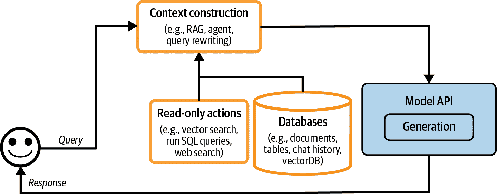
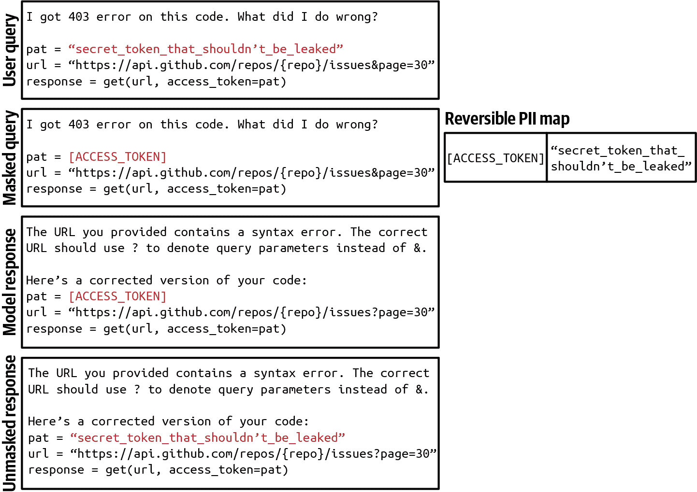
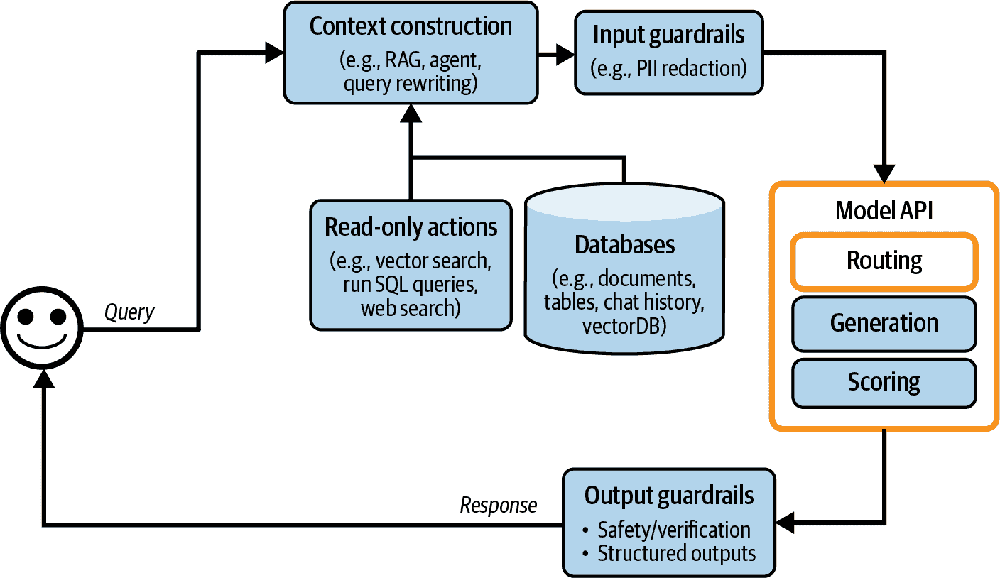
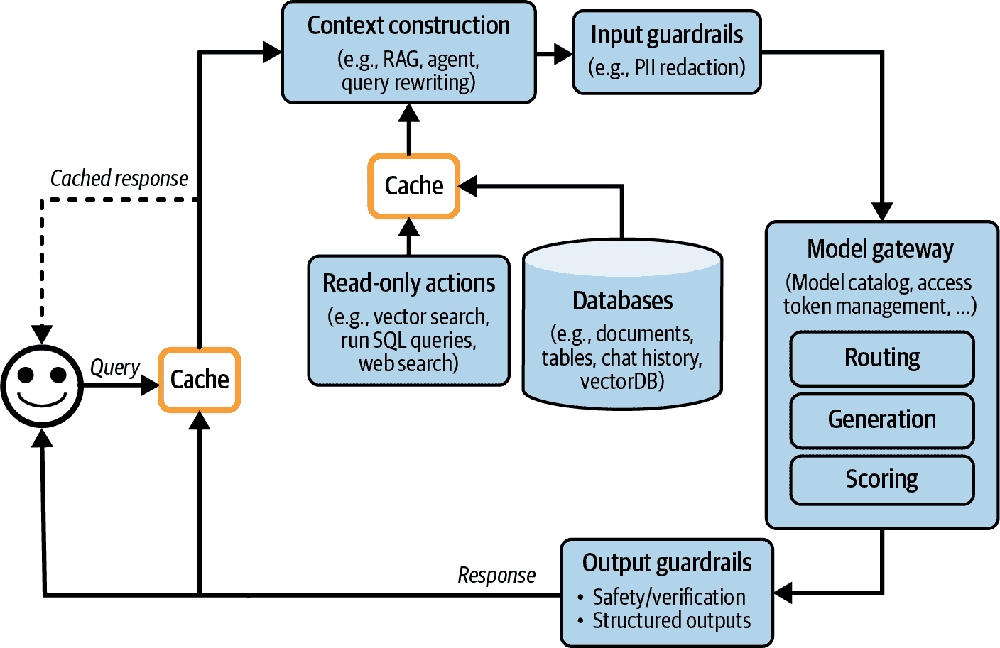
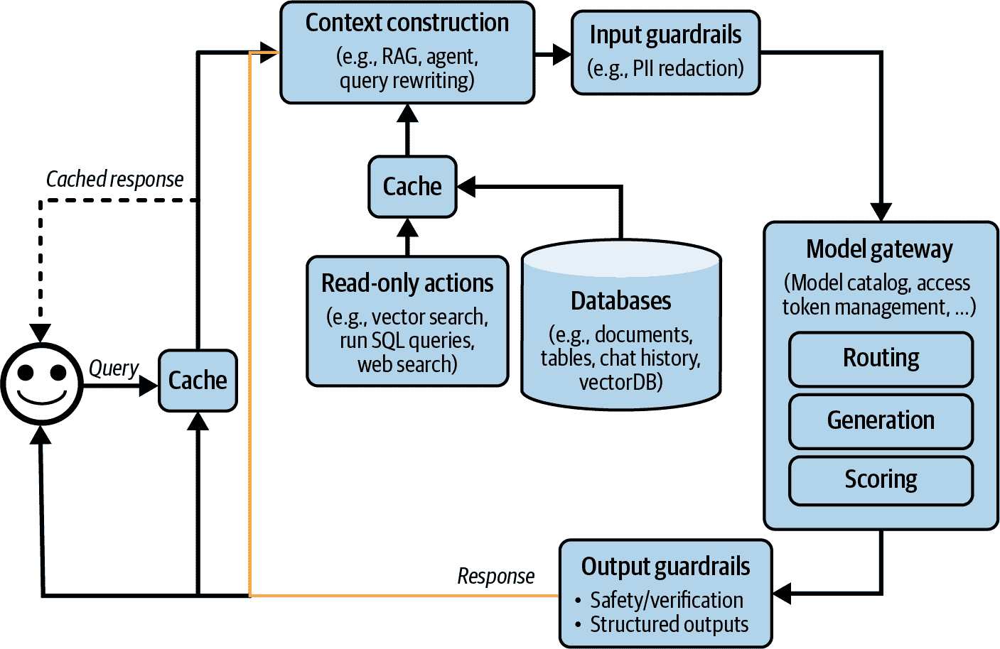
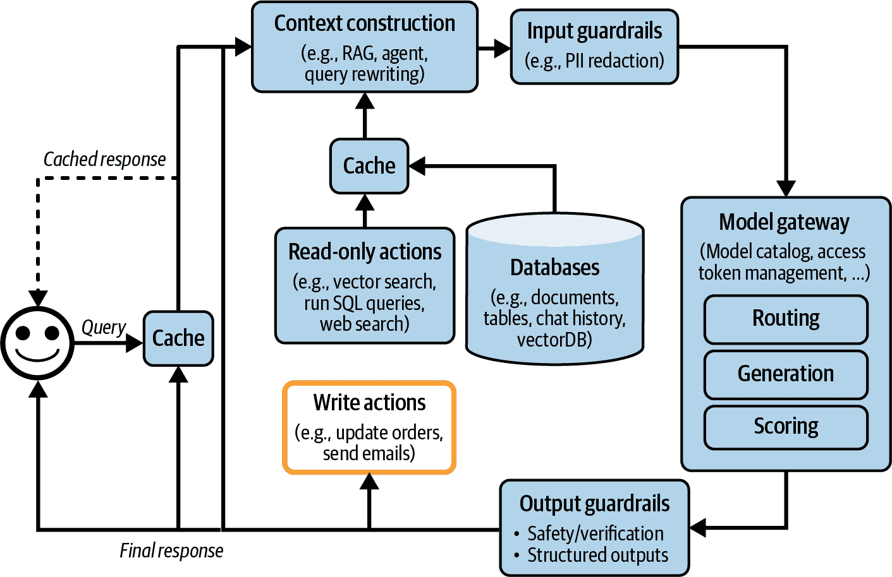
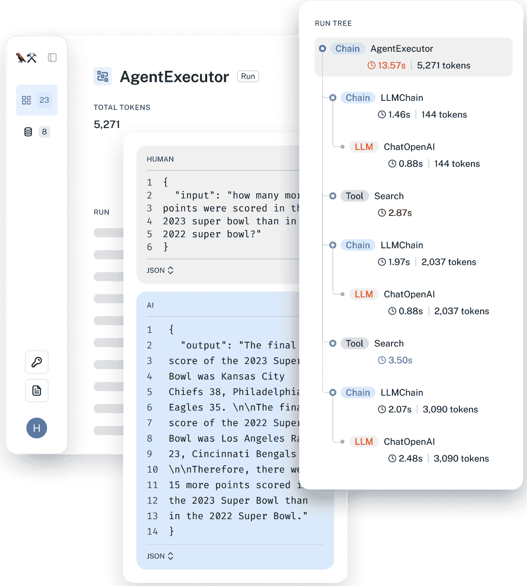
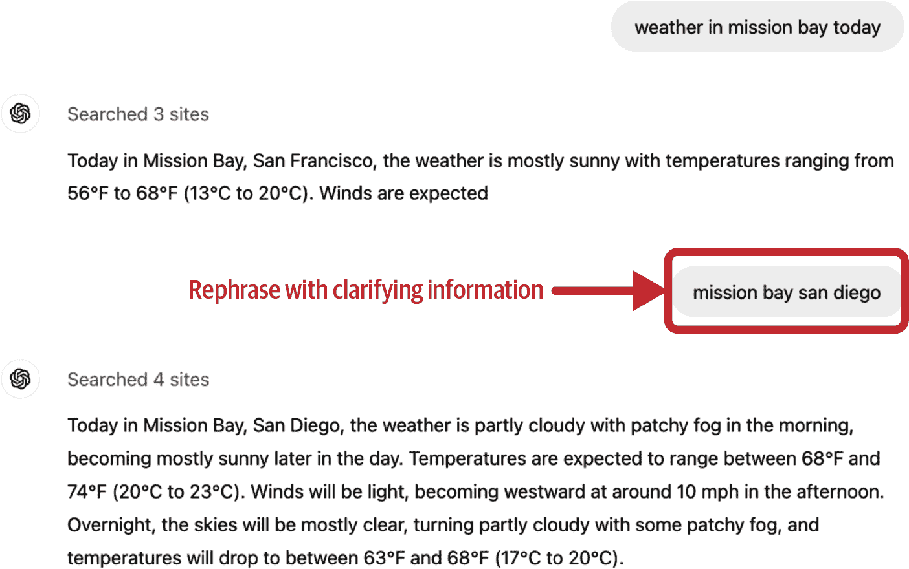
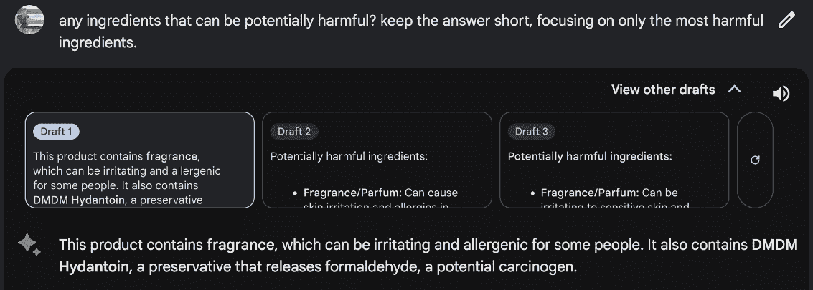
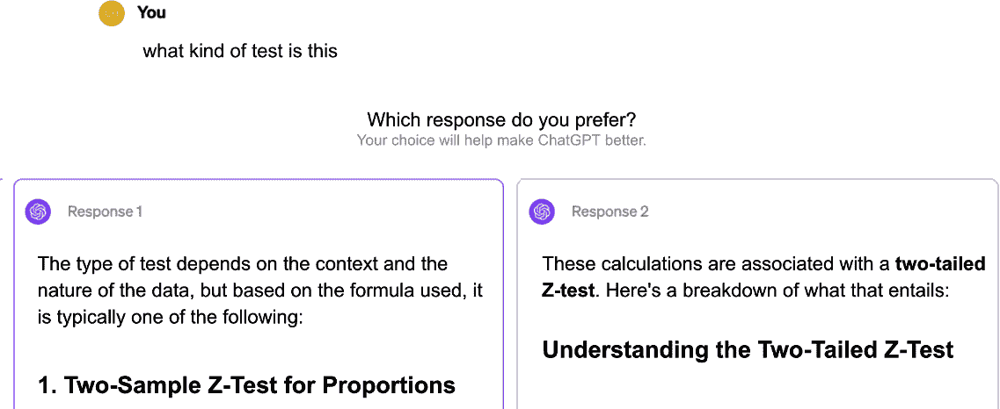

# 第十章\. 人工智能工程架构和用户反馈

到目前为止，这本书已经涵盖了一系列将基础模型适应特定应用的技术。本章将讨论如何将这些技术结合起来构建成功的产品。

考虑到可用的广泛人工智能工程技术和工具，选择正确的一个可能会让人感到不知所措。为了简化这个过程，本章采用逐步的方法。它从基础模型应用的最简单架构开始，强调该架构的挑战，并逐步添加组件来解决这些问题。

我们可以永远地推理如何构建一个成功的应用程序，但唯一确定一个应用程序是否真正实现其目标的方法是将它展示给用户。用户反馈始终是指导产品开发的无价之宝，但对于人工智能应用程序来说，用户反馈在作为改进模型的数据源方面起着更加关键的作用。对话界面使得用户更容易提供反馈，但对于开发者来说，提取信号则更加困难。本章将讨论不同类型的对话人工智能反馈以及如何设计一个系统来收集正确的反馈，同时不损害用户体验。

# 人工智能工程架构

一个完整的 AI 架构可能非常复杂。本节将按照团队在生产中可能遵循的过程进行说明，从最简单的架构开始，并逐步添加更多组件。尽管人工智能应用程序种类繁多，但它们共享许多共同组件。这里提出的架构已在多家公司得到验证，适用于广泛的应用，但某些应用程序可能会有所偏离。

在其最简单形式中，您的应用程序接收一个查询并将其发送到模型。模型生成一个响应，并将其返回给用户，如图 图 10-1 所示。没有上下文增强，没有安全护栏，也没有优化。"模型 API" 框架既指第三方 API（例如，OpenAI、Google、Anthropic）也指自托管模型。关于为自托管模型构建推理服务器的讨论请见 第九章。


###### 图 10-1\. 运行人工智能应用程序的最简单架构。

从这个简单的架构开始，根据需要可以添加更多组件。这个过程可能如下所示：

1.  通过让模型访问外部数据源和信息收集工具来增强模型中的上下文输入。

1.  为保护系统和用户，请设置安全护栏。

1.  添加模型路由器和网关以支持复杂管道并增加安全性。

1.  通过缓存优化延迟和成本。

1.  添加复杂逻辑并编写操作以最大化您系统的能力。

本章遵循我在生产中常见的发展过程。然而，每个人的需求都是不同的。你应该遵循对你应用程序最有意义的顺序。

监控和可观察性，这对于任何应用程序的质量控制和性能改进都是至关重要的，将在这一过程的最后进行讨论。编排，将所有这些组件连接在一起，将在之后进行讨论。

## 第一步：增强上下文

平台最初的扩展通常涉及添加机制，以便系统构建模型回答每个查询所需的相关上下文。如第六章所述（ch06.html#ch06_rag_and_agents_1730157386571386），上下文可以通过各种检索机制构建，包括文本检索、图像检索和表格数据检索。上下文还可以通过允许模型通过 API（如网络搜索、新闻、天气、事件等）自动收集信息的工具进行增强。

*上下文构建类似于基础模型的特征工程。* 它为模型提供必要的信息以生成输出。由于其在对系统输出质量中的核心作用，上下文构建几乎被所有模型 API 提供商所支持。例如，像 OpenAI、Claude 和 Gemini 这样的提供商允许用户上传文件，并允许他们的模型使用工具。

然而，正如模型在能力上有所不同一样，这些提供商在上下文构建支持方面也有所不同。例如，它们可能对可以上传的文档类型和数量有限制。一个专门的 RAG 解决方案可能允许你上传尽可能多的文档，只要你的向量数据库能够容纳，但一个通用的模型 API 可能只允许你上传少量文档。不同的框架在检索算法和其他检索配置（如块大小）方面也有所不同。同样，对于工具的使用，解决方案在支持的工具类型和执行模式（例如是否支持并行函数执行或长时间运行的任务）方面也有所不同。

通过上下文构建，现在的架构看起来就像图 10-2。



###### 图 10-2\. 带有上下文构建的平台架构。

## 第二步：设置安全网

安全网有助于降低风险并保护你和你的用户。应该在存在风险暴露的地方设置安全网。一般来说，它们可以分为围绕输入和输出的安全网。

### 输入安全网

输出防护栏通常保护两种类型的风险：向外部 API 泄露私人信息以及执行可能损害您系统的恶意提示。第五章讨论了攻击者如何通过提示攻击利用应用程序以及如何防御这些攻击。虽然您可以减轻风险，但由于模型生成响应的本性和不可避免的人类错误，它们永远无法完全消除。

向外部 API 泄露私人信息是使用外部模型 API 时特有的风险，当您需要将数据发送到组织外部时可能会发生。这可能是由于许多原因，包括以下：

+   员工将公司的机密信息或用户的私人信息复制到提示中，并将其发送到第三方 API。^([1)]

+   应用程序开发者将公司的内部政策和数据放入应用程序的系统提示中。

+   工具从内部数据库检索私人信息并将其添加到上下文中。

在使用第三方 API 时，没有绝对的方法可以消除潜在的泄露。然而，您可以使用防护栏来减轻它们。您可以使用许多可用的工具之一来自动检测敏感数据。要检测的敏感数据由您指定。常见的敏感数据类别如下：

+   个人信息（身份证号码、电话号码、银行账户）

+   人脸

+   与公司知识产权或机密信息相关的特定关键词和短语

许多敏感数据检测工具使用 AI 来识别可能敏感的信息，例如确定一个字符串是否类似于有效的家庭地址。如果发现查询中包含敏感信息，你有两个选择：阻止整个查询或从其中删除敏感信息。例如，你可以使用占位符[PHONE NUMBER]来屏蔽用户的电话号码。如果生成的响应包含此占位符，请使用将此占位符映射到原始信息的 PII 反向字典，以便您可以取消屏蔽它，如图图 10-3 所示。



###### 图 10-3\. 使用反向 PII 映射屏蔽和取消屏蔽 PII 信息以避免将其发送到外部 API 的示例。

### 输出防护栏

一个模型可能会以许多不同的方式失败。输出防护栏有两个主要功能：

+   捕获输出失败

+   指定处理不同故障模式的策略

为了捕捉不符合你标准的输出，你需要了解失败的样子。最容易检测到的失败是当模型在不应返回空响应时返回空响应.^(2) 对于不同的应用程序，失败的表现各不相同。以下是在两个主要类别：质量和安全中的常见失败：质量失败在第四章中讨论，安全失败在第五章中讨论。我将简要提及这些失败作为回顾：

+   质量

    +   格式不正确的回答，不符合预期的输出格式。例如，应用程序期望 JSON 格式，而模型生成了无效的 JSON。

    +   模型产生的与事实不符的幻觉性回答。

    +   通常很差的回答。例如，你要求模型写一篇论文，而这篇论文却很糟糕。

+   安全

    +   包含种族主义内容、色情内容或非法活动的有害回答。

    +   包含私人敏感信息的回答。

    +   触发远程工具和代码执行的回答。

    +   误导品牌风险的回答，错误地描述了你的公司或你的竞争对手。

根据第五章的内容，对于安全度量，跟踪不仅包括安全失败，还包括错误拒绝率是很重要的。可能存在过于安全的系统，例如，一个甚至阻止合法请求的系统，这会中断用户的工作负载并导致用户感到沮丧。

许多失败可以通过简单的重试逻辑来缓解。AI 模型是概率性的，这意味着如果你再次尝试查询，你可能会得到不同的响应。例如，如果响应为空，尝试再次 X 次或直到得到非空响应。同样，如果响应格式不正确，尝试再次直到响应格式正确。

然而，这种重试策略可能会产生额外的延迟和成本。每次重试意味着另一轮 API 调用。如果在失败后进行重试，用户感知的延迟将加倍。为了减少延迟，你可以并行调用。例如，对于每个查询，而不是等待第一个查询失败后再重试，你可以同时将这个查询发送给模型两次，得到两个响应，并选择更好的一个。这增加了冗余 API 调用的数量，同时保持延迟可管理。

对于复杂请求，也常见的是依赖人类。例如，你可以将包含特定短语的查询转移到人工操作员。一些团队使用专门的模型来决定何时将对话转移到人类。例如，当一个团队的 sentiment analysis 模型检测到用户消息中的愤怒时，他们会将对话转移到人工操作员。另一个团队在经过一定次数的回合后转移对话，以防止用户陷入循环。

### 栅栏实现

守卫有其权衡。一个是*可靠性 versus 延迟权衡*。虽然承认守卫的重要性，但有些团队告诉我延迟更重要。这些团队决定不实现守卫，因为它们可以显著增加应用程序的延迟。3

在流式完成模式下，输出守卫可能不会很好地工作。默认情况下，整个响应在显示给用户之前被生成，这可能需要很长时间。在流式完成模式下，新标记在生成时被流式传输给用户，从而减少了用户等待看到响应的时间。缺点是难以评估部分响应，因此在不安全的响应被系统守卫确定应该被阻止之前，它们可能会被流式传输给用户。

需要实现多少守卫也取决于你是否自托管模型或使用第三方 API。虽然你可以在两者之上实现守卫，但第三方 API 可以减少你需要实现的守卫，因为 API 提供者通常会为你提供许多内置的守卫。同时，自托管意味着你不需要发送外部请求，这减少了需要许多类型的输入守卫的需求。

由于应用程序可能失败的地方有很多，守卫可以在许多不同的级别上实现。模型提供者通过为他们的模型提供守卫来使模型更好、更安全。然而，模型提供者必须在安全性和灵活性之间取得平衡。限制可能会使模型更安全，但也会使其在特定用例中更难以使用。

守卫也可以由应用程序开发者实现。许多技术都在“防御提示攻击”中进行了讨论。你可以直接使用的守卫解决方案包括[Meta 的紫色骆驼](https://github.com/meta-llama/PurpleLlama)、[NVIDIA 的 NeMo 守卫](https://github.com/NVIDIA/NeMo-Guardrails)、[Azure 的 PyRIT](https://github.com/Azure/PyRIT)、[Azure 的人工智能内容过滤器](https://oreil.ly/CxwLn)、[Perspective API](https://oreil.ly/d2_sL)和[OpenAI 的内容审查 API](https://oreil.ly/-kOHE)。由于输入和输出风险的重叠，守卫解决方案可能会为输入和输出提供保护。一些模型网关也提供了守卫功能，如下一节所述。

使用守卫时，架构看起来像图 10-4。我把评分器放在模型 API 下面，因为评分器通常是 AI 驱动的，即使评分器通常比生成模型更小、更快。然而，评分器也可以放在输出守卫框中。


###### 图 10-4\. 添加输入和输出守卫的应用程序架构。

## 第 3 步：添加模型路由器和网关

随着应用的增长，涉及到更多模型，路由器和网关出现以帮助您管理服务多个模型复杂性和成本。

### 路由器

而不是为所有查询使用一个模型，您可以为不同类型的查询提供不同的解决方案。这种方法有几个好处。首先，它允许使用专门的模型，这些模型在特定查询上可能比通用模型表现得更好。例如，您可以有一个专门处理技术故障排除的模型，另一个专门处理账单的模型。其次，这可以帮助您节省成本。而不是为所有查询使用一个昂贵的模型，您可以将简单的查询路由到更便宜的模型。

路由器通常包含一个**意图分类器**，该分类器预测用户试图做什么。根据预测的意图，查询会被路由到相应的解决方案。例如，考虑与客户支持聊天机器人相关的不同意图：

+   如果用户想要重置密码，将他们路由到关于恢复密码的常见问题解答页面。

+   如果请求是纠正账单错误，将其路由到人工操作员。

+   如果请求是关于解决技术问题，将其路由到专门处理故障排除的聊天机器人。

意图分类器可以防止您的系统参与超出范围的对话。如果查询被认为不合适，聊天机器人可以礼貌地拒绝回答，使用库存回复之一，而不浪费 API 调用。例如，如果用户询问您在即将到来的选举中会投给谁，聊天机器人可以回答：“作为聊天机器人，我没有投票的能力。如果您对我们的产品有任何问题，我很乐意帮助。”

意图分类器可以帮助系统检测模糊查询并请求澄清。例如，对于“冷冻”的查询，系统可能会问，“您是想冻结您的账户还是您在谈论天气？”或者简单地问，“对不起，您能详细说明吗？”

其他路由器可以帮助模型决定下一步该做什么。例如，对于一个能够执行多个动作的代理，路由器可以是一个**下一动作预测器**：模型接下来应该使用代码解释器还是搜索 API？对于一个具有记忆系统的模型，路由器可以预测模型应该从内存层次结构的哪个部分获取信息。想象一下，用户将一份提到墨尔本的文档附加到当前对话中。稍后，用户问：“墨尔本最可爱的动物是什么？”模型需要决定是依赖附加文档中的信息还是搜索互联网来处理这个查询。

意图分类器和后续动作预测器可以在基础模型之上实现。许多团队采用较小的语言模型，如 GPT-2、BERT 和 Llama 7B 作为他们的意图分类器。许多团队选择从头开始训练更小的分类器。路由器应该快速且成本低，这样它们就可以使用多个路由器而不会产生显著的额外延迟和成本。

当将查询路由到具有不同上下文限制的模型时，查询的上下文可能需要相应地调整。考虑一个预定用于具有 4K 上下文限制的模型的 1,000 个标记查询。然后系统采取行动，例如进行网络搜索，返回 8,000 个标记的上下文。您可以选择截断查询的上下文以适应最初打算使用的模型，或者将查询路由到具有更大上下文限制的模型。

由于路由通常由模型执行，我在图 10-5 中将路由放在模型 API 框内。与评分器一样，路由器通常比用于生成的模型要小。

将路由器与其他模型分组在一起可以使模型更容易管理。然而，需要注意的是，路由通常发生在检索之前。例如，在检索之前，路由器可以帮助确定查询是否在范围内，如果是的话，是否需要检索。路由也可以在检索之后发生，例如确定查询是否应该路由到人工操作员。然而，路由-检索-生成-评分是更常见的 AI 应用模式。



###### 图 10-5\. 路由帮助系统为每个查询使用最佳解决方案。

### 网关

模型网关是一个中间层，允许您的组织以统一和安全的方式与不同的模型进行接口。模型网关最基本的功能是提供统一接口，用于不同的模型，包括自托管模型和位于商业 API 背后的模型。模型网关使维护代码变得更加容易。如果模型 API 发生变化，您只需更新网关，而不是更新所有依赖此 API 的应用程序。图 10-6 展示了模型网关的高级可视化。


###### 图 10-6\. 模型网关提供了一个统一的接口，用于与不同的模型协同工作。

在其最简单形式中，模型网关是一个统一的包装器。以下代码示例为您展示了模型网关可能如何实现。这不是一个功能性示例，因为它不包含任何错误检查或优化：

```py
import google.generativeai as genai
import openai

def openai_model(input_data, model_name, max_tokens):
    openai.api_key = os.environ["OPENAI_API_KEY"]
    response = openai.Completion.create(
        engine=model_name,
        prompt=input_data,
        max_tokens=max_tokens
    )
    return {"response": response.choices[0].text.strip()}

def gemini_model(input_data, model_name, max_tokens):
    genai.configure(api_key=os.environ["GOOGLE_API_KEY"])
    model = genai.GenerativeModel(model_name=model_name)
    response = model.generate_content(input_data, max_tokens=max_tokens)
    return {"response": response["choices"][0]["message"]["content"]}

@app.route('/model', methods=['POST'])
def model_gateway():
    data = request.get_json()
    model_type = data.get("model_type")
          model_name = data.get("model_name")
          input_data = data.get("input_data")
          max_tokens = data.get("max_tokens")

          if model_type == "openai":
              result = openai_model(input_data, model_name, max_tokens)
          elif model_type == "gemini":
              result = gemini_model(input_data, model_name, max_tokens)
          return jsonify(result)
```

模型网关提供**访问控制和成本管理**。您不必将组织令牌提供给所有希望访问 OpenAI API 的人，这些令牌很容易泄露，而是只给人们访问模型网关的权限，创建一个集中和受控的访问点。网关还可以实现细粒度的访问控制，指定哪个用户或应用程序应该有权访问哪个模型。此外，网关可以监控和限制 API 调用的使用，防止滥用并有效管理成本。

模型网关还可以用于实现回退策略，以克服速率限制或 API 故障（遗憾的是后者很常见）。当主 API 不可用时，网关可以将请求路由到替代模型，稍作等待后重试，或以其他方式优雅地处理故障。这确保了您的应用程序在没有中断的情况下平稳运行。

由于请求和响应已经通过网关流动，因此它是实现其他功能的好地方，例如负载均衡、日志记录和分析。一些网关甚至提供缓存和防护措施。

由于网关相对容易实现，因此有许多现成的网关。例如包括 [Portkey 的 AI 网关](https://github.com/Portkey-AI/gateway)、[MLflow AI 网关](https://oreil.ly/D2X_Y)、[Wealthsimple 的 LLM 网关](https://github.com/wealthsimple/llm-gateway)、[TrueFoundry](https://oreil.ly/ICRRA)、[Kong](https://oreil.ly/St4W6) 和 [Cloudflare](https://oreil.ly/0NuNb)。

在我们的架构中，网关现在取代了模型 API 盒，如图 图 10-7 所示。


###### 图 10-7\. 增加了路由和网关模块的架构。

###### 注意

类似的抽象层，例如工具网关，也可以用于访问广泛的各种工具。由于它不是本书写作时的常见模式，因此本书没有讨论。

## 步骤 4\. 使用缓存降低延迟

缓存长期以来一直是软件应用的组成部分，用于降低延迟和成本。软件缓存的许多想法可以用于人工智能应用。推理缓存技术，包括 KV 缓存和提示缓存，在 第九章 中讨论。本节重点介绍系统缓存。由于缓存是一项古老的技术，已有大量现有文献，本书将只作概述。一般来说，有两种主要的系统缓存机制：精确缓存和语义缓存。

### 精确缓存

在精确缓存中，只有当请求这些确切的项目时才使用缓存的项目。例如，如果用户要求模型总结一个产品，系统会检查缓存以查看是否存在该确切产品的摘要。如果存在，则获取此摘要。如果不存在，则总结产品并将摘要缓存起来。

精确缓存也用于基于嵌入的检索以避免冗余向量搜索。如果传入的查询已经在向量搜索缓存中，则获取缓存的查询结果。如果没有，则为此查询执行向量搜索并将结果缓存。

对于涉及多个步骤（例如，思维链）和/或耗时操作（例如，检索、SQL 执行或网络搜索）的查询，缓存特别有吸引力。

可以使用内存存储来实现精确缓存，以便快速检索。然而，由于内存存储有限，也可以使用数据库（如 PostgreSQL、Redis 或分层存储）来实现缓存，以平衡速度和存储容量。拥有一个驱逐策略对于管理缓存大小并保持性能至关重要。常见的驱逐策略包括最近最少使用（LRU）、最少使用（LFU）和先进先出（FIFO）。

缓存查询多长时间取决于该查询再次被调用的可能性有多大。用户特定的查询，例如“我的最近订单状态如何？”，不太可能被其他用户重用，因此不应缓存。同样，缓存时间敏感的查询，如“天气如何？”也没有太多意义。许多团队训练一个分类器来预测是否应该缓存查询。

###### 警告

如果处理不当，缓存可能导致数据泄露。想象一下，你为一家电子商务网站工作，用户 X 提出了一个看似普通的问题，例如：“电子产品产品的退货政策是什么？”因为你的退货政策取决于用户的会员资格，系统首先检索用户 X 的信息，然后生成包含 X 信息的响应。如果将此查询误认为是普通问题，系统将缓存答案。后来，当用户 Y 提出相同的问题时，返回的缓存结果揭示了 X 的信息。

### 语义缓存

与精确缓存不同，即使缓存的项与传入的查询只有语义相似，而不是完全相同，也会使用这些项。想象一下，一个用户问：“越南的首都是什么？”模型回答：“河内”。后来，另一个用户问：“越南的*城市*首都是什么？”这是一个语义上相同但措辞略有不同的问题。使用语义缓存，系统可以重用第一个查询的答案，而不是从头开始计算新的查询。重用相似的查询可以提高缓存的命中率并可能降低成本。然而，语义缓存可能会降低您的模型性能。

语义缓存仅在您有可靠的方法确定两个查询是否相似时才有效。一种常见的方法是使用语义相似度，如第三章第 3.1.5 节中所述。作为一个提醒，语义相似度的工作原理如下：

1.  对于每个查询，使用嵌入模型生成其嵌入。

1.  使用向量搜索找到与当前查询嵌入最相似的缓存的嵌入。假设这个相似度分数是 *X*。

1.  如果 *X* 超过一定的相似度阈值，则缓存的查询被认为是相似的，并返回缓存的查询结果。如果不满足条件，则处理当前查询并将其与其嵌入和结果一起缓存。

此方法需要一个向量数据库来存储缓存的查询的嵌入。

与其他缓存技术相比，语义缓存的价值更加可疑，因为其许多组件容易出错。其成功依赖于高质量的嵌入、功能性的向量搜索和可靠的相似度度量。设置合适的相似度阈值也可能很棘手，需要大量的尝试和错误。如果系统错误地将传入的查询视为与另一个查询相似，那么从缓存中检索的返回响应将是不正确的。

此外，语义缓存可能耗时且计算密集，因为它涉及向量搜索。这种向量搜索的速度和成本取决于您缓存的嵌入的大小。

如果缓存命中率很高，即大部分查询可以通过利用缓存结果得到有效回答，那么语义缓存可能仍然是有价值的。然而，在引入语义缓存的复杂性之前，请确保评估相关的效率、成本和性能风险。

在增加缓存系统后，平台看起来像图 10-8。键值缓存和提示缓存通常由模型 API 提供商实现，因此在此图中未显示。为了可视化它们，我会将它们放在模型 API 框中。有一个新的箭头用于将生成的响应添加到缓存中。



###### 图 10-8\. 增加缓存后的 AI 应用架构。

## 第 5 步：添加代理模式

到目前为止讨论的应用程序仍然相当简单。每个查询都遵循一个顺序流程。然而，如第六章所述（ch06.html#ch06_rag_and_agents_1730157386571386），应用程序流程可以更复杂，包括循环、并行执行和条件分支。在第六章中讨论的代理模式可以帮助您构建复杂的应用程序。例如，系统生成输出后，可能会确定尚未完成任务，需要执行另一个检索以获取更多信息。原始响应与新检索到的上下文一起传递到同一个模型或不同的模型。这创建了一个循环，如图 10-9 所示（#ch10_figure_9_1730130985262696）。



###### 图 10-9\. 黄色箭头允许将生成的响应反馈到系统中，从而允许更复杂的应用模式。

模型的输出也可以用来调用写入操作，例如撰写电子邮件、下订单或初始化银行转账。写入操作允许系统直接对其环境进行更改。如第六章讨论所示，写入操作可以使系统功能大大增强，但也使其面临显著更多的风险。给予模型访问写入操作应该非常谨慎。添加了写入操作后，架构看起来就像图 10-10。

如果您已经遵循了迄今为止的所有步骤，那么您的架构可能已经变得相当复杂。虽然复杂系统可以解决更多任务，但它们也引入了更多的故障模式，由于存在许多潜在的故障点，这使得它们更难以调试。下一节将介绍提高系统可观察性的最佳实践。



###### 图 10-10\. 允许系统执行写入操作的应用程序架构。

## 监控和可观察性

尽管我将可观察性放在了自己的一个部分，但可观察性应该成为产品设计的一部分，而不是事后考虑。产品越复杂，可观察性就越重要。

可观察性是所有软件工程学科的一个通用实践。这是一个大行业，拥有既定的最佳实践和许多现成的专有和开源解决方案。4 为了避免重复造轮子，我将专注于在基础模型之上构建的应用程序的独特之处。本书的[GitHub 仓库](https://github.com/chiphuyen/aie-book)包含有关可观察性的更多资源。5

监控的目标与评估的目标相同：降低风险并发现机会。监控应帮助您缓解的风险包括应用程序故障、安全攻击和漂移。监控可以帮助发现应用程序改进和成本节约的机会。监控还可以通过提供对系统性能的可见性来帮助您承担责任。

三个指标可以帮助评估您系统可观察性的质量，这些指标源自 DevOps 社区：

+   MTTD（平均检测时间）：当发生不良事件时，需要多长时间才能检测到？

+   MTTR（平均响应时间）：检测后，需要多长时间才能解决？

+   CFR（变更失败率）：导致需要修复或回滚的失败变更或部署的百分比。如果您不知道您的 CFR，那么是时候重新设计您的平台，使其更具可观察性。

高 CFR 并不一定意味着监控系统不好。然而，你应该重新思考你的评估流程，以便在部署之前捕捉到不良变化。评估和监控需要紧密合作。评估指标应该很好地转化为监控指标，这意味着在评估期间表现良好的模型也应该在监控期间表现良好。监控期间检测到的问题应该反馈到评估流程中。

### 指标

当讨论监控时，大多数人会想到指标。然而，指标本身并不是目标。坦白说，大多数公司并不关心你的应用程序输出相关性的得分，除非它有用途。指标的目的在于告诉你何时有问题，并识别改进的机会。

在列出要跟踪的指标之前，了解你想要捕捉的失败模式并围绕这些失败设计你的指标是很重要的。例如，如果你不希望你的应用程序产生幻觉，设计可以帮助你检测幻觉的指标。一个相关的指标可能是应用程序的输出是否可以从上下文中推断出来。如果你不希望你的应用程序耗尽你的 API 信用，跟踪与 API 成本相关的指标，例如每个请求的输入和输出令牌数量或你的缓存成本和你的缓存命中率。

由于基础模型可以生成开放式输出，事情出错的方式有很多。指标设计需要分析思维、统计知识，并且通常还需要创造力。你应该跟踪哪些指标非常具体地取决于应用。

本书已经涵盖了多种不同类型的模型质量指标（第四章至第六章，以及本章后面的内容）和许多不同的计算方法（第三章和第五章）。在这里，我将快速回顾。

最容易跟踪的失败类型是格式错误，因为它们容易注意到和验证。例如，如果你期望 JSON 输出，跟踪模型输出无效 JSON 的频率，以及在这些无效 JSON 输出中，有多少可以轻松修复（缺少一个闭合括号很容易修复，但缺少预期的键则更难）。

对于开放式生成，考虑监控事实一致性以及相关生成质量指标，如简洁性、创造性和积极性。许多这些指标可以使用 AI 评判员来计算。

如果安全问题是一个问题，你可以跟踪与毒性相关的指标，并在输入和输出中检测到私有和敏感信息。跟踪你的安全措施被触发的频率以及你的系统拒绝回答的频率。也要检测对系统的异常查询，因为它们可能揭示有趣的边缘情况或触发攻击。

模型质量也可以通过用户自然语言反馈和对话信号推断出来。例如，你可以跟踪的一些简单指标包括以下内容：

+   用户多频繁地在生成过程中停止？

+   每次对话的平均轮数是多少？

+   每个输入的平均标记数是多少？用户是否在使用你的应用程序进行更复杂的任务，或者他们是否在学会使他们的提示更加简洁？

+   每个输出的平均标记数是多少？某些模型是否比其他模型更冗长？某些类型的查询更有可能产生较长的答案？

+   模型的输出标记分布是什么？它随时间如何变化？模型是否变得更加多样化或减少多样化？

与长度相关的指标对于跟踪延迟和成本也很重要，因为较长的上下文和响应通常会增加延迟并产生更高的成本。

应用程序管道中的每个组件都有自己的指标。例如，在 RAG 应用程序中，检索质量通常使用上下文相关性和上下文精确度来评估。向量数据库可以通过它需要多少存储来索引数据以及查询数据所需的时间来评估。

考虑到你可能有多项指标，测量这些指标之间以及特别是与你的业务北极星指标（例如，日活跃用户数 DAU、会话时长（用户与应用程序积极互动的时间长度）或订阅）的相关性是有用的。与北极星指标高度相关的指标可能会给你提供改进北极星指标的想法。完全不相关的指标也可能给你提供关于不需要优化的想法。

跟踪延迟对于理解用户体验至关重要。如第九章所述的常见延迟指标包括：

+   首个标记的时间（TTFT）：生成第一个标记所需的时间。

+   每个输出标记的时间（TPOT）：生成每个输出标记所需的时间。

+   总延迟：完成响应所需的总时间。

按用户跟踪所有这些指标，以查看你的系统如何随着用户数量的增加而扩展。

你还希望跟踪成本。与成本相关的指标是查询次数和输入输出标记量，例如每秒标记数（TPS）。如果你使用有速率限制的 API，跟踪每秒的请求数量很重要，以确保你保持在分配的限制内，并避免潜在的服务中断。

在计算指标时，你可以选择进行抽查或详查。抽查涉及采样数据子集以快速识别问题，而详查则评估每个请求以获得全面的性能视图。选择取决于你的系统需求和可用资源，两者结合提供了一种平衡的监控策略。

在计算指标时，确保它们可以根据相关轴进行分解，例如用户、发布版本、提示/链版本、提示/链类型和时间。这种粒度有助于理解性能变化并识别特定问题。

### 日志和跟踪

指标通常是汇总的。它们从你系统中随时间发生的事件中压缩信息。它们帮助你一眼就能了解你的系统表现如何。然而，有许多问题指标无法帮助你回答。例如，在看到特定活动的峰值后，你可能会想知道：“这种情况以前发生过吗？”日志可以帮助你回答这个问题。

如果指标是表示属性和事件的数值测量，那么日志是事件的追加记录。在生产环境中，调试过程可能如下所示：

1.  指标可以告诉你五分钟前出了问题，但它们无法告诉你具体发生了什么。

1.  你查看大约五分钟前发生的事件的日志，以了解发生了什么。

1.  将日志中的错误与指标相关联，以确保你已经确定了正确的问题。

为了快速检测，指标需要快速计算。为了快速响应，日志需要随时可用且易于访问。如果你的日志延迟了 15 分钟，你将不得不等待日志到达以追踪五分钟前发生的问题。

由于你不知道未来需要查看哪些日志，日志的一般规则是记录一切。记录所有配置，包括模型 API 端点、模型名称、采样设置（温度、top-p、top-k、停止条件等）和提示模板。

记录用户查询、发送给模型的最终提示、输出以及中间输出。记录是否调用了任何工具。记录工具输出。记录组件启动、结束、崩溃等情况。在记录日志条目时，确保为其提供标签和 ID，以便你知道这些日志来自系统的哪个部分。

记录一切意味着你拥有的日志量可能会迅速增长。许多用于自动化日志分析和日志异常检测的工具都由 AI 驱动。

虽然手动处理日志是不可能的，但每天手动检查生产数据以了解用户如何使用你的应用程序是有用的。[Shankar 等人，(2024)](https://arxiv.org/abs/2404.12272)发现，随着开发者与更多数据的互动，他们对什么构成良好和不良输出的看法会发生变化，这使得他们既能重写提示以增加获得良好响应的机会，也能更新他们的评估流程以捕捉不良响应。

如果日志是一系列不连续的事件，则通过将相关事件链接在一起来重建跟踪，形成一个事务或过程的完整时间线，显示每个步骤如何从开始到结束连接。简而言之，跟踪是对请求通过各种系统组件和服务执行路径的详细记录。在人工智能应用程序中，跟踪揭示了从用户发送查询到最终响应返回的整个过程，包括系统采取的操作、检索的文档以及发送给模型的最终提示。它还应显示每个步骤花费的时间和其相关成本，如果可以衡量的话。图 10-11 是请求跟踪在 [LangSmith](https://oreil.ly/Oml_x) 中的可视化。

理想情况下，你应该能够逐步跟踪每个查询在系统中的转换步骤。如果一个查询失败，你应该能够确定它出错的确切步骤：是处理错误，检索的上下文不相关，还是模型生成了错误的响应。



###### 图 10-11\. 由 LangSmith 可视化的请求跟踪。

### 漂移检测

系统的部分越多，可能发生变化的事物就越多。在人工智能应用程序中，这些可能包括：

系统提示变化

你的应用程序的系统提示可能在没有你意识到的情况下发生变化，原因有很多。系统提示可能基于一个提示模板构建，而这个提示模板已被更新。一个同事可能发现了错误并进行了修复。一个简单的逻辑应该足以捕捉到你的应用程序的系统提示发生变化。

用户行为变化

随着时间的推移，用户会适应技术。例如，人们已经找到了如何在 Google 搜索中构建他们的查询以获得更好的结果或如何使他们的文章在搜索结果中排名更高的方法。生活在自动驾驶汽车地区的居民已经找到了如何迫使自动驾驶汽车给他们让路的技巧([刘等人，2020](https://oreil.ly/AWwkx))。你的用户可能会改变他们的行为以从你的应用程序中获得更好的结果。例如，你的用户可能会学会编写指令以使响应更加简洁。这可能会导致响应长度随时间逐渐下降。如果你只看指标，可能不明显是什么导致了这种逐渐的下降。你需要进行调查以了解根本原因。

基础模型变化

当通过 API 使用模型时，可能的情况是 API 保持不变，而底层模型已更新。如第四章所述，模型提供者可能并不总是披露这些更新，而将检测任何变化的责任留给了您。同一 API 的不同版本可能会对性能产生重大影响。例如，[陈等人（2023）](https://arxiv.org/abs/2307.09009)观察到 GPT-4 和 GPT-3.5 在 2023 年 3 月和 6 月版本之间的基准分数存在显著差异。同样，Voiceflow 报告了从较旧的 GPT-3.5-turbo-0301 切换到较新的 GPT-3.5-turbo-1106 时性能下降了 10%。

## AI 管道编排

AI 应用程序可能相当复杂，包括多个模型、从许多数据库检索数据以及访问广泛的各种工具。编排器帮助您指定这些不同的组件如何协同工作以创建端到端管道。它确保数据在组件之间无缝流动。在较高层次上，编排器在两个步骤中操作，即组件定义和连接：

组件定义

您需要告诉编排器您的系统使用哪些组件，包括不同的模型、用于检索的外部数据源以及您的系统可以使用的工具。模型网关可以使添加模型变得更加容易.^(6) 您还可以告诉编排器您是否使用了任何用于评估和监控的工具。

连接

连接基本上是函数组合：它将不同的函数（组件）组合在一起。在连接（管道）中，您告诉编排器您的系统从接收用户查询到完成任务所采取的步骤。以下是一个步骤示例：

1.  处理原始查询。

1.  根据处理后的查询检索相关数据。

1.  将原始查询和检索到的数据结合起来，创建符合模型预期的提示。

1.  模型根据提示生成响应。

1.  评估响应。

1.  如果响应被认为是好的，将其返回给用户。如果不是，将查询路由到人工操作员。

编排器负责在组件之间传递数据。它应提供工具，以确保当前步骤的输出符合下一步的预期格式。理想情况下，它应在由于组件故障或数据不匹配错误等错误导致数据流中断时通知您。

###### 警告

AI 管道编排器与通用工作流编排器（如 Airflow 或 Metaflow）不同。

当为具有严格延迟要求的应用程序设计管道时，尽可能多地并行处理。例如，如果您有一个路由组件（决定将查询发送到哪里）和一个 PII 移除组件，这两个组件可以同时完成。

目前有许多 AI 编排工具，包括[LangChain](https://github.com/langchain-ai/langchain)、[LlamaIndex](https://github.com/run-llama/llama_index)、[Flowise](https://github.com/FlowiseAI/Flowise)、[Langflow](https://github.com/langflow-ai/langflow)和[Haystack](https://github.com/deepset-ai/haystack)。由于检索和工具使用是常见的应用模式，许多 RAG 和代理框架也是编排工具。

虽然在项目开始时直接跳到编排工具很有吸引力，*但你可能想要先在不使用编排器的情况下构建你的应用。* 任何外部工具都会带来额外的复杂性。编排器可以抽象出系统工作的重要细节，使得理解和调试系统变得困难。

当你进入应用开发过程的后期阶段时，你可能会决定编排器可以使你的生活变得更轻松。在评估编排器时，请记住以下三个方面：

集成与扩展性

评估编排器是否支持你目前使用或未来可能采用的组件。例如，如果你想使用 Llama 模型，检查编排器是否支持该模型。鉴于存在许多模型、数据库和框架，编排器不可能支持所有内容。因此，你还需要考虑编排器的可扩展性。如果它不支持某个特定组件，改变它有多难？

支持复杂管道

随着你的应用复杂性增长，你可能需要管理涉及多个步骤和条件逻辑的复杂管道。支持高级功能如分支、并行处理和错误处理的编排器将帮助你高效地管理这些复杂性。

易用性、性能和可扩展性

考虑编排器的用户友好性。寻找直观的 API、全面的文档和强大的社区支持，因为这些可以显著降低你和你团队的学习曲线。避免那些启动隐藏 API 调用或引入应用延迟的编排器。此外，确保编排器能够随着应用、开发人员和流量的增长而有效地扩展。

# 用户反馈

用户反馈在软件应用中始终扮演着至关重要的角色，主要体现在两个方面：评估应用性能和指导其开发。然而，在 AI 应用中，用户反馈的作用更为显著。用户反馈是专有数据，数据是竞争优势。一个设计良好的用户反馈系统对于创建第八章中讨论的数据飞轮至关重要第八章.^(7)

用户反馈不仅可用于为单个用户个性化模型，还可以用于训练模型的未来迭代。随着数据变得越来越稀缺，专有数据比以往任何时候都更有价值。一个快速推出并早期吸引用户的产物可以收集数据以持续改进模型，这使得竞争对手难以赶上。

重要的是要记住，用户反馈是用户数据。利用用户反馈需要与利用任何数据时相同的谨慎。应尊重用户隐私。用户有权知道他们的数据是如何被使用的。

## 提取对话反馈

传统上，反馈可以是**显式或隐式**的。显式反馈是用户在应用中对明确请求反馈时提供的信息，例如点赞/踩、点赞/踩、星级评分或对“我们解决了你的问题吗？”这一问题的肯定/否定回答。显式反馈在应用中相当标准化——询问一个人是否喜欢某物的途径有限。因此，显式反馈更容易理解。

隐式反馈是从用户行为中推断出的信息。例如，如果有人购买了推荐给他们的产品，这意味着这是一个好的推荐。可以被视为隐式反馈的内容取决于用户在每种应用中可以执行哪些操作，因此它高度依赖于应用。基础模型开启了一个新的应用世界，以及许多隐式反馈的流派。

许多 AI 应用使用的对话界面使用户提供反馈变得更加容易。用户可以像在日常对话中一样鼓励良好行为和纠正错误。用户用来向 AI 下达指令的语言可以传达关于**应用性能**和**用户偏好**的反馈。

例如，想象一下你正在使用一个 AI 助手来帮助你计划前往澳大利亚的旅行。你要求 AI 在悉尼为你找到三晚的酒店。它给出了以下三个推荐：

```py
Here are three hotel suggestions in Sydney for a 3-night stay:

1\. Historic Rocks Boutique Hotel (The Rocks)
-Price: ~$400/night
-Neighborhood: Charming streets and close to iconic sights.

2\. Stylish Surry Hills House Hotel (Surry Hills)
-Price: ~$200/night
-Neighborhood: Trendy, with vibrant cafes and art galleries.

3\. Chill Bondi Beachside Hotel (Bondi Beach)
-Price: ~$300/night
Neighborhood: Beachside, ideal for relaxation and city exploration.

```

你对这些建议的反应揭示了你的偏好。例如，如果你回答“是的，预订靠近画廊的那家”，这表明你对艺术感兴趣。另一方面，回答“有没有低于 200 美元的？”则揭示了价格敏感的偏好，并暗示助手还没有完全理解你。

从对话中提取的用户反馈可用于评估、开发和个性化：

+   评估：推导出用于监控应用的指标

+   开发：训练未来的模型或指导其发展

+   个性化：为每个用户个性化应用程序

隐式对话反馈可以从用户消息的内容和他们的交流模式中推断出来。由于反馈融入了日常对话中，因此提取它也具有挑战性。虽然对对话提示的直觉可以帮助你设计出一套初始的信号来寻找，但严格的数据分析和用户研究是理解这些信号的必要条件。

尽管由于对话机器人的普及，对话反馈受到了更多的关注，但在 ChatGPT 出现之前，它已经是一个活跃的研究领域好几年了。自 2010 年代末以来，强化学习社区一直在尝试让 RL 算法从自然语言反馈中学习，其中许多取得了有希望的结果；参见[Fu 等人（2019）](https://arxiv.org/abs/1902.07742)；[Goyal 等人（2019）](https://arxiv.org/abs/1903.02020)；[Zhou 和 Small（2020）](https://arxiv.org/abs/2008.06924)；以及[Sumers 等人（2020）](https://arxiv.org/abs/2009.14715))。自然语言反馈对于早期的对话人工智能应用（如 Amazon Alexa [Ponnusamy 等人，2019](https://arxiv.org/abs/1911.02557)；[Park 等人，2020](https://arxiv.org/abs/2010.12251))、Spotify 的语音控制功能([Xiao 等人，2021](https://oreil.ly/m8o0h))和 Yahoo! Voice([Hashimoto 和 Sassano，2018](https://oreil.ly/bGAeG)))也非常感兴趣。

### 自然语言反馈

从消息内容中提取的反馈被称为自然语言反馈。以下是一些自然语言反馈信号，它们可以告诉你对话的进展情况。在生产环境中跟踪这些信号对于监控应用程序的性能非常有用。

#### 提前终止

如果用户提前终止了响应，例如，在响应生成中途停止，退出应用程序（对于网页和移动应用程序），告诉模型停止（对于语音助手），或者简单地让代理悬空（例如，不回应你想让代理继续选择的选项），那么很可能是对话进行得不顺利。

#### 错误纠正

如果用户在后续发言时以“不，…”或“我的意思是，…”开头，那么模型的可能回答可能就不准确。

为了纠正错误，用户可能会尝试重新措辞他们的请求。图 10-12 展示了用户尝试纠正模型误解的一个例子。可以使用启发式方法或机器学习模型来检测重新措辞的尝试。



###### 图 10-12。由于用户既提前终止了生成，又重新措辞了问题，可以推断出模型误解了原始请求的意图。

用户还可以指出模型应该有所不同的事情。例如，如果用户要求模型总结一个故事，而模型混淆了角色，这个用户可以提供如下反馈：“比尔是嫌疑人，而不是受害者。”模型应该能够接受这种反馈并修改总结。

这种行动纠正的反馈在代理用例中尤其常见，在这些用例中，用户可能会推动代理采取更多可选的行动。例如，如果用户指派代理执行关于公司 XYZ 的市场分析任务，这个用户可能会提供如下反馈：“你也应该检查 XYZ 的 GitHub 页面”或“检查 CEO 的 X 档案”。

有时，用户可能希望模型通过请求明确的确认来纠正自己，例如“你确定吗？”、“再检查一下”或“给我看看来源”。这并不一定意味着模型给出了错误的答案。然而，它可能意味着你的模型答案缺少用户正在寻找的细节。这也可能表明用户对你模型的普遍不信任。

一些应用程序允许用户直接编辑模型的回答。例如，如果用户要求模型生成代码，而用户纠正了生成的代码，这表明被编辑的代码可能并不完全正确。

用户编辑也作为有价值的选择数据来源。回想一下，选择数据通常以（查询，获胜回答，失败回答）的格式存在，可以用来将模型与人类偏好对齐。每个用户编辑都构成一个偏好示例，原始生成的回答是失败回答，而编辑后的回答是获胜回答。

#### 投诉

通常，用户只是对你的应用程序的输出进行投诉，而不尝试纠正它们。例如，他们可能会投诉答案错误、不相关、有毒、冗长、缺乏细节或只是不好。表 10-1 显示了从自动聚类 FITS（交互式对话与搜索反馈）数据集（Xu 等人，2022 年）得到的八组自然语言反馈。

表 10-1\. 从自动聚类 FITS 数据集（Xu 等人，2022 年）得到的反馈类型。结果来自[袁等人（2023）](https://arxiv.org/abs/2306.13588)。

| 组 | 反馈类型 | 数量 | % |
| --- | --- | --- | --- |
| 1 | 再次明确他们的需求。 | 3702 | 26.54% |
| 2 | 投诉机器人（1）没有回答问题或（2）提供不相关信息或（3）要求用户自己找出答案。 | 2260 | 16.20% |
| 3 | 指出可以回答问题的具体搜索结果。 | 2255 | 16.17% |
| 4 | 建议机器人应该使用搜索结果。 | 2130 | 15.27% |
| 5 | 声明答案（1）事实错误，或（2）没有基于搜索结果。 | 1572 | 11.27% |
| 6 | 指出机器人的答案不具体/准确/完整/详细。 | 1309 | 9.39% |
| 7 | 指出机器人对其答案缺乏信心，并且总是以“我不确定”或“我不知道”开始其响应。 | 582 | 4.17% |
| 8 | 投诉机器人响应中的重复/粗鲁。 | 137 | 0.99% |

理解机器人如何让用户失望对于改进它至关重要。例如，如果你知道用户不喜欢冗长的答案，你可以改变机器人的提示使其更加简洁。如果用户因为答案缺乏细节而不高兴，你可以提示机器人更加具体。

#### 情感

投诉也可以是未解释原因的负面情感（挫败感、失望、嘲讽等）的一般表达，例如“呃”。这可能听起来很反乌托邦，但分析用户与机器人对话中的情感可能会让你了解机器人做得如何。一些呼叫中心跟踪用户在整个通话中的声音。如果用户的声音越来越大，说明出了问题。相反，如果有人开始时很生气但结束时很高兴，那么对话可能已经解决了他们的问题。

自然语言反馈也可以从模型的响应中推断出来。一个重要的信号是模型的*拒绝率*。如果一个模型说“对不起，我不知道那一个”或“作为一个语言模型，我做不到…”，用户可能是不高兴的。

### 其他对话反馈

其他类型的对话反馈可以从用户行为而不是消息中得出。

#### 再生

许多应用允许用户生成另一个响应，有时使用不同的模型。如果用户选择再生，可能是因为他们对第一个响应不满意。然而，也可能是因为第一个响应是足够的，但用户想要比较的选项。这在像图像或故事生成这样的创意请求中尤其常见。

相比于订阅的应用，再生信号可能在基于使用量的计费应用中更强。在使用量计费的情况下，用户不太可能再生并花费额外的钱出于无聊的好奇心。

个人来说，我经常选择再生来处理复杂请求，以确保模型的响应是一致的。如果两个响应给出了相互矛盾的答案，我就无法信任任何一个。

在再生之后，一些应用可能会明确要求将新的响应与之前的响应进行比较，如图图 10-13 所示。这些更好或更差的数据，同样可以用于偏好微调。


###### 图 10-13。当用户再生另一个响应时，ChatGPT 请求比较反馈。

#### 对话组织

用户为组织他们的对话所采取的行动——例如删除、重命名、分享和书签——也可以作为信号。删除对话是一个非常强烈的信号，表明对话不好，除非这是一个尴尬的对话，而用户想要消除其痕迹。重命名对话暗示着对话很好，但自动生成的标题不好。

#### 对话长度

另一个通常跟踪的信号是*每次对话的轮数*。这究竟是正面还是负面的信号取决于应用。对于人工智能伴侣，长时间的对话可能表明用户喜欢这次对话。然而，对于面向生产力的聊天机器人，如客户支持，长时间的对话可能表明机器人帮助用户解决问题效率不高。

#### 对话多样性

对话长度也可以与*对话多样性*一起解释，这可以通过不同的标记或主题计数来衡量。例如，如果对话很长，但机器人一直在重复几行，用户可能会陷入循环。

明确的反馈更容易解释，但它需要用户付出额外的努力。由于许多用户可能不愿意投入额外的工作，明确的反馈可能很少，尤其是在用户基数较小的应用中。明确的反馈还受到响应偏差的影响。例如，不满意的用户可能更倾向于抱怨，导致反馈看起来比实际情况更负面。

隐含的反馈更丰富——可以被认为是隐含反馈的东西仅限于你的想象力，但它更嘈杂。解释隐含信号可能具有挑战性。例如，分享对话可以是正面或负面的信号。例如，我的一个朋友在模型犯了一些明显的错误时主要分享对话，而另一个朋友主要与同事分享有用的对话。*重要的是要研究你的用户，了解他们为什么采取每个行动*。

添加更多信号可以帮助阐明意图。例如，如果用户在分享链接后重新表述了他们的问题，这可能表明对话没有达到他们的期望。从对话中提取、解释和利用隐含响应是一个小但正在增长的研究领域.^(8)

## 反馈设计

如果您不确定要收集哪些反馈，我希望上一节能给您一些想法。

本节讨论何时以及如何收集这些宝贵的反馈。

### 何时收集反馈

反馈可以在用户旅程的任何阶段收集，并且用户应该有提供反馈的选择，尤其是在需要报告错误时。然而，反馈收集选项应该是非侵入性的。它不应该干扰用户的工作流程。以下是一些用户反馈可能特别有价值的地方。

#### 在开始时

当用户刚刚注册时，用户反馈可以帮助调整应用程序以适应用户。例如，一个面部识别应用程序首先必须扫描您的面部才能工作。语音助手可能会要求您大声朗读一句话以识别您的声音作为唤醒词（激活语音助手的词语，如“嘿，谷歌”）。语言学习应用程序可能会问您几个问题以评估您的技能水平。对于某些应用程序，如面部识别，校准是必要的。然而，对于其他应用程序，初始反馈应该是可选的，因为它会给用户尝试您的产品带来摩擦。如果用户没有指定他们的偏好，您可以退回到一个中性的选项，并随着时间的推移进行调整。

#### 当发生不好的事情时

当模型产生幻觉的响应、阻止合法请求、生成令人尴尬的图像或响应时间过长时，用户应该能够通知您这些失败。您可以给用户选择对响应进行踩、使用相同模型重新生成或切换到另一个模型的机会。用户可能会给出类似“你错了”、“太陈词滥调”或“我想要更简短的内容”这样的对话反馈。

理想情况下，当您的产品出错时，用户仍然应该能够完成他们的任务。例如，如果模型错误地将产品分类，用户可以编辑分类。让用户与 AI 协作。如果这不起作用，让他们与人类协作。许多客户支持机器人如果对话拖沓或用户看起来很沮丧，会提供将用户转移到人工代理的服务。

人机协作的一个例子是图像生成中的 *修复* 功能。9。如果生成的图像不是用户需要的，他们可以选择图像的一部分，并通过提示描述如何使其更好。图 10-14 展示了使用 [DALL-E](https://oreil.ly/Edew9)（OpenAI，2021）的修复示例。此功能允许用户获得更好的结果，同时为开发者提供高质量的反馈。


###### 图 10-14\. DALL-E 中修复图像工作原理的示例。图片由 [OpenAI](https://oreil.ly/nAplp) 提供。

#### 当模型信心不足时

当模型对某个动作不确定时，您可以要求用户反馈以增加其信心。例如，给定一个总结论文的请求，如果模型不确定用户更喜欢简短的高级总结还是详细的逐节总结，模型可以同时输出两个总结，假设生成两个总结不会增加用户的延迟。用户可以选择他们更喜欢哪一个。这样的比较信号可以用于偏好微调。生产中比较评估的一个例子如图 10-15 所示。


###### 图 10-15。两个 ChatGPT 响应的并排比较。

让用户选择两个完整的响应意味着要求用户提供明确的反馈。用户可能没有时间阅读两个完整的响应，或者不够关心以至于无法提供深思熟虑的反馈。这可能导致投票噪声。一些应用程序，如谷歌 Gemini，只显示每个响应的开头，如图图 10-16 所示。用户可以点击展开他们想阅读的响应。然而，不清楚并排显示完整或部分响应是否提供了更可靠的反馈。10



###### 图 10-16。谷歌 Gemini 将部分响应并排显示，以便进行比较反馈。用户必须点击他们想了解更多信息的响应，这提供了关于他们认为哪个响应更有希望的反馈。

另一个例子是一个自动标记您照片的图片组织应用程序，以便它可以响应像“显示我所有 X 的照片”这样的查询。当不确定两个人是否是同一个人时，它可以像图 10-17 中的谷歌照片那样请求您的反馈。


###### 图 10-17。当不确定时，谷歌照片会请求用户反馈。这两张猫图像是由 ChatGPT 生成的。

您可能会想：当发生好事时，反馈怎么办？用户可以采取的行动来表达他们的满意包括点赞、收藏或分享。然而，苹果的[人机界面指南](https://oreil.ly/GeZvj)警告不要同时请求正面和负面反馈。您的应用程序应该默认产生良好的结果。对良好结果的反馈可能会给用户留下好结果是例外的印象。最终，如果用户满意，他们会继续使用您的应用程序。

然而，我交谈过的许多人认为用户应该有在遇到令人惊叹的事情时提供反馈的选项。一个流行的 AI 产品产品经理提到，他们的团队需要正面反馈，因为这揭示了用户足够喜欢以至于愿意提供热情反馈的功能。这使团队能够专注于改进一小部分具有高影响力的功能，而不是将资源分散到许多具有最小附加价值的功能上。

一些人在担心可能会使界面杂乱或打扰用户的情况下避免寻求正面反馈。然而，通过限制反馈请求的频率可以管理这种风险。例如，如果你有一个庞大的用户群，一次只向 1%的用户展示请求可以帮助收集足够的反馈，同时不会干扰大多数用户的体验。记住，请求的用户百分比越小，反馈偏差的风险就越大。然而，如果用户池足够大，反馈可以提供有意义的 产品洞见。

### 如何收集反馈

反馈应无缝集成到用户的工作流程中。用户应能轻松提供反馈而无需额外工作。反馈收集不应干扰用户体验，并且应易于忽略。应该有激励用户给出良好反馈的措施。

一个经常被引用的好的反馈设计例子来自图像生成应用 Midjourney。对于每个提示，Midjourney 生成一组（四张）图像，并给用户以下选项，如图图 10-18 所示：

1.  生成这些图像中的任何一张的未缩放版本。

1.  为这些图像中的任何一张生成变体。

1.  重新生成。

所有这些选项都向 Midjourney 发送了不同的信号。选项 1 和 2 告诉 Midjourney 用户认为哪四张照片中最有希望。选项 1 给出了关于所选照片的最强烈的正面信号。选项 2 给出了较弱的正面信号。选项 3 表示没有一张照片足够好。然而，即使现有的照片很好，用户也可能选择重新生成，只是为了看看还有什么是可能的。


###### 图 10-18。Midjourney 的工作流程允许应用收集隐式反馈。

代码助手（如 GitHub Copilot）可能会用比最终文本更浅的颜色显示他们的草稿，如图图 10-19 所示。用户可以使用 Tab 键接受建议，或者简单地继续输入以忽略建议，这两种方式都在提供反馈。


###### 图 10-19。GitHub Copilot 使得提出和拒绝建议都变得容易。

独立人工智能应用（如 ChatGPT 和 Claude）的最大挑战之一是它们没有集成到用户的日常工作中，这使得收集高质量反馈变得困难，就像 GitHub Copilot 这样的集成产品一样。例如，如果 Gmail 建议一个电子邮件草稿，Gmail 可以跟踪这个草稿是如何被使用或编辑的。然而，如果你使用 ChatGPT 来写电子邮件，ChatGPT 并不知道生成的电子邮件是否实际上被发送。

单独的反馈可能对产品分析有帮助。例如，仅查看点赞/点踩信息对于计算人们对你产品的满意或不满意程度很有用。然而，对于更深入的分析，你需要围绕反馈的上下文，例如前 5 到 10 个对话回合。这些上下文可以帮助你找出哪里出了问题。然而，如果没有明确用户同意，可能无法获得这些上下文，尤其是如果上下文可能包含可识别个人信息的部分。

因此，一些产品在其服务协议中包含允许他们访问用户数据以进行分析和产品改进的条款。对于没有此类条款的应用程序，用户反馈可能与用户数据捐赠流程相关联，用户被要求捐赠（例如，分享）他们的最近交互数据以及他们的反馈。例如，在提交反馈时，您可能被要求勾选一个框以分享您最近的数据作为此反馈的背景。

向用户解释他们的反馈如何被使用可以激励他们提供更多和更好的反馈。您是否使用用户的反馈来个性化产品以适应该用户，收集关于一般使用的统计数据，或者训练新模型？如果用户对隐私感到担忧，请向他们保证他们的数据不会被用于训练模型或离开他们的设备（只有当这些是真的时）。

不要要求用户做不可能的事情。例如，如果您从用户那里收集比较信号，不要要求他们在他们不理解的两个选项之间进行选择。例如，我曾经在 ChatGPT 要求我选择一个统计问题的两个可能答案时感到困惑，如图 10-20 所示。我希望有一个选项让我可以说，“我不知道”。



###### 图 10-20。ChatGPT 要求用户选择他们偏好的回答的例子。然而，对于像这样的数学问题，正确答案不应该是主观偏好的问题。

如果图标和工具提示有助于人们理解选项，请添加它们。避免可能让用户困惑的设计。含糊不清的说明可能导致嘈杂的反馈。我曾经举办了一个 GPU 优化研讨会，使用 Luma 收集反馈。当我阅读负面反馈时，我很困惑。尽管这些回应是积极的，但星级评价是 1/5。当我深入了解时，我意识到 Luma 在他们的反馈收集表中使用表情符号来表示数字，但愤怒的表情符号（对应一星评价）被放在了本应放置五星评价的位置，如图 10-21 所示。

注意您是否希望用户的反馈是私密的还是公开的。例如，如果用户喜欢某样东西，您是否希望将此信息显示给其他用户？在 Midjourney 的早期，其反馈——有人选择提升图像、生成变体或重新生成另一批图像——是公开的。


###### 图 10-21。因为 Luma 将愤怒的表情符号（对应一星评价）放在了本应放置五星评价的位置，一些用户错误地将其选为正面评价。

信号的可见性可以深刻影响用户行为、用户体验和反馈质量。用户在私下里往往更坦率——他们活动的被评判机会更低^(11)，这可能导致更高质量的信号。在 2024 年，X（前身为 Twitter）将“点赞”[设为私有](https://x.com/elonmusk/status/1800905349148664295)。X 的所有者埃隆·马斯克声称，在此变更后点赞数量显著[上升](https://x.com/elonmusk/status/1801045558318313746)。

然而，私人信号可能会降低可发现性和可解释性。例如，隐藏点赞阻止用户找到他们关注的人点赞的推文。如果 X 根据你关注的人的点赞来推荐推文，隐藏点赞可能会导致用户对某些推文出现在他们的动态中感到困惑。

## 反馈限制

用户反馈对应用开发者来说无疑具有价值。然而，反馈并非免费的午餐。它有其自身的局限性。

### 偏差

就像任何其他数据一样，用户反馈也有偏差。了解这些偏差，并围绕它们设计你的反馈系统是很重要的。每个应用都有自己的偏差。以下是一些反馈偏差的例子，以帮助你了解需要注意什么：

宽容偏差

宽容偏差是指人们倾向于对物品给予比应得更积极的评价，这通常是为了避免冲突，因为他们感到有必要表现得友好，或者因为这是最容易的选择。想象一下你很匆忙，一个应用要求你评价一笔交易。你对这笔交易不满意，但你知道如果你给出负面评价，你将需要提供理由，所以你只是选择正面评价来结束这件事。这也是为什么你不应该让人们为你提供反馈而做额外工作的原因。

在五星级评分尺度上，四星和五星通常用来表示良好的体验。然而，在许多情况下，用户可能会感到有压力给出五星评价，将四星保留给出现问题时的情况。根据[Uber](https://oreil.ly/18tY4)，2015 年，平均司机的评分是 4.8，评分低于 4.6 的司机面临被停用的风险。

这种偏差并不一定是致命的。Uber 的目标是区分好司机和坏司机。即使有这种偏差，他们的评分系统似乎也帮助他们实现了这一目标。查看你用户评分的分布，以检测这种偏差是至关重要的。

如果你想要更细致的反馈，移除与低评分相关的强烈负面含义可以帮助人们摆脱这种偏差。例如，与其显示一至五的数字，不如显示以下选项：

+   “不错的行程。不错的司机。”

+   “相当不错。”

+   “没有什么可抱怨的，也没有什么出色的。”

+   “可以更好。”

+   “别再给我匹配这个司机了。”^(12)

随机性

用户经常提供随机的反馈，并非出于恶意，而是因为他们缺乏提供更深思熟虑的输入的动力。例如，当两个长响应并排展示以进行比较评估时，用户可能不想阅读它们，只是随机点击其中一个。在 Midjourney 的情况下，用户也可能随机选择一个图像来生成变体。

位置偏差

用户看到选项的位置会影响他们对这个选项的感知。用户通常更倾向于点击第一个建议而不是第二个。如果用户点击了第一个建议，这并不一定意味着它是一个好的建议。

在设计你的反馈系统时，可以通过随机变化建议的位置或构建一个模型来计算建议的真实成功率（基于其位置）来减轻这种偏差。

偏好偏差

许多其他偏差会影响一个人的反馈，其中一些在本书中已经讨论过。例如，人们在并排比较中可能会更喜欢较长的响应，即使较长的响应不太准确——长度比不准确更容易注意到。另一个偏差是[*近期偏差*](https://oreil.ly/acfq0)，当比较两个答案时，人们倾向于更喜欢他们看到的最后一个答案。

检查你的用户反馈以揭示其偏差是很重要的。理解这些偏差将帮助你正确地解释反馈，避免误导性的产品决策。

### 退化的反馈循环

请记住，用户反馈是不完整的。你只能得到你向用户展示的内容的反馈。

在一个使用用户反馈来修改模型行为的系统中，可能会出现*退化的反馈循环*。当预测本身影响反馈，而反馈反过来又影响模型的下一轮迭代，从而放大初始偏差时，就会发生退化的反馈循环。

想象你正在构建一个推荐视频的系统。排名更高的视频会首先出现，因此它们会获得更多的点击，这加强了系统认为它们是最好的选择的信念。最初，视频 A 和 B 之间的差异可能很小，但由于 A 的排名略高，它获得了更多的点击，系统持续地提升它。随着时间的推移，A 的排名飙升，而 B 则落后。这个反馈循环是为什么热门视频保持热门，使得新视频难以突破的原因。这个问题被称为“曝光偏差”、“流行度偏差”或“过滤气泡”，并且是一个被广泛研究的问题。

一个退化的反馈循环可能会改变你产品的焦点和使用基础。想象一下，最初，少数用户反馈说他们喜欢猫的照片。系统捕捉到这一点，并开始生成更多带有猫的照片。这吸引了猫爱好者，他们给出了更多反馈，认为猫照片很好，这鼓励系统生成更多的猫。不久，你的应用程序就变成了一个猫的天堂。在这里，我使用猫照片作为例子，但同样的机制可以放大其他偏见，例如种族主义、性别歧视和对露骨内容的偏好。

对用户反馈采取行动也可能使对话代理变成，如果找不到更好的词，就是一个说谎者。多项研究表明，在用户反馈上训练模型可以教会它给出用户认为用户想要的东西，即使这并不最准确或最有益（[Stray, 2023](https://oreil.ly/jtt2m)）。[Sharma 等人（2023）](https://arxiv.org/abs/2310.13548)表明，在人类反馈上训练的人工智能模型倾向于谄媚。它们更有可能呈现与用户观点相符的用户响应。

用户反馈对于改善用户体验至关重要，但如果不加区分地使用，它可能会延续偏见并破坏你的产品。在将反馈纳入你的产品之前，确保你了解这种反馈的限制及其潜在影响。

# 摘要

如果前几章专注于人工智能工程的特定方面，那么这一章则整体探讨了在基础模型之上构建应用程序的过程。

本章分为两部分。第一部分讨论了人工智能应用的通用架构。虽然每个应用的精确架构可能有所不同，但这个高级架构提供了一个框架，用于理解不同组件如何相互配合。我使用逐步构建这个架构的方法来讨论每个步骤的挑战以及你可以用来解决这些挑战的技术。

虽然有必要分离组件以保持系统模块化和可维护，但这种分离是流动的。组件在功能上可以以多种方式重叠。例如，防护栏可以实现在推理服务、模型网关或作为独立组件中。

每增加一个组件，都可能使你的系统更强大、更安全或更快，但也会增加系统的复杂性，使其暴露于新的故障模式。任何复杂系统的一个基本组成部分是监控和可观察性。可观察性涉及理解你的系统如何失败，围绕故障设计指标和警报，并确保你的系统设计得使得这些故障可检测和可追踪。虽然许多来自软件工程和传统机器学习的可观察性最佳实践和工具适用于人工智能工程应用，但基础模型引入了新的故障模式，这需要额外的指标和设计考虑。

同时，对话式界面使得可以收集新的用户反馈类型，您可以利用这些反馈进行数据分析、产品改进和数据飞轮。本章的第二部分讨论了各种形式的对话反馈以及如何设计您的应用程序以有效地收集这些反馈。

传统上，用户反馈设计被视为产品责任而非工程责任，因此，它经常被工程师忽视。然而，由于用户反馈是持续改进 AI 模型的重要数据来源，越来越多的 AI 工程师现在参与到这一过程中，以确保他们获得所需的数据。这强化了第一章中的观点，即与传统的机器学习工程相比，AI 工程正越来越接近产品。这是因为数据飞轮和产品体验作为竞争优势的重要性日益增加。

许多 AI 挑战在本质上都是系统问题。要解决这些问题，通常需要退后一步，将整个系统视为一个整体来考虑。一个单一问题可能由独立工作的不同组件来解决，或者可能需要多个组件的协作才能找到解决方案。对系统的深入了解对于解决实际问题、开启新的可能性以及确保安全至关重要。

^(1) 例如，当一名三星员工不小心将三星的专有信息放入 ChatGPT 时，意外[泄露了公司的机密](https://oreil.ly/_5RFN)。

^(2) 用户可能要求模型返回一个空响应。

^(3) 一些早期读者告诉我，忽略护栏而选择延迟的想法让他们做噩梦。

^(4) 到本文写作时，一些最大的可观察性公司（如 Datadog、Splunk、Dynatrace、New Relic）的市值总和接近 1000 亿美元。

^(5) 我的书[*设计机器学习系统*](https://www.oreilly.com/library/view/designing-machine-learning/9781098107956/)（O’Reilly，2022 年），也有一章关于监控。该章节的早期草稿在我的博客“数据分布偏移和监控”中可用[“Data Distribution Shifts and Monitoring”](https://huyenchip.com/2022/02/07/data-distribution-shifts-and-monitoring.html)。

^(6) 因此，一些编排工具希望成为网关。事实上，似乎有那么多工具都希望成为能够做一切事情的全端平台。

^(7) 与其推出商业应用相比，推出开源应用的一个主要缺点是收集用户反馈要困难得多。用户可以将您的开源应用部署到自己的环境中，而您对应用的使用情况一无所知。

^(8) 你不仅能够收集关于 AI 应用的反馈，还可以使用 AI 来分析这些反馈。

^(9) 我希望有文本到语音的修复功能。我发现文本到语音在 95%的时间里工作得很好，但剩下的 5%可能会让人感到沮丧。AI 可能会误读一个名字或者在对话中未能正确停顿。我希望有应用程序能让我只编辑错误，而不是不得不重新生成整个音频。

^(10) 当我在参加的活动上提出这个问题时，得到的回答是矛盾的。有些人认为显示完整的响应能提供更可靠的反馈，因为它给用户提供了更多做出决定的信息。与此同时，有些人认为一旦用户阅读了完整的响应，他们就没有点击更好的选项的激励了。

^(11) 请参阅[“Ted Cruz Blames Staffer for ‘Liking’ Porn Tweet”](https://oreil.ly/xKEVc)（Nelson 和 Everett，《POLITICO》，2017 年 9 月）和[“Kentucky Senator Whose Twitter Account ‘Liked’ Obscene Tweets Says He Was Hacked”](https://oreil.ly/ve1DN)（Liam Niemeyer，WKU 公共广播，2023 年 3 月）。

^(12) 这里提出的选项只是为了展示选项可以被如何重写。它们尚未经过验证。
