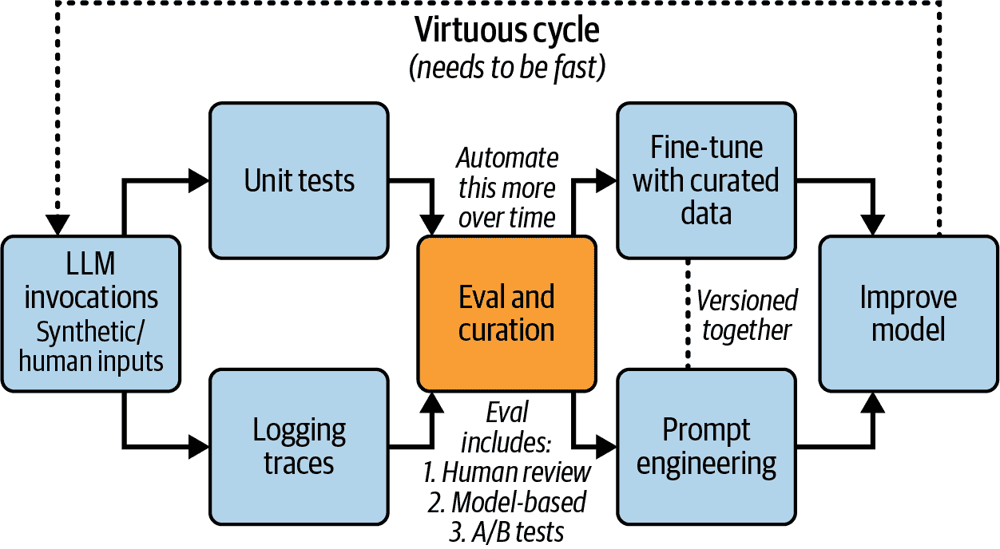

# 第二章. 公司在 AI 上犯的#1 错误

我问技术领导者中的第一个问题是他们如何计划改进 AI 的可靠性、性能或用户满意度。如果答案是“我们刚刚买了 XYZ 工具来解决这个问题，所以我们没问题”，我知道他们正走向麻烦。过分关注工具而不是流程是一个红旗，也是我在 AI 方面看到高管犯的最大错误。

# 改进需要流程

认为购买一个工具就能解决你的 AI 问题是像加入健身房但不实际上去一样。你不可能仅仅通过花钱就能看到改进。工具只是第一步；真正的努力在之后。例如，许多工具内置的指标很少与你真正关心的相关。相反，你需要设计特定于你业务的指标，以及评估你的 AI 性能的测试。

从这些测试中获得的数据也应该定期审查，以确保你处于正确的轨道上。无论你正在从事哪个 AI 领域的工作——模型评估、检索增强生成（RAG）或提示策略——流程是最重要的。当然，改进不仅仅依赖于工具和指标。你还需要开发和遵循流程。

# Rechat 的成功故事

Rechat 是关注流程如何导致真正改进的一个很好的例子。公司决定为房地产经纪人构建一个 AI 代理，以帮助完成与工作各个方面相关的大量任务。然而，他们面临着一致性的问题。当代理工作良好时，效果很好，但如果不工作，那就是一场灾难。团队会做出改变来解决一个地方的问题，但最终会在其他地方造成问题。他们陷入了“打地鼠”的循环。他们无法看到 AI 的性能，除了“感觉检查”，而且他们的提示变得越来越难以控制。

当我加入帮助时，我首先采取的是一种系统性的方法，这在图 2-1 中有说明。

###### 图 2-1\. 良性循环^(1)

这是一个系统性地改进大型语言模型（LLMs）的良性循环。关键洞察是，你需要快速进行定量和定性反馈循环。你从 LLM 调用（合成和人工生成的）开始，然后同时：

+   运行单元测试以捕获回归并验证预期行为。

+   收集详细的日志跟踪以了解模型行为。

这些都融入了评估和编纂（随着时间的推移需要越来越自动化）。评估过程结合了：

+   人工审查

+   基于模型的评估

+   A/B 测试

结果然后告知两个并行流：

+   使用精心编纂的数据进行微调

+   提示工程改进

这两者都会促进模型改进，从而再次启动循环。边缘的虚线强调这是一个持续、迭代的进程——你不断地更快地循环，以推动持续改进。通过关注图中概述的过程，Rechat 能够将错误率降低超过 50%，而无需投资新工具！

查看这个[约 15 分钟的视频](https://oreil.ly/M8KW2)，了解 Rechat 如何实施这种以过程为先的方法。

# 避免红旗

而不是询问你应该投资哪些工具，你应该询问你的团队：

+   我们对不同功能或用例的失败率是多少？

+   我们看到了哪些错误类别？

+   AI 是否具有适当的上下文来帮助用户？这是如何衡量的？

+   最近 AI 的变化有什么影响？

每个问题的答案都应该涉及适当的指标和一套用于衡量、审查和改进它们的系统化流程。如果你的团队在*数据和指标*方面难以回答这些问题，你就有可能偏离轨道！

# 避免术语至关重要

我们已经讨论了为什么关注过程比仅仅购买工具更好。但还有一件事同样重要：我们如何谈论 AI。使用错误的词语可能会隐藏真正的问题并减缓进步。为了关注过程，我们需要使用清晰的语言并提出好的问题。这就是为什么我们在第三章为高管们提供了一个 AI 沟通速查表。该章节帮助你：

+   理解 AI 能做什么和不能做什么

+   提出能带来真正改进的问题

+   确保你团队中的每个人都能参与进来

使用这个速查表将帮助你谈论过程，而不仅仅是工具。这不仅仅关于知道每个技术术语。这关乎提出正确的问题，以了解你的 AI 工作得如何以及如何让它变得更好。

^(1) 图表改编自我的博客文章，“你的 AI 产品需要评估”（[“Your AI Product Needs Evals”](https://hamel.dev/blog/posts/evals)）。
