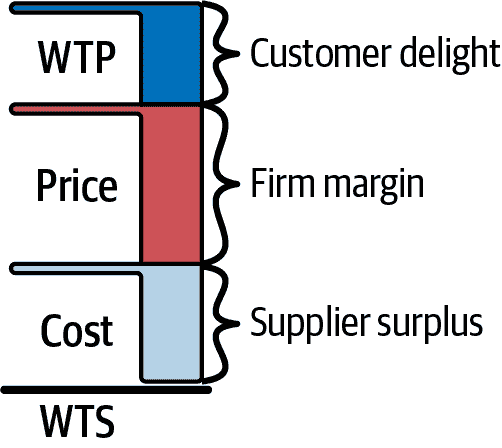
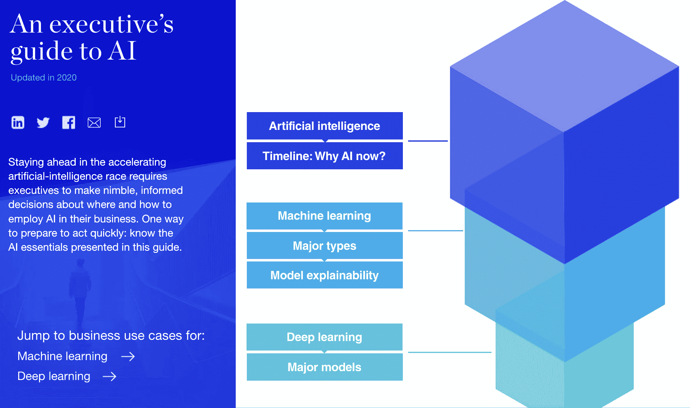
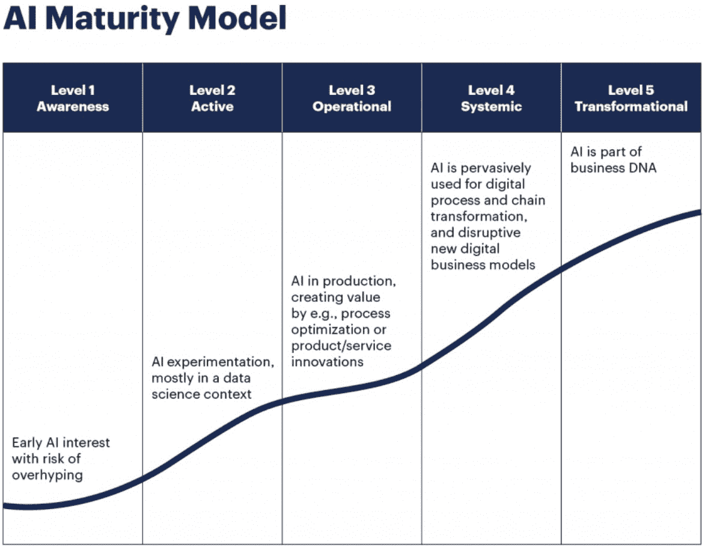
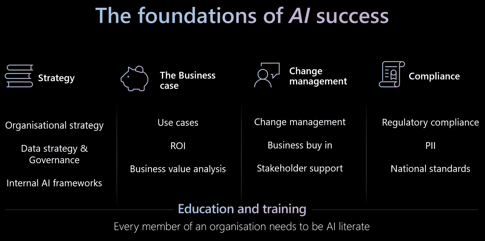
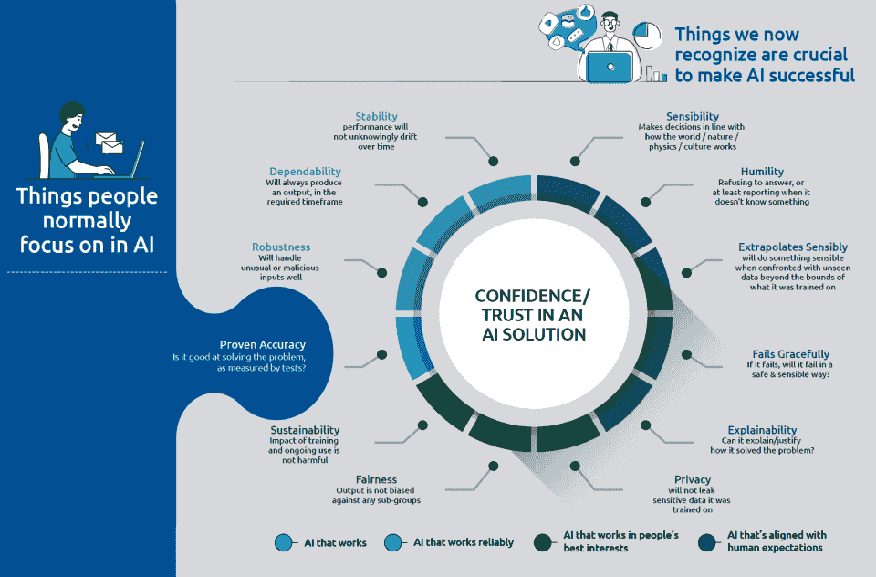
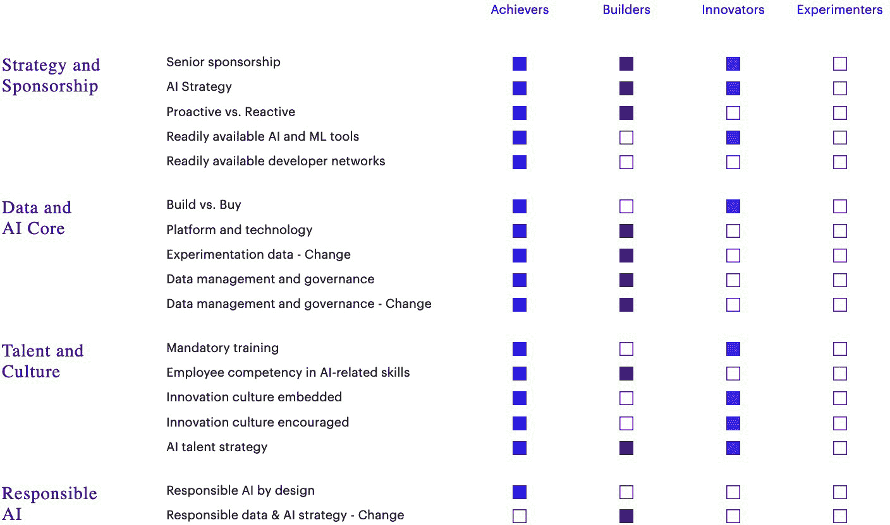
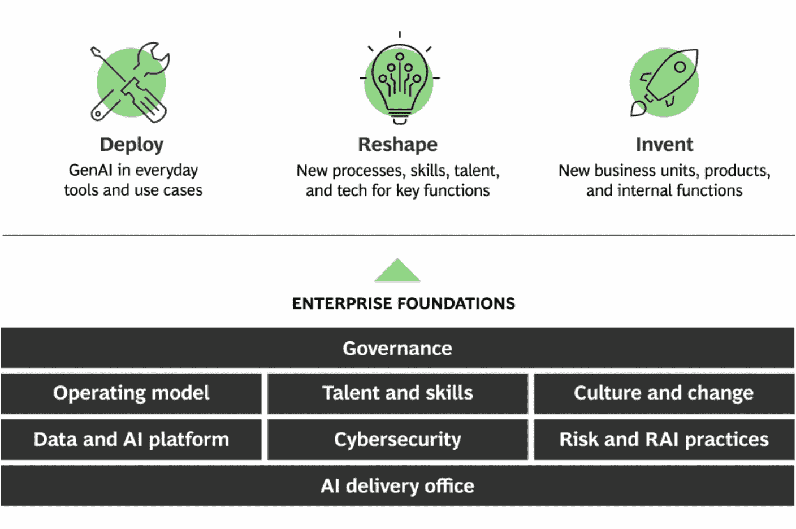

# 第四章\. 确定您的策略

为了帮助您决定 AI 投资，我们首先必须找到您的 AI 策略。

# 盲目跟风实施的陷阱

如果您的 AI 策略围绕一个客户可以“问任何问题”的聊天机器人，您并不孤单。许多公司都在没有明确策略的情况下到处添加 AI。这是一个错误。当每个人都做同样的事情时，没有人能脱颖而出。记住，企业的策略是获得竞争优势。这种优势来自于拥有独特、令人愉悦且难以复制的产品。

良好的策略涉及三个关键要素：

1.  对您组织面临的挑战进行清晰的诊断

1.  一个连贯的行动计划

1.  资源配置以应对这些挑战

下面的工作表将指导您使用示例了解这些要素。

# 确定您的策略工作表

最好的 AI 策略可以放大您公司的优势。通过这份工作表，您将学习如何制定一个。

以 ACME 电子商务为指南，我们将逐步介绍一个步骤：

1.  *诊断*您的业务目前处于何种状态。

1.  制定一个 *指导政策*，使您与众不同。

1.  按顺序执行 *连贯的行动*，推动您前进。

1.  *有效沟通*您的策略。

记住：这不仅仅是将 AI 用于各个地方。这是在您的业务中最重要的地方使用它。让我们通过一个例子来探讨。

# 从一个示例公司学习

让我们看看一家名为 ACME 电子商务（ACME）的虚构公司，看看良好的规划是如何发挥作用的。我们将扮演这家公司的领导者。

ACME 的简介

+   成立于 2019 年，ACME 是一家专注于为中小企业（SMBs）提供电子商务解决方案的软件即服务（SaaS）公司。

+   它提供用户友好、价格合理且可扩展的电子商务平台。

+   它让客户能够轻松构建和扩展他们的在线存在，而无需被零敲碎打。

见表 4-1 和 4-2 了解 ACME 的策略和财务信息。

表 4-1\. ACME 的策略

| 类别 | 描述 |
| --- | --- |
| 使命 | 通过提供易于访问的电子商务工具，帮助中小企业实现数字化增长。 |
| 商业策略 | 成为缺乏广泛技术专业知识或大预算的中小企业（SMBs）的一站式商店。通过价格竞争和提供 24/7 客户服务，针对那些被大型电子商务平台忽视的初创公司和企业家。 |
| 产品策略 | 创建一个简单、用户友好的平台，无需技术技能。每月收取 15 美元的单一、坚定不移的价格，无销售上限，支付交易费与 Shopify、WooCommerce、BigCommerce 或 Wix 相当。 |
| 产品 | ACME 是一家单一产品公司。“ACME Storefront”包括网站构建工具、购物车功能、安全的支付处理和库存管理，一应俱全。 |

表 4-2\. 2023 年末简化财务报表

| 指标 | 值 |
| --- | --- |
| 年收入 | $120M，同比增长 18% |
| 收入来源 | ~20%来自订阅，~80%来自支付交易费 |
| 总体保留率 | 92% |
| EBITDA | $13M |
| 客户 | 130,000 |
| 人数 | 350 |

2023 年年末色彩评论

+   我们未能达到 24%的年同比增长（YoY）的预期。

+   我们的竞争对手 Shopify、BigCommerce、WooCommerce 和 Wix 都在忙于将 AI 添加到他们的产品中。特别是，2023 年 4 月的[Shopify Magic 发布](https://oreil.ly/HuLvs)引起了头条新闻。

+   我们的 EBITDA 利润率健康，我们的总体保留率也是如此。

+   我们的人均收入（RPE）为 342K 美元，平均每位客户收入（ARPC）约为 920 美元。

现在是 2024 年 1 月，我们必须在 2 月中旬的下一次董事会会议上最终确定我们的年度运营计划。我们的董事会成员渴望审查并评论我们更新 AI 策略的计划。

我们做什么？

# 第一步：从透明诊断开始

医生总是在建议治疗方案之前进行诊断。我们首先必须命名疾病。无论表现如何，从这里开始。

让我们考虑以下领域：

宏观环境

过去一年中，哪些条件发生了变化？

内部能力

我们内部团队有多强大，哪里有差距？

竞争优势

我们可以用 AI 放大哪些能源来源？

定价策略

是最大化利润、渗透还是撇脂正确？

生态系统强度

我们如何通过与合作伙伴合作或通过合作伙伴来改进？

在诊断区域确定后，让我们看看 AI 如何在商业世界中影响每个领域，如表 4-3 所示。

表 4-3\. AI 在每个领域的冲击

| 区域 | AI 的明显影响 |
| --- | --- |
| 宏观环境 | **进入壁垒：** 这使得初创公司更容易开始。他们现在可以更快、更低成本地进行创新。**行业融合：** AI 模糊了界限。它允许像谷歌和亚马逊这样的科技公司进入医疗保健和金融行业。 |

| 内部能力 | **人才：** 现任人员正努力招聘和提升技能。对数据科学家、AI 工程师和 AI 素养型领导者的需求创造了一个广泛的人才缺口。**决策：** AI 工具可以帮助现任人员即时优化定价、库存和营销。这需要更快的决策。

**组织结构：** 要在决策中使用 AI，你必须质疑等级制度和官僚主义的组织模式。|

| 竞争优势 | **流程力量：** AI 通过大幅减少周期时间来加速产品开发。依赖长期研发周期的现任人员处于不利地位。**资源围困：** AI 放大了专有数据的价值。你能够合乎道德地收集得越多，你对 AI 的使用就越好。

**品牌：** 通过 AI 驱动的客户体验改进（例如，无缝购物体验）可以提高并改善您品牌的资产。

**转换成本：**个性化和历史数据锁定可能会使您的客户更难转向其他竞争对手。

**网络效应：**AI 增强的个性化有助于吸引更多用户并创造更多互动，为整个服务创造更大的价值。

**规模经济：**生产力区域的自动化——在制造、客户服务和物流方面的成本降低，使公司能够以更少的资源生产更多。

**反定位：**实时 AI 服务削弱了传统手动方法。例如：Lemonade 使用 AI 即时处理保险索赔。|

| 定价策略 | **利润最大化：**正在实施个性化、动态定价，这令许多客户感到不满。许多航空公司、Uber 甚至汉堡王都在实施这一策略。**渗透定价：**使用高级客户细分来识别具有高终身价值（LTV）的群体，并以低入门价格进行目标定位的做法正在增加。|

**快速浏览：**使用 AI 改进的需求预测表明何时降低价格以吸引下一波对价格更敏感的客户，同时仍然最大化收入。|

| 生态系统优势 | **上市时间：**许多现有企业意识到他们无法在内部构建所有 AI 能力。相反，他们正在与 AI 初创公司建立合作关系或收购它们，以将创新注入其商业模式。 |
| --- | --- |

## ACME 的诊断

诊断摘要

我们的业务战略始终依赖于渗透定价。我们旨在通过对抗竞争领域来吸引我们的理想客户画像。我们没有投入足够的资金来提升我们的品牌价值。现在是利用 AI 及其提供的新机遇的时候了。

诊断细节

2023 年我们增长受影响的理由：

+   美国货币政策的紧缩和利率上升减缓了目标市场新业务启动的速度。我们没有像应该的那样对此做出敏感反应。

+   我们的人才位置强劲——员工基础的 10%是 AI 工程师、数据科学家或数据工程师。

+   竞争对手已经利用他们的资源优势投资于像 AI 增强的网站编辑、自动搜索引擎优化（SEO）和 AI、为商家提供的高级分析以及其他核心应用集成等功能。

+   虽然我们的核心产品已经进步，但我们保持了相同的订阅定价。

+   我们的净推荐者得分（NPS）仍然非常高，但我们的服务成本增加了，我们的毛利率同比下降。

## 诊断：专业提示

+   这项诊断最好首先由您组织中的五到六位高级领导进行。一个时间有限、有记录的对话是生成初稿的好方法。它可以在纸上转录和改进。

+   试图做太多的事情很有诱惑力。相反，首先列出并分析你的竞争优势来源。这就是集中 AI 应用的地方。

+   诚实是最好的政策。你通常不会超过两个世界级的竞争优势来源。

+   在完成初稿后，从其他高管那里寻求帮助。最好先评估你的内部能力和团队。

+   无论你的业务多么复杂，你的诊断都应该在一页或更少的页面上完成。

+   一旦你的草稿完成，将其分发给组织中下一级别的领导者进行审查和评论。

# 第 2 步：综合你的指导政策

拿到诊断后，可能会诱使你将人工智能应用到各个地方。不要这样做。

作为一名高管，你必须确保你的组织朝着一小部分高杠杆的结果努力。

价值创造只有两种方式：

1.  提高客户愿意支付的价格（WTP）。

1.  降低员工或供应商愿意销售（WTS）的意愿。

图 4-1 展示了客户愿意支付的价格、公司收取的费用、生产成本以及供应商接受的最低价格之间的关系。

###### 图 4-1\. 价值杠杆

## ACME 的新指导政策

改变公司的使命是罕见的，因此在这种情况下，我们不专注于它。我们将专注于两个最重要的组成部分：我们的商业和产品策略。作为复习，对于 ACME：

商业策略

成为缺乏广泛技术专业知识或大预算的小型和中型企业（SMBs）的一站式商店。

产品策略

创建一个简单、用户友好的平台，无需技术技能。每月收取 15 美元的单价，无销售上限和可比的交易费用。

我们知道我们当前竞争优势的来源在哪里（即反定位），并且对未来的洞察力，我们可以利用人工智能创造新的竞争优势。

诊断是一个操作手册。

指导政策摘要

通过对所有小型和微型企业（SMBs）收取 0 平台订阅费，成为电子商务首选品牌，创造新的*持久优势*。更新我们的产品策略以反映这一点。我们将从以下两个方面继续使用人工智能：

+   为了提高我们利用内部人工智能客户细分和定位来放大更具侵略性的渗透定价策略的能力

+   为了通过人工智能 SEO 工具扩展我们的单一产品服务，确保小型和微型企业（SMBs）在搜索结果中排名。

在确立我们的战略方向后，让我们在表 4-4 中检查这些决策背后的关键推理和避免的潜在陷阱。

表 4-4\. 推理细节

| 为什么这样做有效 | 我们避免的错误 |
| --- | --- |
| 我们需要关注收入增长以取得成功。这需要增加我们在高度竞争的电子商务商店市场中的客户份额百分比。 | 我们本可以尝试改变我们的商业策略，“AI 化”的方式将是一个试图吸引注意的微不足道的尝试。 |
| 我们的客户一直基于我们低成本的价值主张选择 ACME。我们知道我们需要拥有这一点。 | 我们本可以尝试匹配我们竞争对手现在提供的所有 AI 功能，而不是专注于一个单一领域。 |
| 我们那些收入中有更高比例来自订阅的竞争对手负担不起匹配这种产品策略修订，这进一步巩固了我们的反定位力量来源。 | 我们本可以用 AI 提供客户支持聊天机器人来降低我们的成本，并补充我们始终是 ACME 核心的 24/7 电话支持。 |
| 我们*品牌*的强大与我们的商家成功直接相关。使用 AI 创造一个新产品，帮助他们在其各自的市场中排名更高，比例如使用 AI 改进我们的所见即所得编辑器更有效地利用我们的有限资源。 | 我们本可以提高订阅价格，从表面上看增加收入。 |

## 指导政策：专业提示

+   您的指导政策不是一个模糊的声明，而是一个针对诊断中确定的问题的明确和可操作的反应。

+   您应该能够问自己：这项政策是否提供了一个框架来解决根本挑战？

+   确保您的指导政策不指定每个战术细节。它应该用于缩小可能性范围。

+   指导政策*创造*关于不做什么的选项。确保您的政策做到了。

+   强有力的指导政策利用了您组织的独特优势和力量来源。

+   如果您的*商业战略*有变化，它们应该是演变而不是革命，除非在极其严重的情况下。

# 第 3 步：定义您的连贯行动

这就是您开始定义工作的地方。太多的高管在没有明确诊断和指导政策的情况下跳到第三步，这是一个错误。

这里的关键词是*连贯*。行动必须来自您的指导政策，并相互加强。它们不是一系列随机的倡议。它们是协调的，旨在和谐工作。

它们还必须按顺序排列，但不是像清单一样。

让我们现在将注意力转回到 ACME。

## ACME 的连贯行动

摘要

1.  **为 SMB 客户推出$0 订阅费**，通过积极的渗透定价来推动增长。

1.  **实施 AI 驱动的客户细分和定位**，以最大化客户获取效率。

1.  **为 SMB 商家开发 AI SEO 工具**，提高搜索可见性并增强 ACME 的产品差异化。

1.  **利用 AI 工具优化客户支持**，同时保持 24/7 的电话支持，这是关键的品牌差异化因素。

1.  **利用 AI 进行实时个性化**和转化优化，提升商家成功。

1.  **与 AI 初创公司建立战略合作伙伴关系**，在不过度扩展资源的情况下加速功能开发。

1.  **增强数据收集**，以不断改进 AI 驱动的工具和洞察力，为商家服务。

为了将我们的战略行动转化为具体的实施步骤，让我们在表 4-5 中详细分解每个倡议，从我们为中小企业核心的$0 订阅政策开始。

表 4-5. 各项行动的分解

| 行动 | 什么 | 如何 | 为什么它是一致的 |
| --- | --- | --- | --- |
| 1. 为中小企业客户推出$0 订阅费计划。 | 消除每月$15 的订阅费以吸引更多小企业，特别是那些可能对价格敏感或在 ACME 和竞争对手之间犹豫不决的企业。 |

+   通过定向营销活动积极传达新的定价策略。

+   利用现有客户数据来定位将最受益于这种定价变化的部分。

+   将所有产品和客户服务信息与强调“无成本”平台方法保持一致，同时保持具有竞争力的交易费率。

| 此行动通过创建一个明确、差异化的优惠方案，该方案将使高度依赖订阅收入的竞争对手难以匹敌，从而直接支持指导政策关注积极的价格渗透策略。 |
| --- |
| 2. 实施 AI 驱动的客户细分和定位。 | 使用 AI 来识别最有可能转化并从$0 订阅费提供中受益的高价值客户细分市场。 | | |

+   开发机器学习模型来分析客户数据并预测潜在的高 LTV 客户。

+   利用这些见解来创建针对潜在客户的定向广告活动和个性化信息。

+   将营销支出集中在这些细分市场，以最大化客户获取的投资回报率（ROI）。

| 此行动通过将获取努力集中在最有希望的细分市场，最大化定价变化的影响，从而增强了渗透定价策略。它还放大了指导政策对 AI 驱动增长的强调。 |
| --- |
| 3. 为中小企业开发并推出 AI SEO 工具。 | 创建并整合一个 AI 驱动的 SEO 工具到 ACME Storefront，帮助小企业提高其搜索引擎排名，而无需技术专业知识。 |

+   与 AI 工程师和产品经理合作开发一个直观的 SEO 工具，用户无需具备任何技术知识。

+   以清晰的教程、平台内指导和专门的客户支持推出新功能。

+   将新功能作为 ACME 与竞争对手相比的核心差异化优势进行市场推广。

| 此行动直接支持指导政策关注通过增加高价值 AI 功能来扩大产品供应，这不仅通过帮助中小企业通过更好的在线可见性取得成功来提升 ACME 的品牌。 |
| --- |
| 4. 在不牺牲质量的前提下优化客户支持成本。 | 实施一个由 AI 驱动的内部支持系统以简化操作，同时不取代 ACME 的 24/7 电话支持，这是其核心差异化优势。 |

+   引入 AI 工具为客户支持团队，例如 AI 驱动的知识库，以减少解决常见问题所需的时间。

+   培训客户支持代表使用这些工具以提高效率和服务质量。

+   监测客户满意度和留存率，以确保支持质量保持为一个关键的区别因素。

| 此行动有助于降低运营成本（鉴于服务成本的增加，这一点很重要），同时不损害区分 ACME 与竞争对手的核心服务模式。 |
| --- |
| 5. 利用 AI 进行实时个性化及转化优化。 | 使用 AI 为 ACME 商家提供实时个性化功能，帮助他们为客户创造更个性化的购物体验。 |

+   集成 AI 算法以分析客户行为，并动态地为商家的店铺建议产品推荐、折扣和个性化优惠。

+   为商家提供实时分析工具，这些工具能够提供关于其店铺表现和客户偏好的可操作见解。

+   分阶段推出这些功能，确保它们能够无缝集成到现有平台中。

| 此行动利用 AI 改善客户体验的潜力，支持指导政策的品牌建设要素，帮助 ACME 商家成功，并进一步区分 ACME 与竞争对手。 |
| --- |
| 6. 建立战略 AI 合作伙伴关系以扩展能力。 | 与 AI 初创公司或服务提供商合作，加速尖端 AI 功能的开发，而无需在内部构建一切。 |

+   确定专注于电商或针对 SMB 工具的初创公司或 AI 公司，这些公司与 ACME 的产品战略保持一致。

+   与合作伙伴协商，将他们的工具集成到 ACME Storefront 中（例如，AI 驱动的库存管理、动态定价建议）。

+   专注于那些能够提供长期价值并与 ACME 的核心客户群——中小企业保持一致性的合作伙伴关系。

| 此行动支持诊断的生态系统强度组件，使 ACME 能够快速将其平台上的先进 AI 能力与核心竞争力的关注保持一致。 |
| --- |
| 7. 加强数据收集以增强 AI 模型。 | 从客户和商家那里收集更多结构化和非结构化数据，以推动未来基于 AI 的洞察力和个性化功能。 |

+   引入可选数据收集功能，允许商家分享有关其客户和销售模式的其他数据。

+   确保遵守数据隐私法规，以保持信任并增强收集到的数据的价值。

+   使用这些数据不断改进和提升 AI 驱动的工具，如客户细分和 SEO 推荐。

| 此行动与独家资源优势相结合，其中专有数据收集和使用放大了 AI 对 ACME 竞争优势的价值。 |
| --- |

## 一致性行动：专业技巧

+   如果你无法在你的行动和政策之间画一条直接的联系，那么重新考虑。

+   不要试图做所有事情。优先考虑那些最有潜力推动指针移动的行动。

+   连贯的行动不仅仅是关于个人项目。跨职能协作是确保行动互补而不是冲突的关键。

+   根据逻辑依赖关系优先排序和分阶段你的行动。一些项目将为其他项目的成功铺平道路，所以请确保你以正确的顺序处理它们。

+   当你有反馈循环时，连贯的行动最具力量。建立指标和检查点来跟踪进度，从有效的方法中学习，并在必要时调整你的行动。

+   专注于不超过 10 个行动，以避免分散精力。

# 第 4 步：传达你的战略

在这个新的 AI 时代，你的战略需要明确传达。“执行吃策略”的说法不再单独成立。它无法与今天的快速技术颠覆相提并论。

如果你没有朝着正确的方向前进，仅仅执行是不够的。你需要让你的团队成员与你同行。

## 避免犯下的最大错误

缺乏清晰和简洁

很容易让你的信息充满术语、复杂想法或过多的目标，这可能会成为你的丧钟。

没有将你的战略串联起来

与业务使命不相连的独立项目会导致员工犹豫是否接受它们。

未能尽早参与关键利益相关者

如果人们觉得新的战略是在没有他们的参与下创建的，他们会对它的相关性持怀疑态度。

只关注积极方面

如果沟通感觉过于乐观，员工会失去信任。这是在最终沟通中包括诚实诊断的核心原因。

信息过载

一次性提供过多细节会让人感到不知所措，并降低对最重要元素的重视。这对于试图“AI 化”其业务各个部分的组织尤其相关。

## 将本章内容全部整合在一起

*一页业务*方法是一个经过验证的实用框架，旨在简化并阐明组织的战略。这个概念是关于组织健康和有效领导的一个更大体系的一部分，在帕特里克·伦西奥尼的书籍《优势》中有所强调。（Jossey-Bass）

它专注于回答六个关键问题：

1.  我们为什么存在？（使命）

1.  我们如何行动？（核心价值观）

1.  我们做什么？（商业战略）

1.  我们将如何成功？（新战略决策）

1.  现在最重要的是什么？（按顺序行动）

1.  谁必须做什么？（角色与责任）

使用这种方法的好处在于其清晰性、简洁性、专注性、透明性和一致性。作为一个框架，它为你服务，帮助你避免犯下最大的错误。

## ACME 的业务一页

通过我们共同完成的工作，我们现在可以将为什么、做什么和怎么做整合到一张*单页*上，如下所示：

| 问题 | ACME 示例 |
| --- | --- |
| 我们为什么存在？ | 使命：通过提供易于使用的电子商务工具，促进数字增长，赋能小型企业。 |
| 我们做什么？ | 我们为小企业提供 SaaS 电商平台，使他们能够轻松创建和管理在线商店。 |

| 我们将如何成功？ | 通过成为默认的电商品牌，对所有中小企业客户收取$0 平台订阅费，创造新的持久优势。我们将从以下两个方面继续使用 AI：

+   通过内部 AI 客户细分和定位，加强我们更具侵略性的渗透定价策略

+   通过将 AI SEO 工具扩展到我们的单一产品服务，确保中小企业在搜索结果中排名

|

| 现在最重要的是什么？ | 通过以下七个协调行动，增长我们的客户群和 2024 年收入，同比增长超过 25%：

+   为中小企业客户提供$0 订阅费启动服务

+   实施 AI 驱动的客户细分和定位

+   为中小企业商家开发 AI SEO 工具

+   使用 AI 工具优化客户支持

+   利用 AI 进行实时个性化

+   与 AI 初创公司建立战略伙伴关系

+   增强数据收集

|

| 谁必须做什么？ |
| --- |

+   CMO 领导新的市场营销信息，传达我们的更新产品策略

+   CTO 将 AI SEO 工具集成到平台中

+   销售推动新客户的上线

|

通过整合所有这些步骤，你将比竞争对手提前一步。你对业务的深入、实战理解加上正确的方法比任何大型咨询公司试图向你推销的“AI 策略框架”更有价值。

仅供参考，表 4-6 展示了大型咨询公司试图向您推销的一些框架。

表 4-6\. AI 策略框架

| 组织框架 | 概述 | 视觉示例 |
| --- | --- | --- |
| 麦肯锡的 AI 策略框架 |

+   战略对齐

+   数据策略

+   AI 能力和人才

+   变革管理

|  |
| --- |
| Gartner 的 AI 成熟度模型 |

+   第 1 级：意识

+   第 2 级：积极实验

+   第 3 级：运营化 AI

+   第 4 级：系统性

+   第 5 级：转型

|  |
| --- |
| 微软的 AI 转型框架 |

+   策略

+   商业案例

+   变革管理

+   合规性

+   教育和培训

|  |
| --- |
| 哈佛商学院的 AI 工厂框架 |

+   确定合适的用例

+   原型开发

+   规模化 AI 解决方案

+   优化和迭代

|  |
| --- |
| 埃森哲的 AI 策略 |

+   策略和赞助

+   数据和 AI 核心

+   人才与文化

+   负责任的 AI

|  |
| --- |
| BCG 的三层 AI 策略 |

+   部署：AI 作为业务驱动器

+   重塑：AI 作为增长平台

+   创新：AI 转型推动者

|  |
| --- |
| IBM 的 AI 层级框架 |

+   现代化

+   收集

+   组织

+   分析

+   注入

|  |
| --- |

# 未来是什么？

在第五章中，我们将讨论如何有效地传达您的策略。
