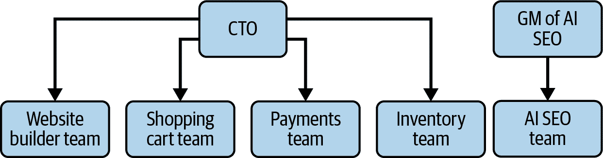
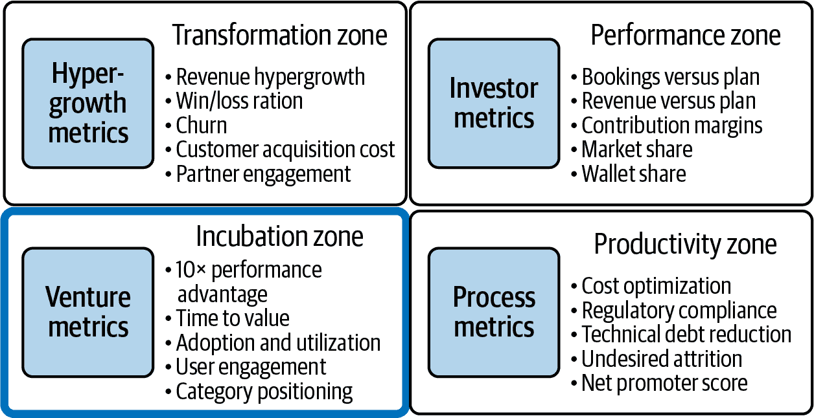

# 第六章.动员你的战略

到目前为止，你应该已经为你的人工智能项目制定了一个可以有效传达的战略。现在，你的组织需要执行它。让人们采取行动可能具有挑战性，尤其是在成熟的公司中。这些公司已经针对市场进行了优化，在采用像人工智能这样的颠覆性创新方面存在困难。幸运的是，Geoffrey Moore 的《赢得框架》（Diversion Books）一书中描述的“赢得框架”提供了指导。在过去十年中，我已经为人工智能项目调整了这个框架。它使我的领导团队能够保持一致地执行。在本节中，我为你提供了一个逐步指南（附带示例），说明如何应用这个框架。

# 四个区域

赢得框架将商业活动分为四个区域：

绩效区

这个区域代表你的核心业务，它产生稳定的收入和利润。这个区域专注于实现财务目标和保持运营卓越。这个区域的产品和服务通常是成熟和稳固的。

产品力区

这个区域专注于提高整个组织的效率和效果。人工智能项目自然适合这里。它们可以超越工程，进入人力资源、销售和财务等领域。

孵化区

孵化区是测试新想法的地方。它不会立即影响你的核心业务。这是一个安全的空间来开发和测试新的商业模式，特别是那些使用生成式人工智能的。

变革区

变革区作为孵化区和绩效区之间的桥梁。这个区域将经过验证的人工智能项目整合到你的核心业务中。

对于许多人工智能项目，孵化区是最关键的起点。

# 探索人工智能实施挑战

在你的业务中实施人工智能会带来一个困境。你希望大胆地使用人工智能，但又不能冒险破坏你的核心运营。

当你从成熟的、盈利的区域重新分配资源时，你通常会面临内部阻力。这可以来自各种来源：

+   销售团队担心无法达成目标。

+   客户和合作伙伴更喜欢现状。

+   运营团队担心他们的工作流程会受到干扰。

这种抵制是过程的一个自然部分。关键是学习如何有效地处理这种紧张关系。让我们继续我们的 ACME 电子商务案例研究，说明如何应用赢得框架。

# 第 1 步：明确界定你的 AI 孵化区

划一条明确的界限

当需要时，将人工智能项目与核心运营分开，以避免破坏已经运作良好的事物。

锁定资源

为你的人工智能项目分配专门的人才和预算：不要让他们与核心竞争残羹剩饭。

如图 6-1 所示，ACME 的 CTO 负责四个不同的产品团队。

###### 图 6-1. ACME 的产品团队

可能看起来从 AI SEO 团队中抽调成员加入网站构建器团队是个好主意，但这是一个关键的错误(图 6-2)。这四个团队对 ACME 的当前产品有着激光般的专注，推动着保持业务浮动的核心收入。打破这种平衡可能会危及你的主要收入来源。

###### 图 6-2\. 有缺陷的团队结构

不要将新团队直接放入现有的组织结构图中。相反，ACME 需要创建一个完全独立的团队，专注于 AI SEO 产品开发(图 6-3)。将他们与现有团队隔离，以避免冲突和干扰。一旦 AI SEO 技术完全成熟，可以将其整合回核心产品，而不会破坏当前运营。

###### 图 6-3\. 更好的团队结构

将 AI SEO 团队分离出来，给它成功的机会。

指派一位临时总经理来领导这样的孵化区项目是一个明智的选择。理想的候选人来自产品或技术部门的高级经理——在组织中有良好声誉，CTO 信任，并且具有创业心态。

他们的工作？保持对大局的关注，并作为与业务其他部分的关键联络人，同时将日常实施留给团队。

总经理的主要责任是确保团队拥有赢得胜利所需的一切——无论是人才、进入市场的策略、预算、工具还是基础设施。

最后，AI SEO 项目需要在运营预算中拥有自己的专用条目。不要与其他项目混合。

保持预算独立，就像团队一样。这可以防止内部资源竞争，并最小化与其他项目的冲突。

对于 ACME，我们从运营预算中划拨了 200 万美元，并指派了包括总经理在内的 10 人，致力于 AI SEO 项目（见图 6-4）：

+   1 位产品经理

+   1 位设计师

+   4 位软件工程师

+   3 位 AI 工程师

###### 图 6-4\. ACME 的 AI SEO 团队

# 第 2 步：定义运营模型

范围

明确界定该项目的边界：将交付什么，同样重要的是，将不交付什么。保持专注。

管理层

建立强大的治理结构。总经理和执行团队将多久审查一次该项目？定期的检查对于确保一致性和进展至关重要。

在案例研究中，我们概述了 ACME 开发 AI 驱动 SEO 产品的计划。就像网站构建器一样，目标很明确：它必须是用户友好的，并且需要最少的技术专业知识，使其对非技术用户可访问。简单是采用和成功的关键。

## 明确的范围具有具体性和里程碑

MVP 的范围：

+   专注于 MVP 的六个核心功能，确保它们直观且用户最初作为独立产品时需要的技术专业知识最少。

+   优先考虑易用性和对小型企业主来说的快速胜利。

为了实施我们专注的最小可行产品（MVP）方法，我们在表 6-1 中规划了五个关键里程碑，每个里程碑代表一个核心 SEO 功能，为小型企业主提供即时价值。

表 6-1\. 每个里程碑的分解

| 里程碑 | 功能 | 描述 |
| --- | --- | --- |
| 1 | 自动化关键词研究和优化 | AI 关键词建议：分析产品和内容，推荐相关关键词，重点关注长尾机会。基本内容优化：提供简单指导，说明如何在产品标题和描述中放置关键词。 |
| 2 | 内容生成和优化 | AI 生成的产品描述：创建基本、SEO 友好的产品描述，以节省小型企业主的时间。 |
| 3 | 元标签自动化 | 元标签生成：自动为产品页面生成 SEO 友好的元标题和描述。 |
| 4 | 技术 SEO 建议 | 网站速度洞察：提供基本建议，以改善页面加载时间，这对于 SEO 排名至关重要。 |
| 5 | AI 驱动的 SEO 审计 | 基本 SEO 健康检查：提供一个简单、自动的审计，突出显示关键的 SEO 问题，如缺失的元标签或断开的链接。 |
| 6 | 分析和报告 | SEO 性能仪表板：提供一个直观的仪表板，跟踪关键指标，如关键词排名和有机流量。 |

MVP 范围之外：

+   将考虑未来迭代的高级功能，如语音搜索优化、竞争对手分析和链接建设。

+   需要大量用户干预的复杂技术优化超出了范围。

## 审查需要频繁且预先定义

示例治理结构：

+   每周与 AI SEO 总经理的产品审查

+   每两周向首席产品官（CPTO）和执行团队更新

+   每月指导委员会会议，以评估关键绩效指标（KPIs）的进展并必要时调整策略

# 第 3 步：定义您将如何衡量成功

KPIs

每个阶段的计划都必须有明确、可衡量的关键绩效指标（KPIs），以跟踪进度并确保在每个里程碑处都有责任。

时间表

孵化区计划需要明确的资金时间表，以确保项目按计划进行并确保及时做出决策。

## 记住：您是从一张白纸开始的

专注于计划的一小部分 KPI 是个好主意。

在 ACME 的案例中，他们首先需要关注将产品展示给用户并获得他们对实际需求的反馈。

对于 AI SEO 计划来说，良好的高级 KPI 包括：

+   注册产品第一版产品的用户数量

+   提供产品反馈的用户数量

+   放弃产品的用户数量

这些都侧重于价值实现时间和获取用户参与和反馈。

它们对应于获胜区域框架的左下象限，如图图 6-5 所示。

###### 图 6-5\. 获胜区域框架

这将帮助您专注于最重要的事情，并避免被过多的指标分散注意力。

## 随着项目的成熟，您可以添加更多的 KPI

保持您的项目专注于最重要的关键价值信号。然而，用更详细、战术性的 KPI 来指导功能开发，在每个步骤中提供清晰和方向也是明智的。表 6-2 概述了示例。

表 6-2. 每个里程碑的关键绩效指标分解

| 里程碑 | 功能 | 关键 KPI |
| --- | --- | --- |
| 1. 自动化关键词研究 | AI 关键词建议 |

+   每位用户建议的关键词

+   采用率

+   有机印象增加

|

| 2. 内容生成 | AI 产品描述 |
| --- | --- |

+   生成的描述

+   % 使用 AI 描述的产品

+   产品页面排名改进

|

| 3. 元标签自动化 | 元标签生成 |
| --- | --- |

+   % 使用 AI 元标签的页面

+   点击率（CTR）增加

+   减少跳出率

|

| 4. 技术 SEO | 网站速度洞察 |
| --- | --- |

+   识别出的问题

+   页面加载时间减少

+   移动优化改进

|

| 5. SEO 审计 | 基本健康检查 |
| --- | --- |

+   完成的审计

+   发现/解决的问题

+   提高网站健康得分

|

| 6. 分析 | SEO 仪表板 |
| --- | --- |

+   仪表板参与度

+   使用频率

+   SEO 指标改进

|

## 必须有一个明确的退出时间表

退出点是你决定是否加大项目投入或完全关闭项目的时候。

此项目的截止时间为一年。这是一个移动的目标：如果项目未达到其 KPI，将根据反馈和进度进行调整。

每个开发里程碑应完成需要两到四个月——这对小型团队来说是一个展示进度和收集用户反馈的理想节奏。

与高级项目 KPI 相结合，这是里程碑特定 KPI 在驱动关注和必要时进行纠正时变得强大的地方。

# 第 4 步：让公司保持关注

定期更新

与指导委员会和执行团队持续分享进度，以保持一致。

透明的 KPI

确保关键绩效指标（KPI）明确定义并频繁更新，以实现完全透明。

持续沟通

建立一个持续的反馈循环，以保持整个公司了解并参与项目进展。

## 定期更新确保势头

过度沟通

您不能更新得太频繁。向 CTO 和执行团队发送每周电子邮件，强调从产品审查中学到的经验教训。

双周深度研究

利用您的双周治理会议提供更详细的更新。解决团队面临的任何障碍，无论是技术挑战、资源限制还是需要 GM 干预的问题。

每月指导委员会审查

指导委员会应每月召开会议，审查 KPI 并做出必要的调整。这些会议是决定是否继续资助、根据结果进行转型或解决任何持续问题的关键检查点。

## KPI 应在整个组织内公开共享

在 ACME，关键绩效指标（KPI）发布在共享的 Google 表格中，可供指导委员会和执行团队访问，以确保透明度。随着倡议的进展，团队决定推出更详细的报告，提供对高级采用 KPI 和特定功能 KPI 的快速概览，确保每个人都能一目了然地跟踪进展。

## 与其他利益相关者分享进展至关重要

孵化区倡议很少是一条直线。你需要保持敏捷，应对市场变化和意外障碍。

公司其他团队会对孵化区正在进行的工作感到好奇。建立一个常规的节奏来提供关于该倡议进展和健康状况的更新。

根据您的组织，以下是一些有效的论坛：

+   公司全员大会

+   每月或每季度的业务审查

+   客户咨询委员会

+   销售和业务发展团队会议

在 ACME 的案例中，AI SEO 总经理使用一张幻灯片来展示：

+   上层采用和功能使用指标，显示它们随时间的变化趋势

+   突出显示真实世界产品使用的客户引言

+   开发路线图的高级概述以及过程中的关键发现

这些元素有助于在整个公司中保持对倡议的关注，并提高长期成功的可能性。

# 结论

对于管理高风险 AI 项目和推动其成功，纪律性的方法至关重要。这个框架并非适合所有公司或所有 AI 阶段——它可能不适合每个公司或每个 AI 阶段。

但如果您准备好进行大胆的 AI 行动，这就是您开始为自身增加胜算的地方。最终，成功由收入增长来定义。一旦您的孵化区倡议开始产生收入，就是时候改变衡量方式并将其整合回核心运营了。

接下来，我们将讨论招聘以组建最适合您 AI 项目的最佳团队。
