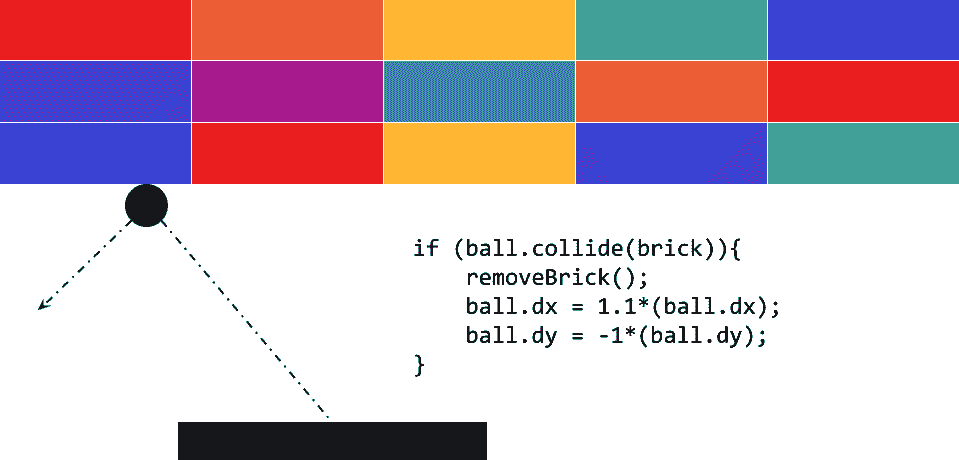
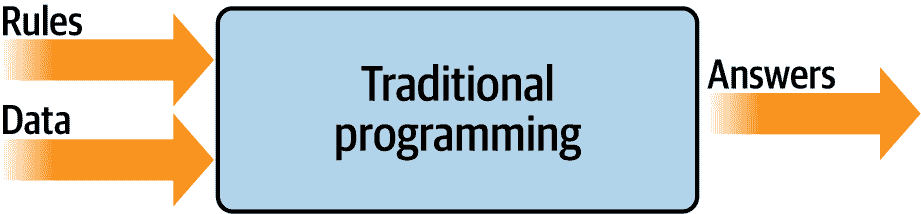
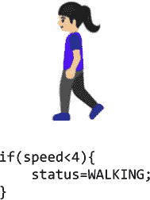
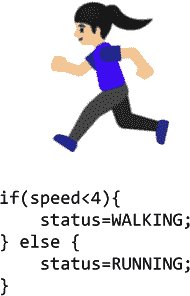
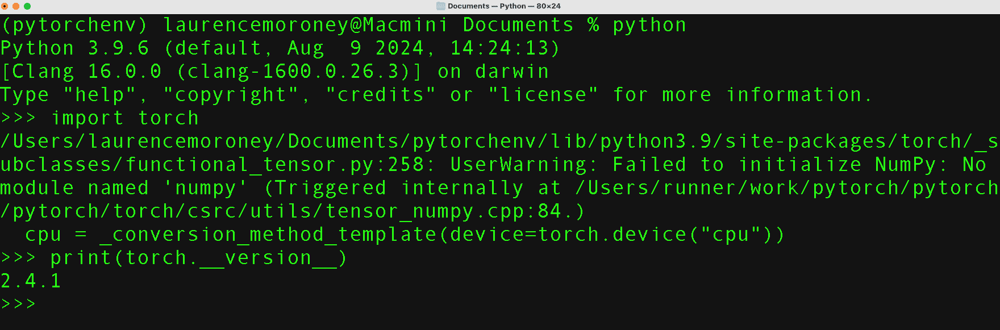
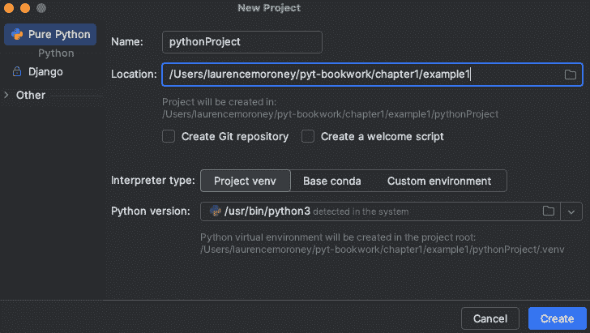
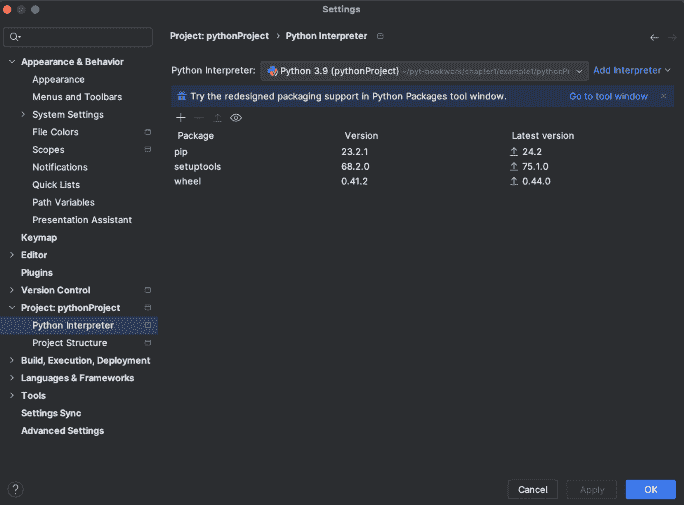
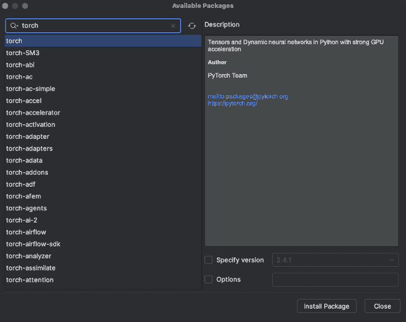
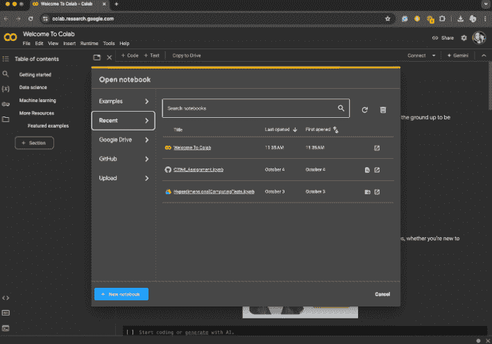

# 第一章. PyTorch 简介

当涉及到创建人工智能（AI）时，机器学习（ML）和深度学习是开始的好地方。然而，当你开始时，很容易被选项和所有新的术语所淹没。这本书旨在为你这个程序员揭开神秘的面纱。它带你通过编写代码来实现机器学习和深度学习概念，同时也带你构建更接近人类行为的行为模型，例如计算机视觉、自然语言处理（NLP）等。因此，这些模型成为了一种合成或人工的智能。

但当我们提到*机器学习*时，它究竟是什么呢？在我们继续之前，让我们快速看一下它，并从程序员的角度来考虑它。之后，在本章的其余部分，我们将向您展示如何安装所需的工具，从 PyTorch 本身到可以编写和调试基于 PyTorch 的模型的开发环境。

# 什么是机器学习？

在我们深入探讨机器学习的细节之前，让我们考虑它是如何从传统编程中演变而来的。我们将首先检查传统编程是什么，然后考虑它的局限性。之后，我们将看到机器学习是如何演变来处理这些情况的，从而为实施新的场景开辟了新的机会，从而解锁了许多人工智能的概念。

传统编程涉及编写用编程语言表达的规则，这些规则作用于数据并给出答案。这几乎适用于我们可以用代码编程的任何地方。

例如，考虑一个像流行的 Breakout 这样的游戏。代码决定了球的运动、得分以及赢得或输掉游戏的各个条件。想想球在砖块上弹跳的场景，就像图 1-1 中展示的那样。



###### 图 1-1. Breakout 游戏中的代码

在这里，可以通过球的 `dx` 和 `dy` 属性来确定球的运动。当球撞击到砖块时，砖块会被移除，球的速率增加，球的运动方向也会改变。代码作用于游戏情况的数据。

或者，考虑一个金融服务场景。比如说，你有关于公司的数据，比如它的当前股价和收益。通过使用图 1-2 中的代码，你可以计算出称为*市盈率*（或 P/E，代表价格除以收益）的有价值比率。


###### 图 1-2. 金融服务场景中的代码

你的代码读取价格，读取收益，并返回一个值，即前者除以后者。

如果我要用一张图来总结传统的编程，它可能看起来像图 1-3。



###### 图 1-3. 传统编程的高级视图

如您所见，你有用编程语言表达的规则。这些规则作用于数据，结果是答案。

# 传统编程的局限性

图 1-3 中的模型自其诞生以来一直是发展的基石。但它有一个固有的局限性：即，你只能实现那些可以推导出规则的场景。但其他场景怎么办呢？通常，由于代码过于复杂，开发它们是不切实际的。编写处理它们的代码是不可能的。

以活动检测为例。能够检测我们活动的健身追踪器是一种最近的新发明，这不仅是因为便宜且小巧的硬件的可用性，还因为处理检测的算法之前是不可行的。让我们探讨一下原因。

图 1-4 显示了一个简单的步行活动检测算法。它可以考虑人的速度，如果这个速度低于某个特定值，我们可以确定他们可能是在散步。



###### 图 1-4\. 活动检测算法

既然我们的数据是速度，我们也可以将其扩展到检测他们是否在跑步，就像图 1-5 中所示。



###### 图 1-5\. 扩展跑步算法

如您所见，根据速度，我们可能会说，如果速度低于某个特定值（比如说，4 英里/小时），那么这个人是在散步，否则，他们是在跑步。它仍然有点效果。

现在假设我们想将此扩展到另一种流行的健身活动，即骑自行车。算法可能看起来像图 1-6 中的那样。


###### 图 1-6\. 扩展骑行算法

我知道这个算法在检测速度方面是简单的——有些人跑得比其他人快，你可能会在下坡时跑得比上坡骑自行车快——但总体来说，它仍然有效。然而，如果我们想实现另一个场景，比如打高尔夫（见图 1-7），会发生什么呢？


###### 图 1-7\. 我们如何编写一个高尔夫算法？

现在，我们陷入了困境。无论一个人是否在打高尔夫，他们可能会走一会儿，停下来，做一些活动，再走一会儿，停下来，等等。那么我们如何使用这种方法来判断他们是否在打高尔夫？

使用传统规则检测这种活动的我们遇到了瓶颈。但也许有更好的方法。

进入机器学习。

# 从编程到学习

让我们回顾一下我们用来展示传统编程是什么的图（见图 1-8）。在这里，我们有作用于数据并给出答案的规则。在我们的活动检测场景中，数据是这个人移动的速度——从这些数据中，我们可以编写规则来检测他们的活动，无论是走路、骑自行车还是跑步。然而，当我们遇到打高尔夫球时，我们遇到了障碍，因为我们无法提出确定这种活动外观的规则。


###### 图 1-8\. 传统编程流程

但如果我们翻转这个图中的坐标轴会怎样呢？如果我们不是提出*规则*，而是提出*答案*，并且与数据一起找到一种方法来确定可能的规则会怎样？

图 1-9 展示了这会是什么样子，我们可以说这个高级图定义了*机器学习*。


###### 图 1-9\. 改变坐标轴以获得机器学习

那么，这有什么影响呢？嗯，现在，我们不再试图找出规则是什么，我们可以获取大量关于我们场景的数据，并对这些数据进行标记，然后计算机可以找出使一块数据与特定标签匹配，而另一块数据与不同标签匹配的规则。

这将如何适用于我们的活动检测场景呢？嗯，我们可以查看所有提供关于这个人数据的传感器。如果这个人有一个可穿戴设备，可以检测心率、位置和速度等信息，并且如果我们收集了大量他们在不同活动中进行此类数据实例，那么我们最终会得到一个数据场景，它说：“这是走路的样子”，“这是跑步的样子”，等等（见图 1-10）。


###### 图 1-10\. 从编码到机器学习：收集和标记数据

现在，我们作为程序员的任务从找出规则转变为确定活动，再到编写将数据与标签匹配的代码。如果我们能这样做，那么我们就可以扩展我们可以用代码实现的场景。

机器学习是一种使我们能够做到这一点的技术，但为了开始，我们需要一个框架——这就是 TensorFlow 的作用所在。在下一节中，我们将探讨 TensorFlow 是什么以及如何安装它。然后，在本章的后面部分，你将编写你的第一个学习两个值之间模式的代码，就像在前面的场景中那样。这是一个简单的“Hello World”场景，但它具有在极其复杂的场景中使用的相同基础代码模式。

人工智能领域庞大而抽象，包括与使计算机像人类一样思考和行动有关的一切。人类采取新行为的一种方式是通过示例学习，因此可以将机器学习学科视为通往人工智能发展的途径。通过名为*计算机视觉*的 ML 领域，机器可以学会像人类一样看，通过名为*自然语言处理*的另一个 ML 领域，它可以学会像人类一样阅读文本。还有许多其他可能的 ML 应用，我们将通过使用 TensorFlow 框架来介绍 ML 的基础知识。

# 什么是 PyTorch？

PyTorch 是一个基于之前名为*Torch*的库的 ML 库，而*Torch*是一个开源的 ML 框架和脚本语言，它本身是基于名为 Lua 的编程语言。2017 年，Torch 的开发转移到了 PyTorch，这是一个在 Python 中移植的框架。

因此，当安装 PyTorch 时，您通常会看到它被称为“torch”。

PyTorch 最初由 Meta AI 开发，但它被移至 Linux Foundation，作为建立开发者信心的一种方式，表明它不是由大型科技公司制作和为大型科技公司制作的。它是两个最受欢迎的 ML 库之一，与 TensorFlow/Keras 生态系统并列。

随着生成式 AI 的出现，特别是生成文本和图像模型的“开源”，PyTorch 在受欢迎程度上爆炸式增长。它通常用于训练模型（我们在本书的第一部分中介绍），以及用于模型的推理（我们在本书的第二部分中介绍）。

PyTorch 也可以被视为一个库生态系统，每个库都针对特定场景进行了定制。以下是一些重要的库和需要考虑的场景：

TorchServe

这是一个易于使用的工具，可以让您大规模部署 PyTorch 模型。它设计用于在多个环境中运行，并且通常是技术无关的。它支持多模型服务、日志记录、指标以及轻松创建 RESTful 端点，让您可以从各种客户端对模型进行推理。

分布式训练

当较大的模型无法适应单个芯片或机器时，有一些技术和技术可以让您在多个设备之间共享它们。`torch.distributed`库允许您轻松且本地地在多个设备上支持异步执行。

移动

对于推理来说，一个重要的表面当然是移动设备。您能够将 AI 工作部署到 Android 和 iOS 设备上非常重要，PyTorch 通过 PyTorch Mobile 支持这一点。

预训练模型

一群活跃的研究人员和开发者创建了一个丰富的模型生态系统，您只需一行代码即可使用，这些代码被包含在 torchvision.models 库中。

图 1-11 提供了这一概念的高级表示。


###### 图 1-11\. PyTorch 生态系统

创建机器学习模型的过程称为**训练**，这是计算机使用一系列算法来了解输入以及它们之间区别的过程。例如，如果您想让计算机识别猫和狗，您可以使用大量两者的图片来创建模型，然后计算机将使用该模型来尝试找出什么使猫成为猫，什么使狗成为狗。一旦模型训练完成，让模型识别或分类未来输入的过程称为**推理**。

因此，对于训练模型，您需要考虑几个方面，我们将在本书中介绍它们。主要来说，您的选择将归结为以下三个选项之一：

+   从头开始自己创建模型

+   使用他人的模型，因为这对您的任务来说已经足够了

+   使用已经训练过的人的模型的部分，并在其基础上构建

列表中的最后一个选项被称为**迁移学习**，我们将在本书的后面部分介绍它。

训练模型有许多方法。大多数情况下，您可能只会使用单个芯片，无论是中央处理器（CPU）、图形处理器（GPU）还是称为张量处理单元（TPU）的新设备。在更高级的工作和研究环境中，您可以使用跨多个芯片的并行训练，采用智能跨多个芯片的分布式训练。PyTorch 也通过“分布式训练”库支持这一点，如图 1-11 所示。

任何模型的命脉是其数据。正如我们之前讨论的，如果您想创建一个可以识别猫和狗的模型，您需要用大量猫和狗的示例来训练它。但您如何管理这些示例呢？随着时间的推移，您会发现这往往比创建模型本身需要更多的编码。

幸运的是，PyTorch 生态系统包含了许多内置数据集，这使得对您来说变得非常容易。我们也会在本书中探讨这些内容。

除了创建模型之外，您还需要能够将它们带给人们，让他们可以使用它们。为此，PyTorch 包括用于服务的库，您可以通过 HTTP 连接提供模型推理，供云或网络用户使用。对于在移动或嵌入式系统上运行的模型，有 PyTorch Mobile，它提供了在 Android 和 iOS 上进行模型推理的工具。

接下来，我将向您展示如何安装 PyTorch，这样您就可以开始使用它创建和使用机器学习模型了！

# 使用 PyTorch

在本节中，我们将探讨您安装和使用 PyTorch 的三个主要方法。我们将从如何在您的开发箱上使用命令行安装它开始。然后，我们将探讨如何使用流行的 PyCharm IDE 来安装和使用 PyTorch。最后，我们将探讨 Google Colab 以及如何使用它通过浏览器中的基于云的后端访问您的 PyTorch 代码。

## 在 Python 中安装 Porch

PyTorch 中的 *Py* 代表 Python，因此已经设置好 Python 环境是很重要的。如果你还没有 Python，我强烈建议你访问[Python 网站](https://python.org)来安装它，并访问[学习 Python 网站](https://learnpython.org)来学习 Python 语言语法。

使用 Python，有多种安装框架的方法，但 TensorFlow 团队支持的是 `pip`。

因此，在你的 Python 环境中，安装 PyTorch 和使用这个一样简单：

```py
> pip install torch 
```

一旦运行起来，你可以使用以下代码测试你的 PyTorch 版本：

```py
import torch
print(torch.__version__)
```

你应该会看到类似于图 1-12 中的输出。它将打印当前运行的 PyTorch 版本——在这里，你可以看到已安装的版本是 2.4.1。



###### 图 1-12\. 在 Python 中运行 PyTorch

###### 注意

如果你仔细看图 1-12，你会看到一个说明显示 torch 设备是“cpu”。在这种情况下，我在我的 Mac 上本地安装了它，并配置为使用 CPU。然而，对于需要 GPU 或 Metal 等加速器的复杂模型来说，这并不理想。我们将在本书的后面部分介绍为加速器安装 PyTorch。

## 在 PyCharm 中使用 PyTorch

我特别喜欢使用[PyCharm 的免费社区版](https://oreil.ly/I2mP2)来构建使用 PyTorch 的模型。PyCharm 有很多用途，但我最喜欢的是它使虚拟环境的管理变得容易。这意味着你可以拥有针对特定项目的 Python 环境，其中包含特定版本的 PyTorch 工具。例如，如果你想在一个项目中使用 PyTorch 1.x，在另一个项目中使用 PyTorch 2.x，你可以通过虚拟环境将它们分开，并在它们之间切换时无需处理依赖项的安装/卸载。此外，使用 PyCharm，你可以对 Python 代码进行逐步调试——这对于初学者来说尤其重要！

例如，在图 1-13 中，我有一个名为 *example1* 的新项目，我指定我将使用 Conda 创建一个新的环境。当我创建项目时，我将有一个干净、新的虚拟 Python 环境，我可以安装任何版本的 PyTorch。

一旦创建了项目，你可以打开文件 → 设置对话框，并从左侧菜单中选择“项目：*<你的项目名称>*”。在左侧菜单中，你会看到更改 Python 解释器和项目结构的选项。如果你选择 Python 解释器链接，你会看到你正在使用的解释器，以及在这个虚拟环境中安装的包列表（见图 1-14）。



###### 图 1-13\. 使用 PyCharm 创建新的虚拟环境



###### 图 1-14\. 向虚拟环境添加包

然后，你可以点击左上角的 + 按钮，将打开一个对话框，显示当前可用的包。在搜索框中输入 **`torch`**，你将看到所有名称中包含 *torch* 的可用包（见图 1-15）。记住，包的名称是 *torch*，即使技术是 PyTorch。



###### 图 1-15\. 使用 PyCharm 安装 torch

一旦你选择了要安装的 torch 或其他任何包，你可以点击“安装包”按钮，PyCharm 将完成剩余的工作。然后，一旦 torch 安装完成，你就可以在 Python 中编写和调试你的 PyTorch 代码。

## 在 Google Colab 中使用 PyTorch

另一个选项，可能是入门最容易的方法，是使用 [*Google Colab*](https://oreil.ly/c0lab)，这是一个可以通过浏览器访问的托管 Python 环境。Colab 真是 neat 的地方在于它提供了 GPU 和 TPU 后端，这样你就可以免费使用最先进的硬件来训练模型。

当你访问 Colab 网站，你会得到选择打开之前的 Colab 或开始一个新的笔记本的选项（见图 1-16）。如果你点击“+ 新笔记本”按钮，它将打开编辑器，在那里你可以添加代码或文本面板（见图 1-17）。然后，你可以通过点击面板左侧的播放按钮（箭头）来执行代码。



###### 图 1-16\. 开始使用 Google Colab


###### 图 1-17\. 在 Colab 中运行 PyTorch 代码

总是检查 PyTorch 版本是个好主意，如图所示，以确保你正在运行适合当前任务的正确版本。

你还可以看到在图 1-17 中显示的版本是 2.4.1+cu121，你可能想知道 *cu121* 部分是什么！*cu* 代表 *Cuda*，这是 Nvidia 用于在 GPU 上加速机器学习的库。因此，前面的消息表明已安装 PyTorch 2.4.1，以及适用于 Cuda 版本 12.1 的加速器。

通常，Colab 内置的各种库版本，包括 PyTorch，可能落后于最新发布版一个或两个版本。如果遇到这种情况，你可以像之前展示的那样，通过使用如下所示的代码块来更新它，只需指定所需的版本：

```py
!pip install torch==<different version number>
```

一旦运行此命令，你当前的 Colab 环境将使用所需的 PyTorch 版本。然而，你在 Colab 中进行此操作时应该小心，因为你更改到的 PyTorch 版本可能没有安装 Cuda 驱动程序，这意味着你可能需要降级到使用 CPU。

# 开始学习机器学习

如我们在本章前面所看到的，机器学习范式是一种你拥有数据，这些数据被标记，并且你想要找出匹配数据与标签的规则的方法。在代码中展示这一点的最简单场景如下。

考虑这两组数字：

```py
*`x`* = –1, 0, 1, 2, 3, 4
*`y`* = –3, –1, 1, 3, 5, 7
```

*x* 和 *y* 值之间存在关系（例如，如果 *x* 是 –1，那么 *y* 是 –3；如果 *x* 是 3，那么 *y* 是 5；等等）。你能看到这个关系吗？

几秒钟后，你可能看到了这里的模式是 *y* = 2*x* – 1\. 你是怎么得到这个结果的？不同的人以不同的方式解决这个问题，但通常我会听到这样的观察：*x* 在其序列中增加 1，而 *y* 增加 2；因此，*y* = 2*x* +/– 某些东西。然后，他们看到当 *x* = 0 时，*y* = –1，所以他们推断答案可能是 *y* = 2*x* – 1\. 接着，他们查看其他值，并看到这个假设“符合”，所以答案是 *y* = 2*x* – 1。

这非常类似于机器学习过程。让我们看看一些代码，你可以编写这些代码，让神经网络为你解决这个问题。

这是完整的代码，使用 PyTorch。如果你现在还不理解，不要担心；我们会逐行讲解：

```py
import torch
import torch.nn as nn
import torch.optim as optim
import numpy as np

# Model
model = nn.Sequential(nn.Linear(1, 1))

# Loss and optimizer
criterion = nn.MSELoss()
optimizer = optim.SGD(model.parameters(), lr=0.01)

# Data
xs = torch.tensor([[–1.0], [0.0], [1.0], [2.0], [3.0], [4.0]], 
                  dtype=torch.float32)
ys = torch.tensor([[–3.0], [–1.0], [1.0], [3.0], [5.0], [7.0]], 
                  dtype=torch.float32)

# Train
for _ in range(500):
    optimizer.zero_grad()
    outputs = model(xs)
    loss = criterion(outputs, ys)
    loss.backward()
    optimizer.step()

# Predict
with torch.no_grad():
    print(model(torch.tensor([[10.0]], dtype=torch.float32)))
```

前几行是导入器，确保正确的库可用，所以我们跳到这一行：

```py
model = nn.Sequential(nn.Linear(1, 1))
```

你可能听说过神经网络，你可能见过使用层状相互连接的神经元来解释它们的图表，就像 图 1-18 一样。


###### 图 1-18\. 典型的神经网络

当你看到这样的神经网络时，你应该考虑每个圆圈都是一个 *神经元*，每个圆圈的列都是一个 *层*。所以，在 图 1-18 中，有三个层：第一个有五个神经元，第二个有四个，第三个有两个。

这些层按照数据从左到右流动的顺序组织。

现在，如果我们回顾一下我们的代码，你会看到我们正在定义一个序列，括号内包含的是序列的定义：

```py
model = nn.Sequential(nn.Linear(1, 1))
```

当使用 PyTorch 时，你通过使用 `Sequential` 来定义你的层，然后在 `Sequential` 内部指定每个层的样子。在我们的 `Sequential` 中只有一行，所以这段代码定义的神经网络将只有一个层。

然后，你通过使用 `torch.nn` 库来定义层的样子。有很多不同的层类型，但在这里，我们使用了一个 `Linear` 层，其中可以定义或学习线性关系（其中线的定义是 *y* = *wx* + *b*）。

我们的 `Linear` 层指定了 (1,1) 参数，这表示一个特征“输入”和一个特征“输出”。所以最终，在我们的整个神经网络中，我们只有一个层，只有一个神经元。

换句话说，包含一个参数为 (1,1) 的 Linear 的 Sequential 最终看起来像 图 1-19。


###### 图 1-19\. 一个包含一个神经元的单层神经网络

接下来的几行是真正有趣的地方。让我们再看看它们：

```py
# Loss and optimizer
criterion = nn.MSELoss()
optimizer = optim.SGD(model.parameters(), lr=0.01)
```

如果你之前做过任何机器学习相关的事情，你可能已经看到它涉及很多数学——如果你多年没有学过微积分，它可能看起来像是一个入门的障碍。这里是数学发挥作用的地方——它是机器学习的核心。

在这种情况下，计算机对*x*和*y*之间的关系一无所知。因此，它会进行猜测。比如说，它猜测*y* = 10*x* + 10。然后，它需要衡量这个猜测是好是坏——这就是**损失函数**的工作。

当*x*为-1、0、1、2、3 和 4 时，计算机已经知道答案，所以损失函数可以将其与猜测关系的答案进行比较。如果它猜测*y* = 10*x* + 10，那么当*x*为-1 时，*y*将是 0。然而，那里的正确答案是-3，所以它有点偏离。但当*x*为 4 时，猜测的答案是 50，而正确答案是 7。这差距真的很大。

拥有了这些知识，计算机就可以进行另一次猜测。这就是**优化器**的工作。这里需要用到复杂的微积分，但使用 PyTorch，这些可以对你隐藏起来。你只需选择适用于不同场景的适当优化器。在这种情况下，我们选择了一个名为`sgd`的优化器，它代表**随机梯度下降**——一个复杂的数学函数，当给定值、前一次猜测以及该猜测上计算误差（或损失）的结果时，可以生成另一个猜测。随着时间的推移，它的任务是使损失最小化，并通过这样做使猜测的公式越来越接近正确答案。

接下来，我们只需将数字格式化为层所期望的数据格式：

```py
# Data
xs = torch.tensor([[–1.0], [0.0], [1.0], [2.0], [3.0], [4.0]], 
                  dtype=torch.float32)

ys = torch.tensor([[–3.0], [–1.0], [1.0], [3.0], [5.0], [7.0]], 
                  dtype=torch.float32)
```

在机器学习中，你会经常看到*tensor*这个词；它赋予了 TensorFlow 框架其名称。将 tensor 想象成一种存储数据的方式，就像是一个优化了数组大小灵活性的数组。为了使 PyTorch 理解我们的数据，我们将值加载到代表*x*和*y*值的 tensor 中。

然后，学习过程将以这样的训练循环开始：

```py
# Train
for _ in range(500):
    optimizer.zero_grad()
    outputs = model(xs)
    loss = criterion(outputs, ys)
    loss.backward()
    optimizer.step()
```

如果你刚接触机器学习（ML），这可能是最难理解的部分，所以让我们逐行分析。

记住，机器学习过程看起来像图 1-20。


###### 图 1-20. 机器学习过程

因此，前面的代码是这样实现的：

```py
optimizer.zero_grad()
```

这行代码的意思是“将优化器的梯度置零”。学习过程中的微积分涉及沿着曲线导航以找到其最小值，而要做到这一点，我们需要曲线的梯度。曲线是在我们测量准确度时计算的，因此我们需要在每个循环的开始时重置它：

```py
outputs = model(xs)
```

这一行创建了一个数组，其中包含我们为输入 *x* 值计算得出的输出。尽管我们在 *Y* 数组中给出了计算机的 *正确* 答案，但我们想衡量计算机为定义此行的参数做出的猜测的准确性。在循环的第一次迭代中，神经元内的 *w* 和 *b* 参数将被随机初始化，因此我们的猜测可能是 *Y* = 10*x* + 10，例如：

```py
loss = criterion(outputs, ys)
```

这一行将输出（即我们的猜测）与正确答案进行比较，以计算 *损失*——这是一个告诉我们猜测有多好或多坏的价值：

```py
loss.backward()
```

这一行是学习过程中的关键部分，其中发生了一个称为 *反向传播* 的过程。这是优化器中的数学和损失函数结合来确定新参数集的梯度的位置。在我们的例子中，*Y* = 10*x* + 10 的误差非常高，甚至远未达到我们期望的值，所以确定损失的计算将给我们一个 *方向* 或梯度，告诉我们如何接近我们期望的结果：

```py
optimizer.step()
```

这行代码通过更新模型参数到先前反向传播步骤中计算的梯度值来完成工作。

然后，我们重复这个过程五百次，目标是找到一组参数，使得我们的单个神经元的 *y* 值接近我们期望的 *y* 值。如果这组参数做到了，它就可以推断出计算机以前从未见过的 *x* 值的 *y* 值。因此，它将学习我们提供的 *x* 和 *y* 值之间的关系。

图 1-21 展示了在 Colab 笔记本中运行时的截图。看看损失值随时间的变化。


###### 图 1-21\. 训练神经网络

我们可以看到，在前 10 个时期，损失从 5.64 降至 0.86。这意味着，经过仅仅 10 次尝试，网络的表现比初始猜测好了大约六倍。

然后看看在第 500 个时期发生的情况（见 图 1-22）。


###### 图 1-22\. 训练神经网络——最后几个时期

我们现在可以看到损失是 9.52 × 10^(-6)。损失已经变得如此之小，以至于模型几乎已经确定出数字之间的关系是 *y* = 2*x* – 1。这意味着 *机器* 已经 *学习* 到它们之间的模式。

如果我们想让我们的神经网络尝试预测一个新值，我们可以使用如下代码：

```py
# Predict
with torch.no_grad():
    prediction = model(torch.tensor([[10.0]], dtype=torch.float32))
    print(prediction)
```

###### 注意

术语*预测*通常用于处理机器学习模型时——但不要把它想象成看未来！我们使用这个术语是因为我们处理了一定程度的不确定性。回想一下我们之前讨论的活动检测场景。当这个人以一定的速度移动时，她*很可能*是在走路。同样，当模型学习到两个事物之间存在的模式时，它将告诉我们答案*很可能*是什么。换句话说，它是在*预测*答案。（稍后，你还将了解到*推理*，其中模型从多个答案中选择一个，并*推断*它已经选择了正确的答案。）

当我们要求模型预测*x*为 10 时的*y*时，你认为答案会是什么？你可能会立刻想到 19，但这并不正确。模型将选择一个非常接近 19 的值，这有几个原因。首先，我们的损失不是 0。它是一个非常小的数值，因此我们应该预期任何预测答案都会有一个非常小的误差。其次，神经网络仅基于少量数据进行训练——在这种情况下，它只有六对(*x*, *y*)值。

模型中只有一个神经元，该神经元学习一个*权重*和一个*偏差*，使得*y* = *wx* + *b*。这看起来正好是我们想要的*y* = 2*x* – 1 关系，我们希望模型学习到*w* = 2 和*b* = –1。鉴于模型仅基于六个数据项进行训练，我们永远不会期望答案完全准确；相反，我们期望它非常接近这些值。

现在，运行代码看看你得到什么。我运行时得到 18.991，但你的答案可能略有不同，因为当神经网络最初初始化时，存在随机元素：你的初始猜测将略不同于我的，也不同于第三个人。

## 查看网络学习到的内容

这显然是一个非常简单的场景，其中我们在线性关系中匹配*x’*和*y’*。如前所述，神经元具有权重和偏差参数。这使得单个神经元非常适合学习这种关系；也就是说，当*y* = 2*x* – 1 时，权重是 2，偏差是-1。

使用 PyTorch，我们实际上可以查看学习到的权重和偏差，如下面的代码所示：

```py
# Access the first (and only) layer in the sequential model
layer = model[0]
# Get weights and bias
weights = layer.weight.data.numpy()
bias = layer.bias.data.numpy()
print("Weights:", weights)
print("Bias:", bias)
```

一旦网络完成学习，你可以打印出该层学习的值（或权重）。在我的情况下，输出如下：

```py
Weights: [[1.998695]]
Bias: [–0.9959542]
```

因此，学习到的*x*和*y*之间的关系是*y* = 1.998695 *x* – 0.9959542。

这非常接近我们预期的结果（*y* = 2*x* – 1），我们可以争论说，它甚至更接近现实，因为我们*假设*这种关系将适用于其他值！

# 摘要

这就是你的第一个机器学习“Hello World”。你可能觉得这好像是对如此简单的事情——确定两个值之间的线性关系——过度杀鸡用牛刀——你是对的。但有趣的是，我们在这里创建的代码模式与用于更复杂场景的模式是相同的。你将在第二章中看到这些场景，我们将探讨一些基本的计算机视觉技术——在这些技术中，机器将学会“看到”图片中的模式并识别其中的内容！
