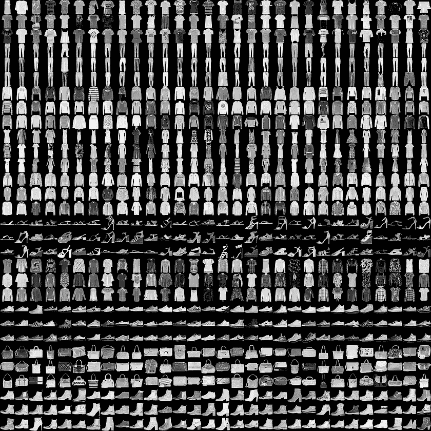
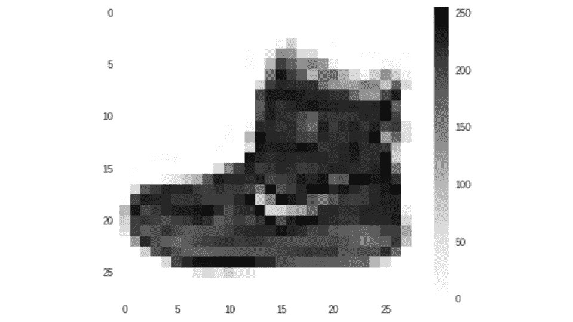
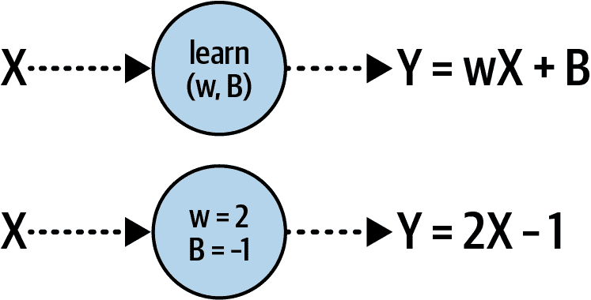

# 第二章。计算机视觉简介

第一章 介绍了机器学习的基本工作原理。你看到了如何使用神经网络开始编程，将数据与标签匹配，并从那里看到如何推断出区分项目的规则。

在本章中，我们将考虑下一个逻辑步骤，即将这些概念应用于计算机视觉。在这个过程中，模型学习如何在图片中识别内容，以便它能够“看到”其中的内容。你将使用一个流行的服装项目数据集，并构建一个能够区分它们并因此“看到”不同类型服装之间差异的模型。

# 计算机视觉是如何工作的

*计算机视觉* 是指计算机识别项目的能力，而不仅仅是存储它们的像素。例如，考虑一下可能看起来像 图 2-1 中的服装。它们非常复杂，有很多不同种类的相同项目。看看这两双鞋——它们非常不同，但它们仍然是鞋！


###### 图 2-1。服装示例

这里有许多可识别的服装项目。你理解衬衫、大衣和连衣裙之间的区别，并且从根本上知道这些项目的本质——但是你如何向从未见过服装的人解释这一切？鞋子呢？这张图片中有两双鞋，但鉴于它们之间的主要差异，你如何向某人解释使它们成为鞋子的共同点？这是另一个我们曾在 第一章 中提到的基于规则的编程可能失效的领域。有时，用规则描述某物是不切实际的。

当然，计算机视觉也不例外。但考虑一下你是如何学会识别所有这些项目的——通过看到很多不同的例子，并积累它们如何被使用的经验。计算机能否以同样的方式学习？答案是肯定的，但有一定的局限性。在本章的其余部分，我们将通过一个例子来了解如何使用名为 Fashion MNIST 的知名数据集教计算机识别服装项目。

# 时尚 MNIST 数据库

学习和基准测试算法的基础数据集之一是修改后的国家标准与技术研究院（MNIST）数据库，该数据库由 Yann LeCun、Corinna Cortes 和 Christopher Burges 创建。这个数据集包含从 0 到 9 的手写数字图像，共有 70,000 个，图像为 28 × 28 的灰度图。

[Fashion MNIST](https://oreil.ly/f-mnist) 被设计成是 MNIST 的直接替代品，具有相同的记录数量、相同的图像尺寸和相同的类别数量。与 0 到 9 的数字图像不同，Fashion MNIST 包含 10 种不同类型服装的图像。

你可以在图 2-2 中看到数据集内容的示例，其中有三条线专门用于每种服装类型。



###### 图 2-2\. 探索 Fashion MNIST 数据集

Fashion MNIST 包含各种服装，包括衬衫、裤子、连衣裙和许多类型的鞋子！此外，你可能已经注意到，它是单色的，所以每张图片都由一定数量的像素组成，像素值介于 0 到 255 之间。这使得数据集更容易管理。

你可以在图 2-3 中看到数据集中特定图像的特写。



###### 图 2-3\. Fashion MNIST 数据集中图像的特写

就像任何图像一样，这个图像是一个像素的矩形网格。在这种情况下，网格大小是 28 × 28，每个像素的值介于 0 到 255 之间，因此它由一个灰度平方表示。为了更容易看到，我已经将其扩展，使其看起来像像素化。

让我们现在看看如何使用之前看到的函数来使用这些像素值。

# 视觉神经元

在第一章中，你看到了一个非常简单的场景，其中一台机器被给定了一组 *x* 和 *y* 值，并且它学会了它们之间的关系是 *y* = 2*x* – 1。这是使用一个非常简单的只有一个层和一个神经元的神经网络完成的。如果你要直观地绘制它，它可能看起来像图 2-4。



###### 图 2-4\. 单个神经元学习线性关系

我们的每张图像是一组 784 个值（28 × 28）介于 0 到 255 之间。它们可以是我们的 *x*。我们还知道我们的数据集中有 10 种不同的图像类型，所以让我们考虑它们是我们的 *y*。现在，我们想要学习 *y* 作为 *x* 的函数的函数看起来像什么。

由于我们每张图像有 784 个 *x* 值，而我们的 *y* 将介于 0 到 9 之间，一个简单的方程 *y* = *mx* + *c* 并不足以解决问题。这是因为存在大量可能的值，而方程只能在一条线上绘制值。

但我们可以做的是让几个神经元一起工作。每个神经元将学习 *参数*，当我们有一个所有这些参数共同工作的组合函数时，我们可以看到我们是否可以将该模式与我们的期望答案相匹配（参见图 2-5）。


###### 图 2-5\. 扩展我们的模式以更复杂的示例

此图顶部的灰色方框可以被认为是图像中的像素，它们是我们的*X*值。当我们训练神经网络时，我们将像素加载到一个神经元的层中——图 2-5 显示了它们被加载到第一个神经元中，但值只加载到每个神经元中。此外，考虑每个神经元的权重和偏差(*w*和*b*)是随机初始化的。然后，当我们对每个神经元的输出值求和时，我们将得到一个值。我们将对输出层的每个神经元都这样做，所以神经元 0 将包含像素加起来等于标签 0 的概率值，神经元 1 将包含像素加起来等于标签 1 的概率值，等等。

随着时间的推移，我们希望将这个值匹配到期望的输出——对于这张图像来说，是数字 9，这也是图 2-3 中展示的踝靴的标签。换句话说，这个神经元应该拥有所有输出神经元中最大的值。

由于有 10 个标签，随机初始化应该有大约 10%的时间能够得到正确答案。从那时起，损失函数和优化器可以逐个 epoch 调整每个神经元的内部参数，以改善这 10%。因此，随着时间的推移，计算机将学会“看到”什么使鞋子成为鞋子，连衣裙成为连衣裙。当你运行代码并看到你的神经网络有效地学会区分不同的物品时，你会看到这个过程不断改进。

# 设计神经网络

让我们以我们刚刚讨论的例子为例，探索它在代码中的样子。首先，我们将查看图 2-5 中展示的神经网络的设计：

```py
self.linear_relu_stack = nn.Sequential(
    nn.Linear(28*28, 128),
    nn.ReLU(),
    nn.Linear(128, 10),
    nn.LogSoftmax(dim=1)
)
```

如果你记得，在第一章中我们有一个`Sequential`模型来指定我们有很多层。在那个情况下，我们只有一个层，但现在我们使用它来定义多个层。

第一层，一个`Linear`层，是一层学习输入和输出之间线性关系的神经元。正如之前所做的那样，当使用`Linear`时，你给出两个参数：输入形状和输出形状。方便的是，输出形状实际上是这个层中你想要的神经元数量，我们指定我们想要 128 个。*输入*形状定义为(28 × 28)，这是进入网络的数据大小，正如你之前所看到的，这是 Fashion MNIST 图像的维度。

输入在图 2-5 中显示为中间层，你经常会听到这样的层被描述为*隐藏层*。术语*隐藏*只是意味着没有直接接口到该层。这需要一点时间来适应——中间层是你首先*定义*的层，在一个像图 2-5 这样的图中，你可以看到它在图的中间。这是因为我们还绘制了数据“进入”这个层。另一件需要注意的事情是，来自 Fashion MNIST 等数据集的图像数据通常是矩形的，但层不会识别这一点，因此它需要被“展平”成一个一维数组，如图 2-5 顶部所示。你很快就会看到相关的代码。

在这个第一个“线性”中，我们要求 128 个神经元具有随机初始化的内部参数。通常，在这个时候我会被问到“为什么是 128？”这完全是随机的——没有使用神经元数量的固定规则。在设计层时，你需要选择适当数量的值，以便你的模型能够真正地学习。更多的神经元意味着它将运行得更慢，因为它必须学习更多的参数。更多的神经元也可能导致一个网络在识别训练数据方面非常出色，但在识别它之前未见过的新数据方面表现不佳。（这被称为*过拟合*，我们将在本章后面讨论）。另一方面，更少的神经元意味着模型可能没有足够的参数来学习。

你需要探索学习速度和学习精度之间的权衡，并在一段时间内进行实验以选择正确的值。这个过程通常被称为*超参数调整*。在机器学习中，*超参数*是用于控制训练的值，而不是被训练/学习的神经元的内部值，这些值被称为*参数*。

当你使用 PyTorch 定义神经网络并使用`Sequential`时，你不仅定义了网络的层以及它们可能使用的神经元类型。你还可以定义在数据在神经网络层之间流动时执行的功能。这些通常被称为*激活函数*，激活函数是你在代码中看到的下一个指定为`nn.ReLU()`的东西。激活函数是将在层中的每个神经元上执行代码。PyTorch 支持许多开箱即用的激活函数，其中在中间层中非常常见的一个是`ReLU`，代表*修正线性单元*。这是一个简单的函数，只有当它的值大于 0 时才返回值。在这种情况下，我们不希望将负值传递到下一层，从而可能影响求和函数，因此我们不需要编写大量的`if-then`代码，而可以直接使用`ReLU`激活层。

最后，还有一个`Linear`层，它将是*输出层*。如果你查看定义的形状（128, 10）并通过“输入大小，输出大小”框架来思考，你会发现它有 128 个“输入”（即上一层中的神经元数量）和 10 个“输出”。这 10 个是什么？回想一下，Fashion MNIST 有 10 种服装类别。每个神经元实际上被分配了一个类别，并且它最终会得到一个概率，即输入像素与该类别的匹配程度，因此我们的任务是确定哪个具有最高的值。你可能想知道这些分配是如何发生的：在哪里有代码说一个神经元代表鞋子，另一个代表衬衫？为了回答这个问题，回想一下第一章中的*y* = 2*x* ‒ 1 示例，在那里我们有一组输入数据和一组已知、正确的答案，有时被称为*地面真相*。Fashion MNIST 将以相同的方式工作。在训练网络时，我们提供输入图像及其已知答案作为一组我们希望输出神经元看起来像的东西。因此，网络将“学习”到当它看到鞋子时，不表示该鞋子的输出神经元应该具有零值，而表示该鞋子的神经元应该具有“1”值。

我们*也可以*遍历输出神经元以找到最高值，但`LogSoftmax`激活函数为我们做了这件事。

因此，现在当我们训练我们的神经网络时，我们有两个目标。我们希望能够输入一个 28 × 28 像素的数组，并且希望中间层的神经元具有权重和偏差（*w*和*B*值），当它们结合在一起时，将匹配这 10 个输出值。

# 完整的代码

现在我们已经探讨了神经网络的架构，让我们看看使用 Fashion MNIST 数据训练模型的完整代码。

下面是完整的代码：

```py
import torch
import torch.nn as nn
import torch.optim as optim
from torchvision import datasets, transforms
from torch.utils.data import DataLoader

# Load the dataset
transform = transforms.Compose([transforms.ToTensor()])

train_dataset = datasets.FashionMNIST(root='./data', train=True, 
                             download=True, transform=transform)
test_dataset = datasets.FashionMNIST(root='./data', train=False, 
                             download=True, transform=transform)

train_loader = DataLoader(train_dataset, batch_size=64, 
                          shuffle=True)
test_loader = DataLoader(test_dataset, batch_size=64, 
                          shuffle=False)

# Define the model
class FashionMNISTModel(nn.Module):
    def __init__(self):
        super(FashionMNISTModel, self).__init__()
        self.flatten = nn.Flatten()
        self.linear_relu_stack = nn.Sequential(
            nn.Linear(28*28, 128),
            nn.ReLU(),
            nn.Linear(128, 10),
            nn.LogSoftmax(dim=1)
        )

    def forward(self, x):
        x = self.flatten(x)
        logits = self.linear_relu_stack(x)
        return logits

model = FashionMNISTModel()

# Define the loss function and optimizer
loss_function = nn.NLLLoss()
optimizer = optim.Adam(model.parameters())

# Train the model
def train(dataloader, model, loss_fn, optimizer):
    size = len(dataloader.dataset)
    model.train()
    for batch, (X, y) in enumerate(dataloader):
        # Compute prediction and loss
        pred = model(X)
        loss = loss_fn(pred, y)

        # Backpropagation
        optimizer.zero_grad()
        loss.backward()
        optimizer.step()

        if batch % 100 == 0:
            loss, current = loss.item(), batch * len(X)
            print(f"loss: {loss:>7f}  
                    [{current:>5d}/{size:>5d}]")

# Training process
epochs = 5
for t in range(epochs):
    print(f"Epoch {t+1}\n-------------------------------")
    train(train_loader, model, loss_function, optimizer)
print("Done!")
```

让我们逐个分析这个代码。首先，让我们考虑数据来自哪里。在 torchvision 库中，有一个 datasets 集合，我们可以从那里加载 Fashion MNIST，如下所示：

```py
datasets.FashionMNIST
```

因此，在我们的第一个代码块中，你会看到以下内容：

```py
train_dataset = datasets.FashionMNIST(root='./data', train=True, 
                             download=True, transform=transform)
test_dataset = datasets.FashionMNIST(root='./data', train=False, 
                             download=True, transform=transform)
```

现在，你可能会想知道为什么我们使用**两个**数据集。很简单：一个用于训练，另一个用于测试。这里的想法也很简单：如果你在数据集上训练一个神经网络，它可以成为该数据集的专家，但它可能无法有效地理解或分类它之前未见过的新数据。在 Fashion MNIST 的情况下，它可能非常擅长理解鞋子和衬衫子集之间的差异，但当新的数据呈现给它时，它可能会表现得很差。因此，保留一部分数据不用于训练神经网络是一个好的实践。在这种情况下，Fashion MNIST 有 70,000 个数据项，但只有 60,000 个用于训练网络，其余的 10,000 个用于测试。如果你仔细查看前面的代码，你会看到这两行之间的区别在于`train=`参数。对于第一个，训练集的参数设置为 True。对于另一个，它设置为 False。

你还会在数据集中看到`transform`参数。它指定了对数据应用的一种转换，其定义如下：

```py
transform = transforms.Compose([transforms.ToTensor()])
```

神经网络通常使用**归一化**值（即介于 0 和 1 之间的值）。然而，我们图像中的像素值在 0-255 的范围内，这些值表示它们的颜色深度，其中 0 是黑色，255 是白色，介于两者之间的是灰色。为了准备神经网络的数据，我们应该将这些灰色映射到 0 到 1 之间的值。前面的代码将自动为你完成这一点，因此当你加载代码时应用此`transform`参数，然后将像素值从[0, 255]的整数范围映射到[0, 1]的浮点范围，并将它们加载到适合神经网络的数组中（即张量）。

我们的工作将是在训练图像与训练标签之间进行拟合，这与我们在第一章中拟合*y*到*x*的方式相似。

关于[为什么归一化数据更适合训练神经网络](https://oreil.ly/6d_Po)的数学原理超出了本书的范围，但请记住，当你使用 PyTorch 训练神经网络时，归一化会提高性能。通常，你的网络在处理未归一化数据时不会学习，并且会出现巨大的错误。你可能会记得第一章中的*y* = 2*x* – 1 示例不需要对数据进行归一化，因为它非常简单，但为了好玩，尝试用不同的*x*和*y*值来训练它，其中*x*的值要大得多——你将看到它很快就会失败！

接下来，我们定义构成我们模型的神经网络，正如之前讨论的那样，但我们将用更多细节来完善它——包括展平层以及我们希望在模型中如何实现“正向”传递。

这里是代码：

```py
# Define the model
class FashionMNISTModel(nn.Module):
    def __init__(self):
        super(FashionMNISTModel, self).__init__()
        self.flatten = nn.Flatten()
        self.linear_relu_stack = nn.Sequential(
            nn.Linear(28*28, 128),
            nn.ReLU(),
            nn.Linear(128, 10),
            nn.LogSoftmax(dim=1)
        )

    def forward(self, x):
        x = self.flatten(x)
        logits = self.linear_relu_stack(x)
        return logits

model = FashionMNISTModel()
```

这里需要注意的一些关键点是，`FashionMNISTModel`类是`nn.Module`的子类，这给了你覆盖其`forward`方法的能力。我们在数据通过网络向前传递时使用这个方法。记得在第一章中我们看到的`loss.backward()`调用执行了反向传播并改变了网络的参数？当使用 PyTorch 训练模型时，你经常会遇到相同的模式。你将定义在数据通过网络向前传递时执行的功能，然后定义在从损失计算出的梯度通过网络向后移动时执行的其他功能。

因此，如果我们查看类的`init`方法，我们定义了两个方法：`flatten`，它被设置为`nn.FLatten()`（一个将 2D 图像展平为 1D 的内置函数），以及`linear_relu_stack`，它被设置为定义网络行为的层和操作的序列（通常缩写为*ops*）。

在`forward`方法中，我们简单地定义了这些方法的工作方式。首先，我们通过调用`self.flatten`来展平我们的数据`x`，然后结果将被传递到`linear_relu_stack`以获取结果。这些结果被称为*logits*，它们是（由`LogSoftmax`定义的）对数概率，表示模型对每个类别是正确分类的置信度。

为了从我们的数据中学习，我们需要一个损失函数来计算我们当前“猜测”的好坏，同时我们还需要一个优化器来确定下一次改进猜测的参数集。

下面是如何定义这两个方法的示例：

```py
# Define the loss function and optimizer
loss_function = nn.NLLLoss()
optimizer = optim.Adam(model.parameters())
```

首先，让我们看看损失函数。它被定义为`nn.NLLLoss()`，代表“负对数似然损失”。别担心——在这个阶段，没有人期望你理解它的含义！最终，随着你学习如何进行机器学习，你会了解不同的损失函数，并尝试在特定场景中哪些函数效果更好。在这种情况下，鉴于输出 logits 是对数概率，我选择了这个损失函数，因为它在这个场景中特别有效。如前所述，随着时间的推移，你会对损失函数库有更多的了解，你可以为你的场景选择最佳的函数。但就目前而言，只需顺其自然，使用这个函数即可！

对于优化器，我选择使用 `Adam` 优化算法。它与我们在第一章中用于 *y* = 2*x* – 1 模型的随机梯度下降类似，但通常更快、更准确。与损失函数一样，随着时间的推移，你会了解更多关于优化算法的知识，你将能够从最适合你场景的优化器菜单中进行选择。这里的一个重要事项是注意，我已经将 `model.parameters()` 作为参数传递给了这个。这个参数将模型中所有的可训练参数传递给优化器，以便它可以调整它们以帮助最小化损失函数计算出的损失。

现在，让我们具体探讨一下，看看我们用于训练网络的代码是什么样的：

```py
# Train the model
def train(dataloader, model, loss_fn, optimizer):
    size = len(dataloader.dataset)
    model.train()
    for batch, (X, y) in enumerate(dataloader):
        # Compute prediction and loss
        pred = model(X)
        loss = loss_fn(pred, y)

        # Backpropagation
        optimizer.zero_grad()
        loss.backward()
        optimizer.step()

        if batch % 100 == 0:
            loss, current = loss.item(), batch * len(X)
            print(f"loss: {loss:>7f} [{current:>5d}/{size:>5d}]")
```

虽然其中一些内容看起来很熟悉，因为它是基于第一章中的简单神经网络构建的，但由于我们使用了更多的数据，这里也有一些新的概念。首先，你会看到我们获取了数据集的 `size`。我们只是简单地使用这个来报告进度，就像在最后一行所展示的那样。

然后，我们调用 `model.train` 来显式地将模型设置为训练模式。PyTorch 在训练过程中有一些优化，这些优化超出了本章的范围。（为了利用这些优化，你需要在训练和推理模式之间切换模型。）请注意，这更多的是模型的一个属性，而不是一个方法，但方法语法确实存在。如果这有点令人困惑，请见谅！

接下来是这一有趣的行：

```py
    for batch, (X, y) in enumerate(dataloader):
```

让我们更详细地探讨这个问题。我们通过使用数据加载器使 Fashion MNIST 数据集可供我们的代码使用。有 60,000 条记录可用于训练，每条记录有 784 像素。这是一大批数据，你不必一次性将所有数据都加载到内存中。`batch` 的概念就是取数据的一部分——默认情况下是 64 个项目——并对其进行处理。枚举数据加载器会给我们这个，因此我们将使用 938 个批次进行训练，其中 937 个批次包含 64 个项目，最后一个批次包含 32 个项目，因为 60,000 不能被 64 整除！

现在，对于每个批次，我们将执行与上一个示例中相同的循环。我们将从模型获取预测结果，计算损失，从损失函数中反向传播梯度，并使用新的参数进行优化。

我们还将使用术语 *epoch* 来表示包含 *所有* 数据的训练周期（即每个批次）。然后我们可以每输出一百个批次的状态，以免输出控制台过载！

因此，为了训练网络五个周期，我们可以使用如下代码：

```py
# Training process
epochs = 5
for t in range(epochs):
    print(f"Epoch {t+1}\n-------------------------------")
    train(train_loader, model, loss_function, optimizer)
print("Done!")
```

这将简单地调用我们指定的训练函数五次——通过计算预测、确定损失、优化参数并重复五次来使网络通过训练循环。

# 训练神经网络

执行代码后，你会看到网络逐个 epoch 进行训练。然后，在训练结束后，你会在最后看到如下内容：

```py
Epoch 5
-------------------------------
loss: 0.429329  [    0/60000]
loss: 0.348756  [ 6400/60000]
loss: 0.237481  [12800/60000]
loss: 0.336960  [19200/60000]
loss: 0.435592  [25600/60000]
loss: 0.272769  [32000/60000]
loss: 0.362881  [38400/60000]
loss: 0.202799  [44800/60000]
loss: 0.354268  [51200/60000]
loss: 0.205381  [57600/60000]
Done!
```

你可以看到，随着时间的推移，损失已经下降。例如，在我的情况下，第一个 epoch 结束时的损失值为.345，到第五个 epoch 结束时，损失值为.205。这些数据表明网络正在学习。

但我们如何判断它学习得有多准确呢？请注意，损失和准确率虽然相关，但并没有直接的线性关系——例如，我们不能说如果损失是 20%，那么准确率就是 80%。因此，我们需要深入一点。

回想一下，当我们获取数据时，我们得到了*两个*数据集：一个用于训练，一个用于测试。这是一个我们可以编写代码来通过我们的网络传递测试数据并评估网络在预测答案方面的准确性的绝佳地方。我们已经知道了正确答案，因此我们可以对所有 10,000 个测试记录进行推理，获取模型预测的答案，然后检查它们与真实值以确定准确率。

下面是代码：

```py
# Function to test the model
def test(dataloader, model):
    size = len(dataloader.dataset)
    num_batches = len(dataloader)
    model.eval()  # Set the model to evaluation mode
    test_loss, correct = 0, 0
    with torch.no_grad():
        for X, y in dataloader:
            pred = model(X)
            test_loss += loss_function(pred, y).item()
            correct += (pred.argmax(1) == 
                        y).type(torch.float).sum().item()
    test_loss /= num_batches
    correct /= size
    print(f"Test Error: \n Accuracy: {(100*correct):>0.1f}%, 
            Avg loss: {test_loss:>8f} \n")

# Evaluate the model
test(test_loader, model)
```

在这段代码中有几点需要注意。首先是`model.eval()`这一行，它表示我们将模型从训练模式切换到推理模式。同样，`torch.no_grad()`会在 PyTorch 中关闭梯度计算以加快推理速度。我们不再进行*训练*模型，因此不需要执行所有的损失函数反向传播和优化。我们可以将其关闭。

然后，就像在训练过程中一样，网络会遍历数据加载器中的每个项目，获取该项目的预测结果，并使用以下行检查其正确性：

```py
correct += (pred.argmax(1) ==  y).type(torch.float).sum().item()
```

这有点长，所以让我们来分解一下。

首先，`pred`值将给出网络预测的结果。网络输出 10 个值，每个值都包括它所代表的类是正确类的概率。对这进行`argmax`操作将给出哪个值最大（即概率最接近 1 的那个）。*y*值是正确答案。例如，如果我们得到一个预测，值最高的神经元是第六个，*y* = 6，因此我们知道我们有一个正确答案。另外，因为我们处理的是批量数据，我们想要计算每个批次中`pred.argmax(1) == y`的次数，因此，使用`sum()`。

因此，我们的准确率值将是正确项目数除以项目总数的总和。所以，当你训练完模型后运行此代码，你应该看到如下输出：

```py
Test Error:
 Accuracy: 86.9%, Avg loss: 0.366243
```

令人惊讶的是，在仅运行了五个 epoch 之后，我们可以看到它在之前未见过的数据上的准确率达到了 86.9%！

到目前为止，你可能认为看到模型在测试集上的准确度真的很不错，但你可能也会问为什么我们只报告了训练中的损失——为什么不也报告准确度呢？只通过最小化损失来结束训练模型，然后才去计算准确度似乎很荒谬。而且你是对的！

幸运的是，将模型训练代码更新为**也**报告准确度相当容易。这里有一个名为`get_accuracy()`的函数，你可以在训练过程中使用：

```py
# Function to calculate accuracy
def get_accuracy(pred, labels):
    _, predictions = torch.max(pred, 1)
    correct = (predictions == labels).float().sum()
    accuracy = correct / labels.shape[0]
    return accuracy
```

然后，在你的训练循环中，你可以在调用损失函数之后简单地调用这个函数，如下所示：

```py
for batch, (X, y) in enumerate(dataloader):
    # Compute prediction and loss
    pred = model(X)
    loss = loss_fn(pred, y)
    accuracy = get_accuracy(pred, y)

    # Backpropagation
```

当你报告训练输出时，你可以使用准确度指标如下：

```py
if batch % 100 == 0:
    current = batch * len(X)
    avg_loss = total_loss / (batch + 1)
    avg_accuracy = total_accuracy / (batch + 1) * 100
    print(f"Batch {batch}, Loss: {avg_loss:>7f}, 
            Accuracy: {avg_accuracy:>0.2f}% 
                      [{current:>5d}/{size:>5d}]")
```

运行这个函数会给出类似以下输出：

```py
Epoch 5
-------------------------------
Batch 0, Loss: 0.177518, Accuracy: 95.31% [    0/60000]
Batch 100, Loss: 0.304973, Accuracy: 88.89% [ 6400/60000]
Batch 200, Loss: 0.311628, Accuracy: 88.51% [12800/60000]
Batch 300, Loss: 0.307373, Accuracy: 88.63% [19200/60000]
Batch 400, Loss: 0.309722, Accuracy: 88.67% [25600/60000]
Batch 500, Loss: 0.310240, Accuracy: 88.60% [32000/60000]
Batch 600, Loss: 0.306988, Accuracy: 88.70% [38400/60000]
Batch 700, Loss: 0.308556, Accuracy: 88.64% [44800/60000]
Batch 800, Loss: 0.309518, Accuracy: 88.67% [51200/60000]
Batch 900, Loss: 0.311487, Accuracy: 88.59% [57600/60000]
Done!
```

现在，你可能想知道为什么测试数据的准确度（86.9%）低于训练数据的准确度（88.59%）。这是非常常见的，当你这么想的时候，这是有道理的：神经网络实际上只知道如何将训练过的输入与那些值的输出相匹配。我们的希望是，给定足够的数据，网络将能够从它看到的例子中推广，从而“学习”鞋或连衣裙的样子。但总会有一些它没有看到且与它看到的不同到足以使其困惑的物品。

例如，如果你从小只见过运动鞋，那么对你来说鞋子的样子就是这样。所以，当你第一次看到高跟鞋时，你可能会有些困惑。根据你的经验，它可能是一双鞋，但你不能确定。这正是神经网络“认为”它在“看到”与它训练过的输入足够不同的输入时的想法。

# 探索模型输出

现在我们已经训练了模型，并使用测试集对其准确度进行了良好的评估，让我们稍微探索一下。这里有一个我们可以用来预测单个图像的函数：

```py
 import matplotlib.pyplot as plt

def predict_single_image(image, label, model):
    # Set the model to evaluation mode
    model.eval()

# Unsqueeze image as the model expects a batch dimension
    image = image.unsqueeze(0)

    with torch.no_grad():
        prediction = model(image)
        print(prediction)
        predicted_label = prediction.argmax(1).item()

    # Display the image and predictions
    plt.imshow(image.squeeze(), cmap='gray')
    plt.title(f'Predicted: {predicted_label}, Actual: {label}')
    plt.show()

    return predicted_label

# Choose an image from the test set
image, label = test_dataset[0]  # Change index to test different images

# Predict the class for the chosen image
predicted_label = predict_single_image(image, label, model)
print(f"The model predicted {predicted_label}, and the actual label is {label}.")
```

让我们从这段代码开始，现在你应该已经熟悉了，因为你已经看到了之前的准确度计算代码：

```py
    with torch.no_grad():
        prediction = model(image)
        print(prediction)
        predicted_label = prediction.argmax(1).item()
```

在这里，我们获取`图像`，将其发送到`模型`，得到一个`预测`，并将其打印出来。然后，我们获取`argmax`以显示标签。以下是`预测`的一个示例输出：

```py
tensor([[–12.4290, –16.0639, –14.3148, –16.2861, –13.1672,  –4.5377, –13.6284, 
         –1.3124,  –8.9946,  –0.3285]])
```

这些数字可能看起来有些模糊，但最终，我们的目标只是寻找最大的一个！`Softmax`函数获取值的`log()`，其中`log(1)`为零，任何小于一的值的对数都是负值。当你查看列表时，你会注意到最接近 0（-0.3285）的值是最后一个。这表明该函数认为这个图像的类别应该是第 9 类。（Fashion MNIST 中有 10 个类别，编号为 0 到 9。）

Fashion MNIST 的第 9 个类别是“踝靴”，因此我还包括了在图 2-6 中渲染图像的代码。

此外，正如我们所见，这是一个模型做出正确预测的例子。真实标签是 9，预测的是数字 9。绘制图像以便我们这些凡人可以比较这两个结果，也给了我们一双踝靴！


###### 图 2-6\. 探索预测模型的输出

现在，尝试为自己设置几个不同的值，看看你是否能找到模型出错的地方。

# 过拟合

在最后一个例子中，我们只训练了五个 epoch。也就是说，我们进行了整个训练循环，包括随机初始化神经元并检查其标签，然后通过损失函数测量性能并由优化器更新五次。我们得到的结果相当不错：训练集上的准确率为 88.59%，测试集上的准确率为 86.5%。那么，如果我们训练更长的时间会发生什么呢？

接下来，尝试将其更新为训练 50 个 epoch 而不是 5 个。在我的情况下，我在训练集上得到了以下准确性指标：

```py
Epoch 50
-------------------------------
Batch 0, Loss: 0.077159, Accuracy: 96.88% [    0/60000]
Batch 100, Loss: 0.094825, Accuracy: 96.57% [ 6400/60000]
Batch 200, Loss: 0.093598, Accuracy: 96.67% [12800/60000]
Batch 300, Loss: 0.095906, Accuracy: 96.54% [19200/60000]
Batch 400, Loss: 0.096683, Accuracy: 96.48% [25600/60000]
Batch 500, Loss: 0.101872, Accuracy: 96.31% [32000/60000]
Batch 600, Loss: 0.103130, Accuracy: 96.22% [38400/60000]
Batch 700, Loss: 0.103901, Accuracy: 96.17% [44800/60000]
Batch 800, Loss: 0.104216, Accuracy: 96.15% [51200/60000]
Batch 900, Loss: 0.104010, Accuracy: 96.15% [57600/60000]
Done!
```

这尤其令人兴奋，因为我们做得更好：我们得到了 96.15%的准确率！

然而，对于测试集，准确率达到了 89.2%：

```py
Test Error:
 Accuracy: 89.2%, Avg loss: 0.433885
```

因此，我们在训练集上取得了很大的改进，而在测试集上改进较小。这可能会表明，长时间训练我们的网络将导致更好的结果——但这并不总是如此。网络在训练数据上做得更好，但模型不一定是一个更好的模型。事实上，准确率数字的差异表明，模型可能已经过度专门化到训练数据上，这个过程通常被称为*过拟合*。随着你构建更多的神经网络，这个问题是你要注意的——而且随着你阅读这本书，你将学习到许多避免它的技术！

# 提前停止

到目前为止，在每种情况下，我们都硬编码了我们要训练的 epoch 数量。虽然这可行，但我们可能希望训练直到达到所需的准确性，而不是不断尝试不同的 epoch 数量并重新训练，直到达到我们期望的值。所以，例如，如果我们想训练直到模型在训练集上的准确率达到 95%，而且如果我们想在事先不知道需要多少 epoch 的情况下完成它……我们该如何做？

由于我们已经更新了代码，以便在模型训练时检查准确性并将其打印出来，现在我们只需检查该准确性，如果它超过一定数量——例如 95%（或归一化后的 0.95），就结束训练。例如，我们可以这样做：

```py
if batch % 100 == 0:
    current = batch * len(X)
    avg_loss = total_loss / (batch + 1)
    avg_accuracy = total_accuracy / (batch + 1) * 100
    print(f"Batch {batch}, Loss: {avg_loss:>7f}, 
           Accuracy: {avg_accuracy:>0.2f}% [{current:>5d}/{size:>5d}]")

# Early stopping condition
if avg_accuracy >= 95:
    print("Reached 95% accuracy, stopping training.")
    return True  # Stop training
```

注意，如果我们在这个 `if batch % 100 == 0` 块中使用此代码，我们可以在处理特定 epoch 中的所有批次之前中断训练循环。最好在 epoch 结束时进行此检查，因此我们需要确保将 `if avg_accuracy >= 95` 放在正确的位置！

现在，当我们进行训练时，在每个 epoch 结束时，将计算该 epoch 的平均准确率——如果达到 95%，则训练停止。之前，我训练了模型 50 个 epoch 以获得 96.15%的准确率，但通过这种早期停止，我将 95%定义为“足够好”，你可以看到模型在仅 37 个 epoch 后停止了训练。有趣的是，在那之前的几个 epoch 中，准确率达到了 94.99%，所以我可能还能更早地停止训练！

这种*早期停止*的过程在帮助你评估不同模型架构以解决特定问题时非常有用，它能帮助你训练模型直到“足够好”，而不是有一个固定的训练循环。例如，这个过程可能看起来像这样：

```py
Epoch 36
-------------------------------
Batch 0, Loss: 0.098307, Accuracy: 96.88% [    0/60000]
Batch 100, Loss: 0.119195, Accuracy: 95.45% [ 6400/60000]
Batch 200, Loss: 0.127049, Accuracy: 95.20% [12800/60000]
Batch 300, Loss: 0.126001, Accuracy: 95.34% [19200/60000]
Batch 400, Loss: 0.127823, Accuracy: 95.25% [25600/60000]
Batch 500, Loss: 0.131262, Accuracy: 95.11% [32000/60000]
Batch 600, Loss: 0.135573, Accuracy: 94.95% [38400/60000]
Batch 700, Loss: 0.135920, Accuracy: 94.95% [44800/60000]
Batch 800, Loss: 0.135125, Accuracy: 94.99% [51200/60000]
Batch 900, Loss: 0.134854, Accuracy: 94.99% [57600/60000]
Epoch 37
-------------------------------
Batch 0, Loss: 0.104421, Accuracy: 96.88% [    0/60000]
Batch 100, Loss: 0.122693, Accuracy: 95.34% [ 6400/60000]
Batch 200, Loss: 0.124787, Accuracy: 95.26% [12800/60000]
Batch 300, Loss: 0.127841, Accuracy: 95.16% [19200/60000]
Batch 400, Loss: 0.130558, Accuracy: 95.05% [25600/60000]
Batch 500, Loss: 0.131684, Accuracy: 95.00% [32000/60000]
Batch 600, Loss: 0.132620, Accuracy: 94.95% [38400/60000]
Batch 700, Loss: 0.132498, Accuracy: 95.01% [44800/60000]
Batch 800, Loss: 0.132462, Accuracy: 95.05% [51200/60000]
Batch 900, Loss: 0.133915, Accuracy: 95.03% [57600/60000]
Reached 95% accuracy, stopping training.
```

这个过程可以节省你大量原本需要手动检查网络是否适当学习的时间。

# 摘要

在第一章中，你学习了机器学习是如何通过神经网络进行复杂的模式匹配，将特征拟合到标签上的。在本章中，你将这一概念提升到了新的水平，不仅超越了单个神经元，还学习了如何创建你的第一个（非常基础的）计算机视觉神经网络。由于数据有限，这个网络有所局限：所有图像都是 28 × 28 的灰度图，衣物项位于画面中央。这是一个良好的开端，但这是一个非常受控的场景。

为了在视觉方面做得更好，你可能需要计算机学习图像的特征，而不是仅仅学习原始像素。你可以通过一个叫做*卷积*的过程来实现这一点，在下一章中，你将学习如何定义卷积神经网络来理解图像的内容。
