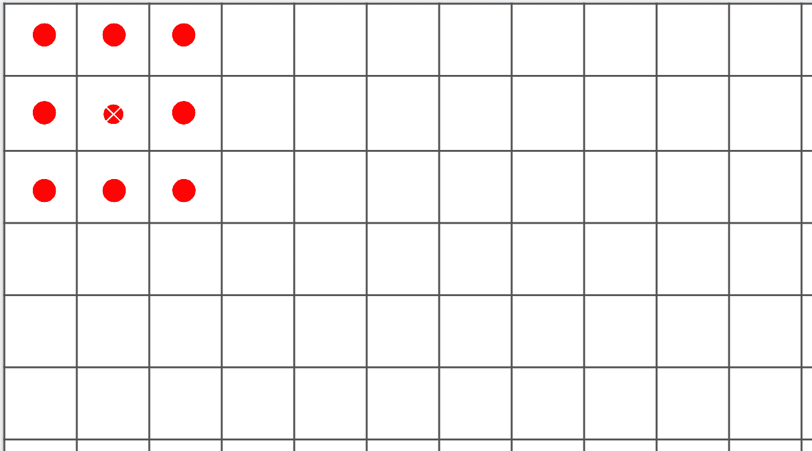
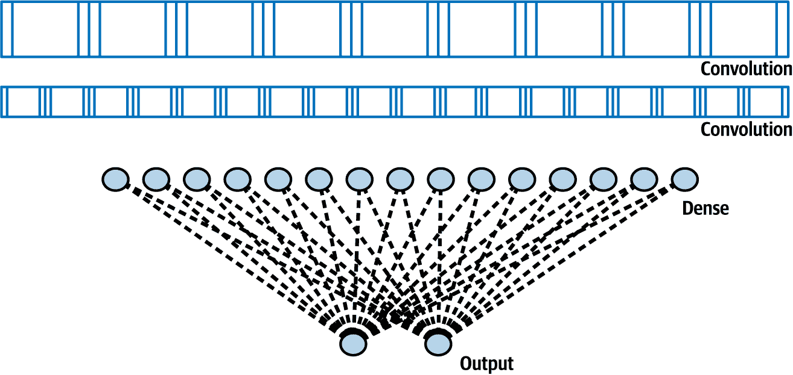
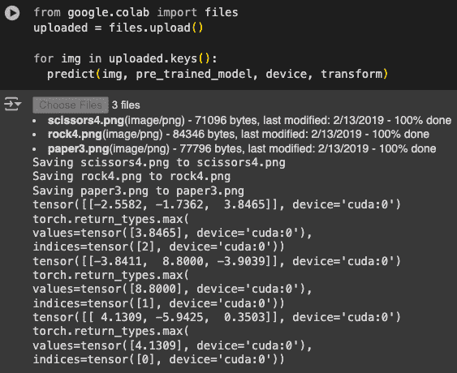
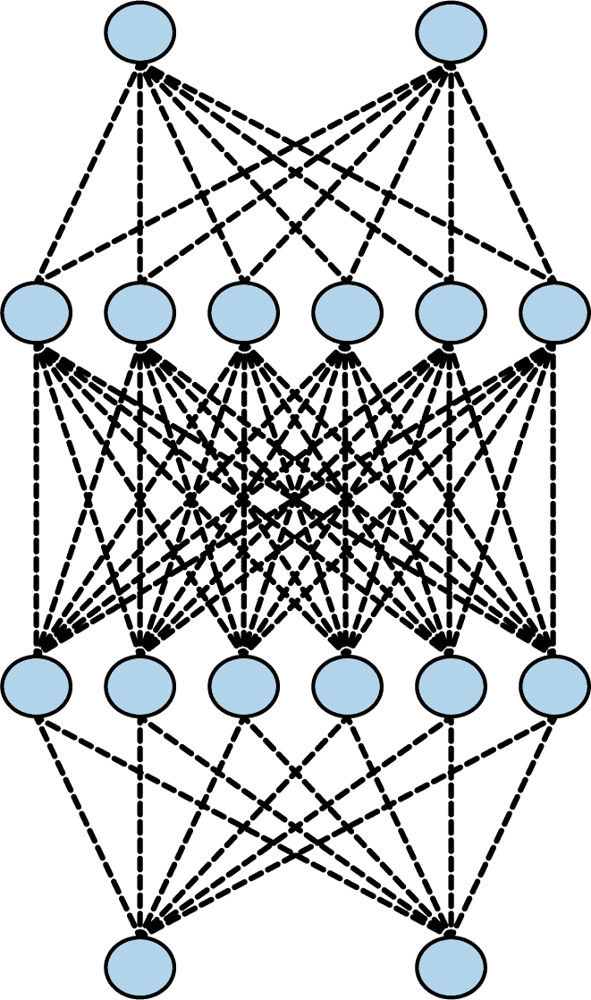

# 第三章. 超越基础：检测图像中的特征

在第二章中，你学习了如何通过创建一个简单的神经网络来入门计算机视觉，该神经网络将 Fashion MNIST 数据集的输入像素与 10 个标签相匹配，每个标签代表一种（或一类）服装。虽然你创建了一个在检测服装类型方面相当不错的网络，但存在一个明显的缺点。你的神经网络是在小单色图像上训练的，每个图像只包含一件服装，而且每件服装都位于图像的中心。

要将模型提升到下一个层次，你需要它能够检测图像中的*特征*。例如，如果我们能够将图像过滤到构成元素，而不是仅仅查看图像中的原始像素，那会怎么样？用这些元素匹配，而不是原始像素，将有助于模型更有效地检测图像内容。例如，考虑我们在上一章中使用的 Fashion MNIST 数据集。在检测鞋子时，神经网络可能被图像底部的许多暗色像素簇激活，它将看到这是鞋底。但如果鞋子没有居中且填满画面，这种逻辑就不成立了。

检测特征的一种方法来自摄影和图像处理方法，你可能已经熟悉。如果你曾经使用过 Photoshop 或 GIMP 之类的工具来锐化图像，你就已经使用了一种作用于图像像素的数学滤波器。这些滤波器所做的工作的另一个词是*卷积*，通过在神经网络中使用这些滤波器，你将创建一个*卷积神经网络*（CNN）。

在本章中，你将首先学习如何使用卷积来检测图像中的特征。然后，你将深入了解基于图像内部特征进行图像分类。我们还将探索图像增强以获取更多特征，以及迁移学习，即利用他人学习到的现有特征，然后我们将简要探讨通过使用 dropout 来优化你的模型。

# 卷积

*卷积*简单来说是一个权重滤波器，它通过将像素与其邻居相乘来得到像素的新值。例如，考虑 Fashion MNIST 中的踝靴图像及其像素值（见图 3-1）。


###### 图 3-1\. 女式踝靴与卷积

如果我们查看选择区域中间的像素，我们可以看到它的值是 192。（回想一下，Fashion MNIST 使用像素值为 0 到 255 的单色图像。）上面的像素值是 0，直接上面的像素值是 64，等等。

如果我们然后在下面的原始值中定义一个 3 × 3 的网格过滤器，就像下面所示，我们可以通过计算它的新值来转换该像素。我们通过将网格中每个像素的当前值乘以过滤器网格中相同位置的值，然后求和来实现这一点。这个总和将是当前像素的新值，然后我们重复这个计算过程，直到图像中的所有像素。

因此，在这种情况下，尽管选择中心像素的当前值为 192，我们通过以下方式计算应用过滤器后的新值：

```py
new_val = (–1 * 0) + (0 * 64) + (–2 * 128) + 
     (.5 * 48) + (4.5 * 192) + (–1.5 * 144) + 
     (1.5 * 142) + (2 * 226) + (–3 * 168)
```

结果等于 577，这将是像素的新值。对图像中的每个像素重复此过程将给我们一个过滤后的图像。

现在，让我们考虑在一个更复杂的图像上应用过滤器的影响：具体来说，是 SciPy 中内置的用于简单测试的[ascent image](https://oreil.ly/wP8TE)。这是一张 512 × 512 的灰度图像，显示了两个人在爬楼梯。

使用左侧带负值、右侧带正值和中间为零的过滤器，最终会从图像中移除大部分信息，除了垂直线（参见图 3-2）。


###### 图 3-2\. 使用过滤器提取垂直线

类似地，对过滤器的小幅调整可以强调水平线（参见图 3-3）。


###### 图 3-3\. 使用过滤器提取水平线

这些例子还表明，图像中的信息量减少了。因此，我们可能可以*学习*一组过滤器，将图像减少到特征，而这些特征可以像以前一样与标签匹配。以前，我们学习了用于匹配输入到输出的神经元参数，同样，我们可以随着时间的推移学习最佳的过滤器来匹配输入到输出。

当我们将卷积与池化结合使用时，我们可以在保持特征的同时减少图像中的信息量。我们将在下一节中探讨这一点。

# 池化

*池化*是在保持图像内容语义的同时消除图像中像素的过程。它最好通过视觉来解释。图 3-4 展示了*最大池化*的概念。


###### 图 3-4\. 最大池化的示例

在这种情况下，将左边的框视为单色图像中的像素。我们将它们分成 2 × 2 的数组，因此在这种情况下，16 个像素被分成四个 2 × 2 的数组。这些数组被称为*池*。

然后，我们从每个组中选择*最大*值，并将它们重新组装成一个新的图像。因此，左边的像素减少了 75%（从 16 变为 4），每个池中的最大值构成了新的图像。图 3-5 显示了从图 3-2 的上升版本，在应用最大池化后，垂直线得到了增强。


###### 图 3-5\. 应用垂直滤波和最大池化后的上升

注意过滤后的特征不仅被保留，而且得到了进一步的增强。同时，图像大小从 512 × 512 变为 256 × 256——变成了原始大小的四分之一。

###### 注意

存在其他池化方法。这些包括*最小池化*，它从池中取最小的像素值，以及*平均池化*，它取池中的整体平均值。

# 实现卷积神经网络

在第二章中，你创建了一个用于识别时尚图像的神经网络。为了方便，这里提供了定义模型的代码：

```py
# Define the model
class FashionMNISTModel(nn.Module):
    def __init__(self):
        super(FashionMNISTModel, self).__init__()
        self.flatten = nn.Flatten()
        self.linear_relu_stack = nn.Sequential(
            nn.Linear(28*28, 128),
            nn.ReLU(),
            nn.Linear(128, 10),
            nn.LogSoftmax(dim=1)
        )

    def forward(self, x):
        x = self.flatten(x)
        logits = self.linear_relu_stack(x)
        return logits

model = FashionMNISTModel()

# Define the loss function and optimizer
loss_function = nn.NLLLoss()
optimizer = optim.Adam(model.parameters())

# Train the model
def train(dataloader, model, loss_fn, optimizer):
    size = len(dataloader.dataset)
    model.train()
    for batch, (X, y) in enumerate(dataloader):
        # Compute prediction and loss
        pred = model(X)
        loss = loss_fn(pred, y)

        # Backpropagation
        optimizer.zero_grad()
        loss.backward()
        optimizer.step()

        if batch % 100 == 0:
            loss, current = loss.item(), batch * len(X)
            print(f"loss: {loss:>7f}  
                    [{current:>5d}/{size:>5d}]")

# Training process
epochs = 5
for t in range(epochs):
    print(f"Epoch {t+1}\n-------------------------------")
    train(train_loader, model, loss_function, optimizer)
print("Done!")
```

要将此转换为 CNN，你只需在当前线性层之上使用我们的模型定义中的卷积层。你还将添加池化层。

要实现卷积层，你将使用`nn.Conv2D`类型。它接受作为参数的层中要使用的卷积数量、卷积的大小、激活函数等。

例如，这里有一个使用此类型的卷积层：

```py
nn.Conv2d(1, 64, kernel_size=3, padding=1)
```

在这个例子中，我们希望层学习`64`个卷积。它将随机初始化它们，并且随着时间的推移，它将学习最佳的过滤器值，以匹配输入值和它们的标签。`kernel_size = 3`表示过滤器的大小。之前我们展示了 3 × 3 的过滤器，这就是我们在这里指定的。3 × 3 的过滤器是最常见的过滤器大小。你可以根据需要更改它，但通常你会看到像 5 × 5 或 7 × 7 这样的奇数轴，因为过滤器会从图像的边缘移除像素，就像你稍后将要看到的那样。

这是在神经网络中使用池化层的方法。你通常会在卷积层之后立即这样做：

```py
nn.MaxPool2d(kernel_size=2, stride=2)
```

在之前的图 3-4 示例中，我们将图像分割成 2 × 2 的池，并从每个池中选取最大值。然而，我们可以使用这里看到的参数来定义池的大小。`kernel_size=2`参数表示我们的池是 2 × 2 的，而`stride=2`参数意味着过滤器将跳过两个像素以获取下一个池。

现在，让我们探索定义 Fashion MNIST 模型的完整代码：

```py
# Define the CNN model
class FashionCNN(nn.Module):
    def __init__(self):
        super(FashionCNN, self).__init__()
        self.layer1 = nn.Sequential(
            nn.Conv2d(1, 64, kernel_size=3, padding=1),
            nn.ReLU(),
            nn.MaxPool2d(kernel_size=2, stride=2))

        self.layer2 = nn.Sequential(
            nn.Conv2d(64, 64, kernel_size=3),
            nn.ReLU(),
            nn.MaxPool2d(2))  # Output: 64 x 6 x 6

        self.fc1 = nn.Linear(64 * 6 * 6, 128)
        self.fc2 = nn.Linear(128, 10)  # 10 classes

    def forward(self, x):
        out = self.layer1(x)
        out = self.layer2(out)
        out = out.view(out.size(0), –1)  # Flatten the output
        out = self.fc1(out)
        out = self.fc2(out)
        return out
```

在这里，我们看到该类有两个函数，一个用于初始化，另一个将在每个训练周期的正向传递期间被调用。

`init`简单地定义了我们的神经网络中每一层的样子。第一层（`self.layer1`）将接受一维输入，有`64`个卷积，`kernel_size`为`3`，`padding`为`1`。然后它将在最大池化之前对输出进行 ReLU 操作。

下一层（`self.layer2`）将接受前一层输出的 64 个卷积，然后输出自己的`64`个卷积，在 ReLU 和最大池化之前。由于`MaxPool`将图像大小减半，其输出现在将是`64 × 6 × 6`。

然后，数据被送入下一层（`self.fc1`，其中`fc`代表*全连接*），输入是前一层输出的形状。输出是 128，这与我们在第二章中用于深度神经网络（DNN）的神经元数量相同。

最后，这 128 个神经元被送入最终的层（`self.fc1`），有 10 个输出——代表 10 个类别。

###### 注意

在 DNN 中，我们在将其送入第一个`Dense`层之前，先通过一个`Flatten`层对输入进行处理。在这里，我们失去了输入层——相反，我们只是指定了 1-D 输入形状。注意，在第一个`Linear`层之前，经过卷积和池化后，数据将被展平。

然后，我们在`forward`函数中堆叠这些层。我们可以看到我们得到数据`x`，通过`layer1`得到`out`，然后将其传递给`layer2`以得到新的`out`。在这个阶段，我们有了我们学习到的卷积，但在将它们加载到`Linear`层`fc1`和`fc2`之前，我们需要将它们展平。`out = out.view(out.size(0), -1)`实现了这一点。

如果我们用与我们在第二章中训练网络时相同的数据和相同的 50 个 epoch 来训练这个网络，我们将看到它运行得很好。我们可以在测试集上轻松达到 91%的准确率：

```py
Train Epoch: 44 -- Loss: 0.091689
Train Epoch: 45 -- Loss: 0.066864
Train Epoch: 46 -- Loss: 0.061322
Train Epoch: 47 -- Loss: 0.056557
Train Epoch: 48 -- Loss: 0.039695
Train Epoch: 49 -- Loss: 0.056213
Accuracy of the network on the 10000 test images: 91.31%
```

因此，我们可以看到向神经网络添加卷积确实增加了其分类图像的能力。接下来，让我们看看图像在网络中的旅程，这样我们可以更深入地理解这个过程为什么有效。

###### 注意

如果您正在使用我 GitHub 上的配套代码，您会注意到我大量使用了 model.to(device)。在 PyTorch 中，如果可用加速器，您可以使用此命令请求模型及其数据使用加速器。

# 探索卷积网络

使用 torchsummary 库，您可以检查您的模型。当您在我们一直在工作的 Fashion MNIST 卷积网络上运行它时，您会看到类似这样的内容：

```py
from torchsummary import summary
model = FashionCNN().to(device) 
summary(model, input_size=(1, 28, 28))  # (Channels, Height, Width)
----------------------------------------------------------------
        Layer (type)               Output Shape         Param #
================================================================
            Conv2d-1           [–1, 64, 28, 28]             640
              ReLU-2           [–1, 64, 28, 28]               0
         MaxPool2d-3           [–1, 64, 14, 14]               0
            Conv2d-4           [–1, 64, 12, 12]          36,928
              ReLU-5           [–1, 64, 12, 12]               0
         MaxPool2d-6             [–1, 64, 6, 6]               0
            Linear-7                  [–1, 128]         295,040
            Linear-8                   [–1, 10]           1,290
================================================================
Total params: 333,898
Trainable params: 333,898
Non-trainable params: 0
----------------------------------------------------------------
Input size (MB): 0.00
Forward/backward pass size (MB): 1.02
Params size (MB): 1.27
Estimated Total Size (MB): 2.30
```

让我们先看看“输出形状”列，以了解这里发生了什么。我们的第一层将有 28 × 28 的图像，并对其应用 64 个滤波器。但由于我们的滤波器是 3 × 3，图像周围通常会有一个像素的边界丢失，这会减少我们的整体信息到 26 × 26 像素。然而，因为我们使用了 `padding=1` 参数，图像被人工膨胀到 30 × 30，这意味着其输出将是正确的 28 × 28，并且不会丢失任何信息。

如果你没有对图像进行填充，你最终会得到 图 3-6 中的结果。如果我们把每个方框看作图像中的一个像素，第一个可能的滤波器从第二行第二列开始。同样的事情会在图的右侧和底部发生。



###### 图 3-6\. 运行滤波器时丢失像素

因此，一个形状为 *a* × *b* 像素的图像经过 3 × 3 滤波器处理后，其形状将变为 (*a* – 2) × (*b* – 2) 像素。同样，5 × 5 滤波器会使它变为 (*a* – 4) × (*b* – 4)，依此类推。由于我们使用的是 28 × 28 的图像和 3 × 3 滤波器，我们的输出现在将是 26 × 26。但是，因为我们已经将图像填充到 30 × 30（再次，为了防止信息丢失），所以输出现在是 28 × 28。

之后，池化层将是 2 × 2，因此图像在每个轴上的大小将减半，然后变为 14 × 14。下一个卷积层不使用填充，因此它将进一步减少到 12 × 12，下一个池化将输出 6 × 6。

因此，当图像通过两个卷积层后，结果将是许多 6 × 6 的图像。有多少个？我们可以在“参数数量”列中看到。

每个卷积都是一个 3 × 3 滤波器，加上一个偏差。记得之前，在我们的密集层中，每个层都是 *y* = *wx* + *b*，其中 *w* 是我们的参数（即权重）和 *b* 是我们的偏差？这个情况非常相似，只是因为滤波器是 3 × 3，所以有 9 个参数要学习。鉴于我们定义了 64 个卷积，我们将有 640 个总参数。（每个卷积有 9 个参数加上一个偏差，总共 10 个，共有 64 个。）

“ReLU 和 MaxPooling”层不会学习任何东西；它们只是减少图像的大小，因此那里没有学习的参数——因此，报告为 0。

下一个卷积层有 64 个滤波器，但每个滤波器都是乘以前面的 64 个滤波器，每个滤波器有 9 个参数。我们在每个新的 64 个滤波器上都有一个偏差，所以我们的参数数量应该是 (64 × (64 × 9)) + 64，这给我们带来了网络需要学习的 36,928 个参数。

如果这让你感到困惑，试着将第一层的卷积数量改为其他数值——例如，10。你会发现第二层的参数数量变为 5,824，这是 (64 × (10 × 9)) + 64)。

到我们完成第二次卷积时，我们的图像是 6 × 6，我们有 64 个这样的图像。如果我们乘以这个数字，我们将有 1,600 个值，我们将把这些值输入到一个有 128 个神经元的密集层中。每个神经元都有一个权重和偏差，我们将有 128 个这样的神经元，所以网络将学习的参数数量是((6 × 6 × 64) × 128) + 128，这给我们 295,040 个参数。

然后，我们的最终密集层将有 10 个神经元，它将接收之前 128 个神经元的输出，所以学习的参数数量将是(128 × 10) + 10，即 1,290。

参数总数将是所有这些的总和：333,898。

训练这个网络需要我们学习最佳的 333,898 个参数集合，以匹配输入图像和它们的标签。由于参数更多，这是一个更慢的过程，但正如我们从结果中可以看到的，它也构建了一个更精确的模型！

当然，使用这个数据集，我们仍然存在限制，即图像是 28 × 28，单色，并且居中。所以接下来我们将看看如何使用卷积来探索一个更复杂的数据集，该数据集包含马和人类的彩色图片，并且我们将尝试让模型确定图像中包含的是马还是人。在这种情况下，主题不总是像 Fashion MNIST 那样居中在图像中，因此我们不得不依赖卷积来识别区分特征。

# 构建 CNN 以区分马和人

在本节中，我们将探索比 Fashion MNIST 分类器更复杂的场景。我们将扩展我们对卷积和 CNN 的了解，尝试对图像内容进行分类，其中特征的位置不总是相同。我为此目的创建了“马或人”数据集。

## “马或人”数据集

[本节的数据集](https://oreil.ly/8VXwy)包含超过一千张 300 × 300 像素的图像。大约一半的图像是马，另一半是人——并且它们都以不同的姿势呈现。您可以在图 3-7 中看到一些示例。


###### 图 3-7\. 马和人

如您所见，主题有不同的方向和姿势，图像构图也各不相同。以两匹马为例，它们的头部方向不同，其中一张图像被放大（显示整个动物），而另一张图像被缩小（只显示头部和身体的一部分）。同样，人类被不同的光线照亮，有不同的肤色，姿势也不同。男人把手放在臀部，而女人把手伸展开。图像还包含背景，如树木和海滩，因此分类器必须确定图像中哪些部分是重要的特征，这些特征决定了马是马，人是人，而不受背景的影响。

虽然之前的预测*y* = 2*x* – 1 或对小型单色服装图像的分类可能通过传统编码实现，但很明显，这个例子要困难得多，而且你已经跨过了机器学习成为解决问题必需品的界限。

一个有趣的旁注是，这些图像都是计算机生成的。理论是，在 CGI 马图像中发现的特征应该适用于真实图像，你将在本章后面看到这是如何工作的。

## 处理数据

到目前为止你一直在使用的 Fashion MNIST 数据集包含标签，并且每个图像文件都有一个与之关联的标签详细信息文件。许多基于图像的数据集没有这个，"马或人"也不例外。没有标签，图像被分类到每个类型的子目录中，而在 PyTorch 的 DataLoader 中，你可以使用这种结构来*自动*为图像分配标签。

首先，你需要确保你的目录结构有一组命名子目录，每个子目录都是一个标签。例如，“马或人”数据集作为一组 ZIP 文件提供，其中一个包含训练数据（1,000+图像），另一个包含验证数据（256 图像）。当你下载并解压缩到本地目录用于训练和验证时，你需要确保它们具有如图图 3-8 所示的文件结构。

这是获取训练数据并将其提取到适当命名的子目录中的代码，如图图 3-8 所示：

```py
import urllib.request
import zipfile

url = "https://storage.googleapis.com/learning-datasets/
                                            horse-or-human.zip"
file_name = "horse-or-human.zip"
training_dir = 'horse-or-human/training/'
urllib.request.urlretrieve(url, file_name)

zip_ref = zipfile.ZipFile(file_name, 'r')
zip_ref.extractall(training_dir)
zip_ref.close()
```


###### 图 3-8\. 确保图像在命名子目录中

此代码仅下载训练数据的 ZIP 文件，并将其解压缩到*horse-or-human/training*目录中。（我们很快就会处理验证数据的下载。）这是包含图像类型子目录的父目录。

现在，要使用`DataLoader`，我们只需使用以下代码：

```py
from torchvision import datasets, transforms
from torch.utils.data import DataLoader

# Define transformations
transform = transforms.Compose([
    transforms.Resize((150, 150)),
    transforms.ToTensor(),
    transforms.Normalize(mean=[0.5, 0.5, 0.5], std=[0.5, 0.5, 0.5])
])

# Load the datasets
train_dataset = datasets.ImageFolder(root=training_dir, 
                                     transform=transform)
val_dataset = datasets.ImageFolder(root=validation_dir, 
                                   transform=transform)

# Data loaders
train_loader = DataLoader(train_dataset, batch_size=32, shuffle=True)
val_loader = DataLoader(val_dataset, batch_size=32, shuffle=False)
```

首先，我们创建一个名为`transform`的`transforms`对象实例。这将确定我们修改图像的规则。它将图像调整大小到 150 × 150，然后将其归一化到一个张量中。请注意，原始图像实际上是 300 × 300，但为了学习目的加快训练速度，我已经将它们调整大小到 150 × 150。

然后，我们指定`dataset`对象为`datasets.ImageFolder`类型，并将它们指向所需的目录，这样就会在应用转换的同时从该目录生成用于训练过程的图像。训练目录是`training_dir`，验证目录是`validation_dir`，如前所述。

## “马或人”的 CNN 架构

与 Fashion MNIST 数据集相比，这个数据集有几个主要的不同之处，在设计用于分类图像的架构时，你必须考虑到它们。首先，图像要大得多——150 × 150 像素，所以可能需要更多的层。其次，图像是全彩色的，而不是灰度的，所以每个图像将有三通道而不是一个。第三，只有两种图像类型，因此我们可以实际上只用*一个*输出神经元来对它们进行分类。为此，我们将该神经元的值驱动到其中一个标签的 0，并驱动到另一个标签的 1。`sigmoid`函数非常适合这个过程，可以将值驱动到这两个极端之一。你可以在`forward`函数的底部看到这一点：

```py
class HorsesHumansCNN(nn.Module):
    def __init__(self):
        super(HorsesHumansCNN, self).__init__()
        self.conv1 = nn.Conv2d(3, 16, kernel_size=3, padding=1)
        self.conv2 = nn.Conv2d(16, 32, kernel_size=3, padding=1)
        self.conv3 = nn.Conv2d(32, 64, kernel_size=3, padding=1)
        self.pool = nn.MaxPool2d(2, 2)
        self.fc1 = nn.Linear(64 * 18 * 18, 512)
        self.drop = nn.Dropout(0.25)
        self.fc2 = nn.Linear(512, 1)  
    def forward(self, x):
        x = self.pool(F.relu(self.conv1(x)))
        x = self.pool(F.relu(self.conv2(x)))
        x = self.pool(F.relu(self.conv3(x)))
        x = x.view(–1, 64 * 18 * 18)
        x = F.relu(self.fc1(x))
        x = self.drop(x)
        x = self.fc2(x)
        x = torch.sigmoid(x)  # Use sigmoid to output probabilities
        return x
```

这里有几个需要注意的地方。首先，看看最顶层。我们定义了 16 个过滤器，每个过滤器的`kernel_size`为 3，但输入形状是 3。记住这是因为我们的输入图像是彩色的：有三个通道，而不是我们之前使用的单色 Fashion MNIST 数据集的一个通道。

在另一端，注意输出层中只有一个神经元。这是因为我们使用的是二元分类器，如果我们用 sigmoid 函数激活它，我们就可以只用一个神经元得到二元分类。sigmoid 函数的目的是将一组值驱动到 0，另一组驱动到 1，这对于二元分类来说非常完美。

接下来，注意我们如何堆叠更多的卷积层。我们这样做是因为我们的图像源相当大，我们希望随着时间的推移，拥有许多较小的图像，每个图像都突出显示了一些特征。如果我们查看`summary`的结果，我们会看到这一点：

```py
----------------------------------------------------------------
        Layer (type)               Output Shape         Param #
================================================================
            Conv2d-1         [–1, 16, 150, 150]             448
         MaxPool2d-2           [–1, 16, 75, 75]               0
            Conv2d-3           [–1, 32, 75, 75]           4,640
         MaxPool2d-4           [–1, 32, 37, 37]               0
            Conv2d-5           [–1, 64, 37, 37]          18,496
         MaxPool2d-6           [–1, 64, 18, 18]               0
            Linear-7                  [–1, 512]      10,617,344
           Dropout-8                  [–1, 512]               0
            Linear-9                    [–1, 1]             513
================================================================
Total params: 10,641,441
Trainable params: 10,641,441
Non-trainable params: 0
----------------------------------------------------------------
Input size (MB): 0.26
Forward/backward pass size (MB): 5.98
Params size (MB): 40.59
Estimated Total Size (MB): 46.83
----------------------------------------------------------------
```

注意，当数据通过所有卷积和池化层后，最终会变成 18 × 18 个项。理论上是这样的，这些将是相对简单的激活特征图，因为它们将只包含 324 个像素。然后我们可以将这些特征图传递给密集神经网络，以匹配适当的标签。

当然，这使得这个网络比之前的网络有更多的参数，所以训练会慢一些。使用这种架构，我们将学习超过 1000 万个参数。

###### 小贴士

这一部分的代码，以及本书中的许多其他地方，可能需要你导入 Python 库。要找到正确的导入，你可以查看[本书的仓库](https://github.com/lmoroney/PyTorch-Book-FIles)。

为了训练网络，我们需要使用损失函数和优化器来编译它。在这种情况下，损失函数可以是`BCELoss`，其中`BCE`代表*二元交叉熵*。正如其名所示，因为在这个场景中只有两个类别，这是一个为此设计的损失函数。对于`optimizer`，我们可以继续使用之前使用的相同的`Adam`。以下是代码：

```py
criterion = nn.BCELoss()
optimizer = optim.Adam(model.parameters(), lr=0.001)
```

我们然后以通常的方式进行训练：

```py
def train_model(num_epochs):
    for epoch in range(num_epochs):
        model.train()
        running_loss = 0.0
        for images, labels in train_loader:
            images, labels = images.to(device), labels.to(device).float()  
            optimizer.zero_grad()
            outputs = model(images).view(–1)
            loss = criterion(outputs, labels)
            loss.backward()
            optimizer.step()
            running_loss += loss.item()
```

需要注意的一点是，由于二元交叉熵，标签被转换为`floats`，最终输出节点的值将是一个浮点值。

在仅仅 15 个 epoch 之后，这个架构在训练集上就给我们带来了非常令人印象深刻的 95%以上的准确率。当然，这仅仅是基于训练数据，这种性能并不能表明网络在之前未见过数据上的潜在性能。

接下来，我们将查看添加验证集并衡量其性能，以给我们一个很好的指示，了解这个模型在现实生活中的表现可能如何。

## 将验证添加到“马或人”数据集中

要添加验证，你需要一个与训练集分开的验证数据集。在某些情况下，你会得到一个主数据集，你需要自己将其分割，但在“马或人”的情况下，有一个单独的验证集可以下载。在前面的代码片段中，你已经下载了训练和验证数据集，将它们放入目录中，并为每个数据集设置了数据加载器。然而，对于训练，你只使用了这些数据集中的一个——即设置为加载训练数据的那个。所以接下来，我们将模型切换到评估模式，并探索它在验证数据上的表现如何。

###### 注意

你可能想知道为什么我们在这里讨论的是验证数据集，而不是测试数据集，以及这两个是否是同一件事。对于像前几章中开发的简单模型，通常将数据集分成两部分：一部分用于训练，另一部分用于测试，就足够了。但对我们正在构建的更复杂模型，你将需要创建单独的验证和测试集。

差别在哪里？*训练数据*是用于教会网络数据和标签如何匹配在一起的数据，而*验证数据*是在训练过程中用于查看网络在之前未见过的数据上的表现（即，它不是用于将数据拟合到标签，而是用于检查拟合进行得如何）。此外，*测试数据*是在训练后用于评估网络在从未见过数据上的表现。一些数据集带有三方分割，而在其他情况下，你可能希望将测试集分割成两部分用于验证和测试。在这里，你将下载一些额外的图像来测试模型。

要下载验证集并将其解压缩到不同的目录中，你可以使用与用于训练图像相似的代码。

然后，为了进行验证，你只需更新你的`train_model`方法，在每个训练循环（或 epoch）结束时执行验证，并报告结果。例如，你可以这样做：

```py
def train_model(num_epochs):
    for epoch in range(num_epochs):
        model.train()
        running_loss = 0.0
        for images, labels in train_loader:
            images, labels = images.to(device), labels.to(device).float()  
            optimizer.zero_grad()
            outputs = model(images).view(–1)
            loss = criterion(outputs, labels)
            loss.backward()
            optimizer.step()
            running_loss += loss.item()

        print(f'Epoch {epoch + 1}, Loss: {running_loss / 
                len(train_loader)}')

    # Evaluate on training set
        model.eval()
        with torch.no_grad():
            correct = 0
            total = 0
            for images, labels in train_loader:
                images, labels = images.to(device), 
                                 labels.to(device).float()
                outputs = model(images).view(–1)
                predicted = outputs > 0.5  # Threshold predictions
                total += labels.size(0)
                correct += (predicted == labels).sum().item()
            print(f'Test Set Accuracy: {100 * correct / total}%')

        # Evaluate on validation set
        model.eval()
        with torch.no_grad():
            correct = 0
            total = 0
            for images, labels in val_loader:
                images, labels = images.to(device), 
                                 labels.to(device).float()
                outputs = model(images).view(–1)
                predicted = outputs > 0.5  # Threshold predictions
                total += labels.size(0)
                correct += (predicted == labels).sum().item()
            print(f'Validation Set Accuracy: {100 * correct / total}%')    

train_model(50)
```

我在这里添加了代码来同时进行训练和验证，并报告准确率。请注意，这只是为了学习目的，所以你可以进行比较。在现实世界的场景中，检查训练数据的准确率是浪费处理时间！

经过 10 个 epoch 的训练后，你应该看到你的模型在训练集上的准确率达到了 99%以上，但在验证集上只有大约 88%：

```py
Epoch 7, Loss: 0.0016404045829699512
Training Set Accuracy: 100.0%
Validation Set Accuracy: 88.28125%
Epoch 8, Loss: 0.0010613293736610378
Training Set Accuracy: 100.0%
Validation Set Accuracy: 89.0625%
Epoch 9, Loss: 0.0008372313717332979
Training Set Accuracy: 100.0%
Validation Set Accuracy: 86.328125%
Epoch 10, Loss: 0.0006578459407812646
Training Set Accuracy: 100.0%
Validation Set Accuracy: 87.5%
```

这表明模型正在过拟合，这在上一章我们也看到了。100%的准确率很容易让人产生一种虚假的安全感，但其他数据更能代表你的模型在现实世界中的表现。

考虑到它训练的图片数量很少，以及这些图片的多样性，性能还算不错。你开始遇到由数据不足造成的瓶颈，但有一些技术可以帮助你提高模型的表现。我们将在本章后面探讨这些技术，但在那之前，让我们看看如何*使用*这个模型。

## 测试“马或人类”图片

能够构建模型固然很好，但你当然想尝试一下。在我开始我的 AI 之旅时，我最大的挫折是能够找到很多代码，它们向我展示了如何构建模型和那些模型的表现图表，但很少能找到代码帮助我自己尝试模型。在这本书中，我会尽力帮助你避免这个问题！

使用 Colab 测试模型可能是最简单的方法。我在 GitHub 上提供了一个“马或人类”笔记本，你可以直接在[Colab](http://bit.ly/horsehuman)中打开。

一旦你训练了模型，你将看到一个名为“运行模型”的部分。在运行之前，你应该在网上找到一些马或人类的图片并将它们下载到你的电脑上。我建议你访问[Pixabay.com](http://pixabay.com)，这是一个寻找免费版权图片的好网站。在搜索时，节点可能会超时，所以先收集好测试图片是个好主意。

图 3-9 展示了我从 Pixabay 下载的一些马和人类的图片，以测试模型。


###### 图 3-9\. 测试图片

当它们被上传时，正如你在图 3-10 中可以看到的，模型正确地将一张图片分类为人类，另一张分类为马——但尽管第三张图片显然是人类的，模型却错误地将其分类为马！

你也可以同时上传多张图片，让模型对它们所有进行预测。你可能也会注意到它倾向于过拟合到马。如果人类没有完全摆好姿势（即，如果你看不到他们的全身），模型可能会偏向于马。这就是这个案例发生的情况。第一个人类模型是全摆姿势的，图像与数据集中的许多姿势相似，因此模型能够正确地分类她。另一方面，第二个人类模型面向相机，但图像中只有她的上半身。没有这样的训练数据，所以模型无法正确地识别她。


###### 图 3-10\. 执行模型

现在我们来探索代码，看看它在做什么。也许最重要的部分是这一段：

```py
def load_image(image_path, transform):
    # Load image
    image = Image.open(image_path).convert('RGB')  # Convert to RGB
    # Apply transformations
    image = transform(image)
    # Add batch dimension, as the model expects batches
    image = image.unsqueeze(0)
    return image
```

在这里，我们正在从 Colab 写入图像的路径中加载图像。请注意，我们指定了一个要应用于图像的`transform`。上传的图像可以是任何形状，但如果我们打算将它们输入到模型中，它们*必须*与模型训练时的大小相同。所以，如果我们使用在训练时定义的相同的`transform`，我们就知道它在相同的维度上。

最后是这条奇怪的命令：`image = image.unsqueeze(0)`。

当你回顾模型是如何训练的时候，DataLoader 对象将输入的图像分批处理。如果你把图像想象成一个像素的二维数组，那么批次就是一个二维数组的数组，这当然就是一个三维数组。

但当我们一次使用一张图像时，没有批次，所以为了使它成为一个三维数组（技术上是一个包含一个项目的批次），我们只需沿着轴 0 对图像进行 unsqueeze 来模拟这一点。

当我们的图像格式正确时，进行分类变得很容易：

```py
with torch.no_grad():
    output = model(image)
```

模型随后返回一个包含批次分类的数组。因为在这种情况下只有一个分类，所以它实际上是一个包含数组的数组。你可以在图 3-10 中看到这一点，其中第一个人类模型的数组看起来像`tensor([[2.1368e-05]], device='cuda:0')`。

因此，现在，我们只需检查那个数组中第一个元素的值。如果它大于 0.5，我们就在看一个人类：

```py
class_name = "Human" if prediction.item() == 1 else "Horse"
```

在这里有几个重要的点需要考虑。首先，尽管网络是在合成、计算机生成的图像上训练的，但它非常擅长在真实照片中识别马和人类以及区分它们。这是一个潜在的优点，你可能不需要成千上万的照片来训练模型，你可以用 CGI 相对便宜地完成它。

但这个数据集也展示了一个你将面临的基本问题。你的训练集无法代表模型在野外可能遇到的*每一种*可能的情况，因此，模型将始终对训练集有一定的过度专业化。我们在这个部分前面已经看到了一个清晰且简单的例子，当模型错误地将图 3-9 中心的人类描述为其他事物时。训练集没有包括那种姿势的人类，因此，模型没有“学习”到人类可以看起来那样。结果，它有可能将这个图像误认为是马，在这种情况下，它确实是这样做的。

解决方案是什么？显然的一个方法是添加更多的训练数据，包括特定姿势的人类和其他最初未表示的人类。但这并不总是可能的。幸运的是，PyTorch 中有一个巧妙的技巧可以用来虚拟扩展你的数据集——它被称为*图像增强*，我们将在下一节中探讨。

# 图像增强

在上一节中，你构建了一个在相对较小的数据集上训练的“马或人”分类器模型。因此，你很快就开始遇到分类一些之前未见过的图像的问题，例如，由于训练集没有包含任何该姿势的人的图像，将女士误分类为马。

处理此类问题的一种方法是通过*图像增强*。这种技术的理念是，当 PyTorch 加载数据时，它可以通过使用多个转换来修改现有数据，从而创建额外的新的数据。例如，看看图 3-11。虽然数据集中没有像右侧的女士那样的东西，但左侧的图像在某种程度上是相似的。


###### 图 3-11. 数据集相似性

因此，如果你在训练时能够放大左侧的图像，就像图 3-12 中所示，你将增加模型正确分类右侧图像为人的机会。


###### 图 3-12. 放大训练集数据

以类似的方式，你可以通过多种其他转换来扩展训练集，包括以下内容：

+   旋转（旋转图像）

+   水平偏移（将像素水平移动并循环）

+   垂直偏移（将像素垂直移动并循环）

+   拉伸（将像素水平或垂直移动，但偏移以使图像看起来像平行四边形）

+   缩放（放大特定区域）

+   翻转（垂直或水平）

由于你一直在使用`datasets.ImageFolder`和`DataLoader`来加载图像，你已经看到模型已经执行了一个转换——当它像这样归一化图像时：

```py
# Define transformations
transform = transforms.Compose([
    transforms.Resize((150, 150)),
    transforms.ToTensor(),
    transforms.Normalize(mean=[0.5, 0.5, 0.5], std=[0.5, 0.5, 0.5])
])
```

torchvision.transforms 库中提供了许多其他转换，例如，你可以做如下操作：

```py
# Transforms for the training data
train_transforms = transforms.Compose([
    transforms.RandomHorizontalFlip(),
    transforms.RandomRotation(20),
    transforms.RandomResizedCrop(150),
    transforms.ToTensor(),
    transforms.Normalize(mean=[0.5, 0.5, 0.5], std=[0.5, 0.5, 0.5])  
])

# Transforms for the validation data
val_transforms = transforms.Compose([
    transforms.Resize(150),
    transforms.CenterCrop(150),
    transforms.ToTensor(),
    transforms.Normalize(mean=[0.5, 0.5, 0.5], std=[0.5, 0.5, 0.5])
])
```

在这里，除了将图像缩放以进行归一化之外，你还在做以下事情：

+   随机水平翻转

+   随机旋转最多 20 度左或右

+   随机裁剪一个 150 × 150 的窗口而不是调整大小

此外，transforms.RandomAffine 库为你提供了执行所有这些操作的功能，以及添加诸如缩放图像（放大或缩小）、拉伸图像等操作。以下是一个示例：

```py
transforms.RandomAffine(
    degrees=0,  # No rotation
    translate=(0.2, 0.2),  # Translate up to 20% vert and horizontally
    scale=(0.8, 1.2),  # Zoom in or out by 20%
    shear=20,  # Shear by up to 20 degrees
),
```

当你使用这些参数重新训练时，你首先会注意到训练时间变长了，因为所有这些图像处理。此外，你的模型精度可能不如之前，因为之前它过度拟合了一个大体上均匀的数据集。

在我的情况下，当我使用这些增强进行训练时，我的准确率在 15 个 epoch 后从 99%下降到 94%，验证准确率更低，为 64%。这很可能表明模型过拟合，但需要通过更多 epoch 的训练来调查！还有一点需要注意，随机裁剪可能也是一个问题——CGI 图像通常将主题居中，因此随机裁剪会给出部分主题。

但关于模型之前错误分类的图 3-9 中的图像怎么办？这次，模型分类正确了。多亏了图像增强，训练集现在对模型来说覆盖范围足够，能够理解这张特定的图像也是一个人（参见图 3-13）。这只是一个单一的数据点，可能并不代表真实数据的分类结果，但这是朝着正确方向迈出的一小步。


###### 图 3-13。这位女士现在被正确分类了

正如你所见，即使像“马或人”这样的相对较小的数据集，你也能开始构建一个相当不错的分类器。有了更大的数据集，你可以做得更多。另一种改进模型的方法是使用模型已经在其他地方学习到的特征。许多拥有大量资源（数百万张图片）和经过数千个类别训练的巨大模型的科研人员已经分享了他们的模型，通过使用一个称为**迁移学习**的概念，你可以使用这些模型学习到的特征并将它们应用到你的数据上。我们将在下一节中探讨这一点！

# 迁移学习

正如我们在本章中已经看到的，使用卷积来提取特征可以是一个强大的工具，用于识别图像的内容。如果我们使用这个工具，然后我们可以将得到的特征图输入到神经网络的密集层中，将它们与标签匹配，并给我们一个更准确的方法来确定图像的内容。通过使用这种方法，结合一个简单快速训练的神经网络和一些图像增强技术，我们构建了一个模型，当在非常小的数据集上训练时，在区分马和人方面准确率达到 80-90%。

然而，我们可以通过使用一种称为**迁移学习**的方法来进一步改进我们的模型。其背后的理念很简单：不是让我们的模型从头开始为我们数据集学习一组过滤器，为什么不使用在更大数据集上学习的一组过滤器，这些数据集具有比我们“负担得起”从头开始构建的更多特征？我们可以将这些过滤器放入我们的网络中，然后使用预学习的过滤器用我们的数据进行模型训练。例如，虽然我们的“马或人”数据集只有两个类别，但我们可以使用一个为 1000 个类别预训练的现有模型——但最终，我们不得不丢弃一些预存在的网络并添加允许我们有两个类别分类器的层。

图 3-14 展示了我们这样的分类任务可能看起来像的 CNN 架构。我们有一系列卷积层，它们通向一个密集层，然后又通向输出层。



###### 图 3-14\. CNN 架构

我们已经看到，我们可以使用这种架构构建一个相当好的分类器。但如果我们可以使用迁移学习来从另一个模型中提取预训练的层，冻结或锁定它们以便它们不可训练，然后将它们放在我们的模型之上，就像图 3-15 中那样呢？


###### 图 3-15\. 通过迁移学习从另一个架构中提取和锁定层

当我们考虑到一旦训练完成，所有这些层都只是一组表示滤波器值、权重和偏置的数字，以及一个已知的架构（每层的滤波器数量、滤波器大小等）时，重新使用它们的想法相当直接。

让我们看看这在代码中会是什么样子。已经有来自各种来源的几个预训练模型可用，所以我们将使用 Google 流行的 Inception 模型的第 3 版，它在 ImageNet 数据库中的超过一百万张图片上进行了训练。Inception 有数十层，可以将图像分类为一千个类别。

torchvision.models 库包含了许多模型，包括 Inception V3，因此我们可以轻松地访问预训练模型：

```py
import torch
import torch.nn as nn
from torchvision import models, transforms
from torch.utils.data import DataLoader
from torchvision.datasets import ImageFolder
from torch.optim import RMSprop

# Load the pretrained Inception V3 model
pre_trained_model = models.inception_v3(pretrained=True, aux_logits=True)
```

现在，我们有一个完全预训练的 Inception 模型。如果你想检查其架构，可以使用以下代码：

```py
def print_model_summary(model):
    for name, module in model.named_modules():
        print(f"{name} : {module.__class__.__name__}")

# Example of how to use the function with your pretrained model
print_model_summary(pre_trained_model)
```

警告——这个模型非常大！尽管如此，你应该浏览一下它，看看层和它们的名称。我喜欢使用名为`Mixed7_c`的层，因为它的输出既好又小——它由 8×8 的图像组成——但你当然可以自由地尝试其他层。

接下来，我们将冻结整个网络以防止重新训练，并设置一个变量以指向`mixed7`的输出，这是我们想要裁剪网络的地方。我们可以用以下代码做到这一点：

```py
# Freeze all layers up to and including the 'Mixed_7c'
for name, parameter in pre_trained_model.named_parameters():
    parameter.requires_grad = False
    if 'Mixed_7c' in name:
        break
```

你会注意到我们在打印最后一层的输出形状，你也会看到我们此时正在得到 8×8 的图像。这表明当图像被输入到`Mixed_7c`时，滤波器的输出图像大小为 8×8，因此它们相当容易管理。再次强调，你不必选择那个特定的层；你可以自由地尝试其他层。

现在，让我们看看如何修改模型以进行迁移学习。这相当直接——如果你回到刚才的`print_model_summary`的输出，你会看到模型中的**最后一层**被称作`fc`。正如你所预期的那样，`fc`代表**全连接**，这实际上是一个具有密集连接神经元的线性层。

现在，这变得简单了，只需用一个新的层`fc`替换那个层。我们不需要提前知道它的输入形状——我们可以检查它的`in_features`属性来找到它。因此，现在要创建一个输出到另一个两个神经元层的 1024 个神经元的新的层，并替换 Inception 中的`fc`，我们只需做以下操作：

```py
# Modify the existing fully connected layer
num_ftrs = pre_trained_model.fc.in_features
pre_trained_model.fc = nn.Sequential(
    nn.Linear(num_ftrs, 1024),  # New fully connected layer 
    nn.ReLU(),                # Activation layer
    nn.Linear(1024, 2)         # Final layer for binary classification
)
```

这就像从最后一个输出创建一组新的线性层一样简单，因为我们将会把结果喂入一个密集层。因此，我们添加了一个有 1024 个神经元的线性层和一个有两个神经元的密集层作为输出。此外，你可能已经注意到在之前的模型中，我们只用了一个神经元，并为两个类别使用了 sigmoid 激活函数——所以你可能想知道为什么现在输出层要使用两个神经元。这主要是一个风格选择。Inception 是为输出*n*个神经元到*n*个类别而设计的，我想保持那种方法。

在这个架构上仅用三个 epoch 训练模型，我们得到了 99%+的准确率，验证准确率达到了 95%+。显然，这是一个巨大的提升。此外，请记住，Inception 学习到了一个庞大的特征集，它可以用来对训练的多个类别进行分类。结果证明，这个特征集对于学习如何对任何其他图像进行分类也非常有用——尤其是那些来自“马或人”的图像。

从这个模型得到的结果比我们从之前的模型得到的结果要好得多，但你可以继续调整和改进它。你还可以探索模型在更大的数据集上如何工作，比如来自 Kaggle 的著名数据集“[狗与猫”](https://oreil.ly/UhWMk)。这是一个极其多样化的数据集，包含 25000 张猫和狗的图片，通常主题有些模糊——例如，如果它们被人类拿着。

使用与之前相同的算法和模型设计，你可以在 Colab 上训练一个“狗与猫”分类器，使用 GPU 大约每个 epoch 需要 3 分钟。

当我用图 3-16 中那些非常复杂的图片进行测试时，这个分类器将它们全部正确分类。我选择了一张长着猫耳的狗的图片和一张背对着人的图片。两张猫的图片都不典型。


###### 图 3-16\. 模型正确分类的不寻常的狗和猫

要解析结果，你可以使用如下代码：

```py
     def load_image(image_path, transform):
    # Load image
    image = Image.open(image_path).convert('RGB')  # Convert to RGB 
    # Apply transformations
    image = transform(image)
    # Add batch dimension, as the model expects batches
    image = image.unsqueeze(0)
    return image

    # Prediction function
def predict(image_path, model, device, transform):
    model.eval()
    image = load_image(image_path, transform)
    image = image.to(device)
    with torch.no_grad():
        output = model(image)
        print(output)
        prediction = torch.max(output, 1)
        print(prediction)
```

注意我打印图像输出、计算预测结果并打印输出的那些行。

当你将一些图像上传到 Colab 时，你可以看到它们在图 3-17 中的预测结果。


###### 图 3-17\. 对洗爪子的猫进行分类

上传的第一张图像是“拉布拉多”，正如其名称所暗示的，这是一只狗。从模型返回的张量包含[–14.9642, 18.3943]，这意味着第一个标签的数值非常低，而第二个标签的数值非常高。鉴于我们使用图像目录进行训练，标签最终是按字母顺序排列的，所以猫的数值低，狗的数值高。然后，当我们调用`torch.max`时，它给了我们[1]。这表明神经元 1 是用于这个分类的——因此，这张图像是一只狗。

第二个图像的数值为[5.3486, –4.8260]，第一个神经元的数值更高。因此，它检测到的是猫。这些数字的大小表示预测的强度。例如，它对第一张图像是狗的判断比对第二张图像是猫的判断要更有信心。

你可以在书的[GitHub 仓库](https://github.com/lmoroney/tfbook)中找到“马或人”和“狗对猫”分类器的完整代码。

# 多分类

在之前的所有示例中，你一直在构建*二元*分类器——选择两个选项（马或人，猫或狗）的分类器。另一方面，当你构建*多类分类器*时，模型几乎相同，但有一些重要差异。你的输出层现在将需要*n*个神经元，其中*n*是你想要分类的类别数量。你还需要将你的损失函数更改为适用于多个类别的适当函数。

PyTorch 中`nn.CrossEntropyLoss`损失函数的一个整洁特性是它可以处理多个类别，因此你在这个章节中构建的“猫对狗”和“马或人”迁移学习分类器无需修改就可以使用它。但是，你最初用单个输出神经元构建的“马或人”分类器将无法使用，因为它无法处理超过两个类别。这总是一件需要注意的事情，当你开始编写分类代码时，这是一个常见的错误。

要超越二分类，考虑例如石头、剪刀、布这样的游戏。如果你想要训练一个数据集来识别这个游戏中使用的不同手势，你需要处理三个类别。幸运的是，有一个[简单数据集](https://oreil.ly/VHhmS)你可以使用。

有两个下载：一个是包含许多不同大小、形状、颜色和细节（如指甲油）的手的训练集；另一个是同样多样化的手的测试集，其中没有任何手在训练集中。你可以在图 3-18 中看到一些示例。


###### 图 3-18. 石头、剪刀、布手势的示例

使用数据集很简单。你可以下载并解压它——排序的子目录已经存在于 ZIP 文件中——然后使用它来初始化`ImageFolder`：

```py
!wget --no-check-certificate \
 https://storage.googleapis.com/learning-datasets/rps.zip \
 -O /tmp/rps.zip
local_zip = '/tmp/rps.zip'
zip_ref = zipfile.ZipFile(local_zip, 'r')
zip_ref.extractall('/tmp/')
zip_ref.close()
training_dir = "/tmp/rps/"

train_dataset = ImageFolder(root=training_dir, transform=transform)
```

确保使用适合你模型输入形状的`transform`。在最后几个示例中，我们使用的是 Inception，其大小为 299 × 299。

你可以像往常一样使用 ImageFolder 作为你的 DataLoader：

```py
train_loader = DataLoader(train_dataset, batch_size=32, shuffle=True)
```

在早期，当我们调整 Inception 模型以用于“马或人”或“猫对狗”时，只有*两个*类别，因此只有*两个*输出神经元。鉴于这个数据有三个类别，我们需要确保相应地更改底部的全新连接层：

```py
# Modify the existing fully connected layer
num_ftrs = pre_trained_model.fc.in_features
pre_trained_model.fc = nn.Sequential(
    nn.Linear(num_ftrs, 1024),  # New fully connected layer 
    nn.ReLU(),                  # Activation layer
    nn.Linear(1024, 3)         # Final layer for binary classification
)
```

现在，训练模型的工作方式与之前相同：你指定损失函数和优化器，然后调用`train_model()`函数。为了良好的重复性，这个函数与“马或人”和“猫对狗”示例中使用的函数相同：

```py
# Only optimize parameters that are set to be trainable
optimizer = RMSprop(filter(lambda p: p.requires_grad, 
                    pre_trained_model.parameters()), lr=0.001)

criterion = nn.CrossEntropyLoss()

# Train the model
train_model(pre_trained_model, criterion, optimizer, train_loader, num_epochs=3)
```

你用于测试预测的代码也需要做些改变。现在有三个输出神经元，它们将为预测类别输出高值，为其他类别输出低值。

还要注意，当你使用`ImageFolder`时，类别是按字母顺序加载的——所以虽然你可能期望输出神经元按照游戏名称的顺序排列，但实际上顺序将是纸、石头、剪刀。

你可以在 Colab 笔记本中尝试预测的代码如下。它与之前看到的内容非常相似：

```py
def load_image(image_path, transform):
    # Load image
    image = Image.open(image_path).convert('RGB')  # Convert to RGB 
    # Apply transformations
    image = transform(image)
    # Add batch dimension, as the model expects batches
    image = image.unsqueeze(0)
    return image

    # Prediction function
def predict(image_path, model, device, transform):
    model.eval()
    image = load_image(image_path, transform)
    image = image.to(device)
    with torch.no_grad():
        output = model(image)
        print(output)
        prediction = torch.max(output, 1)
        print(prediction)
```

注意，它不会解析输出；它只是打印类别。图 3-19 显示了实际使用中的样子。



###### 图 3-19\. 测试剪刀、石头、布分类器

你可以从文件名中看到图像的内容。

如果你进一步探索，你可以看到名为*scissors4.png*的文件输出为-2.5582, -1.7362, 3.8465]。最大的数字是第三个，如果你按字母顺序思考，你可以看到第三个神经元代表剪刀，所以它被正确分类。其他文件也取得了类似的结果。

你可以使用的一些测试数据集的图片[可供下载](https://oreil.ly/dEUpx)。当然，你也可以尝试自己的。注意，训练图像都是在纯白色背景上完成的，所以如果你的照片背景有很多细节，可能会有些混淆。

# Dropout 正则化

在本章的早期部分，我们讨论了过拟合问题，其中网络可能对特定类型的输入数据过于专业化，因此在其他数据上表现不佳。帮助克服这一问题的技术之一是使用*dropout 正则化*。

当神经网络正在训练时，每个单独的神经元都会对后续层的神经元产生影响。随着时间的推移，尤其是在较大的网络中，一些神经元可能会变得过度专业化——这会向下传递，可能导致整个网络变得过度专业化，从而导致过拟合。此外，相邻的神经元可能会具有相似的权重和偏差，如果不加监控，这种状况可能导致整体模型对那些神经元激活的特征变得过度专业化。

例如，考虑图 3-20 中的神经网络，其中包含 2、6、6 和 2 个神经元的层。中间层的神经元可能会具有非常相似的权重和偏差。


###### 图 3-20\. 一个简单的神经网络

在训练过程中，如果你移除一定数量的随机神经元并忽略它们，那么它们对下一层神经元的影响将暂时被阻断（参见图 3-21）。它们实际上是被丢弃了，导致术语*dropout regularization*。



###### 图 3-21\. 带有 dropout 的神经网络

这减少了神经元变得过度专业化的可能性。网络将仍然学习相同数量的参数，但它应该更擅长泛化——也就是说，它应该对不同输入有更强的抵抗力。

###### 注意

Dropout 的概念是由 Nitish Srivastava 等人于 2014 年在他们的论文“[Dropout: A Simple Way to Prevent Neural Networks from Overfitting](https://oreil.ly/673CJ)”中提出的。

在 PyTorch 中实现 dropout，你可以简单地使用这样的层：

```py
nn.Dropout(0.5)
```

这将在随机情况下，丢弃指定层中指定百分比的神经元（这里，50%）。请注意，可能需要一些实验来找到适合你网络的正确百分比。

为了演示这一点，考虑我们在本章中添加到 Inception 底部的新的全连接层，以及迁移学习示例。

这里是 Rock, Paper, Scissors 的三个输出神经元的例子：

```py
num_ftrs = pre_trained_model.fc.in_features
pre_trained_model.fc = nn.Sequential(
    nn.Linear(num_ftrs, 1024),  # New fully connected layer 
    nn.ReLU(),                # Activation layer
    nn.Linear(1024, 3)         # Final layer for RPS
)
```

添加 dropout 后，它看起来会是这样：

```py
num_ftrs = model.fc.in_features
model.fc = nn.Sequential(
    nn.Dropout(0.5),  # Adding dropout before the final FC layer
    nn.Linear(num_ftrs, 1024),  # Reduce dimensionality to 1024
    nn.ReLU(),
    nn.Dropout(0.5),  # Adding another dropout layer after ReLU activation
    nn.Linear(1024, 3)  # Final layer for RPS
)
```

我们在本章中用于迁移学习的示例已经在没有使用 dropout 的情况下学习得很好。然而，我建议你在构建模型时始终考虑 dropout，因为它们可以大大减少 ML 过程中的浪费——让你的模型学习得同样好，但速度更快！

此外，在设计你的神经网络时，请记住，在训练集上获得很好的结果并不总是好事，因为这可能是过拟合的迹象。引入 dropout 可以帮助你消除这个问题，这样你就可以在其他区域优化你的网络，而不会产生那种虚假的安全感。

# 摘要

本章向你介绍了通过使用卷积神经网络实现更高级计算机视觉的方法。你看到了如何使用卷积来应用过滤器，从而从图像中提取特征，并且你设计了你的第一个神经网络来处理比 MNIST 和 Fashion MNIST 数据集中遇到的更复杂的视觉场景。你还探索了提高网络准确性和避免过拟合的技术，例如使用图像增强和丢弃法。

在我们进一步探索场景之前，在第四章中，你将了解到 PyTorch 数据的基础，这是一种使你更容易获取用于训练和测试网络数据的技术的介绍。在这一章中，你下载了 ZIP 文件并提取了图像，但这种情况并不总是可行的。使用 PyTorch 数据集，你将能够通过标准 API 访问大量数据集。
