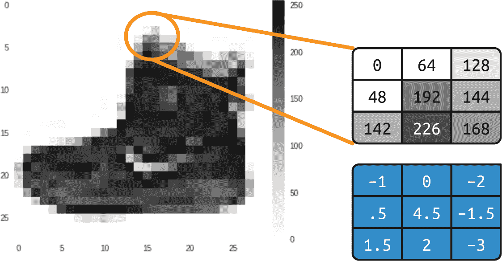
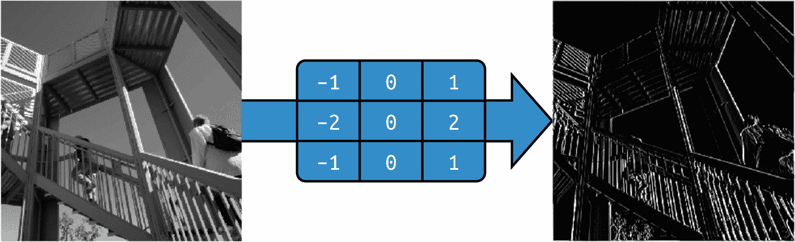
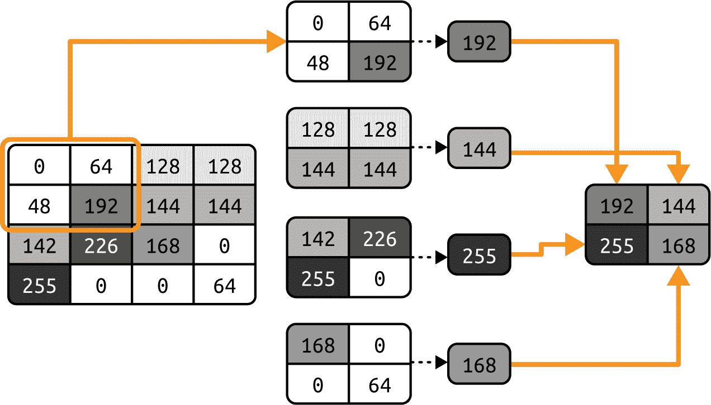
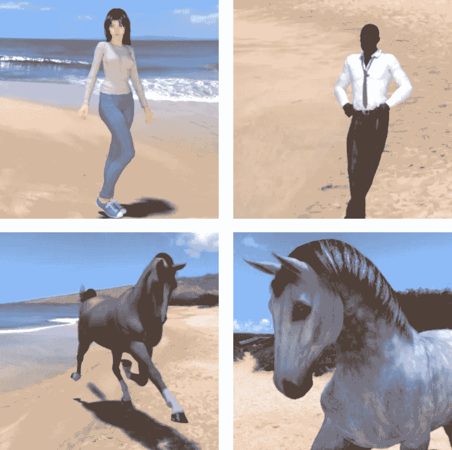

# 第三章\. 超越基础：检测图像中的特征

在第二章中，你学习了如何通过创建一个简单的神经网络来开始计算机视觉之旅，该神经网络将 Fashion MNIST 数据集的输入像素与 10 个标签相匹配，每个标签代表一种（或一类）服装。虽然你创建了一个在检测服装类型方面相当不错的网络，但有一个明显的缺点。你的神经网络是在小单色图像上训练的，每个图像只包含一件服装，而且每件服装都在图像中居中。

为了将模型提升到下一个层次，你需要它能够检测图像中的*特征*。所以，例如，如果我们能够将图像过滤到构成元素，那会怎么样？匹配这些元素而不是原始像素，将有助于模型更有效地检测图像内容。例如，考虑我们在上一章中使用的 Fashion MNIST 数据集。在检测鞋子时，神经网络可能被图像底部聚集的大量暗色像素激活，它将看到这是鞋底。但如果鞋子没有居中且填满整个画面，这种逻辑就不成立了。

检测特征的一种方法来源于摄影和图像处理方法，这些方法你可能已经熟悉。如果你曾经使用过像 Photoshop 或 GIMP 这样的工具来锐化图像，你就已经使用了一个作用于图像像素的数学滤波器。这些滤波器所执行的操作另一个词叫*卷积*，通过在神经网络中使用这样的滤波器，你会创建一个*卷积神经网络* (CNN)。

在本章中，你将首先学习如何使用卷积来检测图像中的特征。然后，你将深入了解基于图像内部特征进行图像分类。我们还将探讨图像增强以获取更多特征，以及迁移学习，即利用他人学习到的现有特征，然后我们将简要探讨通过使用 dropout 来优化你的模型。

# 卷积

*卷积*简单来说就是一组权重，这些权重用于将一个像素与其邻居相乘以得到该像素的新值。例如，考虑来自 Fashion MNIST 的踝靴图像及其像素值（见图 3-1）。



###### 图 3-1\. 带卷积的踝靴

如果我们查看选择区域中间的像素，我们可以看到它的值是 192。（回想一下，Fashion MNIST 使用的是单色图像，像素值从 0 到 255。）上面的像素值是 0，直接上面的像素值是 64，等等。

如果我们然后在下面的原始值下方定义一个 3 × 3 的网格中的滤波器，就像下面所示，我们可以通过计算其新值来转换该像素。我们通过将网格中每个像素的当前值乘以滤波器网格中相同位置的值，然后求和来实现这一点。这个总和将是当前像素的新值，然后我们重复这个过程来计算图像中所有像素的新值。

因此，在这种情况下，虽然选择中心像素的当前值为 192，但我们通过以下方式计算应用滤波器后的新值：

```py
new_val = (–1 * 0) + (0 * 64) + (–2 * 128) + 
     (.5 * 48) + (4.5 * 192) + (–1.5 * 144) + 
     (1.5 * 142) + (2 * 226) + (–3 * 168)
```

结果等于 577，这将是像素的新值。对图像中的每个像素重复此过程将给我们一个过滤后的图像。

现在，让我们考虑在一个更复杂的图像上应用滤波器的影响：具体来说，是 SciPy 内置的[上升图像](https://oreil.ly/wP8TE)，便于测试。这是一张 512 × 512 的灰度图像，显示了两个人在爬楼梯。

使用左侧具有负值、右侧具有正值和中间为零的滤波器，最终会从图像中移除大部分信息，除了垂直线（参见图 3-2）。



###### 图 3-2\. 使用滤波器提取垂直线

同样，对滤波器进行微小的调整可以强调水平线（参见图 3-3）。


###### 图 3-3\. 使用滤波器提取水平线

这些例子也表明，图像中的信息量减少了。因此，我们可能可以*学习*一组将图像减少到特征的滤波器，而这些特征可以像以前一样与标签匹配。以前，我们学习了用于匹配输入到输出的神经元参数，同样，我们可以随着时间的推移学习最佳的滤波器来匹配输入到输出。

当我们将卷积与池化结合使用时，我们可以在保持特征的同时减少图像中的信息量。我们将在下一节中探讨这一点。

# 池化

*池化*是在保持图像内容语义的同时消除图像中像素的过程。它最好通过视觉来解释。图 3-4 描绘了*最大池化*的概念。



###### 图 3-4\. 最大池化的示例

在这种情况下，将左侧的框视为单色图像中的像素。我们将它们分组为 2 × 2 的数组，因此在这种情况下，16 个像素被分组为四个 2 × 2 的数组。这些数组被称为*池*。

然后，我们从每个组中选择*最大*值，并将它们重新组合成一张新图像。因此，左边的像素减少了 75%（从 16 减少到 4），每个池中的最大值构成了新图像。图 3-5 显示了从图 3-2 的上升版本，在应用最大池化后，垂直线得到了增强。


###### 图 3-5\. 应用垂直滤波和最大池化后的上升

注意过滤后的特征不仅被保留，而且得到了进一步的增强。此外，图像大小已从 512 × 512 变为 256 × 256——变成了原始大小的四分之一。

###### 注意

存在其他池化的方法。这些包括*最小池化*，它从池中取最小的像素值，以及*平均池化*，它从池中取整体平均值。

# 实现卷积神经网络

在第二章中，你创建了一个能够识别时尚图像的神经网络。为了方便，这里提供了定义模型的代码：

```py
# Define the model
class FashionMNISTModel(nn.Module):
    def __init__(self):
        super(FashionMNISTModel, self).__init__()
        self.flatten = nn.Flatten()
        self.linear_relu_stack = nn.Sequential(
            nn.Linear(28*28, 128),
            nn.ReLU(),
            nn.Linear(128, 10),
            nn.LogSoftmax(dim=1)
        )

    def forward(self, x):
        x = self.flatten(x)
        logits = self.linear_relu_stack(x)
        return logits

model = FashionMNISTModel()

# Define the loss function and optimizer
loss_function = nn.NLLLoss()
optimizer = optim.Adam(model.parameters())

# Train the model
def train(dataloader, model, loss_fn, optimizer):
    size = len(dataloader.dataset)
    model.train()
    for batch, (X, y) in enumerate(dataloader):
        # Compute prediction and loss
        pred = model(X)
        loss = loss_fn(pred, y)

        # Backpropagation
        optimizer.zero_grad()
        loss.backward()
        optimizer.step()

        if batch % 100 == 0:
            loss, current = loss.item(), batch * len(X)
            print(f"loss: {loss:>7f}  
                    `[{``current``:``>``5``d``}``/``{``size``:``>``5``d``}]``")` ``` `# 训练过程` `epochs` `=` `5` `for` `t` `in` `range``(``epochs``):`     `print``(``f``"Epoch` `{``t``+``1``}``\n``-------------------------------"``)`     `train``(``train_loader``,` `model``,` `loss_function``,` `optimizer``)` `print``(``"Done!"``)` ```py
```

```py`` ````要将此转换为 CNN，你只需在我们的模型定义中在当前的线性层之上使用卷积层。你还会添加池化层。要实现卷积层，你将使用`nn.Conv2D`类型。它接受作为参数的层中要使用的卷积数量、卷积大小、激活函数等。例如，这里有一个使用此类型的卷积层：```py nn.Conv2d(1, 64, kernel_size=3, padding=1) ```。在这种情况下，我们希望层学习`64`个卷积。它将随机初始化它们，随着时间的推移，它将学习最佳的滤波器值，以匹配输入值和它们的标签。`kernel_size = 3`表示滤波器的大小。之前，我们向您展示了 3 × 3 滤波器，这就是我们在这里指定的。3 × 3 滤波器是最常见的滤波器大小。你可以根据需要更改它，但通常你会看到像 5 × 5 或 7 × 7 这样的奇数轴，因为滤波器会从图像的边缘移除像素，就像你稍后看到的那样。```py nn.MaxPool2d(kernel_size=2, stride=2) ```在图 3-4 中的示例中，我们将图像分割成 2 × 2 池，并选择每个池中的最大值。然而，我们可以使用你在这里看到的参数来定义池大小。`kernel_size=2`参数表示我们的池是 2 × 2，而`stride=2`参数表示滤波器将跳过两个像素以获取下一个池。```py # Define the CNN model class FashionCNN(nn.Module):     def __init__(self):         super(FashionCNN, self).__init__()         self.layer1 = nn.Sequential(             nn.Conv2d(1, 64, kernel_size=3, padding=1),             nn.ReLU(),             nn.MaxPool2d(kernel_size=2, stride=2))           self.layer2 = nn.Sequential(             nn.Conv2d(64, 64, kernel_size=3),             nn.ReLU(),             nn.MaxPool2d(2))  # Output: 64 x 6 x 6           self.fc1 = nn.Linear(64 * 6 * 6, 128)         self.fc2 = nn.Linear(128, 10)  # 10 classes       def forward(self, x):         out = self.layer1(x)         out = self.layer2(out)         out = out.view(out.size(0), –1)  # Flatten the output         out = self.fc1(out)         out = self.fc2(out)         return out ```现在，让我们探索完整的代码，以定义一个用于 Fashion MNIST 的 CNN 模型：```py Train Epoch: 44 -- Loss: 0.091689 Train Epoch: 45 -- Loss: 0.066864 Train Epoch: 46 -- Loss: 0.061322 Train Epoch: 47 -- Loss: 0.056557 Train Epoch: 48 -- Loss: 0.039695 Train Epoch: 49 -- Loss: 0.056213 Accuracy of the network on the 10000 test images: 91.31% ```。在这里，我们看到类有两个函数，一个用于初始化，一个在训练过程中每个 epoch 的前向传递期间将被调用。[init]简单地定义了我们神经网络中的每一层将是什么样子。第一层(`self.layer1`)将接受一维输入，有`64`个卷积，`kernel_size`为`3`，`padding`为`1`。然后它将在最大池化之前 ReLU 输出。下一层(`self.layer2`)将接受来自前一层的`64`个卷积输出，然后输出`64`个自己的输出，在 ReLU 和最大池化之前。由于`MaxPool`将图像大小减半，其输出现在将是`64 × 6 × 6`。数据随后被馈送到下一层(`self.fc1`，其中`fc`代表*全连接*)，输入是前一层的输出形状。输出是 128，这与我们在第二章中用于深度神经网络(DNN)的神经元数量相同。最后，这 128 个被馈送到最终层(`self.fc1`)，有 10 个输出——代表 10 个类别。#### 注意在 DNN 中，我们在将输入馈送到第一个`Dense`层之前，通过`Flatten`层运行输入。我们在这里丢失了它——相反，我们只是指定了 1-D 输入形状。注意，在卷积和池化之后，在第一个`Linear`层之前，数据将被展平。然后，我们在`forward`函数中堆叠这些层。我们可以看到我们得到数据`x`，并通过`layer1`传递它以获得`out`，然后将其传递到`layer2`以获得新的`out`。在这个时候，我们有我们学到的卷积，但我们需要在将它们加载到`Linear`层`fc1`和`fc2`之前将它们展平。`out = out.view(out.size(0), -1)`实现了这一点。如果我们用与我们在第二章中训练网络时相同的 50 个 epoch 来训练这个网络，我们将看到它工作得很好。我们可以在测试集上相当容易地达到 91%的准确率：```py` ```。因此，我们可以看到向神经网络添加卷积确实增加了其分类图像的能力。接下来，让我们看看图像在网络中经历的旅程，这样我们就可以更深入地了解为什么这个过程有效。#### 注意如果你使用 GitHub 上的配套代码，你会注意到我大量使用`model.to(device)`。在 PyTorch 中，如果可用加速器，你可以使用此命令请求模型和/或其数据使用加速器。```py```````py```# 探索卷积网络使用 torchsummary 库，你可以检查你的模型。当你运行它在我们一直在工作的 Fashion MNIST 卷积网络上时，你会看到类似这样的东西：``` from torchsummary import summary model = FashionCNN().to(device)  summary(model, input_size=(1, 28, 28))  # (Channels, Height, Width) ----------------------------------------------------------------         Layer (type)               Output Shape         Param # ================================================================             Conv2d-1           [–1, 64, 28, 28]             640               ReLU-2           [–1, 64, 28, 28]               0          MaxPool2d-3           [–1, 64, 14, 14]               0             Conv2d-4           [–1, 64, 12, 12]          36,928               ReLU-5           [–1, 64, 12, 12]               0          MaxPool2d-6             [–1, 64, 6, 6]               0             Linear-7                  [–1, 128]         295,040             Linear-8                   [–1, 10]           1,290 ================================================================ Total params: 333,898 Trainable params: 333,898 Non-trainable params: 0 ---------------------------------------------------------------- Input size (MB): 0.00 Forward/backward pass size (MB): 1.02 Params size (MB): 1.27 Estimated Total Size (MB): 2.30 ```。让我们首先看看`Output Shape`列，以了解这里发生了什么。我们的第一层将具有 28 × 28 图像，并对其应用 64 个滤波器。但由于我们的滤波器是 3 × 3，图像周围的一个像素边框通常会丢失，使我们的总信息减少到 26 × 26 像素。然而，因为我们使用了`padding=1`参数，图像被人工膨胀到 30 × 30，这意味着其输出将是正确的 28 × 28，并且不会丢失信息。如果你不填充图像，你最终会得到图 3-6 中的结果。如果我们把每个框当作图像中的一个像素，第一个可能的滤波器可以从第二行和第二列开始。同样，在图的右侧和底部也会发生这种情况。#### 图 3-6\. 运行滤波器时丢失像素因此，一个形状为*a* × *b*像素的图像在通过 3 × 3 滤波器时将变成(*a* – 2) × (*b* – 2)像素的形状。同样，5 × 5 滤波器将使其变成(*a* – 4) × (*b* – 4)，依此类推。因为我们使用的是 28 × 28 图像和 3 × 3 滤波器，所以我们的输出现在将是 26 × 26。但由于我们填充了图像到 30 × 30（再次，为了防止信息丢失），输出现在是 28 × 28。在那之后，池化层将是 2 × 2，所以图像在每个轴上的大小将减半，然后变成 14 × 14。下一个卷积层不使用填充，所以它将进一步将其减少到 12 × 12，下一个池化将输出 6 x 6。因此，当图像通过两个卷积层时，结果将是许多 6 × 6 图像。有多少个？我们可以在`Param #`（参数数量）列中看到。每个卷积是一个 3 × 3 滤波器，加上一个偏差。记住，在我们之前的密集层中，每个层都是*y* = *wx* + *b*，其中*w*是我们的参数（也称为权重）和*b*是我们的偏差？这个情况非常相似，只是因为滤波器是 3 × 3，所以有 9 个参数要学习。鉴于我们定义了 64 个卷积，我们将有 640 个总参数。（每个卷积有 9 个参数加上一个偏差，总共 10 个，有 64 个。）`ReLU 和 MaxPooling`层不学习任何东西；它们只是减少图像，所以那里没有学习的参数——因此，报告了 0 个。下一个卷积层有 64 个滤波器，但每个滤波器都乘以*前面的*64 个滤波器，每个滤波器都有 9 个参数。我们在每个新的 64 个滤波器上都有一个偏差，所以我们的参数数量应该是(64 × (64 × 9)) + 64，这给我们 36,928 个网络需要学习的参数。如果这很令人困惑，尝试将第一层的卷积数量更改为其他值——例如，10。你会看到第二层的参数数量变为 5,824，这是(64 × (10 × 9)) + 64)。当我们通过第二个卷积时，我们的图像是 6 × 6，我们有 64 个这样的图像。如果我们乘以这个数字，我们将有 1,600 个值，我们将它们馈送到一个有 128 个神经元的密集层。每个神经元都有一个权重和一个偏差，我们将有 128 个这样的神经元，所以网络需要学习的参数数量是((6 × 6 × 64) × 128) + 128，这给我们 295,040 个参数。然后，我们的最终密集层有 10 个神经元，它将接受来自前一层的 128 个输出，所以学习的参数数量将是(128 × 10) + 10，即 1,290。总参数数量将是所有这些的总和：333,898。训练这个网络需要我们学习最佳的 333,898 个参数集，以匹配输入图像和它们的标签。这是一个较慢的过程，因为参数更多，但正如我们从结果中可以看到的那样，它也构建了一个更准确的模型！当然，对于这个数据集，我们仍然有图像是 28 × 28、单色和居中的限制。因此，接下来我们将看看如何使用卷积来探索一个更复杂的数据集，该数据集包含马和人的彩色图片，我们将尝试使模型确定图像是否包含一个或另一个。在这种情况下，主题不会像 Fashion MNIST 那样总是在图像中居中，所以我们将不得不依赖于卷积来识别区分特征。# 使用 CNN 区分马和人在这部分，我们将探索比 Fashion MNIST 分类器更复杂的场景。我们将扩展我们对卷积和 CNN 的了解，以尝试对图像内容进行分类，其中特征的位置不总是在相同的位置。我为此目的创建了“Horses or Humans”数据集。## “Horses or Humans”数据集[本节的数据集](https://oreil.ly/8VXwy)包含超过一千张 300 × 300 像素的图像。大约一半的图像是马，另一半是人——并且它们都以不同的姿势呈现。你可以在图 3-7 中看到一些示例。#### 图 3-7\. 马和人，如你所见，主题有不同的方向和姿势，图像构图也各不相同。以两匹马为例，例如——它们的头部方向不同，一张图像被缩小了（显示整个动物），而另一
