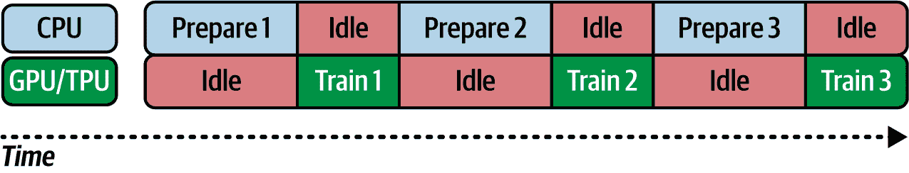

# 第四章\. 使用 PyTorch 的数据

在本书的前三章中，你使用各种数据训练模型，从通过 API 方便地捆绑的 Fashion MNIST 数据集，到基于图像的“马或人”和“狗与猫”数据集，这些数据集作为 ZIP 文件提供，你需要下载并预处理。因此，到现在你可能已经意识到，有无数种方式获取用于训练模型的数据。

然而，许多公共数据集要求你在开始考虑模型架构之前学习很多不同的领域特定技能。PyTorch 领域和`torch.utils.data.Datasets`命名空间中提供的工具背后的目标是以一种易于消费的方式公开数据集，其中获取数据和将其转换为 PyTorch 友好的 API 的所有预处理步骤都为你完成。

你已经在第二章中看到 PyTorch 如何处理 Fashion MNIST，对此进行回顾，你获取数据所需要做的只是以下这些：

```py
train_dataset = datasets.FashionMNIST(root='./data', train=True,
                             download=True, transform=transform)

```

在这个数据集的情况下，我们还从 torchvision 库中导入以获取包含 Fashion MNIST 引用的数据集对象：

```py
from torchvision import datasets
```

由于这是一个面向计算机视觉的数据集，它位于 torchvision 库中是有道理的。

PyTorch 有许多其他不同类型的数据集，可以以相同的方式加载。以下是一些：

视觉

Fashion MNIST 位于前面提到的 torchvision 库中。它是“图像分类”内置数据集之一，但还有更多适用于其他场景的数据集，如图像检测、分割、光流、立体匹配、图像配对、图像描述、视频分类、视频预测等。

文本

在 torchtext 库中可以找到常见的文本数据集。这里列出的太多，无法一一列举，但包括文本分类、语言模型、机器翻译、序列标注、问答和未监督学习等。更多详情可以在[PyTorch 文档](https://oreil.ly/aFamN)中找到。请注意，这个库不仅限于数据集；它还包含许多辅助函数，这些函数在处理文本时你会用到。

*音频*

torchaudio 库包含许多数据集，可以在机器学习场景中用于声音或语音。详细信息可以在[PyTorch 文档](https://oreil.ly/tvDe4)中找到。

所有数据集都是`torch.utils.data.Dataset`的子类，因此查看这个库并深入了解它非常重要。这将帮助你不仅消费现有的数据集，还可以创建自己的数据集与他人分享。

# 开始使用数据集

`torch.utils.data.Dataset`是一个表示数据集的抽象类。要创建自定义数据集，你只需将其子类化并实现这些方法：

```py
__len__(self) 
```

这应该返回你数据集中的项目总数：

```py
__getitem__(self, index) 
```

这应该从你的数据集中返回指定索引的单个项目。在将其发送到模型之前，该项目将被转换。

以下是一个示例：

```py
from torch.utils.data import Dataset

class CustomDataset(Dataset):
    def __init__(self, data, transforms=None):
        self.data = data
        self.transforms = transforms

    def __len__(self):
        return len(self.data)

    def __getitem__(self, idx):
        sample = self.data[idx]
        if self.transforms:
            sample = self.transforms(sample)
        return sample
```

在非常低级别上，数据本身位于名为`data[]`的数组中。现在，想象一下，我们想要创建一个具有*x*值和*y*值之间线性关系的数据集，就像我们在第一章中看到的那样。我们该如何使用它？

假设我们从一个简单的合成数据开始，如下所示：

```py
# Generate synthetic data
torch.manual_seed(0)  # For reproducibility
x = torch.arange(0, 100, dtype=torch.float32)
y = 2 * x – 1
```

然后，我们可以将其转换为如下所示的数据集：

```py
class CustomDataset(Dataset):
    def __init__(self, x, y):
        """
 Initialize the dataset with x and y values.
 Arguments:
 x (torch.Tensor): The input features.
 y (torch.Tensor): The output labels.
 """
        self.x = x
        self.y = y

    def __len__(self):
        """
 Return the total number of samples in the dataset.
 """
        return len(self.x)

    def __getitem__(self, idx):
        """
 Fetch the sample at index `idx` from the dataset.
 Arguments:
 idx (int): The index of the sample to retrieve.
 """
        return self.x[idx], self.y[idx]
```

然后，为了使用数据集，我们只需创建一个类的实例，用我们的*x*和*y*值初始化它，将其传递给一个`DataLoader`，并枚举它：

```py
# Create an instance of CustomDataset
dataset = CustomDataset(x, y)

# Use DataLoader to handle batching and shuffling
data_loader = DataLoader(dataset, batch_size=10, shuffle=True)

# Iterate over the DataLoader
for batch_idx, (inputs, labels) in enumerate(data_loader):
    print(f"Batch {batch_idx+1}")
    print("Inputs:", inputs)
    print("Labels:", labels)
    # Break after the first batch for demonstration
    if batch_idx == 0:
        break
```

在这个基础上，你现在可以探索自本章开始以来在各个库中提供的数据集类。鉴于它们将基于或扩展此类，API 应该看起来很熟悉。

# 探索 FashionMNIST 类

在本书的早期，我们看到了`FashionMNIST`类——它提供了访问 Fashion-MNIST 数据集的权限，这是一个包含 10 类服装 60,000 个示例的训练集，以及一个包含 10,000 个示例的配套测试集。每个示例都是一个 28 × 28 的灰度图像。

在这个数据集的情况下，无论你是使用训练数据还是测试/验证数据，你都会使用相同的类，而你接收到的数据基于传递给它的`train`参数。以下是一个示例：

```py
# Create the FashionMNIST dataset
fashion_mnist_train = datasets.FashionMNIST(root='./data', train=True, 
                                   download=True, transform=transform)
```

当你设置`train=True`时，覆盖类初始化方法的代码将获取 60,000 条记录并将其返回给调用者。其他参数包括指定数据应存放的根目录，甚至是否下载数据。最后，正如你通常在下载数据时看到的，还有`transform=`参数。正如你在前面的基类中看到的，当设置此参数时，它将作为所有数据集的可选参数，并在设置时应用转换。

# 通用数据集类

你可能需要使用在数据集类中不可用的某些数据，例如`FashionMNIST`，但你也会想利用数据生态系统中的一切——例如，转换你的数据的能力，像拆分这样的东西，以及你将在本章后面看到的`DataLoader`类中的所有好东西。为此，`torch.utils.data`提供了一系列通用的数据集类，你可以使用。

## ImageFolder

在第三章中，我们使用了“马或人”、“石头、剪刀、布”和“猫对狗”数据集，这些数据集不是直接作为类提供的，而是作为包含图像的 ZIP 文件。当我们下载并将它们保存到不同图像类型的子目录中（例如，“马”一个文件夹，“人”另一个文件夹）时，通用的`ImageFolder`数据集类可以充当我们的数据集。

在这种情况下，图像是通过 `DataLoader` 从目录中按批大小和其他规则流式传输的。标签是从目录名称派生出来的，相关的类索引是按字母顺序排列的标签。所以，“Horses” 将是类别 0，“Humans” 将是类别 1。请注意，在构建和调试时要注意这一点，因为你可能会错过这种排序！

例如，我们倾向于按此顺序说“石头，剪刀，布”，因此我们预计它们分别是类别 0、1 和 2。但在字母顺序中，纸张将是类别 0，石头将是类别 1，剪刀将是类别 2！

###### 小贴士

用于此目的的一个工具是创建一个如下所示的定制索引：

```py
custom_class_to_idx = {'rabbit': 0, 'dog': 1, 'cat': 2}
dataset = ImageFolder(
  root='data/animals',
  target_transform=
    lambda x: custom_class_to_idx[dataset.classes[x]]
)
dataset.class_to_idx = custom_class_to_idx
print(dataset.class_to_idx)
```

## DatasetFolder

`ImageFolder` 实际上是更通用的 `DatasetFolder` 类的一个子类，它针对图像进行了定制。`DatasetFolder` 类不仅限于图像数据，你可以用它来处理任何东西。它还允许你使用目录作为标签。例如，假设你有一些包含不同类别文本的文本文件，其目录结构如下：

```py
root/sarcasm/document1.txt
root/sarcasm/document2.txt
root/sarcasm/document3.txt
root/factual/factdoc1.rtf
root/factual/factdoc2.doc
```

然后，你可以使用 `DatasetFolder` 按正确的标签流式传输文档。此外，因为这个类是基于文档的，所以你可以应用转换来从文件中提取信息！

## FakeData

`FakeData` 是一个有用的通用数据集，正如其名称所暗示的，为你提供虚假数据。在撰写本文时，它仅支持创建虚假图像数据。如果你没有数据但想实验不同的架构，或者如果你想对你的系统进行基准测试，它也非常有用。

你可以使用 `FakeData` 的方式使用你在这本书中看到的任何数据集。例如，如果你想为使用 224 × 224 彩色图像的 MobileNet 模型创建一组 `FakeData`，你可以用如下代码实现：

```py
import torch
from torchvision.datasets import FakeData
import torchvision.transforms as transforms
from torch.utils.data import DataLoader

# Define transformations (if needed)
transform = transforms.Compose([
    transforms.ToTensor(),  
    transforms.Normalize((0.5,), (0.5,))  
])

# Create FakeData
fake_dataset = FakeData(size=100, image_size=(3, 224, 224), 
                        num_classes=10, transform=transform)

# DataLoader
data_loader = DataLoader(fake_dataset, batch_size=10, shuffle=True)
```

这将创建 100 张所需尺寸的包含噪声的图像，并将它们分布在 10 个类别中。然后，你可以像使用任何其他数据集一样在 `DataLoader` 中使用这些数据。

虽然 `FakeData` 只提供图像类型，但你相对容易地创建自己的 CustomData（如我们之前所看到的）以提供其他格式的虚假数据，例如数值或序列数据。

# 使用自定义拆分

到目前为止，你用来构建模型的所有数据都已经预先为你分割成训练集和测试集。例如，对于 Fashion MNIST，你有 60,000 和 10,000 条记录。但如果你不想使用这些分割怎么办？如果你想根据自己的需求来分割数据怎么办？

幸运的是，在使用数据集时，你可以通常通过一个简单直观的 API 来完成这些操作。

例如，当你之前加载 `FashionMNIST` 类时，你指定了 `train` 参数以获取训练数据（60,000 条记录）或测试数据（10,000 条记录）。

要覆盖这一点，你只需忽略它，你将获得所有数据：

```py
# Load the entire Fashion-MNIST dataset
dataset = datasets.FashionMNIST(root='./data', 
                                download=True, transform=transform)
```

要创建自己的拆分，你可以使用 `torch.utils.data` 命名空间，其中包含一个名为 `random_split` 的函数。例如，如果你想有一个 `FashionMNIST` 不提供的验证集，你可以使用 `random_split` 将数据集分成三个数据集。以下代码将 70%的数据分配给训练集，15%分配给测试集，15%分配给验证集：

```py
from torch.utils.data import random_split

total_count = len(dataset)
train_count = int(0.7 * total_count)
val_count = int(0.15 * total_count)

# Ensures all data is used
test_count = total_count – train_count – val_count  

train_dataset, val_dataset, test_dataset = 
     random_split(dataset, [train_count, val_count, test_count])
```

如你所见，这个过程相当直接。我们获取数据集中的记录数作为 `total_count`，然后计算其中的 70%（总计数乘以 0.7）作为训练计数，15%作为验证计数。在执行此类计算时，你可能会遇到舍入错误，导致一些记录被排除在外——因此，对于测试计数，你只需将训练的商设置为总数减去训练和验证记录。这将确保所有数据都被使用，没有浪费。

这种方法的真正好处是，它为你提供了一个非常简单的方法来获取数据集的新切片和不同切片。随着你训练模型，它为你提供了一个新的方法来评估它们的准确性。

例如，数据集的一个切片可能在高精度下训练，而另一个切片在低精度下训练，这表明你的模型架构可能存在一些问题，导致它在某个数据集上过拟合。另一方面，如果你尝试多个不同的数据集拆分，并且模型训练和验证结果一致，那么这将是一个信号，表明你的架构是合理的。

我肯定会鼓励你在训练模型时使用自定义拆分，因为它真的可以帮助你克服一些难题！

在使用自定义拆分时，还有一点需要考虑的是，名称 `random` 并不意味着这种方法会 *洗牌* 或随机化你的数据集。它只是在随机点切割数据集，以便每次都提供不同的切片。如果你还想对数据集进行洗牌，你可以在数据加载器中这样做，我们将在下一节中探讨。

# 机器学习中管理数据的 ETL 过程

*提取、传输、加载*（ETL）是训练机器学习模型的核心理念，无论规模大小。我们在本书中探索了小规模、单机模型构建，但我们可以使用相同的技术在多台机器上执行大规模训练，并处理大量数据集。

提取、传输、加载（ETL）过程由其名称中的三个阶段组成：

提取阶段

当原始数据从存储位置加载并准备以进行转换时，就会发生这种情况。

转换阶段

当数据以使其适合或改进训练的方式进行操作时，就会发生这种情况。例如，批处理、图像增强、映射到特征列以及其他应用于数据的此类逻辑可以被认为是这一阶段的一部分。

加载阶段

这发生在数据被加载到神经网络进行训练时。

考虑我们用来训练“马或人”分类器的 第三章 中的代码。在代码的顶部，你看到了这样的片段：

```py
# Define transformations
train_transform = transforms.Compose([
    transforms.Resize((150,150)),
    transforms.RandomHorizontalFlip(),
    transforms.RandomRotation(20),
    transforms.RandomAffine(
        degrees=0,  # No rotation
        translate=(0.2, 0.2),  # Translate up to 20% x and y
        scale=(0.8, 1.2),  # Zoom in or out by 20%
        shear=20,  # Shear by up to 20 degrees
    ),
    transforms.ToTensor(),
    transforms.Normalize(mean=[0.5, 0.5, 0.5], std=[0.5, 0.5, 0.5]),
])

# Load the datasets
train_dataset = datasets.ImageFolder(root=training_dir, 
                                     transform=train_transform)
val_dataset = datasets.ImageFolder(root=validation_dir, 
                                   transform=train_transform)

# Data loaders
train_loader = DataLoader(train_dataset, batch_size=32, shuffle=True)
val_loader = DataLoader(val_dataset, batch_size=32, shuffle=True)
```

这就是代码中体现的 ETL 模式！

代码首先定义了 `transform`（“T”），但活跃的代码直到 `Load the datasets` 注释下的行才开始。仔细看看这里，你会看到 `ImageFolder` 正在被用来 *提取* 数据，这些数据位于磁盘上的静态位置。

然后，随着数据的提取，我们定义的 `transform` 被应用。

然后，在 `Data loaders` 注释下，我们使用定义好的 `train_loader` 和 `val_loader` 来执行数据的 *加载*。严格来说，实际的加载直到我们执行训练循环以从加载器中提取数据时才会发生。

了解这一点很重要，使用这个过程可以使你的数据管道对数据及其底层模式的变化不那么敏感。当你使用这种方法提取数据时，无论数据是否足够小以适应内存，或者足够大以至于即使在简单的机器上也无法容纳，都会使用相同的底层结构。应用转换的 API 也是一致的，所以无论底层数据源如何，你都可以使用类似的 API。当然，一旦数据被转换，加载数据的过程也是一致的，无论你的训练后端是什么。

然而，你如何加载数据可能会对你的训练速度产生巨大影响。让我们接下来看看这一点。

# 优化加载阶段

当你在训练模型时，让我们更仔细地看看 ETL 流程。我们可以认为数据的提取和转换可以在任何处理器上进行，包括 CPU。实际上，你在这些阶段使用的代码来执行诸如下载数据、解压缩以及逐条记录地处理这些记录的任务并不是 GPU 和 TPU 设计来完成的，所以代码很可能会在 CPU 上执行。然而，当涉及到训练时，你可以从 GPU 或 TPU 获得巨大的好处，所以如果可能的话，使用一个来处理这个阶段是有意义的。因此，在你有 GPU 或 TPU 的情况下，理想情况下你应该在 CPU 和 GPU/TPU 之间分配工作量，提取和转换在 CPU 上进行，而加载在 GPU/TPU 上进行。

如果你探索这本书中使用的代码，你会注意到我们使用了 `.to(device)` 方法。无论你是在处理训练或推理，并且希望数据或模型在加速器上，你都会看到类似 `.to(“cuda”)` 的内容，但对于提取和转换，你不会看到它，因为这会浪费 GPU 的资源。

假设你正在处理一个大型数据集。假设它非常大，以至于你必须分批准备数据（即进行提取和转换），你最终会得到如图 图 4-1 所示的情况。当第一批数据正在准备时，GPU 或 TPU 是空闲的。然后，当该批次准备好后，你可以将其发送到 GPU/TPU 进行训练，但此时 CPU 将处于空闲状态，直到训练完成并开始准备第二批数据。这里有大量的空闲时间，因此我们可以看到有优化的空间。



###### 图 4-1\. 在 CPU 或 GPU/TPU 上进行训练

合理的解决方案是在并行中进行工作，同时准备和训练。这个过程被称为*流水线*，如图 图 4-2 所示。


###### 图 4-2\. 流水线

在这种情况下，当 CPU 准备第一批数据时，GPU/TPU 再次没有工作可做，因此处于空闲状态。当第一批数据准备完毕后，GPU/TPU 可以开始训练——但是在此过程中，CPU 将准备第二批数据。当然，训练批次 *n* – 1 和准备批次 *n* 所需的时间不一定相同，如果训练时间较短，你将在 GPU/TPU 上有闲置时间，如果训练时间较长，你将在 CPU 上有闲置时间。选择正确的批次大小可以帮助你在这里进行优化——由于 GPU/TPU 时间可能更昂贵，你可能会想尽可能减少其闲置时间。

这是我们使用批处理的原因之一，即使是像 MNIST 这样的简单示例：流水线模型已经就位，因此无论你的数据集有多大，你都会继续使用一致的 ETL 模式。

# 使用 DataLoader 类

我们已经多次看到了 `DataLoader` 类，但现在深入了解一下它，可以帮助你在机器学习工作流程中充分利用它。它提供了以下你可以使用的功能。

## 批处理

直观地，你可能认为前向传递一次处理一个数据项。你*可以*这样做，但一些优化器，如随机梯度下降，当输入以批次形式传递时，效果会更好，这样它们可以更准确地计算。批处理还可以加快你在使用固定内存大小的 GPU 上的训练速度。最有效的方法是通过拥有一个完全适合该内存的数据批次来最大化使用该内存。如果你使用 `DataLoader`，批处理只是设置一个参数的问题。

## 打乱顺序

打乱数据顺序非常重要，尤其是在进行批处理时。考虑以下类似于 Fashion MNIST 的场景。

你有 10 个类别，每个类别有 60,000 个样本，它们没有被打乱。你一次批处理一千条记录，所以你的第一个批次的一千条记录都是类别 0，第二个批次都是类别 1，以此类推。在这种情况下，模型可能无法有效地学习，因为每个批次都偏向于特定的标签——但如果批次被打乱，意味着你的前一千个物品将具有不同的标签等，那么你的模型泛化的能力将会提高。

## 并行数据加载

通常，尤其是在处理复杂数据时，将数据加载到模型中进行正向传递可能会很耗时。但是`DataLoader`类通过 Python 的进程池模型提供了并行性，这可以显著加快这个过程。

正如你之前看到的，你应该将数据加载/转换和模型学习视为两个独立的过程。你想要避免模型训练没有数据可用而闲置等待数据加载的情况，也想要避免内存中有大量数据但模型无法访问的情况。当数据加载并行化调优得当，这里可能会有所帮助，你可以学习一项技能来确保通过在峰值效率下运行来获得最佳的训练效果。你将在下一节中学习如何做到这一点。

## 自定义数据采样

除了随机数据采样时的打乱，你还可以创建自定义数据采样，其中你可以指定数据如何被加载。`torch.utils.data.Sampler`类提供了一个基类，你可以在其上构建自定义采样器。这个过程超出了本书的范围，但网上有许多关于它的优秀示例。

# 通过并行化 ETL 来提高训练性能

如果你正在使用`DataLoader`类，你可以通过使用`num_workers`参数轻松实现并行化。例如，假设你想在`CIFAR10`数据集上训练一个模型，并且你想使用并行训练。让我们一步一步地看看如何做这件事。

首先，我们将探索提取和转换步骤：

```py
import torchvision.transforms as transforms
from torchvision.datasets import CIFAR10

# Define transformations
transform = transforms.Compose([
    transforms.ToTensor(),
    transforms.Normalize((0.5, 0.5, 0.5), (0.5, 0.5, 0.5))
])

# Load CIFAR10 dataset
dataset = CIFAR10(root='./data', train=True, download=True, transform=transform)
```

然后，我们将配置并创建 DataLoader 到加载步骤：

```py
from torch.utils.data import DataLoader

# DataLoader with multiple workers
data_loader = DataLoader(dataset, batch_size=64, shuffle=True, 
                         `num_workers``=``4`)
```

注意`num_workers=4`参数，这将创建四个子进程来并行同时加载数据。根据你拥有的硬件、核心数量以及 CPU 的速度等因素，你可以尝试调整这个数字以减少整体瓶颈。

这个方法的真正好处是 ETL 过程被巧妙地封装在其中，所以你的模型训练循环不需要任何改变，即使你是通过并行化来加载数据！以下是使用此数据的简单`CIFAR`模型的代码：

```py
import torch

# Dummy model and optimizer setup
model = torch.nn.Sequential(
    torch.nn.Linear(3 * 32 * 32, 500),
    torch.nn.ReLU(),
    torch.nn.Linear(500, 10)
)
optimizer = torch.optim.Adam(model.parameters(), lr=0.001)
criterion = torch.nn.CrossEntropyLoss()

# Training loop
def train(model, data_loader):
    model.train()
    for batch_idx, (inputs, targets) in enumerate(data_loader):
        # Reshape inputs to match the model's expected input
        inputs = inputs.view(inputs.size(0), –1)

        # Forward pass
        outputs = model(inputs)
        loss = criterion(outputs, targets)

        # Backward pass and optimize
        optimizer.zero_grad()
        loss.backward()
        optimizer.step()

        if batch_idx % 100 == 0:
            print(f"Train Epoch: {batch_idx} Loss: {loss.item()}")

train(model, data_loader)
```

并行化是你在训练模型时可以使用的另一个工具。没有一种适合所有情况的解决方案，但当你遇到训练速度减慢时，这是一个很好的工具。很容易认为训练速度慢只是因为网络架构的原因，但你可能会惊讶地发现，有很大一部分时间被前向传递等待新数据浪费了！通过添加这种并行性，你有潜力大大加快训练速度。

# 摘要

本章介绍了 PyTorch 中的数据生态系统，并介绍了 `dataset` 和 `DataLoader` 类。你看到了它们如何使用通用的 API 和通用的格式来帮助减少你需要编写的代码量，以便访问数据，你也看到了如何使用 ETL 流程，这是 PyTorch 训练模型时通用设计模式的核心。特别是，我们探讨了并行化数据的提取、转换和加载，以提高训练性能。

现在你已经有机会查看这个过程了，看看你能否创建自己的数据集！也许可以从你相册中的照片、一些测试，或者像我们这里一样随机噪声中创建。

在下一章中，你将把到目前为止学到的知识应用到自然语言处理问题上。
