# 第六章\. 通过使用嵌入使情感可编程

在第五章中，你看到了如何将单词编码成标记。然后，你看到了如何将充满单词的句子编码成充满标记的序列，根据需要填充或截断它们，以得到一个形状良好的数据集，你可以用它来训练神经网络。然而，在那之中没有任何对单词*意义*的建模。虽然确实没有能够封装意义的绝对数值编码，但存在相对的编码。

在本章中，你将了解封装意义的技术，特别是*嵌入*的概念，其中在多维空间中创建向量来表示单词。这些向量的方向可以根据语料库中单词的使用情况随时间学习。然后，当你得到一个句子时，你可以调查单词向量的方向，将它们相加，并从总和的整体方向中，确定句子的情感作为其单词的产物。此外，与此相关的是，当模型扫描句子时，句子中单词的位置也可以帮助训练适当的嵌入。

在本章中，我们还将探讨它是如何工作的。使用来自第五章的“用于讽刺检测的新闻标题数据集”，你将构建嵌入来帮助模型检测句子中的讽刺。你还将使用一些酷炫的可视化工具，这些工具可以帮助你理解语料库中的单词是如何映射到向量上的，这样你就可以看到哪些单词决定了整体的分类。

# 从单词中建立意义

在我们深入到用于嵌入的高维向量之前，让我们用一些简单的例子来尝试可视化从数值中推导出意义。考虑这个：使用来自第五章的讽刺数据集，如果你用正数编码构成讽刺标题的所有单词，而用负数编码构成现实标题的所有单词，会发生什么？

## 简单示例：正面和负面

以数据集中这个讽刺性的标题为例：

```py
christian bale given neutered male statuette named oscar
```

假设我们词汇表中的所有单词的初始值都是 0，我们可以给这个句子中的每个单词的值加 1，最终我们会得到这个：

```py
{ "christian" : 1, "bale" : 1, "given" : 1, "neutered": 1, "male" : 1, 
  "statuette": 1, "named" : 1, "oscar": 1}
```

###### 注意

这与你在上一章中进行的*分词*不同。你可以考虑将每个单词（例如，*christian*）替换为其由语料库编码的标记表示，但为了使代码更容易阅读，我现在将保留这些单词。

然后，在下一步中，考虑一个普通的标题（不是一个讽刺性的标题），例如这个：

```py
gareth bale scores wonder goal against germany
```

因为这是一个不同的情感，我们可以从每个词的当前值中减去 1，所以我们的值集看起来会是这样：

```py
{ "christian" : 1, "bale" : 0, "given" : 1, "neutered": 1, "male" : 1,
  "statuette": 1, "named" : 1, "oscar": 1, "gareth" : –1, "scores": –1,
  "wonder" : –1, "goal" : –1, "against" : –1, "germany" : –1}
```

注意，讽刺的`bale`（来自`christian bale`）被非讽刺的`bale`（来自`gareth bale`）所抵消，所以它的分数最终为 0。重复这个过程数千次，你将得到一个巨大的单词列表，这些单词根据它们在语料库中的使用情况进行了评分。

现在，想象我们想要确定这个句子的情感：

```py
neutered male named against germany, wins statuette!
```

使用我们现有的值集，我们可以查看每个词的分数并将它们加起来。我们会得到 2 分的分数，这表明（因为它是一个正数）这是一个讽刺的句子。

###### 注意

值得注意的是，在讽刺数据集中，“bale”这个词被使用了五次，在正常标题中出现了两次，在讽刺标题中出现了三次。所以，在这种模型中，“bale”这个词在整个数据集中会被评分为一 1。

## 深入一点：向量

希望前面的例子已经帮助你理解了通过与其他相同“方向”中的单词关联来为单词建立某种形式*相对*意义的心理模型。在我们的情况下，虽然计算机不理解单个单词的含义，但它可以将标记的单词从已知的讽刺标题的一个方向（通过加 1）移动，并将标记的单词从已知的正常标题的另一个方向（通过减 1）移动。这让我们对单词的含义有了基本的理解，但它确实失去了一些细微差别。

但如果我们增加方向的维度以尝试捕捉更多信息呢？例如，假设我们要查看简·奥斯汀的小说《傲慢与偏见》中的字符，考虑性别和贵族的维度。我们可以在*x*轴上绘制前者，在*y*轴上绘制后者，向量的长度表示每个角色的财富（见图 6-1）。

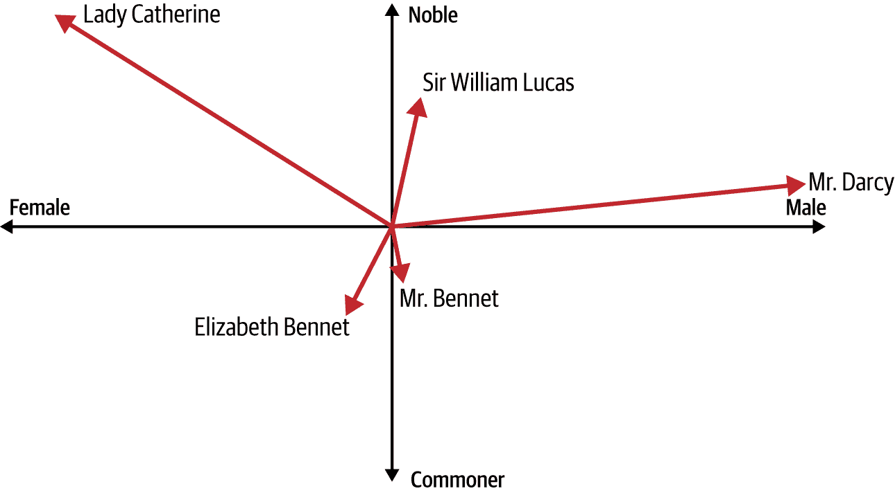

###### 图 6-1\. 《傲慢与偏见》中的角色作为向量

从图表的检查中，你可以得出关于每个角色的相当多的信息。其中三个是男性。达西先生非常富有，但他的贵族身份并不明确（他被称为“Mister”，与不那么富有但显然更贵族的威廉·卢卡斯爵士不同）。另一位“Mister”，本内特先生，显然不是贵族，并且经济上很困难。伊丽莎白·本内特，他的女儿，与他相似，但她是女性。凯瑟琳夫人，我们例子中的另一位女性角色，是贵族并且极其富有。达西先生和伊丽莎白之间的浪漫关系引起了紧张——*偏见*来自向量中贵族一方对不那么贵族一方的偏见。

如此示例所示，通过考虑多个维度，我们可以开始看到词语（在这里是角色名称）的真实含义。再次强调，我们这里讨论的不是具体的定义，而是基于轴和向量之间关系的一种*相对*含义。

这引出了“嵌入”的概念，它简单地说是在训练神经网络时学习到的词语的向量表示。我们将在下一节中探讨这一点。

# PyTorch 中的嵌入

与您所看到的`Linear`和`Conv2D`类似，PyTorch 通过使用一个层来实现嵌入。这创建了一个查找表，它将整数映射到嵌入表中，该表的内容是代表该整数的词语的向量系数。因此，在上一节中提到的《傲慢与偏见》示例中，*x*和*y*坐标将给我们提供书中特定角色的嵌入。当然，在真实的 NLP 问题中，我们将使用远超过两个维度的数据。因此，向量空间中向量的方向可以看作是编码词语的“含义”，具有相似向量的词语（即大致指向同一方向）可以被认为是与该词语相关的。

嵌入层将随机初始化——也就是说，向量的坐标最初是完全随机的，并在训练过程中通过反向传播学习。当训练完成后，嵌入将大致编码词语之间的相似性，使我们能够根据这些词语的向量方向识别出某些相似的词语。

这一切都是相当抽象的，所以我认为理解如何使用嵌入的最佳方式是亲自动手尝试。让我们从一个使用第五章中提到的讽刺数据集的讽刺检测器开始。

## 使用嵌入构建讽刺检测器

在第五章中，您加载并处理了一个名为“新闻标题数据集用于讽刺检测”（简称讽刺数据集）的 JSON 数据集。完成这些操作后，您拥有了训练数据和测试数据的列表以及标签：

```py
training_size = 28000
training_sentences = sentences[0:training_size]
testing_sentences = sentences[training_size:]
training_labels = labels[0:training_size]
testing_labels = labels[training_size:]
```

对于训练数据，您创建了一个`build_vocab`辅助函数来创建一个字典，该字典按词语频率排序。这个字典的大小是`vocab_size`。

要在 PyTorch 中获得嵌入层，您可以使用`nn.Embedding`层类型，如下所示，通过指定所需的词汇大小和嵌入维度数：

```py
nn.Embedding(vocab_size, embedding_dim)
```

这将为每个词语初始化一个具有`embedding_dim`轴的向量。例如，如果`embedding_dim`是`16`，那么词汇表中的每个词语都将被分配一个 16 维的向量。

随着时间的推移，每个标记的属性（编码为每个维度的向量值）将通过反向传播作为网络通过将训练数据与其标签匹配来学习而学习。

下一个重要步骤是将嵌入层的输出输入到一个密集层。最简单的方法，类似于使用卷积神经网络时，是使用池化。在这种情况下，嵌入的维度被平均化，以产生一个固定长度的输出向量，`AdaptiveAvePool1d(1)`将输入沿序列长度减少到固定向量大小 1。

例如，考虑以下模型架构：

```py
self.embedding = nn.Embedding(vocab_size, embedding_dim)
self.global_pool = nn.AdaptiveAvgPool1d(1)
self.fc1 = nn.Linear(embedding_dim, 24)
self.fc2 = nn.Linear(24, 1)
self.relu = nn.ReLU()
self.sigmoid = nn.Sigmoid()
```

在这里，定义了一个嵌入层，并给出了词汇大小和嵌入维度。让我们看看使用`torchinfo.summary`的网络中可训练参数的数量：

```py
==========================================================================
Layer (type:depth-idx)                   Output Shape              Param #
==========================================================================
TextClassificationModel                  [32, 1]                   --
├─Embedding: 1-1                         [32, 100, 100]            2,429,200
├─AdaptiveAvgPool1d: 1-2                 [32, 100, 1]              --
├─Linear: 1-3                            [32, 24]                  2,424
├─ReLU: 1-4                              [32, 24]                  --
├─Linear: 1-5                            [32, 1]                   25
├─Sigmoid: 1-6                           [32, 1]                   --
==========================================================================
Total params: 2,431,649
Trainable params: 2,431,649
Non-trainable params: 0
Total mult-adds (M): 77.81
==========================================================================
Input size (MB): 0.03
Forward/backward pass size (MB): 2.57
Params size (MB): 9.73
Estimated Total Size (MB): 12.32
==========================================================================
```

词汇量大小为 24,292 个单词，由于嵌入有 100 个维度，嵌入层中的可训练参数总数将是 2,429,200。第一层线性有 100 个输入值和 24 个输出值，所以总共有 2,400 个权重，但每个神经元也有一个偏差，所以加上 24 得到 24, 24\。

同样，最后一层线性有 24 个输入值，只有一个输出神经元。总共有 24 个参数，加上一个偏差，这等于 25。整个网络有 2,431,649 个参数需要学习。请注意，平均池化层没有可训练参数，因为它只是对其前面的嵌入层中的参数进行平均，以得到一个单一的 16 值向量。

如果我们训练这个模型，经过 30 个 epoch 后，我们将获得一个相当不错的训练准确率 99%+，但我们的验证准确率将低于 80%（见图图 6-2）。

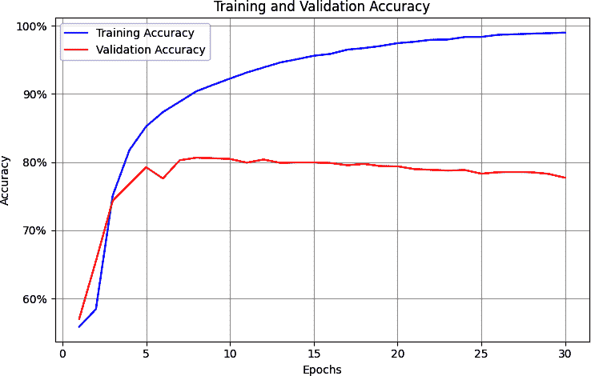

###### 图 6-2\. 训练准确率与验证准确率

考虑到验证数据可能包含许多训练数据中不存在的单词，这可能看起来是一条合理的曲线。然而，如果你检查训练与验证在一百个 epoch 中的损失曲线，你会看到一个问题。虽然你可能会期望看到训练准确率高于验证准确率，但过度拟合的一个明显迹象是，尽管验证准确率随着时间的推移略有下降（如图图 6-2 所示），但其损失却在急剧增加，如图图 6-3 所示。

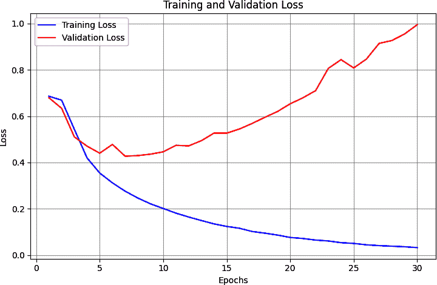

###### 图 6-3\. 训练损失与验证损失

由于语言的某种不可预测性，这种过度拟合在 NLP 模型中很常见。在接下来的几节中，我们将探讨如何通过使用多种技术来减少这种影响。

## 在语言模型中减少过度拟合

当网络对训练数据过度专业化时，会发生过拟合，这其中包括网络在训练集中匹配“噪声”数据中的模式变得非常出色，而这些模式在其他任何地方都不存在。由于这种特定的噪声在验证集中不存在，网络在匹配它方面变得越好，验证集的损失就会越差。这可能导致你在图 6-3 中看到的损失不断上升。

在本节中，我们将探讨几种泛化模型和减少过拟合的方法。

### 调整学习率

优化器的一个超参数是学习率（LR）。这个参数的细节超出了本章的范围，但可以将其视为一个值，如果太高，可能会导致网络学习得太快而错过细微之处。另一方面也是真的——如果你设置得太低，你的网络可能无法有效学习。

可能导致过拟合的最大因素是优化器的 LR 是否过高。如果是这样，那么你的网络学习得太快了。对于这个例子，定义优化器的代码如下：

```py
optimizer = optim.Adam(model.parameters(), lr=0.001, 
                       betas=(0.9, 0.999), amsgrad=False)
```

这些是`Adam`优化器的默认值。你可以尝试实验的一个参数是`学习率`（`lr`），在下面的代码中，你会看到我将学习率降低了一个数量级到 0.0001 的结果，如下所示：

```py
optimizer = optim.Adam(model.parameters(), `lr``=``0.0001`, 
                       betas=(0.9, 0.999), amsgrad=False)
```

`betas`值保持默认，`amsgrad`也是如此。请注意，两个`beta`值必须在 0 到 1 之间，通常两者都接近 1。Amsgrad 是 Adam 优化器的一种替代实现，该实现由 Sashank Reddi、Satyen Kale 和 Sanjiv Kumar 在论文“On the Convergence of Adam and Beyond”中提出（[链接](https://oreil.ly/FhTDi)）。

这个更低的学习率对网络有深远的影响。图 6-4 显示了网络在一百个 epoch 中的准确率。在最初的 10 个 epoch 左右，可以看到网络似乎没有在学习，然后“突破”并开始快速学习。

探索损失（如图 6-5 所示），我们可以看到，尽管在前几个 epoch 中准确率没有上升，但损失却在下降。因此，如果你逐个 epoch 地观察，你可以有信心网络最终会开始学习。

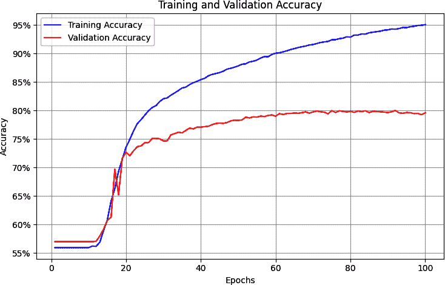

###### 图 6-4\. 使用较低学习率（LR）的准确率


###### 图 6-5\. 使用较低学习率（LR）的损失

并且虽然损失确实开始显示出与您在 图 6-3 中看到的相同的过拟合曲线，但请注意，它发生得晚得多，并且速率低得多。到第 30 个周期时，损失约为 0.49，而 图 6-3 中的更高学习率（LR）时，损失量超过两倍。虽然网络需要更长的时间才能达到良好的准确率，但它以更低的损失率做到这一点，因此您可以更有信心地相信结果。使用这些超参数，验证集上的损失在大约第 60 个周期时开始增加，此时训练集的准确率为 90%，验证集的准确率约为 81%，这表明我们有一个相当有效的网络。

当然，只是调整优化器然后宣布胜利很容易，但您还可以使用其他一些方法来改进您的模型。您将在接下来的几节中了解到这些方法，并且为了这些方法，我已重新使用默认的 Adam 优化器，这样调整学习率（LR）的效果就不会掩盖这些其他技术提供的优势。

### 探索词汇量大小

意图讽刺数据集处理的是单词，因此如果您探索数据集中的单词及其频率，您可能会得到一些有助于解决过拟合问题的线索。

我提供了一个 `word_frequency` 辅助函数，让您可以探索词汇表中的单词频率。它看起来是这样的：

```py
def word_frequency(sentences, word_dict):
    frequency = {word: 0 for word in word_dict}

    for sentence in sentences:
        words = sentence.lower().split()
        for word in words:
            if word in frequency:
                frequency[word] += 1

    return frequency
```

您可以使用如下代码运行它：

```py
word_freq = word_frequency(training_sentences, word_index)
print(word_freq)
```

您将看到如下结果：一个包含每个单词频率的字典，从最常用的单词开始，然后继续下去。以下是前几个单词：

```py
{'new': 1318, 'trump': 1117, 'man': 1075, 'not': 634, 'just': 501, 
 'will': 484, 'one': 469, 'year': 440, …
```

如果您想绘制这个，您可以遍历列表中的每个项目，将 *x* 值设置为您的位置序号（第一个项目为 1，第二个项目为 2 等）。*y* 值将是 `newlist[item]`，您可以使用 `matplotlib` 绘制它。以下是代码：

```py
import matplotlib.pyplot as plt
from collections import OrderedDict
newlist = (OrderedDict(sorted(word_freq.items(), key=lambda t: t[1], 
                       reverse=True)))

xs=[]
ys=[]
curr_x = 1
for item in newlist:
  xs.append(curr_x)
  curr_x=curr_x+1
  ys.append(newlist[item])

print(ys)
plt.plot(xs,ys)

```

结果显示在 图 6-6 中。

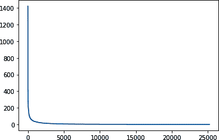

###### 图 6-6\. 探索单词的频率

这条“曲棍球棒”曲线告诉我们，很少的单词被多次使用，而大多数单词被使用的次数很少。但每个单词都被有效地同等加权，因为每个单词在嵌入中都有一个“条目”。鉴于我们的训练集相对于验证集来说相对较大，我们最终处于一个训练集中存在许多在验证集中不存在的单词的情况。

您可以通过在调用 `plt.show` 之前更改图表的轴来放大数据。例如，为了在 *x* 轴上查看从 300 到 10,000 的单词量，在 *y* 轴上从 0 到 100 的刻度，您可以使用以下代码：

```py
plt.plot(xs,ys)
plt.axis([300,10000,0,100])
plt.show()
```

结果显示在 图 6-7 中。

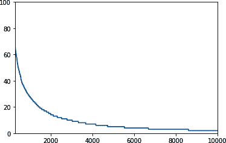

###### 图 6-7\. 300 到 10,000 个单词的频率

语料库中几乎有 25,000 个单词，代码被设置为只训练所有这些单词！但如果我们查看位置 2,000 及以后的单词，这超过了我们词汇量的 90%，我们会发现它们在整个语料库中每个单词的使用次数都不到 20 次！

这可能解释了过度拟合的原因，所以合理的下一步是看看我们是否可以减少我们正在训练的词汇量。在`build_vocab`辅助函数中，我们可以添加一个参数来指定我们感兴趣的最大词汇量，如下所示：

```py
def build_vocab(sentences, max_vocab_size=10000):
    counter = Counter()
    for text in sentences:
        counter.update(tokenize(text))

# Take only the top max_vocab_size-1 most frequent words 
# (leave room for special tokens)
    most_common = counter.most_common(max_vocab_size – 2)  
    # -2 for <pad> and <unk>

    # Create vocabulary with indices starting from 2
    vocab = {word: idx + 2 for idx, (word, _) in enumerate(most_common)}
    vocab['<pad>'] = 0  # Add padding token
    vocab['<unk>'] = 1  # Add unknown token
    return vocab
```

然后，在构建我们的`word_index`时，我们可以指定我们感兴趣探索的最大词汇量：

```py
vocab_size = 2000
word_index = build_vocab(training_sentences, max_vocab_size=vocab_size)
```

嵌入层已经根据词汇量初始化，所以模型架构不需要改变。实际上，随着词汇量的减少，学习到的参数数量急剧下降，给我们一个更简单的网络，它学习得更快：

```py

==========================================================================
Layer (type:depth-idx)                   Output Shape              Param #
==========================================================================
TextClassificationModel                  [32, 1]                   --
├─Embedding: 1-1                         [32, 100, 100]            200,100
├─AdaptiveAvgPool1d: 1-2                 [32, 100, 1]              --
├─Linear: 1-3                            [32, 24]                  2,424
├─ReLU: 1-4                              [32, 24]                  --
├─Linear: 1-5                            [32, 1]                   25
├─Sigmoid: 1-6                           [32, 1]                   --
==========================================================================
Total params: 202,549
Trainable params: 202,549
Non-trainable params: 0
Total mult-adds (M): 6.48
==========================================================================
Input size (MB): 0.03
Forward/backward pass size (MB): 2.57
Params size (MB): 0.81
Estimated Total Size (MB): 3.40
==========================================================================

```

模型从 240 万个参数缩小到只有 202,549 个。

在重新训练和探索较小的模型后，我们可以看到结果已经改变。

图 6-8 显示了准确度指标。现在，训练集准确度大约为 82%，验证集准确度大约为 76%。它们彼此更接近，没有发散，这是一个好迹象，表明我们已经消除了大部分过度拟合。


###### 图 6-8\. 具有两千个单词词汇量的准确度

这在一定程度上得到了图 6-9 中的损失图的加强。验证集上的损失在上升，但比之前慢得多，所以减少词汇量以防止训练集过度拟合可能只在训练集中出现过的低频单词似乎已经奏效。

值得尝试不同的词汇量大小，但请记住，词汇量也可能太小，导致过度拟合。你需要找到一个平衡点。在这种情况下，我选择出现 20 次或以上的单词纯粹是随机的。

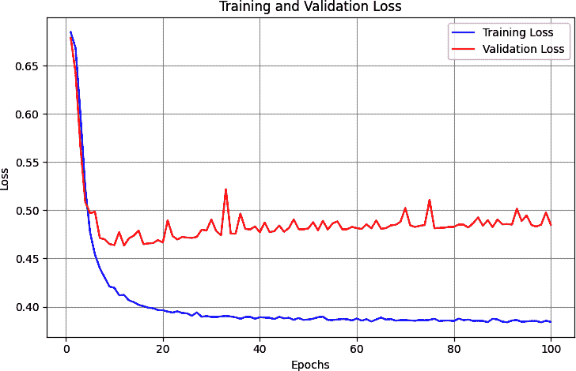

###### 图 6-9\. 具有两千个单词词汇量的损失

### 探索嵌入维度

对于这个例子，我随意选择了 16 维的嵌入维度。在这种情况下，单词被编码为 16 维空间中的向量，其方向表示它们的整体意义。但 16 是一个好数字吗？在我们的词汇量中只有两千个单词的情况下，它可能有点高，导致方向稀疏度较高。

###### 注意

我认为思考稀疏性的最佳方式是将它们投影到三个维度。想象一下地球，有一千个向量从核心指向地表的一个地方。这些向量在三个维度上，*x*，*y*和*z*。它们有很多表面要覆盖，但如果其中许多缺少*x*和*y*，意味着它们只是零，那么很多向量将会指向(0, 0, *z*)，而地球表面的大部分将保持未触及！因此，将缺乏独特性。

研究表明，对于嵌入大小的一个最佳实践是使其为词汇大小的四次方根。2000 的四次方根是 6.687，所以让我们看看如果我们将其四舍五入并将嵌入维度改为 7 会发生什么。

你可以在图 6-10 中看到训练 100 个 epoch 的结果。训练集的准确度稳定在大约 83%，验证集的准确度稳定在大约 77%。尽管有一些波动，但线条相当平稳，表明模型已经收敛。这与图 6-8 中的结果没有太大不同，但减少嵌入维度性允许模型训练得更快。

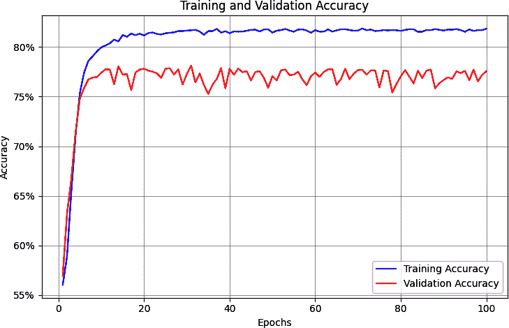

###### 图 6-10\. 七维度的训练与验证准确度

图 6-11 展示了训练和验证过程中的损失。虽然最初看起来损失在约 20 个 epoch 时上升，但它很快趋于平稳。再次，这是一个好兆头！


###### 图 6-11\. 七维度的训练与验证损失

现在维度已经减少，我们可以对模型架构进行一些调整。

### 探索模型架构

在前几节的优化之后，模型架构看起来是这样的：

```py
class TextClassificationModel(nn.Module):
    def __init__(self, vocab_size, embedding_dim, hidden_dim=24):
        super(TextClassificationModel, self).__init__()
        self.embedding = nn.Embedding(vocab_size, embedding_dim)
        self.global_pool = nn.AdaptiveAvgPool1d(1)
        self.fc1 = nn.Linear(embedding_dim, hidden_dim)
        self.fc2 = nn.Linear(hidden_dim, 1)
        self.relu = nn.ReLU()
        self.sigmoid = nn.Sigmoid()

```

想到的一件事是维度——`GlobalAveragePooling1D`层现在只发出 7 个维度，但它们被输入到 24 个神经元的隐藏层中，这有点过度。让我们看看当这个数量减少到 8 个神经元并且训练 100 个 epoch 时会发生什么。

你可以在图 6-12 中看到训练与验证的准确度。与使用 24 个神经元的图 6-7 相比，整体结果相当相似，但模型训练得更快。


###### 图 6-12\. 减少密集架构准确度结果

图 6-13 中的损失曲线显示了类似的结果。

通过遵循这些练习，我们能够显著减少模型架构，减少参数数量，同时提高质量并减轻过拟合。但我们还可以做更多的事情——从 dropout 开始。

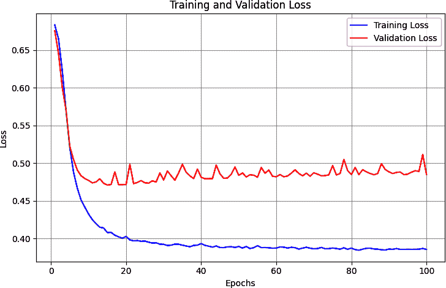

###### 图 6-13\. 减少密集架构损失结果

### 使用 dropout

减少过拟合的常见技术是在密集神经网络中添加 dropout。我们早在第三章中探讨了卷积神经网络，所以在这里直接探讨它对过拟合的影响是很诱人的。但在这个案例中，我想等到词汇量、嵌入大小和架构复杂性被解决后再进行。这些变化往往比使用 dropout 有更大的影响，而且我们已经看到了一些很好的结果。

现在我们已经将架构简化到中间密集层只有八个神经元，dropout 的影响可能被最小化——但让我们仍然探索它。以下是添加 0.25dropout（相当于八个神经元中的两个）的模型架构更新的代码：

```py
class TextClassificationModel(nn.Module):
    def __init__(self, vocab_size, embedding_dim, hidden_dim=8, 
                       `dropout_rate``=``0.25``)``:`
        super(TextClassificationModel, self).__init__()
        self.embedding = nn.Embedding(vocab_size, embedding_dim)
        self.global_pool = nn.AdaptiveAvgPool1d(1)
        self.fc1 = nn.Linear(embedding_dim, hidden_dim)
        self.dropout = nn.Dropout(p=dropout_rate)  # Add dropout layer
        self.fc2 = nn.Linear(hidden_dim, 1)
        self.relu = nn.ReLU()
        self.sigmoid = nn.Sigmoid()

    def forward(self, x):
        x = self.embedding(x)
        x = x.transpose(1, 2)  # Change for pooling layer
        x = self.global_pool(x).squeeze(2)
        `x` `=` `self``.``dropout`(self.relu(self.fc1(x)))
        x = self.sigmoid(self.fc2(x))
        return x

```

图 6-14 显示了训练 100 个 epoch 时的准确率结果。这次，我们看到训练准确率和验证准确率正在收敛，训练准确率现在低于之前。同样，图 6-15 中的损失曲线也显示了收敛，所以尽管 dropout 使我们的网络略微**降低**了准确率，但它似乎能更好地泛化。

但在宣布胜利之前，请务必谨慎！仔细观察曲线显示，损失已经很好地收敛，但它们**确实**比之前更高。有 dropout 时训练损失超过 0.5，而没有 dropout 时大约是 0.3。它也在下降趋势中，所以值得实验看看更长的训练是否能产生更好的结果。

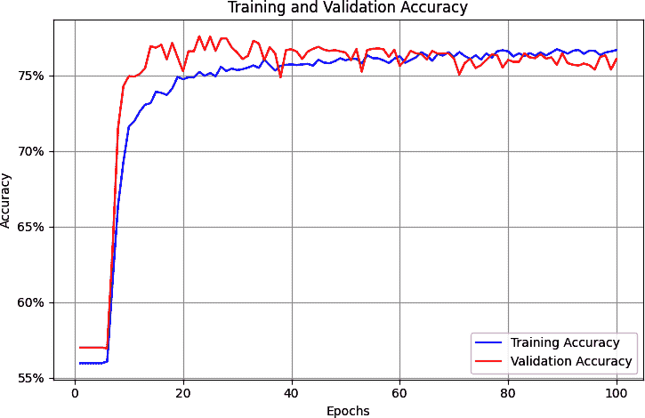

###### 图 6-14\. 添加 dropout 后的准确率

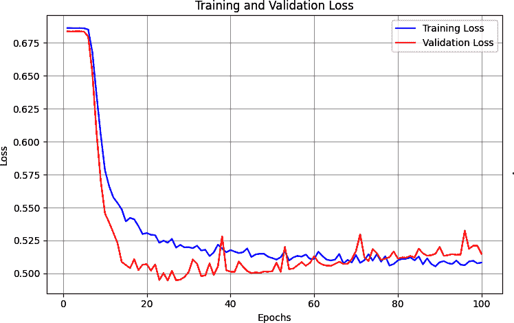

###### 图 6-15\. 添加 dropout 后的损失

你还可以看到，模型正在回归到之前随时间增加验证损失的旧模式。这并不像之前那么糟糕，但它正朝着错误的方向发展。

在这种情况下，当神经元非常少时，引入 dropout 可能不是正确的想法。尽管如此，这个工具仍然值得保留在你的工具箱中，所以请确保记住它，用于比这个更复杂的架构。 

### 使用正则化

**正则化**是一种帮助通过减少权重极化来防止过拟合的技术。如果某些神经元的权重过重，正则化会有效地惩罚它们。广义而言，正则化有两种类型：

L1 正则化

这通常被称为**最小绝对收缩**和**选择算子**（lasso）正则化。它有效地帮助我们计算层中的结果时忽略零或接近零的权重。

L2 正则化

这通常被称为**岭回归**，因为它通过取平方值来推远数值。这往往放大了非零值与零或接近零的值之间的差异，从而产生岭效应。

这两种方法也可以结合成有时被称为 *弹性* 正则化的方法。

对于像我们所考虑的 NLP 问题，L2 最常用。它可以作为 `weight_decay` 属性添加到 `optimizer` 中。以下是一个示例：

```py
optimizer = optim.Adam(model.parameters(), lr=0.001, betas=(0.9, 0.999), 
                       amsgrad=False, `weight_decay``=``0.01`)
```

这将应用 `weight_decay` 的 `0.01`。通常，你在这里会有一个介于 0.01 和 0.001 之间的值。或者，你可以使用 PyTorch 做的一个巧妙技巧是，通过在 `Adam` 声明调用中指定它们来为不同的层定义不同的权重衰减，如下所示：

```py
# Different weight decay for different layers
optimizer = torch.optim.Adam([
# L2 reg on fc1
        {'params': model.fc1.parameters(), 'weight_decay': 0.01},      
    # No L2 reg on other layers
{'params': [p for name, p in model.named_parameters() 
            if 'fc1' not in name]}  
], lr=0.0001)
```

在这样一个简单模型中添加正则化的影响并不特别大，但它确实在一定程度上平滑了我们的训练损失和验证损失。对于这个场景来说可能有些过度，但就像 dropout 一样，了解如何使用正则化来防止模型过度专业化是一个好主意。

### 其他优化考虑因素

虽然我们所做的修改使我们得到了一个拟合度更低的改进模型，但还有其他超参数你可以尝试。例如，我们选择将最大句子长度设为 100 个单词，但这完全是随意的，可能不是最优的。探索语料库并查看可能更好的句子长度是一个好主意。以下是一段代码，它查看句子并按从低到高的顺序绘制每个句子的长度：

```py
xs=[]
ys=[]
current_item=1
for item in sentences:
  xs.append(current_item)
  current_item=current_item+1
  ys.append(len(item))
newys = sorted(ys)

import matplotlib.pyplot as plt
plt.plot(xs,newys)
plt.show()
```

见 图 6-16 以查看此结果。

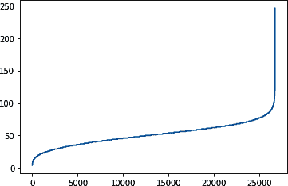

###### 图 6-16\. 探索句子长度

在 26,000+ 的总语料库中，少于 200 个句子的长度超过 100 个单词，因此选择这个作为最大长度，我们引入了大量的不必要的填充，从而影响了模型的性能。将最大长度减少到 85 个单词仍然可以保留 26,000 个句子（99%+），同时大幅减少填充。

## 整合所有内容

将所有前面的优化措施生效并重新训练模型 300 个周期，可以得到 图 6-17 中训练和验证准确率的结果。鉴于它们的曲线大致匹配，这表明我们已迈出了巨大的步伐，避免了过拟合，并且我们有一个正在有效学习的网络。

同样，经过 300 个周期的训练和验证损失曲线显示出显著相似性，如 图 6-18 所示，这表明优化是防止此模型过拟合的正确方向的一步。

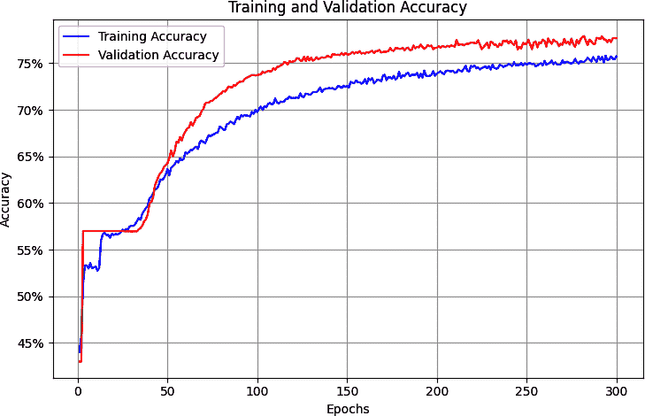

###### 图 6-17\. 优化后的训练和验证准确率

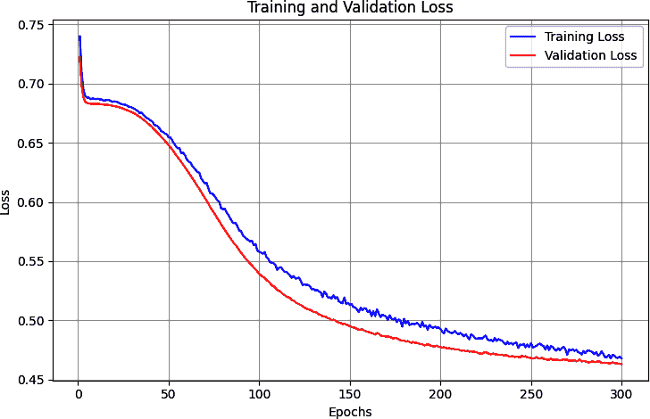

###### 图 6-18\. 优化后的训练和验证损失

## 使用模型对句子进行分类

现在你已经创建了模型，训练了它，并优化了它以消除导致过拟合的许多问题，下一步是运行模型并检查其结果。为此，你需要创建一个新句子的数组。例如，考虑以下内容：

```py
test_sentences = [
             "granny starting to fear spiders in the garden might be real", 
             "game of thrones season finale showing this sunday night", 
             "PyTorch book will be a best seller"]
```

你可以使用与创建训练词汇表时相同的分词器来对这些句子进行编码：

```py
print(texts_to_sequences(test_sentences, word_index))

```

使用这个分词器很重要，因为它包含了网络训练时使用的标记！

打印语句的输出将是前面句子的序列：

```py
[
[1, 803, 753, 1, 1, 312, 97], 
[123, 1183, 160, 1, 1, 1543, 152], 
[1, 235, 7, 47, 1]
]
```

这里有很多`1`标记（“<OOV>”），因为像*granny*和*spiders*这样的词在字典中没有出现。由于已经移除了停用词，序列也变短了。

在将序列传递给模型之前，你需要将它们转换为模型期望的形状——即所需的长度。你可以像训练模型时那样使用`pad_sequences`来完成此操作：

```py
padded = pad_sequences(sequences, max_len)
```

这将输出长度为`85`的句子序列，因此第一个序列的输出如下：

```py
[1, 803, 753, 1, 1, 312, 97, 0, 0, 0, 0, 0, 0, 0, 0, 0, 0, 0, 0, 0, 0, 0, 0, 0, 
 0, 0, 0, 0, 0, 0, 0, 0, 0, 0, 0, 0, 0, 0, 0, 0, 0, 0, 0, 0, 0, 0, 0, 0, 0, 0, 0,
 0, 0, 0, 0, 0, 0, 0, 0, 0, 0, 0, 0, 0, 0, 0, 0, 0, 0, 0, 0, 0, 0, 0, 0, 0, 0, 0,
 0, 0, 0, 0, 0, 0, 0]
```

这是一个非常短的句子，所以它被填充到 85 个字符，其中包含很多零！

现在你已经将句子填充和分词以适应模型对输入维度的期望，是时候将它们传递给模型并获取预测结果了。

这涉及到多个步骤。首先，将填充的序列转换为输入张量：

```py
# Convert to tensor
input_ids = torch.tensor(padded, dtype=torch.long).to(device)
```

接下来，将模型置于评估模式以获取预测结果，然后简单地将`input_ids`传递给它以获取输出：

```py
# Get predictions
model.eval()
with torch.no_grad():
    outputs = model(input_ids)
```

结果将以列表的形式返回并打印，高值表示可能存在讽刺。以下是针对我们的样本句子的结果：

```py
tensor([[0.5516],
        [0.0765],
        [0.0987]], device='cuda:0')
```

尽管第一个句子（“granny starting to fear spiders in the garden might be real”）有很多停用词，并且被填充了很多零，但其高分数表明其中存在一定程度的讽刺。其他两个句子的分数要低得多，表明它们中讽刺的可能性较低。

要获取概率，你可以调用`squeeze()`方法来检索张量值。如果你想将预测结果与阈值进行比较以获取预测结果——例如，大于 0.5 表示讽刺，小于 0.5 表示没有讽刺——那么你可以使用如下代码：

```py
probabilities = outputs.squeeze().cpu().numpy()
predictions = (probabilities >= threshold).astype(int)
```

根据你的网络调整，你也可以确定你认为适当的阈值应该是多少。以 0.5 阈值为例运行，结果如下：

```py
Text: granny starting to fear spiders in the garden might be real
Probability: 0.5516
Classification: `Sarcastic`
Confidence: 0.5516
--------------------------------------------------------------------------

Text: game of thrones season finale showing this sunday night
Probability: 0.0765
Classification: Not Sarcastic
Confidence: 0.9235
--------------------------------------------------------------------------

Text: PyTorch book will be a best seller
Probability: 0.0987
Classification: `Not` `Sarcastic`
Confidence: 0.9013
--------------------------------------------------------------------------
```

因此，使用这些测试句子，我们开始得到一个很好的迹象，表明我们的网络正在按预期运行。你应该用其他数据测试它，看看你是否能破坏它，如果你能持续地破坏它，那么就是时候尝试不同的模型架构，从现有的工作网络中利用迁移学习，或者探索使用预训练的嵌入进行了。

我们将在下一节中学习这个内容，但在那之前，我想向你展示你可以如何可视化这个网络学习到的自定义嵌入。

# 可视化嵌入

为了可视化嵌入，你可以使用一个名为[嵌入投影仪](http://projector.tensorflow.org)的在线工具。它预先加载了许多现有数据集，但在本节中，你将看到如何使用这个工具通过模型训练的数据来可视化。

但首先，你需要一个函数来反转单词索引。它目前将单词作为标记，将键作为值，但你需要将其反转，以便你可以在投影仪上绘制单词值。以下是执行此操作的代码：

```py
reverse_word_index = dict([(value, key)
for (key, value) in word_index.items()])

```

你还需要提取嵌入中的向量权重：

```py
embedding_weights = model.embedding.weight.data.cpu().numpy()
print(embedding_weights.shape)

```

如果你已经跟随了本章中的优化，这个输出的结果将是 `(2000,7)`，因为我们使用了 2,000 个单词的词汇量和 7 个维度的嵌入。如果你想探索一个单词及其向量细节，你可以使用如下代码：

```py
print(reverse_word_index[2])
print(embedding_weights[2])

```

这将产生以下输出：

```py
new
[–0.27116913 –1.3026129   1.6390767   0.4922502  –0.6025921   1.4584142
  0.05054485]

```

因此，单词 *new* 由一个在轴上有那些七个系数的向量表示。

Embedding Projector 使用两个以制表符分隔的值（TSV）文件，一个用于向量维度，一个用于元数据。以下代码将为你生成它们：

```py
import io
out_v = io.open('vecs.tsv', 'w', encoding='utf-8')
out_m = io.open('meta.tsv', 'w', encoding='utf-8')
for word_num in range(1, vocab_size):
  word = reverse_word_index[word_num]
  embeddings = embedding_weights[word_num]
  out_m.write(word + "\n")
  out_v.write('\t'.join([str(x) for x in embeddings]) + "\n")
out_v.close()
out_m.close()

```

或者，如果你使用 Google Colab，你可以使用以下代码或从文件面板下载 TSV 文件：

```py
try:
  from google.colab import files
except ImportError:
  pass
else:
  files.download('vecs.tsv')
  files.download('meta.tsv')

```

一旦你有了这些文件，你就可以在投影仪上按下“加载”按钮来可视化嵌入（见图 6-19）。

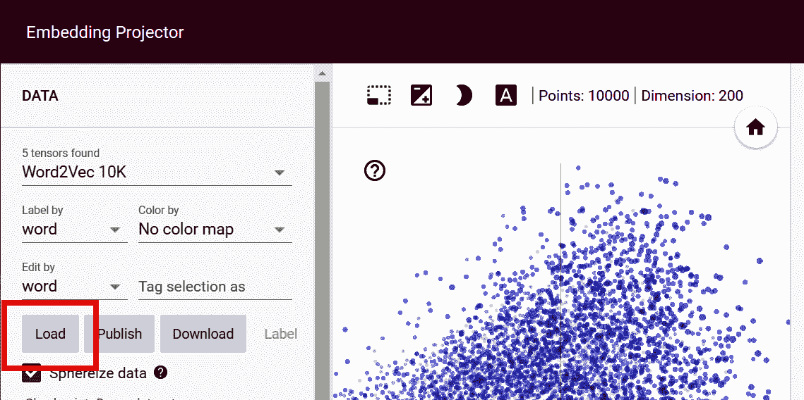

###### 图 6-19. 使用嵌入投影仪

你还可以在结果对话框中推荐的位置使用向量元数据 TSV 文件，然后在投影仪上点击“球化数据”。这将导致单词在球体中聚集，并为你提供这个分类器二进制性质的清晰可视化。它只训练在讽刺和非讽刺句子上，所以单词倾向于聚集在某个标签附近（见图 6-20）。


###### 图 6-20. 可视化讽刺嵌入

屏幕截图并不能完全体现这些功能——你应该亲自尝试！你可以旋转中心球体，探索每个“极点”上的单词，以查看它们对整体分类的影响，你还可以在右侧面板中选择单词并显示相关的单词。玩一玩，实验一下！

# 使用预训练嵌入

训练自己的嵌入的另一种选择是使用其他人预先训练的嵌入。你可以在许多来源找到这些嵌入，包括 Kaggle 和 Hugging Face。你甚至可以在研究结果旁边找到预先训练的嵌入。这样一组预先训练的嵌入是[斯坦福 GloVe 嵌入](https://oreil.ly/s1YWw)，我们将在下面探讨。

然而，请注意，当使用预训练的嵌入时，你也应该考虑更新和更改你的分词器，以匹配预训练嵌入使用的任何规则。

例如，使用 GloVE 预训练嵌入——它仅仅是一个包含单词及其在 50 到 300 个维度上的预训练嵌入的大文本文件——用于分词单词的规则与我们一直用于原始数据的手动分词器略有不同。因此，对于 GloVe，你应该考虑所有单词都小写或数字归一化到 0 的规则。

一旦你完成这个操作（我在下载中提供了 GloVe 的代码，并在下一章中进行了更详细的讨论），那么只需将预训练嵌入的权重加载到你的模型定义中，如下所示：

```py
# Initialize embedding layer
self.embedding = nn.Embedding(vocab_size, embedding_dim)

# Load pretrained embeddings if provided
if pretrained_embeddings is not None:
    self.embedding.weight.data.copy_(pretrained_embeddings)
    if freeze_embeddings:
        self.embedding.weight.requires_grad = False
```

如果你不想从这些嵌入中学习，只想使用它们，那么你应该将`freeze_embeddings`设置为`True`。否则，网络将使用预加载的嵌入权重作为起点进行微调。

此模型将迅速达到训练中的峰值准确度，并且它不会像我们之前看到的那样过度拟合。经过三百个 epoch 的准确度显示，训练和验证非常一致（参见图 6-22）。损失值也是一致的，这表明我们在前几百个 epoch 中拟合得非常好。然而，它们也开始发散（参见图 6-22）。

另一方面，值得注意的是，整体准确度（大约 70%）相当低，考虑到抛硬币有 50%的机会猜对！因此，虽然使用预训练嵌入可以加快训练速度并减少过度拟合，但你应该了解它们有什么用，以及它们可能并不总是最适合你的场景。因此，你可能需要探索适当的优化方法或替代方案。

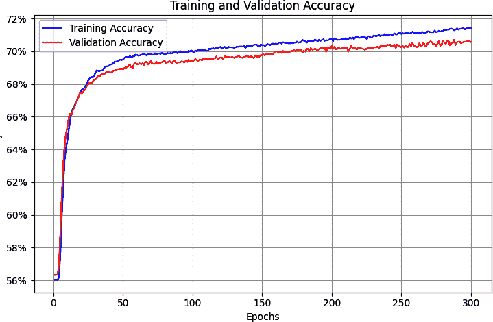

###### 图 6-21\. 使用 GloVe 嵌入的准确度指标

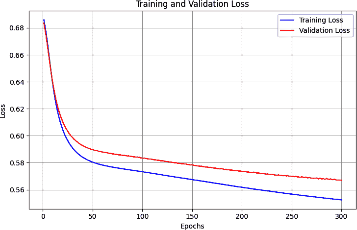

###### 图 6-22\. 使用 GloVe 嵌入的损失指标

# 摘要

在本章中，你构建了第一个能够理解文本情感的模型。它是通过从第五章获取分词文本并将其映射到向量来实现的。然后，使用反向传播，它根据包含该句子的标签学习每个向量的适当“方向”。最后，它能够使用一组单词的所有向量来构建句子中情感的概念。

你还探索了优化模型以避免过拟合的方法，并看到了表示你单词的最终向量的整洁可视化。但尽管这是一种很好的句子分类方法，它只是简单地将每个句子视为一堆单词。其中没有固有的序列，而在确定句子的真正含义时，单词出现的顺序非常重要。

因此，考虑如果我们能通过考虑序列来改进我们的模型，那将是个不错的想法。我们将在下一章中通过介绍一种新的层类型：一个*循环*层，这是循环神经网络的基础，来探讨这一点。
