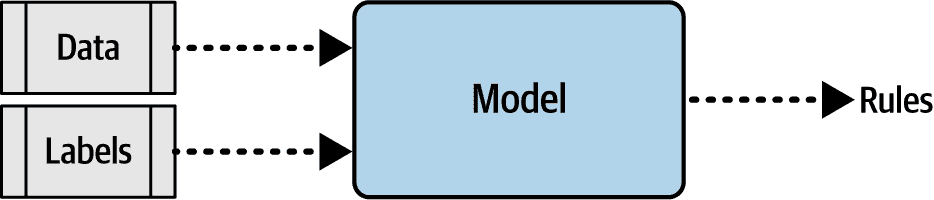
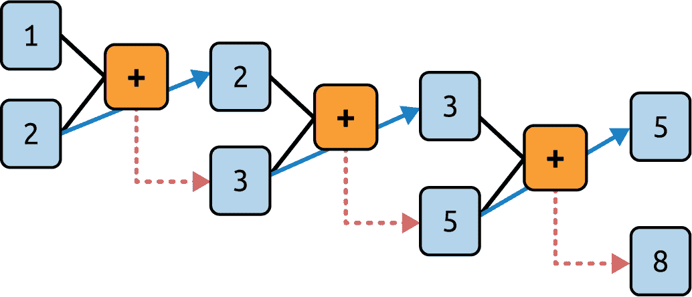
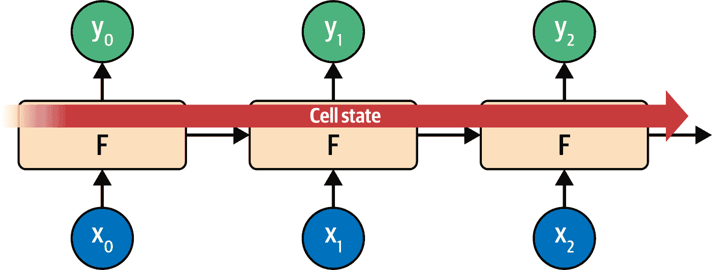
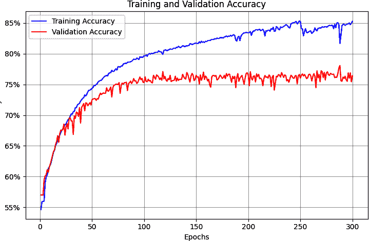
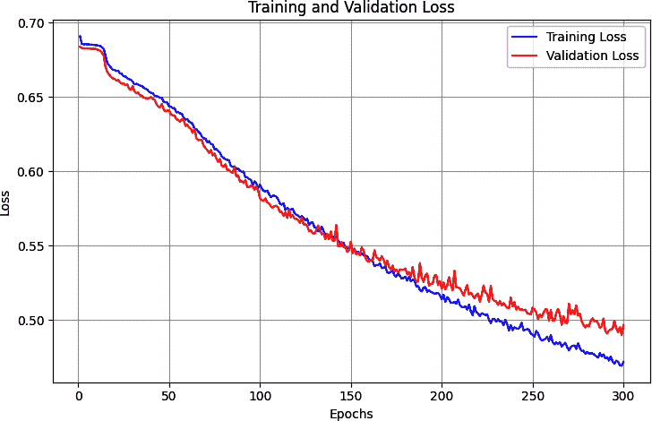
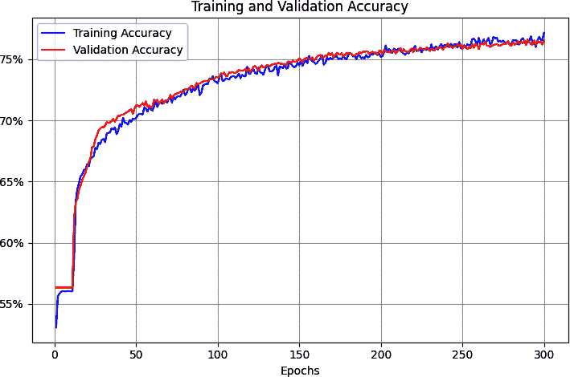

# 第七章\. 自然语言处理中的循环神经网络

在第五章中，你看到了如何标记和序列化文本，将句子转换为数字张量，然后可以将其输入到神经网络中。然后你在第六章中扩展了这一点，通过查看嵌入，这些嵌入构成了一种让具有相似含义的词聚集在一起的方法，以便计算情感。正如你所看到的，通过构建讽刺分类器，这确实很有效。但是，这有一个局限性：即句子不仅仅是单词的集合——而且，单词出现的*顺序*往往决定了它们的整体含义。此外，形容词可以增加或改变它们旁边名词的含义。例如，单词*blue*从情感角度来看可能没有意义，*sky*也是如此，但当你将它们组合成*blue sky*时，它表明了一种通常积极的明确情感。最后，一些名词可能对其他名词有资格限制，例如在*rain cloud*、*writing desk*和*coffee mug*中。

为了考虑这样的序列，你需要采取一种额外的方法：你需要将*循环*因素纳入模型架构。在本章中，你将了解不同的实现方式。我们将探讨如何学习序列信息，以及你如何使用这些信息来创建一种能够更好地理解文本的模型：*循环神经网络*（RNN）。

# 循环的基础

为了理解循环可能的工作方式，让我们首先考虑本书迄今为止使用的模型的局限性。最终，创建一个模型看起来有点像图 7-1。你提供数据和标签，并定义模型架构，然后模型学习适合数据的规则，并将这些规则作为应用程序编程接口（API）提供给你，以便为未来的数据返回预测标签。



###### 图 7-1\. 模型创建的高级视图

但是，正如你所看到的，数据是整体处理的。没有涉及粒度，也没有努力理解数据发生的顺序。这意味着在句子“今天我很沮丧，因为天空是灰的”和“今天我很高兴，有一个美丽的蓝天”中，“blue”和“sky”这两个词没有不同的含义。对我们来说，这些词的使用差异是明显的，但对一个模型来说，具有这里所示架构的模型，实际上并没有差异。

那么，我们该如何解决这个问题呢？首先，让我们探索一下循环的本质，然后你将能够看到基本循环神经网络（RNN）是如何工作的。

考虑著名的斐波那契数列。如果你不熟悉它，我已经在图 7-2 中放入了一些数字。


###### 图 7-2. 斐波那契数列的前几个数

这个序列背后的想法是每个数都是它前面两个数的和。所以如果我们从 1 和 2 开始，下一个数是 1 + 2，即 3。接下来的一个数是 2 + 3，即 5，然后是 3 + 5，即 8，以此类推。

我们可以将这个放在计算图中，得到图 7-3。



###### 图 7-3. 斐波那契数列的计算图表示

在这里，你可以看到我们将 1 和 2 输入到函数中，得到 3 作为输出。然后我们将第二个参数（2）传递到下一步，并连同前一步的输出（3）一起输入到函数中。这个输出的结果是 5，然后它与前一步的第二个参数（3）一起输入到函数中，产生一个输出 8。这个过程无限进行下去，每个操作都依赖于之前的操作。左上角的 1 在过程中“存活”下来——它是 3 的一个元素，被输入到第二个操作中，它是 5 的一个元素，被输入到第三个操作中，以此类推。因此，1 的一些本质在整个序列中得以保留，尽管它对整体值的影响减弱了。

这与循环神经元的架构类似。你可以在图 7-4 中看到循环神经元的典型表示。


###### 图 7-4. 循环神经元

一个值*x*在时间步长被输入到函数*F*中，所以它通常被标记为*x*[*t*]。这在该时间步长产生一个输出*y*，通常被标记为*y*[*t*]。它还产生一个传递到下一步的值，这由从*F*到自身的箭头表示。

如果你看看循环神经元在时间步长中是如何相互工作的，这会使得这个过程更加清晰，你可以在图 7-5 中看到这一点。

在这里，*x*[0]被操作以得到*y*[0]和一个传递的值。下一步获取那个值和*x*[1]，产生*y*[1]和一个传递的值。接下来的一步获取那个值和*x*[2]，产生*y*[2]和一个传递的值，以此类推。这与我们看到的斐波那契数列类似，而且我在尝试记住 RNN 的工作方式时，总是觉得这是一个有用的记忆法。


###### 图 7-5. 时间步长中的循环神经元

# 扩展语言中的循环

在上一节中，您看到了一个 RNN 在多个时间步长上操作如何帮助在序列中保持上下文。确实，我们将在本书的后面部分使用 RNN 进行序列建模——但是当使用像图 7-4 和图 7-5 中展示的简单 RNN 时，您可能会错过语言方面的细微差别。就像前面提到的斐波那契数列示例一样，携带的上下文量会随着时间的推移而减少。第 1 步神经元输出的影响在第 2 步时很大，在第 3 步时较小，在第 4 步时更小，以此类推。因此，如果我们有一个句子像“今天有一个美丽的蓝色<某物>”，那么单词*蓝色*将对下一个单词可能是什么有强烈的影响：我们可以猜测它很可能是*天空*。但是，句子开头部分的上下文怎么办呢？例如，考虑这个句子：“我在爱尔兰生活过，所以在高中时，我不得不学习如何说和写<某物>。”

那个<某物>是*盖尔语*，但真正给我们这个上下文的单词是*爱尔兰*，它在句子中要早得多。因此，为了能够识别<某物>应该是什么，我们需要一种方法来在更长的距离上保持上下文。RNN 的短期记忆需要更长，为此，人们发明了一种称为*长短期记忆*（LSTM）的架构增强。

虽然我不会详细介绍 LSTM 的工作的底层架构，但图 7-6 中展示的高级图解清楚地说明了主要观点。要了解更多关于 LSTM 内部操作的信息，请查看 Christopher Olah 关于这个主题的优秀[博客文章](https://oreil.ly/6KcFA)。

LSTM 架构通过添加一个“细胞状态”来增强基本的 RNN，这使得上下文不仅可以从一步到下一步保持，还可以在整个步骤序列中保持。记住这些是像神经元一样学习的神经元，您可以看到这种增强确保了随着时间的推移，重要的上下文将被学习。



###### 图 7-6\. LSTM 架构的高级视图

LSTM 的一个重要部分是它可以*双向*——时间步长可以向前和向后迭代，以便在两个方向上学习上下文。通常，一个单词的上下文可以来自句子中的*之后*，而不仅仅是之前。

见图 7-7 以了解其高级视图。


###### 图 7-7\. LSTM 双向架构的高级视图

这就是从 0 到`number_of_steps`方向的评估是如何进行的，这也是从`number_of_steps`到 0 的评估是如何进行的。在每一步，*y*结果都是“正向”传递和“反向”传递的聚合。您可以在图 7-8 中看到这一点。


###### 图 7-8\. 双向 LSTM

当涉及到网络的训练时，很容易将 LSTM 的双向性（bidirectional nature）与术语*forward*和*backward*混淆，但它们是非常不同的。当我提到正向和反向传递时，我指的是设置神经元参数及其从学习过程中更新的过程。不要将这一点与 LSTM 关注的下一个或前一个序列标记的值混淆。

此外，考虑每个时间步的每个神经元为 F0，F1，F2 等。时间步的方向是显示的，所以正向方向 F1 的计算是 F1(->)，反向方向是(<-)F1。这些值的聚合给出了该时间步的*y*值。此外，细胞状态是双向的，这可以非常有助于管理句子中的上下文。再次考虑句子“我在爱尔兰生活过，所以在高中时，我不得不学习如何说和写<something>”，你可以看到<something>是如何通过上下文词*Ireland*被限定为*Gaelic*的。但如果情况相反呢：“我在<这个国家>生活过，所以在高中时，我不得不学习如何说和写 Gaelic”？你可以看到，通过句子中的*反向*传递，我们可以了解<这个国家>应该是什么。因此，使用双向 LSTM 对于理解文本中的情感非常有用。（而且正如你将在第八章中看到的，它们对于生成文本也非常强大！）

当然，LSTM 有很多内容，特别是双向 LSTM，所以请预期训练会慢。这就是值得投资 GPU 或至少在 Google Colab 中使用托管 GPU 的时候了。

# 使用 RNN 创建文本分类器

在第六章中，你通过使用嵌入（embeddings）来创建一个针对讽刺数据集的分类器进行了实验。在这种情况下，你将单词转换为向量，然后在聚合它们之前将它们输入到密集层进行分类。但是当你使用像 LSTM 这样的 RNN 层时，你不需要进行聚合，可以直接将嵌入层的输出输入到循环层。至于循环层的维度，一个常见的经验法则是它的大小与嵌入维度相同。这并不是必需的，但它可以是一个好的起点。此外，请注意，虽然我在第六章中提到，嵌入维度通常是词汇表大小的四次方根，但在使用 RNN 时，你经常会看到这个规则可能被忽略，因为它会使循环层的大小变得太小。

对于这个例子，我使用了隐藏层中神经元的数量作为起点，你可以从这里开始实验。

例如，你可以将你在第六章中开发的讽刺分类器的简单模型架构更新如下，以使用双向 LSTM：

```py
class TextClassificationModel(nn.Module):
    def __init__(self, vocab_size, embedding_dim, 
                 hidden_dim=24, lstm_layers=1):
        super(TextClassificationModel, self).__init__()

        # Embedding layer
        self.embedding = nn.Embedding(vocab_size, embedding_dim)

        # LSTM layer
        self.lstm = nn.LSTM(
            input_size=embedding_dim,
            hidden_size=hidden_dim,
            num_layers=lstm_layers,
            batch_first=True,
            bidirectional=True
        )

        # Global pooling
        self.global_pool = nn.AdaptiveAvgPool1d(1)

        # Fully connected layers
        self.fc1 = nn.Linear(hidden_dim * 2, hidden_dim)
        self.fc2 = nn.Linear(hidden_dim, 1)

        # Activation functions
        self.relu = nn.ReLU()
        self.sigmoid = nn.Sigmoid()

    def forward(self, x):
        # x shape: (batch_size, sequence_length)

        # Get embeddings
        embedded = self.embedding(x)  
        # Shape: (batch_size, sequence_length, embedding_dim)

        # Pass through LSTM
        lstm_out, _ = self.lstm(embedded)  
        # Shape: (batch_size, sequence_length, hidden_dim)

        # Transpose for global pooling 
        # (expecting: batch, channels, sequence_length)
        lstm_out = lstm_out.transpose(1, 2)  
        # Shape: (batch_size, hidden_dim, sequence_length)

        # Apply global pooling
        pooled = self.global_pool(lstm_out)  
        # Shape: (batch_size, hidden_dim, 1)
        pooled = pooled.squeeze(–1)  # Shape: (batch_size, hidden_dim)

        # Pass through fully connected layers
        x = self.relu(self.fc1(pooled))
        x = self.sigmoid(self.fc2(x))

        return x
```

你可以将损失函数和分类器设置为这个。注意 LR 是 0.001，或者 1e–3：

```py
# Define loss function and optimizer
criterion = nn.BCELoss()
optimizer = optim.Adam(model.parameters(), lr=0.001, 
                       betas=(0.9, 0.999), amsgrad=False)
```

当你打印出模型架构摘要时，你会看到如下内容：

```py
==========================================================================
Layer (type:depth-idx)                   Output Shape              Param #
==========================================================================
TextClassificationModel                  [32, 1]                   --
├─Embedding: 1-1                         [32, 85, 7]               14,000
├─LSTM: 1-2                              [32, 85, 48]              6,336
├─AdaptiveAvgPool1d: 1-3                 [32, 48, 1]               --
├─Linear: 1-4                            [32, 24]                  1,176
├─ReLU: 1-5                              [32, 24]                  --
├─Linear: 1-6                            [32, 1]                   25
├─Sigmoid: 1-7                           [32, 1]                   --
==========================================================================
Total params: 21,537
Trainable params: 21,537
Non-trainable params: 0
Total mult-adds (M): 17.72
==========================================================================
Input size (MB): 0.02
Forward/backward pass size (MB): 1.20
Params size (MB): 0.09
Estimated Total Size (MB): 1.31
==========================================================================
```

注意，词汇量大小为 2,000，嵌入维度为 7。这给嵌入层提供了 14,000 个参数，双向层将有 48 个神经元（24 个输出，24 个回传）和 85 个字符的序列长度。

图 7-9 显示了在超过 300 个 epoch 的训练结果。

这给我们一个只有 21,537 个参数的网络。如图所示，网络在训练数据上的准确率迅速攀升至 85%，但验证数据在约 75%处停滞。这与我们之前得到的结果相似，但检查图 7-10 中的损失图表显示，测试集的损失在 15 个 epoch 后发散，而验证损失开始增加，表明我们出现了过拟合。



###### 图 7-9\. LSTM 在 30 个 epoch 上的准确率


###### 图 7-10\. LSTM 在 30 个 epoch 上的损失

然而，这仅仅使用了一个具有 24 个神经元的隐藏层的单个 LSTM 层。在下一节中，你将看到如何使用堆叠 LSTM，并探讨其对分类此数据集准确率的影响。

## 堆叠 LSTM

在上一节中，你看到了如何在嵌入层之后使用 LSTM 层来帮助分类讽刺数据集的内容。但是，LSTM 可以堆叠在一起，这种方法被许多最先进的 NLP 模型所采用。

使用 PyTorch 堆叠 LSTM 相当直接。你就像添加任何其他层一样添加它们，但你需要小心指定维度。例如，如果第一个 LSTM 有*x*个隐藏层，那么下一个 LSTM 将有*x*个输入。如果 LSTM 是双向的，那么下一个需要加倍大小。以下是一个例子：

```py
# First LSTM layer
self.lstm1 = nn.LSTM(
    input_size=embedding_dim,
    hidden_size=hidden_dim,
    num_layers=lstm_layers,
    batch_first=True,
    bidirectional=True
)

# Second LSTM layer
# Note: Input size is hidden_dim*2 because first LSTM is bidirectional.
self.lstm2 = nn.LSTM(
    input_size=hidden_dim * 2,
    hidden_size=hidden_dim,
    num_layers=lstm_layers,
    batch_first=True,
    bidirectional=True
)

```

注意，第一层的`input_size`是嵌入维度，因为它在嵌入层之前。第二个 LSTM 的输入大小为(`hidden_dim * 2`)，因为第一个 LSTM 的输出大小就是那样，考虑到它是双向的。

模型架构将看起来如下：

```py
==========================================================================
Layer (type:depth-idx)                   Output Shape              Param #
==========================================================================
TextClassificationModel                  [32, 1]                   --
├─Embedding: 1-1                         [32, 85, 7]               14,000
├─LSTM: 1-2                              [32, 85, 48]              6,336
├─LSTM: 1-3                              [32, 85, 48]              14,208
├─AdaptiveAvgPool1d: 1-4                 [32, 48, 1]               --
├─Linear: 1-5                            [32, 24]                  1,176
├─ReLU: 1-6                              [32, 24]                  --
├─Linear: 1-7                            [32, 1]                   25
├─Sigmoid: 1-8                           [32, 1]                   --
==========================================================================
Total params: 35,745
Trainable params: 35,745
Non-trainable params: 0
Total mult-adds (M): 56.37
==========================================================================
Input size (MB): 0.02
Forward/backward pass size (MB): 2.25
Params size (MB): 0.14
Estimated Total Size (MB): 2.41
==========================================================================

```

添加额外的层将给我们大约 14,000 个额外的参数需要学习，这增加了大约 75%。因此，它可能会减慢网络的运行速度，但如果收益合理，成本相对较低。

经过 300 个 epoch 的训练后，结果看起来像图 7-11。虽然验证集上的准确率保持平稳，但检查损失（如图 7-12 所示）却讲述了一个不同的故事。如图 7-12 所示，虽然训练和验证的准确率看起来不错，但验证损失迅速上升，这是过度拟合的明显迹象。


###### 图 7-11\. 堆叠 LSTM 架构的准确率

这种过度拟合（表现为训练准确率随着损失的平滑下降而接近 100%，而验证准确率相对稳定且损失急剧增加）是模型对训练集过度专业化的结果。与第六章中的例子一样，这表明如果你只看准确率指标而不检查损失，很容易陷入虚假的安全感。


###### 图 7-12\. 堆叠 LSTM 架构的损失

### 优化堆叠 LSTMs

在第六章中，你看到了降低过度拟合的一个非常有效的方法是降低 LR。在这里探索它是否对 RNN 也有积极影响是值得的。

例如，以下代码将 LR 降低了 50%，从 0.0001 降低到 0.00005：

```py
# Define loss function and optimizer
criterion = nn.BCELoss()
optimizer = optim.Adam(model.parameters(), `lr``=``0.00005`, 
                       betas=(0.9, 0.999), amsgrad=False)

```

图 7-13 展示了这对其训练的影响。如图所示，验证准确率有细微差异，表明我们略微减少了过度拟合。


###### 图 7-13\. 减少 LR 对堆叠 LSTMs 准确率的影响

虽然对图 7-14 的初步观察同样表明减少 LR 对损失有相当的影响，曲线没有如此急剧上升，但值得仔细观察。我们看到训练集上的损失实际上略高于前一个例子（~0.35 比~0.27），而验证集上的损失则较低（~0.5 比 0.6）。

调整 LR 超参数显然值得研究。

事实上，进一步实验表明，降低 LR（从 0.0005 降低到 0.0003）显著提高了训练和验证曲线的收敛，这表明虽然网络在训练后准确性有所降低，但我们能看出它泛化得更好。图 7-15 和 7-16 展示了使用更低 LR 的影响。


###### 图 7-14\. 减少学习率（LR）对堆叠 LSTMs 损失的冲击


###### 图 7-15\. 堆叠 LSTM 进一步降低 LR 后的准确率


###### 图 7-16\. 进一步降低 LR 和堆叠 LSTM 的损失

事实上，将 LR 进一步降低到 0.00001，可能给出了更好的结果，如图 7-17 和 7-18 所示。与之前的图表一样，虽然整体准确率不是很好，损失也更高，但这表明我们正在接近这个网络架构的“真实”结果，而不是通过在训练数据上过拟合而得到错误的安心感。

除了改变 LR 参数外，你还应该考虑在 LSTM 层中使用 dropout。它的工作方式与密集层完全相同，如第三章中讨论的（ch03.html#ch03_going_beyond_the_basics_detecting_features_in_ima_1748570891074912），其中随机神经元被丢弃以防止邻近偏差影响学习。尽管如此，你应该小心不要将其设置得太低，因为当你开始调整不同的架构时，你可能会冻结网络学习的能力。


###### 图 7-17\. 使用较低学习率的准确率


###### 图 7-18\. 使用较低学习率的损失**  **### 使用 dropout

除了改变 LR 参数外，你还应该考虑在 LSTM 层中使用 dropout。它的工作方式与密集层完全相同，如第三章中讨论的（ch03.html#ch03_going_beyond_the_basics_detecting_features_in_ima_1748570891074912），其中随机神经元被丢弃以防止邻近偏差影响学习。

你可以通过使用`nn.Dropout`来实现 dropout。以下是一个示例：

```py
self.embedding_dropout = nn.Dropout(dropout_rate)
self.lstm_dropout = nn.Dropout(dropout_rate)
self.final_dropout = nn.Dropout(dropout_rate)
```

然后，在你的前向传递中，你可以在适当的层级应用 dropout，如下所示：

```py
def forward(self, x):
    # Get embeddings
    embedded = self.embedding(x)  

    # Apply first dropout after embedding layer
    embedded = self.embedding_dropout(embedded)

    lstm1_out, _ = self.lstm1(embedded)

    # Apply dropout between LSTM layers
    lstm1_out = self.lstm_dropout(lstm1_out)

    lstm2_out, _ = self.lstm2(lstm1_out)

    # Apply final dropout
    lstm2_out = self.final_dropout(lstm2_out)

    lstm_out = lstm2_out.transpose(1, 2)

    pooled = self.global_pool(lstm_out)  
    pooled = pooled.squeeze(–1) 

    x = self.relu(self.fc1(pooled))
    x = self.sigmoid(self.fc2(x))

    return x
```

当我用在 dropout 之前测试过的最低学习率运行时，网络没有学习。所以我将 LR 调整回 0.0003，并使用这个 dropout 运行了 300 个 epoch（注意 dropout 率是 0.2，所以大约有 20%的神经元被随机丢弃）。准确率结果可以在图 7-19 中看到。训练和验证曲线仍然很接近，但它们的准确率已经超过 75%，而没有 dropout 时，很难超过 70%。


###### 图 7-19\. 使用 dropout 的堆叠 LSTMs 的准确率

正如你所看到的，使用 dropout 可以对网络的准确率产生积极影响，这是好事！总是担心丢失神经元会使你的模型表现更差，但正如我们在这里所看到的，情况并非如此。但使用 dropout 时一定要小心，因为它如果不适当使用可能会导致欠拟合或过拟合。

如图 7-20 所示，这也有助于降低损失。虽然曲线明显发散，但它们比之前更接近，验证集在约 0.45 的损失处趋于平坦，这也证明了改进！正如这个例子所示，dropout 是另一种可以用来提高基于 LSTM 的 RNN 性能的实用技术。

值得探索这些避免数据过拟合的技术，同时也值得探索我们在第六章中提到的数据预处理技术。但还有一件事我们尚未尝试：一种迁移学习的形式，其中你可以使用预学习的词嵌入而不是尝试学习自己的。我们将在下一节中探讨这一点。



###### 图 7-20.启用 dropout 的 LSTMs 的损失曲线**  **# 使用预训练嵌入的 RNN

在所有之前的例子中，你收集了用于训练集的完整单词集，并使用它们训练嵌入。你最初将它们聚合起来，然后输入到密集网络中，在本章中，你探讨了如何使用 RNN 来改进结果。在这个过程中，你受到数据集中单词的限制以及如何使用该数据集的标签来学习它们的嵌入。

现在，回想一下第四章，我们讨论了迁移学习。如果你不自己学习嵌入，而是使用预学习的嵌入，其中研究人员已经完成了将单词转换为向量的艰苦工作，并且这些向量已经被证明是有效的，那会怎么样？正如我们在第六章中看到的，一个例子是斯坦福大学的 Jeffrey Pennington、Richard Socher 和 Christopher Manning 开发的[GloVe (全局词向量)模型](https://oreil.ly/4ENdQ)。

在这种情况下，研究人员已经分享了他们在各种数据集上的预训练词向量：

+   来自维基百科和 Gigaword 的词汇表，包含 60 亿个标记、40 万个词汇，维度为 50、100、200 和 300

+   来自公共爬取的 42 亿个标记、1900 万个词汇，在 300 维度的词汇表

+   来自公共爬取的 840 亿个标记、2200 万个词汇的词汇表，在 300 维度

+   来自 200 亿条推文的 Twitter 爬取的 27 亿个标记、120 万个词汇的词汇表，维度为 25、50、100 和 200

由于这些向量已经预训练，你可以在 PyTorch 代码中简单地重用它们，而不是从头开始学习。首先，你将需要下载 GloVe 数据。我选择使用 50 维度的 60 亿词汇版本，使用以下代码下载并解压：

```py
import urllib.request
import zipfile

# Download GloVe embeddings
url = "https://nlp.stanford.edu/data/glove.6B.zip"
urllib.request.urlretrieve(url, "glove.6B.zip")

# Unzip
with zipfile.ZipFile("glove.6B.zip", 'r') as zip_ref:
    zip_ref.extractall()

# You can use glove.6B.50d.txt (50 dimensions)
# or glove.6B.100d.txt (100 dimensions)
```

文件中的每个条目都是一个单词，后面跟着为它学习到的维度系数。使用它的最简单方法是创建一个字典，其中键是单词，值是嵌入。你可以这样设置这个字典：

```py
import numpy as np
glove_embeddings = dict()
f = open('glove.6B.50d.txt')
for line in f:
    values = line.split()
    word = values[0]
    coefs = np.asarray(values[1:], dtype='float32')
    glove_embeddings[word] = coefs
f.close()
```

到这个时候，你将能够通过简单地使用它作为键来查找任何单词的系数集。例如，要查看单词*青蛙*的嵌入，你可以使用这个：

```py
glove_embeddings['frog']
```

拥有这些预训练嵌入后，你现在可以将它们加载到你的神经网络架构中的嵌入层，并使用它们作为预训练嵌入而不是从头开始学习。请参见以下模型架构定义。如果`pretrained_embeddings`值不为空，则嵌入层的权重将从该值加载。如果`freeze_embeddings`为`True`，则它们将被冻结；否则，它们将用作学习的起点（即，你将根据你的语料库微调嵌入）：

```py
class TextClassificationModel(nn.Module):
    def __init__(self, vocab_size, embedding_dim=100, hidden_dim=16, 
                 dropout_rate=0.25, pretrained_embeddings=None, 
                 freeze_embeddings=True, lstm_layers=2):
        super(TextClassificationModel, self).__init__()

        # Initialize embedding layer
        self.embedding = nn.Embedding(vocab_size, embedding_dim)

        # Load pretrained embeddings if provided
        if pretrained_embeddings is not None:
            self.embedding.weight.data.copy_(pretrained_embeddings)
            if freeze_embeddings:
                self.embedding.weight.requires_grad = False

        # LSTM layer
        self.lstm = nn.LSTM(
            input_size=embedding_dim,
            hidden_size=hidden_dim,
            num_layers=lstm_layers,
            batch_first=True
        )

        # Global pooling
        self.global_pool = nn.AdaptiveAvgPool1d(1)

        # Fully connected layers
        self.fc1 = nn.Linear(hidden_dim, hidden_dim)
        self.fc2 = nn.Linear(hidden_dim, 1)

        # Activation functions
        self.relu = nn.ReLU()
        self.sigmoid = nn.Sigmoid()
```

该模型显示了总共 406.817 个参数，其中只有 6,817 个是可训练的，因此训练将会很快！

```py
==========================================================================
Layer (type:depth-idx)                   Output Shape              Param #
==========================================================================
TextClassificationModel                  [32, 1]                   --
├─Embedding: 1-1                         [32, 60, 50]              (400,000)
├─Dropout: 1-2                           [32, 60, 50]              --
├─LSTM: 1-3                              [32, 60, 16]              6,528
├─Dropout: 1-4                           [32, 60, 16]              --
├─AdaptiveAvgPool1d: 1-5                 [32, 16, 1]               --
├─Linear: 1-6                            [32, 16]                  272
├─ReLU: 1-7                              [32, 16]                  --
├─Dropout: 1-8                           [32, 16]                  --
├─Linear: 1-9                            [32, 1]                   17
├─Sigmoid: 1-10                          [32, 1]                   --
==========================================================================
Total params: 406,817
Trainable params: 6,817
Non-trainable params: 400,000
Total mult-adds (M): 25.34
==========================================================================
Input size (MB): 0.02
Forward/backward pass size (MB): 1.02
Params size (MB): 1.63
Estimated Total Size (MB): 2.66
==========================================================================

```

你现在可以像以前一样进行训练，并且你可以看到这个架构，即使用预训练嵌入和堆叠的 LSTMs，如何真正地减少过拟合！图 7-21 显示了使用 LSTMs 和预训练 GloVe 嵌入在讽刺数据集上的训练与验证准确率，而图 7-22 显示了训练与验证的损失，曲线的接近程度表明我们没有过拟合。



###### 图 7-21\. 使用 LSTMs 和 GloVe 在讽刺数据集上的训练与验证准确率


###### 图 7-22\. 使用 LSTMs 和 GloVe 在讽刺数据集上的训练和验证损失

为了进一步分析，你需要考虑你的词汇量大小。在前一章中，你为了避免过拟合所做的优化之一是防止嵌入学习低频词而变得负担过重：你通过使用常用词的较小词汇量来避免过拟合。在这种情况下，由于 GloVe 已经为你学习过单词嵌入，你可以扩展词汇量——但扩展多少呢？

首先要探索的是，你语料库中的单词有多少实际上在 GloVe 集中。它有 1.2 百万个单词，但无法保证它有*所有*你的单词。

当构建`word_index`时，你可以使用一个非常大的数字调用`build_vocab_glove`，它会忽略超过总数量的任何单词。例如，你可以这样做：

```py
word_index = build_vocab_glove(training_sentences, max_vocab_size=100,000)
```

使用讽刺数据集，你会得到一个 22,457 的 vocab_size 返回值。如果你愿意，你可以探索 GloVe 嵌入，看看其中有多少单词存在于 GloVE 中。首先创建一个用于嵌入的字典，并将 GloVE 文件读入其中：

```py
embeddings_dict = {}
embedding_dim = 50
glove_file = f'glove.6B.{embedding_dim}d.txt'

# Read GloVe embeddings
print(f"Loading GloVe embeddings from {glove_file}...")
with open(glove_file, 'r', encoding='utf-8') as f:
    for line in f:
        values = line.split()
        word = values[0]
        vector = np.asarray(values[1:], dtype='float32')
        embeddings_dict[word] = vector
```

然后，您可以将其与您使用上一行创建的整个语料库的`word_index`进行比较：

```py
found_words = 0
for word, idx in word_index.items():
    if word in embeddings_dict:
        found_words += 1
print(found_words)
```

在讽刺的情况下，21,291 个单词在 GloVE 中被找到，这是绝大多数，所以您在第六章中使用的原则来选择您应该训练多少（即，选择那些有足够频率以产生信号的单词）仍然适用！

使用这种方法，我选择使用 8,000 个词汇量（而不是之前为了避免过拟合所使用的 2,000 个词汇量）来得到您刚才看到的那些结果。然后，我使用来自*The Onion*的标题进行了测试，*The Onion*是讽刺数据集中讽刺性标题的来源，与其他句子进行了比较，如下所示：

```py
test_sentences = ["It Was, For, Uh, Medical Reasons, Says Doctor To 
                   `Boris` `Johnson``,` `Explaining` `Why` `They` `Had` `To` `Give` `Him` `Haircut``",` ``````py `"It's a beautiful sunny day"``,`                   `"I lived in Ireland, so in high school they made me` `````                     `learn` `to` `speak` `and` `write` `in` `Gaelic``",` ```py` `"Census Foot Soldiers Swarm Neighborhoods, Kick Down` ```                     `Doors` `To` `Tally` `Household` `Sizes``"]` ```py ```` ```py`` ``````py
```

```py``` ````` ```py` The results for these headlines are as follows—remember that values close to 50% (0.5) are considered neutral, those close to 0 are considered nonsarcastic, and those close to 1 are considered sarcastic:    ``` tensor([[0.9316],         [0.1603],         [0.6959],         [0.9594]], device='cuda:0')   Text: It Was, For, Uh, Medical Reasons, Says Doctor To Boris Johnson,        Explaining Why They Had To Give Him Haircut Probability: 0.9316 Classification: Sarcastic --------------------------------------------------------------------------   Text: It's a beautiful sunny day `Probability``:` `0.1603` `Classification``:` `Not` `Sarcastic` `--------------------------------------------------------------------------`   `Text``:` `I` `lived` `in` `Ireland``,` `so` `in` `high` `school` `they` `made` `me` `learn` `to` `speak`        `and` `write` `in` `Gaelic` `Probability``:` `0.6959` `Classification``:` `Sarcastic` `--------------------------------------------------------------------------`   `Text``:` `Census` `Foot` `Soldiers` `Swarm` `Neighborhoods``,` `Kick` `Down` `Doors` `To` `Tally`        `Household` `Sizes` `Probability``:` `0.9594` `Classification``:` `Sarcastic` `--------------------------------------------------------------------------` ```py   `The first and fourth sentences, which are taken from *The Onion*, showed 93%+ likelihood of sarcasm. The statement about the weather was strongly nonsarcastic (16%), and the sentence about going to high school in Ireland was deemed to be potentially sarcastic but not with high confidence (69%).` ```` ```py`` ``````py  ``` `` `# Summary    This chapter introduced you to recurrent neural networks, which use sequence-oriented logic in their design and can help you understand the sentiment in sentences based not only on the words they contain but also on the order in which they appear. You saw how a basic RNN works, as well as how an LSTM can build on this to enable context to be preserved over the long term. These models are the precursors to the popular and famous “transformers” models used to underpin generative AI.    You also used LSTMs to improve the sentiment analysis model you’ve been working on, and you then looked into overfitting issues with RNNs and techniques to improve them, including by using transfer learning from pretrained embeddings.    In Chapter 8, you’ll use what you’ve learned so far to explore how to predict words, and from there, you’ll be able to create a model that creates text and writes poetry for you!` `` ```**
