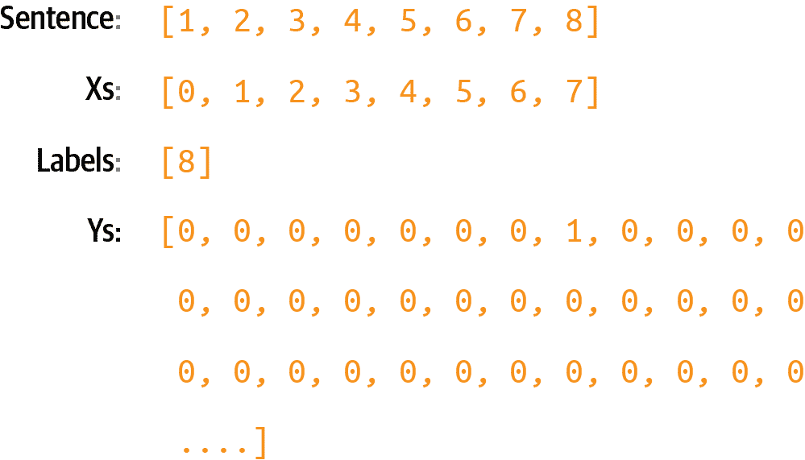

# 第八章\. 使用机器学习创建文本

2022 年 ChatGPT 的发布，*生成式 AI*这个词进入了公众的词汇。这个简单的应用程序允许你与云端的 AI 聊天，它几乎神奇地回答你的查询，几乎涵盖了人类经验的各个方面。它是通过使用比上一章中看到的循环神经网络更高级的进化，通过使用一种称为*转换器*的技术来工作的。

一个*转换器*学习将一段文本转换成另一段文本的模式。有了足够大的转换器架构和足够大的学习文本集，GPT 模型（GPT 代表生成预训练转换器）可以预测跟随一段文本的下一个标记。当 GPT 被包裹在一个更用户友好的应用程序中时，一个全新的行业就诞生了。

尽管使用转换器创建模型超出了本书的范围，但我们将详细探讨其架构，见第十五章。

使用转换器训练模型涉及的原则可以用较小的、更简单的架构如 RNN 或 LSTM 来复制。我们将在本章中探讨这一点，并使用一个更小的文本语料库——传统的爱尔兰歌曲。

例如，考虑以下来自著名电视剧的文本行：

> 你什么都不知道，琼·斯诺。

使用 RNN 创建的下一个标记预测模型产生了以下歌词作为回应：

+   你什么都不知道，琼·斯诺

+   他驻扎的地方

+   不论是在科克还是在蓝鸟之子

+   驶向夏日

+   旧时的甜蜜，长久而快乐的铃声

+   因此，我会等待野性的科琳死亡

这段文本是由一个训练在小型语料库上的非常简单的模型生成的。我稍微增强了一下，添加了行断和标点符号，但除了第一行之外，所有歌词都是由你将在本章学习的模型生成的。它提到一个*野性的科琳死亡*——如果你看过琼·斯诺来自的节目，你就会明白为什么了！

在过去的几章中，你看到了如何使用 PyTorch 处理基于文本的数据——首先将其标记化为数字和序列，这些可以被神经网络处理，然后使用嵌入向量模拟情感，最后使用深度和循环神经网络对文本进行分类。我们使用了讽刺数据集，一个小型且简单的数据集，来展示这一切是如何工作的。

在本章中，我们将转换方向：不是对现有文本进行分类，而是创建一个可以*预测*文本的神经网络，从而*生成*文本。

给定一个文本语料库，网络将尝试学习和理解文本中单词的*模式*，以便在给定一个称为*种子*的新文本时，可以预测下一个单词。一旦网络有了这个，种子和预测的单词就变成了新的种子，它可以预测下一个单词。因此，当在一个文本语料库上训练时，一个神经网络可以尝试以类似风格编写新的文本。为了创建前面的诗歌，我收集了一些传统的爱尔兰歌曲的歌词，用它们训练了一个神经网络，并使用它来预测单词。

我们将从简单开始，使用少量文本来展示如何构建一个预测模型，最后我们将创建一个包含更多文本的完整模型。之后，你可以尝试一下，看看它能创造出什么样的诗歌！

要开始，你将不得不稍微改变一下对待文本的方式，与之前相比。在前面的章节中，你将句子转换为序列，然后根据其中标记的嵌入进行分类。但是，当涉及到创建可以用来训练此类预测模型的训练数据时，你需要一个额外的步骤，在这个步骤中，你需要将序列转换为*输入序列*和*标签*，其中输入序列是一组单词，标签是句子中的下一个单词。然后你可以训练一个模型来匹配输入序列和它们的标签，以便未来的预测可以选择一个接近输入序列的标签。

# 将序列转换为输入序列

在预测文本时，你需要用一个具有相关标签的输入序列（特征）来训练一个神经网络。匹配序列到标签是预测文本的关键。在这种情况下，你不会有像分类时那样的明确标签，而是将句子拆分，对于*n*个单词的块，句子中的下一个单词将是标签。

例如，如果你的语料库中有这样的句子“今天有一个美丽的蓝天”，那么你可以将其拆分为“今天有一个美丽的蓝天”作为特征，“sky”作为标签。然后，如果你要对文本“今天有一个美丽的蓝天”进行预测，它很可能是“sky”。如果在训练数据中，你也有“昨天有一个美丽的蓝天”，你将以相同的方式拆分它，如果你要对文本“明天将有一个美丽的蓝天”进行预测，那么下一个词很可能是“sky”。

如果你用一个包含许多句子的网络进行训练，其中你移除最后一个单词并将其作为标签，你可以快速构建一个预测模型，其中可以从现有的文本体中预测句子中最可能的下一个单词。

我们将从一个非常小的文本语料库开始——一首来自 19 世纪 60 年代的传统爱尔兰歌曲的摘录，其中的一些歌词如下：

+   在阿斯镇，有一个杰里米·兰尼根

+   破碎至一文不值。

+   他的父亲去世，使他再次成为一个男人

+   留给他一个农场和十英亩的土地。

+   他为朋友和亲戚举办了一场盛大的聚会

+   她在墙角时没有忘记他，

+   如果你愿意听，我会让你的眼睛闪闪发光

+   关于兰尼根舞会的行列和骚动。

+   我自己当然得到了免费的邀请，

+   对于我可能邀请的所有好女孩和男孩，

+   就在几分钟内，朋友和亲戚们

+   他们像蜜蜂围桶一样快乐地跳舞。

+   朱迪·奥达利，那位可爱的小帽匠，

+   她向我使了个眼色，让我给她打电话，

+   我很快就和佩吉·麦基根到了那里

+   正好赶上兰尼根的舞会。

你需要创建一个包含所有文本的单个字符串，并将其设置为你的数据。使用 \n 来表示行中断。然后，这个语料库可以轻松地加载和分词。首先，分词函数会将文本分割成单个单词，然后 `create_word_dictionary` 函数将为文本中的每个单词创建一个索引字典：

```py
def tokenize(text):
    tokens = text.lower().split()
    return tokens

def create_word_dictionary(word_list):
    # Create an empty dictionary
    word_dict = {}
    word_dict["UNK"] = 0
    # Counter for unique values
    counter = 1

    # Iterate through the list and assign numbers to unique words
    for word in word_list:
        if word not in word_dict:
            word_dict[word] = counter
            counter += 1

    return word_dict

```

注意，这是一个非常简单的学习方法，用于学习这些方法的工作原理。在生产系统中，你可能会使用现成的、为扩展而构建的组件，或者极大地增强它们以实现扩展和异常检查。

使用这些函数，你可以创建一个简单语料库的 `word_index`，如下所示：

```py
data="In the town of Athy one Jeremy Lanigan \n `Battered` `away` `til` `he` `hadnt` `a` `pound``.` `...``"` ``` `tokens` `=` `tokenize``(``data``)` `word_index` `=` `create_word_dictionary``(``tokens``)`  `total_words` `=` `len``(``tokenizer``.``word_index``)` `+` `1` ```py 
```

```py`` ```` 这个过程的结果是将单词替换为它们的标记值（见图 8-1）。    ###### 图 8-1\. 将句子标记化    要训练一个预测模型，我们在这里需要进一步操作：将句子分割成多个更小的序列，例如，我们可以有一个包含前两个标记的序列，另一个包含前三个标记的序列，等等。然后，我们将这些序列填充到与输入序列相同的长度，通过在前面添加零来实现（见图 8-2）。    ###### 图 8-2\. 将序列转换为多个输入序列    要完成这个任务，你需要遍历语料库中的每一行，将其转换为标记列表，使用函数将文本单词转换为单词字典中它们的查找值数组，然后创建子序列的填充版本。为了帮助你完成这项任务，我提供了这些函数：`text_to_sequence`和`pad_sequence`。    ```py def text_to_sequence(sentence, word_dict):     # Convert sentence to lowercase and split into words     words = sentence.lower().strip().split()       # Convert each word to its corresponding number     number_sequence = [word_dict[word] for word in words]       return number_sequence   def pad_sequences(sequences, max_length=None):     # If max_length is not specified, find the length of the longest sequence     if max_length is None:         max_length = max(len(seq) for seq in sequences)       # Pad each sequence with zeros at the beginning     padded_sequences = []     for seq in sequences:         # Calculate number of zeros needed         num_zeros = max_length – len(seq)         # Create padded sequence         padded_seq = [0] * num_zeros + list(seq)         padded_sequences.append(padded_seq)       return padded_sequences ```    然后，你可以使用这些辅助函数创建输入序列，如下所示：    ```py corpus = data.lower().split("\n")   input_sequences = [] for line in corpus:     token_list = text_to_sequence(line, word_index)     for i in range(1, len(token_list)):         n_gram_sequence = token_list[:i+1]         input_sequences.append(n_gram_sequence)   max_sequence_len = max([len(x) for x in input_sequences]) input_sequences = pad_sequences(input_sequences, max_sequence_len) ```    最后，一旦你有一组填充的输入序列，你可以将它们分割成特征和标签，其中每个标签只是每个输入序列中的最后一个标记（见图 8-3）。    ###### 图 8-3\. 将填充的序列转换为特征（x）和标签（y）    当你训练一个神经网络时，你需要将每个特征与其对应的标签匹配。例如，对于[0 0 0 0 0 0 1]，其标签将是[2]。    这是用来从输入序列中分离标签的代码：    ```py def split_sequences(sequences):     # Create xs by removing the last element from each sequence     xs = [seq[:–1] for seq in sequences]       # Create labels by taking just the last element from each sequence     labels = [seq[–1:] for seq in sequences]       # Using [–1:] to keep it as a single-element list     # Alternative if you want labels as single numbers instead of lists:     # labels = [seq[–1] for seq in sequences]       return xs, labels xs, labels = split_sequences(input_sequences) ```    接下来，你需要对标签进行编码。目前，它们只是标记——例如，图 8-3 顶部的数字 2 是一个标记。但如果你想在分类器中使用标记作为标签，你必须将其映射到一个输出神经元。因此，如果你要分类*n*个单词，每个单词都是一个类别，你需要有*n*个神经元。这就是为什么控制词汇表的大小很重要，因为单词越多，你需要的类别就越多。回想一下第二章和 3 章，当时你使用 Fashion MNIST 数据集对时尚物品进行分类，你有 10 种类型的服装？这需要你在输出层有 10 个神经元——但在这个情况下，如果你想要预测多达 10,000 个词汇表单词怎么办？你需要一个有 10,000 个神经元的输出层！    此外，你需要对标签进行独热编码，以便它们与神经网络期望的输出相匹配。再次考虑图 8-3。如果一个神经网络被输入*x*，它由一系列 0 后面跟着一个 1 组成，你希望预测结果是 2——但网络如何实现这一点是通过有一个`vocabulary_size`个神经元的输出层，其中第二个神经元的概率最高。    要将标签编码到一组你可以用来训练的*Y*中，你可以使用以下代码：    ```py def one_hot_encode_with_checks(value, corpus_size):     # Check if value is within valid range     if not 0 <= value < corpus_size:         raise ValueError(f"Value {value} is out of range for corpus size                                   `{``corpus_size``}``")` ``` `# 创建并返回独热编码列表`     `encoded` `=` `[``0``]` `*` `corpus_size`     `encoded``[``value``]` `=` `1`     `return` `encoded` ```py ```   `` `请注意，有许多库和辅助函数可以为你完成这项工作，所以你可以自由使用它们而不是本章中的简单代码。但我想要在这里展示这些方法，这样你就可以看到它们是如何在底层工作的。    你可以在图 8-4 中直观地看到这一点。    ###### 图 8-4\. 独热编码标签    这是一个非常稀疏的表示，如果你有很多训练数据和潜在的单词，它会迅速消耗内存！假设你有 100,000 个训练句子，词汇量为 10,000 个单词——你只需要 1,000,000,000 字节来存储标签！但如果我们想要对单词进行分类和预测，我们必须这样设计我们的网络。` `` ```py` `````  ```py``` ````` ```py`# Creating the Model    Let’s now create a simple model that can be trained with this input data. It will consist of just an embedding layer, followed by an LSTM, followed by a dense layer.    For the embedding, you’ll need one vector per word, so the parameters will be the total number of words and the number of dimensions you want to embed on. In this case, we don’t have many words, so eight dimensions should be enough.    You can make the LSTM bidirectional, and the number of steps can be the length of a sequence, which is our max length minus 1 (because we took one token off the end to make the label).    Finally, the output layer will be a dense layer with the total number of words as a parameter, activated by Softmax. Each neuron in this layer will be the probability that the next word matches the word for that index value:    ``` class LSTMPredictor(nn.Module):     def __init__(self, total_words, embedding_dim=8, hidden_dim=None):         super(LSTMPredictor, self).__init__()           # If hidden_dim not specified, use max_sequence_len-1 as in TF version         if hidden_dim is None:             hidden_dim = max_sequence_len–1           # Embedding layer         self.embedding = nn.Embedding(total_words, embedding_dim)           # Bidirectional LSTM         self.lstm = nn.LSTM(             input_size=embedding_dim,             hidden_size=hidden_dim,             bidirectional=True,             batch_first=True         )           # Final dense layer (accounting for bidirectional LSTM)         self.fc = nn.Linear(hidden_dim * 2, total_words)           # Softmax activation         self.softmax = nn.Softmax(dim=1)       def forward(self, x):         # Embedding layer         x = self.embedding(x)           # LSTM layer         lstm_out, _ = self.lstm(x)           # Take the output from the last time step         lstm_out = lstm_out[:, –1, :]           # Dense layer         out = self.fc(lstm_out)           # Softmax activation         out = self.softmax(out)           return out ```py    Next, you compile the model with a categorical loss function such as categorical cross entropy and an optimizer like Adam. You can also specify that you want to capture metrics:    ``` # Training setup total_words = len(word_index) model = LSTMPredictor(total_words) criterion = nn.CrossEntropyLoss() optimizer = torch.optim.Adam(model.parameters()) ```py    It’s a very simple model without a lot of data, and it trains quickly. Here are the results of training for about 15,000 epochs, which takes maybe 10 minutes. In the real world, you’ll likely be training with a lot more data and thus taking a lot more time, so you’ll have to consider some of the techniques we saw in Chapter 7 to ensure greater accuracy and potentially less time to train.    You’ll see that it has reached very high accuracy, and there may be room for more (see Figure 8-5).    ###### Figure 8-5\. Training loss and accuracy    With the model at 80%+ accuracy, we can be assured that if we have a string of text that it has already seen, it will predict the next word accurately about 80% of the time.    Note, however, that when generating text, it will continually see words that it hasn’t previously seen, so despite this good number, you’ll find that the network will rapidly end up producing nonsensical text. We’ll explore this in the next section.    # Generating Text    Now that you’ve trained a network that can predict the next word in a sequence, the next step is to give it a sequence of text and have it predict the next word. Let’s take a look at how to do that.    ## Predicting the Next Word    You’ll start by creating a phrase called the *seed text*. This is the initial expression on which the network will base all the content it generates, and it will do this by predicting the next word.    Start with a phrase that the network has *already* seen, such as “in the town of Athy”:    ``` input_text = "In the town of Athy" ```py    Next, you need to tokenize this and turn it into a sequence of tokens of the same length as used for training:    ``` # Convert text to lowercase and split into words words = input_text.lower().strip().split()   # Convert words to numbers using the word dictionary, use 0 for unknown words number_sequence = [word_dict.get(word, 0) for word in words]   # Pad the sequence padded_sequence = [0] * (sequence_length – len(number_sequence))                        + number_sequence   ```py    Then, you need to pad that sequence to get it into the same shape as the data used for training by converting it to a tensor:    ``` input_tensor = torch.LongTensor([padded_sequence]) ```py    Now, you can predict the next word for this token list by passing this input tensor to the model to get the output. This will be a tensor that contains the probabilities for each of the words in the dictionary and the likelihood that it will be the next token.    ``` # Get prediction with torch.no_grad():  # No need to track gradients for prediction     output = model(input_tensor) ```py    This will return the probabilities for each word in the corpus, so you should pass the results to `torch.argmax` to get the most likely one:    ``` # Get the predicted word index (highest probability) predicted_idx = torch.argmax(output[0]).item()   ```py    This should give you the value `6`. If you look at the word index, you’ll see that it’s the word “one”:    ``` {'UNK': 0, 'in': 1, 'the': 2, 'town': 3, 'of': 4, 'Athy': 5,   `'``one``'``:` `6``,` 'Jeremy': 7, 'Lanigan': 8,   ```py    You can also look it up in code by searching through the word index items until you find the predicted word and printing it out. You can do this by creating a reverse dictionary (mapping the value to the word, instead of vice-versa):    ``` # Create reverse dictionary to convert number back to word reverse_dict = {v: k for k, v in word_dict.items()}   # Convert predicted index to word predicted_word = reverse_dict[predicted_idx]   ```py    So, starting from the text “in the town of Athy,” the network predicted that the next word should be “one”—which, if you look at the training data, is correct because the song begins with this line:    *   *In the town of Athy* one Jeremy Lanigan           *   Battered away til he hadn’t a pound              Indeed, if you check the top five predictions based on their values in the index, you’ll get something like this:    ``` Top 5 predictions: one: 0.9999 youll: 0.0000 didnt: 0.0000 creature: 0.0000 nelly: 0.0000 ```py    Now that you’ve confirmed that the model is working, you can get creative and use different seed text. For example, when I used the seed text “sweet Jeremy saw Dublin,” the next word it predicted was “his.”    ``` Top 5 predictions: his: 0.7782 go: 0.1393 bellows,: 0.0605 accident: 0.0090 til: 0.0048 ```py    This text was chosen because all of those words are in the corpus. In such cases, you should expect more accurate results, at least at the beginning, for the predicted words.    ## Compounding Predictions to Generate Text    In the previous section, you saw how to use the model to predict the next word given a seed text. Now, to have the neural network create new text, you simply repeat the prediction, adding new words each time.    For example, earlier, when I used the phrase “sweet Jeremy saw Dublin,” it predicted that the next word would be “his.” You can build on this by appending “his” to the seed text to get “sweet Jeremy saw Dublin his” and getting another prediction. Repeating this process will give you an AI-created string of text.    Here’s the updated code from the previous section that performs this loop a number of times, with the number set by the `num_words` parameter:    ``` def generate_sequence(model, initial_text, word_dict,                        sequence_length, num_words=10):     # Set model to evaluation mode     model.eval()       # Start with the initial text     current_text = initial_text     generated_sequence = initial_text       # Create reverse dictionary for converting numbers back to words     reverse_dict = {v: k for k, v in word_dict.items()}       print(f"Initial text: {initial_text}")       for i in range(num_words):         # Convert current text to lowercase and split into words         words = current_text.lower().strip().split()           # Take the last 'sequence_length' words if we exceed it         if len(words) > sequence_length:             words = words[-sequence_length:]           # Convert words to numbers using the word dictionary, use 0 for unknown         number_sequence = [word_dict.get(word, 0) for word in words]           # Pad the sequence         padded_sequence = [0] * (sequence_length – len(number_sequence))                                                   + number_sequence           # Convert to PyTorch tensor and add batch dimension         input_tensor = torch.LongTensor([padded_sequence])           # Get prediction         with torch.no_grad():             output = model(input_tensor)           # Get the predicted word index (highest probability)         predicted_idx = torch.argmax(output[0]).item()           # Convert predicted index to word         predicted_word = reverse_dict[predicted_idx]           # Add the predicted word to the sequence         generated_sequence += " " + predicted_word           # Update current text for next prediction         current_text = generated_sequence           # Print progress         print(f"Generated word {i+1}: {predicted_word}")           # Optionally print top 5 predictions for each step         _, top_indices = torch.topk(output[0], 5)         print(f"\nTop 5 predictions for step {i+1}:")         for idx in top_indices:             word = reverse_dict[idx.item()]             probability = output[0][idx].item()             print(f"{word}: {probability:.4f}")         print("\n" + "-"*50 + "\n")       return generated_sequence   # Example usage: initial_text = "sweet Jeremy saw Dublin" generated_text = generate_sequence(     model=model,     initial_text=initial_text,     word_dict=word_index,     sequence_length=max_sequence_len,     num_words=10 )   print("\nFinal generated sequence:") print(generated_text)   ```py    This will end up creating a string something like this:    ``` sweet jeremy saw dublin his right leg acres of the nolans, dolans, daughter, of  ```py    It rapidly descends into gibberish. Why? The first reason is that the body of training text is really small, so it has very little context to work with. The second is that the prediction of the next word in the sequence depends on the previous words in the sequence, and if there is a poor match on the previous ones, even the best “next” match will have a low probability of being accurate. When you add this to the sequence and predict the next word after that, the likelihood of it having a low probability of accuracy is even higher—thus, the predicted words will seem semirandom.    So, for example, while all of the words in the phrase “sweet Jeremy saw Dublin” exist in the corpus, they never exist in that order. When the model made the first prediction, it chose the word “his” as the most likely candidate, and it had quite a high probability of accuracy (78%):    ``` Initial text: sweet Jeremy saw Dublin Generated word 1: his   Top 5 predictions for step 1: his: 0.7782 go: 0.1393 bellows,: 0.0605 accident: 0.0090 til: 0.0048 ```py    When the model added that word to the seed to get “sweet Jeremy saw Dublin his,” we had another phrase not seen in the training data, so the prediction gave the highest probability to the word “right,” at 44%:    ``` Generated word 2: right   Top 5 predictions for step 2: right: 0.7678 pipes,: 0.1376 creature: 0.0458 didnt: 0.0136 youll: 0.0113 ```py    While occasionally there will be high certainty of a token following another (like “leg” following “right”), over time, you’ll see that continuing to add words to the sentence reduces the likelihood of a match in the training data, and as such, the prediction accuracy will suffer—leading to there being a more random “feel” to the words being predicted.    This leads to the phenomenon of AI-generated content getting increasingly nonsensical over time.    For an example, check out the excellent sci-fi short [*Sunspring*](https://oreil.ly/hTBtJ), which was written entirely by an LSTM-based network (like the one you’re building here) that was trained on science fiction movie scripts. The model was given seed content and tasked with generating a new script. The results were hilarious, and you’ll see that while the initial content makes sense, as the movie progresses, it becomes less and less comprehensible.    This is also the basis of *hallucination* in LLMs, a common phenomenon that reduces trust in them.    # Extending the Dataset    You can easily extend the same pattern that you used for the hardcoded dataset to use a text file. I’ve hosted a text file containing about 1,700 lines of text gathered from a number of songs that you can use for experimentation. With a little modification, you can use this instead of the single hardcoded song.    To download the data in Colab, use the following code:    ``` !wget --no-check-certificate \     https://storage.googleapis.com/learning-datasets/ \     irish-lyrics-eof.txt-O /tmp/irish-lyrics-eof.txt ```py    Then, you can simply load the text from it into your corpus like this:    ``` data = open('/tmp/irish-lyrics-eof.txt').read() corpus = data.lower().split("\n") ```py    The rest of your code will then work with very little modification!    Training this for 50,000 epochs—which takes about 30 minutes on a T4 Colab instance—brings you to about 30% accuracy, with the curve flattening out (see Figure 8-6).    ###### Figure 8-6\. Training on a larger dataset    ###### Note    When using Google Colab, you can choose various accelerators on the backend, which can make your training go much faster. In this case, as noted, I used a T4\. To do this for yourself, when in Colab, under the Connect menu, you’ll see a Change Runtime Type option. Select that, and you’ll see the accelerators available for you to use.    Trying the phrase “in the town of Athy” again yields a prediction of “one” but this time with just over 83% probability:    ``` Initial text: in the town of Athy Using device: cuda Generated word 1: one   Top 5 predictions for step 1: one: 0.8318 is: 0.1648 she: 0.0016 thee: 0.0013 that: 0.0003   --------------------------------------------------   Generated word 2: my   Top 5 predictions for step 2: my: 0.9377 of: 0.0622 is: 0.0001 that: 0.0000 one: 0.0000 ```py    Running for a few more tokens, we can see output like the following. It’s beginning to create songs, though it’s quite quickly descending into gibberish!    ``` in the town of athy one my heart was they were the a reflections on me all the frivolity; of me and me and me and the there was my heart was on the a over the frivolity; ```py    For “sweet Jeremy saw Dublin,” the predicted next word is “she,” with a probability of 80%. Predicting the next few words yields this:    ``` sweet jeremy saw dublin she of his on the frivolity; of a heart is the ground  ```py    It’s looking a little better! But can we improve it further?    # Improving the Model Architecture    One way that you can improve the model is to change its architecture, using multiple stacked LSTMs and some other optimization techniques. Given that there’s no clear benchmark for accuracy with a dataset like this one—there’s no right or wrong classification, nor is there a target regression—it’s difficult to establish when a model is good or bad. Therefore, accuracy results can be very subjective.    That being said, they’re still a good yardstick, so in this section, I’m going to explore some additions you can make to the architecture to improve the accuracy metric.    ## Embedding Dimensions    In Chapter 6, we discussed the fact that the optimal dimension for embeddings is the fourth root of the number of words. In this scenario, the vocabulary has 3,259 words, and the fourth root of this is approximately 8\. Another rule of thumb is the log of this number—and log(3259) is a little over 32\. So, if the network is learning slowly, you have the option to pick a number between these two values. That gives you enough “room” to capture the relationships between words.    ## Initializing the LSTMs    Often, parameters in a neural network are initialized to zero. You can give learning a little bit of a kickstart by initializing different layers to different types supported by various research findings. We briefly cover these types of layers in the following subsections.    ### Embedding layers    Embedding layers can be initialized with a normal distribution, with a standard deviation scaled by `1/sqrt(embedding_dim)` for better gradient flow. That’s similar to `word2vec`-style initialization.    ### LSTM layers    LSTM has four internal neural types—input, forget, cell, and output—and their weight matrix is a bunch of them stacked together. The different types benefit from different initializations. Two great papers that discuss this are [“An Empirical Exploration of Recurrent Network Architectures” by Rafal Jozefowicz et al.](https://oreil.ly/UuvQO) and [“On the Difficulty of Training Recurrent Neural Networks”](https://oreil.ly/Ttvll) by Razvan Pascanu et al. The specifics of LSTM are beyond the scope of this chapter, but check the associated code for one methodology to initialize them.    ### Final linear layer    In their 2015 paper “[Delving Deep into Rectifiers,” Kaiming He et al.](https://oreil.ly/_MM6A) explored initialization of linear layers and proposed “Kaiming” initialization (aka “He” initialization). A detailed explanation of this is beyond the scope of this book, but the code is available in the notebooks in the [GitHub repository](https://github.com/lmoroney/PyTorch-Book-FIles).    ## Variable Learning Rate    In every example we’ve seen so far, we’ve explored different learning rates and their impact on the network—but you can actually *vary* the learning rate as the network learns. Values that work well in early epochs may not work so well in later ones, so putting together a scheduler that adjusts this learning rate epoch by epoch can help you create networks that learn more effectively.    For this, PyTorch provides a `torch.optim.lr_scheduler` that you can program to change over the course of the training:    ``` scheduler = torch.optim.lr_scheduler.OneCycleLR(     optimizer,     max_lr=0.01,              # Peak learning rate     epochs=20000,             # Total epochs     steps_per_epoch=1,        # Steps per epoch      pct_start=0.1,           # Percentage of training spent increasing lr     div_factor=10.0,         # Initial lr = max_lr/10     final_div_factor=1000.0  # Final lr = initial_lr/1000 ) ```py    In Chapter 7, we looked at the idea of a *learning rate* (LR), which is a hyperparameter that, if set to be too large, will cause the network to overlearn, and if set to be too small will prevent the network from learning effectively. The nice thing about this is that you can set it as a variable rate, which we do here. In the early epochs, we want the network to learn fast, so we have a large LR—and in the later epochs, we don’t want it to overfit, so we gradually reduce the LR.    The `pct_start` parameter defines a warm-up period as the first 10% of the training, during which the learning rate gradually increases up to the maximum (in this case, 0.01) and then decreases to 1/1000 of the initial learning rate (determined by `final_div_factor`).    You can see the impact this has on training in Figure 8-7, where it reached ~90% accuracy in 6,800 epochs before triggering early stopping.    ###### Figure 8-7\. Adding a second LSTM layer    This time, when testing with the same phrases as before, I got “little” as the next word after “in the town of Athy” with a 26% probability, and I got “one” as the next word after “sweet Jeremy saw Dublin” with a 32% probability. Again, when predicting more words, the output quickly descended into gibberish.    Here are some examples:    ``` sweet jeremy saw dublin one evening two white ever we once to raise you,  tis young i was told my heart as found has  you know nothing jon snow you should laugh all the while at me curious style,  twould set your heart a bubblin will lámh. you that  in the town of athy one jeremy lanigan do lámh. pretty generation her soul,  fell on the stony ground red we were feeble was down  ```py    ###### Note    The word `lámh` shows up in this text, and it’s Gaelic for *hand*. And `do lámh` means *your hand*.    If you get different results, don’t worry—you didn’t do anything wrong, but the random initialization of the neurons will impact the final scores.    # Improving the Data    There’s a little trick that you can use to extend the size of this dataset without adding any new songs. It’s called *windowing* the data. Right now, every line in every song is read as a single line and then turned into input sequences, as you saw in Figure 8-2. While humans read songs line by line to hear rhyme and meter, the model doesn’t have to, in particular when using bidirectional LSTMs.    So, instead of taking the line “In the town of Athy, one Jeremy Lanigan,” processing that, and then moving to the next line (“Battered away ‘til he hadn’t a pound”) and processing that, we could treat all the lines as one long, continuous text. We could then create a “window” into that text of *n* words, process that, and then move the window forward one word to get the next input sequence (see Figure 8-8).    In this case, far more training data can be yielded in the form of an increased number of input sequences. Moving the window across the entire corpus of text would give us ((*number_of_words* – *window_size*) × *window_size*) input sequences that we could train with.    ###### Figure 8-8\. A moving word window    The code is pretty simple—when loading the data, instead of splitting each song line into a “sentence,” we can create them on the fly from the words in the corpus:    ``` window_size=10 sentences=[] alltext=[] data = open('/tmp/irish-lyrics-eof.txt').read() corpus = data.lower() words = corpus.split(" ") range_size = len(words)-max_sequence_len for i in range(0, range_size):     thissentence=""     for word in range(0, window_size-1):         word = words[i+word]         thissentence = thissentence + word         thissentence = thissentence + " "     sentences.append(thissentence) ```py    In this case, because we no longer have sentences and we’re creating sequences that are the same size as the moving window, `max_sequence_len` is the size of the window. The full file is read, converted to lowercase, and split into an array of words using string splitting. The code then loops through the words and makes sentences of each word from the current index up to the current index plus the window size, adding each of those newly constructed sentences to the sentences array.    ###### Note    To train this, you’ll likely need a higher-memory GPU. I used the 40Gb A100 that’s available in Colab.    When training, you’ll notice that the extra data makes training much slower per epoch, but the results are greatly improved and the generated text descends into gibberish much more slowly.    Here’s an example that caught my eye—particularly the last line:    ``` you know nothing jon snow tell the loved ones and the friends we would neer see again. and the way of their guff again and high tower might ask, not see night unseen ```py    There are many hyperparameters you can try to tune. Changing the window size will change the amount of training data—a smaller window size can yield more data, but there will be fewer words to give to a label, so if you set it too small, you’ll end up with nonsensical poetry. You can also change the dimensions in the embedding, the number of LSTMs, or the size of the vocabulary to use for training. Given that percentage accuracy isn’t the best measurement—you’ll want to make a more subjective examination of how much “sense” the poetry makes—there’s no hard-and-fast rule to follow to determine whether your model is “good” or not. Of course, you *will* be limited by the amount of data you have and the compute that’s available to you—the bigger the model, the more power you will need.    Ultimately, the important thing is to experiment and have fun!    # Character-Based Encoding    For the last few chapters, we’ve been looking at NLP using word-based encoding. I find that much easier to get started with, but when it comes to generating text, you might also want to consider *character-based encoding* because the number of unique *characters* in a corpus tends to be a lot less than the number of unique *words*. If you use this approach, you can have a lot fewer neurons in your output layer, and your output predictions can be spread across fewer probabilities. For example, if you look at the dataset of [the complete works of Shakespeare](https://oreil.ly/XW_ab), you’ll see that there are only 65 unique characters in the entire set. Basically, Shakespeare only really used uppercase and lowercase letters and some punctuation to give a unique set of 65 characters!    So, when you are making predictions with this dataset, instead of looking at the probabilities for the next word across 2,700 words as in the Irish songs dataset, you’re only looking at 65\. This makes your model a bit simpler!    What’s also nice about character-based encoding is that punctuation characters are also included, so line breaks, etc., can be predicted. As an example, when I used an RNN that was trained on the Shakespeare corpus to predict the text following on from my favorite *Game of Thrones* line, I got the following:    *   YGRITTE:               *   You know nothing, Jon Snow.                       *   Good night, we’ll prove those body’s servants to                       *   *The traitor be these mine:*                       *   *So diswarl his body in hope in this resceins,*                       *   I cannot judg appeal’t.                   *   MENENIUS:               *   Why, ’tis pompetsion.                   *   KING RICHARD II:               *   I think he make her thought on mine;                       *   She will not: suffer up thy bonds:                       *   How doched it, I pray the gott,                       *   We’ll no fame to this your love, and you were ends                      It’s kind of cool that she identifies him as a traitor and wants to tie him up (“diswarl his body”), but I have no idea what “resceins” means! If you watch the show, this is part of the plot, so maybe Shakespeare was on to something without realizing it!    Of course, I do think we tend to be a little more forgiving when using something like Shakespeare’s texts as our training data, because the language is already a little unfamiliar.    As with the Irish songs model, the output from the Shakespeare dataset does quickly degenerate into nonsensical text, but it’s still fun to play with. To try it for yourself, you can check out the [Colab](https://oreil.ly/cbz9c). This Colab is TensorFlow based, not PyTorch based. [See the GitHub repository](https://oreil.ly/kQ7aa) for a similar example that gives different results but is PyTorch based.    # Summary    In this chapter, we explored how to do basic text generation using a trained LSTM-based model. You learned how you can split text into training features and labels by using words as labels, and you also learned how create a model that, when given seed text, can predict the next likely word. Then, you iterated on this to improve the model for better results by exploring a dataset of traditional Irish songs. Hopefully, this was a fun introduction to how ML models can synthesize text and also gave you the knowledge you need to understand the foundational principles of generative AI. This approach was massively improved with the transformer architecture that underpins how LLM models like GPT and Gemini work!```` ```py`` ``````
