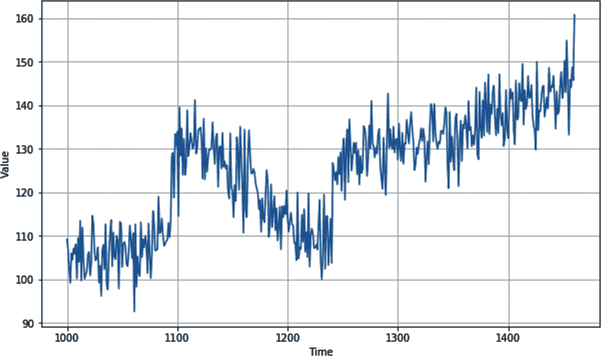
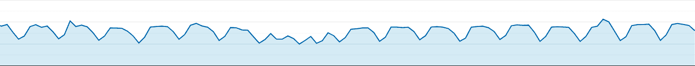
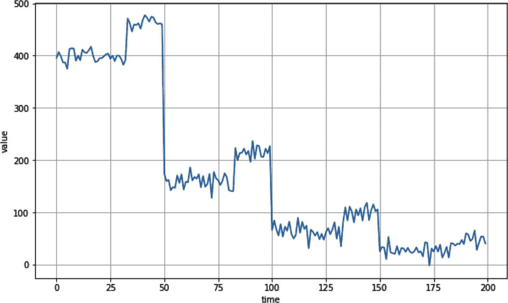
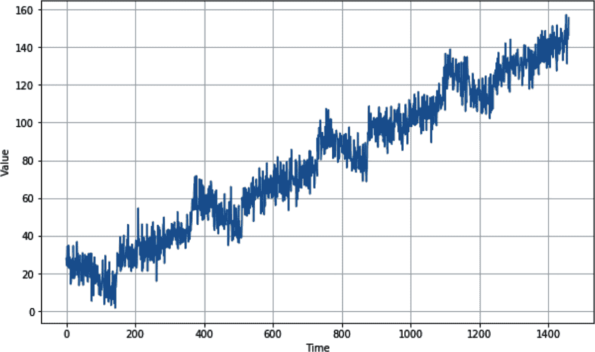

# 第九章\. 理解序列和时间序列数据

时间序列无处不在。你可能已经在天气预报、股价和像摩尔定律这样的历史趋势中看到过它们。如果你不熟悉**摩尔定律**，它预测每两年晶体管数量将大致翻倍——并且近 50 年来，它一直是计算能力和成本未来趋势的一个准确预测者（参见图 9-1）。


###### 图 9-1\. 摩尔定律

###### 注意

图 9-1 中的缺口是该时间段缺失的数据，但总体趋势仍然存在。

*时间序列数据*是一组随时间间隔排列的值，通常按特定顺序或表示事物在时间戳点上的值。当时间序列在图表上绘制时，*x*轴通常是时间性的。通常，时间轴上会绘制许多值，例如在图 9-1 所示的示例中，晶体管的数量是一个绘图，而摩尔定律的预测值是另一个。这被称为*多元时间序列*。如果只有一个值——例如，随时间变化的降雨量——那么它被称为*单变量时间序列*。

根据**摩尔定律**，预测很简单，因为有一个固定且简单的规则可以让我们大致预测未来——这个规则已经持续了大约 50 年。

但对于图 9-2 中所示的时间序列呢？



###### 图 9-2\. 实际世界中的时间序列

尽管这个时间序列是人为创建的（你将在本章后面看到如何做到这一点），但它具有复杂真实世界时间序列的所有属性，如股票图表或描绘季节性降雨的图表。尽管它们看似随机，但时间序列有一些共同属性，有助于设计可以预测它们的机器学习模型，如下一节所述。

# 时间序列的共同属性

尽管时间序列可能看起来是随机的和嘈杂的，但它们通常具有可预测的共同属性。在本节中，我们将探讨其中的一些。

## 趋势

时间序列通常向特定方向移动。在摩尔定律的情况下，很容易看出随着时间的推移，*y*轴上的值增加，存在上升趋势。在图 9-2 中的时间序列也存在上升趋势。当然，这并不总是如此：一些时间序列可能随着时间的推移大致保持水平，尽管有季节性变化，而其他时间序列可能存在下降趋势。例如，这是摩尔定律的逆版本，它预测了晶体管的价格。

## 季节性

许多时间序列在时间上都有重复的模式，这些重复以固定间隔发生，称为*季节*。例如，考虑一下天气中的温度。我们通常每年有四个季节，夏季温度最高。因此，如果你在几年内绘制天气图，你会看到每四个季节出现一个峰值，这就是季节性的概念。但这种现象并不仅限于天气——考虑一下图 9-3，这是一张网站流量的图表。



###### 图 9-3\. 网站流量

它按周绘制，你可以看到定期的低谷。你能猜到它们是什么吗？这个网站是一个为软件开发者提供信息的网站，正如你所预期的那样，周末的流量较少！因此，时间序列有五个高峰日和两个低谷日。数据在几个月内绘制，圣诞节和新年假期大致位于中间，因此你可以看到额外的季节性。如果我把它绘制在几年内，你会清楚地看到额外的年末低谷。

季节性可以在时间序列中表现出多种方式。例如，零售网站的流量可能在周末达到峰值。

## 自相关

时间序列中可能看到的另一个特征是事件后的可预测行为。你可以在图 9-4 中看到这一点，其中存在明显的峰值，但在每个峰值之后，都有一个确定的衰减。这被称为*自相关*。

在这种情况下，我们可以看到一组重复出现的特定行为。自相关可能隐藏在时间序列模式中，但它们具有内在的可预测性，因此包含许多自相关的时间序列可能是可预测的。



###### 图 9-4\. 自相关

## 噪声

正如其名所示，*噪声*是一组似乎随机的扰动，出现在时间序列中。这些扰动导致高度的不确定性，并可能掩盖趋势、季节性行为和自相关。例如，图 9-5 显示了与图 9-4 相同的自相关，但添加了一点点噪声。突然之间，很难看到自相关并预测值。


###### 图 9-5\. 添加噪声的自相关序列

考虑到所有这些因素，让我们探讨如何对包含这些属性的时间序列进行预测。

# 预测时间序列的技术

在我们深入探讨基于机器学习的预测——这是接下来几章的主题之前——我们将探索一些更简单的预测方法。这些方法将使你能够建立一个基准，你可以用它来衡量你的机器学习预测的准确性。

## 创建基准的简单预测

预测时间序列的最基本方法是说，在时间 *t* + 1 的预测值与时间 *t* 的值相同，实际上是将时间序列向前移动了一个周期。

让我们先创建一个具有趋势、季节性和噪声的时间序列：

```py
def plot_series(time, series, format="-", start=0, end=None):
    plt.plot(time[start:end], series[start:end], format)
    plt.xlabel("Time")
    plt.ylabel("Value")
    plt.grid(True)

def trend(time, slope=0):
    return slope * time

def seasonal_pattern(season_time):
    """Just an arbitrary pattern, you can change it if you wish"""
    return np.where(season_time < 0.4,
                    np.cos(season_time * 2 * np.pi),
                    1 / np.exp(3 * season_time))

def seasonality(time, period, amplitude=1, phase=0):
    """Repeats the same pattern at each period"""
    season_time = ((time + phase) % period) / period
    return amplitude * seasonal_pattern(season_time)

def noise(time, noise_level=1, seed=None):
    rnd = np.random.RandomState(seed)
    return rnd.randn(len(time)) * noise_level

time = np.arange(4 * 365 + 1, dtype="float32")
baseline = 10
series = trend(time, .05)  
baseline = 10
amplitude = 15
slope = 0.09
noise_level = 6

# Create the series
series = baseline + trend(time, slope) 
                  + seasonality(time, period=365, amplitude=amplitude)
# Update with noise
series += noise(time, noise_level, seed=42)
```

在绘制这个图表后，你会看到类似 图 9-6 的内容。



###### 图 9-6\. 显示趋势、季节性和噪声的时间序列

现在你有了数据，你可以像任何数据源一样将其分割成训练集、验证集和测试集。当数据中存在季节性，就像在这个例子中看到的那样，在分割序列时确保每个分割中都有完整的季节是个好主意。例如，如果你想将 图 9-6 中的数据分割成训练集和验证集，一个好的分割点可能是时间步长 1,000，这将给你到步骤 1,000 的训练数据和步骤 1,000 之后的验证数据。

然而，你实际上不需要在这里进行分割，因为你只是在做一个简单预测，其中每个值 *t* 只是步骤 *t* – 1 的值，但为了在接下来的几个图表中的说明目的，我们将聚焦于时间步长 1,000 及以后的数据。

要预测从分割时间周期开始的时间序列，其中你想要分割的周期在变量 `split_time` 中，你可以使用如下代码：

```py
naive_forecast = series[split_time – 1:–1]

```

图 9-7 展示了验证集（从时间步长 1,000 开始，通过将 `split_time` 设置为 `1000` 获取）以及叠加的简单预测。


###### 图 9-7\. 时间序列上的简单预测

看起来相当不错——值之间存在关系——当它们随时间绘制时，预测似乎与原始值非常接近。但你是如何衡量准确性的呢？

## 测量预测精度

测量预测精度的方法有很多，但我们将集中讨论两种：*均方误差*（MSE）和*平均绝对误差*（MAE）。

使用均方误差（MSE），你只需计算在时间 *t* 的预测值与实际值之间的差异，将其平方（以消除负数），然后计算所有这些差异的平均值。

使用 MAE，你计算在时间 *t* 的预测值与实际值之间的差异，取其绝对值以消除负数（而不是平方），然后计算所有这些差异的平均值。

对于你根据我们的合成时间序列创建的简单预测，你可以这样获取 MSE 和 MAE：

```py
import torch
import torch.nn.functional as F

# Mean Squared Error
mse = F.mse_loss(torch.tensor(x_valid), torch.tensor(naive_forecast)).item()
print(mse)

# Mean Absolute Error
mae = F.l1_loss(torch.tensor(x_valid), torch.tensor(naive_forecast)).item()
print(mae)

```

我得到了 MSE 为 76.47 和 MAE 为 6.89。与任何预测一样，如果你能减少误差，你就可以提高预测的准确性。我们将在下一部分看看如何做到这一点。

## 更不简单的预测：使用移动平均进行预测

之前的简单预测将时间*t* – 1 的值视为时间*t*的预测值。使用*移动平均*类似，但不是只取*t* – 1 的值，而是取一组值（例如，30 个），计算它们的平均值，并将该平均值设置为时间*t*的预测值。以下是代码：

```py
def moving_average_forecast(series, window_size):
  """Forecasts the mean of the last few values.
 If window_size=1, then this is equivalent to naive forecast"""
  forecast = []
  for time in range(len(series) – window_size):
    forecast.append(series[time:time + window_size].mean())
  return np.array(forecast)

moving_avg = moving_average_forecast(series, 30)[split_time - 30:]

plt.figure(figsize=(10, 6))
plot_series(time_valid, x_valid)
plot_series(time_valid, moving_avg)

```

图 9-8 显示了移动平均与数据的对比图。


###### 图 9-8. 绘制移动平均

当我绘制这个时间序列时，我得到了 49 和 5.5 的均方误差（MSE）和平均绝对误差（MAE），所以它确实略微提高了预测。但这种方法没有考虑到趋势或季节性，所以我们可能可以通过一点分析进一步改进它。

## 改进移动平均分析

由于这个时间序列的季节性为 365 天，您可以通过使用称为*差分*的技术来平滑趋势和季节性，该技术只是从*t*处的值中减去 365 天的值。这将使图表变得平坦。以下是代码：

```py
diff_series = (series[365:] – series[:-365])
diff_time = time[365:]

```

您现在可以计算这些值的移动平均，并将过去值加回：

```py
diff_moving_avg = 
    moving_average_forecast(diff_series, 50)[split_time – 365 – 50:]

diff_moving_avg_plus_smooth_past = 
    moving_average_forecast(series[split_time – 370:–360], 10) + 
    diff_moving_avg

```

当您绘制这个（见图图 9-9）时，您已经可以看到预测值的改进：趋势线非常接近实际值，尽管噪声被平滑了。季节性似乎有效，趋势也是如此。


###### 图 9-9. 改进的移动平均

当您计算均方误差（MSE）和平均绝对误差（MAE）时，这种印象得到了证实——在这种情况下，我得到了 40.9 和 5.13，分别显示了预测的明显改进。

# 摘要

本章介绍了时间序列数据及其一些常见属性。您创建了一个合成时间序列，并看到了如何开始对其做出天真预测，并从这些预测中，您使用均方误差（MSE）和平均绝对误差（MAE）建立了基线测量。合成数据也是一个真正酷炫的探索领域——希望，本章中您探索的一些技术将对您的学习之旅有所帮助。

本章从 PyTorch 和机器学习（ML）中得到了一个很好的休息，但在下一章中，您将回到使用机器学习来查看是否可以提高您的预测！
