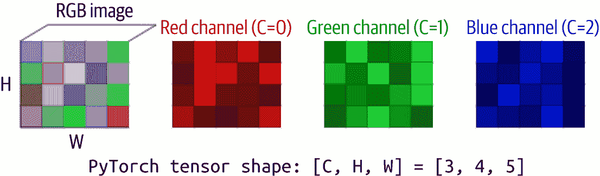

# 第十二章\. 推理概念

在本书的前几章中，你专注于使用 PyTorch 来*训练*模型，以及如何创建管理图像（即计算机视觉）、文本内容（即自然语言处理）和序列建模的模型。在本书的剩余部分，你将涵盖大量关于*使用训练好的模型*从新数据中进行预测（即*推理*）的内容，特别是使用大型生成模型进行文本到文本和文本到图像的生成式 AI。

但在你深入之前，了解底层的数据传输技术非常重要。我们在训练章节中略有涉及，但随着你深入到机器学习——无论是训练还是推理——理解张量的底层概念非常重要。

最终，无论你有什么类型的数据，你都需要将其转换为张量以传递给模型。同样，无论你希望以何种数据类型向用户展示模型的结果，你都会以张量的形式得到它们！

在许多情况下，你将拥有辅助函数，例如在第十五章（涵盖 LLMs）中看到的*transformers*，以及在第十九章（处理图像生成）中看到的*diffusers*。虽然你不会直接使用张量，但它们仍然在幕后被使用。

# 张量

一个*张量*是一个可以具有任意数量维度的数组。张量通常用于表示深度学习算法的数值数据；它们是可以在多个维度中容纳数字的容器。

张量可以是简单的标量值（在零维度），向量（在一维），矩阵（在二维），以及更多（在三维或更多维度）。在 PyTorch 中，它们是所有计算的基本数据结构。

张量也是谷歌的替代深度学习框架*TensorFlow*名称的来源。

这里有一些 PyTorch 中张量的例子，它们是通过使用`torch.tensor`创建的：

```py
import torch

# Scalar (0D tensor)
scalar = torch.tensor(42)  # Single number

# Vector (1D tensor)
vector = torch.tensor([1, 2, 3, 4])  # Array of numbers

# Matrix (2D tensor)
matrix = torch.tensor([[1, 2, 3],
                      [4, 5, 6]])  # 2x3 grid of numbers

# 3D tensor
cube = torch.tensor([[[1, 2], [3, 4]],
                    [[5, 6], [7, 8]]])  # 2x2x2 cube of numbers
```

使张量对机器学习如此有用的原因是这种能够容纳不同值类型的灵活性。数字可以是 0 维张量，表示文本的嵌入向量可以是 1 维，图像可以是 3 维，具有高度、宽度和像素值维度。此外，所有这些都可以添加一个额外的维度用于批次。例如，单个图像可以是一个 3 维矩阵，但 100 个图像而不是 100 个 3 维矩阵可以是一个 4 维张量，第四维是图像的索引！

当你使用`torch.tensor`时，请记住，已经投入了大量工作和投资来优化它们在 GPU 上的运行，这使得它们在深度学习计算中非常高效。

# 图像数据

图像通常以 JPEG 或 PNG 等格式存储，这些格式既优化了**人类**的观看效果，也提高了存储效率。图像中的每个点（或像素）通常由多个值组成，每个值代表一个颜色通道的强度。通常，一个图像将包含 24 位数据，每个颜色通道分配 8 位。如果你看到 32 位，那么额外的 8 位是用于 alpha 通道，或透明度通道。

例如，一个绿色的像素可能在红色、蓝色和 alpha 通道上的值为 0，而在绿色通道上的值为 255。如果它是半透明的，它可能在红色和蓝色通道上仍然有值为 0，在 alpha 通道上有值为 128，而在绿色通道上有值为 255。

图像文件通常是**压缩**的，这意味着已经对其应用了数学转换以避免数据浪费并减小图像大小。图像还可以包含元数据、文件头等信息。然后，一旦图像被加载到内存中，它通常会被解压缩到之前描述的每像素 32 位。

机器学习模型通常使用介于-1 和 1 之间的值，而不是图像存储的原始值 0 到 255。如果我们想学习图像的细节，通过关注像素强度之间的**变化**而不是仅仅关注它们的值来标准化这些值是有益的。因此，一种方法是通过对像素值与平均值和标准偏差的距离进行标准化来实现。这给出了一组更广泛的价值范围，可以导致更平滑的损失曲线和更有效的学习。

在 PyTorch 中，你可以用如下代码实现：

```py
import torch
from torchvision import transforms
from PIL import Image

def prepare_image(image_path):
    # Load the image using PIL
    raw_image = Image.open(image_path)

    # Define the transformations
    preprocess = transforms.Compose([
        transforms.Resize(256),
        transforms.CenterCrop(224),
        transforms.ToTensor(),
        transforms.Normalize(
            mean=[0.485, 0.456, 0.406],
            std=[0.229, 0.224, 0.225]
        )
    ])

    # Apply transformations
    input_tensor = preprocess(raw_image)

    # Add batch dimension
    input_batch = input_tensor.unsqueeze(0)
    return input_batch
```

此代码使用一个非常流行的 Python 库，称为 Pillow，或简称 PIL。

在这种情况下，`PIL Image.open`将读取图像，将其解压缩成像素，然后对这些像素应用一系列转换。这些转换将通道归一化到机器学习友好的值，如前所述，然后将它们转换为张量。

`input_tensor`随后是一个 3D 矩阵/张量，但如果我们想在单个批次中包含多个这样的张量，我们可以通过*unsqueeze*这个张量来添加一个新维度，使其成为一个 4D 张量。

你可以将图 12-1 中的单个图像视为一个 3D 张量，每个维度对应一个颜色深度。



###### 图 12-1\. 表示全彩图像的张量

然后，如果有图像批次，你可以将其视为图 12-2 中的第四维度。


###### 图 12-2\. 表示彩色图像批次的张量

# 文本数据

通常，文本以字符串的形式存储，例如“猫坐在垫子上”，但训练模型或将此类文本传递给预训练模型是不切实际的。正如您在前面章节中看到的，模型是在数值数据上训练的——而做到这一点最好的方式是将文本*标记化*，通过将单词或子词转换为数字，或者通过将文本*计算嵌入*，将它们转换为向量。如果您选择计算文本的嵌入，您还可以将文本的情感编码到向量的方向中（参见第六章）。

因此，作为一个简单的例子，让我们考虑以下句子：

```py
texts = [
    "I love my dog",
    "The manatee became a doctor"
]
```

您可以使用标记化器将此文本标记化为一系列数字。您可以从语料库中创建自己的标记化数字序列，就像您在第五章中所做的那样，或者您可以使用现有的一个，如下所示：

```py
import torch
from transformers import BertTokenizer, BertModel

def text_to_embeddings(texts):
    # Load pretrained BERT tokenizer and model
    tokenizer = BertTokenizer.from_pretrained('bert-base-uncased')
    model = BertModel.from_pretrained('bert-base-uncased')
    model.eval()  # Set to evaluation mode

    # Tokenize the input texts
    encoded = tokenizer(
        texts,
        padding=True,      # Pad shorter sequences to match longest
        truncation=True,   # Truncate sequences that are too long
        return_tensors='pt'  # Return PyTorch tensors
    )

```

您将在第十三章开始学习更多关于 transformers 的知识，包括如何使用它们进行 BERT。

这里重要的一行是最后一行，其中我们要求标记化器以 PyTorch 格式返回张量。您可以在编码的输出中看到这个结果，如下所示：

```py
Encodings: 
tensor([[  101,  1045,  2293,  2026,  3899,   102,     0,     0],
        [  101,  1996, 24951, 17389,  2150,  1037,  3460,   102]])
```

如果您仔细探索，您会看到两个句子已经被转换成一系列数字。第一个句子有四个单词，有六个数字，第二个句子有六个单词，有八个数字。每个都有 101 这个数字在前面和 102 这个数字在后面，这给了我们两个额外的标记。这些是编码器添加的特殊标记，用于指示句子的开始和结束。

字符串可以被表示为一个 1D 向量，但这里我们有多个字符串，所以我们可以给 1D 添加一个维度来得到 2D，第二个维度给出了每个字符串。所以，第二个维度中的值 0 是第一个字符串，值 1 是第二个字符串，等等。

BERT 模型还可以通过获取句子中每个单词的嵌入并将它们全部相加来从句子创建嵌入。在 BERT 的基础模型版本中，每个嵌入向量是一个包含 768 个值的 1D 矩阵。句子的嵌入也是相同的。多个句子，就像之前的编码一样，将会有一个第二维度。

这里是代码：

```py
# Generate embeddings
with torch.no_grad():  # No need to calculate gradients
    outputs = model(**encoded)
    embeddings = outputs.last_hidden_state

```

每个嵌入有 768 个值，所以我不打算全部打印出来，但对于代表第一句子的嵌入，您可以看到这样的值：

```py
First word embedding (first 5 values): 
        tensor([ 0.0401,  0.3046,  0.0669, –0.1975, –0.0103])
```

如果你现在还没有完全理解这一点，请不要担心——我们将在第十三章开始更详细地介绍这个话题。第十三章的重要观点是，张量的概念是一个非常灵活的矩阵，它可以有任意数量的维度，为模型提供一致性的输入。你不需要在不同的数据类型上训练模型——它们始终是输入为张量，输出为张量。

# 模型外的张量

如前所述，张量的力量在于它们的连贯性——无论你将什么类型的数据传递到模型中，当它们是张量时，你可以在编码接口上保持一致性。同样的原则也适用于模型外的张量。

例如，考虑一个包含超过 21000 个类别中 1500 万张图片的数据集`ImageNet`。当你设计一个用于识别该数据集中图像的模型时，你需要超过 21000 个输出神经元，每个神经元都会给出一个百分比，表示图像属于代表性类别的可能性。例如，如果神经元 0 代表“金鱼”，那么当你进行推理时从它输出的值将是图像包含金鱼的概率！

因此，模型不是输出分类，而是会暴露其每个输出神经元的值。这些值通常被称为*logits*。

这个值列表是一个一维向量——因此，当然，张量是适当的数据类型。

这里有一个模拟示例，其中包含从多个图像传递到模型中的多个代表性输出和类别名称列表：

```py
# ImageNet class labels (simplified - just a few examples)
class_names = [
    'tench', 'goldfish', 'great white shark', 'tiger shark', 'hammerhead shark',
    'electric ray', 'stingray', 'rooster', 'hen', 'ostrich', 'brambling',
    'goldfinch', 'house finch', 'junco', 'indigo bunting', 'robin', 'bulbul',
    'jay', 'magpie', 'chickadee'
]

# Simulate model output for demonstration
# This would normally come from model(input_tensor)
example_output = torch.tensor([
    [ 1.2,  4.5, –0.8,  2.1,  0.3,  # First image predictions
     –1.5,  0.9,  3.2, –0.4,  1.1,
      0.5, –0.2,  1.8,  0.7, –1.0,
      2.8,  1.6, –0.6,  0.4,  1.3],
    [–0.5,  5.2,  0.3,  1.4, –0.8,  # Second image predictions
      0.9,  1.2,  2.8,  0.6,  1.5,
     –1.1,  0.4,  2.1,  0.2, –0.7,
      1.9,  0.8, –0.3,  1.6,  0.5]
])

```

注意，因为输出是*张量*，我们可以使用许多内置到 PyTorch 中且针对张量优化的函数来处理它们。

在处理输出值时，我们希望找到最好的值，并可能限制它们的范围。Softmax 非常适合这个任务，当它将原始输出转换为概率时——而 TopK 用于选择最好的*k*个值。以下是一个示例，其中我们可以使用 Softmax 和 TopK 函数来管理张量，无论它们的维度如何：

```py
def interpret_output(output_tensor, top_k=5):
    # Apply softmax to convert logits to probabilities
    probabilities = torch.nn.functional.softmax(output_tensor, dim=1)

    # Get top k probabilities and class indices
    top_probs, top_indices = torch.topk(probabilities, k=top_k)

    # Convert to numpy for easier handling
    top_probs = top_probs.numpy()
    top_indices = top_indices.numpy()

    return top_probs, top_indices
```

然后，可以将这些值转换为 NumPy，这样其他代码——比如打印出这些值——将更容易工作。

我们可以在这里看到这个输出，其中使用了 Softmax 和 TopK 来解释数据并打印出来：

```py
Image 1 Predictions:
------------------------
Raw logits (first 5): [1.2000000476837158, 4.5, –0.800000011920929, 
                       2.0999999046325684, 0.30000001192092896]

Top 5 Predictions:
1. goldfish: 52.3%
2. rooster: 14.2%
3. robin: 9.5%
4. tiger shark: 4.7%
5. house finch: 3.5%
```

这本书的完整代码可以在[GitHub 仓库](https://github.com/lmoroney/PyTorch-Book-FIles)中找到。

# 摘要

在本章中，你简要地了解了张量及其背后的理念——它们是一种灵活的数据结构，可以用来表示将数据*放入*机器学习模型的最佳方式，无论它代表什么，甚至可以批量处理。它还提供了一种管理模型输出的连贯方式——其中值通常通过输出层中排列成列表的神经元发出。因此，通过能够处理张量，你可以为数据如何在模型中*流入*和*流出*打下基础。

有了这些，我们现在将从模型训练切换到推理阶段，特别是使用生成式 AI，首先从注册表和中心获取模型。
