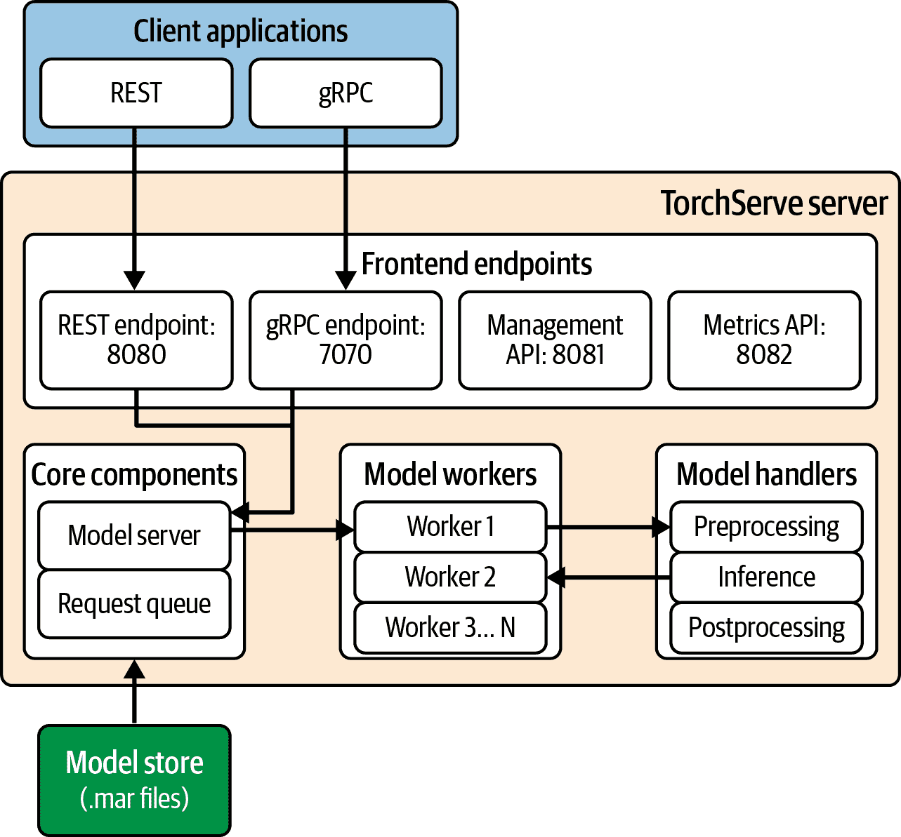
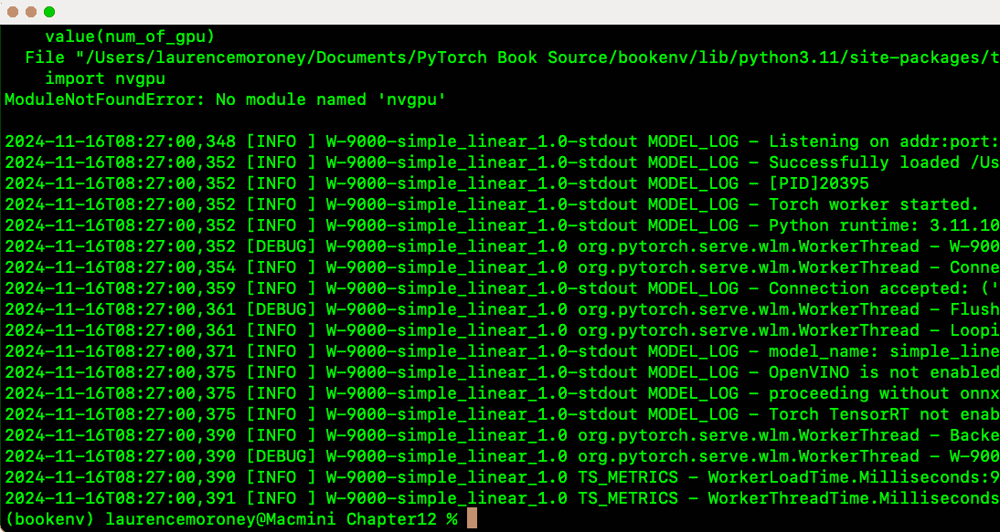

# 第十三章\. 为服务托管 PyTorch 模型

在本书的前几章中，我们探讨了训练机器学习模型的各种场景，包括计算机视觉、自然语言处理和序列建模。但那只是第一步——如果没有其他方式让其他人使用其力量，模型几乎毫无用处！在本章中，我们将简要浏览一些更受欢迎的工具，这些工具可以帮助你为它们提供使用其功能的方法。

你应该注意，将训练好的 PyTorch 模型部署到生产就绪的服务中，将涉及比仅仅部署它多得多的工作，并且机器学习操作（MLOps）学科正是为此而设计的。当你进入这些模型的服务领域时，你需要了解新的挑战，例如处理实时请求、管理计算资源、确保可靠性和在变化的工作负载下维持性能。

最终，MLOps 是关于弥合数据科学与软件工程之间的差距。这超出了本章的范围，但市面上有一些关于这个主题的出色书籍，来自 O'Reilly 出版社，包括由 Yaron Haviv 和 Noah Gift 所著的[*在企业中实施 MLOps*](https://learning.oreilly.com/library/view/implementing-mlops-in/9781098136574)和由 Abi Aryan 所著的[*LLMOps*](https://learning.oreilly.com/library/view/llmops/9781098154196)。

本章将介绍两种在生产环境中服务 PyTorch 模型的热门方法。

我们将从 TorchServe 开始，这是 PyTorch 的官方服务解决方案，它提供了一个专为大规模服务深度学习模型而设计的强大框架。TorchServe 为标准服务需求提供了现成的解决方案，如模型版本控制、A/B 测试和指标收集。它也是寻找具有最小设置即可投入生产的解决方案的团队的绝佳选择。

然后，我们将探讨如何使用流行的 Flask 框架构建服务解决方案，这对于需要更多灵活性或具有更直接服务需求的开发者来说是一个很好的选择。Flask 的简单性和广泛的生态系统也使其成为小型部署和概念验证服务的绝佳选择。

在你完成本章的过程中，你将采取一种动手实践的方法，其中你将使用在前几章中创建的一些模型，让我们带你了解如何部署它们，然后调用它们的托管服务器进行推理。

# 介绍 TorchServe

*TorchServe*是 PyTorch 的默认服务框架，旨在提供性能和灵活性。你可以在[*pytorch.org/serve*](http://pytorch.org/serve)找到它。

TorchServe 的最初目标是成为一个关于如何以模块化和可扩展的架构正确服务模型的参考实现，但它已经发展成为一个功能齐全、专业级的框架，可能足以满足任何服务需求。

它还基于模块化架构，旨在处理大规模服务模型的复杂性。为此，它由以下关键组件构建：

模型服务器

PyTorch 模型服务器是处理模型生命周期并处理所有推理请求的中心组件。它提供模型管理和推理的端点，支持 REST 和 gRPC 调用。

模型工作者

这些是独立的过程，它们加载模型并在其上进行推理。每个过程都是隔离的，因此在多模型服务环境中，它们被设计为在某个模型出现问题的情况下继续运行。

前端处理器

这些是处理特定模型类型的前处理、推理和后处理的自定义 Python 类。正如你将看到的，当我们实际操作时，前端处理器是对模型训练代码的补充，创建单独的处理器类是良好的实践。

模型存储

PyTorch 中的模型服务使用“模型存档”或 MAR 文件作为可服务对象。一旦你训练了你的模型，你将将其转换为这种格式。模型存储就是这些文件存放的地方。

你可以在图 13-1 中看到 TorchServe 系统的架构图。



###### 图 13-1\. TorchServe 服务器基础设施

对于推理，客户端应用程序将通过 REST（通过默认端口 8080）或 gRPC（通过默认端口 7070）调用服务器基础设施。它还分别在 8081 和 8082 提供管理端点。

端点将调用核心模型服务器，然后服务器将启动适当数量的模型工作者。工作者将与模型处理器接口进行预处理、推理和后处理。模型本身将存储在模型存储中，如果它不在内存中，模型服务器将使用请求队列来加载它。

在下一节中，我们将探讨如何设置 TorchServe 服务器并使用它为你在第一章中创建的第一个模型提供推理。

# 设置 TorchServe

我发现，如果我能通过一个简单但具有代表性的场景一步一步地学习，那么学习某样东西会更容易。因此，对于 TorchServe，我们首先安装环境，然后从这里开始工作。

## 准备你的环境

我强烈建议使用虚拟环境，我将在本章中使用 venv，这是 Python 社区免费提供的，你可以在[Python 文档](https://oreil.ly/FNsPt)中找到它。

即使你之前使用过虚拟环境，我也建议从一个新的环境开始，以确保你将安装和使用正确的依赖项集合。

你可以创建一个虚拟环境，如下所示：

```py
python3 -m venv chapter12env
```

一旦你完成了这些，你可以用以下方式启动它：

```py
source chapter12env/bin/activate
```

然后，您就准备好安装 PyTorch 了。为了开始，我建议安装 TorchServe、模型归档器和工作流程归档器，如下所示：

```py
pip install torchserve torch-model-archiver torch-workflow-archiver
```

您不仅限于这些，您通常还需要安装其他依赖项。使用 TorchServe 的工作中的一个困难是错误可能隐藏在日志文件中，因此很难确定您还需要哪些依赖项。至少，我发现从干净的系统开始，在版本 11 之后，我还需要安装 JDK 和 PyYAML。您的体验可能会有所不同。

完成这些操作后，您可以切换到您想要工作的目录，并在其中创建一个名为 `model_store` 的子目录：

```py
mkdir model_store
```

在此基础上，您需要做的第一件事是为您的 PyTorch 服务器设置配置文件。它将是一个名为 *config.properties* 的文件。

## 设置您的 config.properties 文件

这个文件中有很多内容，您可以在 [PyTorch 网站上](https://oreil.ly/czQh5)了解更多信息。但重要的设置是推理和管理地址，分别设置为 0.0.0.0 和 8080/8081（类似于 图 13-1 中所示）。此外，将模型存储目录设置为刚刚创建的目录也很重要。我还将其设置为将调试信息记录到日志中，以帮助捕获依赖性问题：

```py
# config.properties
inference_address=http://0.0.0.0:8080
management_address=http://0.0.0.0:8081
metrics_address=http://0.0.0.0:8082
number_of_netty_threads=32
job_queue_size=1000
model_store=model_store
default_response_timeout=120
default_workers_per_model=1
log_level=DEBUG
```

确保这些设置在一个名为 *config.properties* 的文件中。

## 定义您的模型

在 第一章 中，您创建了一个模型，该模型学习了两组数字之间的关系，当描述这种关系的方程为 *y* = 2*x* – 1 时。当您为服务准备模型时，将模型定义和模型训练分开到不同的文件中是一种最佳实践。然后，模型定义文件将用于另一个名为 *handler* 的 Python 文件中，您将很快看到。因此，为此目的，您应该创建一个模型定义文件，如下所示：

```py
import torch
import torch.nn as nn

class SimpleLinearModel(nn.Module):
    def __init__(self):
        super().__init__()
        self.linear = nn.Linear(1, 1)

    def forward(self, x):
        return self.linear(x)
```

然后，将此保存到名为 *linear.py* 的文件中，这样您就可以使用以下代码加载和训练它。请注意，`import` `SimpleLinearModel` 被加粗了：

```py
import torch
import torch.nn as nn
import torch.optim as optim
from linear import SimpleLinearModel

def train_model():
    model = SimpleLinearModel()
    optimizer = optim.SGD(model.parameters(), lr=0.01)
    criterion = nn.MSELoss()

    xs = torch.tensor([[–1.0], [0.0], [1.0], [2.0], [3.0], [4.0]], 
                      dtype=torch.float32)
    ys = torch.tensor([[–3.0], [–1.0], [1.0], [3.0], [5.0], [7.0]], 
                      dtype=torch.float32)

    for _ in range(500):
        optimizer.zero_grad()
        outputs = model(xs)
        loss = criterion(outputs, ys)
        loss.backward()
        optimizer.step()

    return model
# Save model
model = train_model()
torch.save(model.state_dict(), "model.pth")
```

特别注意最后一行，在训练模型后，它被保存为 *model.pth* 文件，以及这段代码：`mode.state_dic()`，它保存了 *状态字典*（即训练模型的当前状态）。我发现这种保存模型的方式与 TorchServe 一起使用效果最佳。

然后，运行此代码以获取文件。您将稍后使用此文件创建一个放入模型存储的 *.mar* 文件。我们稍后会看到这一点，但首先，我们需要一个处理文件。您将在下一节中探索它。

## 创建处理文件

一旦训练并保存了模型，你需要创建处理文件。处理器的任务是执行推理服务中的繁重工作——它加载你的模型，处理数据预处理，执行推理，并处理任何后处理，将推断值转换回用户可能需要的格式。

此文件应继承自`base_handler` torch 类，如下所示：

```py
from ts.torch_handler.base_handler import BaseHandler
```

完成此操作后，你需要创建一个模型处理器类，该类覆盖此基类并实现多个方法。

让我们从类声明和初始化开始。这相当直接：只是报告类初始化：

```py
class ModelHandler(BaseHandler):
    def __init__(self):
        super().__init__()
        self.initialized = False
        logger.info("ModelHandler initialized")
```

注意，在此代码中，`initialized`属性被设置为`False`。这看起来可能有些奇怪，但这里的想法是，此代码将初始化*类*，但直到调用`initialize`自定义函数之前，它将不会准备好使用。该函数将加载模型并使其准备好进行推理，此时我们将`self.initialized`设置为`True`。请注意，模型被初始化为`SimpleLinearModel`，因此你需要以与训练代码相同的方式导入它。

这里是代码：

```py
def initialize(self, ctx):
    self.manifest = ctx.manifest
    properties = ctx.system_properties
    model_dir = properties.get("model_dir")

    # Load model
    serialized_file = "model.pth"
    model_pt_path = os.path.join(model_dir, serialized_file)
    self.device = torch.device("cuda:" + str(properties.get("gpu_id")) 
                  if torch.cuda.is_available() else "cpu")

    # Initialize model
    self.model = SimpleLinearModel()
    state_dict = torch.load(model_pt_path, weights_only=True)
    self.model.load_state_dict(state_dict)
    self.model.to(self.device)
    self.model.eval()

    self.initialized = True
    return self
```

它首先读取`ctx.manifest`——这是*MAR*文件中的信息（如模型目录），它允许你使用模型。我们将在稍后看到如何创建该文件。

代码的其余部分相当直接：我们创建了一个模型实例（称为`SimpleLinearModel`，如前述代码所示），并从保存的位置（*model.pth*）加载其权重。然后，我们可以将模型推送到设备，在那里我们将进行推理，例如 CPU 或 CUDA（如果可用）。然后，我们将模型置于评估模式以进行推理。我发现，如果你使用状态字典保存模型，TorchServe 将运行得最好，所以请确保按如下所示加载它。

在这一点上，我们将`self.initialized`设置为`True`，我们就准备好进行推理了！

我们需要覆盖的下一个方法是*预处理方法*，它将接收输入数据并将其转换为模型所需格式。你可以通过多种方式将数据发送到后端服务器，而在预处理函数中你会处理这些数据。例如，你可以只接受基本参数，或者允许用户发送一个 JSON 文件。这取决于你，而 TorchServe 架构中的这种灵活性为这些可能性打开了大门。

为了简化，我将在代码中只接受一个基本参数：

```py
def preprocess(self, data):
    # Get the value directly without decoding
    value = float(data[0].get("body"))
    tensor = torch.tensor([value], dtype=torch.float32).view(1, 1)
    return tensor.to(self.device)
```

如你所见，这个的主要目的不仅是要*获取*参数，还要将它们*重新格式化*成模型需要的格式。因此，它从请求调用中获取参数并将其转换为单维张量，然后将其返回。这个张量将在推理方法中使用。

下一个需要覆盖的方法是推理方法，在这里我们将数据传递给模型并获取其响应。以下是代码：

```py
def inference(self, data):
    """Run inference on the preprocessed data"""
    with torch.no_grad():
        results = self.model(data)
    return results
```

这一步接收来自前一步的预处理数据，因此我们只需传入这些数据就可以得到输出。我们使用`torch.no_grad()`来运行它，因为我们不感兴趣于反向传播，只进行直接推理。

最后，是后处理。最终用户不期望得到一个张量，但他们期望得到更多可读性强的数据，所以我们执行预处理步骤的反向操作，并使用 NumPy 将结果转换回浮点数：

```py
def postprocess(self, inference_output):
    """Return inference result"""
    return inference_output.tolist()
```

这些步骤，正如你所见，非常定制化地针对这个模型，我故意使它们尽可能简单，以便你能看到流程——但其他模型的一般架构仍然保持不变，无论其复杂程度如何。目标是给你提供一个标准的方式来解决问题，并且像这样扩展`BaseHandler`的代码使你能够轻松利用服务器基础设施的所有未观察到的方面——尤其是，传递数据！

## 创建模型存档

从一个训练好的模型开始，你可以通过调用`torch-model-archiver`来创建它的存档文件，这是一个作为 TorchServe 一部分提供的命令行工具。

在这里，你需要注意几点并小心处理。以下是命令，之后我会讨论参数：

```py
torch-model-archiver 
  --model-name simple_linear
  --version 1.0
  --serialized-file model.pth
  --handler model_handler.py
  --model-file models/linear.py
  --export-path model-store
  --force
  --extra-files models/linear.py,models/__init__.py
```

在运行之前，确保你有一个用于存储存档模型的`*model-store*`（或类似）目录。不要与你的源代码混淆！这可以简单地是一个子目录，你将在`export-path`参数中指定该目录。

`model-name`参数将指定模型存储中的模型名称。你可以称它为任何你想要的名字——它不必是类名。在这个例子中，我称它为`simple-linear`。

`version`参数可以是任何你想要的内容，你将用它来跟踪。当你为新的场景或错误修复训练模型的新版本时，你可能会想要记录哪个版本做了什么。你可以在这里让服务器知道这一点。

当你训练模型时，你将权重和状态字典保存到了一个文件中。你使用`serialized-file`参数指定这个文件。在这个例子中，它是`model.pth`。

使用`handler`参数指定处理文件。

我遇到的一个常见问题是模型训练文件包含模型定义，并且处理器也包含它。TorchServe 对此模型定义的位置感到困惑，这就是为什么我在这个例子中将它分离出来。但如果你需要这样做，重要的是要指定模型定义的位置，你可以通过`model-file`参数来实现。请注意，遵循此方法时，你还应该使用`extra-files`参数指向模型文件的位置。为了使模型文件可以被模型训练和模型处理器作为包导入，我将文件放在一个名为`models`的目录中，并在其中放置一个名为`__init__.py`的空文件。为了确保模型存档器使用这些文件，`extra-files`参数中指定了这两个文件。

`force`参数只是覆盖`model-store`目录中任何现有的模型存档。当你学习时，此参数可以让你在尝试不同的事情时不必手动删除模型存档。然而，在生产系统中，你应该小心使用它！

一旦这一行运行正确，你的`model-store`目录应该包含一个`simple_linear.mar`文件。

## 启动服务器

一旦你创建了存档，你可以启动 TorchServe 并让它加载该模型。以下是一个示例命令：

```py
torchserve
  --start
  --model-store model-store
  --ts-config config/config.properties
  --disable-token-auth
  --models simple_linear=model_store/simple_linear.mar
```

`start`参数指示 TorchServe 启动。你也可以用`--stop`以同样的方式停止它执行（并让你的终端充满文本）。

`model-store`参数也应该指向你存储之前创建的*.mar*文件的目录。

`ts-config`参数应该指向你之前创建的配置属性文件。

当你在学习和测试时，你可以使用`--disable-token-auth`，这样你发送给服务器的测试模型命令就不需要认证。然而，在正式的生产系统中，你可能不想使用它！

`models`参数是你希望服务器向用户提供的模型列表。在这种情况下，只有一个，就是我们定义的`simple_linear`模型。如果你将此模型的路径作为值提供，你会看到它在`model_store`中的`mar`文件位置。

如果一切顺利，你应该会在你的终端中看到 TorchServe 启动，并给你一堵状态文本墙，有点像图 13-2。

注意，如果这个文本不断滚动，那么很可能在启动 TorchServe 时出现了错误。根据经验，我会说 TorchServe 需要一些依赖（如 PyYAML）尚未安装。如果是这种情况，那么配置文件被设置为调试模式，你可以检查`logs`目录中的`models_log.log`文件以了解发生了什么。

您可能还会看到类似于 图 13-2 中的错误，其中找不到 `nvgpu` 模块。此模块由 TorchServe 用于使用 Nvidia GPU 进行基于 GPU 的推理。由于在这种情况下我在 Mac 上运行，您可以安全地忽略此错误，并且所有推理都将按照处理程序中的代码在 CPU 上运行。



###### 图 13-2\. 启动 TorchServe

## 测试推理

一旦服务器成功启动并运行，您可以通过在另一个终端中使用 `curl` 来测试它。

因此，要从模型获取推理，您可以使用以下 `curl` 命令：

```py
curl -X POST http://127.0.0.1:8080/predictions/simple_linear -H 
                       "Content-Type: text/plain" -d "5.0"
```

注意，这是一个对预测端点的 HTTP POST 请求。我们指定了与之前定义的 *.mar* 文件相对应的 `simple_linear` 模型名称，然后我们可以添加带有 `-H` 参数的标题（作为纯文本），包含数据 `5.0`。

如您所回忆的，该模型学习到的线性关系是 *Y* = 2*x* – 1，因此在这种情况下，*x* 将是 5，结果将是一个接近 9 的数字。

返回结果应如下所示：

```py
[
  8.997674942016602
]
```

您的值可能会有所不同，这取决于您的模型是如何训练的，但它应该是一个非常接近 9 的值。

您还可以使用管理端点来检查服务器托管的所有模型，如下所示：

```py
curl http://localhost:8081/models
```

服务器上的每个模型将包含 *.mar* 文件的名称和位置：

```py
{
  "models": [
    {
      "modelName": "simple_linear",
      "modelUrl": "model_store/simple_linear.mar"
    }
  ]
}

```

注意，在您对模型进行推理时，您使用了 `predictions` 端点后跟一个模型名称，在那个例子中是 `simple_linear`。此键应映射到该模型集合中的模型名称，否则您将收到错误。

最后，如果您想探索特定模型的详细信息，您可以通过管理 URL（通过端口 8081，如之前所述）调用模型的端点和您想了解更多信息的模型的名称：

```py
curl http://localhost:8081/models/simple_linear
```

服务器将返回有关该模型的详细规格，以及您可以使用这些信息来帮助调试任何问题的信息。以下是一个示例：

```py
[
  {
    "modelName": "simple_linear",
    "modelVersion": "1.0",
    "modelUrl": "model_store/simple_linear.mar",
    "runtime": "python",
    "minWorkers": 1,
    "maxWorkers": 1,
    "batchSize": 1,
    "maxBatchDelay": 100,
    "responseTimeout": 120,
    "startupTimeout": 120,
    "maxRetryTimeoutInSec": 300,
    "clientTimeoutInMills": 0,
    "parallelType": "",
    "parallelLevel": 0,
    "deviceType": "gpu",
    "continuousBatching": false,
    "useJobTicket": false,
    "useVenv": false,
    "stateful": false,
    "sequenceMaxIdleMSec": 0,
    "sequenceTimeoutMSec": 0,
    "maxNumSequence": 0,
    "maxSequenceJobQueueSize": 0,
    "loadedAtStartup": true,
    "workers": [
      {
        "id": "9000",
        "startTime": "2024-11-16T08:26:59.394Z",
        "status": "READY",
        "memoryUsage": 0,
        "pid": 20395,
        "gpu": true,
        "gpuUsage": "failed to obtained gpu usage"
      }
    ],
    "jobQueueStatus": {
      "remainingCapacity": 1000,
      "pendingRequests": 0
    }
  }
]
```

注意，例如，`deviceType` 预期的是 `gpu`。然而，由于我在这台系统上没有 `nvgpu`（请参阅关于您运行服务器时的早期说明），它无法从 GPU 加载，并且工作者报告了这一点。在我的开发箱中，这种情况是可以接受的，因为我没有 Nvidia GPU——但是如果您在确实有 Nvidia GPU 的服务器上运行此操作，那么这条消息是您需要跟进的，并且很可能是您处理文件中的问题。

## 进一步学习

上述是一个裸骨示例，旨在帮助你理解 TorchServe 的工作原理。随着你使用更复杂的模型并处理更复杂的数据，这里遵循的基本模式也应该如此。特别是，在处理文件中对预处理、推理和后处理的分解是一个巨大的帮助！此外，PyTorch 生态系统为常见场景提供了附加组件，以帮助你避免一开始就必须编写预处理代码！例如，如果你对图像分类感兴趣，并且担心将图像转换为张量以便进行推理，那么 `ImageClassifier` 类基于基本处理程序为你完成这项工作，你可以在不编写预处理器的情况下进行图像分类。要了解更多关于这一功能的实际应用，请查看 PyTorch 仓库中的开源示例。特别是，你可以访问 [这个 GitHub 页面](https://oreil.ly/YA4v4) 来了解如何为 MNIST 图像创建处理程序。

你会在那个仓库中找到更多有用的示例，但我仍然建议首先完成我们在这里展示的裸骨示例的设置。这里有众多步骤和概念，很容易迷失在迷宫中。

# 使用 Flask 提供服务

虽然 TorchServe 非常强大，但还有一个超级容易使用的优秀替代品，那就是 Flask。Flask 是一个轻量级且灵活的 Python 网络框架，它能够高效地开发网络应用程序和 API。

你可以使用 Flask 构建从最小单端点服务到复杂网络应用程序的一切，只需几行代码。它通过为你提供托管模型进行推理的能力，完美地补充了 PyTorch，我们将在本节中探讨这一点。

作为微框架，Flask 提供了网络开发的基本组件——路由、请求处理和模板化——同时允许你根据需要选择额外的功能。它高度可扩展，包括后端数据库、身份验证等功能，还有现成的扩展生态系统可供使用。正因为如此，Flask 已经成为网络开发的标准工具，为各个规模和行业的应用程序提供动力。

在本章中，我们将仅从托管模型的角度探索 Flask，但我鼓励你对框架进行更深入的研究，如果你对托管 Python 代码（而不仅仅是 PyTorch）感兴趣！

现在，让我们看看我们为 TorchServe 使用的相同示例。这将帮助你看到 Flask 如何使应用程序的提供变得简单！

## 为 Flask 创建环境

首先，为了使用 Flask，你需要安装它及其依赖项。如果你一直在使用本章早些时候相同的环境，你可以简单地使用以下命令更新它：

```py
pip install flask
```

然后，只需确保你有一个模型定义和训练文件——与本章前面提到的完全相同——并且你已经训练了一个模型，并以名为 *model.pth* 的文件保存了其状态字典。

拥有这些工具后，你只需要一个名为 *app.py* 的单个 Python 文件，我将用它作为 Flask 将使用的首要服务器应用程序。我们将在下一节中探索该文件中的代码。

## 在 Python 中创建 Flask 服务器

要使用 Flask 创建服务器，你实现一个应用程序，通过以下代码创建一个新的 Flask 实例：

```py
app = Flask(__name__)

```

然后，在应用程序对象上，你可以指定路由，例如 `predict` 用于对模型进行预测。为了提供服务，你实现这些路由的端点代码。以下是我们简单应用程序的完整 Flask 服务器示例：

```py
from flask import Flask, request, jsonify
import torch
from model_def import SimpleLinearModel

app = Flask(__name__)

# Load the trained model
model = SimpleLinearModel()
model.load_state_dict(torch.load("model.pth"))
model.eval()

@app.route("/predict", methods=["POST"])
def predict():
    value = float(request.form.get('value', 0))
    input_tensor = torch.tensor([[value]], dtype=torch.float32)
    with torch.no_grad():
        prediction = model(input_tensor)

    return jsonify({
        "input": value,
        "prediction": prediction.item()
    })

if __name__ == "__main__":
    app.run(port=5001)
```

###### 注意

Flask 文档和示例通常使用端口 5000。如果你使用 Mac 作为开发环境，可能会遇到问题，因为它与 Airplay 使用的端口冲突。因此，我在这个示例中使用了 5001。

在这种情况下，我们声明 `SimpleLinearModel` 并加载它及其状态字典。然后，我们将它放入 `eval()` 模式以准备好进行推理。

然后，它变得像创建一个名为 `predict` 的路由一样简单，并在其中实现推理。正如你所见，我们处理从 HTTP `POST` 获取 `value`，将其转换为张量，并将该张量传递给模型以获取预测结果。

为了使返回结果更友好，我使用了 `jsonify` 将其转换为键值对。正如你所见，这比使用 TorchServe 简单得多，但为了这种简单性，你将放弃一些功能。没有一组基类来处理预处理、后处理等，如果你想要扩展或实现多个工作线程，你必须自己完成。

我认为这对于小型环境以及学习如何提供服务来说是一个非常实用且强大的服务器机制。对于大规模生产环境，这需要很多额外的工作，但它确实可以处理负载。

对于推理，你可以像这样向模型发送一个 POST 请求：

```py
curl -X POST -d "value=5" http://localhost:5001/predict
```

响应将是 JSON 负载：

```py
{"input":5.0,"prediction":8.993191719055176}
```

除了 TorchServe 和 Flask，还有许多其他服务选项，例如 ONNX 和 FastAPI。

# 摘要

在本章中，我们探讨了在生产环境中提供 PyTorch 模型的两种流行方法。你从 TorchServe 开始，这是 PyTorch 的官方服务解决方案，它提供了一个强大的框架，内置了对模型版本控制、A/B 测试和指标收集的支持。它还设计为在运行时具有高度可扩展性，具有可根据你的应用程序需求配置的工作线程架构。虽然 TorchServe 需要更多的设置和对其组件（如模型工作者和前端处理器）的理解，但我认为投入时间深入了解所有不同的组件以及它们如何协同工作是值得的。为此，你逐步探索了如何从第一章中的简单线性模型示例开始，保存它、归档它、为它构建处理器，并使用模型详细信息启动服务器。

然后，你探索了如何使用 Flask 作为一种轻量级的替代方案，它启动迅速且简单。你看到了它的极简主义方法使其非常适合小规模部署或概念验证服务。它不仅限于这些，但随着你转向生产规模，你可能会需要实现更多的代码。当然，这并不一定是缺点，因为它让你对你的服务环境有更细粒度的控制。

这两种方法在机器学习服务生态系统中都有其位置。TorchServe 在需要全面模型管理的企业环境中表现出色，而 Flask 的简单性使其非常适合小型项目或学习环境，这些环境可以平滑地过渡到可扩展的生产。当然，你并不局限于这两种选择，而且新的框架一直在上线——特别是名为 FastAPI 的框架，它正迅速增长其受欢迎程度。你应该选择哪一个最终取决于你关于扩展、监控和部署复杂性的具体需求。

接下来，在第十四章中，你将查看为你预训练的第三方模型以及你可以从中加载它们的各种注册表和中心。
